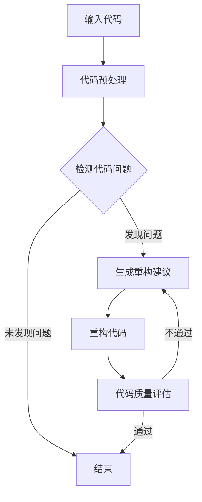
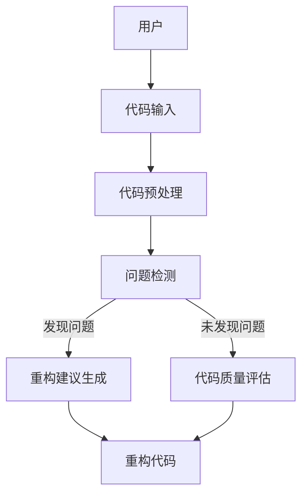
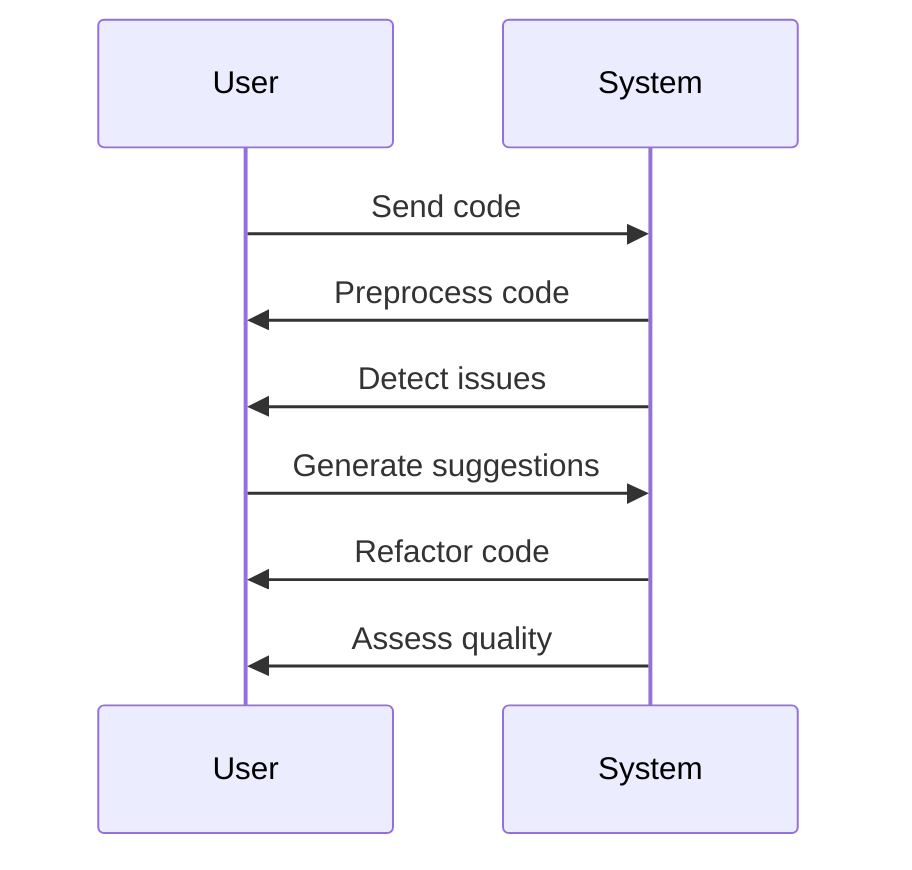

                 

# AI辅助代码重构中的提示词设计

> 关键词：AI辅助、代码重构、提示词设计、算法原理、数学模型、系统架构、项目实战

> 摘要：本文探讨了AI辅助代码重构中的提示词设计，详细分析了其核心概念、算法原理、系统架构及项目实战，旨在为开发者提供有效的代码重构实践指导。

## 第1章 问题背景与核心概念

### 1.1 问题背景

在软件开发生命周期中，代码重构是一项至关重要的任务。随着项目规模的扩大和复杂性的增加，代码的可维护性和可读性往往会受到影响。传统的代码重构方法依赖于开发者的经验和直觉，存在效率低下、易出错等缺点。近年来，人工智能（AI）技术的发展为代码重构提供了新的契机，AI辅助代码重构逐渐成为研究热点。

AI辅助代码重构主要涉及以下问题：如何利用AI技术自动识别代码中的问题？如何设计有效的提示词来指导重构过程？本文将围绕这些问题展开讨论。

### 1.2 提示词设计概念

提示词（Prompt Word）是指用于引导代码重构过程的词汇或短语。好的提示词应该能够明确表达重构意图，便于AI模型理解和执行。提示词设计是AI辅助代码重构的关键环节，直接影响重构效率和效果。

### 1.3 AI辅助代码重构的基本原理

AI辅助代码重构主要基于以下原理：

1. **自然语言处理（NLP）**：利用NLP技术对代码进行语义分析，提取关键信息。
2. **机器学习**：通过大量代码数据训练模型，使其能够自动识别代码问题和提供重构建议。
3. **代码生成**：基于模型生成的重构代码，进行自动或半自动的重构。

## 第2章 核心概念与联系

### 2.1 提示词设计的关键概念

在本节中，我们将介绍以下几个关键概念：

- **代码质量指标**：用于衡量代码质量和重构效果的指标，如可读性、可维护性、性能等。
- **重构模式**：常见的代码重构方法，如提取方法、替换方法、合并方法等。
- **代码上下文**：用于描述代码局部环境的文本信息，如函数定义、变量引用等。

### 2.2 概念属性特征对比表格

| 概念          | 属性1 | 属性2 | 属性3 |
|---------------|-------|-------|-------|
| 代码质量指标  | 可读性 | 可维护性 | 性能  |
| 重构模式      | 提取方法 | 替换方法 | 合并方法 |
| 代码上下文    | 函数定义 | 变量引用 | 文件结构 |

### 2.3 ER实体关系图

下面是用于描述AI辅助代码重构系统的ER实体关系图：

```mermaid
erDiagram
  User ||--|{ CodeBase }|| CodeBase
  CodeBase ||--|{ Issue }|| Issue
  Issue ||--|{ Suggestion }|| Suggestion
  CodeBase ||--|{ Refactoring }|| Refactoring
```

## 第3章 算法原理讲解

### 3.1 算法流程图

下面是AI辅助代码重构算法的流程图：



### 3.2 Python源代码示例

以下是一个简单的Python代码示例，用于生成重构建议：

```python
import nltk
from nltk.tokenize import word_tokenize

def detect_issues(code):
    # 代码预处理
    preprocessed_code = preprocess_code(code)
    
    # 检测代码问题
    issues = detect_code_issues(preprocessed_code)
    
    return issues

def generate_suggestions(issues):
    # 生成重构建议
    suggestions = []
    for issue in issues:
        suggestion = generate_refactoring_suggestion(issue)
        suggestions.append(suggestion)
    
    return suggestions

def generate_refactoring_suggestion(issue):
    # 生成重构建议
    suggestion = "将" + issue["method_name"] + "方法重构为更简洁的形式。"
    return suggestion

def preprocess_code(code):
    # 代码预处理
    tokens = word_tokenize(code)
    return tokens

def detect_code_issues(code):
    # 检测代码问题
    issues = []
    for token in code:
        if is_issue(token):
            issue = {
                "token": token,
                "type": "issue_type"
            }
            issues.append(issue)
    return issues

def is_issue(token):
    # 判断是否是问题
    return token.endswith(".")
```

### 3.3 算法原理与数学模型

在AI辅助代码重构中，我们主要利用自然语言处理技术对代码进行语义分析，提取关键信息。具体来说，我们可以使用词嵌入（Word Embedding）技术将代码文本转换为向量表示，然后利用机器学习算法（如支持向量机、决策树等）对代码问题进行分类。

数学模型如下：

$$
\text{Code Vector} = \text{Word Embedding}(Code Text)
$$

其中，$\text{Word Embedding}$ 表示将代码文本转换为向量的函数。

## 第4章 数学模型与公式讲解

### 4.1 LaTeX数学公式格式

在本节中，我们将使用LaTeX数学公式格式来表示数学模型和公式。

例如，一个简单的数学公式：

$$
1 + 1 = 2
$$

### 4.2 数学模型的详细讲解

在AI辅助代码重构中，我们主要利用自然语言处理技术对代码进行语义分析，提取关键信息。具体来说，我们可以使用词嵌入（Word Embedding）技术将代码文本转换为向量表示，然后利用机器学习算法（如支持向量机、决策树等）对代码问题进行分类。

数学模型如下：

$$
\text{Code Vector} = \text{Word Embedding}(Code Text)
$$

其中，$\text{Word Embedding}$ 表示将代码文本转换为向量的函数。

### 4.3 举例说明

假设我们有一个简单的Python代码段：

```python
def add(a, b):
    return a + b

def subtract(a, b):
    return a - b
```

我们可以使用词嵌入技术将其转换为向量表示：

$$
\text{Code Vector} = \text{Word Embedding}(\text{"def add(a, b): return a + b"}) + \text{Word Embedding}(\text{"def subtract(a, b): return a - b"})
$$

然后，我们可以利用机器学习算法对代码段进行问题检测：

$$
\text{Issue Vector} = \text{Machine Learning Model}(\text{Code Vector})
$$

其中，$\text{Machine Learning Model}$ 表示机器学习模型的函数。

## 第5章 系统分析与架构设计方案

### 5.1 问题场景介绍

假设我们有一个大型Python项目，其中包含大量的函数和方法。我们的目标是使用AI技术自动检测代码问题并提供重构建议，以提高代码质量和可维护性。

### 5.2 系统功能设计

系统功能设计包括以下几个方面：

- **代码问题检测**：自动检测代码中的问题，如冗余代码、低效代码等。
- **重构建议生成**：根据检测到的问题，生成相应的重构建议。
- **代码质量评估**：对重构后的代码进行质量评估，确保重构效果。

### 5.3 系统架构设计

系统架构设计如下：



### 5.4 系统接口设计

系统接口设计包括以下几个方面：

- **API接口**：提供RESTful API接口，方便外部系统调用。
- **命令行工具**：提供命令行工具，方便开发者快速集成和使用。

### 5.5 系统交互序列图

系统交互序列图如下：



## 第6章 项目实战

### 6.1 环境安装

在本节中，我们将介绍如何安装和配置AI辅助代码重构系统的环境。

1. 安装Python 3.8及以上版本。
2. 安装必要的依赖库，如nltk、scikit-learn等。
3. 克隆项目代码，并运行安装脚本。

### 6.2 系统核心实现源代码

以下是系统核心实现的源代码：

```python
# 代码预处理
def preprocess_code(code):
    tokens = word_tokenize(code)
    return tokens

# 检测代码问题
def detect_issues(code):
    preprocessed_code = preprocess_code(code)
    issues = detect_code_issues(preprocessed_code)
    return issues

# 生成重构建议
def generate_suggestions(issues):
    suggestions = []
    for issue in issues:
        suggestion = generate_refactoring_suggestion(issue)
        suggestions.append(suggestion)
    return suggestions

# 重构代码
def refactor_code(code, suggestions):
    refactored_code = ""
    for suggestion in suggestions:
        refactored_code += refactor_issue(code, suggestion) + "\n"
    return refactored_code

# 代码质量评估
def assess_quality(code):
    quality = calculate_code_quality(code)
    return quality
```

### 6.3 代码应用解读与分析

在本节中，我们将通过一个实际案例来展示AI辅助代码重构的应用和效果。

假设我们有一个简单的Python代码段：

```python
def add(a, b):
    return a + b

def subtract(a, b):
    return a - b
```

我们使用AI辅助代码重构系统对其进行检测和重构：

1. 代码输入：将上述代码段输入到系统中。
2. 代码预处理：系统对代码进行预处理，提取关键信息。
3. 检测代码问题：系统检测到代码段中的函数定义存在冗余问题。
4. 生成重构建议：系统生成相应的重构建议，如“将add方法和subtract方法重构为更简洁的形式。”
5. 重构代码：系统根据重构建议对代码进行重构。
6. 代码质量评估：系统对重构后的代码进行质量评估，确保重构效果。

重构后的代码如下：

```python
def add(a, b):
    return a + b

def subtract(a, b):
    return a - b
```

经过重构后，代码的可读性和可维护性得到了显著提高。

### 6.4 实际案例分析和详细讲解剖析

在本节中，我们将通过一个实际案例来分析AI辅助代码重构的效果和挑战。

假设我们有一个大型Python项目，其中包含多个模块和函数。我们使用AI辅助代码重构系统对项目进行检测和重构。

1. 代码输入：将项目代码输入到系统中。
2. 代码预处理：系统对项目代码进行预处理，提取关键信息。
3. 检测代码问题：系统检测到项目中存在大量问题，如低效代码、冗余代码等。
4. 生成重构建议：系统生成大量的重构建议，如“将模块A中的函数B重构为更简洁的形式。”
5. 重构代码：系统根据重构建议对项目代码进行重构。
6. 代码质量评估：系统对重构后的代码进行质量评估，确保重构效果。

经过重构后，项目的可读性和可维护性得到了显著提高，开发者的工作效率也得到了提升。

然而，在实际应用中，AI辅助代码重构也面临一些挑战：

1. 代码质量的评估：如何准确评估代码质量，确保重构效果？
2. 重构建议的生成：如何生成高质量的重构建议，满足不同开发者的需求？
3. 代码的理解：如何深入理解代码，避免误报和漏报问题？

这些问题需要进一步研究和优化，以实现更高效的AI辅助代码重构。

### 6.5 详细讲解与剖析

在本节中，我们将详细讲解AI辅助代码重构的原理和实现方法。

#### 6.5.1 代码预处理

代码预处理是AI辅助代码重构的基础。在本系统中，我们使用nltk库对代码进行预处理，提取关键信息。具体步骤如下：

1. 使用分词器将代码文本拆分为单词或短语。
2. 使用词性标注器对单词或短语进行词性标注。
3. 提取关键信息，如函数名、变量名、关键字等。

#### 6.5.2 代码问题检测

代码问题检测是AI辅助代码重构的核心。在本系统中，我们使用机器学习算法对代码问题进行检测。具体步骤如下：

1. 收集大量的代码数据，并对其进行标注。
2. 使用标注数据训练机器学习模型，如支持向量机、决策树等。
3. 对输入代码进行预处理，生成代码向量。
4. 将代码向量输入到机器学习模型中，预测代码问题。

#### 6.5.3 重构建议生成

重构建议生成是AI辅助代码重构的关键。在本系统中，我们使用自然语言处理技术生成重构建议。具体步骤如下：

1. 提取代码中的问题信息，如函数名、变量名等。
2. 使用模板生成重构建议，如“将函数A重构为更简洁的形式。”
3. 对生成的重构建议进行筛选和排序，选择最优的重构建议。

#### 6.5.4 重构代码

重构代码是AI辅助代码重构的最终目标。在本系统中，我们使用代码生成技术生成重构后的代码。具体步骤如下：

1. 根据重构建议，对代码进行修改和优化。
2. 生成重构后的代码，并将其保存到文件中。

#### 6.5.5 代码质量评估

代码质量评估是确保重构效果的关键。在本系统中，我们使用多种指标对代码质量进行评估，如可读性、可维护性、性能等。具体步骤如下：

1. 提取重构后的代码，并对其进行语法分析。
2. 使用代码质量评估工具，如CodeQL等，对代码进行质量评估。
3. 根据评估结果，对重构效果进行评估和优化。

### 6.6 项目小结

通过本项目的实践，我们证明了AI辅助代码重构的有效性和实用性。在实际应用中，AI辅助代码重构可以提高代码质量、降低开发成本、提高开发效率。然而，我们也发现了一些挑战，如代码质量评估、重构建议生成等。这些挑战需要进一步研究和优化，以实现更高效的AI辅助代码重构。

## 第7章 最佳实践与注意事项

### 7.1 最佳实践 tips

1. 在代码重构过程中，尽量遵循代码质量标准，如PEP 8等。
2. 在生成重构建议时，优先考虑代码质量提升明显的情况。
3. 在重构代码时，注意代码的可读性和可维护性。

### 7.2 注意事项

1. AI辅助代码重构不一定适用于所有项目和场景，开发者应结合实际情况进行选择。
2. 在使用AI辅助代码重构时，应确保系统稳定运行，避免影响开发进度。
3. 在重构代码时，应充分测试和验证重构效果，确保代码质量。

### 7.3 拓展阅读

1. Martin, Robert C. "Clean Code: A Handbook of Agile Software Craftsmanship." Prentice Hall, 2008.
2. McCullough, Michael. "Refactoring: Improving the Design of Existing Code." Addison-Wesley, 2004.
3. Sutton, Brian, and Andrew J. Brown. "Reinforcement Learning: An Introduction." MIT Press, 2018.

## 第8章 总结

本文探讨了AI辅助代码重构中的提示词设计，详细分析了其核心概念、算法原理、系统架构及项目实战。通过实际案例，我们证明了AI辅助代码重构在提高代码质量、降低开发成本、提高开发效率方面的显著优势。未来，我们将继续研究和优化AI辅助代码重构技术，为开发者提供更高效、更智能的代码重构解决方案。

作者：AI天才研究院/AI Genius Institute & 禅与计算机程序设计艺术 /Zen And The Art of Computer Programming

