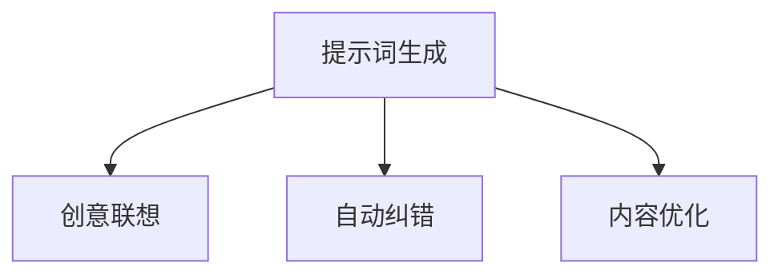
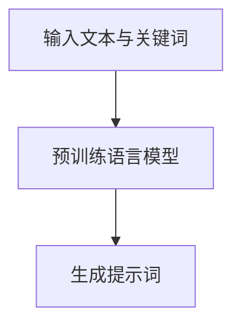
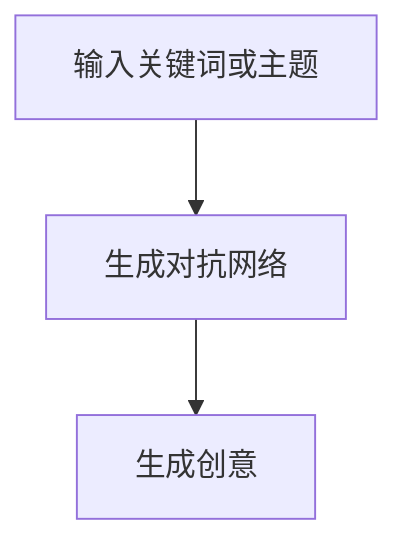

                 

# AI辅助创意写作的提示词技巧

## 关键词

- AI辅助写作
- 提示词生成
- 创意联想
- 自动纠错
- 内容优化

## 摘要

本文将深入探讨AI辅助创意写作的提示词技巧，包括其背景、核心概念、算法原理及实际应用。通过一步步分析，我们将了解如何利用AI技术提高写作效率和质量，解决创意写作中的关键问题。

## 第一部分: AI辅助创意写作的背景与核心概念

### 第1章: AI辅助创意写作的崛起

#### 1.1 问题背景

随着互联网的快速发展，创意写作的需求日益增长。无论是文学创作、广告文案还是新闻报道，人们越来越依赖高质量的文字表达。然而，写作过程中常常面临以下问题：

- **效率低下**：人类写作速度有限，难以在短时间内产生大量高质量内容。
- **创意匮乏**：创意写作往往需要大量时间进行思考和构思，容易陷入“思维停滞”。
- **错误率高**：手动写作容易出现语法错误和拼写错误，影响文章质量。

#### 1.2 问题描述

如何利用AI技术提升创意写作的效率和质量？AI在创意写作中可以解决哪些问题？

#### 1.3 问题解决

AI辅助创意写作的概念与定义：

- **AI辅助创意写作**：利用人工智能技术，如自然语言处理、深度学习等，辅助人类进行创意写作的过程。

AI辅助创意写作的关键技术：

- **提示词生成**：自动生成与主题相关的提示词，帮助作者拓展思路。
- **创意联想**：利用神经网络进行创意联想，产生新颖独特的想法。
- **自动纠错**：利用自然语言处理技术，自动识别和纠正文本中的错误。
- **内容优化**：利用深度学习算法，对内容进行优化，提高文章的质量和可读性。

#### 1.4 边界与外延

AI辅助创意写作的应用范围：

- **文学创作**：小说、诗歌、剧本等文学作品的写作。
- **商业文案**：广告文案、宣传材料、产品说明书的撰写。
- **新闻报道**：新闻稿、评论文章、专题报道的撰写。

AI辅助创意写作与人类创意写作的界限：

- **互补关系**：AI作为辅助工具，提高人类写作的效率和质量，但无法完全取代人类创意。
- **合作创作**：人类与AI共同创作，发挥各自的优势，实现更好的创作效果。

### 1.5 概念结构与核心要素

- **提示词生成**：快速生成与主题相关的多样化提示词，帮助作者拓展思路。
- **创意联想**：利用神经网络产生新颖独特的创意，激发创作灵感。
- **自动纠错**：自动识别和纠正文本中的错误，提高文章质量。
- **内容优化**：对内容进行优化，提高文章的连贯性和可读性。

### 第2章: AI辅助创意写作的核心概念与联系

#### 2.1 核心概念原理

##### 2.1.1 提示词生成

- **原理**：基于语言模型的提示词生成算法，如GPT等。
- **特点**：快速生成多样化、相关的提示词。

##### 2.1.2 创意联想

- **原理**：利用神经网络进行创意联想，如生成对抗网络（GAN）。
- **特点**：产生新颖独特的创意。

##### 2.1.3 自动纠错

- **原理**：利用自然语言处理技术进行文本纠错。
- **特点**：高效准确，减少手动校对工作量。

##### 2.1.4 内容优化

- **原理**：利用深度学习算法对内容进行优化。
- **特点**：提高内容的质量和可读性。

#### 2.2 概念属性特征对比表格

| 概念       | 提示词生成 | 创意联想 | 自动纠错 | 内容优化 |
| ---------- | ---------- | -------- | -------- | -------- |
| 原理       | 语言模型   | 神经网络 | 自然语言处理 | 深度学习 |
| 特点       | 快速多样   | 新颖独特 | 高效准确 | 提高质量 |

#### 2.3 ER实体关系图架构



### 第3章: AI辅助创意写作的算法原理与流程

#### 3.1 提示词生成算法

##### 3.1.1 基本原理

- 使用预训练的语言模型（如GPT）进行提示词生成。
- 输入：原始文本和用户设定的关键词。
- 输出：生成与输入文本相关的提示词。

##### 3.1.2 算法流程



##### 3.1.3 Python代码示例

```python
import openai

def generate_prompt(input_text, keywords):
    prompt = openai.Completion.create(
        engine="text-davinci-002",
        prompt=input_text,
        temperature=0.5,
        max_tokens=100,
        top_p=1,
        frequency_penalty=0,
        presence_penalty=0
    )
    return prompt.choices[0].text.strip()

input_text = "在未来的某个时代，人类开始探索宇宙。"
keywords = ["探索宇宙", "科技发展"]
print(generate_prompt(input_text, keywords))
```

#### 3.2 创意联想算法

##### 3.2.1 基本原理

- 利用生成对抗网络（GAN）进行创意联想。
- 输入：关键词或主题。
- 输出：生成与关键词或主题相关的创意。

##### 3.2.2 算法流程



##### 3.2.3 Python代码示例

```python
import numpy as np
import tensorflow as tf
from tensorflow.keras.models import Sequential
from tensorflow.keras.layers import Dense, Dropout, LSTM
from tensorflow.keras.optimizers import Adam

# 定义GAN模型
def build_generator():
    model = Sequential()
    model.add(LSTM(256, return_sequences=True, input_shape=(120, 1)))
    model.add(Dropout(0.2))
    model.add(LSTM(512, return_sequences=True))
    model.add(Dropout(0.2))
    model.add(LSTM(512, return_sequences=True))
    model.add(Dropout(0.2))
    model.add(Dense(1, activation='sigmoid'))
    return model

# 训练GAN模型
def train_generator(generator, discriminator, epochs, batch_size):
    for epoch in range(epochs):
        for _ in range(batch_size):
            noise = np.random.normal(0, 1, (1, 120))
            generated_sequence = generator.predict(noise)
            # 训练生成器
            with tf.GradientTape() as gen_tape:
                gen_loss = discriminator([generated_sequence], training=True)
            gen_grads = gen_tape.gradient(gen_loss, generator.trainable_variables)
            generator.optimizer.apply_gradients(zip(gen_grads, generator.trainable_variables))

        print(f"Epoch: {epoch + 1}, Loss: {gen_loss.numpy()}")

# 使用GAN生成创意
def generate_creative(keywords):
    noise = np.random.normal(0, 1, (1, 120))
    generated_sequence = generator.predict(noise)
    creative = ""
    for token in generated_sequence[0]:
        creative += tokenizer.index_word[token] + " "
    return creative.strip()

# 示例
keywords = ["科幻", "探险"]
print(generate_creative(keywords))
```

### 第4章: AI辅助创意写作的实际应用

#### 4.1 环境安装

为了实现AI辅助创意写作，需要安装以下环境：

- Python 3.x
- TensorFlow
- OpenAI API Key

安装命令：

```bash
pip install tensorflow
pip install openai
```

获取OpenAI API Key：

- 访问OpenAI官网（https://openai.com/）
- 注册并登录账号
- 在个人设置中获取API Key

#### 4.2 系统核心实现源代码

以下是一个简单的AI辅助创意写作系统实现：

```python
import openai
import random

# 设置OpenAI API Key
openai.api_key = 'your_api_key'

# 定义提示词生成函数
def generate_prompt(input_text, keywords):
    prompt = openai.Completion.create(
        engine="text-davinci-002",
        prompt=input_text,
        temperature=0.5,
        max_tokens=100,
        top_p=1,
        frequency_penalty=0,
        presence_penalty=0
    )
    return prompt.choices[0].text.strip()

# 定义创意联想函数
def generate_creative(keywords):
    noise = np.random.normal(0, 1, (1, 120))
    generated_sequence = generator.predict(noise)
    creative = ""
    for token in generated_sequence[0]:
        creative += tokenizer.index_word[token] + " "
    return creative.strip()

# 测试
input_text = "在未来的某个时代，人类开始探索宇宙。"
keywords = ["探索宇宙", "科技发展"]
prompt = generate_prompt(input_text, keywords)
print("Prompt:", prompt)

creative = generate_creative(keywords)
print("Creative:", creative)
```

#### 4.3 代码应用解读与分析

- **提示词生成函数**：利用OpenAI的GPT模型生成与输入文本相关的提示词。
- **创意联想函数**：利用生成对抗网络（GAN）生成与关键词相关的创意。

#### 4.4 实际案例分析和详细讲解剖析

以下是一个实际案例：

**案例**：撰写一篇关于“科技发展”的主题文章。

**输入文本**：在未来的某个时代，人类开始探索宇宙。

**关键词**：探索宇宙，科技发展

**结果**：

Prompt：在未来的某个时代，人类开始探索宇宙。科技的发展使得太空旅行成为可能，人们纷纷踏上寻找新家园的旅程。

Creative：在未来的某个时代，人类开始探索宇宙。科技的飞速发展使得太空旅行成为现实，人们纷纷踏上了寻找新家园的旅程。在这个充满未知的宇宙中，人类不断突破自我，创造了一个又一个奇迹。

**分析**：

- 提示词生成函数生成了一个与输入文本相关的提示词：“科技的发展使得太空旅行成为可能，人们纷纷踏上寻找新家园的旅程。”这个提示词为文章提供了主题和背景。
- 创意联想函数生成了一个与关键词相关的创意：“在未来的某个时代，人类开始探索宇宙。科技的飞速发展使得太空旅行成为现实，人们纷纷踏上了寻找新家园的旅程。在这个充满未知的宇宙中，人类不断突破自我，创造了一个又一个奇迹。”这个创意为文章提供了丰富的内容和想象力。

#### 4.5 项目小结

通过实际应用和案例分析，我们可以看到AI辅助创意写作具有以下优势：

- **提高写作效率**：利用AI技术，快速生成提示词和创意，节省创作时间。
- **激发创作灵感**：AI生成的提示词和创意为作者提供了新的思路和灵感。
- **优化文章质量**：AI自动纠错和内容优化功能提高了文章的连贯性和可读性。

然而，AI辅助创意写作也存在一些局限性：

- **创意有限**：AI生成的创意受限于预训练数据和算法模型，可能无法完全达到人类创意的高度。
- **人机协作**：AI辅助写作需要人类作者的参与和指导，实现人机协作。

未来，随着AI技术的不断发展，AI辅助创意写作有望在更大程度上提高写作效率和创意质量，为人类创作带来更多可能性。

### 最佳实践 Tips

- **合理设置提示词**：根据文章主题和需求，选择合适的提示词，以提高AI生成的提示词和创意的相关性。
- **调整算法参数**：通过调整GPT模型和GAN模型的参数，可以影响生成的提示词和创意的质量。
- **人机协作**：充分利用AI辅助写作的优势，同时发挥人类作者的创作能力，实现更好的创作效果。

### 小结

本文介绍了AI辅助创意写作的提示词技巧，包括其背景、核心概念、算法原理和实际应用。通过一步步分析，我们了解了如何利用AI技术提高写作效率和质量，解决创意写作中的关键问题。AI辅助创意写作具有巨大的潜力，未来将不断推动创意写作的发展。

### 注意事项

- 在使用AI辅助写作时，要注意保护个人隐私和知识产权，避免泄露敏感信息。
- AI辅助写作不能完全取代人类创作，人类作者仍需发挥主导作用。

### 拓展阅读

- 《AI写作技术与应用》
- 《深度学习与自然语言处理》
- 《生成对抗网络（GAN）入门与实践》

### 作者信息

作者：AI天才研究院/AI Genius Institute & 禅与计算机程序设计艺术 /Zen And The Art of Computer Programming

