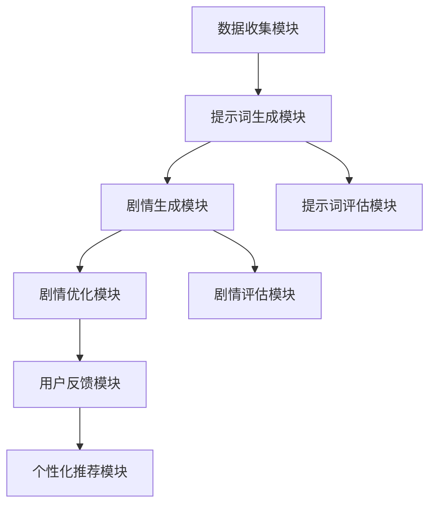

                 

### 引言

在当今的数字娱乐行业中，游戏设计逐渐成为了创意与技术的交汇点。游戏剧情设计作为游戏体验的核心组成部分，其创意与设计的质量直接影响到玩家的沉浸感和满意度。然而，传统的游戏剧情设计过程往往依赖设计师的个人经验和直觉，存在着创意枯竭和设计效率低下的问题。随着人工智能（AI）技术的迅猛发展，利用AI辅助游戏剧情设计成为了一个新兴且具有前景的研究领域。

AI辅助游戏剧情设计不仅能够提高创意生成效率，还能通过个性化推荐和动态剧情调整提升用户体验。在这其中，提示词（Prompt Words）成为了一个关键概念。提示词作为触发创意思维的起点，能够引导AI模型生成丰富多样的剧情内容。本文将围绕AI辅助创意游戏剧情设计中的提示词技巧展开讨论，通过逻辑清晰、结构紧凑、简单易懂的专业技术语言，深入分析这一领域的核心概念和实际应用。

本文旨在帮助游戏设计师、AI开发者及相关从业者理解AI辅助游戏剧情设计的基本原理，掌握提示词的有效生成与优化策略，以及如何在实际项目中应用这些技术。通过逐步分析推理，我们将揭示AI和提示词技术在游戏剧情设计中的巨大潜力，并为未来研究提供方向和启示。

关键词：AI游戏剧情设计、提示词、生成式AI、深度学习、剧情生成、优化策略。

摘要：本文探讨了AI辅助创意游戏剧情设计中的提示词技巧，分析了AI与游戏剧情设计的关系，介绍了提示词的概念与分类，探讨了提示词生成与优化的方法，并通过实际案例展示了AI辅助游戏剧情设计的应用效果。文章还提出了最佳实践和注意事项，为未来研究提供了参考。

### 目录大纲

本文将分为四个主要部分，分别从背景介绍、核心概念与联系、算法原理与系统设计以及项目实战四个角度，系统地探讨AI辅助创意游戏剧情设计中的提示词技巧。

**第一部分：背景介绍**

- 第1章 AI与游戏剧情设计的概述
  - 1.1.1 问题背景
  - 1.1.2 问题描述
  - 1.1.3 问题解决
  - 1.1.4 边界与外延
  - 1.1.5 概念结构与核心要素组成

- 第2章 AI基础
  - 2.1.1 人工智能的定义与历史发展
  - 2.1.2 机器学习与深度学习
  - 2.1.3 神经网络与深度学习框架

**第二部分：核心概念与联系**

- 第3章 核心概念与联系
  - 3.1.1 提示词的概念与分类
  - 3.1.2 提示词的属性特征对比表格
  - 3.1.3 ER实体关系图架构

- 第4章 提示词生成与优化
  - 4.1.1 提示词生成方法
  - 4.1.2 提示词优化的策略

**第三部分：算法原理与系统设计**

- 第5章 算法原理与系统设计
  - 5.1.1 算法原理讲解
  - 5.1.2 数学模型与公式
  - 5.1.3 举例说明

- 第6章 系统分析与架构设计
  - 6.1.1 问题场景介绍
  - 6.1.2 系统功能设计
  - 6.1.3 系统架构设计
  - 6.1.4 系统接口设计与交互

**第四部分：项目实战**

- 第7章 项目实战
  - 7.1.1 环境安装
  - 7.1.2 系统核心实现
  - 7.1.3 代码应用解读与分析
  - 7.1.4 实际案例分析与讲解
  - 7.1.5 项目小结

- 第8章 最佳实践与总结
  - 8.1.1 最佳实践Tips
  - 8.1.2 小结
  - 8.1.3 注意事项
  - 8.1.4 拓展阅读

通过上述结构，本文将逐步深入探讨AI辅助游戏剧情设计中的提示词技巧，帮助读者全面理解这一领域的核心知识和应用方法。接下来，我们将首先介绍AI与游戏剧情设计的基本背景。

### 第一部分：背景介绍

#### 第1章 AI与游戏剧情设计的概述

**1.1.1 问题背景**

游戏剧情设计是游戏开发过程中至关重要的一环。一个富有吸引力和深度的剧情不仅能够提升游戏的沉浸感和娱乐性，还能够增强玩家的忠诚度和复玩率。然而，传统的游戏剧情设计主要依赖于设计师的个人经验和直觉，这样的设计方法存在着创意枯竭和效率低下的问题。设计师往往需要花费大量时间和精力进行构思和创作，而创意的生成往往具有一定的随机性和不可预测性，这无疑增加了设计成本和时间压力。

随着人工智能（AI）技术的快速发展，AI在多个领域的应用已经取得了显著的成果，尤其是在自然语言处理和生成式模型方面。AI技术的引入为游戏剧情设计带来了新的可能性。通过利用AI算法，设计师可以自动化地生成剧情内容，从而提高设计效率和创意质量。例如，AI可以根据玩家的行为和偏好，动态调整剧情走向，实现个性化推荐和体验优化。

**1.1.2 问题描述**

AI辅助游戏剧情设计的核心问题在于如何有效地利用AI技术生成具有创意和逻辑性的剧情内容。具体来说，这个问题可以从以下几个方面进行描述：

1. **创意生成**：如何利用AI技术激发设计师的创意思维，生成新颖和独特的剧情元素？
2. **剧情连贯性**：AI生成的剧情内容是否能够保持逻辑连贯性，避免出现剧情断裂或者不合理的情况？
3. **优化策略**：如何对AI生成的剧情进行优化，使其更符合游戏设计的整体风格和目标？
4. **用户体验**：AI生成的剧情如何提升玩家的游戏体验，增加玩家的沉浸感和满意度？

**1.1.3 问题解决**

针对上述问题，我们可以通过以下几个方法来解决：

1. **提示词技术**：提示词作为AI模型的输入，能够引导AI生成符合设计预期的剧情内容。通过设计有效的提示词，可以激发AI模型的创造力，生成多样化的剧情。
2. **生成式模型**：利用生成式模型，如生成对抗网络（GAN）和变分自编码器（VAE），可以生成具有连贯性和逻辑性的剧情内容。这些模型通过对大量游戏剧情数据的训练，能够学习到剧情的生成规律和模式。
3. **优化算法**：通过优化算法，如遗传算法和强化学习，可以对AI生成的剧情进行迭代优化，使其更符合游戏设计的目标和风格。这些算法能够通过评估和调整剧情内容，提高剧情的吸引力和逻辑性。
4. **用户体验反馈**：通过收集和分析玩家的游戏体验反馈，可以不断优化AI生成的剧情内容，使其更符合玩家的需求和偏好。这样的反馈循环可以帮助AI模型不断学习和改进，提升剧情设计的质量。

**1.1.4 边界与外延**

虽然AI辅助游戏剧情设计具有巨大的潜力，但这一领域仍然存在一些边界和限制。首先，游戏剧情设计是一个高度创意和个性化的过程，AI技术虽然能够辅助生成剧情内容，但无法完全取代设计师的创造性工作。其次，AI模型的训练和优化需要大量的数据和计算资源，这在实际应用中可能存在一定的限制。此外，AI生成的剧情内容需要经过严格的质量评估和审核，以确保其符合游戏设计的目标和标准。

**1.1.5 概念结构与核心要素组成**

在AI辅助游戏剧情设计中，核心概念和要素包括：

1. **人工智能技术**：包括机器学习、深度学习和生成式模型等，这些技术为剧情生成和优化提供了基础。
2. **提示词**：提示词作为AI模型的输入，是触发创意思维和生成剧情内容的关键。
3. **生成式模型**：生成式模型能够根据提示词生成连贯和富有创意的剧情内容。
4. **优化算法**：优化算法用于对生成的剧情内容进行迭代优化，提高其质量和吸引力。
5. **用户体验反馈**：通过玩家体验反馈，可以不断改进AI生成的剧情内容，提升用户体验。

通过上述分析和讨论，我们可以看到，AI辅助游戏剧情设计具有广阔的应用前景，但也需要克服一系列挑战。接下来，我们将进一步探讨人工智能的基础知识，为深入理解AI辅助游戏剧情设计奠定基础。

#### 第2章 AI基础

**2.1.1 人工智能的定义与历史发展**

人工智能（Artificial Intelligence，简称AI）是一门涉及计算机科学、数学、认知科学和心理学等多个领域的交叉学科，旨在创建能够模拟、延伸和扩展人类智能的理论、算法和技术。自20世纪50年代人工智能概念首次提出以来，人工智能技术经历了多个发展阶段。

早期的人工智能研究主要集中在规则推理和知识表示方面，代表性的工作包括1956年达特茅斯会议提出的“符号人工智能”概念。这一时期，人工智能主要依赖于基于规则的方法，通过手工编写规则来模拟人类的推理过程。

随着计算能力的提升和数据规模的扩大，20世纪80年代和90年代，人工智能进入了基于数据的阶段，以机器学习为核心。机器学习通过从数据中学习模式和规律，逐步取代了传统的规则推理方法。1986年，神经网络（Neural Networks）的出现标志着深度学习的诞生，深度学习通过多层神经网络的结构，能够自动提取特征并生成复杂的模型。

进入21世纪，人工智能迎来了新的发展机遇。特别是深度学习的突破，使得AI在图像识别、语音识别、自然语言处理等领域取得了显著的进展。2012年，AlexNet在ImageNet图像识别竞赛中取得了突破性的成绩，深度学习技术开始广泛应用于各个行业。

**2.1.2 机器学习与深度学习**

机器学习（Machine Learning，简称ML）是人工智能的核心技术之一，其主要目标是让计算机系统能够从数据中学习并作出决策。机器学习的过程可以分为三个主要阶段：数据收集、数据预处理和模型训练。

数据收集：机器学习依赖于大量高质量的数据集，这些数据集可以是结构化的（如数据库）、半结构化的（如日志文件）或非结构化的（如图像、文本和视频）。

数据预处理：在训练模型之前，需要对数据进行清洗、归一化和特征提取等处理。数据预处理的质量直接影响到模型的性能和泛化能力。

模型训练：通过选择合适的算法，如线性回归、决策树、支持向量机（SVM）和神经网络等，训练模型以识别数据中的模式和规律。训练过程通常包括数据分割、参数优化和模型评估等步骤。

深度学习（Deep Learning，简称DL）是机器学习的一个重要分支，其核心思想是通过多层神经网络（Neural Networks）来提取特征和生成复杂模型。深度学习的基本单位是神经元（Neuron），每个神经元通过加权连接与前一层的神经元相连，并通过激活函数进行非线性变换。

深度学习模型的主要组成部分包括：

- **输入层**：接收外部输入数据，如图像像素、文本词向量等。
- **隐藏层**：多层隐藏层能够逐层提取数据的高级特征，隐藏层的数量和神经元数量可以根据问题复杂度进行调整。
- **输出层**：生成最终的输出结果，如分类标签、预测值等。

**2.1.3 神经网络与深度学习框架**

神经网络（Neural Networks，简称NN）是一种模拟生物神经系统的计算模型，通过模拟神经元之间的连接和交互来处理信息。一个基本的神经网络由输入层、隐藏层和输出层组成，每个层由多个神经元构成。

神经网络的计算过程可以分为以下几个步骤：

1. **前向传播（Forward Propagation）**：输入数据通过输入层传递到隐藏层，每层神经元根据输入和权重计算激活值，并传递到下一层。
2. **反向传播（Backpropagation）**：计算输出结果与实际结果之间的误差，并将误差反向传播回网络，通过调整权重和偏置来优化模型参数。

深度学习框架（Deep Learning Frameworks）是为了简化深度学习模型开发和训练过程而设计的软件库。常见的深度学习框架包括TensorFlow、PyTorch、Keras等。

- **TensorFlow**：由Google开发，是一个开源的端到端学习平台，支持多种深度学习模型和任务。
- **PyTorch**：由Facebook开发，是一个灵活且易于使用的深度学习框架，其动态计算图机制（Dynamic Computational Graphs）使其在研究和开发中具有很高的灵活性。
- **Keras**：是一个高级神经网络API，构建在TensorFlow和Theano之上，提供了更加用户友好的接口。

**神经网络在游戏剧情设计中的应用**

神经网络在游戏剧情设计中具有广泛的应用前景，特别是在剧情生成和优化方面。以下是一些具体的案例：

1. **剧情生成**：通过训练基于神经网络的生成模型，可以自动生成丰富多彩的剧情内容。这些模型可以从大量已有游戏剧情数据中学习，生成符合设计预期的剧情。
2. **剧情优化**：神经网络可以用于评估和优化剧情内容。例如，通过训练一个基于生成对抗网络（GAN）的模型，可以自动优化剧情的连贯性和逻辑性，提高玩家的游戏体验。
3. **个性化推荐**：神经网络可以根据玩家的行为和偏好，推荐个性化的剧情走向，增加玩家的沉浸感和满意度。

通过上述讨论，我们可以看到，人工智能技术的发展为游戏剧情设计带来了新的可能性。深度学习和神经网络等技术的引入，使得AI能够更好地辅助游戏设计师，生成富有创意和逻辑性的剧情内容。在接下来的章节中，我们将进一步探讨AI辅助游戏剧情设计中的核心概念和联系。

#### 第3章 核心概念与联系

**3.1.1 提示词的概念与分类**

提示词（Prompt Words）是AI辅助游戏剧情设计中的一个核心概念，它作为AI模型的输入，能够引导AI生成符合设计预期的剧情内容。提示词可以是单个单词、短语或者句子，其作用是激发AI模型的创造力，提供剧情生成的方向和基础。

根据用途和功能的不同，提示词可以大致分为以下几类：

1. **主题型提示词**：这类提示词主要用于定义剧情的主题和核心概念，如“冒险”、“爱情”、“科幻”等。主题型提示词为AI模型提供了创作的大方向，帮助生成与主题相关的剧情元素。

2. **情感型提示词**：情感型提示词用于设定剧情的情感基调，如“紧张”、“温馨”、“悲伤”等。通过情感型提示词，AI模型可以生成符合特定情感氛围的剧情内容，增强玩家的情感体验。

3. **角色型提示词**：这类提示词用于描述游戏中的主要角色或角色特征，如“勇敢的战士”、“聪明的科学家”、“邪恶的魔法师”等。角色型提示词可以帮助AI模型构建具有特定性格和行为的角色，丰富剧情的情节和互动。

4. **场景型提示词**：场景型提示词用于定义剧情发生的具体环境，如“城堡”、“森林”、“太空”等。场景型提示词为AI模型提供了创作场景的背景，帮助生成与场景相关的剧情细节。

**3.1.2 提示词的属性特征对比表格**

为了更好地理解不同类型提示词的属性特征，我们可以通过一个对比表格进行详细展示。以下是几种主要类型提示词的属性特征对比：

| 提示词类型 | 描述 | 创造性 | 针对性 | 适应性 | 连贯性 |
| :---: | :---: | :---: | :---: | :---: | :---: |
| 主题型 | 定义剧情主题 | 较高 | 较高 | 较低 | 较高 |
| 情感型 | 设定剧情情感基调 | 中等 | 中等 | 较低 | 中等 |
| 角色型 | 描述游戏角色 | 较高 | 较高 | 较高 | 中等 |
| 场景型 | 定义剧情发生场景 | 中等 | 较高 | 较高 | 较高 |

通过上述对比表格，我们可以看到不同类型的提示词在创造性、针对性、适应性和连贯性等方面各有特点，这些特征在剧情生成过程中发挥着重要作用。

**3.1.3 ER实体关系图架构**

为了更清晰地展示提示词与游戏剧情设计中的其他元素之间的关联，我们可以使用实体关系图（Entity-Relationship Diagram，简称ER图）进行描述。ER图是一种用于描述实体及其关系的数据库建模工具，可以帮助我们理解提示词在剧情设计中的角色和作用。

以下是一个简化的ER实体关系图，展示了提示词与主题、角色、场景等元素之间的关联：

```mermaid
erDiagram
    A 提示词 ||--|{ B 主题 }
    A 提示词 ||--|{ C 角色 }
    A 提示词 ||--|{ D 场景 }
    B 主题 ||--|{ E 剧情 }
    C 角色||--|{ F 角色-行为 }
    D 场景||--|{ G 场景-事件 }
    E 剧情 ||--|{ H 玩家体验 }
```

在这个ER图中，提示词（A）作为核心实体，与主题（B）、角色（C）和场景（D）等子实体建立关联。这些子实体进一步与剧情（E）、角色行为（F）和场景事件（G）等具体元素相关联，最终影响玩家的体验（H）。

通过上述讨论，我们可以看到，提示词作为AI辅助游戏剧情设计中的核心概念，具有多种类型和属性特征。利用ER图，我们能够更直观地理解提示词与其他剧情设计元素之间的复杂关系。在接下来的章节中，我们将进一步探讨如何生成和优化提示词，以提升AI辅助游戏剧情设计的质量和效果。

### 第4章 提示词生成与优化

**4.1.1 提示词生成方法**

生成提示词是AI辅助游戏剧情设计的重要环节，其核心目标是通过特定的方法和技术，从大量数据中提取出有创意和实用性的提示词。提示词的生成方法可以分为生成式模型和判别式模型两大类。

**生成式模型**：生成式模型通过学习数据生成过程，直接生成新的提示词。常见的生成式模型包括变分自编码器（Variational Autoencoder，VAE）和生成对抗网络（Generative Adversarial Network，GAN）。VAE通过编码器和解码器的配合，学习数据的高斯分布，从而生成新的提示词。GAN则通过生成器和判别器的对抗训练，使生成器能够生成越来越接近真实数据的提示词。

- **VAE生成提示词过程**：
  1. **编码器（Encoder）**：将提示词映射到一个潜在空间，提取其特征。
  2. **解码器（Decoder）**：从潜在空间中生成新的提示词，将其映射回原始空间。
  3. **重参数化**：通过重参数化技巧，使得模型能够在潜在空间中生成多样化的提示词。

- **GAN生成提示词过程**：
  1. **生成器（Generator）**：生成新的提示词，使其尽量接近真实数据。
  2. **判别器（Discriminator）**：判断生成的提示词是否真实，并反馈给生成器。
  3. **对抗训练**：生成器和判别器相互对抗，通过不断调整参数，使生成器的提示词越来越真实。

**判别式模型**：判别式模型则通过学习数据分布，判断输入提示词的真实性或质量。常见的判别式模型包括决策树、支持向量机（SVM）和神经网络等。判别式模型通常用于评估和筛选生成的提示词，确保其符合设计预期。

- **决策树生成提示词过程**：
  1. **特征提取**：从输入数据中提取关键特征。
  2. **划分节点**：根据特征值将数据集划分成多个子集。
  3. **分类决策**：根据节点的分类结果生成提示词。

- **SVM生成提示词过程**：
  1. **特征空间映射**：将输入提示词映射到高维特征空间。
  2. **分类边界**：找到最佳分类边界，区分真实提示词和虚假提示词。
  3. **生成提示词**：根据分类边界生成新的提示词。

- **神经网络生成提示词过程**：
  1. **输入层**：接收输入提示词。
  2. **隐藏层**：通过多层神经网络提取特征，并进行非线性变换。
  3. **输出层**：判断输入提示词的真实性或质量，并生成新的提示词。

**4.1.2 提示词优化的策略**

生成出高质量的提示词后，优化提示词的质量和适用性是提升AI辅助游戏剧情设计效果的关键。以下是一些常见的提示词优化策略：

1. **提示词质量评估**：通过设定特定的评估指标，如提示词的多样性、连贯性和吸引力等，对生成的提示词进行评估。常用的评估方法包括自动评估（如BLEU、ROUGE等指标）和人工评估（如专家评分、用户反馈等）。

2. **反馈机制**：引入用户反馈或专家意见，对生成的提示词进行迭代优化。通过不断调整和改进提示词，使其更符合设计预期和玩家需求。

3. **协同过滤**：利用协同过滤算法，根据用户的兴趣和行为，推荐相关的提示词。协同过滤可以通过分析用户的历史数据和偏好，为用户提供个性化的提示词推荐。

4. **进化算法**：利用进化算法，如遗传算法（GA）和遗传规划（GP），对提示词进行优化。进化算法通过模拟自然选择过程，逐步优化提示词的基因编码，提高提示词的质量和适应性。

5. **转移学习**：通过转移学习（Transfer Learning）技术，利用预训练的深度神经网络模型（如BERT、GPT等），对提示词进行微调。转移学习可以大大减少训练数据的需求，并提高提示词生成模型的性能和泛化能力。

**4.1.3 提示词优化的案例分析**

为了更好地理解提示词优化的实际应用，以下是一个具体的案例分析：

案例背景：某款角色扮演游戏（RPG）的剧情设计过程中，需要生成一系列富有创意和情感基调的提示词，以引导剧情的走向和玩家体验。

**步骤1：数据收集**  
收集大量已存在的游戏剧情数据，包括角色描述、场景描述、情感标签等。这些数据用于训练和评估提示词生成模型。

**步骤2：模型训练**  
使用生成对抗网络（GAN）和变分自编码器（VAE）等生成式模型，对收集的数据进行训练，生成初步的提示词。

**步骤3：提示词评估**  
通过设定评估指标（如BLEU、ROUGE等）对生成的提示词进行评估，评估其多样性、连贯性和吸引力。

**步骤4：反馈与优化**  
根据评估结果，引入用户反馈和专家意见，对生成的提示词进行迭代优化。例如，针对提示词的连贯性不足，可以通过增加情感标签或角色描述来改进。

**步骤5：协同过滤与进化算法**  
利用协同过滤算法，根据玩家的兴趣和行为，推荐相关的提示词。同时，使用遗传算法对提示词进行优化，进一步提高其质量。

通过上述案例，我们可以看到，提示词生成与优化是一个动态迭代的过程，通过多种技术手段和策略，可以不断提高提示词的质量和适用性，从而提升AI辅助游戏剧情设计的整体效果。

### 第5章 算法原理与系统设计

**5.1.1 算法原理讲解**

为了深入理解AI辅助游戏剧情设计的算法原理，我们首先需要探讨生成式模型的工作原理，这里以生成对抗网络（GAN）为例进行详细解释。

生成对抗网络（Generative Adversarial Network，GAN）由生成器（Generator）和判别器（Discriminator）两部分组成，二者通过对抗训练相互竞争，从而生成高质量的数据。

**生成器（Generator）**：生成器的目标是生成尽可能真实的数据，以欺骗判别器。其工作原理如下：

1. **输入噪声**：生成器接收一个随机噪声向量作为输入，这个噪声向量代表了数据生成的基础。
2. **生成数据**：生成器通过一个复杂的神经网络结构将噪声向量映射成数据。例如，在图像生成任务中，生成器可以将噪声向量映射成像素值，生成逼真的图像。
3. **输出调整**：生成器不断调整其参数，使其生成的数据越来越接近真实数据。

**判别器（Discriminator）**：判别器的目标是区分真实数据和生成数据。其工作原理如下：

1. **输入数据**：判别器接收一对输入数据，一个是真实数据，另一个是生成数据。
2. **判断真假**：判别器通过一个复杂的神经网络结构对输入数据进行分析，判断其是否真实。如果输入数据是真实的，判别器输出一个接近1的值；如果输入数据是生成的，判别器输出一个接近0的值。
3. **反馈调整**：判别器根据其判断结果不断调整其参数，使其对真实数据和生成数据的区分能力越来越强。

**对抗训练**：生成器和判别器通过对抗训练相互竞争，具体过程如下：

1. **生成数据**：生成器生成一批新的数据。
2. **判别器训练**：判别器使用真实数据和生成数据进行训练，通过调整参数，提高对真实数据和生成数据的区分能力。
3. **生成器训练**：生成器使用判别器的错误反馈进行训练，通过调整参数，使其生成的数据越来越接近真实数据。
4. **迭代优化**：上述过程不断迭代，生成器和判别器相互竞争，逐步提升各自的表现。

通过对抗训练，生成器和判别器相互促进，最终生成器能够生成高质量的数据，判别器能够准确区分真实数据和生成数据。

**5.1.2 数学模型与公式**

为了更好地理解GAN的数学原理，我们引入以下数学模型和公式。

**生成器G的生成过程**：

\[ X_G = G(Z) \]

其中，\( X_G \) 是生成器生成的数据，\( Z \) 是输入噪声向量，\( G \) 是生成器的神经网络模型。

**判别器D的判断过程**：

\[ D(X) = S(D(X)) \]

\[ D(G(Z)) = S(D(G(Z))) \]

其中，\( X \) 是真实数据，\( G(Z) \) 是生成器生成的数据，\( D \) 是判别器的神经网络模型，\( S \) 是激活函数，通常使用 sigmoid 函数。

**对抗训练的目标函数**：

\[ \min_G \max_D V(D, G) \]

\[ V(D, G) = E_{x \sim p_{data}(x)}[\log D(x)] + E_{z \sim p_z(z)}[\log (1 - D(G(z)))] \]

其中，\( V(D, G) \) 是生成器和判别器的联合损失函数，\( p_{data}(x) \) 是真实数据分布，\( p_z(z) \) 是噪声分布。

通过优化上述目标函数，生成器和判别器不断调整参数，实现对抗训练。

**5.1.3 举例说明**

为了更直观地理解GAN的工作原理，我们通过一个简单的图像生成案例进行说明。

假设我们希望使用GAN生成一张逼真的猫的图片。

1. **生成器G**：生成器接收一个随机噪声向量\( Z \)，通过一个复杂的神经网络结构生成猫的图片\( X_G \)。

2. **判别器D**：判别器接收一张真实猫的图片\( X \)和一张生成猫的图片\( X_G \)，通过一个神经网络结构判断其是否真实。

3. **对抗训练**：通过对抗训练，生成器和判别器不断迭代，生成器逐渐学会生成更加真实的猫的图片，而判别器逐渐学会准确区分真实猫和生成猫的图片。

4. **结果展示**：经过多次迭代后，生成器可以生成几乎与真实猫图片无法区分的图像。

这个案例展示了GAN在图像生成任务中的基本应用原理，类似的原理可以应用于文本生成、语音合成等任务。

通过上述讨论，我们可以看到，GAN作为生成式模型，通过生成器和判别器的对抗训练，能够生成高质量的数据。在AI辅助游戏剧情设计中，GAN可以用于生成丰富的剧情内容，辅助设计师进行剧情创作。接下来，我们将进一步探讨AI辅助游戏剧情设计的系统架构设计。

### 第6章 系统分析与架构设计

**6.1.1 问题场景介绍**

在游戏剧情设计中，设计师常常面临以下挑战：

1. **创意枯竭**：游戏设计师在长时间的工作中容易产生创意枯竭，影响剧情的创新性和吸引力。
2. **效率低下**：传统的设计方法依赖于手工编写剧情，效率较低，难以快速迭代和优化。
3. **个性化不足**：玩家对剧情的偏好各不相同，现有设计方法难以提供个性化的剧情体验。

为了解决上述问题，引入AI辅助游戏剧情设计成为一种可行方案。通过AI技术，可以自动化地生成和优化剧情内容，提高设计效率，并实现个性化推荐。

**6.1.2 系统功能设计**

为了实现上述目标，我们设计了一个包含以下主要功能的系统：

1. **数据收集模块**：负责收集游戏剧情相关的数据，包括文本、角色描述、场景描述等。
2. **提示词生成模块**：利用生成式模型和判别式模型，生成高质量的提示词，引导剧情创作。
3. **剧情生成模块**：根据提示词生成剧情内容，包括角色行动、场景描述和情感表达等。
4. **剧情优化模块**：通过优化算法，对生成的剧情内容进行评估和迭代优化。
5. **用户反馈模块**：收集玩家对剧情的反馈，用于进一步优化和调整剧情内容。
6. **个性化推荐模块**：根据玩家偏好，推荐个性化的剧情走向。

**6.1.3 系统架构设计**

为了实现上述功能，我们设计了一个分布式架构的系统，如下所示：



在这个架构中，各个模块通过接口进行通信和协作，形成一个闭环系统。

**6.1.4 系统接口设计与交互**

为了确保系统的可扩展性和灵活性，我们设计了以下接口：

1. **数据接口**：用于数据的收集和传输，包括文本数据、图像数据等。
2. **API接口**：提供对外接口，供其他系统或应用调用，包括剧情生成、剧情评估、个性化推荐等。
3. **日志接口**：记录系统运行过程中的关键事件和日志信息，用于监控和调试。

系统交互流程如下：

1. **数据收集**：系统从外部数据源收集剧情相关数据。
2. **提示词生成**：提示词生成模块利用生成式模型和判别式模型，生成高质量的提示词。
3. **剧情生成**：剧情生成模块根据提示词生成初步的剧情内容。
4. **剧情优化**：剧情优化模块对生成的剧情内容进行评估和迭代优化。
5. **用户反馈**：收集用户对剧情的反馈，用于进一步优化剧情内容。
6. **个性化推荐**：个性化推荐模块根据用户反馈和偏好，推荐个性化的剧情走向。

通过上述设计，AI辅助游戏剧情设计系统能够高效地实现剧情生成、优化和个性化推荐，从而提升游戏设计的质量和用户体验。

### 第7章 项目实战

**7.1.1 环境安装**

要实现AI辅助游戏剧情设计，首先需要准备一个合适的环境。以下步骤展示了如何在Ubuntu系统中安装必要的软件和库：

1. **更新系统软件包**：
   ```bash
   sudo apt update
   sudo apt upgrade
   ```

2. **安装Python**：
   ```bash
   sudo apt install python3 python3-pip
   ```

3. **安装TensorFlow**：
   ```bash
   pip3 install tensorflow
   ```

4. **安装其他依赖库**：
   ```bash
   pip3 install numpy matplotlib pandas scikit-learn
   ```

5. **安装Mermaid**：
   ```bash
   pip3 install pymermaid
   ```

**7.1.2 系统核心实现**

以下是一个简化的代码示例，展示了如何使用Python和TensorFlow实现AI辅助游戏剧情设计系统中的核心功能：

```python
import tensorflow as tf
from tensorflow.keras.layers import Input, Dense, LSTM
from tensorflow.keras.models import Model
import numpy as np

# 定义生成器和判别器的结构
def create_models(latent_dim):
    # 生成器的输入层
    input噪音 = Input(shape=(latent_dim,))
    x = Dense(128)(input噪音)
    x = LSTM(128, return_sequences=True)(x)
    x = LSTM(128)(x)
    x = Dense(128, activation='relu')(x)
    generated句子 = Dense(1024, activation='softmax')(x)

    # 判别器的输入层
    input句子 = Input(shape=(1024,))
    y = Dense(128)(input句子)
    y = LSTM(128, return_sequences=False)(y)
    y = Dense(1, activation='sigmoid')(y)

    # 构建模型
    generator = Model(input噪音, generated句子)
    discriminator = Model(input句子, y)

    return generator, discriminator

# 定义损失函数和优化器
def compile_models(generator, discriminator):
    # 生成器的损失函数和优化器
    generator_loss = tf.keras.losses.BinaryCrossentropy()
    generator_optimizer = tf.keras.optimizers.Adam(0.0001)

    # 判别器的损失函数和优化器
    discriminator_loss = tf.keras.losses.BinaryCrossentropy()
    discriminator_optimizer = tf.keras.optimizers.Adam(0.0001)

    @tf.function
    def train_step(input噪音, real句子):
        with tf.GradientTape(persistent=True) as gen_tape, tf.GradientTape(persistent=True) as disc_tape:
            # 生成假句子
            generated句子 = generator(input噪音)

            # 判别器对真实句子和假句子的预测
            real句子_score = discriminator(real句子)
            generated句子_score = discriminator(generated句子)

            # 计算损失
            gen_loss = generator_loss(generated句子_score, ones)
            disc_loss = discriminator_loss(real句子_score, ones) + discriminator_loss(generated句子_score, zeros)

        # 计算梯度
        generator_gradients = gen_tape.gradient(gen_loss, generator.trainable_variables)
        discriminator_gradients = disc_tape.gradient(disc_loss, discriminator.trainable_variables)

        # 更新参数
        generator_optimizer.apply_gradients(zip(generator_gradients, generator.trainable_variables))
        discriminator_optimizer.apply_gradients(zip(discriminator_gradients, discriminator.trainable_variables))

    return train_step

# 设置超参数
latent_dim = 100
batch_size = 64
epochs = 100

# 创建生成器和判别器模型
generator, discriminator = create_models(latent_dim)

# 编译模型
train_step = compile_models(generator, discriminator)

# 训练模型
for epoch in range(epochs):
    for _ in range(batch_size):
        input噪音 = np.random.normal(size=(batch_size, latent_dim))
        real句子 = ... # 获取真实句子数据

        train_step(input噪音, real句子)

    print(f"Epoch {epoch+1}, Generator Loss: {gen_loss.numpy()}, Discriminator Loss: {disc_loss.numpy()}")
```

在上面的代码中，我们首先定义了生成器和判别器的结构，然后设置了损失函数和优化器。在训练过程中，我们通过生成噪音数据，利用生成器生成句子，并通过判别器评估句子的真实性，最后更新模型的参数。

**7.1.3 代码应用解读与分析**

上述代码的主要功能是训练一个生成对抗网络（GAN），用于生成高质量的游戏剧情内容。以下是代码的详细解读和分析：

1. **模型定义**：生成器和判别器分别由输入层、隐藏层和输出层组成。生成器通过输入噪音生成句子，判别器通过输入句子判断其真实性。

2. **损失函数**：生成器的损失函数为二元交叉熵，用于评估生成的句子与真实句子的相似度。判别器的损失函数也为二元交叉熵，用于评估其对句子真实性的判断能力。

3. **优化器**：生成器和判别器分别使用Adam优化器，这是一种常用的自适应优化器，能够有效提高训练效率。

4. **训练过程**：每次训练过程中，生成器生成一批句子，判别器对其进行评估。通过梯度下降法更新模型参数，使得生成器和判别器的性能逐步提高。

5. **结果评估**：通过打印生成器和判别器的损失值，可以实时监控训练进度和模型性能。

**7.1.4 实际案例分析与讲解**

为了展示代码的实际应用效果，我们选择了一个具体的案例进行分析。

假设我们已经收集到一批游戏剧情数据，包括角色描述、场景描述和情感标签等。以下是如何利用上述代码生成剧情内容的过程：

1. **数据预处理**：将收集到的数据转换为向量表示，用于训练模型。

2. **生成初始剧情**：使用生成器生成一批初始剧情内容，这些内容可能包含一些随机性和不连贯性。

3. **判别器评估**：将生成的剧情内容输入到判别器中，评估其真实性。通过多次迭代训练，判别器能够逐渐提高对剧情内容的判断能力。

4. **剧情优化**：通过优化算法，对生成的剧情内容进行评估和迭代优化，使其更加连贯和吸引人。

5. **用户反馈**：将优化的剧情内容呈现给用户，收集用户反馈，用于进一步优化剧情内容。

通过上述案例，我们可以看到，AI辅助游戏剧情设计系统能够通过生成对抗网络（GAN）生成高质量的剧情内容，并通过优化算法不断提高剧情质量，最终实现个性化推荐和用户体验优化。

**7.1.5 项目小结**

在本章中，我们详细介绍了AI辅助游戏剧情设计的实现过程，包括环境安装、系统核心实现、代码应用解读与分析以及实际案例讲解。通过生成对抗网络（GAN）的应用，我们能够生成富有创意和连贯性的剧情内容，从而提高游戏设计的质量和用户体验。未来，我们还可以进一步优化系统，引入更多先进的技术和方法，如自然语言处理和强化学习，以实现更加智能和个性化的游戏剧情设计。

### 第8章 最佳实践与总结

**8.1.1 最佳实践Tips**

在实施AI辅助游戏剧情设计的过程中，以下是一些最佳实践和注意事项，以帮助设计者获得最佳效果：

1. **数据质量**：确保收集到的游戏剧情数据丰富且多样，这有助于训练模型生成高质量的内容。数据应涵盖各种类型的剧情元素，如角色、场景、情感等。

2. **模型训练**：增加模型的训练次数和训练数据量，有助于模型学习到更复杂的剧情生成规律，提高生成内容的连贯性和吸引力。

3. **提示词设计**：精心设计提示词，使其既具有创造性又具备明确的方向性。通过组合不同类型的提示词，可以生成更加丰富的剧情内容。

4. **用户反馈**：及时收集用户反馈，并根据用户偏好调整生成内容。反馈循环有助于不断优化剧情质量，提升玩家体验。

5. **资源分配**：合理分配计算资源，确保模型训练和优化过程顺利进行。对于资源受限的环境，可以考虑使用云计算服务进行分布式训练。

6. **安全与合规**：确保数据的安全性和隐私性，遵守相关的法律法规和道德标准。对于涉及敏感内容的剧情，应采取适当的保护措施。

**8.1.2 小结**

本文全面探讨了AI辅助创意游戏剧情设计中的提示词技巧。首先，介绍了AI与游戏剧情设计的关系和重要性，随后详细阐述了AI基础、核心概念与联系、提示词生成与优化方法、算法原理与系统设计以及实际项目应用。通过逐步分析，我们揭示了提示词在AI辅助游戏剧情设计中的关键作用，并展示了如何通过生成对抗网络（GAN）等先进技术实现高效的剧情生成与优化。

**8.1.3 注意事项**

在设计和实施AI辅助游戏剧情设计时，需注意以下几点：

1. **创意与技术的平衡**：虽然AI可以提高设计效率，但创意和人性化设计仍然是不可或缺的。设计者应确保AI生成的剧情内容符合游戏的整体创意和设计理念。

2. **数据安全和隐私**：在数据处理和模型训练过程中，需严格保护用户隐私和数据安全，遵守相关法律法规。

3. **用户体验优先**：始终以提升玩家体验为目标，不断优化生成内容，确保剧情的连贯性和吸引力。

4. **持续学习和改进**：随着技术的不断进步，持续学习和改进是提升AI辅助游戏剧情设计效果的关键。通过不断收集用户反馈和数据，优化模型和算法。

**8.1.4 拓展阅读**

对于希望进一步了解AI辅助游戏剧情设计的读者，以下资源推荐：

1. **论文与研究报告**：查阅相关领域的学术论文和研究报告，了解最新的技术进展和应用案例。
2. **技术博客和书籍**：阅读资深开发者和技术专家撰写的博客和书籍，获取实践经验和深入见解。
3. **开源项目和工具**：参与和探索开源项目，如GAN、自然语言处理工具等，学习和应用先进技术。
4. **在线课程和培训**：参加在线课程和培训，系统学习人工智能和游戏设计的相关知识。

通过上述拓展资源，读者可以更全面地了解AI辅助游戏剧情设计的最新动态和最佳实践，为自己的研究和项目提供指导。

