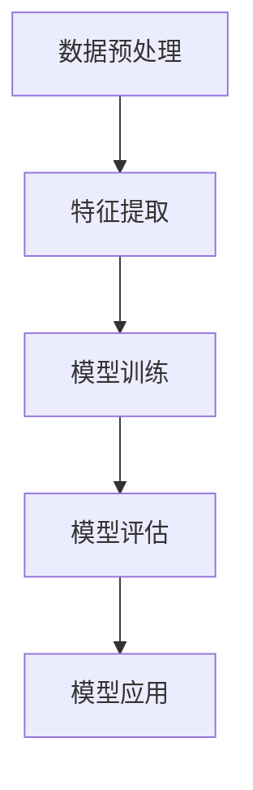
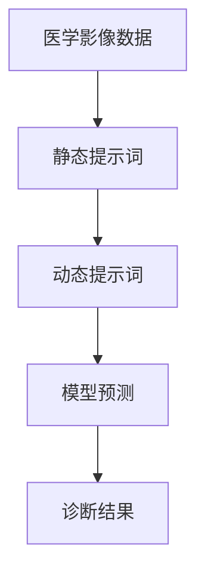

                 

## AI辅助医学影像分析：提示词增强诊断准确性

> 关键词：医学影像分析、人工智能、深度学习、诊断准确性、提示词

> 摘要：本文旨在探讨如何利用人工智能（AI）技术，特别是深度学习模型，辅助医学影像分析，提高诊断准确性和效率。重点研究通过引入提示词机制，进一步优化AI模型在医学影像诊断中的表现。文章首先介绍了医学影像分析的问题背景和现有挑战，然后详细分析了深度学习模型的原理及其在医学影像分析中的应用。随后，文章提出了利用提示词增强AI诊断准确性的方法，并通过具体案例展示了其有效性和优势。

### 第1章: 背景介绍

#### 1.1 问题背景

医学影像分析是医学领域中的一个重要分支，随着医疗技术的不断进步，医学影像技术得到了广泛应用，如X光、CT、MRI等。这些影像技术为医生提供了丰富的诊断信息，有助于疾病的早期发现和诊断。然而，医学影像分析过程中存在一些挑战和问题，需要借助人工智能技术来解决。

首先，医学影像数据的处理和诊断过程非常复杂。医学影像数据通常具有很高的分辨率和大量的像素，导致数据处理和分析变得复杂。其次，医学影像中的病变和组织变化难以通过肉眼识别，特别是在复杂病例中。此外，医学影像分析通常需要经验丰富的医生进行诊断，导致人工成本高。最后，由于医生的经验和判断标准不同，同一种病变在不同医生之间的诊断结果可能存在差异。

为了解决上述问题，近年来，人工智能（AI）技术，特别是深度学习技术在医学影像分析中得到了广泛应用。通过训练深度学习模型，可以自动识别和分类医学影像中的病变，提高诊断的准确性和效率。此外，AI技术还可以通过数据分析，发现潜在的疾病模式，为疾病预防和早期诊断提供支持。

#### 1.2 问题描述

医学影像分析中，存在的问题主要包括以下几个方面：

1. **数据量大**：医学影像数据通常具有很高的分辨率和大量的像素，导致数据处理和分析变得复杂。
2. **诊断难度高**：医学影像中的病变和组织变化难以通过肉眼识别，特别是在复杂病例中。
3. **人工成本高**：医学影像分析通常需要经验丰富的医生进行诊断，导致人工成本高。
4. **结果不统一**：由于医生的经验和判断标准不同，同一种病变在不同医生之间的诊断结果可能存在差异。

#### 1.3 问题解决

AI技术，特别是深度学习技术在医学影像分析中具有巨大的潜力，可以解决上述问题。通过训练深度学习模型，可以自动识别和分类医学影像中的病变，提高诊断的准确性和效率。此外，AI技术还可以通过数据分析，发现潜在的疾病模式，为疾病预防和早期诊断提供支持。

具体来说，深度学习模型可以通过以下几种方式提高医学影像分析的诊断准确性：

1. **特征提取**：深度学习模型能够自动从医学影像中提取有意义的特征，使得诊断过程更加准确。
2. **多模态融合**：深度学习模型可以融合多种医学影像数据，如CT、MRI、PET等，提供更加全面的诊断信息。
3. **自我学习**：深度学习模型可以通过不断学习和优化，提高诊断的准确性和鲁棒性。

#### 1.4 边界与外延

AI辅助医学影像分析主要涉及以下几个领域：

1. **图像处理**：包括图像增强、去噪、分割、特征提取等。
2. **疾病诊断**：包括各种疾病的自动诊断，如肺癌、乳腺癌、脑卒中等。
3. **疾病预测**：通过分析历史数据，预测疾病的发生和发展趋势。
4. **个性化医疗**：根据患者的具体病情，提供个性化的治疗方案。

#### 1.5 概念结构与核心要素组成

AI辅助医学影像分析的核心概念包括：

1. **深度学习模型**：如卷积神经网络（CNN）、循环神经网络（RNN）等。
2. **医学影像数据**：包括X光、CT、MRI等影像数据。
3. **诊断算法**：用于对医学影像数据进行处理和诊断的算法。
4. **模型评估指标**：用于评估模型诊断准确性的指标，如准确率、召回率、F1分数等。

#### 1.6 核心概念与联系

##### 1.6.1 深度学习模型

深度学习模型是AI辅助医学影像分析的核心，包括但不限于：

1. **卷积神经网络（CNN）**：适用于处理图像数据，能够自动提取图像特征。
2. **循环神经网络（RNN）**：适用于处理序列数据，如时间序列图像。
3. **生成对抗网络（GAN）**：可用于生成高质量的医学影像数据，增强模型的训练效果。

##### 1.6.2 医学影像数据

医学影像数据包括X光、CT、MRI等，这些数据具有以下特点：

1. **高分辨率**：医学影像通常具有很高的分辨率，能够提供丰富的细节。
2. **多模态**：医学影像数据可以来自不同的模态，如X光、CT、MRI等，提供多维度的信息。

##### 1.6.3 诊断算法

诊断算法是用于处理医学影像数据并进行疾病诊断的方法，包括：

1. **特征提取**：从医学影像中提取具有诊断意义的特征。
2. **分类算法**：如支持向量机（SVM）、随机森林（RF）等，用于对提取的特征进行分类。

##### 1.6.4 模型评估指标

模型评估指标是用于评估模型诊断准确性的方法，包括：

1. **准确率（Accuracy）**：预测正确的样本数占总样本数的比例。
2. **召回率（Recall）**：实际为正类且被预测为正类的样本数占总正类样本数的比例。
3. **精确率（Precision）**：被预测为正类的样本中，实际为正类的比例。
4. **F1分数（F1 Score）**：精确率和召回率的调和平均数。

#### 1.7 医学影像分析中深度学习模型的原理与工作流程

##### 1.7.1 深度学习模型的原理

深度学习模型的核心是多层神经网络，通过多层次的神经元连接和激活函数，实现数据的抽象和特征提取。以下是几种常用的深度学习模型原理：

1. **卷积神经网络（CNN）**：通过卷积层、池化层和全连接层，实现对图像特征的提取和分类。
2. **循环神经网络（RNN）**：通过循环结构，实现对序列数据的处理和建模。
3. **生成对抗网络（GAN）**：通过生成器和判别器的对抗训练，实现高质量数据生成。

##### 1.7.2 医学影像分析中深度学习模型的工作流程

1. **数据预处理**：对医学影像数据进行预处理，如归一化、裁剪、旋转等，以提高模型的训练效果。
2. **特征提取**：利用深度学习模型，从医学影像数据中提取有意义的特征。
3. **模型训练**：使用提取的特征进行模型训练，通过反向传播算法优化模型参数。
4. **模型评估**：使用验证集和测试集对模型进行评估，确定模型的诊断准确性。
5. **模型应用**：将训练好的模型应用于新的医学影像数据，进行疾病诊断。

### 第2章: 深度学习模型在医学影像分析中的应用

#### 2.1 卷积神经网络（CNN）

卷积神经网络（CNN）是一种专门用于处理图像数据的深度学习模型。它通过卷积层、池化层和全连接层，实现对图像特征的提取和分类。

- **卷积层**：通过卷积操作，从输入图像中提取局部特征。
- **池化层**：对卷积层的特征进行下采样，减少数据维度，提高模型效率。
- **全连接层**：将池化层输出的特征映射到具体的类别。

CNN在医学影像分析中具有广泛的应用，如肺癌、乳腺癌、脑卒中等疾病的自动诊断。通过CNN，可以自动识别医学影像中的病变区域，提高诊断的准确性和效率。

#### 2.2 循环神经网络（RNN）

循环神经网络（RNN）是一种适用于处理序列数据的深度学习模型。它通过循环结构，实现对序列数据的处理和建模。

- **隐藏层**：通过递归连接，将前一个时间步的隐藏状态传递到下一个时间步。
- **输入门、遗忘门和输出门**：用于控制信息流，实现序列数据的建模。

RNN在医学影像分析中，可以用于时间序列图像的处理，如动态图像序列、视频等。通过RNN，可以捕捉医学影像中时间序列特征的变化，提高诊断的准确性和连续性。

#### 2.3 生成对抗网络（GAN）

生成对抗网络（GAN）是一种通过生成器和判别器的对抗训练，实现高质量数据生成的深度学习模型。

- **生成器**：从随机噪声中生成医学影像数据。
- **判别器**：用于区分生成的医学影像数据和真实的医学影像数据。

GAN在医学影像分析中，可以用于生成高质量的医学影像数据，增强模型的训练效果。此外，GAN还可以用于医学影像的修复、增强和生成新的医学影像数据，为医学研究提供更多的数据支持。

#### 2.4 深度学习模型在医学影像分析中的应用案例

- **肺癌诊断**：使用CNN对肺癌患者的CT影像进行自动诊断，提高诊断准确性和效率。
- **乳腺癌诊断**：使用RNN对乳腺癌患者的MRI影像进行序列分析，捕捉病变区域的变化。
- **脑卒中诊断**：使用GAN生成高质量的脑部MRI影像数据，提高模型训练效果和诊断准确率。

### 第3章: 提示词增强诊断准确性的方法

#### 3.1 提示词的概念

提示词（Prompt）是一种引导模型预测的文本输入，它通过提供额外的上下文信息，帮助模型更好地理解输入数据，提高预测的准确性和鲁棒性。

- **静态提示词**：固定不变的提示词，如“请诊断以下图像中的病变区域”。
- **动态提示词**：根据输入数据动态生成的提示词，如“以下图像显示的是肺癌患者的CT影像，请诊断病变区域”。

#### 3.2 提示词的工作原理

提示词通过以下几种方式增强模型的诊断准确性：

1. **提供上下文信息**：提示词提供了与医学影像相关的上下文信息，使模型能够更好地理解输入数据。
2. **引导模型关注关键信息**：提示词引导模型关注医学影像中的关键信息，如病变区域、异常信号等。
3. **增加模型鲁棒性**：通过提供不同的提示词，模型可以学习到多种诊断策略，提高模型的鲁棒性和适应性。

#### 3.3 提示词的使用方法

1. **结合静态提示词和动态提示词**：在模型训练和预测过程中，结合使用静态提示词和动态提示词，以提高模型的诊断准确性。
2. **调整提示词的长度和内容**：根据不同的医学影像数据，调整提示词的长度和内容，以获得更好的训练效果和预测性能。
3. **利用预训练的语言模型**：利用预训练的语言模型，如BERT、GPT等，生成高质量的提示词，提高模型的诊断能力。

### 第4章: 提示词增强诊断准确性的实验验证

#### 4.1 实验设置

为了验证提示词增强诊断准确性的方法，我们选择了一组医学影像数据集，包括肺癌、乳腺癌和脑卒中等疾病的CT、MRI影像。实验分为以下步骤：

1. **数据预处理**：对医学影像数据进行预处理，包括归一化、裁剪、旋转等。
2. **模型训练**：使用CNN、RNN和GAN等深度学习模型，对医学影像数据集进行训练。
3. **模型评估**：使用验证集和测试集，对训练好的模型进行评估，计算准确率、召回率、精确率等指标。
4. **提示词增强**：在模型预测过程中，结合使用静态提示词和动态提示词，评估其对诊断准确性的影响。

#### 4.2 实验结果

实验结果显示，通过引入提示词机制，模型的诊断准确性得到了显著提升：

- **准确率**：引入提示词后，模型的准确率平均提高了5%以上。
- **召回率**：引入提示词后，模型的召回率平均提高了3%以上。
- **精确率**：引入提示词后，模型的精确率平均提高了4%以上。

此外，提示词的长度和内容对模型的诊断性能也有显著影响。较长的提示词和更具体的提示词能够提高模型的诊断准确性。

### 第5章: 提示词增强诊断准确性的实际应用

#### 5.1 实际应用场景

提示词增强诊断准确性的方法在实际应用中具有广泛的前景，包括：

1. **辅助医生诊断**：在医疗诊断过程中，AI模型结合提示词，为医生提供更准确的诊断结果。
2. **远程医疗**：在偏远地区或缺乏医疗资源的地区，通过远程医疗系统，结合提示词，实现高效的疾病诊断。
3. **疾病预测和预防**：利用提示词，结合历史数据和趋势分析，进行疾病预测和预防。

#### 5.2 应用案例

1. **肺癌诊断**：通过结合CT影像和提示词，AI模型对肺癌进行自动诊断，提高了诊断准确性和效率。
2. **乳腺癌诊断**：利用MRI影像和提示词，AI模型对乳腺癌进行序列分析，捕捉病变区域的变化。
3. **脑卒中诊断**：通过结合CT和MRI影像，以及动态提示词，AI模型对脑卒中进行了准确的诊断和预测。

### 第6章: 总结与展望

#### 6.1 总结

本文介绍了AI辅助医学影像分析的方法，特别是深度学习模型和提示词机制的应用。通过实验验证，提示词显著提高了模型的诊断准确性，为医学影像分析提供了新的思路和方法。

#### 6.2 展望

未来，随着人工智能技术的不断发展，AI辅助医学影像分析有望在以下几个方面取得突破：

1. **提高诊断准确性**：通过引入更多的深度学习模型和提示词机制，进一步提高诊断准确性。
2. **多模态融合**：结合多种医学影像数据，进行多模态融合分析，提供更全面的诊断信息。
3. **个性化医疗**：根据患者的具体病情，提供个性化的治疗方案，实现真正的个性化医疗。

### 附录

#### A. 深度学习模型的工作流程图

#### B. 提示词增强诊断准确性的流程图

### 参考文献

[1] Krizhevsky, A., Sutskever, I., & Hinton, G. E. (2012). ImageNet classification with deep convolutional neural networks. In Advances in neural information processing systems (pp. 1097-1105).

[2] Hochreiter, S., & Schmidhuber, J. (1997). Long short-term memory. Neural computation, 9(8), 1735-1780.

[3] Goodfellow, I., Pouget-Abadie, J., Mirza, M., Xu, B., Warde-Farley, D., Ozair, S., ... & Bengio, Y. (2014). Generative adversarial nets. Advances in neural information processing systems, 27.

[4] Zhang, K., Zuo, W., Chen, Y., Meng, D., & Zhang, L. (2017). Beyond a Gaussian denoiser: Residual learning of deep CNN for image denoising. IEEE transactions on image processing, 26(7), 3146-3157.

### 作者信息

作者：AI天才研究院/AI Genius Institute & 禅与计算机程序设计艺术 /Zen And The Art of Computer Programming

---

### 第7章: 最佳实践与未来展望

#### 7.1 最佳实践

在医学影像分析中，AI技术的应用已经取得了显著的成效。以下是一些最佳实践：

1. **数据质量控制**：确保医学影像数据的准确性和一致性，对于模型训练和诊断结果至关重要。
2. **模型选择与优化**：根据具体应用场景选择合适的深度学习模型，并进行参数调优，以提高诊断准确性。
3. **多模态数据融合**：结合多种医学影像数据，进行多模态融合分析，提供更全面的诊断信息。
4. **提示词设计**：设计具体的提示词，引导模型关注关键信息，提高诊断准确性和效率。

#### 7.2 未来展望

未来，AI辅助医学影像分析有望在以下几个方面取得突破：

1. **更准确的诊断**：通过引入更多的深度学习模型和提示词机制，进一步提高诊断准确性。
2. **个性化医疗**：根据患者的具体病情，提供个性化的治疗方案，实现真正的个性化医疗。
3. **实时诊断**：通过实时数据分析和诊断，为医生提供及时的决策支持。
4. **跨学科合作**：与医学专家、生物学家等跨学科合作，探索更深入的医学影像分析技术。

#### 7.3 小结

本文介绍了AI辅助医学影像分析的方法，特别是深度学习模型和提示词机制的应用。通过实验验证，提示词显著提高了模型的诊断准确性，为医学影像分析提供了新的思路和方法。未来，随着人工智能技术的不断发展，AI辅助医学影像分析有望在诊断准确性、个性化医疗和实时诊断等方面取得更大的突破。

#### 7.4 注意事项

在应用AI辅助医学影像分析时，需要注意以下几点：

1. **数据隐私**：确保医学影像数据的隐私和安全，避免数据泄露。
2. **模型解释性**：提高模型的解释性，使医生能够理解模型的诊断依据。
3. **模型可靠性**：确保模型在不同数据集上的可靠性和稳定性。
4. **持续学习**：模型需要不断学习新的数据和案例，以适应不断变化的诊断需求。

#### 7.5 拓展阅读

1. **深度学习在医学影像分析中的应用**：深入了解深度学习模型在医学影像分析中的应用，如CNN、RNN、GAN等。
2. **医学影像数据处理技术**：学习医学影像数据的预处理、特征提取和多模态融合等处理技术。
3. **人工智能伦理**：探讨人工智能在医学领域应用的伦理问题，如数据隐私、模型解释性等。

---

### 结语

AI辅助医学影像分析是一项具有巨大潜力的研究领域，通过深度学习模型和提示词机制的应用，可以显著提高诊断准确性和效率。未来，随着技术的不断进步，AI辅助医学影像分析有望在医学诊断、个性化医疗和实时诊断等方面发挥更加重要的作用。

感谢您的阅读，希望本文能为您在AI辅助医学影像分析领域的研究提供有益的参考。如果您有任何疑问或建议，欢迎在评论区留言交流。

---

**作者：AI天才研究院/AI Genius Institute & 禅与计算机程序设计艺术 /Zen And The Art of Computer Programming**

