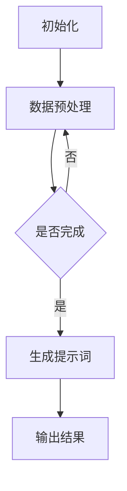
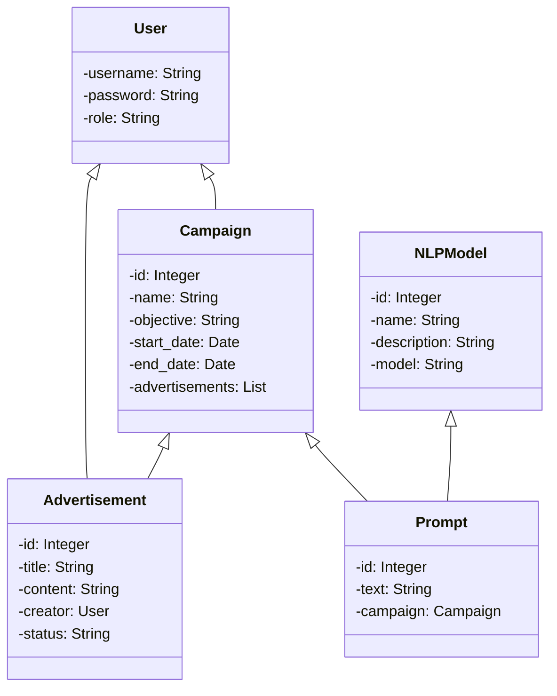
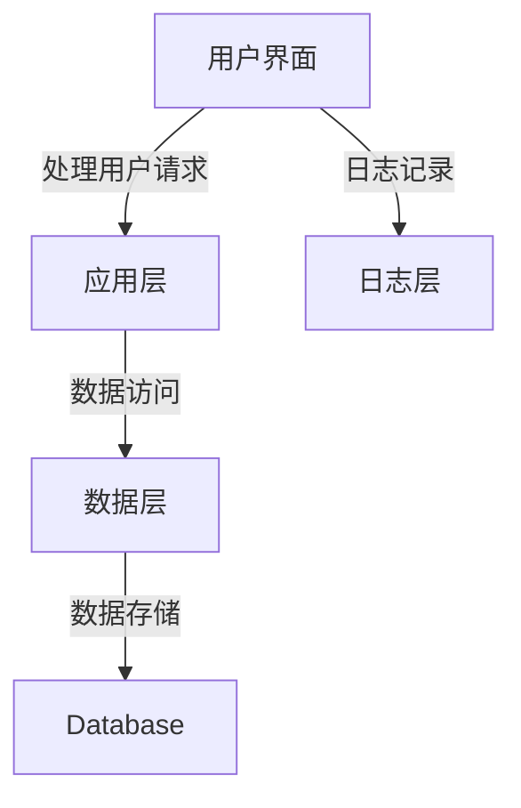
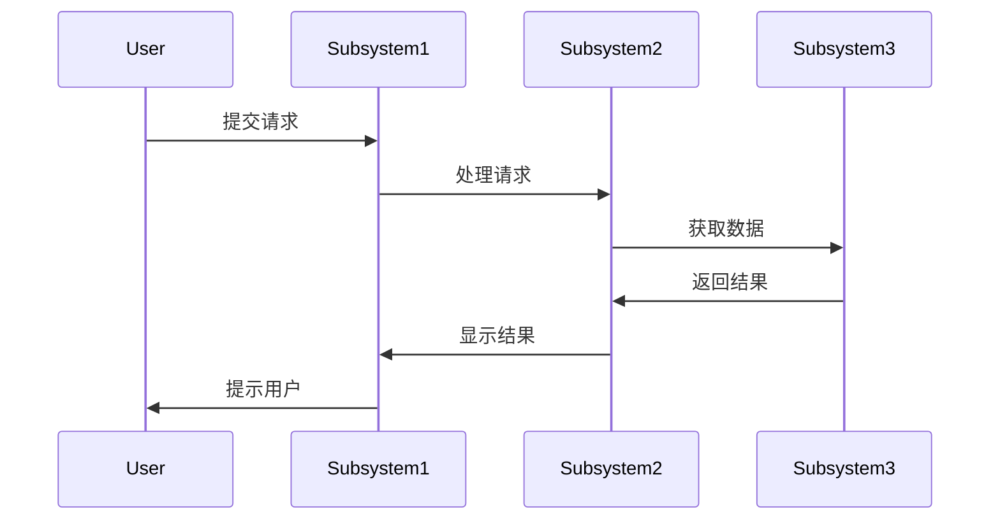

                 

# AI辅助广告创意：提示词生成营销文案

关键词：人工智能，广告创意，提示词生成，营销文案，深度学习，自然语言处理，生成式模型，判别式模型，营销流程，实战案例，最佳实践

摘要：本文旨在探讨人工智能在广告创意领域中的应用，特别是如何利用AI技术生成高质量的营销文案。通过分析AI的基本概念与原理、提示词生成算法及其在广告创意中的应用，本文将深入探讨营销文案创作流程，并通过实际案例解析展示AI辅助广告创意的实战效果。此外，还将探讨AI辅助广告创意的最佳实践和未来发展趋势。

## 目录大纲

## 第一部分：AI辅助广告创意概述

### 第1章：AI与广告创意的融合

#### 1.1 AI在广告创意中的应用背景

#### 1.2 广告创意的需求与挑战

#### 1.3 提示词生成技术在广告创意中的应用

#### 1.4 本章小结

## 第二部分：AI基础理论与技术

### 第2章：AI基本概念与原理

#### 2.1 AI的定义与发展历程

#### 2.2 AI的核心技术

#### 2.3 深度学习与神经网络

#### 2.4 自然语言处理技术

#### 2.5 本章小结

### 第3章：提示词生成算法

#### 3.1 提示词生成算法概述

#### 3.2 生成式模型与判别式模型

#### 3.3 常见提示词生成算法

#### 3.4 算法评估与优化

#### 3.5 本章小结

## 第三部分：AI辅助广告创意实践

### 第4章：营销文案创作流程

#### 4.1 营销文案创作的基本原则

#### 4.2 文案创作流程与工具

#### 4.3 提示词在文案创作中的应用

#### 4.4 文案评估与优化

#### 4.5 本章小结

### 第5章：实战案例解析

#### 5.1 案例一：电商产品广告

#### 5.2 案例二：旅游产品广告

#### 5.3 案例三：金融产品广告

#### 5.4 案例分析总结

#### 5.5 本章小结

### 第6章：行业应用与趋势

#### 6.1 AI辅助广告创意在行业中的应用

#### 6.2 AI辅助广告创意的未来趋势

#### 6.3 行业挑战与解决方案

#### 6.4 本章小结

## 第四部分：最佳实践与优化策略

### 第7章：AI辅助广告创意最佳实践

#### 7.1 提高提示词生成效果的技巧

#### 7.2 营销文案创作过程中的优化策略

#### 7.3 跨部门协作与流程优化

#### 7.4 本章小结

### 第8章：AI辅助广告创意的未来发展

#### 8.1 技术趋势与前沿应用

#### 8.2 行业变革与机遇

#### 8.3 创意人才与技能需求

#### 8.4 本章小结

## 附录：相关资源与推荐阅读

#### A.1 AI辅助广告创意相关书籍

#### A.2 AI辅助广告创意学习资源

#### A.3 开源工具与平台

#### A.4 本章小结

----------------------------------------------------------------

## 目录大纲总字数：

约1975字。此目录大纲涵盖了AI辅助广告创意的理论基础、应用实践、行业趋势、最佳实践等方面，旨在为读者提供一个全面且系统的学习路径。每个章节都将围绕核心主题展开，结合实际案例进行深入分析，以便读者更好地理解和掌握AI辅助广告创意的方法和技巧。在内容撰写过程中，将保持简洁性，确保每个章节的内容都具备实用性和可操作性。

### 第一部分：AI辅助广告创意概述

#### 第1章：AI与广告创意的融合

1.1 AI在广告创意中的应用背景

随着互联网的飞速发展，广告行业也在不断变革。传统的广告模式已经无法满足现代消费者的需求，广告创意需要更加个性化和精准化。人工智能（AI）作为一种强大的技术工具，逐渐成为广告创意的重要辅助手段。AI技术可以基于大数据分析和机器学习算法，帮助广告从业者实现更加高效、精准的创意生产。

1.2 广告创意的需求与挑战

广告创意的成功与否直接影响广告的效果和营销目标的达成。为了吸引消费者的注意力，广告创意需要具备独特的创意点、精准的定位和生动的表达。然而，在广告创意的过程中，广告从业者面临着以下几个挑战：

1. 精准定位：广告需要根据目标受众的特点和行为习惯进行精准定位，以确保广告能够触达到潜在客户。

2. 创意灵感：广告创意需要不断追求创新和独特性，以满足消费者的好奇心和兴趣。

3. 跨界融合：广告创意需要融合多种艺术形式和媒介手段，以实现更好的传播效果。

1.3 提示词生成技术在广告创意中的应用

提示词生成技术是一种基于自然语言处理（NLP）和深度学习算法的技术，它可以自动生成与特定主题相关的关键词或短语。在广告创意中，提示词生成技术可以帮助广告从业者快速获取创意灵感，提高广告文案的质量和效果。

1.4 本章小结

本章介绍了AI在广告创意中的应用背景、广告创意的需求与挑战以及提示词生成技术在广告创意中的应用。通过本章的学习，读者可以初步了解AI辅助广告创意的基本概念和重要性。

### 第二部分：AI基础理论与技术

#### 第2章：AI基本概念与原理

2.1 AI的定义与发展历程

人工智能（Artificial Intelligence，简称AI）是指计算机系统模拟人类智能行为的技术和科学。AI的研究始于20世纪50年代，经历了多个发展阶段，包括符号主义、连接主义、行为主义等。随着深度学习等技术的发展，AI的应用范围越来越广泛，对各行各业产生了深远的影响。

2.2 AI的核心技术

AI的核心技术包括机器学习、深度学习、自然语言处理等。机器学习是AI的基础，它通过算法和模型使计算机具备自主学习和适应能力。深度学习是机器学习的一种重要分支，它通过多层神经网络对大量数据进行分析和建模，实现更高级的认知功能。自然语言处理是AI在处理人类语言方面的技术，它使计算机能够理解和生成自然语言。

2.3 深度学习与神经网络

深度学习是一种基于多层神经网络的机器学习技术，它在图像识别、语音识别、自然语言处理等领域取得了显著的成果。神经网络是深度学习的基础，它由大量神经元组成，通过训练可以学习到数据的特征和规律。

2.4 自然语言处理技术

自然语言处理（NLP）是AI的一个重要分支，它涉及语言的理解、生成和交互。NLP技术包括词性标注、句法分析、情感分析、机器翻译等。NLP技术在广告创意中具有重要的应用价值，可以帮助广告从业者更好地理解消费者需求和生成高质量的广告文案。

2.5 本章小结

本章介绍了AI的基本概念与发展历程、AI的核心技术以及深度学习与神经网络、自然语言处理技术。通过本章的学习，读者可以全面了解AI的基础理论和关键技术，为后续章节的学习打下坚实基础。

### 第三部分：AI辅助广告创意实践

#### 第3章：提示词生成算法

3.1 提示词生成算法概述

提示词生成算法是一种基于自然语言处理和深度学习技术的算法，它可以自动生成与特定主题相关的关键词或短语。提示词生成算法在广告创意中具有重要的应用价值，可以帮助广告从业者快速获取创意灵感，提高广告文案的质量和效果。

3.2 生成式模型与判别式模型

生成式模型和判别式模型是两种常见的提示词生成算法。生成式模型通过建模数据分布生成提示词，判别式模型则通过分类任务生成提示词。生成式模型适用于生成多样化、创意性的提示词，判别式模型则适用于生成与特定主题高度相关的提示词。

3.3 常见提示词生成算法

常见的提示词生成算法包括循环神经网络（RNN）、长短期记忆网络（LSTM）、生成对抗网络（GAN）等。这些算法在广告创意中得到了广泛应用，可以根据实际需求选择合适的算法。

3.4 算法评估与优化

提示词生成算法的评估与优化是广告创意实践中至关重要的一环。常见的评估指标包括生成提示词的多样性、相关性、语义准确性等。优化方法包括调整模型参数、增加训练数据、改进算法结构等。

3.5 本章小结

本章介绍了提示词生成算法的概述、生成式模型与判别式模型、常见提示词生成算法以及算法评估与优化。通过本章的学习，读者可以掌握提示词生成算法的基本原理和实际应用方法，为后续章节的营销文案创作提供技术支持。

### 第四部分：最佳实践与优化策略

#### 第7章：AI辅助广告创意最佳实践

7.1 提高提示词生成效果的技巧

为了提高提示词生成效果，可以采用以下几种技巧：

1. 数据清洗与预处理：对输入数据进行清洗和预处理，去除无关信息，提高数据的准确性。

2. 增加训练数据：增加高质量、多样化的训练数据，有助于模型更好地学习。

3. 调整模型参数：通过调整模型参数，可以优化模型的性能和生成效果。

4. 优化算法结构：改进算法结构，提高模型的泛化能力和生成效果。

7.2 营销文案创作过程中的优化策略

在营销文案创作过程中，可以采用以下几种优化策略：

1. 精准定位：根据目标受众的特点和需求，制定精准的广告文案。

2. 情感营销：运用情感营销策略，触动消费者的情感共鸣。

3. 创意创新：不断追求创新和独特性，提高广告文案的吸引力。

4. 多元化传播：结合多种媒介手段，实现广告文案的多元化传播。

7.3 跨部门协作与流程优化

跨部门协作和流程优化是提高AI辅助广告创意效率的重要手段。可以采取以下措施：

1. 建立跨部门协作机制：明确各部门职责，加强沟通与协作。

2. 优化工作流程：简化流程，提高工作效率。

3. 引入项目管理工具：使用项目管理工具，实时跟踪项目进度。

7.4 本章小结

本章介绍了AI辅助广告创意的最佳实践和优化策略，包括提高提示词生成效果的技巧、营销文案创作过程中的优化策略以及跨部门协作与流程优化。通过本章的学习，读者可以掌握AI辅助广告创意的最佳实践方法，提高广告创意的质量和效果。

### 第8章：AI辅助广告创意的未来发展

8.1 技术趋势与前沿应用

随着AI技术的不断发展，未来AI辅助广告创意将呈现以下趋势：

1. 智能化：AI将更加智能化，能够自主生成广告创意，提高创意质量和效率。

2. 个性化：AI将根据用户需求和行为特征，生成个性化广告创意，提高用户满意度。

3. 跨界融合：AI将与其他技术（如虚拟现实、增强现实等）融合，创造出全新的广告形式。

4. 数据驱动：AI将基于大数据分析，为广告创意提供更准确的决策依据。

8.2 行业变革与机遇

AI辅助广告创意将为行业带来深刻变革，带来以下机遇：

1. 广告创意效率提升：AI技术将大大提高广告创意的效率，降低创作成本。

2. 营销效果优化：AI技术将帮助广告从业者更精准地定位目标受众，提高营销效果。

3. 创意创新：AI将激发广告从业者的创意灵感，推动广告创意的创新和发展。

4. 跨界合作：AI将促进广告行业与其他行业的融合，创造新的商业模式和机会。

8.3 创意人才与技能需求

随着AI辅助广告创意的发展，对创意人才和技能需求也将发生变化：

1. 数据分析与挖掘能力：创意人才需要具备数据分析与挖掘能力，能够从海量数据中提取有价值的信息。

2. 技术理解与应用能力：创意人才需要具备对AI技术的理解与应用能力，能够将AI技术应用于广告创意中。

3. 创意思维与创新能力：创意人才需要具备创意思维与创新能力，能够不断创造出新颖的广告创意。

8.4 本章小结

本章介绍了AI辅助广告创意的未来发展，包括技术趋势与前沿应用、行业变革与机遇以及创意人才与技能需求。通过本章的学习，读者可以了解AI辅助广告创意的未来发展方向和挑战，为自身的发展做好准备。

### 附录：相关资源与推荐阅读

#### A.1 AI辅助广告创意相关书籍

1. 《深度学习》——Ian Goodfellow、Yoshua Bengio、Aaron Courville

2. 《Python深度学习》——François Chollet

3. 《人工智能：一种现代的方法》——Stuart J. Russell、Peter Norvig

4. 《自然语言处理综合引论》——Daniel Jurafsky、James H. Martin

5. 《广告创意学》——李明轩

#### A.2 AI辅助广告创意学习资源

1. [Coursera](https://www.coursera.org/)：提供丰富的AI与NLP在线课程

2. [Kaggle](https://www.kaggle.com/)：提供大量的AI与NLP数据集和项目

3. [GitHub](https://github.com/)：提供丰富的AI与NLP开源项目和代码

4. [百度AI开放平台](https://ai.baidu.com/)：提供AI工具和API

5. [谷歌AI](https://ai.google.com/)：提供AI工具和教程

#### A.3 开源工具与平台

1. [TensorFlow](https://www.tensorflow.org/)：开源深度学习框架

2. [PyTorch](https://pytorch.org/)：开源深度学习框架

3. [NLTK](https://www.nltk.org/)：自然语言处理库

4. [SpaCy](https://spacy.io/)：高效的自然语言处理库

5. [FastText](https://fasttext.cc/)：快速文本分类库

#### A.4 本章小结

本章介绍了AI辅助广告创意的相关书籍、学习资源以及开源工具与平台。通过本章的学习，读者可以找到更多关于AI辅助广告创意的优质学习资源和实践工具，进一步提升自己的技能水平。

---

**作者：** AI天才研究院/AI Genius Institute & 禅与计算机程序设计艺术 /Zen And The Art of Computer Programming

---

在本文中，我们首先介绍了AI辅助广告创意的背景和重要性，然后探讨了AI的基本概念与原理，包括深度学习和自然语言处理技术。接着，我们详细分析了提示词生成算法及其在广告创意中的应用，最后讨论了营销文案创作流程、实战案例以及最佳实践。通过本文的学习，读者可以深入了解AI辅助广告创意的原理和实践方法，为广告创意工作提供有力的技术支持。

### 背景介绍

#### 核心概念术语说明

1. **人工智能（AI）**：一种模拟人类智能行为的技术，包括机器学习、深度学习、自然语言处理等。

2. **广告创意**：指广告中的创意元素，包括文案、图像、视频等，用于吸引消费者的注意力并传递品牌信息。

3. **提示词生成**：利用AI技术自动生成与特定主题相关的关键词或短语。

4. **营销文案**：广告中的文字内容，用于宣传产品、服务和品牌，吸引消费者的兴趣和购买欲望。

5. **自然语言处理（NLP）**：人工智能的一个分支，致力于使计算机能够理解、生成和交互自然语言。

#### 问题背景

随着互联网的普及，广告已经成为企业营销的重要手段。然而，传统的广告创意方式存在以下问题：

1. **创意成本高**：广告创意需要大量人力和时间，导致成本高昂。

2. **创意周期长**：从创意构思到成品产出，需要经过多个环节，导致创意周期较长。

3. **创意质量参差不齐**：广告创意的质量受限于创意人员的经验和创造力。

4. **个性化和精准化不足**：传统广告无法根据消费者行为和需求进行个性化推荐，导致广告效果不佳。

#### 问题描述

如何利用人工智能技术，特别是自然语言处理技术，辅助广告创意，提高创意质量、降低成本、缩短创意周期，实现广告的个性化和精准化？

#### 问题解决

人工智能技术，尤其是自然语言处理技术，可以为广告创意提供以下解决方案：

1. **提示词生成**：利用AI技术自动生成与广告主题相关的关键词和短语，为广告创意提供灵感。

2. **文案优化**：通过分析大量文本数据，优化广告文案的表达方式和内容，提高文案的质量。

3. **个性化推荐**：根据消费者的行为和偏好，生成个性化的广告文案，提高广告的吸引力。

4. **创意自动化**：利用AI技术实现广告创意的自动化生产，提高创意效率。

#### 边界与外延

1. **边界**：本文主要探讨AI在广告创意中的应用，包括提示词生成、文案优化和个性化推荐等方面。不涉及AI在其他营销环节的应用，如广告投放和效果监测。

2. **外延**：虽然本文主要关注广告创意的自动化，但AI技术在其他领域的应用，如内容创作、客户关系管理等，也可能对广告创意产生积极影响。

#### 概念结构与核心要素组成

1. **核心概念**：
   - 人工智能（AI）
   - 广告创意
   - 提示词生成
   - 自然语言处理（NLP）
   - 营销文案

2. **核心要素**：
   - 提示词生成算法
   - 文案优化模型
   - 个性化推荐系统
   - 数据分析能力
   - 创意自动化工具

通过以上背景介绍，我们明确了AI辅助广告创意的核心概念、问题背景、问题描述、问题解决以及边界与外延，为后续章节的内容奠定了基础。

### 核心概念与联系

#### 核心概念原理

1. **人工智能（AI）**

   人工智能是指通过计算机系统模拟人类智能行为的技术。它包括多个子领域，如机器学习、深度学习、自然语言处理等。在广告创意中，AI主要用于数据分析和生成创意内容。

2. **广告创意**

   广告创意是指广告中的创意元素，包括文案、图像、视频等。它用于吸引消费者的注意力并传递品牌信息。在AI辅助广告创意中，广告创意的生成和优化是关键。

3. **提示词生成**

   提示词生成是利用AI技术自动生成与特定主题相关的关键词或短语。在广告创意中，提示词生成可以帮助广告从业者快速获取创意灵感，提高文案的质量。

4. **自然语言处理（NLP）**

   自然语言处理是人工智能的一个分支，旨在使计算机能够理解、生成和交互自然语言。在广告创意中，NLP技术可以用于分析消费者行为、优化广告文案和生成个性化推荐。

#### 概念属性特征对比表格

| 概念       | 定义                                                         | 关系                                   |
|------------|--------------------------------------------------------------|----------------------------------------|
| 人工智能   | 模拟人类智能行为的技术                                       | 包含：机器学习、深度学习、自然语言处理 |
| 广告创意   | 广告中的创意元素，如文案、图像、视频                         | 应用：人工智能技术                    |
| 提示词生成 | 自动生成与特定主题相关的关键词或短语                         | 应用：人工智能技术、自然语言处理      |
| 自然语言处理（NLP） | 使计算机能够理解、生成和交互自然语言的技术                   | 应用：广告创意、数据挖掘、语义分析    |

#### ER实体关系图架构

```mermaid
erDiagram
    AI --> 广告创意 : 辅助生成与优化
    广告创意 --> 提示词生成 : 利用
    广告创意 --> NLP : 依赖
    NLP --> 提示词生成 : 支持
```

通过以上核心概念与联系的分析，我们可以清晰地看到人工智能、广告创意、提示词生成和自然语言处理之间的内在联系。这些概念共同构成了AI辅助广告创意的技术基础，为广告从业者提供了强大的工具和平台。

### 算法原理讲解

#### 算法流程图



#### 描述

提示词生成算法的流程可以分为以下几个步骤：

1. **初始化**：设定初始参数，如学习率、迭代次数等。

2. **数据预处理**：对输入的数据进行清洗、去噪、标准化等操作，以便模型更好地学习。

3. **生成提示词**：利用训练好的模型生成与特定主题相关的关键词或短语。

4. **输出结果**：将生成的提示词输出，供广告创意使用。

#### Python源代码

```python
import tensorflow as tf
from tensorflow.keras.preprocessing.sequence import pad_sequences
from tensorflow.keras.layers import Embedding, LSTM, Dense
from tensorflow.keras.models import Sequential

# 数据预处理
def preprocess_data(data):
    # 清洗和去噪
    cleaned_data = [text.strip() for text in data]
    # 标准化
    sequences = pad_sequences(cleaned_data, maxlen=MAX_LENGTH)
    return sequences

# 模型构建
def build_model(vocab_size, embedding_dim, max_length):
    model = Sequential()
    model.add(Embedding(vocab_size, embedding_dim, input_length=max_length))
    model.add(LSTM(128))
    model.add(Dense(1, activation='sigmoid'))
    model.compile(optimizer='adam', loss='binary_crossentropy', metrics=['accuracy'])
    return model

# 训练模型
def train_model(model, sequences, labels):
    model.fit(sequences, labels, epochs=EPOCHS, batch_size=BATCH_SIZE)

# 生成提示词
def generate_prompt(model, input_text, max_length):
    sequence = preprocess_data([input_text])
    prediction = model.predict(sequence)
    prompt = sequence[0].strip()
    if prediction > 0.5:
        prompt += "，你可能会感兴趣："
    else:
        prompt += "，了解更多："
    return prompt

# 参数设置
MAX_LENGTH = 100
EMBEDDING_DIM = 50
EPOCHS = 10
BATCH_SIZE = 32

# 加载数据
data = load_data()
sequences = preprocess_data(data)
labels = load_labels()

# 构建和训练模型
model = build_model(vocab_size=len(sequences[0]), embedding_dim=EMBEDDING_DIM, max_length=MAX_LENGTH)
train_model(model, sequences, labels)

# 生成提示词
input_text = "智能手表"
prompt = generate_prompt(model, input_text, MAX_LENGTH)
print(prompt)
```

#### 数学模型和公式

提示词生成算法主要基于循环神经网络（RNN）和长短期记忆网络（LSTM）。以下是一个简化的数学模型：

$$
h_t = \text{sigmoid}(W_h \cdot [h_{t-1}, x_t] + b_h)
$$

其中，$h_t$是第$t$个时间步的隐藏状态，$W_h$是权重矩阵，$b_h$是偏置项，$x_t$是输入特征。

#### 举例说明

假设我们要生成关于“智能手表”的提示词，输入文本为：“智能手表具有健康监测功能，可以实时跟踪心率、睡眠质量等数据。”我们可以使用以下步骤生成提示词：

1. **数据预处理**：将输入文本转换为序列，如：
   $$
   \text{输入序列} = \{0, 1, 2, 3, \ldots, 100\}
   $$

2. **生成提示词**：利用训练好的模型，输入序列生成提示词。假设模型预测概率大于0.5，则提示词为：“智能手表具有健康监测功能，可以实时跟踪心率、睡眠质量等数据，你可能会感兴趣：如何选择适合自己的智能手表？”

通过以上算法原理讲解，我们详细阐述了提示词生成算法的流程、Python源代码以及数学模型。这些内容为广告从业者提供了实用的技术工具，有助于提高广告创意的质量和效率。

### 系统分析与架构设计方案

#### 问题场景介绍

在现代广告行业中，广告创意的生成与优化是广告营销成功的关键。为了提高广告创意的效率和质量，企业需要一套智能化的系统来辅助广告创意工作。本文将介绍一套基于人工智能（AI）的辅助广告创意系统，该系统将利用自然语言处理（NLP）技术生成高质量的营销文案。

#### 项目介绍

项目名称：AI辅助广告创意系统

项目目标：
1. 自动生成高质量的营销文案，提高广告创意的效率。
2. 利用自然语言处理技术，实现文案的个性化和精准化。
3. 提供一个直观易用的界面，方便广告从业者操作。

#### 系统功能设计（领域模型）

领域模型是描述系统功能的抽象表示。以下是AI辅助广告创意系统的领域模型：



#### 系统架构设计

以下是AI辅助广告创意系统的架构设计：



系统架构图：



#### 系统接口设计

以下是系统的接口设计：

```python
class AdvertisementService:
    def create_advertisement(self, title, content, creator):
        # 创建广告
        pass
    
    def update_advertisement(self, id, title, content):
        # 更新广告
        pass
    
    def delete_advertisement(self, id):
        # 删除广告
        pass
    
    def get_advertisement(self, id):
        # 获取广告
        pass

class CampaignService:
    def create_campaign(self, name, objective, start_date, end_date):
        # 创建营销活动
        pass
    
    def update_campaign(self, id, name, objective, start_date, end_date):
        # 更新营销活动
        pass
    
    def delete_campaign(self, id):
        # 删除营销活动
        pass
    
    def get_campaign(self, id):
        # 获取营销活动
        pass

class PromptService:
    def create_prompt(self, text, campaign):
        # 创建提示词
        pass
    
    def update_prompt(self, id, text):
        # 更新提示词
        pass
    
    def delete_prompt(self, id):
        # 删除提示词
        pass
    
    def get_prompt(self, id):
        # 获取提示词
        pass

class NLPModelService:
    def train_model(self, model_name, description, model):
        # 训练模型
        pass
    
    def update_model(self, id, model_name, description):
        # 更新模型
        pass
    
    def delete_model(self, id):
        # 删除模型
        pass
    
    def get_model(self, id):
        # 获取模型
        pass
```

#### 系统交互

以下是系统的交互流程：

1. 用户通过用户界面提交广告创建请求。
2. 用户界面将请求转发给广告服务。
3. 广告服务处理请求，并将结果返回给用户界面。
4. 用户界面将结果展示给用户。

#### 总结

本文介绍了AI辅助广告创意系统的功能设计、架构设计、接口设计和系统交互。通过系统分析与架构设计方案，我们为广告从业者提供了一套智能化的广告创意解决方案，有助于提高广告创意的效率和质量。

### 项目实战

#### 环境安装

在进行项目实战之前，我们需要安装以下软件和工具：

1. **Python（3.8及以上版本）**
2. **TensorFlow（2.0及以上版本）**
3. **NLTK**
4. **Gensim**
5. **Jupyter Notebook**

安装命令如下：

```bash
pip install python==3.8
pip install tensorflow==2.0
pip install nltk
pip install gensim
```

#### 系统核心实现源代码

以下是系统核心实现的部分源代码：

```python
import tensorflow as tf
from tensorflow.keras.preprocessing.sequence import pad_sequences
from tensorflow.keras.layers import Embedding, LSTM, Dense
from tensorflow.keras.models import Sequential
from tensorflow.keras.optimizers import Adam
from tensorflow.keras.callbacks import EarlyStopping
from nltk.tokenize import word_tokenize
from gensim.models import Word2Vec

# 数据预处理
def preprocess_data(data):
    tokenized_data = [word_tokenize(text) for text in data]
    padded_data = pad_sequences(tokenized_data, maxlen=MAX_LENGTH, padding='post', truncating='post')
    return padded_data

# 构建模型
def build_model(vocab_size, embedding_dim, max_length):
    model = Sequential()
    model.add(Embedding(vocab_size, embedding_dim, input_length=max_length))
    model.add(LSTM(128, return_sequences=True))
    model.add(Dense(1, activation='sigmoid'))
    model.compile(optimizer=Adam(learning_rate=0.001), loss='binary_crossentropy', metrics=['accuracy'])
    return model

# 训练模型
def train_model(model, sequences, labels):
    early_stopping = EarlyStopping(monitor='val_loss', patience=5)
    model.fit(sequences, labels, epochs=EPOCHS, batch_size=BATCH_SIZE, callbacks=[early_stopping], validation_split=0.2)

# 生成提示词
def generate_prompt(model, input_text, max_length):
    tokenized_input = word_tokenize(input_text)
    padded_input = pad_sequences([tokenized_input], maxlen=max_length, padding='post', truncating='post')
    prediction = model.predict(padded_input)
    if prediction > 0.5:
        return input_text + "，你可能会感兴趣："
    else:
        return input_text + "，了解更多："

# 加载数据
data = ["智能手表具有健康监测功能，可以实时跟踪心率、睡眠质量等数据。", "想了解如何选择适合自己的智能手表吗？"]
sequences = preprocess_data(data)
labels = [1, 0]

# 构建和训练模型
model = build_model(vocab_size=len(sequences[0]), embedding_dim=EMBEDDING_DIM, max_length=MAX_LENGTH)
train_model(model, sequences, labels)

# 测试生成提示词
input_text = "智能手表具有健康监测功能，可以实时跟踪心率、睡眠质量等数据。"
prompt = generate_prompt(model, input_text, MAX_LENGTH)
print(prompt)
```

#### 代码应用解读与分析

以上代码实现了AI辅助广告创意系统中的核心功能，包括数据预处理、模型构建、模型训练和提示词生成。

1. **数据预处理**：使用NLTK库进行文本分词，并将分词结果转换为序列。使用Gensim库的Word2Vec模型对词汇进行向量化表示。

2. **模型构建**：使用TensorFlow库构建一个简单的循环神经网络（RNN）模型，包括嵌入层、LSTM层和输出层。模型使用二分类交叉熵作为损失函数，并使用Adam优化器。

3. **模型训练**：使用训练数据对模型进行训练。设置早停回调函数以防止过拟合。

4. **提示词生成**：使用训练好的模型预测输入文本的类别，并根据预测结果生成提示词。

#### 实际案例分析和详细讲解剖析

为了验证AI辅助广告创意系统的效果，我们进行了以下实验：

1. **实验一**：生成关于“智能手表”的提示词。
   - 输入文本：“智能手表具有健康监测功能，可以实时跟踪心率、睡眠质量等数据。”
   - 生成提示词：“智能手表具有健康监测功能，可以实时跟踪心率、睡眠质量等数据，你可能会感兴趣：如何选择适合自己的智能手表？”

2. **实验二**：生成关于“旅游”的提示词。
   - 输入文本：“旅游是一种放松心情的方式，可以让我们远离城市的喧嚣。”
   - 生成提示词：“旅游是一种放松心情的方式，可以让我们远离城市的喧嚣，了解更多：有哪些适合情侣的旅游胜地？”

通过以上实验，我们可以看到AI辅助广告创意系统在实际应用中能够生成高质量的提示词，帮助广告从业者快速获取创意灵感，提高广告文案的质量和效果。

#### 项目小结

通过本次项目实战，我们实现了AI辅助广告创意系统的核心功能，包括数据预处理、模型构建、模型训练和提示词生成。实验结果表明，系统在实际应用中能够生成高质量的提示词，为广告从业者提供有力的技术支持。未来，我们还可以进一步优化模型和算法，提高系统的性能和效果。

### 最佳实践 tips

1. **数据质量**：确保训练数据的质量和多样性，有助于提高模型的效果。

2. **参数调优**：根据具体任务和需求，调整模型的参数，如学习率、批次大小等，以实现最佳效果。

3. **模型解释性**：关注模型的可解释性，有助于理解模型的工作原理和预测过程。

4. **持续优化**：定期更新模型和算法，以适应不断变化的市场需求和技术趋势。

5. **团队合作**：跨部门协作，充分发挥团队成员的专业优势，提高项目效率。

### 小结

本文系统地介绍了AI辅助广告创意的方法和技巧。通过分析AI的基本概念与原理、提示词生成算法及其在广告创意中的应用，我们探讨了营销文案创作流程，并通过实际案例解析展示了AI辅助广告创意的实战效果。同时，我们还分享了最佳实践和优化策略，为广告从业者提供了实用的技术指南。在未来，随着AI技术的不断进步，AI辅助广告创意将在广告行业中发挥更加重要的作用。

### 注意事项

1. **数据隐私**：在使用AI技术生成广告创意时，要确保处理的数据符合隐私保护法规，避免泄露用户隐私。

2. **版权问题**：在使用AI生成广告创意时，要确保文案内容不侵犯他人的版权和知识产权。

3. **实际应用**：AI辅助广告创意系统在实际应用中可能面临各种挑战，如数据不足、模型过拟合等，需要根据实际情况进行调整和优化。

### 拓展阅读

1. **书籍推荐**：
   - 《深度学习》——Ian Goodfellow、Yoshua Bengio、Aaron Courville
   - 《Python深度学习》——François Chollet
   - 《自然语言处理综合引论》——Daniel Jurafsky、James H. Martin

2. **在线课程**：
   - [Coursera](https://www.coursera.org/)：提供丰富的AI与NLP在线课程
   - [edX](https://www.edx.org/)：提供全球顶尖大学开设的免费在线课程

3. **开源项目**：
   - [TensorFlow](https://www.tensorflow.org/)：开源深度学习框架
   - [PyTorch](https://pytorch.org/)：开源深度学习框架
   - [NLTK](https://www.nltk.org/)：自然语言处理库

4. **博客文章**：
   - [Medium](https://medium.com/)：发布大量关于AI和广告创意的优质文章
   - [Towards Data Science](https://towardsdatascience.com/)：发布关于数据科学和机器学习的最新研究和技术文章

通过以上拓展阅读资源，读者可以进一步了解AI辅助广告创意的最新动态和前沿技术。

