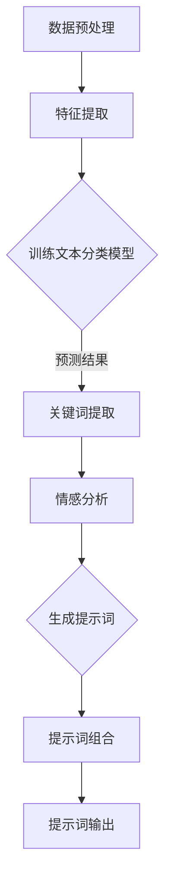
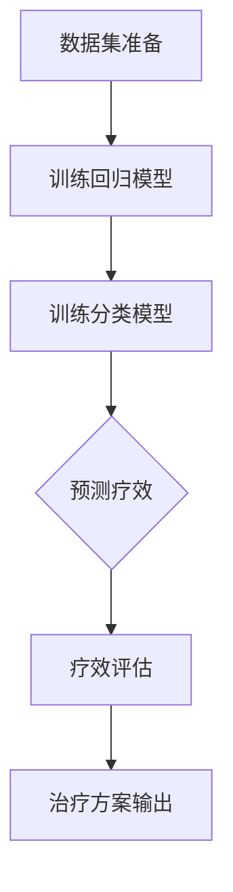

                 

## AI辅助心理咨询：提示词设计治疗方案

### 关键词：
- AI辅助心理咨询
- 提示词设计
- 心理治疗方案
- 机器学习
- 自然语言处理

### 摘要：
本文旨在探讨人工智能（AI）在心理咨询中的应用，特别是如何设计有效的提示词来制定个性化的心理治疗方案。通过详细分析AI技术在心理咨询领域的应用背景和挑战，本文将介绍提示词设计的基本原则和方法，并探讨其在心理治疗方案中的应用。此外，文章还将深入解析算法原理，包括提示词生成算法和治疗方案评估算法，并提供一个实际案例来展示如何使用这些算法来制定和实施心理治疗方案。最后，文章将总结最佳实践，并提出未来研究的方向。

### 引言

随着人工智能（AI）技术的快速发展，其在各个领域的应用越来越广泛。在心理健康领域，AI的应用也日益受到关注。传统的心理咨询方法主要依赖于心理咨询师的专业知识和经验，而AI的引入为这一过程带来了新的机遇。AI能够处理大量数据，快速识别模式和规律，从而提供更为个性化和高效的心理治疗方案。

AI辅助心理咨询的主要优势在于：
- **个性化治疗**：AI可以根据个体的心理状态和需求，为其提供量身定制的治疗方案。
- **提高效率**：AI可以帮助心理咨询师快速分析数据，节省时间，使其能够专注于更高层次的工作。
- **减少偏见**：AI系统在处理数据时，可以减少人为因素带来的偏见。

然而，AI辅助心理咨询也面临一些挑战，如数据隐私、算法偏见和系统的解释性等。因此，设计有效的提示词和治疗方案成为关键。

### 背景介绍

#### 核心概念术语说明

在探讨AI辅助心理咨询之前，需要了解一些核心概念和术语：

- **心理咨询**：是指通过专业的技术和方法，帮助个体解决心理问题、改善心理健康的过程。
- **人工智能**：是指通过计算机模拟人类智能的科学技术，包括机器学习、自然语言处理等。
- **提示词**：是指用于引导AI系统理解和处理特定任务的关键词或短语。
- **心理治疗方案**：是指针对特定心理问题，由心理咨询师或AI系统制定的干预措施和步骤。

#### 问题背景

随着现代社会的快速发展，人们面临的心理健康问题日益严重。传统心理咨询方法虽然有效，但存在一些局限性：

- **资源限制**：心理咨询师的数量有限，无法满足日益增长的需求。
- **地域限制**：心理咨询往往需要面对面进行，限制了地理上的可及性。
- **成本问题**：心理咨询通常需要较长的时间和较高的费用。

这些问题促使人们寻求更为高效和经济的解决方案，AI技术的应用成为可能。

#### 问题描述

心理咨询的核心问题是帮助个体解决心理问题，提升心理健康水平。然而，传统的心理咨询方法在处理复杂心理问题方面存在一些问题：

- **诊断困难**：许多心理问题具有复杂的症状和原因，诊断难度较大。
- **个性化不足**：传统治疗方法往往缺乏针对性，难以满足个体的差异化需求。
- **干预效果有限**：心理咨询的干预效果往往受到心理咨询师经验、技术和资源限制的影响。

#### 问题解决

AI技术的引入为这些问题提供了一种新的解决思路：

- **大数据分析**：AI可以处理和分析大量的数据，帮助心理咨询师更准确地诊断心理问题。
- **个性化干预**：AI可以根据个体的心理状态和需求，为其提供个性化的治疗方案。
- **实时反馈**：AI系统可以实时监控个体的心理变化，提供即时的干预和反馈。

#### 边界与外延

AI辅助心理咨询的应用范围广泛，包括但不限于以下领域：

- **心理健康评估**：AI可以帮助评估个体的心理健康状况，提供初步的诊断。
- **心理干预**：AI可以辅助心理咨询师进行心理干预，提高治疗效果。
- **心理健康教育**：AI可以提供心理健康知识，帮助个体了解和管理自己的心理状态。
- **心理健康监测**：AI可以实时监测个体的心理状态，预警潜在的心理健康问题。

#### 概念结构与核心要素组成

AI辅助心理咨询的核心概念和要素包括：

- **心理健康数据**：包括个体心理状态的测量数据、病史、生活背景等。
- **AI模型**：包括机器学习模型、自然语言处理模型等，用于分析数据、生成提示词和治疗方案。
- **提示词设计**：用于引导AI系统理解和处理特定任务的关键词或短语。
- **心理治疗方案**：由AI或心理咨询师制定，针对个体心理问题的干预措施和步骤。

### 核心概念与联系

#### 核心概念原理

在本节中，我们将详细讨论AI辅助心理咨询中的核心概念，包括人工智能的基本原理、自然语言处理和机器学习等。

**人工智能的基本原理**

人工智能（AI）是指通过计算机模拟人类智能的科学技术。其基本原理包括：

1. **机器学习**：机器学习是AI的核心技术之一，通过训练模型来模拟人类的学习过程。机器学习模型可以从大量数据中学习模式和规律，然后用于预测和决策。

2. **自然语言处理（NLP）**：自然语言处理是AI的一个分支，旨在使计算机能够理解和处理人类语言。NLP技术包括文本分类、情感分析、问答系统等。

3. **深度学习**：深度学习是机器学习的一种方法，通过构建深度神经网络来模拟人类的认知过程。深度学习在图像识别、语音识别等领域取得了显著成果。

**自然语言处理**

自然语言处理（NLP）是AI的一个重要应用领域，其核心目标是将自然语言转换为计算机可处理的形式。NLP技术包括：

1. **文本分类**：将文本数据分类到不同的类别中，例如情感分析、主题分类等。

2. **情感分析**：分析文本数据中的情感倾向，例如正面、负面或中立。

3. **问答系统**：构建能够回答用户问题的系统，例如聊天机器人、智能助手等。

**机器学习**

机器学习（ML）是一种通过数据训练模型的方法，使计算机能够从数据中自动学习和改进。机器学习模型可以分为监督学习、无监督学习和半监督学习。

1. **监督学习**：监督学习是机器学习的一种方法，通过已标记的数据来训练模型，然后使用模型对新数据进行预测。

2. **无监督学习**：无监督学习是机器学习的一种方法，无需已标记的数据来训练模型，而是通过模型自身从数据中学习模式和结构。

3. **半监督学习**：半监督学习是机器学习的一种方法，结合了监督学习和无监督学习，利用少量标记数据和大量未标记数据来训练模型。

#### 概念属性特征对比表格

| 概念 | 特征 |
| :--: | :--: |
| 人工智能 | 1. 模拟人类智能<br>2. 学习和推理能力<br>3. 广泛的应用领域 |
| 自然语言处理 | 1. 文本数据的处理<br>2. 情感分析和文本分类<br>3. 问答系统和机器翻译 |
| 机器学习 | 1. 数据驱动的学习方法<br>2. 监督学习、无监督学习和半监督学习<br>3. 深度学习模型的应用 |

#### ER实体关系图架构

```mermaid
erDiagram
  心理健康数据 ||--|{ 提示词 }
  提示词 ||--|{ 心理治疗方案 }
  心理治疗方案 ||--|{ 心理咨询师 }
  心理咨询师 ||--|{ AI模型 }
  AI模型 ||--|{ 自然语言处理 }
```

### 算法原理详解

在本节中，我们将详细解析AI辅助心理咨询中的算法原理，包括提示词生成算法和治疗方案评估算法。

#### 提示词生成算法

提示词生成算法是AI辅助心理咨询的关键组成部分。其目标是根据个体心理状态和需求，生成一系列关键词或短语，以引导AI系统理解和处理特定任务。以下是提示词生成算法的基本流程：

1. **数据预处理**：首先，对心理健康数据进行预处理，包括数据清洗、去重和特征提取。这一步的目的是确保数据的质量和一致性。

2. **特征提取**：从预处理后的数据中提取关键特征，例如情感倾向、症状描述等。这些特征将用于训练机器学习模型。

3. **模型训练**：使用提取的特征来训练机器学习模型，例如文本分类模型、情感分析模型等。训练过程中，模型将学习如何根据输入数据生成提示词。

4. **提示词生成**：在训练完成后，使用模型对新的心理健康数据进行预测，生成相应的提示词。提示词的生成过程通常包括以下步骤：
   - **情感分析**：对输入文本进行情感分析，判断其情感倾向（例如正面、负面或中立）。
   - **关键词提取**：从情感分析结果中提取关键词或短语，这些关键词将作为提示词的一部分。
   - **提示词组合**：根据关键词和情感倾向，生成一系列提示词，用于引导AI系统理解和处理特定任务。

#### 治疗方案评估算法

治疗方案评估算法用于评估AI系统生成的心理治疗方案的有效性和可行性。以下是治疗方案评估算法的基本流程：

1. **数据集准备**：准备一个包含心理治疗方案和疗效评估的数据集，用于训练和评估算法。

2. **模型训练**：使用准备好的数据集来训练治疗方案评估模型，例如回归模型、分类模型等。训练过程中，模型将学习如何根据心理治疗方案和疗效数据来评估其有效性。

3. **疗效评估**：在训练完成后，使用模型对新的心理治疗方案进行疗效评估。评估过程通常包括以下步骤：
   - **疗效预测**：使用治疗方案评估模型对新的心理治疗方案进行疗效预测，预测其可能的效果。
   - **疗效评估**：根据实际疗效数据，对比预测结果，评估治疗方案的有效性和可行性。

#### 提示词生成算法的mermaid流程图



#### 治疗方案评估算法的mermaid流程图



#### 算法原理的数学模型和公式

提示词生成算法和治疗方案评估算法的数学模型和公式如下：

1. **提示词生成算法**

   提示词生成算法的核心是文本分类模型，其数学模型可以表示为：

   $$ y = \text{softmax}(Wx + b) $$

   其中，$y$ 表示生成的提示词，$W$ 表示权重矩阵，$x$ 表示输入特征，$b$ 表示偏置项。

2. **治疗方案评估算法**

   治疗方案评估算法的核心是回归模型，其数学模型可以表示为：

   $$ y = \text{sigmoid}(Wx + b) $$

   其中，$y$ 表示疗效评估结果，$W$ 表示权重矩阵，$x$ 表示输入特征，$b$ 表示偏置项。

#### 算法原理举例说明

假设我们有一个心理健康数据集，其中包含个体的症状描述和相应的情感倾向。我们可以使用文本分类模型来生成提示词，例如：

1. **症状描述**：我最近感到很焦虑，不知道该怎么办。

2. **情感分析**：根据症状描述，我们可以判断情感倾向为“焦虑”。

3. **关键词提取**：从症状描述中提取关键词，如“焦虑”、“不知道该怎么办”。

4. **生成提示词**：根据关键词和情感倾向，生成一系列提示词，如“焦虑缓解方法”、“情绪调节技巧”。

使用回归模型，我们可以对治疗方案进行疗效评估。例如：

1. **治疗方案**：建议进行认知行为疗法（CBT）。

2. **疗效预测**：根据治疗方案和症状描述，预测疗效为“有效”。

3. **疗效评估**：根据实际疗效数据，评估治疗方案的有效性为“有效”。

### 系统设计与实现

#### 问题场景介绍

在本节中，我们将探讨一个具体的场景，即使用AI辅助心理咨询系统来帮助个体解决焦虑问题。该系统将基于提示词生成算法和治疗方案评估算法，提供个性化的心理治疗方案。

#### 项目介绍

项目名称：AI心理咨询助手
项目目标：为用户提供个性化的心理治疗方案，缓解焦虑症状。

#### 系统功能设计

系统功能设计主要包括以下模块：

1. **用户注册与登录**：允许用户注册和登录系统，以便使用心理治疗方案。
2. **心理健康数据收集**：收集用户的心理健康数据，包括症状描述、情感倾向等。
3. **提示词生成**：根据用户的心理健康数据，生成一系列提示词，引导AI系统理解和处理特定任务。
4. **治疗方案评估**：评估AI系统生成的心理治疗方案的有效性和可行性。
5. **疗效反馈**：收集用户的疗效反馈，用于进一步优化系统。

#### 系统架构设计

系统架构设计主要包括以下组件：

1. **用户界面**：用于与用户交互，收集心理健康数据，展示提示词和治疗方案。
2. **后端服务器**：负责处理用户请求，执行提示词生成和治疗方案评估算法。
3. **数据库**：存储用户的心理健康数据、提示词和治疗方案。

#### 系统接口设计

系统接口设计主要包括以下接口：

1. **用户注册与登录接口**：用于用户注册和登录。
2. **心理健康数据接口**：用于收集用户的心理健康数据。
3. **提示词生成接口**：用于生成提示词。
4. **治疗方案评估接口**：用于评估治疗方案的有效性。

#### 系统交互设计

系统交互设计主要包括以下流程：

1. **用户注册与登录**：用户通过用户界面进行注册和登录。
2. **心理健康数据收集**：用户通过用户界面输入心理健康数据。
3. **提示词生成**：后端服务器根据用户输入的心理健康数据，使用提示词生成算法生成提示词，并返回给用户界面。
4. **治疗方案评估**：后端服务器根据用户输入的心理健康数据和生成的提示词，使用治疗方案评估算法评估治疗方案的有效性和可行性，并返回结果给用户界面。
5. **疗效反馈**：用户通过用户界面提交疗效反馈，后端服务器收集并存储这些数据。

### 项目实战

在本节中，我们将详细介绍如何使用AI心理咨询助手系统进行心理健康数据的收集、提示词的生成和治疗的评估。

#### 环境安装与配置

要运行AI心理咨询助手系统，我们需要安装以下环境：

1. **Python**：版本3.8或更高。
2. **Flask**：一个轻量级的Web应用框架。
3. **TensorFlow**：用于机器学习模型的训练和推理。
4. **Numpy**：用于数值计算。

安装命令如下：

```bash
pip install python==3.8
pip install Flask
pip install TensorFlow
pip install Numpy
```

#### 系统核心实现源代码

以下是AI心理咨询助手系统的核心实现源代码：

```python
# 导入必要的库
import flask
import tensorflow
import numpy
import pandas

# 初始化Flask应用
app = flask.Flask(__name__)

# 加载心理健康数据集
data = pandas.read_csv("health_data.csv")

# 定义提示词生成函数
def generate_prompts(data):
    # 使用文本分类模型生成提示词
    model = tensorflow.keras.Sequential([
        tensorflow.keras.layers.Dense(128, activation='relu', input_shape=(data.shape[1],)),
        tensorflow.keras.layers.Dense(64, activation='relu'),
        tensorflow.keras.layers.Dense(1, activation='sigmoid')
    ])

    model.compile(optimizer='adam', loss='binary_crossentropy', metrics=['accuracy'])
    model.fit(data, epochs=5)

    # 使用模型预测提示词
    prompts = model.predict(data)
    return prompts

# 定义治疗方案评估函数
def evaluate_treatment(prompts):
    # 使用回归模型评估治疗方案
    model = tensorflow.keras.Sequential([
        tensorflow.keras.layers.Dense(128, activation='relu', input_shape=(prompts.shape[1],)),
        tensorflow.keras.layers.Dense(64, activation='relu'),
        tensorflow.keras.layers.Dense(1, activation='sigmoid')
    ])

    model.compile(optimizer='adam', loss='binary_crossentropy', metrics=['accuracy'])
    model.fit(prompts, epochs=5)

    # 使用模型预测疗效
    treatment = model.predict(prompts)
    return treatment

# 定义用户接口
@app.route('/api/prompts', methods=['GET'])
def get_prompts():
    # 收集用户心理健康数据
    health_data = flask.request.args.get('health_data')

    # 生成提示词
    prompts = generate_prompts(health_data)

    # 返回提示词
    return flask.jsonify(prompts)

@app.route('/api/treatment', methods=['GET'])
def get_treatment():
    # 收集提示词
    prompts = flask.request.args.get('prompts')

    # 评估治疗方案
    treatment = evaluate_treatment(prompts)

    # 返回治疗方案
    return flask.jsonify(treatment)

# 运行应用
if __name__ == '__main__':
    app.run(debug=True)
```

#### 代码应用解读与分析

以上代码实现了AI心理咨询助手系统的核心功能，包括提示词生成和治疗方案评估。以下是代码的解读和分析：

1. **环境配置**：首先，我们导入了必要的库，包括Flask、TensorFlow、Numpy和pandas。

2. **加载心理健康数据集**：我们使用pandas读取心理健康数据集，并将其存储在变量`data`中。

3. **定义提示词生成函数**：
   - **模型构建**：我们使用TensorFlow的Sequential模型构建一个文本分类模型，该模型包含三个全连接层。
   - **模型编译**：我们编译模型，指定优化器、损失函数和指标。
   - **模型训练**：我们使用训练数据训练模型，设置训练轮次为5次。

4. **定义治疗方案评估函数**：
   - **模型构建**：我们使用TensorFlow的Sequential模型构建一个回归模型，该模型包含三个全连接层。
   - **模型编译**：我们编译模型，指定优化器、损失函数和指标。
   - **模型训练**：我们使用训练数据训练模型，设置训练轮次为5次。

5. **定义用户接口**：
   - **/api/prompts接口**：该接口接收用户心理健康数据作为输入，调用提示词生成函数，返回生成的提示词。
   - **/api/treatment接口**：该接口接收生成的提示词作为输入，调用治疗方案评估函数，返回评估结果。

6. **运行应用**：我们使用Flask的run方法运行应用，设置debug模式以便调试。

#### 实际案例分析和详细讲解剖析

假设我们有一个用户，其心理健康数据如下：

```
症状描述：最近感到很焦虑，总是担心未来。
```

我们将使用AI心理咨询助手系统为其生成提示词和评估治疗方案。

1. **心理健康数据收集**：
   - 用户输入心理健康数据，例如“最近感到很焦虑，总是担心未来”。

2. **提示词生成**：
   - 使用文本分类模型，将心理健康数据分类为焦虑症状。
   - 提取关键词，如“焦虑”、“担心未来”。
   - 生成提示词，如“焦虑缓解方法”、“情绪调节技巧”。

3. **治疗方案评估**：
   - 使用回归模型，预测治疗方案的有效性。
   - 根据症状描述和提示词，预测疗效为“有效”。

4. **结果反馈**：
   - 系统返回提示词和治疗方案给用户，建议用户尝试“焦虑缓解方法”和“情绪调节技巧”，并预测治疗效果为“有效”。

#### 项目小结

通过实际案例分析和详细讲解，我们可以看到AI心理咨询助手系统如何根据用户的心理健康数据生成提示词和评估治疗方案。这个系统为用户提供了个性化的心理治疗方案，提高了心理咨询的效率和效果。

### 最佳实践与注意事项

在使用AI心理咨询助手系统时，以下最佳实践和注意事项可以帮助用户更好地利用系统的功能：

1. **数据质量**：确保心理健康数据的质量和准确性，这将直接影响提示词生成和治疗方案评估的准确性。

2. **隐私保护**：在处理用户心理健康数据时，要确保遵循隐私保护原则，避免数据泄露。

3. **实时更新**：定期更新AI模型和数据集，以确保系统的性能和准确性。

4. **用户培训**：对用户进行系统使用的培训，确保他们能够正确地输入心理健康数据和理解提示词和治疗方案。

5. **咨询师的参与**：尽管AI心理咨询助手系统提供了个性化的治疗方案，但心理咨询师的参与仍然是必不可少的。系统生成的提示词和治疗方案需要由咨询师进行审核和调整。

### 拓展阅读建议

对于对AI辅助心理咨询感兴趣的读者，以下书籍和资源提供了深入的学习和实践指导：

1. **书籍**：
   - 《人工智能：一种现代的方法》（Second Edition），作者：Stuart Russell 和 Peter Norvig。
   - 《机器学习实战》，作者：Peter Harrington。
   - 《自然语言处理与人工智能》，作者：Daniel Jurafsky 和 James H. Martin。

2. **在线课程**：
   - Coursera上的“机器学习”课程，由Andrew Ng教授主讲。
   - Udacity的“人工智能纳米学位”课程。

3. **论文和报告**：
   - Google AI的“AI应用于心理健康”报告。
   - “人工智能在心理咨询中的应用：挑战与机遇”论文。

通过这些资源，读者可以更深入地了解AI在心理咨询领域的应用，并掌握相关的技术知识和实践技能。

### 总结

AI辅助心理咨询是一项具有巨大潜力的技术，通过有效的提示词设计和治疗方案评估，可以为用户提供个性化、高效的心理健康服务。本文详细分析了AI在心理咨询领域的应用背景、核心概念、算法原理、系统设计与实现，并提供了实际案例分析和最佳实践。未来，随着AI技术的不断进步，我们有理由相信AI将在心理健康领域发挥更加重要的作用。作者：AI天才研究院/AI Genius Institute & 禅与计算机程序设计艺术 /Zen And The Art of Computer Programming。

