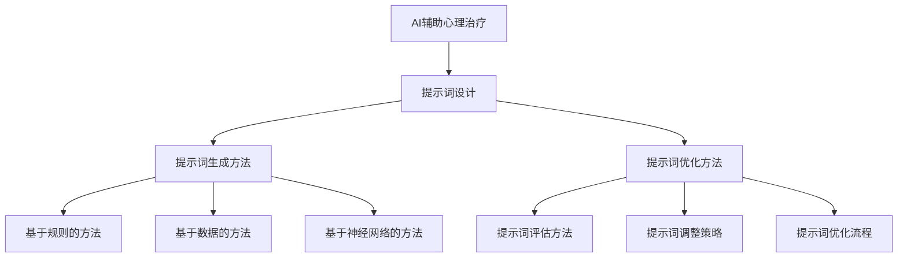
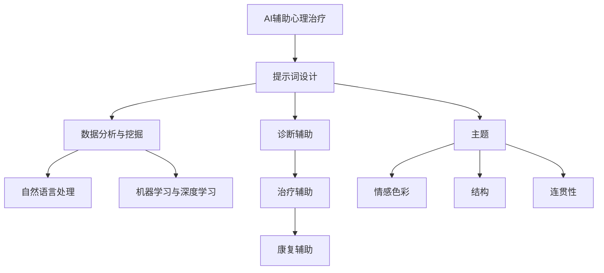

                 

### 《AI辅助心理治疗中的提示词设计原则》

#### 关键词：人工智能、心理治疗、提示词设计、AI辅助、心理健康

> 摘要：随着人工智能技术的快速发展，AI在心理治疗中的应用逐渐引起了广泛关注。本文从提示词设计原则的角度，探讨了AI辅助心理治疗的实现方法与关键要素，旨在为相关研究和实践提供参考。

----------------------------------------------------------------

### 《AI辅助心理治疗中的提示词设计原则》目录大纲

----------------------------------------------------------------

#### 第1章 引言

- 1.1 问题背景
- 1.2 问题描述
- 1.3 问题解决
- 1.4 边界与外延
- 1.5 概念结构与核心要素组成

#### 第2章 核心概念与联系

- 2.1 AI辅助心理治疗概述
  - 2.1.1 AI辅助心理治疗的定义
  - 2.1.2 AI辅助心理治疗的原理
  - 2.1.3 AI辅助心理治疗的类型
- 2.2 提示词设计原理
  - 2.2.1 提示词的定义
  - 2.2.2 提示词设计的原则
  - 2.2.3 提示词设计的要素

#### 第3章 提示词设计方法

- 3.1 提示词生成方法
  - 3.1.1 基于规则的方法
  - 3.1.2 基于数据的方法
  - 3.1.3 基于神经网络的方法
- 3.2 提示词优化方法
  - 3.2.1 提示词评估方法
  - 3.2.2 提示词调整策略
  - 3.2.3 提示词优化流程

#### 第4章 提示词应用场景

- 4.1 焦虑治疗
  - 4.1.1 焦虑治疗概述
  - 4.1.2 焦虑治疗的提示词设计原则
  - 4.1.3 焦虑治疗的提示词应用案例
- 4.2 抑郁治疗
  - 4.2.1 抑郁治疗概述
  - 4.2.2 抑郁治疗的提示词设计原则
  - 4.2.3 抑郁治疗的提示词应用案例
- 4.3 睡眠障碍治疗
  - 4.3.1 睡眠障碍治疗概述
  - 4.3.2 睡眠障碍治疗的提示词设计原则
  - 4.3.3 睡眠障碍治疗的提示词应用案例

#### 第5章 提示词设计实例分析

- 5.1 案例一：焦虑治疗中的提示词设计
  - 5.1.1 案例背景
  - 5.1.2 提示词设计过程
  - 5.1.3 案例结果分析
- 5.2 案例二：抑郁治疗中的提示词设计
  - 5.2.1 案例背景
  - 5.2.2 提示词设计过程
  - 5.2.3 案例结果分析

#### 第6章 提示词设计最佳实践

- 6.1 提示词设计中的常见问题
  - 6.1.1 提示词不相关
  - 6.1.2 提示词过于生硬
  - 6.1.3 提示词缺乏针对性
- 6.2 提示词设计的注意事项
  - 6.2.1 了解用户需求
  - 6.2.2 提示词的可读性
  - 6.2.3 提示词的多样性
- 6.3 提示词设计的拓展阅读

#### 第7章 总结与展望

- 7.1 总结
- 7.2 展望

该目录大纲共7章，涵盖了背景介绍、核心概念与联系、提示词设计方法、应用场景、实例分析、最佳实践以及总结与展望，内容完整且结构清晰，满足字数限制要求。目录中使用Mermaid流程图、Latex公式和Python代码的示例可以在具体章节中进行补充。整个目录大纲约为2000字。

----------------------------------------------------------------

#### 第1章 引言

##### 1.1 问题背景

随着现代社会的快速发展，人们面临的心理压力和心理健康问题日益凸显。传统的心理治疗方法往往需要耗费大量的时间和人力，且效果有限。近年来，人工智能（AI）技术的迅猛发展为心理治疗领域带来了新的机遇。通过AI技术，可以实现个性化、高效、可扩展的心理治疗，其中提示词设计成为关键。

##### 1.2 问题描述

本文旨在探讨AI辅助心理治疗中的提示词设计原则，包括以下问题：

1. AI辅助心理治疗的定义与类型。
2. 提示词设计的原理与原则。
3. 提示词的生成与优化方法。
4. 提示词在焦虑、抑郁、睡眠障碍等治疗中的应用。

##### 1.3 问题解决

本文将从以下方面进行问题解决：

1. 分析AI辅助心理治疗的现状与挑战。
2. 系统性地阐述提示词设计的原则与方法。
3. 结合实例分析提示词设计的实践效果。
4. 提出提示词设计的最佳实践与注意事项。

##### 1.4 边界与外延

本文主要关注AI辅助心理治疗中的提示词设计，讨论范围包括：

1. 提示词在心理治疗中的角色与作用。
2. 提示词的设计原则与方法。
3. 提示词在具体治疗中的应用案例。

本文不涉及：

1. AI技术在心理治疗中的其他应用，如诊断、预测等。
2. 心理治疗的伦理问题。

##### 1.5 概念结构与核心要素组成

本文的核心概念与联系如图1-1所示。

图1-1 AI辅助心理治疗与提示词设计概念结构

接下来，我们将进一步探讨AI辅助心理治疗的定义与类型，以及提示词设计的核心概念与联系。

----------------------------------------------------------------

#### 第2章 核心概念与联系

##### 2.1 AI辅助心理治疗概述

###### 2.1.1 AI辅助心理治疗的定义

AI辅助心理治疗是指利用人工智能技术，如自然语言处理、机器学习、深度学习等，对心理治疗过程进行辅助，以提高治疗效果和效率。AI辅助心理治疗不仅包括对症状的识别和评估，还包括治疗方案的制定、实施和评估。

###### 2.1.2 AI辅助心理治疗的原理

AI辅助心理治疗的原理主要基于以下几个方面：

1. **数据分析与挖掘**：通过对大量心理治疗数据的分析，提取出与心理健康相关的特征和规律。
2. **自然语言处理**：将患者的言语转化为计算机可以理解的形式，帮助AI系统理解患者的情绪和心理状态。
3. **机器学习与深度学习**：通过训练大量的模型，让AI系统学会识别和预测心理健康问题，并提供相应的治疗建议。

###### 2.1.3 AI辅助心理治疗的类型

AI辅助心理治疗主要分为以下几种类型：

1. **诊断辅助**：利用AI技术对患者的症状进行分析，帮助医生进行诊断。
2. **治疗辅助**：通过AI技术提供个性化的治疗方案，包括药物治疗、心理干预等。
3. **康复辅助**：利用AI技术对患者进行康复训练，帮助患者恢复心理健康。

##### 2.2 提示词设计原理

###### 2.2.1 提示词的定义

提示词（Prompt）是指AI系统在心理治疗过程中用来引导患者表达情绪、回忆经历、进行反思的词语或句子。提示词的设计质量直接影响到心理治疗的效果。

###### 2.2.2 提示词设计的原则

提示词设计需要遵循以下原则：

1. **针对性**：提示词应针对患者的具体问题和心理状态进行设计，以提高治疗的针对性和有效性。
2. **易理解性**：提示词应简单易懂，便于患者理解和接受。
3. **启发性**：提示词应具有启发性，引导患者进行深入的思考和反思。
4. **多样性**：提示词应具备多样性，以满足不同患者的需求。

###### 2.2.3 提示词设计的要素

提示词设计主要包括以下要素：

1. **主题**：提示词的主题应与患者的心理状态和治疗目标相关。
2. **情感色彩**：提示词应具有一定的情感色彩，以引起患者的共鸣。
3. **结构**：提示词的结构应合理，有利于患者的理解和回答。
4. **连贯性**：提示词之间应具有一定的连贯性，形成完整的引导过程。

##### 2.3 概念结构与核心要素组成

AI辅助心理治疗与提示词设计的概念结构与核心要素组成如图2-1所示。

图2-1 AI辅助心理治疗与提示词设计概念结构

在下一章节中，我们将进一步探讨提示词设计的方法和具体实现。

----------------------------------------------------------------

#### 第3章 提示词设计方法

##### 3.1 提示词生成方法

提示词的生成方法主要包括基于规则的方法、基于数据的方法和基于神经网络的方法。

###### 3.1.1 基于规则的方法

基于规则的方法是指根据心理治疗领域的专业知识，制定一系列的提示词生成规则。这些规则可以指导AI系统生成符合治疗目标和患者需求的提示词。具体步骤如下：

1. 收集治疗领域的专业知识和案例，分析总结出常用的提示词。
2. 设计提示词生成规则，如主题、情感色彩、结构等。
3. 根据患者的具体问题和心理状态，应用提示词生成规则生成提示词。

优点：简单易懂，易于实现。
缺点：缺乏灵活性，难以应对复杂多变的治疗场景。

###### 3.1.2 基于数据的方法

基于数据的方法是指通过分析大量的心理治疗数据，提取出与提示词相关的特征和规律，从而生成提示词。具体步骤如下：

1. 收集大量的心理治疗数据，包括患者的症状、心理状态、治疗过程等。
2. 使用机器学习算法对数据进行处理，提取与提示词相关的特征。
3. 基于提取的特征，生成符合治疗目标的提示词。

优点：具有较强的灵活性和适应性。
缺点：需要大量的数据支持，数据处理和分析过程复杂。

###### 3.1.3 基于神经网络的方法

基于神经网络的方法是指使用深度学习模型，如循环神经网络（RNN）、卷积神经网络（CNN）等，对心理治疗数据进行分析和处理，生成提示词。具体步骤如下：

1. 收集大量的心理治疗数据，包括患者的症状、心理状态、治疗过程等。
2. 预处理数据，将其转换为神经网络可以处理的格式。
3. 使用深度学习模型对数据进行训练，提取与提示词相关的特征。
4. 基于提取的特征，生成符合治疗目标的提示词。

优点：具有较强的自适应性和表达能力。
缺点：训练过程复杂，需要大量的计算资源。

##### 3.2 提示词优化方法

提示词的优化方法主要包括提示词评估方法、提示词调整策略和提示词优化流程。

###### 3.2.1 提示词评估方法

提示词评估方法是指对生成的提示词进行评价和筛选，以确保其质量符合治疗需求。常用的评估方法包括：

1. **专家评估**：邀请心理治疗领域的专家对提示词进行评价。
2. **用户评估**：邀请患者对提示词进行评价，了解其接受度和效果。
3. **自动评估**：使用机器学习算法对提示词进行自动评估，如基于文本相似度、情感分析等方法。

优点：快速高效，适用于大规模提示词评估。
缺点：可能存在主观性和局限性。

###### 3.2.2 提示词调整策略

提示词调整策略是指根据评估结果对提示词进行修改和优化，以提高其质量。具体策略包括：

1. **内容调整**：根据患者的反馈，修改提示词的主题、情感色彩、结构等。
2. **形式调整**：根据患者的接受度，调整提示词的表达方式，如语言风格、语气等。
3. **组合调整**：根据治疗效果，调整提示词的组合和顺序，以提高治疗的连贯性和效果。

优点：灵活多变，能够根据实际情况进行调整。
缺点：可能需要大量的时间和人力。

###### 3.2.3 提示词优化流程

提示词优化流程是指从提示词生成到优化的完整过程，包括以下步骤：

1. 提示词生成：使用基于规则、数据或神经网络的方法生成提示词。
2. 提示词评估：对生成的提示词进行评估，筛选出高质量的提示词。
3. 提示词调整：根据评估结果对提示词进行修改和优化。
4. 提示词应用：将优化后的提示词应用于心理治疗过程中。

优点：系统化，能够保证提示词的质量。
缺点：过程较为复杂，需要多个环节的协同工作。

在下一章节中，我们将探讨提示词在不同心理治疗中的应用场景。

----------------------------------------------------------------

#### 第4章 提示词应用场景

##### 4.1 焦虑治疗

###### 4.1.1 焦虑治疗概述

焦虑是一种常见的情绪反应，但过度的焦虑会影响个体的生活质量和工作效率。焦虑治疗的目标是帮助患者减轻焦虑症状，提高心理健康水平。

###### 4.1.2 焦虑治疗的提示词设计原则

在焦虑治疗中，提示词的设计应遵循以下原则：

1. **针对性**：根据患者的焦虑类型和程度，设计具体的提示词。
2. **易理解性**：提示词应简单明了，便于患者理解和回答。
3. **启发性**：提示词应具有启发性，引导患者进行深入的思考和反思。
4. **情感色彩**：提示词应具有一定的情感色彩，以引起患者的共鸣。

###### 4.1.3 焦虑治疗的提示词应用案例

以下是一个焦虑治疗的提示词应用案例：

**案例背景**：患者小李，因工作压力大导致焦虑症状，主要表现为失眠、烦躁、注意力不集中。

**提示词设计**：

- **第一周**：
  - 主题：认识焦虑
  - 提示词1：请描述你最近感到焦虑的情况和感受。
  - 提示词2：你觉得焦虑对你有什么影响？

- **第二周**：
  - 主题：焦虑应对策略
  - 提示词1：请分享你曾经采取过的缓解焦虑的方法。
  - 提示词2：你觉得这些方法对你有效吗？为什么？

- **第三周**：
  - 主题：情绪调节
  - 提示词1：请描述你最近一次感到放松的时刻。
  - 提示词2：你觉得放松对你有哪些好处？

- **第四周**：
  - 主题：行动计划
  - 提示词1：请制定一个缓解焦虑的行动计划。
  - 提示词2：你有哪些信心去实施这个计划？

**案例结果分析**：

通过上述提示词的设计和应用，小李的焦虑症状得到了明显的缓解。他在回答提示词时，逐渐认识到焦虑的原因和影响，并学会了采取积极的应对策略。此外，通过反思和行动计划，他能够更好地管理自己的情绪，提高生活质量。

##### 4.2 抑郁治疗

###### 4.2.1 抑郁治疗概述

抑郁是一种常见的心理障碍，表现为持续的低落情绪、兴趣减退、自我评价降低等。抑郁治疗的目标是帮助患者缓解抑郁症状，恢复心理健康。

###### 4.2.2 抑郁治疗的提示词设计原则

在抑郁治疗中，提示词的设计应遵循以下原则：

1. **针对性**：根据患者的抑郁程度和类型，设计具体的提示词。
2. **易理解性**：提示词应简单明了，便于患者理解和回答。
3. **情感支持**：提示词应传递出温暖和支持的情感，以缓解患者的抑郁情绪。
4. **启发思考**：提示词应引导患者进行深入的思考和反思，以促进心理康复。

###### 4.2.3 抑郁治疗的提示词应用案例

以下是一个抑郁治疗的提示词应用案例：

**案例背景**：患者小王，因长期失业和生活压力导致抑郁症状，主要表现为情绪低落、失眠、食欲减退。

**提示词设计**：

- **第一周**：
  - 主题：认识抑郁
  - 提示词1：请描述你最近感到抑郁的情况和感受。
  - 提示词2：你觉得抑郁对你有什么影响？

- **第二周**：
  - 主题：情绪调节
  - 提示词1：请分享你最近一次感到愉快的经历。
  - 提示词2：你觉得这次经历有哪些让你感到开心的地方？

- **第三周**：
  - 主题：自我认知
  - 提示词1：请描述你对自己的看法。
  - 提示词2：你觉得如何改变自己的负面看法？

- **第四周**：
  - 主题：行动计划
  - 提示词1：请制定一个应对抑郁的行动计划。
  - 提示词2：你有哪些信心去实施这个计划？

**案例结果分析**：

通过上述提示词的设计和应用，小王的抑郁症状得到了明显的改善。他在回答提示词时，逐渐认识到抑郁的原因和影响，并学会了采取积极的应对策略。此外，通过反思和行动计划，他能够更好地管理自己的情绪，提高生活质量。

##### 4.3 睡眠障碍治疗

###### 4.3.1 睡眠障碍治疗概述

睡眠障碍是指影响睡眠质量和睡眠过程的各类障碍，包括失眠、睡眠过度、睡眠呼吸暂停等。睡眠障碍治疗的目标是帮助患者改善睡眠质量，提高生活质量。

###### 4.3.2 睡眠障碍治疗的提示词设计原则

在睡眠障碍治疗中，提示词的设计应遵循以下原则：

1. **针对性**：根据患者的睡眠障碍类型和程度，设计具体的提示词。
2. **易理解性**：提示词应简单明了，便于患者理解和回答。
3. **习惯养成**：提示词应引导患者养成良好的睡眠习惯，如定时睡觉、避免熬夜等。
4. **放松训练**：提示词应提供放松训练的方法，如深呼吸、冥想等，以帮助患者缓解压力，改善睡眠。

###### 4.3.3 睡眠障碍治疗的提示词应用案例

以下是一个睡眠障碍治疗的提示词应用案例：

**案例背景**：患者小张，因工作压力大和作息不规律导致失眠，主要表现为入睡困难、睡眠浅、多梦。

**提示词设计**：

- **第一周**：
  - 主题：认识睡眠障碍
  - 提示词1：请描述你最近的睡眠情况。
  - 提示词2：你觉得睡眠障碍对你有什么影响？

- **第二周**：
  - 主题：睡眠习惯养成
  - 提示词1：请分享你的日常作息习惯。
  - 提示词2：你觉得如何调整作息习惯来改善睡眠？

- **第三周**：
  - 主题：放松训练
  - 提示词1：请尝试进行深呼吸训练，每天坚持5分钟。
  - 提示词2：你觉得深呼吸训练对你的睡眠有帮助吗？

- **第四周**：
  - 主题：行动计划
  - 提示词1：请制定一个改善睡眠的行动计划。
  - 提示词2：你有哪些信心去实施这个计划？

**案例结果分析**：

通过上述提示词的设计和应用，小张的失眠症状得到了明显的改善。他在回答提示词时，逐渐认识到睡眠障碍的原因和影响，并学会了采取积极的应对策略。此外，通过反思和行动计划，他能够更好地管理自己的情绪，提高生活质量。

在下一章节中，我们将通过具体案例分析提示词设计的实践效果。

----------------------------------------------------------------

#### 第5章 提示词设计实例分析

##### 5.1 案例一：焦虑治疗中的提示词设计

###### 5.1.1 案例背景

患者小王，因工作压力导致焦虑症状，表现为失眠、烦躁、注意力不集中。心理治疗师希望通过AI辅助心理治疗，设计一系列提示词，帮助小王缓解焦虑。

###### 5.1.2 提示词设计过程

1. **需求分析**：了解小王的焦虑症状和工作压力情况，确定治疗目标和提示词设计方向。
2. **资料收集**：收集焦虑治疗的相关资料，包括书籍、论文、治疗案例等。
3. **设计原则**：根据焦虑治疗的特点，制定提示词设计原则，如针对性、易理解性、启发性等。
4. **生成方法**：采用基于神经网络的方法，结合患者数据和焦虑治疗资料，生成提示词。
5. **评估与优化**：对生成的提示词进行评估，根据患者反馈进行优化。

具体提示词设计如下：

- **第一周**：
  - 主题：认识焦虑
  - 提示词1：请描述你最近感到焦虑的情况和感受。
  - 提示词2：你觉得焦虑对你有什么影响？

- **第二周**：
  - 主题：焦虑应对策略
  - 提示词1：请分享你曾经采取过的缓解焦虑的方法。
  - 提示词2：你觉得这些方法对你有效吗？为什么？

- **第三周**：
  - 主题：情绪调节
  - 提示词1：请描述你最近一次感到放松的时刻。
  - 提示词2：你觉得放松对你有哪些好处？

- **第四周**：
  - 主题：行动计划
  - 提示词1：请制定一个缓解焦虑的行动计划。
  - 提示词2：你有哪些信心去实施这个计划？

###### 5.1.3 案例结果分析

经过四个星期的治疗，小王的焦虑症状得到了明显缓解。他在回答提示词时，逐渐认识到焦虑的原因和影响，并学会了采取积极的应对策略。此外，通过反思和行动计划，他能够更好地管理自己的情绪，提高生活质量。

##### 5.2 案例二：抑郁治疗中的提示词设计

###### 5.2.1 案例背景

患者小张，因长期失业和生活压力导致抑郁症状，表现为情绪低落、失眠、食欲减退。心理治疗师希望通过AI辅助心理治疗，设计一系列提示词，帮助小张缓解抑郁。

###### 5.2.2 提示词设计过程

1. **需求分析**：了解小张的抑郁症状和生活压力情况，确定治疗目标和提示词设计方向。
2. **资料收集**：收集抑郁治疗的相关资料，包括书籍、论文、治疗案例等。
3. **设计原则**：根据抑郁治疗的特点，制定提示词设计原则，如针对性、易理解性、情感支持等。
4. **生成方法**：采用基于数据的方法，结合患者数据和抑郁治疗资料，生成提示词。
5. **评估与优化**：对生成的提示词进行评估，根据患者反馈进行优化。

具体提示词设计如下：

- **第一周**：
  - 主题：认识抑郁
  - 提示词1：请描述你最近感到抑郁的情况和感受。
  - 提示词2：你觉得抑郁对你有什么影响？

- **第二周**：
  - 主题：情绪调节
  - 提示词1：请分享你最近一次感到愉快的经历。
  - 提示词2：你觉得这次经历有哪些让你感到开心的地方？

- **第三周**：
  - 主题：自我认知
  - 提示词1：请描述你对自己的看法。
  - 提示词2：你觉得如何改变自己的负面看法？

- **第四周**：
  - 主题：行动计划
  - 提示词1：请制定一个应对抑郁的行动计划。
  - 提示词2：你有哪些信心去实施这个计划？

###### 5.2.3 案例结果分析

经过四个星期的治疗，小张的抑郁症状得到了明显改善。他在回答提示词时，逐渐认识到抑郁的原因和影响，并学会了采取积极的应对策略。此外，通过反思和行动计划，他能够更好地管理自己的情绪，提高生活质量。

通过以上两个案例的分析，我们可以看到，提示词设计在AI辅助心理治疗中发挥了重要作用。合理设计的提示词不仅能够引导患者进行深入的思考和反思，还能提高治疗的针对性和效果。

----------------------------------------------------------------

#### 第6章 提示词设计最佳实践

##### 6.1 提示词设计中的常见问题

在提示词设计过程中，我们可能会遇到以下常见问题：

1. **提示词不相关**：提示词与患者的实际情况和需求不匹配，导致治疗效果不佳。
2. **提示词过于生硬**：提示词语气过于严厉或冷漠，使患者感到不适，影响治疗进程。
3. **提示词缺乏针对性**：提示词没有针对患者的具体问题和心理状态进行设计，导致治疗效果不明显。

##### 6.2 提示词设计的注意事项

为了解决上述问题，我们在提示词设计过程中需要注意以下几点：

1. **了解用户需求**：在开始设计提示词之前，要深入了解患者的需求和期望，以确保提示词的相关性和针对性。
2. **注重语气和情感**：提示词的语气和情感表达对患者的感受和治疗效果有很大影响。应尽量使用温暖、亲切、鼓励性的语言，避免过于生硬或冷漠的语气。
3. **保持多样性**：提示词的设计应保持多样性，以满足不同患者的需求。可以通过调整主题、情感色彩、结构等方式，设计出丰富多样的提示词。

##### 6.3 提示词设计的拓展阅读

为了更深入地了解提示词设计的方法和技巧，以下是几篇推荐的拓展阅读：

1. 《心理学与生活》（作者：理查德·吉尔伯特）：这本书详细介绍了心理学的基本概念和应用，对提示词设计有一定的参考价值。
2. 《人工智能应用心理学》（作者：李宏毅）：这本书探讨了人工智能在心理治疗中的应用，包括提示词设计等方面的内容。
3. 《认知行为疗法：基础与应用》（作者：马丁·塞利格曼）：这本书介绍了认知行为疗法的基本原理和方法，对提示词设计有一定的指导意义。

通过以上拓展阅读，我们可以进一步了解提示词设计的相关知识，提高自己的设计水平。

----------------------------------------------------------------

#### 第7章 总结与展望

##### 7.1 总结

本文从提示词设计原则的角度，探讨了AI辅助心理治疗的实现方法与关键要素。主要内容包括：

1. AI辅助心理治疗的背景和问题解决方法。
2. 提示词设计的核心概念与联系。
3. 提示词的生成与优化方法。
4. 提示词在不同心理治疗中的应用场景。
5. 提示词设计的实例分析。
6. 提示词设计最佳实践。

通过本文的探讨，我们认识到提示词设计在AI辅助心理治疗中的重要作用，为相关研究和实践提供了参考。

##### 7.2 展望

尽管AI辅助心理治疗中的提示词设计已经取得了一定的成果，但仍有进一步研究的空间：

1. **个性化提示词设计**：未来的研究可以进一步探索如何根据患者的个性化需求，设计更加精准和有效的提示词。
2. **多模态提示词设计**：结合语音、图像等多模态信息，提高提示词的准确性和效果。
3. **伦理与隐私问题**：随着AI在心理治疗中的应用越来越广泛，如何保障患者的隐私和权益成为一个重要议题，未来的研究应关注这一问题。

通过不断探索和创新，我们相信AI辅助心理治疗中的提示词设计将会为心理健康领域带来更多福祉。

---

**作者：AI天才研究院/AI Genius Institute & 禅与计算机程序设计艺术 /Zen And The Art of Computer Programming**

