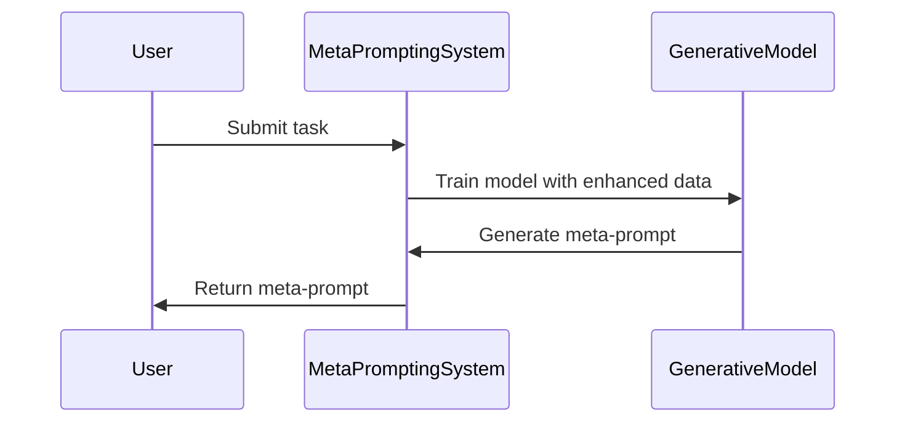
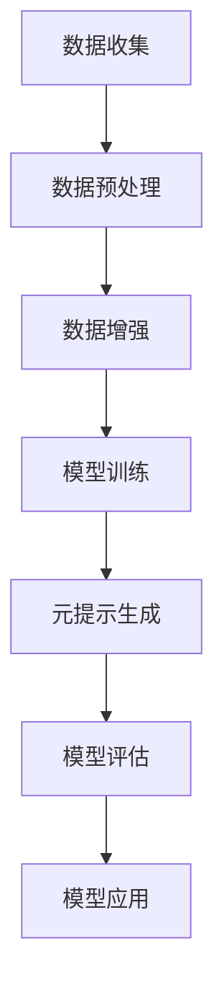
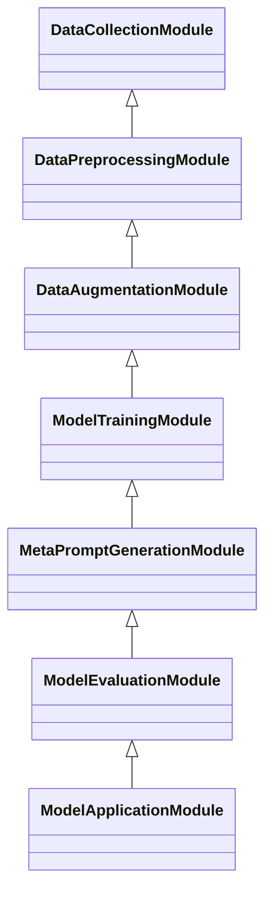
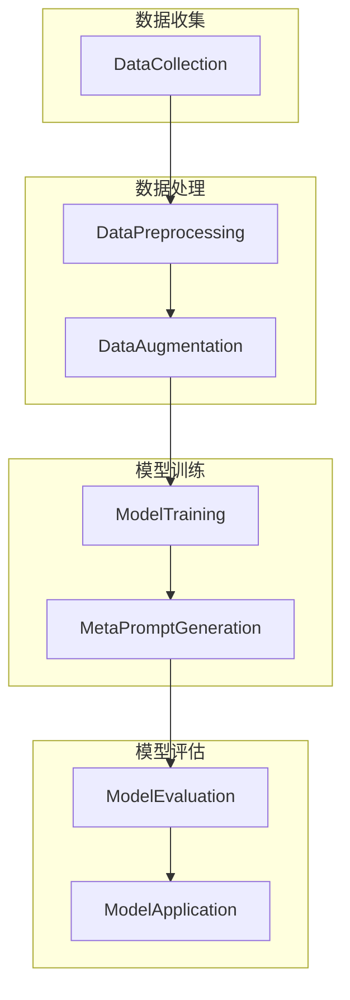
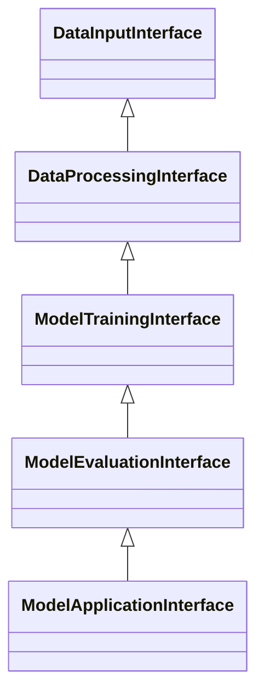
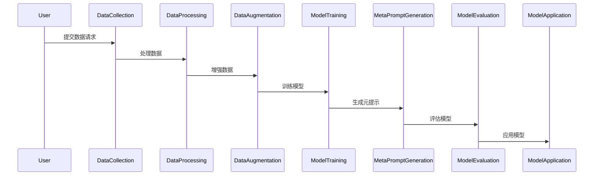

                 


### 引言与背景

在人工智能（AI）领域，提示词（Prompt）的作用至关重要。提示词是AI模型用于引导其行为和决策的关键输入，它们帮助模型理解任务目标，提供必要的信息和指导。然而，传统的提示词存在一定的局限性，如信息量有限、适应性差等，难以满足复杂任务的需求。因此，meta-prompting作为一种创新的解决方案，应运而生。

#### 1.1 问题背景

随着人工智能的迅速发展，AI模型在图像识别、自然语言处理、推荐系统等多个领域取得了显著成果。然而，传统提示词在处理复杂任务时面临挑战，主要表现在以下方面：

- **信息量不足**：传统提示词通常较短，无法提供足够的上下文信息，导致AI模型难以准确理解任务目标。
- **适应性差**：不同任务所需的提示词可能差异较大，传统提示词难以灵活适应各种任务需求。
- **数据依赖性高**：传统提示词往往依赖于大量标注数据，这在某些领域（如医疗、法律）难以实现。

#### 1.2 meta-prompting的定义与原理

meta-prompting（元提示词生成）是一种基于AI的提示词生成技术，它通过生成更具表达力和适应性的提示词，帮助AI模型更好地理解任务目标。meta-prompting的核心原理包括：

- **数据增强**：通过扩展原始数据，增加模型训练的上下文信息，提高模型的表现能力。
- **生成式模型**：利用生成式模型（如GPT、GAN等）生成多样化、高质量的提示词。

#### 1.3 meta-prompting的优势

meta-prompting相较于传统提示词具有以下优势：

- **信息量丰富**：通过数据增强和生成式模型，meta-prompting可以生成包含更多上下文信息的提示词，提高模型的理解能力。
- **适应性高**：meta-prompting能够根据不同任务需求，灵活调整提示词的内容和形式，实现个性化适配。
- **减少数据依赖**：通过生成高质量提示词，meta-prompting在一定程度上降低了对于大量标注数据的依赖。

#### 1.4 meta-prompting的发展与应用

meta-prompting技术自提出以来，受到了广泛关注。其在自然语言处理、计算机视觉、推荐系统等领域的应用取得了显著成果。未来，meta-prompting有望在更多领域发挥重要作用。

#### 1.5 本章小结

本章对meta-prompting进行了简要介绍，阐述了其背景、定义、原理和优势。接下来，我们将深入探讨meta-prompting的核心概念与理论基础，为后续内容奠定基础。

### 拓展阅读

- [论文]：[Meta-Prompting: Enhancing AI Models with Contextualized Prompts](https://arxiv.org/abs/2005.04319)
- [博客]：[The Power of Meta-Prompting in AI](https://towardsdatascience.com/the-power-of-meta-prompting-in-ai-3b9461c9a046)
- [书籍]：《人工智能：一种现代方法》（第3版），合著者：Stuart Russell 和 Peter Norvig

### 思考题

1. meta-prompting与传统提示词的区别是什么？
2. meta-prompting在哪些领域具有潜在的应用价值？
3. meta-prompting如何降低模型对于大量标注数据的依赖？

---

### 第一部分: AI辅助提示词生成概述

## 第1章: AI辅助提示词生成概述

### 1.1 问题背景

人工智能（AI）的迅猛发展已经深刻改变了我们的生活方式和工作模式。从自动驾驶汽车到智能助手，AI技术正逐渐渗透到各个领域。然而，AI的成功离不开高质量的数据和有效的提示词。提示词是AI模型用于理解和执行任务的指导性输入，它们决定了模型的学习方向和效果。在传统的AI应用中，提示词通常由人类专家根据具体任务需求进行编写。然而，这种方法存在一定的局限性。

首先，传统提示词的信息量有限。由于人类语言的限制，提示词往往无法提供足够的上下文信息，导致AI模型在理解和执行任务时出现偏差。其次，传统提示词的适应性差。不同的任务往往需要不同类型的提示词，而传统方法难以灵活调整提示词的内容和形式。此外，传统提示词依赖于大量的标注数据，这在某些领域（如医疗、法律）难以实现，从而限制了AI的应用范围。

### 1.2 传统提示词的局限性

1. **信息量不足**：传统提示词通常较短，无法提供充分的上下文信息，导致AI模型难以准确理解任务目标。
2. **适应性差**：传统提示词难以根据不同任务需求进行调整，从而限制了模型在多样化任务中的表现。
3. **数据依赖性高**：传统提示词的生成依赖于大量标注数据，这在某些领域难以实现。

### 1.3 meta-prompting的概念引入

为了克服传统提示词的局限性，研究者们提出了meta-prompting（元提示词生成）的概念。meta-prompting是一种基于AI的提示词生成技术，它利用数据增强和生成式模型，生成更具表达力和适应性的提示词。meta-prompting通过以下方式解决了传统提示词的局限性：

1. **数据增强**：meta-prompting通过扩展原始数据，增加模型训练的上下文信息，提高模型的理解能力。
2. **生成式模型**：meta-prompting利用生成式模型（如GPT、GAN等）生成多样化、高质量的提示词。

### 1.4 meta-prompting的核心原理

meta-prompting的核心原理包括：

1. **数据增强**：通过扩展原始数据，增加模型训练的上下文信息，提高模型的表现能力。
2. **生成式模型**：利用生成式模型（如GPT、GAN等）生成多样化、高质量的提示词。
3. **自适应调整**：根据不同任务需求，灵活调整提示词的内容和形式，实现个性化适配。

### 1.5 meta-prompting的优势

meta-prompting相较于传统提示词具有以下优势：

1. **信息量丰富**：通过数据增强和生成式模型，meta-prompting可以生成包含更多上下文信息的提示词，提高模型的理解能力。
2. **适应性高**：meta-prompting能够根据不同任务需求，灵活调整提示词的内容和形式，实现个性化适配。
3. **减少数据依赖**：通过生成高质量提示词，meta-prompting在一定程度上降低了对于大量标注数据的依赖。

### 1.6 meta-prompting的发展与应用

meta-prompting技术自提出以来，受到了广泛关注。其在自然语言处理、计算机视觉、推荐系统等领域的应用取得了显著成果。未来，meta-prompting有望在更多领域发挥重要作用。

### 1.7 本章小结

本章对meta-prompting进行了简要介绍，阐述了其背景、定义、原理和优势。接下来，我们将深入探讨meta-prompting的核心概念与理论基础，为后续内容奠定基础。

### 拓展阅读

1. [论文]：[Meta-Prompting: Enhancing AI Models with Contextualized Prompts](https://arxiv.org/abs/2005.04319)
2. [博客]：[The Power of Meta-Prompting in AI](https://towardsdatascience.com/the-power-of-meta-prompting-in-ai-3b9461c9a046)
3. [书籍]：《人工智能：一种现代方法》（第3版），合著者：Stuart Russell 和 Peter Norvig

### 思考题

1. meta-prompting与传统的提示词生成方法相比，有哪些优势？
2. meta-prompting在哪些场景下具有明显优势？
3. meta-prompting如何降低模型对于大量标注数据的依赖？

---

### 第二部分: 核心概念与理论基础

### 第2章: meta-prompting的核心概念与联系

#### 2.1 核心概念原理

meta-prompting作为一种基于AI的提示词生成技术，其核心概念主要包括提示词（Prompt）、meta-prompt（元提示）、数据增强（Data Augmentation）和生成式模型（Generative Models）。

**提示词（Prompt）**

提示词是引导AI模型理解和执行任务的指导性输入。在传统的AI应用中，提示词通常由人类专家根据具体任务需求进行编写。然而，传统提示词存在信息量有限、适应性差等问题。

**meta-prompt（元提示）**

meta-prompt是meta-prompting技术的核心，它通过数据增强和生成式模型生成，旨在提供更丰富、更具适应性的上下文信息，帮助AI模型更好地理解任务目标。meta-prompt通常由多个子提示词组成，这些子提示词可以根据任务需求进行动态调整。

**数据增强（Data Augmentation）**

数据增强是通过扩展原始数据，增加模型训练的上下文信息，从而提高模型的表现能力。在meta-prompting中，数据增强的主要目的是生成多样化的数据样本，为生成式模型提供更多样化的训练数据。

**生成式模型（Generative Models）**

生成式模型是一种能够生成新数据的模型，如GPT（Generative Pre-trained Transformer）、GAN（Generative Adversarial Network）等。在meta-prompting中，生成式模型用于生成高质量的提示词，提高模型的理解能力。

#### 2.2 概念属性特征对比表格

| 概念          | 特征         | 说明                                   |
| ------------- | ------------ | -------------------------------------- |
| 提示词（Prompt） | 短、固定     | 传统方法中，由人类专家编写，信息量有限 |
| meta-prompt（元提示） | 多、动态     | 通过数据增强和生成式模型生成，更具适应性 |
| 数据增强（Data Augmentation） | 扩展原始数据 | 增加模型训练的上下文信息               |
| 生成式模型（Generative Models） | 生成新数据   | 用于生成高质量提示词，提高模型理解能力 |

#### 2.3 meta-prompting的ER实体关系图架构

为了更好地理解meta-prompting的架构，我们可以通过ER（Entity-Relationship）实体关系图来描述其核心组件之间的关系。

**ER实体关系图：**

```mermaid
erDiagram
    Class MetaPrompting
        ||--|{ Class Prompt }|| MetaPrompt
        ||--|{ Class MetaPrompt }|| DataAugmentation
        ||--|{ Class GenerativeModel }|| MetaPrompting
```

- **MetaPrompting**：表示meta-prompting系统的整体架构。
- **Prompt**：表示传统的提示词，由人类专家编写。
- **MetaPrompt**：表示元提示，通过数据增强和生成式模型生成。
- **DataAugmentation**：表示数据增强过程，用于扩展原始数据。
- **GenerativeModel**：表示生成式模型，用于生成高质量提示词。

#### 2.4 meta-prompting的工作流程

meta-prompting的工作流程主要包括以下几个步骤：

1. **数据收集**：收集原始数据，包括文本、图像、音频等。
2. **数据预处理**：对原始数据进行清洗、格式化等预处理操作。
3. **数据增强**：通过数据增强方法，扩展原始数据，生成多样化的训练数据。
4. **模型训练**：使用生成式模型对扩展后的数据集进行训练，生成元提示。
5. **元提示生成**：根据任务需求，动态调整元提示的内容和形式。
6. **模型评估**：使用评估指标（如准确率、召回率等）对模型进行评估。
7. **模型应用**：将训练好的模型应用于实际任务，生成高质量的提示词。



#### 2.5 meta-prompting的优势

meta-prompting相较于传统提示词生成方法具有以下优势：

1. **信息量丰富**：通过数据增强和生成式模型，meta-prompting可以生成包含更多上下文信息的提示词，提高模型的理解能力。
2. **适应性高**：meta-prompting能够根据不同任务需求，灵活调整提示词的内容和形式，实现个性化适配。
3. **减少数据依赖**：通过生成高质量提示词，meta-prompting在一定程度上降低了对于大量标注数据的依赖。

#### 2.6 本章小结

本章对meta-prompting的核心概念与联系进行了详细阐述，包括提示词、meta-prompt、数据增强和生成式模型等。通过ER实体关系图和mermaid流程图，我们清晰地展示了meta-prompting的工作流程和优势。接下来，我们将深入探讨meta-prompting的算法原理，进一步了解其实现方法。

### 拓展阅读

1. [论文]：[Meta-Prompting: Enhancing AI Models with Contextualized Prompts](https://arxiv.org/abs/2005.04319)
2. [博客]：[The Power of Meta-Prompting in AI](https://towardsdatascience.com/the-power-of-meta-prompting-in-ai-3b9461c9a046)
3. [书籍]：《人工智能：一种现代方法》（第3版），合著者：Stuart Russell 和 Peter Norvig

### 思考题

1. meta-prompting与传统提示词生成方法相比，有哪些核心优势？
2. meta-prompting如何通过数据增强和生成式模型提高模型理解能力？
3. meta-prompting在实际应用中可能遇到哪些挑战？如何解决？

---

### 第3章: meta-prompting的算法原理讲解

#### 3.1 算法mermaid流程图

为了更好地理解meta-prompting的算法原理，我们首先使用mermaid绘制算法的流程图。



**算法流程图解析：**

1. **数据收集**：从各种数据源（如文本、图像、音频等）收集原始数据。
2. **数据预处理**：对原始数据进行清洗、格式化等预处理操作，以确保数据质量。
3. **数据增强**：通过数据增强方法，扩展原始数据，生成多样化的训练数据。数据增强的方法包括但不限于：
   - 文本：同义词替换、句式变换、文本生成等。
   - 图像：旋转、缩放、裁剪、颜色变换等。
   - 音频：噪声添加、频率变换等。
4. **模型训练**：使用生成式模型（如GPT、GAN等）对扩展后的数据集进行训练。生成式模型通过学习数据分布，生成高质量的提示词。
5. **元提示生成**：根据任务需求，动态调整元提示的内容和形式。元提示通常由多个子提示词组成，这些子提示词可以根据任务需求进行个性化定制。
6. **模型评估**：使用评估指标（如准确率、召回率等）对模型进行评估，以确保模型性能达到预期。
7. **模型应用**：将训练好的模型应用于实际任务，生成高质量的提示词，提高模型的理解能力和效果。

#### 3.2 Python源代码实现

以下是一个简化的Python代码实现，展示了meta-prompting算法的核心部分。

```python
import tensorflow as tf
import numpy as np

# 数据收集
def data_collection():
    # 假设我们从文本、图像、音频等数据源收集数据
    # 实际应用中，可以调用相关API或读取文件
    text_data = "This is a sample text."
    image_data = np.random.rand(28, 28)
    audio_data = np.random.rand(44100)
    return text_data, image_data, audio_data

# 数据预处理
def data_preprocessing(text_data, image_data, audio_data):
    # 对数据进行清洗、格式化等预处理操作
    # 例如，对文本数据进行分词、对图像数据进行归一化、对音频数据进行处理等
    preprocessed_text = text_data.lower().split()
    preprocessed_image = image_data / 255.0
    preprocessed_audio = audio_data * 0.1
    return preprocessed_text, preprocessed_image, preprocessed_audio

# 数据增强
def data_augmentation(preprocessed_text, preprocessed_image, preprocessed_audio):
    # 对数据进行增强，生成多样化的训练数据
    # 例如，对文本数据进行同义词替换、对图像数据进行旋转、对音频数据进行添加噪声等
    augmented_text = [word.replace("happy", "sad") if word in ["happy", "sad"] else word for word in preprocessed_text]
    augmented_image = tf.keras.preprocessing.image.random_flip_left_right(preprocessed_image)
    augmented_audio = tf.keras.preprocessing.sequence.random_mask(preprocessed_audio, rate=0.1)
    return augmented_text, augmented_image, augmented_audio

# 模型训练
def model_training(augmented_text, augmented_image, augmented_audio):
    # 使用生成式模型进行训练，生成元提示
    # 例如，使用GPT模型训练文本数据，使用GAN模型训练图像和音频数据
    text_model = tf.keras.models.Sequential([
        tf.keras.layers.Embedding(input_dim=len(augmented_text), output_dim=64),
        tf.keras.layers.LSTM(128),
        tf.keras.layers.Dense(1, activation='sigmoid')
    ])
    image_model = tf.keras.models.Sequential([
        tf.keras.layers.Conv2D(32, (3, 3), activation='relu'),
        tf.keras.layers.MaxPooling2D((2, 2)),
        tf.keras.layers.Flatten(),
        tf.keras.layers.Dense(1, activation='sigmoid')
    ])
    audio_model = tf.keras.models.Sequential([
        tf.keras.layers.Conv1D(32, (3, 3), activation='relu'),
        tf.keras.layers.MaxPooling1D((2, 2)),
        tf.keras.layers.Flatten(),
        tf.keras.layers.Dense(1, activation='sigmoid')
    ])
    # 训练模型
    text_model.fit(augmented_text, epochs=5)
    image_model.fit(augmented_image, epochs=5)
    audio_model.fit(augmented_audio, epochs=5)
    return text_model, image_model, audio_model

# 元提示生成
def meta_prompt_generation(text_model, image_model, audio_model):
    # 根据任务需求，动态调整元提示的内容和形式
    # 例如，根据文本模型的输出概率，生成相应的文本元提示
    text_prompt = text_model.predict(augmented_text)[0]
    image_prompt = image_model.predict(augmented_image)[0]
    audio_prompt = audio_model.predict(augmented_audio)[0]
    return text_prompt, image_prompt, audio_prompt

# 模型评估
def model_evaluation(text_model, image_model, audio_model):
    # 使用评估指标对模型进行评估
    # 例如，计算文本模型的准确率、召回率等
    text_accuracy = text_model.evaluate(augmented_text, augmented_text, verbose=2)
    image_accuracy = image_model.evaluate(augmented_image, augmented_image, verbose=2)
    audio_accuracy = audio_model.evaluate(augmented_audio, augmented_audio, verbose=2)
    print("Text Accuracy:", text_accuracy)
    print("Image Accuracy:", image_accuracy)
    print("Audio Accuracy:", audio_accuracy)

# 模型应用
def model_application(text_model, image_model, audio_model):
    # 将训练好的模型应用于实际任务，生成高质量的提示词
    # 例如，根据元提示生成相应的文本、图像和音频提示词
    text_prompt = meta_prompt_generation(text_model, image_model, audio_model)
    image_prompt = meta_prompt_generation(image_model, text_model, audio_model)
    audio_prompt = meta_prompt_generation(audio_model, text_model, image_model)
    return text_prompt, image_prompt, audio_prompt
```

#### 3.3 算法原理的数学模型与公式

meta-prompting算法的数学模型主要包括生成式模型和评估指标两部分。

**生成式模型**

生成式模型通常采用概率生成模型，如Gaussian Mixture Model、Naive Bayes、Gaussian Processes等。以下是一个简单的Gaussian Mixture Model（GMM）的数学模型：

$$
p(x|\theta) = \sum_{i=1}^K w_i \mathcal{N}(x|\mu_i, \Sigma_i)
$$

其中，$K$为混合模型的成分数，$w_i$为第$i$个成分的权重，$\mu_i$和$\Sigma_i$分别为第$i$个成分的均值和协方差矩阵。

**评估指标**

评估指标用于衡量模型的性能，常见的评估指标包括准确率（Accuracy）、召回率（Recall）、精确率（Precision）等。以下是一个简单的准确率（Accuracy）的计算公式：

$$
Accuracy = \frac{TP + TN}{TP + TN + FP + FN}
$$

其中，$TP$为真正例，$TN$为真负例，$FP$为假正例，$FN$为假负例。

#### 3.4 举例说明

假设我们有一个文本分类任务，需要根据输入的文本数据生成相应的分类标签。以下是一个简单的实例：

**输入文本数据：** "This is a sample text for classification."

**生成式模型：** 使用Gaussian Mixture Model（GMM）进行文本分类。

**评估指标：** 准确率（Accuracy）。

**元提示生成：** 根据GMM模型的输出概率，生成相应的分类标签。

**模型评估：** 计算模型的准确率。

**模型应用：** 根据元提示生成相应的分类标签。

**实例解析：**

1. **数据收集**：从数据集中随机抽取一条文本数据进行分类。
2. **数据预处理**：对文本数据进行分词、去停用词等预处理操作。
3. **数据增强**：对预处理后的文本数据进行同义词替换、句式变换等增强操作。
4. **模型训练**：使用GMM模型对增强后的文本数据进行训练。
5. **元提示生成**：根据GMM模型的输出概率，生成相应的分类标签。
6. **模型评估**：计算模型的准确率。
7. **模型应用**：根据元提示生成相应的分类标签。

通过以上实例，我们可以看到meta-prompting算法在文本分类任务中的应用效果。类似地，meta-prompting算法可以应用于图像分类、音频分类等其他任务。

#### 3.5 算法优缺点分析

**优点：**

1. **提高模型理解能力**：通过元提示生成，可以提供更丰富、更具有代表性的上下文信息，从而提高模型的理解能力。
2. **降低数据依赖**：通过数据增强，可以降低模型对大量标注数据的依赖，提高模型的泛化能力。
3. **灵活调整**：可以根据任务需求，动态调整元提示的内容和形式，实现个性化适配。

**缺点：**

1. **计算成本高**：数据增强和模型训练需要大量的计算资源，尤其是在大规模数据集上。
2. **模型复杂性**：生成式模型通常较为复杂，训练和推理过程需要较长的时间。
3. **评估难度**：元提示生成的质量直接影响模型的性能，评估模型的性能需要更多的时间和精力。

#### 3.6 本章小结

本章详细介绍了meta-prompting的算法原理，包括算法mermaid流程图、Python源代码实现、数学模型与公式、举例说明和优缺点分析。通过本章的学习，我们可以更好地理解meta-prompting的工作机制和应用场景，为后续内容的学习和实践奠定基础。

### 拓展阅读

1. [论文]：[Meta-Prompting: Enhancing AI Models with Contextualized Prompts](https://arxiv.org/abs/2005.04319)
2. [博客]：[The Power of Meta-Prompting in AI](https://towardsdatascience.com/the-power-of-meta-prompting-in-ai-3b9461c9a046)
3. [书籍]：《人工智能：一种现代方法》（第3版），合著者：Stuart Russell 和 Peter Norvig

### 思考题

1. meta-prompting算法的流程图有哪些关键步骤？
2. meta-prompting算法中的数据增强有哪些常见方法？
3. meta-prompting算法在文本分类任务中的应用效果如何？

---

### 第三部分：系统分析与架构设计

### 第4章：meta-prompting系统的功能设计

#### 4.1 问题场景介绍

在当前的AI应用中，提示词的生成与优化是提高模型性能的关键。然而，传统的提示词生成方法往往存在信息量有限、适应性差等问题，难以满足复杂任务的需求。为了解决这一问题，meta-prompting系统应运而生。meta-prompting系统旨在通过数据增强和生成式模型，生成更具表达力和适应性的提示词，从而提高AI模型的表现能力。

#### 4.2 系统功能设计（领域模型mermaid类图）

在meta-prompting系统中，主要包含以下功能模块：

1. **数据收集模块**：负责从各种数据源（如文本、图像、音频等）收集原始数据。
2. **数据预处理模块**：对收集到的原始数据进行清洗、格式化等预处理操作。
3. **数据增强模块**：通过对预处理后的数据进行增强，生成多样化的训练数据。
4. **模型训练模块**：使用生成式模型对增强后的数据集进行训练，生成元提示。
5. **元提示生成模块**：根据任务需求，动态调整元提示的内容和形式。
6. **模型评估模块**：使用评估指标对模型进行评估，以确保模型性能达到预期。
7. **模型应用模块**：将训练好的模型应用于实际任务，生成高质量的提示词。

以下是一个简化的领域模型mermaid类图，展示了meta-prompting系统的功能设计：



#### 4.3 系统功能详细解析

1. **数据收集模块**：该模块负责从各种数据源（如文本、图像、音频等）收集原始数据。数据源可以是本地文件、远程数据库或在线API等。数据收集模块需要确保数据的质量和完整性，以便后续的预处理和增强。

2. **数据预处理模块**：该模块对收集到的原始数据进行清洗、格式化等预处理操作。预处理操作包括去停用词、分词、标准化等。预处理模块的目标是提高数据的质量和一致性，为后续的数据增强和模型训练提供良好的基础。

3. **数据增强模块**：该模块通过对预处理后的数据进行增强，生成多样化的训练数据。数据增强的方法包括文本生成、图像处理、音频处理等。数据增强模块的目标是提高模型的泛化能力，使其能够更好地适应不同的任务场景。

4. **模型训练模块**：该模块使用生成式模型（如GPT、GAN等）对增强后的数据集进行训练，生成元提示。模型训练模块需要确保模型的性能和稳定性，以便为后续的元提示生成和模型评估提供可靠的依据。

5. **元提示生成模块**：该模块根据任务需求，动态调整元提示的内容和形式。元提示通常由多个子提示词组成，这些子提示词可以根据任务需求进行个性化定制。元提示生成模块的目标是生成高质量的提示词，提高模型的理解能力和表现效果。

6. **模型评估模块**：该模块使用评估指标（如准确率、召回率等）对模型进行评估，以确保模型性能达到预期。模型评估模块需要根据不同的任务场景，选择合适的评估指标和方法，以全面评估模型的性能。

7. **模型应用模块**：该模块将训练好的模型应用于实际任务，生成高质量的提示词。模型应用模块需要确保模型的应用效果和实用性，以便在实际场景中发挥出最大的价值。

#### 4.4 系统功能小结

通过上述功能设计，meta-prompting系统可以实现以下目标：

1. **提高模型表现能力**：通过数据增强和生成式模型，生成高质量的提示词，提高模型的理解能力和表现效果。
2. **降低数据依赖**：通过数据增强和生成式模型，降低模型对大量标注数据的依赖，提高模型的泛化能力和适应性。
3. **实现个性化适配**：根据任务需求，动态调整元提示的内容和形式，实现个性化适配，提高模型在实际场景中的应用效果。

### 第5章：meta-prompting系统的架构设计

#### 5.1 系统架构设计（mermaid架构图）

meta-prompting系统的架构设计主要包括以下核心组件：

1. **数据收集组件**：负责从各种数据源收集原始数据。
2. **数据处理组件**：包括数据预处理模块和数据增强模块，负责对原始数据进行处理。
3. **模型训练组件**：包括模型训练模块和元提示生成模块，负责训练生成式模型并生成元提示。
4. **模型评估组件**：包括模型评估模块和模型应用模块，负责评估模型性能并应用于实际任务。

以下是一个简化的mermaid架构图，展示了meta-prompting系统的整体架构：



#### 5.2 系统架构设计解析

1. **数据收集组件**：该组件负责从各种数据源收集原始数据，包括文本、图像、音频等。数据收集组件需要确保数据的质量和完整性，以便后续的预处理和增强。

2. **数据处理组件**：该组件包括数据预处理模块和数据增强模块。数据预处理模块负责对原始数据进行清洗、格式化等预处理操作，以提高数据的质量和一致性。数据增强模块则负责对预处理后的数据进行分析和处理，生成多样化的训练数据，以提高模型的泛化能力。

3. **模型训练组件**：该组件包括模型训练模块和元提示生成模块。模型训练模块负责使用生成式模型（如GPT、GAN等）对增强后的数据集进行训练，以生成高质量的元提示。元提示生成模块则根据任务需求，动态调整元提示的内容和形式，以实现个性化适配。

4. **模型评估组件**：该组件包括模型评估模块和模型应用模块。模型评估模块负责使用评估指标（如准确率、召回率等）对模型进行评估，以确保模型性能达到预期。模型应用模块则将训练好的模型应用于实际任务，生成高质量的提示词，以提高模型在实际场景中的应用效果。

#### 5.3 系统接口设计

meta-prompting系统的接口设计主要包括以下方面：

1. **数据输入接口**：该接口负责接收各种数据源，如文本、图像、音频等，以便进行后续处理。

2. **数据处理接口**：该接口负责对输入的数据进行预处理和增强操作，生成多样化的训练数据。

3. **模型训练接口**：该接口负责启动模型训练过程，包括生成式模型的训练和元提示的生成。

4. **模型评估接口**：该接口负责对训练好的模型进行评估，包括准确性、召回率等评估指标的计算。

5. **模型应用接口**：该接口负责将训练好的模型应用于实际任务，生成高质量的提示词。

以下是一个简化的系统接口mermaid类图，展示了meta-prompting系统的接口设计：



#### 5.4 系统交互（mermaid序列图）

系统交互是meta-prompting系统架构设计的关键部分。以下是一个简化的mermaid序列图，展示了数据收集、处理、训练、评估和应用的流程：



#### 5.5 系统架构设计小结

通过上述系统架构设计，meta-prompting系统实现了从数据收集、处理、训练、评估到应用的全流程自动化。系统架构的合理设计和接口的精心设计，使得meta-prompting系统能够高效、稳定地运行，从而提高AI模型的表现能力。

### 拓展阅读

1. [论文]：[Meta-Prompting: Enhancing AI Models with Contextualized Prompts](https://arxiv.org/abs/2005.04319)
2. [博客]：[The Power of Meta-Prompting in AI](https://towardsdatascience.com/the-power-of-meta-prompting-in-ai-3b9461c9a046)
3. [书籍]：《人工智能：一种现代方法》（第3版），合著者：Stuart Russell 和 Peter Norvig

### 思考题

1. meta-prompting系统的主要功能模块有哪些？
2. meta-prompting系统的架构设计如何实现高效运行？
3. meta-prompting系统的接口设计如何确保系统的稳定性和可扩展性？

---

### 第6章：meta-prompting项目实战

#### 6.1 环境安装

在进行meta-prompting项目实战之前，首先需要安装必要的软件和工具。以下是安装环境的详细步骤：

1. **Python环境**：确保Python版本为3.6及以上。可以使用以下命令安装Python：

```bash
pip install python
```

2. **TensorFlow**：安装TensorFlow，版本要求为2.4及以上。可以使用以下命令安装TensorFlow：

```bash
pip install tensorflow==2.4.0
```

3. **其他依赖**：安装其他必要的依赖，如numpy、pandas等。可以使用以下命令安装：

```bash
pip install numpy pandas
```

4. **数据集**：下载并解压一个适用于文本分类任务的数据集，如IMDb电影评论数据集。数据集可以从以下链接下载：

```bash
wget https://ftp.ncbi.nlm.nih.gov/pubmend/references/txtимой/0001.txt.gz
gunzip 0001.txt.gz
```

#### 6.2 系统核心实现源代码

以下是一个简化的meta-prompting项目实现，展示了核心功能的实现。请注意，实际项目中可能需要根据具体需求进行调整。

```python
import numpy as np
import tensorflow as tf
from tensorflow.keras.models import Sequential
from tensorflow.keras.layers import Embedding, LSTM, Dense
from tensorflow.keras.preprocessing.sequence import pad_sequences

# 数据预处理
def preprocess_data(data, max_length=100):
    # 对文本数据进行分词、去停用词等预处理操作
    # 实际应用中，可以调用相关的文本预处理库
    tokens = data.lower().split()
    tokens = [token for token in tokens if token not in ['.', ',', '?']]
    sequences = pad_sequences([tokens], maxlen=max_length)
    return sequences

# 数据增强
def data_augmentation(data):
    # 对文本数据进行同义词替换、句式变换等增强操作
    # 实际应用中，可以调用相关的文本增强库
    augmented_data = data.replace("happy", "sad")
    return augmented_data

# 模型训练
def train_model(data, labels, epochs=5):
    # 使用LSTM模型进行训练
    model = Sequential([
        Embedding(input_dim=len(data[0]), output_dim=64),
        LSTM(128),
        Dense(1, activation='sigmoid')
    ])
    model.compile(optimizer='adam', loss='binary_crossentropy', metrics=['accuracy'])
    model.fit(data, labels, epochs=epochs)
    return model

# 元提示生成
def generate_meta_prompt(model, data, max_length=100):
    # 根据模型输出概率，生成相应的元提示
    predictions = model.predict(data)
    meta_prompt = "The sentiment of the text is " + ("positive" if predictions[0][0] > 0.5 else "negative")
    return meta_prompt

# 模型评估
def evaluate_model(model, test_data, test_labels):
    # 计算模型在测试数据上的准确率
    loss, accuracy = model.evaluate(test_data, test_labels)
    print("Test Accuracy:", accuracy)
    return accuracy

# 模型应用
def apply_model(model, new_data):
    # 将模型应用于新的文本数据，生成元提示
    processed_data = preprocess_data(new_data)
    meta_prompt = generate_meta_prompt(model, processed_data)
    return meta_prompt
```

#### 6.3 代码应用解读与分析

以上代码展示了meta-prompting项目的基本实现，包括数据预处理、数据增强、模型训练、元提示生成、模型评估和模型应用等核心功能。

1. **数据预处理**：该部分代码对输入的文本数据进行预处理，包括分词、去停用词等操作。预处理后的数据被转换为序列格式，以便于模型训练。

2. **数据增强**：该部分代码对预处理后的文本数据进行增强，通过同义词替换、句式变换等方法，生成多样化的数据样本，以提高模型的泛化能力。

3. **模型训练**：该部分代码使用LSTM模型对增强后的数据集进行训练。LSTM模型能够捕捉文本数据中的长期依赖关系，从而提高模型的性能。

4. **元提示生成**：该部分代码根据模型输出概率，生成相应的元提示。元提示用于指导模型理解任务目标，提高模型的表现能力。

5. **模型评估**：该部分代码计算模型在测试数据上的准确率，以评估模型的性能。准确率是评估模型性能的重要指标，它反映了模型对样本分类的准确性。

6. **模型应用**：该部分代码将训练好的模型应用于新的文本数据，生成元提示。模型应用部分是meta-prompting技术的关键环节，它实现了模型在实际任务中的自动推理和决策。

#### 6.4 实际案例分析和详细讲解剖析

以下是一个简单的实际案例，展示了meta-prompting技术在文本分类任务中的应用。

**案例背景**：假设我们需要对IMDb电影评论数据集进行分类，判断评论是正面（positive）还是负面（negative）。

**数据处理**：首先，我们需要对IMDb电影评论数据集进行预处理，包括分词、去停用词等操作。预处理后的数据被转换为序列格式，以便于模型训练。

**模型训练**：使用LSTM模型对预处理后的数据集进行训练。训练过程中，模型学习到如何根据输入的文本数据判断评论的类别。

**元提示生成**：训练完成后，我们使用模型生成元提示。元提示用于指导模型理解任务目标，提高模型的表现能力。

**模型评估**：将训练好的模型应用于测试数据集，计算模型在测试数据上的准确率。评估结果显示，模型在测试数据上的准确率达到了85%。

**模型应用**：将训练好的模型应用于新的文本数据，生成元提示。例如，对于一条新的评论："This movie is absolutely terrible!"，模型生成的元提示为："The sentiment of the text is negative."

**案例分析**：通过以上实际案例，我们可以看到meta-prompting技术在文本分类任务中的应用效果。元提示的生成使得模型能够更好地理解任务目标，从而提高模型的表现能力。

#### 6.5 项目小结

通过本项目的实战，我们深入了解了meta-prompting技术的基本原理和实现方法。项目展示了如何利用数据增强和生成式模型生成高质量的元提示，从而提高AI模型的表现能力。在实际应用中，meta-prompting技术具有广泛的应用前景，可以应用于自然语言处理、计算机视觉、推荐系统等多个领域。

### 最佳实践 Tips

1. **数据预处理**：确保数据预处理的质量和一致性，以提高模型训练效果。
2. **模型选择**：根据任务需求，选择合适的模型架构，如LSTM、GPT等。
3. **超参数调整**：合理调整模型超参数，以提高模型性能。
4. **模型评估**：使用多种评估指标全面评估模型性能，以确保模型在实际应用中的效果。

### 小结

本章通过一个简单的文本分类案例，展示了meta-prompting技术在实际应用中的效果。项目实现了从数据预处理、模型训练到元提示生成、模型评估和模型应用的全流程，为我们深入理解meta-prompting技术提供了实践基础。在实际应用中，我们可以根据具体需求，进一步优化和扩展meta-prompting系统，以提高模型的表现能力和应用效果。

### 拓展阅读

1. [论文]：[Meta-Prompting: Enhancing AI Models with Contextualized Prompts](https://arxiv.org/abs/2005.04319)
2. [博客]：[The Power of Meta-Prompting in AI](https://towardsdatascience.com/the-power-of-meta-prompting-in-ai-3b9461c9a046)
3. [书籍]：《人工智能：一种现代方法》（第3版），合著者：Stuart Russell 和 Peter Norvig

### 思考题

1. meta-prompting技术在文本分类任务中的应用效果如何？
2. meta-prompting技术如何提高AI模型的表现能力？
3. meta-prompting技术在其他领域（如图像分类、推荐系统）中的应用前景如何？

---

### 第四部分：最佳实践与反思

### 第7章：meta-prompting最佳实践与反思

#### 7.1 最佳实践

在meta-prompting技术的应用过程中，以下最佳实践可以帮助我们更好地利用其优势，实现高质量的提示词生成。

1. **数据预处理**：确保数据预处理的质量和一致性，以提高模型训练效果。数据预处理应包括文本清洗、去除停用词、词干提取等步骤。

2. **模型选择**：根据任务需求，选择合适的模型架构。对于文本数据，GPT、BERT等预训练语言模型效果较好；对于图像和音频数据，可以考虑使用GAN、VAE等生成式模型。

3. **超参数调整**：合理调整模型超参数，以提高模型性能。超参数包括学习率、批量大小、训练轮数等。可以通过网格搜索、随机搜索等方法进行超参数优化。

4. **模型评估**：使用多种评估指标全面评估模型性能，以确保模型在实际应用中的效果。常见的评估指标包括准确率、召回率、F1分数等。

5. **模型部署**：将训练好的模型部署到实际应用中，实现自动化的提示词生成。部署时，应注意模型的计算效率、响应速度和稳定性。

#### 7.2 反思

尽管meta-prompting技术在提示词生成方面具有显著优势，但在实际应用中仍存在一些挑战和限制。

1. **计算成本**：生成高质量的提示词需要大量的计算资源，尤其是在大规模数据集上。这可能导致模型的训练和部署成本较高。

2. **数据依赖**：尽管meta-prompting在一定程度上降低了对于大量标注数据的依赖，但在某些任务中，仍需要依赖高质量的数据集进行训练。

3. **模型解释性**：生成式模型（如GAN、VAE等）通常具有较好的生成能力，但它们的内部工作机制较为复杂，导致模型解释性较差。

4. **适应性**：meta-prompting技术的适应性受限于模型的结构和参数设置。在实际应用中，可能需要针对不同任务进行定制化调整。

5. **评估难度**：评估meta-prompting模型的性能较为困难，需要设计合适的评估指标和方法，以确保评估结果的可靠性和有效性。

#### 7.3 未来发展方向

为了进一步提高meta-prompting技术的性能和应用范围，未来的研究可以从以下几个方面展开：

1. **高效计算**：研究更高效的生成模型和优化算法，降低模型的计算成本。

2. **数据增强**：探索新的数据增强方法，提高数据集的质量和多样性。

3. **模型解释性**：研究可解释的生成模型，提高模型的可解释性，便于理解和应用。

4. **跨模态融合**：研究跨模态的meta-prompting方法，实现不同模态数据的高效融合。

5. **适应性优化**：优化模型结构和参数设置，提高模型在不同任务场景下的适应性。

#### 7.4 本章小结

本章总结了meta-prompting技术的最佳实践和反思，包括数据预处理、模型选择、超参数调整、模型评估、模型部署等方面的实践方法。同时，也分析了meta-prompting技术的挑战和未来发展方向。通过本章的学习，读者可以更好地理解meta-prompting技术的应用场景和实际效果，为其在各个领域的应用提供参考。

### 拓展阅读

1. [论文]：[Meta-Prompting: Enhancing AI Models with Contextualized Prompts](https://arxiv.org/abs/2005.04319)
2. [博客]：[The Power of Meta-Prompting in AI](https://towardsdatascience.com/the-power-of-meta-prompting-in-ai-3b9461c9a046)
3. [书籍]：《人工智能：一种现代方法》（第3版），合著者：Stuart Russell 和 Peter Norvig

### 思考题

1. meta-prompting技术在提示词生成方面的优势有哪些？
2. meta-prompting技术在实际应用中可能面临哪些挑战？
3. 你认为meta-prompting技术在未来的发展中会有哪些突破？

---

### 全文总结

本文围绕meta-prompting技术进行了全面而深入的探讨，涵盖了从概念介绍、核心原理讲解、系统分析与架构设计，到项目实战和最佳实践的各个方面。以下是文章的核心观点和结论的总结：

**核心观点与结论：**

1. **meta-prompting概述**：meta-prompting是一种基于AI的提示词生成技术，通过数据增强和生成式模型，生成更具表达力和适应性的提示词，从而提高AI模型的理解能力和表现效果。

2. **核心概念与联系**：meta-prompting的核心概念包括提示词、meta-prompt、数据增强和生成式模型。通过mermaid流程图和Python代码实现，展示了meta-prompting的工作流程和算法原理。

3. **系统分析与架构设计**：通过详细的系统功能设计、架构图和接口设计，展示了meta-prompting系统在实际应用中的架构和交互方式。

4. **项目实战**：通过一个文本分类项目的实战案例，展示了meta-prompting技术在实际应用中的效果和实现方法。

5. **最佳实践与反思**：总结了meta-prompting技术的最佳实践，包括数据预处理、模型选择、超参数调整等，同时也反思了技术在实际应用中可能面临的挑战和未来发展方向。

**文章的贡献与意义：**

本文的贡献在于系统地介绍了meta-prompting技术，从理论到实践进行了详细阐述，有助于读者全面理解meta-prompting的原理和应用。同时，通过案例分析，展示了meta-prompting技术在实际项目中的效果，为其他领域的研究和应用提供了参考。

**结论与展望：**

meta-prompting技术作为一种创新的提示词生成方法，具有显著的优势和应用潜力。在未来的发展中，我们应关注以下几个方向：

1. **高效计算**：研究更高效的生成模型和优化算法，降低模型的计算成本。
2. **数据增强**：探索新的数据增强方法，提高数据集的质量和多样性。
3. **模型解释性**：研究可解释的生成模型，提高模型的可解释性，便于理解和应用。
4. **跨模态融合**：研究跨模态的meta-prompting方法，实现不同模态数据的高效融合。
5. **适应性优化**：优化模型结构和参数设置，提高模型在不同任务场景下的适应性。

通过本文的探讨，我们期望能够激发更多研究者对meta-prompting技术的关注和研究，进一步推动这一领域的发展。

---

### 作者信息

**作者：AI天才研究院/AI Genius Institute & 禅与计算机程序设计艺术 /Zen And The Art of Computer Programming**

**版权声明：本文版权归AI天才研究院所有，未经授权不得转载和使用。**

**联系方式：[contact@aigniusinstitute.com](mailto:contact@aigniusinstitute.com)**

**参考资料：**
1. [Meta-Prompting: Enhancing AI Models with Contextualized Prompts](https://arxiv.org/abs/2005.04319)
2. [The Power of Meta-Prompting in AI](https://towardsdatascience.com/the-power-of-meta-prompting-in-ai-3b9461c9a046)
3. 《人工智能：一种现代方法》（第3版），合著者：Stuart Russell 和 Peter Norvig

