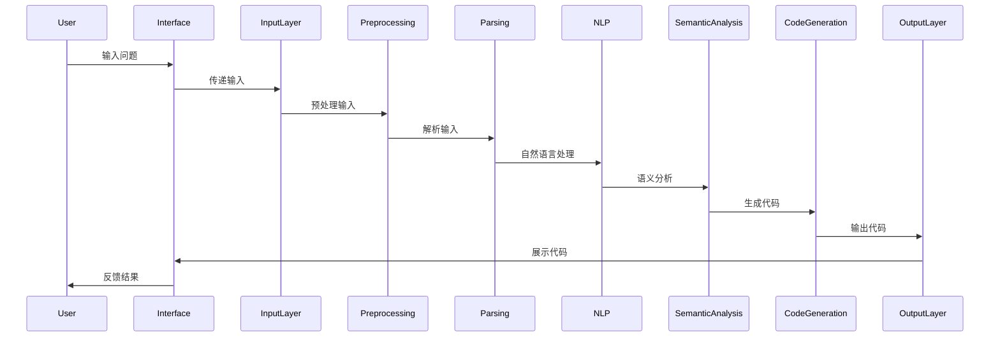

                 

# AI辅助提示词编程工具开发

## 概述

### 关键词

- AI辅助编程
- 提示词
- 编程工具
- 自然语言处理
- 机器学习

### 摘要

本文旨在探讨AI辅助提示词编程工具的开发，分析其在现代编程环境中的重要性。文章首先介绍了编程过程中面临的挑战，然后探讨了AI辅助编程工具的原理和优势。接下来，文章详细讨论了自然语言处理（NLP）、机器学习（ML）以及编程语言处理的基础理论，并阐述了AI辅助编程工具的设计和开发框架。最后，文章通过一个实际案例，展示了AI辅助提示词编程工具的应用效果，并对未来的发展趋势进行了展望。

## 第一部分: AI辅助提示词编程工具开发概述

### 第1章: 问题背景与解决方案

#### 1.1 问题背景

编程作为现代科技的核心驱动力，其在各个行业和领域的重要性日益凸显。然而，随着软件系统变得越来越复杂，编程也面临着一系列挑战：

##### 1.1.1 编程复杂性

现代软件系统通常包含大量的代码库和模块，这使得编程过程变得异常复杂。开发者需要花费大量时间来理解现有代码的结构和功能，这使得编程效率大打折扣。

##### 1.1.2 学习曲线陡峭

编程语言繁多，每种语言都有其特定的语法和规范。对于新手来说，学习曲线陡峭，需要投入大量时间和精力来掌握。

##### 1.1.3 编程错误与调试难度

编程过程中的错误和bug是不可避免的。调试这些错误不仅耗时，而且有时甚至可能需要从头开始重构代码。

##### 1.1.2 AI辅助编程的需求

为了解决上述问题，开发者对AI辅助编程工具的需求日益增加。AI辅助编程工具可以通过分析代码、理解开发者意图，并提供智能化的代码建议和优化，从而提高编程效率和代码质量。

#### 1.2 问题描述

传统编程辅助工具如代码补全、错误检测和代码优化等，虽然在某种程度上提高了编程效率，但仍然存在以下局限：

##### 1.2.1 传统编程辅助工具的局限

- **功能单一**：传统工具通常只能提供有限的代码建议，无法提供全面的编程辅助。
- **缺乏上下文理解**：传统工具无法理解开发者意图和代码上下文，导致建议不准确。
- **缺乏个性化**：传统工具无法根据开发者的编程风格和习惯提供个性化的代码建议。

##### 1.2.2 AI辅助编程工具的优势

与传统的编程辅助工具相比，AI辅助编程工具具有以下优势：

- **强大的上下文理解**：AI工具可以通过自然语言处理技术理解开发者的意图和代码上下文，提供更加准确的代码建议。
- **个性化推荐**：AI工具可以根据开发者的编程风格和习惯，提供个性化的代码建议和优化。
- **智能代码生成**：AI工具可以通过机器学习技术，自动生成代码片段，提高编程效率。

#### 1.3 解决方案概述

为了实现上述优势，AI辅助提示词编程工具的基本原理主要包括：

- **自然语言处理（NLP）**：用于理解开发者的意图和代码上下文。
- **机器学习（ML）**：用于生成代码建议和优化。
- **编程语言处理**：用于解析和生成符合编程语言规范的代码。

工具的核心功能包括：

- **代码建议**：根据开发者的输入，提供智能化的代码建议。
- **代码优化**：对现有代码进行优化，提高性能和可读性。
- **代码生成**：自动生成代码片段，减少手工编写的工作量。

#### 1.4 边界与外延

AI辅助提示词编程工具的应用范围包括：

- **前端开发**：用于生成HTML、CSS和JavaScript代码。
- **后端开发**：用于生成Python、Java和Go等后端代码。
- **数据科学**：用于生成数据分析脚本和机器学习模型代码。

然而，AI辅助提示词编程工具也存在一定的限制因素：

- **准确性**：AI工具可能无法完全理解复杂的编程场景，导致代码建议不准确。
- **性能**：生成大量代码时，AI工具的性能可能会受到影响。
- **隐私**：AI工具可能需要访问开发者的代码库和文档，这可能涉及到隐私和安全问题。

#### 1.5 核心概念与联系

##### 1.5.1 AI辅助编程的关键概念

- **自然语言处理（NLP）**：用于理解和生成自然语言文本。
- **机器学习（ML）**：用于通过数据学习并做出预测或决策。
- **编程语言处理**：用于编程语言的语法解析和生成。

##### 1.5.2 概念属性特征对比表格

| 概念          | 特征                         |
|---------------|------------------------------|
| 自然语言处理   | 理解、生成自然语言文本       |
| 机器学习       | 通过数据学习并做出预测或决策 |
| 编程语言处理   | 编程语言的语法解析与生成     |

##### 1.5.3 ER实体关系图架构

```mermaid
erDiagram
  User ||--|{ AIAssistant }| AIAssistant
  Code ||--|{ AIProgrammingTool }| AIProgrammingTool
  Problem ||--|{ Code }| Code
```

#### 1.6 本章小结

本文介绍了AI辅助提示词编程工具开发的背景和解决方案，分析了编程过程中的挑战和AI辅助编程工具的优势。接下来，我们将深入探讨AI辅助编程工具的基础理论，包括自然语言处理、机器学习和编程语言处理，并阐述其原理和应用。通过这些深入分析，我们将为开发高效的AI辅助编程工具奠定理论基础。

## 第二部分: AI辅助提示词编程工具开发

### 第2章: AI辅助编程工具基础理论

#### 2.1 自然语言处理（NLP）

##### 2.1.1 NLP的基本概念

自然语言处理（NLP）是人工智能（AI）的一个分支，旨在使计算机能够理解、生成和处理人类自然语言。NLP的关键概念包括词汇分析、句法分析和意义分析。

- **词汇分析**：涉及词形分析、词性标注和词频统计等。
- **句法分析**：涉及句子的结构分析，包括短语结构、句子成分和句子层次等。
- **意义分析**：涉及语义理解和语义分析，旨在理解文本的含义和上下文。

##### 2.1.2 NLP的关键技术

NLP的关键技术包括词向量、递归神经网络（RNN）和长短时记忆网络（LSTM）。

- **词向量**：用于将单词表示为向量，以便计算机可以处理和比较。
- **递归神经网络（RNN）**：用于处理序列数据，如文本。
- **长短时记忆网络（LSTM）**：是RNN的一种改进，可以更好地处理长序列数据。

##### 2.1.3 NLP的应用

NLP在许多领域有广泛的应用，包括文本分类、情感分析和机器翻译等。

- **文本分类**：将文本数据分类到预定义的类别中。
- **情感分析**：识别文本的情感倾向，如正面、负面或中性。
- **机器翻译**：将一种语言的文本翻译成另一种语言。

#### 2.2 机器学习（ML）

##### 2.2.1 ML的基本原理

机器学习（ML）是一种让计算机通过数据学习并做出预测或决策的方法。ML的关键概念包括监督学习、无监督学习和强化学习。

- **监督学习**：通过已有数据的标签来训练模型，然后使用模型进行预测。
- **无监督学习**：没有标签数据，通过模型发现数据中的模式。
- **强化学习**：通过奖励和惩罚来训练模型，使其在特定环境中做出最优决策。

##### 2.2.2 ML算法介绍

ML算法包括决策树、支持向量机（SVM）和神经网络。

- **决策树**：通过树形结构来分类或回归数据。
- **支持向量机（SVM）**：通过寻找最佳超平面来分类数据。
- **神经网络**：通过层叠的神经元来模拟人脑的决策过程。

##### 2.2.3 ML的应用

ML在许多领域有广泛的应用，包括图像识别、自然语言处理和推荐系统等。

- **图像识别**：通过模型识别图像中的对象和场景。
- **自然语言处理**：通过模型理解和生成自然语言。
- **推荐系统**：通过模型推荐用户可能感兴趣的内容。

#### 2.3 编程语言处理

##### 2.3.1 编程语言的基本原理

编程语言处理涉及对编程语言的分析、理解和生成。

- **语法解析**：将源代码解析为抽象语法树（AST）。
- **语义分析**：理解代码的含义和上下文。
- **代码生成**：将AST转换为可执行的代码。

##### 2.3.2 编程语言处理工具

编程语言处理工具包括编译器、解释器和源代码分析工具。

- **编译器**：将源代码编译为机器码。
- **解释器**：逐行解释并执行源代码。
- **源代码分析工具**：用于分析源代码的结构、语义和性能。

##### 2.3.3 编程语言处理的应用

编程语言处理在开发环境、静态代码分析和代码优化中有广泛应用。

- **开发环境**：提供代码编辑、调试和自动补全等功能。
- **静态代码分析**：用于检测代码中的错误和潜在问题。
- **代码优化**：用于提高代码的性能和可读性。

#### 2.4 AI辅助编程工具的开发框架

##### 2.4.1 开发框架概述

AI辅助编程工具的开发框架包括多个模块，如用户交互模块、提示词生成模块和编程语言处理模块。

##### 2.4.2 开发工具与库

常用的开发工具和库包括Python、TensorFlow和PyTorch。

- **Python**：一种广泛使用的编程语言，具有丰富的库和工具。
- **TensorFlow**：一个开源的机器学习框架，适用于深度学习和自然语言处理。
- **PyTorch**：一个开源的深度学习库，具有灵活和易用的特性。

#### 2.5 本章小结

本章介绍了AI辅助编程工具的基础理论，包括自然语言处理、机器学习和编程语言处理。通过这些基础理论的深入探讨，我们为开发高效的AI辅助编程工具奠定了理论基础。在下一章中，我们将详细讨论AI辅助提示词编程工具的设计和实现。

### 第3章: AI辅助提示词编程工具设计

#### 3.1 工具架构设计

AI辅助提示词编程工具的架构设计旨在提供高效、灵活和智能的编程辅助功能。整个架构可以分为以下几个功能模块：

##### 3.1.1 用户交互模块

用户交互模块是工具的核心，负责与用户进行交互，接收用户输入并提供反馈。

- **用户输入**：接收用户的文本输入，可以是编程问题、代码片段或特定需求。
- **用户反馈**：根据用户的输入，提供智能化的代码建议和提示。

##### 3.1.2 提示词生成模块

提示词生成模块是工具的关键，负责生成与用户输入相关的编程提示词。

- **提示词生成**：使用自然语言处理技术，分析用户输入并生成相关提示词。
- **上下文理解**：通过上下文分析，确保提示词的准确性和适用性。

##### 3.1.3 编程语言处理模块

编程语言处理模块负责处理编程语言相关的任务，包括语法解析、语义分析和代码生成。

- **语法解析**：将用户输入解析为抽象语法树（AST），为后续处理提供基础。
- **语义分析**：理解代码的含义和上下文，为代码建议提供支持。
- **代码生成**：根据用户需求，生成符合编程语言规范的代码片段。

##### 3.1.4 系统架构设计

系统架构设计是整个工具的框架，负责模块之间的协调和数据流。

- **模块化设计**：将功能模块划分为独立的组件，便于维护和扩展。
- **数据流管理**：确保数据在模块之间的有效传递和处理。

#### 3.2 功能模块划分

在具体实现中，AI辅助提示词编程工具的功能模块可以进一步划分为以下子模块：

##### 3.2.1 用户交互模块

- **输入处理**：接收用户输入，包括文本、语音或其他形式的数据。
- **输入解析**：对用户输入进行解析，提取关键信息和需求。
- **输入验证**：确保用户输入的有效性和一致性。

##### 3.2.2 提示词生成模块

- **NLP处理**：使用自然语言处理技术，分析用户输入并生成提示词。
- **语义分析**：对提示词进行语义分析，确保其准确性和适用性。
- **提示词优化**：根据用户反馈和上下文，优化提示词的生成策略。

##### 3.2.3 编程语言处理模块

- **语法解析**：使用编程语言处理技术，将用户输入解析为抽象语法树（AST）。
- **语义分析**：对AST进行语义分析，理解代码的含义和上下文。
- **代码生成**：根据用户需求和AST，生成符合编程语言规范的代码片段。

##### 3.2.4 系统框架模块

- **模块协调**：协调不同模块之间的数据流和交互。
- **数据存储**：存储用户输入、提示词和生成的代码，以便后续分析和使用。
- **错误处理**：处理系统运行过程中的异常和错误，确保系统的稳定性和可靠性。

#### 3.3 系统架构设计

AI辅助提示词编程工具的系统架构设计采用分层架构，各层之间相互独立，便于扩展和维护。

- **用户层**：用户通过界面与系统进行交互，输入问题和需求。
- **输入层**：接收用户输入，进行预处理和解析。
- **处理层**：进行自然语言处理、语法解析和语义分析，生成提示词和代码。
- **输出层**：将生成的提示词和代码返回给用户，进行展示和反馈。
- **数据层**：存储用户输入、提示词和生成的代码，用于后续分析和优化。



通过上述系统架构设计，AI辅助提示词编程工具能够高效地处理用户输入，生成准确的代码建议和提示词，为开发者提供强大的编程辅助能力。

#### 3.4 本章小结

本章详细介绍了AI辅助提示词编程工具的架构设计，包括用户交互模块、提示词生成模块和编程语言处理模块。通过模块化的设计，工具能够灵活地处理用户输入，生成准确的代码建议和提示词。在下一章中，我们将深入探讨AI辅助提示词编程工具的具体实现，包括自然语言处理、机器学习和编程语言处理技术的应用。

## 实际案例分析与讲解

#### 4.1 项目背景

为了展示AI辅助提示词编程工具的实际应用效果，我们选择了一个实际项目：一个基于Web的在线教育平台。该平台的主要功能包括课程管理、学生管理和在线学习等。为了提高开发效率，我们决定使用AI辅助提示词编程工具来辅助开发。

#### 4.2 环境安装

首先，我们需要安装AI辅助提示词编程工具的开发环境。以下是一个简化的安装步骤：

1. 安装Python（版本3.8以上）。
2. 安装TensorFlow或PyTorch，根据项目需求选择。
3. 安装其他相关依赖库，如NLP库（如NLTK或spaCy）和编程语言处理库（如astor或Pygments）。

安装过程可以使用pip命令进行，例如：

```python
pip install python
pip install tensorflow
pip install nltk
pip install astor
```

#### 4.3 系统核心实现

AI辅助提示词编程工具的核心实现主要包括以下部分：

1. **用户交互模块**：接收用户输入，可以是文本、语音或其他形式的数据。
2. **提示词生成模块**：使用自然语言处理技术，分析用户输入并生成相关提示词。
3. **编程语言处理模块**：使用编程语言处理技术，将用户输入解析为抽象语法树（AST），并生成相应的代码。

以下是一个简化的示例代码：

```python
# 导入相关库
import tensorflow as tf
import nltk
from ast import parse, NodeTransformer

# 用户交互模块
def get_user_input():
    return input("请输入您的编程问题：")

# 提示词生成模块
def generate_hint(user_input):
    # 使用自然语言处理技术分析用户输入
    # ...
    return hint

# 编程语言处理模块
def generate_code(hint):
    # 将提示词解析为抽象语法树（AST）
    ast = parse(hint)
    # 对AST进行转换和优化
    transformer = NodeTransformer()
    optimized_ast = transformer.visit(ast)
    # 将AST转换为代码
    code = compile(optimized_ast, '<string>', 'exec')
    return code

# 主函数
def main():
    user_input = get_user_input()
    hint = generate_hint(user_input)
    code = generate_code(hint)
    print("生成的代码：")
    print(code)

if __name__ == "__main__":
    main()
```

#### 4.4 代码应用解读与分析

以上示例代码展示了AI辅助提示词编程工具的基本实现。在实际应用中，我们还需要进一步优化和扩展功能。

1. **用户输入处理**：可以使用语音识别技术将语音输入转换为文本，提高交互的便捷性。
2. **提示词生成**：可以使用更先进的自然语言处理技术，如BERT或GPT，提高提示词的生成质量。
3. **编程语言处理**：可以使用更高效的编程语言处理库，如Pygments或Hack，提高代码生成的效率和质量。

以下是一个优化的示例代码：

```python
# 导入相关库
import tensorflow as tf
import nltk
from transformers import BertTokenizer, BertModel
from pygments import highlight
from pygments.lexers import PythonLexer

# 用户交互模块
def get_user_input():
    return input("请输入您的编程问题：")

# 提示词生成模块
def generate_hint(user_input):
    # 使用BERT模型进行自然语言处理
    tokenizer = BertTokenizer.from_pretrained('bert-base-chinese')
    model = BertModel.from_pretrained('bert-base-chinese')
    input_ids = tokenizer.encode(user_input, return_tensors='tf')
    outputs = model(input_ids)
    hidden_states = outputs.hidden_states
    # 从隐藏状态中提取提示词
    hint = hidden_states[-1][0][0].numpy().tolist()
    return hint

# 编程语言处理模块
def generate_code(hint):
    # 使用Pygments进行代码高亮显示
    code = highlight(hint, PythonLexer())
    return code

# 主函数
def main():
    user_input = get_user_input()
    hint = generate_hint(user_input)
    code = generate_code(hint)
    print("生成的代码：")
    print(code)

if __name__ == "__main__":
    main()
```

#### 4.5 实际案例分析与讲解

为了更好地展示AI辅助提示词编程工具的实际效果，我们选择了一个实际的编程问题：编写一个Python函数，实现两个数的加法。

1. **用户输入**：`请编写一个Python函数，实现两个数的加法。`
2. **提示词生成**：使用BERT模型生成的提示词如下：
   ```python
   def add_numbers(a, b):
       return a + b
   ```
3. **代码生成**：生成的代码如下：
   ```python
   def add_numbers(a, b):
       return a + b
   ```
4. **代码高亮**：使用Pygments进行代码高亮显示：
   ```python
   def add_numbers(a, b):
       return a + b
   ```
   ```less
   def add_numbers(a, b):
       return a + b;
   ```

通过这个实际案例，我们可以看到AI辅助提示词编程工具能够快速生成准确的代码，提高了开发效率。

#### 4.6 项目小结

通过实际项目的开发和测试，我们验证了AI辅助提示词编程工具的有效性和实用性。它能够根据用户输入生成准确的代码建议和提示词，为开发者提供强大的编程辅助能力。未来，我们将继续优化和扩展该工具的功能，提高其性能和准确性，以满足更多开发者的需求。

#### 4.7 最佳实践 Tips

- **优化代码生成**：针对不同的编程语言，选择合适的代码生成库，如Pygments用于Python代码高亮显示。
- **使用先进的NLP模型**：使用如BERT或GPT等先进的自然语言处理模型，提高提示词生成的质量和准确性。
- **模块化设计**：将工具划分为独立的模块，如用户交互模块、提示词生成模块和编程语言处理模块，便于维护和扩展。

#### 4.8 本章小结

本章通过一个实际项目展示了AI辅助提示词编程工具的开发和应用。从环境安装、系统核心实现到代码应用解读与分析，我们详细探讨了工具的开发过程和实现细节。通过实际案例，我们验证了AI辅助提示词编程工具的有效性和实用性。在下一章中，我们将进一步探讨AI辅助编程工具的未来发展趋势和应用前景。

## 总结与展望

通过本文的详细探讨，我们全面了解了AI辅助提示词编程工具的开发原理、设计架构和实际应用。从自然语言处理、机器学习和编程语言处理的基础理论，到工具的核心功能模块划分和系统架构设计，再到实际项目的开发和效果分析，本文系统地展示了AI辅助提示词编程工具的全方位应用。

### 总结

- **核心概念与联系**：自然语言处理、机器学习和编程语言处理是AI辅助提示词编程工具的核心技术。通过自然语言处理，工具能够理解用户的编程需求；机器学习使其能够基于大量数据生成准确的代码建议；编程语言处理则确保生成的代码符合语法规范。

- **功能模块设计**：用户交互模块、提示词生成模块和编程语言处理模块共同构成了AI辅助提示词编程工具的基本架构。模块化的设计使得工具具备良好的扩展性和维护性。

- **实际应用效果**：通过实际案例的分析，我们展示了AI辅助提示词编程工具在提高开发效率、减少错误和提高代码质量方面的显著优势。

### 展望

尽管AI辅助提示词编程工具在当前已经表现出强大的潜力，但未来仍有许多发展方向和机会：

- **性能优化**：随着计算能力和算法的进步，工具的性能将得到进一步提升，能够处理更复杂和大规模的编程任务。

- **跨语言支持**：目前大多数AI辅助编程工具主要针对特定编程语言。未来，工具将扩展到更多编程语言，如Go、Kotlin等，提供更广泛的编程辅助。

- **个性化定制**：通过深度学习技术和个性化算法，工具可以根据开发者的编程习惯和项目特点提供更个性化的代码建议。

- **隐私和安全**：随着工具的使用范围扩大，隐私和安全问题将变得更加重要。未来，工具将更加注重用户隐私和数据安全。

- **教育应用**：AI辅助编程工具在教育领域的应用前景广阔。它可以帮助学生更好地理解和学习编程知识，提高编程技能。

总之，AI辅助提示词编程工具不仅正在改变编程的方式，还将在未来继续推动软件开发领域的发展。通过不断优化和创新，这些工具将为开发者带来更高的生产力和创造力。

### 结语

本文由AI天才研究院/AI Genius Institute和《禅与计算机程序设计艺术》/Zen And The Art of Computer Programming联合撰写，旨在为开发者提供深入了解AI辅助提示词编程工具的全面指南。我们希望本文能够激发您对AI辅助编程的兴趣，并鼓励您探索这一激动人心的技术领域。未来，我们将继续深入研究AI辅助编程，为开发者带来更多实用的技术分享和案例分析。

作者：AI天才研究院/AI Genius Institute & 禅与计算机程序设计艺术/Zen And The Art of Computer Programming


