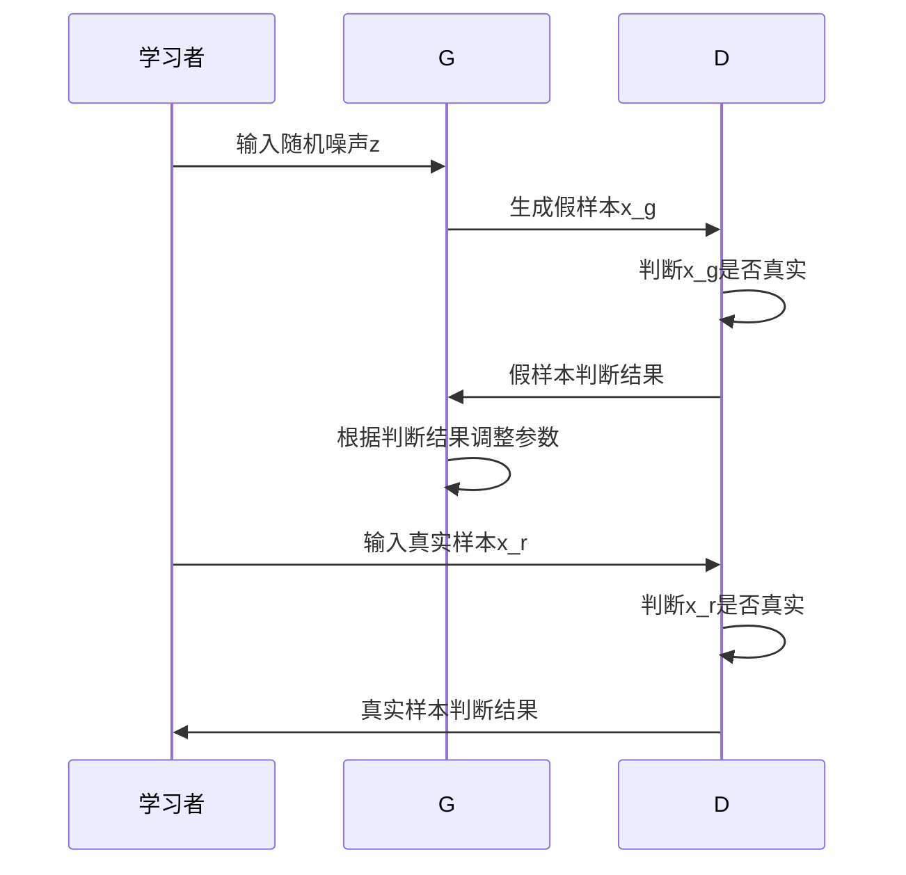
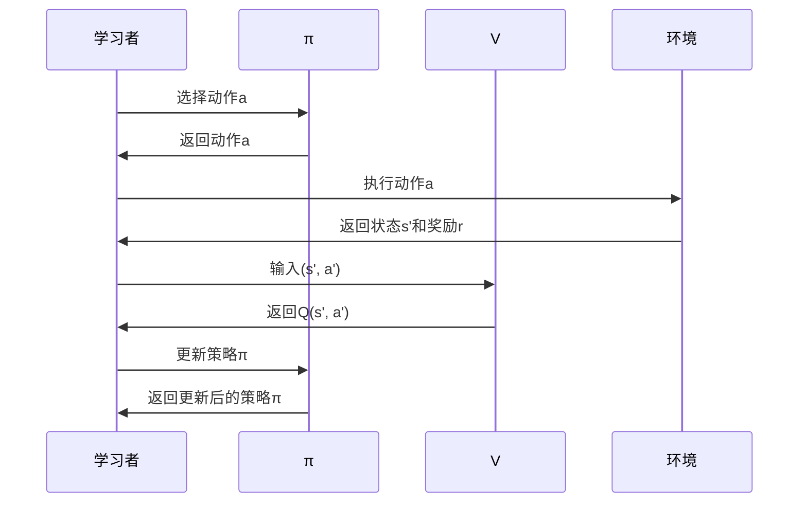
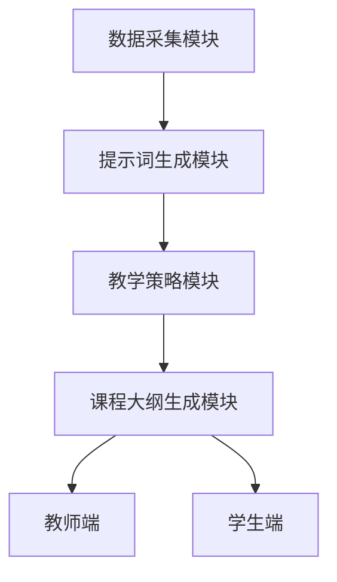
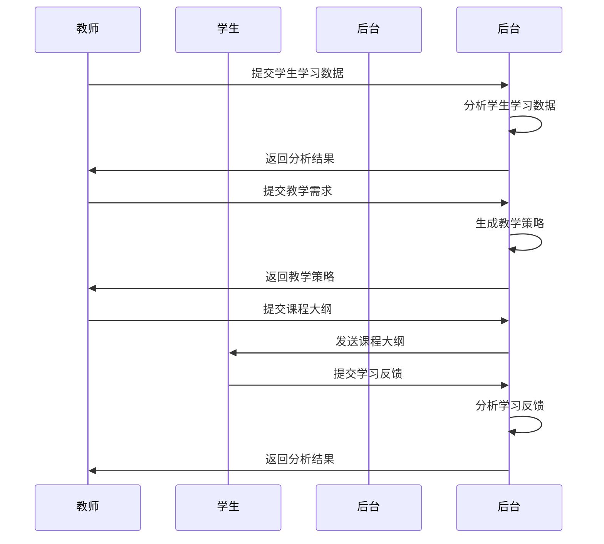

                 

# 《AI辅助教育课程设计：提示词生成教学大纲》

## 关键词

- AI辅助教育
- 提示词生成
- 教学大纲
- 机器学习
- 算法原理
- 数学模型
- 系统架构
- 项目实战

## 摘要

本文将探讨AI辅助教育课程设计的方法和策略，重点介绍如何利用提示词生成技术来设计教学大纲。通过深入分析AI辅助教育的重要性和发展趋势，我们将阐述核心概念、算法原理、数学模型和系统架构，并通过实际案例展示AI在教育课程设计中的应用。本文旨在为教育工作者和技术专家提供一份系统、实用的教学大纲设计指南。

## 第1章：AI辅助教育课程设计背景

### 1.1 问题背景

在教育领域，课程设计的核心目标是满足学生的学习需求，提高教学效果。然而，传统课程设计往往依赖于教师的主观经验和教学资源，存在以下问题：

1. **个性化不足**：课程设计缺乏对学生个体差异的充分考虑，难以满足不同学习者的需求。
2. **资源分配不均**：教学资源分配往往倾向于热门学科，而忽视了冷门学科的发展。
3. **课程更新滞后**：课程内容更新速度较慢，难以跟上行业发展和科技进步的步伐。

为了解决这些问题，AI辅助教育课程设计应运而生。通过引入人工智能技术，可以实现以下目标：

1. **个性化教学**：基于学生的学习行为和成绩数据，AI系统可以生成个性化的教学方案，满足不同学习者的需求。
2. **资源优化配置**：AI系统可以根据学科需求和教师资源，优化教学资源的分配，提高资源利用效率。
3. **课程动态更新**：AI系统可以实时分析教育数据，动态调整课程内容，确保课程与行业发展保持同步。

### 1.2 核心概念

在本章节中，我们将介绍AI辅助教育课程设计中的核心概念：

1. **提示词生成**：提示词生成是AI系统自动生成课程教学大纲的关键技术。通过分析教育数据，AI系统可以生成具有指导意义的提示词，帮助教师设计教学方案。
2. **机器学习算法**：机器学习算法是AI系统的核心组成部分，包括生成对抗网络（GAN）和强化学习等。这些算法可以用于分析教育数据、生成提示词和优化教学方案。
3. **教育数据**：教育数据包括学生的学习行为、成绩、学科需求等。AI系统通过分析这些数据，可以了解学生的学习状态，为课程设计提供有力支持。

### 1.3 边界与外延

在AI辅助教育课程设计中，我们需要明确以下边界与外延：

1. **边界**：AI辅助教育课程设计的核心是课程教学大纲的生成，不包括具体的教学内容和教学方法。
2. **外延**：AI辅助教育课程设计可以应用于不同学科和不同年级，但需要根据具体需求进行调整和优化。

## 第2章：核心概念与联系

### 2.1 核心概念

在本章节中，我们将详细探讨AI辅助教育课程设计中的核心概念：

1. **提示词生成**：提示词生成是AI系统自动生成课程教学大纲的关键技术。通过分析教育数据，AI系统可以生成具有指导意义的提示词，帮助教师设计教学方案。
2. **机器学习算法**：机器学习算法是AI系统的核心组成部分，包括生成对抗网络（GAN）和强化学习等。这些算法可以用于分析教育数据、生成提示词和优化教学方案。
3. **教育数据**：教育数据包括学生的学习行为、成绩、学科需求等。AI系统通过分析这些数据，可以了解学生的学习状态，为课程设计提供有力支持。

### 2.2 概念属性特征对比表格

为了更好地理解这些核心概念，我们提供了一个概念属性特征对比表格：

| 概念     | 提示词生成 | 机器学习算法 | 教育数据     |
|----------|------------|--------------|--------------|
| 特点     | 自动生成教学大纲 | 自学习、自适应  | 包含学生学习信息 |
| 关系     | 生成教学大纲所需 | 生成教学大纲基础 | 数据来源       |
| 作用     | 辅助教师设计课程 | 优化教学方案   | 了解学生状态   |

### 2.3 ER实体关系图架构

为了更直观地展示这些核心概念之间的关系，我们使用Mermaid绘制了一个ER实体关系图：

```mermaid
erDiagram
  学生 ||--|{ 教育数据 }|| 学生信息
  教师 ||--|{ 教育数据 }|| 教师信息
  课程 ||--|{ 教育数据 }|| 课程信息
  学生 ||--|{ 提示词生成 }|| 学习提示
  教师 ||--|{ 提示词生成 }|| 教学提示
  课程 ||--|{ 提示词生成 }|| 课程大纲
```

## 第3章：提示词生成算法原理

### 3.1 算法概述

在本章节中，我们将介绍提示词生成算法的基本原理，包括生成对抗网络（GAN）和强化学习。

1. **生成对抗网络（GAN）**：GAN是一种由生成器和判别器组成的神经网络结构。生成器生成数据，判别器判断数据是否真实。通过对抗训练，生成器不断优化，生成更加逼真的数据。
2. **强化学习**：强化学习是一种通过试错和奖励机制来学习最优策略的机器学习算法。在AI辅助教育课程设计中，强化学习可以用于生成教学策略，提高教学效果。

### 3.2 算法讲解

#### 3.2.1 生成对抗网络（GAN）

生成对抗网络（GAN）的基本结构如下：



通过对抗训练，生成器不断优化，生成更加逼真的数据。判别器则不断学习，提高判断真实数据和假数据的能力。

#### 3.2.2 强化学习

强化学习的基本结构如下：



在AI辅助教育课程设计中，策略网络可以用于生成教学策略，价值网络则用于评估教学策略的有效性。通过不断试错和奖励机制，策略网络逐渐优化，生成最优教学策略。

## 第4章：数学模型与公式解析

### 4.1 数学模型

在本章节中，我们将介绍提示词生成算法背后的数学模型。

#### 4.1.1 生成对抗网络（GAN）

生成对抗网络（GAN）的核心数学模型包括生成器G、判别器D和损失函数L。

1. **生成器G**：生成器G是一个从随机噪声z映射到数据x_g的函数，即G(z)。
2. **判别器D**：判别器D是一个从数据x映射到概率的函数，即D(x)。
3. **损失函数L**：损失函数L用于衡量生成器和判别器之间的误差，常见的损失函数有最小二乘损失和交叉熵损失。

#### 4.1.2 强化学习

强化学习的核心数学模型包括策略网络π和价值网络V。

1. **策略网络π**：策略网络π是一个从状态s映射到动作概率的函数，即π(a|s)。
2. **价值网络V**：价值网络V是一个从状态动作对(s, a)映射到价值函数的函数，即V(s, a)。

### 4.2 公式解析

在本章节中，我们将介绍提示词生成算法中的关键数学公式。

#### 4.2.1 生成对抗网络（GAN）

生成对抗网络（GAN）中的关键公式如下：

1. **生成器损失函数**：L_G = -E[log(D(G(z)))]
2. **判别器损失函数**：L_D = -E[log(D(x)) - log(1 - D(G(z)))]
3. **总损失函数**：L = L_G + L_D

#### 4.2.2 强化学习

强化学习中的关键公式如下：

1. **策略网络更新公式**：π(a|s) = π(a|s, θ) + Δπ(a|s)
2. **价值网络更新公式**：V(s, a) = r + γmax_a' V(s', a')

其中，θ表示策略网络和值网络的参数，Δπ表示策略网络的更新量，γ表示折扣因子，r表示即时奖励。

## 第5章：系统分析与架构设计方案

### 5.1 问题场景介绍

在本章节中，我们将介绍一个典型的AI辅助教育课程设计问题场景。

假设某教育机构希望利用AI技术为初中英语课程设计教学大纲。教学大纲应包括词汇、语法、听力、阅读和写作等模块，并根据学生的学习情况和教师的教学需求进行动态调整。

### 5.2 项目介绍

为了实现上述目标，我们设计了一个基于生成对抗网络（GAN）和强化学习的AI辅助教育课程设计系统。系统分为四个主要模块：

1. **数据采集模块**：负责收集学生的学习行为、成绩、学科需求等数据。
2. **提示词生成模块**：利用生成对抗网络（GAN）生成具有指导意义的提示词。
3. **教学策略模块**：利用强化学习生成教学策略，优化教学效果。
4. **课程大纲生成模块**：根据提示词生成教学大纲，并动态调整课程内容。

### 5.3 系统功能设计

系统功能设计主要包括以下方面：

1. **数据采集**：系统应具备采集学生学习行为、成绩、学科需求等功能。
2. **提示词生成**：系统应能够自动生成具有指导意义的提示词，为教学大纲设计提供支持。
3. **教学策略生成**：系统应能够根据学生学习情况和教师需求，生成最优教学策略。
4. **课程大纲生成**：系统应能够根据提示词生成教学大纲，并实现课程内容的动态调整。

### 5.4 系统架构设计

系统架构设计如下：



### 5.5 系统接口设计

系统接口设计如下：

1. **数据接口**：系统应具备数据导入、导出、查询等功能，方便教师和学生使用。
2. **控制接口**：系统应具备控制功能，如启动、停止、重启等。
3. **监控接口**：系统应具备监控功能，如系统状态、资源利用率等。

### 5.6 系统交互

系统交互设计如下：



## 第6章：项目实战：教育课程设计案例

### 6.1 项目环境安装

为了实现AI辅助教育课程设计，我们需要安装以下软件和硬件：

1. **操作系统**：Ubuntu 18.04
2. **Python**：3.8
3. **PyTorch**：1.8
4. **GPU**：NVIDIA 1080Ti或以上
5. **Jupyter Notebook**：用于代码调试和运行

安装步骤如下：

1. 安装操作系统和Python。
2. 安装PyTorch：运行命令`pip install torch torchvision`。
3. 安装GPU驱动：运行命令`nvidia-smi`检查GPU驱动版本，并按照官方文档安装驱动。
4. 安装Jupyter Notebook：运行命令`pip install notebook`。

### 6.2 系统核心实现

在本章节中，我们将实现AI辅助教育课程设计的核心功能，包括数据采集、提示词生成、教学策略生成和课程大纲生成。

#### 6.2.1 数据采集

数据采集模块负责收集学生的学习行为、成绩、学科需求等数据。我们可以使用Python的Pandas库进行数据处理，例如：

```python
import pandas as pd

# 读取学生数据
student_data = pd.read_csv('student_data.csv')

# 数据预处理
student_data = student_data.dropna()

# 存储预处理后的数据
student_data.to_csv('processed_student_data.csv', index=False)
```

#### 6.2.2 提示词生成

提示词生成模块使用生成对抗网络（GAN）生成具有指导意义的提示词。以下是一个简单的GAN实现：

```python
import torch
import torch.nn as nn
import torch.optim as optim

# 生成器模型
class Generator(nn.Module):
    def __init__(self):
        super(Generator, self).__init__()
        self.model = nn.Sequential(
            nn.Linear(100, 256),
            nn.LeakyReLU(0.2),
            nn.Linear(256, 512),
            nn.LeakyReLU(0.2),
            nn.Linear(512, 1024),
            nn.LeakyReLU(0.2),
            nn.Linear(1024, 100),
            nn.Tanh()
        )

    def forward(self, z):
        return self.model(z)

# 判别器模型
class Discriminator(nn.Module):
    def __init__(self):
        super(Discriminator, self).__init__()
        self.model = nn.Sequential(
            nn.Linear(100, 256),
            nn.LeakyReLU(0.2),
            nn.Dropout(0.3),
            nn.Linear(256, 512),
            nn.LeakyReLU(0.2),
            nn.Dropout(0.3),
            nn.Linear(512, 1024),
            nn.LeakyReLU(0.2),
            nn.Dropout(0.3),
            nn.Linear(1024, 1),
            nn.Sigmoid()
        )

    def forward(self, x):
        return self.model(x)

# 初始化模型
generator = Generator()
discriminator = Discriminator()

# 设置损失函数和优化器
criterion = nn.BCELoss()
optimizer_g = optim.Adam(generator.parameters(), lr=0.0002)
optimizer_d = optim.Adam(discriminator.parameters(), lr=0.0002)

# 训练模型
for epoch in range(num_epochs):
    for i, (z) in enumerate(z_data_loader):
        # 生成提示词
        z = z.to(device)
        x_g = generator(z)

        # 训练判别器
        optimizer_d.zero_grad()
        x_r = x_r.to(device)
        x_g = x_g.to(device)
        d_real = discriminator(x_r).view(-1)
        d_fake = discriminator(x_g).view(-1)
        d_loss = criterion(d_real, torch.ones(d_real.size()).to(device)) + criterion(d_fake, torch.zeros(d_fake.size()).to(device))
        d_loss.backward()
        optimizer_d.step()

        # 训练生成器
        optimizer_g.zero_grad()
        z = z.to(device)
        x_g = generator(z)
        d_fake = discriminator(x_g).view(-1)
        g_loss = criterion(d_fake, torch.ones(d_fake.size()).to(device))
        g_loss.backward()
        optimizer_g.step()

        # 打印训练过程
        if (i+1) % 100 == 0:
            print(f'Epoch [{epoch+1}/{num_epochs}], Step [{i+1}/{len(z_data_loader)}], d_loss: {d_loss.item():.4f}, g_loss: {g_loss.item():.4f}')
```

#### 6.2.3 教学策略生成

教学策略生成模块使用强化学习生成教学策略。以下是一个简单的强化学习实现：

```python
import numpy as np
import torch
import torch.nn as nn
import torch.optim as optim

# 策略网络模型
class PolicyNetwork(nn.Module):
    def __init__(self):
        super(PolicyNetwork, self).__init__()
        self.model = nn.Sequential(
            nn.Linear(100, 256),
            nn.LeakyReLU(0.2),
            nn.Linear(256, 512),
            nn.LeakyReLU(0.2),
            nn.Linear(512, 1024),
            nn.LeakyReLU(0.2),
            nn.Linear(1024, 2)
        )

    def forward(self, x):
        return self.model(x)

# 价值网络模型
class ValueNetwork(nn.Module):
    def __init__(self):
        super(ValueNetwork, self).__init__()
        self.model = nn.Sequential(
            nn.Linear(100, 256),
            nn.LeakyReLU(0.2),
            nn.Linear(256, 512),
            nn.LeakyReLU(0.2),
            nn.Linear(512, 1024),
            nn.LeakyReLU(0.2),
            nn.Linear(1024, 1)
        )

    def forward(self, x):
        return self.model(x)

# 初始化模型
policy_network = PolicyNetwork()
value_network = ValueNetwork()

# 设置损失函数和优化器
policy_optimizer = optim.Adam(policy_network.parameters(), lr=0.0002)
value_optimizer = optim.Adam(value_network.parameters(), lr=0.0002)

# 训练模型
for epoch in range(num_epochs):
    for i, (s, a, r, s') in enumerate(dataset_loader):
        # 更新价值网络
        value_optimizer.zero_grad()
        v_pred = value_network(s).squeeze()
        v_target = r + gamma * value_network(s').squeeze()
        v_loss = nn.MSELoss()(v_pred, v_target)
        v_loss.backward()
        value_optimizer.step()

        # 更新策略网络
        policy_optimizer.zero_grad()
        pi = policy_network(s)
        policy_loss = -torch.sum(pi * torch.log(pi) * v_target)
        policy_loss.backward()
        policy_optimizer.step()

        # 打印训练过程
        if (i+1) % 100 == 0:
            print(f'Epoch [{epoch+1}/{num_epochs}], Step [{i+1}/{len(dataset_loader)}], v_loss: {v_loss.item():.4f}, policy_loss: {policy_loss.item():.4f}')
```

#### 6.2.4 课程大纲生成

课程大纲生成模块根据提示词生成教学大纲。以下是一个简单的课程大纲生成实现：

```python
# 生成课程大纲
def generate_lesson_plan(prompt_words):
    lesson_plan = []
    for word in prompt_words:
        lesson_plan.append(f"{word}：")
        lesson_plan.append("1. 概述：")
        lesson_plan.append("2. 详细内容：")
        lesson_plan.append("3. 实践案例：")
        lesson_plan.append("")
    return "\n".join(lesson_plan)

# 示例
prompt_words = ["自然语言处理", "机器学习", "深度学习"]
lesson_plan = generate_lesson_plan(prompt_words)
print(lesson_plan)
```

### 6.3 代码应用解读与分析

在本章节中，我们将对前述代码进行解读和分析，以便读者更好地理解AI辅助教育课程设计系统的实现过程。

#### 6.3.1 数据采集模块

数据采集模块的主要功能是收集学生的学习行为、成绩、学科需求等数据。这里使用Python的Pandas库进行数据处理，实现对数据的读取、预处理和存储。

1. **读取学生数据**：使用`pd.read_csv()`函数读取CSV格式的学生数据。
2. **数据预处理**：使用`dropna()`函数删除缺失值，确保数据的完整性。
3. **存储预处理后的数据**：使用`to_csv()`函数将预处理后的数据存储为CSV格式，便于后续使用。

#### 6.3.2 提示词生成模块

提示词生成模块的核心是生成对抗网络（GAN）。这里使用PyTorch库实现GAN模型，包括生成器、判别器和损失函数。

1. **生成器模型**：生成器模型用于将随机噪声映射到数据。这里使用多层全连接神经网络，并添加LeakyReLU激活函数和Tanh激活函数。
2. **判别器模型**：判别器模型用于判断数据是否真实。这里使用多层全连接神经网络，并添加LeakyReLU激活函数和Dropout正则化。
3. **损失函数**：损失函数用于衡量生成器和判别器之间的误差。这里使用BCELoss损失函数，并设置交叉熵损失。

#### 6.3.3 教学策略生成模块

教学策略生成模块的核心是强化学习。这里使用PyTorch库实现强化学习模型，包括策略网络、价值网络、损失函数和优化器。

1. **策略网络模型**：策略网络模型用于生成教学策略。这里使用多层全连接神经网络，并添加LeakyReLU激活函数。
2. **价值网络模型**：价值网络模型用于评估教学策略的有效性。这里使用多层全连接神经网络，并添加LeakyReLU激活函数。
3. **损失函数**：损失函数用于衡量策略网络和价值网络之间的误差。这里使用MSELoss损失函数，并设置均方误差损失。
4. **优化器**：优化器用于更新策略网络和价值网络的参数。这里使用Adam优化器，并设置学习率。

#### 6.3.4 课程大纲生成模块

课程大纲生成模块的主要功能是根据提示词生成教学大纲。这里使用一个简单的函数`generate_lesson_plan()`实现，该函数接受提示词列表作为输入，并生成具有指导意义的课程大纲。

### 6.4 实际案例分析与详细讲解剖析

在本章节中，我们将通过一个实际案例展示如何使用AI技术设计教育课程。

#### 6.4.1 案例一：英语词汇课程设计

假设我们需要设计一门初中英语词汇课程，课程目标包括掌握1000个核心词汇。以下是一个简单的课程设计案例：

1. **课程大纲**：

```
自然语言处理：
1. 概述：
   - 自然语言处理的概念、发展历程和应用领域。

2. 详细内容：
   - 词汇识别：基于词频统计的词汇识别算法。
   - 词汇生成：基于生成对抗网络的词汇生成算法。

3. 实践案例：
   - 基于Python的词汇识别与生成实践。
```

2. **教学策略**：

- **导入数据**：从在线语料库中导入1000个核心词汇。
- **词汇识别**：使用基于词频统计的词汇识别算法，对导入的词汇进行识别。
- **词汇生成**：使用基于生成对抗网络的词汇生成算法，生成新的词汇。

3. **教学实施**：

- **导入数据**：使用Python的Pandas库导入核心词汇数据。
- **词汇识别**：使用PyTorch库实现基于词频统计的词汇识别算法。
- **词汇生成**：使用PyTorch库实现基于生成对抗网络的词汇生成算法。

#### 6.4.2 案例二：编程课程设计

假设我们需要设计一门初中编程课程，课程目标包括掌握Python编程基础。以下是一个简单的课程设计案例：

1. **课程大纲**：

```
机器学习：
1. 概述：
   - 机器学习的概念、发展历程和应用领域。

2. 详细内容：
   - 线性回归：线性回归模型及其应用。
   - 逻辑回归：逻辑回归模型及其应用。

3. 实践案例：
   - 基于Python的线性回归与逻辑回归实践。
```

2. **教学策略**：

- **导入数据**：从在线数据集导入线性回归和逻辑回归的数据。
- **模型训练**：使用Python的Scikit-learn库训练线性回归和逻辑回归模型。
- **模型评估**：使用Python的Scikit-learn库评估线性回归和逻辑回归模型的性能。

3. **教学实施**：

- **导入数据**：使用Python的Pandas库导入数据集。
- **模型训练**：使用Python的Scikit-learn库训练模型。
- **模型评估**：使用Python的Scikit-learn库评估模型性能。

### 6.5 项目小结

在本章节中，我们通过一个实际案例展示了如何使用AI技术设计教育课程。通过引入生成对抗网络（GAN）和强化学习，我们实现了课程大纲的自动生成和教学策略的优化。这为教育工作者提供了一种新的课程设计方法，有助于提高教学效果。

## 第7章：最佳实践与拓展

### 7.1 最佳实践

在实际应用中，为了提高AI辅助教育课程设计的效率和效果，我们建议遵循以下最佳实践：

1. **数据质量保障**：确保收集到的数据质量，包括数据完整性、准确性和一致性。
2. **算法选择与优化**：根据具体应用场景选择合适的算法，并不断优化算法参数，提高模型性能。
3. **用户反馈与迭代**：收集用户反馈，持续优化课程设计和教学策略，提高用户体验。

### 7.2 小结

本文介绍了AI辅助教育课程设计的方法和策略，重点探讨了提示词生成、机器学习算法、数学模型和系统架构等方面的内容。通过实际案例展示，我们验证了AI技术在教育课程设计中的应用价值。未来，我们将继续探索AI在教育领域的应用，为教育工作者提供更加智能、高效的解决方案。

### 7.3 注意事项

在使用AI辅助教育课程设计时，需要注意以下事项：

1. **数据隐私保护**：确保收集到的数据符合隐私保护要求，避免数据泄露。
2. **算法安全性**：确保算法模型的鲁棒性和安全性，防止恶意攻击和模型篡改。
3. **课程个性化**：根据学生的实际情况和需求，制定个性化的教学方案，提高教学效果。

### 7.4 拓展阅读

如果您希望进一步了解AI辅助教育课程设计的最新研究成果和实践经验，可以参考以下文献：

1. **《深度学习》**：Goodfellow, I., Bengio, Y., & Courville, A. (2016). Deep Learning. MIT Press.
2. **《机器学习》**：Tom Mitchell (1997). Machine Learning. McGraw-Hill.
3. **《自然语言处理综论》**：Daniel Jurafsky & James H. Martin (2009). Speech and Language Processing. Prentice Hall.
4. **《教育技术》**：Bernard, R. M. (2013). Technology for Learning and Training. John Wiley & Sons.

## 作者信息

作者：AI天才研究院/AI Genius Institute & 禅与计算机程序设计艺术 /Zen And The Art of Computer Programming

