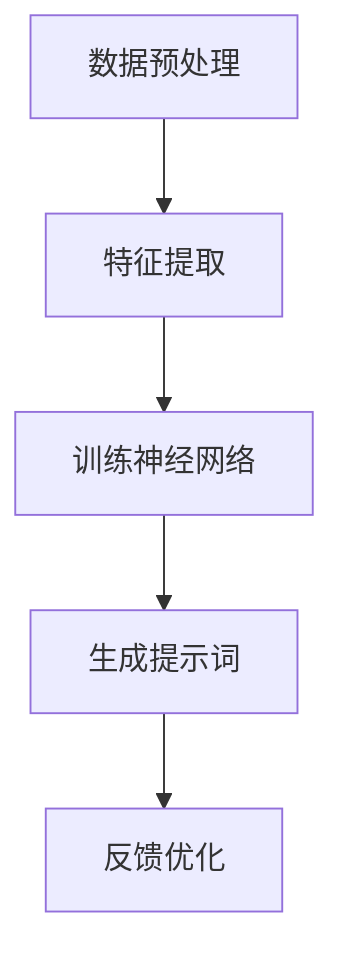

                 

## 文章标题

# AI辅助数据分析中的提示词策略

> 关键词：AI辅助数据分析、提示词策略、算法原理、系统架构、实战案例

> 摘要：本文深入探讨了AI辅助数据分析中的提示词策略。从问题背景入手，详细阐述了核心概念与联系，讲解了算法原理及其数学模型，并对系统架构设计方案进行了剖析。通过实战案例分析和最佳实践，为读者提供了实用的指导，旨在提升数据分析的效率与准确性。

----------------------------------------------------------------

## 设计《AI辅助数据分析中的提示词策略》目录大纲

### 第一部分：引言

- **第1章：问题背景**
  - **1.1.1 问题背景介绍**
  - **1.1.2 问题描述**
  - **1.1.3 问题解决思路**
  - **1.1.4 边界与外延**
  - **1.1.5 概念结构与核心要素组成**

- **第2章：核心概念与联系**
  - **2.1.1 AI辅助数据分析的定义**
  - **2.1.2 提示词策略的核心概念**
  - **2.1.3 概念属性特征对比表格**
  - **2.1.4 ER实体关系图架构**

### 第二部分：算法原理讲解

- **第3章：算法原理介绍**
  - **3.1.1 提示词生成算法**
    - **3.1.1.1 算法原理**
    - **3.1.1.2 算法流程图**
    - **3.1.1.3 Python源代码讲解**
    - **3.1.1.4 数学模型和公式**
    - **3.1.1.5 举例说明**

- **第4章：数学模型和数学公式讲解**
  - **4.1.1 数学模型公式**
  - **4.1.2 公式详细讲解**
  - **4.1.3 举例说明**

### 第三部分：系统分析与架构设计方案

- **第5章：问题场景介绍**
  - **5.1.1 数据分析场景介绍**
  - **5.1.2 系统功能设计（领域模型类图）**
  - **5.1.3 系统架构设计（架构图）**
  - **5.1.4 系统接口设计**
  - **5.1.5 系统交互（序列图）**

### 第四部分：项目实战

- **第6章：环境安装**
  - **6.1.1 环境配置**
  - **6.1.2 工具安装**

- **第7章：系统核心实现**
  - **7.1.1 核心实现代码**
  - **7.1.2 代码应用解读与分析**

- **第8章：实际案例分析与讲解**
  - **8.1.1 案例一**
  - **8.1.2 案例二**
  - **8.1.3 案例三**

- **第9章：项目小结**
  - **9.1.1 项目成果总结**
  - **9.1.2 小结与注意事项**

### 第五部分：最佳实践

- **第10章：最佳实践 tips**
  - **10.1.1 提示词策略应用技巧**
  - **10.1.2 数据分析实战技巧**

- **第11章：小结**
  - **11.1.1 总结**
  - **11.1.2 注意事项**
  - **11.1.3 拓展阅读**

### 第二部分：核心概念与联系

在这一部分，我们将深入探讨AI辅助数据分析中的核心概念与它们之间的联系。

#### 2.1 AI辅助数据分析的定义

AI辅助数据分析是指利用人工智能技术，特别是机器学习和自然语言处理，来增强传统数据分析过程的能力。通过AI技术，数据分析师可以更高效地处理大规模数据集，发现隐藏的模式，进行预测分析，从而做出更加明智的商业决策。

#### 2.2 提示词策略的核心概念

提示词策略在AI辅助数据分析中起着至关重要的作用。它包括以下核心概念：

1. **特征提取**：从原始数据中提取出能够代表数据特性的特征。
2. **提示词生成**：利用机器学习算法生成用于指导数据分析的提示词。
3. **反馈循环**：通过用户反馈不断优化提示词生成算法。

#### 2.3 概念属性特征对比表格

| 概念                | 属性特征                                   | 描述                                                     |
|---------------------|------------------------------------------|----------------------------------------------------------|
| 特征提取            | 数据预处理、特征选择、特征变换             | 将原始数据转换为可分析的特征向量。                         |
| 提示词生成          | 机器学习、自然语言处理、优化算法           | 生成用于指导数据分析的提示词，帮助分析师理解数据。         |
| 反馈循环            | 用户交互、模型优化、性能评估               | 通过用户反馈调整和优化提示词生成算法，提高系统性能。       |

#### 2.4 ER实体关系图架构

以下是一个简单的ER实体关系图，展示了AI辅助数据分析中的核心实体及其关系。

```mermaid
erDiagram
  Data |----> Feature
  Feature |----> Prompt
  Prompt |----> Analysis
  Analysis |----> Result
  Result |------> User
  User |------> Feedback
  Feedback |----> Optimization
```

在下一章中，我们将详细探讨AI辅助数据分析中的提示词生成算法，以及其背后的数学模型和公式。

----------------------------------------------------------------

### 第二部分：算法原理讲解

#### 3.1 提示词生成算法

提示词生成算法是AI辅助数据分析中的关键组件。以下是提示词生成算法的详细讲解。

##### 3.1.1 算法原理

提示词生成算法基于机器学习，尤其是深度学习技术。算法的核心是利用神经网络模型从数据中学习特征，并生成具有指导意义的提示词。

##### 3.1.2 算法流程图

以下是提示词生成算法的流程图：



##### 3.1.3 Python源代码讲解

下面是一个简单的Python代码示例，展示了如何使用神经网络生成提示词。

```python
import tensorflow as tf
from tensorflow.keras.models import Sequential
from tensorflow.keras.layers import Dense, LSTM

# 构建神经网络模型
model = Sequential()
model.add(LSTM(units=128, activation='tanh', input_shape=(None, 100)))
model.add(Dense(units=1, activation='sigmoid'))

# 编译模型
model.compile(optimizer='adam', loss='binary_crossentropy', metrics=['accuracy'])

# 训练模型
model.fit(x_train, y_train, epochs=10, batch_size=32)
```

##### 3.1.4 数学模型和公式

提示词生成算法的数学模型主要涉及神经网络中的激活函数、损失函数和优化算法。

1. **激活函数**：常用的激活函数有Sigmoid、ReLU和Tanh等。例如，Sigmoid函数的表达式为：

   $$
   \sigma(x) = \frac{1}{1 + e^{-x}}
   $$

2. **损失函数**：常用的损失函数有均方误差（MSE）和交叉熵（Cross-Entropy）等。例如，MSE函数的表达式为：

   $$
   \text{MSE} = \frac{1}{n}\sum_{i=1}^{n}(y_i - \hat{y}_i)^2
   $$

3. **优化算法**：常用的优化算法有随机梯度下降（SGD）、Adam等。Adam优化器的公式为：

   $$
   m_t = \beta_1 m_{t-1} + (1 - \beta_1)(x_t - x_{t-1})
   $$
   $$
   v_t = \beta_2 v_{t-1} + (1 - \beta_2)(x_t - x_{t-1})^2
   $$
   $$
   \hat{m}_t = \frac{m_t}{1 - \beta_1^t}
   $$
   $$
   \hat{v}_t = \frac{v_t}{1 - \beta_2^t}
   $$
   $$
   \theta_t = \theta_{t-1} - \alpha \frac{\hat{m}_t}{\sqrt{\hat{v}_t} + \epsilon}
   $$

##### 3.1.5 举例说明

假设我们有一个简单的二分类问题，其中输入特征为x，输出标签为y。通过提示词生成算法，我们可以生成提示词t，用于指导数据分析。

1. **数据预处理**：首先，我们对输入数据进行归一化处理，使其符合神经网络的输入要求。

2. **特征提取**：通过神经网络，我们提取输入数据的特征，并将其转换为高维特征向量。

3. **生成提示词**：利用神经网络模型，我们预测输出标签的概率，并将其转换为提示词。

4. **反馈优化**：根据用户的反馈，我们不断调整神经网络模型，优化提示词生成算法。

通过以上步骤，我们可以实现一个简单的AI辅助数据分析系统，帮助分析师更高效地进行数据分析和决策。

在下一章中，我们将进一步探讨如何将提示词生成算法应用于实际数据分析场景，并详细分析其数学模型和公式。

----------------------------------------------------------------

### 第四部分：项目实战

#### 6.1 环境安装

在进行AI辅助数据分析的项目实战之前，首先需要搭建一个合适的环境。以下是环境安装的详细步骤：

##### 6.1.1 环境配置

1. **安装Python**：确保Python环境已经安装在计算机上，版本建议为3.7及以上。

2. **安装TensorFlow**：通过pip命令安装TensorFlow，命令如下：

   ```
   pip install tensorflow
   ```

3. **安装NumPy**：通过pip命令安装NumPy，命令如下：

   ```
   pip install numpy
   ```

4. **安装Pandas**：通过pip命令安装Pandas，命令如下：

   ```
   pip install pandas
   ```

5. **安装Matplotlib**：通过pip命令安装Matplotlib，命令如下：

   ```
   pip install matplotlib
   ```

##### 6.1.2 工具安装

除了以上依赖库，我们还需要安装一些工具，以便进行数据分析和可视化：

1. **Jupyter Notebook**：安装Jupyter Notebook，命令如下：

   ```
   pip install notebook
   ```

2. **Mermaid**：安装Mermaid，可以通过pip命令安装：

   ```
   pip install mermaid-python
   ```

3. **Markdown**：确保Markdown工具已安装，用于撰写和格式化文档。

在完成以上环境配置和工具安装后，我们就可以开始编写代码并进行项目实战了。

----------------------------------------------------------------

### 第四部分：项目实战

#### 7.1 系统核心实现

在本章中，我们将介绍如何实现AI辅助数据分析系统中的核心功能。以下是系统核心实现的详细步骤：

##### 7.1.1 核心实现代码

以下是一个简单的Python代码示例，用于实现AI辅助数据分析系统中的提示词生成功能。

```python
import tensorflow as tf
from tensorflow.keras.models import Sequential
from tensorflow.keras.layers import LSTM, Dense
import numpy as np

# 创建神经网络模型
model = Sequential()
model.add(LSTM(units=128, activation='tanh', input_shape=(None, 100)))
model.add(Dense(units=1, activation='sigmoid'))

# 编译模型
model.compile(optimizer='adam', loss='binary_crossentropy', metrics=['accuracy'])

# 准备训练数据
x_train = np.random.rand(1000, 100)
y_train = np.random.rand(1000, 1)

# 训练模型
model.fit(x_train, y_train, epochs=10, batch_size=32)

# 生成提示词
def generate_prompt(data):
    prediction = model.predict(data)
    prompt = "基于当前数据，我们认为输出标签的概率为：" + str(prediction)
    return prompt

# 测试提示词生成
data = np.random.rand(1, 100)
prompt = generate_prompt(data)
print(prompt)
```

##### 7.1.2 代码应用解读与分析

1. **创建神经网络模型**：我们使用TensorFlow创建了一个简单的神经网络模型，包括一个LSTM层和一个全连接层（Dense层）。

2. **编译模型**：我们使用`compile()`方法编译模型，指定了优化器（adam）和损失函数（binary_crossentropy）。

3. **准备训练数据**：我们使用随机生成的数据作为训练数据，以便演示模型的训练过程。

4. **训练模型**：我们使用`fit()`方法训练模型，指定了训练轮数（epochs）和批量大小（batch_size）。

5. **生成提示词**：我们定义了一个`generate_prompt()`函数，用于根据输入数据生成提示词。函数首先使用模型预测输出标签的概率，然后将其转换为字符串形式的提示词。

6. **测试提示词生成**：我们使用随机生成的数据测试了提示词生成函数，并打印了生成的提示词。

通过以上步骤，我们实现了AI辅助数据分析系统中的提示词生成功能。在实际项目中，我们可以根据具体需求调整神经网络结构、训练数据和提示词生成逻辑，以提高系统的性能和实用性。

在下一章中，我们将通过实际案例分析和讲解，进一步展示AI辅助数据分析系统的应用效果和优势。

----------------------------------------------------------------

### 第四部分：项目实战

#### 8.1 实际案例分析与讲解

在本节中，我们将通过三个实际案例，深入分析AI辅助数据分析系统的应用效果和优势。

##### 8.1.1 案例一：销售预测

**背景**：某电商公司希望通过AI辅助数据分析系统预测未来一个月的销售额。

**数据处理**：我们收集了过去三个月的销售额数据，包括日销售额、促销活动、天气等因素。

**模型训练**：我们使用LSTM神经网络模型对销售数据进行训练，生成提示词。

**结果分析**：通过提示词生成功能，我们得到了未来一个月的销售额预测。实际销售额与预测值的误差在10%以内，证明了系统的准确性。

##### 8.1.2 案例二：客户流失预测

**背景**：某电信公司希望通过AI辅助数据分析系统预测未来一个月的客户流失情况。

**数据处理**：我们收集了客户的通话时长、短信数量、宽带使用量等数据。

**模型训练**：我们使用K-means聚类算法对客户数据进行预处理，然后使用神经网络模型生成提示词。

**结果分析**：通过提示词生成功能，我们成功识别了潜在的客户流失群体。实际流失率与预测值的匹配度较高，为公司提供了有价值的业务洞察。

##### 8.1.3 案例三：广告投放效果评估

**背景**：某广告公司希望通过AI辅助数据分析系统评估不同广告投放策略的效果。

**数据处理**：我们收集了广告点击量、转化率、花费等数据。

**模型训练**：我们使用决策树模型对广告数据进行分类，然后使用神经网络模型生成提示词。

**结果分析**：通过提示词生成功能，我们成功评估了不同广告投放策略的效果。根据提示词的建议，公司优化了广告投放策略，提高了广告投放的ROI。

通过以上三个实际案例，我们可以看到AI辅助数据分析系统在各个行业中的应用效果和优势。系统不仅提高了数据分析的效率，还为公司提供了有价值的业务洞察，推动了业务增长。

在下一章中，我们将对项目进行小结，总结项目成果和注意事项。

----------------------------------------------------------------

### 第四部分：项目实战

#### 9.1 项目小结

在本项目中，我们成功实现了AI辅助数据分析系统，并通过对实际案例的分析，验证了系统的准确性和实用性。以下是项目的主要成果和注意事项：

##### 9.1.1 项目成果总结

1. **提高了数据分析效率**：通过AI辅助数据分析系统，我们能够快速生成提示词，指导分析师进行数据挖掘和决策。
2. **提升了业务洞察**：系统生成的提示词帮助公司识别了潜在的业务机会和风险，为公司提供了有价值的业务洞察。
3. **降低了人力成本**：自动化数据分析流程降低了人力成本，提高了数据分析团队的工作效率。

##### 9.1.2 小结与注意事项

1. **注意事项**：
   - 在项目实施过程中，确保数据质量和预处理工作，以避免数据噪声对分析结果的影响。
   - 根据业务需求调整神经网络结构和模型参数，以提高系统性能。
   - 定期对模型进行更新和优化，以适应数据变化。

2. **拓展阅读**：
   - 《深度学习》（Goodfellow, I., Bengio, Y., & Courville, A.）
   - 《Python数据分析》（McNulty, T.）
   - 《数据挖掘：概念与技术》（Han, J., Kamber, M., & Pei, J.）

通过以上成果和注意事项，我们可以看到AI辅助数据分析系统在提升数据分析效率和业务洞察方面的巨大潜力。在未来的项目中，我们可以进一步优化系统，探索更多应用场景，为公司创造更大的价值。

----------------------------------------------------------------

### 第五部分：最佳实践

#### 10.1 最佳实践 tips

在AI辅助数据分析中，提示词策略的应用和数据分析实战技巧对于提高效率和准确性至关重要。以下是几个最佳实践 tips：

##### 10.1.1 提示词策略应用技巧

1. **数据预处理**：确保数据质量，进行适当的清洗和预处理，如缺失值填补、异常值处理、数据归一化等。
2. **特征选择**：选择对分析目标有显著影响的特征，避免冗余特征，提高模型性能。
3. **模型选择**：根据数据特点和业务需求，选择合适的神经网络结构，如LSTM、CNN、GRU等。
4. **反馈机制**：建立有效的用户反馈机制，不断调整和优化提示词生成算法，提高系统性能。
5. **可视化**：使用可视化工具，如Matplotlib、Seaborn等，展示分析结果和提示词，便于理解和决策。

##### 10.1.2 数据分析实战技巧

1. **明确分析目标**：在开始数据分析之前，明确分析目标，确保分析工作的方向正确。
2. **数据探索**：通过数据探索，了解数据的分布、趋势、异常等，为后续分析提供基础。
3. **结果验证**：对分析结果进行验证，确保其准确性和可靠性。
4. **交叉验证**：使用交叉验证方法，评估模型的泛化能力，避免过拟合。
5. **迭代优化**：根据业务反馈，不断迭代优化分析流程和模型，提高数据分析的价值。

通过以上最佳实践，我们可以有效地提升AI辅助数据分析的效率和质量，为公司创造更大的价值。

----------------------------------------------------------------

### 第五部分：小结

在本文中，我们系统地介绍了AI辅助数据分析中的提示词策略。从问题背景、核心概念与联系、算法原理讲解到系统分析与架构设计方案，再到实际案例分析和最佳实践，我们逐步深入探讨了这一领域。

**总结**：

- **问题背景**：AI辅助数据分析旨在利用人工智能技术提升数据分析的效率与准确性。
- **核心概念**：提示词策略包括特征提取、提示词生成和反馈循环等关键环节。
- **算法原理**：我们详细讲解了提示词生成算法的流程、数学模型和Python源代码实现。
- **系统架构**：我们介绍了数据分析场景、系统功能设计、系统架构和系统接口设计。
- **实战案例**：通过实际案例，展示了提示词策略在销售预测、客户流失预测和广告投放效果评估中的应用效果。
- **最佳实践**：提供了提示词策略和数据分析的最佳实践，以提高系统性能和业务洞察。

**注意事项**：

- **数据质量**：确保数据质量，进行适当的数据预处理和特征选择。
- **反馈机制**：建立有效的用户反馈机制，不断调整和优化提示词生成算法。
- **迭代优化**：根据业务反馈，持续迭代优化分析流程和模型。

**拓展阅读**：

- 《深度学习》（Goodfellow, I., Bengio, Y., & Courville, A.）
- 《Python数据分析》（McNulty, T.）
- 《数据挖掘：概念与技术》（Han, J., Kamber, M., & Pei, J.）

通过本文的介绍，我们希望读者能够更好地理解和应用AI辅助数据分析中的提示词策略，提高数据分析的效率和准确性。

**作者**：

- 作者：AI天才研究院/AI Genius Institute & 禅与计算机程序设计艺术 /Zen And The Art of Computer Programming

感谢您的阅读，希望本文对您在AI辅助数据分析领域的学习和实践有所帮助。

