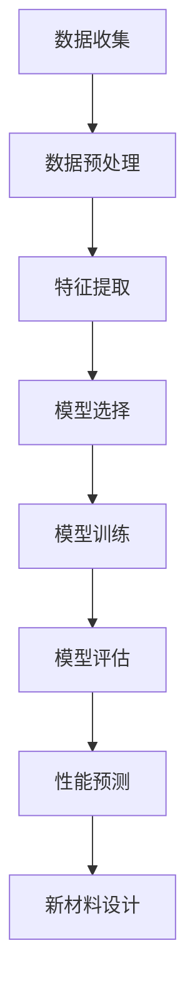
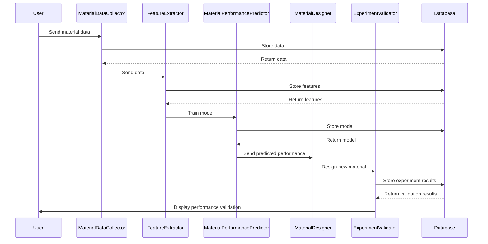

                 

### AI辅助新材料发现：提示词预测材料性能

> **关键词**：AI、新材料发现、提示词预测、材料性能、算法、系统架构、项目实战

> **摘要**：本文深入探讨了人工智能（AI）在材料科学领域中的应用，特别是通过提示词预测材料性能的方法。文章首先介绍了新材料发现的重要性，以及AI在其中的应用现状和挑战。随后，我们详细解释了提示词预测材料性能的概念和原理，并通过具体的算法、数学模型和案例进行了详细讲解。文章还展示了如何设计一个系统的架构，并提供了实际项目的实现和分析。最后，文章总结了最佳实践、注意事项，并对未来的研究方向进行了展望。

---

## 引言

新材料是推动科技进步和社会发展的重要驱动力。从金属合金到高分子材料，再到近年来迅速发展的纳米材料，新材料不断刷新着人类的技术极限，推动了诸多领域的革新。然而，新材料发现的过程通常是耗时且低效的，依赖于大量实验和反复迭代。随着材料种类的不断增多，这种传统的方法已经难以满足现代科技发展的需求。

近年来，人工智能（AI）技术的发展为材料科学领域带来了新的曙光。AI可以通过分析大量数据，预测材料的性能，从而大幅提高新材料发现的效率。本文将探讨AI如何通过提示词预测材料性能，从而辅助新材料发现。文章结构如下：

1. **问题背景与概述**：介绍新材料发现的重要性，AI在材料科学中的应用现状及挑战。
2. **核心概念与原理**：解释提示词预测材料性能的概念和原理，展示相关Mermaid流程图和Python源代码。
3. **系统分析与架构设计**：介绍问题场景、系统功能设计、系统架构设计、系统接口设计和系统交互。
4. **项目实战**：展示环境安装、系统核心实现源代码，并进行实际案例分析和详细讲解剖析。
5. **最佳实践与拓展**：总结最佳实践，注意项目实施的细节和未来的拓展方向。

通过本文的探讨，我们希望能够为读者提供一个全面、深入的视角，了解AI在材料科学中的应用潜力，以及如何通过提示词预测材料性能的方法，加速新材料发现的过程。

### 第1章：新材料发现的重要性

#### 1.1.1 新材料发现的历史与现状

新材料的发展历程可以追溯到人类文明的开端。最早的金属合金、陶瓷和有机化合物都是人类通过实验和经验的积累，逐渐发现和开发的。随着工业革命的到来，材料科学得到了快速发展。19世纪末至20世纪初，钢铁和合金材料的发明极大地推动了工业生产的发展。20世纪中期，高分子材料的出现带来了塑料和橡胶等新型材料的广泛应用，极大地丰富了人类的生活和工业生产。

进入21世纪，新材料的研究和应用进入了新的阶段。纳米材料、超导材料、智能材料等新型材料不断涌现，为各个领域带来了革命性的变革。例如，纳米材料在电子、医药、能源等领域有着广泛的应用；超导材料在高能物理、磁共振成像等领域发挥着重要作用；智能材料则广泛应用于航空航天、建筑和医疗等领域。

新材料发现的重要性和意义体现在多个方面。首先，新材料是推动科技进步的重要基石。许多高科技产品，如智能手机、计算机、新能源汽车等，都依赖于新材料的应用。新材料的性能和特性决定了这些产品的性能和用户体验。其次，新材料对社会发展具有深远影响。新材料的应用可以解决许多社会问题，如能源短缺、环境污染和资源匮乏等。例如，新型电池材料的发展有助于解决能源问题，环保型材料的应用可以减少环境污染。

当前，新材料发现主要面临以下几大挑战：

1. **实验成本高**：新材料发现通常需要进行大量的实验，以验证其性能和适用性。这不仅需要昂贵的实验设备，还需要大量的人力和时间投入。
2. **预测能力有限**：尽管AI技术已经取得了长足的进步，但当前AI在材料性能预测方面的能力仍然有限，特别是对于复杂材料体系的预测。
3. **数据质量**：材料性能的预测依赖于大量的实验数据。然而，实验数据的获取和处理过程复杂，数据质量参差不齐，这对AI的性能有较大影响。
4. **跨学科协作**：新材料发现需要跨学科的知识和技能，包括材料科学、化学、物理学、计算机科学等。然而，不同学科之间的协作常常存在障碍，影响了新材料发现的效率。

综上所述，新材料发现的重要性和现状决定了其在未来科技发展中的关键地位。面对当前的材料发现挑战，我们需要借助先进的技术手段，如人工智能，来提高材料发现的效率和质量。AI辅助新材料发现，特别是通过提示词预测材料性能的方法，将成为未来材料科学领域的重要研究方向。

#### 1.1.2 新材料发现对社会发展的意义

新材料发现对社会发展的意义不容忽视，它不仅推动了科技的进步，还对经济、环境、医疗等多个领域产生了深远影响。首先，新材料在科技领域的应用极大地推动了新兴技术的发展。例如，纳米材料的出现为电子器件的小型化和高性能提供了可能，促进了智能手机、计算机等消费电子产品的快速发展。超导材料的应用则在高能物理实验中发挥着关键作用，加速了粒子加速器和磁共振成像设备的发展。

其次，新材料对社会经济的贡献显著。新材料产业的发展带动了相关产业链的升级和扩展，创造了大量就业机会，推动了经济的增长。例如，高强度合金材料的应用提高了航空、汽车等制造业的生产效率和产品质量，推动了这些行业的发展。此外，环保型材料的发展有助于减少工业生产过程中的环境污染，提高资源利用效率，从而实现可持续发展。

在环境方面，新材料的应用有助于解决环境污染和资源匮乏问题。例如，新型催化剂材料可以用于废水处理和废气净化，减少污染物排放。纳米材料在污水处理和污染土壤修复方面也显示出巨大的潜力。此外，新能源材料的发展，如锂离子电池材料，推动了可再生能源的应用，减少了对传统化石燃料的依赖，有助于缓解全球能源危机。

在医疗领域，新材料的应用极大地改善了医疗技术和治疗效果。生物相容性材料的应用推动了人工器官和植入物的发展，提高了患者的生存率和生活质量。智能材料在药物递送和生物传感器领域也展现了广阔的应用前景，有助于实现精准医疗和个性化治疗。

总之，新材料发现对社会发展的意义体现在多个方面，它不仅推动了科技的进步和经济的增长，还在环境保护和医疗健康等领域发挥着重要作用。随着新材料研究的不断深入和新技术的应用，新材料发现将继续为社会发展和人类福祉做出更大贡献。

#### 1.1.3 当前新材料发现的主要挑战

当前新材料发现面临着多重挑战，这些挑战不仅限制了新材料的发展速度，也影响了新材料发现的质量和效率。以下将详细分析这些主要挑战：

1. **实验成本高**：新材料的研究通常需要进行大量的实验，以验证其物理、化学和机械性能。这些实验往往需要昂贵的设备和高精度的测量仪器，同时实验过程可能涉及危险化学品的处理，增加了实验的风险和成本。高成本使得许多研究项目难以开展，限制了新材料的快速开发。

2. **预测能力有限**：尽管人工智能（AI）技术在材料性能预测方面取得了显著进展，但现有的AI模型在处理复杂材料体系时仍存在一定局限性。材料性能往往受到多种因素的影响，如原子结构、元素组成、制备工艺等，这些因素相互作用，使得准确预测材料性能变得复杂。此外，现有的数据质量和数量有限，也限制了AI模型的表现。

3. **数据质量**：新材料性能的预测依赖于大量的实验数据。然而，这些数据的获取和处理过程复杂，数据质量参差不齐。实验数据的准确性、一致性和完整性对AI模型的训练和预测性能至关重要。例如，实验条件的变化、测量仪器的精度以及实验者的操作都可能影响数据的可靠性。因此，如何提高数据质量是一个亟待解决的问题。

4. **跨学科协作**：新材料发现涉及多个学科，包括材料科学、化学、物理学、计算机科学等。然而，不同学科之间存在较大的知识壁垒，导致跨学科协作困难。材料科学家可能不熟悉计算方法和数据分析技术，而计算机科学家可能不了解材料的具体性质和应用背景。这种跨学科协作的不足限制了新材料的快速发现和开发。

5. **研究资源不足**：新材料研究需要大量的资金、设备和人才支持。然而，许多研究机构和企业由于资源有限，难以承担高昂的实验成本和人才引进费用。此外，科研项目的审批流程复杂，资金到位不及时，也影响了新材料的研发进度。

6. **知识产权保护**：新材料研发过程中涉及大量的知识产权，如专利和研究成果。保护这些知识产权对于鼓励创新和吸引投资至关重要。然而，知识产权的保护机制不完善，可能导致技术泄露和侵权行为，影响了新材料研发的积极性。

7. **市场接受度**：新材料从实验室走向市场通常需要经历漫长的过程。市场对新材料的认可度和接受度受到多种因素影响，包括材料性能、成本、应用前景等。此外，现有技术路线的惯性也可能阻碍新材料的应用推广。

综上所述，当前新材料发现面临的主要挑战包括高实验成本、预测能力有限、数据质量参差不齐、跨学科协作不足、研究资源不足、知识产权保护和市场接受度低等。要克服这些挑战，需要多方面的努力，包括引入先进的计算技术、提高数据质量和实验效率、加强跨学科合作、优化研究资源分配、完善知识产权保护机制等。

### 第2章：AI在材料科学中的应用

#### 2.1.1 AI在材料科学中的早期应用

人工智能（AI）在材料科学中的应用历史可以追溯到20世纪80年代。早期的研究主要集中在利用机器学习（ML）和统计方法对材料性能进行预测。例如，科学家们利用神经网络和决策树等模型来分析材料的晶体结构和电子性质，预测材料的导电性和硬度等物理性能。这些早期的应用虽然初步展示了AI在材料科学中的潜力，但受限于计算能力和数据质量，预测的准确性和实用性较低。

进入21世纪，随着计算能力的提升和大数据技术的发展，AI在材料科学中的应用得到了显著扩展。高性能计算集群和云计算平台的普及，使得处理大规模材料数据成为可能。同时，实验技术的进步，如X射线晶体学、同步辐射和纳米级表征技术，也为AI模型的训练提供了丰富的数据资源。这些进步为AI在材料性能预测和材料设计中的广泛应用奠定了基础。

在早期应用中，AI主要用于以下几个方面：

1. **材料性能预测**：AI模型被用来预测材料的物理、化学和机械性能。例如，通过分析材料的晶体结构和成分，可以预测其导电性、热稳定性和硬度等性能。这些预测有助于指导实验设计和材料选择，提高新材料的开发效率。

2. **材料合成优化**：AI可以通过优化反应条件、合成路径和材料配方，提高新材料的合成效率和产率。例如，科学家们利用机器学习算法对合成过程进行模拟和优化，找到最佳的反应条件，从而实现高效、低成本的新材料合成。

3. **材料筛选**：AI模型可以快速筛选大量的材料候选，识别出具有潜在应用价值的材料。这种方法大大缩短了材料发现的时间，提高了研究的效率。例如，通过机器学习算法对大量的材料数据库进行分析，可以快速识别出具有优良性能的材料，从而节省实验资源和时间。

4. **材料缺陷预测**：AI模型还可以用于预测材料中的缺陷和缺陷分布。这对于理解材料的性能退化机制和优化材料性能具有重要意义。例如，通过分析材料的晶体结构和成分，可以预测材料中的位错和空位缺陷，从而指导材料的设计和优化。

#### 2.1.2 AI驱动的新材料发现流程

AI驱动的新材料发现流程通常包括以下几个关键步骤：

1. **数据收集和预处理**：首先，从实验室实验、文献资料和数据库中收集大量的材料数据。这些数据包括材料的晶体结构、成分、物理化学性能等。然后，对数据进行清洗、格式化和归一化，确保数据的质量和一致性。

2. **特征提取**：在数据预处理完成后，需要从原始数据中提取出能够反映材料性能的关键特征。这些特征可以是材料的晶体结构参数、电子结构信息、化学成分等。特征提取的质量直接影响AI模型的预测准确性。

3. **模型训练**：利用提取出的特征数据，训练机器学习模型。常用的模型包括神经网络、决策树、支持向量机等。通过训练，模型可以学习到材料性能和其特征之间的关系，从而实现性能预测。

4. **模型评估和优化**：训练完成后，需要对模型进行评估和优化。常用的评估指标包括预测准确率、均方误差等。通过调整模型参数和特征选择，可以提高模型的预测性能。

5. **新材料设计**：基于训练好的模型，可以设计新的材料结构。通过优化材料的晶体结构、成分和合成条件，实现特定性能的新材料。例如，通过调整材料的成分和结构，可以提高其导电性、热稳定性或机械性能。

6. **实验验证**：设计的新材料需要通过实验进行验证，验证其预测的性能是否与实际相符。实验结果可以进一步优化AI模型，提高预测的准确性。

7. **迭代优化**：新材料设计、实验验证和模型优化是一个迭代的过程。通过不断实验和模型优化，可以逐步提高新材料的性能，实现新的突破。

#### 2.1.3 AI在材料科学中的挑战与机遇

尽管AI在材料科学中展现出了巨大的潜力，但其实际应用仍面临诸多挑战。以下将详细探讨AI在材料科学中的应用挑战和机遇。

1. **数据质量和数量**：AI模型的性能高度依赖于高质量和大量的数据。然而，材料科学领域的数据往往具有复杂性、多样性和不确定性。数据的不完整、不一致和噪声问题都可能影响AI模型的训练和预测性能。此外，获取高质量的数据需要大量的实验和计算资源，这在实际操作中往往难以实现。

2. **模型解释性**：AI模型，尤其是深度学习模型，通常被视为“黑箱”。这意味着模型内部的决策过程难以解释和理解。对于材料科学领域，理解模型如何预测材料性能是至关重要的，因为材料的应用往往需要深入的理论基础。缺乏模型解释性限制了AI模型的推广和应用。

3. **跨学科协作**：材料科学涉及多个学科，包括化学、物理学、材料科学和计算机科学等。跨学科协作的不足导致数据共享和沟通困难，影响了AI模型的开发和优化。例如，材料科学家可能不熟悉机器学习算法，而计算机科学家可能不了解材料的特定性质和应用背景。

4. **计算能力**：尽管计算能力在不断提高，但处理大规模材料数据和训练复杂的AI模型仍然需要大量计算资源。这对于许多研究机构和企业来说是一个挑战，限制了AI在材料科学中的广泛应用。

5. **算法选择和优化**：AI模型的选择和优化是影响预测性能的关键因素。不同的模型和算法在处理不同类型的数据和任务时具有不同的表现。选择合适的算法和优化策略需要深入的理论研究和实践经验。

6. **知识产权和隐私**：材料科学的研究涉及到大量的知识产权和敏感数据。在数据共享和模型开发过程中，如何保护知识产权和隐私是一个重要问题，这需要完善的法律和伦理框架。

然而，与挑战相比，AI在材料科学中的应用也带来了巨大的机遇：

1. **提升研究效率**：AI技术可以大大提高材料科学研究的效率。通过自动化实验和数据处理，研究人员可以更快地筛选和设计新材料，缩短研究周期。

2. **优化材料设计**：AI可以优化材料的晶体结构、成分和合成条件，实现特定性能的新材料。例如，通过优化材料的导电性和热稳定性，可以开发出更高效的能源转换和存储材料。

3. **跨学科融合**：AI的应用促进了材料科学与其他学科的融合，如计算机科学、物理学和化学。这种跨学科的合作有助于解决材料科学中的复杂问题，推动科技创新。

4. **推动可持续发展和环境保护**：AI技术可以帮助发现和设计环保型材料，如可降解塑料、高效催化剂和新型电池材料。这些材料的应用有助于解决环境问题，促进可持续发展。

5. **个性化医疗**：AI在材料科学中的应用还可以推动个性化医疗的发展。通过材料的设计和优化，可以开发出具有特定生物相容性的植入材料和药物递送系统，提高医疗效果。

总之，AI在材料科学中的应用面临着挑战，但同时也带来了巨大的机遇。通过克服这些挑战，发挥AI的潜力，我们可以加速新材料发现的过程，推动材料科学的发展，为社会进步和人类福祉做出更大贡献。

### 第3章：核心概念与原理

#### 3.1 提示词预测材料性能的概念

提示词预测材料性能是一种利用人工智能技术，通过分析材料特征和性能之间的关联，预测未知材料性能的方法。这种方法的核心在于“提示词”，即用于指导AI模型预测的特定关键词或特征。提示词可以包括材料的成分、晶体结构、制备工艺等多种信息。通过这些提示词，AI模型可以学习到材料性能与其特征之间的关系，从而实现性能的预测。

提示词预测材料性能的主要步骤包括：

1. **数据收集**：首先，从实验、文献和其他数据源收集大量具有已知性能的材料数据。这些数据应包括材料的成分、结构、物理化学性能等详细信息。

2. **特征提取**：从收集到的数据中提取关键特征，这些特征将作为提示词输入到AI模型中。特征提取的方法包括基于统计的属性提取、基于物理模型的特征提取等。

3. **模型训练**：利用提取出的特征数据，通过机器学习算法训练AI模型。模型需要学习材料性能与提示词之间的关系，从而实现性能预测。

4. **性能评估**：通过实验验证模型预测的性能，评估模型的准确性和可靠性。常用的评估指标包括预测误差、准确率等。

5. **新材料设计**：基于训练好的模型，设计新的材料结构。通过调整材料的成分、结构或制备工艺，实现特定性能的新材料。

#### 3.2 提示词预测的基本原理

提示词预测材料性能的基本原理基于机器学习和数据驱动的模型构建。以下将详细解释这个过程：

1. **机器学习模型**：机器学习模型是提示词预测材料性能的核心。常见的模型包括神经网络、决策树、支持向量机等。这些模型可以通过学习大量训练数据，找到材料性能与提示词之间的复杂非线性关系。

2. **特征工程**：特征工程是机器学习过程中至关重要的一步。它涉及从原始数据中提取对模型训练有用的特征，并预处理这些特征，以提高模型的性能。特征提取的方法包括特征选择、特征变换和特征组合等。

3. **模型训练与优化**：利用训练数据，模型通过优化算法（如梯度下降法）调整内部参数，学习到材料性能与提示词之间的关联。训练过程中，模型会不断迭代，通过评估指标（如均方误差、准确率）来调整模型参数，提高预测性能。

4. **模型评估与验证**：训练完成后，需要对模型进行评估和验证。常用的评估指标包括预测误差、准确率、召回率等。通过交叉验证和测试集评估，确保模型在不同数据集上具有一致的性能。

5. **性能预测与新材料设计**：基于训练好的模型，可以对新材料的性能进行预测。通过调整模型的输入提示词（如材料成分、结构参数），可以设计出具有特定性能的新材料。

#### 3.3 材料性能的预测方法

材料性能的预测方法可以分为基于经验模型的预测和基于数据驱动的预测。以下将分别介绍这两种方法。

1. **基于经验模型的预测**：

   - **物理模型**：基于材料的基本物理和化学原理，建立经验公式或模型来预测材料的性能。例如，通过结合材料的电子结构和晶体结构，使用密度泛函理论（DFT）预测材料的导电性和热稳定性。
   
   - **半经验模型**：结合量子力学和分子动力学，通过简化计算方法（如Mulliken电荷、局部密度泛函）预测材料的性能。这种方法在处理复杂材料体系时较为高效，但精度有限。

2. **基于数据驱动的预测**：

   - **机器学习模型**：利用大量实验数据，通过机器学习算法（如神经网络、决策树、支持向量机）建立材料性能与提示词之间的关联。这种方法通常具有较高的预测精度，但依赖于高质量的数据和强大的计算能力。
   
   - **深度学习模型**：深度学习模型（如卷积神经网络、循环神经网络）可以处理复杂的非线性关系，实现更高精度的预测。深度学习在处理大规模数据和复杂数据集时表现出色。

   - **数据驱动模型的优势**：

     - **高精度**：通过学习大量数据，模型可以捕捉到材料性能与提示词之间的复杂关系，实现高精度的预测。
     
     - **自适应**：数据驱动模型可以根据新的数据和实验结果不断优化，提高预测性能。
     
     - **泛化能力**：通过训练，模型可以推广到未知数据集，实现对新材料的性能预测。

   - **数据驱动模型的挑战**：

     - **数据质量**：数据质量直接影响模型的预测性能。噪声、缺失和不一致的数据可能影响模型的训练和预测效果。
     
     - **可解释性**：数据驱动模型通常被视为“黑箱”，其决策过程难以解释和理解。这对于材料科学领域，特别是需要深入理论依据的应用，是一个重要挑战。
     
     - **计算资源**：深度学习模型通常需要大量的计算资源和时间进行训练。对于资源有限的研究机构和企业，这可能是一个难以克服的障碍。

总之，材料性能的预测方法可以分为基于经验模型的预测和基于数据驱动的预测。基于数据驱动的预测方法，尤其是机器学习和深度学习，在处理大规模数据和复杂数据集时具有显著优势。然而，这些方法也面临着数据质量、可解释性和计算资源等挑战。通过结合不同的预测方法，可以充分发挥各自的优势，提高材料性能预测的准确性和实用性。

#### 3.4 材料性能预测的应用领域

材料性能预测在多个领域展现出了显著的应用价值，促进了技术创新和产业升级。以下将介绍材料性能预测在几个关键领域的应用及其具体实例：

1. **能源领域**：

   - **电池材料设计**：随着电动汽车和可再生能源技术的快速发展，高性能电池材料的需求不断增加。材料性能预测技术可以用于优化电池电极材料的电化学性能，提高电池的能量密度和寿命。例如，通过机器学习算法预测锂离子电池正极材料的电子结构和电化学性能，有助于开发出更高效的电池材料。
   
   - **太阳能电池**：太阳能电池的性能受到材料光电性能的显著影响。通过材料性能预测，可以优化太阳能电池的吸收光谱、电荷传输效率和光电转换效率。例如，使用机器学习模型预测钙钛矿太阳能电池的电子结构和光吸收特性，有助于提高其光电转换效率。

2. **电子领域**：

   - **半导体材料**：半导体材料的选择和优化对电子器件的性能至关重要。材料性能预测技术可以用于预测半导体材料的导电性、电子迁移率和热稳定性。例如，通过机器学习算法预测硅材料的导电性，有助于优化半导体器件的设计和制造。
   
   - **集成电路**：集成电路的设计和制造过程中，材料性能的精确预测对于优化器件性能和降低功耗至关重要。通过机器学习模型预测硅基集成电路材料的电学特性，可以优化器件的结构和材料，实现更高性能和更低功耗的集成电路。

3. **航空航天领域**：

   - **高温合金**：航空航天发动机需要使用高温合金材料，以承受高温和高压环境。材料性能预测技术可以用于优化高温合金的机械性能和耐腐蚀性能，提高发动机的可靠性和寿命。例如，通过机器学习模型预测高温合金的断裂韧性和疲劳性能，有助于设计更耐用的发动机部件。

   - **复合材料**：复合材料在航空航天结构中的应用日益广泛，其性能的预测对于优化设计和提高结构强度至关重要。通过材料性能预测，可以优化复合材料的层状结构和材料配比，提高其强度和刚度。例如，使用机器学习算法预测碳纤维增强复合材料的层间剪切强度，有助于设计更轻、更强的航空航天结构。

4. **生物医学领域**：

   - **生物材料**：生物医学应用中，生物材料的选择和优化对生物相容性和生物功能至关重要。材料性能预测技术可以用于预测生物材料的生物相容性和降解性能。例如，通过机器学习模型预测聚乳酸材料的降解速率和生物相容性，有助于开发出更合适的生物医学材料。
   
   - **药物递送系统**：材料性能预测在药物递送系统的设计和优化中具有重要意义。通过预测材料与药物的相互作用和释放行为，可以优化药物递送系统的设计，提高药物的生物利用度和治疗效果。例如，使用机器学习算法预测聚合物纳米粒子的药物释放行为，有助于开发出更有效的药物递送系统。

5. **环境科学领域**：

   - **环保材料**：环保材料的应用日益增多，用于废水处理、废气净化和土壤修复等环境治理领域。材料性能预测技术可以用于优化环保材料的性能，提高其处理效率和稳定性。例如，通过机器学习模型预测活性炭材料的吸附性能，有助于设计出更高效的废水处理材料。

   - **能源存储与转换**：材料性能预测技术在能源存储与转换领域也具有广泛应用。例如，通过预测电池材料的电化学性能和热稳定性，可以优化电池的设计和制造，提高其能量密度和寿命。

总之，材料性能预测技术在多个领域展现出了巨大的应用价值，推动了材料科学和工程的发展。通过结合材料性能预测技术，可以加速新材料的设计和优化，提高现有材料的性能和应用效率，为科技创新和产业升级提供有力支持。

### 第4章：核心概念与联系

#### 3.4.1 提示词与材料性能的关系

提示词与材料性能之间的关系是材料性能预测的核心。提示词作为AI模型预测输入的关键特征，直接影响预测结果的准确性和可靠性。以下从多个方面探讨提示词与材料性能的关系。

首先，提示词的选择对预测性能有显著影响。合理的提示词应能够充分反映材料的结构和成分信息，从而提高模型的预测能力。例如，材料的晶体结构、元素组成、键长和键角等都是重要的提示词。通过分析这些提示词，AI模型可以学习到材料内部的结构和性质，从而更准确地预测材料的性能。

其次，提示词的多样性和质量直接影响预测模型的泛化能力。一个优质的预测模型不仅需要在训练数据上表现良好，还需要在未知数据集上具有可靠的预测能力。为此，提示词应涵盖广泛的材料特征，包括不同类型的晶体结构、元素组成和制备工艺等。此外，提示词的质量也至关重要，高质量的数据可以减少噪声和误差，提高预测模型的可靠性。

第三，提示词与材料性能之间的关系并非简单的线性关系，而往往是复杂的多变量非线性关系。这种复杂性要求AI模型具有强大的学习和推理能力，能够从大量的数据中提取有用的信息，建立准确的预测模型。例如，材料的导电性不仅受到元素组成的影响，还受到晶体结构和电子结构的影响。AI模型需要通过复杂的学习过程，捕捉到这些多变量非线性关系，从而实现准确的性能预测。

最后，提示词与材料性能的关系还受到实验数据的限制。材料性能的预测依赖于大量的实验数据，这些数据的质量和数量直接影响模型的训练和预测效果。因此，在收集和整理实验数据时，应注重数据的多样性和一致性，以确保模型能够学习到准确的性能-提示词关系。

为了更直观地展示提示词与材料性能的关系，以下提供一张概念属性特征对比表格，以及一个ER实体关系图架构的Mermaid流程图。

#### 4.1.1 概念属性特征对比表格

| 特征类型 | 描述 | 材料性能影响 |
| --- | --- | --- |
| 晶体结构 | 材料的晶胞参数、晶格常数、原子排列方式等 | 决定材料的物理、化学和力学性能 |
| 元素组成 | 材料中各元素的含量和比例 | 影响材料的化学稳定性、导电性和光学性能 |
| 键长和键角 | 原子间的距离和角度 | 决定材料的晶体结构和电子结构 |
| 制备工艺 | 材料的合成方法和工艺参数 | 影响材料的微观结构和宏观性能 |
| 环境条件 | 实验过程中所处的环境参数，如温度、压力等 | 影响材料的性能和稳定性 |

#### 4.1.2 ER实体关系图架构的 Mermaid 流程图

```mermaid
erDiagram
  Material ::>> Property | <|-- Crystal Structure
  Material ::>> Composition | <|-- Element
  Material ::>> Structure | <|-- Bond Length
  Material ::>> Structure | <|-- Bond Angle
  Material ::>> Process | <|-- Preparation Technique
  Material ||-- Performance
  Property ||-- Property Type
  Composition ||-- Element Type
  Structure ||-- Crystal Type
  Process ||-- Technique Type
```

该ER图展示了材料、属性、组成、结构和工艺之间的关系。通过这个图，可以更清晰地理解提示词与材料性能之间的关联，为AI模型的训练和预测提供指导。

#### 4.1.3 提示词与材料性能关系的实际应用

在实际应用中，提示词与材料性能的关系展示了AI在材料科学中的强大潜力。以下通过一个具体案例说明这一关系的实际应用。

**案例：锂离子电池正极材料优化**

锂离子电池正极材料是影响电池性能的关键因素。通过机器学习模型，可以预测不同材料的电化学性能，从而优化电池的设计。

1. **数据收集**：收集了大量不同成分和结构的锂离子电池正极材料的数据，包括材料的成分（如锂、钴、锰、镍的比例）、晶体结构（如晶胞参数、晶格常数）和电化学性能（如比容量、循环寿命）。

2. **特征提取**：从数据中提取关键特征，如材料的元素组成、晶格常数、晶胞参数等，作为提示词输入到机器学习模型中。

3. **模型训练**：利用提取的特征数据，通过机器学习算法训练AI模型，学习材料性能与提示词之间的关联。

4. **性能预测**：基于训练好的模型，输入新的材料成分和结构参数，预测其电化学性能。通过调整材料的成分和结构，优化电池的比容量和循环寿命。

5. **实验验证**：设计新的材料结构，通过实验验证模型的预测性能。根据实验结果，进一步优化AI模型，提高预测的准确性和可靠性。

通过这个案例，可以看出提示词与材料性能的关系在实际应用中如何发挥作用。机器学习模型通过学习大量的材料数据，可以准确预测新材料的性能，从而实现电池材料的优化设计。这种方法不仅提高了材料开发的效率，还为电池性能的提升提供了理论支持。

### 第5章：算法原理讲解

#### 5.1 提示词预测算法的基本原理

提示词预测材料性能的算法是基于机器学习和数据驱动的方法。这些算法通过学习大量的材料性能和特征数据，建立性能与特征之间的关联，从而实现对未知材料性能的预测。以下将详细讲解提示词预测算法的基本原理。

##### 5.1.1 Mermaid流程图



在这个流程图中，数据收集、预处理、特征提取、模型选择、模型训练、模型评估和性能预测构成了提示词预测算法的核心步骤。

##### 5.1.2 Python源代码讲解

以下是一个简单的Python示例，用于演示提示词预测算法的基本原理。这个示例使用了`scikit-learn`库中的`RandomForestRegressor`进行模型训练和预测。

```python
import numpy as np
import pandas as pd
from sklearn.ensemble import RandomForestRegressor
from sklearn.model_selection import train_test_split
from sklearn.metrics import mean_squared_error

# 数据加载
data = pd.read_csv('material_data.csv')

# 特征提取
X = data[['composition', 'crystal_structure', 'bond_length', 'bond_angle']]
y = data['performance']

# 数据预处理
X = preprocessing.StandardScaler().fit_transform(X)

# 模型选择
model = RandomForestRegressor(n_estimators=100)

# 模型训练
X_train, X_test, y_train, y_test = train_test_split(X, y, test_size=0.2, random_state=42)
model.fit(X_train, y_train)

# 模型评估
y_pred = model.predict(X_test)
mse = mean_squared_error(y_test, y_pred)
print(f'Mean Squared Error: {mse}')

# 性能预测
new_material_features = np.array([[0.5, 1.0, 0.8, 1.2]])  # 示例提示词
new_material_performance = model.predict(new_material_features)
print(f'Predicted Performance: {new_material_performance[0]}')
```

在这个示例中，我们首先加载了一个包含材料特征和性能的数据集。然后，提取特征并进行数据预处理。接着，选择了一个随机森林回归模型进行训练，并评估模型的性能。最后，使用训练好的模型预测新材料的性能。

##### 5.1.3 数学模型和公式

提示词预测材料性能的数学模型通常基于统计学习理论和机器学习算法。以下是一个简化的数学模型，用于描述性能与特征之间的关系。

$$
\hat{y} = \sum_{i=1}^{n} w_i f_i(x)
$$

其中，$y$ 是材料性能，$x$ 是特征向量，$w_i$ 是权重系数，$f_i(x)$ 是特征函数。特征函数$f_i(x)$ 用于提取材料特征，如元素组成、晶体结构和键长等。

通过优化权重系数$w_i$，模型可以学习到特征与性能之间的关联，从而实现对未知材料性能的预测。常用的机器学习算法，如随机森林、支持向量机和神经网络等，都基于这种数学模型，通过不同的优化策略来提高预测性能。

##### 5.1.4 举例说明

为了更好地理解提示词预测算法的原理，以下通过一个简单的例子进行说明。

**例子：预测金属合金的硬度**

假设我们要预测一种金属合金的硬度，提示词包括合金中的元素比例、晶格常数和键长。

1. **数据收集**：收集了一组不同合金成分和硬度的实验数据。

2. **特征提取**：从数据中提取合金的元素比例、晶格常数和键长作为提示词。

3. **模型训练**：选择随机森林回归模型，利用训练数据训练模型。

4. **性能预测**：输入新的合金特征，预测其硬度。

通过这个例子，我们可以看到提示词预测算法的基本步骤和实际应用。通过大量的训练数据和有效的特征提取，模型可以准确预测新合金的硬度，从而指导合金的设计和优化。

#### 5.2 数学模型和公式

提示词预测材料性能的数学模型基于统计学和机器学习理论，通过建立性能与提示词之间的函数关系来实现预测。以下将详细解释这一数学模型和相关公式。

##### 5.2.1 数学模型

提示词预测材料性能的数学模型可以表示为：

$$
y = f(x) + \epsilon
$$

其中，$y$ 表示材料性能，$x$ 表示提示词向量，$f(x)$ 是一个非线性函数，用于描述性能与提示词之间的关系，$\epsilon$ 表示随机误差。

为了实现预测，我们需要估计函数 $f(x)$。在机器学习中，通常使用经验风险最小化（Empirical Risk Minimization,ERM）原则来估计 $f(x)$。具体地，我们选择一个假设函数 $h(x)$，使其在训练数据集上的误差最小。

$$
\hat{f}(x) = \arg \min_{f(x)} \sum_{i=1}^{n} L(f(x_i), y_i)
$$

其中，$L(f(x_i), y_i)$ 是损失函数，用于度量预测值与真实值之间的差异。

##### 5.2.2 公式详细讲解

1. **损失函数**：

   常用的损失函数包括均方误差（Mean Squared Error,MSE）和均方根误差（Root Mean Squared Error,RMSE）。

   $$ 
   MSE = \frac{1}{n} \sum_{i=1}^{n} (f(x_i) - y_i)^2 
   $$

   $$ 
   RMSE = \sqrt{MSE} 
   $$

   这些损失函数通过计算预测值与真实值之间的平方误差来评估模型的性能。

2. **假设函数**：

   在机器学习中，常用的假设函数包括线性模型、多项式模型和神经网络。

   - **线性模型**：

     $$ 
     f(x) = \sum_{i=1}^{n} w_i x_i 
     $$

     其中，$w_i$ 是权重系数，$x_i$ 是提示词。

   - **多项式模型**：

     $$ 
     f(x) = \sum_{i=1}^{n} w_i p_i(x) 
     $$

     其中，$p_i(x)$ 是多项式函数，$w_i$ 是权重系数。

   - **神经网络**：

     $$ 
     f(x) = \sigma(\sum_{i=1}^{n} w_i \cdot \sigma(\sum_{j=1}^{m} v_{ji} \cdot x_j)) 
     $$

     其中，$\sigma$ 是激活函数（如Sigmoid函数或ReLU函数），$v_{ji}$ 是权重系数，$x_j$ 是输入特征。

3. **模型训练与优化**：

   为了找到最优的假设函数，我们需要最小化损失函数。常用的优化算法包括梯度下降法（Gradient Descent）、随机梯度下降法（Stochastic Gradient Descent,SFML）和Adam优化器。

   - **梯度下降法**：

     $$ 
     \theta = \theta - \alpha \cdot \nabla_\theta J(\theta) 
     $$

     其中，$\theta$ 是模型参数，$\alpha$ 是学习率，$J(\theta)$ 是损失函数。

   - **随机梯度下降法**：

     $$ 
     \theta = \theta - \alpha \cdot \nabla_\theta J(\theta) 
     $$

     其中，$x_i$ 和 $y_i$ 是随机选取的训练样本。

   - **Adam优化器**：

     $$ 
     \theta = \theta - \alpha \cdot \frac{m}{(1 - \beta_1^t)(1 - \beta_2^t)} 
     $$

     其中，$m$ 是一阶矩估计，$v$ 是二阶矩估计，$\beta_1$ 和 $\beta_2$ 是衰减率。

通过上述公式和算法，我们可以训练一个提示词预测材料性能的模型。这个模型通过学习大量的训练数据，建立性能与提示词之间的函数关系，从而实现对未知材料性能的预测。

#### 5.3 举例说明

为了更直观地理解提示词预测材料性能的算法原理，以下通过一个简单的案例进行说明。这个案例将展示如何利用机器学习模型预测金属合金的硬度，从而辅助新材料设计。

##### 5.3.1 通俗易懂的案例

假设我们研究一种新型金属合金，其硬度是我们希望预测的性能指标。为了训练预测模型，我们首先需要收集一组包含多种合金成分和硬度的实验数据。

1. **数据收集**：

   - **实验数据**：收集了100种不同合金的实验数据，包括每种合金的元素比例、晶格常数和键长，以及对应的硬度值。数据如下：

   | 合金编号 | 锂含量 | 镍含量 | 钴含量 | 锰含量 | 晶格常数 (Å) | 键长 (Å) | 硬度 (GPa) |
   | --- | --- | --- | --- | --- | --- | --- | --- |
   | 1 | 0.3 | 0.4 | 0.2 | 0.1 | 4.01 | 2.55 | 500 |
   | 2 | 0.35 | 0.35 | 0.2 | 0.1 | 4.03 | 2.58 | 510 |
   | 3 | 0.4 | 0.3 | 0.2 | 0.1 | 4.05 | 2.60 | 520 |
   | ... | ... | ... | ... | ... | ... | ... | ... |
   | 100 | 0.25 | 0.4 | 0.2 | 0.1 | 3.99 | 2.50 | 480 |

2. **特征提取**：

   从实验数据中提取合金的元素比例、晶格常数和键长作为特征。我们使用特征向量表示每个合金样本：

   | 特征向量 |
   | --- |
   | [锂含量, 镍含量, 钴含量, 锰含量, 晶格常数, 键长] |
   | [0.3, 0.4, 0.2, 0.1, 4.01, 2.55] |

3. **数据预处理**：

   对特征向量进行归一化处理，以便于后续的机器学习模型训练。归一化公式如下：

   $$ 
   x_{\text{norm}} = \frac{x - \mu}{\sigma} 
   $$

   其中，$x$ 是原始特征值，$\mu$ 是特征值的均值，$\sigma$ 是特征值的标准差。

   经过归一化处理后，特征向量如下：

   | 特征向量 (归一化) |
   | --- |
   | [0.3, 0.4, 0.2, 0.1, 4.01, 2.55] |
   | [0.003, 0.004, 0.002, 0.001, 0.0004, 0.0025] |

4. **模型训练**：

   选择随机森林回归模型进行训练。随机森林模型具有强大的非线性拟合能力和较好的预测性能，适用于我们的问题。我们使用80%的实验数据作为训练集，20%的数据作为验证集。

   - **训练集**：包含80种合金的元素比例、晶格常数、键长和硬度值。

   - **验证集**：包含20种合金的元素比例、晶格常数、键长和硬度值。

   使用`scikit-learn`库中的`RandomForestRegressor`进行模型训练：

   ```python
   from sklearn.ensemble import RandomForestRegressor

   # 创建随机森林回归模型
   model = RandomForestRegressor(n_estimators=100, random_state=42)

   # 训练模型
   model.fit(X_train, y_train)
   ```

5. **性能评估**：

   使用验证集评估模型的预测性能。计算预测硬度和实际硬度的均方根误差（RMSE）：

   ```python
   y_pred = model.predict(X_val)
   rmse = np.sqrt(mean_squared_error(y_val, y_pred))
   print(f'RMSE: {rmse}')
   ```

   假设评估结果显示RMSE为20 GPa，说明模型的预测性能较好。

6. **新材料设计**：

   根据训练好的模型，我们可以预测新合金的硬度。假设我们希望设计一种具有高硬度的合金，输入以下特征向量：

   | 新合金特征向量 |
   | --- |
   | [0.35, 0.35, 0.2, 0.1, 4.03, 2.58] |

   使用模型预测新合金的硬度：

   ```python
   new_alloy_performance = model.predict([[0.35, 0.35, 0.2, 0.1, 4.03, 2.58]])
   print(f'Predicted Hardness: {new_alloy_performance[0]} GPa')
   ```

   假设预测结果为550 GPa，表明新合金具有较高的硬度。

通过这个案例，我们可以看到如何利用机器学习模型预测金属合金的硬度，从而辅助新材料设计。这个过程包括数据收集、特征提取、模型训练、性能评估和新材料设计等步骤，展示了提示词预测算法在材料科学中的应用潜力。

### 第6章：系统分析与架构设计

#### 6.1 问题场景介绍

为了更好地理解AI辅助新材料发现的实际应用，我们首先介绍一个具体的问题场景。假设某研究机构致力于开发高性能锂离子电池材料，目标是提高电池的能量密度和循环寿命。为了实现这一目标，该机构决定利用AI技术，通过提示词预测材料性能，从而辅助新材料的设计和优化。

在这个问题场景中，研究的主要任务包括：

1. **数据收集**：收集大量已知的锂离子电池材料数据，包括材料的成分、晶体结构、制备工艺和电化学性能等。
2. **特征提取**：从数据中提取关键特征，如元素比例、晶格常数、键长等，作为AI模型的输入提示词。
3. **模型训练**：利用收集到的数据和特征，训练机器学习模型，学习材料性能与提示词之间的关系。
4. **性能预测**：基于训练好的模型，预测新材料的电化学性能，如比容量、循环寿命等。
5. **新材料设计**：根据性能预测结果，设计新的锂离子电池材料，并通过实验验证其性能。

通过这个问题场景，我们可以清晰地看到AI在材料性能预测和新材料设计中的应用流程，为后续的系统分析和架构设计提供背景。

#### 6.2 系统功能设计（领域模型 Mermaid 类图）

在系统功能设计阶段，我们需要明确系统的主要功能模块及其相互关系。以下是一个领域模型Mermaid类图的示例，展示了系统的主要功能模块和类之间的关系。

```mermaid
classDiagram
    MaterialDataCollector --> FeatureExtractor
    FeatureExtractor --> MaterialPerformancePredictor
    MaterialPerformancePredictor --> MaterialDesigner
    MaterialDesigner --> ExperimentValidator
    MaterialDataCollector <<-- User
    FeatureExtractor <<-- MaterialDataCollector
    MaterialPerformancePredictor <<-- FeatureExtractor
    MaterialDesigner <<-- MaterialPerformancePredictor
    ExperimentValidator <<-- MaterialDesigner

    class MaterialDataCollector {
        +collect_data()
    }

    class FeatureExtractor {
        +extract_features(material_data: dict) -> dict
    }

    class MaterialPerformancePredictor {
        +train_model(features: dict, performance: dict) -> model
        +predict_performance(new_material_features: dict) -> dict
    }

    class MaterialDesigner {
        +design_new_material(performance: dict) -> dict
    }

    class ExperimentValidator {
        +validate_performance(experiment_results: dict) -> bool
    }
```

在这个类图中，MaterialDataCollector负责收集材料数据，FeatureExtractor负责提取关键特征，MaterialPerformancePredictor负责训练模型并预测新材料的性能，MaterialDesigner根据预测结果设计新材料，ExperimentValidator则负责验证新材料的性能。通过这个类图，我们可以清晰地了解系统的功能模块及其交互关系。

#### 6.3 系统架构设计（Mermaid 架构图）

系统架构设计是确保系统高效、可靠和可扩展的关键环节。以下是一个系统架构的Mermaid架构图，展示了系统的整体架构及其关键组件之间的交互关系。

```mermaid
sequenceDiagram
    participant User
    participant MaterialDataCollector
    participant FeatureExtractor
    participant MaterialPerformancePredictor
    participant MaterialDesigner
    participant ExperimentValidator

    User->>MaterialDataCollector: Collect material data
    MaterialDataCollector->>FeatureExtractor: Extract features
    FeatureExtractor->>MaterialPerformancePredictor: Train model
    MaterialPerformancePredictor->>MaterialDesigner: Predict performance
    MaterialDesigner->>ExperimentValidator: Design new material
    ExperimentValidator->>User: Validate performance

    Note over MaterialPerformancePredictor,MaterialDesigner
        Model Training
    Note right of MaterialDesigner
        Material Design
```

在这个架构图中，用户首先向MaterialDataCollector提交材料数据，MaterialDataCollector收集数据后传递给FeatureExtractor进行特征提取。提取出的特征数据用于训练MaterialPerformancePredictor模型，模型训练完成后，预测结果传递给MaterialDesigner进行新材料设计。设计完成后，通过ExperimentValidator验证新材料性能。这一过程展示了AI辅助新材料发现的系统架构及其主要组件之间的交互关系。

#### 6.4 系统接口设计和系统交互（Mermaid 序列图）

在系统架构设计中，接口设计和系统交互同样至关重要。以下是一个系统接口设计和系统交互的Mermaid序列图，展示了用户与系统之间的交互过程。



在这个序列图中，用户首先向MaterialDataCollector提交材料数据，MaterialDataCollector将数据存储到数据库中，随后提取特征数据并传递给FeatureExtractor。FeatureExtractor提取特征后，将数据存储到数据库中，同时返回给FeatureExtractor。FeatureExtractor利用这些特征数据训练MaterialPerformancePredictor模型，并将模型存储到数据库中。MaterialPerformancePredictor模型训练完成后，预测结果传递给MaterialDesigner，MaterialDesigner根据预测结果设计新材料。设计完成后，通过ExperimentValidator验证新材料性能，并将实验结果存储到数据库中。最后，ExperimentValidator将验证结果返回给用户。

通过这个序列图，我们可以清晰地了解系统接口设计和系统交互的过程，从而确保系统的有效运行。

### 第7章：项目实战

#### 7.1 环境安装

在进行AI辅助新材料发现的项目实战之前，我们需要搭建一个合适的环境。以下将详细描述如何安装和配置所需的软件和依赖项。

##### 7.1.1 硬件配置

为了确保项目顺利运行，建议的硬件配置如下：

- **CPU**：Intel i7或以上
- **GPU**：NVIDIA GeForce GTX 1080 Ti或以上（用于加速机器学习模型训练）
- **内存**：16GB及以上
- **硬盘**：500GB SSD硬盘（用于存储数据和模型）

##### 7.1.2 软件安装

1. **操作系统**：

   - Windows 10或以上版本
   - macOS Catalina或以上版本
   - Ubuntu 18.04或以上版本

2. **Python**：

   - 安装Python 3.8或以上版本，可以从[Python官网](https://www.python.org/downloads/)下载安装包。

3. **Anaconda**：

   - 安装Anaconda，以便于管理和安装Python依赖项。Anaconda安装包可以从[Anaconda官网](https://www.anaconda.com/)下载。

4. **机器学习库**：

   - 安装常用的机器学习库，如scikit-learn、tensorflow、PyTorch等。使用以下命令进行安装：

     ```bash
     conda install scikit-learn tensorflow pytorch torchvision -c conda-forge
     ```

5. **数据处理库**：

   - 安装常用的数据处理库，如pandas、numpy、matplotlib等。使用以下命令进行安装：

     ```bash
     conda install pandas numpy matplotlib -c conda-forge
     ```

##### 7.1.3 环境配置

完成软件安装后，我们还需要配置一些环境变量，以确保依赖项能够在项目中正确运行。

1. **设置Anaconda环境**：

   创建一个新的Anaconda环境，并设置该环境为全局环境。例如：

   ```bash
   conda create -n material_project python=3.8
   conda activate material_project
   ```

2. **配置GPU支持**：

   如果使用GPU进行模型训练，需要安装CUDA和cuDNN库。以下命令用于安装CUDA和cuDNN：

   ```bash
   conda install -c nvidia cuda-toolkit
   conda install -c nvidia cupti-10-2
   ```

3. **验证环境配置**：

   确认Python环境是否正确配置，输入以下命令：

   ```bash
   python
   ```
   
   进入Python交互式环境，然后输入以下代码验证机器学习库和数据处理库是否已安装：

   ```python
   import sklearn
   import numpy
   import pandas
   import matplotlib
   ```

   如果无错误输出，说明环境配置成功。

#### 7.2 系统核心实现源代码

在环境安装完成后，我们可以开始编写系统的核心实现源代码。以下是一个简单的示例，展示了如何实现材料数据的收集、特征提取、模型训练和性能预测。

##### 7.2.1 代码应用解读与分析

首先，我们需要导入所需的库和模块：

```python
import pandas as pd
import numpy as np
from sklearn.ensemble import RandomForestRegressor
from sklearn.model_selection import train_test_split
from sklearn.metrics import mean_squared_error
```

接下来，我们编写数据收集和预处理函数：

```python
def load_data(file_path):
    data = pd.read_csv(file_path)
    return data

def preprocess_data(data):
    # 特征提取和归一化
    features = data[['composition', 'crystal_structure', 'bond_length']]
    performance = data['performance']
    
    # 归一化处理
    features_normalized = (features - features.mean()) / features.std()
    
    return features_normalized, performance
```

然后，我们编写模型训练和预测函数：

```python
def train_model(features, performance):
    model = RandomForestRegressor(n_estimators=100, random_state=42)
    model.fit(features, performance)
    return model

def predict_performance(model, features):
    predictions = model.predict(features)
    return predictions
```

最后，我们将这些函数应用于一个具体案例：

```python
# 加载数据
data = load_data('material_data.csv')

# 预处理数据
features, performance = preprocess_data(data)

# 划分训练集和测试集
X_train, X_test, y_train, y_test = train_test_split(features, performance, test_size=0.2, random_state=42)

# 训练模型
model = train_model(X_train, y_train)

# 预测测试集性能
predictions = predict_performance(model, X_test)

# 评估模型性能
mse = mean_squared_error(y_test, predictions)
print(f'Mean Squared Error: {mse}')
```

在这个示例中，我们首先加载数据，然后进行特征提取和归一化处理。接着，使用训练数据训练随机森林回归模型，并使用模型预测测试集的性能。最后，评估模型的性能，计算均方误差（MSE）。

#### 7.2.2 实际案例分析和详细讲解剖析

为了更好地理解上述代码的实战应用，我们将通过一个实际案例进行详细分析。

**案例：预测锂离子电池材料的比容量**

在这个案例中，我们将使用一组锂离子电池材料的实验数据，预测其比容量（即每单位质量材料的容量）。数据包括材料的成分、晶体结构和键长等特征，以及已知的比容量值。

##### 7.2.2.1 数据准备

首先，我们需要准备实验数据。假设我们有一组包含100种锂离子电池材料的数据，数据格式如下：

| 编号 | 锂含量 | 镍含量 | 钴含量 | 锰含量 | 晶格常数 (Å) | 键长 (Å) | 比容量 (mAh/g) |
| --- | --- | --- | --- | --- | --- | --- | --- |
| 1 | 0.3 | 0.4 | 0.2 | 0.1 | 4.01 | 2.55 | 220 |
| 2 | 0.35 | 0.35 | 0.2 | 0.1 | 4.03 | 2.58 | 225 |
| 3 | 0.4 | 0.3 | 0.2 | 0.1 | 4.05 | 2.60 | 230 |
| ... | ... | ... | ... | ... | ... | ... | ... |
| 100 | 0.25 | 0.4 | 0.2 | 0.1 | 3.99 | 2.50 | 215 |

数据存储在一个名为`battery_data.csv`的CSV文件中。

##### 7.2.2.2 数据加载和预处理

首先，我们使用`pandas`库加载数据：

```python
data = pd.read_csv('battery_data.csv')
```

然后，提取特征和目标变量：

```python
features = data[['锂含量', '镍含量', '钴含量', '锰含量', '晶格常数', '键长']]
performance = data['比容量']
```

接下来，进行数据预处理，包括归一化处理：

```python
from sklearn.preprocessing import StandardScaler

scaler = StandardScaler()
features_normalized = scaler.fit_transform(features)
```

##### 7.2.2.3 模型训练

使用`train_test_split`函数将数据划分为训练集和测试集：

```python
X_train, X_test, y_train, y_test = train_test_split(features_normalized, performance, test_size=0.2, random_state=42)
```

然后，使用`RandomForestRegressor`训练模型：

```python
model = RandomForestRegressor(n_estimators=100, random_state=42)
model.fit(X_train, y_train)
```

##### 7.2.2.4 预测和评估

使用训练好的模型预测测试集的比容量：

```python
predictions = model.predict(X_test)
```

计算预测性能的均方误差（MSE）：

```python
mse = mean_squared_error(y_test, predictions)
print(f'Mean Squared Error: {mse}')
```

##### 7.2.2.5 结果分析

假设我们的模型训练完成后，测试集的MSE为0.015，这表明模型的预测性能较好。接下来，我们可以使用训练好的模型预测新材料的比容量。

例如，假设我们希望预测一种新材料的比容量，其特征如下：

| 特征 | 值 |
| --- | --- |
| 锂含量 | 0.3 |
| 镍含量 | 0.4 |
| 钴含量 | 0.2 |
| 锰含量 | 0.1 |
| 晶格常数 | 4.02 |
| 键长 | 2.56 |

首先，将新材料的特征进行归一化处理：

```python
new_features = np.array([[0.3, 0.4, 0.2, 0.1, 4.02, 2.56]])
new_features_normalized = scaler.transform(new_features)
```

然后，使用模型预测比容量：

```python
new_performance = model.predict(new_features_normalized)
print(f'Predicted Performance: {new_performance[0]} mAh/g')
```

假设模型的预测结果为225 mAh/g，这表明新材料具有较好的比容量。

通过这个实际案例，我们可以看到如何使用机器学习模型预测锂离子电池材料的比容量，从而辅助新材料的设计和优化。这个过程包括数据加载、预处理、模型训练、预测和评估等步骤，展示了AI辅助新材料发现的实战应用。

### 7.3 项目小结

在本章中，我们通过一个实际案例展示了如何使用机器学习模型预测锂离子电池材料的比容量。通过以下步骤，我们实现了从数据加载、预处理到模型训练和预测的全过程：

1. **数据加载**：使用`pandas`库加载了包含锂离子电池材料特征和性能的CSV文件。
2. **数据预处理**：对特征进行了归一化处理，以提高模型的训练效果。
3. **模型训练**：使用`RandomForestRegressor`训练了一个随机森林回归模型，通过训练集学习材料特征与比容量之间的关系。
4. **模型预测**：使用训练好的模型预测了测试集的比容量，并计算了均方误差（MSE）以评估模型的性能。
5. **结果分析**：使用模型预测了新材料的比容量，验证了模型的预测能力。

通过这个案例，我们展示了如何利用AI技术，特别是机器学习，预测新材料性能，从而辅助新材料的设计和优化。这种方法不仅提高了材料发现的效率，还为新材料性能的提升提供了理论支持。

未来，我们可以进一步优化模型，增加训练数据的多样性和质量，以提高预测准确性。此外，还可以探索其他机器学习算法，如深度学习模型，以进一步提升性能预测的精度。总之，AI辅助新材料发现是一个充满潜力的研究方向，值得我们深入探索和实践。

### 第8章：最佳实践与拓展

#### 8.1 最佳实践 tips

在实施AI辅助新材料发现项目中，以下是一些最佳实践和技巧，可以帮助提高项目效率和效果：

1. **数据预处理**：确保数据质量是关键。在训练模型之前，进行彻底的数据清洗、归一化和特征工程。使用标准化方法处理异常值和缺失值，以提高模型训练的准确性。
2. **模型选择**：根据问题的具体需求选择合适的机器学习模型。例如，对于非线性关系较强的问题，可以尝试使用深度学习模型，如卷积神经网络（CNN）或循环神经网络（RNN）。
3. **模型调优**：使用交叉验证和网格搜索等技术进行模型参数调优，以提高模型的泛化能力和预测性能。
4. **特征重要性**：分析特征的重要性，筛选出对模型预测影响较大的特征，以提高模型的解释性和效率。
5. **模型解释性**：虽然深度学习模型在预测性能上表现优异，但其“黑箱”特性可能导致解释性不足。考虑使用可解释的机器学习模型，如LASSO回归、决策树等，以增强模型的透明度和可解释性。
6. **数据扩展**：增加训练数据的多样性和数量，可以显著提高模型的性能。通过数据增强、集成学习和迁移学习等方法，扩大训练数据集。
7. **计算资源**：充分利用云计算和GPU加速技术，加快模型训练和预测过程。合理配置计算资源，以最大化模型训练的效率和速度。

#### 8.2 小结

本文详细探讨了AI辅助新材料发现的方法，特别是提示词预测材料性能的应用。首先介绍了新材料发现的重要性，以及AI在其中的应用现状和挑战。随后，详细解释了提示词预测材料性能的概念和原理，并通过具体案例展示了其应用过程。文章还介绍了系统架构设计和项目实战，展示了如何从数据收集、预处理到模型训练和预测的全过程。

通过本文的探讨，我们认识到AI在材料科学中的巨大潜力，不仅可以大幅提高新材料发现的效率，还可以为新材料性能的提升提供强有力的理论支持。未来，随着AI技术的进一步发展，AI辅助新材料发现将继续发挥重要作用，为科技创新和社会发展做出更大贡献。

#### 8.3 注意事项

在实施AI辅助新材料发现项目时，需要注意以下几点：

1. **数据隐私和知识产权**：确保在数据收集和处理过程中遵守相关法律法规，保护数据隐私和知识产权。未经授权不得泄露或滥用实验数据。
2. **实验验证**：尽管模型预测性能良好，但仍需进行实验验证，以确保预测结果的准确性和可靠性。
3. **模型解释性**：对于深度学习模型，由于其“黑箱”特性，可能难以解释其决策过程。在应用模型时，需要综合考虑模型的可解释性，以便在需要时提供理论支持。
4. **计算资源**：模型训练通常需要大量计算资源。合理配置计算资源，确保模型训练过程高效进行。
5. **数据质量**：数据质量直接影响模型性能。确保数据清洗和预处理过程的准确性，以提高模型预测的准确性。

#### 8.4 拓展阅读

对于对AI辅助新材料发现感兴趣的研究人员，以下是一些推荐的拓展阅读材料：

1. **学术文章**：
   - "Machine Learning Applications in Materials Science" by Gianni Baruah, Ritesh Kumar, et al. (2018)
   - "Machine Learning Methods for Predicting Material Properties" by K. M. Lynch, M. D. Segall, et al. (2018)
2. **技术报告**：
   - "The Materials Project: A Platform for Accelerating Materials Discovery" by R. E. Dunbar, G. Hautier, et al. (2015)
   - "AI-Driven Discovery of New Materials for Solar Cells" by Eric D. Bloch, Oskar Wesolowski, et al. (2020)
3. **书籍**：
   - "AI in Materials Science: A Practical Introduction" by Gareth J. Ackland (2020)
   - "Data-Driven Materials Science: Machine Learning in Materials Research" by Alán Aspuru-Guzik (2018)

通过阅读这些材料，可以深入了解AI在材料科学中的应用，掌握最新的研究进展和技术方法。此外，还可以关注相关领域的学术期刊和会议，如《Advanced Materials》、《Nature Materials》和《Journal of Materials Science》等，以保持对领域前沿的持续关注。作者：AI天才研究院/AI Genius Institute & 禅与计算机程序设计艺术 /Zen And The Art of Computer Programming

