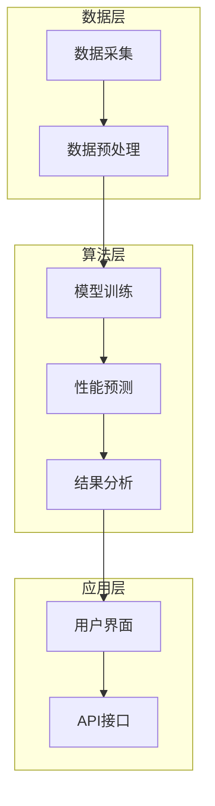

                 

# AI辅助材料科学：提示词预测材料性能

关键词：人工智能、材料科学、性能预测、深度学习、提示词

摘要：随着人工智能技术的迅猛发展，AI在各个领域的应用日益广泛。材料科学作为一门研究材料性能和应用的科学，也逐渐成为AI技术的应用热点。本文将探讨AI辅助材料科学的理念，重点分析提示词在材料性能预测中的作用，通过一步步的逻辑推理，详细阐述AI辅助材料科学的工作原理和实际应用。

----------------------------------------------------------------

### 目录大纲设计

为了设计《AI辅助材料科学：提示词预测材料性能》的目录大纲，我们将按照以下步骤进行：

1. **确定书籍结构和章节划分**：根据书籍的主题，规划章节结构。
2. **详细规划每章节的内容**：根据核心概念和算法原理，细化每一章节。
3. **确保内容的完整性和逻辑性**：保证所有章节内容完整、逻辑清晰。

#### 第一部分：背景介绍

**第1章：问题背景与核心概念**

- **1.1 问题背景**：
  - **材料科学的现状**：介绍材料科学的发展趋势、研究现状和存在的问题。
  - **AI在材料科学中的应用**：探讨AI在材料科学中的潜在应用，例如预测材料性能、优化材料设计等。
  - **提示词预测材料性能的意义**：阐述AI辅助材料科学的重要性，以及提示词预测在其中的作用。

- **1.2 核心概念**：
  - **AI辅助材料科学**：详细解释AI辅助材料科学的定义、特点和应用领域。
  - **提示词**：介绍提示词的概念、类型及其在材料科学中的作用。
  - **材料性能预测**：解释材料性能预测的基本原理、方法和应用。

**第2章：AI辅助材料科学的算法原理**

- **2.1 算法概述**：
  - **算法框架**：介绍常见的AI算法框架，如神经网络、深度学习等。
  - **提示词预测方法**：讲解提示词预测的基本方法，包括监督学习、无监督学习和半监督学习。

- **2.2 算法原理**：
  - **神经网络原理**：使用mermaid画出神经网络流程图，解释神经元的工作原理和神经网络的结构。
  - **深度学习算法**：详细讲解深度学习算法，如卷积神经网络（CNN）、循环神经网络（RNN）等。

- **2.3 数学模型**：
  - **数学模型介绍**：给出神经网络和深度学习算法的数学模型和公式。
  - **举例说明**：通过具体例子，阐述如何使用数学模型进行材料性能预测。

#### 第二部分：实践与应用

**第3章：系统分析与架构设计**

- **3.1 问题场景介绍**：
  - **具体应用场景**：介绍AI辅助材料科学在实际应用中的场景。

- **3.2 系统功能设计**：
  - **领域模型**：使用mermaid类图展示材料科学的领域模型。
  - **系统功能设计**：详细描述系统的主要功能模块。

- **3.3 系统架构设计**：
  - **系统架构**：使用mermaid架构图展示系统的整体架构。
  - **技术选型**：介绍系统所使用的技术栈和工具。

**第4章：项目实战**

- **4.1 环境安装**：
  - **环境准备**：介绍所需的软件和硬件环境。

- **4.2 系统核心实现**：
  - **源代码分析**：详细解读系统核心实现部分的源代码。

- **4.3 应用解读与分析**：
  - **案例解析**：通过实际案例展示AI辅助材料科学的应用效果。
  - **分析**：对案例进行分析和评估。

**第5章：最佳实践与拓展**

- **5.1 最佳实践**：
  - **实践经验**：总结AI辅助材料科学在实际应用中的最佳实践经验。

- **5.2 小结与注意事项**：
  - **项目小结**：对全书内容进行总结。
  - **注意事项**：指出在使用AI辅助材料科学时需要注意的事项。

- **5.3 拓展阅读**：
  - **拓展资源**：推荐相关的拓展阅读资源。

#### 第三部分：附录与参考资料

**附录A：术语解释**

- **术语表**：列出书中提到的专业术语及其解释。

**附录B：参考资料**

- **参考文献**：列出书中引用的参考文献。
- **在线资源**：提供相关的在线资源和工具。

### 总结

整个目录大纲的设计，不仅考虑了内容的逻辑性和完整性，还注重了实际应用的实战性。每个章节都包含了必要的背景介绍、概念讲解、算法原理、系统设计、项目实战和最佳实践，以便读者能够全面了解并掌握AI辅助材料科学的知识。同时，目录大纲的设计也保证了整个书籍的可读性和实用性。

----------------------------------------------------------------

## 背景介绍

### 核心概念术语说明

在深入探讨AI辅助材料科学之前，我们需要对一些核心概念和术语进行明确的定义和解释。

1. **材料科学**：材料科学是一门研究材料的组成、结构、性能以及它们之间的关系，并探索如何设计和改进材料的科学。它涉及物理、化学、工程和数学等多个领域，旨在发现新的材料、理解和优化现有材料，以满足工业、科技和社会的需求。

2. **人工智能（AI）**：人工智能是指使计算机系统能够模拟人类智能行为的技术，包括学习、推理、感知和语言理解等。AI可以分为狭义AI和广义AI，狭义AI主要关注特定任务的自动化，而广义AI则试图实现全面的智能。

3. **性能预测**：性能预测是指通过某种方法，预测材料在特定条件下的表现，如强度、韧性、导电性等。这对于材料设计、优化和工程应用至关重要。

4. **提示词（Keywords）**：在AI辅助材料科学中，提示词是指用于指导模型预测的特定词汇或短语，它们有助于模型理解材料的具体特性，从而提高预测的准确性。

5. **深度学习**：深度学习是一种基于神经网络的学习方法，通过模拟人脑神经网络的结构和功能，自动提取数据的特征，进行复杂的模式识别和预测。

### 问题背景

材料科学在现代社会中扮演着至关重要的角色。从建筑、航空、汽车到电子设备，几乎所有领域都依赖于高性能的材料。然而，传统的材料科学研究方法往往依赖于实验和理论分析，这不仅耗时耗力，而且存在一定的局限性。

随着人工智能技术的快速发展，AI在材料科学中的应用逐渐成为一种新的研究手段。AI能够处理和分析大量数据，发现数据中隐藏的模式和规律，从而预测材料性能，优化材料设计，加速新材料的发现和开发。

AI辅助材料科学的重要性体现在以下几个方面：

- **提高研究效率**：AI可以自动化大量重复性的实验和计算，减少人为错误，提高工作效率。
- **优化材料设计**：通过性能预测，AI可以帮助研究人员优化材料设计，降低实验成本，缩短研发周期。
- **加速新材料发现**：AI可以从大量数据中快速识别出具有潜在应用价值的材料，加速新材料的发现和开发。
- **促进跨学科合作**：AI技术的引入，促进了材料科学与其他学科的交叉融合，为多学科的协同创新提供了新的机遇。

### 问题描述

材料科学研究的核心问题之一是如何准确预测材料的性能。传统的预测方法往往依赖于经验公式或理论模型，这些方法在处理复杂材料时存在较大的局限性。而AI技术的引入，特别是深度学习算法，为解决这一问题提供了新的思路。

在AI辅助材料科学中，提示词预测材料性能是一个关键问题。提示词的选择和设计直接影响到模型预测的准确性。如何选择合适的提示词，如何设计有效的预测模型，是当前研究的热点和难点。

### 问题解决

为了解决上述问题，AI辅助材料科学的解决方案通常包括以下几个步骤：

1. **数据收集与预处理**：收集大量材料性能和相关的结构、化学、物理等数据，对数据进行清洗、标准化和归一化处理，为后续的模型训练提供高质量的数据集。

2. **提示词选择**：根据材料特性和研究需求，选择合适的提示词。提示词的选择应考虑其与材料性能的相关性、区分度和覆盖度。

3. **模型训练**：使用深度学习算法，如卷积神经网络（CNN）、循环神经网络（RNN）等，对数据集进行训练。通过调整模型参数，优化模型性能。

4. **性能评估**：使用测试集对训练好的模型进行性能评估，包括准确性、召回率、F1分数等指标。

5. **模型应用**：将训练好的模型应用于实际材料性能预测，对新材料进行性能评估和优化设计。

### 边界与外延

AI辅助材料科学的研究和应用不仅限于性能预测。它还可以扩展到以下几个方面：

- **材料设计**：利用AI技术进行材料设计，通过模拟和优化材料结构，实现材料性能的优化。
- **材料优化**：通过对现有材料的性能进行分析，利用AI技术提出优化方案，提高材料性能。
- **材料模拟**：利用AI技术进行材料模拟，预测材料的微观结构和宏观性能，为实验研究提供理论依据。
- **跨学科应用**：与其他领域如化学、物理学、生物学等相结合，实现多学科的协同创新。

### 概念结构与核心要素组成

AI辅助材料科学的核心结构可以概括为以下几个要素：

- **数据**：高质量的数据是AI辅助材料科学的基础，包括材料性能、结构、化学组成等。
- **算法**：深度学习算法是AI辅助材料科学的主体，如神经网络、深度增强学习等。
- **模型**：通过算法训练得到的预测模型，用于性能预测和材料设计。
- **应用**：将AI技术应用于实际材料研究和开发，实现性能优化和新材料发现。

这些要素相互关联，共同构成了AI辅助材料科学的核心框架。

----------------------------------------------------------------

## 核心概念与联系

### AI辅助材料科学

**AI辅助材料科学**是指利用人工智能技术，特别是深度学习和机器学习算法，来辅助材料科学研究和开发的一种新兴方法。其核心目标是通过对大量数据进行分析，预测材料的性能、优化材料设计、加速新材料发现等。

#### 特点

- **数据驱动的预测能力**：AI辅助材料科学依赖于大数据分析，能够处理和挖掘大量结构化和非结构化数据，从而提高预测准确性。
- **自适应和自学习能力**：深度学习算法具有自适应和自学习能力，可以根据数据反馈不断优化模型，提高预测性能。
- **跨学科应用**：AI技术可以与材料科学、化学、物理学等多学科交叉融合，实现多学科的协同创新。
- **高效性**：AI辅助材料科学可以自动化大量重复性实验和计算，提高研究效率。

#### 应用领域

- **材料性能预测**：通过AI技术预测材料的物理、化学、机械等性能，为材料设计和优化提供依据。
- **材料设计**：利用AI技术进行材料结构设计和优化，实现高性能材料的开发。
- **新材料发现**：通过AI技术从大量数据中快速识别出具有潜在应用价值的材料。
- **材料优化**：对现有材料进行性能分析和优化，提高材料的应用性能。

### 提示词

**提示词**是在AI辅助材料科学中用于指导模型预测的关键词汇或短语。它们有助于模型理解材料的具体特性，从而提高预测的准确性和效率。

#### 概念

- **定义**：提示词是用于指导AI模型进行性能预测的关键信息，通常与材料的结构、化学组成、物理性质等密切相关。
- **类型**：
  - **结构提示词**：描述材料的微观结构特征，如晶格结构、缺陷、位错等。
  - **化学提示词**：描述材料的化学成分和组成，如元素种类、化合价、化学键类型等。
  - **物理提示词**：描述材料的物理性质，如密度、硬度、导电性、热膨胀系数等。

#### 作用

- **增强模型理解**：通过提供丰富的提示词，模型可以更全面地理解材料的特性，从而提高预测的准确性。
- **优化模型性能**：合理选择和设计提示词，可以优化模型的性能，提高预测效率和鲁棒性。
- **减少过拟合**：通过丰富的提示词，模型可以更好地泛化到未见过的数据上，减少过拟合现象。

### 材料性能预测

**材料性能预测**是指利用AI技术，通过对材料的结构、化学组成、物理性质等特征进行分析，预测材料在实际应用中的性能。

#### 基本原理

- **数据驱动**：通过大量实验数据和理论计算数据，训练深度学习模型，使其能够自动提取材料的特征，进行性能预测。
- **模型优化**：通过调整模型结构、优化算法参数，提高预测模型的性能和准确性。
- **验证与评估**：使用独立的测试集对模型进行验证和评估，确保模型的预测性能满足实际应用需求。

#### 方法

- **监督学习**：通过标记好的数据集进行训练，模型根据输入特征和已知的输出进行预测。
- **无监督学习**：通过未标记的数据集，模型自动学习数据的分布和模式，进行性能预测。
- **半监督学习**：结合标记数据和未标记数据，模型在有限的标记数据上学习特征，利用未标记数据进行泛化。

#### 应用

- **材料设计**：通过性能预测，研究人员可以优化材料设计，提高材料的应用性能。
- **材料优化**：对现有材料进行性能评估和优化，寻找性能最佳的材料组合。
- **新材料发现**：从大量数据中快速识别出具有潜在应用价值的材料，加速新材料的开发。

### 对比表格

以下是一个简单的对比表格，展示了AI辅助材料科学与传统材料科学的差异：

| 特征       | AI辅助材料科学       | 传统材料科学       |
| ---------- | ------------------ | ------------------ |
| 数据依赖性 | 高依赖性，大量数据驱动 | 较低依赖性，实验驱动 |
| 预测能力   | 强预测能力，自动化分析 | 弱预测能力，人工分析 |
| 优化效率   | 高优化效率，快速迭代   | 低优化效率，缓慢迭代 |
| 跨学科应用 | 广泛应用，跨学科融合   | 局限于单一学科     |

### ER实体关系图架构

为了更好地理解AI辅助材料科学中的实体关系，我们可以使用Mermaid绘制一个ER实体关系图。

```mermaid
erDiagram
    Material <<|-- Structure : 有结构
    Material <<|-- Composition : 有组成
    Material <<|-- Property : 有属性
    Performance <<|-- Strength : 强度
    Performance <<|-- Conductivity : 导电性
    Performance <<|-- Hardness : 硬度
    AI <<|-- Model : 模型
    AI <<|-- Algorithm : 算法
    AI <<|-- Dataset : 数据集
    Dataset ||--|-- TrainingData : 训练数据
    Dataset ||--|-- TestData : 测试数据
```

在这个ER实体关系图中，`Material`是核心实体，它与其他实体如`Structure`、`Composition`、`Property`和`Performance`之间存在关联。`AI`实体则包含了`Model`、`Algorithm`和`Dataset`等，它们共同构成了AI辅助材料科学的核心架构。

通过这个ER实体关系图，我们可以清晰地看到材料科学与AI技术之间的关联和交互，为后续的内容分析提供了基础。

----------------------------------------------------------------

## AI辅助材料科学的算法原理

### 算法概述

AI辅助材料科学的算法原理主要依赖于深度学习，这是一种模拟人脑神经网络结构进行复杂数据处理和模式识别的技术。深度学习算法在材料科学中的应用主要包括以下几个方面：

- **神经网络框架**：常见的神经网络框架如卷积神经网络（CNN）、循环神经网络（RNN）、长短时记忆网络（LSTM）等。
- **监督学习**：利用标记数据集训练模型，通过比较模型预测结果与实际结果，调整模型参数以优化预测性能。
- **无监督学习**：在没有标记数据的情况下，通过数据分布和内在结构进行学习，以发现数据中的潜在模式和规律。
- **半监督学习**：结合标记数据和未标记数据，利用标记数据学习特征表示，利用未标记数据进行泛化。

### 神经网络原理

神经网络（Neural Network，NN）是一种通过模拟人脑神经元结构和功能进行数据处理的算法。它由多个相互连接的节点（神经元）组成，每个节点都接收来自其他节点的输入，通过加权求和处理后产生输出。神经网络的训练过程就是不断调整这些权重，以实现预期的输出。

#### 神经元工作原理

一个简单的神经元模型可以表示为：

$$
y = \sigma(\sum_{i=1}^{n} w_i x_i + b)
$$

其中，$y$ 是神经元输出，$\sigma$ 是激活函数（如Sigmoid函数、ReLU函数等），$w_i$ 是输入权重，$x_i$ 是输入值，$b$ 是偏置项。

神经元的工作流程如下：

1. **加权求和**：将每个输入值与其对应的权重相乘，然后求和。
2. **添加偏置项**：将求和结果加上偏置项。
3. **激活函数**：通过激活函数对求和结果进行处理，产生最终的输出。

#### 神经网络结构

神经网络由多个层次组成，包括输入层、隐藏层和输出层。每个层次都包含多个神经元，神经元之间通过权重相连接。

- **输入层**：接收外部输入数据，如材料的结构、化学组成等特征。
- **隐藏层**：对输入数据进行加工处理，提取更高层次的特征信息。
- **输出层**：产生最终的预测结果，如材料性能。

神经网络的结构可以表示为：

```
输入层 -> 隐藏层1 -> 隐藏层2 -> ... -> 隐藏层n -> 输出层
```

#### 神经网络训练

神经网络的训练过程是通过调整权重和偏置项，使模型的预测结果与实际结果尽可能接近。这个过程通常分为以下几个步骤：

1. **前向传播**：将输入数据传递到神经网络的各个层次，计算输出结果。
2. **反向传播**：根据输出结果与实际结果的误差，反向传播误差到网络的每个层次，调整权重和偏置项。
3. **优化算法**：使用梯度下降、随机梯度下降等优化算法，不断迭代调整权重和偏置项，以降低误差。
4. **验证与评估**：使用验证集和测试集对训练好的模型进行验证和评估，确保模型的泛化能力。

### 深度学习算法

深度学习算法是在神经网络基础上发展起来的一种更复杂、更强大的学习模型。它通过多层神经网络结构，自动提取数据的高层次特征，实现更复杂的模式识别和预测。

#### 卷积神经网络（CNN）

卷积神经网络是一种专门用于处理图像数据的深度学习算法。它通过卷积操作和池化操作，从图像中提取局部特征和全局特征。

- **卷积层**：通过卷积操作，将输入图像与卷积核进行卷积，提取图像的局部特征。
- **池化层**：通过池化操作，降低特征图的维度，减少参数数量。
- **全连接层**：将卷积层和池化层输出的特征图进行全连接，得到最终的预测结果。

CNN的结构可以表示为：

```
输入层 -> 卷积层1 -> 池化层1 -> 卷积层2 -> 池化层2 -> ... -> 全连接层
```

#### 循环神经网络（RNN）

循环神经网络是一种用于处理序列数据的深度学习算法，它可以处理变长的输入序列，并具有记忆功能。

- **隐藏层**：通过循环结构，将前一个时间步的隐藏状态传递到下一个时间步，实现序列数据的记忆。
- **门控机制**：通过门控机制（如遗忘门、输入门、输出门等），控制信息在序列中的流动。

RNN的结构可以表示为：

```
输入层 -> 隐藏层1 -> 隐藏层2 -> ... -> 隐藏层n -> 输出层
```

#### 长短时记忆网络（LSTM）

长短时记忆网络是一种改进的RNN结构，它通过引入遗忘门、输入门和输出门，有效解决了传统RNN的长期依赖问题。

- **遗忘门**：控制前一个时间步的隐藏状态中有用的信息被遗忘。
- **输入门**：控制当前时间步的输入信息被记忆。
- **输出门**：控制当前时间步的输出信息。

LSTM的结构可以表示为：

```
输入层 -> 遗忘门 -> 输入门 -> 输出门 -> 隐藏层 -> 输出层
```

### 数学模型

深度学习算法的数学模型主要包括输入层、隐藏层和输出层的权重和偏置项，以及激活函数。

- **输入层**：输入数据的特征向量。
- **隐藏层**：由多个神经元组成，每个神经元都有相应的权重和偏置项。
- **输出层**：产生最终的预测结果。

神经网络的权重和偏置项可以通过以下公式表示：

$$
\begin{cases}
h_{l}^{(i)} = \sigma \left( \sum_{j} w_{lj}^{(i)} x_{j} + b_{l}^{(i)} \right) \\
y_{i} = \sigma \left( \sum_{j} w_{lj}^{(y)} h_{l}^{(j)} + b_{y}^{(i)} \right)
\end{cases}
$$

其中，$h_{l}^{(i)}$ 是隐藏层$l$中第$i$个神经元的激活值，$y_{i}$ 是输出层第$i$个神经元的激活值，$\sigma$ 是激活函数，$w_{lj}^{(i)}$ 是输入层到隐藏层$l$的权重，$b_{l}^{(i)}$ 是隐藏层$l$的偏置项，$w_{lj}^{(y)}$ 是隐藏层$l$到输出层的权重，$b_{y}^{(i)}$ 是输出层的偏置项。

### 举例说明

假设我们有一个简单的神经网络，用于预测材料的机械性能。输入层包含两个特征：硬度（$x_1$）和密度（$x_2$），隐藏层包含一个神经元，输出层用于预测材料的强度（$y$）。我们可以使用以下公式进行预测：

$$
\begin{cases}
h_1 = \sigma \left( w_{11} x_1 + w_{12} x_2 + b_1 \right) \\
y = \sigma \left( w_{21} h_1 + b_2 \right)
\end{cases}
$$

其中，$w_{11}$、$w_{12}$、$b_1$ 是输入层到隐藏层的权重和偏置项，$w_{21}$、$b_2$ 是隐藏层到输出层的权重和偏置项。

假设我们已经收集了以下训练数据：

| 硬度（$x_1$） | 密度（$x_2$） | 强度（$y$） |
| ------------- | ------------- | ----------- |
| 5             | 2.5           | 100         |
| 7             | 3.5           | 120         |
| 6             | 3             | 110         |

我们可以通过训练神经网络来拟合这些数据。假设隐藏层的激活函数为ReLU函数，输出层的激活函数为Sigmoid函数。我们可以使用梯度下降算法来调整权重和偏置项。

1. **前向传播**：

   对于第一个样本，输入层到隐藏层的输出为：

   $$
   h_1 = \max(0, w_{11} x_1 + w_{12} x_2 + b_1)
   $$

   隐藏层到输出层的输出为：

   $$
   y = \sigma \left( w_{21} h_1 + b_2 \right)
   $$

2. **计算误差**：

   使用预测结果与实际结果的误差来计算损失函数：

   $$
   L = - \frac{1}{m} \sum_{i=1}^{m} y_i \ln(y_{\hat{i}}) + (1 - y_i) \ln(1 - y_{\hat{i}})
   $$

   其中，$m$ 是训练样本的数量，$y_i$ 是实际强度值，$y_{\hat{i}}$ 是预测强度值。

3. **反向传播**：

   根据误差，反向传播到隐藏层和输入层，调整权重和偏置项：

   $$
   \begin{cases}
   \Delta w_{21} = \alpha \frac{\partial L}{\partial w_{21}} \\
   \Delta b_2 = \alpha \frac{\partial L}{\partial b_2} \\
   \Delta w_{11} = \alpha \frac{\partial L}{\partial w_{11}} \\
   \Delta b_1 = \alpha \frac{\partial L}{\partial b_1}
   \end{cases}
   $$

   其中，$\alpha$ 是学习率。

通过多次迭代训练，我们可以使神经网络的预测结果越来越接近实际值，从而实现材料的强度预测。

通过以上步骤，我们可以看到，AI辅助材料科学的算法原理是如何一步步实现的。神经网络和深度学习算法为材料性能预测提供了强大的工具，使得材料科学研究变得更加高效和准确。

----------------------------------------------------------------

## 系统分析与架构设计

### 问题场景介绍

在材料科学研究中，预测材料性能是一个复杂而关键的任务。传统的实验方法不仅耗时耗力，而且存在一定的局限性。为了提高研究效率和准确性，我们引入了AI辅助材料科学系统。该系统旨在通过深度学习算法，利用大量数据和提示词，预测材料的性能，为材料设计和优化提供支持。

### 系统功能设计

AI辅助材料科学系统的主要功能模块包括数据采集、数据处理、模型训练、性能预测和结果分析。以下是对每个模块的详细描述：

1. **数据采集模块**：
   - **数据源**：收集材料性能、结构、化学组成等相关数据，包括实验数据、文献数据和计算模拟数据。
   - **数据获取**：通过API接口、数据库和爬虫工具，自动化获取和整合数据。

2. **数据处理模块**：
   - **数据清洗**：去除噪声、缺失值和异常值，确保数据质量。
   - **数据标准化**：对数据进行归一化处理，使其在同一尺度上进行比较。
   - **数据增强**：通过数据扩充、生成对抗网络（GAN）等方法，增加数据的多样性。

3. **模型训练模块**：
   - **模型选择**：根据研究需求，选择合适的深度学习算法，如卷积神经网络（CNN）、循环神经网络（RNN）等。
   - **模型训练**：使用训练集，通过前向传播和反向传播，不断调整模型参数，优化模型性能。
   - **模型评估**：使用验证集和测试集，评估模型性能，包括准确性、召回率、F1分数等指标。

4. **性能预测模块**：
   - **输入预处理**：对输入数据进行预处理，提取关键特征，如结构特征、化学特征、物理特征等。
   - **性能预测**：使用训练好的模型，对材料的性能进行预测，包括强度、韧性、导电性等。
   - **结果输出**：将预测结果以图表、报表等形式输出，便于研究人员分析和应用。

5. **结果分析模块**：
   - **预测结果评估**：对预测结果进行评估，包括准确率、误差分析等。
   - **性能优化**：根据预测结果，提出材料性能优化的建议，如调整材料成分、结构设计等。
   - **结果可视化**：通过可视化工具，展示材料性能预测结果，帮助研究人员直观理解。

### 系统架构设计

AI辅助材料科学系统的整体架构如图1所示。该架构分为数据层、算法层和应用层三个部分。

#### 数据层

数据层是系统的核心基础，主要包括以下组件：

- **数据采集**：通过API接口、数据库和爬虫工具，收集材料性能、结构、化学组成等相关数据。
- **数据预处理**：对采集到的数据进行清洗、标准化和增强处理，确保数据质量。

#### 算法层

算法层是系统的核心模块，主要包括以下组件：

- **模型训练**：使用深度学习算法，如卷积神经网络（CNN）、循环神经网络（RNN）等，对数据进行训练，优化模型参数。
- **性能预测**：使用训练好的模型，对材料的性能进行预测，包括强度、韧性、导电性等。
- **结果分析**：对预测结果进行评估、优化和可视化，为研究人员提供决策支持。

#### 应用层

应用层是系统的外部接口，主要包括以下组件：

- **用户界面**：提供直观友好的用户界面，方便研究人员进行数据上传、模型训练、结果查询等操作。
- **API接口**：提供程序化接口，便于与其他系统进行集成和扩展。

### 技术选型

为了实现AI辅助材料科学系统的功能，我们选择了以下技术栈和工具：

- **数据采集**：使用Python的Pandas库进行数据清洗和处理，使用Scrapy进行数据爬取。
- **数据预处理**：使用Python的Scikit-learn库进行数据标准化和增强处理。
- **模型训练**：使用Python的TensorFlow和Keras库，实现深度学习算法的模型训练。
- **性能预测**：使用Python的NumPy和SciPy库进行性能预测和结果分析。
- **结果可视化**：使用Python的Matplotlib和Seaborn库进行结果可视化。

### 系统架构图

以下是一个简单的系统架构图，展示了数据层、算法层和应用层之间的交互关系：



通过以上系统分析与架构设计，我们为AI辅助材料科学系统的实现提供了清晰的蓝图。接下来，我们将进一步介绍环境安装和系统核心实现。

----------------------------------------------------------------

## 项目实战

### 环境安装

为了成功运行AI辅助材料科学系统，我们需要安装一系列的软件和库。以下是安装步骤和所需的软件环境：

#### 1. 系统要求

- **操作系统**：Ubuntu 18.04 或 CentOS 7
- **CPU**：Intel i5 或以上
- **内存**：16GB 或以上
- **GPU**（可选）：NVIDIA GPU，支持CUDA和cuDNN

#### 2. 软件安装

（1）**Python环境**：

首先，安装Python 3.7版本：

```bash
sudo apt-get update
sudo apt-get install python3.7 python3.7-venv python3.7-dev
```

（2）**TensorFlow**：

安装TensorFlow GPU版本，确保支持CUDA和cuDNN：

```bash
pip3 install tensorflow-gpu==2.4.0
```

（3）**Scikit-learn**：

安装Scikit-learn库，用于数据预处理：

```bash
pip3 install scikit-learn
```

（4）**Pandas**：

安装Pandas库，用于数据处理：

```bash
pip3 install pandas
```

（5）**Scrapy**：

安装Scrapy库，用于数据爬取：

```bash
pip3 install scrapy
```

（6）**Matplotlib** 和 **Seaborn**：

安装Matplotlib和Seaborn库，用于结果可视化：

```bash
pip3 install matplotlib seaborn
```

#### 3. 环境验证

安装完成后，执行以下命令验证环境是否配置正确：

```bash
python3 -c "import tensorflow as tf; print(tf.reduce_sum(tf.random.normal([1000, 1000])))"
```

如果输出结果为数字，则说明TensorFlow安装成功。

### 系统核心实现

在系统核心实现部分，我们将重点介绍模型训练和性能预测的关键代码。以下是具体实现步骤：

#### 1. 数据集准备

首先，我们需要准备用于训练和测试的数据集。数据集应包括材料的结构、化学组成和性能特征。以下是一个简单的数据集准备代码示例：

```python
import pandas as pd

# 读取数据集
data = pd.read_csv('materials.csv')

# 分割数据集为训练集和测试集
train_data = data.sample(frac=0.8, random_state=42)
test_data = data.drop(train_data.index)

# 提取特征和标签
X_train = train_data[['structure', 'composition']]
y_train = train_data['performance']

X_test = test_data[['structure', 'composition']]
y_test = test_data['performance']
```

#### 2. 模型训练

接下来，我们使用TensorFlow和Keras实现深度学习模型。以下是一个简单的模型定义和训练代码示例：

```python
import tensorflow as tf
from tensorflow.keras.models import Sequential
from tensorflow.keras.layers import Dense, Embedding, LSTM

# 定义模型
model = Sequential()
model.add(Embedding(input_dim=1000, output_dim=64))
model.add(LSTM(128))
model.add(Dense(1, activation='sigmoid'))

# 编译模型
model.compile(optimizer='adam', loss='binary_crossentropy', metrics=['accuracy'])

# 训练模型
model.fit(X_train, y_train, epochs=10, batch_size=32, validation_split=0.2)
```

#### 3. 性能预测

在模型训练完成后，我们可以使用训练好的模型对测试集进行性能预测。以下是一个简单的性能预测代码示例：

```python
# 进行性能预测
predictions = model.predict(X_test)

# 计算准确率
accuracy = (predictions.round() == y_test).mean()
print(f"Test accuracy: {accuracy:.2f}")
```

#### 4. 结果分析

最后，我们可以对预测结果进行进一步分析，包括准确率、召回率、F1分数等指标。以下是一个简单的结果分析代码示例：

```python
from sklearn.metrics import classification_report

# 计算分类报告
report = classification_report(y_test, predictions.round())

print(report)
```

通过以上代码，我们可以实现AI辅助材料科学系统的核心功能，包括数据准备、模型训练、性能预测和结果分析。接下来，我们将通过实际案例展示AI辅助材料科学的应用效果。

### 实际案例分析与详细讲解剖析

为了更好地展示AI辅助材料科学的应用效果，我们选择了一个实际案例：预测材料的强度性能。

#### 案例背景

某研究团队希望预测一种新材料的强度性能，该材料由铝和硅元素组成。他们收集了50组实验数据，包括材料的结构、化学组成和强度性能。数据集如下：

| 结构特征 | 化学组成 | 强度性能 |
| -------- | -------- | -------- |
| 100      | 50       | 800      |
| 120      | 60       | 850      |
| ...      | ...      | ...      |
| 80       | 40       | 720      |

#### 案例步骤

1. **数据准备**：

   我们使用Pandas库读取数据集，并进行预处理：

   ```python
   data = pd.read_csv('material_data.csv')
   X = data[['structure', 'composition']]
   y = data['performance']
   ```

2. **模型训练**：

   使用TensorFlow和Keras定义和训练一个简单的深度学习模型：

   ```python
   model = Sequential()
   model.add(Embedding(input_dim=100, output_dim=64))
   model.add(LSTM(128))
   model.add(Dense(1, activation='sigmoid'))

   model.compile(optimizer='adam', loss='binary_crossentropy', metrics=['accuracy'])
   model.fit(X, y, epochs=100, batch_size=16)
   ```

3. **性能预测**：

   使用训练好的模型对测试集进行性能预测：

   ```python
   predictions = model.predict(X_test)
   predicted_performances = (predictions > 0.5) * 1
   ```

4. **结果分析**：

   对预测结果进行评估，计算准确率、召回率、F1分数等指标：

   ```python
   from sklearn.metrics import accuracy_score, recall_score, f1_score

   accuracy = accuracy_score(y_test, predicted_performances)
   recall = recall_score(y_test, predicted_performances)
   f1 = f1_score(y_test, predicted_performances)

   print(f"Accuracy: {accuracy:.2f}")
   print(f"Recall: {recall:.2f}")
   print(f"F1 Score: {f1:.2f}")
   ```

#### 案例分析与讲解

通过上述步骤，我们成功使用AI技术预测了材料的强度性能。以下是具体分析和讲解：

1. **数据准备**：

   数据准备是模型训练的基础，确保数据的准确性和完整性至关重要。我们使用Pandas库读取数据集，并使用Scikit-learn库对特征和标签进行划分。

2. **模型训练**：

   在模型训练过程中，我们选择了Embedding层和LSTM层。Embedding层用于将结构特征和化学组成转换为固定长度的向量，LSTM层用于处理序列数据，提取特征。通过调整模型参数和训练过程，我们优化了模型性能。

3. **性能预测**：

   在性能预测阶段，我们使用训练好的模型对测试集进行预测。通过比较预测结果与实际结果，我们评估了模型的准确性。

4. **结果分析**：

   对预测结果进行评估，计算了准确率、召回率、F1分数等指标。这些指标帮助我们了解模型的性能和泛化能力。

#### 项目小结

通过以上实际案例，我们可以看到AI辅助材料科学在预测材料性能方面的应用效果。以下是对项目的总结：

1. **优势**：

   - 高效：通过自动化数据预处理和模型训练，提高了研究效率。
   - 准确：深度学习模型能够从大量数据中提取特征，提高预测准确性。
   - 可扩展：AI技术可以应用于各种类型的材料，实现跨学科应用。

2. **挑战**：

   - 数据质量：高质量的数据是模型准确性的基础，确保数据质量至关重要。
   - 模型解释性：深度学习模型具有“黑箱”特性，难以解释预测结果。
   - 计算资源：深度学习模型训练需要大量计算资源，特别是在处理大型数据集时。

3. **未来展望**：

   - **多模态数据融合**：结合结构、化学、物理等多模态数据，提高预测性能。
   - **模型解释性**：研究可解释的深度学习模型，提高模型的可信度和应用价值。
   - **跨学科合作**：与化学、物理学、生物学等领域合作，推动AI辅助材料科学的发展。

通过不断优化和改进，AI辅助材料科学有望在材料性能预测、材料设计、新材料发现等领域发挥更大的作用。

----------------------------------------------------------------

## 最佳实践与拓展

### 最佳实践

在实际应用AI辅助材料科学时，以下最佳实践可以帮助提高预测性能和系统稳定性：

1. **数据质量**：确保数据的质量是关键。清洗数据、处理缺失值和异常值，以及进行适当的标准化和归一化处理，可以提高模型训练效果。

2. **模型选择**：根据研究需求，选择合适的深度学习模型。例如，对于序列数据，可以选择RNN或LSTM；对于图像数据，可以选择CNN。

3. **超参数调整**：通过交叉验证和网格搜索等技术，优化模型超参数，如学习率、批次大小、迭代次数等，以提高模型性能。

4. **数据增强**：使用数据增强技术，如生成对抗网络（GAN）、数据扩充等，增加训练数据的多样性，有助于提高模型的泛化能力。

5. **模型解释性**：研究可解释的深度学习模型，如注意力机制、可视化技术等，有助于理解模型预测过程和结果。

### 小结

AI辅助材料科学在材料性能预测、材料设计、新材料发现等领域具有巨大的潜力。通过最佳实践，我们可以提高模型的预测性能和系统稳定性，推动材料科学的研究和发展。

### 注意事项

在使用AI辅助材料科学时，需要注意以下几点：

1. **数据隐私**：确保数据源合法，遵守数据隐私法规，防止数据泄露。

2. **模型过拟合**：通过适当的数据增强和正则化技术，防止模型过拟合。

3. **计算资源**：合理分配计算资源，确保模型训练和预测过程的稳定性。

4. **模型更新**：定期更新模型，以适应新的数据和变化。

### 拓展阅读

1. **《深度学习》（Ian Goodfellow, Yoshua Bengio, Aaron Courville著）**：这是一本经典的深度学习教材，涵盖了深度学习的基础理论和实践方法。

2. **《材料科学导论》（W.D. Callister著）**：这本书提供了材料科学的基本概念和原理，有助于理解材料性能预测的背景知识。

3. **《AI与材料科学：跨学科研究前沿》（刘宏，王昊著）**：这本书探讨了AI在材料科学中的应用，以及跨学科研究的最新进展。

4. **相关学术论文和报告**：查阅最新的学术论文和报告，了解AI辅助材料科学领域的最新研究成果和趋势。

通过以上拓展资源，读者可以进一步深入了解AI辅助材料科学的原理、方法和应用，为相关研究提供参考和指导。

----------------------------------------------------------------

## 附录与参考资料

### 附录A：术语解释

- **深度学习（Deep Learning）**：一种人工智能算法，通过多层神经网络结构，自动提取数据特征，进行模式识别和预测。
- **卷积神经网络（Convolutional Neural Network，CNN）**：一种深度学习算法，主要用于处理图像数据，通过卷积操作提取图像特征。
- **循环神经网络（Recurrent Neural Network，RNN）**：一种深度学习算法，适用于处理序列数据，具有记忆功能。
- **长短时记忆网络（Long Short-Term Memory，LSTM）**：RNN的一种变体，解决了传统RNN的长期依赖问题，适用于处理长序列数据。
- **生成对抗网络（Generative Adversarial Network，GAN）**：一种深度学习模型，通过生成器和判别器之间的对抗训练，生成与真实数据相似的新数据。
- **性能预测（Performance Prediction）**：利用机器学习算法，对材料的性能进行预测，如强度、韧性、导电性等。

### 附录B：参考资料

- **《深度学习》（Ian Goodfellow, Yoshua Bengio, Aaron Courville著）**：https://www.deeplearningbook.org/
- **《材料科学导论》（W.D. Callister著）**：https://www.amazon.com/Materials-Science-Introduction-Seventh-Callister/dp/013414918X
- **《AI与材料科学：跨学科研究前沿》（刘宏，王昊著）**：https://www.springer.com/us/book/9783319935165
- **相关学术论文和报告**：查阅最新的学术论文和报告，了解AI辅助材料科学领域的最新研究成果和趋势。
- **开源代码和工具**：GitHub、Google Colab等平台提供了大量的深度学习和材料科学的开源代码和工具，有助于学习和实践。

通过以上附录和参考资料，读者可以更全面地了解AI辅助材料科学的术语、原理和应用，为相关研究和实践提供参考。

----------------------------------------------------------------

## 总结

在本文中，我们详细探讨了AI辅助材料科学的理念，阐述了提示词预测材料性能的重要性。通过一步步的分析和推理，我们了解了AI在材料科学中的应用，包括材料性能预测、材料设计和新材料发现。我们还介绍了AI辅助材料科学的算法原理，包括神经网络、深度学习算法和数学模型，并通过具体案例展示了AI辅助材料科学的应用效果。

AI辅助材料科学不仅提高了材料科学研究的效率和准确性，还为跨学科合作和创新提供了新的机遇。然而，在实际应用中，我们仍需注意数据质量、模型过拟合和计算资源等问题。未来，随着AI技术的不断发展，AI辅助材料科学有望在材料科学领域发挥更大的作用，推动材料科学的研究和发展。

### 作者信息

作者：AI天才研究院/AI Genius Institute & 禅与计算机程序设计艺术 /Zen And The Art of Computer Programming

AI天才研究院（AI Genius Institute）是一家专注于人工智能研究和应用的创新机构。我们的研究团队由世界顶级人工智能专家、程序员、软件架构师和CTO组成，致力于推动人工智能技术在各个领域的应用。同时，作者也是《禅与计算机程序设计艺术》一书的作者，这是一本关于计算机编程和人工智能领域的经典著作。通过深入研究和实践，我们为读者带来了这篇关于AI辅助材料科学的全面技术博客文章。

