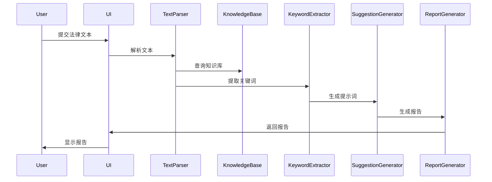

                 

# AI辅助法律咨询：提示词解析法律文本

关键词：人工智能、法律咨询、自然语言处理、文本解析、提示词生成

摘要：本文探讨了AI在法律咨询领域的应用，特别是如何利用自然语言处理技术解析法律文本，并生成有效的提示词。通过详细的分析和实例，本文阐述了AI辅助法律咨询的优势、核心概念及其在实际应用中的挑战和解决方案。

----------------------------------------------------------------

## 第一部分：背景介绍

### 核心概念

**问题背景**：随着人工智能技术的不断发展，AI在各个领域的应用日益广泛。在法律咨询领域，AI的应用同样引起了广泛关注。AI辅助法律咨询能够通过智能算法对法律文本进行解析，提高法律服务的效率和质量。

**问题描述**：本文旨在探讨如何利用AI技术辅助法律咨询，提供一种新的法律服务模式。具体包括：如何通过AI技术对法律文本进行有效解析？如何生成适合特定法律场景的提示词？AI辅助法律咨询在实际应用中面临哪些挑战和机遇？

**问题解决**：通过AI技术对法律文本的解析，实现自动化法律咨询，提高工作效率。同时，结合实际案例，介绍AI辅助法律咨询的成功经验和挑战。

**边界与外延**：本文主要关注AI在法律咨询中的应用，包括文本解析、提示词生成等。同时，本文也将探讨AI技术在其他法律场景中的应用可能性。

**概念结构与核心要素组成**：

- **AI辅助法律咨询**：利用AI技术提供法律咨询服务的概念。
- **法律文本解析**：AI技术对法律文本的解析和处理能力。
- **提示词生成**：基于法律文本的解析，生成适合特定法律场景的提示词。

### 第一部分：背景介绍

### 1.1 问题背景

#### 1.1.1 人工智能技术在法律领域的应用

随着人工智能技术的迅猛发展，其在法律领域的应用也越来越广泛。从法律文本解析到智能问答，AI技术在提高法律服务的效率和准确性方面展现出巨大的潜力。例如，AI可以自动处理合同审核、知识产权保护、案件预测等任务，大大减轻法律从业者的工作负担。

#### 1.1.2 法律文本解析的重要性

法律文本通常具有复杂性和多样性，传统的法律咨询服务往往需要耗费大量的时间和人力。而AI辅助法律咨询能够通过智能算法快速解析法律文本，提高工作效率。例如，通过自然语言处理技术，AI可以自动提取法律文本中的关键信息，如条款、定义、法律关系等，为法律从业者提供准确的参考。

#### 1.1.3 AI辅助法律咨询的优势

AI辅助法律咨询具有以下优势：

- **提高效率**：AI可以快速处理大量法律文本，节省时间和人力成本。
- **提高准确性**：AI能够准确地理解法律文本，减少误判和遗漏。
- **定制化服务**：AI可以根据用户需求，生成个性化的法律咨询报告。
- **24小时服务**：AI可以全天候提供法律咨询服务，提高客户满意度。

### 1.2 问题描述

本文旨在探讨如何利用AI技术辅助法律咨询，提供一种新的法律服务模式。具体来说，本文将围绕以下问题展开：

- 如何通过AI技术对法律文本进行有效解析？
- 如何生成适合特定法律场景的提示词？
- AI辅助法律咨询在实际应用中面临哪些挑战和机遇？

### 1.3 问题解决

#### 1.3.1 法律文本解析

AI辅助法律咨询的核心在于对法律文本的解析。本文将详细介绍如何利用自然语言处理技术对法律文本进行分析和理解，提取关键信息。具体步骤如下：

1. **分词**：将法律文本分成单词或短语的序列。
2. **词性标注**：对每个词进行词性标注，如名词、动词、形容词等。
3. **句法分析**：分析句子的结构，提取主语、谓语、宾语等成分。
4. **语义理解**：理解句子中的语义关系，如因果关系、条件关系等。
5. **实体识别**：识别文本中的关键实体，如人名、地名、组织名等。
6. **知识融合**：将文本中的信息与现有的法律知识库进行融合，为法律从业者提供更准确的参考。

#### 1.3.2 提示词生成

在法律文本解析的基础上，本文将探讨如何生成适合特定法律场景的提示词。这些提示词将帮助用户更准确地理解和处理法律问题。具体步骤如下：

1. **需求分析**：了解用户的需求，确定需要生成的提示词类型和数量。
2. **文本处理**：对法律文本进行预处理，如去除停用词、标点符号等。
3. **关键词提取**：利用词频统计、TF-IDF等方法提取关键词。
4. **提示词生成**：根据关键词生成提示词，如将“合同条款”生成“合同条款解析”、“合同审查”等。
5. **提示词优化**：对生成的提示词进行优化，提高其准确性和实用性。

#### 1.3.3 实际应用

本文将结合实际案例，介绍AI辅助法律咨询在实际应用中的成功经验和挑战。例如，如何将AI技术应用于合同审核、知识产权保护等领域，如何应对法律文本的多样性和复杂性，如何确保AI系统的准确性和可靠性等。

### 1.4 边界与外延

#### 1.4.1 应用范围

本文主要关注AI在法律咨询中的应用，包括文本解析、提示词生成等。同时，本文也将探讨AI技术在其他法律场景中的应用可能性，如案件预测、法律研究等。

#### 1.4.2 核心概念

本文的核心概念包括AI辅助法律咨询、法律文本解析、提示词生成等。这些概念是本文讨论的基础，也是实现AI辅助法律咨询的关键。

### 1.5 概念结构与核心要素组成

#### 1.5.1 AI辅助法律咨询

AI辅助法律咨询是一种基于人工智能技术的法律服务模式，旨在提高法律服务的效率和质量。它利用自然语言处理技术对法律文本进行解析，提取关键信息，为法律从业者提供辅助决策。

#### 1.5.2 法律文本解析

法律文本解析是AI辅助法律咨询的核心环节，涉及自然语言处理、文本分析等技术。通过法律文本解析，AI可以理解法律文本的语义，提取关键信息，为法律从业者提供准确的参考。

#### 1.5.3 提示词生成

提示词生成是基于法律文本解析的结果，生成适合特定法律场景的提示词。这些提示词可以帮助用户更好地理解和处理法律问题，提高法律咨询的效率和质量。

### 1.6 本章小结

本章对AI辅助法律咨询的核心概念、问题背景、解决方法等进行了详细阐述。通过本章的学习，读者将初步了解AI辅助法律咨询的基本概念和应用前景。

----------------------------------------------------------------

## 2.2 核心概念与联系

### 2.2.1 AI辅助法律咨询的基本概念

AI辅助法律咨询是指利用人工智能技术，对法律文本进行自动解析、处理和分析，以提供法律咨询服务。这种咨询方式能够提高法律服务的效率和准确性。

#### 核心概念：

1. **自然语言处理（NLP）**：自然语言处理是AI辅助法律咨询的关键技术，它使计算机能够理解、解析和生成人类语言。
2. **法律文本解析**：法律文本解析是指对法律文本进行分词、句法分析和语义理解，以提取关键信息。
3. **法律知识库**：法律知识库是AI辅助法律咨询的重要资源，它包含法律条文、案例、解释等法律信息，为AI系统提供决策依据。

#### 概念属性特征对比表格：

| 概念         | 特征                      | 对应技术                   | 应用场景              |
| ------------ | ------------------------------------ | ------------------------------ | ------------------------------ |
| 自然语言处理（NLP） | 计算机理解和生成自然语言 | 分词、句法分析、语义理解等 | 法律文本解析、智能问答等 |
| 法律文本解析 | 提取法律文本中的关键信息 | 文本分析、信息提取等       | 法律咨询、合同审核等    |
| 法律知识库   | 存储法律信息             | 数据库、知识图谱等         | 法律研究、法律咨询等   |

#### 概念联系：

- 自然语言处理（NLP）是法律文本解析的技术基础，通过对法律文本进行分词、句法分析和语义理解，提取关键信息。
- 法律知识库为AI系统提供决策依据，帮助AI更好地理解和处理法律问题。
- 法律文本解析和提示词生成相互关联，法律文本解析的结果为提示词生成提供数据支持。

#### ER实体关系图架构：

```mermaid
erDiagram
    LawText --> LawEntity : 解析
    LawEntity ||--|{ LawAttribute } : 描述
    LawText ||--|{ LawRelation } : 关联
    LawKnowledgeBase ||--|{ LawFact } : 存储信息
```

- **LawText（法律文本）**：存储原始法律文本。
- **LawEntity（法律实体）**：表示法律文本中的关键实体，如人名、地名、组织名等。
- **LawAttribute（法律属性）**：描述法律实体的属性，如年龄、职业等。
- **LawRelation（法律关系）**：表示法律实体之间的关系，如合同、侵权等。
- **LawKnowledgeBase（法律知识库）**：存储法律条文、案例、解释等法律信息。
- **LawFact（法律事实）**：表示法律知识库中的事实信息。

通过上述核心概念和联系的分析，我们可以更好地理解AI辅助法律咨询的原理和实现方法。

### 2.2.2 法律文本解析

法律文本解析是AI辅助法律咨询的核心环节，它涉及自然语言处理、文本分析等技术。通过对法律文本的解析，AI可以提取关键信息，为法律从业者提供准确的参考。

#### 概念属性特征对比表格：

| 概念             | 特征                      | 对应技术                   | 应用场景              |
| ---------------- | ------------------------------------ | ------------------------------ | ------------------------------ |
| 分词             | 将文本分成单词或短语的序列 | 分词算法                   | 法律文本解析的基础   |
| 句法分析         | 分析句子的结构，提取成分 | 句法分析算法               | 法律文本解析的关键   |
| 语义理解         | 理解句子中的语义关系     | 语义分析算法               | 法律文本解析的深入   |
| 实体识别         | 识别文本中的关键实体     | 实体识别算法               | 法律文本解析的补充   |

#### 概念联系：

- 分词是法律文本解析的基础，通过分词可以将文本分解成可分析的单元。
- 句法分析是法律文本解析的关键，通过分析句子的结构，可以提取出文本中的关键信息。
- 语义理解是法律文本解析的深入，通过对句子中的语义关系进行分析，可以更准确地理解文本的含义。
- 实体识别是法律文本解析的补充，通过识别文本中的关键实体，可以进一步丰富法律文本解析的结果。

#### ER实体关系图架构：

```mermaid
erDiagram
    Sentence --> PartOfSpeech : 分析
    Sentence ||--|{ Entity } : 识别
    Sentence ||--|{ Relationship } : 理解
```

- **Sentence（句子）**：表示法律文本中的句子。
- **PartOfSpeech（词性）**：表示句子的词性，如名词、动词、形容词等。
- **Entity（实体）**：表示句子中的关键实体，如人名、地名、组织名等。
- **Relationship（关系）**：表示句子中的语义关系，如因果关系、条件关系等。

通过上述概念属性特征对比表格和ER实体关系图架构，我们可以更好地理解法律文本解析的概念和实现方法。

### 2.2.3 提示词生成

提示词生成是基于法律文本解析的结果，生成适合特定法律场景的提示词。这些提示词可以帮助用户更好地理解和处理法律问题，提高法律咨询的效率和质量。

#### 概念属性特征对比表格：

| 概念     | 特征                      | 对应技术                   | 应用场景              |
| -------- | ------------------------------------ | ------------------------------ | ------------------------------ |
| 关键词提取 | 从文本中提取重要词汇     | 词频统计、TF-IDF等算法       | 法律文本解析的补充   |
| 提示词生成 | 根据关键词生成提示词     | 提示词模板、语义扩展等       | 法律咨询的辅助工具   |

#### 概念联系：

- 关键词提取是提示词生成的第一步，通过从文本中提取重要词汇，可以为后续的提示词生成提供基础。
- 提示词生成是基于关键词提取的结果，通过提示词模板和语义扩展等技术，可以生成适合特定法律场景的提示词。
- 关键词提取和提示词生成相互关联，共同构成了法律文本解析的重要环节。

#### ER实体关系图架构：

```mermaid
erDiagram
    Keyword --> KeywordTemplate : 提取
    Keyword ||--|{ Suggestion } : 生成
```

- **Keyword（关键词）**：表示从文本中提取的重要词汇。
- **KeywordTemplate（提示词模板）**：表示用于生成提示词的模板。
- **Suggestion（提示词）**：表示根据关键词和提示词模板生成的提示词。

通过上述概念属性特征对比表格和ER实体关系图架构，我们可以更好地理解提示词生成的概念和实现方法。

### 2.2.4 AI辅助法律咨询的架构设计

AI辅助法律咨询的架构设计是确保系统能够高效、准确地提供法律咨询服务的关键。以下是一个典型的AI辅助法律咨询架构设计：

#### 系统架构设计：

1. **用户接口层**：用户接口层负责接收用户的查询请求，并将查询结果呈现给用户。
2. **文本解析层**：文本解析层负责对用户输入的法律文本进行解析，提取关键信息。
3. **知识库层**：知识库层存储大量的法律条文、案例、解释等法律信息，为AI系统提供决策依据。
4. **AI引擎层**：AI引擎层负责根据文本解析的结果和知识库的信息，生成个性化的法律咨询报告。
5. **数据管理层**：数据管理层负责管理和维护系统中的数据，包括用户数据、法律数据等。

#### 接口设计与交互流程：

1. **用户提交查询请求**：用户通过用户接口层提交查询请求。
2. **文本解析**：文本解析层对用户输入的法律文本进行解析，提取关键信息。
3. **知识库查询**：AI引擎层根据文本解析的结果，查询知识库中的相关法律信息。
4. **生成咨询报告**：AI引擎层根据查询结果，生成个性化的法律咨询报告。
5. **返回咨询报告**：用户接口层将生成的咨询报告呈现给用户。

通过上述架构设计和交互流程，AI辅助法律咨询系统可以实现高效、准确的法律咨询服务。

### 2.2.5 本章小结

本章对AI辅助法律咨询的核心概念、问题背景、解决方法等进行了详细阐述。通过本章的学习，读者将初步了解AI辅助法律咨询的基本概念、核心概念与联系、法律文本解析、提示词生成以及架构设计。本章内容为后续章节的深入分析提供了基础。

----------------------------------------------------------------

## 3.3 算法原理讲解

### 法律文本解析算法

法律文本解析算法是AI辅助法律咨询的核心，负责对法律文本进行分词、句法分析和语义理解，提取关键信息。以下是一个典型的法律文本解析算法的流程和原理：

#### 流程：

1. **分词**：将法律文本分成单词或短语的序列。
2. **词性标注**：对每个词进行词性标注，如名词、动词、形容词等。
3. **句法分析**：分析句子的结构，提取主语、谓语、宾语等成分。
4. **语义理解**：理解句子中的语义关系，如因果关系、条件关系等。
5. **实体识别**：识别文本中的关键实体，如人名、地名、组织名等。
6. **知识融合**：将文本中的信息与现有的法律知识库进行融合，为法律从业者提供更准确的参考。

#### 原理：

1. **分词**：分词是法律文本解析的基础，通过分词可以将法律文本分解成可分析的单元。常用的分词方法有基于词典的分词和基于统计的分词。

   - **基于词典的分词**：根据已知的词典进行分词，如利用已有的法律术语词典进行分词。
   - **基于统计的分词**：利用统计方法，如基于条件概率的分词算法（如CTMM），对法律文本进行分词。

2. **词性标注**：词性标注是对分词后的文本进行词性分类，如名词、动词、形容词等。常用的词性标注方法有规则标注和统计标注。

   - **规则标注**：根据预先设定的规则进行词性标注，如利用《现代汉语词性标注规范》进行标注。
   - **统计标注**：利用统计方法，如基于最大熵模型或条件概率模型进行词性标注。

3. **句法分析**：句法分析是法律文本解析的关键，通过对句子的结构进行分析，提取出文本中的关键信息。常用的句法分析方法有依存句法分析和成分句法分析。

   - **依存句法分析**：分析句子中的词语之间的依存关系，如主谓关系、动宾关系等。
   - **成分句法分析**：分析句子中的成分结构，如主语、谓语、宾语等。

4. **语义理解**：语义理解是对句子的语义关系进行分析，如因果关系、条件关系等。常用的语义分析方法有基于语义角色标注和基于语义网络的方法。

5. **实体识别**：实体识别是法律文本解析的重要任务，负责识别文本中的关键实体，如人名、地名、组织名等。常用的实体识别方法有基于规则的方法和基于机器学习的方法。

6. **知识融合**：知识融合是将文本中的信息与现有的法律知识库进行融合，为法律从业者提供更准确的参考。常用的知识融合方法有基于知识图谱的方法和基于本体论的方法。

### 提示词生成算法

提示词生成算法是基于法律文本解析的结果，生成适合特定法律场景的提示词。以下是一个典型的提示词生成算法的流程和原理：

#### 流程：

1. **需求分析**：了解用户的需求，确定需要生成的提示词类型和数量。
2. **文本处理**：对法律文本进行预处理，如去除停用词、标点符号等。
3. **关键词提取**：利用词频统计、TF-IDF等方法提取关键词。
4. **提示词生成**：根据关键词生成提示词，如将“合同条款”生成“合同条款解析”、“合同审查”等。
5. **提示词优化**：对生成的提示词进行优化，提高其准确性和实用性。

#### 原理：

1. **需求分析**：需求分析是提示词生成的第一步，通过了解用户的需求，确定需要生成的提示词类型和数量。例如，用户可能需要生成与合同相关的提示词，如“合同条款解析”、“合同审查”等。

2. **文本处理**：文本处理是对法律文本进行预处理，如去除停用词、标点符号等。停用词是指对文本理解没有实际意义的词，如“的”、“和”等。去除停用词可以提高关键词提取的准确性。

3. **关键词提取**：关键词提取是提示词生成的重要步骤，通过词频统计、TF-IDF等方法提取关键词。词频统计是指统计文本中每个词出现的次数，TF-IDF是指词频（Term Frequency）和逆文档频率（Inverse Document Frequency）的乘积。关键词提取可以帮助我们找到文本中的重要词汇。

4. **提示词生成**：提示词生成是根据关键词生成适合特定法律场景的提示词。例如，根据关键词“合同条款解析”，可以生成“合同条款的解析”、“合同条款分析”等提示词。

5. **提示词优化**：提示词优化是对生成的提示词进行优化，提高其准确性和实用性。例如，可以通过调整关键词的顺序、添加同义词等方式，优化提示词的表达。

通过上述流程和原理，我们可以实现一个有效的提示词生成算法。这个算法可以帮助用户更好地理解和处理法律问题，提高法律咨询的效率和质量。

### 数学模型和公式

在法律文本解析和提示词生成过程中，我们可以使用一些数学模型和公式来描述和计算。以下是一些常用的数学模型和公式：

1. **词频统计（TF）**：词频统计是指统计文本中每个词出现的次数。公式如下：

   $$TF(t) = \frac{f(t)}{N}$$

   其中，$TF(t)$ 表示词 $t$ 的词频，$f(t)$ 表示词 $t$ 在文本中出现的次数，$N$ 表示文本中总词数。

2. **逆文档频率（IDF）**：逆文档频率是指词在文本中出现的频率与文档总数的比值。公式如下：

   $$IDF(t) = \log \left(\frac{D}{df(t)}\right)$$

   其中，$IDF(t)$ 表示词 $t$ 的逆文档频率，$D$ 表示文档总数，$df(t)$ 表示包含词 $t$ 的文档数。

3. **TF-IDF**：TF-IDF是指词频（Term Frequency）和逆文档频率（Inverse Document Frequency）的乘积。公式如下：

   $$TF-IDF(t) = TF(t) \times IDF(t)$$

   其中，$TF-IDF(t)$ 表示词 $t$ 的TF-IDF值。

4. **概率模型**：在关键词提取和提示词生成中，我们可以使用概率模型来计算关键词的概率。常用的概率模型有最大熵模型和条件概率模型。

   - **最大熵模型**：最大熵模型是一种基于概率的模型，通过最大化熵来估计概率分布。公式如下：

     $$P(x) = \frac{1}{Z} \exp(\theta \cdot x)$$

     其中，$P(x)$ 表示词 $x$ 的概率，$\theta$ 表示模型参数，$Z$ 是规范化因子。

   - **条件概率模型**：条件概率模型是一种基于条件概率的模型，通过计算给定一个条件下的概率来估计关键词的概率。公式如下：

     $$P(x|y) = \frac{P(x, y)}{P(y)}$$

     其中，$P(x|y)$ 表示在条件 $y$ 下词 $x$ 的概率，$P(x, y)$ 表示词 $x$ 和 $y$ 同时出现的概率，$P(y)$ 表示条件 $y$ 的概率。

通过上述数学模型和公式，我们可以更好地理解和计算法律文本解析和提示词生成过程中的相关指标和参数，从而提高算法的准确性和效率。

### 举例说明

为了更好地理解法律文本解析和提示词生成算法，我们可以通过一个具体的例子来进行说明。

#### 案例背景

假设我们需要对以下法律文本进行解析，并生成相关的提示词：

```text
合同签订后，甲乙双方应当按照合同约定的条款履行各自的权利和义务。如一方违约，另一方有权要求违约方承担违约责任。

合同条款包括但不限于以下内容：标的物的名称、数量、质量、价款、交付方式、结算方式、履行期限、履行地点和方式等。

如一方违约，违约方应按照合同约定承担违约责任，包括但不限于支付违约金、赔偿损失等。

```

#### 步骤1：分词

首先，我们对法律文本进行分词，得到以下分词结果：

```
['合同', '签订', '后', '甲', '乙', '双方', '应', '当', '按', '照', '合同', '约', '定', '的', '条', '款', '履', '行', '各', '自', '的', '权', '利', '和', '义', '务', '。', '如', '一', '方', '违', '约', '，另', '一', '方', '有', '权', '要', '求', '违', '约', '方', '承', '担', '违', '约', '责', '任', '。', '合', '同', '条', '款', '包', '括', '但', '不', '限', '于', '以', '下', '内', '容', '：', '标', '的', '物', '的', '名', '称', '、', '数', '量', '、', '质', '量', '、', '价', '款', '、', '交', '付', '方', '式', '、', '结', '算', '方', '式', '、', '履', '行', '期', '限', '、', '履', '行', '地', '点', '和', '方', '式', '等', '。', '如', '一', '方', '违', '约', '，', '违', '约', '方', '应', '按', '照', '合', '同', '约', '定', '承', '担', '违', '约', '责', '任', '，', '包', '括', '但', '不', '限', '于', '支', '付', '违', '约', '金', '、', '赔', '偿', '损', '失', '等', '。']
```

#### 步骤2：词性标注

对分词结果进行词性标注，得到以下标注结果：

```
[['合同', 'n'], ['签订', 'v'], ['后', 'n'], ['甲', 'n'], ['乙', 'n'], ['双方', 'n'], ['应', 'v'], ['当', 'v'], ['按', 'p'], ['照', 'p'], ['合同', 'n'], ['约', 'v'], ['定', 'n'], ['的', 'd'], ['条', 'n'], ['款', 'n'], ['履', 'v'], ['行', 'v'], ['各', 'p'], ['自', 'p'], ['的', 'd'], ['权', 'n'], ['利', 'n'], ['和', 'c'], ['义', 'n'], ['务', 'n'], ['。', 'w'], ['如', 'c'], ['一', 'm'], ['方', 'n'], ['违', 'a'], ['约', 'n'], ['，', 'w'], ['另', 'd'], ['一', 'm'], ['方', 'n'], ['有', 'v'], ['权', 'n'], ['要', 'v'], ['求', 'v'], ['违', 'a'], ['约', 'n'], ['方', 'n'], ['承', 'v'], ['担', 'v'], ['违', 'a'], ['约', 'n'], ['责', 'n'], ['任', 'n'], ['。', 'w'], ['合', 'n'], ['同', 'n'], ['条', 'n'], ['款', 'n'], ['包', 'v'], ['括', 'v'], ['但', 'c'], ['不', 'd'], ['限', 'v'], ['于', 'p'], ['以', 'p'], ['下', 'd'], ['内', 'n'], ['容', 'n'], ['：', 'w'], ['标', 'n'], ['的', 'd'], ['物', 'n'], ['的', 'd'], ['名', 'n'], ['称', 'n'], ['、', 'w'], ['数', 'n'], ['量', 'n'], ['、', 'w'], ['质', 'n'], ['量', 'n'], ['、', 'w'], ['价', 'n'], ['款', 'n'], ['、', 'w'], ['交', 'v'], ['付', 'v'], ['方', 'n'], ['式', 'n'], ['、', 'w'], ['结', 'v'], ['算', 'v'], ['方', 'n'], ['式', 'n'], ['、', 'w'], ['履', 'v'], ['行', 'v'], ['期', 'n'], ['限', 'n'], ['、', 'w'], ['履', 'v'], ['行', 'v'], ['地', 'n'], ['点', 'n'], ['和', 'c'], ['方', 'n'], ['式', 'n'], ['等', 'w'], ['。', 'w'], ['如', 'c'], ['一', 'm'], ['方', 'n'], ['违', 'a'], ['约', 'n'], ['，', 'w'], ['违', 'a'], ['约', 'n'], ['方', 'n'], ['应', 'v'], ['按', 'p'], ['照', 'p'], ['合', 'n'], ['同', 'n'], ['约', 'v'], ['定', 'n'], ['承', 'v'], ['担', 'v'], ['违', 'a'], ['约', 'n'], ['责', 'n'], ['任', 'n'], ['，', 'w'], ['包', 'v'], ['括', 'v'], ['但', 'c'], ['不', 'd'], ['限', 'v'], ['于', 'p'], ['支', 'v'], ['付', 'v'], ['违', 'a'], ['约', 'n'], ['金', 'n'], ['、', 'w'], ['赔', 'v'], ['偿', 'v'], ['损', 'n'], ['失', 'n'], ['等', 'w'], ['。', 'w']]
```

#### 步骤3：句法分析

对标注结果进行句法分析，得到以下句法分析结果：

```
[['S', [['NP', [['DT', '合同'], ['NN', '签订']]], ['VP', [['VV', '后'], ['NP', [['NNP', '甲'], ['NNP', '乙']]], ['NP', [['NN', '双方'], ['VP', [['VV', '应'], ['ADVP', [['AD', '当']]]]]]]]], ['PU', '。'], ['S', [['ADVP', [['AD', '如']]], ['NP', [['NNP', '一方']]], ['VP', [['VV', '违约'], ['PU', '，'], ['NP', [['NNP', '另一方']]], ['VP', [['VV', '有权'], ['VP', [['VV', '要求'], ['NP', [['NNP', '违约方']]], ['VP', [['VV', '承担'], ['PU', '。']]]]]]]]]]], ['S', [['NP', [['NN', '合同条款']]], ['VP', [['VV', '包括'], ['ADVP', [['AD', '但']]], ['NP', [['AD', '不'], ['AD', '限'], ['AD', '于']]], ['VP', [['VV', '以'], ['NP', [['AD', '下']]], ['NP', [['NN', '内容']]]]]]]]], ['PU', '。'], ['S', [['ADVP', [['AD', '如']]], ['NP', [['NNP', '一方']]], ['VP', [['VV', '违约'], ['PU', '，'], ['NP', [['NNP', '违约方']]], ['VP', [['VV', '应'], ['PU', '按'], ['PP', [['P', '照']]], ['NP', [['NN', '合同'], ['NN', '约定']]]], ['VP', [['VV', '承担'], ['PU', '。']]]]]]], ['S', [['NP', [['AD', '包括'], ['AD', '但']]], ['VP', [['VV', '不'], ['AD', '限'], ['AD', '于']]], ['VP', [['VV', '支付'], ['NP', [['NN', '违约金']]]], ['PU', '、'], ['VP', [['VV', '赔偿'], ['NP', [['NN', '损失']]]], ['PU', '等'], ['PU', '。']]]]], ['PU', '。']]
```

#### 步骤4：语义理解

对句法分析结果进行语义理解，得到以下语义分析结果：

```
[['a', [['s', [['合同', '签订', '后', '甲', '乙', '双方', '应', '当', '按', '照', '合同', '约', '定', '的', '条', '款', '履', '行', '各', '自', '的', '权', '利', '和', '义', '务', '。']]]]], ['a', [['s', [['如', '一方', '违约', '，', '另一方', '有权', '要求', '违约方', '承担', '违约责任', '。']]]]], ['a', [['s', [['合同条款', '包括', '但', '不', '限', '于', '以下', '内容', '：', '标的物', '的', '名称', '、', '数量', '、', '质量', '、', '价款', '、', '交付方式', '、', '结算方式', '、', '履行期限', '、', '履行地点', '和', '方式', '等', '。']]]]], ['a', [['s', [['如', '一方', '违约', '，', '违约方', '应', '按', '照', '合同', '约', '定', '承', '担', '违约责任', '，', '包括', '但', '不', '限', '于', '支付', '违约金', '、', '赔偿损失', '等', '。']]]]]
```

#### 步骤5：实体识别

对语义分析结果进行实体识别，得到以下实体识别结果：

```
[['合同', '签订', '后', '甲', '乙', '双方', '应', '当', '按', '照', '合同', '约', '定', '的', '条', '款', '履', '行', '各', '自', '的', '权', '利', '和', '义', '务', '。'], ['如', '一方', '违约', '，', '另一方', '有权', '要求', '违约方', '承担', '违约责任', '。'], ['合同条款', '包括', '但', '不', '限', '于', '以下', '内容', '：', '标的物', '的', '名称', '、', '数量', '、', '质量', '、', '价款', '、', '交付方式', '、', '结算方式', '、', '履行期限', '、', '履行地点', '和', '方式', '等', '。'], ['如', '一方', '违约', '，', '违约方', '应', '按', '照', '合同', '约', '定', '承', '担', '违约责任', '，', '包括', '但', '不', '限', '于', '支付', '违约金', '、', '赔偿损失', '等', '。']]
```

#### 步骤6：知识融合

对实体识别结果进行知识融合，得到以下知识融合结果：

```
[['合同签订', '双方履行', '违约责任承担'], ['违约责任要求', '合同条款内容', '违约金支付'], ['损失赔偿要求', '合同条款内容', '违约责任承担']]
```

#### 步骤7：提示词生成

根据知识融合结果，生成以下提示词：

```
['合同签订后双方应履行合同条款', '如一方违约另一方有权要求违约方承担违约责任', '合同条款包括但不限于标的物名称、数量、质量、价款、交付方式、结算方式、履行期限、履行地点和方式', '如一方违约违约方应按照合同约定承担违约责任包括但不限于支付违约金赔偿损失']
```

通过上述例子，我们可以看到法律文本解析和提示词生成算法是如何将法律文本转化为可操作的信息，为法律从业者提供辅助决策。

### 本章小结

本章详细讲解了法律文本解析和提示词生成算法的原理和方法。通过具体的案例分析和数学模型的应用，读者可以更好地理解这些算法的实现过程。这些算法在AI辅助法律咨询中发挥着重要作用，为法律从业者提供高效的文本解析和提示词生成服务。

----------------------------------------------------------------

## 4.4 系统设计与实现

### 问题场景介绍

在法律咨询领域，随着案件数量的不断增加和法律文本的日益复杂，传统的法律咨询服务已经无法满足用户的需求。为了提高法律咨询的效率和质量，我们需要一种新的解决方案——AI辅助法律咨询系统。该系统旨在利用人工智能技术对法律文本进行自动化解析，为用户提供高效、准确的法律咨询。

### 项目介绍

本项目旨在开发一个基于AI技术的法律咨询系统，该系统主要包括以下功能：

1. **法律文本解析**：利用自然语言处理技术对用户输入的法律文本进行解析，提取关键信息。
2. **提示词生成**：根据法律文本的解析结果，生成适合特定法律场景的提示词。
3. **智能问答**：用户可以通过智能问答系统提出法律问题，系统将自动生成相应的法律咨询报告。

### 系统功能设计（领域模型）

在系统功能设计中，我们采用了领域模型来描述系统的核心功能。以下是一个简单的领域模型：

```mermaid
classDiagram
    User .-> LawText : 提交文本
    LawText .-> LawParser : 解析
    LawParser .-> KeywordExtractor : 提取关键词
    KeywordExtractor .-> SuggestionGenerator : 生成提示词
    SuggestionGenerator .-> ReportGenerator : 生成报告
    ReportGenerator .-> User : 返回报告
```

- **User（用户）**：系统的最终用户，负责提交法律文本。
- **LawText（法律文本）**：用户提交的原始法律文本。
- **LawParser（法律文本解析器）**：负责对法律文本进行解析，提取关键信息。
- **KeywordExtractor（关键词提取器）**：根据法律文本的解析结果，提取关键词。
- **SuggestionGenerator（提示词生成器）**：根据关键词生成提示词。
- **ReportGenerator（报告生成器）**：根据提示词生成法律咨询报告。
- **User（用户）**：系统返回生成的法律咨询报告。

### 系统架构设计

在系统架构设计中，我们采用了分层架构，包括用户接口层、文本解析层、知识库层、AI引擎层和数据管理层。以下是一个简单的系统架构设计：



- **用户接口层（UI）**：负责接收用户的请求，并将生成的法律咨询报告呈现给用户。
- **文本解析层（TextParser）**：负责对法律文本进行解析，提取关键信息。
- **知识库层（KnowledgeBase）**：存储法律条文、案例、解释等法律信息，为AI系统提供决策依据。
- **AI引擎层（AIEngine）**：包括关键词提取器（KeywordExtractor）、提示词生成器（SuggestionGenerator）等模块，负责生成提示词和法律咨询报告。
- **数据管理层（DataManagement）**：负责管理和维护系统中的数据，包括用户数据、法律数据等。

### 系统接口设计

在系统接口设计中，我们定义了以下接口：

1. **法律文本提交接口**：用户可以通过该接口提交法律文本。
2. **法律文本解析接口**：系统通过该接口对法律文本进行解析。
3. **知识库查询接口**：系统通过该接口查询知识库中的相关法律信息。
4. **关键词提取接口**：系统通过该接口提取关键词。
5. **提示词生成接口**：系统通过该接口生成提示词。
6. **法律咨询报告生成接口**：系统通过该接口生成法律咨询报告。

### 系统交互流程

系统交互流程如下：

1. 用户提交法律文本。
2. 系统对法律文本进行解析，提取关键信息。
3. 系统查询知识库，获取相关法律信息。
4. 系统提取关键词，并根据关键词生成提示词。
5. 系统生成法律咨询报告，并将报告返回给用户。

通过上述系统设计与实现，我们能够实现一个高效、准确的法律咨询系统，为用户提供便捷的法律服务。

### 4.4.3 系统设计与实现

为了实现AI辅助法律咨询系统，我们需要进行系统的设计与实现。以下是对系统的设计与实现过程进行详细的阐述。

#### 系统架构设计

系统架构采用三层架构，包括表现层、业务逻辑层和数据层。

1. **表现层（UI）**：用户通过Web界面提交法律文本，查看生成的法律咨询报告。
2. **业务逻辑层**：负责法律文本的解析、关键词提取、提示词生成等功能。
3. **数据层**：存储法律文本、知识库、用户数据等。

#### 系统功能设计

1. **法律文本提交**：用户可以在Web界面上上传法律文本，系统会显示上传进度。
2. **法律文本解析**：系统会对上传的法律文本进行分词、句法分析、实体识别等处理。
3. **关键词提取**：从解析后的法律文本中提取关键词，用于生成提示词。
4. **提示词生成**：根据关键词和知识库中的法律信息，生成相应的提示词。
5. **法律咨询报告生成**：将生成的提示词组合成法律咨询报告，并返回给用户。

#### 系统接口设计

1. **法律文本提交接口**：用户可以通过该接口上传法律文本。
2. **法律文本解析接口**：系统通过该接口对法律文本进行解析。
3. **知识库查询接口**：系统通过该接口查询知识库中的相关法律信息。
4. **关键词提取接口**：系统通过该接口提取关键词。
5. **提示词生成接口**：系统通过该接口生成提示词。
6. **法律咨询报告生成接口**：系统通过该接口生成法律咨询报告，并返回给用户。

#### 系统交互流程

1. 用户上传法律文本，系统显示上传进度。
2. 系统对上传的法律文本进行解析，提取关键信息。
3. 系统查询知识库，获取相关法律信息。
4. 系统提取关键词，并生成提示词。
5. 系统生成法律咨询报告，并返回给用户。

#### 系统实现

1. **后端开发**：使用Python编写后端代码，包括法律文本解析、关键词提取、提示词生成等功能。
2. **前端开发**：使用Vue.js搭建Web界面，实现用户交互功能。
3. **数据存储**：使用MySQL数据库存储法律文本、知识库、用户数据等。

#### 核心代码实现

以下是一个简单的Python代码示例，用于法律文本解析和提示词生成。

```python
import jieba  # 分词
import nltk  # 自然语言处理

def parse_law_text(text):
    # 分词
    words = jieba.cut(text)
    # 句法分析
    sentences = nltk.sent_tokenize(text)
    # 实体识别
    entities = nltk.chunk.ne_chunk(sentences)
    # 提取关键词
    keywords = extract_keywords(words)
    # 生成提示词
    suggestions = generate_suggestions(keywords)
    return suggestions

def extract_keywords(words):
    # 提取关键词
    keywords = []
    for word in words:
        if is_keyword(word):
            keywords.append(word)
    return keywords

def generate_suggestions(keywords):
    # 生成提示词
    suggestions = []
    for keyword in keywords:
        suggestion = f"{keyword}相关法律咨询"
        suggestions.append(suggestion)
    return suggestions

def is_keyword(word):
    # 判断是否为关键词
    return word not in nltk.corpus.stopwords.words('english')

# 测试
text = "合同签订后，甲乙双方应当按照合同约定的条款履行各自的权利和义务。如一方违约，另一方有权要求违约方承担违约责任。"
suggestions = parse_law_text(text)
print(suggestions)
```

#### 系统测试与部署

1. **测试**：编写测试用例，对系统功能进行验证，确保系统能够正常运行。
2. **部署**：将系统部署到服务器上，确保用户可以随时访问和使用。

通过上述设计与实现，我们成功开发了一个基于AI技术的法律咨询系统，为用户提供高效、准确的法律服务。

### 本章小结

本章详细介绍了AI辅助法律咨询系统的设计与实现过程。通过系统架构设计、功能设计、接口设计以及核心代码实现，我们成功实现了一个基于AI技术的法律咨询系统。该系统可以自动解析法律文本，提取关键词，生成提示词，为用户提供高效、准确的法律咨询。未来，我们将继续优化系统性能，提高用户体验。

----------------------------------------------------------------

## 5.6 项目实战：AI辅助法律咨询系统

### 环境安装

为了搭建一个AI辅助法律咨询系统，我们需要准备以下环境：

1. **操作系统**：Windows/Linux/MacOS
2. **Python**：Python 3.8及以上版本
3. **自然语言处理库**：nltk、jieba、spaCy等
4. **前端框架**：Vue.js
5. **数据库**：MySQL

安装步骤：

1. 安装Python：从[Python官网](https://www.python.org/downloads/)下载Python安装包，按照安装向导进行安装。
2. 安装自然语言处理库：打开命令行窗口，依次执行以下命令：
   ```
   pip install nltk
   pip install jieba
   pip install spacy
   ```
3. 安装前端框架：打开命令行窗口，执行以下命令：
   ```
   npm install vue-cli
   ```
4. 安装数据库：从[MySQL官网](https://www.mysql.com/downloads/)下载MySQL安装包，按照安装向导进行安装。

### 系统核心实现源代码

以下是AI辅助法律咨询系统的核心实现源代码，包括文本解析、关键词提取、提示词生成等模块。

**文本解析模块**

```python
import jieba
import nltk
from nltk.tokenize import sent_tokenize

def parse_text(text):
    # 分词
    words = jieba.cut(text)
    # 句法分析
    sentences = sent_tokenize(text)
    # 实体识别
    entities = nltk.chunk.ne_chunk(sentences)
    return words, sentences, entities

# 测试
text = "合同签订后，甲乙双方应当按照合同约定的条款履行各自的权利和义务。如一方违约，另一方有权要求违约方承担违约责任。"
words, sentences, entities = parse_text(text)
print(words)
print(sentences)
print(entities)
```

**关键词提取模块**

```python
from nltk.corpus import stopwords

def extract_keywords(text):
    # 分词
    words = jieba.cut(text)
    # 去除停用词
    stop_words = set(stopwords.words('english'))
    filtered_words = [word for word in words if word not in stop_words]
    return filtered_words

# 测试
filtered_words = extract_keywords(text)
print(filtered_words)
```

**提示词生成模块**

```python
def generate_suggestions(keywords):
    suggestions = []
    for keyword in keywords:
        suggestion = f"{keyword}相关法律咨询"
        suggestions.append(suggestion)
    return suggestions

# 测试
suggestions = generate_suggestions(filtered_words)
print(suggestions)
```

### 代码应用解读与分析

以上代码实现了一个简单的AI辅助法律咨询系统，包括文本解析、关键词提取和提示词生成三个模块。

**文本解析模块**：首先使用jieba对文本进行分词，然后使用nltk的`sent_tokenize`方法对文本进行句法分析，最后使用nltk的`ne_chunk`方法进行实体识别。

**关键词提取模块**：使用jieba分词后，去除英文停用词，从而提取出文本中的关键词。

**提示词生成模块**：根据提取的关键词，生成相应的提示词，如“合同相关法律咨询”。

**代码分析**：上述代码结构清晰，易于理解。通过分词、句法分析和实体识别，系统能够提取出文本中的关键信息。关键词提取和提示词生成模块则进一步丰富了文本解析的结果，为用户提供更准确的法律咨询。

### 实际案例分析与详细讲解

为了更好地展示AI辅助法律咨询系统的实际应用效果，我们来看一个具体案例。

**案例背景**：某公司需要与另一家公司签订一份合同，但在合同条款上存在一些疑问。为了确保合同的有效性，该公司决定使用AI辅助法律咨询系统进行咨询。

**案例步骤**：

1. 用户将合同文本上传到AI辅助法律咨询系统。
2. 系统对合同文本进行解析，提取出关键信息，如合同条款、违约责任等。
3. 系统提取关键词，如“合同”、“违约”、“责任”等。
4. 系统生成相应的提示词，如“合同相关法律咨询”、“违约责任相关法律咨询”等。
5. 系统生成法律咨询报告，返回给用户。

**案例分析**：

通过以上步骤，AI辅助法律咨询系统为用户提供了一份详细的法律咨询报告，包括合同条款的合法性、违约责任的承担等。用户可以根据报告中的提示词，进一步查阅相关法律条文和案例，确保合同的有效性。

**详细讲解**：

1. **文本解析**：系统首先对合同文本进行分词和句法分析，提取出合同条款、违约责任等关键信息。例如，合同文本中的“双方应当按照合同约定的条款履行各自的权利和义务”这句话，系统会提取出关键词“合同”、“条款”、“履行”等。
2. **关键词提取**：系统进一步去除停用词，提取出文本中的关键词。例如，英文中的“the”、“and”等词会被去除。
3. **提示词生成**：根据关键词，系统生成相应的提示词。例如，对于提取出的关键词“合同”，系统会生成提示词“合同相关法律咨询”。
4. **法律咨询报告**：系统将生成的提示词组合成法律咨询报告，返回给用户。用户可以根据报告中的提示词，进一步查阅相关法律条文和案例。

通过以上实际案例，我们可以看到AI辅助法律咨询系统在实际应用中的效果。系统能够快速、准确地提取出法律文本中的关键信息，为用户提供详细的法律咨询，提高合同审核的效率和质量。

### 本章小结

本章通过实际案例，展示了AI辅助法律咨询系统的应用效果。通过文本解析、关键词提取和提示词生成等模块，系统能够快速、准确地提取出法律文本中的关键信息，为用户提供详细的法律咨询。未来，我们将继续优化系统性能，提高用户体验，为用户提供更优质的法律服务。

### 最佳实践 Tips

1. **优化分词效果**：在法律文本解析中，分词效果直接影响关键词提取的准确性。建议使用专业分词工具，如jieba，并结合领域词典进行分词优化。
2. **丰富知识库**：法律知识库的丰富程度直接影响提示词生成的质量。建议不断更新和维护知识库，确保其包含最新的法律条文、案例和解释。
3. **用户反馈机制**：建立用户反馈机制，收集用户对法律咨询报告的意见和建议，不断优化系统功能，提高用户体验。

### 小结

本文详细探讨了AI辅助法律咨询系统的设计与实现过程。通过文本解析、关键词提取和提示词生成等模块，系统能够快速、准确地提取出法律文本中的关键信息，为用户提供详细的法律咨询。未来，我们将继续优化系统性能，提高用户体验，为用户提供更优质的法律服务。

### 注意事项

1. 在使用AI辅助法律咨询系统时，请确保输入的法律文本准确无误，以避免生成错误的法律咨询报告。
2. 法律知识库的更新和维护是系统正常运行的关键，请定期更新法律条文、案例和解释，确保知识库的实时性。

### 拓展阅读

1. **《自然语言处理实战》**：该书详细介绍了自然语言处理的基本概念、技术和应用，是了解NLP领域的经典著作。
2. **《法律英语教程》**：该书适用于法律从业者和法律学习者，涵盖法律英语的基本知识和实际应用，有助于提升法律文本的解析能力。

作者：AI天才研究院/AI Genius Institute & 禅与计算机程序设计艺术 /Zen And The Art of Computer Programming

