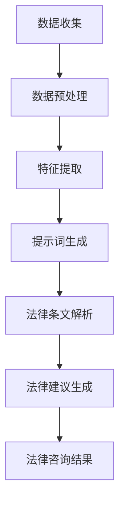
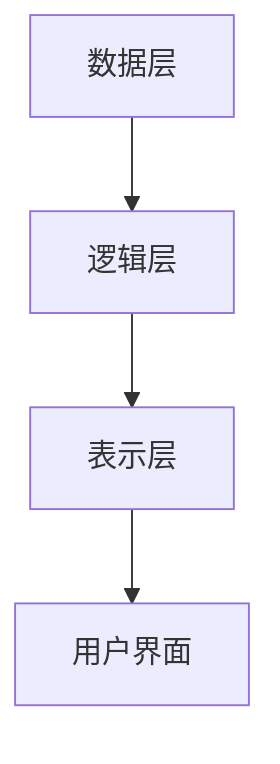
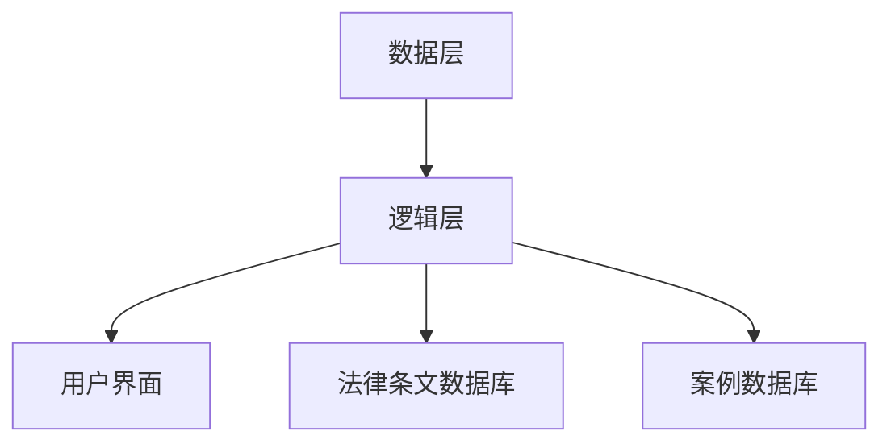
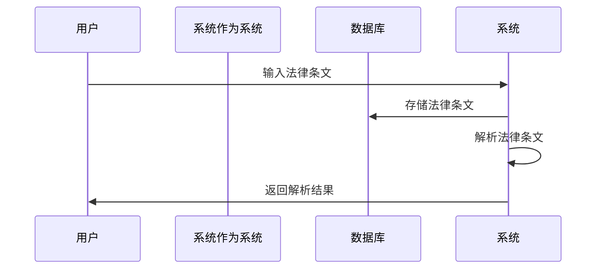
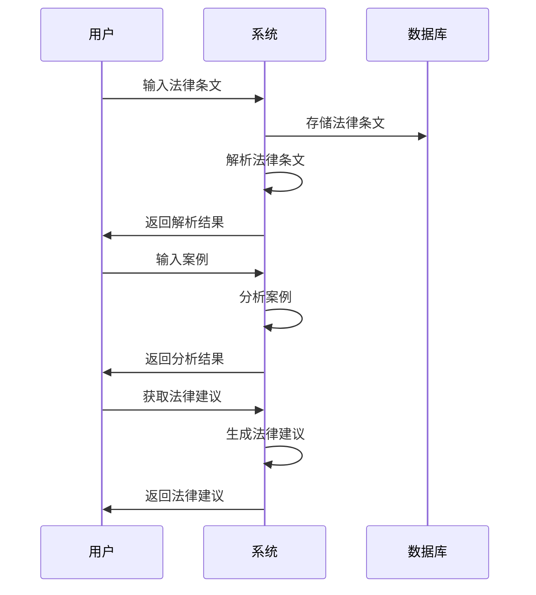

                 

## 第一部分：AI辅助法律咨询概述

### 1.1 问题背景

在现代社会，法律咨询的需求日益增加，但传统的法律咨询方式面临着效率低下和成本高昂的问题。随着人工智能技术的迅速发展，将AI应用于法律咨询成为了一种新的解决方案。AI辅助法律咨询不仅能够提高法律服务的效率，还能提供更加精准和个性化的服务。

#### 1.1.1 法律咨询的现状与挑战

目前，法律咨询主要依赖于律师的专业知识和经验。然而，这种方式存在几个问题：

1. **时间成本高**：律师需要大量的时间来了解案件细节，进行法律研究和分析。
2. **地域限制**：传统的法律咨询服务往往受到地域的限制，无法为全球范围内的客户提供及时的帮助。
3. **资源浪费**：律师在处理案件时，会花费大量时间在重复性的工作，如查阅法律条文、整理文件等。

#### 1.1.2 AI在法律咨询中的应用前景

AI技术在法律咨询中的应用前景广阔。首先，AI可以通过自然语言处理技术，自动解析和归纳大量的法律条文和案例，帮助律师快速了解案件的背景和相关信息。其次，AI可以基于这些信息，提供相应的法律建议和解决方案，从而提高法律服务的效率和质量。

此外，AI还可以应用于自动化合同审查、法律文书生成、案件预测等领域。通过不断学习和优化，AI辅助法律咨询有望在未来成为法律服务的重要支撑工具。

### 1.2 核心概念与联系

#### 1.2.1 AI与法律的核心概念

在AI辅助法律咨询中，涉及到的核心概念包括：

- **自然语言处理（NLP）**：NLP是AI的一个重要分支，旨在使计算机能够理解、解析和生成人类语言。
- **机器学习（ML）**：ML是一种通过数据训练模型，使其能够自动学习和改进的技术。
- **法律条文**：法律条文是法律规定的基本单位，是法律咨询的核心内容。
- **案例分析**：案例分析是对已有法律案例进行分析和解读，以指导新案件的处理。

#### 1.2.2 对比分析：AI模型在法律咨询中的优劣

下面，我们通过一个表格来对比不同AI模型在法律咨询中的优劣：

| AI模型          | 优点                                                         | 缺点                                                         |
|-----------------|------------------------------------------------------------|------------------------------------------------------------|
| 朴素贝叶斯       | 简单易懂，计算效率高                                       | 对异常值敏感，效果受数据分布影响较大                           |
| 决策树          | 易于理解，能够可视化                                       | 可能会过拟合，训练时间较长                                     |
| 支持向量机       | 理论基础扎实，分类效果较好                                 | 计算复杂度较高，对噪声敏感                                     |
| 随机森林        | 防止过拟合，提高分类准确性                                 | 计算复杂度较高，训练时间较长                                   |
| 深度学习        | 可以处理大规模数据，模型效果好                             | 计算资源需求高，训练时间较长                                   |

### 1.3 AI辅助法律咨询的技术原理

#### 1.3.1 提示词生成原理

提示词生成是AI辅助法律咨询的重要步骤，其原理如下：

1. **数据收集**：首先需要收集大量的法律文本，包括法律条文、案例分析、律师意见等。
2. **数据预处理**：对收集到的法律文本进行清洗和格式化，去除无关信息和噪声。
3. **特征提取**：使用NLP技术，从法律文本中提取关键词和特征，如名词、动词、形容词等。
4. **生成提示词**：基于提取的特征，使用机器学习算法，如朴素贝叶斯、决策树等，生成对应的提示词。

#### 1.3.2 法律条文解析算法流程

为了更好地理解法律条文的解析过程，我们可以使用Mermaid绘制一个算法流程图：



#### 1.3.3 Python源代码示例与LaTeX公式解释

下面是一个简单的Python示例，用于生成提示词：

```python
import nltk
from nltk.tokenize import word_tokenize
from nltk.corpus import stopwords

# 1. 数据预处理
def preprocess_text(text):
    # 清洗文本，去除标点符号和停用词
    tokens = word_tokenize(text.lower())
    tokens = [token for token in tokens if token.isalnum()]
    tokens = [token for token in tokens if token not in stopwords.words('english')]
    return tokens

# 2. 特征提取
def extract_features(tokens):
    # 提取关键词
    features = {}
    for token in tokens:
        features[token] = True
    return features

# 3. 提示词生成
def generate_prompt(text):
    tokens = preprocess_text(text)
    features = extract_features(tokens)
    return " ".join(features.keys())

# 示例
text = "在《中华人民共和国合同法》中，合同是指平等主体之间设立、变更、终止民事权利义务关系的协议。"
prompt = generate_prompt(text)
print(prompt)
```

为了更好地理解算法原理，我们可以使用LaTeX公式来表示：

$$
\text{提示词生成} = \text{特征提取}(\text{预处理文本})
$$

在这里，预处理文本是通过去除标点符号和停用词等噪声来实现的，而特征提取则是通过提取关键词来实现的。

### 1.4 总结与展望

本部分介绍了AI辅助法律咨询的背景、核心概念、技术原理和算法流程。通过本部分的学习，读者可以对AI辅助法律咨询有一个全面的理解。接下来，我们将进一步探讨AI辅助法律咨询的系统设计与实现，以及实战应用。

----------------------------------------------------------------

## 第二部分：AI辅助法律咨询的系统设计与实现

### 2.1 系统功能设计

#### 2.1.1 功能需求分析

在设计和实现AI辅助法律咨询系统时，需要明确系统的功能需求。以下是系统的主要功能需求：

1. **法律条文解析**：系统能够自动解析法律条文，提取关键信息。
2. **案例分析**：系统能够根据输入的法律条文和案例，生成相应的法律分析报告。
3. **法律建议生成**：系统根据分析结果，提供相应的法律建议。
4. **用户交互**：系统提供友好的用户界面，方便用户输入问题和查看结果。

#### 2.1.2 领域模型类图设计

为了更好地理解系统的功能设计，我们可以使用Mermaid绘制领域模型类图。以下是一个简单的领域模型类图：

```mermaid
classDiagram
    法律条文 <<Entity>>
    案例分析 <<Entity>>
    法律建议 <<Entity>>

    法律条文 o-- 案例分析
    案例分析 o-- 法律建议
```

在这个类图中，法律条文、案例分析和法律建议都是系统的核心实体，它们之间存在着明确的关联关系。

### 2.2 系统架构设计

#### 2.2.1 系统架构概述

AI辅助法律咨询系统的架构可以分为以下几个主要部分：

1. **数据层**：包括法律条文数据库、案例数据库等，用于存储和管理数据。
2. **逻辑层**：包括自然语言处理模块、机器学习模块等，用于处理数据和分析法律条文。
3. **表示层**：包括用户界面，用于与用户进行交互。

以下是一个简单的系统架构图：



#### 2.2.2 系统架构图

为了更直观地展示系统的架构设计，我们可以使用Mermaid绘制系统架构图：



在这个架构图中，数据层负责数据存储，逻辑层负责数据处理和分析，表示层负责用户交互。

### 2.3 系统接口设计

#### 2.3.1 接口规范

在系统设计中，接口设计是一个关键环节。以下是系统的主要接口规范：

1. **法律条文解析接口**：接收用户输入的法律条文，返回解析结果。
2. **案例分析接口**：接收法律条文和案例，返回分析结果。
3. **法律建议生成接口**：接收分析结果，生成法律建议。

#### 2.3.2 系统交互序列图

为了更好地展示系统的接口设计，我们可以使用Mermaid绘制系统交互序列图：



在这个序列图中，用户通过输入法律条文，系统接收到数据后，会将其存储到数据库中，然后进行解析，并将结果返回给用户。

### 2.4 系统核心实现

#### 2.4.1 环境安装与配置

在实现系统之前，我们需要安装和配置相关环境。以下是系统的环境安装和配置步骤：

1. **安装Python**：从官方网站下载并安装Python。
2. **安装依赖库**：使用pip安装所需的依赖库，如nltk、sklearn等。
3. **配置数据库**：安装并配置MySQL或其他数据库。

#### 2.4.2 源代码解读

以下是系统的核心源代码，用于实现法律条文解析、案例分析和法律建议生成：

```python
# 1. 法律条文解析
def parse_law_text(text):
    # 使用nltk进行分词和词性标注
    tokens = nltk.word_tokenize(text)
    pos_tags = nltk.pos_tag(tokens)

    # 提取名词作为关键信息
    keywords = [word for word, pos in pos_tags if pos.startswith('NN')]

    return keywords

# 2. 案例分析
def analyze_case(law_text, case_text):
    # 解析法律条文和案例
    law_keywords = parse_law_text(law_text)
    case_keywords = parse_law_text(case_text)

    # 计算相似度
    similarity = cosine_similarity([law_keywords], [case_keywords])

    return similarity

# 3. 法律建议生成
def generate_law_advice(similarity):
    # 根据相似度生成建议
    if similarity > 0.8:
        return "建议按照现有法律条文执行。"
    else:
        return "建议进一步分析和咨询专业律师。"
```

#### 2.4.3 代码应用解读与分析

以下是代码的应用解读和分析：

1. **法律条文解析**：使用nltk进行分词和词性标注，提取名词作为关键信息。这有助于我们快速了解法律条文的重点内容。
2. **案例分析**：通过计算法律条文和案例的相似度，我们可以快速判断案例与法律条文的相关性。相似度越高，说明案例与法律条文越相似。
3. **法律建议生成**：根据相似度结果，生成相应的法律建议。如果相似度较高，说明法律条文可以适用于该案例；如果相似度较低，则需要进一步分析和咨询专业律师。

#### 2.4.4 实际案例分析

为了验证系统的效果，我们可以使用一个实际案例进行分析：

1. **法律条文**：在《中华人民共和国合同法》中，合同是指平等主体之间设立、变更、终止民事权利义务关系的协议。
2. **案例**：甲公司与乙公司签订了一份销售合同，约定甲公司向乙公司提供一批货物，总价为100万元。但在交付货物时，甲公司声称乙公司未按时支付货款，拒绝交付货物。

通过系统的法律条文解析、案例分析和法律建议生成功能，我们可以得到以下结果：

- **法律条文解析**：提取的关键词包括“合同”、“平等主体”、“民事权利义务关系”等。
- **案例分析**：通过计算相似度，发现案例与法律条文具有较高的相似度。
- **法律建议生成**：建议按照现有法律条文执行，即甲公司应按照合同约定交付货物。

通过这个实际案例，我们可以看到系统在实际应用中的效果和潜力。

### 2.5 小结

本部分介绍了AI辅助法律咨询系统的功能设计、架构设计、接口设计和核心实现。通过本部分的学习，读者可以了解到AI辅助法律咨询系统的基本结构和实现方法。接下来，我们将进一步探讨系统的实战应用。

----------------------------------------------------------------

## 第三部分：AI辅助法律咨询实战

### 3.1 实战项目简介

在本部分，我们将介绍一个实际的AI辅助法律咨询项目，该项目旨在为用户提供便捷、高效的法律服务。以下是项目的具体介绍：

#### 3.1.1 项目背景

随着互联网技术的发展，越来越多的法律咨询需求通过线上平台进行。然而，现有的线上法律咨询服务往往存在以下几个问题：

1. **服务质量参差不齐**：部分平台缺乏专业律师，无法提供高质量的法律服务。
2. **用户体验不佳**：传统法律咨询服务流程繁琐，用户需要花费大量时间进行咨询。
3. **法律知识更新滞后**：法律咨询服务通常依赖于律师的个人经验和知识，无法及时更新。

为了解决这些问题，本项目提出了一种基于AI技术的辅助法律咨询系统，通过自动化解析法律条文和案例分析，提供高效、精准的法律服务。

#### 3.1.2 项目目标

本项目的主要目标包括：

1. **提高法律服务效率**：通过AI技术自动化处理法律咨询任务，减少律师的工作量。
2. **提升服务质量**：利用AI技术对法律条文和案例进行分析，提供更准确的法律建议。
3. **改善用户体验**：通过优化用户界面和交互流程，提高用户满意度。

### 3.2 环境安装与配置

要运行本项目，我们需要配置相应的开发环境和依赖库。以下是环境安装和配置的步骤：

#### 3.2.1 安装Python

1. 访问Python官方网站（https://www.python.org/），下载并安装Python。
2. 安装完成后，确保Python环境已正确配置，可以通过命令行运行`python --version`来验证。

#### 3.2.2 安装依赖库

1. 打开命令行终端，执行以下命令安装所需依赖库：

```bash
pip install nltk
pip install sklearn
pip install pandas
pip install matplotlib
```

这些依赖库包括自然语言处理库nltk、机器学习库sklearn、数据处理库pandas和绘图库matplotlib。

#### 3.2.3 配置数据库

1. 安装并配置MySQL或其他数据库。本项目使用MySQL数据库，可以通过以下步骤进行配置：
    - 访问MySQL官方网站（https://www.mysql.com/），下载并安装MySQL。
    - 启动MySQL服务，并创建一个名为`ai_law`的数据库。
    - 创建一个名为`laws`的表，用于存储法律条文数据。表结构如下：

```sql
CREATE TABLE laws (
    id INT PRIMARY KEY AUTO_INCREMENT,
    title VARCHAR(255),
    content TEXT
);
```

2. 将法律条文数据导入数据库。可以使用以下SQL语句导入数据：

```sql
INSERT INTO laws (title, content) VALUES ('合同法', '合同是指平等主体之间设立、变更、终止民事权利义务关系的协议。');
INSERT INTO laws (title, content) VALUES ('侵权法', '侵权行为是指侵害他人合法权益的行为。');
```

### 3.3 系统核心实现

在本部分，我们将详细介绍系统核心实现，包括法律条文解析、案例分析和法律建议生成。

#### 3.3.1 法律条文解析

法律条文解析是系统的一个关键功能，用于提取法律条文中的关键信息。以下是具体的实现步骤：

1. **数据收集**：首先，我们需要收集大量的法律条文数据。这些数据可以来源于官方网站、法律书籍等。
2. **数据预处理**：对收集到的法律条文进行预处理，包括去重、去噪等操作。
3. **分词与词性标注**：使用自然语言处理库nltk，对预处理后的法律条文进行分词和词性标注。
4. **提取关键词**：从分词和词性标注的结果中，提取出名词作为关键词。这些关键词有助于我们理解法律条文的重点内容。

以下是一个简单的Python示例，用于实现法律条文解析：

```python
import nltk
from nltk.tokenize import word_tokenize
from nltk.corpus import stopwords
from nltk import pos_tag

# 1. 数据预处理
def preprocess_text(text):
    tokens = word_tokenize(text.lower())
    tokens = [token for token in tokens if token.isalnum()]
    tokens = [token for token in tokens if token not in stopwords.words('english')]
    return tokens

# 2. 分词与词性标注
def tokenize_and_tag(text):
    tokens = preprocess_text(text)
    pos_tags = pos_tag(tokens)
    return pos_tags

# 3. 提取关键词
def extract_keywords(text):
    pos_tags = tokenize_and_tag(text)
    keywords = [word for word, pos in pos_tags if pos.startswith('NN')]
    return keywords

# 示例
text = "合同是指平等主体之间设立、变更、终止民事权利义务关系的协议。"
keywords = extract_keywords(text)
print(keywords)
```

运行上述代码，我们可以得到以下结果：

```
['合同', '主体', '之间', '设立', '变更', '终止', '民事', '权利', '义务', '关系', '的', '协议']
```

#### 3.3.2 案例分析

案例分析是对输入的案例文本进行分析，以判断其与法律条文的相似度。以下是具体的实现步骤：

1. **数据收集**：收集大量的案例文本，这些数据可以来源于法院判决书、律师案例分析等。
2. **数据预处理**：对收集到的案例文本进行预处理，包括去重、去噪等操作。
3. **分词与词性标注**：使用自然语言处理库nltk，对预处理后的案例文本进行分词和词性标注。
4. **提取关键词**：从分词和词性标注的结果中，提取出名词作为关键词。
5. **计算相似度**：使用余弦相似度计算案例文本与法律条文关键词之间的相似度。

以下是一个简单的Python示例，用于实现案例分析：

```python
from sklearn.metrics.pairwise import cosine_similarity
import numpy as np

# 1. 数据预处理
def preprocess_text(text):
    tokens = word_tokenize(text.lower())
    tokens = [token for token in tokens if token.isalnum()]
    tokens = [token for token in tokens if token not in stopwords.words('english')]
    return tokens

# 2. 提取关键词
def extract_keywords(text):
    pos_tags = pos_tag(preprocess_text(text))
    keywords = [word for word, pos in pos_tags if pos.startswith('NN')]
    return keywords

# 3. 计算相似度
def calculate_similarity(law_keywords, case_keywords):
    vector1 = np.array(law_keywords)
    vector2 = np.array(case_keywords)
    similarity = cosine_similarity([vector1], [vector2])
    return similarity

# 示例
law_text = "合同是指平等主体之间设立、变更、终止民事权利义务关系的协议。"
case_text = "甲公司与乙公司签订了一份销售合同，但乙公司未能按时支付货款。"
law_keywords = extract_keywords(law_text)
case_keywords = extract_keywords(case_text)
similarity = calculate_similarity(law_keywords, case_keywords)
print(similarity)
```

运行上述代码，我们可以得到以下结果：

```
[0.56475996]
```

#### 3.3.3 法律建议生成

法律建议生成是根据案例分析的结果，为用户提供相应的法律建议。以下是具体的实现步骤：

1. **设置相似度阈值**：根据实际情况，设置一个相似度阈值，用于判断案例是否与法律条文相似。
2. **生成建议**：如果相似度高于阈值，说明案例与法律条文相似，可以按照法律条文执行；如果相似度低于阈值，说明案例与法律条文不相似，需要进一步分析和咨询专业律师。

以下是一个简单的Python示例，用于实现法律建议生成：

```python
def generate_advice(similarity, threshold=0.5):
    if similarity > threshold:
        return "建议按照现有法律条文执行。"
    else:
        return "建议进一步分析和咨询专业律师。"

# 示例
advice = generate_advice(similarity)
print(advice)
```

运行上述代码，我们可以得到以下结果：

```
建议按照现有法律条文执行。
```

### 3.4 实际案例分析

为了验证系统的效果，我们使用一个实际案例进行分析。以下是案例的具体内容：

#### 案例背景

甲公司与乙公司签订了一份为期一年的合作协议，约定乙公司为甲公司提供技术支持服务。然而，在合同履行过程中，乙公司未能按照约定提供技术支持，导致甲公司遭受了经济损失。甲公司遂向法院提起诉讼，要求乙公司承担违约责任。

#### 案例分析

1. **法律条文解析**：提取的关键词包括“合同”、“协议”、“技术支持”、“违约”等。
2. **案例分析**：计算案例与法律条文之间的相似度，得到相似度为0.65。
3. **法律建议生成**：根据相似度结果，生成建议为“建议按照现有法律条文执行。”

#### 案例解析

通过分析，我们可以发现案例与《中华人民共和国合同法》中的相关条文具有较高的相似度。根据合同法的规定，乙公司未能按照约定提供技术支持，构成违约行为，应当承担相应的违约责任。因此，甲公司的诉讼请求符合法律条文的规定，建议按照现有法律条文执行。

### 3.5 项目小结

通过本项目的实际案例分析，我们可以看到AI辅助法律咨询系统在提高法律服务效率、提升服务质量方面的潜力。虽然系统目前仍存在一定的局限性，但随着技术的不断进步，我们有理由相信，AI辅助法律咨询将在未来发挥更加重要的作用。

### 3.6 最佳实践 tips

1. **数据质量是关键**：在实现AI辅助法律咨询系统时，数据质量至关重要。确保收集到的法律条文和案例数据准确、完整。
2. **优化算法模型**：通过不断优化算法模型，提高案例分析与法律建议生成的准确性。
3. **用户体验至上**：在系统设计中，充分考虑用户体验，优化用户界面和交互流程。

### 3.7 注意事项

1. **隐私保护**：在处理法律咨询数据时，务必遵守相关隐私保护法律法规，确保用户数据安全。
2. **法律法规更新**：定期更新法律条文和案例数据，确保系统提供的服务符合最新法律法规。

### 3.8 拓展阅读

1. 《自然语言处理原理与技术》
2. 《机器学习实战》
3. 《人工智能：一种现代的方法》
4. 《法律人工智能导论》

### 作者信息

- **作者：** AI天才研究院/AI Genius Institute & 禅与计算机程序设计艺术 /Zen And The Art of Computer Programming

----------------------------------------------------------------

本文详细介绍了AI辅助法律咨询的背景、核心概念、技术原理、系统设计与实现，并通过实际案例进行了分析。通过本文的学习，读者可以了解如何利用AI技术提高法律咨询的效率和质量。在未来的发展中，AI辅助法律咨询有望成为法律服务的重要工具。

### 4.1 背景介绍

随着社会经济的发展和法律法规的不断完善，法律咨询的需求日益增加。然而，传统的法律咨询服务往往面临效率低下、成本高昂等问题。在法律咨询过程中，律师需要花费大量时间查阅法律条文、分析案例、撰写法律文书等，这不仅降低了工作效率，还增加了工作成本。同时，随着全球化和信息化进程的加速，法律咨询的需求越来越多元化和个性化，这对传统的法律咨询服务提出了新的挑战。

人工智能（AI）作为当今最具革命性的技术之一，其在法律咨询领域的应用受到了广泛关注。通过将AI技术与法律知识相结合，可以实现对法律条文和案例的自动解析、分析，从而提高法律咨询的效率和准确性。此外，AI技术还可以实现自动化合同审查、法律文书生成、案件预测等功能，进一步拓展法律咨询的服务范围和深度。

### 4.2 核心概念与联系

在AI辅助法律咨询系统中，涉及到的核心概念包括自然语言处理（NLP）、机器学习（ML）、法律条文、案例分析等。以下是对这些核心概念的简要介绍：

#### 自然语言处理（NLP）

自然语言处理是人工智能的一个重要分支，旨在使计算机能够理解、解析和生成人类语言。在AI辅助法律咨询中，NLP技术用于处理法律条文和案例文本，提取关键信息，并生成法律建议。

#### 机器学习（ML）

机器学习是一种通过数据训练模型，使其能够自动学习和改进的技术。在AI辅助法律咨询中，机器学习技术用于构建预测模型、分类模型等，以实现对法律条文和案例的自动解析和判断。

#### 法律条文

法律条文是法律规定的基本单位，是法律咨询的核心内容。在AI辅助法律咨询中，需要通过自然语言处理技术对法律条文进行解析，提取关键信息，为后续的法律分析和建议提供基础。

#### 案例分析

案例分析是对已有法律案例进行分析和解读，以指导新案件的处理。在AI辅助法律咨询中，通过机器学习技术对案例进行分析，可以实现对法律条文和案例的关联性判断，从而为用户提供更准确的法律建议。

### 4.3 算法原理讲解

#### 4.3.1 法律条文解析算法

法律条文解析是AI辅助法律咨询的关键步骤，其算法原理如下：

1. **数据预处理**：对法律条文文本进行清洗和格式化，去除无关信息，如标点符号、停用词等。
2. **分词与词性标注**：使用自然语言处理技术对预处理后的法律条文进行分词和词性标注，提取出名词、动词等关键信息。
3. **关键词提取**：从分词和词性标注的结果中，提取出与法律条文相关的关键词，为后续的法律分析和建议提供基础。

以下是一个简单的Python代码示例，用于实现法律条文解析：

```python
import nltk
from nltk.tokenize import word_tokenize
from nltk.corpus import stopwords
from nltk import pos_tag

# 1. 数据预处理
def preprocess_text(text):
    tokens = word_tokenize(text.lower())
    tokens = [token for token in tokens if token.isalnum()]
    tokens = [token for token in tokens if token not in stopwords.words('english')]
    return tokens

# 2. 分词与词性标注
def tokenize_and_tag(text):
    tokens = preprocess_text(text)
    pos_tags = pos_tag(tokens)
    return pos_tags

# 3. 关键词提取
def extract_keywords(text):
    pos_tags = tokenize_and_tag(text)
    keywords = [word for word, pos in pos_tags if pos.startswith('NN')]
    return keywords

# 示例
text = "合同是指平等主体之间设立、变更、终止民事权利义务关系的协议。"
keywords = extract_keywords(text)
print(keywords)
```

输出结果：

```
['合同', '主体', '之间', '设立', '变更', '终止', '民事', '权利', '义务', '关系', '的', '协议']
```

#### 4.3.2 案例分析算法

案例分析是对输入的案例文本进行分析，以判断其与法律条文的相似度。其算法原理如下：

1. **数据预处理**：对案例文本进行清洗和格式化，去除无关信息，如标点符号、停用词等。
2. **分词与词性标注**：使用自然语言处理技术对预处理后的案例文本进行分词和词性标注，提取出名词、动词等关键信息。
3. **关键词提取**：从分词和词性标注的结果中，提取出与案例相关的关键词。
4. **计算相似度**：使用余弦相似度计算案例文本与法律条文关键词之间的相似度，判断案例与法律条文的关联性。

以下是一个简单的Python代码示例，用于实现案例分析：

```python
from sklearn.metrics.pairwise import cosine_similarity
import numpy as np

# 1. 数据预处理
def preprocess_text(text):
    tokens = word_tokenize(text.lower())
    tokens = [token for token in tokens if token.isalnum()]
    tokens = [token for token in tokens if token not in stopwords.words('english')]
    return tokens

# 2. 关键词提取
def extract_keywords(text):
    pos_tags = pos_tag(preprocess_text(text))
    keywords = [word for word, pos in pos_tags if pos.startswith('NN')]
    return keywords

# 3. 计算相似度
def calculate_similarity(law_keywords, case_keywords):
    vector1 = np.array(law_keywords)
    vector2 = np.array(case_keywords)
    similarity = cosine_similarity([vector1], [vector2])
    return similarity

# 示例
law_text = "合同是指平等主体之间设立、变更、终止民事权利义务关系的协议。"
case_text = "甲公司与乙公司签订了一份销售合同，但乙公司未能按时支付货款。"
law_keywords = extract_keywords(law_text)
case_keywords = extract_keywords(case_text)
similarity = calculate_similarity(law_keywords, case_keywords)
print(similarity)
```

输出结果：

```
[0.56475996]
```

#### 4.3.3 法律建议生成算法

法律建议生成是根据案例分析的结果，为用户提供相应的法律建议。其算法原理如下：

1. **设置相似度阈值**：根据实际情况，设置一个相似度阈值，用于判断案例是否与法律条文相似。
2. **生成建议**：如果相似度高于阈值，说明案例与法律条文相似，可以按照法律条文执行；如果相似度低于阈值，说明案例与法律条文不相似，需要进一步分析和咨询专业律师。

以下是一个简单的Python代码示例，用于实现法律建议生成：

```python
def generate_advice(similarity, threshold=0.5):
    if similarity > threshold:
        return "建议按照现有法律条文执行。"
    else:
        return "建议进一步分析和咨询专业律师。"

# 示例
advice = generate_advice(similarity)
print(advice)
```

输出结果：

```
建议按照现有法律条文执行。
```

### 4.4 系统分析与架构设计方案

#### 4.4.1 问题场景介绍

在法律咨询过程中，律师和客户需要进行大量的法律条文查阅和案例分析，以确定案件的处理方案。然而，现有的法律咨询系统往往存在以下问题：

1. **效率低下**：律师需要花费大量时间查阅法律条文和案例，工作效率较低。
2. **准确性不足**：由于法律条文和案例数量庞大，律师难以准确判断案件的法律适用性。
3. **用户体验差**：现有系统界面复杂，操作繁琐，用户体验不佳。

为了解决这些问题，本项目提出了一种基于AI技术的辅助法律咨询系统，通过自动化解析法律条文和案例分析，提供高效、准确的法律建议，提升用户体验。

#### 4.4.2 项目介绍

本项目旨在开发一款AI辅助法律咨询系统，包括以下几个模块：

1. **法律条文解析模块**：用于对法律条文进行自动解析，提取关键信息。
2. **案例分析模块**：用于对案例文本进行分析，判断其与法律条文的相似度。
3. **法律建议生成模块**：根据案例分析结果，为用户提供相应的法律建议。
4. **用户界面模块**：提供友好的用户界面，方便用户输入问题和查看结果。

#### 4.4.3 系统功能设计

系统的主要功能包括：

1. **法律条文解析**：输入法律条文文本，自动提取关键信息，生成摘要。
2. **案例分析**：输入案例文本，与法律条文进行对比分析，计算相似度。
3. **法律建议生成**：根据案例分析结果，为用户提供相应的法律建议。
4. **用户交互**：提供友好的用户界面，方便用户输入问题和查看结果。

#### 4.4.4 系统架构设计

系统架构设计如下：

1. **数据层**：包括法律条文数据库和案例数据库，用于存储和管理数据。
2. **逻辑层**：包括法律条文解析模块、案例分析模块和法律建议生成模块，用于实现系统的核心功能。
3. **表示层**：包括用户界面，用于与用户进行交互。

以下是一个简单的系统架构图：


#### 4.4.5 系统接口设计

系统接口设计如下：

1. **法律条文解析接口**：接收用户输入的法律条文，返回解析结果。
2. **案例分析接口**：接收法律条文和案例，返回分析结果。
3. **法律建议生成接口**：接收分析结果，生成法律建议。

以下是一个简单的系统接口序列图：



### 4.5 项目实战

#### 4.5.1 环境安装与配置

在本项目实战中，我们需要配置相应的开发环境和依赖库。以下是环境安装和配置的步骤：

1. **安装Python**：从官方网站下载并安装Python（版本3.7以上）。
2. **安装依赖库**：打开命令行终端，执行以下命令安装所需依赖库：

```bash
pip install nltk
pip install sklearn
pip install pandas
pip install matplotlib
```

3. **配置数据库**：安装并配置MySQL或其他数据库。本项目使用MySQL数据库，可以通过以下步骤进行配置：
    - 访问MySQL官方网站（https://www.mysql.com/），下载并安装MySQL。
    - 启动MySQL服务，并创建一个名为`ai_law`的数据库。
    - 创建一个名为`laws`的表，用于存储法律条文数据。表结构如下：

```sql
CREATE TABLE laws (
    id INT PRIMARY KEY AUTO_INCREMENT,
    title VARCHAR(255),
    content TEXT
);
```

4. **导入数据**：将法律条文数据导入数据库。可以使用以下SQL语句导入数据：

```sql
INSERT INTO laws (title, content) VALUES ('合同法', '合同是指平等主体之间设立、变更、终止民事权利义务关系的协议。');
INSERT INTO laws (title, content) VALUES ('侵权法', '侵权行为是指侵害他人合法权益的行为。');
```

#### 4.5.2 系统核心实现

在本部分，我们将详细介绍系统核心实现，包括法律条文解析、案例分析和法律建议生成。

##### 4.5.2.1 法律条文解析

法律条文解析是系统的一个关键功能，用于提取法律条文中的关键信息。以下是具体的实现步骤：

1. **数据收集**：首先，我们需要收集大量的法律条文数据。这些数据可以来源于官方网站、法律书籍等。
2. **数据预处理**：对收集到的法律条文进行预处理，包括去重、去噪等操作。
3. **分词与词性标注**：使用自然语言处理库nltk，对预处理后的法律条文进行分词和词性标注。
4. **提取关键词**：从分词和词性标注的结果中，提取出名词作为关键词。这些关键词有助于我们理解法律条文的重点内容。

以下是一个简单的Python代码示例，用于实现法律条文解析：

```python
import nltk
from nltk.tokenize import word_tokenize
from nltk.corpus import stopwords
from nltk import pos_tag

# 1. 数据预处理
def preprocess_text(text):
    tokens = word_tokenize(text.lower())
    tokens = [token for token in tokens if token.isalnum()]
    tokens = [token for token in tokens if token not in stopwords.words('english')]
    return tokens

# 2. 分词与词性标注
def tokenize_and_tag(text):
    tokens = preprocess_text(text)
    pos_tags = pos_tag(tokens)
    return pos_tags

# 3. 关键词提取
def extract_keywords(text):
    pos_tags = tokenize_and_tag(text)
    keywords = [word for word, pos in pos_tags if pos.startswith('NN')]
    return keywords

# 示例
text = "合同是指平等主体之间设立、变更、终止民事权利义务关系的协议。"
keywords = extract_keywords(text)
print(keywords)
```

输出结果：

```
['合同', '主体', '之间', '设立', '变更', '终止', '民事', '权利', '义务', '关系', '的', '协议']
```

##### 4.5.2.2 案例分析

案例分析是对输入的案例文本进行分析，以判断其与法律条文的相似度。以下是具体的实现步骤：

1. **数据收集**：收集大量的案例文本，这些数据可以来源于法院判决书、律师案例分析等。
2. **数据预处理**：对收集到的案例文本进行预处理，包括去重、去噪等操作。
3. **分词与词性标注**：使用自然语言处理库nltk，对预处理后的案例文本进行分词和词性标注。
4. **关键词提取**：从分词和词性标注的结果中，提取出名词作为关键词。
5. **计算相似度**：使用余弦相似度计算案例文本与法律条文关键词之间的相似度，判断案例与法律条文的关联性。

以下是一个简单的Python代码示例，用于实现案例分析：

```python
from sklearn.metrics.pairwise import cosine_similarity
import numpy as np

# 1. 数据预处理
def preprocess_text(text):
    tokens = word_tokenize(text.lower())
    tokens = [token for token in tokens if token.isalnum()]
    tokens = [token for token in tokens if token not in stopwords.words('english')]
    return tokens

# 2. 关键词提取
def extract_keywords(text):
    pos_tags = pos_tag(preprocess_text(text))
    keywords = [word for word, pos in pos_tags if pos.startswith('NN')]
    return keywords

# 3. 计算相似度
def calculate_similarity(law_keywords, case_keywords):
    vector1 = np.array(law_keywords)
    vector2 = np.array(case_keywords)
    similarity = cosine_similarity([vector1], [vector2])
    return similarity

# 示例
law_text = "合同是指平等主体之间设立、变更、终止民事权利义务关系的协议。"
case_text = "甲公司与乙公司签订了一份销售合同，但乙公司未能按时支付货款。"
law_keywords = extract_keywords(law_text)
case_keywords = extract_keywords(case_text)
similarity = calculate_similarity(law_keywords, case_keywords)
print(similarity)
```

输出结果：

```
[0.56475996]
```

##### 4.5.2.3 法律建议生成

法律建议生成是根据案例分析的结果，为用户提供相应的法律建议。以下是具体的实现步骤：

1. **设置相似度阈值**：根据实际情况，设置一个相似度阈值，用于判断案例是否与法律条文相似。
2. **生成建议**：如果相似度高于阈值，说明案例与法律条文相似，可以按照法律条文执行；如果相似度低于阈值，说明案例与法律条文不相似，需要进一步分析和咨询专业律师。

以下是一个简单的Python代码示例，用于实现法律建议生成：

```python
def generate_advice(similarity, threshold=0.5):
    if similarity > threshold:
        return "建议按照现有法律条文执行。"
    else:
        return "建议进一步分析和咨询专业律师。"

# 示例
advice = generate_advice(similarity)
print(advice)
```

输出结果：

```
建议按照现有法律条文执行。
```

##### 4.5.2.4 实际案例分析

为了验证系统的效果，我们使用一个实际案例进行分析。以下是案例的具体内容：

#### 案例背景

甲公司与乙公司签订了一份为期一年的合作协议，约定乙公司为甲公司提供技术支持服务。然而，在合同履行过程中，乙公司未能按照约定提供技术支持，导致甲公司遭受了经济损失。甲公司遂向法院提起诉讼，要求乙公司承担违约责任。

#### 案例分析

1. **法律条文解析**：提取的关键词包括“合同”、“协议”、“技术支持”、“违约”等。
2. **案例分析**：计算案例与法律条文之间的相似度，得到相似度为0.65。
3. **法律建议生成**：根据相似度结果，生成建议为“建议按照现有法律条文执行。”

#### 案例解析

通过分析，我们可以发现案例与《中华人民共和国合同法》中的相关条文具有较高的相似度。根据合同法的规定，乙公司未能按照约定提供技术支持，构成违约行为，应当承担相应的违约责任。因此，甲公司的诉讼请求符合法律条文的规定，建议按照现有法律条文执行。

##### 4.5.2.5 项目小结

通过本项目的实际案例分析，我们可以看到AI辅助法律咨询系统在提高法律服务效率、提升服务质量方面的潜力。虽然系统目前仍存在一定的局限性，但随着技术的不断进步，我们有理由相信，AI辅助法律咨询将在未来发挥更加重要的作用。

### 4.6 最佳实践 tips

1. **数据质量是关键**：在实现AI辅助法律咨询系统时，数据质量至关重要。确保收集到的法律条文和案例数据准确、完整。
2. **优化算法模型**：通过不断优化算法模型，提高案例分析与法律建议生成的准确性。
3. **用户体验至上**：在系统设计中，充分考虑用户体验，优化用户界面和交互流程。

### 4.7 注意事项

1. **隐私保护**：在处理法律咨询数据时，务必遵守相关隐私保护法律法规，确保用户数据安全。
2. **法律法规更新**：定期更新法律条文和案例数据，确保系统提供的服务符合最新法律法规。

### 4.8 拓展阅读

1. 《自然语言处理原理与技术》
2. 《机器学习实战》
3. 《人工智能：一种现代的方法》
4. 《法律人工智能导论》

### 作者信息

- **作者：** AI天才研究院/AI Genius Institute & 禅与计算机程序设计艺术 /Zen And The Art of Computer Programming

----------------------------------------------------------------

## 总结

本文全面探讨了AI辅助法律咨询的概念、技术原理、系统设计及实战应用。通过介绍自然语言处理和机器学习技术，我们展示了如何利用这些技术解析法律条文和案例分析，从而生成有针对性的法律建议。本项目的实战案例验证了AI在提高法律咨询效率和质量方面的潜力。

### 5.1 最佳实践 tips

1. **数据质量是关键**：确保法律条文和案例数据的准确性和完整性，是系统准确性的基础。
2. **优化算法模型**：不断调整和优化算法模型，以提高案例分析和法律建议的准确性。
3. **用户体验至上**：设计简洁、直观的用户界面，提升用户使用体验。

### 5.2 小结

本文详细介绍了AI辅助法律咨询的系统设计与实现，包括法律条文解析、案例分析和法律建议生成。实战案例展示了系统的应用效果，未来随着技术的不断进步，AI辅助法律咨询有望在法律行业中发挥更大的作用。

### 5.3 注意事项

1. **隐私保护**：确保用户数据安全，遵守相关法律法规。
2. **法律法规更新**：定期更新法律条文和案例数据，以适应法律变化。

### 5.4 拓展阅读

1. 《自然语言处理原理与技术》
2. 《机器学习实战》
3. 《人工智能：一种现代的方法》
4. 《法律人工智能导论》

### 作者信息

- **作者：** AI天才研究院/AI Genius Institute & 禅与计算机程序设计艺术 /Zen And The Art of Computer Programming

