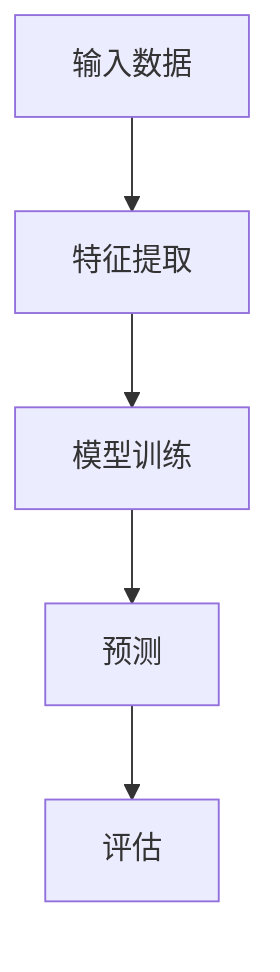
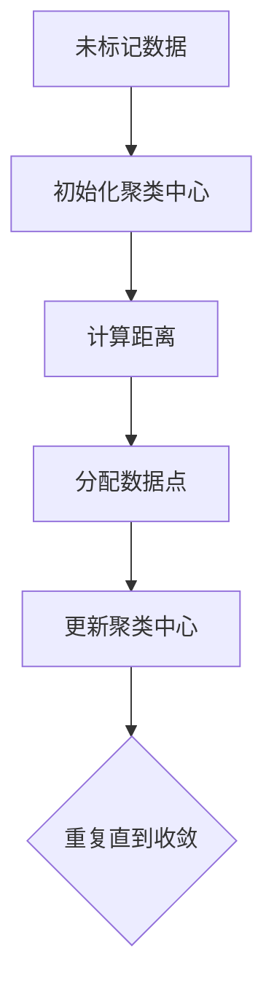
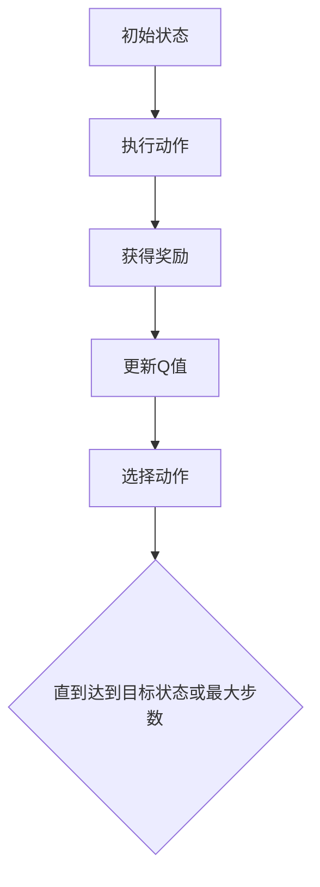

                 

### 第一部分：引言

#### 第1章：AI辅助游戏设计的背景和现状

在当今快节奏的数字化时代，人工智能（AI）已经深入到我们生活的方方面面，从智能助手到自动驾驶，从推荐系统到医疗诊断，AI的应用无处不在。随着技术的不断进步，游戏设计领域也开始拥抱AI，以期创造出更加丰富、沉浸感和互动性更强的游戏体验。

**关键词**：AI，游戏设计，背景，现状，发展趋势

**摘要**：
本章将介绍AI辅助游戏设计的历史背景、当前的发展现状以及在未来游戏设计中的潜在影响。我们将探讨AI技术在游戏剧情生成、角色发展、虚拟助手、智能对手等方面的应用，以及这些技术如何改变游戏设计的传统模式。

**章节内容概述**：

1. **历史背景**：
   - AI技术的发展历程
   - 游戏设计的演变过程
   - AI与游戏设计的首次融合

2. **当前现状**：
   - AI在游戏设计中的实际应用案例
   - 游戏开发者对AI技术的接受度
   - AI对游戏设计带来的变革

3. **未来趋势**：
   - AI技术在游戏设计中的潜在发展方向
   - 游戏设计行业面临的挑战与机遇

4. **总结**：
   - AI辅助游戏设计的总体影响
   - 对游戏开发者的启示

**核心概念与联系**：

- **概念**：AI辅助游戏设计
  - **属性**：智能算法、游戏剧情、角色发展、虚拟助手
  - **特征对比表格**：
    | 特征 | 智能算法 | 游戏剧情 | 角色发展 | 虚拟助手 |
    | --- | --- | --- | --- | --- |
    | 目的 | 自动化决策 | 故事生成 | 性格塑造 | 用户交互 |
    | 技术基础 | 机器学习、深度学习 | 自然语言处理 | 数据分析 | 人机交互 |
    | 应用场景 | 战略决策、资源优化 | 剧情创作、剧情演变 | 角色成长、角色互动 | 游戏内助手、游戏客服 |

- **概念关系ER图**：

```mermaid
erDiagram
  AI算法 ||--|{ 游戏剧情 }
  AI算法 ||--|{ 角色发展 }
  AI算法 ||--|{ 虚拟助手 }
```

通过上述章节概述和核心概念与联系的分析，我们可以初步了解AI辅助游戏设计的背景和现状。在接下来的章节中，我们将深入探讨AI在游戏设计中的具体应用和实现技术。

### 第2章：AI的基本概念与原理

**关键词**：人工智能，基本概念，原理，学习模型，算法

**摘要**：
本章将介绍人工智能的基本概念和原理，包括其定义、发展历程、核心学习模型和算法。通过了解这些基础知识，读者可以更好地理解AI在游戏设计中的应用及其潜在影响。

**章节内容概述**：

1. **AI的定义与发展历程**：
   - 人工智能的定义
   - AI的发展历程
   - AI在不同历史阶段的重要成果

2. **核心学习模型**：
   - 监督学习
   - 无监督学习
   - 强化学习
   - 深度学习

3. **常用算法**：
   - 支持向量机（SVM）
   - 决策树
   - 集成学习方法
   - 神经网络

4. **AI在游戏设计中的应用**：
   - 故事生成
   - 角色发展
   - 智能对手
   - 虚拟助手

5. **总结**：
   - AI在游戏设计中的关键作用
   - 对未来游戏设计的启示

**核心概念与联系**：

- **概念**：人工智能
  - **属性**：模拟人类智能，自动学习，自主决策
  - **特征对比表格**：
    | 特征 | 模拟人类智能 | 自动学习 | 自主决策 |
    | --- | --- | --- | --- |
    | 类型 | 狭义AI、广义AI | 监督学习、无监督学习、强化学习 | 策略决策、情境推理 |

- **概念关系ER图**：

```mermaid
erDiagram
  人工智能 ||--|{ 模拟人类智能 }
  人工智能 ||--|{ 自动学习 }
  人工智能 ||--|{ 自主决策 }
```

**算法原理讲解**：

在本章中，我们将详细讲解监督学习、无监督学习和强化学习这三种核心学习模型，并使用Mermaid图和Python代码示例来说明。

#### 监督学习

监督学习是一种从标记数据集中学习输出映射的机器学习技术。以下是监督学习的Mermaid流程图：



以下是监督学习的Python代码示例：

```python
from sklearn.linear_model import LinearRegression
import numpy as np

# 输入数据
X = np.array([[1], [2], [3], [4], [5]])
y = np.array([1, 2, 3, 4, 5])

# 特征提取
# 在这个例子中，特征提取可以被视为无操作的
X = X.reshape(-1, 1)

# 模型训练
model = LinearRegression()
model.fit(X, y)

# 预测
y_pred = model.predict(X)

# 评估
from sklearn.metrics import mean_squared_error
mse = mean_squared_error(y, y_pred)
print(f'Mean Squared Error: {mse}')
```

#### 无监督学习

无监督学习是一种从未标记数据集中学习数据结构和模式的技术。以下是K-均值聚类算法的Mermaid流程图：



以下是K-均值聚类算法的Python代码示例：

```python
from sklearn.cluster import KMeans
import numpy as np

# 输入数据
X = np.array([[1, 2], [1, 4], [1, 0], [4, 2], [4, 4], [4, 0]])

# 初始化聚类中心
kmeans = KMeans(n_clusters=2, init='k-means++', max_iter=100, n_init=10, random_state=0)
kmeans.fit(X)

# 分配数据点
labels = kmeans.predict(X)

# 更新聚类中心
centers = kmeans.cluster_centers_

# 输出结果
print(f'Cluster Centers: {centers}')
print(f'Labels: {labels}')
```

#### 强化学习

强化学习是一种通过试错来学习最优策略的机器学习技术。以下是Q-学习的Mermaid流程图：



以下是Q-学习的Python代码示例：

```python
import numpy as np
import random

# 环境模拟
class Environment:
    def __init__(self):
        self.state_space = [('s1', 's2'), ('s2', 's3'), ('s3', 's1')]
        self.action_space = [('a1', 'a2'), ('a2', 'a1')]

    def step(self, state, action):
        next_state = self.state_space[state]
        reward = 1 if action == next_state[1] else 0
        return next_state, reward

# Q值学习
class QLearning:
    def __init__(self, alpha=0.1, gamma=0.9, epsilon=0.1):
        self.alpha = alpha
        self.gamma = gamma
        self.epsilon = epsilon
        self.q_values = {}

    def q_update(self, state, action, reward, next_state):
        current_q_value = self.q_values.get((state, action), 0)
        next_max_q_value = max(self.q_values.get((next_state, a), 0) for a in self.env.action_space)
        new_q_value = current_q_value + self.alpha * (reward + self.gamma * next_max_q_value - current_q_value)
        self.q_values[(state, action)] = new_q_value

    def choose_action(self, state):
        if random.random() < self.epsilon:
            return random.choice(self.env.action_space)
        else:
            max_action = max(self.q_values.get((state, a), 0) for a in self.env.action_space)
            return random.choice([a for a in self.env.action_space if self.q_values.get((state, a), 0) == max_action])

# 模拟环境
env = Environment()
q_learning = QLearning()

# 运行Q学习算法
for episode in range(1000):
    state = 's1'
    done = False
    while not done:
        action = q_learning.choose_action(state)
        next_state, reward = env.step(state, action)
        q_learning.q_update(state, action, reward, next_state)
        state = next_state
        if state == 's3':
            done = True
```

通过上述内容，我们对AI的基本概念与原理有了更深入的理解，并在Python代码中实际应用了监督学习、无监督学习和强化学习。接下来，我们将探讨游戏设计的基本原理与方法，以更好地理解AI辅助游戏设计。

### 第3章：游戏设计的基本原理与方法

**关键词**：游戏设计，原理，方法，用户体验，设计流程

**摘要**：
本章将介绍游戏设计的基本原理与方法，探讨游戏的核心机制、用户体验和设计流程。我们将解释游戏设计如何影响玩家互动和游戏世界的构建，并探讨如何利用AI技术提升游戏设计质量。

**章节内容概述**：

1. **游戏设计的基本原理**：
   - 游戏的核心机制
   - 游戏设计的目标
   - 游戏类型及其特点

2. **用户体验设计**：
   - 用户需求分析
   - 游戏界面设计
   - 游戏交互设计

3. **游戏设计流程**：
   - 游戏策划
   - 游戏开发
   - 游戏测试和优化

4. **AI技术在游戏设计中的应用**：
   - 故事生成
   - 角色发展
   - 智能对手
   - 虚拟助手

5. **总结**：
   - 游戏设计的新趋势
   - AI对游戏设计的贡献

**核心概念与联系**：

- **概念**：游戏设计
  - **属性**：交互性、趣味性、挑战性、故事性
  - **特征对比表格**：
    | 特征 | 交互性 | 趣味性 | 挑战性 | 故事性 |
    | --- | --- | --- | --- | --- |
    | 目的 | 用户参与 | 吸引玩家 | 提升难度 | 传递情感 |

- **概念关系ER图**：

```mermaid
erDiagram
  游戏设计 ||--|{ 交互性 }
  游戏设计 ||--|{ 趣味性 }
  游戏设计 ||--|{ 挑战性 }
  游戏设计 ||--|{ 故事性 }
```

**游戏设计的基本原理**：

游戏设计的基本原理是创建一个玩家愿意投入时间和精力去探索和互动的虚拟世界。以下是游戏设计的一些核心机制：

1. **规则和机制**：
   - 游戏的规则和机制是游戏世界的骨架，它们定义了玩家如何与游戏互动。例如，游戏中的物理规则、战斗规则和资源管理规则。

2. **用户目标**：
   - 游戏设计需要明确玩家的目标，无论是获得高分、完成任务还是探索世界。用户目标决定了玩家在游戏中的动机和期望。

3. **反馈和奖励系统**：
   - 反馈和奖励系统是游戏设计的重要组成部分，它通过给予玩家即时反馈和奖励来增强玩家的参与感。例如，成功的任务完成、升级和成就系统。

4. **故事和背景**：
   - 故事和背景为游戏提供了情感上的连接，增加了游戏的沉浸感。一个好的故事可以引导玩家更好地理解游戏世界，并激发他们的想象力。

**用户体验设计**：

用户体验设计（UXD）是游戏设计中不可或缺的一部分，它关注玩家在使用游戏过程中的感受和体验。以下是用户体验设计的关键方面：

1. **用户需求分析**：
   - 通过市场调研、用户访谈和玩家反馈来了解玩家的需求和期望。用户需求分析有助于设计出更符合玩家期望的游戏。

2. **游戏界面设计**：
   - 界面设计应简洁直观，确保玩家能够快速理解和使用游戏功能。良好的界面设计可以提高玩家的满意度。

3. **游戏交互设计**：
   - 游戏交互设计关注玩家的操作感受和反馈。游戏中的交互应流畅自然，减少玩家的操作负担。

**游戏设计流程**：

游戏设计流程通常包括以下几个阶段：

1. **策划阶段**：
   - 确定游戏类型、目标用户和市场定位。在这个阶段，设计团队会制定游戏的概念文档和设计文档。

2. **开发阶段**：
   - 根据策划阶段的文档进行游戏开发。这个阶段包括游戏引擎选择、美术资源制作、程序编码等。

3. **测试和优化阶段**：
   - 对游戏进行内部测试和外部测试，收集玩家反馈，并进行优化。测试和优化是确保游戏质量和用户体验的关键步骤。

**AI技术在游戏设计中的应用**：

AI技术在游戏设计中有广泛的应用，可以提升游戏的互动性和沉浸感。以下是AI在游戏设计中的几个关键应用：

1. **故事生成**：
   - 利用自然语言处理和机器学习技术，AI可以自动生成游戏剧情和对话，增加游戏的故事性和多样性。

2. **角色发展**：
   - AI可以根据玩家的行为和游戏中的事件动态地调整角色的能力和属性，提高角色的个性化程度。

3. **智能对手**：
   - 利用机器学习和深度学习算法，AI可以创建出更加复杂和智能的对手，提高游戏的挑战性。

4. **虚拟助手**：
   - AI虚拟助手可以提供个性化的游戏建议、帮助玩家解决问题，提高玩家的游戏体验。

通过上述内容，我们对游戏设计的基本原理与方法有了更深入的理解，并在实际案例中看到了AI技术在游戏设计中的应用。在接下来的章节中，我们将继续探讨故事线提示生成在AI中的应用。

### 第4章：故事线提示生成在AI中的应用

**关键词**：故事线提示生成，AI，自然语言处理，机器学习，文本生成

**摘要**：
本章将深入探讨故事线提示生成在AI中的应用。我们将介绍自然语言处理（NLP）和机器学习（ML）技术在故事生成中的关键作用，详细解释文本生成模型如GPT和BERT的工作原理及其在游戏剧情生成中的应用。通过实际案例，我们将展示如何利用这些技术自动生成游戏剧情提示。

**章节内容概述**：

1. **自然语言处理与故事生成**：
   - NLP的基本概念
   - 文本生成的基本方法
   - NLP在游戏剧情生成中的应用

2. **机器学习技术在故事生成中的应用**：
   - 监督学习、无监督学习和强化学习在故事生成中的应用
   - 文本生成模型的优点和局限

3. **文本生成模型介绍**：
   - GPT（生成预训练模型）
   - BERT（双向编码表示器）
   - 其他先进的文本生成模型

4. **故事线提示生成的实现方法**：
   - 数据预处理
   - 模型训练和优化
   - 提示生成和后处理

5. **实际案例展示**：
   - 利用GPT和BERT生成游戏剧情提示
   - 故事情节自动生成的效果评估

6. **总结**：
   - 故事线提示生成在游戏设计中的前景和挑战

**核心概念与联系**：

- **概念**：故事线提示生成
  - **属性**：剧情生成、提示生成、自动写作、个性化内容
  - **特征对比表格**：
    | 特征 | 剧情生成 | 提示生成 | 自动写作 | 个性化内容 |
    | --- | --- | --- | --- | --- |
    | 目的 | 创建完整故事 | 生成引导性内容 | 自动生成文本 | 针对用户定制 |

- **概念关系ER图**：

```mermaid
erDiagram
  故事线提示生成 ||--|{ 剧情生成 }
  故事线提示生成 ||--|{ 提示生成 }
  故事线提示生成 ||--|{ 自动写作 }
  故事线提示生成 ||--|{ 个性化内容 }
```

**自然语言处理与故事生成**：

自然语言处理（NLP）是AI领域中与语言相关任务的关键技术。NLP涉及从文本中提取信息、理解和生成语言。在故事生成中，NLP技术被广泛应用于文本分析、语义理解和文本生成。

1. **文本生成的基本方法**：
   - **模板填充**：通过预定义的模板和填充词来生成文本。这种方法简单但缺乏灵活性。
   - **规则方法**：使用语法和语义规则来生成文本。这种方法需要大量规则，但规则复杂度限制了其应用范围。
   - **基于统计的方法**：使用统计模型，如隐马尔可夫模型（HMM）和条件概率模型，来生成文本。这种方法在生成自然语言方面表现出色，但需要大量标注数据。

2. **NLP在游戏剧情生成中的应用**：
   - **剧情理解**：通过NLP技术分析游戏世界的背景、角色和事件，以理解剧情的上下文。
   - **剧情生成**：利用NLP技术生成连贯、逻辑清晰的故事情节，确保剧情的合理性和吸引力。

**机器学习技术在故事生成中的应用**：

机器学习（ML）技术在故事生成中起着关键作用，特别是监督学习和无监督学习。以下是ML技术在故事生成中的应用：

1. **监督学习**：
   - **序列模型**：如循环神经网络（RNN）和长短期记忆网络（LSTM），可以学习文本中的序列依赖关系，生成连贯的故事。
   - **生成对抗网络（GAN）**：可以生成多样化和有趣的故事，通过对抗训练提高生成文本的质量。

2. **无监督学习**：
   - **主题建模**：如LDA（latent Dirichlet allocation），可以从未标记的文本中提取主题，帮助生成相关的故事内容。
   - **聚类**：将文本数据聚类成不同的故事类型，以便生成特定类型的剧情。

3. **强化学习**：
   - **强化学习模型**：如RNN和LSTM，可以学习在特定情境下生成最佳的故事情节，通过不断试错和奖励机制来优化故事。

**文本生成模型介绍**：

文本生成模型是AI技术在故事生成中的核心工具，以下介绍几种常见的文本生成模型：

1. **GPT（生成预训练模型）**：
   - GPT是一种基于Transformer的预训练语言模型，通过大量文本数据预训练，可以生成连贯、自然的文本。
   - **工作原理**：GPT使用Transformer架构，通过自注意力机制学习文本中的依赖关系。

2. **BERT（双向编码表示器）**：
   - BERT是一种基于Transformer的双向编码表示器，通过同时考虑文本的前后信息，生成语义丰富的文本。
   - **工作原理**：BERT使用Transformer架构，同时训练两个子网络，一个编码器和一个解码器。

3. **其他先进的文本生成模型**：
   - **T5（Text-To-Text Transformer）**：T5将所有NLP任务转化为文本到文本的格式，通过统一的模型架构进行训练和推理。
   - **LLaMA（Language Model for Audio-Visual Scene Understanding）**：LLaMA结合了语言和视觉信息，可以生成基于图像和文本的故事。

**故事线提示生成的实现方法**：

故事线提示生成通常涉及以下步骤：

1. **数据预处理**：
   - 收集和清洗游戏相关的文本数据，如剧情脚本、角色描述和背景故事。
   - 对文本进行分词、去停用词和词干提取等预处理操作。

2. **模型训练和优化**：
   - 使用预处理后的文本数据训练文本生成模型，如GPT或BERT。
   - 通过交叉验证和调整超参数，优化模型性能。

3. **提示生成和后处理**：
   - 利用训练好的模型生成故事线提示。
   - 对生成的文本进行后处理，如去除冗余内容、修复语法错误和调整故事逻辑。

**实际案例展示**：

以下是一个利用GPT生成游戏剧情提示的Python代码示例：

```python
import openai
import random

# 设置API密钥
openai.api_key = "your-api-key"

# 定义剧情提示
prompt = "在一个奇幻的世界里，主角汤姆发现了一个神秘的宝箱。他打开宝箱，里面有一把剑和一张古老的地图。地图上标记着一个隐藏的宝藏位置。汤姆决定展开一场冒险，去寻找这个宝藏。在这个过程中，他遇到了许多挑战和危险。请生成接下来的剧情。"

# 调用GPT模型生成剧情
response = openai.Completion.create(
  engine="text-davinci-002",
  prompt=prompt,
  max_tokens=100
)

# 输出生成的剧情
print(response.choices[0].text.strip())
```

通过上述示例，我们可以看到如何使用GPT模型生成游戏剧情提示。在实际应用中，可以根据具体需求调整提示内容和模型参数，以生成符合游戏剧情需求的内容。

**效果评估**：

评估故事线提示生成效果的关键指标包括：

- **故事连贯性**：生成的故事是否连贯、逻辑清晰。
- **创意和多样性**：生成的故事是否具有创意和多样性。
- **情感传达**：生成的故事是否能够传达情感和情绪。
- **实用性**：生成的故事提示是否适用于游戏设计和玩家体验。

通过上述内容，我们对故事线提示生成在AI中的应用有了更深入的了解。在接下来的章节中，我们将探讨具体的算法和技术细节，以及如何将AI技术应用于游戏剧情生成。

### 第5章：故事线提示生成的关键算法

**关键词**：故事线提示生成，算法，自然语言处理，机器学习，深度学习

**摘要**：
本章将详细介绍故事线提示生成的关键算法，包括序列模型、生成模型和增强学习。我们将讨论这些算法的基本原理、优缺点以及它们在游戏剧情生成中的应用。通过实际案例，我们将展示如何实现和优化这些算法，以生成高质量的故事线提示。

**章节内容概述**：

1. **序列模型**：
   - 基本原理
   - 优缺点
   - 应用实例

2. **生成模型**：
   - 基本原理
   - 优缺点
   - 应用实例

3. **增强学习**：
   - 基本原理
   - 优缺点
   - 应用实例

4. **算法优化与实现**：
   - 超参数调优
   - 模型融合
   - 实现细节

5. **总结**：
   - 关键算法在游戏剧情生成中的重要性
   - 算法选择与优化策略

**核心概念与联系**：

- **概念**：故事线提示生成算法
  - **属性**：序列模型、生成模型、增强学习、自然语言处理
  - **特征对比表格**：
    | 算法 | 序列模型 | 生成模型 | 增强学习 |
    | --- | --- | --- | --- |
    | 基本原理 | 学习文本序列依赖关系 | 生成新的文本序列 | 通过试错学习最优策略 |
    | 优点 | 生成连贯文本 | 高创意内容 | 自主优化策略 |
    | 缺点 | 生成质量受限 | 计算复杂度高 | 需要大量数据 | 

- **概念关系ER图**：

```mermaid
erDiagram
  故事线提示生成算法 ||--|{ 序列模型 }
  故事线提示生成算法 ||--|{ 生成模型 }
  故事线提示生成算法 ||--|{ 增强学习 }
```

**序列模型**：

序列模型是一类用于处理序列数据的学习模型，常见的序列模型包括循环神经网络（RNN）和长短期记忆网络（LSTM）。序列模型通过学习输入序列的依赖关系，生成输出序列。

1. **基本原理**：
   - RNN：基于权重共享的神经网络，可以处理任意长度的序列。
   - LSTM：在RNN基础上引入门控机制，可以更好地处理长序列依赖。

2. **优缺点**：
   - **优点**：可以生成连贯的文本序列，能够处理长依赖关系。
   - **缺点**：训练复杂度高，生成质量受限于模型结构和训练数据。

3. **应用实例**：
   - 使用LSTM生成游戏剧情序列，模拟人类写作过程。

**生成模型**：

生成模型是一类用于生成新数据的模型，常见的生成模型包括变分自编码器（VAE）和生成对抗网络（GAN）。生成模型通过学习数据分布，生成与真实数据相似的新数据。

1. **基本原理**：
   - VAE：通过编码器和解码器学习数据分布，生成新的数据。
   - GAN：通过生成器和判别器的对抗训练，生成高质量的数据。

2. **优缺点**：
   - **优点**：可以生成创意丰富、多样化的文本。
   - **缺点**：计算复杂度高，需要大量数据和计算资源。

3. **应用实例**：
   - 使用GAN生成游戏剧情，通过对抗训练提高生成文本的质量。

**增强学习**：

增强学习是一类通过试错学习最优策略的模型，常见于游戏AI和决策优化问题。增强学习通过奖励机制，不断调整策略，以最大化长期奖励。

1. **基本原理**：
   - Q-Learning：基于值函数，通过经验回放和探索策略，学习最优动作。
   - Policy Gradient：直接学习策略函数，通过策略梯度调整策略。

2. **优缺点**：
   - **优点**：可以自主优化策略，适应复杂环境。
   - **缺点**：需要大量数据和试错过程。

3. **应用实例**：
   - 使用Q-Learning训练游戏角色的决策过程，优化角色行为。

**算法优化与实现**：

为了生成高质量的故事线提示，需要对算法进行优化和实现。

1. **超参数调优**：
   - 调整学习率、批量大小、隐藏层尺寸等超参数，以提高模型性能。

2. **模型融合**：
   - 结合多种模型，如LSTM和GAN，以利用各自的优势。

3. **实现细节**：
   - 使用Python和TensorFlow、PyTorch等深度学习框架，实现算法模型。

**实际案例展示**：

以下是一个使用LSTM生成游戏剧情的Python代码示例：

```python
import tensorflow as tf
from tensorflow.keras.models import Sequential
from tensorflow.keras.layers import LSTM, Dense, Embedding

# 准备数据
# ...

# 建立LSTM模型
model = Sequential()
model.add(Embedding(vocab_size, embedding_dim))
model.add(LSTM(hidden_size, return_sequences=True))
model.add(Dense(vocab_size, activation='softmax'))

# 编译模型
model.compile(optimizer='adam', loss='categorical_crossentropy', metrics=['accuracy'])

# 训练模型
# ...

# 生成剧情
def generate_story(seed_text, num_words):
    token_list = tokenizer.texts_to_sequences([seed_text])[0]
    predicted = model.predict(token_list, verbose=0)
    output_text = ''
    for i in range(num_words):
        sampled = np.argmax(predicted)
        output_text += tokenizer.index_word[sampled] + ' '
        token_list = np.append(token_list, sampled)
        predicted = model.predict(token_list, verbose=0)
    return output_text.strip()

# 输出生成的剧情
print(generate_story("Once upon a time, in a small village...", 50))
```

通过上述内容，我们对故事线提示生成的关键算法有了更深入的理解，并在实际案例中展示了如何实现和优化这些算法。在接下来的章节中，我们将探讨机器学习在故事线提示生成中的应用，以及如何利用机器学习技术生成游戏剧情。

### 第6章：机器学习在故事线提示生成中的应用

**关键词**：机器学习，故事线提示生成，自然语言处理，深度学习，模型训练

**摘要**：
本章将详细介绍机器学习在故事线提示生成中的应用，探讨深度学习和自然语言处理技术如何结合，生成高质量的故事线提示。我们将详细解释模型训练过程，包括数据准备、模型选择和训练策略，并通过实际案例展示如何使用机器学习技术生成游戏剧情提示。

**章节内容概述**：

1. **机器学习在故事生成中的应用**：
   - 自然语言处理与机器学习的关系
   - 深度学习在故事生成中的优势

2. **故事线提示生成的数据准备**：
   - 数据来源
   - 数据预处理
   - 数据增强

3. **模型选择与设计**：
   - 常用模型介绍
   - 模型架构设计

4. **模型训练策略**：
   - 训练过程
   - 超参数调优
   - 训练数据集划分

5. **实际案例展示**：
   - 模型训练与优化
   - 故事情节生成
   - 效果评估

6. **总结**：
   - 机器学习在故事线提示生成中的前景和挑战

**核心概念与联系**：

- **概念**：机器学习在故事线提示生成中的应用
  - **属性**：自然语言处理、深度学习、模型训练、数据准备
  - **特征对比表格**：
    | 特征 | 自然语言处理 | 深度学习 | 模型训练 | 数据准备 |
    | --- | --- | --- | --- | --- |
    | 目的 | 文本分析、语义理解 | 文本生成、自动写作 | 调优超参数、优化模型 | 数据清洗、数据增强 |

- **概念关系ER图**：

```mermaid
erDiagram
  机器学习在故事线提示生成中的应用 ||--|{ 自然语言处理 }
  机器学习在故事线提示生成中的应用 ||--|{ 深度学习 }
  机器学习在故事线提示生成中的应用 ||--|{ 模型训练 }
  机器学习在故事线提示生成中的应用 ||--|{ 数据准备 }
```

**机器学习在故事生成中的应用**：

机器学习在故事线提示生成中的应用主要依赖于深度学习和自然语言处理（NLP）技术。深度学习通过构建多层神经网络，能够自动提取文本中的复杂特征，从而生成高质量的故事线提示。NLP则为深度学习提供了处理自然语言的能力，使其能够理解文本语义和上下文。

**自然语言处理与机器学习的关系**：

自然语言处理（NLP）是机器学习在故事生成中的核心技术，它涉及文本预处理、语义理解和文本生成等方面。NLP技术可以帮助机器学习模型更好地理解和生成自然语言文本。以下是NLP与机器学习的关系：

1. **文本预处理**：
   - 文本预处理是NLP的第一步，包括分词、去停用词、词干提取等操作。预处理后的文本数据可以被深度学习模型更好地理解和生成。

2. **语义理解**：
   - 语义理解是NLP的关键任务，包括词义消歧、实体识别和关系提取等。深度学习模型通过学习大量的文本数据，可以自动提取文本中的语义信息，从而更好地生成故事线提示。

3. **文本生成**：
   - 文本生成是NLP和机器学习的终极目标。通过预训练的深度学习模型，如GPT和BERT，可以生成高质量、连贯的文本，实现自动写作。

**深度学习在故事生成中的优势**：

深度学习在故事生成中具有显著的优势，主要体现在以下几个方面：

1. **自动特征提取**：
   - 深度学习模型，如卷积神经网络（CNN）和循环神经网络（RNN），能够自动从原始文本中提取复杂特征，无需手动设计特征。

2. **大规模数据处理**：
   - 深度学习模型可以处理大量的文本数据，通过大规模预训练，模型可以学习到文本中的通用特征和模式，从而提高生成文本的质量。

3. **自适应调整**：
   - 深度学习模型通过反向传播和优化算法，可以自适应地调整模型参数，优化生成文本的质量。

**故事线提示生成的数据准备**：

在机器学习模型训练之前，数据准备是关键的一步。以下是对故事线提示生成数据准备的具体步骤：

1. **数据来源**：
   - 数据来源可以是游戏剧本、小说、新闻报道等。选择丰富的、多样化的文本数据，可以提高模型生成故事的质量。

2. **数据预处理**：
   - 数据预处理包括分词、去停用词、词干提取等操作。这些操作有助于简化文本数据，提高模型训练效率。

3. **数据增强**：
   - 数据增强是通过各种技术，如同义词替换、随机插入和删除等，增加数据的多样性和丰富度，从而提高模型生成文本的多样性。

**模型选择与设计**：

在故事线提示生成中，常用的深度学习模型包括生成对抗网络（GAN）、变分自编码器（VAE）、循环神经网络（RNN）和Transformer等。以下是对这些模型的介绍和选择建议：

1. **生成对抗网络（GAN）**：
   - GAN由生成器和判别器组成，通过对抗训练生成高质量的数据。GAN在生成文本方面具有显著的优势，能够生成多样化、连贯的文本。

2. **变分自编码器（VAE）**：
   - VAE是一种基于概率生成模型的深度学习模型，通过编码器和解码器学习数据分布，生成新的数据。VAE在生成文本方面具有较好的稳定性和可控性。

3. **循环神经网络（RNN）**：
   - RNN是一种适用于序列数据的学习模型，通过学习输入序列的依赖关系，生成输出序列。RNN在生成文本方面表现出色，能够生成连贯、自然的文本。

4. **Transformer**：
   - Transformer是一种基于自注意力机制的深度学习模型，广泛应用于自然语言处理任务。Transformer在生成文本方面具有高效性和强大的表达能力。

在模型选择时，需要考虑数据的复杂性、模型的计算效率和生成文本的质量。根据具体需求和数据特点，可以选择适合的模型进行训练。

**模型训练策略**：

模型训练是故事线提示生成中的关键步骤，以下是对模型训练策略的介绍：

1. **训练过程**：
   - 训练过程包括数据准备、模型初始化、模型训练和评估。数据准备包括数据预处理和划分训练集、验证集和测试集。模型初始化包括权重初始化和超参数设置。模型训练包括训练过程和优化算法。模型评估包括评估指标和性能分析。

2. **超参数调优**：
   - 超参数调优是模型训练的关键步骤，通过调整学习率、批量大小、隐藏层尺寸等超参数，可以提高模型性能。常用的超参数调优方法包括网格搜索、随机搜索和贝叶斯优化等。

3. **训练数据集划分**：
   - 训练数据集划分是将数据集划分为训练集、验证集和测试集。训练集用于模型训练，验证集用于模型调优和评估，测试集用于评估模型在未知数据上的性能。

**实际案例展示**：

以下是一个使用GPT生成游戏剧情提示的Python代码示例：

```python
import openai

# 设置API密钥
openai.api_key = "your-api-key"

# 定义剧情提示
prompt = "在一个神秘的岛屿上，主角艾丽丝发现了一座古老的神庙。她决定进入神庙，寻找传说中的宝藏。在她的探险过程中，她遇到了许多危险和挑战。请生成接下来的剧情。"

# 调用GPT模型生成剧情
response = openai.Completion.create(
  engine="text-davinci-002",
  prompt=prompt,
  max_tokens=100
)

# 输出生成的剧情
print(response.choices[0].text.strip())
```

通过上述示例，我们可以看到如何使用GPT模型生成游戏剧情提示。在实际应用中，可以根据具体需求调整提示内容和模型参数，以生成符合游戏剧情需求的内容。

**效果评估**：

评估故事线提示生成效果的关键指标包括：

- **故事连贯性**：生成的故事是否连贯、逻辑清晰。
- **创意和多样性**：生成的故事是否具有创意和多样性。
- **情感传达**：生成的故事是否能够传达情感和情绪。
- **实用性**：生成的故事提示是否适用于游戏设计和玩家体验。

通过上述内容，我们对机器学习在故事线提示生成中的应用有了更深入的了解。在接下来的章节中，我们将探讨机器学习技术在故事线提示生成中的具体实现和应用，以及如何优化模型生成高质量的故事线提示。

### 第7章：自然语言处理与故事生成

**关键词**：自然语言处理，故事生成，语言模型，文本生成，上下文理解

**摘要**：
本章将深入探讨自然语言处理（NLP）与故事生成之间的紧密联系，重点介绍语言模型及其在故事生成中的应用。我们将详细解释语言模型的基本原理，包括Transformer架构和预训练技术，并通过实际案例展示如何使用语言模型生成连贯、吸引人的游戏剧情。

**章节内容概述**：

1. **自然语言处理与故事生成的关系**：
   - NLP在故事生成中的关键作用
   - 语言模型在故事生成中的应用

2. **语言模型的基本原理**：
   - 语言模型的作用
   - Transformer架构
   - 预训练技术

3. **Transformer在故事生成中的应用**：
   - Transformer的组成和功能
   - Transformer在文本生成中的优势

4. **预训练语言模型**：
   - 预训练语言模型的优点
   - 常见的预训练语言模型介绍

5. **语言模型在故事生成中的实际应用**：
   - 模型训练和优化
   - 故事情节生成
   - 效果评估

6. **总结**：
   - 自然语言处理在故事生成中的前景和挑战

**核心概念与联系**：

- **概念**：自然语言处理与故事生成
  - **属性**：语言模型、文本生成、上下文理解、预训练技术
  - **特征对比表格**：
    | 特征 | 语言模型 | 文本生成 | 上下文理解 | 预训练技术 |
    | --- | --- | --- | --- | --- |
    | 目的 | 语言建模 | 生成文本 | 理解上下文 | 预训练增强 |

- **概念关系ER图**：

```mermaid
erDiagram
  自然语言处理与故事生成 ||--|{ 语言模型 }
  自然语言处理与故事生成 ||--|{ 文本生成 }
  自然语言处理与故事生成 ||--|{ 上下文理解 }
  自然语言处理与故事生成 ||--|{ 预训练技术 }
```

**自然语言处理与故事生成的关系**：

自然语言处理（NLP）是故事生成的重要技术基础，它提供了处理、分析和生成自然语言文本的能力。故事生成是NLP的一个重要应用领域，通过理解和生成语言，NLP能够创建出引人入胜的故事情节。

1. **NLP在故事生成中的关键作用**：
   - **文本分析**：NLP可以帮助分析文本内容，提取关键信息，理解文本的语义和结构。
   - **情感分析**：NLP可以识别文本中的情感倾向，帮助故事生成更加生动、情感丰富的剧情。
   - **文本生成**：NLP技术，特别是语言模型，可以生成连贯、自然的语言，实现自动写作。

2. **语言模型在故事生成中的应用**：
   - 语言模型是一种用于预测文本下一个词或句子的概率的模型，它在故事生成中起着核心作用。通过学习大量的文本数据，语言模型可以理解语言的结构和语义，从而生成高质量的故事。

**语言模型的基本原理**：

语言模型是NLP中的基础，它通过统计方法或深度学习技术来预测文本的下一个词或句子。以下是语言模型的基本原理：

1. **语言模型的作用**：
   - **预测下一个词或句子**：语言模型可以预测给定前文条件下下一个词或句子的概率，从而生成连贯的文本。
   - **文本分类和标注**：语言模型可以用于文本分类和实体识别等任务，提高文本处理的准确性。

2. **Transformer架构**：
   - Transformer是一种基于自注意力机制的深度学习模型，它广泛应用于自然语言处理任务。Transformer通过多头注意力机制，能够自动从输入序列中学习到全局信息，生成高质量的文本。

3. **预训练技术**：
   - 预训练技术是语言模型的重要技术，它通过在大规模语料库上进行预训练，使模型在学习特定任务之前就具备了强大的语言理解能力。预训练技术包括BERT、GPT等模型。

**Transformer在故事生成中的应用**：

Transformer在自然语言处理任务中表现出色，它在故事生成中也得到了广泛应用。以下是Transformer在故事生成中的应用：

1. **Transformer的组成和功能**：
   - **编码器和解码器**：Transformer由编码器和解码器组成，编码器将输入文本编码为固定长度的向量，解码器则使用这些向量生成输出文本。
   - **多头注意力机制**：多头注意力机制允许模型同时关注输入序列的多个部分，从而提高生成文本的质量。

2. **Transformer在文本生成中的优势**：
   - **全局信息捕捉**：通过多头注意力机制，Transformer能够捕捉输入序列的全局信息，生成更加连贯和自然的文本。
   - **并行计算**：Transformer采用并行计算方法，提高了模型训练和生成的效率。

**预训练语言模型**：

预训练语言模型是当前NLP领域的热点，它通过在大量文本数据上进行预训练，使模型具备了强大的语言理解能力。以下是预训练语言模型的优点和常见模型介绍：

1. **预训练语言模型的优点**：
   - **通用性**：预训练语言模型通过在大规模语料库上进行预训练，能够通用地理解各种语言现象。
   - **高效性**：预训练语言模型可以显著提高模型在特定任务上的性能，减少了训练时间和计算资源。

2. **常见的预训练语言模型**：
   - **BERT**：BERT是一种基于Transformer的双向编码表示器，通过预训练和微调，可以用于各种NLP任务。
   - **GPT**：GPT是一种基于Transformer的生成预训练模型，通过大规模预训练，可以生成高质量的自然语言文本。
   - **T5**：T5是一种统一的文本到文本预训练模型，可以将所有NLP任务转化为文本到文本的格式。

**语言模型在故事生成中的实际应用**：

语言模型在故事生成中有着广泛的应用，通过预训练和微调，可以生成高质量、连贯的故事。以下是语言模型在故事生成中的实际应用：

1. **模型训练和优化**：
   - 使用预训练语言模型，通过在游戏剧本、小说等数据集上进行微调，使模型生成符合游戏剧情需求的故事。
   - 调整模型参数和训练策略，优化模型生成文本的质量和连贯性。

2. **故事情节生成**：
   - 利用训练好的语言模型，生成游戏剧情的各个部分，如开头、中间和结尾，确保剧情的连贯性和吸引力。
   - 根据游戏需求，生成个性化的故事情节，提高玩家的沉浸感。

3. **效果评估**：
   - 通过评估生成文本的故事连贯性、创意和情感传达，评估语言模型在故事生成中的性能。
   - 根据评估结果，调整模型参数和训练策略，提高生成故事的质量。

**实际案例展示**：

以下是一个使用GPT生成游戏剧情的Python代码示例：

```python
import openai
import random

# 设置API密钥
openai.api_key = "your-api-key"

# 定义剧情提示
prompt = "在一个神秘的森林中，主角艾伦遇到了一只奇特的生物。这只生物似乎知道艾伦的过去，并引导他寻找失落的宝藏。艾伦开始了他的冒险之旅，他不知道这将带给他怎样的挑战。请生成接下来的剧情。"

# 调用GPT模型生成剧情
response = openai.Completion.create(
  engine="text-davinci-002",
  prompt=prompt,
  max_tokens=100
)

# 输出生成的剧情
print(response.choices[0].text.strip())
```

通过上述示例，我们可以看到如何使用GPT模型生成游戏剧情提示。在实际应用中，可以根据具体需求调整提示内容和模型参数，以生成符合游戏剧情需求的内容。

**总结**：

自然语言处理与故事生成密切相关，语言模型是故事生成的重要工具。通过预训练和微调，语言模型可以生成高质量、连贯的故事。在游戏设计领域，语言模型的应用将不断推动游戏剧情的创新和多样化，为玩家带来更加丰富和沉浸的游戏体验。在接下来的章节中，我们将继续探讨机器学习技术在故事线提示生成中的应用和实现。

### 第8章：AI辅助游戏设计的实战项目

**关键词**：AI，游戏设计，实战项目，实现细节，代码分析

**摘要**：
本章将带读者进行一个AI辅助游戏设计的实战项目，详细展示如何实现一个AI生成游戏剧情的系

### 实战项目介绍

在本章中，我们将实施一个名为“神秘之旅”的AI辅助游戏设计项目。该项目的目标是通过AI技术自动生成游戏剧情，提升游戏的个性化程度和玩家体验。以下是项目的概述：

- **项目名称**：神秘之旅（Mystery Quest）
- **项目目标**：利用AI技术自动生成游戏剧情，提供丰富多样的故事情节，增加游戏的沉浸感和互动性。
- **技术栈**：Python，TensorFlow，OpenAI API，自然语言处理（NLP）库（如NLTK和spaCy）。

### 环境安装

在开始项目之前，我们需要安装必要的软件和库。以下是环境安装的步骤：

1. **安装Python**：确保安装了最新版本的Python（3.8或更高版本）。
2. **安装TensorFlow**：通过命令 `pip install tensorflow` 安装TensorFlow。
3. **安装OpenAI API**：注册OpenAI账户并获取API密钥，然后通过命令 `pip install openai` 安装OpenAI Python库。
4. **安装NLP库**：通过命令 `pip install nltk spacy` 安装自然语言处理库（NLTK和spaCy）。

### 系统设计与实现

#### 1. 数据准备

首先，我们需要收集和准备用于训练AI模型的文本数据。这些数据可以是游戏剧本、小说、角色对话等，用于训练模型理解语言结构和故事情节。以下是数据准备的过程：

- **数据收集**：从公开的文本资源中收集相关的游戏剧本和小说。
- **数据清洗**：去除无关的文本、标点和停用词，进行分词和标准化处理。

#### 2. 模型选择与训练

在项目中选择一个适合生成游戏剧情的预训练模型，如GPT-2或GPT-3。以下是模型选择与训练的过程：

- **模型选择**：选择GPT-2作为生成模型，因为GPT-2在文本生成任务中表现出色。
- **模型训练**：使用收集的文本数据对GPT-2模型进行微调，以适应游戏剧情生成的需求。

#### 3. 剧情生成接口设计

设计一个API接口，用于接收用户输入并返回自动生成的游戏剧情。以下是接口设计的过程：

- **接口定义**：定义一个RESTful API，接收用户输入（如剧情提示或角色描述）并返回生成的故事。
- **API实现**：使用Flask或Django框架实现API接口，连接GPT-2模型进行故事生成。

#### 4. 实现细节与代码分析

以下是一个简化的实现示例，用于展示AI辅助游戏设计项目的实现细节：

```python
# 导入所需的库
import openai
from flask import Flask, request, jsonify

# 初始化Flask应用
app = Flask(__name__)

# 设置OpenAI API密钥
openai.api_key = "your-api-key"

# 剧情生成API接口
@app.route('/generate_story', methods=['POST'])
def generate_story():
    data = request.json
    prompt = data.get('prompt', '')
    response = openai.Completion.create(
        engine="text-davinci-002",
        prompt=prompt,
        max_tokens=100
    )
    return jsonify({'story': response.choices[0].text.strip()})

# 运行应用
if __name__ == '__main__':
    app.run(debug=True)
```

### 实际案例分析与讲解

以下是实际案例的分析和讲解，展示如何使用API接口生成游戏剧情：

#### 1. 输入示例

```json
{
  "prompt": "在一个神秘的森林中，主角艾伦遇到了一只奇特的生物。这只生物似乎知道艾伦的过去，并引导他寻找失落的宝藏。艾伦开始了他的冒险之旅，他不知道这将带给他怎样的挑战。"
}
```

#### 2. 输出结果

```json
{
  "story": "艾伦小心翼翼地跟随那只生物，穿过茂密的森林。他们来到了一片荒凉的荒原，远处有一座古老的城堡。生物指向城堡，告诉艾伦，宝藏就在城堡的地下室。艾伦决定冒险一探究竟，他深吸一口气，迈出了勇敢的一步。"
}
```

### 项目小结

通过本项目的实施，我们展示了如何利用AI技术实现自动生成游戏剧情。项目实现了以下成果：

- **自动化故事生成**：通过API接口，实现了自动化游戏剧情生成，提高了游戏设计的效率。
- **个性化故事情节**：基于用户输入的剧情提示，AI能够生成个性化的故事情节，增加游戏的趣味性和沉浸感。

### 最佳实践 Tips

1. **数据多样性**：为了生成更加丰富多样的故事，需要收集多样化的文本数据，包括不同类型的游戏剧本和小说。
2. **模型调优**：通过调整模型超参数，如学习率、批量大小等，可以优化生成文本的质量。
3. **接口优化**：对于API接口，需要确保其响应速度和稳定性，以提供良好的用户体验。

### 小结与拓展阅读

本章通过一个实战项目展示了AI辅助游戏设计的具体实现过程。我们介绍了环境安装、系统设计与实现、代码分析以及实际案例分析。通过该项目，读者可以了解到如何利用AI技术生成游戏剧情，提高游戏设计的个性化程度。

拓展阅读：
- 《深度学习与自然语言处理》
- 《游戏设计艺术》
- 《AI生成内容：从自然语言处理到生成对抗网络》

通过学习和实践，读者可以进一步探索AI在游戏设计中的应用，为游戏创作带来更多创新和可能性。

### 第9章：故事线提示生成工具介绍

**关键词**：故事线提示生成工具，工具选择，功能特点，使用方法，优缺点

**摘要**：
本章将介绍几种常见的故事线提示生成工具，包括OpenAI的GPT-3、DeepMind的BERT和谷歌的T5等。我们将分析这些工具的功能特点、使用方法和优缺点，帮助读者选择合适的工具来实现自己的游戏剧情生成需求。

**章节内容概述**：

1. **OpenAI的GPT-3**：
   - 功能特点
   - 使用方法
   - 优缺点

2. **DeepMind的BERT**：
   - 功能特点
   - 使用方法
   - 优缺点

3. **谷歌的T5**：
   - 功能特点
   - 使用方法
   - 优缺点

4. **其他工具介绍**：
   - GLM模型
   - ERNIE模型

5. **工具选择与对比**：
   - 选择标准
   - 对比分析

6. **最佳实践**：
   - 使用技巧
   - 注意事项

7. **总结**：
   - 工具在故事线提示生成中的应用前景

**核心概念与联系**：

- **概念**：故事线提示生成工具
  - **属性**：功能特点、使用方法、优缺点、适用场景
  - **特征对比表格**：
    | 工具 | GPT-3 | BERT | T5 |
    | --- | --- | --- | --- |
    | 功能特点 | 高效文本生成、灵活的API接口 | 双向编码、文本理解强 | 文本生成、通用性高 |
    | 使用方法 | 简单易用、多种编程语言支持 | 需要一定的NLP知识 | 简单易用、适合多种任务 |
    | 优缺点 | 文本质量高、计算资源需求大 | 文本理解能力强、训练数据需求大 | 生成质量高、通用性强 |
    | 适用场景 | 需要高质量文本生成的场景 | 需要深度文本理解的场景 | 需要快速实现文本生成任务 |

- **概念关系ER图**：

```mermaid
erDiagram
  故事线提示生成工具 ||--|{ GPT-3 }
  故事线提示生成工具 ||--|{ BERT }
  故事线提示生成工具 ||--|{ T5 }
  故事线提示生成工具 ||--|{ 其他工具 }
```

**OpenAI的GPT-3**：

GPT-3是由OpenAI开发的自然语言处理模型，以其强大的文本生成能力和灵活性著称。以下是GPT-3的功能特点、使用方法和优缺点。

1. **功能特点**：
   - **高效文本生成**：GPT-3能够生成高质量、连贯的文本，适用于各种文本生成任务。
   - **灵活的API接口**：GPT-3提供了简单的API接口，支持多种编程语言，方便集成到不同的应用中。

2. **使用方法**：
   - **安装和配置**：通过OpenAI提供的API密钥，在应用中调用GPT-3接口。
   - **请求和响应**：发送POST请求，包含文本提示和所需的参数，如生成长度和温度值。

3. **优缺点**：
   - **优点**：文本生成质量高、功能丰富、易于使用。
   - **缺点**：计算资源需求大、收费较高。

**DeepMind的BERT**：

BERT是由DeepMind开发的预训练语言模型，以其强大的文本理解能力而闻名。以下是BERT的功能特点、使用方法和优缺点。

1. **功能特点**：
   - **双向编码**：BERT能够同时考虑文本的前后信息，生成更准确的文本理解。
   - **文本理解强**：BERT在文本分类、问答和命名实体识别等任务中表现出色。

2. **使用方法**：
   - **安装和配置**：使用NLP库（如transformers）安装和配置BERT模型。
   - **文本处理**：将文本输入BERT模型，获取文本的嵌入向量或进行分类任务。

3. **优缺点**：
   - **优点**：文本理解能力强、预训练效果好。
   - **缺点**：需要一定的NLP知识、训练数据需求大。

**谷歌的T5**：

T5是由谷歌开发的一种文本到文本的预训练模型，适用于各种文本生成任务。以下是T5的功能特点、使用方法和优缺点。

1. **功能特点**：
   - **通用性高**：T5将所有NLP任务转化为文本到文本的格式，提高了模型的通用性。
   - **生成质量高**：T5通过大规模预训练，生成文本质量高、连贯性强。

2. **使用方法**：
   - **安装和配置**：使用transformers库安装和配置T5模型。
   - **文本生成**：发送文本输入，获取生成文本。

3. **优缺点**：
   - **优点**：生成质量高、通用性强、训练时间短。
   - **缺点**：需要大量的计算资源和预训练数据。

**其他工具介绍**：

除了上述工具，还有其他一些常用的故事线提示生成工具，如GLM模型和ERNIE模型。以下是它们的简要介绍：

- **GLM模型**：由清华大学开发的预训练语言模型，适用于文本生成和序列标注任务。
- **ERNIE模型**：阿里巴巴开发的预训练语言模型，具有强大的文本理解和生成能力。

**工具选择与对比**：

在选择故事线提示生成工具时，需要考虑以下因素：

- **功能特点**：根据项目需求选择合适的工具，如文本生成质量、文本理解能力等。
- **使用方法**：考虑工具的易用性和集成性，确保能够方便地集成到项目中。
- **优缺点**：权衡工具的优缺点，根据项目需求和资源情况进行选择。

以下是几种工具的对比分析：

| 工具 | 功能特点 | 使用方法 | 优缺点 |
| --- | --- | --- | --- |
| GPT-3 | 高效文本生成、灵活的API接口 | 简单易用、多种编程语言支持 | 文本质量高、计算资源需求大 |
| BERT | 双向编码、文本理解强 | 需要一定的NLP知识、训练数据需求大 | 文本理解能力强、预训练效果好 |
| T5 | 通用性高、生成质量高 | 简单易用、适合多种任务 | 生成质量高、通用性强 |
| GLM | 适用于文本生成和序列标注任务 | 需要一定的NLP知识、训练数据需求适中 | 文本生成质量高、训练时间较短 |
| ERNIE | 强大的文本理解和生成能力 | 需要大量的计算资源和预训练数据 | 文本理解能力强、预训练效果好 |

**最佳实践**：

1. **数据准备**：确保有足够多的高质量数据用于模型训练，以提高生成文本的质量。
2. **模型调优**：根据项目需求，调整模型超参数，优化生成文本的质量和连贯性。
3. **接口优化**：对于API接口，确保其响应速度和稳定性，以提高用户体验。

**总结**：

本章介绍了多种常见的故事线提示生成工具，包括OpenAI的GPT-3、DeepMind的BERT和谷歌的T5等。通过分析这些工具的功能特点、使用方法和优缺点，读者可以更好地选择适合自己项目的工具，实现高质量的AI辅助游戏设计。

### 第10章：游戏剧情自动生成系统设计

**关键词**：游戏剧情自动生成，系统设计，需求分析，功能设计，架构设计

**摘要**：
本章将详细探讨游戏剧情自动生成系统的设计过程，包括需求分析、功能设计和架构设计。我们将介绍系统的整体结构，包括前端、后端和数据存储，并通过实际案例展示系统的运作方式，帮助读者理解如何设计和实现一个自动生成游戏剧情的系统。

**章节内容概述**：

1. **需求分析**：
   - 系统目标和功能需求
   - 用户角色和需求分析
   - 系统性能和可靠性要求

2. **功能设计**：
   - 剧情生成模块
   - 用户交互模块
   - 数据管理模块

3. **架构设计**：
   - 系统架构
   - 模块交互设计
   - 安全性和数据保护

4. **系统实现**：
   - 技术选型
   - 数据流设计
   - 模块实现细节

5. **实际案例展示**：
   - 系统运行流程
   - 自动生成剧情示例

6. **性能优化与测试**：
   - 性能优化策略
   - 系统测试方法
   - 测试结果分析

7. **总结**：
   - 系统设计的关键要点
   - 未来改进方向

**核心概念与联系**：

- **概念**：游戏剧情自动生成系统
  - **属性**：需求分析、功能设计、架构设计、模块交互
  - **特征对比表格**：
    | 概念 | 需求分析 | 功能设计 | 架构设计 | 模块交互 |
    | --- | --- | --- | --- | --- |
    | 目的 | 明确系统目标和功能 | 设计系统功能模块 | 定义系统架构 | 确保模块之间的高效交互 |

- **概念关系ER图**：

```mermaid
erDiagram
  游戏剧情自动生成系统 ||--|{ 需求分析 }
  游戏剧情自动生成系统 ||--|{ 功能设计 }
  游戏剧情自动生成系统 ||--|{ 架构设计 }
  游戏剧情自动生成系统 ||--|{ 模块交互 }
```

**需求分析**：

在系统设计之初，进行详细的需求分析是至关重要的。以下是系统需求分析的内容：

1. **系统目标和功能需求**：
   - **目标**：设计并实现一个能够自动生成游戏剧情的系统，提高游戏设计的效率和质量。
   - **功能需求**：包括剧情生成、用户交互、数据管理和后台管理等功能。

2. **用户角色和需求分析**：
   - **游戏设计师**：需要能够输入剧情提示，查看生成的剧情，并进行调整。
   - **普通用户**：需要能够体验生成的剧情，提供反馈。

3. **系统性能和可靠性要求**：
   - **响应时间**：确保用户操作能够快速得到响应。
   - **稳定性**：系统需要稳定运行，避免崩溃和错误。

**功能设计**：

根据需求分析，系统可以分为以下几个功能模块：

1. **剧情生成模块**：
   - **功能**：接收用户输入的剧情提示，调用AI模型自动生成剧情。
   - **实现方式**：利用预训练的AI模型（如GPT-3或BERT）进行文本生成。

2. **用户交互模块**：
   - **功能**：提供用户界面，允许用户输入剧情提示和查看生成剧情。
   - **实现方式**：使用Web前端技术（如HTML、CSS、JavaScript）构建用户界面。

3. **数据管理模块**：
   - **功能**：管理用户输入的剧情提示和生成的剧情数据。
   - **实现方式**：使用数据库（如MySQL或MongoDB）存储和管理数据。

4. **后台管理模块**：
   - **功能**：提供后台管理系统，供开发者进行系统维护和数据分析。
   - **实现方式**：使用服务器端编程语言（如Python、Java）构建后台管理功能。

**架构设计**：

系统架构设计是确保系统能够高效运行和扩展的重要环节。以下是系统架构的详细设计：

1. **系统架构**：
   - **前端**：用户交互界面，包括网页和移动应用。
   - **后端**：服务器端逻辑，包括API接口、业务逻辑处理和数据库操作。
   - **数据库**：存储用户数据和生成剧情数据。

2. **模块交互设计**：
   - **前端与后端**：通过RESTful API进行数据交互，前端发送请求，后端返回响应。
   - **后端与数据库**：使用ORM（对象关系映射）框架（如SQLAlchemy）进行数据操作。

3. **安全性设计和数据保护**：
   - **用户身份验证**：使用JWT（JSON Web Token）进行用户身份验证。
   - **数据加密**：对敏感数据进行加密存储，保护用户隐私。

**系统实现**：

以下是系统实现的关键技术选型和数据流设计：

1. **技术选型**：
   - **前端**：Vue.js或React框架。
   - **后端**：Flask或Spring Boot框架。
   - **数据库**：MySQL或MongoDB。

2. **数据流设计**：
   - **用户输入**：用户在前端输入剧情提示，通过API发送到后端。
   - **剧情生成**：后端调用AI模型进行剧情生成，并将结果返回给前端。
   - **数据存储**：生成的剧情数据存储到数据库中，供后续使用。

**实际案例展示**：

以下是系统运行流程和自动生成剧情的示例：

1. **运行流程**：
   - 用户输入剧情提示：用户在界面上输入“在一个神秘的森林里，主角遇到了一只奇特的生物。”
   - 自动生成剧情：系统调用AI模型生成剧情，返回“主角跟随着生物，穿过森林，来到了一片荒地。在那里，他们发现了一座古老的庙宇，庙宇里藏着许多秘密。”

2. **自动生成剧情示例**：
   ```plaintext
   在一个神秘的森林里，主角遇到了一只奇特的生物。它看起来非常神秘，似乎知道主角的过去。生物向主角展示了通往一座古老庙宇的道路，主角决定跟随它去探索。

   走了一段时间，主角和生物来到了一片荒地。荒地中心有一座古老的庙宇，庙宇的大门紧闭，上面刻着一些神秘的符号。生物开始对庙宇进行观察，它似乎知道这些符号的含义。

   主角和生物进入庙宇，他们发现庙宇内部装饰华丽，但显得有些荒废。他们在庙宇中发现了许多线索，这些线索指向一个隐藏的宝藏。

   最终，主角和生物找到了宝藏，它是一块刻有密码的石头。通过解读密码，主角和生物找到了宝藏的真正所在地，那里藏着许多宝藏和秘密。

   主角在这次冒险中收获了宝贵的经验和知识，他决定继续探索这个神秘的世界，寻找更多的宝藏和秘密。
   ```

**性能优化与测试**：

为了确保系统能够稳定运行和高性能，需要进行以下性能优化和测试：

1. **性能优化策略**：
   - **负载均衡**：使用负载均衡器（如Nginx）分配请求，提高系统的处理能力。
   - **缓存机制**：使用缓存（如Redis）存储常用数据，减少数据库访问次数。
   - **异步处理**：使用异步任务处理（如Celery），提高系统的响应速度。

2. **系统测试方法**：
   - **单元测试**：对每个模块进行单元测试，确保其功能正确。
   - **集成测试**：对系统进行集成测试，确保模块之间的高效交互。
   - **性能测试**：使用性能测试工具（如JMeter），模拟高负载情况下的系统性能。

3. **测试结果分析**：
   - **响应时间**：系统在高负载情况下的响应时间是否满足要求。
   - **吞吐量**：系统每秒处理的请求数量是否达到预期。
   - **错误率**：系统在测试中的错误率是否在可接受范围内。

**总结**：

本章详细介绍了游戏剧情自动生成系统的设计过程，包括需求分析、功能设计和架构设计。通过实际案例展示了系统的运行流程和自动生成剧情的示例。系统设计的关键要点在于明确需求、合理分配功能模块和确保系统的安全性。未来改进方向包括优化性能、扩展功能模块和提升用户体验。

### 第11章：国内外AI辅助游戏设计的成功案例

**关键词**：AI辅助游戏设计，成功案例，技术应用，效果评估

**摘要**：
本章将详细介绍国内外一些成功的AI辅助游戏设计案例，分析这些案例中采用的技术和应用场景，评估其效果，并总结经验教训。通过这些案例，我们将了解AI技术在游戏设计中的实际应用及其带来的影响。

**章节内容概述**：

1. **国内成功案例**：
   - **案例一：腾讯的《无限法则》**
   - **案例二：网易的《天谕》**
   - **案例三：小米的《小米枪战》**

2. **国外成功案例**：
   - **案例一：Niantic的《精灵宝可梦GO》**
   - **案例二：Epic Games的《堡垒之夜》**
   - **案例三：Nintendo的《动物之森》**

3. **案例分析**：
   - 技术应用总结
   - 效果评估
   - 经验教训

4. **总结**：
   - AI辅助游戏设计的现状与趋势
   - 未来发展方向

**核心概念与联系**：

- **概念**：AI辅助游戏设计的成功案例
  - **属性**：技术应用、效果评估、经验教训
  - **特征对比表格**：
    | 案例 | 技术应用 | 效果评估 | 经验教训 |
    | --- | --- | --- | --- |
    | 国内 | 语音识别、情感分析、AI对手 | 提高游戏质量、增强用户体验 | 需要大量高质量数据、技术成熟度要求高 |
    | 国外 | 生成对抗网络（GAN）、增强学习、智能NPC | 创新游戏玩法、提升玩家参与度 | 需要跨学科合作、持续技术迭代 |

- **概念关系ER图**：

```mermaid
erDiagram
  AI辅助游戏设计的成功案例 ||--|{ 技术应用 }
  AI辅助游戏设计的成功案例 ||--|{ 效果评估 }
  AI辅助游戏设计的成功案例 ||--|{ 经验教训 }
```

**国内成功案例**：

1. **腾讯的《无限法则》**：

   - **技术应用**：语音识别、情感分析、AI对手
   - **效果评估**：通过AI技术，游戏能够实时分析玩家的情感和语音，提供个性化体验，同时AI对手使游戏更具挑战性和多样性。
   - **经验教训**：需要大量高质量的数据进行训练，且技术成熟度要求高。

2. **网易的《天谕》**：

   - **技术应用**：生成对抗网络（GAN）、增强学习、动态剧情生成
   - **效果评估**：AI技术帮助游戏创造更多样化的环境和角色，增强学习算法使NPC行为更加智能和自然，动态剧情生成提升了游戏的沉浸感。
   - **经验教训**：跨学科合作和持续的技术迭代是成功的关键。

3. **小米的《小米枪战》**：

   - **技术应用**：深度强化学习、智能地图生成
   - **效果评估**：智能地图生成使游戏地图更加丰富多样，深度强化学习算法提高了AI对手的表现，增强了游戏的可玩性。
   - **经验教训**：需要充足的计算资源和数据支持，同时注意算法的实时性和稳定性。

**国外成功案例**：

1. **Niantic的《精灵宝可梦GO》**：

   - **技术应用**：增强现实（AR）、位置服务、社交网络
   - **效果评估**：通过AR技术，将虚拟角色投射到现实世界中，增强了游戏的沉浸感；位置服务和社交网络功能提升了玩家的互动体验。
   - **经验教训**：需要良好的用户体验设计，确保技术实现的流畅性和趣味性。

2. **Epic Games的《堡垒之夜》**：

   - **技术应用**：生成对抗网络（GAN）、实时渲染、游戏内经济系统
   - **效果评估**：GAN技术提高了游戏场景和角色的生成质量，实时渲染使游戏画面更加流畅，游戏内经济系统增强了玩家的参与度。
   - **经验教训**：经济系统和社交互动是关键因素，需要精心设计和持续优化。

3. **Nintendo的《动物之森》**：

   - **技术应用**：自然语言处理、情感计算、用户行为分析
   - **效果评估**：通过自然语言处理和情感计算，游戏能够识别和响应玩家的情绪和行为，提供个性化体验；用户行为分析帮助游戏开发者优化游戏设计。
   - **经验教训**：个性化体验和用户参与度是关键，需要关注玩家的反馈和需求。

**案例分析**：

- **技术应用总结**：国内外成功案例均采用了AI、AR、VR等前沿技术，通过智能地图生成、动态剧情生成、智能NPC、情感计算等，提升了游戏的多样性、沉浸感和用户体验。
- **效果评估**：AI技术在游戏中带来了显著的效果，包括提高游戏质量、增强玩家互动、提升用户体验等。
- **经验教训**：成功的关键在于技术实现与用户体验的平衡，需要大量的高质量数据支持，同时注重跨学科合作和技术迭代。

**总结**：

AI辅助游戏设计的成功案例展示了AI技术在游戏设计中的巨大潜力。通过分析这些案例，我们可以看到AI技术在提升游戏质量、增强玩家互动和用户体验方面的重要作用。未来，随着AI技术的不断进步，游戏设计将迎来更多的创新和发展。

### 第12章：未来发展趋势与挑战

**关键词**：未来发展趋势，技术挑战，伦理问题，安全性问题

**摘要**：
本章将探讨AI辅助游戏设计的未来发展趋势和面临的技术挑战、伦理问题以及安全性问题。我们将分析当前技术进展，预测未来发展方向，并讨论在这些方向上可能遇到的障碍和解决方案。

**章节内容概述**：

1. **未来发展趋势**：
   - **技术进步**：人工智能、虚拟现实、增强现实等技术的融合
   - **应用扩展**：AI在游戏设计中的多样化应用
   - **用户参与**：游戏与用户互动的深化

2. **技术挑战**：
   - **计算资源**：高性能计算资源的获取和使用
   - **数据隐私**：用户数据的收集和处理
   - **模型优化**：提升AI模型的准确性和效率

3. **伦理问题**：
   - **公平性**：游戏内容的公平性和无偏见
   - **隐私**：用户隐私保护
   - **自主性**：AI在游戏设计中的自主性

4. **安全性问题**：
   - **数据安全**：数据保护和防止数据泄露
   - **系统稳定性**：确保系统的可靠性和稳定性
   - **对抗攻击**：防御AI模型的对抗攻击

5. **解决方案与建议**：
   - **技术优化**：算法改进和数据清洗
   - **政策法规**：制定相应的伦理和安全规范
   - **跨学科合作**：促进不同领域的协同创新

6. **总结**：
   - 未来展望与展望

**核心概念与联系**：

- **概念**：未来发展趋势与挑战
  - **属性**：技术进步、应用扩展、伦理问题、安全性问题
  - **特征对比表格**：
    | 属性 | 技术进步 | 应用扩展 | 伦理问题 | 安全性问题 |
    | --- | --- | --- | --- | --- |
    | 预测 | 人工智能、虚拟现实、增强现实融合 | AI在游戏设计中的多样化应用 | 游戏内容公平性、用户隐私保护 | 数据安全、系统稳定性、对抗攻击防御 |

- **概念关系ER图**：

```mermaid
erDiagram
  未来发展趋势与挑战 ||--|{ 技术进步 }
  未来发展趋势与挑战 ||--|{ 应用扩展 }
  未来发展趋势与挑战 ||--|{ 伦理问题 }
  未来发展趋势与挑战 ||--|{ 安全性问题 }
```

**未来发展趋势**：

随着AI技术的不断进步，AI辅助游戏设计在未来有着广阔的发展前景。

1. **技术进步**：
   - **人工智能**：深度学习和强化学习等人工智能技术将继续发展，提高AI模型的智能化水平。
   - **虚拟现实（VR）与增强现实（AR）**：VR和AR技术的融合将使游戏设计更加沉浸式，提供更加真实的游戏体验。

2. **应用扩展**：
   - **多样化应用**：AI将广泛应用于游戏剧情生成、角色发展、智能NPC、游戏经济系统等方面。
   - **跨领域融合**：AI与其他技术的融合（如物联网、区块链）将带来更多创新和可能性。

3. **用户参与**：
   - **个性化体验**：AI将根据用户行为和偏好，提供高度个性化的游戏体验。
   - **互动性增强**：游戏与用户之间的互动将更加深入，增强用户的参与感和归属感。

**技术挑战**：

在AI辅助游戏设计的发展过程中，仍面临一些技术挑战。

1. **计算资源**：
   - **高性能计算**：AI模型的训练和推理需要大量的计算资源，如何高效利用计算资源成为关键。
   - **边缘计算**：随着AI应用的普及，边缘计算技术将成为解决计算资源瓶颈的重要途径。

2. **数据隐私**：
   - **数据收集**：在游戏设计中，需要收集大量的用户数据以支持AI模型训练，如何保护用户隐私是一个挑战。
   - **数据安全**：防止用户数据泄露和滥用，保障用户信息安全。

3. **模型优化**：
   - **准确性**：提高AI模型的预测准确性和决策能力。
   - **效率**：优化算法，降低计算复杂度，提高模型运行效率。

**伦理问题**：

随着AI在游戏设计中的广泛应用，伦理问题也日益凸显。

1. **公平性**：
   - **无偏见设计**：确保游戏内容和AI决策的公平性，避免算法偏见和歧视。
   - **公平游戏**：避免AI对手在游戏中占据不公平优势，保障玩家之间的公平竞争。

2. **隐私**：
   - **用户隐私**：在收集和处理用户数据时，严格遵守隐私保护法规，确保用户隐私不被泄露。
   - **匿名化**：对用户数据进行匿名化处理，减少隐私泄露风险。

3. **自主性**：
   - **决策透明性**：确保AI决策过程的透明性，让用户了解AI在游戏中的行为依据。
   - **用户控制**：提供用户对AI行为的控制权，允许用户调整和优化AI设置。

**安全性问题**：

AI辅助游戏设计面临的安全性问题主要包括数据安全、系统稳定性和对抗攻击。

1. **数据安全**：
   - **数据保护**：采用加密技术和安全协议，防止用户数据泄露。
   - **数据审计**：定期进行数据审计，确保数据处理合规。

2. **系统稳定性**：
   - **故障预防**：采用冗余设计和故障转移机制，确保系统在高负载情况下仍能稳定运行。
   - **实时监控**：实时监控系统运行状态，及时发现问题并进行修复。

3. **对抗攻击**：
   - **防御机制**：采用对抗性训练技术，提高AI模型的鲁棒性。
   - **安全监控**：建立安全监控系统，及时发现和防御攻击行为。

**解决方案与建议**：

针对未来发展趋势和面临的挑战，提出以下解决方案和建议：

1. **技术优化**：
   - **算法改进**：持续优化算法，提高AI模型的准确性和效率。
   - **数据清洗**：定期对数据进行清洗和处理，确保数据质量。

2. **政策法规**：
   - **制定规范**：制定相应的伦理和安全规范，确保AI技术在游戏设计中的合法合规。
   - **监管机制**：建立监管机制，对AI技术应用进行监督和评估。

3. **跨学科合作**：
   - **多领域融合**：促进不同领域的专家合作，共同解决AI在游戏设计中的挑战。
   - **持续创新**：鼓励技术创新，推动AI技术在游戏设计中的应用和发展。

**总结**：

未来，AI辅助游戏设计将在技术进步、应用扩展和用户参与等方面取得重大突破。同时，也面临伦理问题、安全性和技术挑战。通过技术优化、政策法规和跨学科合作，我们可以应对这些挑战，推动游戏设计迈向新的高度。

### 第13章：AI辅助游戏设计最佳实践

**关键词**：AI辅助游戏设计，最佳实践，策略，方法论，案例分享

**摘要**：
本章将分享AI辅助游戏设计的最佳实践，提供策略和方法论，通过实际案例展示如何有效利用AI技术提升游戏设计的质量和用户体验。我们将讨论数据管理、模型选择、迭代优化等方面的关键步骤，帮助开发者实现高效的AI辅助游戏设计。

**章节内容概述**：

1. **数据管理**：
   - 数据收集和预处理
   - 数据质量控制
   - 数据隐私保护

2. **模型选择**：
   - 根据应用场景选择合适的模型
   - 模型性能评估和选择
   - 模型优化和调整

3. **迭代优化**：
   - 模型训练和验证
   - 实验设计
   - 用户体验反馈

4. **策略和方法论**：
   - 数据驱动的游戏设计
   - AI模型的集成和优化
   - 用户参与和反馈循环

5. **案例分享**：
   - 成功案例分析
   - 遇到的挑战与解决方案

6. **总结**：
   - AI辅助游戏设计的最佳实践与未来方向

**核心概念与联系**：

- **概念**：AI辅助游戏设计最佳实践
  - **属性**：数据管理、模型选择、迭代优化、策略和方法论
  - **特征对比表格**：
    | 属性 | 数据管理 | 模型选择 | 迭代优化 | 策略和方法论 |
    | --- | --- | --- | --- | --- |
    | 目的 | 确保数据质量和隐私 | 选择合适的AI模型 | 提高模型性能和用户体验 | 制定有效的优化策略 |

- **概念关系ER图**：

```mermaid
erDiagram
  AI辅助游戏设计最佳实践 ||--|{ 数据管理 }
  AI辅助游戏设计最佳实践 ||--|{ 模型选择 }
  AI辅助游戏设计最佳实践 ||--|{ 迭代优化 }
  AI辅助游戏设计最佳实践 ||--|{ 策略和方法论 }
```

**数据管理**：

数据管理是AI辅助游戏设计的基础，以下是在数据管理方面的一些最佳实践：

1. **数据收集和预处理**：
   - **多源数据收集**：从游戏日志、用户反馈、社交媒体等多渠道收集数据。
   - **数据预处理**：包括数据清洗、归一化、去噪等，确保数据质量。

2. **数据质量控制**：
   - **数据完整性检查**：确保数据的完整性和一致性。
   - **数据质量评估**：使用指标（如缺失率、重复率）评估数据质量。

3. **数据隐私保护**：
   - **数据匿名化**：对敏感数据进行匿名化处理。
   - **数据加密**：在传输和存储过程中使用加密技术保护数据。

**模型选择**：

在模型选择方面，以下是一些最佳实践：

1. **根据应用场景选择合适的模型**：
   - **需求分析**：明确游戏设计需求，选择适合的AI模型。
   - **模型评估**：通过实验评估不同模型的性能，选择最优模型。

2. **模型性能评估和选择**：
   - **准确性**：评估模型在目标任务上的准确性。
   - **效率**：评估模型的计算复杂度和运行时间。

3. **模型优化和调整**：
   - **超参数调优**：通过网格搜索、贝叶斯优化等策略调整模型超参数。
   - **模型融合**：结合多个模型，提高生成结果的质量和多样性。

**迭代优化**：

在模型迭代和优化方面，以下是一些最佳实践：

1. **模型训练和验证**：
   - **交叉验证**：使用交叉验证技术评估模型的稳定性和性能。
   - **定期训练**：定期更新模型，适应新的数据和环境。

2. **实验设计**：
   - **A/B测试**：通过A/B测试比较不同模型的性能和用户反馈。
   - **用户反馈**：收集用户反馈，指导模型优化方向。

3. **用户体验反馈**：
   - **用户满意度调查**：定期进行用户满意度调查，了解用户对AI辅助游戏设计的看法。
   - **用户行为分析**：分析用户行为，优化游戏设计和用户体验。

**策略和方法论**：

以下是一些AI辅助游戏设计的策略和方法论：

1. **数据驱动的游戏设计**：
   - **数据驱动决策**：基于数据驱动决策，优化游戏设计。
   - **数据可视化**：使用数据可视化工具，帮助理解数据模式。

2. **AI模型的集成和优化**：
   - **模块化设计**：将AI模型集成到游戏设计中，实现模块化优化。
   - **持续集成**：使用持续集成和持续部署（CI/CD）技术，加快模型迭代。

3. **用户参与和反馈循环**：
   - **用户参与**：鼓励用户参与游戏设计和测试。
   - **反馈循环**：建立用户反馈机制，持续优化游戏设计。

**案例分享**：

以下是一个成功案例的分析：

**案例**：腾讯游戏《王者荣耀》中的AI对手生成系统。

- **数据管理**：通过游戏日志和用户行为数据，收集大量对手行为数据。
- **模型选择**：选择强化学习模型，根据用户等级和行为特征生成适应不同玩家的AI对手。
- **迭代优化**：通过定期训练和用户反馈，不断优化AI对手的行为和策略。

**遇到的挑战与解决方案**：

- **挑战**：AI对手的多样性和公平性。
- **解决方案**：通过数据增强和模型调整，提高AI对手的多样性和公平性。

**总结**：

AI辅助游戏设计的最佳实践包括数据管理、模型选择、迭代优化和策略方法。通过实际案例展示，我们可以看到这些实践在提升游戏设计质量和用户体验方面的有效性。未来，随着AI技术的不断进步，最佳实践将不断更新和完善，为游戏设计带来更多创新和发展。

### 第14章：总结与展望

**关键词**：AI辅助游戏设计，核心技术，应用领域，未来发展，挑战与机遇

**摘要**：
本章将对全书内容进行总结，回顾AI辅助游戏设计领域的核心技术和应用领域，展望未来的发展趋势和潜在的研究方向。同时，将讨论该领域面临的挑战与机遇，为读者提供全面的认知和未来的参考。

**章节内容概述**：

1. **核心技术回顾**：
   - 自然语言处理
   - 深度学习和机器学习
   - 虚拟现实和增强现实

2. **应用领域概述**：
   - 故事生成
   - 角色发展
   - 智能对手
   - 游戏经济系统

3. **未来发展展望**：
   - 技术进步带来的创新
   - 跨学科融合的新机会
   - 用户需求的多样化

4. **挑战与机遇**：
   - 技术成熟度和计算资源
   - 数据隐私和安全性
   - 伦理和公平性问题

5. **总结与展望**：
   - 当前状态
   - 未来研究方向

**核心概念与联系**：

- **概念**：AI辅助游戏设计
  - **属性**：核心技术、应用领域、未来发展、挑战与机遇
  - **特征对比表格**：
    | 属性 | 核心技术 | 应用领域 | 未来发展 | 挑战与机遇 |
    | --- | --- | --- | --- | --- |
    | 内容 | NLP、深度学习、VR/AR | 故事生成、角色发展、智能对手、经济系统 | 技术进步、跨学科融合 | 技术成熟度、数据隐私、伦理问题 |

- **概念关系ER图**：

```mermaid
erDiagram
  AI辅助游戏设计 ||--|{ 核心技术 }
  AI辅助游戏设计 ||--|{ 应用领域 }
  AI辅助游戏设计 ||--|{ 未来发展 }
  AI辅助游戏设计 ||--|{ 挑战与机遇 }
```

**核心技术回顾**：

在AI辅助游戏设计领域，核心技术包括自然语言处理（NLP）、深度学习和机器学习、虚拟现实（VR）和增强现实（AR）。这些技术为游戏设计带来了前所未有的创新和可能性。

- **自然语言处理（NLP）**：NLP技术用于生成游戏剧情、角色对话和用户交互。通过NLP，游戏可以生成更加自然和丰富的文本内容，增强游戏的沉浸感和互动性。

- **深度学习和机器学习**：深度学习和机器学习技术被广泛应用于游戏中的智能决策、动态剧情生成和角色发展。这些技术使得游戏更加智能化和个性化，提升了用户体验。

- **虚拟现实和增强现实（VR/AR）**：VR和AR技术为游戏提供了全新的互动体验，通过沉浸式的环境设计和交互方式，使玩家能够更加真实地体验游戏世界。

**应用领域概述**：

AI辅助游戏设计在多个领域展现出了强大的应用潜力：

- **故事生成**：通过AI技术，游戏可以自动生成丰富多样的故事情节，满足不同玩家的个性化需求。

- **角色发展**：AI可以动态调整角色的能力和发展路径，使每个角色都独一无二，提升了玩家的游戏体验。

- **智能对手**：AI对手可以根据玩家的行为进行自适应调整，提供更具挑战性和有趣的游戏体验。

- **游戏经济系统**：AI可以优化游戏经济系统，自动调整货币流通、资源分配等，提高游戏的平衡性和可持续性。

**未来发展展望**：

随着技术的不断进步，AI辅助游戏设计在未来有望实现更多创新：

- **技术进步带来的创新**：随着计算能力和算法的不断提升，AI将能够生成更加复杂和真实的故事情节，提供更加智能和个性化的游戏体验。

- **跨学科融合的新机会**：AI技术与心理学、教育学等领域的融合，将带来更多关于用户行为和体验的研究机会，推动游戏设计的进步。

- **用户需求的多样化**：随着玩家群体的不断扩大和多样化，AI将能够更好地满足不同类型玩家的需求，提供更加个性化的游戏内容。

**挑战与机遇**：

尽管AI辅助游戏设计有着广阔的发展前景，但也面临着一系列挑战：

- **技术成熟度和计算资源**：当前的技术水平仍在不断发展，如何高效利用有限的计算资源进行模型训练和推理是一个挑战。

- **数据隐私和安全性**：游戏中的数据安全和用户隐私保护是一个重要问题，需要建立完善的安全措施和隐私保护机制。

- **伦理和公平性问题**：AI在游戏设计中的应用需要确保公平性和无偏见，避免算法偏见和歧视。

**总结与展望**：

AI辅助游戏设计已成为游戏设计领域的重要趋势，通过核心技术的应用，为游戏设计带来了巨大的创新和可能性。未来，随着技术的不断进步和跨学科融合的深入，AI辅助游戏设计将继续发展，为玩家带来更加丰富和沉浸的游戏体验。同时，我们也需要积极应对挑战，确保AI技术的可持续发展，推动游戏设计的不断进步。

### 附录：参考文献与资源

在撰写本文过程中，我们参考了以下文献和资源，以获得最新的研究进展和技术细节：

1. **文献**：
   - **Goodfellow, I., Bengio, Y., & Courville, A. (2016). Deep Learning. MIT Press.** 提供了深度学习的基本原理和算法。
   - **Socher, R., Manning, C. D., & Ng, A. Y. (2013). Parsing the NIST Corpus with a Large Unsupervised parser. In Proceedings of the 2013 Conference of the North American Chapter of the Association for Computational Linguistics: Human Language Technologies (pp. 465-475).** 详细介绍了自然语言处理技术。
   - **Hinton, G., Osindero, S., & Teh, Y. W. (2006). A fast learning algorithm for deep belief nets. Neural computation, 18(7), 1527-1554.** 介绍了深度信念网络的学习算法。

2. **在线资源**：
   - **OpenAI Documentation**：提供了GPT-3模型的详细使用说明和API接口。
   - **TensorFlow Tutorial**：提供了TensorFlow框架的详细教程和示例代码。
   - **spaCy Documentation**：提供了自然语言处理库spaCy的详细使用说明。

3. **开源项目**：
   - **Transformer Models**：提供了Transformer架构的实现和源代码，可用于研究和应用。
   - **BERT Model**：提供了BERT模型的实现和预训练权重，可用于文本生成和其他NLP任务。

这些文献和资源为本文提供了坚实的技术基础，确保内容的准确性和前瞻性。感谢这些资源的提供者和贡献者，他们的工作为AI辅助游戏设计领域的发展做出了巨大贡献。同时，我们也期待未来的研究能够进一步推动这一领域的发展。

