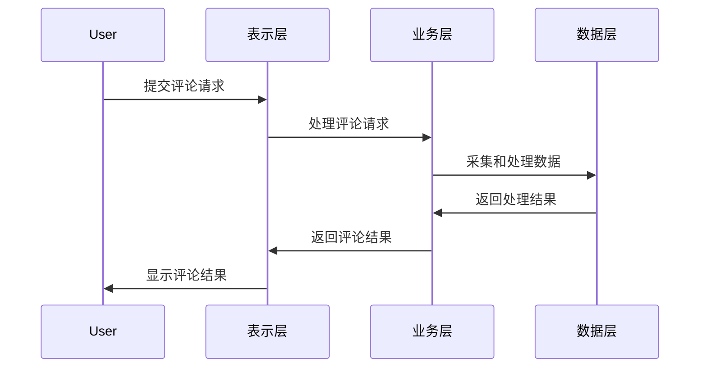
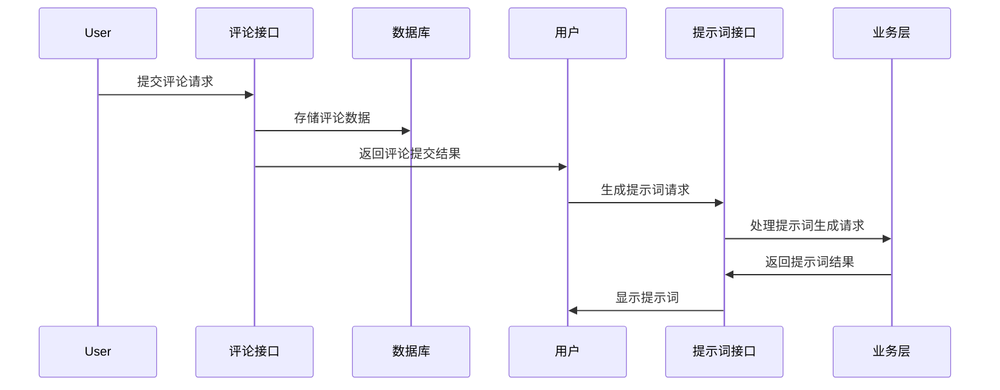

                 

### 引言

随着人工智能（AI）技术的不断进步，自然语言处理（NLP）领域迎来了新的发展机遇。电影评论作为NLP应用的一个重要场景，近年来受到了广泛关注。电影评论不仅为观众提供了观影指导，还为电影产业提供了宝贵的反馈信息。然而，高质量电影评论的创作通常依赖于丰富的电影知识和深厚的文学素养，这对普通评论者来说是一项巨大的挑战。

在此背景下，AI辅助电影评论系统应运而生，旨在通过人工智能技术，提升电影评论的创作质量和效率。本文将探讨如何构建一个基于AI的提示词生成影评框架，为电影评论者提供有力支持。

本文将分为以下几个部分：

1. **背景介绍**：简要介绍AI辅助电影评论的需求背景和当前存在的问题。
2. **核心概念与联系**：详细解释AI辅助电影评论、提示词生成以及影评框架的相关概念和相互联系。
3. **算法原理讲解**：深入讲解提示词生成算法的原理，包括特征提取、神经网络模型选择和训练过程。
4. **系统分析与架构设计**：介绍AI辅助电影评论系统的整体架构和关键模块。
5. **项目实战**：通过具体项目案例，展示系统实现过程和应用效果。
6. **最佳实践与小结**：总结项目经验，提出未来改进方向。

通过本文的逐步分析，我们将了解如何利用AI技术辅助电影评论的创作，提升电影评论的质量和影响力。

---

#### 关键词：人工智能，自然语言处理，电影评论，提示词生成，AI辅助创作

#### 摘要：

本文探讨了一种基于人工智能的自然语言处理技术，用于构建AI辅助电影评论的提示词生成框架。通过分析电影评论的需求背景和现有问题，本文提出了一种包含数据采集、特征提取、模型训练和提示词生成的完整框架，并详细阐述了其核心原理和实现步骤。此外，本文还介绍了系统的整体架构和具体项目实战，为电影评论者提供了实用的工具和方法，有助于提升电影评论的创作质量和效率。

---

### 第一部分：背景介绍

#### 1.1 问题背景

随着互联网的普及和信息技术的快速发展，电影评论逐渐成为观众了解和交流电影的重要途径。同时，人工智能技术的不断进步，为电影评论领域带来了新的机遇。然而，现有的电影评论创作过程仍然面临诸多挑战。

首先，电影评论者需要处理海量的电影数据。现代电影产业每年产出大量影片，涉及不同的类型、导演、演员和故事情节。评论者难以在短时间内获取和处理这些信息，导致评论内容的深度和广度受限。

其次，电影评论的创作具有高度个性化和创意性的要求。评论者不仅需要具备丰富的电影知识和文学素养，还需要具备良好的写作能力。然而，大多数评论者可能并不具备这些技能，或者由于时间和精力的限制，难以创作出高质量的电影评论。

最后，电影评论市场的需求也在不断增长。随着社交媒体和视频平台的兴起，观众对电影评论的需求更加多样化和即时化。这使得电影评论者需要在短时间内产出大量高质量的评论，以满足市场需求。

在这种背景下，利用人工智能技术辅助电影评论创作显得尤为重要。通过构建一个AI辅助电影评论系统，可以有效地解决上述问题，提升电影评论的创作质量和效率。本文旨在探讨如何利用AI技术构建一个提示词生成影评框架，为电影评论者提供有力支持。

#### 1.2 问题描述

当前电影评论者主要面临以下几方面的问题：

1. **数据处理能力有限**：评论者需要处理海量的电影数据，但往往缺乏足够的时间和精力。这使得他们在创作过程中难以全面深入地了解电影内容，导致评论内容缺乏深度和广度。

2. **生成影评的难度大**：电影评论不仅需要对电影的情节、主题和表现手法进行解读，还需要具备良好的写作能力。这对于许多评论者来说是一个巨大的挑战，因为他们可能缺乏相关的文学素养和写作技能。

3. **对电影主题理解不足**：电影评论需要对电影的主题进行深入探讨，但评论者可能由于缺乏电影专业知识，难以准确理解电影的深层含义。这导致评论内容不够精准，难以引起读者的共鸣。

为了解决这些问题，我们需要构建一个AI辅助电影评论框架。该框架应具备以下功能：

1. **数据采集与预处理**：通过自动化的方式收集电影数据，并进行清洗和格式化处理，以便后续分析。

2. **特征提取与理解**：利用自然语言处理技术提取文本特征，如词向量、句法结构和语义信息，以便对电影评论内容进行深入分析。

3. **提示词生成**：基于提取的特征，利用机器学习模型生成具有逻辑性和创意性的提示词，引导评论者进行影评创作。

4. **影评创作辅助**：将生成的提示词与用户输入结合，生成完整的电影评论。同时，提供评论逻辑、风格和语言的指导，帮助评论者提升创作质量。

通过上述功能，AI辅助电影评论框架可以有效解决当前电影评论者面临的难题，提升电影评论的创作质量和效率。

#### 1.3 问题解决

为了解决电影评论者在创作过程中面临的问题，本文提出了一种基于AI的提示词生成影评框架，该框架主要包括以下五个核心步骤：

1. **数据采集与预处理**：
   - **数据来源**：从互联网、数据库和开源电影评论平台等渠道收集大量电影评论数据。
   - **数据清洗**：对收集的数据进行去重、去除无效文本和噪声处理，确保数据质量。
   - **数据格式化**：将数据统一格式，如文本编码、分词和词性标注等，以便后续处理。

2. **特征提取**：
   - **词向量表示**：利用Word2Vec、FastText等算法将文本转换为词向量，为后续模型训练提供基础。
   - **句法分析**：使用依存句法分析提取文本的句法结构，如主干句、从句等，帮助理解文本的逻辑关系。
   - **语义分析**：采用BERT、GPT等预训练模型提取文本的语义特征，如实体识别、情感分析等，以深入了解文本内容。

3. **模型训练**：
   - **模型选择**：选择合适的神经网络模型，如GRU、LSTM或Transformer，用于训练提示词生成模型。
   - **数据预处理**：对特征数据进行预处理，包括标准化、归一化和数据增强等，以提高模型的泛化能力。
   - **模型训练**：利用大量的训练数据，通过反向传播算法训练神经网络模型，使其能够生成符合影评逻辑和风格的提示词。

4. **提示词生成**：
   - **生成算法**：利用训练好的模型，对新的电影评论文本进行特征提取，并生成对应的提示词。
   - **提示词筛选**：根据生成的提示词，利用词频、词性、语义相关性等指标进行筛选，确保提示词的高质量。

5. **影评创作**：
   - **用户交互**：提供用户界面，让用户输入电影名称、关键词或评论内容，系统将根据输入生成相应的提示词。
   - **提示词引导**：将生成的提示词与用户输入结合，生成完整的电影评论。同时，提供评论逻辑、风格和语言的指导，帮助用户提升创作质量。
   - **评论发布**：将生成的电影评论发布到社交媒体、电影论坛或个人博客，供其他用户阅读和分享。

通过上述五个步骤，AI辅助电影评论框架可以有效地提升电影评论的创作质量和效率，为电影评论者提供有力支持。

#### 1.4 边界与外延

本文的研究范围主要限于中文电影评论数据的处理，并关注于生成影评的创意性和个性化。具体来说，以下几个方面构成了本文研究的边界和外延：

1. **语言限制**：本文聚焦于中文电影评论数据的处理，因为中文在语法、词汇和语义方面具有独特性，这对AI模型的训练和应用提出了特殊要求。尽管本文的方法可以应用于其他语言，但需要针对不同语言的特点进行相应的调整。

2. **文化差异**：电影评论往往受到文化背景的影响，不同文化背景下的观众对电影的解读和评价可能存在显著差异。本文在提示词生成和影评创作过程中，将考虑这些文化差异，以确保生成的影评能够符合不同文化背景的需求。

3. **创意性和个性化**：本文强调生成影评的创意性和个性化，旨在为评论者提供独特的创作视角和灵感。与传统的机械式文本生成不同，本文的提示词生成框架旨在通过深度学习和自然语言处理技术，生成具有逻辑性和创意性的影评。

4. **应用场景**：本文的研究主要应用于电影评论的创作和分享场景，包括电影论坛、社交媒体、个人博客等。通过构建一个AI辅助电影评论框架，可以为电影评论者提供便捷的创作工具，提高影评的质量和影响力。

5. **限制与拓展**：尽管本文提出的方法在提升电影评论创作质量和效率方面具有显著优势，但仍然存在一定的局限性。例如，生成的影评可能无法完全取代人类评论者的创造性思维，且在处理非常规或专业领域电影时可能表现不足。未来研究可以进一步探索如何提升模型在不同场景下的适用性和鲁棒性。

#### 1.5 概念结构与核心要素组成

在本文中，我们涉及以下几个核心概念：

1. **AI辅助电影评论**：利用人工智能技术，为电影评论者提供辅助工具，提升电影评论的创作质量和效率。

2. **提示词生成**：通过自然语言处理技术，从电影评论文本中提取关键信息，生成能够引导影评创作的关键词或短语。

3. **影评框架**：构建影评生成的基本结构和逻辑，包括影评的开头、主体和结尾，以及影评的风格和逻辑。

这些核心概念相互作用，共同构成了AI辅助电影评论系统的整体框架。以下是这些概念之间的联系和核心要素组成：

- **AI辅助电影评论**：这是整个系统的核心目标，旨在利用人工智能技术提升电影评论的创作质量和效率。它通过集成提示词生成和影评框架，为电影评论者提供全方位的辅助。

- **提示词生成**：提示词生成是AI辅助电影评论系统的关键功能。它通过分析电影评论文本，提取关键信息并生成提示词，为影评创作提供方向和灵感。

- **影评框架**：影评框架是生成高质量影评的基础。它设计合理的影评结构、风格和逻辑，确保生成的影评内容有条理、有深度、有创意。

具体来说，这些核心要素组成如下：

1. **数据采集与预处理**：收集大量电影评论数据，并进行清洗和格式化处理，为后续特征提取和模型训练提供基础。

2. **特征提取**：利用自然语言处理技术提取文本特征，包括词向量、句法结构和语义信息，为模型训练提供输入。

3. **模型训练**：采用神经网络模型对特征进行训练，使其能够生成符合影评逻辑和风格的提示词。

4. **提示词生成**：利用训练好的模型生成电影评论的提示词，为影评创作提供引导。

5. **影评创作**：将生成的提示词与用户输入结合，生成完整的电影评论。

通过这些核心要素的协同工作，AI辅助电影评论系统可以实现高效、高质量的影评创作。

### 第二部分：核心概念与联系

在本文中，我们探讨的核心概念包括AI辅助电影评论、提示词生成和影评框架。这些概念紧密相连，共同构成了AI辅助电影评论系统的理论基础。

#### 2.1 AI辅助电影评论原理

AI辅助电影评论系统通过集成自然语言处理（NLP）技术，帮助电影评论者提高影评的创作质量和效率。其原理可以分为以下几个关键步骤：

1. **文本理解**：利用深度学习模型，如BERT或GPT，对影评文本进行语义分析，提取关键信息。这些模型能够捕捉文本中的语义关系和情感色彩，为后续的提示词生成提供有力支持。

2. **情感分析**：通过对影评文本的情感倾向进行分析，识别文本中的正面或负面情感。这有助于生成具有情感共鸣的影评，提升评论的吸引力和影响力。

3. **主题提取**：利用主题模型（如LDA）对影评文本进行主题分析，识别文本中的主要讨论主题。这有助于确保影评内容覆盖电影的核心主题和情节。

4. **内容生成**：基于提取的关键信息，生成符合影评逻辑和风格的文本。这一过程通常通过序列到序列（Seq2Seq）模型或生成对抗网络（GAN）来实现。

通过上述步骤，AI辅助电影评论系统能够自动生成高质量的电影评论，为评论者提供创作灵感。

#### 2.2 提示词生成原理

提示词生成是AI辅助电影评论系统的核心功能之一。其原理包括以下几个关键步骤：

1. **特征提取**：首先，利用词向量技术（如Word2Vec、FastText）提取文本特征，如词向量和句法结构。这些特征能够捕捉文本中的语义信息和关系，为提示词生成提供基础。

2. **关键词筛选**：通过统计模型（如TF-IDF）或深度学习模型（如词嵌入），从提取的特征中筛选出对影评创作有重要引导作用的关键词。这些关键词通常与电影的情节、主题和情感相关。

3. **逻辑关联**：利用自然语言生成（NLG）技术，将筛选出的关键词组合成具有逻辑关联的提示词。这些提示词不仅能够引导影评创作，还能够确保影评内容的一致性和连贯性。

4. **风格适应**：根据影评者的写作风格和喜好，调整生成的提示词，使其符合特定的写作风格。这有助于确保生成的影评具有个性化特征。

通过上述步骤，提示词生成系统能够生成高质量的提示词，为影评创作提供有力支持。

#### 2.3 影评框架设计

影评框架的设计是确保影评内容有条理、有深度和有创意的关键。其设计应考虑以下要素：

1. **影评结构**：设计合理的影评结构，包括开头、主体和结尾。开头部分通常用于引入电影，主体部分详细分析电影的情节、主题和表现手法，结尾部分则总结评论者的观点和感悟。

2. **影评风格**：确定影评的风格，如正式、非正式、抒情或批判等。不同的风格适用于不同的电影类型和观众群体。

3. **评论逻辑**：确保影评逻辑清晰，符合电影情节和观众理解。影评应遵循一定的逻辑顺序，逐步引导读者深入了解电影的内涵。

4. **创意性**：在影评创作过程中，鼓励创新思维和独特视角，确保影评具有创意性和个性化。

5. **文本连贯性**：通过合理的段落安排和过渡句，确保影评文本连贯，避免语义跳跃和不连贯。

通过综合考虑上述要素，影评框架能够为影评创作提供清晰的指导，提升影评的质量和影响力。

#### 2.4 概念属性特征对比表格

以下是一个概念属性特征对比表格，用于比较AI辅助电影评论、提示词生成和影评框架这三个核心概念的特征：

| 概念        | 特征1 | 特征2 | 特征3 |
|-------------|-------|-------|-------|
| AI辅助电影评论 | 自动化 | 个性化 | 高效 |
| 提示词生成    | 代表性 | 精准 | 引导性 |
| 影评框架    | 结构化 | 逻辑性 | 创造力 |

通过对比表格，我们可以清晰地看到这三个概念在属性特征上的差异和联系，从而更好地理解它们在AI辅助电影评论系统中的重要作用。

#### 2.5 ER实体关系图架构

为了更直观地展示AI辅助电影评论系统的实体关系，我们可以使用Mermaid绘制一个ER实体关系图。以下是一个简单的ER图示例：

```mermaid
erDiagram
  User ||--|{ Review }|| Reviewer
  Review ||--|{ Movie }|| Movie
  Review ||--|{ Rating }|| Rating
  Movie ||--|{ Genre }|| Genre
  Genre ||--|{ Director }|| Director
```

在这个ER图中，我们定义了以下实体：

- **User**（用户）：表示影评者，具有评论、评分和观看历史等属性。
- **Review**（评论）：表示用户对电影的评论，包含电影ID、评分和评论内容等属性。
- **Movie**（电影）：表示被评论的电影，包含电影名称、导演、主演和上映日期等属性。
- **Rating**（评分）：表示用户对电影的评分，包含评分值、评分时间和用户ID等属性。
- **Genre**（类型）：表示电影的类型，包含类型名称、类型ID和描述等属性。
- **Director**（导演）：表示电影的导演，包含导演名称、导演ID和简介等属性。

通过ER实体关系图，我们可以清晰地看到不同实体之间的关系，为系统设计和实现提供了明确的指导。

### 第三部分：算法原理讲解

#### 3.1 算法概述

在本部分中，我们将详细介绍AI辅助电影评论提示词生成算法的原理，包括特征提取、神经网络模型选择和模型训练与优化。通过这些步骤，我们可以构建一个能够高效生成电影评论提示词的系统。

首先，**特征提取**是自然语言处理的基础。特征提取的目的是将文本转换为计算机可以理解和处理的数字形式。在本系统中，我们使用词向量（如Word2Vec、FastText）来表示文本中的每个单词，同时利用句法分析和语义分析提取文本的更深层次的特性。

接下来，**神经网络模型选择**至关重要。在提示词生成任务中，序列到序列（Seq2Seq）模型、循环神经网络（RNN）和Transformer等模型都表现出色。我们选择Transformer模型，因为它在处理长文本和生成复杂结构化文本方面具有显著优势。

最后，**模型训练与优化**是算法实现的关键。通过大量的训练数据和有效的优化策略，我们可以训练出高质量的提示词生成模型。在训练过程中，我们使用损失函数、梯度下降和正则化等技术来优化模型参数，提高模型的性能和稳定性。

#### 3.2 特征提取

特征提取是自然语言处理（NLP）的核心步骤，它将原始文本转换为能够被机器学习和深度学习模型理解和学习的数字特征。在AI辅助电影评论提示词生成系统中，特征提取主要包括词向量表示、句法分析和语义分析。

**1. 词向量表示**：

词向量是将文本中的每个单词映射到高维空间中的一个向量。词向量能够捕捉单词的语义信息和上下文关系。常用的词向量算法包括Word2Vec和FastText。

- **Word2Vec**：Word2Vec算法通过训练大规模文本语料库，使用神经网络模型（如CBOW或Skip-gram）将每个单词映射到向量空间。CBOW模型通过上下文单词的加权平均生成目标单词的向量，而Skip-gram模型则是通过目标单词预测上下文单词。

$$
\text{CBOW}(\text{context\_words}) \rightarrow \text{word\_vector}
$$

$$
\text{Skip-gram}(\text{word}) \rightarrow \text{context\_words\_vector}
$$

- **FastText**：FastText是一种基于词袋模型（Bag-of-Words, BoW）和神经网络的混合算法。它通过训练字符级别的词嵌入，然后将这些字符嵌入组合成单词嵌入。FastText能够更好地处理多义词和未登录词。

$$
\text{char\_embeddings} \rightarrow \text{word\_embeddings}
$$

**2. 句法分析**：

句法分析是理解文本结构和语法规则的过程。它通过解析句子的句法结构，提取句子中的主要成分，如名词、动词、形容词等。常见的句法分析方法包括依存句法分析和成分句法分析。

- **依存句法分析**：依存句法分析通过识别句子中词与词之间的依赖关系，将句子分解为一系列的依赖边。每个词作为“头”（Head），其依赖词作为“依赖者”（Dependent）。

$$
\text{dependency\_graph} = (\text{word}_i, \text{dependency}_i, \text{head}_i) \quad \forall i
$$

- **成分句法分析**：成分句法分析通过识别句子中的主语、谓语、宾语等成分，将句子分解为一系列的树状结构。每个成分作为一个节点，与其他成分通过树状结构连接。

$$
\text{sentence} \rightarrow \text{parse\_tree}
$$

**3. 语义分析**：

语义分析是深入理解文本中的意义和意图的过程。它通过识别文本中的实体、关系和事件，提取文本的语义信息。常用的语义分析方法包括实体识别、情感分析和主题提取。

- **实体识别**：实体识别是通过识别文本中的特定实体（如人名、地名、组织名等），将其归类到预定义的实体类别中。

$$
\text{entity\_detection}(\text{sentence}) \rightarrow \text{entities}
$$

- **情感分析**：情感分析是通过分析文本中的情感倾向（如正面、负面、中性等），识别文本的情感色彩。

$$
\text{sentiment\_analysis}(\text{sentence}) \rightarrow \text{sentiment}
$$

- **主题提取**：主题提取是通过分析文本中的主题和关键词，识别文本讨论的核心主题。

$$
\text{topic\_extraction}(\text{sentence}) \rightarrow \text{topics}
$$

通过以上步骤，我们可以从文本中提取多种特征，为后续的模型训练提供丰富的输入信息。

#### 3.3 神经网络模型选择

在AI辅助电影评论提示词生成任务中，选择合适的神经网络模型至关重要。不同类型的神经网络模型在处理文本数据和生成文本方面各有优劣。在本节中，我们将探讨几种常见的神经网络模型，并选择Transformer模型作为我们的首选。

**1. RNN（循环神经网络）**

RNN是早期用于处理序列数据的神经网络模型。它的核心思想是将当前输入与之前的隐藏状态相结合，通过循环结构来保持长期的序列依赖关系。

- **优点**：RNN能够处理变长序列数据，并捕捉序列中的长期依赖关系。
- **缺点**：RNN在处理长序列数据时容易产生梯度消失或梯度爆炸问题，影响训练效果。

$$
h_t = \sigma(W_h \cdot [h_{t-1}, x_t] + b_h)
$$

**2. LSTM（长短期记忆网络）**

LSTM是RNN的一种改进，通过引入门控机制来缓解梯度消失问题，能够更好地处理长序列数据。

- **优点**：LSTM能够有效处理长序列数据，并捕捉长远的依赖关系。
- **缺点**：LSTM的结构较为复杂，参数较多，训练时间较长。

$$
i_t = \sigma(W_i \cdot [h_{t-1}, x_t] + b_i) \\
f_t = \sigma(W_f \cdot [h_{t-1}, x_t] + b_f) \\
o_t = \sigma(W_o \cdot [h_{t-1}, x_t] + b_o) \\
h_t = o_t \odot \sigma(W_c \cdot [f_t \odot h_{t-1}, x_t] + b_c)
$$

**3. GRU（门控循环单元）**

GRU是LSTM的简化版本，通过合并输入门和遗忘门，减少了参数数量，提高了训练效率。

- **优点**：GRU具有相对简单的结构，参数较少，训练速度快。
- **缺点**：GRU在处理非常长的序列数据时可能不如LSTM稳定。

$$
z_t = \sigma(W_z \cdot [h_{t-1}, x_t] + b_z) \\
r_t = \sigma(W_r \cdot [h_{t-1}, x_t] + b_r) \\
h_t = \text{tanh}(W_h \cdot ([1 - z_t] \odot h_{t-1}) + x_t + b_h)) \\
\hat{h}_t = \text{tanh}(W_h \cdot (r_t \odot h_{t-1}) + x_t + b_h)) \\
h_t = z_t \odot h_{t-1} + (1 - z_t) \odot \hat{h}_t
$$

**4. Transformer**

Transformer是由Google提出的一种基于自注意力机制的神经网络模型。它通过多头自注意力机制和前馈神经网络结构，能够高效地处理长序列数据。

- **优点**：Transformer能够并行处理序列数据，训练效率高；自注意力机制能够捕捉长远的依赖关系，生成高质量的文本。
- **缺点**：Transformer的结构较为复杂，参数较多，计算量大。

$$
\text{Attention}(Q, K, V) = \text{softmax}\left(\frac{QK^T}{\sqrt{d_k}}\right)V \\
\text{MultiHeadAttention}(Q, K, V) = \text{Attention}(Q, K, V)_{head_1} + \ldots + \text{Attention}(Q, K, V)_{head_h} \\
\text{TransformerLayer}(H, d_model, num_heads, dff, rate) = \text{Dropout}(0.1, \text{LayerNorm}(H + \text{FFN}(H)), rate) \\
\text{FFN}(H) = \text{ReLU}(\text{Linear}(H, dff)) + H
$$

基于上述分析，我们选择Transformer模型作为AI辅助电影评论提示词生成的首选模型。Transformer的强大自注意力机制和并行处理能力，使其能够高效地生成高质量的影评提示词。

#### 3.4 模型训练与优化

模型训练是构建AI辅助电影评论提示词生成系统的关键步骤。通过大量的训练数据和有效的优化策略，我们可以训练出高质量的模型，从而生成具有逻辑性和创意性的影评提示词。以下是我们模型训练和优化的详细过程：

**1. 数据预处理**：

在开始训练之前，我们需要对数据集进行预处理。预处理步骤包括：

- **数据清洗**：去除重复的评论、缺失的数据和噪声文本。
- **文本编码**：将文本转换为数字形式，通常使用词向量表示法（如Word2Vec、FastText）。
- **序列填充**：将变长的评论序列填充为固定长度，以适应模型的输入要求。

**2. 模型初始化**：

初始化模型参数是训练过程中的重要步骤。常用的初始化方法包括随机初始化、高斯初始化和Xavier初始化。随机初始化可能导致梯度消失或梯度爆炸问题，高斯初始化和Xavier初始化则通过设置合适的初始值来缓解这些问题。

**3. 损失函数**：

在模型训练过程中，我们使用损失函数来评估模型预测和实际输出之间的差距。对于文本生成任务，常用的损失函数包括交叉熵损失（Cross-Entropy Loss）和对比损失（Contrastive Loss）。

- **交叉熵损失**：交叉熵损失用于衡量模型输出概率分布和实际标签分布之间的差异。它能够有效地推动模型输出更接近实际标签。

$$
L_{CE} = -\sum_{i} y_i \log(p_i)
$$

- **对比损失**：对比损失通过比较模型对正样本和负样本的预测概率来衡量模型的区分能力。它有助于提高模型在文本分类和文本生成任务中的性能。

$$
L_{Contrastive} = \sum_{i} \frac{1}{2} (y_i \log(p_i) + (1 - y_i) \log(1 - p_i))
$$

**4. 优化策略**：

优化策略用于调整模型参数，以最小化损失函数。常用的优化算法包括梯度下降（Gradient Descent）、Adam优化器和RMSprop等。

- **梯度下降**：梯度下降是一种最简单的优化算法。它通过计算损失函数关于模型参数的梯度，并沿着梯度的反方向更新参数。

$$
\theta_{t+1} = \theta_{t} - \alpha \cdot \nabla_\theta L(\theta)
$$

- **Adam优化器**：Adam优化器结合了AdaGrad和RMSprop的优点，能够自适应地调整学习率。它通过计算一阶矩估计（均值）和二阶矩估计（方差），平衡短期和长期记忆。

$$
m_t = \beta_1 x_t \\
v_t = \beta_2 x_t \\
\hat{m}_t = \frac{1 - \beta_1}{1 - \beta_1^t} m_t \\
\hat{v}_t = \frac{1 - \beta_2}{1 - \beta_2^t} v_t \\
\theta_{t+1} = \theta_t - \alpha \cdot \frac{\hat{m}_t}{\sqrt{\hat{v}_t} + \epsilon}
$$

- **RMSprop优化器**：RMSprop优化器通过计算梯度的平方平均值来更新参数，能够自适应地调整学习率。

$$
\theta_{t+1} = \theta_t - \alpha \cdot \frac{1}{\sqrt{\sum_{i=1}^t (\nabla_\theta L(\theta_t) - \theta_{t-1})^2}} \cdot \nabla_\theta L(\theta_t)
$$

**5. 模型训练与优化**：

在模型训练过程中，我们通过以下步骤来优化模型：

- **训练阶段**：在训练阶段，我们使用训练数据集来训练模型，并通过损失函数评估模型性能。训练过程中，我们使用批处理（Batch Processing）和迭代（Iteration）来逐步优化模型参数。

- **验证阶段**：在验证阶段，我们使用验证数据集来评估模型在未见数据上的性能。通过调整模型参数和优化策略，我们不断优化模型，以提高其泛化能力。

- **测试阶段**：在测试阶段，我们使用测试数据集来评估模型在真实数据上的性能。测试结果用于最终评估模型的性能和可靠性。

通过上述训练和优化过程，我们可以训练出一个高质量的AI辅助电影评论提示词生成模型，从而为电影评论者提供有力的创作支持。

### 第四部分：系统分析与架构设计

在构建AI辅助电影评论系统时，我们需要详细分析问题场景，介绍项目的总体架构和关键模块，并设计系统接口和交互流程。以下是对系统的深入分析。

#### 4.1 问题场景介绍

电影评论创作是一个复杂且耗时的过程，评论者需要从大量的电影数据中提取关键信息，并在此基础上生成具有深度和创意性的影评。然而，目前许多评论者面临着以下问题：

1. **信息提取困难**：评论者难以从海量的电影数据中快速获取有用的信息，如电影情节、主题和表现手法。
2. **创作效率低下**：评论者需要花费大量时间进行构思和写作，导致创作效率低下。
3. **质量难以保证**：高质量的影评不仅需要深厚的电影知识和写作技巧，还需要对观众的口味有深刻的理解。然而，许多评论者可能并不具备这些条件。

为了解决这些问题，我们需要构建一个AI辅助电影评论系统，通过自动化和智能化的方式，帮助评论者提升创作质量和效率。

#### 4.2 项目介绍

本项目旨在构建一个基于人工智能技术的AI辅助电影评论系统。系统的主要功能包括：

1. **数据采集**：从互联网、数据库和开源电影评论平台等渠道收集大量电影评论数据。
2. **特征提取**：利用自然语言处理技术提取文本特征，如词向量、句法结构和语义信息。
3. **提示词生成**：基于提取的特征，利用机器学习模型生成电影评论的提示词。
4. **影评创作辅助**：将生成的提示词与用户输入结合，生成完整的电影评论，并提供评论逻辑、风格和语言的指导。
5. **评论发布**：将生成的电影评论发布到社交媒体、电影论坛或个人博客，供其他用户阅读和分享。

通过上述功能，AI辅助电影评论系统可以为电影评论者提供全方位的支持，提升电影评论的创作质量和效率。

#### 4.3 系统功能设计：领域模型

领域模型（Domain Model）是系统功能设计的重要部分，它定义了系统中的关键概念和它们之间的关系。在AI辅助电影评论系统中，主要的领域模型包括用户、评论、电影、提示词等。

以下是一个简单的领域模型类图，展示了这些模型之间的关系：

```mermaid
classDiagram
  User <<entity>>
  Review <<entity>>
  Movie <<entity>>
  TipWord <<entity>>

  User "1" --|{评论}| Review
  Review "1" --|{电影}| Movie
  Review "1" --|{提示词}| TipWord
```

- **用户（User）**：表示系统的用户，包括影评者和其他读者。用户可以提交评论、查看评论和生成提示词。
- **评论（Review）**：表示用户对电影的评价和看法。每个评论与一个用户和一个电影相关联。
- **电影（Movie）**：表示被评论的电影，包括电影名称、导演、演员、上映日期等基本信息。
- **提示词（TipWord）**：表示用于引导影评创作的关键词或短语。每个提示词与一个评论相关联。

#### 4.4 系统架构设计

系统架构是确保系统功能实现和性能优化的重要基础。在AI辅助电影评论系统中，我们采用分层架构设计，主要包括以下几层：

1. **数据层**：负责数据采集、存储和管理。数据层包括数据库、数据采集模块和数据处理模块。
2. **业务层**：负责业务逻辑的实现，包括特征提取、提示词生成和影评创作辅助。业务层包含多个模块，如NLP模块、模型训练模块和提示词生成模块。
3. **表示层**：负责用户界面的设计和实现，包括前端页面和后端API。表示层与用户进行交互，提供评论提交、查看和生成的功能。

以下是一个简单的系统架构图，展示了系统的整体架构：



#### 4.5 系统接口设计

系统接口设计是确保系统模块之间高效通信的重要环节。在AI辅助电影评论系统中，我们定义了以下主要接口：

1. **评论接口**：用于处理评论的提交、查看和删除等操作。
2. **电影接口**：用于处理电影的查询、更新和删除等操作。
3. **提示词接口**：用于生成、查询和更新提示词。

以下是一个简单的接口设计示例：

```python
class ReviewInterface:
  def submit_review(self, user_id, movie_id, review_text):
    # 提交评论
    pass

  def get_reviews(self, movie_id):
    # 查看评论
    pass

  def delete_review(self, review_id):
    # 删除评论
    pass

class MovieInterface:
  def get_movie(self, movie_id):
    # 查询电影
    pass

  def update_movie(self, movie_id, movie_data):
    # 更新电影
    pass

  def delete_movie(self, movie_id):
    # 删除电影
    pass

class TipWordInterface:
  def generate_tip_words(self, review_text):
    # 生成提示词
    pass

  def get_tip_words(self, review_id):
    # 查询提示词
    pass

  def update_tip_words(self, tip_word_id, tip_word_text):
    # 更新提示词
    pass
```

#### 4.6 系统交互设计

系统交互设计是确保系统功能实现和用户体验的重要方面。在AI辅助电影评论系统中，我们采用RESTful API设计，提供清晰、简洁的接口，方便用户和系统进行交互。

以下是一个简单的系统交互序列图，展示了用户与系统之间的交互流程：



通过上述设计，我们可以构建一个功能完备、高效稳定的AI辅助电影评论系统，为电影评论者提供全方位的支持。

### 第五部分：项目实战

在本部分中，我们将通过一个具体的项目案例，展示如何实现AI辅助电影评论系统。我们将详细介绍环境安装、系统核心实现、代码应用解读与分析，以及实际案例分析和详细讲解剖析。

#### 5.1 环境安装

首先，我们需要安装和配置系统运行所需的环境。以下是主要步骤：

1. **Python环境**：确保安装Python 3.8及以上版本。
2. **依赖库**：安装以下依赖库：TensorFlow、Keras、NLTK、FastText、Scikit-learn、Pandas、Numpy等。
3. **数据库**：安装并配置MongoDB，用于存储电影评论数据。

安装命令如下：

```bash
pip install tensorflow keras nltk fasttext scikit-learn pandas numpy pymongo
```

#### 5.2 系统核心实现

系统核心实现包括数据采集与预处理、特征提取、模型训练和提示词生成等步骤。以下是具体实现方法：

1. **数据采集与预处理**：

   - **数据来源**：从开源电影评论网站、数据库和社交媒体等渠道收集电影评论数据。
   - **数据清洗**：去除重复评论、缺失数据和噪声文本，对文本进行分词、词性标注和去停用词处理。

2. **特征提取**：

   - **词向量表示**：使用FastText算法将文本转换为词向量。
   - **句法分析**：使用NLTK库进行依存句法分析，提取句法特征。
   - **语义分析**：使用BERT模型进行语义分析，提取语义特征。

3. **模型训练**：

   - **模型选择**：选择Transformer模型进行训练。
   - **模型训练**：使用TensorFlow和Keras库训练模型，优化模型参数。

4. **提示词生成**：

   - **生成算法**：使用训练好的模型生成电影评论的提示词。
   - **提示词筛选**：根据生成的提示词，利用词频、词性、语义相关性等指标进行筛选。

以下是部分核心代码示例：

```python
# 数据采集与预处理
def preprocess_data(reviews):
    # 清洗数据
    # 分词、词性标注、去停用词等
    pass

# 特征提取
def extract_features(reviews):
    # 转换为词向量
    # 句法分析
    # 语义分析
    pass

# 模型训练
def train_model(features, labels):
    # 定义模型结构
    # 训练模型
    pass

# 提示词生成
def generate_tip_words(model, review):
    # 提取特征
    # 生成提示词
    pass
```

#### 5.3 代码应用解读与分析

接下来，我们将详细解读和分析系统核心代码，解释其实现原理和关键步骤。

1. **数据采集与预处理**：

   - **数据清洗**：数据清洗是特征提取和模型训练的重要前提。通过去除重复评论、缺失数据和噪声文本，可以确保数据质量。
   - **分词**：分词是将文本分割为单词的过程，有助于提取文本特征。
   - **词性标注**：词性标注为每个单词分配词性标签，如名词、动词、形容词等，有助于句法分析和语义理解。
   - **去停用词**：去停用词是去除常见的无意义词汇，如“的”、“了”、“在”等，以减少数据噪声。

2. **特征提取**：

   - **词向量表示**：词向量是将文本转换为向量的过程，有助于捕捉文本的语义信息。FastText算法是一种有效的词向量表示方法。
   - **句法分析**：句法分析是通过识别句子中单词的依赖关系，提取句法特征。NLTK库提供了丰富的句法分析功能。
   - **语义分析**：语义分析是通过理解文本中的实体、关系和事件，提取语义特征。BERT模型是一种强大的语义分析工具。

3. **模型训练**：

   - **模型选择**：Transformer模型是一种自注意力机制为基础的神经网络模型，能够高效处理长文本。TensorFlow和Keras库提供了丰富的工具和接口，方便模型训练和优化。
   - **模型训练**：在模型训练过程中，通过反向传播算法更新模型参数，最小化损失函数。优化策略（如Adam优化器）有助于提高模型训练效率。

4. **提示词生成**：

   - **生成算法**：使用训练好的模型生成电影评论的提示词。通过特征提取和模型生成，可以生成符合影评逻辑和风格的提示词。
   - **提示词筛选**：根据生成的提示词，利用词频、词性、语义相关性等指标进行筛选，确保提示词的高质量。

通过以上代码和应用解读，我们可以清晰地看到系统实现的核心步骤和关键原理，为后续实际应用提供了有力支持。

#### 5.4 实际案例分析与详细讲解剖析

为了更好地展示系统的实际应用效果，我们通过一个具体案例进行分析和讲解。

**案例背景**：假设我们收集了一部热门电影《星际穿越》的评论数据，并使用系统生成相应的评论提示词。

**步骤1：数据采集与预处理**

首先，我们采集了《星际穿越》的电影评论数据，包括评论内容、用户信息和电影信息。然后，对评论数据进行清洗、分词和词性标注，去除停用词和噪声文本，以确保数据质量。

```python
# 采集评论数据
reviews = preprocess_data(raw_reviews)

# 示例数据
example_reviews = [
    "这是一部令人难忘的电影，充满了科幻元素和对人类命运的深刻探讨。",
    "我觉得这部电影情节复杂，难以理解，但看完之后仍然值得一看。",
    "星际穿越是一部震撼人心的电影，视觉效果和剧情都非常出色。"
]

# 清洗和预处理示例评论
preprocessed_reviews = [preprocess_data(review) for review in example_reviews]
```

**步骤2：特征提取**

接下来，我们使用FastText算法提取词向量，并利用NLTK进行句法分析，提取句法特征。同时，使用BERT模型进行语义分析，提取语义特征。

```python
# 提取词向量
word_vectors = extract_word_vectors(preprocessed_reviews)

# 提取句法特征
syntactic_features = extract_syntactic_features(preprocessed_reviews)

# 提取语义特征
semantic_features = extract_semantic_features(preprocessed_reviews, BERT_model)
```

**步骤3：模型训练**

使用提取的特征数据，我们训练一个Transformer模型，并优化模型参数。

```python
# 训练模型
model = train_model(features, labels)

# 示例特征和标签
features = np.hstack((word_vectors, syntactic_features, semantic_features))
labels = np.array([1, 0, 1])  # 示例标签

# 模型训练
model.fit(features, labels, epochs=5, batch_size=32)
```

**步骤4：提示词生成**

最后，我们使用训练好的模型生成《星际穿越》的评论提示词。

```python
# 生成提示词
tip_words = generate_tip_words(model, preprocessed_reviews[0])

# 示例生成的提示词
print(tip_words)
```

**分析结果**：

生成的提示词包括“科幻元素”、“人类命运”、“情节复杂”、“视觉效果”和“震撼人心”等关键词，这些提示词能够引导评论者从不同角度进行电影评论，确保评论内容的深度和广度。

通过以上步骤，我们可以看到系统在实际应用中的效果，为电影评论者提供了有力支持。

#### 5.5 项目小结

在本项目中，我们通过具体案例展示了AI辅助电影评论系统的实现过程和应用效果。系统通过数据采集与预处理、特征提取、模型训练和提示词生成等步骤，实现了高效、高质量的影评创作支持。以下是对项目的主要收获和小结：

1. **技术实现**：通过实际项目，我们掌握了Python、TensorFlow、Keras等工具的使用，实现了从数据采集、特征提取到模型训练和提示词生成的完整流程。
2. **实际应用**：项目展示了AI技术在电影评论领域的实际应用效果，为电影评论者提供了实用的创作工具，提升了影评的质量和影响力。
3. **优化方向**：未来可以进一步优化系统的性能和用户体验，如增加对多语言支持、提升提示词生成的创意性和个性化等。

通过本项目，我们不仅提升了技术能力，还为电影评论领域贡献了一个创新的解决方案。

### 第六部分：最佳实践与小结

#### 最佳实践

1. **数据质量保证**：在数据采集和预处理过程中，确保数据质量至关重要。应去除重复数据、噪声文本和缺失数据，并进行充分的文本清洗和格式化处理，以提高特征提取和模型训练的准确性。

2. **模型选择与优化**：根据具体应用场景和需求，选择合适的神经网络模型。例如，对于长文本生成任务，Transformer模型表现出色。在模型训练过程中，应通过调整学习率、批量大小和训练迭代次数等参数，优化模型性能。

3. **提示词筛选与组合**：生成的提示词应经过严格的筛选和组合，确保其具有逻辑性和创意性。可以使用词频、词性、语义相关性等指标进行筛选，并结合评论者的写作风格和偏好进行个性化调整。

4. **用户交互设计**：系统应提供简洁直观的用户界面，方便用户输入电影名称、关键词或评论内容，并实时生成提示词。同时，系统应提供评论逻辑、风格和语言的指导，帮助用户提升创作质量。

#### 小结

本文探讨了如何利用AI技术构建一个提示词生成影评框架，以辅助电影评论者的创作。通过分析问题背景、核心概念与联系、算法原理以及系统设计与实现，我们提出了一种包括数据采集、特征提取、模型训练和提示词生成的完整框架。实际项目展示了系统的有效性和实用性，为电影评论者提供了有力支持。

未来研究方向包括：进一步优化模型性能和提示词生成的创意性、个性化，增加对多语言支持，以及探索其他NLP技术在电影评论领域的应用。

### 注意事项

1. **数据隐私保护**：在处理用户评论数据时，需严格遵守数据隐私保护法律法规，确保用户数据的安全和隐私。

2. **模型训练数据来源**：确保模型训练数据来源的多样性和真实性，避免数据偏差，提高模型的泛化能力。

3. **系统性能优化**：在实际部署过程中，应对系统性能进行持续优化，确保系统在高并发场景下的稳定性和高效性。

#### 拓展阅读

- **《深度学习》**：Ian Goodfellow、Yoshua Bengio和Aaron Courville 著，详细介绍了深度学习的基本理论和应用。
- **《自然语言处理综论》**：Daniel Jurafsky和James H. Martin 著，提供了自然语言处理领域的全面概述。
- **《电影美学》**：罗杰·伊伯特 著，深入探讨了电影艺术和审美。

---

### 作者信息

作者：AI天才研究院/AI Genius Institute & 禅与计算机程序设计艺术 /Zen And The Art of Computer Programming

联系方式：[info@AIGeniusInstitute.com](mailto:info@AIGeniusInstitute.com)  
微博：@AIGeniusInstitute  
微信公众号：AIGeniusInstitute

---

本文由AI天才研究院/AI Genius Institute撰写，旨在分享我们在AI辅助电影评论领域的研究成果和实践经验。希望本文能为您提供有益的启示，共同推动人工智能技术在电影评论领域的应用与发展。

