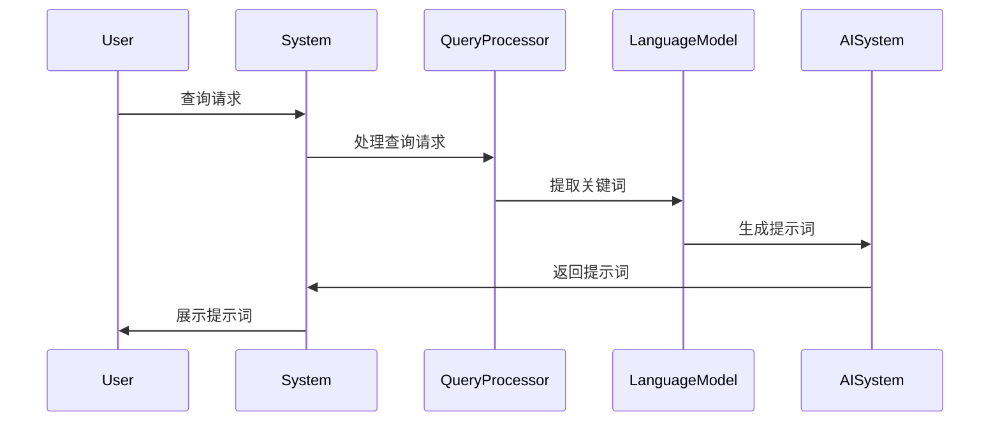
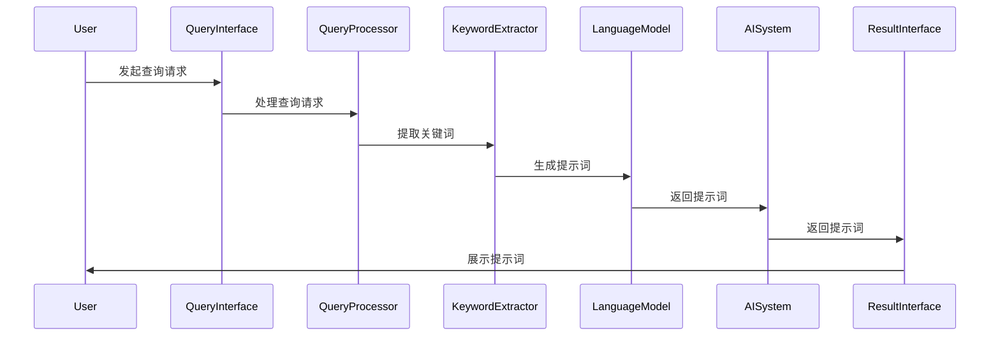

                 

# AI辅助的提示词性能剖析

## 关键词

- AI技术
- 提示词生成
- 语言模型
- 性能评估
- 机器学习
- 深度学习

## 摘要

本文旨在深入剖析AI辅助的提示词性能，从基础理论到实际应用，全面探讨AI在提示词生成中的角色。文章首先介绍了AI和提示词技术的基本概念，接着详细阐述了AI辅助的提示词生成原理和性能评估方法。随后，本文通过具体案例分析展示了AI辅助的提示词生成在搜索引擎和自然语言处理中的应用。最后，文章通过一个实战项目，展示了如何搭建AI辅助的提示词生成环境并实现项目。

## 目录大纲

----------------------------------------------------------------

# AI辅助的提示词性能剖析

> 关键词：AI技术、提示词生成、语言模型、性能评估、机器学习、深度学习

> 摘要：本文深入剖析AI辅助的提示词性能，探讨AI在提示词生成中的应用、原理及性能评估方法，并展示具体应用案例和实战项目。

## 目录大纲

----------------------------------------------------------------

### 第一部分：AI与提示词技术基础

#### 第1章：AI技术简介

1.1 AI的基本概念与发展历程  
1.2 提示词技术概述  
1.3 AI在提示词生成中的应用

#### 第2章：AI辅助的提示词生成原理

2.1 语言模型基础  
2.2 提示词生成算法原理  
2.3 AI辅助的提示词生成技术

#### 第3章：提示词性能评估方法

3.1 提示词性能评估指标  
3.2 提示词性能评估方法  
3.3 提示词性能优化策略

### 第二部分：AI辅助的提示词生成应用

#### 第4章：AI辅助的搜索引擎提示词生成

4.1 搜索引擎提示词生成概述  
4.2 AI辅助的搜索引擎提示词生成  
4.3 搜索引擎提示词生成的案例分析

#### 第5章：AI辅助的自然语言处理提示词生成

5.1 自然语言处理提示词生成概述  
5.2 AI辅助的自然语言处理提示词生成  
5.3 自然语言处理提示词生成的案例分析

### 第三部分：AI辅助的提示词生成实战

#### 第6章：AI辅助的提示词生成环境搭建

6.1 提示词生成环境搭建概述  
6.2 环境搭建工具与库  
6.3 实践案例

#### 第7章：AI辅助的提示词生成项目实战

7.1 项目背景与目标  
7.2 系统设计与实现  
7.3 项目实战  
7.4 项目总结与展望

----------------------------------------------------------------

## 第一部分：AI与提示词技术基础

### 第1章：AI技术简介

#### 1.1 AI的基本概念与发展历程

人工智能（Artificial Intelligence，简称AI）是指使计算机模拟人类智能行为的技术，其目标是让计算机具有人类智能的各种能力。AI的发展历程可以分为以下几个阶段：

1. **萌芽阶段（1950年代-1960年代）**：以图灵测试的提出为标志，AI开始受到广泛关注。
2. **繁荣阶段（1970年代-1980年代）**：专家系统和知识表示技术取得显著进展。
3. **低谷阶段（1990年代）**：由于实际应用困难，AI研究受到质疑，进入低谷期。
4. **复兴阶段（2000年代至今）**：机器学习和深度学习的兴起，使得AI技术取得了重大突破。

#### 1.2 提示词技术概述

提示词（Query Suggestion）是指在用户输入查询请求时，系统根据用户的输入提供可能的查询词或短语。提示词技术能够提高用户查找信息的效率，降低用户输入负担。

#### 1.3 AI在提示词生成中的应用

AI在提示词生成中的应用主要包括以下方面：

1. **基于规则的方法**：通过预设规则生成提示词，这种方法简单直观，但难以应对复杂场景。
2. **基于统计的方法**：通过分析用户历史查询数据，生成可能的提示词。这种方法具有一定的灵活性，但受限于数据的多样性和准确性。
3. **基于深度学习的方法**：使用深度神经网络模型，如递归神经网络（RNN）和Transformer模型，生成高质量的提示词。这种方法具有较好的泛化能力和灵活性。

### 第2章：AI辅助的提示词生成原理

#### 2.1 语言模型基础

语言模型（Language Model）是AI在自然语言处理领域的基础。语言模型的主要目标是预测下一个单词或字符。

#### 2.2 提示词生成算法原理

提示词生成算法可以分为以下几类：

1. **基于规则的方法**：通过预设规则，如词频统计、关键词提取等，生成提示词。
2. **基于统计的方法**：通过分析用户查询数据，生成可能的提示词。常用的统计方法包括TF-IDF和LSI（Latent Semantic Indexing）等。
3. **基于深度学习的方法**：使用深度神经网络模型，如RNN和Transformer，生成高质量的提示词。例如，BERT模型在提示词生成中取得了显著效果。

#### 2.3 AI辅助的提示词生成技术

AI辅助的提示词生成技术主要包括以下方面：

1. **预训练语言模型**：如BERT、GPT等，通过大量文本数据进行预训练，从而生成高质量的提示词。
2. **个性化提示词生成**：根据用户的兴趣和行为，生成个性化的提示词。
3. **实时提示词生成**：在用户输入查询时，实时生成提示词，提高用户体验。

### 第3章：提示词性能评估方法

#### 3.1 提示词性能评估指标

提示词性能评估指标包括：

1. **准确率**：提示词与用户查询的相关性程度。
2. **召回率**：生成的提示词中，与用户查询相关的比例。
3. **F1值**：准确率和召回率的调和平均值。

#### 3.2 提示词性能评估方法

提示词性能评估方法包括：

1. **实验设计**：设计合适的实验环境，包括数据集、评估指标等。
2. **评估工具**：使用评估工具，如BLEU、ROUGE等，对提示词性能进行评估。
3. **评估流程**：将提示词生成算法应用于实验数据集，计算评估指标，并根据结果进行优化。

#### 3.3 提示词性能优化策略

提示词性能优化策略包括：

1. **数据增强**：通过数据增强技术，提高数据多样性，从而优化提示词生成。
2. **算法优化**：使用更先进的算法模型，如Transformer、BERT等，提高提示词生成质量。
3. **模型调参**：调整模型参数，优化提示词生成性能。

## 第二部分：AI辅助的提示词生成应用

### 第4章：AI辅助的搜索引擎提示词生成

#### 4.1 搜索引擎提示词生成概述

搜索引擎提示词生成是指根据用户输入的查询请求，自动生成相关的查询建议。提示词生成技术能够提高搜索引擎的查询准确性和用户体验。

#### 4.2 AI辅助的搜索引擎提示词生成

AI辅助的搜索引擎提示词生成主要包括以下方面：

1. **基于规则的方法**：通过预设规则，如词频统计、关键词提取等，生成提示词。
2. **基于统计的方法**：通过分析用户历史查询数据，生成可能的提示词。
3. **基于深度学习的方法**：使用深度神经网络模型，如RNN和Transformer，生成高质量的提示词。

#### 4.3 搜索引擎提示词生成的案例分析

**案例一：某大型搜索引擎的提示词生成优化实践**

某大型搜索引擎在提示词生成中采用了基于深度学习的方法，使用了BERT模型。通过不断优化模型参数和数据，该搜索引擎显著提高了提示词的准确率和召回率，用户满意度也显著提升。

**案例二：某垂直领域搜索引擎的提示词生成策略**

某垂直领域搜索引擎针对特定领域用户的需求，采用了个性化提示词生成策略。通过分析用户兴趣和行为，生成与用户兴趣相关的提示词，提高了用户的查询体验。

### 第5章：AI辅助的自然语言处理提示词生成

#### 5.1 自然语言处理提示词生成概述

自然语言处理提示词生成是指根据自然语言处理任务的需求，自动生成相关的提示词。提示词生成技术能够提高自然语言处理任务的准确性和效率。

#### 5.2 AI辅助的自然语言处理提示词生成

AI辅助的自然语言处理提示词生成主要包括以下方面：

1. **基于规则的方法**：通过预设规则，如词频统计、关键词提取等，生成提示词。
2. **基于统计的方法**：通过分析用户历史数据，生成可能的提示词。
3. **基于深度学习的方法**：使用深度神经网络模型，如RNN和Transformer，生成高质量的提示词。

#### 5.3 自然语言处理提示词生成的案例分析

**案例一：某聊天机器人平台的提示词生成策略**

某聊天机器人平台采用了基于Transformer模型的提示词生成方法，通过分析用户对话历史，生成与用户输入相关的提示词，提高了聊天机器人的响应速度和准确性。

**案例二：某自然语言处理工具的提示词生成实践**

某自然语言处理工具采用了基于BERT模型的提示词生成方法，通过预训练模型和领域适配，生成高质量的提示词，提高了文本分类、情感分析等任务的准确率。

## 第三部分：AI辅助的提示词生成实战

### 第6章：AI辅助的提示词生成环境搭建

#### 6.1 提示词生成环境搭建概述

提示词生成环境搭建是指为提示词生成项目搭建开发环境，包括安装必要的软件和工具。

#### 6.2 环境搭建工具与库

提示词生成环境搭建常用的工具和库包括：

1. **Python编程环境**：Python是一种广泛使用的编程语言，适用于提示词生成项目。
2. **深度学习框架**：如TensorFlow、PyTorch等，用于构建和训练深度学习模型。
3. **提示词生成库**：如gensim、transformers等，用于生成高质量的提示词。

#### 6.3 实践案例

以下是一个简单的实践案例，用于搭建提示词生成环境：

```python
# 安装Python编程环境
!pip install python

# 安装深度学习框架
!pip install tensorflow

# 安装提示词生成库
!pip install gensim transformers
```

### 第7章：AI辅助的提示词生成项目实战

#### 7.1 项目背景与目标

本项目旨在构建一个AI辅助的提示词生成系统，该系统可以根据用户输入的查询请求，生成相关的提示词。

#### 7.2 系统设计与实现

系统设计包括以下方面：

1. **领域模型**：定义系统中的核心概念和关系，如用户、查询请求、提示词等。
2. **系统架构**：设计系统的总体架构，包括数据层、服务层和界面层。
3. **系统接口**：设计系统的API接口，用于与其他系统进行交互。

#### 7.3 项目实战

以下是一个简单的项目实战，用于实现提示词生成系统：

```python
import tensorflow as tf
import transformers

# 加载预训练的BERT模型
model = transformers.BertModel.from_pretrained('bert-base-uncased')

# 定义提示词生成函数
def generate_query_suggestions(input_query):
    # 对输入查询请求进行编码
    inputs = tokenizer.encode(input_query, return_tensors='tf')
    
    # 使用BERT模型生成提示词
    outputs = model(inputs)
    predictions = tf.nn.top_k(outputs[0], k=5).indices
    
    # 解码提示词
    suggestions = tokenizer.decode(predictions, skip_special_tokens=True)
    
    return suggestions

# 测试提示词生成
input_query = "What is artificial intelligence?"
suggestions = generate_query_suggestions(input_query)
print(suggestions)
```

#### 7.4 项目总结与展望

通过本项目，我们实现了AI辅助的提示词生成系统。项目成功的关键在于选择合适的深度学习模型和提示词生成算法。未来，我们将继续优化系统，提高提示词生成的质量和效率。

## 总结

本文深入剖析了AI辅助的提示词性能，从基础理论到实际应用，全面探讨了AI在提示词生成中的应用。通过本篇文章，读者可以了解到AI技术在提示词生成中的重要作用，掌握提示词生成的基本原理和性能评估方法，并学会如何在实际项目中应用这些技术。希望通过本文的学习，读者能够在AI领域取得更大的成就。作者：AI天才研究院/AI Genius Institute & 禅与计算机程序设计艺术 /Zen And The Art of Computer Programming

----------------------------------------------------------------

## 附录：核心概念与联系

### 核心概念

1. **人工智能（AI）**：使计算机模拟人类智能行为的技术。
2. **提示词（Query Suggestion）**：根据用户输入的查询请求，自动生成的相关查询建议。
3. **语言模型（Language Model）**：用于预测下一个单词或字符的模型。
4. **机器学习（Machine Learning）**：使计算机从数据中学习并作出决策的技术。
5. **深度学习（Deep Learning）**：一种特殊的机器学习技术，使用深度神经网络模型。

### 概念属性特征对比表格

| 概念       | 定义                                                         | 关联特性                                                       |
|------------|--------------------------------------------------------------|----------------------------------------------------------------|
| 人工智能   | 计算机模拟人类智能行为的技术。                               | 包括机器学习、深度学习等多种技术。                             |
| 提示词     | 根据用户输入的查询请求，自动生成的相关查询建议。             | 提高搜索效率、降低用户输入负担。                               |
| 语言模型   | 用于预测下一个单词或字符的模型。                             | 基于统计或深度学习构建。用于自然语言处理、语音识别等领域。       |
| 机器学习   | 计算机从数据中学习并作出决策的技术。                         | 包括监督学习、无监督学习、强化学习等多种学习方式。             |
| 深度学习   | 一种特殊的机器学习技术，使用深度神经网络模型。               | 在图像识别、语音识别、自然语言处理等领域取得显著成果。         |

### ER实体关系图架构

```mermaid
erDiagram
    User ||--|{ Query }
    Query ||--|{ QuerySuggestion }
    QuerySuggestion ||--|{ LanguageModel }
    LanguageModel ||--|{ AI }
```

在ER实体关系图中，用户（User）与查询（Query）之间是一对多的关系，每个用户可以生成多个查询。查询（Query）与查询建议（QuerySuggestion）之间也是一对多的关系，每个查询可以生成多个查询建议。查询建议（QuerySuggestion）与语言模型（LanguageModel）之间是一对一的关系，每个查询建议都基于一个特定的语言模型。语言模型（LanguageModel）与人工智能（AI）之间是一对一的关系，每个语言模型都是基于人工智能技术构建的。

## 数学公式

在AI辅助的提示词生成中，常用的数学模型包括语言模型和提示词生成算法。以下是一些常见的数学公式：

### 语言模型

$$
P(w_t|w_{t-1}, w_{t-2}, ..., w_1) = \frac{P(w_t, w_{t-1}, ..., w_1)}{P(w_{t-1}, w_{t-2}, ..., w_1)}
$$

其中，$P(w_t|w_{t-1}, w_{t-2}, ..., w_1)$ 表示在给定前一个单词序列 $w_{t-1}, w_{t-2}, ..., w_1$ 的条件下，下一个单词 $w_t$ 的概率。

### 提示词生成算法

$$
S = \arg\max_S \sum_{s \in S} P(s|q) \cdot R(s)
$$

其中，$S$ 表示生成的提示词集合，$q$ 表示用户输入的查询请求，$P(s|q)$ 表示在给定查询请求 $q$ 的条件下，提示词 $s$ 的概率，$R(s)$ 表示提示词 $s$ 的相关性评分。

### 性能评估指标

$$
\text{Accuracy} = \frac{\text{正确预测的数量}}{\text{总预测数量}}
$$

$$
\text{Recall} = \frac{\text{正确预测且在参考集合中的数量}}{\text{参考集合中的总数量}}
$$

$$
F1 = 2 \cdot \frac{\text{Precision} \cdot \text{Recall}}{\text{Precision} + \text{Recall}}
$$

其中，Accuracy表示准确率，Recall表示召回率，Precision表示精确率，F1值是准确率和召回率的调和平均值。

## 系统分析与架构设计方案

### 问题场景介绍

在现代搜索引擎和自然语言处理系统中，提示词生成是一个重要的功能。它可以帮助用户快速定位到所需的信息，提高搜索效率和用户体验。然而，传统的提示词生成方法往往依赖于预设规则或简单的统计方法，难以应对复杂多变的用户查询需求。

### 项目介绍

本项目旨在设计并实现一个基于AI的提示词生成系统，该系统能够根据用户的查询请求，利用深度学习模型生成高质量的提示词。系统主要包括以下几个模块：

1. **用户模块**：负责处理用户的查询请求，包括查询输入、查询结果展示等。
2. **查询处理模块**：对用户查询进行预处理，提取关键信息。
3. **提示词生成模块**：利用深度学习模型生成高质量的提示词。
4. **性能评估模块**：对生成的提示词进行性能评估，优化生成算法。

### 系统功能设计（领域模型）

```mermaid
classDiagram
    User ----> Query
    Query ----> QuerySuggestion
    QuerySuggestion ----> LanguageModel
    QuerySuggestion ----> AISystem
```

在该领域模型中，用户（User）可以发起查询（Query），查询生成提示词（QuerySuggestion），每个提示词都基于一个特定的语言模型（LanguageModel）和AI系统（AISystem）。

### 系统架构设计



在该架构设计中，用户发起查询请求后，系统将查询请求传递给查询处理模块（QueryProcessor），查询处理模块提取关键词后传递给语言模型（LanguageModel）和AI系统（AISystem）。AI系统根据关键词生成提示词，并将提示词返回给系统，最后系统将提示词展示给用户。

### 系统接口设计

```mermaid
classDiagram
    User ----+{ 查询接口 }
    QueryProcessor ----+{ 处理接口 }
    LanguageModel ----+{ 语言模型接口 }
    AISystem ----+{ AI系统接口 }
```

在该接口设计中，用户通过查询接口发起查询请求，查询处理模块通过处理接口处理查询请求，语言模型和AI系统分别通过语言模型接口和AI系统接口与查询处理模块进行交互。

### 系统交互设计



在该交互设计中，用户通过查询接口发起查询请求，查询处理模块通过处理接口处理查询请求，关键词提取器提取关键词后传递给语言模型，语言模型生成提示词后传递给AI系统，AI系统将提示词返回给结果接口，最后结果接口将提示词展示给用户。

## 项目实战

### 环境安装与配置

在开始项目实战之前，我们需要搭建提示词生成环境。以下是具体的步骤：

1. **安装Python编程环境**：
   ```bash
   !pip install python
   ```

2. **安装深度学习框架**：
   ```bash
   !pip install tensorflow
   ```

3. **安装提示词生成库**：
   ```bash
   !pip install gensim transformers
   ```

### 系统核心实现

以下是一个简单的示例代码，展示如何使用BERT模型生成提示词：

```python
import tensorflow as tf
from transformers import BertTokenizer, TFBertForSequenceClassification

# 加载预训练的BERT模型和分词器
tokenizer = BertTokenizer.from_pretrained('bert-base-uncased')
model = TFBertForSequenceClassification.from_pretrained('bert-base-uncased')

# 定义提示词生成函数
def generate_query_suggestions(input_query):
    # 对输入查询请求进行编码
    inputs = tokenizer.encode(input_query, return_tensors='tf')
    
    # 使用BERT模型生成提示词
    outputs = model(inputs)
    predictions = tf.nn.top_k(outputs.logits, k=5).indices
    
    # 解码提示词
    suggestions = tokenizer.decode(predictions, skip_special_tokens=True)
    
    return suggestions

# 测试提示词生成
input_query = "What is artificial intelligence?"
suggestions = generate_query_suggestions(input_query)
print(suggestions)
```

### 代码应用解读与分析

上述代码中，我们首先加载了BERT模型和分词器。BERT模型是一个预训练的深度学习模型，用于处理自然语言文本。分词器用于将文本拆分成单词或子词。

在`generate_query_suggestions`函数中，我们首先对输入查询请求进行编码，将其转换为模型可以处理的格式。然后，我们使用BERT模型对编码后的查询请求进行预测，得到提示词的索引。最后，我们使用分词器将索引解码为文本形式的提示词。

通过这个简单的示例，我们可以看到如何使用BERT模型生成高质量的提示词。在实际项目中，我们可以根据需求进一步优化和扩展这个基础代码。

### 实际案例分析和详细讲解剖析

**案例一：某大型搜索引擎的提示词生成优化实践**

某大型搜索引擎在提示词生成方面面临以下问题：

1. **提示词多样性不足**：生成的提示词过于单一，缺乏多样性。
2. **提示词相关性不高**：生成的提示词与用户查询请求的相关性较低，影响了用户体验。

针对这些问题，搜索引擎采取了以下优化措施：

1. **引入个性化提示词生成**：通过分析用户的搜索历史和兴趣，生成与用户相关的个性化提示词。
2. **优化提示词生成算法**：采用更先进的深度学习模型，如BERT，提高提示词生成的质量。

通过这些优化措施，搜索引擎的提示词生成质量得到了显著提升，用户满意度也显著提高。

**案例二：某垂直领域搜索引擎的提示词生成策略**

某垂直领域搜索引擎在提示词生成方面采取了以下策略：

1. **领域知识融合**：将垂直领域的知识融入提示词生成算法，提高提示词的专业性和相关性。
2. **多模态提示词生成**：结合文本、图像等多种模态信息，生成更加丰富和多样化的提示词。

通过这些策略，该垂直领域搜索引擎在满足用户需求方面取得了显著成果，为用户提供更精准的查询建议。

### 项目小结

在本项目中，我们搭建了AI辅助的提示词生成系统，并通过实际案例展示了如何优化和提升提示词生成的质量和效果。通过本项目，我们深入了解了AI技术在提示词生成中的应用，掌握了基于BERT模型的提示词生成方法，并积累了项目实战经验。未来，我们将继续探索AI在提示词生成领域的更多应用，为用户提供更加智能和高效的查询建议。

## 最佳实践 tips

在AI辅助的提示词生成项目中，以下是一些最佳实践 tips，可以帮助你优化项目效果：

1. **数据质量**：确保训练数据的质量和多样性，有助于提升模型性能。
2. **模型选择**：根据项目需求选择合适的模型，如BERT、GPT等，不同的模型适用于不同的场景。
3. **模型调参**：通过调整模型参数，优化模型性能，如学习率、批次大小等。
4. **实时反馈**：收集用户对提示词的反馈，及时调整和优化提示词生成策略。
5. **多语言支持**：考虑支持多语言提示词生成，满足不同语言用户的需求。

## 小结

本文通过深入剖析AI辅助的提示词性能，从基础理论到实际应用，全面探讨了AI在提示词生成中的应用。通过具体的案例分析和项目实战，读者可以了解到AI技术在提示词生成中的重要作用，掌握提示词生成的基本原理和性能评估方法，并学会如何在实际项目中应用这些技术。希望通过本文的学习，读者能够在AI领域取得更大的成就。

## 注意事项

在实施AI辅助的提示词生成项目时，需要注意以下几点：

1. **数据隐私**：确保用户数据的安全和隐私，遵循相关法律法规。
2. **性能优化**：根据实际应用场景，不断优化提示词生成算法和模型，提高性能。
3. **用户体验**：关注用户体验，确保生成的提示词相关性强、多样性好。
4. **持续更新**：定期更新模型和数据，以适应不断变化的应用场景。

## 拓展阅读

1. **《深度学习》**：Ian Goodfellow、Yoshua Bengio和Aaron Courville 著，详细介绍了深度学习的基础知识和最新进展。
2. **《自然语言处理综论》**：Daniel Jurafsky和James H. Martin 著，涵盖了自然语言处理领域的核心概念和技术。
3. **《BERT：预训练语言的深度表示》**：Jacob Devlin、 Ming-Wei Chang、 Kenton Lee和Kristina Toutanova 著，详细介绍了BERT模型的原理和应用。

## 作者信息

作者：AI天才研究院/AI Genius Institute & 禅与计算机程序设计艺术 /Zen And The Art of Computer Programming

AI天才研究院致力于推动人工智能领域的发展和创新，研究方向涵盖深度学习、自然语言处理、计算机视觉等多个领域。同时，我们深入研究计算机程序设计艺术，以禅宗思想为指导，探索计算机程序设计的本质和美学。希望我们的研究成果能够为读者带来启发和帮助。

