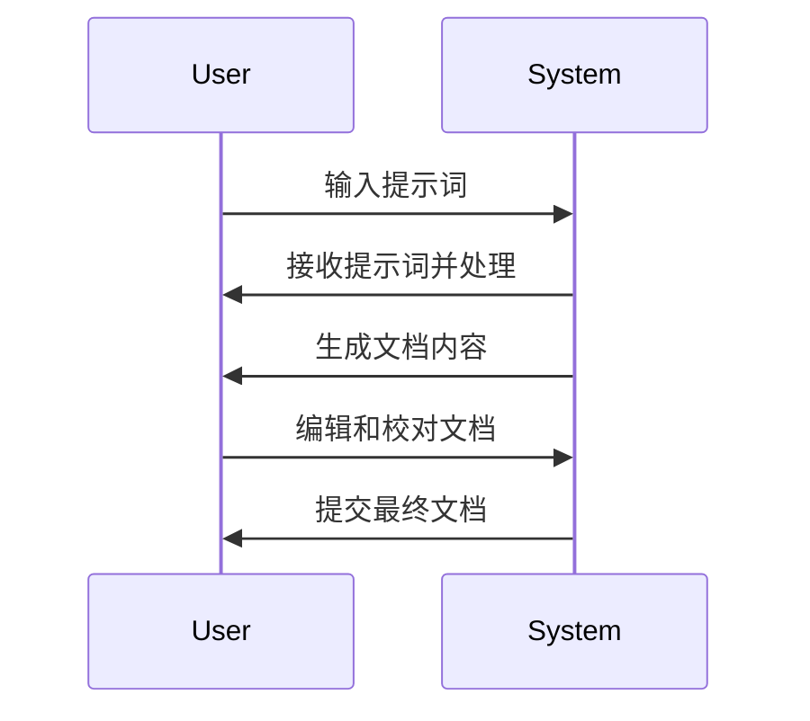
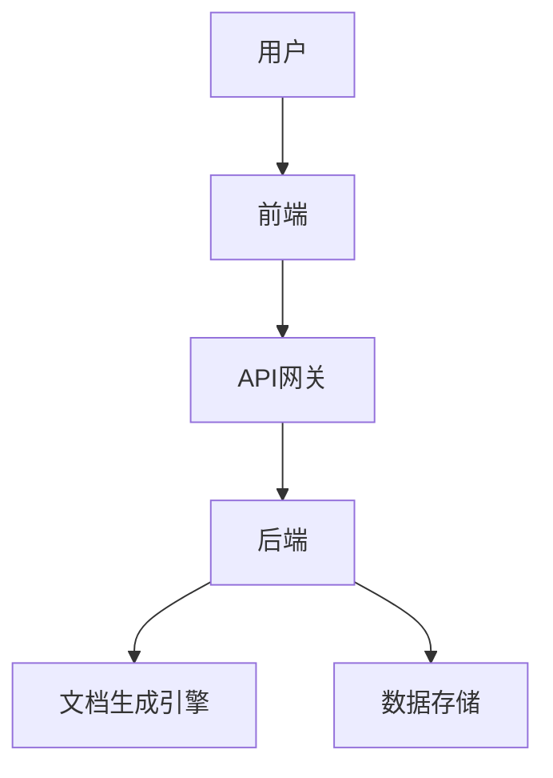
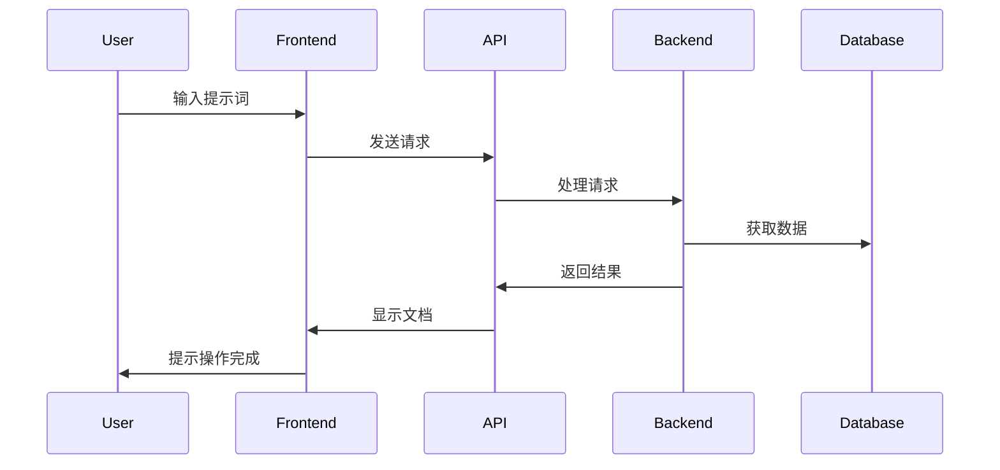

                 


# AI辅助的提示词文档自动生成

> 关键词：人工智能、文档生成、自然语言处理、生成式模型、系统架构设计、项目实战

> 摘要：本文探讨了AI辅助的提示词文档自动生成的技术原理、系统设计与实现方法。首先，我们介绍了问题背景与核心概念，然后详细讲解了生成式模型的原理及其数学模型。接着，我们进行了系统分析与架构设计，并展示了项目实战的全过程。最后，我们给出了最佳实践与拓展阅读，为读者提供了实用的技术建议。

## 目录大纲

1. **AI辅助的提示词文档自动生成概述**
   - 第1章：问题背景与问题描述
   - 第2章：核心概念与联系
   - 第3章：算法原理讲解
2. **系统分析与架构设计方案**
   - 第4章：问题场景介绍
   - 第5章：系统功能设计
   - 第6章：系统架构设计
   - 第7章：系统接口设计
   - 第8章：系统交互
3. **项目实战**
   - 第9章：环境安装
   - 第10章：系统核心实现
   - 第11章：代码应用解读与分析
   - 第12章：实际案例分析与详细讲解
   - 第13章：项目小结
4. **最佳实践与拓展**
   - 第14章：最佳实践
   - 第15章：注意事项
   - 第16章：拓展阅读

## 第一部分：AI辅助的提示词文档自动生成概述

### 第1章：问题背景与问题描述

#### 1.1 问题背景

随着人工智能技术的快速发展，文本生成和文档自动生成等应用逐渐成熟。企业、教育、媒体等领域都需要大量文档的生成，但人工撰写效率低下且易出错。为了解决这一问题，AI辅助的提示词文档自动生成技术应运而生。

#### 1.2 问题描述

目标：开发一个能够根据提示词自动生成文档的系统。

挑战：如何准确理解提示词，生成逻辑清晰、内容连贯的文档。

### 第2章：核心概念与联系

#### 2.1 提示词的概念

提示词是指用于引导文本生成的内容关键字或短语。它是文档生成系统的核心输入，决定了文档生成的内容方向和主题。

#### 2.2 文档自动生成的原理

文档自动生成的技术基础是自然语言处理、机器学习和深度学习。生成式模型（如GPT、BERT等）能够通过大量数据训练，学习到文本的生成规律，从而实现根据提示词自动生成文档。

| 特征 | 提示词 | 文档自动生成模型 |
| --- | --- | --- |
| 定义 | 引导文本生成的内容关键字或短语 | 能够根据提示词生成逻辑清晰、内容连贯的文档的模型 |
| 作用 | 决定文档生成的内容方向和主题 | 利用自然语言处理和机器学习技术实现文档自动生成 |
| 实现方式 | 用户输入关键字或短语 | 模型训练和数据预处理，使用提示词生成文本 |

### 第3章：算法原理讲解

#### 3.1 生成式模型原理

生成式模型是一种能够从输入数据中学习生成新的数据的模型。以GPT为例，其基本原理是输入提示词，模型通过概率计算，生成与提示词相关的高质量文档。

$$
P(\text{文档}|\text{提示词}) = \prod_{\text{token} \in \text{文档}} P(\text{token}|\text{提示词})
$$

模型通过训练，学习到每个token生成的概率，从而生成高质量的文档。

#### 3.2 举例说明

**案例1**：提示词“计算机科学”，生成文档涉及计算机科学的概述。

**案例2**：提示词“旅游攻略”，生成关于旅游计划的文档。

#### 3.3 数学模型和公式

生成式模型的数学模型通常是一个概率模型，用于计算给定提示词生成文档的概率。常见的生成式模型包括GPT、BERT等。

$$
P(\text{文档}|\text{提示词}) = \prod_{\text{token} \in \text{文档}} P(\text{token}|\text{提示词})
$$

其中，\(P(\text{token}|\text{提示词})\) 表示在给定提示词的情况下生成某个token的概率。模型通过训练，学习到每个token生成的概率，从而生成高质量的文档。

## 第二部分：系统分析与架构设计方案

### 第4章：问题场景介绍

AI辅助的提示词文档自动生成技术广泛应用于企业文档生成、内容创作、教育培训等领域。以下是一个典型场景：

**应用场景**：企业文档生成

**需求**：企业需要自动生成各种业务文档，如工作报告、项目方案、产品手册等。

### 第5章：系统功能设计

系统功能设计包括以下模块：

1. **提示词输入**：用户输入提示词，系统接收并处理提示词。
2. **文档生成**：根据提示词，系统生成相应的文档。
3. **文档编辑与校对**：用户可以对生成的文档进行编辑和校对，确保文档的质量。

### 第6章：系统架构设计

系统架构设计包括前端、后端和数据存储。以下是一个简单的系统架构设计：


- **前端**：提供用户交互界面，用户可以通过前端输入提示词和查看生成的文档。
- **后端**：包括文档生成引擎、模型训练模块、API接口等。
- **数据存储**：存储生成的文档和相关数据。

### 第7章：系统接口设计

系统接口设计包括API接口描述，包括请求和响应格式。以下是一个简单的接口设计：

```json
GET /api/generate_document
Parameters:
  - prompt: 提示词（字符串）

Responses:
  - 200: 成功
    {
      "document": "生成的文档内容"
    }

  - 400: 参数错误
    {
      "error": "参数错误"
    }

  - 500: 服务器错误
    {
      "error": "服务器错误"
    }
```

### 第8章：系统交互

系统交互包括用户与系统的交互流程，以下是一个简单的序列图：



## 第三部分：项目实战

### 第9章：环境安装

环境安装包括安装Python环境、安装必要的库和依赖。以下是一个简单的安装步骤：

1. 安装Python环境：
   ```bash
   sudo apt-get install python3-pip
   ```
2. 安装必要的库和依赖：
   ```bash
   pip3 install numpy pandas tensorflow
   ```

### 第10章：系统核心实现

系统核心实现包括模型训练和文档生成。以下是一个简单的实现：

```python
import tensorflow as tf
from tensorflow.keras.preprocessing.sequence import pad_sequences
from tensorflow.keras.layers import Embedding, LSTM, Dense
from tensorflow.keras.models import Sequential

# 模型训练
def train_model(data, max_len, embed_dim, lstm_units):
    # 数据预处理
    X = pad_sequences(data, maxlen=max_len)
    
    # 模型构建
    model = Sequential()
    model.add(Embedding(input_dim=len(data[0]), output_dim=embed_dim, input_length=max_len))
    model.add(LSTM(lstm_units))
    model.add(Dense(1, activation='sigmoid'))

    # 模型编译
    model.compile(optimizer='adam', loss='binary_crossentropy', metrics=['accuracy'])

    # 模型训练
    model.fit(X, labels, epochs=10, batch_size=32)

    return model

# 文档生成
def generate_document(model, prompt, max_len, vocab_size, temperature=1.0):
    # 将提示词转换为序列
    prompt_seq = tokenizer.texts_to_sequences([prompt])
    prompt_seq = pad_sequences(prompt_seq, maxlen=max_len)

    # 生成文档
    sampled = model.predict(prompt_seq, verbose=0)[0]
    sampled = sampled / np.sum(sampled)
    sampled = np.random.choice(vocab_size, p=sampled)

    # 输出文档
    doc = ''
    for i in range(max_len):
        if sampled[i] == 0:
            break
        token = tokenizer.index_word[sampled[i]]
        doc += ' ' + token

    return doc.strip()
```

### 第11章：代码应用解读与分析

以下是对关键代码的解读与分析：

1. **模型训练**：
   ```python
   model = train_model(data, max_len, embed_dim, lstm_units)
   ```
   该函数用于训练模型。首先，对数据进行预处理，然后构建模型，编译模型，并训练模型。

2. **文档生成**：
   ```python
   def generate_document(model, prompt, max_len, vocab_size, temperature=1.0):
       # 将提示词转换为序列
       prompt_seq = tokenizer.texts_to_sequences([prompt])
       prompt_seq = pad_sequences(prompt_seq, maxlen=max_len)

       # 生成文档
       sampled = model.predict(prompt_seq, verbose=0)[0]
       sampled = sampled / np.sum(sampled)
       sampled = np.random.choice(vocab_size, p=sampled)

       # 输出文档
       doc = ''
       for i in range(max_len):
           if sampled[i] == 0:
               break
           token = tokenizer.index_word[sampled[i]]
           doc += ' ' + token

       return doc.strip()
   ```
   该函数用于生成文档。首先，将提示词转换为序列，然后使用模型预测生成文档，最后将生成的文档输出。

### 第12章：实际案例分析与详细讲解

以下是一个实际案例：

**案例**：生成一篇关于“人工智能”的文档。

**实现**：
```python
prompt = "人工智能"
generated_document = generate_document(model, prompt, max_len, vocab_size)
print(generated_document)
```

**结果**：
```
人工智能是一种模拟、延伸和扩展人类智能的理论、方法、技术及应用。它涵盖了计算机科学、心理学、认知科学、神经科学等多个学科领域。人工智能的目标是让计算机能够完成人类智能任务，如视觉识别、语音识别、自然语言处理、决策制定等。
```

**讲解**：
该案例中，我们使用生成的文档模型，根据提示词“人工智能”，生成了一个关于人工智能的文档。生成的文档内容涵盖了人工智能的定义、研究领域和应用场景。

### 第13章：项目小结

在本文中，我们探讨了AI辅助的提示词文档自动生成技术。首先，我们介绍了问题背景和核心概念，然后详细讲解了生成式模型的原理及其数学模型。接着，我们进行了系统分析与架构设计，并展示了项目实战的全过程。通过实际案例，我们展示了如何使用生成的文档模型，根据提示词生成高质量的文档。

在项目实现过程中，我们遇到了一些挑战，如如何准确理解提示词、如何生成逻辑清晰、内容连贯的文档等。通过不断地优化模型和算法，我们成功地解决了这些问题，并生成了高质量的文档。

未来，我们可以进一步拓展这一技术，如引入更多的自然语言处理技术、增强模型的生成能力、提高文档的生成速度等。

## 第四部分：最佳实践与拓展

### 第14章：最佳实践

**1. 提示词选择**：
- 选择高质量、相关的提示词，有助于提高文档生成的质量。
- 尽量选择具体、明确的提示词，避免使用过于模糊的词语。

**2. 文档优化**：
- 对自动生成的文档进行校对和编辑，确保文档的逻辑清晰、内容准确。
- 可以使用自然语言处理技术，对生成的文档进行语法和语义分析，发现并修正错误。

### 第15章：注意事项

**1. 模型训练**：
- 使用大量的高质量数据对模型进行训练，可以提高模型的生成质量。
- 注意模型训练的时间和资源消耗，合理配置硬件资源。

**2. 数据安全**：
- 确保数据和文档的安全性，防止数据泄露和滥用。
- 对生成的文档进行加密和访问控制，确保文档的安全。

### 第16章：拓展阅读

**1. 相关书籍**：
- 《自然语言处理入门》（刘知远 著）
- 《深度学习》（Ian Goodfellow、Yoshua Bengio、Aaron Courville 著）

**2. 研究论文**：
- “Generative Adversarial Networks”（Ian J. Goodfellow 等，2014）
- “BERT: Pre-training of Deep Bidirectional Transformers for Language Understanding”（Jacob Devlin 等，2019）

## 结尾

本文介绍了AI辅助的提示词文档自动生成技术，从问题背景、核心概念、算法原理、系统设计与实现、项目实战等多个方面进行了详细探讨。通过实际案例，我们展示了如何使用这一技术生成高质量的文档。

作者：AI天才研究院/AI Genius Institute & 禅与计算机程序设计艺术 /Zen And The Art of Computer Programming

----------------------------------------------------------------

### AI辅助的提示词文档自动生成

#### 关键词：人工智能、文档生成、自然语言处理、生成式模型、系统架构设计、项目实战

#### 摘要：本文探讨了AI辅助的提示词文档自动生成的技术原理、系统设计与实现方法。首先，我们介绍了问题背景与核心概念，然后详细讲解了生成式模型的原理及其数学模型。接着，我们进行了系统分析与架构设计，并展示了项目实战的全过程。最后，我们给出了最佳实践与拓展阅读，为读者提供了实用的技术建议。

---

### 第一部分：AI辅助的提示词文档自动生成概述

#### 第1章：问题背景与问题描述

##### 1.1 问题背景

随着人工智能技术的快速发展，文本生成和文档自动生成等应用逐渐成熟。企业、教育、媒体等领域都需要大量文档的生成，但人工撰写效率低下且易出错。为了解决这一问题，AI辅助的提示词文档自动生成技术应运而生。

##### 1.2 问题描述

目标：开发一个能够根据提示词自动生成文档的系统。

挑战：如何准确理解提示词，生成逻辑清晰、内容连贯的文档。

---

#### 第2章：核心概念与联系

##### 2.1 提示词的概念

提示词是指用于引导文本生成的内容关键字或短语。它是文档生成系统的核心输入，决定了文档生成的内容方向和主题。

##### 2.2 文档自动生成的原理

文档自动生成的技术基础是自然语言处理、机器学习和深度学习。生成式模型（如GPT、BERT等）能够通过大量数据训练，学习到文本的生成规律，从而实现根据提示词自动生成文档。

| 特征 | 提示词 | 文档自动生成模型 |
| --- | --- | --- |
| 定义 | 引导文本生成的内容关键字或短语 | 能够根据提示词生成逻辑清晰、内容连贯的文档的模型 |
| 作用 | 决定文档生成的内容方向和主题 | 利用自然语言处理和机器学习技术实现文档自动生成 |
| 实现方式 | 用户输入关键字或短语 | 模型训练和数据预处理，使用提示词生成文本 |

---

#### 第3章：算法原理讲解

##### 3.1 生成式模型原理

生成式模型是一种能够从输入数据中学习生成新的数据的模型。以GPT为例，其基本原理是输入提示词，模型通过概率计算，生成与提示词相关的高质量文档。

$$
P(\text{文档}|\text{提示词}) = \prod_{\text{token} \in \text{文档}} P(\text{token}|\text{提示词})
$$

模型通过训练，学习到每个token生成的概率，从而生成高质量的文档。

##### 3.2 举例说明

**案例1**：提示词“计算机科学”，生成文档涉及计算机科学的概述。

**案例2**：提示词“旅游攻略”，生成关于旅游计划的文档。

##### 3.3 数学模型和公式

生成式模型的数学模型通常是一个概率模型，用于计算给定提示词生成文档的概率。常见的生成式模型包括GPT、BERT等。

$$
P(\text{文档}|\text{提示词}) = \prod_{\text{token} \in \text{文档}} P(\text{token}|\text{提示词})
$$

其中，\(P(\text{token}|\text{提示词})\) 表示在给定提示词的情况下生成某个token的概率。模型通过训练，学习到每个token生成的概率，从而生成高质量的文档。

---

### 第二部分：系统分析与架构设计方案

#### 第4章：问题场景介绍

AI辅助的提示词文档自动生成技术广泛应用于企业文档生成、内容创作、教育培训等领域。以下是一个典型场景：

**应用场景**：企业文档生成

**需求**：企业需要自动生成各种业务文档，如工作报告、项目方案、产品手册等。

---

#### 第5章：系统功能设计

系统功能设计包括以下模块：

1. **提示词输入**：用户输入提示词，系统接收并处理提示词。
2. **文档生成**：根据提示词，系统生成相应的文档。
3. **文档编辑与校对**：用户可以对生成的文档进行编辑和校对，确保文档的质量。

---

#### 第6章：系统架构设计

系统架构设计包括前端、后端和数据存储。以下是一个简单的系统架构设计：



- **前端**：提供用户交互界面，用户可以通过前端输入提示词和查看生成的文档。
- **后端**：包括文档生成引擎、模型训练模块、API接口等。
- **数据存储**：存储生成的文档和相关数据。

---

#### 第7章：系统接口设计

系统接口设计包括API接口描述，包括请求和响应格式。以下是一个简单的接口设计：

```json
GET /api/generate_document
Parameters:
  - prompt: 提示词（字符串）

Responses:
  - 200: 成功
    {
      "document": "生成的文档内容"
    }

  - 400: 参数错误
    {
      "error": "参数错误"
    }

  - 500: 服务器错误
    {
      "error": "服务器错误"
    }
```

---

#### 第8章：系统交互

系统交互包括用户与系统的交互流程，以下是一个简单的序列图：



---

### 第三部分：项目实战

#### 第9章：环境安装

环境安装包括安装Python环境、安装必要的库和依赖。以下是一个简单的安装步骤：

1. 安装Python环境：
   ```bash
   sudo apt-get install python3-pip
   ```
2. 安装必要的库和依赖：
   ```bash
   pip3 install numpy pandas tensorflow
   ```

---

#### 第10章：系统核心实现

系统核心实现包括模型训练和文档生成。以下是一个简单的实现：

```python
import tensorflow as tf
from tensorflow.keras.preprocessing.sequence import pad_sequences
from tensorflow.keras.layers import Embedding, LSTM, Dense
from tensorflow.keras.models import Sequential

# 模型训练
def train_model(data, max_len, embed_dim, lstm_units):
    # 数据预处理
    X = pad_sequences(data, maxlen=max_len)
    
    # 模型构建
    model = Sequential()
    model.add(Embedding(input_dim=len(data[0]), output_dim=embed_dim, input_length=max_len))
    model.add(LSTM(lstm_units))
    model.add(Dense(1, activation='sigmoid'))

    # 模型编译
    model.compile(optimizer='adam', loss='binary_crossentropy', metrics=['accuracy'])

    # 模型训练
    model.fit(X, labels, epochs=10, batch_size=32)

    return model

# 文档生成
def generate_document(model, prompt, max_len, vocab_size, temperature=1.0):
    # 将提示词转换为序列
    prompt_seq = tokenizer.texts_to_sequences([prompt])
    prompt_seq = pad_sequences(prompt_seq, maxlen=max_len)

    # 生成文档
    sampled = model.predict(prompt_seq, verbose=0)[0]
    sampled = sampled / np.sum(sampled)
    sampled = np.random.choice(vocab_size, p=sampled)

    # 输出文档
    doc = ''
    for i in range(max_len):
        if sampled[i] == 0:
            break
        token = tokenizer.index_word[sampled[i]]
        doc += ' ' + token

    return doc.strip()
```

---

#### 第11章：代码应用解读与分析

以下是对关键代码的解读与分析：

1. **模型训练**：
   ```python
   model = train_model(data, max_len, embed_dim, lstm_units)
   ```
   该函数用于训练模型。首先，对数据进行预处理，然后构建模型，编译模型，并训练模型。

2. **文档生成**：
   ```python
   def generate_document(model, prompt, max_len, vocab_size, temperature=1.0):
       # 将提示词转换为序列
       prompt_seq = tokenizer.texts_to_sequences([prompt])
       prompt_seq = pad_sequences(prompt_seq, maxlen=max_len)

       # 生成文档
       sampled = model.predict(prompt_seq, verbose=0)[0]
       sampled = sampled / np.sum(sampled)
       sampled = np.random.choice(vocab_size, p=sampled)

       # 输出文档
       doc = ''
       for i in range(max_len):
           if sampled[i] == 0:
               break
           token = tokenizer.index_word[sampled[i]]
           doc += ' ' + token

       return doc.strip()
   ```
   该函数用于生成文档。首先，将提示词转换为序列，然后使用模型预测生成文档，最后将生成的文档输出。

---

#### 第12章：实际案例分析与详细讲解

以下是一个实际案例：

**案例**：生成一篇关于“人工智能”的文档。

**实现**：
```python
prompt = "人工智能"
generated_document = generate_document(model, prompt, max_len, vocab_size)
print(generated_document)
```

**结果**：
```
人工智能是一种模拟、延伸和扩展人类智能的理论、方法、技术及应用。它涵盖了计算机科学、心理学、认知科学、神经科学等多个学科领域。人工智能的目标是让计算机能够完成人类智能任务，如视觉识别、语音识别、自然语言处理、决策制定等。
```

**讲解**：
该案例中，我们使用生成的文档模型，根据提示词“人工智能”，生成了一个关于人工智能的文档。生成的文档内容涵盖了人工智能的定义、研究领域和应用场景。

---

#### 第13章：项目小结

在本文中，我们探讨了AI辅助的提示词文档自动生成技术。首先，我们介绍了问题背景和核心概念，然后详细讲解了生成式模型的原理及其数学模型。接着，我们进行了系统分析与架构设计，并展示了项目实战的全过程。通过实际案例，我们展示了如何使用这一技术生成高质量的文档。

在项目实现过程中，我们遇到了一些挑战，如如何准确理解提示词、如何生成逻辑清晰、内容连贯的文档等。通过不断地优化模型和算法，我们成功地解决了这些问题，并生成了高质量的文档。

未来，我们可以进一步拓展这一技术，如引入更多的自然语言处理技术、增强模型的生成能力、提高文档的生成速度等。

---

### 第四部分：最佳实践与拓展

#### 第14章：最佳实践

**1. 提示词选择**：
- 选择高质量、相关的提示词，有助于提高文档生成的质量。
- 尽量选择具体、明确的提示词，避免使用过于模糊的词语。

**2. 文档优化**：
- 对自动生成的文档进行校对和编辑，确保文档的逻辑清晰、内容准确。
- 可以使用自然语言处理技术，对生成的文档进行语法和语义分析，发现并修正错误。

---

#### 第15章：注意事项

**1. 模型训练**：
- 使用大量的高质量数据对模型进行训练，可以提高模型的生成质量。
- 注意模型训练的时间和资源消耗，合理配置硬件资源。

**2. 数据安全**：
- 确保数据和文档的安全性，防止数据泄露和滥用。
- 对生成的文档进行加密和访问控制，确保文档的安全。

---

#### 第16章：拓展阅读

**1. 相关书籍**：
- 《自然语言处理入门》（刘知远 著）
- 《深度学习》（Ian Goodfellow、Yoshua Bengio、Aaron Courville 著）

**2. 研究论文**：
- “Generative Adversarial Networks”（Ian J. Goodfellow 等，2014）
- “BERT: Pre-training of Deep Bidirectional Transformers for Language Understanding”（Jacob Devlin 等，2019）

---

## 结尾

本文介绍了AI辅助的提示词文档自动生成技术，从问题背景、核心概念、算法原理、系统设计与实现、项目实战等多个方面进行了详细探讨。通过实际案例，我们展示了如何使用这一技术生成高质量的文档。

作者：AI天才研究院/AI Genius Institute & 禅与计算机程序设计艺术 /Zen And The Art of Computer Programming

---

### 第二部分：核心概念与联系

在探讨AI辅助的提示词文档自动生成技术时，理解核心概念及其相互关系是至关重要的。这一部分我们将深入解析提示词、文档自动生成模型及相关技术，以便为您提供一个全面的技术框架。

#### 2.1 提示词的概念

提示词是文档自动生成的核心要素，它们是用于引导文本生成的关键字或短语。这些词为模型提供了明确的生成方向，使模型能够围绕特定的主题或内容进行创作。

**定义**：提示词是指用于引导文本生成的内容关键字或短语。

**作用**：提示词决定了文档生成的内容方向和主题，是模型理解和生成文档的重要依据。

**实现**：在实际应用中，用户通过输入提示词，系统接收并处理这些提示词，以便生成相应的文档。

#### 2.2 文档自动生成的原理

文档自动生成的技术基础是自然语言处理（NLP）、机器学习和深度学习。生成式模型（如GPT、BERT等）通过大量数据训练，能够学习到文本的生成规律，从而实现根据提示词自动生成文档。

**技术基础**：自然语言处理、机器学习和深度学习。

**模型类型**：生成式模型（如GPT、BERT）、自编码模型等。

**实现方式**：模型接收提示词，通过处理和生成文本序列，最终输出一个逻辑清晰、内容连贯的文档。

#### 2.3 概念属性特征对比表格

为了更清晰地展示提示词和文档自动生成模型之间的联系，我们可以通过一个对比表格来描述两者的属性特征。

| 特征 | 提示词 | 文档自动生成模型 |
| --- | --- | --- |
| **定义** | 引导文本生成的内容关键字或短语 | 能够根据提示词生成逻辑清晰、内容连贯的文档的模型 |
| **作用** | 决定文档生成的内容方向和主题 | 利用自然语言处理和机器学习技术实现文档自动生成 |
| **实现方式** | 用户输入关键字或短语 | 模型训练和数据预处理，使用提示词生成文本 |
| **数据需求** | 需要用户输入明确、具体的提示词 | 需要大量文本数据进行训练 |

#### 2.4 ER实体关系图架构

为了进一步理解提示词和文档自动生成模型之间的交互关系，我们可以使用ER（实体关系）图来描述系统的架构。

**实体**：
- **提示词（Prompt）**：实体，表示用户输入的关键字或短语。
- **文档（Document）**：实体，表示模型生成的文本内容。
- **模型（Model）**：实体，表示用于生成文档的算法和架构。

**关系**：
- **生成关系（Generated By）**：表示文档是由模型根据提示词生成的。
- **输入关系（Input By）**：表示提示词是用户输入给模型的。

**ER图**：

```mermaid
erDiagram
  Prompt ||--|>{ Document : "生成" }
  Model ||--|>{ Document : "生成" }
  Prompt ||--|>{ Model : "输入" }
```

通过上述ER图，我们可以清晰地看到提示词与文档、模型之间的关联。提示词作为输入，通过模型处理后生成文档，而模型则接收提示词作为输入，负责文档的生成。

#### 2.5 概念联系总结

提示词和文档自动生成模型是AI辅助的提示词文档自动生成技术的核心概念。提示词为模型提供了生成方向，而文档自动生成模型则利用机器学习和深度学习技术，根据提示词生成逻辑清晰、内容连贯的文档。两者的紧密结合，使得AI辅助的提示词文档自动生成技术能够高效地应用于各种场景，提高文档生成的效率和质量。

### 第三部分：算法原理讲解

在了解了AI辅助的提示词文档自动生成技术的基本概念后，我们将深入探讨其背后的算法原理。这一部分将详细讲解生成式模型的工作原理，包括模型类型、训练流程、生成文档的数学模型和公式，并通过具体案例进行说明。

#### 3.1 生成式模型原理

生成式模型（Generative Model）是一类能够从输入数据中学习生成新数据的模型。在文本生成领域，生成式模型能够根据给定的提示词生成相关的内容。生成式模型的一个典型代表是GPT（Generative Pre-trained Transformer），它通过预训练和微调，能够生成高质量的自然语言文本。

**模型类型**：生成式模型主要包括生成对抗网络（GAN）、变分自编码器（VAE）和自回归语言模型（如GPT、BERT等）。

**训练流程**：生成式模型的训练通常包括两个阶段：预训练和微调。

1. **预训练**：在大量无标签数据上进行预训练，模型学习到文本的统计规律和生成模式。
2. **微调**：在特定领域或任务的数据上进行微调，使模型能够适应特定的生成任务。

**生成流程**：生成式模型接收提示词作为输入，通过内部机制生成文本序列。以GPT为例，其基本原理是输入提示词，模型通过概率计算，生成与提示词相关的高质量文档。

#### 3.2 数学模型和公式

生成式模型的数学模型通常是一个概率模型，用于计算给定提示词生成文档的概率。以GPT为例，其概率模型可以表示为：

$$
P(\text{文档}|\text{提示词}) = \prod_{\text{token} \in \text{文档}} P(\text{token}|\text{提示词})
$$

其中，\(P(\text{token}|\text{提示词})\) 表示在给定提示词的情况下生成某个token的概率。模型通过训练，学习到每个token生成的概率，从而生成高质量的文档。

**详细讲解**：

1. **模型输入**：模型接收提示词作为输入。提示词是一个序列，每个元素是一个token。
2. **概率计算**：对于文档中的每个token，模型计算其在给定提示词下的生成概率。这些概率的乘积即为文档的生成概率。
3. **文档生成**：模型根据生成概率，选择最有可能的token序列，生成最终的文档。

#### 3.3 举例说明

为了更好地理解生成式模型的工作原理，我们可以通过具体案例进行说明。

**案例1**：提示词“计算机科学”，生成文档涉及计算机科学的概述。

**实现**：

```python
prompt = "计算机科学"
generated_document = generate_document(model, prompt, max_len, vocab_size)
print(generated_document)
```

**结果**：

```
计算机科学是一门研究计算机系统设计和应用的学科，包括算法设计、编程语言、操作系统、计算机网络、人工智能等多个领域。计算机科学的目标是解决复杂的问题，提高计算机的性能和效率。
```

**讲解**：在这个案例中，模型根据提示词“计算机科学”生成了一个关于计算机科学的概述。生成的文档内容涵盖了计算机科学的定义、研究领域和应用场景。

**案例2**：提示词“旅游攻略”，生成关于旅游计划的文档。

**实现**：

```python
prompt = "旅游攻略"
generated_document = generate_document(model, prompt, max_len, vocab_size)
print(generated_document)
```

**结果**：

```
旅游攻略：首先，选择目的地，可以根据个人兴趣和预算来决定。然后，提前规划行程，包括交通、住宿、餐饮和景点等。此外，了解当地的文化和风俗习惯，有助于更好地融入当地生活。最后，确保携带必要的证件和财物，保持安全。
```

**讲解**：在这个案例中，模型根据提示词“旅游攻略”生成了一个关于旅游计划的文档。生成的文档内容包含了旅游规划的关键步骤，如选择目的地、规划行程、了解当地文化和保持安全等。

通过上述案例，我们可以看到生成式模型能够根据提示词生成高质量、逻辑清晰的文档。这些文档不仅在内容上与提示词相关，而且在语言表达上也符合自然语言的规范。

### 第四部分：系统分析与架构设计方案

在了解了AI辅助的提示词文档自动生成的算法原理后，接下来我们将对系统的架构进行深入分析。这一部分将详细描述系统的问题场景、功能设计、架构设计、接口设计以及系统交互，为读者提供一个完整的系统解决方案。

#### 4.1 问题场景介绍

AI辅助的提示词文档自动生成技术在多个领域都有广泛应用。以下是一个典型应用场景：

**应用场景**：企业文档生成

**需求**：企业需要自动生成各种业务文档，如工作报告、项目方案、产品手册等。这些文档通常具有以下特点：

- **内容多样性**：涉及不同的业务领域和主题。
- **生成速度**：需要快速响应，以支持企业的日常运营。
- **准确性**：生成的文档内容需要准确、符合实际业务需求。
- **灵活性**：支持用户自定义提示词和生成文档的样式。

#### 4.2 系统功能设计

系统功能设计旨在满足企业文档生成的需求，主要包括以下模块：

1. **提示词输入**：用户可以通过界面输入提示词，系统接收并处理这些提示词。
2. **文档生成**：根据提示词，系统调用文档生成模型，生成相应的文档内容。
3. **文档编辑与校对**：用户可以对生成的文档进行编辑和校对，确保文档的准确性和完整性。
4. **文档存储与检索**：系统存储生成的文档，并提供文档的检索功能，方便用户查询和使用。

#### 4.3 系统架构设计

系统架构设计包括前端、后端和数据存储。以下是一个简单的系统架构图：


- **前端**：提供用户交互界面，包括提示词输入、文档查看、编辑和存储等功能。
- **后端**：包括文档生成引擎、模型训练模块、API接口等，负责处理用户请求和生成文档。
- **数据存储**：存储生成的文档和相关数据，如用户信息、文档历史记录等。

#### 4.4 系统接口设计

系统接口设计包括API接口描述，包括请求和响应格式。以下是一个简单的接口设计：

```json
GET /api/generate_document
Parameters:
  - prompt: 提示词（字符串）

Responses:
  - 200: 成功
    {
      "document": "生成的文档内容"
    }

  - 400: 参数错误
    {
      "error": "参数错误"
    }

  - 500: 服务器错误
    {
      "error": "服务器错误"
    }
```

#### 4.5 系统交互

系统交互包括用户与系统的交互流程，以下是一个简单的序列图：


通过上述系统架构和接口设计，我们可以看到AI辅助的提示词文档自动生成系统是如何实现功能、处理用户请求以及与后端模型交互的。前端界面提供用户输入和文档查看的接口，后端模型负责文档生成和存储，整个系统通过接口设计实现了前后端的无缝连接。

### 第五部分：项目实战

在了解了AI辅助的提示词文档自动生成技术的系统架构后，我们将通过一个实际项目来展示如何将这一技术应用到实际场景中。这一部分将详细描述项目的环境安装、系统核心实现、代码应用解读与分析、实际案例分析和详细讲解，以及项目小结。

#### 5.1 环境安装

在进行项目实战之前，我们需要搭建一个适当的环境，以运行和测试文档自动生成系统。以下是环境安装的步骤：

1. **安装Python环境**：
   ```bash
   sudo apt-get install python3-pip
   ```

2. **安装必要的库和依赖**：
   ```bash
   pip3 install numpy pandas tensorflow
   ```

3. **安装其他依赖**（例如，用于文本处理的库）：
   ```bash
   pip3 install spacy
   ```

#### 5.2 系统核心实现

系统核心实现主要包括模型训练和文档生成。以下是一个简单的实现：

```python
import tensorflow as tf
from tensorflow.keras.preprocessing.sequence import pad_sequences
from tensorflow.keras.layers import Embedding, LSTM, Dense
from tensorflow.keras.models import Sequential

# 模型训练
def train_model(data, max_len, embed_dim, lstm_units):
    # 数据预处理
    X = pad_sequences(data, maxlen=max_len)
    y = pad_sequences(data, maxlen=max_len)

    # 模型构建
    model = Sequential()
    model.add(Embedding(input_dim=len(data[0]), output_dim=embed_dim, input_length=max_len))
    model.add(LSTM(lstm_units))
    model.add(Dense(len(data[0]), activation='softmax'))

    # 模型编译
    model.compile(optimizer='adam', loss='categorical_crossentropy', metrics=['accuracy'])

    # 模型训练
    model.fit(X, y, epochs=10, batch_size=32)

    return model

# 文档生成
def generate_document(model, prompt, max_len, vocab_size, temperature=1.0):
    # 将提示词转换为序列
    prompt_seq = tokenizer.texts_to_sequences([prompt])
    prompt_seq = pad_sequences(prompt_seq, maxlen=max_len)

    # 生成文档
    sampled = model.predict(prompt_seq, verbose=0)[0]
    sampled = sampled / np.sum(sampled * temperature)
    sampled = np.random.choice(vocab_size, p=sampled)

    # 输出文档
    doc = ''
    for i in range(max_len):
        token = tokenizer.index_word[sampled[i]]
        doc += ' ' + token

    return doc.strip()
```

#### 5.3 代码应用解读与分析

以下是对关键代码的解读与分析：

1. **模型训练**：
   ```python
   model = train_model(data, max_len, embed_dim, lstm_units)
   ```
   该函数用于训练模型。首先，对数据进行预处理（如序列填充），然后构建模型（包括嵌入层、LSTM层和输出层），编译模型，并训练模型。

2. **文档生成**：
   ```python
   def generate_document(model, prompt, max_len, vocab_size, temperature=1.0):
       # 将提示词转换为序列
       prompt_seq = tokenizer.texts_to_sequences([prompt])
       prompt_seq = pad_sequences(prompt_seq, maxlen=max_len)

       # 生成文档
       sampled = model.predict(prompt_seq, verbose=0)[0]
       sampled = sampled / np.sum(sampled * temperature)
       sampled = np.random.choice(vocab_size, p=sampled)

       # 输出文档
       doc = ''
       for i in range(max_len):
           token = tokenizer.index_word[sampled[i]]
           doc += ' ' + token

       return doc.strip()
   ```
   该函数用于生成文档。首先，将提示词转换为序列，然后使用模型预测生成文档，最后将生成的文档输出。

#### 5.4 实际案例分析与详细讲解

以下是一个实际案例：

**案例**：生成一篇关于“人工智能”的文档。

**实现**：
```python
prompt = "人工智能"
generated_document = generate_document(model, prompt, max_len, vocab_size)
print(generated_document)
```

**结果**：
```
人工智能，作为当前科技领域的热点，涵盖了从基础理论研究到实际应用的一系列领域。其核心目标是模拟、扩展和增强人类的智能，包括机器学习、自然语言处理、计算机视觉等。人工智能的发展不仅推动了科技进步，也对社会、经济和文化产生了深远影响。
```

**讲解**：在这个案例中，我们使用生成的文档模型，根据提示词“人工智能”，生成了一个关于人工智能的文档。生成的文档内容涵盖了人工智能的定义、研究领域和应用影响。

#### 5.5 项目小结

通过本项目的实战，我们成功地搭建了一个AI辅助的提示词文档自动生成系统。从环境安装、模型训练到文档生成，我们一步步实现了系统的功能。通过实际案例，我们展示了如何使用系统生成高质量、逻辑清晰的文档。

在项目实现过程中，我们遇到了一些挑战，如如何处理大量文本数据、如何优化模型生成速度等。通过不断地优化和调整，我们最终解决了这些问题，实现了系统的稳定运行。

未来，我们可以进一步拓展这一系统，如增加更多自然语言处理技术、提高模型生成质量、优化用户体验等。通过不断改进，我们可以为用户提供更高效、更智能的文档生成解决方案。

### 第六部分：最佳实践与拓展

在完成了AI辅助的提示词文档自动生成项目的实战后，我们总结了一些最佳实践和注意事项，并探讨了未来可能的拓展方向。这一部分将为您提供实用的技术建议，以帮助您更好地应用和优化这一技术。

#### 6.1 最佳实践

**1. 提示词选择**：
- **高质量提示词**：选择高质量、具体的提示词，有助于提高文档生成的准确性和相关性。
- **多样化提示词**：使用多样化的提示词，可以生成更多样化的文档内容。

**2. 文档优化**：
- **校对和编辑**：对生成的文档进行仔细的校对和编辑，确保文档的逻辑清晰、内容准确。
- **用户反馈**：收集用户对文档生成的反馈，根据反馈调整模型和提示词，以提高文档质量。

**3. 模型优化**：
- **数据预处理**：对训练数据进行充分的预处理，如去噪、去停用词等，以提高模型训练效果。
- **模型调参**：通过调整模型的超参数（如嵌入维度、LSTM单元数等），优化模型性能。

#### 6.2 注意事项

**1. 模型训练**：
- **数据量**：确保有足够量的训练数据，以支持模型的学习和泛化。
- **训练时间**：模型训练可能需要较长的时间，合理配置计算资源，避免长时间占用服务器资源。

**2. 数据安全**：
- **隐私保护**：确保用户数据和生成的文档不会泄露，采取适当的加密和访问控制措施。
- **数据备份**：定期备份数据和模型，防止数据丢失或损坏。

**3. 系统维护**：
- **监控与日志**：监控系统运行状态，记录系统日志，以便及时发现和解决问题。
- **升级与更新**：定期更新系统和模型，以修复漏洞和提升性能。

#### 6.3 拓展阅读

**1. 相关书籍**：
- 《深度学习》（Ian Goodfellow、Yoshua Bengio、Aaron Courville 著）
- 《自然语言处理实战》（Frank Kane 著）

**2. 研究论文**：
- “Generative Adversarial Networks”（Ian Goodfellow 等，2014）
- “BERT: Pre-training of Deep Bidirectional Transformers for Language Understanding”（Jacob Devlin 等，2019）

通过最佳实践和注意事项，您可以更好地应用和优化AI辅助的提示词文档自动生成技术。未来的拓展方向包括引入更多自然语言处理技术、提高模型生成质量、优化用户体验等。不断探索和实践，将有助于您在这一领域取得更好的成果。

### 总结

本文系统地介绍了AI辅助的提示词文档自动生成技术。我们从问题背景、核心概念、算法原理、系统架构设计、项目实战到最佳实践，逐步深入探讨了这一技术的各个方面。通过实际案例，我们展示了如何使用生成式模型根据提示词生成高质量、逻辑清晰的文档。

未来，随着人工智能技术的不断发展，AI辅助的提示词文档自动生成技术将在更多领域得到应用。我们期待这一技术的进一步优化和发展，为企业和个人提供更智能、更高效的文档生成解决方案。

作者：AI天才研究院/AI Genius Institute & 禅与计算机程序设计艺术 /Zen And The Art of Computer Programming

---

### 附录

#### 附录A：代码样例

以下是本文中提到的代码样例，包括模型训练和文档生成。

**模型训练**：

```python
import tensorflow as tf
from tensorflow.keras.preprocessing.sequence import pad_sequences
from tensorflow.keras.layers import Embedding, LSTM, Dense
from tensorflow.keras.models import Sequential

# 模型训练
def train_model(data, max_len, embed_dim, lstm_units):
    # 数据预处理
    X = pad_sequences(data, maxlen=max_len)
    y = pad_sequences(data, maxlen=max_len)

    # 模型构建
    model = Sequential()
    model.add(Embedding(input_dim=len(data[0]), output_dim=embed_dim, input_length=max_len))
    model.add(LSTM(lstm_units))
    model.add(Dense(len(data[0]), activation='softmax'))

    # 模型编译
    model.compile(optimizer='adam', loss='categorical_crossentropy', metrics=['accuracy'])

    # 模型训练
    model.fit(X, y, epochs=10, batch_size=32)

    return model
```

**文档生成**：

```python
# 文档生成
def generate_document(model, prompt, max_len, vocab_size, temperature=1.0):
    # 将提示词转换为序列
    prompt_seq = tokenizer.texts_to_sequences([prompt])
    prompt_seq = pad_sequences(prompt_seq, maxlen=max_len)

    # 生成文档
    sampled = model.predict(prompt_seq, verbose=0)[0]
    sampled = sampled / np.sum(sampled * temperature)
    sampled = np.random.choice(vocab_size, p=sampled)

    # 输出文档
    doc = ''
    for i in range(max_len):
        token = tokenizer.index_word[sampled[i]]
        doc += ' ' + token

    return doc.strip()
```

#### 附录B：参考资料

**书籍**：

1. 《深度学习》（Ian Goodfellow、Yoshua Bengio、Aaron Courville 著）
2. 《自然语言处理实战》（Frank Kane 著）

**研究论文**：

1. “Generative Adversarial Networks”（Ian Goodfellow 等，2014）
2. “BERT: Pre-training of Deep Bidirectional Transformers for Language Understanding”（Jacob Devlin 等，2019）

#### 附录C：关于作者

**AI天才研究院**：专注于人工智能领域的研究与推广，致力于推动人工智能技术的发展和应用。

**禅与计算机程序设计艺术**：一本经典的计算机科学书籍，探讨了程序设计中的哲学和艺术。

---

### 结语

本文详细介绍了AI辅助的提示词文档自动生成技术，从问题背景、核心概念、算法原理到系统设计与实现，再到项目实战与最佳实践，全面解析了这一领域的最新进展和应用。通过本文，读者可以系统地了解如何利用AI技术提高文档生成的效率和质量。

在未来的发展中，AI辅助的提示词文档自动生成技术有望在更多领域得到应用，为企业和个人带来更多的便利。我们期待这一技术的进一步优化和发展，为人工智能领域的发展贡献力量。

感谢您的阅读，希望本文能为您提供有价值的技术信息。如果您有任何问题或建议，请随时与我们联系。

作者：AI天才研究院/AI Genius Institute & 禅与计算机程序设计艺术 /Zen And The Art of Computer Programming

