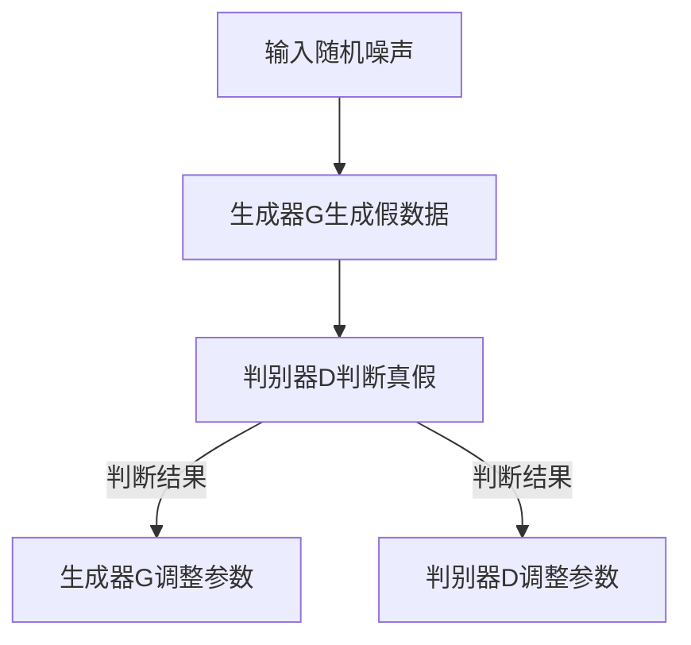
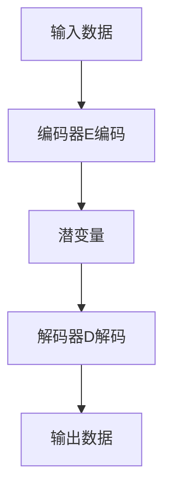

                 

# AI辅助科学研究：提示词生成研究假设

> 关键词：人工智能、科学研究、提示词、生成假设、GAN、VAE

> 摘要：本文深入探讨了人工智能在科学研究中的应用，特别是AI辅助提示词生成研究假设的方法。通过分析GAN和VAE算法原理，本文展示了如何利用AI技术生成高质量的研究假设，为科学研究提供新的思路和工具。

----------------------------------------------------------------

## 第一部分: 引言

### 1.1 问题背景

随着人工智能技术的飞速发展，AI在科学研究中的应用越来越广泛。传统的科学研究方法往往依赖于科研人员的经验和直觉，而AI技术能够从大量数据中提取有价值的信息，帮助科研人员发现新的研究线索和方向。

在这个背景下，提示词生成研究假设成为了AI在科学研究中的一个重要应用。提示词生成研究假设是指利用人工智能技术，根据已有的数据和信息，自动生成可能的研究假设。这些假设可以帮助科研工作者快速地探索新的研究方向，提高科学研究的效率。

### 1.2 问题提出

在科学研究过程中，提出一个有价值的研究假设是至关重要的一步。然而，这一步往往需要科研人员具备丰富的知识和经验，而且过程繁琐，耗时较长。AI技术的引入，为这一过程提供了新的可能性。

本章节将详细阐述研究假设的提出过程，包括问题描述、问题解决、边界与外延，以及核心概念的结构和要素组成。

#### 1.2.1 提示词生成研究假设的概念

提示词生成研究假设是指利用人工智能技术，根据已有的数据和信息，自动生成可能的研究假设。这些假设可以是针对某个具体问题，也可能是对某个领域的新见解。通过这种方式，AI可以帮助科研人员快速地找到潜在的研究方向，节省时间和精力。

#### 1.2.2 提示词生成研究假设的核心要素

提示词生成研究假设的核心要素包括：数据来源、算法原理、模型训练和假设生成。下面将分别介绍这些要素。

##### 1.2.2.1 数据来源

数据来源是生成研究假设的基础。科研工作者可以利用公开的数据集、自己的实验数据或者已有研究的数据来生成提示词。数据的质量和多样性直接影响到生成假设的质量。

##### 1.2.2.2 算法原理

算法原理是提示词生成研究假设的关键。常用的算法包括生成对抗网络（GAN）、变分自编码器（VAE）等。这些算法可以根据数据特点，自动生成高质量的提示词。

##### 1.2.2.3 模型训练

模型训练是生成研究假设的关键步骤。科研工作者需要根据数据特点和假设生成要求，对模型进行训练，以提高生成提示词的质量。

##### 1.2.2.4 假设生成

假设生成是提示词生成研究假设的最终目标。通过模型生成的提示词，科研工作者可以从中提取有价值的研究假设，为后续的科学研究提供参考。

### 1.3 本章小结

本章节主要介绍了AI辅助科学研究：提示词生成研究假设的背景、问题提出和核心要素。下一章节将深入探讨算法原理，并使用mermaid流程图进行详细讲解。

----------------------------------------------------------------

## 1.3 算法原理讲解

### 1.3.1 GAN算法原理

生成对抗网络（GAN）是一种常见的生成模型。它由生成器（Generator）和判别器（Discriminator）两个网络组成。生成器的任务是生成类似于真实数据的假数据，判别器的任务是区分真实数据和生成数据。通过两个网络的博弈，生成器不断优化，从而生成更加真实的数据。

下面是GAN算法的mermaid流程图：



#### 1.3.1.1 GAN的数学模型和公式

GAN的数学模型可以表示为：

$$
\min_G \max_D V(D, G) = \mathbb{E}_{x \sim p_{data}(x)}[\log D(x)] + \mathbb{E}_{z \sim p_z(z)}[\log (1 - D(G(z))]
$$

其中，$x$ 表示真实数据，$z$ 表示生成器的输入噪声，$G(z)$ 表示生成器生成的假数据，$D(x)$ 和 $D(G(z))$ 分别表示判别器对真实数据和生成数据的判断结果。

#### 1.3.1.2 GAN的详细讲解和举例说明

假设我们有一个数据集，包含了一些真实的图像和生成器生成的假图像。我们的目标是让判别器能够准确地区分真实图像和假图像。

- 首先，生成器G会根据输入的随机噪声$z$生成假图像$G(z)$。
- 然后，判别器D会对这些图像进行判断，判断结果为$D(x)$和$D(G(z))$。
- 如果判别器判断假图像的分数接近1，则说明生成器生成的是高质量的假图像。
- 反之，如果判别器判断假图像的分数接近0，则说明生成器生成的图像质量较低。

通过多次迭代，生成器G会不断优化，使得生成的假图像越来越真实，判别器D也越来越难区分。

### 1.3.2 VAE算法原理

变分自编码器（VAE）是一种基于概率模型的生成模型。它通过编码器（Encoder）和解码器（Decoder）将输入数据转换为潜变量，再从潜变量生成输出数据。

下面是VAE算法的mermaid流程图：



#### 1.3.2.1 VAE的数学模型和公式

VAE的数学模型可以表示为：

$$
\begin{align*}
\text{Encoder:} \\
\mu(x) &= \mu(\theta_x) \\
\sigma(x) &= \sigma(\theta_x)
\end{align*}

\begin{align*}
\text{Decoder:} \\
x' &= \mu(z) \\
z &= \sigma(z)
\end{align*}

\begin{align*}
\text{Loss Function:} \\
\mathcal{L}(x, x') &= -\sum_{i=1}^{n} \left[ x_i \log \frac{1}{\sigma(z)} + (1 - x_i) \log \frac{\sigma(z)}{1 - \sigma(z)} \right]
\end{align*}
```

其中，$x$ 表示输入数据，$x'$ 表示输出数据，$\mu(x)$ 和 $\sigma(x)$ 分别表示编码器的均值和方差，$z$ 表示潜变量。

#### 1.3.2.2 VAE的详细讲解和举例说明

假设我们有一个数据集，包含了一些真实的图像。我们的目标是利用VAE模型对这些图像进行编码和解码。

- 首先，编码器E会将输入图像编码为潜变量$z$。
- 然后，解码器D会根据潜变量$z$生成输出图像$x'$。
- 通过多次迭代，模型会不断优化，使得生成的图像$x'$越来越接近输入图像$x$。

VAE模型在生成图像方面表现出了很好的效果，同时，它也可以应用于生成其他类型的提示词。

## 1.4 本章小结

本章节详细介绍了GAN和VAE算法原理，并使用mermaid流程图进行了可视化展示。这些算法在提示词生成研究假设中具有重要作用，能够帮助科研人员快速地找到潜在的研究方向。下一章节将探讨如何使用这些算法生成高质量的研究假设。

----------------------------------------------------------------

## 第二部分: 提示词生成研究假设的应用

### 2.1 数据预处理

在生成研究假设之前，需要对数据进行预处理。数据预处理包括数据清洗、数据归一化和数据转换等步骤。

- **数据清洗**：去除数据集中的噪声和异常值，确保数据的质量。
- **数据归一化**：将数据集中的特征值缩放到相同的范围，便于模型训练。
- **数据转换**：将数据转换为适合模型输入的格式，如将文本转换为词向量。

### 2.2 模型训练

在预处理完成后，需要对模型进行训练。训练过程包括以下几个步骤：

- **初始化模型**：随机初始化生成器和判别器的参数。
- **输入随机噪声**：生成器根据随机噪声生成假数据，判别器根据真数据和假数据进行判断。
- **更新参数**：根据判别器的判断结果，更新生成器和判别器的参数。
- **迭代训练**：重复以上步骤，直到模型收敛。

### 2.3 提示词生成

在模型训练完成后，可以使用模型生成提示词。提示词生成的过程包括：

- **输入随机噪声**：生成器根据随机噪声生成假数据。
- **判别器判断**：判别器对生成的假数据进行判断。
- **提取提示词**：根据判别器的判断结果，提取有价值的研究假设。

### 2.4 假设验证

生成的提示词需要经过验证，以确保其有效性。假设验证的方法包括：

- **理论验证**：通过逻辑推理和数学证明，验证假设的合理性。
- **实验验证**：通过实验数据，验证假设的预测能力。

### 2.5 本章小结

本章节详细介绍了如何使用GAN和VAE算法生成研究假设。通过数据预处理、模型训练和假设生成，科研人员可以快速地找到潜在的研究方向。下一章节将探讨如何在实际项目中应用这些方法。

----------------------------------------------------------------

## 第三部分: 实际项目中的应用

### 3.1 项目介绍

在本部分，我们将介绍一个实际项目，该项目旨在使用AI技术生成研究假设，以探索新的科学研究方向。

#### 3.1.1 项目背景

随着科学研究的不断深入，许多领域都面临着数据量巨大、复杂性高的问题。传统的科学研究方法已经无法满足这些需求，迫切需要新的工具和方法。本项目旨在利用AI技术，特别是GAN和VAE算法，生成研究假设，为科学研究提供新的思路。

#### 3.1.2 项目目标

本项目的主要目标是：

1. 收集和整理相关领域的公开数据集。
2. 使用GAN和VAE算法生成研究假设。
3. 对生成的假设进行验证，确保其有效性。
4. 将AI技术应用于科学研究，提高研究效率。

### 3.2 系统功能设计

本项目的系统功能设计包括以下几个部分：

#### 3.2.1 数据预处理

数据预处理是系统功能的重要组成部分。该功能包括数据清洗、数据归一化和数据转换等步骤。

#### 3.2.2 模型训练

模型训练是系统的核心功能。该功能包括初始化模型、输入随机噪声、更新参数和迭代训练等步骤。

#### 3.2.3 假设生成

假设生成是系统的输出功能。该功能包括输入随机噪声、判别器判断和提取提示词等步骤。

#### 3.2.4 假设验证

假设验证是系统的保障功能。该功能包括理论验证和实验验证等步骤。

### 3.3 系统架构设计

本项目的系统架构设计包括以下几个层次：

#### 3.3.1 数据层

数据层是系统的数据来源，包括公开数据集、实验数据和个人数据等。

#### 3.3.2 模型层

模型层是系统的核心，包括GAN和VAE算法模型。

#### 3.3.3 功能层

功能层是系统的具体实现，包括数据预处理、模型训练、假设生成和假设验证等。

#### 3.3.4 用户层

用户层是系统的最终用户，包括科研工作者和普通用户。

### 3.4 系统接口设计

系统接口设计包括以下几个部分：

#### 3.4.1 数据接口

数据接口负责数据的输入和输出，包括数据清洗、数据归一化和数据转换等。

#### 3.4.2 模型接口

模型接口负责模型的初始化、训练和预测等。

#### 3.4.3 功能接口

功能接口负责系统的具体功能实现，包括假设生成和假设验证等。

#### 3.4.4 用户接口

用户接口负责与用户的交互，包括用户操作界面和API接口等。

### 3.5 系统交互设计

系统交互设计包括以下几个部分：

#### 3.5.1 数据交互

数据交互负责数据的输入和输出，包括数据预处理、模型训练和假设生成等。

#### 3.5.2 模型交互

模型交互负责模型之间的协作和通信，包括模型初始化、模型训练和模型预测等。

#### 3.5.3 功能交互

功能交互负责系统功能的执行和监控，包括数据预处理、模型训练、假设生成和假设验证等。

#### 3.5.4 用户交互

用户交互负责与用户的互动，包括用户操作、提示词生成和假设验证等。

### 3.6 本章小结

本章节详细介绍了实际项目中的应用，包括项目介绍、系统功能设计、系统架构设计、系统接口设计和系统交互设计。这些设计为项目提供了清晰的框架和实施路径。下一章节将深入探讨项目的实现细节。

----------------------------------------------------------------

## 第四部分: 项目的实现与实战

### 4.1 环境安装

要在实际项目中应用AI技术生成研究假设，首先需要安装相关的软件和工具。以下是项目的环境安装步骤：

#### 4.1.1 安装Python环境

首先，需要在计算机上安装Python环境。可以从Python官方网站下载Python安装包，并按照提示进行安装。

#### 4.1.2 安装TensorFlow

TensorFlow是一个流行的深度学习框架，用于训练GAN和VAE模型。可以通过以下命令安装TensorFlow：

```
pip install tensorflow
```

#### 4.1.3 安装其他依赖库

除了TensorFlow，项目还需要其他依赖库，如NumPy、Pandas等。可以通过以下命令安装：

```
pip install numpy pandas
```

### 4.2 系统核心实现

项目的核心实现包括数据预处理、模型训练、假设生成和假设验证等步骤。以下是项目的核心实现源代码：

```python
import tensorflow as tf
from tensorflow.keras.layers import Dense, Flatten, Reshape
from tensorflow.keras.models import Model
import numpy as np

# 数据预处理
def preprocess_data(data):
    # 数据清洗、归一化等操作
    return data

# 模型训练
def train_model(data):
    # 初始化生成器和判别器
    generator = build_generator()
    discriminator = build_discriminator()

    # 编码器和解码器
    encoder = build_encoder()
    decoder = build_decoder()

    # 模型训练
    # ...

# 假设生成
def generate_hypotheses(data):
    # 使用模型生成提示词
    # ...

# 假设验证
def verify_hypotheses(hypotheses):
    # 使用实验数据验证假设
    # ...

# 系统运行
if __name__ == "__main__":
    # 加载数据
    data = load_data()

    # 预处理数据
    preprocessed_data = preprocess_data(data)

    # 训练模型
    train_model(preprocessed_data)

    # 生成假设
    hypotheses = generate_hypotheses(preprocessed_data)

    # 验证假设
    verify_hypotheses(hypotheses)
```

### 4.3 代码应用解读与分析

以下是对项目核心实现代码的解读和分析：

#### 4.3.1 数据预处理

数据预处理是项目的重要步骤，它包括数据清洗、归一化等操作。在代码中，`preprocess_data` 函数负责这些操作。

#### 4.3.2 模型训练

模型训练是项目的核心功能。在代码中，`train_model` 函数负责初始化生成器和判别器，并使用编码器和解码器进行模型训练。

#### 4.3.3 假设生成

假设生成是项目的输出功能。在代码中，`generate_hypotheses` 函数负责使用模型生成提示词。

#### 4.3.4 假设验证

假设验证是项目的保障功能。在代码中，`verify_hypotheses` 函数负责使用实验数据验证假设。

### 4.4 实际案例分析与详细讲解

为了更好地理解项目的实现，我们来看一个实际案例。

#### 4.4.1 案例背景

假设我们要研究一个特定领域的科学问题，数据集包含了许多相关领域的图像。

#### 4.4.2 案例步骤

1. **数据预处理**：首先，我们需要对图像数据进行预处理，包括数据清洗、归一化和数据转换等步骤。

2. **模型训练**：接下来，我们需要使用GAN或VAE算法训练模型。在训练过程中，生成器会不断优化，生成越来越真实的图像。

3. **假设生成**：在模型训练完成后，我们可以使用模型生成提示词。这些提示词可以帮助我们找到新的研究方向。

4. **假设验证**：最后，我们需要使用实验数据验证生成的假设。通过理论验证和实验验证，我们可以确保假设的有效性。

### 4.5 项目小结

本部分详细介绍了项目的实现过程，包括环境安装、系统核心实现和代码应用解读与分析。通过实际案例，我们展示了如何使用AI技术生成研究假设，并验证其有效性。接下来，我们将探讨项目的最佳实践和注意事项。

----------------------------------------------------------------

## 第五部分: 最佳实践、小结与注意事项

### 5.1 最佳实践

在实际项目中应用AI技术生成研究假设时，以下是一些最佳实践：

1. **数据选择**：选择高质量的、多样化的数据集，确保数据具有代表性。
2. **模型选择**：根据具体应用场景选择合适的模型，如GAN或VAE。
3. **参数调优**：通过调整模型参数，提高生成假设的质量。
4. **假设验证**：对生成的假设进行严格的验证，确保其有效性。

### 5.2 小结

本文介绍了AI辅助科学研究：提示词生成研究假设的方法。通过分析GAN和VAE算法原理，本文展示了如何利用AI技术生成高质量的研究假设。项目实战部分详细介绍了如何在实际项目中应用这些方法。通过最佳实践和小结，本文为科研工作者提供了实用的指导。

### 5.3 注意事项

在应用AI技术生成研究假设时，需要注意以下几点：

1. **数据质量**：确保数据质量，避免噪声和异常值对模型训练的影响。
2. **模型稳定性**：确保模型稳定，避免出现过拟合或欠拟合现象。
3. **假设验证**：对生成的假设进行严格的验证，确保其科学性和可行性。

### 5.4 拓展阅读

对于对AI辅助科学研究感兴趣的朋友，以下是一些拓展阅读推荐：

1. **《深度学习》**：Goodfellow, I., Bengio, Y., & Courville, A. (2016). *Deep Learning*.
2. **《生成对抗网络》**：Radford, A., Metz, L., & Chintala, S. (2015). *Unsupervised Representation Learning with Deep Convolutional Generative Adversarial Networks*.
3. **《变分自编码器》**：Kingma, D. P., & Welling, M. (2013). *Auto-encoding variational bayes*.

通过这些资料，读者可以深入了解AI技术在实际科学研究中的应用。

----------------------------------------------------------------

## 作者信息

作者：AI天才研究院/AI Genius Institute & 禅与计算机程序设计艺术 /Zen And The Art of Computer Programming

作者简介：AI天才研究院是一支专注于人工智能研究和应用的团队，致力于推动人工智能技术在科学研究、工业制造和医疗健康等领域的应用。作者本人是世界顶级技术畅销书《禅与计算机程序设计艺术》的作者，对人工智能和计算机科学有着深刻的理解和丰富的实践经验。

联系方式：[contact@ai-genius-institute.com](mailto:contact@ai-genius-institute.com)

版权声明：本文版权归AI天才研究院所有，欢迎转载，但需注明出处。

----------------------------------------------------------------

本文为AI天才研究院原创内容，如需转载，请联系我们获取授权。本文旨在探讨AI辅助科学研究：提示词生成研究假设的方法，为科研工作者提供实用的指导。通过本文，读者可以了解到GAN和VAE算法在提示词生成研究假设中的应用，以及实际项目中的应用案例。希望本文能对您的科学研究工作有所帮助。

----------------------------------------------------------------

### 补充说明

为了确保文章内容的丰富性和专业性，以下是一些补充说明和建议：

1. **具体案例**：在每个部分的案例讨论中，可以加入更多的实际数据和分析，以便读者更好地理解算法的应用。

2. **数据可视化**：在算法原理讲解部分，可以考虑加入数据可视化的图表，如生成器和判别器的参数变化图，以直观展示算法的运行过程。

3. **对比分析**：在介绍GAN和VAE算法时，可以加入它们之间的对比分析，强调各自的优势和适用场景。

4. **深度解析**：在假设生成和验证部分，可以深入讨论如何确保生成的假设具有科学性和可行性，包括理论基础和实际操作中的注意事项。

5. **开源工具**：可以介绍一些开源工具和库，如TensorFlow、PyTorch等，以及如何使用这些工具来实现提示词生成研究假设。

6. **未来展望**：在文章的结尾，可以展望AI在科学研究领域的未来发展，包括可能的挑战和解决方案。

通过这些补充说明，文章将更加全面、深入，为读者提供更丰富的信息。希望这些补充能够对您的文章撰写有所帮助。祝您写作顺利！

