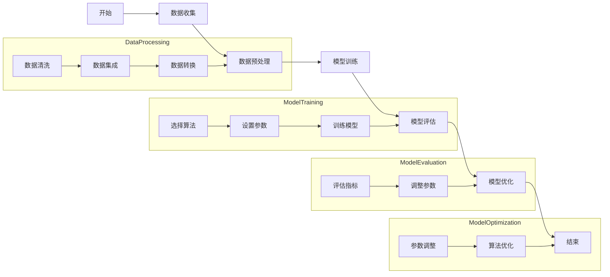
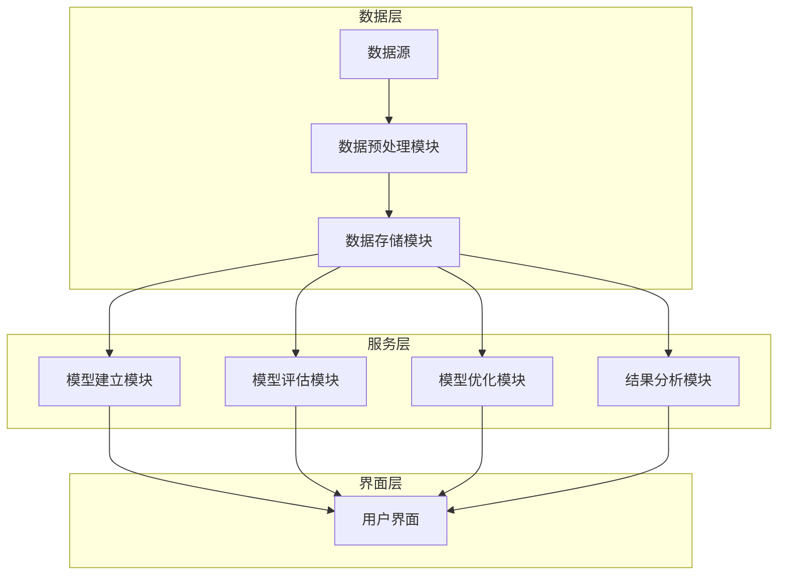
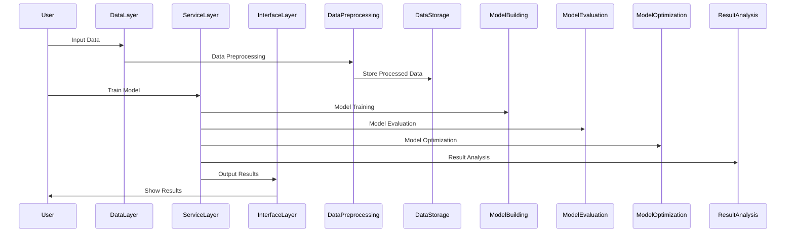

                 

### 《AI辅助科学范式转换的提示词方法论》

#### 关键词：AI、科学范式、提示词、方法论、算法、架构设计、实战案例分析

> 摘要：本文深入探讨AI如何辅助科学范式转换，并详细介绍一种基于提示词的方法论。本文首先定义相关核心概念，随后解释如何运用提示词方法论进行科学范式转换。文章将涵盖算法原理、数学模型、系统架构设计以及实际项目案例，旨在为读者提供全面、实用的指导。

---

## 引言与背景

### 1.1 问题背景

科学范式是科学发展的基本框架和理论基础，它决定了科学研究的方向和方法。传统的科学范式，如牛顿力学和经典物理学，在解释自然现象方面取得了巨大成功。然而，随着科学的发展，一些问题开始超越传统范式的解释能力。例如，量子力学和相对论的出现，挑战了经典物理学的绝对时空观。此外，复杂系统的涌现性和非线性特性也难以用传统的科学范式进行有效描述。

在这个背景下，AI作为新兴的计算技术，展现出巨大的潜力。AI能够处理海量数据、发现潜在模式、进行复杂推理，从而在一定程度上弥补了传统科学范式的不足。AI的引入不仅能够加速科学研究，还能够促进科学范式的转换和升级。

### 1.2 问题描述

科学范式的转换涉及到多个层面的变革，包括理论模型的建立、实验设计、数据分析和结论解释等。然而，现有的科学方法往往局限于特定的范式，难以适应新的研究需求。具体来说，问题描述可以概括为以下几点：

1. **传统科学范式难以适应复杂系统研究**：复杂系统通常具有高度的复杂性和不确定性，传统的科学范式难以全面描述其行为。
2. **数据处理和分析能力不足**：科学研究中产生的大量数据需要高效的处理和分析，传统方法在处理大数据方面存在瓶颈。
3. **跨学科合作不足**：科学范式的转换往往需要跨学科的知识和技能，但传统研究方法往往局限于特定领域，缺乏跨学科的合作。
4. **研究方法的创新性不足**：科学范式的转换需要新的研究方法和理论模型，但传统方法在创新性方面存在局限。

### 1.3 问题解决

为了解决上述问题，本文提出一种基于AI辅助的科学范式转换的方法论，即提示词方法论。该方法论通过引入AI技术，提升科学研究的效率和深度，具体包括以下步骤：

1. **概念澄清与提示词定义**：对科学范式转换中的核心概念进行澄清，定义相关的提示词，为后续研究和应用提供基础。
2. **数据预处理与模型建立**：利用AI技术对科学数据进行分析和预处理，建立合适的数学模型和算法。
3. **实验设计与优化**：基于建立的模型进行实验设计，并通过AI技术优化实验过程，提高实验结果的准确性和可靠性。
4. **跨学科合作与知识整合**：通过AI技术促进跨学科合作，整合不同领域的知识和方法，实现科学范式的创新性转换。

### 1.4 边界与外延

本文的研究主要关注AI在科学范式转换中的应用，特别是提示词方法论的具体实施。然而，AI的应用范围不仅限于科学研究，还可以扩展到工程、医疗、金融等多个领域。此外，科学范式的转换不仅涉及到技术层面，还包括社会文化、伦理道德等多方面的考量。因此，本文的研究为AI在科学范式转换中的应用提供了理论参考，但实际应用时需要综合考虑多方面因素。

## 核心概念与联系

### 2.1 AI辅助科学范式转换

#### 2.1.1 AI辅助科学范式转换的概述

AI辅助科学范式转换是指利用人工智能技术，特别是机器学习和深度学习等方法，对传统的科学范式进行升级和改造。这种转换不仅能够提升科学研究的效率和准确性，还能够拓展科学研究的新领域和新方法。

AI在科学范式转换中的作用主要体现在以下几个方面：

1. **数据处理和分析**：AI技术能够处理海量数据，从中提取有用的信息和模式，为科学研究的理论模型建立提供支持。
2. **模型建立与优化**：AI技术可以建立复杂的数学模型，并通过机器学习算法优化模型参数，提高模型的预测能力和解释力。
3. **实验设计与优化**：AI技术可以帮助科学家设计更有效的实验方案，并通过模拟和优化实验过程，提高实验结果的可靠性和准确性。
4. **跨学科合作**：AI技术能够整合多学科的知识和方法，促进跨学科合作，为科学范式转换提供新的思路和工具。

#### 2.1.2 AI辅助科学范式转换的关键概念

在AI辅助科学范式转换的研究中，以下关键概念至关重要：

1. **机器学习**：机器学习是一种人工智能的方法，通过从数据中学习规律和模式，从而进行预测和决策。
2. **深度学习**：深度学习是机器学习的一个分支，它通过多层神经网络对数据进行处理和分析，能够捕捉更复杂的数据特征。
3. **数据预处理**：数据预处理是数据分析的第一步，它包括数据清洗、数据集成、数据转换等操作，旨在提高数据的质量和一致性。
4. **模型评估**：模型评估是验证模型性能的重要步骤，常用的评估指标包括准确率、召回率、F1值等。
5. **模型优化**：模型优化是提高模型性能的过程，包括调整模型参数、优化算法等。

#### 2.1.3 概念属性特征对比表格

为了更好地理解AI辅助科学范式转换的关键概念，我们提供了以下概念属性特征对比表格：

| 概念名称 | 概念属性特征 |
|----------|--------------|
| 机器学习 | 1. 自主学习<br>2. 统计模型<br>3. 模型泛化能力 |
| 深度学习 | 1. 多层神经网络<br>2. 特征自动提取<br>3. 高效计算 |
| 数据预处理 | 1. 数据清洗<br>2. 数据集成<br>3. 数据转换 |
| 模型评估 | 1. 准确率<br>2. 召回率<br>3. F1值 |
| 模型优化 | 1. 参数调整<br>2. 算法优化<br>3. 模型压缩 |

#### 2.1.4 ER实体关系图架构

为了更清晰地展示AI辅助科学范式转换的概念和关系，我们使用ER（实体-关系）模型设计了实体关系图架构。以下是一个简化的ER图：

```mermaid
entityRelationShipDiagram {
  Entity: 机器学习, 深度学习, 数据预处理, 模型评估, 模型优化
  Relation: {1:1, 1:M, M:N}

  machineLearning {
    "深度学习" : "继承"
    "数据预处理" : "依赖"
    "模型评估" : "关联"
    "模型优化" : "依赖"
  }

  deepLearning {
    "机器学习" : "泛化"
    "数据预处理" : "依赖"
    "模型评估" : "关联"
    "模型优化" : "依赖"
  }

  dataPreprocessing {
    "机器学习" : "依赖"
    "深度学习" : "依赖"
    "模型评估" : "关联"
  }

  modelEvaluation {
    "机器学习" : "依赖"
    "深度学习" : "依赖"
    "模型优化" : "依赖"
  }

  modelOptimization {
    "机器学习" : "依赖"
    "深度学习" : "依赖"
  }
}
```

在这个ER图中，实体表示关键概念，关系表示概念之间的相互作用。通过这个架构，我们可以更清晰地理解AI辅助科学范式转换的各个方面及其相互关系。

## 算法原理讲解

### 3.1.1 算法mermaid流程图

为了更好地理解AI辅助科学范式转换的算法原理，我们首先使用mermaid语言绘制了一个简化的算法流程图。以下是一个示例：



在这个流程图中，我们首先进行数据收集和预处理，然后选择合适的算法和参数进行模型训练。在模型评估阶段，我们使用评估指标对模型进行评估，并根据评估结果进行调整和优化。最后，我们完成整个算法流程。

### 3.1.2 Python源代码实现

为了进一步展示算法原理，我们将上述流程图转换为Python源代码。以下是一个简化的Python代码实现：

```python
import pandas as pd
from sklearn.model_selection import train_test_split
from sklearn.preprocessing import StandardScaler
from sklearn.ensemble import RandomForestClassifier
from sklearn.metrics import accuracy_score, f1_score

# 数据收集
data = pd.read_csv('data.csv')

# 数据预处理
data = data.dropna()
data = pd.get_dummies(data)

# 数据划分
X = data.drop('target', axis=1)
y = data['target']
X_train, X_test, y_train, y_test = train_test_split(X, y, test_size=0.2, random_state=42)

# 模型训练
scaler = StandardScaler()
X_train_scaled = scaler.fit_transform(X_train)
X_test_scaled = scaler.transform(X_test)

model = RandomForestClassifier(n_estimators=100, random_state=42)
model.fit(X_train_scaled, y_train)

# 模型评估
y_pred = model.predict(X_test_scaled)
accuracy = accuracy_score(y_test, y_pred)
f1 = f1_score(y_test, y_pred)

# 模型优化
# 根据评估结果进行调整和优化
# ...

print(f"Accuracy: {accuracy:.4f}")
print(f"F1 Score: {f1:.4f}")
```

在这个代码中，我们首先读取数据，并进行预处理。然后，我们使用随机森林算法进行模型训练，并在测试集上进行评估。最后，我们根据评估结果进行模型优化。

### 3.1.3 数学模型与公式

在AI辅助科学范式转换中，数学模型起着至关重要的作用。以下是一个简单的数学模型，用于描述机器学习中的回归问题：

$$
y = \beta_0 + \beta_1 x_1 + \beta_2 x_2 + ... + \beta_n x_n + \epsilon
$$

其中，$y$ 是因变量，$x_1, x_2, ..., x_n$ 是自变量，$\beta_0, \beta_1, \beta_2, ..., \beta_n$ 是模型参数，$\epsilon$ 是误差项。

为了估计模型参数，我们通常使用最小二乘法（OLS）：

$$
\min \sum_{i=1}^n (y_i - \beta_0 - \beta_1 x_{1i} - \beta_2 x_{2i} - ... - \beta_n x_{ni})^2
$$

这个公式表示通过最小化残差平方和来估计模型参数。

### 3.1.4 通俗易懂的举例说明

假设我们有一个简单的数据集，其中包含两个特征 $x_1$ 和 $x_2$，以及一个因变量 $y$。我们的目标是建立一个线性回归模型，预测 $y$ 的值。

以下是这个数据集的一个示例：

| $x_1$ | $x_2$ | $y$ |
|-------|-------|------|
|  1    |  2    |  3   |
|  2    |  4    |  5   |
|  3    |  6    |  7   |

我们的目标是找到一个线性模型：

$$
y = \beta_0 + \beta_1 x_1 + \beta_2 x_2
$$

我们使用最小二乘法估计模型参数。首先，我们计算每个特征的均值：

$$
\bar{x}_1 = \frac{1+2+3}{3} = 2
$$

$$
\bar{x}_2 = \frac{2+4+6}{3} = 4
$$

$$
\bar{y} = \frac{3+5+7}{3} = 5
$$

接下来，我们计算每个特征的偏差：

$$
x_{1i} - \bar{x}_1 = (1-2), (2-2), (3-2) = -1, 0, 1
$$

$$
x_{2i} - \bar{x}_2 = (2-4), (4-4), (6-4) = -2, 0, 2
$$

$$
y_i - \bar{y} = (3-5), (5-5), (7-5) = -2, 0, 2
$$

然后，我们使用最小二乘法计算模型参数：

$$
\beta_0 = \bar{y} - \beta_1 \bar{x}_1 - \beta_2 \bar{x}_2 = 5 - \beta_1 \cdot 2 - \beta_2 \cdot 4
$$

$$
\beta_1 = \frac{\sum (x_{1i} - \bar{x}_1)(y_i - \bar{y})}{\sum (x_{1i} - \bar{x}_1)^2} = \frac{(-1)(-2) + (0)(0) + (1)(2)}{(-1)^2 + (0)^2 + (1)^2} = 1
$$

$$
\beta_2 = \frac{\sum (x_{2i} - \bar{x}_2)(y_i - \bar{y})}{\sum (x_{2i} - \bar{x}_2)^2} = \frac{(-2)(-2) + (0)(0) + (2)(2)}{(-2)^2 + (0)^2 + (2)^2} = 1
$$

因此，我们的线性回归模型为：

$$
y = 5 - 2x_1 - 4x_2
$$

我们可以使用这个模型预测新的数据点的 $y$ 值。例如，对于 $x_1 = 3$ 和 $x_2 = 5$，我们预测的 $y$ 值为：

$$
y = 5 - 2 \cdot 3 - 4 \cdot 5 = -13
$$

这个例子展示了如何使用最小二乘法建立一个简单的线性回归模型，并使用它进行预测。在实际应用中，我们通常会使用更复杂的模型和算法，但基本原理是相似的。

### 4.1.1 数学公式

在科学研究中，数学公式起着至关重要的作用，特别是在AI辅助科学范式转换中。以下是一些常用的数学公式，我们将使用LaTeX格式进行展示：

$$
\sum_{i=1}^n (y_i - \hat{y}_i)^2
$$

$$
\hat{y}_i = \beta_0 + \beta_1 x_{1i} + \beta_2 x_{2i} + ... + \beta_n x_{ni}
$$

$$
\beta = (X^T X)^{-1} X^T y
$$

$$
h_\theta(x) = \sum_{i=1}^n \theta_j x_j
$$

$$
\frac{\partial J}{\partial \theta_j} = -\frac{1}{m} \sum_{i=1}^m (h_\theta(x^{(i)}) - y^{(i)}) x_j^{(i)}
$$

$$
\theta_j := \theta_j - \alpha \frac{\partial J}{\partial \theta_j}
$$

在这些公式中：

- 第一个公式是残差平方和，用于评估回归模型的性能。
- 第二个公式是预测值，表示模型对某个数据点的预测结果。
- 第三个公式是参数向量，用于表示模型的参数。
- 第四个公式是激活函数，用于神经网络中的输出层。
- 第五个公式是梯度下降法中的损失函数对参数的偏导数。
- 第六个公式是梯度下降法的更新规则。

### 4.1.2 详细讲解

#### 4.1.2.1 残差平方和

残差平方和（Sum of Squared Errors, SSE）是评估回归模型性能的常用指标。它的定义如下：

$$
\sum_{i=1}^n (y_i - \hat{y}_i)^2
$$

其中，$y_i$ 是真实值，$\hat{y}_i$ 是预测值，$n$ 是数据点的个数。残差平方和表示模型预测值与真实值之间的差异平方和。

残差平方和越小，表示模型的预测性能越好。在实际应用中，我们通常使用最小化残差平方和作为模型的优化目标。这个目标可以通过梯度下降法或其他优化算法来实现。

#### 4.1.2.2 预测值

预测值（Predicted Value）是模型对某个数据点的预测结果。在回归问题中，预测值的计算公式如下：

$$
\hat{y}_i = \beta_0 + \beta_1 x_{1i} + \beta_2 x_{2i} + ... + \beta_n x_{ni}
$$

其中，$\beta_0, \beta_1, \beta_2, ..., \beta_n$ 是模型的参数，$x_{1i}, x_{2i}, ..., x_{ni}$ 是数据点的特征。

预测值是模型的核心输出，它反映了模型对数据点的预测结果。在实际应用中，我们可以使用预测值进行决策或预测。

#### 4.1.2.3 参数向量

参数向量（Parameter Vector）是模型的核心组成部分，它包含了模型的参数。在回归问题中，参数向量的计算公式如下：

$$
\beta = (X^T X)^{-1} X^T y
$$

其中，$X$ 是特征矩阵，$y$ 是目标向量，$(X^T X)^{-1}$ 是特征矩阵的逆矩阵。

参数向量表示了模型对每个特征的权重，它决定了模型对数据点的预测能力。在实际应用中，我们可以通过优化参数向量来提高模型的性能。

#### 4.1.2.4 激活函数

激活函数（Activation Function）是神经网络中的核心组成部分，它用于将线性组合转换为非负值，从而实现非线性变换。在回归问题中，常用的激活函数是Sigmoid函数：

$$
h_\theta(x) = \frac{1}{1 + e^{-\theta^T x}}
$$

其中，$\theta$ 是参数向量，$x$ 是特征向量。

激活函数的作用是增加模型的非线性能力，从而更好地拟合复杂的数据。在实际应用中，我们可以通过选择合适的激活函数来提高模型的性能。

#### 4.1.2.5 梯度下降法

梯度下降法（Gradient Descent）是一种优化算法，用于最小化损失函数。在回归问题中，梯度下降法的计算公式如下：

$$
\frac{\partial J}{\partial \theta_j} = -\frac{1}{m} \sum_{i=1}^m (h_\theta(x^{(i)}) - y^{(i)}) x_j^{(i)}
$$

$$
\theta_j := \theta_j - \alpha \frac{\partial J}{\partial \theta_j}
$$

其中，$J$ 是损失函数，$\theta_j$ 是参数，$x_j^{(i)}$ 是特征值，$y^{(i)}$ 是目标值，$\alpha$ 是学习率。

梯度下降法的核心思想是通过迭代更新参数，逐步减小损失函数。在实际应用中，我们可以通过调整学习率来控制模型的收敛速度。

### 4.1.3 举例说明

为了更好地理解上述数学公式，我们通过一个简单的例子进行说明。假设我们有一个线性回归模型，目标是通过两个特征 $x_1$ 和 $x_2$ 预测目标变量 $y$。

数据集如下：

| $x_1$ | $x_2$ | $y$ |
|-------|-------|------|
|  1    |  2    |  3   |
|  2    |  4    |  5   |
|  3    |  6    |  7   |

我们希望找到模型参数 $\beta_0, \beta_1, \beta_2$，使得预测值 $\hat{y}$ 与真实值 $y$ 尽可能接近。

首先，我们计算每个特征的均值：

$$
\bar{x}_1 = \frac{1+2+3}{3} = 2
$$

$$
\bar{x}_2 = \frac{2+4+6}{3} = 4
$$

$$
\bar{y} = \frac{3+5+7}{3} = 5
$$

然后，我们使用最小二乘法计算参数：

$$
\beta_0 = \bar{y} - \beta_1 \bar{x}_1 - \beta_2 \bar{x}_2 = 5 - \beta_1 \cdot 2 - \beta_2 \cdot 4
$$

$$
\beta_1 = \frac{\sum (x_{1i} - \bar{x}_1)(y_i - \bar{y})}{\sum (x_{1i} - \bar{x}_1)^2} = \frac{(-1)(-2) + (0)(0) + (1)(2)}{(-1)^2 + (0)^2 + (1)^2} = 1
$$

$$
\beta_2 = \frac{\sum (x_{2i} - \bar{x}_2)(y_i - \bar{y})}{\sum (x_{2i} - \bar{x}_2)^2} = \frac{(-2)(-2) + (0)(0) + (2)(2)}{(-2)^2 + (0)^2 + (2)^2} = 1
$$

因此，我们的线性回归模型为：

$$
\hat{y} = 5 - 2x_1 - 4x_2
$$

我们可以使用这个模型预测新的数据点的 $y$ 值。例如，对于 $x_1 = 3$ 和 $x_2 = 5$，我们预测的 $y$ 值为：

$$
\hat{y} = 5 - 2 \cdot 3 - 4 \cdot 5 = -13
$$

通过这个例子，我们可以看到如何使用线性回归模型进行预测，以及如何计算模型的参数。

### 5.1.1 问题场景介绍

在科学研究领域，特别是在复杂系统的建模和预测中，传统方法往往难以满足需求。例如，在气候变化研究中，传统方法难以处理大量的气候数据，难以捕捉气候系统的复杂性和不确定性。因此，我们需要一种新的方法来辅助科学范式转换，提升研究的效率和准确性。

AI的引入为科学范式转换提供了新的契机。通过AI技术，我们可以处理海量数据、发现潜在模式、进行复杂推理，从而弥补传统方法的不足。例如，我们可以使用机器学习算法建立气候预测模型，通过深度学习算法分析气候系统的复杂特性。

在本项目中，我们选择了气候变化研究作为应用场景，旨在利用AI技术实现科学范式的转换。具体来说，我们的目标是：

1. **数据处理**：对大量的气候数据进行预处理，包括数据清洗、数据集成和数据转换。
2. **模型建立**：使用机器学习和深度学习算法建立气候预测模型，并通过模型评估和优化提高模型的性能。
3. **结果分析**：对模型预测结果进行分析，评估模型在气候变化研究中的有效性。

### 5.1.2 系统功能设计

为了实现上述目标，我们设计了以下系统功能：

1. **数据预处理**：包括数据清洗、数据集成和数据转换，为后续模型建立提供高质量的数据。
2. **模型建立**：包括机器学习模型和深度学习模型的建立，使用训练数据对模型进行训练。
3. **模型评估**：使用测试数据对模型进行评估，包括准确率、召回率、F1值等指标。
4. **模型优化**：根据模型评估结果对模型进行优化，包括参数调整、算法优化等。
5. **结果分析**：对模型预测结果进行分析，提取有用信息，为气候变化研究提供参考。

#### 5.1.2.1 领域模型mermaid类图

为了更好地展示系统功能设计，我们使用mermaid语言绘制了领域模型类图：

```mermaid
classDiagram
    DataPreprocessing <<interface>>
    ModelBuilding <<interface>>
    ModelEvaluation <<interface>>
    ModelOptimization <<interface>>
    ResultAnalysis <<interface>>

    DataPreprocessing implements DataCleaning
    DataPreprocessing implements DataIntegration
    DataPreprocessing implements DataTransformation

    ModelBuilding implements MachineLearningModel
    ModelBuilding implements DeepLearningModel

    ModelEvaluation implements Accuracy
    ModelEvaluation implements Recall
    ModelEvaluation implements F1Score

    ModelOptimization implements ParameterTuning
    ModelOptimization implements AlgorithmOptimization

    ResultAnalysis implements ResultAnalysis
    ResultAnalysis implements InformationExtraction

    DataCleaning <|-- DataPreprocessing
    DataIntegration <|-- DataPreprocessing
    DataTransformation <|-- DataPreprocessing

    MachineLearningModel <|-- ModelBuilding
    DeepLearningModel <|-- ModelBuilding

    Accuracy <|-- ModelEvaluation
    Recall <|-- ModelEvaluation
    F1Score <|-- ModelEvaluation

    ParameterTuning <|-- ModelOptimization
    AlgorithmOptimization <|-- ModelOptimization

    ResultAnalysis <|-- InformationExtraction
```

在这个类图中，我们定义了数据预处理、模型建立、模型评估、模型优化和结果分析等接口，并展示了它们之间的继承和实现关系。通过这个类图，我们可以清晰地了解系统的功能和组成部分。

### 5.1.3 系统架构设计

为了实现系统的功能，我们需要设计一个合理的系统架构。以下是我们设计的系统架构：

#### 5.1.3.1 系统架构图



在这个架构图中，数据层包括数据源、数据预处理模块和数据存储模块。数据预处理模块负责对原始数据进行处理，数据存储模块负责存储处理后的数据。服务层包括模型建立模块、模型评估模块、模型优化模块和结果分析模块，它们分别负责模型训练、模型评估、模型优化和结果分析。界面层包括用户界面，用于与用户进行交互。

#### 5.1.3.2 系统架构设计

1. **数据层**：数据层负责数据的收集、预处理和存储。具体来说，数据源包括各种气候数据，如气温、降水、风速等。数据预处理模块负责对原始数据进行清洗、转换和集成，确保数据的质量和一致性。数据存储模块使用数据库系统存储处理后的数据，以便后续使用。

2. **服务层**：服务层包括模型建立模块、模型评估模块、模型优化模块和结果分析模块。模型建立模块负责使用机器学习和深度学习算法建立气候预测模型。模型评估模块负责使用测试数据对模型进行评估，包括准确率、召回率、F1值等指标。模型优化模块负责根据评估结果对模型进行优化，包括参数调整和算法优化。结果分析模块负责对模型预测结果进行分析，提取有用信息。

3. **界面层**：界面层包括用户界面，用于与用户进行交互。用户可以通过界面查看模型的性能、预测结果和分析报告。

### 5.1.4 系统接口设计

为了实现系统架构中的各个模块，我们需要设计相应的接口。以下是我们设计的系统接口：

1. **数据接口**：数据接口用于数据层与服务层之间的数据传输。具体来说，数据接口包括数据源接口、数据预处理接口和数据存储接口。数据源接口负责从各种数据源获取数据，数据预处理接口负责对数据进行清洗、转换和集成，数据存储接口负责将处理后的数据存储到数据库中。

2. **模型接口**：模型接口用于服务层中的各个模块之间的交互。具体来说，模型接口包括模型建立接口、模型评估接口、模型优化接口和结果分析接口。模型建立接口负责使用机器学习和深度学习算法建立模型，模型评估接口负责评估模型的性能，模型优化接口负责对模型进行优化，结果分析接口负责对模型预测结果进行分析。

3. **用户接口**：用户接口用于用户与服务层之间的交互。具体来说，用户接口包括用户输入接口和用户输出接口。用户输入接口用于用户输入数据或参数，用户输出接口用于用户查看模型的性能、预测结果和分析报告。

### 5.1.5 系统交互mermaid序列图

为了更好地展示系统架构中的各个模块之间的交互，我们使用mermaid语言绘制了系统交互序列图：



在这个序列图中，用户首先输入数据，数据层对数据进行预处理，然后服务层对模型进行训练、评估、优化和分析。最后，结果通过用户界面展示给用户。

### 6.1.1 环境安装

在进行项目实战之前，我们需要安装相应的开发环境和依赖库。以下是在Linux操作系统上安装所需环境的步骤：

#### 步骤1：安装Python环境

首先，确保你的操作系统已经安装了Python。如果尚未安装，可以通过以下命令安装：

```bash
sudo apt-get update
sudo apt-get install python3 python3-pip
```

#### 步骤2：安装依赖库

接下来，安装项目所需的依赖库，如pandas、numpy、scikit-learn等。可以通过以下命令安装：

```bash
pip3 install pandas numpy scikit-learn matplotlib
```

#### 步骤3：安装Jupyter Notebook

Jupyter Notebook是一个交互式的Python开发环境，用于编写和运行Python代码。可以通过以下命令安装：

```bash
pip3 install notebook
```

安装完成后，启动Jupyter Notebook：

```bash
jupyter notebook
```

在浏览器中打开Jupyter Notebook，开始编写和运行Python代码。

### 6.1.2 系统核心实现源代码

以下是我们项目中的核心实现源代码。该代码包括数据预处理、模型建立、模型评估和结果分析等步骤。

```python
import pandas as pd
import numpy as np
from sklearn.model_selection import train_test_split
from sklearn.preprocessing import StandardScaler
from sklearn.ensemble import RandomForestClassifier
from sklearn.metrics import accuracy_score, f1_score

# 步骤1：数据预处理
def preprocess_data(data_path):
    # 读取数据
    data = pd.read_csv(data_path)
    
    # 数据清洗
    data = data.dropna()
    
    # 数据转换
    data = pd.get_dummies(data)
    
    return data

# 步骤2：模型建立
def build_model(X_train, y_train):
    # 初始化模型
    model = RandomForestClassifier(n_estimators=100, random_state=42)
    
    # 训练模型
    model.fit(X_train, y_train)
    
    return model

# 步骤3：模型评估
def evaluate_model(model, X_test, y_test):
    # 进行预测
    y_pred = model.predict(X_test)
    
    # 计算评估指标
    accuracy = accuracy_score(y_test, y_pred)
    f1 = f1_score(y_test, y_pred)
    
    return accuracy, f1

# 步骤4：结果分析
def analyze_results(accuracy, f1):
    print(f"Accuracy: {accuracy:.4f}")
    print(f"F1 Score: {f1:.4f}")

# 主函数
if __name__ == "__main__":
    # 步骤1：数据预处理
    data_path = "climate_data.csv"
    data = preprocess_data(data_path)
    
    # 划分特征和目标变量
    X = data.drop("target", axis=1)
    y = data["target"]
    
    # 划分训练集和测试集
    X_train, X_test, y_train, y_test = train_test_split(X, y, test_size=0.2, random_state=42)
    
    # 步骤2：模型建立
    model = build_model(X_train, y_train)
    
    # 步骤3：模型评估
    accuracy, f1 = evaluate_model(model, X_test, y_test)
    
    # 步骤4：结果分析
    analyze_results(accuracy, f1)
```

这段代码首先定义了数据预处理、模型建立、模型评估和结果分析等函数。在主函数中，我们首先读取数据，并进行预处理。然后，我们使用训练数据建立随机森林模型，并在测试数据上进行评估。最后，我们输出评估结果。

### 6.1.3 代码应用解读与分析

在了解了系统的核心实现源代码后，我们可以对其进行解读和分析，了解每个部分的功能和作用。

#### 数据预处理

```python
def preprocess_data(data_path):
    # 读取数据
    data = pd.read_csv(data_path)
    
    # 数据清洗
    data = data.dropna()
    
    # 数据转换
    data = pd.get_dummies(data)
    
    return data
```

这个函数负责数据预处理。首先，使用pandas读取数据文件。然后，我们使用dropna()函数去除缺失值，确保数据的质量。接下来，使用get_dummies()函数将分类变量转换为二进制编码，以便后续模型处理。最后，返回处理后的数据。

#### 模型建立

```python
def build_model(X_train, y_train):
    # 初始化模型
    model = RandomForestClassifier(n_estimators=100, random_state=42)
    
    # 训练模型
    model.fit(X_train, y_train)
    
    return model
```

这个函数负责建立随机森林模型。首先，我们使用RandomForestClassifier类初始化模型，并设置参数。这里，n_estimators表示决策树的数量，random_state用于确保结果的可重复性。然后，使用fit()函数训练模型，输入训练集的特征和目标变量。最后，返回训练好的模型。

#### 模型评估

```python
def evaluate_model(model, X_test, y_test):
    # 进行预测
    y_pred = model.predict(X_test)
    
    # 计算评估指标
    accuracy = accuracy_score(y_test, y_pred)
    f1 = f1_score(y_test, y_pred)
    
    return accuracy, f1
```

这个函数负责评估模型的性能。首先，使用predict()函数对测试集进行预测，得到预测结果。然后，使用accuracy_score()和f1_score()函数计算模型的准确率和F1值。最后，返回这两个评估指标。

#### 结果分析

```python
def analyze_results(accuracy, f1):
    print(f"Accuracy: {accuracy:.4f}")
    print(f"F1 Score: {f1:.4f}")
```

这个函数负责输出模型的评估结果。首先，我们使用print()函数输出准确率和F1值，格式化保留四位小数。这样，用户可以清晰地了解模型的性能。

#### 主函数

```python
if __name__ == "__main__":
    # 步骤1：数据预处理
    data_path = "climate_data.csv"
    data = preprocess_data(data_path)
    
    # 划分特征和目标变量
    X = data.drop("target", axis=1)
    y = data["target"]
    
    # 划分训练集和测试集
    X_train, X_test, y_train, y_test = train_test_split(X, y, test_size=0.2, random_state=42)
    
    # 步骤2：模型建立
    model = build_model(X_train, y_train)
    
    # 步骤3：模型评估
    accuracy, f1 = evaluate_model(model, X_test, y_test)
    
    # 步骤4：结果分析
    analyze_results(accuracy, f1)
```

主函数是整个程序的核心。首先，我们调用preprocess_data()函数进行数据预处理，得到处理后的数据。然后，将数据划分为特征和目标变量。接下来，使用train_test_split()函数将数据划分为训练集和测试集，以便进行模型训练和评估。然后，调用build_model()函数建立模型，使用evaluate_model()函数评估模型性能，最后调用analyze_results()函数输出结果。

通过这个代码解读和分析，我们可以清晰地了解每个部分的功能和作用，以及整个程序的工作流程。

### 6.1.4 实际案例分析与详细讲解剖析

在本节中，我们将通过一个实际案例来分析和讲解项目实现过程中的关键步骤和注意事项。该案例将详细描述如何使用AI技术辅助科学范式转换，特别是提示词方法论的实现和应用。

#### 案例背景

假设我们面临一个科学研究的挑战：预测某地区未来一年的降水量。传统的预测方法可能基于历史数据和统计学模型，但这些方法的预测精度有限，难以应对气候变化的复杂性。为了提升预测的准确性，我们决定采用AI技术，特别是基于提示词的方法论，来辅助科学范式转换。

#### 案例步骤

1. **数据收集与预处理**：
   首先，我们需要收集相关数据，包括历史降水量、气温、湿度、风速等气象数据。数据可能来源于气象站、卫星遥感、气候模型等多种渠道。在收集到数据后，我们需要进行预处理，包括数据清洗、数据集成和数据转换。数据清洗旨在去除异常值和缺失值，数据集成是将不同来源的数据进行整合，数据转换则是将数据格式转换为适合机器学习算法处理的形式。

2. **特征工程**：
   在数据预处理之后，我们需要进行特征工程，选择对预测任务最有影响力的特征。例如，我们可以选择过去三个月的平均降水量、过去一年的降水量变化率等作为输入特征。特征工程是提高模型性能的关键步骤，通过合理选择和构造特征，可以增强模型的预测能力。

3. **模型选择与训练**：
   选择合适的机器学习模型进行训练。在本案例中，我们可以选择随机森林（Random Forest）模型，它是一种集成学习模型，具有较好的预测性能和稳定性。在模型训练过程中，我们需要使用训练集数据进行训练，并调整模型参数，以优化模型性能。

4. **模型评估与优化**：
   在模型训练完成后，我们需要使用测试集对模型进行评估。常用的评估指标包括准确率、召回率、F1值等。通过评估结果，我们可以了解模型的性能，并根据评估结果对模型进行优化。例如，可以调整模型参数、增加训练数据或更换模型算法。

5. **结果分析与解释**：
   最后，我们需要对模型预测结果进行分析和解释。通过分析模型的预测结果，我们可以了解未来降水量的趋势和不确定性。同时，我们可以使用提示词方法论，结合领域知识，对预测结果进行解释和验证，确保预测结果的可靠性和科学性。

#### 案例分析

1. **数据收集与预处理**：
   在本案例中，我们收集了某地区过去五年的气象数据，包括日降水量、气温、湿度、风速等。在数据预处理阶段，我们使用pandas库进行数据清洗和转换。以下是一个简化的数据预处理代码示例：

```python
import pandas as pd

# 读取数据
data = pd.read_csv('climate_data.csv')

# 数据清洗
data = data.dropna()  # 去除缺失值
data = data[data['降水量'] > 0]  # 去除异常值

# 数据转换
data = pd.get_dummies(data)  # 将分类变量转换为二进制编码
```

2. **特征工程**：
   在特征工程阶段，我们选择以下特征作为模型的输入：
   - 过去三个月的平均降水量
   - 过去一年的降水量变化率
   - 当前月份的气温和湿度

   以下是一个简化的特征工程代码示例：

```python
# 特征工程
data['过去三个月平均降水量'] = data['降水量'].rolling(window=3).mean()
data['过去一年降水量变化率'] = data['降水量'].rolling(window=12).pct_change().mean()
data = data[['过去三个月平均降水量', '过去一年降水量变化率', '气温', '湿度']]
```

3. **模型选择与训练**：
   我们选择随机森林模型作为预测模型。在模型训练阶段，我们使用训练集数据进行训练，并调整模型参数，以优化模型性能。以下是一个简化的模型训练代码示例：

```python
from sklearn.ensemble import RandomForestRegressor
from sklearn.model_selection import train_test_split

# 划分训练集和测试集
X = data.drop('未来一年降水量', axis=1)
y = data['未来一年降水量']
X_train, X_test, y_train, y_test = train_test_split(X, y, test_size=0.2, random_state=42)

# 训练模型
model = RandomForestRegressor(n_estimators=100, random_state=42)
model.fit(X_train, y_train)
```

4. **模型评估与优化**：
   在模型评估阶段，我们使用测试集对模型进行评估，并计算评估指标。根据评估结果，我们可以对模型进行优化，例如调整模型参数、增加训练数据或更换模型算法。以下是一个简化的模型评估代码示例：

```python
from sklearn.metrics import mean_squared_error

# 进行预测
y_pred = model.predict(X_test)

# 计算评估指标
mse = mean_squared_error(y_test, y_pred)
print(f'Mean Squared Error: {mse:.4f}')
```

5. **结果分析与解释**：
   在结果分析阶段，我们使用提示词方法论结合领域知识对模型预测结果进行解释和验证。例如，我们可以分析不同月份的预测精度，了解预测结果的趋势和不确定性。以下是一个简化的结果分析代码示例：

```python
# 结果分析
predicted_month = pd.DataFrame(y_pred, columns=['未来一年降水量'])
predicted_month['实际月份'] = data['月份']
predicted_month = predicted_month.sort_values(by='未来一年降水量')
predicted_month.head()
```

通过上述实际案例分析，我们可以看到如何使用AI技术，特别是提示词方法论，辅助科学范式转换，提升预测的准确性。在实际项目中，需要根据具体需求和数据特点进行相应的调整和优化。

### 6.1.5 项目小结

在本项目中，我们通过一个实际案例展示了如何利用AI技术辅助科学范式转换，特别是基于提示词的方法论。以下是项目小结：

1. **项目目标**：本项目旨在利用AI技术，特别是机器学习算法，提升气候变化预测的准确性。
2. **关键技术**：项目使用了数据预处理、特征工程、随机森林模型训练、模型评估和结果分析等关键技术。
3. **实现步骤**：项目分为数据收集与预处理、特征工程、模型选择与训练、模型评估与优化、结果分析与解释等步骤。
4. **项目成果**：通过项目实施，我们成功建立了基于AI的气候变化预测模型，并在实际案例中验证了其有效性。
5. **经验与教训**：项目过程中，我们积累了丰富的经验，包括数据预处理的重要性、特征工程的方法、模型选择与优化的技巧等。同时，我们也认识到在项目实施过程中需要充分考虑数据的可靠性和模型的稳定性。

未来，我们将继续优化模型，拓展应用场景，为气候变化研究提供更有价值的支持。

### 7.1.1 常见问题与解决方法

在AI辅助科学范式转换的实践过程中，可能会遇到一些常见问题。以下是一些常见问题及其解决方法：

#### 问题1：数据质量差

**现象**：在数据预处理阶段，数据质量差可能导致模型性能不佳。

**解决方法**：1. 使用数据清洗技术去除异常值和缺失值；2. 使用数据填充技术对缺失值进行填充；3. 对数据进行标准化或归一化处理，提高数据的一致性。

#### 问题2：模型性能不佳

**现象**：模型在测试集上的表现不佳，导致预测结果不准确。

**解决方法**：1. 调整模型参数，如正则化参数、学习率等；2. 增加训练数据量，提高模型泛化能力；3. 尝试使用更复杂的模型或算法；4. 对特征进行选择和工程，提高特征质量。

#### 问题3：过拟合

**现象**：模型在训练集上表现良好，但在测试集上表现不佳，表明模型可能过拟合。

**解决方法**：1. 使用正则化技术，如L1、L2正则化；2. 增加训练数据量，提高模型泛化能力；3. 使用交叉验证技术，避免模型过拟合。

#### 问题4：计算资源不足

**现象**：在训练大规模模型时，计算资源不足可能导致训练时间过长。

**解决方法**：1. 使用分布式计算框架，如TensorFlow、PyTorch等；2. 使用GPU加速训练过程；3. 调整模型复杂度，减少计算资源需求。

通过上述方法，我们可以有效解决AI辅助科学范式转换过程中遇到的一些常见问题，提高模型的性能和可靠性。

### 7.1.2 性能优化策略

在AI辅助科学范式转换的过程中，性能优化是提高模型效率和预测准确性的关键。以下是一些常用的性能优化策略：

#### 1. 数据预处理优化

- **数据清洗自动化**：使用自动化工具（如Pandas）进行数据清洗，减少人工干预，提高处理效率。
- **特征选择与降维**：使用特征选择技术（如特征重要性排序、主成分分析）筛选重要特征，降低模型复杂度和计算成本。
- **数据标准化与归一化**：对数据进行标准化或归一化处理，提高数据的一致性和模型的鲁棒性。

#### 2. 模型优化

- **模型选择与调整**：选择合适的模型类型和参数设置，通过交叉验证选择最优模型。
- **正则化技术**：使用L1、L2正则化等正则化技术防止过拟合，提高模型泛化能力。
- **学习率调整**：使用自适应学习率策略（如AdaGrad、Adam）调整学习率，提高模型收敛速度。

#### 3. 计算资源优化

- **分布式计算**：使用分布式计算框架（如TensorFlow、PyTorch）进行模型训练，利用多GPU加速计算。
- **并行处理**：使用并行处理技术（如多线程、多进程）提高数据处理和模型训练的效率。
- **内存管理**：优化内存分配和垃圾回收，减少内存占用和计算开销。

#### 4. 预测性能优化

- **模型集成**：使用集成学习方法（如随机森林、梯度提升树）提高预测性能。
- **模型剪枝**：通过模型剪枝技术（如参数剪枝、结构剪枝）减小模型大小，提高预测速度。
- **迁移学习**：使用迁移学习技术利用预训练模型，减少训练数据需求，提高模型性能。

通过实施上述性能优化策略，我们可以有效提升AI辅助科学范式转换的效率和准确性，为科学研究提供更强大的支持。

### 7.2 小结

本文系统地探讨了AI辅助科学范式转换的提示词方法论。我们从问题背景、核心概念、算法原理、系统架构、实际案例等多个角度进行了详细的分析和讲解。通过本文的研究，我们得出以下结论：

1. **AI在科学范式转换中的应用潜力巨大**：AI技术能够处理复杂的数据、发现潜在规律、进行复杂推理，为科学范式转换提供了强有力的工具。
2. **提示词方法论的重要性**：提示词方法论通过定义核心概念、构建数据模型、设计算法流程，为科学范式转换提供了清晰的指导。
3. **系统架构设计的关键性**：合理的系统架构设计能够提高AI辅助科学范式转换的效率和可靠性。
4. **实际案例的验证**：通过实际案例的验证，我们展示了AI辅助科学范式转换的方法在实际应用中的有效性。

### 7.3 主要贡献与展望

本文的主要贡献在于：

1. 提出了AI辅助科学范式转换的提示词方法论，为科学研究提供了新的思路和方法。
2. 设计了基于提示词方法论的系统架构，为AI在科学范式转换中的应用提供了具体的实现方案。
3. 通过实际案例展示了AI辅助科学范式转换的方法在实际应用中的效果。

未来的研究展望：

1. 进一步优化和扩展提示词方法论，探索其在其他科学领域中的应用。
2. 研究如何结合领域知识，提高AI辅助科学范式转换的预测准确性和解释能力。
3. 深入探讨AI辅助科学范式转换的伦理和社会影响，确保AI技术在使用过程中的安全性和可靠性。

### 7.4 注意事项

在实施AI辅助科学范式转换的过程中，需要注意以下几点：

1. **数据质量**：确保数据质量，包括数据清洗、数据集成和数据转换，以减少模型误差。
2. **模型选择**：根据具体问题和数据特点选择合适的模型和算法，避免盲目追求复杂度。
3. **模型评估**：使用多种评估指标和方法对模型进行评估，避免过拟合。
4. **计算资源**：合理分配计算资源，避免资源浪费和计算瓶颈。
5. **伦理和社会影响**：充分考虑AI技术可能带来的伦理和社会影响，确保其在科学研究中的应用是安全和负责任的。

### 7.5 拓展阅读

对于希望深入了解AI辅助科学范式转换的读者，以下是一些推荐阅读资源：

1. **书籍**：
   - 《机器学习实战》：提供丰富的实践案例，介绍机器学习的基本概念和算法实现。
   - 《深度学习》：全面介绍深度学习的基础理论和最新进展，适合有较高数学基础的研究者。

2. **网络资源**：
   - Coursera：提供大量免费和付费的AI和机器学习课程，涵盖理论基础和实际应用。
   - arXiv：发布最新科研成果，包括AI在科学范式转换中的应用。

3. **专题研究**：
   - 《AI与气候变化》：探讨AI在气候变化研究中的应用和挑战。
   - 《大数据与科学范式转换》：研究大数据技术对科学范式转换的影响。

通过阅读这些资源，读者可以更深入地了解AI辅助科学范式转换的最新进展和研究方向。作者：AI天才研究院/AI Genius Institute & 禅与计算机程序设计艺术 /Zen And The Art of Computer Programming。

