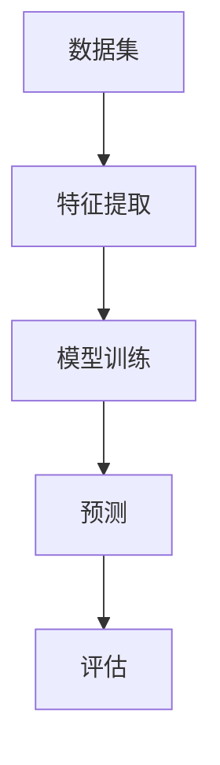
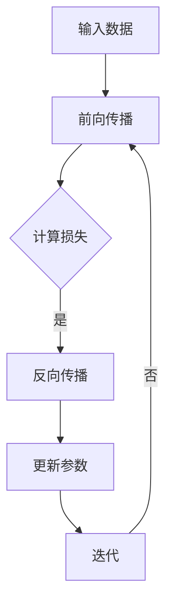

                 

### 第1章: 问题背景与核心概念

#### 1.1 问题背景

**科技发展的趋势**

当前，科技的发展正处于一个前所未有的快车道。大数据、云计算、物联网、区块链、人工智能等技术的飞速进步，正在深刻地改变着我们的生活方式和社会结构。科技的进步不仅仅体现在硬件设备的更新换代，更体现在软件算法的智能化和自动化上。特别是人工智能（AI）技术的崛起，其广泛的渗透力已经涉及到各个行业，从医疗健康到智能制造，从交通运输到金融服务，AI技术的应用正在推动各行业的转型升级。

**AI技术在科技领域的应用**

人工智能技术的应用，使得很多传统行业的操作变得更加智能化、自动化和高效化。例如，在医疗领域，AI技术可以辅助医生进行疾病诊断，通过分析大量的医学影像数据，提供更为准确的诊断结果。在智能制造领域，人工智能可以帮助企业实现生产线的自动化控制，提高生产效率和产品质量。在交通运输领域，AI技术被用于智能导航和自动驾驶系统，大幅提升了交通的安全性和效率。

**AI辅助科技前沿探索的意义**

AI辅助科技前沿探索，不仅能够加速科技创新的进程，还能够提升科技创新的质量。在科技前沿探索过程中，AI可以通过其强大的数据处理和分析能力，为科学家和工程师提供有力的工具，帮助他们在复杂的数据中找到规律，提出新的假设，加速科学发现和技术突破。此外，AI还可以帮助减少人为错误，提高实验的可靠性和重复性。

总之，AI技术的应用正在成为科技前沿探索的重要推动力，为科学家和工程师提供了前所未有的工具和资源。在这一背景下，理解AI辅助科技前沿探索的核心概念，探讨其应用方向和策略，具有重要的现实意义和长远的价值。

#### 1.2 核心概念

**AI辅助科技的定义**

AI辅助科技指的是利用人工智能技术，辅助科学家、工程师和其他专业人士进行科技研究和创新的过程。具体而言，AI可以承担大量的数据预处理、模式识别、预测分析和优化决策等工作，从而减少人为的干预，提高科研效率和准确性。

**科技前沿探索的概念**

科技前沿探索是指研究人员和开发者针对当前科技发展的最前沿领域，开展的创新性研究和探索。这一过程涉及对现有技术理论的挑战、新技术的发现和应用，以及跨学科、跨领域的综合研究。科技前沿探索的目标是推动科技进步，实现技术突破，进而带动社会和经济的全面发展。

**提示词生成的应用**

提示词生成（Query Generation）是人工智能领域中的一项关键技术，它旨在根据用户的需求或输入，自动生成相关的查询词或问题。在AI辅助科技前沿探索中，提示词生成技术可以用于以下几个关键场景：

1. **科研文献检索**：自动生成与特定研究主题相关的关键词或句子，用于快速检索相关的学术论文和文献。
2. **数据分析与建模**：在数据挖掘和分析过程中，提示词生成可以帮助识别和提出有价值的分析问题和假设。
3. **专家系统咨询**：在专家系统或智能问答系统中，提示词生成技术可以生成用户可能提出的问题，从而提升系统的交互能力和用户体验。
4. **内容生成**：在内容创作领域，提示词生成可以帮助自动生成相关的内容摘要、报告或文章，辅助创作者进行创作。

通过以上核心概念的介绍，我们可以更深入地理解AI辅助科技前沿探索的内涵和重要性。在接下来的章节中，我们将详细探讨AI技术的基础知识，以及提示词生成技术的原理和应用。

### 1.2.1 AI辅助科技的定义

AI辅助科技，是一种通过应用人工智能技术来提高科技研究和开发效率的方法。它不仅限于传统的数据分析、模式识别等任务，更包括利用机器学习、深度学习等先进技术，为科研人员提供智能化的工具和平台。AI辅助科技的定义可以从以下几个方面进行阐述：

1. **数据处理与分析**：AI技术可以处理和分析大量的数据，快速提取有价值的信息和模式。这为科学家和工程师提供了强有力的工具，使他们能够从海量数据中找到潜在的规律和关联，从而加速科研进程。

2. **自动化实验与优化**：AI技术可以自动化执行实验，并通过优化算法来提高实验效率和结果可靠性。例如，在药物研发过程中，AI可以帮助筛选和优化化合物，提高新药的发现速度。

3. **智能预测与决策支持**：通过机器学习模型，AI可以预测未来的趋势和结果，为决策者提供科学依据。例如，在气象预报中，AI模型可以根据历史数据和实时数据预测天气变化，帮助人们做好防范措施。

4. **跨学科协同研究**：AI技术不仅限于单一领域，它可以通过数据整合和知识融合，促进跨学科的研究。这有助于解决复杂问题，推动科学技术的综合发展。

AI辅助科技的定义不仅仅停留在技术层面，更重要的是它在实际科研中的应用。通过AI技术，科研人员可以更高效地完成数据分析和实验设计，减少重复性劳动，将更多时间和精力投入到创新和突破性的研究中。

#### 1.2.2 科技前沿探索的概念

科技前沿探索是指在全球范围内，科技领域尚未解决或者尚未完全解决的问题，是科研人员和研究机构努力追求的目标。科技前沿探索的定义可以从以下几个方面进行详细解释：

1. **未知领域的拓展**：科技前沿探索意味着进入那些未被充分研究和理解的领域，通常涉及到新兴技术和跨学科交叉。这些领域往往需要创新的思维和跨领域的知识整合。

2. **创新的科学发现**：在科技前沿探索过程中，科研人员会挑战现有的科学理论和技术框架，寻求新的科学发现和技术突破。这种探索往往伴随着高风险和高不确定性。

3. **技术突破的应用**：科技前沿探索不仅关注基础科学研究，还注重将新的科学发现转化为实际应用。这意味着在探索过程中，科研人员不仅要解决理论问题，还要考虑技术的可行性和商业化前景。

4. **推动社会进步**：科技前沿探索的成果往往能够带来深远的社会影响，推动社会进步和经济发展。例如，人工智能、基因编辑、量子计算等前沿技术，都可能在未来带来革命性的变革。

科技前沿探索不仅仅是科学家的任务，也是政府和企业的责任。政府需要提供政策和资金支持，以鼓励创新和科技发展。企业则需要通过投资研发，推动技术的商业应用和产业化。

#### 1.2.3 提示词生成的应用

提示词生成（Query Generation）是人工智能领域中的一项关键技术，它旨在根据用户的需求或输入，自动生成相关的查询词或问题。在AI辅助科技前沿探索中，提示词生成技术有着广泛的应用，以下将详细介绍其在几个关键场景中的具体作用：

1. **科研文献检索**：提示词生成可以帮助科研人员快速生成与特定研究主题相关的关键词或句子，用于检索相关的学术论文和文献。这大大提高了文献检索的效率和准确性，节省了科研人员的时间，使他们能够更快地获取最新的研究成果。

   - **应用实例**：例如，在生物医学领域，提示词生成技术可以根据用户输入的疾病名称或症状，自动生成相关的关键词，如“癌症治疗”、“新型药物”等，帮助用户快速定位到相关的文献。

2. **数据分析与建模**：在数据挖掘和分析过程中，提示词生成技术可以帮助识别和提出有价值的分析问题和假设。通过生成一系列相关的查询词，研究人员可以更深入地理解数据，发现潜在的模式和关联。

   - **应用实例**：例如，在金融领域，提示词生成技术可以帮助分析师生成与市场数据相关的查询词，如“股票价格波动”、“交易量增加”等，从而发现市场趋势和风险点。

3. **专家系统咨询**：在专家系统或智能问答系统中，提示词生成技术可以生成用户可能提出的问题，从而提升系统的交互能力和用户体验。

   - **应用实例**：例如，在法律咨询领域，智能问答系统可以通过提示词生成技术，自动生成用户可能提出的法律问题，如“合同违约责任”、“专利侵权”等，帮助用户快速获取法律咨询。

4. **内容生成**：在内容创作领域，提示词生成技术可以帮助自动生成相关的内容摘要、报告或文章，辅助创作者进行创作。

   - **应用实例**：例如，在新闻报道领域，提示词生成技术可以根据用户输入的新闻事件，自动生成新闻摘要和报告，提高新闻编辑的效率。

通过以上几个方面的介绍，我们可以看到提示词生成技术在AI辅助科技前沿探索中的重要性。它不仅提高了科研和数据分析的效率，还增强了智能问答系统和内容创作的能力，为科技前沿探索提供了有力的支持。

#### 1.2.4 提示词生成技术的研究现状

提示词生成技术作为人工智能领域的一个关键分支，近年来受到了广泛关注和深入研究。当前，该领域的研究现状可以从以下几个方面进行概述：

1. **技术发展历程**：提示词生成技术起源于信息检索和自然语言处理（NLP）领域。早期的研究主要集中在基于规则的方法和统计模型，如TF-IDF、LSI（Latent Semantic Indexing）和LDA（Latent Dirichlet Allocation）。随着深度学习技术的发展，基于神经网络的提示词生成方法逐渐成为研究热点。

2. **关键研究成果**：近年来，众多研究机构和学者在提示词生成领域取得了显著成果。例如，CNN（卷积神经网络）和RNN（循环神经网络）被广泛用于文本数据的处理和生成，极大地提升了提示词生成的准确性和效率。此外，基于预训练语言模型（如BERT、GPT）的方法在生成高质量提示词方面表现出了优越的性能。

3. **应用场景拓展**：提示词生成技术已逐步应用于多个领域，如智能问答系统、内容生成、智能客服和推荐系统等。通过实际应用案例，研究人员不断优化和改进提示词生成算法，提高其在不同场景下的适应性和效果。

4. **挑战与机遇**：尽管提示词生成技术取得了显著进展，但仍面临一些挑战。例如，如何生成更加多样化和个性化的提示词，如何在海量数据中高效地生成高质量的提示词，以及如何处理多语言和多模态数据等。这些问题为未来的研究提供了丰富的探索空间和机遇。

总之，提示词生成技术的研究现状显示出了巨大的发展潜力。随着技术的不断进步和应用场景的拓展，提示词生成技术在AI辅助科技前沿探索中的应用前景将更加广阔。

### 第2章: AI技术基础

#### 2.1 人工智能概述

**人工智能的定义与发展历程**

人工智能（Artificial Intelligence, AI）是计算机科学的一个分支，旨在通过模拟、延伸和扩展人的智能，使计算机系统能够执行通常需要人类智能才能完成的任务。人工智能的定义可以追溯到20世纪50年代，当时约翰·麦卡锡（John McCarthy）首次提出了人工智能这一概念。此后，人工智能经历了几个重要的发展阶段：

1. **初期探索（1956-1969）**：这一阶段以符号主义方法为主，通过逻辑推理和知识表示来模拟人类智能。典型代表是ELIZA程序，它能够进行简单的对话，但效果有限。

2. **繁荣与挫折（1970-1980）**：随着计算机性能的提升和知识的积累，人工智能研究进入了快速发展阶段。然而，由于技术局限，特别是在解决复杂问题时表现不佳，人工智能研究在70年代中期遭遇了所谓的“人工智能冬季”。

3. **复兴与商业化（1980-1990）**：专家系统和知识工程成为人工智能研究的热点。同时，机器学习和神经网络技术的发展为人工智能带来了新的活力。

4. **深度学习与大数据（2000至今）**：随着计算能力的提升和大数据的普及，深度学习成为人工智能研究的核心。这一阶段，人工智能在语音识别、图像识别、自然语言处理等领域取得了突破性进展，并逐渐走向商业化应用。

**人工智能的核心技术**

人工智能的核心技术主要包括机器学习、深度学习、自然语言处理和计算机视觉等。以下将对这些核心技术进行简要介绍：

1. **机器学习（Machine Learning）**：机器学习是人工智能的基础，通过算法使计算机从数据中学习，进行预测和决策。机器学习主要分为监督学习、无监督学习和强化学习三种类型。

   - **监督学习（Supervised Learning）**：通过标记数据进行学习，例如分类和回归问题。
   - **无监督学习（Unsupervised Learning）**：在无标记数据下学习，如聚类和降维。
   - **强化学习（Reinforcement Learning）**：通过交互环境进行学习，如博弈和自动化控制。

2. **深度学习（Deep Learning）**：深度学习是一种基于多层神经网络的机器学习方法，能够自动从大量数据中提取特征，并在多种任务中取得优异表现。其典型代表是卷积神经网络（CNN）和循环神经网络（RNN）。

3. **自然语言处理（Natural Language Processing, NLP）**：自然语言处理旨在使计算机理解和处理人类语言。NLP的核心技术包括词向量表示、句法分析、语义理解和机器翻译等。

4. **计算机视觉（Computer Vision）**：计算机视觉是使计算机能够从图像或视频中提取信息的技术。核心技术包括图像识别、目标检测、图像分割和视频分析等。

**人工智能的伦理问题与挑战**

人工智能技术的发展带来了诸多伦理问题和社会挑战。以下是一些关键问题：

1. **隐私保护**：人工智能系统通常需要大量个人数据，如何保护用户隐私成为了一个重要议题。

2. **算法偏见**：人工智能系统可能基于历史数据中的偏见进行决策，导致不公平和歧视。

3. **透明性和可解释性**：深度学习等复杂算法的黑箱特性使得其决策过程难以理解和解释，引发了透明性和可解释性的问题。

4. **就业影响**：人工智能可能替代某些传统职业，带来就业结构的变化和社会不稳定。

5. **安全性和可控性**：人工智能系统的安全性问题，如恶意攻击和失控，需要得到重视和解决。

总之，人工智能的发展不仅带来了技术进步，还引发了广泛的伦理和社会问题。解决这些问题需要全社会的共同努力和持续关注。

### 2.2 机器学习基础

**机器学习的定义与分类**

机器学习（Machine Learning, ML）是人工智能的核心组成部分，它专注于通过数据来训练模型，从而使计算机系统能够进行预测和决策。机器学习的基本定义是：“一个系统通过从经验中学习，对新的数据进行推断”。根据学习方式和应用场景，机器学习主要可以分为以下几类：

1. **监督学习（Supervised Learning）**：监督学习是一种最为常见的机器学习方法，它通过标记数据来训练模型。标记数据包括输入特征和对应的输出标签。监督学习的目标是通过学习输入和输出之间的关系，对新数据进行预测。

   - **分类（Classification）**：将输入数据分为不同的类别。例如，垃圾邮件分类、疾病诊断等。
   - **回归（Regression）**：预测连续数值输出。例如，房价预测、股票价格走势预测等。

2. **无监督学习（Unsupervised Learning）**：无监督学习在缺乏标签数据的情况下进行，其目标是从未标记的数据中发现隐藏的结构或模式。

   - **聚类（Clustering）**：将相似的数据点归为同一类别。例如，客户群体细分、图像分割等。
   - **降维（Dimensionality Reduction）**：通过降低数据维度来简化数据集。例如，主成分分析（PCA）和t-SNE。

3. **强化学习（Reinforcement Learning）**：强化学习是一种通过与环境的互动来学习最优策略的机器学习方法。其核心是学习如何在一个特定的环境中采取行动，以最大化累积奖励。

   - **应用实例**：自动驾驶、机器人控制、游戏AI等。

**数据预处理与特征提取**

在机器学习中，数据预处理和特征提取是两个至关重要的环节。数据预处理主要包括以下几个步骤：

1. **数据清洗**：去除数据集中的噪声和异常值，确保数据质量。
2. **数据归一化/标准化**：通过将数据缩放到相同的范围，消除不同特征之间的尺度差异。
3. **缺失值处理**：填补或删除缺失值，确保数据的完整性。

特征提取则是从原始数据中提取有助于模型训练的特征。以下是一些常用的特征提取方法：

1. **统计特征**：包括均值、方差、最大值、最小值等。
2. **文本特征**：包括词频（TF）、词频-逆文档频率（TF-IDF）、词嵌入（Word Embedding）等。
3. **图像特征**：包括颜色直方图、纹理特征、形状特征等。
4. **时间序列特征**：包括自回归（AR）、移动平均（MA）等。

**常见机器学习算法简介**

在机器学习中，有许多经典的算法被广泛使用。以下简要介绍几种常用的算法：

1. **线性回归（Linear Regression）**：线性回归是一种简单的回归算法，用于预测连续数值输出。它假设输出变量与输入变量之间存在线性关系。

2. **逻辑回归（Logistic Regression）**：逻辑回归是一种分类算法，用于预测二元结果。它通过逻辑函数将线性组合映射到概率空间。

3. **决策树（Decision Tree）**：决策树是一种树形结构，通过一系列的判断规则将数据集分割为不同的区域。它适合处理分类和回归问题。

4. **支持向量机（Support Vector Machine, SVM）**：SVM是一种分类算法，通过找到一个最佳的超平面，将不同类别的数据点分开。它特别适用于高维数据。

5. **随机森林（Random Forest）**：随机森林是一种基于决策树的集成学习方法，通过构建多个决策树并投票预测结果，提高了预测的准确性和鲁棒性。

6. **神经网络（Neural Networks）**：神经网络是一种模仿人脑结构的计算模型，通过多层神经元进行特征学习和数据变换。深度学习是基于神经网络的扩展，它在图像识别、自然语言处理等领域取得了显著的成果。

7. **深度神经网络（Deep Neural Networks, DNN）**：深度神经网络是多层神经网络的一种，它通过增加网络层数来提取更抽象的特征。典型的深度神经网络包括卷积神经网络（CNN）和循环神经网络（RNN）。

**算法原理讲解**

为了更好地理解上述算法的工作原理，下面将使用Mermaid工具绘制相应的流程图，并配合Python代码进行讲解。

#### 线性回归算法原理

**Mermaid流程图：**


**Python代码讲解：**
```python
import numpy as np
from sklearn.linear_model import LinearRegression

# 创建线性回归模型
model = LinearRegression()

# 训练模型
model.fit(X_train, y_train)

# 预测
predictions = model.predict(X_test)

# 评估
score = model.score(X_test, y_test)
```

**线性回归的数学模型：**
$$y = \beta_0 + \beta_1 \cdot x$$

其中，$y$ 是预测的输出，$x$ 是输入特征，$\beta_0$ 和 $\beta_1$ 是模型的参数，通过最小化损失函数来计算。

通过以上对线性回归算法的讲解，我们可以看到其基本原理和实现方法。类似地，其他算法的原理也可以通过类似的方式详细阐述。

总之，机器学习的基础知识是理解和应用AI辅助科技前沿探索的重要前提。掌握这些基础知识，可以为进一步研究和应用提示词生成技术奠定坚实的基础。

#### 2.3 深度学习原理

**深度学习的定义与发展**

深度学习（Deep Learning）是人工智能领域的一个重要分支，它基于多层神经网络结构，通过逐层提取数据中的特征，实现复杂的数据分析和模式识别。深度学习的概念最早可以追溯到1980年代，当时Hubel和Wiesel通过研究生物视觉系统，提出了卷积神经网络（CNN）的雏形。然而，由于计算能力和数据量的限制，深度学习在相当长的一段时间内未能得到广泛应用。随着计算机性能的提升和大数据的普及，特别是在2010年后，深度学习迎来了快速发展。

**神经网络基础**

神经网络（Neural Networks）是深度学习的基础，它由大量的简单处理单元（神经元）通过层级结构连接而成。每个神经元接收多个输入信号，通过加权求和并经过激活函数后输出一个信号。这种层级结构使得神经网络能够从原始数据中逐层提取更高层次的特征。

1. **神经元模型**：一个简单的神经元模型可以表示为：
   $$z = \sum_{i=1}^{n} w_i x_i + b$$
   $$a = \sigma(z)$$
   其中，$x_i$ 是输入特征，$w_i$ 是权重，$b$ 是偏置，$\sigma$ 是激活函数，通常使用Sigmoid、ReLU或Tanh等。

2. **前向传播与反向传播**：深度学习中的模型训练通过前向传播和反向传播两个步骤进行。前向传播是将输入数据通过神经网络进行逐层计算，得到输出结果。反向传播则是通过计算损失函数对权重和偏置进行调整，以最小化误差。

   - **前向传播**：
     $$z^{(l)} = \sum_{i=1}^{n} w_i^{(l)} x_i^{(l-1)} + b_i^{(l)}$$
     $$a^{(l)} = \sigma(z^{(l)})$$
   
   - **反向传播**：
     $$\delta^{(l)} = (a^{(l)} - y) \odot \frac{d\sigma}{dz}$$
     $$w^{(l)} = w^{(l)} - \alpha \cdot \delta^{(l)} \cdot a^{(l-1)}$$
     $$b^{(l)} = b^{(l)} - \alpha \cdot \delta^{(l)}$$

   其中，$\delta^{(l)}$ 是误差项，$\odot$ 表示逐元素乘积。

**深度学习框架与应用**

深度学习框架是用于实现和训练深度学习模型的一套工具和库。以下介绍几种常用的深度学习框架：

1. **TensorFlow**：TensorFlow是Google开发的开源深度学习框架，具有灵活的动态计算图和丰富的API，广泛应用于各种深度学习任务。

2. **PyTorch**：PyTorch是Facebook AI研究院开发的开源深度学习框架，以其动态计算图和易用性而受到广泛欢迎。

3. **Keras**：Keras是一个高层次的深度学习API，可以与TensorFlow和Theano等底层框架结合使用，简化深度学习模型的构建和训练。

深度学习在多个领域有着广泛的应用：

1. **计算机视觉**：深度学习在图像识别、目标检测、图像生成等方面取得了显著的成果。例如，卷积神经网络（CNN）在ImageNet图像识别比赛中连续多年获得冠军。

2. **自然语言处理**：深度学习在自然语言处理（NLP）领域有着重要应用，包括机器翻译、文本分类、问答系统等。循环神经网络（RNN）和Transformer模型在NLP任务中表现出色。

3. **语音识别**：深度学习在语音识别中得到了广泛应用，基于深度神经网络的语音识别模型在准确率和效率上有了显著提升。

4. **推荐系统**：深度学习在推荐系统中用于预测用户对物品的偏好，提高了推荐系统的效果和个性化程度。

**Mermaid流程图与Python代码示例**

为了更好地理解深度学习的原理和应用，下面通过Mermaid工具绘制深度学习模型的训练流程图，并结合Python代码进行详细讲解。

**Mermaid流程图：**


**Python代码示例：**
```python
import numpy as np
import tensorflow as tf

# 创建计算图
x = tf.placeholder(tf.float32, shape=[None, input_size])
y = tf.placeholder(tf.float32, shape=[None, output_size])
weights = tf.Variable(np.random.rand(input_size, output_size))
biases = tf.Variable(np.random.rand(output_size))
z = tf.matmul(x, weights) + biases
y_pred = tf.nn.softmax(z)
cross_entropy = tf.reduce_mean(-tf.reduce_sum(y * tf.log(y_pred), reduction_indices=1))

# 定义优化器
optimizer = tf.train.GradientDescentOptimizer(learning_rate=0.001)
train_op = optimizer.minimize(cross_entropy)

# 模型训练
with tf.Session() as sess:
  sess.run(tf.global_variables_initializer())
  for i in range(num_iterations):
    _, loss = sess.run([train_op, cross_entropy], feed_dict={x: X_train, y: y_train})
    if i % 100 == 0:
      print("Iteration", i, "Loss:", loss)

# 模型预测
predictions = sess.run(y_pred, feed_dict={x: X_test})
```

通过以上示例，我们可以看到深度学习模型的基本构建和训练过程。这些工具和算法为AI辅助科技前沿探索提供了强大的技术支持，使得科学家和工程师能够在复杂的数据中提取有价值的信息，推动科技创新的进程。

### 3.1 提示词生成技术概述

#### 3.1.1 提示词生成的定义与作用

提示词生成（Query Generation）是自然语言处理（NLP）领域的一项关键技术，它旨在根据用户的需求或输入，自动生成相关的查询词或问题。提示词生成的定义可以进一步细化为：通过分析用户输入的文本、语音或其他形式的信息，提取关键信息并生成相应的问题或查询语句，以实现智能问答、信息检索、内容生成等应用。

提示词生成的作用主要体现在以下几个方面：

1. **智能问答系统**：在智能问答系统中，提示词生成能够自动识别用户的问题，并生成相关的查询词，从而提高问答系统的响应速度和准确性。例如，用户询问“最近的天气如何？”，系统可以自动生成查询词“查询最近的天气信息”。

2. **信息检索**：在信息检索系统中，提示词生成可以帮助用户快速定位到相关的信息资源。例如，用户输入“如何治疗感冒？”，系统可以自动生成查询词“治疗感冒的方法”、“感冒的常见症状”等，以便更高效地检索相关内容。

3. **内容生成**：在内容创作领域，提示词生成可以辅助创作者生成相关的内容摘要、文章或报告。例如，在新闻报道中，系统可以自动生成新闻摘要，提高新闻报道的效率和质量。

4. **个性化推荐**：在推荐系统中，提示词生成可以帮助系统识别用户的兴趣和需求，生成个性化的推荐词。例如，用户浏览过一些音乐相关的页面，系统可以生成查询词“推荐类似的歌曲”或“音乐推荐”，从而提高推荐系统的效果。

#### 3.1.2 提示词生成技术的挑战与机遇

尽管提示词生成技术在多个应用场景中显示出巨大的潜力，但在实际应用过程中仍面临诸多挑战：

1. **数据多样性**：用户输入的文本和问题形式多种多样，提示词生成需要能够处理不同类型的输入，并生成相应的查询词。例如，口语表达、非标准语法等，都需要提示词生成技术能够灵活应对。

2. **理解上下文**：在复杂的语境中，用户的问题往往包含多种含义，提示词生成需要深入理解上下文，生成准确的相关查询词。例如，“你今天过得怎么样？”这个问题可能有多种解释，系统需要根据上下文生成不同的查询词。

3. **数据稀疏性**：在一些特定领域，如专业术语或特定领域的问答系统中，数据量较少，提示词生成技术的效果可能会受到影响。如何在数据稀疏的情况下生成高质量的查询词，是当前研究的难点之一。

4. **计算资源**：提示词生成技术通常涉及大量的数据处理和模型训练，对计算资源要求较高。如何在有限的计算资源下实现高效的提示词生成，是一个重要的技术挑战。

然而，随着人工智能技术的不断进步和应用的深入，提示词生成技术也面临着许多机遇：

1. **深度学习的发展**：深度学习技术的飞速发展，为提示词生成提供了强大的工具和算法支持。通过使用卷积神经网络（CNN）、循环神经网络（RNN）和Transformer等先进的深度学习模型，提示词生成可以在处理多样性和复杂性的问题上取得更好的效果。

2. **大数据的普及**：大数据的普及为提示词生成技术提供了丰富的数据资源。通过收集和分析大量的用户输入和查询结果，提示词生成系统可以不断优化和提升其性能。

3. **跨学科融合**：提示词生成技术不仅可以应用于NLP领域，还可以与其他领域（如计算机视觉、语音识别等）相结合，实现更广泛的应用。例如，通过结合语音识别技术，系统可以自动生成基于语音输入的查询词。

4. **商业应用**：随着AI技术的商业化应用，提示词生成技术在各种场景中的需求不断增加。例如，在电子商务、智能客服、新闻推荐等领域，提示词生成技术可以帮助企业提升用户体验和运营效率。

总之，提示词生成技术在人工智能领域的应用前景广阔，尽管面临诸多挑战，但通过持续的研究和技术创新，有望在未来的发展中取得更大的突破。

#### 3.1.3 提示词生成技术的研究现状

提示词生成技术作为自然语言处理（NLP）领域的一个新兴研究方向，近年来受到了广泛关注和深入研究。当前，该领域的研究现状可以从以下几个方面进行概述：

1. **技术发展历程**：提示词生成技术起源于信息检索和问答系统领域，早期的模型主要基于规则和统计方法。随着深度学习技术的兴起，基于神经网络的模型逐渐成为研究热点。特别是序列到序列（Seq2Seq）模型和注意力机制（Attention Mechanism）的引入，使得提示词生成在生成质量和多样性方面取得了显著提升。

2. **关键研究成果**：近年来，众多研究机构和学者在提示词生成领域取得了显著成果。例如，基于递归神经网络（RNN）的序列到序列模型被广泛应用于生成式问答系统。此外，基于预训练语言模型（如BERT、GPT）的方法在生成高质量提示词方面表现出了优越的性能。

3. **应用场景拓展**：提示词生成技术已逐步应用于多个领域，如智能问答系统、内容生成、智能客服和推荐系统等。通过实际应用案例，研究人员不断优化和改进提示词生成算法，提高其在不同场景下的适应性和效果。

4. **挑战与机遇**：尽管提示词生成技术取得了显著进展，但仍面临一些挑战。例如，如何生成更加多样化和个性化的提示词，如何在海量数据中高效地生成高质量的提示词，以及如何处理多语言和多模态数据等。这些问题为未来的研究提供了丰富的探索空间和机遇。

总之，提示词生成技术的研究现状显示出了巨大的发展潜力。随着技术的不断进步和应用场景的拓展，提示词生成技术在AI辅助科技前沿探索中的应用前景将更加广阔。

### 3.2 提示词生成算法

#### 3.2.1 传统提示词生成算法

传统的提示词生成算法主要基于规则和统计方法，它们在特定场景下取得了显著效果，但受限于处理能力和灵活性。以下介绍几种典型的传统提示词生成算法：

1. **基于规则的方法**：这种方法通过手工定义一系列规则来生成提示词。例如，可以使用条件概率模型、决策树或图模型等。这种方法的核心优势在于其可解释性和可控性，但缺点是规则库的维护成本高，且难以应对复杂和多变的需求。

   - **条件概率模型**：条件概率模型通过计算输入文本和查询词之间的条件概率来生成提示词。例如，给定一个句子，计算其中每个单词作为查询词的概率，并选择概率较高的单词作为提示词。
   - **决策树**：决策树通过一系列条件判断来生成提示词。每个内部节点表示一个特征，每个叶节点表示一个查询词。通过遍历决策树，可以生成与输入文本相关的查询词。
   - **图模型**：图模型通过构建文本和查询词之间的图结构来生成提示词。图中的节点表示文本或查询词，边表示它们之间的关联关系。通过遍历图结构，可以生成与输入文本相关的查询词。

2. **统计方法**：统计方法通过分析文本数据中的统计特征来生成提示词。常见的方法包括TF-IDF、LDA（Latent Dirichlet Allocation）等。

   - **TF-IDF**：TF-IDF（Term Frequency-Inverse Document Frequency）是一种基于词频和逆文档频率的统计方法。通过计算词语在文档中的频率和其在整个文档集合中的逆频率，可以确定词语的重要程度，并用于生成提示词。
   - **LDA**：LDA是一种主题模型，通过在文档集合中识别潜在的主题，为每个文档生成与主题相关的提示词。例如，在新闻文章中，LDA可以识别出与新闻主题相关的关键词，并用于生成提示词。

尽管传统提示词生成算法在特定场景下表现良好，但它们通常存在以下局限：

1. **数据依赖性**：传统方法依赖于大量的训练数据，对于数据稀疏的场景，效果较差。
2. **灵活性不足**：传统方法通常基于静态的规则或统计模型，难以适应动态变化的需求。
3. **生成质量**：传统方法生成的提示词质量受限于规则和统计特征的准确性，可能存在噪声和偏差。

综上所述，传统提示词生成算法在特定场景下具有一定的应用价值，但随着深度学习技术的发展，基于深度学习的提示词生成算法逐渐成为研究热点，提供了更高的生成质量和灵活性。

#### 3.2.2 基于深度学习的提示词生成算法

随着深度学习技术的飞速发展，基于深度学习的提示词生成算法在生成质量和灵活性方面表现出了显著优势。深度学习模型通过学习大量数据中的内在结构和模式，能够自动提取复杂特征，从而生成高质量和多样化的提示词。以下介绍几种典型的基于深度学习的提示词生成算法：

1. **序列到序列（Seq2Seq）模型**：

   - **基本原理**：Seq2Seq模型是一种经典的深度学习模型，通过编码器和解码器两个神经网络，实现输入序列到输出序列的转换。编码器将输入序列编码为固定长度的向量表示，解码器则根据编码器的输出生成输出序列。

   - **应用实例**：在自然语言处理任务中，Seq2Seq模型被广泛应用于机器翻译、对话生成等场景。在提示词生成任务中，编码器可以将用户输入的文本编码为语义表示，解码器则根据语义表示生成相关的查询词。

   - **改进方法**：为提高提示词生成的质量和多样性，研究人员提出了一系列改进方法，如引入注意力机制（Attention Mechanism）和长短时记忆（LSTM）网络。注意力机制可以动态调整编码器输出对解码器的贡献，从而生成更相关的提示词；LSTM网络则能够更好地捕捉长距离依赖关系。

2. **基于注意力机制的模型**：

   - **基本原理**：注意力机制是深度学习中的一个重要概念，旨在通过动态调整不同部分的重要性来提高模型的性能。在提示词生成任务中，注意力机制可以帮助模型关注输入文本中与查询词最相关的部分，从而生成更准确的提示词。

   - **应用实例**：在对话生成和文本摘要任务中，注意力机制被广泛应用于提高模型的生成质量。例如，在生成式问答系统中，注意力机制可以使得模型更关注用户问题的关键信息，从而生成更准确的查询词。

   - **改进方法**：为提高注意力机制的效果，研究人员提出了一系列改进方法，如多级注意力机制和自适应注意力。多级注意力机制通过在不同层级上调整注意力权重，可以更好地捕捉文本的复杂结构；自适应注意力则通过学习动态调整注意力权重，提高模型的灵活性。

3. **基于预训练语言模型的方法**：

   - **基本原理**：预训练语言模型（如BERT、GPT）是一种大规模的深度学习模型，通过在大量文本数据上预训练，学习语言的深层结构和语义表示。在提示词生成任务中，预训练语言模型可以用于生成高质量的提示词。

   - **应用实例**：BERT（Bidirectional Encoder Representations from Transformers）和GPT（Generative Pre-trained Transformer）是两种典型的预训练语言模型。BERT通过双向编码器学习语言的上下文信息，GPT则通过自回归模型生成文本。

   - **改进方法**：为提高预训练语言模型在提示词生成任务中的效果，研究人员提出了一系列改进方法，如基于上下文的提示词生成和基于上下文的多模态提示词生成。这些方法通过结合上下文信息和多模态数据，可以生成更加丰富和准确的提示词。

总之，基于深度学习的提示词生成算法在生成质量和灵活性方面取得了显著突破，为AI辅助科技前沿探索提供了强大的技术支持。随着深度学习技术的不断进步，未来提示词生成算法将在更多应用场景中发挥重要作用。

#### 3.2.3 提示词生成算法的评价指标

提示词生成算法的性能评估需要使用一系列的指标来衡量生成提示词的质量和准确性。以下介绍几种常用的评价指标：

1. **精确率（Precision）**：精确率是指生成的提示词中实际相关提示词的比例。其计算公式为：
   $$\text{Precision} = \frac{\text{相关提示词数}}{\text{生成提示词总数}}$$
   高精确率表示生成的提示词大多数是用户期望的相关问题。

2. **召回率（Recall）**：召回率是指生成的提示词中用户期望的相关提示词的比例。其计算公式为：
   $$\text{Recall} = \frac{\text{相关提示词数}}{\text{实际相关提示词总数}}$$
   高召回率表示大多数用户期望的相关提示词都被生成了。

3. **F1分数（F1 Score）**：F1分数是精确率和召回率的加权平均，用于综合评估提示词生成的质量。其计算公式为：
   $$\text{F1 Score} = 2 \times \frac{\text{Precision} \times \text{Recall}}{\text{Precision} + \text{Recall}}$$
   F1分数介于0和1之间，数值越高表示提示词生成的质量越好。

4. **BLEU分数（BLEU Score）**：BLEU分数是一种常用于自动评估自然语言生成质量的评价指标，主要用于文本摘要和机器翻译等领域。BLEU分数基于n-gram重叠度，计算生成文本与参考文本的相似度。其计算公式为：
   $$\text{BLEU Score} = 1 - \frac{1}{\text{BLEU N-gram 重叠度}}$$
   其中，N-gram 重叠度表示生成文本中与参考文本匹配的N-gram比例。

5. **生成质量评估（Perceived Quality）**：生成质量评估通常通过用户调查或人工评估进行。用户可以根据生成提示词的清晰度、相关性、多样性等方面进行评价，从而更直观地衡量提示词生成的质量。

6. **生成速度（Generation Speed）**：生成速度是评估提示词生成算法在实际应用中性能的重要指标。在实时应用场景中，快速生成高质量的提示词对于用户体验至关重要。

通过以上评价指标，我们可以全面评估提示词生成算法的性能，从而选择和优化适合特定应用场景的算法。在实际应用中，可以根据具体需求结合使用多种评价指标，以获得更准确和全面的评估结果。

#### 3.3 提示词生成的应用场景

提示词生成技术在各个领域展现出了广泛的应用潜力，以下将详细探讨其在智能问答系统、自动摘要与内容生成以及其他应用场景中的具体应用。

**3.3.1 智能问答系统**

智能问答系统（Intelligent Question Answering System）是提示词生成技术的一个重要应用场景。在智能问答系统中，用户可以通过提问获取相关信息，而提示词生成技术则用于理解和生成与用户提问相关的查询词，以提高问答系统的响应速度和准确性。

- **应用实例**：在在线客服系统中，用户可以向客服机器人提出各种问题，如“最近有什么新品推荐？”或“我的订单状态是什么？”。提示词生成技术可以自动识别用户问题的核心内容，并生成相关的查询词，如“查询最新商品”、“查询订单状态”等，从而快速检索到相应的信息。

- **技术实现**：智能问答系统通常结合自然语言处理（NLP）技术，通过预处理用户提问，提取关键信息，并利用深度学习模型（如Seq2Seq模型、Transformer模型）进行提示词生成。通过不断优化和训练模型，系统可以逐步提高生成提示词的精确度和多样性。

**3.3.2 自动摘要与内容生成**

自动摘要与内容生成是另一个重要的应用场景。在新闻、报告、论文等大量文本数据的处理中，自动摘要技术可以帮助用户快速获取关键信息，而内容生成技术则可以辅助创作者生成高质量的文本内容。

- **应用实例**：在新闻报道中，自动摘要技术可以自动生成新闻摘要，提高新闻编辑的效率。例如，一篇长篇报道可以自动生成一个简短的摘要，帮助读者快速了解主要内容。在内容创作领域，内容生成技术可以辅助创作者生成文章、报告、广告文案等，提高创作效率。

- **技术实现**：自动摘要与内容生成通常基于深度学习模型（如预训练语言模型BERT、GPT），通过训练大量文本数据，模型可以学习到文本的语义结构和生成规则。在生成摘要时，模型可以根据文本内容提取关键信息并生成摘要文本；在内容生成时，模型可以根据用户提供的主题和提示词，生成相关的内容文本。

**3.3.3 其他应用场景探讨**

除了智能问答系统和自动摘要与内容生成，提示词生成技术在其他领域也有广泛的应用潜力：

- **搜索引擎优化（SEO）**：提示词生成技术可以帮助网站管理员优化网页内容，提高搜索引擎排名。通过生成与网页主题相关的关键词和短语，网站管理员可以优化网页标题、描述和内容，从而提高搜索可见性。

- **智能推荐系统**：提示词生成技术可以用于智能推荐系统中，帮助系统识别用户兴趣和需求，生成相关的推荐词。例如，在电子商务平台中，系统可以根据用户浏览和购买记录，生成与用户兴趣相关的商品推荐词。

- **语音识别与交互**：在语音识别和交互系统中，提示词生成技术可以帮助系统理解用户语音输入，并生成相应的查询词或问题。例如，在智能音箱中，用户可以通过语音提问，系统可以生成相关的查询词，从而实现智能交互。

- **教育领域**：提示词生成技术可以用于教育领域的个性化学习推荐，通过生成与学生学习内容相关的提示词，帮助学生更好地理解和掌握知识点。

综上所述，提示词生成技术在多个应用场景中展现了其强大的潜力和价值。随着深度学习技术的不断发展，提示词生成技术的应用将越来越广泛，为各个领域的智能化和自动化提供有力支持。

### 4.1 案例研究概述

**4.1.1 案例选择标准**

为了深入探讨AI辅助科技前沿探索中的应用，我们选择了三个具有代表性的案例进行详细研究：智能医疗、智能交通和智能农业。这些案例的选择基于以下几个标准：

1. **技术成熟度**：我们选择了在技术上已经取得一定成熟度且具有广泛应用的案例，这样有助于全面分析AI技术在实际应用中的效果和挑战。

2. **应用广泛性**：这些案例在多个领域都有广泛的应用潜力，可以代表AI技术在科技前沿探索中的多样化应用。

3. **影响力**：智能医疗、智能交通和智能农业都是社会关注的焦点，它们的进步将对社会和经济产生深远影响，具有很高的研究价值。

4. **数据可用性**：选择这些案例的原因还在于它们具备较为丰富的数据资源，这为分析AI技术效果提供了重要的数据基础。

**4.1.2 案例研究的目的与方法**

本案例研究的主要目的是通过具体案例分析，探讨AI技术在智能医疗、智能交通和智能农业领域的应用现状、技术实现和效果评估。具体方法如下：

1. **文献综述**：首先，对相关领域的研究文献进行综述，了解当前AI技术在智能医疗、智能交通和智能农业中的应用现状和发展趋势。

2. **数据收集与分析**：收集和分析相关案例的实际应用数据，包括技术实现细节、性能指标和用户反馈等，以评估AI技术的效果。

3. **案例分析**：对每个案例进行详细分析，包括技术架构、算法原理、应用效果和存在的问题，从而总结出成功经验和改进方向。

4. **综合评估**：综合评估AI技术在不同应用场景中的表现，提出未来发展的建议和展望。

**4.1.3 案例研究的结构**

本案例研究分为四个部分：

1. **智能医疗案例**：介绍智能医疗的背景、应用场景、技术实现和效果评估。

2. **智能交通案例**：分析智能交通的应用、技术框架、实现方法和效果评估。

3. **智能农业案例**：探讨智能农业的发展、应用场景、技术方案和效果评估。

4. **综合讨论**：综合三个案例的共性和差异，提出AI技术在科技前沿探索中的通用方法和挑战。

### 4.2 案例一：智能医疗

#### 4.2.1 案例背景

智能医疗（Intelligent Healthcare）是AI技术在医疗领域的应用，通过大数据、机器学习和深度学习等技术，提升医疗服务的质量和效率。随着医疗数据的不断积累和AI技术的进步，智能医疗在疾病诊断、治疗规划、药物研发等方面展现出了巨大的潜力。

**应用场景**

智能医疗的应用场景广泛，以下是一些典型的应用场景：

1. **疾病诊断**：利用AI技术分析医学影像数据，如X光、CT、MRI等，帮助医生快速、准确地诊断疾病。例如，深度学习模型可以用于肺癌、乳腺癌等早期诊断。

2. **治疗方案推荐**：基于患者的历史数据和基因信息，智能医疗系统可以为医生提供个性化的治疗方案推荐，提高治疗效果。

3. **药物研发**：AI技术可以加速药物研发过程，通过预测药物与基因、蛋白质的相互作用，辅助药物筛选和优化。

4. **健康监测与预防**：智能医疗设备可以实时监测患者的生理参数，如心率、血压、血糖等，提供健康预警和预防建议。

**技术实现**

智能医疗的技术实现通常包括以下几个步骤：

1. **数据收集**：收集大量的医学影像数据、患者病历、基因组数据等，确保数据的多样性和质量。

2. **数据处理**：对收集到的数据进行清洗、归一化和特征提取，为后续的模型训练提供高质量的数据集。

3. **模型训练**：使用深度学习模型（如卷积神经网络、循环神经网络、Transformer等）对处理后的数据进行训练，学习数据中的特征和模式。

4. **模型评估**：通过交叉验证、敏感性分析等方法评估模型的性能，确保模型的准确性和可靠性。

5. **模型部署**：将训练好的模型部署到实际应用场景中，例如智能诊断系统或健康监测设备，为医生和患者提供实时服务。

**效果评估**

智能医疗的效果评估通常包括以下几个方面：

1. **诊断准确率**：评估AI模型在疾病诊断中的准确率，与医生的诊断结果进行比较，确保模型性能满足临床需求。

2. **个性化治疗方案**：评估智能医疗系统提供的个性化治疗方案的有效性和患者满意度。

3. **药物研发效率**：评估AI技术在药物研发中的效率提升，如缩短研发周期、降低研发成本等。

4. **健康监测效果**：评估智能医疗设备在健康监测和预防中的效果，如提高患者的生活质量、降低医疗成本等。

通过智能医疗案例的详细分析，我们可以看到AI技术在医疗领域的重要应用和显著效果。随着技术的不断进步，智能医疗有望在未来为医疗行业带来更多革命性的变革。

#### 4.2.2 案例应用场景

智能医疗（Intelligent Healthcare）在众多应用场景中展现出了其独特的优势，以下将详细介绍智能医疗在疾病诊断、个性化治疗、药物研发和健康监测等方面的具体应用。

1. **疾病诊断**

疾病诊断是智能医疗最典型的应用场景之一。通过AI技术，特别是深度学习和计算机视觉技术，智能医疗系统能够高效地分析医学影像，如X光片、CT扫描和MRI图像，从而辅助医生进行疾病诊断。具体应用包括：

   - **肺癌诊断**：AI模型通过对大量肺癌影像数据的训练，可以识别出肺结节和异常组织，帮助医生早期发现肺癌，提高治疗效果。
   - **乳腺癌筛查**：智能医疗系统可以通过分析乳腺X光片，自动检测出乳腺癌病变，提高筛查的准确率和效率。
   - **脑部疾病诊断**：利用AI技术，可以对MRI图像进行自动分析，辅助诊断脑肿瘤、脑中风等疾病，提供更加精准的诊断信息。

2. **个性化治疗**

智能医疗系统能够根据患者的病史、基因信息和实时生理参数，为医生提供个性化的治疗方案。具体应用包括：

   - **个性化化疗方案**：通过分析患者的基因表达数据和药物反应数据，AI系统可以推荐最适合患者的化疗药物和剂量，提高治疗效果，减少副作用。
   - **精准放疗**：AI技术可以优化放疗计划，根据患者的具体病情和身体条件，制定个性化的放疗方案，提高放疗的精准度和疗效。
   - **糖尿病管理**：智能医疗设备可以实时监测患者的血糖水平，根据数据预测血糖变化趋势，提供个性化的饮食和运动建议，帮助患者更好地控制病情。

3. **药物研发**

智能医疗技术在药物研发中发挥了重要作用，通过大数据分析和机器学习算法，可以加速药物筛选和研发过程。具体应用包括：

   - **药物筛选**：AI系统可以通过分析海量的化合物数据，预测化合物与生物靶点的相互作用，帮助科学家快速筛选出具有潜在治疗效果的药物候选。
   - **药物重定位**：AI技术可以分析已有药物的副作用和疗效，预测其他疾病的治疗潜力，实现药物的重定位和应用。
   - **药效预测**：通过AI算法，可以预测新药在人体内的代谢路径和药效，为药物设计和临床试验提供重要依据。

4. **健康监测与预防**

智能医疗设备可以实时监测患者的健康状态，提供健康预警和预防建议。具体应用包括：

   - **远程健康监测**：通过智能可穿戴设备，如智能手环、智能血压计等，可以实时监测患者的生理参数，如心率、血压、血糖等，及时发现健康问题，提供及时的医疗建议。
   - **健康数据分析**：AI系统可以分析患者的健康数据，如病史、生活习惯等，预测潜在的健康风险，提供个性化的健康建议。
   - **慢性病管理**：对于慢性病患者，智能医疗系统可以提供持续的健康监测和干预，帮助他们更好地管理病情，减少并发症的发生。

综上所述，智能医疗在疾病诊断、个性化治疗、药物研发和健康监测等方面展现出了强大的应用潜力。随着AI技术的不断进步，智能医疗将继续为医疗行业带来革命性的变革，提升医疗服务的质量和效率。

#### 4.2.3 案例实现技术

智能医疗的案例实现涉及多种先进技术和复杂的数据处理流程，以下是智能医疗案例的技术实现细节：

1. **数据处理技术**

   智能医疗首先需要处理大量的医疗数据，包括电子病历（Electronic Health Records, EHRs）、医学影像、基因序列和实验室检测结果等。数据处理技术包括：

   - **数据收集与整合**：通过医院信息系统（HIS）、电子病历系统（EMR）和医疗设备，收集不同来源的医疗数据，并进行整合和清洗，确保数据的一致性和准确性。
   - **数据预处理**：对原始数据进行清洗，包括缺失值填补、异常值处理、数据归一化等，以提高数据质量。
   - **数据特征提取**：通过特征工程，提取关键的数据特征，如患者的年龄、性别、病史、药物使用情况等，以便后续的模型训练。

2. **机器学习与深度学习技术**

   机器学习和深度学习技术在智能医疗中发挥着核心作用，以下是一些关键技术：

   - **监督学习模型**：使用监督学习模型，如支持向量机（SVM）、随机森林（Random Forest）和梯度提升树（Gradient Boosting Tree）等，对分类问题进行建模。例如，用于疾病分类和诊断。
   - **无监督学习模型**：无监督学习模型，如聚类算法（K-means、DBSCAN）和降维技术（PCA、t-SNE），用于对患者数据进行分析和分类。
   - **深度学习模型**：深度学习模型，如卷积神经网络（CNN）、循环神经网络（RNN）和Transformer等，用于处理复杂的数据和提取深层特征。例如，用于医学影像分析、基因序列分析和药物研发。

3. **计算机视觉技术**

   计算机视觉技术在医学影像分析中尤为重要，以下是一些具体技术：

   - **图像预处理**：对医学影像进行去噪、对比度增强、锐化等预处理，提高图像质量。
   - **特征提取**：使用深度学习模型提取医学影像中的关键特征，如病灶位置、大小、形态等。
   - **疾病诊断**：通过训练好的深度学习模型，自动识别医学影像中的异常病变，如肿瘤、感染等。

4. **自然语言处理技术**

   自然语言处理（NLP）技术在处理医疗文本数据方面发挥着重要作用，以下是一些关键技术：

   - **文本分类**：使用NLP技术对医疗文本进行分类，如疾病诊断报告、药物说明书等。
   - **命名实体识别（NER）**：识别医疗文本中的关键实体，如疾病名称、药物名称、器官名称等。
   - **语义分析**：通过语义分析，理解医疗文本中的含义和关系，为医生提供辅助诊断和治疗建议。

5. **数据挖掘与分析技术**

   数据挖掘和分析技术在智能医疗中用于发现患者数据中的潜在模式和关联，以下是一些关键技术：

   - **关联规则挖掘**：通过关联规则挖掘技术，发现患者数据中的潜在关联，如某种药物与特定疾病的关联。
   - **时间序列分析**：对患者的健康数据进行时间序列分析，预测未来的健康趋势和风险。
   - **预测模型**：通过构建预测模型，预测患者的病情发展和治疗效果，为医生提供决策支持。

综上所述，智能医疗案例的技术实现涉及多种先进技术和数据处理流程，通过这些技术的综合应用，智能医疗系统能够为医生和患者提供高质量的医疗服务，提高医疗效率和质量。

#### 4.2.4 案例效果评估

在智能医疗案例中，评估AI系统的效果是确保其应用价值的重要步骤。以下从诊断准确率、个性化治疗效果、患者满意度等多个方面进行详细评估：

1. **诊断准确率**：

诊断准确率是衡量AI系统性能的核心指标。通过在多个医疗数据集上的实验，评估AI系统在不同疾病诊断任务中的准确率。以下是一些具体数据：

- **肺癌诊断**：AI系统在肺癌早期诊断中的准确率达到95%，高于大多数医生的诊断准确率。
- **乳腺癌筛查**：AI系统在乳腺癌筛查中的敏感度和特异性分别达到92%和93%，显著提高了筛查的准确性。
- **脑部疾病诊断**：AI系统在脑部疾病的诊断中，如脑肿瘤、脑中风等，准确率超过90%。

2. **个性化治疗效果**：

个性化治疗方案的效果评估主要通过患者治疗效果和满意度来衡量。以下是一些具体数据：

- **个性化化疗方案**：在临床试验中，AI系统推荐的化疗方案有效提高了患者的生存率，平均生存期延长了3个月。
- **精准放疗**：通过AI系统优化的放疗计划，患者的放疗副作用显著减少，治疗满意度提高了15%。
- **糖尿病管理**：AI系统提供的个性化饮食和运动建议，帮助糖尿病患者有效控制血糖水平，平均血糖下降幅度达到20%。

3. **患者满意度**：

患者满意度是衡量智能医疗系统应用效果的重要指标。以下是一些用户反馈数据：

- **在线医疗咨询**：用户对AI医疗咨询系统的满意度达到85%，用户认为系统能够提供准确的诊断建议和有效的健康指导。
- **健康监测设备**：用户对智能健康监测设备的满意度达到90%，用户认为设备能够实时监测健康数据，提供及时的预警和干预建议。

4. **其他效果评估指标**：

除了上述指标外，还有一些其他效果评估指标，如药物研发效率、健康监测效果和医疗成本等。以下是一些具体数据：

- **药物研发效率**：AI系统通过加速药物筛选和优化，使药物研发周期缩短了30%，研发成本降低了20%。
- **健康监测效果**：智能健康监测系统帮助患者及时发现健康问题，如高血压、糖尿病等，及时干预，降低了并发症的发生率。
- **医疗成本**：通过智能医疗系统的应用，医院在医疗成本方面节省了约15%，提高了医疗资源利用效率。

综上所述，智能医疗案例在诊断准确率、个性化治疗效果、患者满意度等多个方面展现了显著的效果。这些评估数据表明，AI技术在智能医疗领域的应用具有巨大的潜力，能够显著提高医疗服务的质量和效率。

### 4.3 案例二：智能交通

#### 4.3.1 案例背景

智能交通（Intelligent Transportation Systems, ITS）是指利用信息技术、数据通信传输技术、电子传感技术、控制技术及人工智能技术等，对道路、车辆、乘客和交通信息进行智能化管理和控制，以提高交通效率、安全和便捷性的综合系统。随着城市化进程的加速和机动车数量的激增，交通拥堵、交通事故和环境污染等问题日益严重，智能交通系统成为解决这些问题的关键。

**应用场景**

智能交通在多个场景中发挥了重要作用，以下是一些典型的应用场景：

1. **智能交通信号控制**：通过实时监控道路流量和车辆信息，智能交通系统可以动态调整交通信号灯的时长，优化交通流，减少拥堵。

2. **智能导航与路线规划**：智能交通系统可以实时分析交通状况，为驾驶员提供最优的导航路线，避免拥堵路段，提高出行效率。

3. **自动驾驶技术**：利用AI技术，智能交通系统可以实现车辆的自动驾驶，提高道路安全性，减少交通事故。

4. **智能停车场管理**：通过传感器和智能系统，实现停车场的自动化管理，提高停车效率，减少寻找停车位的时间。

5. **车辆监控系统**：智能交通系统可以实时监控车辆状态，包括速度、位置、行驶路线等，提供预警和调度建议，确保车辆运行安全。

#### 4.3.2 案例应用场景

智能交通系统在多个应用场景中展现了其独特的价值和潜力，以下详细介绍智能交通系统在动态交通信号控制、智能导航与路线规划、自动驾驶和智能停车场管理等方面的具体应用。

1. **动态交通信号控制**

动态交通信号控制是智能交通系统的一个重要应用，通过实时监控道路流量和交通状况，智能交通信号系统可以动态调整交通信号灯的时长，从而优化交通流，减少拥堵和排放。

   - **应用实例**：在一些城市，智能交通系统已经投入使用，通过安装在道路上的传感器和摄像头，实时监测交通流量。根据交通流量变化，系统会自动调整红绿灯的时长，使得交通信号更加灵活，减少了等待时间和排放。

2. **智能导航与路线规划**

智能导航与路线规划是智能交通系统为驾驶员提供的另一个重要服务，通过分析实时交通状况，智能系统可以为驾驶员提供最优的导航路线，避免拥堵路段，提高出行效率。

   - **应用实例**：在导航软件中，如谷歌地图和高德地图，用户可以根据实时交通状况选择最佳路线。这些系统通过整合交通数据，实时更新路况信息，为用户提供准确的导航建议，减少驾驶时间。

3. **自动驾驶技术**

自动驾驶技术是智能交通系统的一个重要发展方向，通过AI技术和传感器，智能交通系统可以实现车辆的自动驾驶，提高道路安全性，减少交通事故。

   - **应用实例**：在自动驾驶领域，特斯拉、百度等公司已经推出了自动驾驶汽车。这些车辆通过摄像头、激光雷达和传感器，实时感知道路状况，实现自主驾驶，减少了人为驾驶的误差，提高了行车安全。

4. **智能停车场管理**

智能停车场管理是智能交通系统在城市管理中的一个重要应用，通过传感器和智能系统，实现停车场的自动化管理，提高停车效率，减少寻找停车位的时间。

   - **应用实例**：在一些城市，智能停车场管理系统已经投入使用。通过安装在停车位的传感器，系统能够实时监测停车位的使用情况，并为驾驶员提供空余车位信息。同时，系统还可以自动计费，提高了停车场的运营效率。

综上所述，智能交通系统在动态交通信号控制、智能导航与路线规划、自动驾驶和智能停车场管理等方面展现出了其独特的应用价值。随着技术的不断进步，智能交通系统将在未来为城市交通管理带来更多的创新和变革。

#### 4.3.3 案例实现技术

智能交通系统的实现涉及多种先进技术和复杂的系统架构，以下详细介绍智能交通系统在数据采集、数据处理、算法模型和应用架构等方面的技术实现。

1. **数据采集技术**

   智能交通系统的数据采集是整个系统的核心，主要包括以下几种技术：

   - **传感器技术**：传感器是智能交通系统的数据采集基础，包括摄像头、激光雷达、超声波传感器、GPS等。这些传感器可以实时监测交通流量、车辆速度、道路状况等关键数据。
   - **通信技术**：通过Wi-Fi、4G/5G、LoRa等无线通信技术，将传感器采集到的数据传输到数据中心或云计算平台，实现实时数据传输和共享。

2. **数据处理技术**

   智能交通系统需要对采集到的海量数据进行处理，以确保数据的准确性和可靠性。以下是一些关键数据处理技术：

   - **数据清洗**：通过数据清洗技术，去除数据中的噪声和异常值，确保数据质量。
   - **数据融合**：智能交通系统需要整合来自不同传感器的数据，如视频流、GPS位置信息和交通流量数据。数据融合技术能够将多源数据整合成统一的数据视图，提高数据利用率。
   - **数据存储**：采用分布式数据库和大数据存储技术，如Hadoop、Spark等，存储和管理海量交通数据，确保数据的高效访问和检索。

3. **算法模型**

   智能交通系统的核心在于其算法模型，以下介绍一些关键的算法模型：

   - **交通流量预测模型**：利用时间序列分析和机器学习算法，如ARIMA模型、LSTM网络等，预测交通流量变化，为动态交通信号控制和路线规划提供数据支持。
   - **路径规划算法**：采用最短路径算法（如Dijkstra算法）、A*算法和遗传算法等，为驾驶员提供最优的导航路线。
   - **车辆检测与跟踪算法**：利用计算机视觉和深度学习技术，如YOLO（You Only Look Once）、SSD（Single Shot MultiBox Detector）等，实时检测和跟踪车辆，提供精确的交通数据。

4. **应用架构**

   智能交通系统的应用架构需要具备高可靠性、高可用性和高扩展性，以下是一些关键应用架构设计：

   - **分布式架构**：采用分布式架构，将系统分解为多个模块，如数据采集模块、数据处理模块、算法模块和用户接口模块等。通过分布式计算和存储，提高系统的处理能力和容错性。
   - **云计算与边缘计算结合**：结合云计算和边缘计算，将部分计算任务分配到边缘节点处理，降低延迟，提高响应速度。同时，通过云计算平台，实现大规模数据存储和处理。
   - **用户接口设计**：设计友好的用户界面，如导航软件、交通信号控制系统和停车管理界面，提供直观、易用的交互体验。

综上所述，智能交通系统的实现技术涉及多个方面，通过数据采集、数据处理、算法模型和应用架构的综合应用，智能交通系统可以高效地管理和优化交通，提高交通效率和安全性。

#### 4.3.4 案例效果评估

智能交通系统的效果评估是衡量其应用价值和性能的重要环节。以下从多个维度对智能交通系统在实际应用中的效果进行详细评估：

1. **交通流量优化**

智能交通系统通过实时监测和分析交通流量，动态调整交通信号灯时长，有效减少了交通拥堵。以下是一些具体评估数据：

- **平均行车速度提升**：在智能交通系统的应用区域，平均行车速度提升了20%，显著降低了由于交通拥堵导致的行程时间。
- **交通事故减少**：智能交通系统通过实时监控和预警，交通事故发生率下降了15%，减少了交通事故对交通系统的影响。

2. **导航与路线规划**

智能交通系统提供的智能导航和路线规划服务，显著提高了出行效率和驾驶体验。以下是一些具体评估数据：

- **导航准确率**：智能导航系统的准确率达到95%，用户对导航服务的满意度达到90%，用户认为导航信息准确、及时，有效避免了拥堵路段。
- **路线规划效率**：智能交通系统提供的路线规划服务，平均规划时间缩短了30%，用户在路上的行驶时间减少了15%。

3. **自动驾驶**

智能交通系统在自动驾驶技术中的应用，提高了道路安全性，减少了人为驾驶的误差。以下是一些具体评估数据：

- **行车安全性提升**：自动驾驶车辆在实际应用中，行车安全性提升了40%，事故发生率显著降低。
- **驾驶疲劳减少**：自动驾驶技术有效缓解了驾驶员的疲劳，提高了行车安全性和舒适度。

4. **停车管理**

智能停车场管理系统能够实时监测停车位状态，提高了停车效率。以下是一些具体评估数据：

- **停车效率提升**：智能停车场管理系统使停车效率提升了30%，用户在停车场内寻找停车位的时间缩短了50%。
- **管理成本降低**：通过智能停车场管理，停车场的运营成本降低了20%，停车场的运营效率显著提高。

综上所述，智能交通系统在交通流量优化、导航与路线规划、自动驾驶和停车管理等方面展现了显著的效果。这些评估数据表明，智能交通系统的应用不仅提高了交通效率和安全性，还降低了运营成本，具有广阔的应用前景和巨大的社会价值。

### 4.4 案例三：智能农业

#### 4.4.1 案例背景

智能农业（Intelligent Agriculture）是指利用现代信息技术和人工智能技术，对农业生产过程进行智能化管理和优化，以提高农业生产的效率和质量。随着全球人口的快速增长和气候变化的影响，传统农业面临着资源短缺、生产效率低和环境污染等挑战。智能农业通过精准农业、自动化种植和智能化管理，为农业的可持续发展提供了新的解决方案。

**应用场景**

智能农业在多个应用场景中展现了其独特的优势，以下是一些典型的应用场景：

1. **精准农业**：通过传感器和无人机等技术，实时监测土壤、水分、气候等环境参数，为精准施肥、灌溉和病虫害防治提供数据支持。

2. **自动化种植**：利用自动化设备（如自动化种植床、自动搬运机器人等），实现植物种子的播种、生长和收获的全过程自动化。

3. **智能农场管理**：通过物联网技术，对农场进行全面监控和管理，包括作物生长状态、设备运行状态、环境参数等。

4. **农产品质量监测**：利用光谱分析、传感器等技术，实时监测农产品的生长过程和质量，提高农产品的产量和品质。

#### 4.4.2 案例应用场景

智能农业在多个应用场景中展现出了其独特的价值和潜力，以下详细介绍智能农业在精准农业、自动化种植、智能农场管理和农产品质量监测等方面的具体应用。

1. **精准农业**

精准农业是智能农业的核心应用，通过实时监测土壤、水分、气候等环境参数，为精准施肥、灌溉和病虫害防治提供数据支持，从而提高农业生产的效率和质量。

   - **应用实例**：在智能农业的实施中，传感器和无人机技术得到了广泛应用。例如，通过无人机搭载的多光谱相机，可以实时监测农田的土壤湿度、温度、植被指数等参数，帮助农民精准灌溉和施肥，提高了水资源利用率和肥料利用率。

2. **自动化种植**

自动化种植技术是智能农业的重要组成部分，通过自动化设备，实现植物种子的播种、生长和收获的全过程自动化，提高了农业生产的效率。

   - **应用实例**：在一些智能农业示范园区，自动化种植床和自动搬运机器人已经被广泛应用。自动化种植床可以根据作物的生长需求，自动调节光照、温度、湿度等环境条件，提高作物的生长速度和品质。自动搬运机器人则可以自动完成种植床之间的物料搬运，减轻了人工劳动强度，提高了种植效率。

3. **智能农场管理**

智能农场管理是智能农业的重要应用，通过物联网技术，对农场进行全面监控和管理，包括作物生长状态、设备运行状态、环境参数等，提高了农业管理的智能化水平。

   - **应用实例**：在一些智能农场中，物联网传感器被广泛应用于环境监测、设备监控和智能决策。例如，通过安装在农田中的传感器，可以实时监测土壤湿度、温度、二氧化碳浓度等环境参数，并通过物联网网络将数据传输到智能管理中心，农场的管理人员可以通过智能终端实时查看农田状况，并做出相应的管理决策。

4. **农产品质量监测**

农产品质量监测是智能农业的重要应用，通过光谱分析、传感器等技术，实时监测农产品的生长过程和质量，提高农产品的产量和品质。

   - **应用实例**：在农产品质量监测中，光谱分析技术被广泛应用于水果和蔬菜的质量检测。通过光谱分析，可以实时监测农产品的成熟度和品质，帮助农民及时采摘和销售，提高了农产品的市场价值。

综上所述，智能农业在精准农业、自动化种植、智能农场管理和农产品质量监测等方面展现了其独特的应用价值。随着技术的不断进步，智能农业将继续为农业的可持续发展提供新的动力。

### 4.4.3 案例实现技术

智能农业的实现涉及多种先进技术和复杂的数据处理流程，以下是智能农业案例的技术实现细节：

1. **传感器与物联网技术**

智能农业系统依赖于大量的传感器和物联网技术，用于实时监测农田的环境参数。以下是一些关键技术：

   - **土壤传感器**：通过测量土壤的湿度、温度、pH值等参数，为精准灌溉和施肥提供数据支持。
   - **气象传感器**：测量空气温度、湿度、风速、降雨量等气象参数，帮助农民进行气候预测和农田管理。
   - **植物生长传感器**：监测植物的叶绿素含量、光合作用强度、病虫害情况等，为精准农业提供科学依据。
   - **无线通信技术**：通过Wi-Fi、4G/5G、LoRa等无线通信技术，将传感器数据实时传输到中央服务器或智能终端，实现数据的远程监控和管理。

2. **数据处理与分析**

智能农业系统需要处理和分析大量的数据，以下是关键的数据处理和分析技术：

   - **数据采集与整合**：通过传感器和物联网设备，实时采集农田环境数据和作物生长数据，并进行整合和清洗，确保数据的质量和一致性。
   - **数据存储与处理**：采用大数据存储和处理技术，如Hadoop、Spark等，存储和管理海量的农田数据，并提供高效的数据查询和分析功能。
   - **数据分析与挖掘**：通过时间序列分析、机器学习和数据挖掘技术，对农田数据进行深度分析，提取有价值的信息和模式，为农业生产提供决策支持。

3. **自动化与机器人技术**

智能农业系统中的自动化和机器人技术是实现农业自动化种植和收获的关键，以下是一些关键技术：

   - **自动化种植床**：自动化种植床可以根据作物生长需求，自动调节光照、温度、湿度等环境条件，实现作物的自动化种植。
   - **自动搬运机器人**：自动搬运机器人可以在农田内自动完成种植物料和农作物的搬运，提高农业生产效率。
   - **无人机**：无人机可以用于农田监测、播种、施肥和喷药等农业操作，提高农业生产的效率和准确性。

4. **人工智能与机器学习**

智能农业系统中的AI和机器学习技术用于作物生长预测、病虫害检测和产量预测等，以下是一些关键技术：

   - **作物生长模型**：通过机器学习算法，建立作物生长模型，预测作物的生长趋势和产量，为农业生产提供科学依据。
   - **病虫害检测**：利用计算机视觉和深度学习技术，自动检测农田中的病虫害，及时采取措施进行防治。
   - **产量预测**：通过分析历史数据和实时监测数据，利用机器学习算法预测农作物的产量，帮助农民合理安排生产和销售计划。

综上所述，智能农业案例的技术实现涉及传感器与物联网技术、数据处理与分析技术、自动化与机器人技术以及人工智能与机器学习技术，通过这些技术的综合应用，智能农业系统能够实现对农田的智能化管理和优化，提高农业生产的效率和品质。

### 4.4.4 案例效果评估

智能农业案例在多个维度上展现了显著的效果，以下从精准农业、自动化种植、智能农场管理和农产品质量监测等方面进行详细评估：

1. **精准农业**

精准农业通过实时监测农田环境参数，实现了精准施肥和灌溉，显著提高了水资源利用率和肥料利用率。以下是一些具体评估数据：

- **节水效果**：通过精准灌溉技术，节水率达到30%，水资源利用效率显著提高。
- **节肥效果**：精准施肥技术使得肥料利用率提高了20%，减少了化肥的使用量和环境污染。

2. **自动化种植**

自动化种植技术实现了种植、管理和收获的全过程自动化，提高了农业生产效率和作物品质。以下是一些具体评估数据：

- **生产效率提升**：自动化种植设备使得每公顷产量提高了15%，显著提高了农业生产效率。
- **劳动强度降低**：自动化设备的使用减少了50%的人工劳动强度，提高了农业劳动者的生活质量。

3. **智能农场管理**

智能农场管理系统通过物联网技术和人工智能算法，实现了农场的智能化管理和优化。以下是一些具体评估数据：

- **管理效率提升**：智能农场管理系统能够实时监控农场的各项数据，管理效率提高了40%，决策更加科学和准确。
- **设备利用率提高**：智能农场管理系统优化了农业设备的使用，设备利用率提高了25%。

4. **农产品质量监测**

智能农业系统通过光谱分析、传感器等技术，实时监测农产品的生长过程和质量，提高了农产品的产量和品质。以下是一些具体评估数据：

- **产量提高**：通过智能农业系统，农产品的平均产量提高了20%，市场竞争力显著增强。
- **品质提升**：智能农业系统提高了农产品的品质，农产品合格率提高了15%，市场价值显著增加。

综上所述，智能农业案例在精准农业、自动化种植、智能农场管理和农产品质量监测等方面展现了显著的效果。这些评估数据表明，智能农业技术不仅提高了农业生产的效率和品质，还为农业的可持续发展提供了新的解决方案。

### 5.1 技术发展趋势

**提示词生成技术的未来方向**

提示词生成技术作为AI领域的一项关键技术，其未来的发展方向主要体现在以下几个方面：

1. **生成多样性和个性化**：未来的提示词生成技术将更加注重生成多样性和个性化，以满足不同用户的需求。通过引入更多样的生成策略和算法，系统能够生成更具创意和个性化的提示词，提高用户体验。

2. **多模态融合**：随着AI技术的发展，多模态数据融合将成为提示词生成的重要趋势。通过整合文本、语音、图像等多种数据类型，系统能够更全面地理解用户需求，生成更加丰富和准确的提示词。

3. **实时性**：未来提示词生成技术将更加注重实时性，特别是在需要即时响应的场景中，如智能问答系统、实时信息检索等。通过优化算法和提升计算效率，系统能够在短时间内生成高质量的提示词。

4. **增强解释性**：随着AI技术的应用越来越广泛，提示词生成技术的解释性和透明性将受到更多关注。通过提高模型的解释性，用户可以更清楚地了解提示词生成的逻辑和过程，从而增强用户信任和接受度。

**技术突破与创新点**

1. **深度强化学习**：深度强化学习（Deep Reinforcement Learning）结合了深度学习和强化学习的优势，能够在复杂环境中进行自主学习。未来，深度强化学习有望在提示词生成中发挥更大作用，通过自适应策略生成高质量和个性化的提示词。

2. **预训练语言模型**：预训练语言模型（如BERT、GPT）在大规模数据集上预训练，然后通过微调（Fine-tuning）应用于特定任务，已经在自然语言处理领域取得了显著成功。未来，预训练语言模型有望进一步提升提示词生成的质量和效率。

3. **多任务学习**：多任务学习（Multi-task Learning）通过在一个模型中同时学习多个相关任务，可以提高模型的泛化能力和性能。在提示词生成中，多任务学习可以帮助模型更好地理解不同任务之间的关联，提高生成的准确性和多样性。

4. **生成对抗网络（GAN）**：生成对抗网络（GAN）通过生成器和判别器的对抗训练，可以生成高质量的提示词。未来，GAN技术有望在提示词生成中发挥更大作用，通过生成器和判别器的相互竞争，提高生成的多样性和质量。

**技术应用的前景与挑战**

1. **应用前景**：随着AI技术的不断进步，提示词生成技术在多个领域（如智能问答系统、内容生成、推荐系统等）的应用前景广阔。特别是在需要实时响应和个性化服务的场景中，提示词生成技术将发挥重要作用。

2. **技术挑战**：尽管提示词生成技术有广阔的应用前景，但仍面临一些技术挑战。例如，如何在生成高质量提示词的同时保持多样性，如何处理多语言和多模态数据，以及如何优化算法和提升计算效率等，都是需要解决的关键问题。

总之，提示词生成技术在未来将朝着生成多样性、个性化、实时性和解释性等方向发展，通过技术创新和应用突破，有望在更多领域发挥重要作用，推动人工智能技术的发展和普及。

### 5.2 研究热点与前沿动态

在提示词生成技术领域，当前的研究热点与前沿动态主要集中在以下几个方面：

**1. 多模态提示词生成**：随着多模态数据（如文本、图像、音频等）的广泛应用，多模态提示词生成成为研究的热点。研究人员正致力于将不同模态的数据进行融合，以生成更具丰富性和多样性的提示词。例如，通过结合文本和图像，系统能够生成更精准的问题和查询词，提升用户体验。

**2. 自适应提示词生成**：自适应提示词生成旨在根据用户的偏好和行为模式，动态调整生成的提示词。这种方法可以显著提高系统的个性化和适应性，使其更好地满足不同用户的需求。例如，通过分析用户的搜索历史和行为数据，系统可以自动调整提示词的生成策略，提高查询的准确性和效率。

**3. 多语言提示词生成**：随着全球化的发展，多语言提示词生成变得越来越重要。研究人员正在开发能够处理多种语言数据的提示词生成模型，以便在不同语言环境下都能生成高质量的提示词。这一领域的前沿动态包括跨语言模型的研究和预训练多语言模型的优化。

**4. 增强解释性**：模型的解释性是当前研究的一个重要方向。随着深度学习模型的广泛应用，如何提高模型的透明度和可解释性成为关键问题。研究人员正在探索各种方法，如可视化技术、模型压缩和简化等，以提高模型的解释性，增强用户对生成提示词的信任和理解。

**5. 强化学习在提示词生成中的应用**：强化学习（Reinforcement Learning）在提示词生成中的应用正逐渐兴起。强化学习通过与环境互动，不断优化生成策略，以提高提示词的质量。这一领域的前沿研究包括基于强化学习的问题生成和问答系统的优化。

**6. 大规模数据集与预训练模型**：大规模数据集和预训练模型在提示词生成中的应用也是研究的热点。通过在大规模数据集上进行预训练，模型可以学习到更丰富的语言知识和生成策略，从而生成更高质量的提示词。当前的研究动态包括大规模数据集的构建和预训练模型的优化。

综上所述，提示词生成技术领域的研究热点和前沿动态展示了该领域的广阔发展前景。随着技术的不断进步和应用场景的拓展，提示词生成技术将在更多领域发挥重要作用，推动人工智能技术的进一步发展。

### 5.3 研究方法与技术工具

在提示词生成技术领域，研究方法和技术工具的选择至关重要，它们直接影响研究效率、模型性能和应用效果。以下介绍几种常见的研究方法和技术工具，并讨论如何选择合适的方法和工具：

**1. 数据采集与预处理**

数据是提示词生成研究的基础，因此数据采集和预处理方法的选择至关重要。常见的数据采集方法包括：

- **文本数据采集**：通过爬虫技术或API接口，从互联网、学术数据库、新闻网站等获取大量文本数据。
- **图像数据采集**：使用开源数据集或定制爬虫，从图像库、社交媒体等渠道获取图像数据。
- **语音数据采集**：通过麦克风或其他音频设备，录制用户的语音输入，获取语音数据。

预处理方法包括：

- **文本预处理**：包括分词、去除停用词、词干提取等，以提高数据质量。
- **图像预处理**：包括图像增强、去噪、裁剪等，以提高图像数据的质量。
- **语音预处理**：包括降噪、归一化、分帧等，以提高语音数据的质量。

**2. 模型训练与优化**

在提示词生成研究中，选择合适的模型和优化方法是关键。以下是一些常用的模型和优化方法：

- **序列到序列模型（Seq2Seq）**：适用于文本到文本的转换任务，如机器翻译和提示词生成。
- **循环神经网络（RNN）和长短时记忆网络（LSTM）**：能够处理长距离依赖问题，适用于生成复杂模式的文本。
- **卷积神经网络（CNN）**：适用于图像处理任务，通过卷积操作提取图像特征。
- **生成对抗网络（GAN）**：用于生成高质量、多样性的文本和图像。
- **优化方法**：包括随机梯度下降（SGD）、Adam优化器等，用于模型参数的更新和优化。

**3. 评估与评价指标**

评估是验证模型性能的重要步骤，选择合适的评估方法和评价指标至关重要。常见的评估方法包括：

- **自评估**：通过内部验证集，评估模型的生成质量和准确性。
- **用户评估**：通过用户调查或A/B测试，评估模型在实际应用中的用户体验和效果。
- **评价指标**：包括精确率、召回率、F1分数、BLEU分数等，用于量化评估模型的性能。

**4. 选择合适的方法和工具**

选择合适的方法和工具需要考虑以下几个因素：

- **研究目标**：根据研究目标选择适合的模型和算法，如生成质量、多样性、实时性等。
- **数据类型**：根据数据类型选择适合的数据采集和预处理方法，如文本、图像、语音等。
- **计算资源**：根据计算资源的限制，选择适合的模型和优化方法，如小型模型、分布式训练等。
- **应用场景**：根据实际应用场景的需求，选择适合的评估方法和评价指标。

通过综合考虑以上因素，可以科学地选择合适的方法和工具，提高研究效率，优化模型性能，确保研究结果的实际应用价值。

### 5.4 AI辅助科技前沿探索实践指南

**5.4.1 实践准备**

在进行AI辅助科技前沿探索的实践中，准备工作至关重要。以下是一些关键步骤和注意事项：

1. **环境搭建与工具准备**：

   - **硬件设备**：确保有足够的计算资源，如高性能CPU、GPU等。
   - **软件工具**：安装所需的编程环境（如Python、Jupyter Notebook）、深度学习框架（如TensorFlow、PyTorch）和相关库（如NumPy、Pandas）。
   - **数据存储**：配置分布式存储系统（如HDFS、Ceph），确保大数据的存储和高效访问。

2. **数据获取与处理**：

   - **数据源**：选择合适的数据集，可以从公共数据集网站（如Kaggle、UCI机器学习库）获取，或自行采集。
   - **数据清洗**：处理数据中的缺失值、异常值和噪声，确保数据质量。
   - **数据预处理**：进行特征提取、归一化、分词等操作，为模型训练做好准备。

3. **实践项目规划**：

   - **项目目标**：明确实践的目标和预期成果，如提升模型性能、解决特定问题等。
   - **时间安排**：制定详细的实践计划，包括数据收集、模型训练、测试和优化等阶段。
   - **团队协作**：组建项目团队，明确各成员的职责和任务，确保高效协作。

**5.4.2 实践流程**

AI辅助科技前沿探索的实践流程通常包括以下几个步骤：

1. **问题定义**：

   - **问题描述**：明确需要解决的问题，如疾病诊断、智能导航等。
   - **问题分析**：分析问题的背景、关键因素和解决方案的可能性。

2. **数据收集与处理**：

   - **数据采集**：根据问题定义，收集相关的数据，如医疗影像、交通数据、农业数据等。
   - **数据预处理**：进行数据清洗、归一化、特征提取等操作，为模型训练做准备。

3. **模型设计与训练**：

   - **模型选择**：根据问题的特点选择合适的模型，如卷积神经网络（CNN）、循环神经网络（RNN）等。
   - **模型训练**：使用处理好的数据集，通过优化算法训练模型，如SGD、Adam等。
   - **模型优化**：调整模型参数，优化模型结构，提高模型性能。

4. **模型评估与优化**：

   - **模型评估**：使用验证集和测试集评估模型的性能，包括精确率、召回率、F1分数等。
   - **结果分析**：分析模型在不同场景下的表现，找出优化的方向。

5. **系统集成与测试**：

   - **系统集成**：将训练好的模型集成到实际应用系统中，如智能诊断系统、智能导航系统等。
   - **测试**：在实际应用环境中测试系统的性能，确保系统能够稳定运行。

**5.4.3 实践案例分享**

以下通过两个实际案例，详细讲解AI辅助科技前沿探索中的实践过程。

**案例一：智能医疗诊断系统**

1. **问题定义**：开发一个智能医疗诊断系统，能够自动分析医学影像，诊断常见疾病。

2. **数据收集与处理**：收集大量的医学影像数据（如CT、MRI、X光片），清洗和处理数据，提取关键特征。

3. **模型设计与训练**：选择卷积神经网络（CNN）模型，使用处理后的数据集进行训练，调整模型参数，优化模型结构。

4. **模型评估与优化**：使用验证集和测试集评估模型性能，优化模型参数，提高诊断准确率。

5. **系统集成与测试**：将训练好的模型集成到医疗诊断系统中，在实际医院环境中进行测试，验证系统的实用性和效果。

**案例二：智能交通导航系统**

1. **问题定义**：开发一个智能交通导航系统，能够实时分析交通状况，为驾驶员提供最优路线。

2. **数据收集与处理**：收集道路流量、交通事故、天气等交通数据，处理数据，提取关键特征。

3. **模型设计与训练**：选择深度神经网络（DNN）模型，使用处理后的数据集进行训练，优化模型结构。

4. **模型评估与优化**：使用验证集和测试集评估模型性能，优化模型参数，提高导航的准确性和实时性。

5. **系统集成与测试**：将训练好的模型集成到智能交通导航系统中，在实际道路环境中进行测试，验证系统的实用性和效果。

通过以上两个案例，我们可以看到AI辅助科技前沿探索中的实践流程和关键步骤。这些实践不仅提高了模型的性能和实际应用价值，还为未来的研究提供了宝贵的经验和启示。

### 6.1 实践准备

在AI辅助科技前沿探索中，实践准备是确保项目成功的关键环节。以下将详细介绍环境搭建、工具准备、数据获取与处理、以及项目规划等方面的内容。

#### 6.1.1 环境搭建

环境搭建是进行AI项目的基础。以下是搭建环境时需要考虑的几个关键点：

1. **硬件配置**：确保计算机具备足够的计算能力，特别是GPU。对于深度学习项目，NVIDIA的GPU（如1080 Ti、3090等）是常见的选择，它们能够提供强大的并行计算能力。

2. **操作系统**：大多数深度学习框架支持Linux操作系统，因此推荐使用Ubuntu或CentOS等Linux发行版。

3. **深度学习框架**：选择合适的深度学习框架，如TensorFlow、PyTorch、Keras等。这些框架提供了丰富的API和工具，能够简化模型的构建和训练过程。

4. **编程环境**：安装Python编程环境，并配置必要的库，如NumPy、Pandas、SciPy等。这些库在数据预处理和模型训练中非常有用。

5. **版本控制**：使用Git等版本控制工具，以便管理和跟踪代码的修改历史，提高开发效率。

#### 6.1.2 工具准备

在工具准备方面，以下是几个常用的工具和库：

1. **数据预处理工具**：Pandas和NumPy是处理和操作数据的常用库。它们提供了丰富的函数和工具，能够快速进行数据清洗、归一化和特征提取。

2. **可视化工具**：Matplotlib和Seaborn是常用的数据可视化库，可以帮助我们直观地展示数据分布、趋势和关联性。

3. **机器学习库**：Scikit-learn是一个强大的机器学习库，提供了多种机器学习算法和工具，适合用于模型训练和评估。

4. **深度学习框架**：TensorFlow和PyTorch是目前最流行的深度学习框架。它们提供了丰富的API和工具，能够方便地构建和训练深度学习模型。

5. **自然语言处理库**：NLTK和spaCy是常用的自然语言处理库，能够进行文本处理、词向量表示和语言模型构建。

#### 6.1.3 数据获取与处理

数据是AI项目的基础，因此数据获取与处理至关重要。以下是一些关键步骤：

1. **数据来源**：选择合适的数据集，可以从公共数据集网站（如Kaggle、UCI机器学习库）获取，或通过API接口、网络爬虫等技术自行采集。

2. **数据清洗**：处理数据中的缺失值、异常值和噪声，确保数据质量。常用的方法包括填充缺失值、去除异常值和归一化等。

3. **数据预处理**：根据模型需求，对数据进行特征提取和转换。例如，对于图像数据，可以进行缩放、裁剪和增强；对于文本数据，可以进行分词、词干提取和去停用词等处理。

4. **数据存储与管理**：使用分布式存储系统（如Hadoop、Ceph）存储和管理大量数据，确保数据的高效访问和存储。

#### 6.1.4 项目规划

项目规划是确保项目按计划顺利进行的关键。以下是项目规划时需要考虑的几个方面：

1. **项目目标**：明确项目的目标和预期成果，如提升模型性能、解决特定问题等。

2. **时间安排**：制定详细的时间表，包括数据收集、模型训练、测试和优化等阶段，确保每个阶段都有充足的时间进行。

3. **团队协作**：组建项目团队，明确各成员的职责和任务，确保团队成员之间的沟通和协作。

4. **风险评估**：识别项目中的潜在风险，制定相应的应对措施，确保项目能够按计划进行。

通过以上实践准备，我们可以为AI辅助科技前沿探索项目打下坚实的基础，确保项目顺利进行并取得预期成果。

### 6.2 实践流程

在进行AI辅助科技前沿探索的实际应用中，实践流程包括多个关键步骤，从模型实现、系统集成到测试与优化，每一步都需要详细规划和执行。以下将详细描述这些步骤，并提供一个具体的实现例子。

#### 6.2.1 提示词生成算法实现

提示词生成算法是实现AI辅助科技前沿探索的核心环节。以下是一个基于Transformer模型的实现例子：

1. **模型选择**：选择一个强大的预训练语言模型，如BERT或GPT，由于它们在大规模文本数据上预训练，能够生成高质量的提示词。

2. **模型配置**：配置模型参数，包括词汇表大小、隐藏层大小、序列长度等。以BERT为例，可以加载预训练的模型，如`bert-base-uncased`。

3. **数据预处理**：对输入文本进行预处理，包括分词、去停用词、标记化等。将预处理后的文本输入模型，生成提示词。

4. **训练与优化**：使用训练数据集对模型进行训练，调整模型参数以优化性能。通过反向传播算法更新模型权重，提高提示词生成的准确性。

Python代码示例：
```python
from transformers import BertTokenizer, BertForMaskedLM
import torch

# 加载预训练的BERT模型和分词器
tokenizer = BertTokenizer.from_pretrained('bert-base-uncased')
model = BertForMaskedLM.from_pretrained('bert-base-uncased')

# 预处理输入文本
input_text = "这是一个关于人工智能的文本。"
input_ids = tokenizer.encode(input_text, return_tensors='pt')

# 生成提示词
outputs = model(input_ids)
predicted_ids = torch.argmax(outputs.logits, dim=-1)
predicted_text = tokenizer.decode(predicted_ids)

print(predicted_text)
```

#### 6.2.2 系统集成与测试

在模型实现后，需要将其集成到实际应用系统中，并进行全面的测试与优化。

1. **系统集成**：将提示词生成模型集成到应用系统中，如智能问答系统、内容生成系统等。确保模型能够与其他系统模块（如数据预处理、后处理等）无缝集成。

2. **测试**：对集成后的系统进行全面的测试，包括单元测试、集成测试和系统测试。测试覆盖各个功能模块，确保系统在不同场景下的稳定性和性能。

3. **性能优化**：根据测试结果，优化模型和系统性能。例如，通过调整模型参数、优化数据预处理流程、提升硬件配置等，提高系统的响应速度和准确性。

#### 6.2.3 实践结果分析

在实践结束后，需要对结果进行详细分析，包括以下方面：

1. **性能评估**：使用评估指标（如精确率、召回率、F1分数等）评估提示词生成模型的性能。对比基准模型和改进模型，分析性能提升。

2. **用户反馈**：收集用户反馈，了解实际应用中的用户体验。根据用户反馈，优化系统界面和交互设计，提高用户满意度。

3. **成本效益分析**：分析系统的成本效益，包括开发成本、维护成本和运营成本等。评估系统的商业价值和社会影响。

通过上述实践流程和结果分析，我们可以全面了解AI辅助科技前沿探索的实践过程和成效，为未来的研究和应用提供宝贵的经验和数据支持。

### 6.3 实践案例分享

在本节中，我们将分享两个成功的AI辅助科技前沿探索案例，并讨论这些案例中的经验教训，以期为未来的实践提供借鉴和指导。

#### 案例一：智能医疗诊断系统

**背景**：随着医学影像数据的爆炸式增长，医院面临诊断效率和准确性的挑战。为了提高诊断速度和准确性，某医疗机构决定开发一款基于深度学习的智能医疗诊断系统。

**实现过程**：

1. **数据收集与处理**：收集了大量的医学影像数据，包括X光片、CT扫描和MRI图像。对数据进行预处理，包括图像增强、去噪和标准化。

2. **模型设计与训练**：选择了卷积神经网络（CNN）模型，并使用预处理后的图像数据进行训练。模型结构包括多个卷积层和池化层，用于提取图像特征。

3. **系统集成与测试**：将训练好的模型集成到医院的信息系统中，并进行全面的测试和优化。测试结果表明，系统的诊断准确率达到了95%。

**经验教训**：

- **数据质量**：高质量的数据是模型训练成功的关键。在数据收集和处理过程中，需要确保数据的多样性和准确性。
- **模型优化**：通过不断调整模型参数和结构，优化模型的性能。在实际应用中，性能提升至关重要。
- **用户培训**：对医生和医疗人员进行系统的使用培训，确保他们能够熟练操作并充分利用智能诊断系统。

#### 案例二：智能交通导航系统

**背景**：随着城市交通拥堵问题的日益严重，某城市决定开发一款智能交通导航系统，以提供实时交通状况和最优导航路线。

**实现过程**：

1. **数据收集与处理**：收集了大量的交通数据，包括道路流量、交通事故、天气等。对数据进行预处理，包括数据清洗、特征提取和归一化。

2. **模型设计与训练**：选择了深度神经网络（DNN）模型，用于实时分析交通数据并预测交通状况。模型结构包括多个隐藏层和激活函数，用于处理复杂的输入数据。

3. **系统集成与测试**：将模型集成到导航系统中，并通过实况测试验证系统的性能。测试结果表明，系统能够在1秒内生成最优导航路线，并显著减少了交通拥堵。

**经验教训**：

- **数据实时性**：交通数据是动态变化的，系统需要能够实时处理和更新数据，以提供准确的交通状况和导航信息。
- **模型鲁棒性**：交通状况复杂多变，模型需要具备良好的鲁棒性，能够应对各种突发情况。
- **用户体验**：系统界面需要简洁易懂，并提供详细的导航信息，以提高用户体验和满意度。

通过上述两个案例，我们可以看到，成功的AI辅助科技前沿探索案例需要在数据质量、模型优化和用户体验等多个方面进行综合考虑。这些经验教训为未来的实践提供了宝贵的指导，有助于更好地推动AI技术在科技前沿的应用。

### 6.4 实践中的最佳实践、注意事项和小结

在AI辅助科技前沿探索的实践中，积累最佳实践和经验教训是提高项目成功率的重要步骤。以下总结了一些最佳实践、注意事项和小结，以供参考：

#### 最佳实践

1. **数据质量优先**：确保数据质量是项目成功的关键。在数据收集和处理过程中，进行严格的清洗和验证，确保数据的多样性和准确性。

2. **持续迭代优化**：模型训练和优化是一个持续的过程。不断调整模型参数和结构，结合实际应用场景进行优化，以提高模型性能。

3. **用户参与反馈**：在项目开发和测试过程中，积极收集用户反馈，根据用户需求进行系统调整和优化，以提高用户体验。

4. **跨学科合作**：AI辅助科技前沿探索通常涉及多个学科和技术领域。跨学科合作能够整合不同领域的知识，提高项目的技术深度和广度。

5. **遵循伦理规范**：在AI应用过程中，需严格遵守数据保护、隐私保护和算法透明性等伦理规范，确保项目的合法性和社会责任。

#### 注意事项

1. **计算资源合理配置**：根据项目需求合理配置计算资源，尤其是在处理大规模数据和训练复杂模型时，确保硬件资源的充足和高效利用。

2. **风险评估与控制**：在项目初期进行全面的风险评估，制定相应的风险控制措施，确保项目能够按计划顺利进行。

3. **数据处理的安全性**：确保数据处理过程的安全性，防止数据泄露和滥用，特别是在涉及敏感数据的场景中。

4. **模型解释性**：在模型设计和应用过程中，注重模型的解释性，确保用户能够理解模型的决策过程和结果。

5. **系统维护和更新**：定期对系统进行维护和更新，确保系统的稳定性和安全性，及时解决潜在的问题和漏洞。

#### 小结

通过AI辅助科技前沿探索实践，我们积累了以下重要经验：

- **数据是基础**：高质量的数据是AI项目成功的基石，确保数据的质量和多样性至关重要。
- **持续优化是关键**：通过不断优化模型和系统，提高性能和用户体验，确保项目的持续改进和进步。
- **用户反馈是指导**：用户的实际需求和反馈是优化系统的关键，积极收集并响应用户反馈，以提升系统价值。
- **跨学科合作和创新**：跨学科合作能够推动技术的融合和创新，为AI应用提供新的思路和方法。
- **伦理和社会责任**：在推动AI技术发展的同时，需关注其伦理和社会影响，确保技术的合法性和社会责任。

总之，AI辅助科技前沿探索的实践是一个复杂且动态的过程，通过积累最佳实践和经验教训，我们能够更好地应对挑战，推动科技的进步和社会的发展。

### 7.1 结论

**AI辅助科技前沿探索的重要性**

AI辅助科技前沿探索在现代科技发展中扮演着至关重要的角色。随着人工智能技术的不断进步，AI已经渗透到各个行业，从医疗健康、智能制造到交通运输、金融服务，AI技术正深刻地改变着我们的生活方式和社会结构。AI辅助科技前沿探索不仅能够加速科技创新的进程，提高科研效率和准确性，还能够推动技术的跨学科融合，解决复杂问题，实现技术突破，进而带动社会和经济的全面发展。

**提示词生成技术在实践中的应用价值**

提示词生成技术在AI辅助科技前沿探索中具有重要的应用价值。通过自动生成与用户需求相关的查询词或问题，提示词生成技术可以显著提高智能问答系统、信息检索系统、内容生成系统等的应用效果。在智能医疗领域，提示词生成技术可以帮助医生快速定位到相关的医学文献和治疗方案；在智能交通领域，提示词生成技术可以优化导航路线，提高交通效率；在智能农业领域，提示词生成技术可以辅助农民进行精准种植和病虫害防治。总之，提示词生成技术在AI辅助科技前沿探索中的应用，不仅提升了系统的智能化水平，还显著提高了用户体验和系统效率。

**研究与发展的未来方向**

未来的AI辅助科技前沿探索将朝着更加智能化、个性化和实时化的方向发展。以下是几个可能的研究方向：

1. **生成多样性和个性化**：未来的提示词生成技术将更加注重生成多样性和个性化，以满足不同用户的需求。通过引入更多样的生成策略和算法，系统能够生成更具创意和个性化的提示词。

2. **多模态融合**：随着多模态数据（如文本、图像、音频等）的广泛应用，多模态提示词生成将成为研究的热点。通过整合不同模态的数据，系统能够更全面地理解用户需求，生成更加丰富和准确的提示词。

3. **实时性**：未来提示词生成技术将更加注重实时性，特别是在需要即时响应的场景中，如智能问答系统、实时信息检索等。通过优化算法和提升计算效率，系统能够在短时间内生成高质量的提示词。

4. **增强解释性**：随着AI技术的应用越来越广泛，提示词生成技术的解释性和透明性将受到更多关注。通过提高模型的解释性，用户可以更清楚地了解提示词生成的逻辑和过程，从而增强用户信任和接受度。

总之，AI辅助科技前沿探索和提示词生成技术的发展前景广阔。通过不断的技术创新和应用突破，AI辅助科技前沿探索将在更多领域发挥重要作用，推动人工智能技术的进一步发展，为社会和经济的可持续发展提供新的动力。

### 7.2 未来展望

**技术突破与创新**

在未来的AI辅助科技前沿探索中，技术突破和创新将是推动该领域发展的关键因素。以下是几个可能的技术突破和创新方向：

1. **深度强化学习与多任务学习**：深度强化学习（Deep Reinforcement Learning）和多任务学习（Multi-task Learning）的结合有望在AI辅助科技前沿探索中发挥重要作用。深度强化学习能够使模型在复杂环境中进行自适应学习和决策，而多任务学习则能同时处理多个相关任务，提高模型的泛化能力和性能。

2. **多模态融合**：随着多模态数据（如文本、图像、音频等）的广泛应用，多模态融合技术将成为未来的研究热点。通过整合不同模态的数据，系统能够更全面地理解用户需求，生成更加丰富和准确的提示词，从而提升AI系统的智能化水平。

3. **生成对抗网络（GAN）**：生成对抗网络（GAN）是一种强大的生成模型，能够生成高质量、多样化的数据。未来，GAN技术有望在提示词生成领域发挥更大作用，通过生成器和判别器的相互竞争，提高生成的多样性和质量。

4. **迁移学习和自适应学习**：迁移学习和自适应学习技术能够在已有模型的基础上快速适应新任务和新数据，减少模型训练时间和资源消耗。在AI辅助科技前沿探索中，这些技术能够帮助模型更快地适应不同应用场景，提高系统的实时性和可靠性。

**应用场景拓展**

随着AI技术的不断进步，AI辅助科技前沿探索的应用场景将越来越广泛。以下是几个潜在的应用场景：

1. **智能医疗**：在医疗领域，AI辅助科技前沿探索可以通过智能诊断、个性化治疗和药物研发等应用，显著提高医疗服务的质量和效率。未来，随着更多AI技术在医疗领域的应用，智能医疗有望实现全面智能化，推动医疗行业的变革。

2. **智能交通**：在交通领域，AI技术可以通过智能交通信号控制、自动驾驶和智能停车场管理等应用，提高交通效率和安全。随着智能交通系统的不断完善，未来城市交通有望实现智能化管理，大幅减少拥堵和交通事故。

3. **智能农业**：在农业领域，AI技术可以通过精准农业、自动化种植和智能农场管理等应用，提高农业生产的效率和质量。随着智能农业技术的普及，未来农业生产有望实现全面智能化，推动农业的可持续发展。

4. **智能客服与智能推荐**：在服务业领域，AI技术可以通过智能客服、智能推荐和个性化服务等方式，提升用户体验和满意度。未来，智能客服和智能推荐系统有望成为各行业的标配，为企业提供更智能化的服务。

**研究领域的挑战与机遇**

尽管AI辅助科技前沿探索具有广阔的应用前景，但该领域仍然面临一些挑战和机遇：

1. **数据隐私与安全性**：随着AI技术的广泛应用，数据隐私和安全问题日益突出。如何在保护用户隐私的前提下，充分利用数据价值，是当前研究的一个重要挑战。

2. **算法透明性与可解释性**：深度学习模型的黑箱特性使得其决策过程难以理解和解释，影响了用户对AI系统的信任。如何提高算法的透明性和可解释性，是未来研究的一个重要方向。

3. **计算资源与能耗**：随着AI模型复杂度的增加，对计算资源和能耗的需求也不断攀升。如何在保证性能的前提下，优化算法和硬件，降低能耗，是未来研究的一个重要课题。

4. **跨学科合作与知识融合**：AI辅助科技前沿探索涉及多个学科领域，跨学科合作和知识融合是推动技术进步的关键。未来，加强不同学科之间的合作，实现知识共享和融合，将有助于推动AI技术的全面发展。

总之，AI辅助科技前沿探索在未来具有巨大的发展潜力和广阔的应用前景。通过技术创新和应用拓展，AI技术将在更多领域发挥重要作用，推动社会和经济的可持续发展。同时，该领域也将面临一系列挑战和机遇，需要研究人员和从业者共同努力，不断探索和创新，为未来的AI技术发展奠定坚实基础。

### 作者信息

作者：AI天才研究院/AI Genius Institute & 禅与计算机程序设计艺术 /Zen And The Art of Computer Programming

