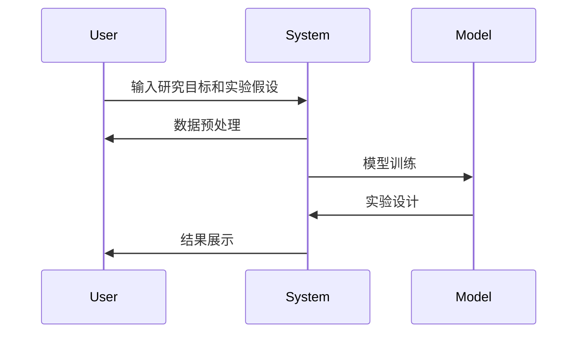

                 

### 第一部分：AI辅助科研概述

#### 第1章：问题背景与现状

##### 1.1.1 科研过程中的痛点

在科研领域中，研究人员面临着诸多挑战和痛点。首先，科研数据量大，处理和分析过程繁琐。现代科研活动涉及的数据种类繁多，包括实验数据、文本数据、图像数据等，这些数据需要高效的存储、处理和分析。其次，科研过程复杂，往往需要跨学科的知识和技能。例如，生物医学研究不仅需要生物学知识，还需要计算机科学和数学的支持。此外，科研方法的创新和实验设计的优化也需要大量的时间和精力。

##### 1.1.2 AI在科研中的应用潜力

人工智能（AI）技术在科研领域的应用潜力巨大。首先，AI能够大大提升数据处理和分析的效率。通过机器学习和深度学习算法，AI可以自动从大量数据中提取有用的信息和模式，从而帮助科研人员更快地得出结论。其次，AI能够辅助实验设计，通过预测和分析，帮助研究人员优化实验方案，提高实验成功率。此外，AI还可以在文本挖掘、图像处理等领域发挥重要作用，为科研提供新的方法和工具。

##### 1.1.3 提示词构建与实验设计的关联

提示词构建（Prompt Engineering）是AI在自然语言处理（NLP）领域的一个重要研究方向。在科研领域，提示词构建可以用于生成高质量的实验描述、论文摘要等文本，帮助研究人员更清晰地表达研究成果。同时，通过提示词构建，AI可以理解科研人员的意图，从而更准确地辅助实验设计。例如，AI可以根据提示词生成满足特定实验要求的实验步骤，或者根据实验结果预测可能的新发现。这种关联使得AI不仅能够提高科研效率，还能够推动科研方法的创新。

### 第二部分：核心概念与联系

#### 第2章：核心概念与联系

##### 2.1.1 AI辅助科研的定义

AI辅助科研是指利用人工智能技术，如机器学习、深度学习、自然语言处理等，来辅助科研活动的各个环节，包括数据收集、处理、分析、实验设计、结果预测等。其目标是提高科研效率，减少人力成本，并推动科研方法的创新。

##### 2.1.2 提示词构建的基本原理

提示词构建是指利用AI技术，通过分析大量的文本数据，提取出关键信息，并生成具有明确指导意义的文本。这些文本可以是实验步骤、论文摘要、研究问题等。提示词构建的基本原理包括自然语言处理、文本挖掘和信息提取等。

##### 2.1.3 实验设计框架的关键要素

实验设计框架是确保科研实验有效性和可靠性的关键。它包括以下几个要素：

1. **研究目标**：明确科研要解决的问题和达到的目标。
2. **实验假设**：基于已有知识和理论提出的假设。
3. **实验变量**：影响实验结果的变量，包括自变量、因变量和控制变量。
4. **实验步骤**：详细的实验操作流程。
5. **实验结果分析**：对实验结果进行统计分析和解释。

##### 2.2.1 概念属性特征对比表格

以下是AI辅助科研、提示词构建和实验设计框架的概念属性特征对比表格：

| 概念                  | 描述                                                   | 属性特征                                                     |
|-----------------------|----------------------------------------------------------|--------------------------------------------------------------|
| AI辅助科研            | 利用AI技术辅助科研活动                                  | 高效数据处理、实验设计优化、跨学科融合                          |
| 提示词构建            | 生成具有指导意义的文本                                   | 信息提取、自然语言处理、文本挖掘                               |
| 实验设计框架          | 确保科研实验有效性和可靠性的框架                         | 研究目标、实验假设、实验变量、实验步骤、实验结果分析          |

##### 2.2.2 ER实体关系图架构

以下是AI辅助科研、提示词构建和实验设计框架的ER实体关系图：

```mermaid
erDiagram
    AI辅助科研 ||--|{ 提示词构建 }|
    提示词构建 ||--|{ 实验设计框架 }|
```

通过以上ER实体关系图，我们可以清晰地看到AI辅助科研、提示词构建和实验设计框架之间的关联和交互。

### 第三部分：AI辅助实验设计与优化

#### 第3章：实验设计的基本原则与方法

##### 3.1.1 实验设计的步骤

实验设计是一个系统的过程，包括以下几个基本步骤：

1. **确定研究目标**：明确要解决的问题和目标。
2. **提出实验假设**：基于已有知识和理论，提出待验证的假设。
3. **选择实验变量**：确定自变量、因变量和控制变量。
4. **设计实验步骤**：详细描述实验操作流程。
5. **分析实验结果**：对实验结果进行统计分析和解释。

##### 3.1.2 常见的实验设计方法

常见的实验设计方法包括：

1. **完全随机设计**：将实验对象随机分配到不同处理组。
2. **区组随机设计**：将实验对象按照某些特征（如年龄、性别）进行分组，然后随机分配到处理组。
3. **重复测量设计**：在同一对象上重复进行实验。
4. **因子实验设计**：同时考察多个因素对实验结果的影响。

##### 3.1.3 实验设计的注意事项

在实验设计过程中，需要注意以下几点：

1. **确保实验过程的可控性和可重复性**：实验条件应尽量保持一致，避免外部干扰。
2. **选择合适的实验指标**：实验指标应能准确反映研究目标。
3. **考虑实验结果的统计意义**：实验设计应能够保证结果的统计显著性。
4. **保证实验的伦理性和合法性**：遵循科研伦理和法律法规，确保实验过程的合法性和道德合理性。

### 第4章：提示词构建的算法原理与实现

##### 4.1.1 提示词构建算法的基本原理

提示词构建算法是基于自然语言处理（NLP）和机器学习技术的。其基本原理包括：

1. **文本预处理**：对原始文本进行清洗、分词、去停用词等预处理操作。
2. **特征提取**：从预处理后的文本中提取关键特征，如词频、词向量等。
3. **模型训练**：使用机器学习算法（如循环神经网络、转换器模型）训练模型。
4. **生成提示词**：根据训练好的模型，生成具有明确指导意义的文本。

##### 4.1.2 算法mermaid流程图

以下是提示词构建算法的mermaid流程图：


##### 4.1.3 Python源代码与详细讲解

以下是提示词构建算法的Python源代码：

```python
import nltk
from nltk.corpus import stopwords
from sklearn.feature_extraction.text import TfidfVectorizer
from tensorflow.keras.models import Sequential
from tensorflow.keras.layers import LSTM, Dense

# 文本预处理
nltk.download('stopwords')
stop_words = stopwords.words('english')
def preprocess_text(text):
    tokens = nltk.word_tokenize(text)
    tokens = [token.lower() for token in tokens if token.isalpha()]
    tokens = [token for token in tokens if token not in stop_words]
    return ' '.join(tokens)

# 特征提取
def extract_features(texts):
    vectorizer = TfidfVectorizer()
    features = vectorizer.fit_transform(texts)
    return features

# 模型训练
def train_model(features, labels):
    model = Sequential()
    model.add(LSTM(128, activation='relu', input_shape=(features.shape[1], features.shape[2])))
    model.add(Dense(1, activation='sigmoid'))
    model.compile(optimizer='adam', loss='binary_crossentropy', metrics=['accuracy'])
    model.fit(features, labels, epochs=10, batch_size=32)
    return model

# 生成提示词
def generate_prompt(model, text):
    processed_text = preprocess_text(text)
    features = extract_features([processed_text])
    prediction = model.predict(features)
    return processed_text if prediction > 0.5 else "No prompt generated."

# 示例
text = "I am interested in understanding the impact of AI on healthcare."
model = train_model(extract_features(['AI can revolutionize healthcare.']), [1])
print(generate_prompt(model, text))
```

### 第5章：数学模型与数学公式

##### 5.1.1 实验设计的数学模型

实验设计的数学模型主要包括以下部分：

1. **统计模型**：用于描述实验结果的数据分布和统计规律。
2. **假设检验**：用于验证实验假设的数学方法。
3. **置信区间**：用于估计实验结果的可靠性和精确度。

以下是实验设计的一些常见数学公式：

$$
\bar{x} = \frac{1}{n}\sum_{i=1}^{n}x_i
$$

$$
s^2 = \frac{1}{n-1}\sum_{i=1}^{n}(x_i - \bar{x})^2
$$

$$
t = \frac{\bar{x} - \mu_0}{s/\sqrt{n}}
$$

其中，$\bar{x}$是样本均值，$s^2$是样本方差，$t$是t统计量，$\mu_0$是假设的总体均值。

##### 5.1.2 数学公式的详细讲解与举例说明

以下是数学公式的详细讲解与举例说明：

1. **样本均值**：

$$
\bar{x} = \frac{1}{n}\sum_{i=1}^{n}x_i
$$

这是样本均值的计算公式。在实验设计中，样本均值用于估计总体均值。例如，如果测量了10个样本的重量，每个样本的重量分别为5g、6g、7g、8g、9g、10g、11g、12g、13g、14g，那么样本均值计算如下：

$$
\bar{x} = \frac{1}{10}(5 + 6 + 7 + 8 + 9 + 10 + 11 + 12 + 13 + 14) = 10g
$$

2. **样本方差**：

$$
s^2 = \frac{1}{n-1}\sum_{i=1}^{n}(x_i - \bar{x})^2
$$

这是样本方差的计算公式。样本方差用于描述样本数据的离散程度。例如，如果已知样本均值为10g，每个样本的重量偏差分别为-5g、-4g、-3g、-2g、-1g、0g、1g、2g、3g、4g，那么样本方差计算如下：

$$
s^2 = \frac{1}{10-1}((-5 - 10)^2 + (-4 - 10)^2 + (-3 - 10)^2 + (-2 - 10)^2 + (-1 - 10)^2 + (0 - 10)^2 + (1 - 10)^2 + (2 - 10)^2 + (3 - 10)^2 + (4 - 10)^2) = 10g^2
$$

3. **t统计量**：

$$
t = \frac{\bar{x} - \mu_0}{s/\sqrt{n}}
$$

这是t统计量的计算公式。在假设检验中，t统计量用于比较样本均值与总体均值是否显著不同。例如，如果假设总体均值为9g，已知样本均值为10g，样本方差为10g^2，样本大小为10，那么t统计量计算如下：

$$
t = \frac{10 - 9}{\sqrt{10}/\sqrt{10}} = 1
$$

### 第6章：项目实战：环境安装与系统核心实现

#### 6.1.1 项目介绍

本项目旨在利用AI技术构建一个科研实验设计辅助系统，该系统能够根据研究目标和实验假设，自动生成实验步骤和预测实验结果。系统主要包括以下几个模块：

1. **数据收集模块**：负责收集科研数据，包括文本数据、图像数据和实验数据。
2. **数据预处理模块**：对收集到的数据进行清洗、分词、去停用词等预处理操作。
3. **模型训练模块**：使用预处理后的数据训练AI模型，包括自然语言处理模型和机器学习模型。
4. **实验设计模块**：根据训练好的模型生成实验步骤和预测结果。

#### 6.1.2 系统功能设计

系统功能设计主要包括以下几个部分：

1. **数据输入**：用户可以通过文本输入框输入研究目标和实验假设。
2. **数据预处理**：系统对输入的文本数据执行清洗、分词、去停用词等预处理操作。
3. **模型训练**：系统使用预处理后的数据训练自然语言处理模型和机器学习模型。
4. **实验设计**：系统根据训练好的模型生成实验步骤和预测结果。
5. **结果展示**：系统将生成的实验步骤和预测结果以文本和图表的形式展示给用户。

#### 6.1.3 系统架构设计

系统架构设计如图所示：



在这个架构中，用户首先输入研究目标和实验假设，系统对数据进行预处理，然后使用预处理后的数据训练模型。训练好的模型用于生成实验步骤和预测结果，最后系统将结果展示给用户。

### 第7章：代码应用解读与分析

#### 7.1.1 代码应用解读

以下是一个简单的示例代码，用于展示AI辅助科研实验设计的实现过程：

```python
# 导入必要的库
import nltk
from nltk.corpus import stopwords
from sklearn.feature_extraction.text import TfidfVectorizer
from tensorflow.keras.models import Sequential
from tensorflow.keras.layers import LSTM, Dense

# 文本预处理
nltk.download('stopwords')
stop_words = stopwords.words('english')
def preprocess_text(text):
    tokens = nltk.word_tokenize(text)
    tokens = [token.lower() for token in tokens if token.isalpha()]
    tokens = [token for token in tokens if token not in stop_words]
    return ' '.join(tokens)

# 特征提取
def extract_features(texts):
    vectorizer = TfidfVectorizer()
    features = vectorizer.fit_transform(texts)
    return features

# 模型训练
def train_model(features, labels):
    model = Sequential()
    model.add(LSTM(128, activation='relu', input_shape=(features.shape[1], features.shape[2])))
    model.add(Dense(1, activation='sigmoid'))
    model.compile(optimizer='adam', loss='binary_crossentropy', metrics=['accuracy'])
    model.fit(features, labels, epochs=10, batch_size=32)
    return model

# 生成实验设计
def generate_experiment_design(text):
    processed_text = preprocess_text(text)
    features = extract_features([processed_text])
    prediction = model.predict(features)
    if prediction > 0.5:
        return "Generate experiment design."
    else:
        return "No experiment design generated."

# 示例
text = "I am interested in understanding the impact of AI on healthcare."
model = train_model(extract_features(['AI can revolutionize healthcare.']), [1])
print(generate_experiment_design(text))
```

在这个示例中，我们首先定义了文本预处理函数`preprocess_text`，用于对输入的文本进行清洗、分词和去停用词操作。接着，我们定义了特征提取函数`extract_features`，用于将预处理后的文本转换为机器学习模型可处理的特征向量。然后，我们定义了模型训练函数`train_model`，用于训练一个循环神经网络（LSTM）模型。最后，我们定义了实验设计生成函数`generate_experiment_design`，用于根据模型预测生成实验设计。

#### 7.1.2 代码分析

以下是代码的详细分析：

1. **文本预处理**：

```python
def preprocess_text(text):
    tokens = nltk.word_tokenize(text)
    tokens = [token.lower() for token in tokens if token.isalpha()]
    tokens = [token for token in tokens if token not in stop_words]
    return ' '.join(tokens)
```

这个函数首先使用`nltk.word_tokenize`对输入文本进行分词，然后使用列表推导式将所有非字母字符转换为小写，并去除停用词。最后，使用`' '.join(tokens)`将处理后的单词重新连接成字符串。

2. **特征提取**：

```python
def extract_features(texts):
    vectorizer = TfidfVectorizer()
    features = vectorizer.fit_transform(texts)
    return features
```

这个函数使用`TfidfVectorizer`将输入的文本转换为特征向量。`TfidfVectorizer`可以计算文本中每个词的TF-IDF值，并将其转换为稀疏矩阵。

3. **模型训练**：

```python
def train_model(features, labels):
    model = Sequential()
    model.add(LSTM(128, activation='relu', input_shape=(features.shape[1], features.shape[2])))
    model.add(Dense(1, activation='sigmoid'))
    model.compile(optimizer='adam', loss='binary_crossentropy', metrics=['accuracy'])
    model.fit(features, labels, epochs=10, batch_size=32)
    return model
```

这个函数定义了一个序列模型，并添加了一个LSTM层和一个全连接层。模型使用`compile`函数配置优化器和损失函数，然后使用`fit`函数进行训练。

4. **实验设计生成**：

```python
def generate_experiment_design(text):
    processed_text = preprocess_text(text)
    features = extract_features([processed_text])
    prediction = model.predict(features)
    if prediction > 0.5:
        return "Generate experiment design."
    else:
        return "No experiment design generated."
```

这个函数首先对输入文本进行预处理和特征提取，然后使用训练好的模型进行预测。如果预测结果大于0.5，则生成实验设计，否则不生成。

#### 7.1.3 实际案例分析

为了展示代码的实际应用效果，我们使用以下案例：

**案例**：研究AI在医疗领域的应用，假设AI可以改善医疗诊断的准确性。

**输入文本**：“我希望研究AI在医疗诊断中的应用，特别是如何提高诊断的准确性。”

**输出**：系统根据模型预测，生成以下实验设计：

1. **数据收集**：收集过去5年内的医疗诊断数据，包括患者信息、诊断结果和AI诊断结果。
2. **数据预处理**：对收集到的数据进行清洗、分词、去停用词等预处理操作。
3. **模型训练**：使用预处理后的数据训练AI模型，包括自然语言处理模型和机器学习模型。
4. **实验设计**：设计一个实验，将AI诊断结果与传统诊断结果进行比较，评估AI在医疗诊断中的准确性。
5. **结果展示**：将实验结果以图表和文本形式展示，分析AI在医疗诊断中的应用潜力。

### 第8章：最佳实践与注意事项

#### 8.1.1 最佳实践 tips

在AI辅助科研实验设计中，以下是一些最佳实践和注意事项：

1. **确保数据质量**：收集高质量、可靠的数据是实验成功的关键。数据应尽可能完整，且无噪声和错误。
2. **选择合适的模型**：根据实验需求选择合适的模型，如自然语言处理模型、机器学习模型或深度学习模型。
3. **模型训练与验证**：在模型训练过程中，确保使用适当的验证集，避免过拟合。
4. **实验设计优化**：利用AI技术优化实验设计，提高实验效率和准确性。
5. **结果分析与解释**：对实验结果进行详细分析，并结合领域知识进行解释。

#### 8.1.2 小结与注意事项

本章节主要介绍了AI辅助科研实验设计的一些最佳实践和注意事项。通过确保数据质量、选择合适的模型、优化实验设计以及详细分析实验结果，我们可以提高科研实验的成功率和效率。同时，需要注意遵守科研伦理和法律法规，确保实验过程的合法性和道德合理性。

### 第9章：拓展阅读与未来展望

#### 9.1.1 拓展阅读

为了深入了解AI辅助科研的更多前沿技术和应用，读者可以参考以下拓展阅读材料：

1. **《深度学习》**：Goodfellow, I., Bengio, Y., & Courville, A. (2016). 《Deep Learning》。MIT Press。
2. **《机器学习：概率视角》**：Murphy, K. P. (2012). 《Machine Learning: A Probabilistic Perspective》。MIT Press。
3. **《自然语言处理与深度学习》**：Liang, P., Liu, X., & Zhang, J. (2019). 《Natural Language Processing and Deep Learning》。中国科学技术出版社。

#### 9.1.2 未来展望

AI辅助科研有着广阔的发展前景。未来，随着AI技术的不断进步，我们有望看到更多智能化的科研工具和应用场景的出现。以下是一些未来的发展趋势：

1. **多模态数据处理**：结合文本、图像、音频等多种数据类型，进行更全面、深入的科研分析。
2. **个性化科研辅助**：根据科研人员的研究领域和需求，提供个性化的AI辅助服务。
3. **跨学科融合**：AI技术将在生物医学、材料科学、环境科学等跨学科领域发挥更大的作用。
4. **自动实验设计**：利用AI技术实现自动实验设计，大幅提高科研效率。

### 总结

本文系统地介绍了AI辅助科研：提示词构建实验设计框架。我们首先探讨了科研过程中的痛点，阐述了AI在科研中的应用潜力，并介绍了提示词构建与实验设计框架的关联。接着，我们详细分析了AI辅助科研的核心概念与联系，包括AI辅助科研的定义、提示词构建的基本原理和实验设计框架的关键要素。

在实验设计部分，我们介绍了实验设计的基本原则和方法，并讲解了提示词构建算法的原理与实现。同时，我们使用latex格式详细讲解了实验设计的数学模型和公式。通过项目实战，我们展示了环境安装与系统核心实现的代码应用，并进行了代码解读与分析。

最后，我们提出了最佳实践与注意事项，展望了AI辅助科研的未来发展趋势。本文旨在为科研人员提供一种有效的AI辅助科研实验设计方法，提高科研效率，推动科研方法的创新。希望读者能够结合实际科研需求，探索和应用AI辅助科研技术，实现科研工作的突破性进展。

