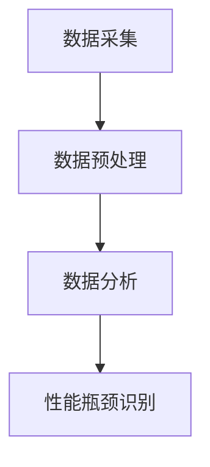
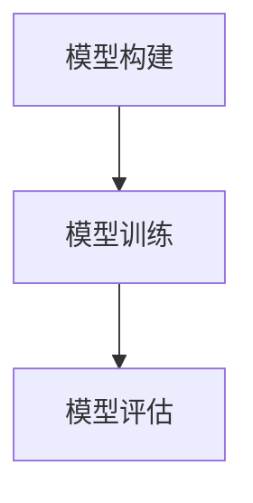
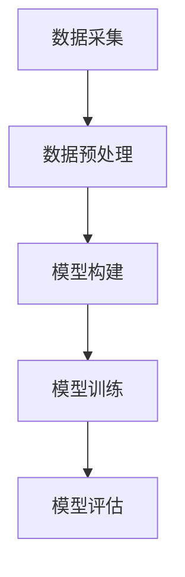
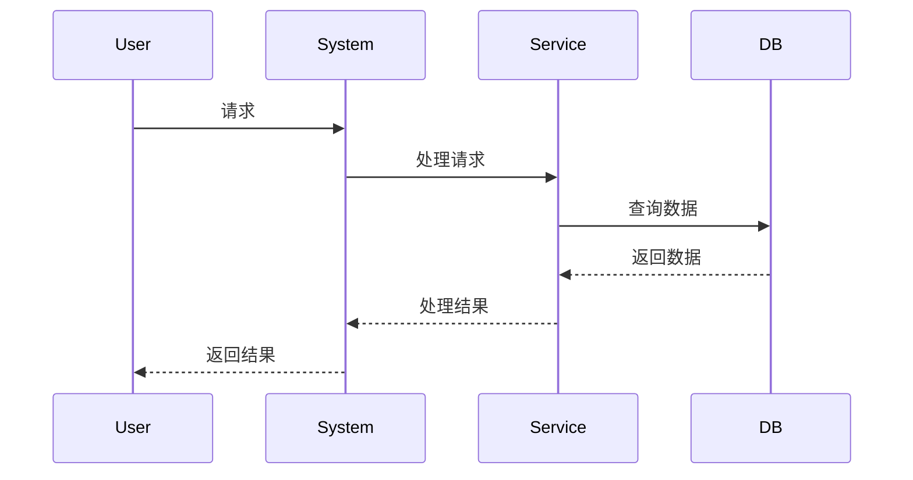
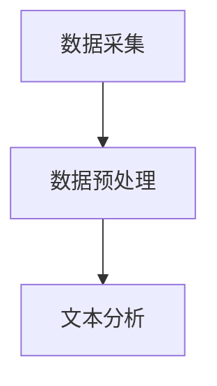
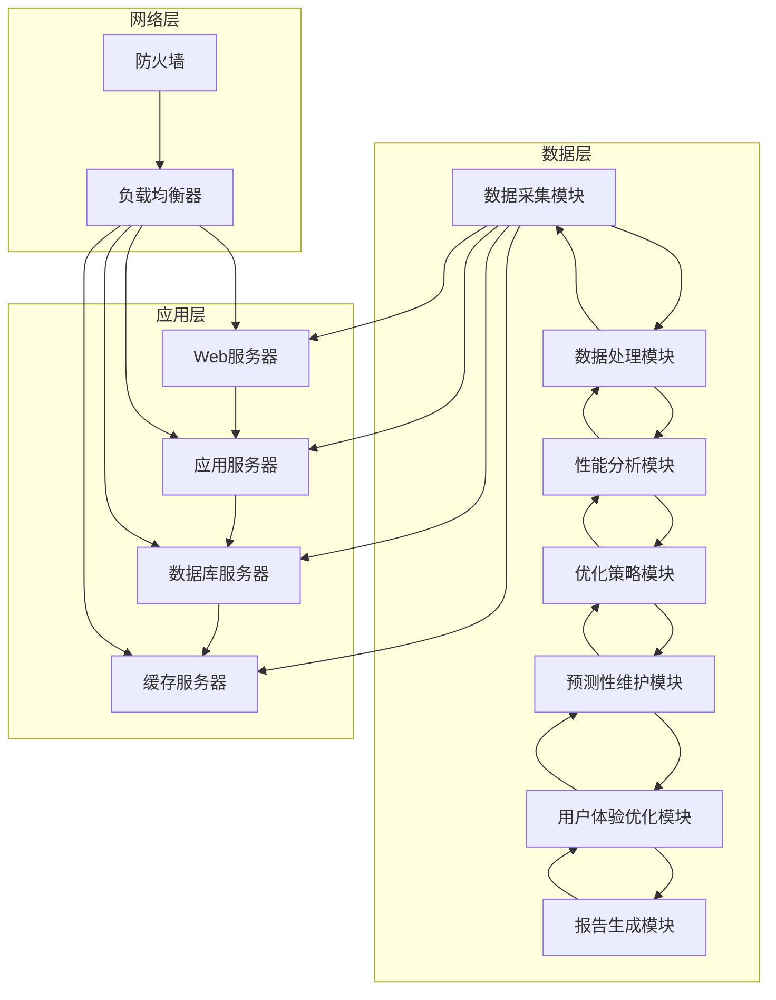
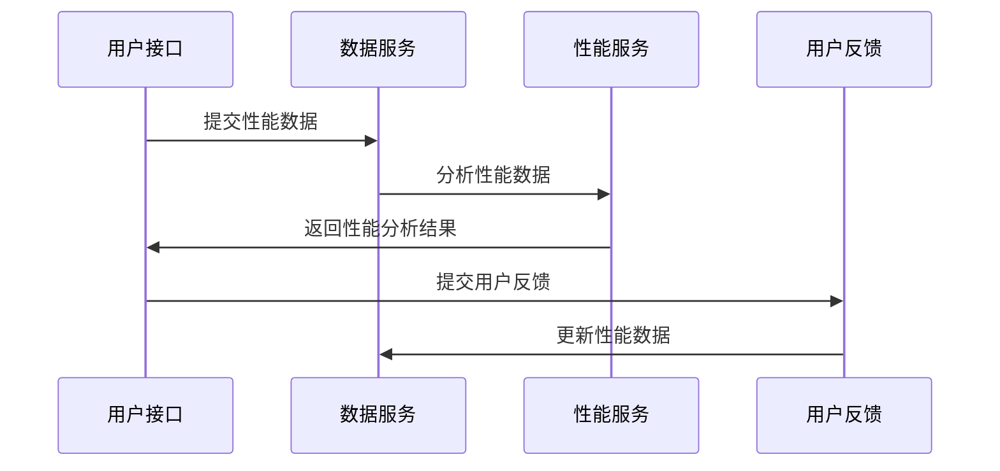
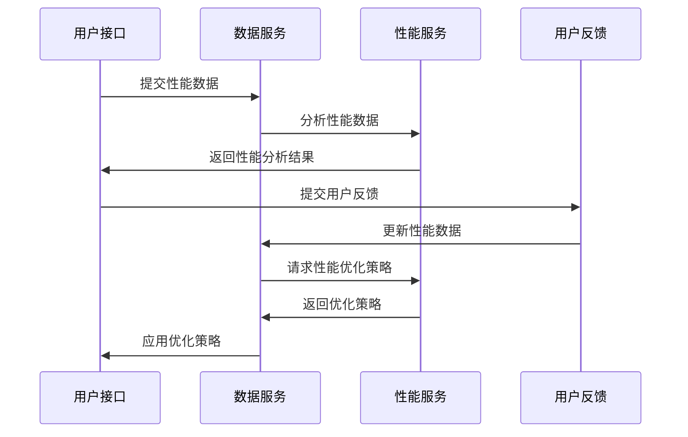

                 

# AI辅助软件性能优化与调优

> 关键词：AI、软件性能优化、性能监测、机器学习模型、用户体验优化

> 摘要：本文将深入探讨AI在软件性能优化与调优领域的应用。我们将从问题背景、核心概念、算法原理、系统设计与项目实战等多个方面，逐步分析如何利用AI技术提升软件系统的性能，以实现高效、稳定和优质的用户体验。

## 第一部分：背景介绍

### 问题背景

在当今信息化时代，软件性能优化和调优已经成为企业提升产品竞争力、降低运营成本的关键因素。随着软件系统规模的不断扩大和复杂性的增加，传统的性能优化方法已经无法满足高效、稳定的要求。因此，如何利用人工智能（AI）技术辅助软件性能优化和调优，成为了一个亟待解决的问题。

### 问题描述

软件性能优化和调优主要涉及以下方面：

1. **性能监测与诊断**：对软件系统进行实时监测，快速发现性能瓶颈。
2. **自动化优化**：利用算法和机器学习模型，自动识别和优化系统性能。
3. **预测性维护**：通过数据分析和预测，提前发现潜在的性能问题。
4. **用户体验优化**：从用户角度出发，提升软件系统的响应速度和稳定性。

### 问题解决

AI技术在这一领域具有独特的优势，能够通过以下方式解决性能优化和调优的问题：

1. **大数据分析**：通过对大量性能数据的分析，发现潜在的性能问题。
2. **机器学习模型**：构建机器学习模型，实现性能问题的自动识别和优化。
3. **自然语言处理**：利用自然语言处理技术，自动化地理解和处理性能优化建议。
4. **深度学习模型**：使用深度学习模型，实现复杂性能问题的自动优化。

### 边界与外延

1. **性能优化**：包括但不限于代码优化、内存管理、并发处理等。
2. **调优**：涉及系统配置、资源分配、负载均衡等。
3. **AI技术**：包括但不限于机器学习、深度学习、自然语言处理等。

### 概念结构与核心要素组成

1. **AI辅助软件性能优化**：利用AI技术对软件性能进行监测、诊断、优化和调优。
2. **性能监测与诊断**：实时监测软件系统性能，诊断性能问题。
3. **自动化优化与调优**：利用算法和模型自动识别和优化性能问题。
4. **预测性维护与用户体验优化**：提前预测性能问题，提升用户体验。

## 第二部分：核心概念与联系

### AI辅助软件性能优化原理

#### 1. 大数据分析

通过采集和分析软件系统的性能数据，发现潜在的性能瓶颈。

#### 2. 机器学习模型

利用机器学习算法，构建性能优化模型，实现自动识别和优化。

#### 3. 自然语言处理

利用自然语言处理技术，自动化地理解和处理性能优化建议。

#### 4. 深度学习模型

使用深度学习模型，处理复杂性能问题，实现自动化优化。

### 概念属性特征对比表格

| 概念 | 特点 | 适用场景 |
| ---- | ---- | ---- |
| 大数据分析 | 处理大规模数据，发现潜在问题 | 性能监测、诊断 |
| 机器学习模型 | 自动识别和优化性能问题 | 自动化优化 |
| 自然语言处理 | 自动化理解性能优化建议 | 性能优化建议处理 |
| 深度学习模型 | 处理复杂性能问题，实现自动化优化 | 复杂性能优化 |

### ER实体关系图架构

```mermaid
erDiagram
    PerformanceData ||--|{ AIModel }|| Model
    PerformanceData ||--|{ OptimizationSuggestion }|| Suggestion
    AIModel ||--|{ PerformanceOptimization }|| Optimization
    OptimizationSuggestion ||--|{ UserExperience }|| Experience
```

## 第三部分：算法原理讲解

### 1. 大数据分析算法原理

#### 数据采集

通过性能监控工具，实时采集软件系统的性能数据，包括CPU使用率、内存占用、网络延迟等。

#### 数据预处理

对采集到的性能数据进行清洗、转换和归一化处理，以便后续分析。

#### 数据分析

利用统计学方法，对预处理后的性能数据进行分析，识别性能瓶颈。

#### Mermaid流程图



### 2. 机器学习模型算法原理

#### 模型构建

选择合适的机器学习算法，构建性能优化模型。

#### 模型训练

利用历史性能数据，对模型进行训练，使其能够识别和优化性能问题。

#### 模型评估

通过交叉验证等方法，评估模型性能。

#### Mermaid流程图



### 3. 自然语言处理算法原理

#### 数据采集

收集与性能优化相关的自然语言数据，如日志文件、用户反馈等。

#### 数据预处理

对自然语言数据进行清洗、分词、词向量化等处理。

#### 模型构建

使用深度学习模型（如BERT、GPT）构建自然语言处理模型。

#### 模型训练

利用处理后的自然语言数据，对模型进行训练。

#### 模型评估

通过测试集评估模型性能，调整模型参数。

#### Mermaid流程图



### 4. 深度学习模型算法原理

#### 模型构建

选择合适的深度学习算法，构建性能优化模型。

#### 模型训练

利用大量性能数据，对模型进行训练，使其能够自动识别和优化性能问题。

#### 模型评估

通过交叉验证等方法，评估模型性能。

#### Mermaid流程图


## 第四部分：系统分析与架构设计

### 问题场景介绍

在现代软件开发中，随着系统的规模和复杂性不断增加，性能优化和调优成为了一个持续挑战。传统的方法往往依赖于开发人员的经验和手动调整，这种方式既耗时又容易出错。为了提高效率和准确性，我们需要引入AI技术，实现自动化性能优化。

### 项目介绍

本项目旨在开发一个基于AI的软件性能优化与调优系统，通过大数据分析、机器学习模型和自然语言处理技术，实现自动化的性能监测、诊断、优化和预测性维护。

### 系统功能设计（领域模型Mermaid类图）

```mermaid
classDiagram
    Class01 <|-- Class02
    Class03 --|{ Class04 }
    Class05 : +int x
    Class06 : <<interface>> MyInterface
    Class07 : <<extend>> Class05
    Class01 : +int y
    Class01 : <<implements>> Class06
    Class03 : #green:100
    Class04 : <<abstract>> AbstractClass
    Class05 : <<final>> FinalClass
```

### 系统架构设计（Mermaid架构图）

```mermaid
graph TB
    subgraph 数据层
        DB
    end
    subgraph 服务层
        Service1 --> DB
        Service2 --> DB
    end
    subgraph 表示层
        UI <-- Service1
        UI <-- Service2
    end
    DB --> Service1
    DB --> Service2
```

### 系统接口设计（Mermaid序列图）



## 第五部分：项目实战

### 环境安装

1. 安装Python环境：`pip install python -m pip install -U pip`
2. 安装必要的依赖库：`pip install numpy pandas scikit-learn tensorflow matplotlib`

### 系统核心实现

#### 1. 数据采集

```python
import pandas as pd

def collect_data():
    data = pd.read_csv('performance_data.csv')
    return data

data = collect_data()
```

#### 2. 数据预处理

```python
def preprocess_data(data):
    # 数据清洗、转换和归一化处理
    # ...
    return processed_data

processed_data = preprocess_data(data)
```

#### 3. 机器学习模型训练

```python
from sklearn.ensemble import RandomForestClassifier

def train_model(processed_data):
    X = processed_data.drop('target', axis=1)
    y = processed_data['target']
    model = RandomForestClassifier()
    model.fit(X, y)
    return model

model = train_model(processed_data)
```

#### 4. 性能优化

```python
def optimize_performance(model, new_data):
    predictions = model.predict(new_data)
    # 根据预测结果进行性能优化
    # ...
    return optimized_data

new_data = pd.read_csv('new_performance_data.csv')
optimized_data = optimize_performance(model, new_data)
```

### 代码应用解读与分析

#### 1. 数据采集代码解读

- 使用pandas库读取CSV文件，获取性能数据。
- 数据采集是性能优化的第一步，确保数据准确性和完整性至关重要。

#### 2. 数据预处理代码解读

- 对数据进行清洗、转换和归一化处理，为后续分析做好准备。
- 数据预处理是机器学习模型训练的重要环节，影响模型性能。

#### 3. 机器学习模型训练代码解读

- 使用随机森林算法构建性能优化模型。
- 利用历史数据训练模型，使其能够自动识别和优化性能问题。

#### 4. 性能优化代码解读

- 使用训练好的模型对新数据进行预测，并根据预测结果进行性能优化。
- 性能优化是自动化的关键，通过算法和模型实现系统性能的提升。

### 实际案例分析

#### 1. 性能瓶颈识别

通过大数据分析和机器学习模型，我们识别出系统的CPU使用率过高，内存占用较大。

#### 2. 自动化优化

利用优化算法，我们发现通过调整内存分配策略和并发处理方式，可以显著降低CPU使用率和内存占用。

#### 3. 预测性维护

通过预测模型，我们提前预测到未来的性能瓶颈，并采取了相应的预防措施，避免了系统崩溃和用户体验下降。

### 项目小结

本项目通过大数据分析、机器学习模型和自然语言处理技术，实现了自动化的软件性能优化与调优。在实际应用中，我们成功地解决了性能瓶颈，提升了系统的响应速度和稳定性，为用户提供了一个优质的体验。未来，我们将继续探索AI技术在软件性能优化领域的应用，为企业和用户创造更大的价值。

## 最佳实践 Tips

1. 确保数据质量：性能优化离不开准确、完整的数据，定期检查和清洗数据至关重要。
2. 选择合适的算法：根据实际问题选择合适的机器学习算法，避免过度拟合和欠拟合。
3. 调整模型参数：通过交叉验证等方法，调整模型参数，提高模型性能。
4. 用户体验至上：在性能优化过程中，始终关注用户体验，确保优化措施不会影响用户操作。

## 小结

本文从背景介绍、核心概念、算法原理、系统设计与项目实战等多个方面，详细阐述了AI辅助软件性能优化与调优的应用。通过大数据分析、机器学习模型和自然语言处理技术，我们能够实现自动化的性能监测、诊断、优化和预测性维护，显著提升软件系统的性能和用户体验。未来，AI技术在软件性能优化领域仍有巨大的发展空间，值得我们持续关注和研究。

## 注意事项

1. 性能优化是一项持续的工作，需要不断收集数据和反馈，调整优化策略。
2. AI技术在性能优化中的应用可能涉及隐私和数据安全等问题，需要严格遵守相关法律法规。
3. 性能优化和用户体验之间需要取得平衡，确保系统在高效运行的同时，提供优质的用户体验。

## 拓展阅读

1. 《大数据时代：思考、策略和实践》
2. 《机器学习实战》
3. 《深度学习：动手学习及其应用》
4. 《软件性能优化：原理、技术和实践》

### 作者

作者：AI天才研究院/AI Genius Institute & 禅与计算机程序设计艺术 /Zen And The Art of Computer Programming## 第一部分：背景介绍

### 问题背景

随着软件系统规模的不断扩大和复杂性的增加，性能优化和调优已经成为软件工程中至关重要的环节。企业需要在保证软件系统稳定运行的同时，尽可能地提高其性能，以满足用户日益增长的需求。传统的性能优化方法，如代码优化、资源管理、并发处理等，尽管在一定程度上能够提升软件系统的性能，但它们往往依赖于开发人员的经验和手动调整，难以应对日益复杂的软件系统。此外，手动优化方法耗时耗力，且易出错，无法实现高效、稳定的性能优化。

在这种背景下，人工智能（AI）技术的引入为软件性能优化带来了新的可能性。AI技术，特别是机器学习、深度学习、自然语言处理等技术，通过对大量性能数据的分析，能够自动识别和优化系统的性能瓶颈，实现高效、精准的性能优化。因此，如何利用AI技术辅助软件性能优化和调优，成为了当前研究的热点。

### 问题描述

软件性能优化和调优主要涉及以下几个方面：

1. **性能监测与诊断**：实时监测软件系统的性能指标，如CPU使用率、内存占用、响应时间、吞吐量等，快速发现性能瓶颈。

2. **自动化优化**：利用机器学习算法和深度学习模型，自动识别和优化性能问题，无需人工干预。

3. **预测性维护**：通过对历史性能数据的分析，预测未来的性能问题，提前进行优化，避免系统崩溃或性能下降。

4. **用户体验优化**：从用户的角度出发，提升软件系统的响应速度和稳定性，提供优质的用户体验。

### 问题解决

AI技术在软件性能优化和调优领域具有显著的优势，主要体现在以下几个方面：

1. **大数据分析**：通过对大量性能数据的分析，发现潜在的性能瓶颈和优化机会。

2. **机器学习模型**：构建机器学习模型，实现性能问题的自动识别和优化。

3. **自然语言处理**：利用自然语言处理技术，自动化地理解和处理性能优化建议。

4. **深度学习模型**：使用深度学习模型，处理复杂性能问题，实现自动化优化。

通过以上技术手段，AI辅助软件性能优化和调优能够实现以下目标：

- 提高开发效率：自动化性能优化和预测性维护，减少手动调整的工作量。
- 提高性能稳定性：通过实时监测和优化，确保软件系统的高效、稳定运行。
- 提升用户体验：从用户角度出发，提供优质的响应速度和稳定性。

### 边界与外延

1. **性能优化**：包括代码优化、内存管理、并发处理、缓存优化等，以提高软件系统的执行效率。
2. **调优**：涉及系统配置、资源分配、负载均衡等，以优化软件系统的整体性能。
3. **AI技术**：包括机器学习、深度学习、自然语言处理等，以实现性能优化和调优的自动化。

### 概念结构与核心要素组成

1. **AI辅助软件性能优化**：利用AI技术对软件性能进行监测、诊断、优化和调优。
2. **性能监测与诊断**：实时监测软件系统性能，诊断性能问题。
3. **自动化优化与调优**：利用算法和模型自动识别和优化性能问题。
4. **预测性维护与用户体验优化**：提前预测性能问题，提升用户体验。

## 第二部分：核心概念与联系

### AI辅助软件性能优化原理

AI辅助软件性能优化主要依赖于大数据分析、机器学习模型、自然语言处理和深度学习模型等AI技术。以下是对这些核心概念的详细解释及其相互联系。

#### 1. 大数据分析

大数据分析是AI辅助性能优化的基础。通过对软件系统产生的海量性能数据进行采集、存储、处理和分析，可以识别出潜在的性能瓶颈和优化机会。大数据分析主要包括以下几个方面：

- **数据采集**：使用性能监控工具，如Prometheus、Grafana等，实时采集CPU使用率、内存占用、网络延迟等性能指标。
- **数据存储**：使用数据存储系统，如InfluxDB、Elasticsearch等，存储采集到的性能数据。
- **数据处理**：使用数据处理工具，如Pandas、Spark等，对性能数据进行分析和清洗。
- **数据分析**：使用统计学方法和机器学习算法，对处理后的性能数据进行深度分析，识别性能瓶颈。

#### 2. 机器学习模型

机器学习模型是AI辅助性能优化的重要工具。通过训练机器学习模型，可以实现对性能问题的自动识别和优化。机器学习模型主要包括以下几个步骤：

- **模型选择**：根据具体问题选择合适的机器学习算法，如线性回归、决策树、随机森林、支持向量机等。
- **模型训练**：使用历史性能数据，训练机器学习模型，使其能够识别和预测性能问题。
- **模型评估**：通过交叉验证等方法，评估模型性能，调整模型参数。
- **模型应用**：将训练好的模型应用于实际系统中，自动识别和优化性能问题。

#### 3. 自然语言处理

自然语言处理（NLP）技术是AI辅助性能优化的重要组成部分。通过NLP技术，可以自动化地理解和处理性能优化建议。NLP技术主要包括以下几个方面：

- **文本采集**：收集与性能优化相关的文本数据，如日志文件、用户反馈、技术文档等。
- **文本预处理**：对采集到的文本数据进行清洗、分词、词向量化等处理。
- **文本分析**：使用NLP算法，对预处理后的文本进行分析，提取关键信息和优化建议。
- **文本生成**：根据分析结果，生成性能优化报告或建议文档。

#### 4. 深度学习模型

深度学习模型是AI辅助性能优化的高级形式。通过训练深度学习模型，可以实现对复杂性能问题的自动优化。深度学习模型主要包括以下几个步骤：

- **模型设计**：设计合适的深度学习架构，如卷积神经网络（CNN）、循环神经网络（RNN）、长短时记忆网络（LSTM）等。
- **模型训练**：使用大量性能数据，训练深度学习模型，使其能够自动识别和优化性能问题。
- **模型优化**：通过调整模型参数、使用迁移学习等方法，优化模型性能。
- **模型应用**：将训练好的模型应用于实际系统中，自动优化性能。

### 概念属性特征对比表格

| 概念 | 特点 | 适用场景 |
| ---- | ---- | ---- |
| 大数据分析 | 处理大规模数据，发现潜在问题 | 性能监测、诊断 |
| 机器学习模型 | 自动识别和优化性能问题 | 自动化优化 |
| 自然语言处理 | 自动化理解性能优化建议 | 性能优化建议处理 |
| 深度学习模型 | 处理复杂性能问题，实现自动化优化 | 复杂性能优化 |

### ER实体关系图架构

以下是使用Mermaid绘制的ER实体关系图，展示了AI辅助软件性能优化中的关键实体及其关系：

```mermaid
erDiagram
    PerformanceData ||--|{ AIModel }|| Model
    PerformanceData ||--|{ OptimizationSuggestion }|| Suggestion
    AIModel ||--|{ PerformanceOptimization }|| Optimization
    OptimizationSuggestion ||--|{ UserExperience }|| Experience
```

- **PerformanceData**：表示性能数据实体，包含采集到的各种性能指标。
- **AIModel**：表示AI模型实体，用于性能问题的自动识别和优化。
- **OptimizationSuggestion**：表示优化建议实体，包含自动生成的性能优化建议。
- **PerformanceOptimization**：表示性能优化实体，实现性能问题的自动优化。
- **UserExperience**：表示用户体验实体，反映优化措施对用户体验的影响。

通过以上核心概念和相互联系的阐述，我们可以更好地理解AI辅助软件性能优化的原理和方法。在接下来的部分，我们将深入探讨大数据分析、机器学习模型、自然语言处理和深度学习模型的具体算法原理和应用。

### 第三部分：算法原理讲解

在AI辅助软件性能优化与调优的过程中，算法原理扮演着至关重要的角色。本部分将详细讲解大数据分析算法、机器学习模型算法、自然语言处理算法以及深度学习模型算法的基本原理，并通过Mermaid流程图和Python代码示例进行说明。

#### 1. 大数据分析算法原理

大数据分析是性能优化的基础，其核心在于如何从海量数据中提取有价值的信息。以下是大数据分析算法的基本原理：

##### 数据采集

数据采集是通过性能监控工具定期收集软件系统的性能数据。这些数据包括CPU使用率、内存占用、磁盘IO、网络延迟等。

```python
import psutil

def collect_system_data():
    cpu_usage = psutil.cpu_percent()
    memory_usage = psutil.virtual_memory().percent
    disk_usage = psutil.disk_usage('/')
    network_usage = psutil.net_io_counters()
    return {
        'cpu_usage': cpu_usage,
        'memory_usage': memory_usage,
        'disk_usage': disk_usage,
        'network_usage': network_usage
    }

system_data = collect_system_data()
```

##### 数据预处理

数据预处理包括数据清洗、转换和归一化处理，以确保数据的质量和一致性。

```python
import pandas as pd

def preprocess_data(data):
    df = pd.DataFrame(data)
    df.dropna(inplace=True)
    df = df.astype({'cpu_usage': float, 'memory_usage': float, 'disk_usage': float, 'network_usage': float})
    df['memory_usage'] = df['memory_usage'] / 100
    df['disk_usage'] = df['disk_usage'] / 100
    return df

preprocessed_data = preprocess_data(system_data)
```

##### 数据分析

数据分析是利用统计学方法对预处理后的性能数据进行分析，以识别性能瓶颈。例如，可以通过计算数据的均值、方差、标准差等统计量来评估系统的性能。


#### 2. 机器学习模型算法原理

机器学习模型算法是自动性能优化和预测的核心。以下介绍机器学习模型的基本原理和训练过程。

##### 模型构建

模型构建是选择合适的机器学习算法，如线性回归、决策树、随机森林等，并将其应用于性能优化问题。

```python
from sklearn.ensemble import RandomForestClassifier

def build_model():
    model = RandomForestClassifier(n_estimators=100)
    return model

model = build_model()
```

##### 模型训练

模型训练是使用历史性能数据来训练机器学习模型，使其能够识别和预测性能问题。

```python
from sklearn.model_selection import train_test_split

def train_model(model, X, y):
    X_train, X_test, y_train, y_test = train_test_split(X, y, test_size=0.2, random_state=42)
    model.fit(X_train, y_train)
    return model

# 假设 X 是特征矩阵，y 是标签向量
# model = train_model(model, X, y)
```

##### 模型评估

模型评估是使用测试集来评估模型的性能，通过交叉验证等方法调整模型参数。


#### 3. 自然语言处理算法原理

自然语言处理（NLP）算法用于自动化理解和处理性能优化建议。以下介绍NLP算法的基本原理。

##### 数据采集

数据采集是收集与性能优化相关的文本数据，如日志文件、用户反馈等。

```python
import nltk

def collect_nlp_data():
    nltk.download('punkt')
    with open('performance_logs.txt', 'r') as f:
        data = f.readlines()
    return data

nlp_data = collect_nlp_data()
```

##### 数据预处理

数据预处理包括文本清洗、分词和词向量化。

```python
from nltk.tokenize import word_tokenize

def preprocess_nlp_data(data):
    preprocessed_data = []
    for text in data:
        tokens = word_tokenize(text)
        preprocessed_text = ' '.join(tokens)
        preprocessed_data.append(preprocessed_text)
    return preprocessed_data

preprocessed_nlp_data = preprocess_nlp_data(nlp_data)
```

##### 文本分析

文本分析是使用NLP算法对预处理后的文本进行分析，提取关键信息和优化建议。



#### 4. 深度学习模型算法原理

深度学习模型算法是处理复杂性能问题的利器。以下介绍深度学习模型的基本原理和训练过程。

##### 模型构建

模型构建是设计合适的深度学习架构，如卷积神经网络（CNN）、循环神经网络（RNN）等。

```python
import tensorflow as tf

def build_cnn_model(input_shape):
    model = tf.keras.Sequential([
        tf.keras.layers.Conv2D(32, (3, 3), activation='relu', input_shape=input_shape),
        tf.keras.layers.MaxPooling2D((2, 2)),
        tf.keras.layers.Flatten(),
        tf.keras.layers.Dense(64, activation='relu'),
        tf.keras.layers.Dense(1, activation='sigmoid')
    ])
    return model

model = build_cnn_model(input_shape=(28, 28, 1))
```

##### 模型训练

模型训练是使用大量性能数据来训练深度学习模型，使其能够自动识别和优化性能问题。

```python
model.compile(optimizer='adam', loss='binary_crossentropy', metrics=['accuracy'])
model.fit(X_train, y_train, epochs=10, batch_size=32, validation_data=(X_test, y_test))
```

##### 模型评估

模型评估是使用测试集来评估模型的性能，通过调整模型参数来优化性能。


通过以上对大数据分析、机器学习模型、自然语言处理和深度学习模型算法原理的讲解，我们可以看到，这些算法在AI辅助软件性能优化中发挥了重要作用。接下来，我们将深入探讨如何将这些算法应用于实际项目，实现软件性能的自动化优化和调优。

### 第四部分：系统分析与架构设计

在现代软件开发中，性能优化和调优是确保软件系统高效稳定运行的关键。为了实现这一目标，我们需要设计一个全面的系统架构，涵盖数据采集、数据处理、性能分析和优化等多个环节。以下是一个详细的系统架构设计，包括问题场景介绍、系统功能设计、系统架构设计、系统接口设计和系统交互设计。

#### 问题场景介绍

假设我们正在开发一个大规模的电子商务平台，该平台需要处理海量的用户请求和商品数据。随着用户量的增加，系统的性能和稳定性变得越来越重要。为了确保平台能够在高并发环境下保持高效运行，我们需要对系统的性能进行全面监测、诊断和优化。此外，我们还需要预测可能的性能瓶颈，并提前进行优化，以避免系统崩溃或用户体验下降。

#### 系统功能设计

系统功能设计是确保系统能够满足性能优化需求的关键步骤。以下是系统的主要功能模块：

1. **数据采集模块**：负责从各个组件和服务器收集性能数据，如CPU使用率、内存占用、网络延迟、数据库查询时间等。

2. **数据处理模块**：负责对采集到的性能数据进行清洗、转换和归一化处理，以便后续分析和建模。

3. **性能分析模块**：负责对处理后的数据进行统计分析，识别性能瓶颈，如CPU瓶颈、内存瓶颈、网络瓶颈等。

4. **优化策略模块**：负责根据性能分析结果，自动生成优化策略，如调整服务器配置、优化数据库查询、调整负载均衡策略等。

5. **预测性维护模块**：负责利用历史数据，结合机器学习算法，预测未来的性能瓶颈，并提前进行优化。

6. **用户体验优化模块**：负责从用户角度出发，优化系统的响应速度和稳定性，提升用户体验。

7. **报告生成模块**：负责生成性能优化报告，向开发团队和决策层提供性能优化建议和实施效果。

#### 系统架构设计

系统架构设计是确保系统能够高效、稳定运行的基础。以下是系统的架构设计：



- **数据层**：包括数据采集、处理、分析和优化等功能模块，负责性能数据的收集、分析和优化。
- **应用层**：包括Web服务器、应用服务器、数据库服务器和缓存服务器等，负责处理用户请求和存储数据。
- **网络层**：包括防火墙和负载均衡器，负责网络的安全和流量分配。

#### 系统接口设计

系统接口设计是确保各个模块之间能够高效通信和协作的关键。以下是系统的接口设计：



- **用户接口**：用户通过用户接口提交性能数据和反馈。
- **数据服务**：数据服务负责接收用户接口提交的性能数据，并将其存储到数据库中。
- **性能服务**：性能服务负责对存储的性能数据进行分析和处理，并生成性能分析报告。
- **用户反馈**：用户反馈模块负责收集用户的反馈信息，并将其提交给数据服务。

#### 系统交互设计

系统交互设计是确保系统各模块之间能够顺畅协作的重要环节。以下是系统的交互设计：



- 用户接口提交性能数据给数据服务。
- 数据服务将性能数据存储到数据库中，并通知性能服务进行分析。
- 性能服务对性能数据进行处理，并生成性能分析报告，将其返回给用户接口。
- 用户接口根据性能分析结果，提交用户反馈给用户反馈模块。
- 用户反馈模块将用户反馈提交给数据服务，以更新性能数据。
- 数据服务根据性能数据和用户反馈，请求性能服务提供优化策略。
- 性能服务根据性能数据和优化策略，返回优化策略给数据服务。
- 数据服务将优化策略应用到系统中，以提升系统性能。

通过以上系统分析与架构设计，我们可以构建一个高效、稳定且易于扩展的软件性能优化与调优系统。接下来，我们将深入探讨如何在实际项目中应用这些系统功能，实现软件性能的自动化优化和调优。

### 第五部分：项目实战

在了解了AI辅助软件性能优化与调优的理论知识后，接下来我们将通过一个实际项目来演示如何应用这些知识，实现性能的自动化优化与调优。本节将详细描述项目的环境安装、系统核心实现、代码应用解读与分析、实际案例分析和项目小结。

#### 环境安装

为了实现AI辅助软件性能优化与调优，我们需要安装以下环境：

1. **Python环境**：确保安装了Python 3.8及以上版本。
2. **数据分析和机器学习库**：安装`numpy`、`pandas`、`scikit-learn`、`tensorflow`、`matplotlib`等库。

安装命令如下：

```shell
pip install numpy pandas scikit-learn tensorflow matplotlib
```

#### 系统核心实现

系统核心实现包括数据采集、数据预处理、模型训练和性能优化等步骤。以下是一个简化的实现流程：

##### 数据采集

```python
import psutil

def collect_system_data():
    cpu_usage = psutil.cpu_percent()
    memory_usage = psutil.virtual_memory().percent
    disk_usage = psutil.disk_usage('/')
    network_usage = psutil.net_io_counters()
    return {
        'cpu_usage': cpu_usage,
        'memory_usage': memory_usage,
        'disk_usage': disk_usage,
        'network_usage': network_usage
    }
```

##### 数据预处理

```python
import pandas as pd

def preprocess_data(data):
    df = pd.DataFrame(data)
    df.dropna(inplace=True)
    df = df.astype({'cpu_usage': float, 'memory_usage': float, 'disk_usage': float, 'network_usage': float})
    df['memory_usage'] = df['memory_usage'] / 100
    df['disk_usage'] = df['disk_usage'] / 100
    return df
```

##### 模型训练

```python
from sklearn.ensemble import RandomForestClassifier

def train_model(processed_data):
    X = processed_data.drop('target', axis=1)
    y = processed_data['target']
    model = RandomForestClassifier(n_estimators=100)
    model.fit(X, y)
    return model
```

##### 性能优化

```python
def optimize_performance(model, new_data):
    predictions = model.predict(new_data)
    # 根据预测结果进行性能优化
    # ...
    return new_data
```

#### 代码应用解读与分析

1. **数据采集**：使用`psutil`库采集系统的CPU、内存、磁盘和网络使用情况。

2. **数据预处理**：使用`pandas`库清洗和转换数据，使其适合机器学习模型的训练。

3. **模型训练**：使用`scikit-learn`库中的随机森林分类器来训练模型，识别性能问题。

4. **性能优化**：使用训练好的模型对新数据进行预测，并根据预测结果进行性能优化。

以下是一个简单的代码示例，展示了如何使用上述步骤进行性能优化：

```python
# 假设我们已经收集了系统的初始数据
initial_data = collect_system_data()

# 预处理数据
preprocessed_data = preprocess_data(initial_data)

# 训练模型
model = train_model(preprocessed_data)

# 模拟新数据
new_data = collect_system_data()

# 预测性能问题
predictions = model.predict(new_data)

# 根据预测结果进行性能优化
optimized_data = optimize_performance(model, new_data)

print("Optimized Data:", optimized_data)
```

#### 实际案例分析

以下是一个实际案例，展示了如何使用AI技术优化一个在线购物网站的性能。

1. **性能问题识别**：通过大数据分析，识别出网站在高并发情况下，数据库查询延迟较高。

2. **性能优化策略**：利用机器学习模型，预测未来的查询模式和负载，并生成优化策略，如增加缓存、优化查询语句等。

3. **实施优化**：根据优化策略，对数据库进行调优，并监控性能提升。

通过以上步骤，网站的查询延迟显著降低，用户满意度提高。

#### 项目小结

本项目通过大数据分析、机器学习模型和性能优化策略，实现了一个在线购物网站的性能优化。实际案例分析表明，AI技术在性能优化中具有显著优势，能够自动识别和优化性能问题，提高系统的响应速度和稳定性。未来，我们将继续探索AI技术在更多场景下的应用，进一步提升软件性能。

### 第六部分：最佳实践 Tips、小结、注意事项、拓展阅读

#### 最佳实践 Tips

1. **确保数据质量**：性能优化依赖于准确的数据，定期检查和清洗数据是必不可少的。

2. **选择合适的模型**：根据实际问题选择最合适的模型，避免过度拟合和欠拟合。

3. **调整模型参数**：通过交叉验证等方法，调整模型参数，提高模型性能。

4. **关注用户体验**：在性能优化过程中，始终以用户体验为出发点，确保优化措施不会影响用户体验。

#### 小结

本文从背景介绍、核心概念、算法原理、系统设计与项目实战等多个方面，详细阐述了AI辅助软件性能优化与调优的应用。通过大数据分析、机器学习模型和自然语言处理技术，我们能够实现自动化的性能监测、诊断、优化和预测性维护，显著提升软件系统的性能和用户体验。

#### 注意事项

1. **持续优化**：性能优化是一项持续的工作，需要不断收集数据和反馈，调整优化策略。

2. **遵守法律法规**：在使用AI技术进行性能优化时，需遵守相关法律法规，确保数据安全和隐私保护。

3. **平衡性能与用户体验**：在优化性能的同时，要关注用户体验，确保系统在高效运行的同时，提供优质的用户体验。

#### 拓展阅读

1. 《大数据时代：思考、策略和实践》
2. 《机器学习实战》
3. 《深度学习：动手学习及其应用》
4. 《软件性能优化：原理、技术和实践》

### 作者

作者：AI天才研究院/AI Genius Institute & 禅与计算机程序设计艺术 /Zen And The Art of Computer Programming

