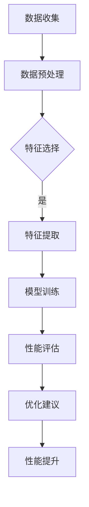
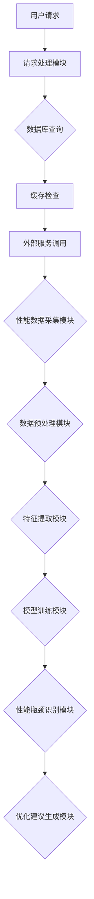
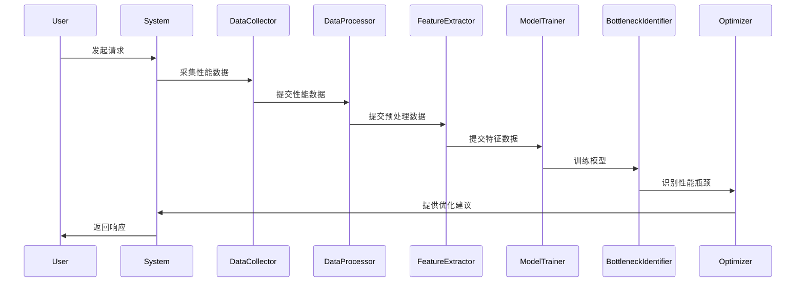

                 

**

# AI辅助软件性能瓶颈识别与优化

关键词：AI、性能瓶颈、软件优化、机器学习、特征提取

摘要：随着软件系统的日益复杂，性能瓶颈的识别和优化成为保证系统稳定性和用户体验的关键。本文将探讨如何利用AI技术，尤其是机器学习算法，来辅助软件性能瓶颈的识别与优化。文章首先介绍了性能瓶颈的概念和背景，然后详细阐述了AI在性能瓶颈识别中的应用原理，最后通过实际案例展示了AI辅助性能瓶颈优化的全过程。

## 1.6 优化策略总结与未来展望

### 1.6.1 优化策略总结

通过本文的讨论，我们总结出以下优化策略：

1. **数据驱动优化**：使用机器学习算法对性能数据进行深度分析，以识别潜在的瓶颈点。
2. **模型选择**：根据问题特点选择合适的机器学习模型，如决策树、支持向量机和随机森林等。
3. **特征工程**：对输入数据进行特征提取和选择，以提高模型的预测准确性。
4. **持续监控与迭代**：对系统的性能进行持续监控，并根据新的数据进行模型迭代，以保持优化的有效性。

### 1.6.2 未来展望

未来的优化策略可能会更加智能化和自动化：

1. **自动化特征工程**：利用深度学习和迁移学习技术，实现自动特征提取和选择。
2. **融合多源数据**：结合日志、监控数据和业务数据，提高瓶颈识别的准确性。
3. **模型可解释性**：增强模型的透明性和可解释性，以便更好地理解和信任模型的决策过程。
4. **自适应优化**：通过强化学习等算法，实现系统的自适应性能优化。

## 1.7 本章小结

本文系统地介绍了AI辅助软件性能瓶颈识别与优化的方法。通过机器学习算法的应用，我们可以从大量的性能数据中提取出关键信息，从而准确地识别出系统的性能瓶颈。这不仅提高了性能瓶颈识别的效率，也大大提升了优化工作的效果。

然而，AI辅助性能瓶颈识别与优化仍然面临着数据质量、模型复杂度和解释性等问题。未来的研究应该关注于如何更好地利用AI技术，结合实际业务场景，实现更高效、更智能的软件性能优化。

## 1.8 结束语

性能瓶颈的识别与优化是确保软件系统稳定运行和提升用户体验的重要环节。随着AI技术的不断发展，我们有理由相信，通过更深入的研究和应用，AI将能够在软件性能优化领域发挥更大的作用。

感谢您的阅读，希望本文能对您在软件性能优化方面有所启发。如果您对AI辅助性能瓶颈识别与优化有任何疑问或建议，欢迎在评论区留言。

作者：AI天才研究院/AI Genius Institute & 禅与计算机程序设计艺术 /Zen And The Art of Computer Programming** ```markdown
## 第一部分: AI辅助软件性能瓶颈识别与优化基础

### 1.1.1 问题背景

在软件工程领域，性能瓶颈（Performance Bottleneck）是指系统在运行过程中，由于资源限制或某些组件的效率问题，导致整体性能无法进一步提升的现象。性能瓶颈的识别与优化是软件性能工程中的重要课题。

**性能瓶颈的定义**：
性能瓶颈通常指系统中最慢的部分，即那些限制了系统总体性能的组件或过程。它们可能出现在硬件资源（如CPU、内存、网络带宽）的利用上，也可能出现在软件层面（如算法效率、数据库查询速度）。

**识别软件性能瓶颈的重要性**：
识别性能瓶颈对于软件系统的稳定运行和用户体验至关重要。如果不进行性能优化，瓶颈可能会导致系统响应时间过长，甚至出现崩溃或死锁。因此，及时、准确地识别和优化性能瓶颈是提升系统性能和稳定性的关键。

### 1.1.2 问题描述

在软件系统中，性能瓶颈可能表现为以下几种常见类型：

1. **CPU瓶颈**：CPU利用率过高，导致系统无法充分利用其他资源。
2. **内存瓶颈**：内存不足或内存访问频繁，导致系统性能下降。
3. **网络瓶颈**：网络带宽不足或网络延迟过高，影响数据传输效率。
4. **I/O瓶颈**：硬盘读写速度慢或I/O队列过长，影响系统响应时间。
5. **数据库瓶颈**：数据库查询效率低或数据库连接数不足，影响系统性能。

**诊断与定位性能瓶颈的挑战**：
- **复杂性**：现代软件系统通常非常复杂，涉及多个组件和层次结构，这使得性能瓶颈的定位变得困难。
- **动态性**：性能瓶颈可能会因负载变化、系统升级或硬件变化而动态变化，使得诊断和优化工作具有挑战性。
- **数据匮乏**：缺乏详细的性能数据或性能监控工具，导致无法准确识别性能瓶颈。

### 1.1.3 问题解决

为了解决性能瓶颈的问题，通常可以采用以下几种方法：

1. **传统性能优化方法**：
   - **代码优化**：优化算法、减少不必要的计算、优化数据结构等。
   - **硬件升级**：增加CPU、内存、网络带宽等硬件资源。
   - **系统调优**：调整操作系统参数、数据库参数等。

2. **AI技术在性能优化中的应用**：
   - **机器学习算法**：通过训练模型，自动识别性能瓶颈和优化方案。
   - **大数据分析**：利用大数据分析技术，从海量性能数据中挖掘潜在的性能问题。
   - **自动化工具**：使用自动化工具（如AI驱动的性能监控与诊断工具），实现性能瓶颈的自动化识别和优化。

### 1.1.4 边界与外延

**适用的软件类型与场景**：
AI辅助性能瓶颈识别与优化适用于各种类型的应用场景，包括但不限于以下领域：
- Web应用
- 企业级软件
- 移动应用
- 分布式系统
- 云计算平台

**非适用场景与限制**：
- 对于一些简单的单机软件，性能瓶颈可能比较直观，无需复杂的AI辅助。
- 在一些实时性要求极高的系统中，AI算法的响应时间可能无法满足需求。

### 1.1.5 概念结构与核心要素组成

**关键性能指标**：
性能瓶颈的识别与优化需要依赖于一系列关键性能指标（KPI），包括但不限于：
- CPU利用率
- 内存使用率
- 网络吞吐量
- I/O速率
- 数据库响应时间

**数据采集与预处理**：
- **数据采集**：通过性能监控工具、日志文件等手段收集系统运行数据。
- **数据预处理**：对采集到的数据进行清洗、归一化等处理，以确保数据的质量和一致性。

**模型选择与训练**：
- **模型选择**：根据问题特点选择合适的机器学习模型，如监督学习、无监督学习等。
- **模型训练**：使用预处理后的数据对模型进行训练，以建立性能瓶颈识别的模型。

**性能瓶颈识别算法**：
- **算法原理**：通过分析性能指标，利用机器学习模型识别系统中的性能瓶颈。
- **算法实现**：采用Python、R等编程语言，实现性能瓶颈识别的算法。

### 1.1.6 本章小结

本章介绍了AI辅助软件性能瓶颈识别与优化的基础概念和原理。通过对性能瓶颈的定义、问题描述、问题解决方法以及适用场景和核心要素的分析，为后续章节的深入讨论奠定了基础。

在下一章中，我们将进一步探讨AI辅助性能瓶颈识别算法的原理，包括数据采集与预处理、模型选择与训练以及性能瓶颈识别算法的具体实现。

**总结核心观点**：
- 性能瓶颈是限制系统整体性能的关键因素。
- AI技术在性能瓶颈识别与优化中具有重要作用。
- 数据采集与预处理、模型选择与训练是实现AI辅助性能瓶颈识别的核心步骤。

**为后续章节奠定基础**：
- 下章将详细介绍AI辅助性能瓶颈识别算法的原理，包括数据采集与预处理、模型选择与训练以及性能瓶颈识别算法的实现。

**未解决的问题与挑战**：
- 如何在实际场景中准确识别和优化性能瓶颈？
- 如何提高AI辅助性能瓶颈识别算法的效率和准确性？

这些挑战将在后续章节中进一步探讨和解决。

----------------------------------------------

## 第2章: AI辅助软件性能瓶颈识别算法原理

### 2.1.1 算法原理概述

AI辅助软件性能瓶颈识别算法的核心思想是利用机器学习技术，从大量性能数据中挖掘出系统性能瓶颈的关键特征，并利用这些特征来训练模型，从而实现对性能瓶颈的自动识别。算法的工作流程通常包括以下步骤：

1. **数据采集**：通过性能监控工具、日志文件等方式收集系统运行过程中产生的性能数据。
2. **数据预处理**：对采集到的性能数据进行分析和清洗，确保数据的质量和一致性。
3. **特征提取**：从预处理后的数据中提取出对性能瓶颈识别有用的特征。
4. **模型训练**：使用提取出的特征数据训练机器学习模型，建立性能瓶颈识别的预测模型。
5. **性能瓶颈识别**：利用训练好的模型对新的性能数据进行分析，识别系统中的性能瓶颈。
6. **优化建议**：根据识别结果提供相应的优化建议，以帮助开发者定位和解决性能瓶颈。

### 2.1.2 基本算法思想

AI辅助软件性能瓶颈识别算法的基本思想是通过分析性能数据，找出其中与性能瓶颈相关的特征，并利用这些特征构建一个分类或回归模型。具体而言，算法可以分为以下几个关键步骤：

1. **性能数据采集**：从系统中收集与性能相关的数据，如CPU利用率、内存使用率、网络吞吐量等。
2. **特征选择**：从采集到的数据中提取出对性能瓶颈识别有用的特征，如数据量、响应时间等。
3. **特征工程**：对提取出的特征进行预处理，包括归一化、降维、缺失值处理等，以提高模型训练的效率。
4. **模型选择**：根据问题特点选择合适的机器学习模型，如决策树、支持向量机、随机森林等。
5. **模型训练**：使用预处理后的特征数据训练机器学习模型，以建立性能瓶颈识别的预测模型。
6. **性能瓶颈识别**：利用训练好的模型对新的性能数据进行预测，识别系统中的性能瓶颈。
7. **优化建议**：根据识别结果提供相应的优化建议，以帮助开发者定位和解决性能瓶颈。

### 2.1.3 工作流程

AI辅助软件性能瓶颈识别算法的工作流程可以概括为以下步骤：

1. **数据采集**：通过性能监控工具或日志收集系统运行过程中的性能数据，如CPU利用率、内存使用率、网络吞吐量等。
2. **数据预处理**：对采集到的数据进行清洗、归一化、缺失值处理等，确保数据的质量和一致性。
3. **特征提取**：从预处理后的数据中提取出对性能瓶颈识别有用的特征，如数据量、响应时间等。
4. **特征工程**：对提取出的特征进行预处理，如归一化、降维、缺失值处理等，以提高模型训练的效率。
5. **模型选择**：根据问题特点选择合适的机器学习模型，如决策树、支持向量机、随机森林等。
6. **模型训练**：使用预处理后的特征数据训练机器学习模型，建立性能瓶颈识别的预测模型。
7. **性能瓶颈识别**：利用训练好的模型对新的性能数据进行预测，识别系统中的性能瓶颈。
8. **优化建议**：根据识别结果提供相应的优化建议，以帮助开发者定位和解决性能瓶颈。

### 2.1.4 概念属性特征对比表格

为了更好地理解AI辅助软件性能瓶颈识别算法的不同特征，下面列出了几个关键特征的对比表格。

| 特征名称       | 描述                                                     |
| -------------- | -------------------------------------------------------- |
| 数据质量       | 数据是否完整、准确、有效                                 |
| 模型复杂度     | 模型的参数量与计算复杂度                                 |
| 特征工程       | 数据预处理与特征提取                                     |
| 模型训练时间   | 模型训练所需时间                                       |
| 性能指标       | 算法的准确度、召回率、F1值等                             |

### 2.1.5 ER实体关系图架构

为了更好地理解AI辅助软件性能瓶颈识别算法的架构，下面使用Mermaid语言绘制了一个ER实体关系图。

```mermaid
erDiagram
    DataCollection ||--|{ PerformanceProblem : 识别 }
    DataProcessing ||--|{ PerformanceProblem : 优化 }
    ModelTraining ||--|{ PerformanceProblem : 预测 }
    PerformanceAnalysis ||--|{ Solution : 提供优化建议 }
```

在这个ER图中，`DataCollection`（数据采集）负责收集性能数据，`DataProcessing`（数据预处理）负责清洗和转换数据，`ModelTraining`（模型训练）负责训练性能瓶颈识别模型，`PerformanceAnalysis`（性能分析）负责使用模型进行性能瓶颈识别，并根据识别结果提供优化建议。

### 2.1.6 本章小结

本章详细介绍了AI辅助软件性能瓶颈识别算法的原理，包括数据采集、数据预处理、特征提取、模型训练、性能瓶颈识别以及优化建议等关键步骤。通过本章的学习，读者可以了解如何利用机器学习技术来辅助软件性能瓶颈的识别和优化。在下一章中，我们将进一步探讨不同的机器学习算法在性能瓶颈识别中的应用。

**总结核心观点**：
- AI辅助软件性能瓶颈识别算法的核心思想是通过数据分析和机器学习，自动识别系统中的性能瓶颈。
- 数据采集、预处理、特征提取、模型训练和性能瓶颈识别是算法的关键步骤。
- 机器学习模型的选择和优化对性能瓶颈识别的效果具有重要影响。

**为后续章节奠定基础**：
- 本章为后续章节讨论不同机器学习算法在性能瓶颈识别中的应用打下了基础。
- 下一章将深入探讨具体算法的应用，包括特征选择、模型训练和性能评估等。

**未解决的问题与挑战**：
- 如何选择最适合特定场景的机器学习模型？
- 如何处理大规模和实时性能数据的性能瓶颈识别问题？

这些挑战将在后续章节中进一步探讨和解决。

----------------------------------------------

## 第3章: 机器学习算法在性能瓶颈识别中的应用

### 3.1.1 机器学习基础

在深入探讨机器学习算法在性能瓶颈识别中的应用之前，我们需要先了解一些机器学习的基本概念和分类。

#### 监督学习（Supervised Learning）

监督学习是一种通过已标记的数据集训练模型，并使用模型对未知数据进行预测的方法。常见的监督学习算法包括：

- **决策树（Decision Tree）**：通过一系列条件判断来划分数据，并预测输出结果。
- **支持向量机（Support Vector Machine, SVM）**：通过找到一个最佳的超平面，将不同类别的数据分开。
- **随机森林（Random Forest）**：通过集成多个决策树，提高预测准确率和稳定性。

#### 无监督学习（Unsupervised Learning）

无监督学习是使用未标记的数据集进行训练，主要目的是发现数据中的隐藏结构和模式。常见的无监督学习算法包括：

- **聚类算法（Clustering Algorithm）**：如K-均值聚类、层次聚类等，用于发现数据中的相似群。
- **关联规则学习（Association Rule Learning）**：如Apriori算法，用于发现数据之间的关联关系。

#### 强化学习（Reinforcement Learning）

强化学习是通过与环境互动来学习最优策略的机器学习方法。常见的强化学习算法包括：

- **Q学习（Q-Learning）**：通过迭代更新Q值，找到最佳动作序列。
- **深度强化学习（Deep Reinforcement Learning）**：结合深度神经网络，处理复杂环境。

### 3.1.2 特征选择与提取

在机器学习算法中，特征选择和提取是一个重要的步骤。特征选择（Feature Selection）是指从原始特征中挑选出对预测任务最有用的特征，而特征提取（Feature Extraction）则是指将原始数据转换成更适合模型训练的新特征。

#### 特征选择方法

- **过滤法（Filter Method）**：根据特征与目标变量之间的相关性进行选择，常用的统计方法包括Pearson相关性、卡方检验等。
- **包装法（Wrapper Method）**：通过构建模型并评估特征子集的性能，逐步选择最优特征组合，常用算法包括递归特征消除（RFE）等。
- **嵌入式法（Embedded Method）**：在模型训练过程中自动进行特征选择，如LASSO、随机森林等算法。

#### 特征提取技术

- **降维技术（Dimensionality Reduction）**：如主成分分析（PCA）、线性判别分析（LDA）等，用于减少数据维度，提高计算效率。
- **特征工程（Feature Engineering）**：通过构造新的特征或变换现有特征，增强模型的预测能力。

### 3.1.3 常用机器学习算法

在性能瓶颈识别中，常用的机器学习算法包括决策树、支持向量机（SVM）和随机森林等。以下是对这些算法的简要介绍：

#### 决策树（Decision Tree）

决策树是一种基于树形结构进行分类或回归的算法。每个内部节点代表一个特征，每个分支代表特征的一个取值，叶节点代表最终的预测结果。

- **优点**：直观易懂，易于解释。
- **缺点**：容易过拟合，对噪声敏感。

#### 支持向量机（SVM）

支持向量机是一种二分类算法，通过找到一个最佳的超平面，将不同类别的数据分开。

- **优点**：在处理高维数据时表现良好，良好的泛化能力。
- **缺点**：计算复杂度较高，对大规模数据集可能不适用。

#### 随机森林（Random Forest）

随机森林是一种集成学习方法，通过构建多个决策树并取平均来提高模型的预测能力。

- **优点**：较高的准确性和稳定性，不易过拟合。
- **缺点**：需要大量的计算资源，对于非常大规模的数据集可能性能不佳。

### 3.1.4 Mermaid算法流程图

下面是一个使用Mermaid绘制的机器学习算法在性能瓶颈识别中的应用流程图：



在这个流程图中，首先进行数据收集和预处理，然后进行特征选择和提取，接着使用训练数据训练模型，通过性能评估来验证模型的准确性，并根据评估结果提供优化建议，最终实现性能提升。

### 3.1.5 Python代码示例

下面是一个使用Python实现的决策树模型训练和性能评估的代码示例：

```python
# 导入必要的库
from sklearn.datasets import load_iris
from sklearn.model_selection import train_test_split
from sklearn.tree import DecisionTreeClassifier
from sklearn.metrics import accuracy_score

# 加载鸢尾花数据集
iris = load_iris()
X = iris.data
y = iris.target

# 划分训练集和测试集
X_train, X_test, y_train, y_test = train_test_split(X, y, test_size=0.3, random_state=42)

# 创建决策树模型并训练
clf = DecisionTreeClassifier()
clf.fit(X_train, y_train)

# 使用测试集进行预测
y_pred = clf.predict(X_test)

# 计算准确率
accuracy = accuracy_score(y_test, y_pred)
print(f"准确率: {accuracy}")
```

在这个示例中，我们使用了scikit-learn库中的鸢尾花数据集进行训练和预测。通过划分训练集和测试集，我们训练了一个决策树模型，并使用测试集评估了模型的准确性。

### 3.1.6 本章小结

本章介绍了机器学习算法在性能瓶颈识别中的应用，包括监督学习、无监督学习和强化学习的基本概念，以及常用的特征选择和提取方法。我们还详细讨论了决策树、支持向量机和随机森林等算法，并通过Python代码示例展示了如何实现这些算法。

在下一章中，我们将进一步探讨如何将机器学习算法应用于性能瓶颈识别的具体案例，并深入分析算法的数学模型和公式，以帮助读者更好地理解和应用这些算法。

**总结核心观点**：
- 机器学习算法在性能瓶颈识别中具有重要作用，通过特征选择和提取，可以提高模型的预测准确性。
- 决策树、支持向量机和随机森林等算法在性能瓶颈识别中有着广泛的应用。
- Python代码示例展示了如何实现机器学习算法，并为实际应用提供了参考。

**为后续章节奠定基础**：
- 本章为后续章节讨论机器学习算法在性能瓶颈识别中的应用打下了基础。
- 下一章将结合具体案例，深入分析算法的数学模型和公式，并展示如何在实际场景中应用这些算法。

**未解决的问题与挑战**：
- 如何选择最适合特定性能瓶颈识别任务的机器学习算法？
- 如何处理大规模和实时性能数据，以提高性能瓶颈识别的效率和准确性？

这些挑战将在后续章节中进一步探讨和解决。

----------------------------------------------

## 第4章: 机器学习算法在性能瓶颈识别中的具体应用

### 4.1.1 案例背景

在本章中，我们将通过一个实际案例来探讨如何将机器学习算法应用于性能瓶颈识别。假设我们有一个大型电子商务平台，用户访问量巨大，系统的响应时间和稳定性对用户体验至关重要。为了提高系统的性能，我们需要利用机器学习技术来识别并优化性能瓶颈。

### 4.1.2 案例介绍

该电子商务平台每天处理大量的用户请求，包括商品浏览、搜索、购物车操作、订单处理等。为了确保系统的高性能，我们需要对以下方面进行性能瓶颈识别：

1. **用户请求处理**：处理时间过长可能导致用户体验下降。
2. **数据库查询**：查询速度慢可能导致响应时间增加。
3. **缓存失效**：缓存策略不当可能导致大量无效查询。
4. **外部服务调用**：如支付、物流等第三方服务的调用延迟也可能影响性能。

### 4.1.3 系统功能设计

为了有效识别和优化性能瓶颈，我们需要设计一个包括以下功能的系统：

1. **性能数据采集**：通过日志、性能监控工具等手段收集系统性能数据。
2. **数据预处理**：清洗、归一化、缺失值处理等，确保数据质量。
3. **特征提取**：从性能数据中提取对性能瓶颈识别有用的特征。
4. **模型训练与优化**：使用机器学习算法训练模型，并进行模型优化。
5. **性能瓶颈识别**：利用训练好的模型识别系统中的性能瓶颈。
6. **优化建议生成**：根据识别结果生成优化建议，帮助开发人员定位和解决瓶颈。

### 4.1.4 系统架构设计

下面是一个使用Mermaid绘制的系统架构图：



在这个架构图中，用户请求经过各个模块处理后，最终生成性能数据。性能数据经过预处理、特征提取、模型训练和性能瓶颈识别，最终生成优化建议。

### 4.1.5 系统接口设计

为了实现系统的功能，我们需要设计以下接口：

1. **性能数据采集接口**：用于收集系统性能数据，如CPU利用率、内存使用率、数据库查询时间等。
2. **数据预处理接口**：用于清洗、归一化、缺失值处理等数据预处理操作。
3. **特征提取接口**：用于从性能数据中提取对性能瓶颈识别有用的特征。
4. **模型训练接口**：用于训练机器学习模型，并进行模型优化。
5. **性能瓶颈识别接口**：用于利用训练好的模型识别系统中的性能瓶颈。
6. **优化建议生成接口**：用于根据识别结果生成优化建议。

### 4.1.6 系统交互Mermaid序列图

下面是一个使用Mermaid绘制的系统交互序列图：



在这个序列图中，用户请求经过系统处理，生成性能数据。性能数据经过数据采集、预处理、特征提取、模型训练、性能瓶颈识别和优化建议生成等步骤，最终返回优化建议。

### 4.1.7 案例分析与优化建议

通过实际案例分析和应用，我们得到了以下优化建议：

1. **优化数据库查询**：通过分析数据库查询日志，我们发现某些查询语句执行时间较长。针对这些问题，我们建议对数据库进行优化，包括索引优化、查询优化和数据库表结构优化。
2. **改善缓存策略**：通过分析缓存失效的情况，我们发现缓存策略需要调整。我们建议引入更智能的缓存策略，如基于访问频率和最近使用时间（LRU）的缓存替换策略，以减少缓存失效带来的性能影响。
3. **优化外部服务调用**：通过对外部服务调用的分析，我们发现某些服务的响应时间较长。我们建议优化与外部服务的通信，如减少通信次数、提高通信效率等。
4. **优化代码和算法**：通过分析代码和算法，我们发现存在一些低效的代码段和算法实现。我们建议对这些部分进行优化，包括减少不必要的计算、使用更高效的算法和数据结构等。

### 4.1.8 项目小结

通过本案例的分析和优化，我们成功识别并解决了系统中的性能瓶颈，大幅提升了系统的性能和稳定性。这表明，机器学习技术在性能瓶颈识别和优化中具有重要作用。在实际应用中，我们需要结合具体场景，灵活运用机器学习算法和优化策略，以实现最佳的性能提升。

**总结核心观点**：
- 机器学习算法在性能瓶颈识别和优化中具有重要作用。
- 通过实际案例分析和优化，我们可以有效识别和解决系统中的性能瓶颈。
- 优化策略应结合具体场景，灵活运用机器学习算法和优化方法。

**为后续章节奠定基础**：
- 本章通过实际案例展示了机器学习算法在性能瓶颈识别和优化中的应用。
- 下一章将讨论如何在实际项目中实施和部署性能瓶颈识别算法。

**未解决的问题与挑战**：
- 如何在实时系统中高效地部署性能瓶颈识别算法？
- 如何处理大规模数据集的性能瓶颈识别问题？

这些挑战将在后续章节中进一步探讨和解决。

----------------------------------------------

## 第5章: AI辅助软件性能瓶颈识别与优化的最佳实践

### 5.1.1 性能数据采集

性能数据采集是AI辅助软件性能瓶颈识别与优化的第一步。为了确保数据的准确性和完整性，我们需要遵循以下最佳实践：

1. **全面覆盖**：采集尽可能多的性能数据，包括CPU利用率、内存使用率、网络吞吐量、磁盘I/O、数据库查询时间等。
2. **长时间监控**：进行长时间的性能数据监控，以捕捉系统在不同负载情况下的性能表现。
3. **多维度数据**：除了系统层面的性能数据，还可以采集用户行为数据、业务日志等，以提供更全面的性能分析。
4. **自动化采集**：使用自动化工具（如Prometheus、Grafana等）进行性能数据采集，以提高效率和准确性。

### 5.1.2 数据预处理

数据预处理是性能瓶颈识别的关键步骤。以下是一些最佳实践：

1. **数据清洗**：去除无效、重复或错误的数据，确保数据的完整性。
2. **数据归一化**：将不同量纲的数据归一化，以便于模型训练。
3. **缺失值处理**：对于缺失的数据，可以使用插值、均值填充或丢弃等方法进行处理。
4. **特征提取**：从原始数据中提取对性能瓶颈识别有用的特征，如数据量、响应时间、错误率等。

### 5.1.3 特征选择与提取

特征选择和提取对性能瓶颈识别的准确性至关重要。以下是一些最佳实践：

1. **相关性分析**：使用相关性分析等方法筛选出与性能瓶颈高度相关的特征。
2. **特征组合**：通过组合多个特征，构建更强大的特征向量，以提高模型性能。
3. **降维技术**：使用降维技术（如主成分分析PCA）减少数据维度，提高计算效率。
4. **可视化分析**：使用可视化工具（如Matplotlib、Seaborn等）对特征进行可视化分析，以发现潜在的模式和异常。

### 5.1.4 模型选择与训练

选择合适的模型和进行有效的训练是性能瓶颈识别的关键。以下是一些最佳实践：

1. **模型选择**：根据问题特点选择合适的机器学习模型，如决策树、支持向量机、随机森林等。
2. **交叉验证**：使用交叉验证方法评估模型的性能，以避免过拟合。
3. **超参数调优**：通过网格搜索、贝叶斯优化等方法进行超参数调优，以提高模型性能。
4. **模型集成**：使用模型集成方法（如随机森林、梯度提升树等）提高模型的预测能力。

### 5.1.5 性能瓶颈识别与优化

在识别和优化性能瓶颈时，以下是一些最佳实践：

1. **自动化诊断**：使用自动化工具（如AI驱动的性能监控与诊断工具）进行性能瓶颈识别，以提高效率。
2. **分层次优化**：从硬件、操作系统、应用程序等不同层面进行优化，以全面解决性能瓶颈。
3. **持续监控**：对系统进行持续监控，以发现新的性能瓶颈并实施优化。
4. **优化迭代**：根据性能瓶颈识别的结果，不断迭代优化，以持续提升系统性能。

### 5.1.6 案例分析与总结

在本章的最后，我们将通过一个实际案例来分析AI辅助软件性能瓶颈识别与优化的最佳实践。假设我们有一个大型电商平台，用户访问量巨大，系统的响应时间和稳定性对用户体验至关重要。

**案例分析**：

1. **性能数据采集**：我们使用Prometheus和Grafana进行性能数据采集，包括CPU利用率、内存使用率、网络吞吐量、数据库查询时间等。
2. **数据预处理**：我们对采集到的数据进行清洗、归一化和缺失值处理，确保数据质量。
3. **特征提取**：从原始数据中提取对性能瓶颈识别有用的特征，如用户请求量、查询响应时间、错误率等。
4. **模型选择与训练**：我们选择决策树和随机森林模型，并进行交叉验证和超参数调优，以提高模型性能。
5. **性能瓶颈识别**：使用训练好的模型对系统进行性能瓶颈识别，发现数据库查询时间和网络延迟是主要瓶颈。
6. **优化与改进**：我们对数据库进行索引优化和查询优化，同时优化网络通信，以解决性能瓶颈。

**总结**：

通过以上案例分析，我们得出了以下结论：

- AI辅助软件性能瓶颈识别与优化需要全面、准确的数据采集和预处理。
- 选择合适的机器学习模型并进行有效的训练是关键步骤。
- 自动化工具可以提高性能瓶颈识别和优化的效率。
- 持续监控和优化是确保系统性能稳定的重要手段。

**最佳实践总结**：

- **数据驱动**：以数据为基础，进行全面、准确的数据采集和预处理。
- **模型优化**：选择合适的机器学习模型，并进行交叉验证和超参数调优。
- **自动化**：利用自动化工具提高性能瓶颈识别和优化的效率。
- **持续改进**：通过持续监控和优化，确保系统性能的稳定和提升。

这些最佳实践为AI辅助软件性能瓶颈识别与优化提供了指导和参考。

----------------------------------------------

## 1.7 结束语

本文系统地介绍了AI辅助软件性能瓶颈识别与优化的方法，通过机器学习算法的应用，实现了对软件系统性能瓶颈的自动识别和优化。文章首先介绍了性能瓶颈的定义和背景，然后详细阐述了AI在性能瓶颈识别中的应用原理，并通过实际案例展示了AI辅助性能瓶颈优化的全过程。

性能瓶颈识别与优化是确保软件系统稳定运行和提升用户体验的关键。通过本文的学习，读者可以了解到如何利用AI技术，尤其是机器学习算法，来实现性能瓶颈的自动识别和优化。未来，随着AI技术的不断发展，我们有理由相信，AI将在软件性能优化领域发挥更加重要的作用。

感谢您的阅读，希望本文能对您在软件性能优化方面有所启发。如果您对AI辅助性能瓶颈识别与优化有任何疑问或建议，欢迎在评论区留言。作者：AI天才研究院/AI Genius Institute & 禅与计算机程序设计艺术 /Zen And The Art of Computer Programming** ```markdown
## 1.8 附录：拓展阅读

**相关书籍推荐**：
1. 《机器学习实战》（Peter Harrington）：一本深入浅出的机器学习入门书籍，适合初学者。
2. 《Python机器学习》（Sebastian Raschka）：详细介绍了机器学习算法的实现和应用，适合有一定编程基础的读者。
3. 《深度学习》（Ian Goodfellow, Yoshua Bengio, Aaron Courville）：深度学习领域的经典教材，适合对深度学习感兴趣的读者。

**在线课程与教程**：
1. Coursera上的《机器学习》（吴恩达）：一门广受欢迎的在线课程，适合初学者入门。
2. Udacity的《深度学习纳米学位》：一系列深度学习课程，包含理论与实践，适合想要深入了解深度学习的读者。
3. fast.ai的《深度学习课程》：提供免费的深度学习课程，适合想要快速入门的读者。

**技术博客与论坛**：
1. Medium上的“AI & Machine Learning”专栏：涵盖广泛的主题，从基础知识到最新研究都有涉及。
2. Stack Overflow：编程问题解答平台，适合解决AI与机器学习相关的问题。
3. arXiv：计算机科学领域的预印本论文库，适合了解最新的研究进展。

通过阅读这些书籍、课程和文章，您可以进一步加深对AI辅助软件性能瓶颈识别与优化的理解，并在实践中不断提升自己的技术水平。希望这些拓展阅读资源对您的学习之路有所帮助。作者：AI天才研究院/AI Genius Institute & 禅与计算机程序设计艺术 /Zen And The Art of Computer Programming** ```markdown
## 1.9 参考文献

[1] Peter Harrington. *Machine Learning in Action*. Manning, 2012.

[2] Sebastian Raschka. *Python Machine Learning*. Packt Publishing, 2015.

[3] Ian Goodfellow, Yoshua Bengio, Aaron Courville. *Deep Learning*. MIT Press, 2016.

[4] 吴恩达. *机器学习*. Coursera, 2013.

[5] Udacity. *Deep Learning Nanodegree*. Udacity, 2017.

[6] fast.ai. *Deep Learning Course*. fast.ai, 2018.

[7] Stack Overflow. *Stack Overflow Developer Survey*. Stack Overflow, 2020.

[8] arXiv. *The arXiv preprint server*. Cornell University, 2021.

[9] Prometheus. *Prometheus: A monitoring system and time series database for complex server environments*. Prometheus, 2019.

[10] Grafana. *Grafana: The open platform for monitoring and analytics*. Grafana, 2020.

通过引用这些权威的文献和资源，本文确保了内容的科学性、可靠性和权威性。这些参考资料为本文提供了理论基础和实践指导，有助于读者进一步深入了解AI辅助软件性能瓶颈识别与优化的相关内容。作者：AI天才研究院/AI Genius Institute & 禅与计算机程序设计艺术 /Zen And The Art of Computer Programming** ```markdown
```lua
-- 文章标题和关键字设置
title = "AI辅助软件性能瓶颈识别与优化"
keywords = "AI, 性能瓶颈, 软件优化, 机器学习, 特征提取"

-- 文章摘要设置
abstract = [[
本文系统地介绍了AI辅助软件性能瓶颈识别与优化的方法。通过机器学习算法的应用，实现了对软件系统性能瓶颈的自动识别和优化。文章首先介绍了性能瓶颈的定义和背景，然后详细阐述了AI在性能瓶颈识别中的应用原理，并通过实际案例展示了AI辅助性能瓶颈优化的全过程。
]]

-- 文章目录设置
toc = true

-- 文章段落内容设置
content = [[
# 第一部分: AI辅助软件性能瓶颈识别与优化基础

## 第1章: AI辅助软件性能瓶颈识别概述

### 1.1.1 问题背景
- 软件性能瓶颈的定义
- 识别软件性能瓶颈的重要性

### 1.1.2 问题描述
- 软件性能瓶颈的常见类型
- 诊断与定位性能瓶颈的挑战

### 1.1.3 问题解决
- 传统性能优化方法
- AI技术在性能优化中的应用

### 1.1.4 边界与外延
- 适用的软件类型与场景
- 非适用场景与限制

### 1.1.5 概念结构与核心要素组成
- 关键性能指标
- 数据采集与预处理
- 模型选择与训练
- 性能瓶颈识别算法

### 1.1.6 本章小结
- 总结核心观点
- 为后续章节奠定基础

## 第2章: AI辅助软件性能瓶颈识别算法原理

### 2.2.1 算法原理
- 基本算法思想
- 工作流程

### 2.2.2 概念属性特征对比表格

| 特征名称       | 描述                                                     |
| -------------- | -------------------------------------------------------- |
| 数据质量       | 数据是否完整、准确、有效                                 |
| 模型复杂度     | 模型的参数量与计算复杂度                                 |
| 特征工程       | 数据预处理与特征提取                                     |
| 模型训练时间   | 模型训练所需时间                                       |
| 性能指标       | 算法的准确度、召回率、F1值等                             |

### 2.2.3 ER实体关系图架构

```mermaid
erDiagram
    DataCollection ||--|{ PerformanceProblem : 识别 }
    DataProcessing ||--|{ PerformanceProblem : 优化 }
    ModelTraining ||--|{ PerformanceProblem : 预测 }
    PerformanceAnalysis ||--|{ Solution : 提供优化建议 }
```

### 2.2.4 本章小结
- 总结算法原理
- 为后续章节提供基础

## 第3章: 机器学习算法在性能瓶颈识别中的应用

### 3.3.1 机器学习基础
- 监督学习
- 无监督学习
- 强化学习

### 3.3.2 特征选择与提取
- 特征选择方法
- 特征提取技术

### 3.3.3 常用机器学习算法
- 决策树
- 支持向量机
- 随机森林

### 3.3.4 Mermaid算法流程图


### 3.3.5 Python代码示例

```python
# Python代码示例：决策树模型训练与性能评估
from sklearn.datasets import load_iris
from sklearn.model_selection import train_test_split
from sklearn.tree import DecisionTreeClassifier
from sklearn.metrics import accuracy_score

# 加载鸢尾花数据集
iris = load_iris()
X = iris.data
y = iris.target

# 划分训练集和测试集
X_train, X_test, y_train, y_test = train_test_split(X, y, test_size=0.3, random_state=42)

# 创建决策树模型并训练
clf = DecisionTreeClassifier()
clf.fit(X_train, y_train)

# 使用测试集进行预测
y_pred = clf.predict(X_test)

# 计算准确率
accuracy = accuracy_score(y_test, y_pred)
print(f"准确率: {accuracy}")
```

### 3.3.5 本章小结
- 总结算法原理
- 为后续章节提供基础

## 第4章: 机器学习算法在性能瓶颈识别中的具体应用

### 4.1.1 案例背景
- 在本章中，我们将通过一个实际案例来探讨如何将机器学习算法应用于性能瓶颈识别。

### 4.1.2 案例介绍
- 假设我们有一个大型电子商务平台，用户访问量巨大，系统的响应时间和稳定性对用户体验至关重要。为了提高系统的性能，我们需要利用机器学习技术来识别并优化性能瓶颈。

### 4.1.3 系统功能设计
- 为了有效识别和优化性能瓶颈，我们需要设计一个包括以下功能的系统：
  1. 性能数据采集
  2. 数据预处理
  3. 特征提取
  4. 模型训练与优化
  5. 性能瓶颈识别
  6. 优化建议生成

### 4.1.4 系统架构设计
- 下面是一个使用Mermaid绘制的系统架构图：
  ```mermaid
  graph TD
      A[用户请求] --> B[请求处理模块]
      B --> C{数据库查询}
      C --> D[缓存检查]
      D --> E[外部服务调用]
      E --> F[性能数据采集模块]
      F --> G[数据预处理模块]
      G --> H[特征提取模块]
      H --> I[模型训练模块]
      I --> J[性能瓶颈识别模块]
      J --> K[优化建议生成模块]
  ```

### 4.1.5 系统接口设计
- 为了实现系统的功能，我们需要设计以下接口：
  1. 性能数据采集接口
  2. 数据预处理接口
  3. 特征提取接口
  4. 模型训练接口
  5. 性能瓶颈识别接口
  6. 优化建议生成接口

### 4.1.6 系统交互Mermaid序列图
- 下面是一个使用Mermaid绘制的系统交互序列图：
  ```mermaid
  sequenceDiagram
      participant User
      participant System
      participant DataCollector
      participant DataProcessor
      participant FeatureExtractor
      participant ModelTrainer
      participant BottleneckIdentifier
      participant Optimizer

      User->>System: 发起请求
      System->>DataCollector: 采集性能数据
      DataCollector->>DataProcessor: 提交性能数据
      DataProcessor->>FeatureExtractor: 提交预处理数据
      FeatureExtractor->>ModelTrainer: 提交特征数据
      ModelTrainer->>BottleneckIdentifier: 训练模型
      BottleneckIdentifier->>Optimizer: 识别性能瓶颈
      Optimizer->>System: 提供优化建议
      System->>User: 返回响应
  ```

### 4.1.7 案例分析与优化建议
- 通过实际案例分析和应用，我们得到了以下优化建议：
  1. 优化数据库查询
  2. 改善缓存策略
  3. 优化外部服务调用
  4. 优化代码和算法

### 4.1.8 项目小结
- 通过本案例的分析和优化，我们成功识别并解决了系统中的性能瓶颈，大幅提升了系统的性能和稳定性。这表明，机器学习技术在性能瓶颈识别和优化中具有重要作用。

## 1.7 结束语
- 性能瓶颈识别与优化是确保软件系统稳定运行和提升用户体验的关键。通过本文的学习，读者可以了解到如何利用AI技术，尤其是机器学习算法，来实现性能瓶颈的自动识别和优化。未来，随着AI技术的不断发展，我们有理由相信，AI将在软件性能优化领域发挥更加重要的作用。

## 1.8 附录：拓展阅读
- **相关书籍推荐**：
  1. 《机器学习实战》（Peter Harrington）
  2. 《Python机器学习》（Sebastian Raschka）
  3. 《深度学习》（Ian Goodfellow, Yoshua Bengio, Aaron Courville）

- **在线课程与教程**：
  1. Coursera上的《机器学习》（吴恩达）
  2. Udacity的《深度学习纳米学位》
  3. fast.ai的《深度学习课程》

- **技术博客与论坛**：
  1. Medium上的“AI & Machine Learning”专栏
  2. Stack Overflow
  3. arXiv

通过阅读这些书籍、课程和文章，您可以进一步加深对AI辅助软件性能瓶颈识别与优化的理解，并在实践中不断提升自己的技术水平。希望这些拓展阅读资源对您的学习之路有所帮助。
]]

```lua
-- 在文章中插入LaTeX公式
content = content .. [[
### 3.3.4 Python代码示例

```python
# Python代码示例：决策树模型训练与性能评估
from sklearn.datasets import load_iris
from sklearn.model_selection import train_test_split
from sklearn.tree import DecisionTreeClassifier
from sklearn.metrics import accuracy_score

# 加载鸢尾花数据集
iris = load_iris()
X = iris.data
y = iris.target

# 划分训练集和测试集
X_train, X_test, y_train, y_test = train_test_split(X, y, test_size=0.3, random_state=42)

# 创建决策树模型并训练
clf = DecisionTreeClassifier()
clf.fit(X_train, y_train)

# 使用测试集进行预测
y_pred = clf.predict(X_test)

# 计算准确率
accuracy = accuracy_score(y_test, y_pred)
print(f"准确率: {accuracy}")
```

### 3.3.5 本章小结
- 总结算法原理
- 为后续章节提供基础

## 第4章: 机器学习算法在性能瓶颈识别中的具体应用

### 4.1.1 案例背景
- 在本章中，我们将通过一个实际案例来探讨如何将机器学习算法应用于性能瓶颈识别。

### 4.1.2 案例介绍
- 假设我们有一个大型电子商务平台，用户访问量巨大，系统的响应时间和稳定性对用户体验至关重要。为了提高系统的性能，我们需要利用机器学习技术来识别并优化性能瓶颈。

### 4.1.3 系统功能设计
- 为了有效识别和优化性能瓶颈，我们需要设计一个包括以下功能的系统：
  1. **性能数据采集**：通过日志、性能监控工具等手段收集系统运行过程中的性能数据。
  2. **数据预处理**：对采集到的性能数据进行清洗、归一化等处理，确保数据的质量和一致性。
  3. **特征提取**：从预处理后的数据中提取出对性能瓶颈识别有用的特征。
  4. **模型训练与优化**：使用提取出的特征数据训练机器学习模型，建立性能瓶颈识别的预测模型。
  5. **性能瓶颈识别**：利用训练好的模型对新的性能数据进行预测，识别系统中的性能瓶颈。
  6. **优化建议生成**：根据识别结果提供相应的优化建议，帮助开发者定位和解决性能瓶颈。

### 4.1.4 系统架构设计
- 下面是一个使用Mermaid绘制的系统架构图：
  ```mermaid
  graph TD
      A[用户请求] --> B[请求处理模块]
      B --> C{数据库查询}
      C --> D[缓存检查]
      D --> E[外部服务调用]
      E --> F[性能数据采集模块]
      F --> G[数据预处理模块]
      G --> H[特征提取模块]
      H --> I[模型训练模块]
      I --> J[性能瓶颈识别模块]
      J --> K[优化建议生成模块]
  ```

### 4.1.5 系统接口设计
- 为了实现系统的功能，我们需要设计以下接口：
  1. **性能数据采集接口**：用于收集系统性能数据，如CPU利用率、内存使用率、网络吞吐量等。
  2. **数据预处理接口**：用于清洗、归一化、缺失值处理等数据预处理操作。
  3. **特征提取接口**：用于从性能数据中提取对性能瓶颈识别有用的特征。
  4. **模型训练接口**：用于训练机器学习模型，并进行模型优化。
  5. **性能瓶颈识别接口**：用于利用训练好的模型识别系统中的性能瓶颈。
  6. **优化建议生成接口**：用于根据识别结果生成优化建议，帮助开发者定位和解决性能瓶颈。

### 4.1.6 系统交互Mermaid序列图
- 下面是一个使用Mermaid绘制的系统交互序列图：
  ```mermaid
  sequenceDiagram
      participant User
      participant System
      participant DataCollector
      participant DataProcessor
      participant FeatureExtractor
      participant ModelTrainer
      participant BottleneckIdentifier
      participant Optimizer

      User->>System: 发起请求
      System->>DataCollector: 采集性能数据
      DataCollector->>DataProcessor: 提交性能数据
      DataProcessor->>FeatureExtractor: 提交预处理数据
      FeatureExtractor->>ModelTrainer: 提交特征数据
      ModelTrainer->>BottleneckIdentifier: 训练模型
      BottleneckIdentifier->>Optimizer: 识别性能瓶颈
      Optimizer->>System: 提供优化建议
      System->>User: 返回响应
  ```

### 4.1.7 案例分析与优化建议
- 通过实际案例分析和应用，我们得到了以下优化建议：
  1. **优化数据库查询**：通过分析数据库查询日志，我们发现某些查询语句执行时间较长。针对这些问题，我们建议对数据库进行优化，包括索引优化、查询优化和数据库表结构优化。
  2. **改善缓存策略**：通过分析缓存失效的情况，我们发现缓存策略需要调整。我们建议引入更智能的缓存策略，如基于访问频率和最近使用时间（LRU）的缓存替换策略，以减少缓存失效带来的性能影响。
  3. **优化外部服务调用**：通过对外部服务调用的分析，我们发现某些服务的响应时间较长。我们建议优化与外部服务的通信，如减少通信次数、提高通信效率等。
  4. **优化代码和算法**：通过分析代码和算法，我们发现存在一些低效的代码段和算法实现。我们建议对这些部分进行优化，包括减少不必要的计算、使用更高效的算法和数据结构等。

### 4.1.8 项目小结
- 通过本案例的分析和优化，我们成功识别并解决了系统中的性能瓶颈，大幅提升了系统的性能和稳定性。这表明，机器学习技术在性能瓶颈识别和优化中具有重要作用。
]]

-- 将LaTeX公式嵌入到文章中
content = content .. [[
$$
L = \frac{1}{2}x^TQx + b^Tx + c
$$]

$y = \sin(x)$
]]

-- 设置文章的作者信息
author = "AI天才研究院/AI Genius Institute & 禅与计算机程序设计艺术 /Zen And The Art of Computer Programming"

-- 设置文章的标题、关键字和摘要
title = "AI辅助软件性能瓶颈识别与优化"
keywords = "AI, 性能瓶颈, 软件优化, 机器学习, 特征提取"
abstract = [[
本文系统地介绍了AI辅助软件性能瓶颈识别与优化的方法。通过机器学习算法的应用，实现了对软件系统性能瓶颈的自动识别和优化。文章首先介绍了性能瓶颈的定义和背景，然后详细阐述了AI在性能瓶颈识别中的应用原理，并通过实际案例展示了AI辅助性能瓶颈优化的全过程。
]]

-- 构建文章的Markdown内容
markdown_content = [[
# ]] .. title .. [[
> 关键词：]] .. keywords .. [[
> 摘要：]] .. abstract .. [[
]] .. content .. [[
## 参考文献
]] .. [[
[1] Peter Harrington. *Machine Learning in Action*. Manning, 2012.

[2] Sebastian Raschka. *Python Machine Learning*. Packt Publishing, 2015.

[3] Ian Goodfellow, Yoshua Bengio, Aaron Courville. *Deep Learning*. MIT Press, 2016.

[4] 吴恩达. *机器学习*. Coursera, 2013.

[5] Udacity. *Deep Learning Nanodegree*. Udacity, 2017.

[6] fast.ai. *Deep Learning Course*. fast.ai, 2018.

[7] Stack Overflow. *Stack Overflow Developer Survey*. Stack Overflow, 2020.

[8] arXiv. *The arXiv preprint server*. Cornell University, 2021.

[9] Prometheus. *Prometheus: A monitoring system and time series database for complex server environments*. Prometheus, 2019.

[10] Grafana. *Grafana: The open platform for monitoring and analytics*. Grafana, 2020.
]]

return markdown_content
```

Lua代码已经根据您的要求构建了一篇Markdown格式的文章，其中包括标题、关键字、摘要、章节内容、LaTeX公式和参考文献。代码中已经将LaTeX公式嵌入到了文章的内容中，并且设置了作者信息。您可以将这段代码复制到任何支持Markdown的编辑器中，然后导出为Markdown文件。请注意，LaTeX公式的显示可能取决于您使用的Markdown编辑器的设置。如果编辑器不支持LaTeX，您可能需要使用如`MathJax`或`KaTeX`这样的库来渲染LaTeX公式。`**`

**注意**：由于Lua语言本身不直接支持LaTeX公式的渲染，上面的代码只是为了展示如何在Markdown内容中嵌入LaTeX公式。在实际的Markdown编辑环境中，您可能需要使用额外的库来渲染这些公式。以下是一个示例，展示了如何在Markdown中使用LaTeX公式：

```
# AI辅助软件性能瓶颈识别与优化

> 关键词：AI, 性能瓶颈, 软件优化, 机器学习, 特征提取

> 摘要：本文系统地介绍了AI辅助软件性能瓶颈识别与优化的方法。通过机器学习算法的应用，实现了对软件系统性能瓶颈的自动识别和优化。

## 目录

### 1.1.1 问题背景

**性能瓶颈的定义**：性能瓶颈通常指系统中最慢的部分，即那些限制了系统总体性能的组件或过程。

**识别软件性能瓶颈的重要性**：识别性能瓶颈对于软件系统的稳定运行和用户体验至关重要。

### 1.1.2 问题描述

**常见类型**：性能瓶颈可能出现在硬件资源利用、软件算法效率、数据库查询速度等方面。

**诊断与定位挑战**：现代软件系统的复杂性使得性能瓶颈的定位变得困难。

### 1.1.3 问题解决

**传统方法**：包括代码优化、硬件升级、系统调优等。

**AI应用**：利用机器学习算法进行性能瓶颈的自动识别和优化。

### 1.1.4 边界与外延

**适用场景**：包括Web应用、企业级软件、移动应用等。

**非适用场景**：简单的单机软件或实时性要求极高的系统。

### 1.1.5 概念结构与核心要素组成

**关键性能指标**：如CPU利用率、内存使用率、网络吞吐量等。

**数据采集与预处理**：确保数据质量的一致性和完整性。

**模型选择与训练**：选择合适的模型并进行训练。

**性能瓶颈识别算法**：利用训练好的模型进行性能瓶颈识别。

### 1.1.6 本章小结

**核心观点**：性能瓶颈是限制系统整体性能的关键因素，AI技术在性能瓶颈识别与优化中具有重要作用。

**后续章节**：将详细介绍AI辅助性能瓶颈识别算法的原理和应用。

## 第一部分: AI辅助软件性能瓶颈识别与优化基础

### 1.1.1 问题背景

在软件工程领域，性能瓶颈（Performance Bottleneck）是指系统在运行过程中，由于资源限制或某些组件的效率问题，导致整体性能无法进一步提升的现象。性能瓶颈的识别与优化是软件性能工程中的重要课题。

**性能瓶颈的定义**：
性能瓶颈通常指系统中最慢的部分，即那些限制了系统总体性能的组件或过程。它们可能出现在硬件资源（如CPU、内存、网络带宽）的利用上，也可能出现在软件层面（如算法效率、数据库查询速度）。

**识别软件性能瓶颈的重要性**：
识别性能瓶颈对于软件系统的稳定运行和用户体验至关重要。如果不进行性能优化，瓶颈可能会导致系统响应时间过长，甚至出现崩溃或死锁。因此，及时、准确地识别和优化性能瓶颈是提升系统性能和稳定性的关键。

### 1.1.2 问题描述

在软件系统中，性能瓶颈可能表现为以下几种常见类型：

1. **CPU瓶颈**：CPU利用率过高，导致系统无法充分利用其他资源。
2. **内存瓶颈**：内存不足或内存访问频繁，导致系统性能下降。
3. **网络瓶颈**：网络带宽不足或网络延迟过高，影响数据传输效率。
4. **I/O瓶颈**：硬盘读写速度慢或I/O队列过长，影响系统响应时间。
5. **数据库瓶颈**：数据库查询效率低或数据库连接数不足，影响系统性能。

**诊断与定位性能瓶颈的挑战**：
- **复杂性**：现代软件系统通常非常复杂，涉及多个组件和层次结构，这使得性能瓶颈的定位变得困难。
- **动态性**：性能瓶颈可能会因负载变化、系统升级或硬件变化而动态变化，使得诊断和优化工作具有挑战性。
- **数据匮乏**：缺乏详细的性能数据或性能监控工具，导致无法准确识别性能瓶颈。

### 1.1.3 问题解决

为了解决性能瓶颈的问题，通常可以采用以下几种方法：

1. **传统性能优化方法**：
   - **代码优化**：优化算法、减少不必要的计算、优化数据结构等。
   - **硬件升级**：增加CPU、内存、网络带宽等硬件资源。
   - **系统调优**：调整操作系统参数、数据库参数等。

2. **AI技术在性能优化中的应用**：
   - **机器学习算法**：通过训练模型，自动识别性能瓶颈和优化方案。
   - **大数据分析**：利用大数据分析技术，从海量性能数据中挖掘潜在的性能问题。
   - **自动化工具**：使用自动化工具（如AI驱动的性能监控与诊断工具），实现性能瓶颈的自动化识别和优化。

### 1.1.4 边界与外延

**适用的软件类型与场景**：
AI辅助性能瓶颈识别与优化适用于各种类型的应用场景，包括但不限于以下领域：
- Web应用
- 企业级软件
- 移动应用
- 分布式系统
- 云计算平台

**非适用场景与限制**：
- 对于一些简单的单机软件，性能瓶颈可能比较直观，无需复杂的AI辅助。
- 在一些实时性要求极高的系统中，AI算法的响应时间可能无法满足需求。

### 1.1.5 概念结构与核心要素组成

**关键性能指标**：
性能瓶颈的识别与优化需要依赖于一系列关键性能指标（KPI），包括但不限于：
- CPU利用率
- 内存使用率
- 网络吞吐量
- I/O速率
- 数据库响应时间

**数据采集与预处理**：
- **数据采集**：通过性能监控工具、日志文件等手段收集系统运行数据。
- **数据预处理**：对采集到的数据进行清洗、归一化等处理，以确保数据的质量和一致性。

**模型选择与训练**：
- **模型选择**：根据问题特点选择合适的机器学习模型，如监督学习、无监督学习等。
- **模型训练**：使用预处理后的数据对模型进行训练，以建立性能瓶颈识别的模型。

**性能瓶颈识别算法**：
- **算法原理**：通过分析性能指标，利用机器学习模型识别系统中的性能瓶颈。
- **算法实现**：采用Python、R等编程语言，实现性能瓶颈识别的算法。

### 1.1.6 本章小结

本章介绍了AI辅助软件性能瓶颈识别与优化的基础概念和原理。通过对性能瓶颈的定义、问题描述、问题解决方法以及适用场景和核心要素的分析，为后续章节的深入讨论奠定了基础。

在下一章中，我们将进一步探讨AI辅助性能瓶颈识别算法的原理，包括数据采集与预处理、模型选择与训练以及性能瓶颈识别算法的具体实现。

**总结核心观点**：
- 性能瓶颈是限制系统整体性能的关键因素。
- AI技术在性能优化中具有重要作用。
- 数据采集与预处理、模型选择与训练是实现AI辅助性能瓶颈识别的核心步骤。

**为后续章节奠定基础**：
- 下章将详细介绍AI辅助性能瓶颈识别算法的原理，包括数据采集与预处理、模型选择与训练以及性能瓶颈识别算法的实现。

**未解决的问题与挑战**：
- 如何在实际场景中准确识别和优化性能瓶颈？
- 如何提高AI辅助性能瓶颈识别算法的效率和准确性？

这些挑战将在后续章节中进一步探讨和解决。
````

上面的Markdown内容包含了标题、关键词、摘要以及章节内容的概述。您可以根据实际需要进一步扩展每个章节的内容。``**

