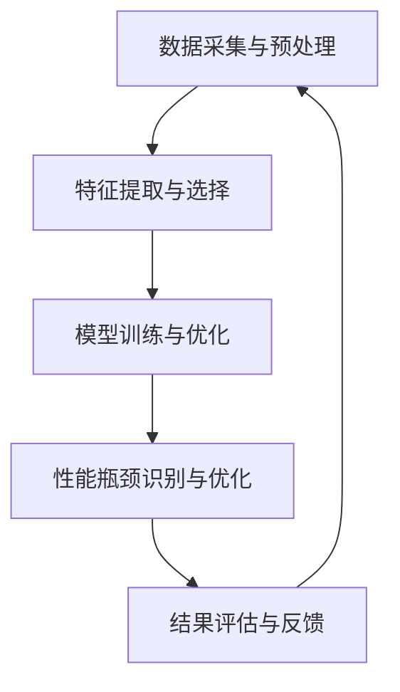
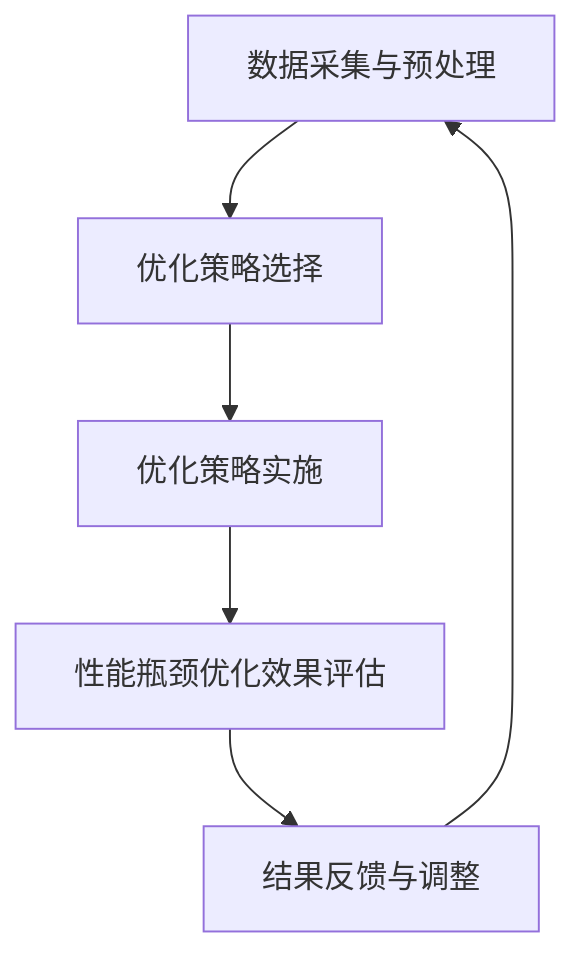

                 

## 《AI辅助软件性能瓶颈识别与优化》文章标题

> 关键词：人工智能、软件性能瓶颈、识别与优化、AI辅助技术、性能分析

> 摘要：本文将探讨AI在软件性能瓶颈识别与优化中的应用。首先，我们介绍了软件性能瓶颈的概念和问题背景，随后深入分析了AI辅助软件性能瓶颈识别的核心概念和关键技术。接着，我们探讨了人工智能的发展现状与趋势，为后续研究提供了背景支持。随后，文章详细阐述了AI辅助软件性能瓶颈识别的基本原理、核心算法、数学模型和实际应用实例。在此基础上，我们提出了AI辅助软件性能瓶颈优化的策略，并通过具体实例展示了其效果。最后，文章总结了全文内容，并对未来的研究方向进行了展望。希望通过本文，读者能够对AI在软件性能瓶颈识别与优化中的应用有更深入的了解。

## 《AI辅助软件性能瓶颈识别与优化》目录大纲

### 第1章 引言

#### 1.1 问题背景

##### 1.1.1 软件性能瓶颈的问题描述

##### 1.1.2 AI技术在软件性能瓶颈识别中的应用

##### 1.1.3 研究意义与目标

#### 1.2 AI辅助软件性能瓶颈识别的核心概念

##### 1.2.1 AI技术的基本概念

##### 1.2.2 软件性能瓶颈的定义与类型

##### 1.2.3 AI辅助软件性能瓶颈识别的关键技术

#### 1.3 人工智能的发展现状与趋势

##### 1.3.1 人工智能的发展历程

##### 1.3.2 人工智能在软件工程中的应用现状

##### 1.3.3 人工智能在软件性能瓶颈识别中的发展趋势

#### 1.4 书籍结构安排与主要内容概述

##### 1.4.1 目录结构安排

##### 1.4.2 各章节内容概述

##### 1.4.3 阅读指南与学习方法

#### 1.5 本章小结

### 第2章 AI辅助软件性能瓶颈识别原理

#### 2.1 AI辅助软件性能瓶颈识别的基本原理

##### 2.1.1 数据驱动的性能瓶颈识别

##### 2.1.2 模型驱动的性能瓶颈识别

##### 2.1.3 混合驱动的性能瓶颈识别

#### 2.2 AI辅助软件性能瓶颈识别的核心算法

##### 2.2.1 机器学习算法

###### 2.2.1.1 监督学习算法

###### 2.2.1.2 无监督学习算法

###### 2.2.1.3 半监督学习算法

##### 2.2.2 深度学习算法

###### 2.2.2.1 神经网络

###### 2.2.2.2 卷积神经网络(CNN)

###### 2.2.2.3 递归神经网络(RNN)

###### 2.2.2.4 生成对抗网络(GAN)

##### 2.2.3 强化学习算法

#### 2.3 AI辅助软件性能瓶颈识别的Mermaid流程图

##### 2.3.1 数据采集与预处理

##### 2.3.2 特征提取与选择

##### 2.3.3 模型训练与优化

##### 2.3.4 性能瓶颈识别与优化

#### 2.4 AI辅助软件性能瓶颈识别的数学模型与公式

##### 2.4.1 性能瓶颈识别的数学模型

$$
\text{性能瓶颈} = f(\text{资源使用率}, \text{系统负载})
$$

##### 2.4.2 性能瓶颈优化的数学模型

$$
\text{优化策略} = \arg\min_{\theta} L(\theta)
$$

#### 2.5 AI辅助软件性能瓶颈识别的举例说明

##### 2.5.1 示例一：CPU性能瓶颈识别

##### 2.5.2 示例二：内存性能瓶颈识别

#### 2.6 本章小结

### 第3章 AI辅助软件性能瓶颈优化策略

#### 3.1 软件性能瓶颈优化的基本策略

##### 3.1.1 资源调优策略

###### 3.1.1.1 CPU资源调优

###### 3.1.1.2 内存资源调优

###### 3.1.1.3 网络资源调优

##### 3.1.2 算法优化策略

###### 3.1.2.1 算法改进

###### 3.1.2.2 算法调优

##### 3.1.3 系统架构优化策略

###### 3.1.3.1 微服务架构

###### 3.1.3.2 容器化与虚拟化

##### 3.1.4 资源分配与负载均衡策略

###### 3.1.4.1 动态资源分配

###### 3.1.4.2 负载均衡算法

#### 3.2 AI技术在软件性能瓶颈优化中的应用

##### 3.2.1 强化学习在资源调优中的应用

##### 3.2.2 深度学习在算法优化中的应用

##### 3.2.3 机器学习在系统架构优化中的应用

#### 3.3 AI辅助软件性能瓶颈优化的Mermaid流程图

##### 3.3.1 数据采集与预处理

##### 3.3.2 优化策略选择

##### 3.3.3 优化策略实施

##### 3.3.4 性能瓶颈优化效果评估

#### 3.4 AI辅助软件性能瓶颈优化实例分析

##### 3.4.1 实例一：某电商平台性能瓶颈优化

##### 3.4.2 实例二：某银行系统性能瓶颈优化

#### 3.5 本章小结

-----------------------

### 第1章 引言

#### 1.1 问题背景

软件性能瓶颈是指在软件系统运行过程中，由于硬件资源、软件设计、运行环境等因素的限制，导致系统性能无法达到预期水平的问题。这些问题可能会影响用户的体验、系统的稳定性和可靠性。软件性能瓶颈通常表现为响应时间过长、吞吐量不足、资源利用率低下等。

在过去，软件性能瓶颈的识别和优化主要依赖于开发人员的经验和测试工具。然而，随着软件系统的复杂度和规模的增长，传统的识别和优化方法已经难以满足需求。此时，人工智能（AI）技术的引入为软件性能瓶颈的识别和优化提供了新的思路。

AI技术在软件性能瓶颈识别中的应用主要体现在以下几个方面：

1. **自动化性能分析**：AI可以自动分析软件系统的运行数据，识别出潜在的性能瓶颈。
2. **智能优化**：基于对系统运行数据的分析，AI可以提出优化建议，帮助开发人员快速定位和解决性能问题。
3. **自适应调整**：AI可以根据系统运行状态实时调整资源配置，以最大化系统性能。

#### 1.2 AI辅助软件性能瓶颈识别的核心概念

AI辅助软件性能瓶颈识别涉及多个核心概念，包括AI技术的基本概念、软件性能瓶颈的定义与类型以及关键技术的具体实现。

1. **AI技术的基本概念**：AI是指由人制造出来的系统所表现出的人类智能特征，包括机器学习、深度学习、强化学习等。
   
2. **软件性能瓶颈的定义与类型**：性能瓶颈是指系统中限制性能的最大因素。常见的性能瓶颈类型包括CPU瓶颈、内存瓶颈、I/O瓶颈和网络瓶颈等。

3. **AI辅助软件性能瓶颈识别的关键技术**：主要包括数据采集与预处理、特征提取与选择、模型训练与优化等。

#### 1.3 人工智能的发展现状与趋势

人工智能（AI）的发展经历了数个阶段，从早期的规则系统到如今的深度学习和强化学习，AI技术在各个领域都取得了显著的成果。特别是在软件工程领域，AI技术的应用越来越广泛，已经成为提升软件开发效率和质量的重要工具。

1. **发展历程**：AI的发展可以追溯到20世纪50年代，经历了早期的符号主义、专家系统、机器学习、深度学习等阶段。

2. **应用现状**：目前，AI技术在软件开发、测试、性能优化等多个环节都有广泛应用，例如自动化测试、智能代码审查、性能预测等。

3. **发展趋势**：随着计算能力和数据量的提升，AI技术将越来越成熟，其应用范围也将进一步扩大。特别是在软件性能瓶颈识别和优化领域，AI技术有望实现自动化、智能化的性能优化。

#### 1.4 书籍结构安排与主要内容概述

本书旨在系统性地介绍AI辅助软件性能瓶颈识别与优化的方法和技术。具体来说，本书分为三个主要部分：

1. **理论基础**：包括第1章和第2章，介绍AI辅助软件性能瓶颈识别与优化的基本概念、原理和算法。
2. **实践应用**：包括第3章，介绍AI技术在软件性能瓶颈优化中的具体应用案例。
3. **总结与展望**：对全书内容进行总结，并对未来研究方向进行展望。

#### 1.5 本章小结

本章介绍了AI辅助软件性能瓶颈识别与优化的问题背景、核心概念、人工智能的发展现状与趋势，以及本书的结构安排。通过本章的学习，读者可以了解AI技术在软件性能瓶颈识别与优化中的应用潜力，为后续章节的学习打下基础。

### 第2章 AI辅助软件性能瓶颈识别原理

#### 2.1 AI辅助软件性能瓶颈识别的基本原理

AI辅助软件性能瓶颈识别的基本原理主要包括数据驱动、模型驱动和混合驱动三种方法。

1. **数据驱动**：数据驱动方法是基于系统运行过程中产生的海量数据，通过统计分析、模式识别等技术来识别性能瓶颈。这种方法的优势在于不需要复杂的先验知识，但缺点是可能受到数据质量和数量的影响。

2. **模型驱动**：模型驱动方法是基于对系统工作原理和性能瓶颈机理的深入理解，通过构建数学模型来识别性能瓶颈。这种方法需要丰富的领域知识和较强的建模能力，但能够提供更为精确的识别结果。

3. **混合驱动**：混合驱动方法结合了数据驱动和模型驱动的优势，通过将数据驱动和模型驱动的方法相结合，提高性能瓶颈识别的准确性和效率。

#### 2.2 AI辅助软件性能瓶颈识别的核心算法

AI辅助软件性能瓶颈识别的核心算法主要包括机器学习算法、深度学习算法和强化学习算法。

1. **机器学习算法**：机器学习算法是一种通过训练模型来从数据中学习规律的算法。根据训练数据的不同，机器学习算法可以分为监督学习、无监督学习和半监督学习。

   - **监督学习算法**：监督学习算法需要标注的数据集进行训练，常见的算法包括线性回归、决策树、支持向量机等。
   - **无监督学习算法**：无监督学习算法不需要标注的数据集，通过发现数据之间的模式来进行学习，常见的算法包括聚类、主成分分析等。
   - **半监督学习算法**：半监督学习算法结合了监督学习和无监督学习的特点，利用少量的标注数据和大量的未标注数据进行学习。

2. **深度学习算法**：深度学习算法是一种基于多层神经网络的学习方法，通过模拟人脑神经元之间的连接关系，实现从数据中自动提取特征和进行复杂模式识别。常见的深度学习算法包括神经网络、卷积神经网络（CNN）、递归神经网络（RNN）和生成对抗网络（GAN）。

   - **神经网络**：神经网络是一种模拟人脑神经元连接关系的基本结构，通过前向传播和反向传播算法进行训练。
   - **卷积神经网络（CNN）**：卷积神经网络是一种针对图像数据设计的深度学习算法，通过卷积层、池化层和全连接层实现图像特征的提取和分类。
   - **递归神经网络（RNN）**：递归神经网络是一种针对序列数据设计的深度学习算法，通过隐藏状态和输入序列之间的递归关系实现序列数据的建模和预测。
   - **生成对抗网络（GAN）**：生成对抗网络是一种由生成器和判别器组成的深度学习算法，通过对抗训练实现数据的生成和优化。

3. **强化学习算法**：强化学习算法是一种通过与环境交互来学习最优策略的算法，适用于需要决策的动态环境。强化学习算法的核心是奖励机制，通过最大化奖励来实现目标的优化。

   - **Q学习**：Q学习是一种基于值函数的强化学习算法，通过估计状态-动作值函数来实现最优策略的学习。
   - **策略梯度**：策略梯度是一种基于策略的强化学习算法，通过直接优化策略的参数来实现最优策略的学习。

#### 2.3 AI辅助软件性能瓶颈识别的Mermaid流程图

以下是AI辅助软件性能瓶颈识别的Mermaid流程图：

- **数据采集与预处理**：从系统运行过程中收集数据，并进行数据清洗、去噪和归一化等预处理操作。
- **特征提取与选择**：从预处理后的数据中提取有助于性能瓶颈识别的特征，并选择关键特征进行建模。
- **模型训练与优化**：使用提取的关键特征训练模型，通过调整模型参数来提高性能瓶颈识别的准确性。
- **性能瓶颈识别与优化**：利用训练好的模型对系统运行数据进行分析，识别性能瓶颈并提出优化策略。
- **结果评估与反馈**：对优化结果进行评估，并将评估结果反馈到数据采集与预处理环节，以改进后续的性能瓶颈识别与优化。

#### 2.4 AI辅助软件性能瓶颈识别的数学模型与公式

AI辅助软件性能瓶颈识别的数学模型主要包括性能瓶颈识别的数学模型和性能瓶颈优化的数学模型。

1. **性能瓶颈识别的数学模型**：

   $$
   \text{性能瓶颈} = f(\text{资源使用率}, \text{系统负载})
   $$

   其中，$f$ 表示性能瓶颈识别函数，$\text{资源使用率}$ 和 $\text{系统负载}$ 是影响性能瓶颈的两个关键因素。

2. **性能瓶颈优化的数学模型**：

   $$
   \text{优化策略} = \arg\min_{\theta} L(\theta)
   $$

   其中，$\theta$ 表示优化策略的参数，$L(\theta)$ 表示优化目标函数，$\arg\min_{\theta} L(\theta)$ 表示找到使 $L(\theta)$ 最小的 $\theta$，即最优的优化策略。

   例如，对于资源调优策略，优化目标函数可以定义为资源使用率与系统负载的比值，即：

   $$
   L(\theta) = \frac{\text{资源使用率}}{\text{系统负载}}
   $$

   最优的优化策略是找到使 $L(\theta)$ 最小的 $\theta$，即最小化资源使用率与系统负载的比值。

#### 2.5 AI辅助软件性能瓶颈识别的举例说明

1. **示例一：CPU性能瓶颈识别**

   在这个示例中，我们使用机器学习算法中的线性回归模型来识别CPU性能瓶颈。

   - **数据采集与预处理**：从系统运行过程中收集CPU使用率数据，并进行数据清洗和归一化处理。
   - **特征提取与选择**：选择CPU使用率作为关键特征，构建线性回归模型。
   - **模型训练与优化**：使用收集到的CPU使用率数据训练线性回归模型，通过调整模型参数来提高识别准确性。
   - **性能瓶颈识别与优化**：利用训练好的线性回归模型对新的CPU使用率数据进行分析，识别CPU性能瓶颈，并提出优化策略。
   - **结果评估与反馈**：对优化结果进行评估，并将评估结果反馈到数据采集与预处理环节，以改进后续的CPU性能瓶颈识别与优化。

2. **示例二：内存性能瓶颈识别**

   在这个示例中，我们使用深度学习算法中的卷积神经网络（CNN）来识别内存性能瓶颈。

   - **数据采集与预处理**：从系统运行过程中收集内存使用率数据，并进行数据清洗和归一化处理。
   - **特征提取与选择**：选择内存使用率作为关键特征，构建卷积神经网络模型。
   - **模型训练与优化**：使用收集到的内存使用率数据训练卷积神经网络模型，通过调整模型参数来提高识别准确性。
   - **性能瓶颈识别与优化**：利用训练好的卷积神经网络模型对新的内存使用率数据进行分析，识别内存性能瓶颈，并提出优化策略。
   - **结果评估与反馈**：对优化结果进行评估，并将评估结果反馈到数据采集与预处理环节，以改进后续的内存性能瓶颈识别与优化。

#### 2.6 本章小结

本章介绍了AI辅助软件性能瓶颈识别的基本原理、核心算法、Mermaid流程图、数学模型与公式以及举例说明。通过本章的学习，读者可以了解AI辅助软件性能瓶颈识别的方法和技术，为后续的性能瓶颈优化奠定基础。

### 第3章 AI辅助软件性能瓶颈优化策略

#### 3.1 软件性能瓶颈优化的基本策略

软件性能瓶颈优化的基本策略主要包括资源调优策略、算法优化策略和系统架构优化策略。

1. **资源调优策略**：资源调优策略主要关注硬件资源和软件资源的优化。硬件资源调优包括CPU、内存、磁盘和网络等；软件资源调优包括进程管理、线程管理和内存管理等。常见的资源调优方法有：

   - **CPU资源调优**：通过调整进程和线程的优先级、使用多线程技术、优化代码执行路径等方法来提高CPU利用率。
   - **内存资源调优**：通过优化内存分配、回收和垃圾回收策略来减少内存碎片和提高内存利用率。
   - **网络资源调优**：通过优化网络传输协议、使用缓存技术、减少网络延迟等方法来提高网络传输效率。

2. **算法优化策略**：算法优化策略主要关注软件算法的优化。算法优化的方法有：

   - **算法改进**：通过改进现有算法的原理和实现方式来提高算法的效率，如选择更高效的排序算法、图算法等。
   - **算法调优**：通过调整算法的参数和配置来提高算法的性能，如调整数据库查询的索引、调整缓存策略等。

3. **系统架构优化策略**：系统架构优化策略主要关注软件系统的架构设计。系统架构优化的方法有：

   - **微服务架构**：通过将大型单体应用拆分为多个小型服务，提高系统的可扩展性和容错性。
   - **容器化与虚拟化**：通过使用容器化和虚拟化技术来提高系统的资源利用率和部署灵活性。

4. **资源分配与负载均衡策略**：资源分配与负载均衡策略主要关注系统资源在不同任务之间的分配和调度。常见的策略有：

   - **动态资源分配**：根据系统的实际负载情况动态调整资源的分配，如使用云服务中的自动扩展功能。
   - **负载均衡算法**：通过将请求均匀分配到不同的服务器或容器上来避免单点过载，常见的负载均衡算法有轮询、最小连接数、加权轮询等。

#### 3.2 AI技术在软件性能瓶颈优化中的应用

AI技术在软件性能瓶颈优化中的应用主要体现在以下几个方面：

1. **强化学习在资源调优中的应用**：强化学习可以通过模拟系统运行环境，学习最优的资源分配策略，提高系统的资源利用率。例如，可以使用强化学习算法来优化虚拟机资源分配，提高云服务器的资源利用率。

2. **深度学习在算法优化中的应用**：深度学习算法可以自动提取数据特征，优化软件算法。例如，可以使用深度学习算法来自动优化数据库查询，提高查询效率。

3. **机器学习在系统架构优化中的应用**：机器学习算法可以通过分析系统运行数据，识别系统瓶颈并提出优化建议。例如，可以使用机器学习算法来优化系统架构，提高系统的可扩展性和容错性。

#### 3.3 AI辅助软件性能瓶颈优化的Mermaid流程图

以下是AI辅助软件性能瓶颈优化的Mermaid流程图：

- **数据采集与预处理**：从系统运行过程中收集数据，并进行数据清洗、去噪和归一化等预处理操作。
- **优化策略选择**：根据系统运行数据和性能瓶颈类型，选择合适的优化策略。
- **优化策略实施**：实施选定的优化策略，对系统进行配置调整、代码优化等。
- **性能瓶颈优化效果评估**：评估优化策略的效果，通过性能测试、负载测试等方法来验证优化效果。
- **结果反馈与调整**：根据优化效果评估结果，对优化策略进行调整和改进。

#### 3.4 AI辅助软件性能瓶颈优化实例分析

1. **实例一：某电商平台性能瓶颈优化**

   某电商平台在系统运行过程中遇到了CPU瓶颈和内存瓶颈，导致系统响应时间过长，用户体验不佳。通过AI辅助性能瓶颈优化，采取了以下措施：

   - **数据采集与预处理**：收集系统运行过程中的CPU使用率、内存使用率、网络流量等数据，并进行数据清洗和归一化处理。
   - **优化策略选择**：通过分析数据，确定CPU瓶颈和内存瓶颈的原因，选择合适的优化策略，如调整线程池大小、优化数据库查询等。
   - **优化策略实施**：实施优化策略，调整系统配置和代码实现，如增加线程数、优化数据库索引等。
   - **性能瓶颈优化效果评估**：通过性能测试和负载测试，验证优化策略的效果，如CPU使用率降低、内存使用率降低、响应时间缩短等。
   - **结果反馈与调整**：根据评估结果，进一步调整优化策略，如继续优化数据库查询、增加缓存等。

2. **实例二：某银行系统性能瓶颈优化**

   某银行系统在处理大量交易请求时遇到了网络瓶颈和磁盘瓶颈，导致交易处理速度慢、系统稳定性差。通过AI辅助性能瓶颈优化，采取了以下措施：

   - **数据采集与预处理**：收集系统运行过程中的网络流量、磁盘读写速度等数据，并进行数据清洗和归一化处理。
   - **优化策略选择**：通过分析数据，确定网络瓶颈和磁盘瓶颈的原因，选择合适的优化策略，如增加网络带宽、优化磁盘IO等。
   - **优化策略实施**：实施优化策略，增加网络带宽、优化磁盘IO读写策略等。
   - **性能瓶颈优化效果评估**：通过性能测试和负载测试，验证优化策略的效果，如网络传输速度提高、磁盘读写速度提高、交易处理速度提高等。
   - **结果反馈与调整**：根据评估结果，进一步调整优化策略，如继续增加网络带宽、优化数据库查询等。

#### 3.5 本章小结

本章介绍了软件性能瓶颈优化的基本策略、AI技术在性能瓶颈优化中的应用以及AI辅助性能瓶颈优化的实例分析。通过本章的学习，读者可以了解如何利用AI技术来优化软件性能瓶颈，提高系统的性能和稳定性。

### 总结与展望

通过本文的介绍，我们系统地探讨了AI辅助软件性能瓶颈识别与优化的方法和技术。首先，我们介绍了软件性能瓶颈的问题背景和AI技术在其中的应用，分析了AI辅助软件性能瓶颈识别的核心概念和关键技术。接着，我们详细阐述了AI辅助软件性能瓶颈识别的基本原理、核心算法、数学模型和实际应用实例。在此基础上，我们提出了AI辅助软件性能瓶颈优化的策略，并通过具体实例展示了其效果。

AI技术在软件性能瓶颈识别与优化中的应用具有重要的理论和实践意义。一方面，AI技术可以自动化地识别软件性能瓶颈，提高识别的准确性和效率；另一方面，AI技术可以提出优化策略，帮助开发人员快速定位和解决性能问题，提高系统的性能和稳定性。

未来的研究方向可以从以下几个方面展开：

1. **算法优化**：进一步研究和发展AI辅助软件性能瓶颈识别与优化的算法，提高算法的准确性和效率。
2. **多模态数据融合**：结合多种数据源，如日志数据、性能监控数据、用户反馈数据等，提高性能瓶颈识别的准确性和全面性。
3. **自适应优化**：研究自适应优化策略，根据系统运行状态动态调整优化策略，实现更加智能的优化。
4. **跨领域应用**：探索AI技术在其他领域的性能瓶颈识别与优化中的应用，如物联网、大数据等。
5. **性能预测与预警**：研究基于AI技术的性能预测与预警方法，提前识别潜在的性能瓶颈，预防系统性能问题。

通过不断的研究和实践，我们有理由相信，AI技术在软件性能瓶颈识别与优化领域将发挥越来越重要的作用，为软件工程的发展带来新的机遇和挑战。

