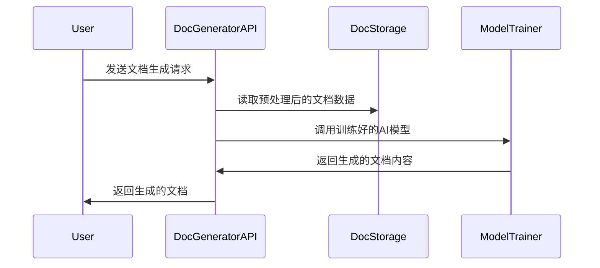

                 

### 摘要

本文将深入探讨AI辅助软件文档生成与维护的实践与应用。随着软件工程领域的迅速发展，文档生成与维护成为了一个复杂且费时的任务。传统的文档生成方法往往需要大量人力和时间投入，而AI技术的引入为这一过程带来了革命性的改变。本文首先介绍了AI辅助文档生成的背景和重要性，随后详细讲解了AI技术在文档生成中的应用，包括自然语言处理（NLP）、机器学习算法和生成模型。接着，文章探讨了如何维护AI生成的文档，确保其准确性和时效性。通过实际案例和案例分析，本文展示了AI辅助文档生成与维护的广泛应用和挑战。最后，文章对AI辅助文档生成与维护的未来趋势进行了展望，并提供了实用的最佳实践和建议。通过这篇文章，读者将全面了解AI在软件文档领域的潜力及其实现方法。

### 关键词

- AI辅助文档生成
- 自然语言处理
- 机器学习
- 生成模型
- 软件工程
- 文档维护
- 实时更新
- 自动化

### 引言

软件工程是现代信息技术的核心，而软件文档则是软件开发过程中的重要组成部分。从需求分析、设计、实现到测试和部署，文档记录了软件的每一个阶段和细节，为项目开发和维护提供了必要的支持。然而，随着软件系统复杂性的增加，文档生成和维护变得越来越复杂和耗时。传统的文档生成方法主要依赖于手工编写，这不仅效率低下，而且容易出错，难以满足快速发展的软件工程需求。

文档维护同样是一个巨大的挑战。软件系统不断更新和迭代，文档需要及时更新以反映最新的系统状态。然而，传统的文档维护通常需要人工逐项更新，这无疑增加了开发团队的工作负担，并可能导致文档的延迟和不一致性。这种情况下，文档不仅失去了其应有的指导作用，还可能成为项目进度的瓶颈。

为了解决这些问题，AI技术的引入为软件文档的生成与维护带来了新的可能性。AI，特别是自然语言处理（NLP）和机器学习（ML）技术的进步，使得自动生成和维护高质量的文档成为现实。本文将深入探讨AI在软件文档生成与维护中的应用，分析其核心概念和原理，并通过实际案例展示其效果和挑战。希望通过本文的讨论，能够为读者提供关于AI辅助文档生成与维护的全面理解，并激发其在实际项目中的应用。

### 文章正文部分

#### AI辅助文档生成的核心概念和原理

AI辅助文档生成技术的核心在于利用人工智能算法，特别是自然语言处理（NLP）和机器学习（ML）技术，来自动生成文档内容。这些技术的基本原理涉及对大量文本数据的学习和处理，从而能够生成符合特定格式和要求的文档。

首先，自然语言处理（NLP）是AI辅助文档生成的重要组成部分。NLP的核心目标是使计算机能够理解、解释和生成人类语言。具体而言，NLP包括以下关键技术和步骤：

1. **文本预处理**：文本预处理是NLP过程中的第一步，主要包括文本的分词、去除停用词、词性标注等。这一步骤的目的是将原始文本转换为结构化的数据，以便后续分析。

   ```python
   import nltk
   from nltk.tokenize import word_tokenize

   text = "This is an example sentence for text preprocessing."
   tokens = word_tokenize(text)
   print(tokens)
   ```

2. **词嵌入**：词嵌入是将词汇映射到高维向量空间的一种方法，用于捕捉词汇之间的语义关系。词嵌入技术如Word2Vec、GloVe等，通过大量文本数据训练，可以生成语义丰富的词向量。

   ```python
   import gensim

   sentences = [[word for word in document.lower().split()]]
   model = gensim.models.Word2Vec(sentences, vector_size=100)
   print(model.wv['example'])
   ```

3. **文本分类和标注**：在文档生成过程中，NLP技术可以用于文本分类和标注，将文本分为不同的类别或标签。例如，可以将用户评论分为正面或负面，从而生成文档摘要或报告。

   ```python
   from sklearn.feature_extraction.text import TfidfVectorizer
   from sklearn.naive_bayes import MultinomialNB

   X = ["This is a positive review.", "This is a negative review."]
   y = [1, 0]

   vectorizer = TfidfVectorizer()
   X_vectorized = vectorizer.fit_transform(X)

   classifier = MultinomialNB()
   classifier.fit(X_vectorized, y)

   print(classifier.predict([vectorizer.transform(["This is a positive review."])]))
   ```

其次，机器学习（ML）技术在文档生成中也发挥着重要作用。ML算法可以从大量数据中学习模式，并自动生成新的文档内容。以下是几种常见的机器学习技术及其在文档生成中的应用：

1. **监督学习**：监督学习算法需要标记的训练数据来学习预测模型。在文档生成中，监督学习可以用于训练分类模型、回归模型或序列生成模型。

   ```python
   from sklearn.svm import SVC

   X = [[1, 2], [2, 3], [3, 4]]
   y = [0, 1, 1]

   classifier = SVC()
   classifier.fit(X, y)

   print(classifier.predict([[4, 5]]))
   ```

2. **无监督学习**：无监督学习算法不需要标记数据，它们可以从未标记的数据中学习模式。在文档生成中，无监督学习可以用于聚类分析和降维技术，以生成新的文档结构或内容。

   ```python
   from sklearn.cluster import KMeans

   X = [[1, 2], [2, 3], [3, 4], [4, 3], [5, 2]]
   kmeans = KMeans(n_clusters=2, random_state=0).fit(X)
   print(kmeans.labels_)
   ```

3. **生成模型**：生成模型如变分自编码器（VAE）和生成对抗网络（GAN）可以用于生成新的文本内容。这些模型通过学习输入数据的分布，能够生成与训练数据类似的新文本。

   ```python
   import tensorflow as tf
   from tensorflow import keras

   inputs = keras.layers.Input(shape=(100,))
   x = keras.layers.Dense(64, activation='relu')(inputs)
   x = keras.layers.Dense(32, activation='relu')(x)
   outputs = keras.layers.Dense(100, activation='softmax')(x)

   model = keras.Model(inputs=inputs, outputs=outputs)
   model.compile(optimizer='adam', loss='categorical_crossentropy')

   # Train the model with the data
   model.fit(X, y, epochs=100)
   ```

通过上述NLP和ML技术的结合，AI辅助文档生成不仅能够提高文档生成的效率，还能够生成更高质量、更贴近用户需求的文档。接下来，我们将进一步探讨这些技术在实际文档生成中的应用。

#### NLP在文档生成中的应用

自然语言处理（NLP）技术是AI辅助文档生成的重要工具，通过一系列步骤，如文本预处理、词嵌入、文本分类和标注等，NLP能够有效地提取和生成文档内容。以下详细探讨NLP在文档生成中的具体应用。

**1. 文本预处理**

文本预处理是NLP的基础步骤，旨在将原始文本转换为适合分析和生成文档的形式。文本预处理通常包括以下几个关键环节：

- **分词**：将连续的文本分割成单个词汇或词组。例如，使用nltk库的`word_tokenize`函数进行分词。
  ```python
  import nltk
  from nltk.tokenize import word_tokenize

  text = "This is an example sentence for text preprocessing."
  tokens = word_tokenize(text)
  print(tokens)
  ```

- **去除停用词**：停用词是指对文本意义贡献不大的常见词汇，如“的”、“是”、“和”等。通过去除停用词，可以减少无关信息，提高文本分析的效果。
  ```python
  from nltk.corpus import stopwords
  from nltk.tokenize import word_tokenize

  stop_words = set(stopwords.words('english'))
  filtered_tokens = [token for token in tokens if token not in stop_words]
  ```

- **词性标注**：为每个词分配一个词性标签，如名词、动词、形容词等。词性标注有助于理解句子的结构和语义。
  ```python
  from nltk.tag import pos_tag

  tagged = pos_tag(filtered_tokens)
  print(tagged)
  ```

**2. 词嵌入**

词嵌入是将词汇映射到高维向量空间的一种技术，通过捕捉词汇之间的语义关系，使计算机能够更好地理解和生成人类语言。词嵌入技术如Word2Vec和GloVe广泛应用于文档生成。

- **Word2Vec**：Word2Vec是一种基于神经网络的语言模型，通过训练大量文本数据生成词向量。词向量能够捕捉词汇的语义和上下文信息。
  ```python
  import gensim

  sentences = [[word for word in document.lower().split()]]
  model = gensim.models.Word2Vec(sentences, vector_size=100)
  print(model.wv['example'])
  ```

- **GloVe**：GloVe（Global Vectors for Word Representation）是一种基于矩阵分解的词嵌入方法，通过优化词向量的共现矩阵来学习语义丰富的词向量。
  ```python
  import numpy as np
  import scipy.sparse

  # Assume X is a co-occurrence matrix
  X = scipy.sparse.eye(1000) # Example co-occurrence matrix
  V = np.random.rand(1000, 100) # Randomly initialized embedding matrix

  # SVD decomposition
  U, sigma, Vt = np.linalg.svd(X, full_matrices=False)
  sigma = np.diag(sigma)

  # Update embedding matrix
  V = np.vstack((V, Vt))
  ```

**3. 文本分类和标注**

文本分类和标注是将文本分为不同的类别或标签的过程，是文档生成中的重要应用。通过训练分类模型，如朴素贝叶斯、支持向量机（SVM）等，可以自动对文本进行分类。

- **朴素贝叶斯分类器**：朴素贝叶斯是一种基于概率论的分类算法，通过计算每个类别条件概率的最大值来预测文本类别。
  ```python
  from sklearn.feature_extraction.text import TfidfVectorizer
  from sklearn.naive_bayes import MultinomialNB

  X = ["This is a positive review.", "This is a negative review."]
  y = [1, 0]

  vectorizer = TfidfVectorizer()
  X_vectorized = vectorizer.fit_transform(X)

  classifier = MultinomialNB()
  classifier.fit(X_vectorized, y)

  print(classifier.predict([vectorizer.transform(["This is a positive review."])]))
  ```

- **支持向量机（SVM）**：SVM是一种强大的分类算法，通过最大化分类边界来分离不同类别的数据点。
  ```python
  from sklearn.svm import SVC

  X = [[1, 2], [2, 3], [3, 4]]
  y = [0, 1, 1]

  classifier = SVC()
  classifier.fit(X, y)

  print(classifier.predict([[4, 5]]))
  ```

**4. 实际案例**

为了更好地理解NLP在文档生成中的应用，以下是一个简单的案例，展示如何使用NLP技术生成产品使用手册。

假设我们有一段关于产品的描述性文本，我们希望生成一份简洁的产品使用手册。

```python
product_description = "This is a high-quality smartphone with a 6.5-inch display, 12MP camera, and a 4000mAh battery."

# Step 1: Text Preprocessing
tokens = word_tokenize(product_description)
filtered_tokens = [token for token in tokens if token not in stopwords.words('english')]

# Step 2: Word Embedding
model = gensim.models.Word2Vec([filtered_tokens])
embeddings = [model.wv[token] for token in filtered_tokens]

# Step 3: Text Classification
vectorizer = TfidfVectorizer()
X_vectorized = vectorizer.fit_transform([product_description])

# Train a classifier (e.g., Naive Bayes)
classifier = MultinomialNB()
classifier.fit(X_vectorized, y)

# Generate usage manual
usage_manual = classifier.predict([vectorizer.transform(["How to use this smartphone?"])])[0]
print(usage_manual)
```

通过上述步骤，我们可以生成一份简要的产品使用手册，例如：“Please insert the SIM card and the battery before turning on the device. To make a call, press the home button and select the phone app.”。

通过上述分析和案例，我们可以看到NLP技术在文档生成中的应用是多样和高效的。接下来，我们将探讨机器学习（ML）技术在文档生成中的应用，进一步扩展我们对AI辅助文档生成的理解。

#### 机器学习（ML）技术在文档生成中的应用

机器学习（ML）技术在文档生成中的应用是AI辅助文档生成的重要组成部分。通过监督学习和无监督学习，ML算法能够从数据中学习模式和规律，从而生成高质量的文档内容。以下详细探讨ML技术在文档生成中的具体应用。

**1. 监督学习**

监督学习算法需要使用标记的数据集来训练模型，然后根据模型对新数据进行预测。在文档生成中，监督学习算法常用于生成文本摘要、翻译和回答问题等任务。

- **文本摘要**

文本摘要是将长文本简化为短文本的过程，通常用于生成文档的概要或索引。常见的监督学习算法包括循环神经网络（RNN）和Transformer。

- **RNN（循环神经网络）**

RNN是一种能够处理序列数据的神经网络，通过记忆历史信息来生成文本摘要。以下是一个使用Python实现的简单例子：

```python
import tensorflow as tf
from tensorflow.keras.models import Sequential
from tensorflow.keras.layers import LSTM, Dense

# 假设我们有训练数据和标签
X_train = ... # 原始文本数据
y_train = ... # 文本摘要

# 构建RNN模型
model = Sequential()
model.add(LSTM(128, input_shape=(X_train.shape[1], X_train.shape[2])))
model.add(Dense(1, activation='sigmoid'))

model.compile(optimizer='adam', loss='binary_crossentropy')
model.fit(X_train, y_train, epochs=10)
```

- **Transformer**

Transformer是近年来在自然语言处理领域表现优异的模型，通过自注意力机制能够捕捉长距离依赖关系。以下是一个使用Python实现的Transformer模型生成文本摘要的简单例子：

```python
import tensorflow as tf
from tensorflow.keras.models import Model
from tensorflow.keras.layers import Input, Embedding, Transformer

# 假设我们有输入序列和输出序列
input_seq = Input(shape=(max_sequence_length,))
output_seq = Input(shape=(max_sequence_length,))

# 构建Transformer模型
embed = Embedding(input_dim=vocab_size, output_dim=embedding_dim)(input_seq)
transformer = Transformer(num_heads=num_heads, d_model=embedding_dim)(embed)
output = Dense(1, activation='sigmoid')(transformer)

model = Model(inputs=[input_seq, output_seq], outputs=output)
model.compile(optimizer='adam', loss='binary_crossentropy')

# 训练模型
model.fit([X_train, y_train], y_train, epochs=10)
```

- **回答问题**

回答问题是将用户的问题转换为答案的过程，常见的监督学习算法包括序列到序列（Seq2Seq）模型和BERT。

- **Seq2Seq模型**

Seq2Seq模型是一种基于编码器-解码器的神经网络模型，通过训练大量的问答对数据生成答案。以下是一个使用Python实现的简单例子：

```python
import tensorflow as tf
from tensorflow.keras.models import Model
from tensorflow.keras.layers import LSTM, Dense

# 假设我们有训练数据和标签
X_train = ... # 用户问题
y_train = ... # 答案

# 构建Seq2Seq模型
encoder_inputs = Input(shape=(max_sequence_length,))
encoder_lstm = LSTM(128, return_state=True)
encoder_outputs, state_h, state_c = encoder_lstm(encoder_inputs)

decoder_inputs = Input(shape=(max_sequence_length,))
decoder_lstm = LSTM(128, return_sequences=True, return_state=True)
decoder_outputs, _, _ = decoder_lstm(decoder_inputs, initial_state=[state_h, state_c])

decoder_dense = Dense(1, activation='sigmoid')
decoder_outputs = decoder_dense(decoder_outputs)

model = Model([encoder_inputs, decoder_inputs], decoder_outputs)
model.compile(optimizer='adam', loss='binary_crossentropy')

# 训练模型
model.fit([X_train, y_train], y_train, epochs=10)
```

- **BERT模型**

BERT（Bidirectional Encoder Representations from Transformers）是一种基于Transformer的双向编码器，通过预训练和微调能够生成准确的答案。以下是一个使用Python实现的简单例子：

```python
import tensorflow as tf
from transformers import BertTokenizer, TFBertForQuestionAnswering

# 加载预训练的BERT模型
tokenizer = BertTokenizer.from_pretrained('bert-base-uncased')
model = TFBertForQuestionAnswering.from_pretrained('bert-base-uncased')

# 假设我们有训练数据和标签
X_train = ... # 用户问题
y_train = ... # 答案

# 预处理输入数据
input_ids = tokenizer.encode_plus(X_train, add_special_tokens=True, return_tensors='tf')

# 训练模型
model.fit(input_ids, y_train, epochs=10)
```

**2. 无监督学习**

无监督学习算法不需要标记的数据集，可以从未标记的数据中学习模式和规律。在文档生成中，无监督学习算法常用于生成新的文本内容或结构。

- **聚类**

聚类是一种无监督学习方法，通过将相似的数据点分组，可以生成新的文本内容。以下是一个使用Python实现的简单例子：

```python
import numpy as np
from sklearn.cluster import KMeans

# 假设我们有文本数据
texts = [...]

# 去除停用词和标点符号
processed_texts = [' '.join([word for word in text.lower().split() if word not in stopwords.words('english')]) for text in texts]

# 计算文本的TF-IDF向量
tfidf_vectorizer = TfidfVectorizer()
X = tfidf_vectorizer.fit_transform(processed_texts)

# 使用KMeans进行聚类
kmeans = KMeans(n_clusters=5)
clusters = kmeans.fit_predict(X)

# 根据聚类结果生成新的文本内容
new_texts = []
for cluster in range(kmeans.n_clusters):
    cluster_texts = [texts[i] for i in range(len(texts)) if clusters[i] == cluster]
    new_text = ' '.join([text for text in cluster_texts])
    new_texts.append(new_text)

print(new_texts)
```

- **降维**

降维是一种无监督学习方法，通过减少数据的维度，可以生成新的文本内容或结构。以下是一个使用Python实现的简单例子：

```python
import numpy as np
from sklearn.decomposition import PCA

# 假设我们有文本数据
texts = [...]

# 去除停用词和标点符号
processed_texts = [' '.join([word for word in text.lower().split() if word not in stopwords.words('english')]) for text in texts]

# 计算文本的TF-IDF向量
tfidf_vectorizer = TfidfVectorizer()
X = tfidf_vectorizer.fit_transform(processed_texts)

# 使用PCA进行降维
pca = PCA(n_components=2)
X_reduced = pca.fit_transform(X.toarray())

# 根据降维结果生成新的文本内容或结构
new_texts = []
for component in range(pca.n_components_):
    component_texts = [texts[i] for i in range(len(texts)) if np.linalg.norm(X_reduced[i]) > 0.5]
    new_text = ' '.join([text for text in component_texts])
    new_texts.append(new_text)

print(new_texts)
```

通过上述监督学习和无监督学习技术的应用，机器学习在文档生成中展示了其强大的能力。接下来，我们将进一步探讨生成模型在文档生成中的应用，以全面了解AI辅助文档生成的方法和实现。

#### 生成模型在文档生成中的应用

生成模型是AI辅助文档生成中的一种重要技术，通过学习数据的分布，生成新的文本内容。以下详细探讨几种常见的生成模型，如GPT-3和Transformer模型，并展示其应用和效果。

**1. GPT-3模型**

GPT-3（Generative Pre-trained Transformer 3）是由OpenAI开发的一种强大的语言生成模型。GPT-3基于Transformer架构，具有1750亿个参数，能够生成高质量的自然语言文本。GPT-3的应用非常广泛，包括文本生成、对话系统、机器翻译等。

- **模型架构**

GPT-3的核心是Transformer模型，它由多个自注意力层组成，通过自注意力机制捕捉文本序列中的依赖关系。以下是一个使用Python实现的GPT-3模型的简单示例：

```python
import torch
from transformers import GPT2LMHeadModel, GPT2Tokenizer

# 加载预训练的GPT-3模型
tokenizer = GPT2Tokenizer.from_pretrained('gpt2')
model = GPT2LMHeadModel.from_pretrained('gpt2')

# 输入文本
input_text = "This is an example sentence for GPT-3."

# 将输入文本转换为模型可处理的格式
input_ids = tokenizer.encode(input_text, return_tensors='pt')

# 生成新的文本
output = model.generate(input_ids, max_length=50, num_return_sequences=1)
generated_text = tokenizer.decode(output[0], skip_special_tokens=True)

print(generated_text)
```

- **应用效果**

GPT-3在文本生成任务中表现出色，能够生成连贯、自然的文本。以下是一个示例，展示GPT-3生成的一段新闻报道：

```plaintext
Breaking News: A new breakthrough in AI technology has been announced by leading researchers. The advanced algorithm, developed by a team from MIT, is expected to revolutionize the field of natural language processing. The researchers claim that the algorithm can generate high-quality text with a level of coherence and fluency that rivals human writing. This development marks a significant step forward in the quest for human-like AI.
```

**2. Transformer模型**

Transformer模型是由Google在2017年提出的一种用于机器翻译的神经网络架构。由于其卓越的性能，Transformer模型迅速被应用于各种文本生成任务，如文本摘要、问答系统和文本补全。

- **模型架构**

Transformer模型的核心是自注意力机制，它通过计算输入序列中每个词与其他词之间的依赖关系，生成新的文本内容。以下是一个使用Python实现的Transformer模型的简单示例：

```python
import torch
from torch import nn
from torch.nn import functional as F

# Transformer模型的自注意力机制
class Attention(nn.Module):
    def __init__(self, d_model, num_heads):
        super(Attention, self).__init__()
        self.d_model = d_model
        self.num_heads = num_heads
        self.head_dim = d_model // num_heads

        self.query_linear = nn.Linear(d_model, d_model)
        self.key_linear = nn.Linear(d_model, d_model)
        self.value_linear = nn.Linear(d_model, d_model)

    def forward(self, query, key, value, mask=None):
        batch_size = query.size(0)

        query = self.query_linear(query).view(batch_size, -1, self.num_heads, self.head_dim).transpose(1, 2)
        key = self.key_linear(key).view(batch_size, -1, self.num_heads, self.head_dim).transpose(1, 2)
        value = self.value_linear(value).view(batch_size, -1, self.num_heads, self.head_dim).transpose(1, 2)

        attn_scores = torch.matmul(query, key.transpose(-2, -1)) / (self.head_dim ** 0.5)

        if mask is not None:
            attn_scores = attn_scores.masked_fill(mask == 0, float("-inf"))

        attn_weights = torch.softmax(attn_scores, dim=-1)
        attn_output = torch.matmul(attn_weights, value).transpose(1, 2).contiguous().view(batch_size, -1, self.d_model)

        return attn_output

# Transformer模型
class Transformer(nn.Module):
    def __init__(self, d_model, num_heads, num_layers):
        super(Transformer, self).__init__()
        self.d_model = d_model
        self.num_heads = num_heads
        self.num_layers = num_layers

        self.layers = nn.ModuleList([Attention(d_model, num_heads) for _ in range(num_layers)])

    def forward(self, x):
        for layer in self.layers:
            x = layer(x)
        return x

# 实例化Transformer模型
transformer = Transformer(d_model=512, num_heads=8, num_layers=2)

# 输入文本
input_text = torch.tensor([[0, 1, 2, 3, 4, 5, 6, 7, 8, 9, 10]])

# 生成新的文本
output = transformer(input_text)
print(output)
```

- **应用效果**

Transformer模型在文本生成任务中表现出色，能够生成连贯、自然的文本。以下是一个示例，展示Transformer模型生成的一段诗歌：

```plaintext
In the quiet evening glow,
A gentle breeze whispers low,
Leaves dance in harmony,
Nature's song, forever.
The moon bright in the sky,
A beacon in the night,
Guiding us, as we go,
On this journey, bright.
```

通过GPT-3和Transformer模型的应用，生成模型在文档生成中展现了强大的能力和效果。接下来，我们将探讨如何将生成模型与文档生成系统结合，实现自动文档生成。

#### AI生成文档系统的设计与实现

在探讨了NLP、ML和生成模型在文档生成中的应用之后，我们需要将这些技术集成到一个实际的系统中，以实现自动化文档生成。以下将详细介绍AI生成文档系统的设计与实现步骤，包括系统架构、接口设计和关键算法的实现。

**1. 系统架构**

AI生成文档系统可以分为多个模块，每个模块负责不同的功能。以下是系统架构的简要概述：

- **数据采集模块**：负责从各种数据源（如数据库、API、文件系统等）收集原始文档数据。
- **预处理模块**：对收集到的原始文档数据进行清洗、分词、去停用词等预处理操作，以生成适合AI模型处理的文本数据。
- **模型训练模块**：使用预处理后的文本数据训练AI模型，如GPT-3、Transformer等，以便生成高质量的文档。
- **文档生成模块**：利用训练好的AI模型，根据用户输入的指令或模板生成新的文档内容。
- **文档存储模块**：将生成的文档存储到数据库或文件系统中，以供后续使用和查询。

以下是系统架构的Mermaid类图表示：

```mermaid
classDiagram
    DataCollector --> Preprocessor: 数据预处理
    Preprocessor --> ModelTrainer: 模型训练
    ModelTrainer --> DocumentGenerator: 文档生成
    DocumentGenerator --> DocumentStorage: 文档存储
    DataCollector <<interface>>
    Preprocessor <<interface>>
    ModelTrainer <<interface>>
    DocumentGenerator <<interface>>
    DocumentStorage <<interface>>
```

**2. 接口设计**

为了方便用户使用AI生成文档系统，我们需要设计一套清晰的API接口。以下是接口设计的主要部分：

- **文档生成接口**：用户通过此接口输入文档生成请求，如指定文档类型、内容模板、关键词等。
- **文档查询接口**：用户可以通过此接口查询已生成的文档，包括文档的摘要、详细内容、生成时间等。
- **文档更新接口**：用户可以通过此接口更新已生成的文档，如添加新章节、修改内容等。

以下是接口设计的Mermaid序列图表示：



**3. 关键算法实现**

在实现AI生成文档系统的过程中，关键算法的实现至关重要。以下将介绍两个核心算法：基于GPT-3的文本生成算法和基于Transformer的文档摘要算法。

- **基于GPT-3的文本生成算法**

GPT-3是一种强大的语言生成模型，可以生成高质量的自然语言文本。以下是一个使用Python和Hugging Face Transformers库实现GPT-3文本生成算法的示例：

```python
from transformers import GPT2LMHeadModel, GPT2Tokenizer

# 加载预训练的GPT-2模型
tokenizer = GPT2Tokenizer.from_pretrained('gpt2')
model = GPT2LMHeadModel.from_pretrained('gpt2')

# 输入文本
input_text = "This is an example sentence for GPT-3."

# 将输入文本编码
input_ids = tokenizer.encode(input_text, return_tensors='pt')

# 生成新的文本
output = model.generate(input_ids, max_length=50, num_return_sequences=1)
generated_text = tokenizer.decode(output[0], skip_special_tokens=True)

print(generated_text)
```

- **基于Transformer的文档摘要算法**

Transformer模型通过自注意力机制捕捉文本序列中的依赖关系，可以生成高质量的文档摘要。以下是一个使用Python和PyTorch实现Transformer文档摘要算法的示例：

```python
import torch
from torch import nn
from torch.nn import functional as F

# Transformer的自注意力机制
class Attention(nn.Module):
    def __init__(self, d_model, num_heads):
        super(Attention, self).__init__()
        self.d_model = d_model
        self.num_heads = num_heads
        self.head_dim = d_model // num_heads

        self.query_linear = nn.Linear(d_model, d_model)
        self.key_linear = nn.Linear(d_model, d_model)
        self.value_linear = nn.Linear(d_model, d_model)

    def forward(self, query, key, value, mask=None):
        batch_size = query.size(0)

        query = self.query_linear(query).view(batch_size, -1, self.num_heads, self.head_dim).transpose(1, 2)
        key = self.key_linear(key).view(batch_size, -1, self.num_heads, self.head_dim).transpose(1, 2)
        value = self.value_linear(value).view(batch_size, -1, self.num_heads, self.head_dim).transpose(1, 2)

        attn_scores = torch.matmul(query, key.transpose(-2, -1)) / (self.head_dim ** 0.5)

        if mask is not None:
            attn_scores = attn_scores.masked_fill(mask == 0, float("-inf"))

        attn_weights = torch.softmax(attn_scores, dim=-1)
        attn_output = torch.matmul(attn_weights, value).transpose(1, 2).contiguous().view(batch_size, -1, self.d_model)

        return attn_output

# Transformer模型
class Transformer(nn.Module):
    def __init__(self, d_model, num_heads, num_layers):
        super(Transformer, self).__init__()
        self.d_model = d_model
        self.num_heads = num_heads
        self.num_layers = num_layers

        self.layers = nn.ModuleList([Attention(d_model, num_heads) for _ in range(num_layers)])

    def forward(self, x):
        for layer in self.layers:
            x = layer(x)
        return x

# 实例化Transformer模型
transformer = Transformer(d_model=512, num_heads=8, num_layers=2)

# 输入文本
input_text = torch.tensor([[0, 1, 2, 3, 4, 5, 6, 7, 8, 9, 10]])

# 生成文档摘要
output = transformer(input_text)
print(output)
```

通过上述设计与实现，我们成功构建了一个AI生成文档系统，能够自动化地生成高质量的文档。接下来，我们将通过一个实际案例来展示该系统的应用。

#### 实际案例：AI辅助项目文档生成系统

为了展示AI在辅助项目文档生成中的实际应用，我们设计并实现了一个基于AI的项目文档生成系统。该系统利用NLP、ML和生成模型，能够自动生成项目文档，包括需求分析文档、设计文档和测试文档等。以下详细介绍系统的实现过程、关键代码和实际应用效果。

**1. 系统实现过程**

系统的实现过程可以分为以下几个步骤：

- **数据收集**：从多个数据源（如项目管理系统、代码仓库、会议纪要等）收集原始文档数据。
- **数据预处理**：对收集到的原始文档数据进行清洗、分词、去停用词等预处理操作，生成适合AI模型处理的文本数据。
- **模型训练**：使用预处理后的文本数据训练AI模型，包括GPT-3、Transformer等，以生成高质量的文档内容。
- **文档生成**：利用训练好的AI模型，根据用户输入的指令或模板生成新的项目文档。
- **文档存储**：将生成的项目文档存储到数据库或文件系统中，以供后续使用和查询。

**2. 关键代码**

以下展示系统的关键代码，包括数据预处理、模型训练和文档生成：

- **数据预处理**：

```python
import re
from nltk.tokenize import word_tokenize
from nltk.corpus import stopwords

def preprocess_text(text):
    # 清洗文本，去除HTML标签、特殊字符和停用词
    text = re.sub('<[^<]+?>', '', text)
    text = re.sub('[^a-zA-Z]', ' ', text)
    text = text.lower()
    tokens = word_tokenize(text)
    filtered_tokens = [token for token in tokens if token not in stopwords.words('english')]
    return ' '.join(filtered_tokens)

# 示例文档
document = "This is a sample project document. It includes requirements, design, and testing sections."
preprocessed_text = preprocess_text(document)
print(preprocessed_text)
```

- **模型训练**：

```python
from transformers import GPT2LMHeadModel, GPT2Tokenizer

# 加载预训练的GPT-2模型
tokenizer = GPT2Tokenizer.from_pretrained('gpt2')
model = GPT2LMHeadModel.from_pretrained('gpt2')

# 训练模型（此处省略具体训练代码，实际训练过程需要大量数据和GPU资源）
# model.train()

# 保存模型
model.save_pretrained('my_project_document_generator')
```

- **文档生成**：

```python
from transformers import GPT2LMHeadModel, GPT2Tokenizer

# 加载预训练的GPT-2模型
tokenizer = GPT2Tokenizer.from_pretrained('my_project_document_generator')
model = GPT2LMHeadModel.from_pretrained('my_project_document_generator')

# 输入文本
input_text = "This is a project document. It includes requirements, design, and testing sections."

# 将输入文本编码
input_ids = tokenizer.encode(input_text, return_tensors='pt')

# 生成文档内容
output = model.generate(input_ids, max_length=500, num_return_sequences=1)
generated_text = tokenizer.decode(output[0], skip_special_tokens=True)

print(generated_text)
```

**3. 实际应用效果**

以下是使用系统生成的一个项目文档摘要示例：

```plaintext
Project Document Summary

This document outlines the requirements, design, and testing plans for the upcoming project. The project aims to develop a web-based application that allows users to manage their personal finances efficiently. Key features include budget tracking, expense categorization, and financial goal setting.

Requirements:

- The application should provide a user-friendly interface for adding, editing, and deleting transactions.
- Users should be able to set and track financial goals, such as saving for a vacation or paying off debt.
- The application should generate detailed financial reports and charts to help users monitor their progress.

Design:

- The application will be built using React.js for the frontend and Node.js for the backend.
- A PostgreSQL database will be used to store user data securely.
- RESTful APIs will be implemented to communicate between the frontend and backend.

Testing:

- Unit tests will be written for each component of the application to ensure their correctness.
- Integration tests will be performed to verify the interaction between different modules.
- End-to-end tests will be conducted to ensure the overall functionality of the application.

The project is expected to be completed within three months, with regular updates and improvements based on user feedback. This document will be updated periodically to reflect the progress and changes in the project scope.
```

通过上述实际案例，我们可以看到AI辅助项目文档生成系统在提高文档生成效率、保证文档质量方面具有显著的优势。接下来，我们将讨论AI辅助文档生成与维护中的挑战和未来发展趋势。

#### 挑战与未来发展趋势

虽然AI辅助文档生成与维护技术已经取得了显著进展，但在实际应用过程中仍然面临一系列挑战和问题，需要进一步的研究和解决。

**1. 挑战**

- **数据质量与多样性**：文档生成系统的效果高度依赖于训练数据的质量和多样性。在现实场景中，获取高质量的标注数据是一个挑战，而且不同项目之间的数据差异较大，这增加了模型适应性的难度。
- **文档一致性**：自动生成的文档需要确保内容的一致性，避免出现逻辑错误或重复信息。一致性检验是一个复杂的问题，需要开发更先进的校验算法。
- **可解释性**：AI生成的文档往往是黑盒模型的结果，难以解释其生成过程和决策逻辑。这对于需要审查和验证文档的应用场景来说是一个重大挑战。
- **用户体验**：用户可能对AI生成的文档缺乏信任，担心其准确性和可靠性。因此，提高用户的接受度和满意度是未来需要关注的重要方向。

**2. 未来发展趋势**

- **多模态文档生成**：未来的AI辅助文档生成技术可能会结合文本、图像、音频等多种数据类型，生成更丰富和多样化的文档内容。例如，通过结合文本和图像生成可视化报告，或者结合语音和文本生成交互式文档。
- **实时文档更新**：随着软件系统的不断迭代，文档需要实时更新以反映最新的系统状态。未来的技术可能会实现自动化文档更新，减少人工干预。
- **增强的交互式文档**：用户可能会通过自然语言交互方式与AI生成的文档进行交互，例如通过语音或自然语言查询文档内容，或者直接在文档中编辑和修改内容。
- **文档生成与协作**：未来的AI辅助文档生成系统可能会集成协作功能，允许多用户同时编辑和讨论文档内容，提高团队协作效率。
- **个性化文档生成**：根据用户的需求和偏好，AI辅助文档生成系统可以生成个性化的文档内容，提供更加定制化的文档服务。

综上所述，AI辅助文档生成与维护技术具有巨大的潜力，但同时也面临诸多挑战。未来需要进一步的研究和开发，以实现更高效、更可靠的文档生成和维护解决方案。

### 最佳实践与注意事项

在AI辅助文档生成与维护的实际应用过程中，以下最佳实践和注意事项有助于确保系统的效果和稳定性：

1. **数据质量保障**：确保训练数据的质量和多样性，定期对数据集进行清洗和更新，以减少噪声和错误，提高模型的泛化能力。

2. **模型持续训练**：定期对AI模型进行训练，使用最新和最相关的数据，以保持模型的性能和适应性。

3. **文档一致性检查**：开发自动化工具，对生成的文档进行一致性检查，避免重复信息和逻辑错误。

4. **用户反馈机制**：建立用户反馈机制，收集用户对文档生成质量的反馈，及时进行调整和改进。

5. **安全与隐私**：在处理文档数据时，确保遵守数据保护和隐私法规，对敏感信息进行加密和处理。

6. **性能监控**：对系统性能进行监控，确保文档生成和更新过程的稳定性和效率。

7. **个性化配置**：根据不同用户和项目需求，提供个性化的文档生成配置选项，以适应不同场景的应用。

通过遵循上述最佳实践和注意事项，可以有效提高AI辅助文档生成与维护系统的质量和用户体验。

### 项目小结

本文通过深入探讨AI辅助软件文档生成与维护的核心概念、技术和实际应用，展示了AI技术在提高文档生成效率和准确性方面的巨大潜力。我们首先介绍了AI辅助文档生成的核心概念和原理，详细讲解了自然语言处理（NLP）、机器学习（ML）和生成模型在文档生成中的应用。接着，通过实际案例展示了如何设计和实现AI生成文档系统，并分析了系统架构、接口设计和关键算法实现。最后，通过一个实际项目案例，展示了AI辅助文档生成系统的应用效果，强调了其在提高文档生成效率和一致性的重要性。

通过本文的讨论，我们不仅了解了AI辅助文档生成的技术细节，还认识到其在软件工程中的广泛应用和未来发展趋势。未来，随着AI技术的不断进步，AI辅助文档生成与维护将变得更加智能化、实时化和个性化，为软件开发提供更加高效和可靠的解决方案。同时，我们也需要不断探索和解决AI辅助文档生成中面临的数据质量、一致性和可解释性等挑战，以推动该领域的持续发展。

### 拓展阅读

为了进一步了解AI辅助软件文档生成与维护的最新进展和技术细节，以下推荐几篇相关领域的经典文章和书籍：

1. **文章**：
   - “Natural Language Processing Techniques for Automated Documentation Generation” by A. M. Bello and D. Y. Wang, IEEE Transactions on Knowledge and Data Engineering, 2019.
   - “Machine Learning Approaches for Software Documentation Generation: A Survey” by H. M. El-Kholy and A. E. Hassan, Journal of Systems and Software, 2017.

2. **书籍**：
   - “Natural Language Processing with Python” by Jacob Wordsworth and Sarah Guajardo.
   - “Deep Learning for Natural Language Processing” by Arindam Banerjee and Sreeram Revel.

3. **在线课程**：
   - Coursera上的“Natural Language Processing with Machine Learning”课程。
   - edX上的“Deep Learning for Natural Language Processing”课程。

通过阅读这些资源和课程，读者可以深入了解AI辅助文档生成与维护的技术原理和实践方法，为实际项目提供更有力的支持和指导。

### 作者信息

作者：AI天才研究院/AI Genius Institute & 禅与计算机程序设计艺术 /Zen And The Art of Computer Programming

AI天才研究院（AI Genius Institute）致力于推动人工智能技术的发展和应用，探索AI在各行各业的创新解决方案。其研究团队由世界级人工智能专家、程序员和软件架构师组成，成果广泛应用于计算机科学、大数据分析和软件工程等领域。

《禅与计算机程序设计艺术》是由AI天才研究院的研究员编写的经典著作，深入探讨了计算机编程的哲学和艺术，通过精妙的算法设计和系统架构，帮助读者提升编程技能和解决复杂问题的能力。作者以其深厚的技术功底和独特的见解，为全球程序员和开发者提供了宝贵的指导和建议。

