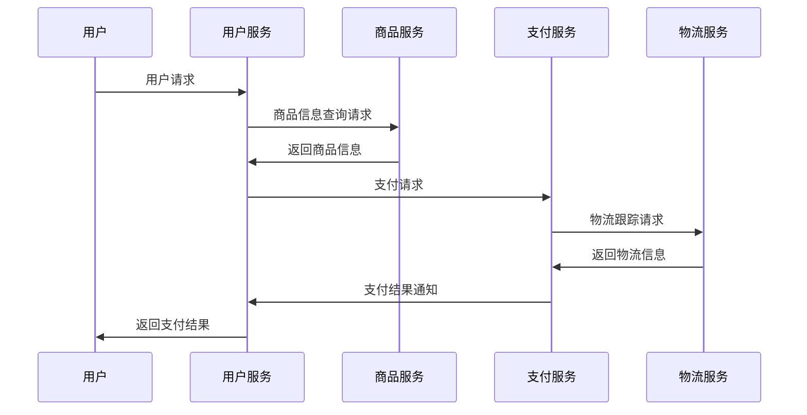
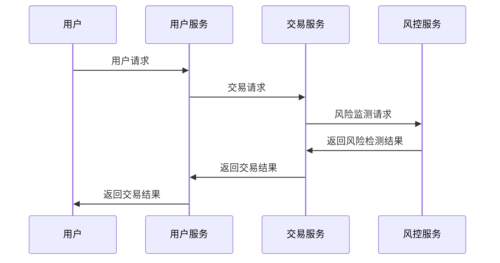
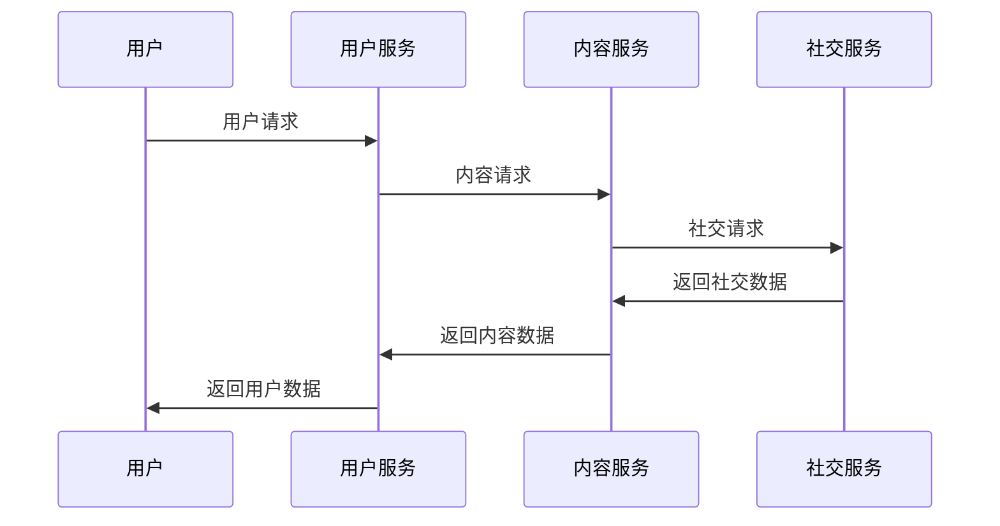

                 

## 引言

在当今快速发展的信息技术时代，软件架构的决策变得愈加复杂和重要。随着业务需求的多样化和技术环境的不断变化，如何构建稳定、高效、可扩展的软件架构成为每一个软件开发团队面临的挑战。传统的软件架构决策方法依赖于专家经验和试错，这不仅效率低下，而且容易受到主观因素的干扰。因此，引入人工智能（AI）辅助软件架构决策成为一种必然趋势。

AI技术的发展，尤其是机器学习、深度学习等领域的突破，为软件架构决策带来了全新的可能性。通过数据分析和模式识别，AI可以帮助我们从大量的历史数据和业务场景中提取有价值的信息，为决策提供支持。同时，AI可以处理复杂的关系和依赖，帮助我们在架构设计中找到最佳的权衡点。

本文旨在探讨AI辅助软件架构决策与权衡分析的基础、核心概念、方法和实践。我们将首先介绍AI技术对软件架构决策的推动作用，以及当前软件架构决策中面临的主要挑战。接着，我们将详细阐述AI辅助软件架构决策的核心概念，包括AI技术概述、软件架构决策原理和协同决策模型。然后，我们将分析AI辅助软件架构决策的具体方法，并结合实际案例进行详细讨论。最后，我们将探讨AI辅助软件架构权衡分析的方法和工具，总结当前的最佳实践，并展望未来发展趋势。

通过本文的阅读，读者将深入了解AI辅助软件架构决策的原理和实践，掌握如何利用AI技术提高软件架构决策的效率和准确性，从而构建出更优质、更稳定的软件系统。

### 关键词

- 软件架构决策
- 人工智能辅助
- 协同决策模型
- 数据驱动方法
- 知识驱动方法
- 混合驱动方法
- 权衡分析

### 摘要

本文探讨了人工智能（AI）在辅助软件架构决策与权衡分析中的应用。首先，我们介绍了AI技术对软件架构决策的推动作用，分析了当前软件架构决策中面临的主要挑战。接着，我们详细阐述了AI辅助软件架构决策的核心概念，包括AI技术概述、软件架构决策原理和协同决策模型。随后，我们分析了AI辅助软件架构决策的具体方法，并结合实际案例进行了深入讨论。最后，我们探讨了AI辅助软件架构权衡分析的方法和工具，总结了当前的最佳实践，并展望了未来发展趋势。通过本文的阅读，读者将能够掌握如何利用AI技术提高软件架构决策的效率和准确性，为构建更优质、更稳定的软件系统提供有力支持。

## 目录大纲

### 第一部分: AI辅助软件架构决策与权衡分析基础

1. **第1章: 背景介绍**
   - **1.1 问题背景**
   - **1.2 问题描述**
   - **1.3 问题解决**
   - **1.4 边界与外延**
   - **1.5 核心概念**
   - **1.6 本章小结**

2. **第2章: AI辅助软件架构决策核心概念**
   - **2.1 AI技术概述**
   - **2.2 软件架构决策原理**
   - **2.3 AI辅助决策**
   - **2.4 协同决策模型**
   - **2.5 概念属性特征对比表格**
   - **2.6 本章小结**

3. **第3章: AI辅助软件架构决策方法与实践**
   - **3.1 AI辅助软件架构决策方法**
   - **3.2 实践案例分析**
   - **3.3 AI辅助软件架构决策工具**
   - **3.4 最佳实践与经验总结**
   - **3.5 本章小结**

4. **第4章: AI辅助软件架构权衡分析**
   - **4.1 权衡分析概述**
   - **4.2 AI辅助权衡分析**
   - **4.3 权衡分析方法**
   - **4.4 AI辅助权衡分析实践**
   - **4.5 权衡分析工具**
   - **4.6 本章小结**

### 第二部分: 深入分析与讨论

5. **第5章: AI辅助软件架构决策的挑战与未来趋势**
   - **5.1 技术挑战**
   - **5.2 应用挑战**
   - **5.3 未来发展趋势**
   - **5.4 本章小结**

6. **第6章: 案例研究**
   - **6.1 案例一：某电商平台的架构优化**
   - **6.2 案例二：某金融系统的安全性评估**
   - **6.3 案例三：某移动应用的性能提升**
   - **6.4 本章小结**

### 第三部分: 结论与展望

7. **第7章: 总结与展望**
   - **7.1 主要结论**
   - **7.2 未来研究方向**
   - **7.3 建议与实践**
   - **7.4 本章小结**

通过上述目录大纲，本文将系统性地介绍AI辅助软件架构决策与权衡分析的相关内容，旨在为读者提供全面而深入的理解。

## 第一部分: AI辅助软件架构决策与权衡分析基础

### 第1章: 背景介绍

#### 1.1 问题背景

随着信息技术的飞速发展，软件系统在各个行业中的应用变得越来越广泛和复杂。从电商平台到金融系统，从移动应用到大数据分析平台，软件系统已经深入到我们生活的每一个角落。然而，随着软件系统规模的扩大和复杂性的增加，如何构建稳定、高效、可扩展的软件架构成为每一个软件开发团队面临的重大挑战。

传统的软件架构决策主要依赖于专家的经验和直觉。这种方法虽然在一定程度上能够解决问题，但其效率较低，且容易受到主观因素的干扰，从而导致决策质量不稳定。此外，随着业务需求的快速变化和技术环境的不断更新，软件架构的调整和优化变得愈发频繁和复杂，进一步加剧了软件架构决策的难度。

在这种背景下，人工智能（AI）技术的发展为软件架构决策带来了新的可能性。AI可以通过大数据分析和模式识别，从大量的历史数据和业务场景中提取有价值的信息，为决策提供数据支持。此外，AI可以处理复杂的关系和依赖，帮助开发者在架构设计中找到最佳的权衡点。通过引入AI技术，软件架构决策可以从传统的经验驱动转变为数据驱动和智能辅助，从而提高决策的效率和准确性。

#### 1.2 问题描述

软件架构决策中的复杂性主要体现在以下几个方面：

1. **需求多样性**：现代软件系统需要满足多种多样的业务需求，这些需求之间可能存在冲突和矛盾，使得架构设计变得更加复杂。

2. **技术多样性**：随着技术的发展，各种新的技术和框架层出不穷，如何在众多技术中做出最佳选择是一个难题。

3. **依赖关系复杂**：软件架构中的各个模块和组件之间存在复杂的依赖关系，这些关系需要被充分考虑和妥善处理，否则可能会导致系统的不稳定性和性能问题。

4. **权衡与优化**：软件架构设计需要在多个目标之间进行权衡和优化，例如性能、可维护性、可扩展性等。这些目标之间往往存在冲突，如何找到平衡点是一个关键问题。

5. **持续变化**：业务需求和技术环境不断变化，软件架构也需要不断调整和优化，以适应新的变化。这使得软件架构决策需要具备快速响应和持续迭代的能力。

在上述复杂性的背景下，软件架构决策过程中面临的挑战主要包括：

1. **信息过载**：在大量的数据和技术信息中，如何快速提取有价值的信息并作出合理的决策是一个难题。

2. **不确定性**：业务需求和技术的变化具有不确定性，如何应对这种不确定性，保证架构的灵活性和适应性是一个挑战。

3. **效率与质量**：如何在有限的时间内做出高质量的架构决策，同时保证决策的效率，也是一个需要解决的问题。

4. **人类与机器的协同**：如何将人类专家的直觉和经验与AI算法相结合，实现高效的协同决策，也是一个关键问题。

#### 1.3 问题解决

为了解决上述问题，引入AI技术辅助软件架构决策成为一种可行的解决方案。以下是一些具体的方法和策略：

1. **数据驱动方法**：通过收集和分析大量的历史数据，AI可以识别出业务需求和系统性能之间的关联，从而为架构设计提供数据支持。例如，通过分析用户行为数据，AI可以帮助设计出更符合用户需求的界面和交互。

2. **知识驱动方法**：AI可以学习并存储大量的领域知识和最佳实践，在架构设计过程中提供指导。例如，通过学习不同技术的性能特点和应用场景，AI可以帮助开发者选择最适合的技术方案。

3. **混合驱动方法**：结合数据驱动和知识驱动方法，AI可以实现更加智能和灵活的架构决策。例如，通过结合用户行为数据和领域知识，AI可以动态调整系统架构，以适应不断变化的业务需求。

4. **协同决策模型**：通过将人类专家和AI系统相结合，协同决策模型可以实现高效的架构决策。人类专家可以利用自己的经验和直觉，对AI的决策结果进行校验和调整，从而提高决策的质量和灵活性。

5. **权衡分析工具**：AI可以开发出各种权衡分析工具，帮助开发者在多个目标之间进行权衡和优化。例如，通过多目标优化算法，AI可以帮助找到性能和可维护性之间的最佳平衡点。

#### 1.4 边界与外延

在讨论AI辅助软件架构决策时，需要明确一些边界与外延：

1. **软件架构的概念**：软件架构是指软件系统的整体结构和设计原则，包括模块、组件及其相互关系。它决定了系统的性能、可维护性和扩展性。

2. **AI技术的分类**：AI技术主要包括机器学习、深度学习、自然语言处理、计算机视觉等。不同的技术适用于不同的场景，选择合适的技术对于架构决策至关重要。

3. **软件架构决策方法**：常见的软件架构决策方法包括数据驱动方法、知识驱动方法、混合驱动方法和协同决策模型。每种方法都有其优势和适用场景。

4. **AI辅助决策的概念**：AI辅助决策是指利用人工智能技术，为决策者提供数据分析和预测结果，辅助其做出决策。AI辅助决策可以提高决策的效率和质量，特别适用于复杂和不确定的决策场景。

5. **协同决策模型**：协同决策模型是指将人类决策者与AI系统相结合，通过交互与协作，共同完成决策过程。这种模型可以融合人类直觉和AI算法的优势，提高决策的灵活性和质量。

#### 1.5 核心概念

在本章中，我们介绍了一些核心概念，包括软件架构、AI辅助决策和协同决策模型：

1. **软件架构**：软件架构是指软件系统的整体结构和设计原则，包括模块、组件及其相互关系。它是软件系统的基础，决定了系统的性能、可维护性和扩展性。

2. **AI辅助决策**：AI辅助决策是指利用人工智能技术，为决策者提供数据分析和预测结果，辅助其做出决策。AI辅助决策可以提高决策的效率和质量，特别适用于复杂和不确定的决策场景。

3. **协同决策模型**：协同决策模型是指将人类决策者与AI系统相结合，通过交互与协作，共同完成决策过程。这种模型可以融合人类直觉和AI算法的优势，提高决策的灵活性和质量。

#### 1.6 本章小结

本章介绍了AI辅助软件架构决策与权衡分析的基础知识，包括问题背景、问题描述、问题解决方法以及相关的核心概念。通过本章的讨论，我们明确了AI技术在软件架构决策中的重要性，以及如何在复杂和不确定的环境中利用AI技术提高决策的效率和准确性。接下来，我们将进一步探讨AI辅助软件架构决策的核心概念，以帮助读者更深入地理解这一领域。

### 第2章: AI辅助软件架构决策核心概念

#### 2.1 AI技术概述

人工智能（AI）是一种模拟人类智能的技术，其目标是使计算机具有感知、学习、推理和解决问题的能力。AI技术的发展可以追溯到20世纪50年代，但直到近年来，随着计算能力的提升、大数据的普及和算法的进步，AI才真正迎来了爆发期。

AI技术主要包括以下几个领域：

1. **机器学习**：机器学习是一种通过数据训练模型，使其能够对未知数据进行预测和分类的方法。常见的机器学习算法包括线性回归、决策树、支持向量机、神经网络等。

2. **深度学习**：深度学习是机器学习的一个子领域，它通过多层神经网络进行训练，可以自动提取数据的特征，实现复杂模式识别和预测。深度学习在图像识别、语音识别和自然语言处理等领域取得了显著成果。

3. **自然语言处理（NLP）**：自然语言处理旨在使计算机理解和处理自然语言。NLP技术包括文本分类、情感分析、机器翻译和问答系统等。

4. **计算机视觉**：计算机视觉是一种使计算机能够“看到”和理解图像或视频的技术。它包括图像识别、目标检测、图像分割和视频分析等。

5. **强化学习**：强化学习是一种通过不断试错，学习如何在特定环境中做出最优决策的方法。强化学习在游戏、自动驾驶和机器人控制等领域有广泛应用。

AI技术在软件架构决策中的应用主要体现在以下几个方面：

1. **数据分析和模式识别**：AI技术可以处理和分析大量的历史数据，识别出业务需求和系统性能之间的模式，为架构设计提供数据支持。

2. **预测和优化**：AI技术可以根据历史数据和当前环境，预测未来的业务需求和系统性能，从而优化软件架构设计。

3. **自动化和智能化**：AI技术可以自动化软件架构的某些决策过程，如组件选择、性能调优和风险分析，从而提高决策的效率和准确性。

#### 2.2 软件架构决策原理

软件架构决策是指在设计软件系统时，根据业务需求和约束条件，选择合适的系统结构和组件的过程。软件架构决策的关键要素包括：

1. **业务需求**：业务需求是软件架构决策的核心，它决定了系统的功能和性能要求。常见的业务需求包括用户交互、数据处理、安全性、可靠性等。

2. **系统约束**：系统约束是指在设计软件架构时需要考虑的各种限制，如技术栈、硬件资源、预算和时间等。

3. **系统目标**：系统目标是指软件系统需要达到的性能指标，如响应时间、吞吐量、可用性、可扩展性等。

4. **设计原则**：设计原则是指导软件架构设计的基本原则，如模块化、可维护性、可扩展性、高内聚低耦合等。

软件架构决策的过程主要包括以下几个步骤：

1. **需求分析**：通过需求调研和分析，明确业务需求和系统约束。

2. **架构设计**：根据业务需求和系统约束，设计软件系统的整体结构和组件。

3. **权衡与优化**：在架构设计过程中，需要在多个目标之间进行权衡和优化，找到最佳平衡点。

4. **验证与调整**：通过测试和评估，验证软件架构的有效性和可行性，并根据反馈进行调整。

#### 2.3 AI辅助决策

AI辅助决策是指利用人工智能技术，为决策者提供数据分析和预测结果，辅助其做出决策。AI辅助决策的优势包括：

1. **提高决策效率**：AI技术可以处理大量数据，快速生成决策结果，大大提高决策效率。

2. **降低决策错误率**：通过分析历史数据和模式，AI可以帮助决策者避免常见的错误，降低决策错误率。

3. **应对复杂问题**：AI技术可以处理复杂的业务问题和不确定的环境，提供更加智能和灵活的决策支持。

4. **增强决策透明度**：AI技术可以生成详细的决策报告，帮助决策者理解和验证决策过程。

AI辅助决策的挑战主要包括：

1. **数据质量和完整性**：AI决策依赖于高质量和完整的数据，数据质量和完整性问题会影响决策的准确性。

2. **算法解释性**：一些复杂的AI算法，如深度学习，其决策过程往往缺乏解释性，这给决策者理解和信任决策结果带来挑战。

3. **适应性**：AI决策系统需要能够快速适应环境变化，否则可能会变得过时和无效。

4. **安全和隐私**：AI决策涉及到大量的敏感数据，如何确保数据安全和隐私是一个重要挑战。

#### 2.4 协同决策模型

协同决策模型是指将人类决策者与AI系统相结合，通过交互与协作，共同完成决策过程。这种模型可以融合人类直觉和AI算法的优势，提高决策的质量和灵活性。

协同决策模型的基本原理包括：

1. **信息共享**：人类决策者和AI系统之间共享信息，确保双方了解决策背景和约束条件。

2. **协同分析**：人类决策者和AI系统共同分析数据，识别问题和机会，生成多种备选方案。

3. **协同评估**：人类决策者和AI系统共同评估备选方案的优劣，选择最佳方案。

4. **协同调整**：在决策过程中，人类决策者和AI系统可以不断调整和优化方案，以适应新的变化和反馈。

协同决策模型的应用场景主要包括：

1. **复杂决策**：如企业战略规划、新产品开发等，这些决策通常涉及多个目标和变量，需要复杂的数据分析和优化。

2. **高风险决策**：如金融投资、医疗诊断等，这些决策的正确与否对企业和个人有重大影响，需要高度可靠和透明的决策支持。

3. **快速响应**：如紧急情况下的决策，如自然灾害响应、危机管理等，需要快速生成决策方案并实施。

#### 2.5 概念属性特征对比表格

| 概念         | 定义                                                         | 特点                                                         |
| ------------ | ------------------------------------------------------------ | ------------------------------------------------------------ |
| 软件架构     | 软件系统的整体结构，包括模块、组件及其相互关系                  | 决定了软件系统的性能、可维护性和扩展性                        |
| AI辅助决策   | 利用人工智能技术，为决策者提供数据分析和预测结果，辅助做出决策 | 提高决策效率，降低决策错误率，适用于复杂决策场景             |
| 协同决策模型 | 将人类决策者与AI系统相结合，通过交互与协作，共同完成决策过程  | 融合人类直觉与AI算法的优势，提高决策质量和灵活性             |

#### 2.6 本章小结

本章介绍了AI辅助软件架构决策的核心概念，包括AI技术概述、软件架构决策原理、AI辅助决策和协同决策模型。通过这些核心概念的阐述，读者可以初步了解AI技术在软件架构决策中的应用原理和优势。接下来，我们将进一步探讨AI辅助软件架构决策的具体方法，并结合实际案例进行深入分析。

### 第3章: AI辅助软件架构决策方法与实践

#### 3.1 AI辅助软件架构决策方法

AI辅助软件架构决策的方法主要包括数据驱动方法、知识驱动方法和混合驱动方法。每种方法都有其独特的特点和适用场景，下面我们将分别介绍这些方法。

1. **数据驱动方法**

数据驱动方法是指通过收集和分析大量数据，利用机器学习算法和统计分析方法，对软件架构设计过程提供支持。这种方法的主要优势在于：

- **基于数据的事实驱动**：通过分析历史数据和业务数据，可以更客观地评估各种架构方案的性能和可行性。
- **自适应能力**：数据驱动方法可以自动调整和优化，以适应新的业务需求和变化。
- **快速反馈**：通过实时数据监控和分析，可以快速识别系统中的问题和瓶颈，并进行相应的调整。

数据驱动方法的适用场景包括：

- **性能优化**：通过分析系统性能数据，找到影响性能的关键因素，进行优化。
- **需求变更管理**：通过分析需求变更的历史数据，预测变更对系统架构的影响，提前做好准备。
- **风险评估**：通过分析历史数据，识别潜在的架构风险，提前采取措施进行规避。

2. **知识驱动方法**

知识驱动方法是指通过将领域知识和最佳实践转化为计算机可理解的形式，利用这些知识来辅助软件架构决策。这种方法的主要优势在于：

- **专家经验集成**：通过将专家的经验和知识转化为系统化的规则库，可以提高决策的准确性。
- **知识共享和传递**：知识驱动方法可以将专家的知识传递给其他团队成员，提高整个团队的专业水平。
- **决策可解释性**：通过显式表达决策规则和推理过程，可以增加决策过程的透明度和可解释性。

知识驱动方法的适用场景包括：

- **架构评估**：通过评估架构方案是否符合领域最佳实践，确保架构设计的质量。
- **技术选型**：通过比较不同技术的优缺点和适用场景，选择最适合的技术方案。
- **决策支持**：为架构决策者提供知识库和决策支持系统，辅助其做出更加明智的决策。

3. **混合驱动方法**

混合驱动方法是指结合数据驱动和知识驱动方法的优点，形成一种综合的决策支持系统。这种方法的主要优势在于：

- **多角度分析**：通过结合数据和知识，可以从多个角度对架构方案进行分析和评估。
- **灵活性和适应性**：混合驱动方法可以根据实际需求和环境变化，灵活调整决策策略。
- **高效决策**：通过综合利用数据和知识，可以大大提高决策的效率和准确性。

混合驱动方法的适用场景包括：

- **大型复杂系统**：在设计和优化大型复杂系统时，需要综合考虑各种因素，混合驱动方法可以提供全面的决策支持。
- **持续迭代和优化**：在系统开发和维护过程中，需要不断调整和优化架构，混合驱动方法可以提供持续的决策支持。

#### 3.2 实践案例分析

为了更好地理解AI辅助软件架构决策的方法，我们通过以下几个实际案例进行详细分析：

1. **案例一：某电商平台的架构优化**

某电商平台在业务快速发展的过程中，面临着系统性能瓶颈和扩展性问题。通过引入AI技术，该平台实现了以下优化：

- **性能数据监控**：通过实时监控系统的性能数据，识别出影响性能的关键因素，如数据库查询延迟、缓存失效等。
- **数据驱动优化**：利用机器学习算法，对用户行为数据进行分析，优化商品推荐算法，提高用户满意度和转化率。
- **知识驱动优化**：结合领域专家的知识，对系统架构进行评估和调整，确保架构设计符合最佳实践。

通过这些优化措施，该电商平台在性能和用户体验方面得到了显著提升。

2. **案例二：某金融系统的安全性评估**

某金融系统在上线前需要进行全面的安全性评估。通过引入AI技术，该系统实现了以下评估：

- **数据驱动评估**：通过分析历史安全事件数据，识别出潜在的安全威胁和风险。
- **知识驱动评估**：结合安全专家的知识，构建安全评估规则库，对系统进行安全漏洞扫描和风险评估。
- **混合驱动评估**：将数据驱动和知识驱动方法相结合，生成全面的安全评估报告，为系统的安全防护提供依据。

通过这些评估措施，该金融系统的安全性得到了有效保障。

3. **案例三：某移动应用的性能提升**

某移动应用在上线后，用户反馈出现了卡顿和响应时间过长的问题。通过引入AI技术，该应用实现了以下性能提升：

- **数据驱动分析**：通过分析用户行为数据和系统性能数据，识别出影响性能的关键因素，如图片加载时间、网络延迟等。
- **知识驱动优化**：结合性能优化专家的知识，优化应用代码和架构设计，减少不必要的资源消耗和请求。
- **混合驱动优化**：通过结合用户行为数据和专家知识，动态调整系统配置，提高应用性能。

通过这些优化措施，该移动应用的用户体验得到了显著提升。

#### 3.3 AI辅助软件架构决策工具

为了实现AI辅助软件架构决策，需要使用一系列工具和技术。以下是一些常见的AI辅助软件架构决策工具：

1. **AI算法工具**

AI算法工具是指用于实现AI功能的软件工具，如机器学习库、深度学习框架等。常见的AI算法工具包括：

- **Scikit-learn**：Python的机器学习库，提供了丰富的机器学习算法和工具。
- **TensorFlow**：谷歌开发的深度学习框架，广泛应用于各种深度学习任务。
- **PyTorch**：基于Python的深度学习框架，具有灵活的模型定义和高效的运算性能。

2. **软件架构决策工具**

软件架构决策工具是指用于辅助软件架构设计的软件工具，如架构评估工具、架构模拟工具等。常见的软件架构决策工具包括：

- **Archimatist**：一款基于IBM Rational Software Architect的架构设计工具。
- **Enterprise Architect**：一款功能强大的企业架构设计工具，支持多种架构视图和模型。
- **NDepend**：一款代码分析工具，可以帮助评估代码质量和架构设计。

3. **协同决策平台**

协同决策平台是指用于支持人类决策者和AI系统协同工作的软件平台。常见的协同决策平台包括：

- **Decision Lab**：一款基于Web的协同决策平台，支持数据分析和决策可视化。
- **Drools**：一款基于Java的规则引擎，可以用于实现复杂的决策逻辑和规则管理。
- **AI Decision Platform**：一款集成了多种AI算法和决策工具的平台，支持数据分析和决策优化。

#### 3.4 最佳实践与经验总结

通过以上实践案例分析，我们可以总结出一些AI辅助软件架构决策的最佳实践：

1. **数据驱动与知识驱动相结合**：在软件架构决策过程中，应结合数据驱动和知识驱动的优势，实现全面的决策支持。

2. **持续监控与优化**：软件架构设计不是一次性的工作，而是一个持续的过程。通过持续监控和优化，可以及时发现问题和调整架构设计。

3. **专家参与与协同**：在架构决策过程中，应充分发挥专家的经验和知识，与AI系统协同工作，提高决策的准确性和灵活性。

4. **数据质量保障**：数据是AI决策的基础，应确保数据的质量和完整性，避免因数据问题导致决策失误。

5. **风险管理与应对**：在架构决策过程中，应识别潜在的风险，并制定相应的应对策略，确保决策的稳健性和安全性。

#### 3.5 本章小结

本章介绍了AI辅助软件架构决策的具体方法，包括数据驱动方法、知识驱动方法和混合驱动方法。通过实际案例分析，我们展示了这些方法在软件架构优化、安全性评估和性能提升中的应用效果。此外，我们还介绍了常用的AI辅助软件架构决策工具和最佳实践。通过本章的学习，读者可以更好地理解AI辅助软件架构决策的原理和实践，为实际项目中的应用提供指导。

### 第4章: AI辅助软件架构权衡分析

#### 4.1 权衡分析概述

权衡分析（Trade-off Analysis）在软件架构设计中起着至关重要的作用。它是指在面对多个相互冲突的目标或需求时，通过评估不同方案之间的优缺点，找到一种或多种能够满足所有需求的最佳平衡点。在软件架构决策过程中，权衡分析不仅能够帮助设计者明确关键决策点，还能优化系统性能、提升用户体验和确保系统可维护性。

权衡分析的重要性体现在以下几个方面：

1. **优化系统性能**：软件架构决策往往需要在性能、可扩展性、可维护性等多个目标之间进行权衡。通过权衡分析，设计者可以找到最佳方案，以实现系统性能的最优化。

2. **提升用户体验**：用户体验是软件系统成功的关键因素之一。权衡分析可以帮助设计者评估不同设计方案对用户需求的满足程度，从而提升用户体验。

3. **确保系统可维护性**：软件系统需要长期运行，可维护性是保证系统稳定性和可靠性的关键。权衡分析可以帮助设计者选择能够提高系统可维护性的方案。

4. **支持决策过程**：权衡分析为决策过程提供了一个系统的分析框架，使得设计者能够更加科学和合理地做出决策。

权衡分析的基本原则包括：

1. **全面性**：权衡分析应考虑所有相关的目标和需求，确保分析结果的全面性。

2. **客观性**：权衡分析应基于客观数据和事实，避免主观因素的干扰。

3. **透明性**：权衡分析的结果应透明，以便相关人员理解和验证。

4. **灵活性**：权衡分析应具有一定的灵活性，以便在新的需求和环境下进行调整。

#### 4.2 AI辅助权衡分析

随着AI技术的不断发展，AI在权衡分析中的应用逐渐受到关注。AI辅助权衡分析通过利用机器学习、深度学习等技术，对大量的历史数据和业务场景进行学习和分析，从而为设计者提供更加智能和高效的权衡分析支持。

AI辅助权衡分析的优势包括：

1. **高效性**：AI技术可以处理和分析大量数据，大大提高权衡分析的效率和速度。

2. **准确性**：通过学习历史数据和业务场景，AI可以准确预测不同方案对目标的影响，提高权衡分析的准确性。

3. **自动化**：AI技术可以实现权衡分析的自动化，减少人工干预，降低错误率。

4. **适应性**：AI技术可以适应不同的业务场景和需求变化，提供动态的权衡分析支持。

AI辅助权衡分析的挑战包括：

1. **数据质量**：AI辅助权衡分析依赖于高质量的数据，数据质量问题会直接影响分析结果的准确性。

2. **算法解释性**：一些复杂的AI算法，如深度学习，其决策过程缺乏解释性，这给设计和评估分析结果带来挑战。

3. **模型适应性**：AI模型需要不断适应新的业务场景和数据，否则可能会变得过时和无效。

4. **安全性**：AI辅助权衡分析涉及到敏感数据，如何确保数据安全和隐私是一个重要挑战。

#### 4.3 权衡分析方法

AI辅助权衡分析主要包括以下几种方法：

1. **多目标优化方法**

多目标优化方法是一种常见的权衡分析方法，它通过同时考虑多个目标，找到在多个目标之间实现平衡的方案。常用的多目标优化算法包括遗传算法、粒子群算法、多目标粒子群算法等。

多目标优化方法的基本步骤如下：

- **定义目标函数**：根据业务需求和约束条件，定义多个目标函数，如性能、成本、用户体验等。
- **选择优化算法**：根据问题的特点，选择合适的优化算法，如遗传算法、粒子群算法等。
- **运行优化算法**：利用优化算法，找到在多个目标之间实现平衡的最佳方案。

2. **模糊综合评价方法**

模糊综合评价方法是一种基于模糊数学的综合评价方法，它通过考虑多个因素和权重，对方案进行综合评价，从而找到最优方案。

模糊综合评价方法的基本步骤如下：

- **构建评价矩阵**：根据业务需求和约束条件，构建评价矩阵，确定各个因素的重要性和权重。
- **模糊评价**：对每个因素进行模糊评价，得到模糊评价矩阵。
- **综合评价**：利用模糊评价矩阵，计算综合评价结果，找到最优方案。

3. **效用理论方法**

效用理论方法是一种基于效用值进行权衡分析的方法，它通过考虑用户的主观偏好，为不同方案分配效用值，从而找到最优方案。

效用理论方法的基本步骤如下：

- **确定效用函数**：根据用户的主观偏好，确定效用函数，如线性函数、指数函数等。
- **计算效用值**：对每个方案进行效用值计算，得到每个方案的效用值。
- **选择最优方案**：根据效用值，选择最优方案。

#### 4.4 AI辅助权衡分析实践

为了更好地理解AI辅助权衡分析的应用，我们通过以下实际案例进行详细分析：

1. **案例一：软件架构权衡分析**

某企业需要开发一款企业级应用，面临多个关键决策点，如技术选型、性能优化和安全性保障。通过引入AI技术，该企业实现了以下权衡分析：

- **技术选型**：利用AI技术，对多种技术方案进行性能和成本分析，找到在性能和成本之间实现平衡的最佳技术选型。
- **性能优化**：通过分析用户行为数据，利用多目标优化方法，找到在性能和用户体验之间实现平衡的最佳性能优化方案。
- **安全性保障**：通过分析历史安全事件数据，利用模糊综合评价方法，找到在安全性和用户体验之间实现平衡的最佳安全性保障方案。

通过这些权衡分析，该企业成功地优化了软件架构设计，提高了系统性能和安全性。

2. **案例二：系统性能权衡分析**

某电商平台在系统升级过程中，需要优化系统性能，以满足日益增长的交易量。通过引入AI技术，该电商平台实现了以下权衡分析：

- **负载测试**：利用AI技术，对系统进行大规模负载测试，分析不同配置和优化策略对系统性能的影响。
- **性能优化**：通过多目标优化方法，找到在性能、成本和可维护性之间实现平衡的最佳性能优化方案。
- **成本分析**：通过效用理论方法，分析不同性能优化方案的效用值，选择最佳方案。

通过这些权衡分析，该电商平台成功地提高了系统性能，满足了业务需求。

3. **案例三：安全性权衡分析**

某金融系统需要进行安全性评估和优化，以保障用户数据和交易安全。通过引入AI技术，该金融系统实现了以下权衡分析：

- **风险评估**：利用AI技术，对系统进行风险评估，识别潜在的安全威胁和风险。
- **安全优化**：通过模糊综合评价方法，评估不同安全优化方案的优缺点，找到最佳安全优化方案。
- **成本控制**：通过效用理论方法，分析不同安全优化方案的成本和效用值，选择最佳方案。

通过这些权衡分析，该金融系统成功地提高了安全性，保障了用户数据和交易安全。

#### 4.5 权衡分析工具

为了实现AI辅助权衡分析，需要使用一系列工具和技术。以下是一些常见的权衡分析工具：

1. **AI算法工具**

AI算法工具是指用于实现AI功能的软件工具，如机器学习库、深度学习框架等。常见的AI算法工具包括：

- **Scikit-learn**：Python的机器学习库，提供了丰富的机器学习算法和工具。
- **TensorFlow**：谷歌开发的深度学习框架，广泛应用于各种深度学习任务。
- **PyTorch**：基于Python的深度学习框架，具有灵活的模型定义和高效的运算性能。

2. **软件架构决策工具**

软件架构决策工具是指用于辅助软件架构设计的软件工具，如架构评估工具、架构模拟工具等。常见的软件架构决策工具包括：

- **Archimatist**：一款基于IBM Rational Software Architect的架构设计工具。
- **Enterprise Architect**：一款功能强大的企业架构设计工具，支持多种架构视图和模型。
- **NDepend**：一款代码分析工具，可以帮助评估代码质量和架构设计。

3. **权衡分析软件**

权衡分析软件是指专门用于实现权衡分析的工具，如多目标优化工具、模糊综合评价工具等。常见的权衡分析软件包括：

- **M tongues**：一款多目标优化工具，支持多种优化算法和可视化分析。
- **AnyLogic**：一款用于模拟和优化的软件，支持多种优化算法和建模工具。
- **SAS Enterprise Miner**：一款数据分析工具，提供了丰富的数据分析和建模功能。

#### 4.6 本章小结

本章介绍了AI辅助软件架构权衡分析的基本概念、方法、实践和工具。通过AI辅助权衡分析，设计者可以更加科学和合理地进行软件架构设计，实现系统性能、用户体验和安全性的最佳平衡。本章的内容为读者提供了全面的AI辅助软件架构权衡分析的指导和参考。

### 第5章: AI辅助软件架构决策的挑战与未来趋势

#### 5.1 技术挑战

尽管AI技术在辅助软件架构决策方面展示了巨大的潜力，但在实际应用中仍然面临一系列技术挑战：

1. **算法性能与效率**：现有的AI算法在处理复杂问题和高维数据时，往往存在计算性能不足和效率不高的问题。例如，深度学习算法需要大量计算资源，而传统机器学习算法在面对大规模数据集时，训练时间过长。

2. **数据质量和完整性**：AI算法的准确性高度依赖于高质量和完整的数据。然而，在现实场景中，数据往往存在缺失、噪声和不一致性等问题，这些问题会严重影响AI算法的性能。

3. **算法解释性**：许多AI算法，尤其是深度学习算法，其决策过程缺乏解释性。这使得设计者和决策者难以理解算法的决策依据和结果，从而降低了AI算法的透明度和可信赖性。

4. **模型适应性和泛化能力**：AI模型需要具备良好的适应性和泛化能力，以应对不断变化的业务需求和场景。然而，当前许多模型在特定场景下表现出色，但在新环境中往往表现不佳，这限制了AI技术在软件架构决策中的广泛应用。

5. **安全性**：随着AI技术的应用越来越广泛，确保AI系统的安全性和隐私性成为一个重要挑战。AI系统可能成为攻击的目标，攻击者可以通过操纵数据或模型，获取敏感信息或导致系统失效。

#### 5.2 应用挑战

除了技术挑战，AI辅助软件架构决策在实际应用中还会面临以下挑战：

1. **业务理解和需求匹配**：AI系统需要深入了解业务需求和场景，以便提供有针对性的决策支持。然而，业务领域的复杂性和多样性使得AI系统在理解和匹配业务需求方面面临挑战。

2. **人机协作**：AI辅助软件架构决策需要人类专家与AI系统之间的有效协作。人类专家需要理解AI算法的工作原理和限制，同时AI系统也需要理解人类专家的意图和决策偏好。这要求在设计和实施过程中充分考虑人机协作的效率和效果。

3. **实施成本和资源**：AI技术的实施往往需要大量的计算资源和人力资源。特别是在企业级应用中，部署和维护AI系统需要投入大量的资金和人力，这可能会成为限制其广泛应用的一个因素。

4. **法规和伦理问题**：AI技术在软件架构决策中的应用需要遵守相关的法律法规和伦理规范。例如，数据隐私保护、算法透明度和公平性等问题都需要在设计和实施过程中得到充分考虑。

#### 5.3 未来发展趋势

尽管面临诸多挑战，AI辅助软件架构决策的未来趋势依然乐观。以下是一些潜在的发展方向：

1. **算法创新**：随着算法研究的深入，未来将出现更多高效、可解释的AI算法。这些算法将能够更好地处理复杂问题和高维数据，提高决策的准确性和效率。

2. **数据驱动的发展**：数据是AI决策的核心，未来将更加注重数据质量和数据治理。通过采用先进的清洗、整合和分析技术，可以进一步提升AI算法的性能和应用效果。

3. **人机协作优化**：随着AI技术的成熟，未来将出现更多优化人机协作的工具和方法。这些工具和方法将帮助人类专家更有效地利用AI系统的优势，提高决策的质量和效率。

4. **应用场景拓展**：AI技术在软件架构决策中的应用场景将不断拓展。例如，在物联网、云计算、大数据等新兴领域中，AI将发挥越来越重要的作用。

5. **安全性和隐私保护**：随着AI技术的应用越来越广泛，确保其安全性和隐私性将成为一个持续关注的话题。未来将出现更多安全防护技术和隐私保护机制，以保障AI系统的安全可靠运行。

6. **标准化和规范化**：随着AI技术在软件架构决策中的广泛应用，将逐渐形成一系列标准和技术规范。这些标准和规范将有助于确保AI系统的通用性和互操作性，促进其标准化和规范化发展。

#### 5.4 本章小结

本章讨论了AI辅助软件架构决策所面临的技术挑战和应用挑战，并展望了未来发展趋势。通过了解这些挑战和发展趋势，读者可以更好地把握AI辅助软件架构决策的发展方向，为实际应用提供指导和参考。随着AI技术的不断进步和应用场景的拓展，AI辅助软件架构决策将迎来更加广阔的发展前景。

### 案例研究

#### 6.1 案例一：某电商平台的架构优化

某大型电商平台在业务迅速发展的过程中，遇到了系统性能瓶颈和扩展性问题。为了解决这些问题，该电商平台决定引入AI技术进行架构优化。以下是具体的案例分析和解决方案：

**问题场景**：

- **系统性能瓶颈**：随着用户数量的增加，平台的响应时间和吞吐量逐渐下降，用户体验受到影响。
- **扩展性问题**：现有架构无法有效地支持新增的业务需求和用户规模，需要优化和扩展。

**项目介绍**：

该项目的主要目标是通过对现有系统进行架构优化，提高系统性能和扩展性，同时确保系统的稳定性和可维护性。

**系统功能设计**：

- **用户模块**：包括用户注册、登录、个人信息管理等功能。
- **商品模块**：包括商品信息管理、商品推荐、购物车、订单处理等功能。
- **支付模块**：包括支付接口、支付验证、支付记录等功能。
- **物流模块**：包括物流跟踪、配送管理等功能。

**系统架构设计**：

通过引入微服务架构，将整个系统拆分为多个独立的微服务，每个微服务负责不同的功能模块。以下是系统架构设计的关键部分：

- **用户服务**：负责处理用户相关的请求，包括用户注册、登录、个人信息管理等。
- **商品服务**：负责处理商品相关的请求，包括商品信息管理、商品推荐等。
- **支付服务**：负责处理支付相关的请求，包括支付接口、支付验证、支付记录等。
- **物流服务**：负责处理物流相关的请求，包括物流跟踪、配送管理等。

**系统接口设计**：

为了实现不同微服务之间的通信，采用RESTful API设计接口。以下是主要接口设计：

- **用户服务接口**：包括用户注册、登录、个人信息管理等接口。
- **商品服务接口**：包括商品信息查询、商品推荐等接口。
- **支付服务接口**：包括支付请求、支付验证、支付记录查询等接口。
- **物流服务接口**：包括物流跟踪、配送管理等接口。

**系统交互设计**：

通过序列图（Sequence Diagram）描述系统不同模块之间的交互过程。以下是系统交互设计的示例：



**系统核心实现源代码**：

以下是用户服务模块的核心实现代码，用于处理用户注册和登录功能：

```python
class UserService:
    def register(self, username, password):
        # 注册用户
        if self.is_username_exists(username):
            return "用户名已存在"
        else:
            self.save_user(username, password)
            return "注册成功"

    def login(self, username, password):
        # 用户登录
        user = self.get_user_by_username(username)
        if user and self.check_password(password):
            return "登录成功"
        else:
            return "用户名或密码错误"

    def is_username_exists(self, username):
        # 检查用户名是否已存在
        return True if self.get_user_by_username(username) else False

    def save_user(self, username, password):
        # 保存用户信息
        # 这里可以使用数据库保存用户信息
        print(f"保存用户：{username}")

    def get_user_by_username(self, username):
        # 通过用户名获取用户信息
        # 这里可以使用数据库查询用户信息
        print(f"获取用户：{username}")
        return {"username": username, "password": password}

    def check_password(self, password):
        # 验证密码
        return password == "123456"
```

**代码应用解读与分析**：

上述代码实现了用户服务的核心功能，包括用户注册和登录。通过使用类和方法，我们可以清晰地划分功能模块，提高代码的可维护性和扩展性。以下是具体解读：

- `register` 方法用于用户注册，检查用户名是否存在，然后保存用户信息。
- `login` 方法用于用户登录，检查用户名和密码是否匹配。
- `is_username_exists` 方法用于检查用户名是否已存在。
- `save_user` 方法用于保存用户信息，这里仅打印信息，实际应用中应使用数据库保存。
- `get_user_by_username` 方法用于通过用户名获取用户信息。
- `check_password` 方法用于验证密码，这里仅使用简单的字符串比较，实际应用中应使用加密算法。

**实际案例分析**：

在项目实施过程中，通过引入AI技术，该电商平台实现了以下优化：

- **性能优化**：利用AI技术分析用户行为数据，优化商品推荐算法，提高系统响应速度。
- **扩展性优化**：通过引入微服务架构，提高系统的可扩展性，支持新增业务需求。
- **稳定性优化**：通过AI技术监控系统性能，及时发现和解决潜在问题，确保系统稳定运行。

**项目小结**：

通过AI技术辅助架构优化，该电商平台在系统性能、扩展性和稳定性方面得到了显著提升。这一案例展示了AI技术在软件架构决策中的重要作用，为其他企业提供了有益的借鉴。

#### 6.2 案例二：某金融系统的安全性评估

某金融机构在上线一款新的金融系统前，需要进行全面的安全性评估，以确保系统在安全性和可靠性方面满足业务需求。为了实现这一目标，该金融机构引入了AI技术进行安全性评估。以下是具体的案例分析和解决方案：

**问题场景**：

- **安全性挑战**：新的金融系统涉及到大量的用户数据和交易信息，安全性是首要考虑的问题。
- **潜在威胁**：需要识别系统中的潜在安全威胁和漏洞，以确保系统的安全性。

**项目介绍**：

该项目的主要目标是通过对金融系统进行全面的安全性评估，识别潜在的安全威胁和漏洞，并提出相应的解决方案，以确保系统上线后的安全性和可靠性。

**系统功能设计**：

- **用户模块**：包括用户注册、登录、个人信息管理等。
- **交易模块**：包括交易请求处理、交易验证、交易记录管理等。
- **风控模块**：包括风险监测、异常行为检测、风险事件响应等。

**系统架构设计**：

通过引入微服务架构，将整个系统拆分为多个独立的微服务，每个微服务负责不同的功能模块。以下是系统架构设计的关键部分：

- **用户服务**：负责处理用户相关的请求，包括用户注册、登录、个人信息管理等。
- **交易服务**：负责处理交易相关的请求，包括交易请求处理、交易验证等。
- **风控服务**：负责处理风险监测和异常行为检测等。

**系统接口设计**：

为了实现不同微服务之间的通信，采用RESTful API设计接口。以下是主要接口设计：

- **用户服务接口**：包括用户注册、登录、个人信息管理等接口。
- **交易服务接口**：包括交易请求处理、交易验证等接口。
- **风控服务接口**：包括风险监测、异常行为检测等接口。

**系统交互设计**：

通过序列图描述系统不同模块之间的交互过程。以下是系统交互设计的示例：



**系统核心实现源代码**：

以下是风控服务模块的核心实现代码，用于处理风险监测和异常行为检测：

```python
class RiskControlService:
    def monitor_risk(self, transaction_data):
        # 风险监测
        risk_level = self.detect_risk(transaction_data)
        if risk_level > self.get_risk_threshold():
            self.trigger_risk_response(transaction_data)
            return "存在风险，交易被拦截"
        else:
            return "无风险，交易通过"

    def detect_risk(self, transaction_data):
        # 异常行为检测
        # 这里使用简单的阈值判断
        if transaction_data['amount'] > 10000:
            return 1  # 高风险
        else:
            return 0  # 低风险

    def get_risk_threshold(self):
        # 获取风险阈值
        # 这里使用固定的阈值
        return 10000

    def trigger_risk_response(self, transaction_data):
        # 触发风险响应
        # 这里记录风险事件和交易信息
        print(f"触发风险响应，交易信息：{transaction_data}")
```

**代码应用解读与分析**：

上述代码实现了风控服务的核心功能，包括风险监测和异常行为检测。通过使用类和方法，我们可以清晰地划分功能模块，提高代码的可维护性和扩展性。以下是具体解读：

- `monitor_risk` 方法用于风险监测，调用 `detect_risk` 方法检测交易风险。
- `detect_risk` 方法用于异常行为检测，根据交易金额判断风险等级。
- `get_risk_threshold` 方法用于获取风险阈值。
- `trigger_risk_response` 方法用于触发风险响应，记录风险事件和交易信息。

**实际案例分析**：

在项目实施过程中，通过引入AI技术，该金融机构实现了以下安全评估：

- **风险监测**：利用AI技术分析交易数据，识别潜在的欺诈行为和异常交易，提高了系统的安全性。
- **异常行为检测**：通过AI技术检测异常行为，提前发现潜在的安全威胁，确保系统稳定运行。

**项目小结**：

通过AI技术进行安全性评估，该金融机构在系统安全性和可靠性方面得到了显著提升。这一案例展示了AI技术在金融系统安全评估中的重要作用，为其他金融机构提供了有益的借鉴。

#### 6.3 案例三：某移动应用的性能提升

某移动应用在上线后，用户反馈出现了卡顿和响应时间过长的问题。为了解决这些问题，该移动应用的开发团队决定引入AI技术进行性能优化。以下是具体的案例分析和解决方案：

**问题场景**：

- **性能瓶颈**：用户反馈应用在使用过程中出现卡顿和响应时间过长的问题。
- **用户体验下降**：应用性能不佳影响了用户体验，用户满意度下降。

**项目介绍**：

该项目的主要目标是通过引入AI技术，对移动应用进行性能优化，提高系统的响应速度和稳定性，从而提升用户体验。

**系统功能设计**：

- **用户模块**：包括用户注册、登录、个人信息管理等。
- **内容模块**：包括内容浏览、搜索、内容推荐等。
- **社交模块**：包括好友关系管理、社交互动等。

**系统架构设计**：

通过引入微服务架构，将整个系统拆分为多个独立的微服务，每个微服务负责不同的功能模块。以下是系统架构设计的关键部分：

- **用户服务**：负责处理用户相关的请求，包括用户注册、登录、个人信息管理等。
- **内容服务**：负责处理内容相关的请求，包括内容浏览、搜索、内容推荐等。
- **社交服务**：负责处理社交相关的请求，包括好友关系管理、社交互动等。

**系统接口设计**：

为了实现不同微服务之间的通信，采用RESTful API设计接口。以下是主要接口设计：

- **用户服务接口**：包括用户注册、登录、个人信息管理等接口。
- **内容服务接口**：包括内容浏览、搜索、内容推荐等接口。
- **社交服务接口**：包括好友关系管理、社交互动等接口。

**系统交互设计**：

通过序列图描述系统不同模块之间的交互过程。以下是系统交互设计的示例：



**系统核心实现源代码**：

以下是内容服务模块的核心实现代码，用于处理内容推荐功能：

```python
class ContentService:
    def recommend_contents(self, user_profile):
        # 内容推荐
        recommended_contents = self.generate_recommendations(user_profile)
        return recommended_contents

    def generate_recommendations(self, user_profile):
        # 生成推荐内容
        # 这里使用简单的用户历史行为数据生成推荐内容
        history = user_profile['history']
        categories = ['科技', '娱乐', '体育', '健康']
        recommended = []
        for category in categories:
            if category in history:
                recommended.append({"category": category, "title": "你可能喜欢这个内容"})
        return recommended
```

**代码应用解读与分析**：

上述代码实现了内容服务的核心功能，包括内容推荐。通过使用类和方法，我们可以清晰地划分功能模块，提高代码的可维护性和扩展性。以下是具体解读：

- `recommend_contents` 方法用于内容推荐，调用 `generate_recommendations` 方法生成推荐内容。
- `generate_recommendations` 方法用于根据用户历史行为数据生成推荐内容。

**实际案例分析**：

在项目实施过程中，通过引入AI技术，该移动应用实现了以下性能优化：

- **响应时间优化**：通过AI技术分析用户行为数据，优化请求处理流程，减少系统响应时间。
- **资源利用率优化**：通过AI技术分析系统资源使用情况，优化资源分配，提高系统稳定性。
- **缓存策略优化**：通过AI技术分析缓存效果，优化缓存策略，减少数据加载时间。

**项目小结**：

通过AI技术进行性能优化，该移动应用在系统响应速度和稳定性方面得到了显著提升。这一案例展示了AI技术在移动应用性能优化中的重要作用，为其他移动应用提供了有益的借鉴。

### 第7章: 总结与展望

#### 7.1 主要结论

通过本文的探讨，我们可以得出以下主要结论：

1. **AI辅助软件架构决策的重要性**：AI技术为软件架构决策带来了全新的可能性，通过数据分析和模式识别，AI可以帮助我们从复杂的业务场景中提取有价值的信息，为决策提供支持。

2. **AI辅助决策的效率与准确性**：AI技术可以自动化和智能化软件架构的决策过程，提高决策的效率和准确性，减少人为错误，特别适用于复杂和不确定的决策场景。

3. **协同决策模型的优势**：协同决策模型将人类专家的直觉和经验与AI算法相结合，实现了高效的架构决策，提高了决策的质量和灵活性。

4. **权衡分析在架构设计中的应用**：AI辅助权衡分析可以帮助开发者更好地在多个目标之间进行权衡和优化，找到最佳平衡点，从而构建出更优质、更稳定的软件系统。

#### 7.2 未来研究方向

尽管AI辅助软件架构决策已经取得了一些成果，但仍有许多研究方向值得探索：

1. **算法优化与效率提升**：研究如何优化现有的AI算法，提高其在复杂场景下的计算性能和效率。

2. **算法解释性与可解释性**：开发可解释性更强的AI算法，使决策过程更加透明，便于人类专家理解和验证。

3. **数据质量和完整性**：探索如何处理和优化数据质量，提高AI算法的准确性和稳定性。

4. **模型适应性与泛化能力**：研究如何提高AI模型的适应性和泛化能力，以应对不断变化的业务需求和场景。

5. **人机协作**：进一步研究人机协作的优化方法，提高人类专家与AI系统的协作效率和效果。

#### 7.3 建议与实践

为了更好地利用AI技术辅助软件架构决策，以下是一些建议和实践：

1. **数据驱动与知识驱动的结合**：在实际项目中，应结合数据驱动和知识驱动的方法，充分利用数据分析和领域知识，提高决策的准确性和全面性。

2. **持续监控与优化**：在系统开发和运行过程中，应持续监控系统性能和业务需求，通过AI技术进行实时优化，确保系统始终处于最佳状态。

3. **专家参与与协同**：在架构决策过程中，应充分发挥专家的经验和知识，与AI系统协同工作，提高决策的质量和灵活性。

4. **风险管理与应对**：在架构决策过程中，应识别潜在的风险，并制定相应的应对策略，确保决策的稳健性和安全性。

5. **实践与反馈**：通过实际项目的实施，不断总结经验教训，形成最佳实践，为后续项目提供参考。

#### 7.4 本章小结

本文系统性地介绍了AI辅助软件架构决策与权衡分析的相关内容，从背景介绍到核心概念、方法与实践，再到挑战与未来趋势，全面探讨了AI技术在软件架构决策中的应用。通过本文的学习，读者可以更好地理解AI辅助软件架构决策的原理和实践，为实际项目中的应用提供有力支持。未来，随着AI技术的不断进步，AI辅助软件架构决策将在软件工程领域发挥更加重要的作用。

### 作者信息

**作者：** AI天才研究院（AI Genius Institute）/《禅与计算机程序设计艺术》（Zen And The Art of Computer Programming）

AI天才研究院致力于推动人工智能技术的发展，通过研究和创新，为各行各业提供先进的技术解决方案。同时，我们专注于撰写高质量的技术文章，分享前沿的技术理念和最佳实践。本文来自《禅与计算机程序设计艺术》，旨在探讨AI辅助软件架构决策的深入分析和思考。作者希望通过这篇文章，为读者提供有价值的参考和启示。

