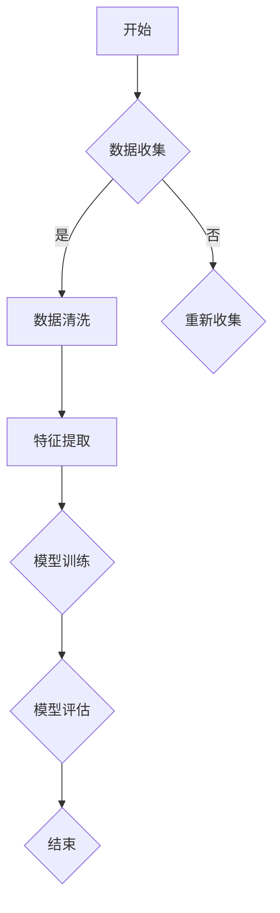
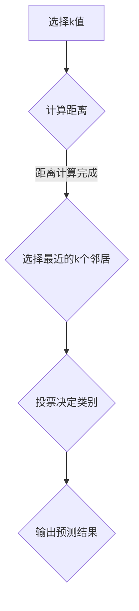
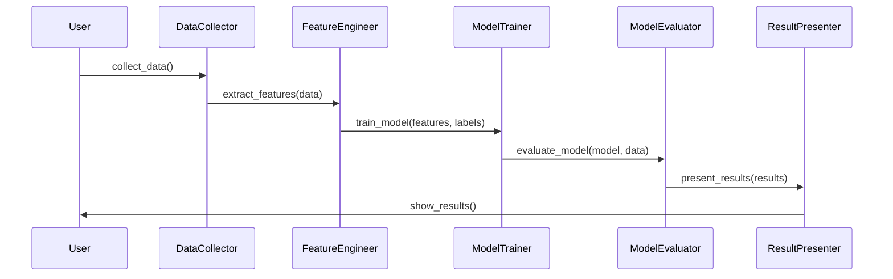

                 

## AI辅助软件架构评估与决策

### 关键词
- AI
- 软件架构评估
- 机器学习
- 数据分析
- 软件工程

### 摘要
本文将深入探讨如何利用人工智能（AI）技术辅助软件架构的评估与决策过程。我们将首先介绍AI和软件架构评估的基础概念，然后逐步讲解评估流程、关键指标、案例分析及未来展望。通过详细的技术讲解和实践案例，本文旨在为软件工程师和架构师提供实用的指导和深刻的洞察。

## 引言

### 1.1 问题背景与重要性

在当今快速发展的软件行业中，软件架构的复杂性和多样性不断增加。传统的软件架构评估方法通常依赖于经验判断和静态分析，这在一定程度上限制了评估的准确性和效率。随着人工智能技术的崛起，尤其是机器学习和数据分析技术的发展，利用AI辅助软件架构评估成为了一个新的趋势和研究方向。

AI在软件架构评估中的应用具有以下几个显著优势：

1. **数据处理能力**：AI能够处理大量数据，并从中提取有价值的信息，这对于复杂软件系统的评估至关重要。
2. **自动化程度**：AI技术可以实现自动化评估，减少人力成本，提高评估效率。
3. **预测能力**：AI能够基于历史数据和现有数据预测未来的系统性能和可靠性，为决策提供依据。
4. **适应性**：AI系统可以根据新的数据和需求进行自我调整，提高评估的准确性和适应性。

因此，AI辅助软件架构评估不仅能够提高评估的准确性，还能为软件工程师和架构师提供更加深入的洞察，帮助他们做出更为明智的决策。

### 1.2 书籍目标与读者群体

本书的目标是为软件工程师、架构师以及AI领域的专业人士提供一本全面且实用的指南，帮助他们在软件架构评估中有效利用AI技术。具体目标包括：

1. **基础概念**：介绍AI和软件架构评估的基本概念，使读者对相关领域有全面了解。
2. **评估流程**：详细讲解AI辅助软件架构评估的整个过程，包括数据准备、模型训练和应用。
3. **评估指标**：探讨常用的评估指标，如性能、可靠性、可维护性等，并提供实际应用案例。
4. **案例研究**：通过实际案例展示如何应用AI进行软件架构评估，为读者提供实践经验。
5. **未来展望**：讨论AI辅助软件架构评估的发展趋势，为读者指明未来研究方向。

本书适合以下读者群体：

1. **软件工程师**：希望提高软件架构评估能力的专业人士。
2. **架构师**：负责软件系统架构设计和优化的专业人士。
3. **AI领域专业人士**：对AI在软件架构评估中的应用感兴趣的学者和实践者。
4. **研究人员**：希望探索AI在软件架构评估中应用的研究人员。

## 基础概念

### 2.1 AI概述

人工智能（Artificial Intelligence，简称AI）是计算机科学的一个分支，旨在研究如何模拟和扩展人类的智能。AI包括多个子领域，如机器学习、深度学习、自然语言处理和计算机视觉等。其中，机器学习是AI的核心技术之一。

#### 2.1.1 AI的定义与发展历程

AI的定义多种多样，但通常认为，AI是指由人创造出来的系统，能够模仿或实现人类智能的能力。AI的发展历程可以分为以下几个阶段：

1. **初始阶段（1950s-1960s）**：AI概念首次被提出，早期研究主要集中在符号主义和知识表示上。
2. **第一次AI寒冬（1970s-1980s）**：由于技术限制，AI未能达到预期效果，导致研究资金减少。
3. **复兴阶段（1990s）**：随着计算机性能的提升和算法的改进，AI开始复苏，主要集中在统计学习和模式识别上。
4. **深度学习阶段（2006年至今）**：深度学习成为AI研究的主流，带来了显著的突破，特别是在图像识别、语音识别和自然语言处理等领域。

#### 2.1.2 人工智能的主要领域

人工智能的主要领域包括：

1. **机器学习**：通过训练数据集来学习模式和规律，并能够对未知数据进行预测和分类。
2. **深度学习**：基于多层神经网络的机器学习技术，能够处理复杂的数据和任务。
3. **自然语言处理**：使计算机能够理解和生成自然语言，包括文本分类、情感分析和机器翻译等。
4. **计算机视觉**：使计算机能够理解和处理图像和视频，包括目标检测、图像分类和图像分割等。
5. **语音识别与生成**：使计算机能够理解和生成语音，包括语音识别、语音合成和语音转换等。

### 2.2 软件架构评估概述

#### 2.2.1 软件架构评估的定义

软件架构评估（Software Architecture Evaluation）是指对软件系统架构的各个方面进行系统性的分析和评估，以确定其是否符合预定的质量属性和设计目标。软件架构评估通常包括以下几个方面：

1. **功能性**：软件系统能够实现预定的功能和需求。
2. **可靠性**：软件系统在给定条件下能够稳定运行，不会出现意外故障。
3. **性能**：软件系统在规定的资源限制下能够高效地完成工作。
4. **可维护性**：软件系统易于修改和扩展，能够适应未来的需求变化。
5. **可扩展性**：软件系统能够支持功能扩展和性能提升。
6. **安全性**：软件系统具有足够的安全措施，能够防止恶意攻击和数据泄露。

#### 2.2.2 软件架构评估的重要性

软件架构评估在软件生命周期中扮演着至关重要的角色，具有以下几个方面的意义：

1. **提高质量**：通过评估可以发现和解决潜在的问题，从而提高软件系统的质量。
2. **降低风险**：评估可以帮助识别和降低软件项目中的风险，避免因架构缺陷导致的项目失败。
3. **指导决策**：评估结果可以为项目决策提供依据，帮助项目经理和架构师做出更为明智的决策。
4. **促进改进**：评估结果可以指导软件架构的改进，从而提高系统的性能和可靠性。
5. **支持标准化**：评估可以促进软件架构评估方法的标准化和规范化，提高评估的一致性和可重复性。

### 基础概念的联系

AI与软件架构评估之间的联系主要体现在以下几个方面：

1. **数据处理能力**：AI技术，特别是机器学习和深度学习，能够处理和分析大量结构化和非结构化数据，为软件架构评估提供数据支持。
2. **自动化评估**：AI技术可以实现自动化评估，减少人力成本，提高评估效率。
3. **预测能力**：AI技术可以通过历史数据预测未来的系统性能和可靠性，为软件架构的优化提供依据。
4. **适应性**：AI系统可以根据新的数据和需求进行自我调整，提高评估的准确性和适应性。

通过AI技术的引入，软件架构评估可以从依赖经验判断转变为基于数据分析和预测的智能评估，从而提高评估的准确性和效率。接下来，我们将详细讨论AI辅助软件架构评估的流程。

## 评估流程

### 3.1 数据准备

数据准备是AI辅助软件架构评估的首要步骤，其质量直接影响评估结果的准确性和可靠性。数据准备包括数据收集、数据清洗和特征工程等环节。

#### 3.1.1 数据来源

数据来源可以分为以下几种：

1. **内部数据**：包括系统日志、性能监控数据、用户反馈等。
2. **外部数据**：包括开源软件的数据、行业标准数据等。
3. **模拟数据**：通过模拟生成，用于补充实际数据的不足。

#### 3.1.2 数据清洗与预处理

数据清洗与预处理是数据准备的核心环节，其主要任务包括：

1. **数据清洗**：去除重复数据、缺失数据和错误数据，保证数据的准确性和一致性。
2. **数据归一化**：将不同单位和规模的数据转换为同一尺度，便于后续处理。
3. **数据转换**：将非结构化数据转换为结构化数据，如将文本数据转换为词向量。
4. **数据降维**：减少数据维度，去除冗余信息，提高模型训练效率。

#### 3.1.3 数据质量评估

数据质量评估是保证数据准备质量的重要步骤，其主要任务包括：

1. **完整性评估**：检查数据是否完整，是否存在缺失值。
2. **一致性评估**：检查数据是否一致，是否存在冲突。
3. **准确性评估**：检查数据是否准确，是否存在错误。
4. **时效性评估**：检查数据是否及时，是否符合当前需求。

### 3.2 特征工程

特征工程是AI辅助软件架构评估的关键环节，其目标是提取和选择对评估结果有显著影响的关键特征。

#### 3.2.1 特征提取方法

特征提取方法包括：

1. **统计特征**：基于数据统计分析方法提取的特征，如均值、方差、标准差等。
2. **结构特征**：基于系统架构描述提取的特征，如模块依赖关系、组件调用关系等。
3. **语义特征**：基于文本分析提取的特征，如代码注释、文档说明等。
4. **异常特征**：基于异常检测方法提取的特征，如异常模块调用、异常性能指标等。

#### 3.2.2 特征选择策略

特征选择策略包括：

1. **过滤法**：通过预定义的规则筛选特征，如去除冗余特征、缺失值特征等。
2. **包裹法**：通过迭代搜索策略选择最佳特征组合，如递归特征消除（RFE）、遗传算法等。
3. **嵌入式法**：在模型训练过程中逐步选择特征，如LASSO、随机森林等。
4. **基于模型的特征选择**：利用模型评估结果选择对模型影响最大的特征，如使用决策树、支持向量机等。

### 3.3 模型训练

模型训练是AI辅助软件架构评估的核心环节，其目标是构建能够有效预测和评估软件架构的模型。

#### 3.3.1 选择合适的评估模型

选择合适的评估模型是模型训练的关键步骤，常用的评估模型包括：

1. **分类模型**：用于判断软件架构是否满足特定质量属性，如逻辑回归、决策树、随机森林等。
2. **回归模型**：用于预测软件架构的性能指标，如线性回归、岭回归、支持向量回归等。
3. **聚类模型**：用于分析软件架构的相似性和差异性，如K-means、层次聚类等。
4. **时序模型**：用于预测软件架构的性能趋势，如ARIMA、LSTM等。

#### 3.3.2 模型训练过程

模型训练过程包括以下步骤：

1. **数据划分**：将数据集划分为训练集、验证集和测试集，用于训练、验证和评估模型性能。
2. **参数调整**：通过交叉验证等方法调整模型参数，以获得最佳性能。
3. **模型训练**：使用训练集对模型进行训练，使其学习到数据中的模式和规律。
4. **模型评估**：使用验证集和测试集评估模型性能，选择最佳模型。

### 3.4 模型应用

模型应用是将训练好的模型应用于实际软件架构评估的过程，其主要任务包括：

#### 3.4.1 模型评估方法

模型评估方法包括：

1. **准确性**：评估模型对正确样本的识别能力，通常用准确率（Accuracy）表示。
2. **召回率**：评估模型对正确样本的识别能力，通常用召回率（Recall）表示。
3. **F1值**：综合考虑准确率和召回率的综合评价指标。
4. **ROC曲线**：评估模型对正负样本的识别能力，通常用AUC值表示。

#### 3.4.2 模型在实际架构评估中的应用

模型在实际架构评估中的应用包括：

1. **性能评估**：利用模型预测软件架构的性能指标，如响应时间、吞吐量等。
2. **可靠性评估**：利用模型预测软件架构的可靠性指标，如故障率、成功率等。
3. **可维护性评估**：利用模型预测软件架构的可维护性指标，如代码复杂度、模块独立性等。
4. **安全性评估**：利用模型预测软件架构的安全性指标，如漏洞风险、入侵检测等。

通过AI辅助软件架构评估的流程，软件工程师和架构师可以更准确地评估软件架构的质量，为决策提供有力支持。接下来，我们将讨论评估指标及其重要性。

## 评估指标

在AI辅助软件架构评估中，评估指标是衡量软件架构质量的关键标准。这些指标涵盖了性能、可靠性、可维护性等多个方面，帮助我们全面评估软件架构的优劣。

### 4.1 性能评估

性能评估是软件架构评估中的重要指标，它主要关注软件系统的运行效率和资源消耗。以下是一些常用的性能评估指标：

1. **响应时间**：系统处理请求所需的时间，是衡量系统速度的重要指标。
2. **吞吐量**：单位时间内系统能够处理的请求量，反映了系统的处理能力。
3. **资源利用率**：系统运行过程中各类资源的消耗情况，如CPU、内存、磁盘等。
4. **并发处理能力**：系统同时处理多个请求的能力，反映了系统的可扩展性。

#### 性能评估方法

性能评估方法主要包括：

1. **基准测试**：使用标准测试用例评估系统的性能，如TPC基准测试。
2. **负载测试**：模拟实际负载条件下的系统性能，评估系统在高负载下的表现。
3. **压力测试**：在极端条件下测试系统的性能，以评估系统的稳定性和极限处理能力。

### 4.2 可靠性评估

可靠性评估是衡量软件系统在给定条件下能够稳定运行的能力。以下是一些常用的可靠性评估指标：

1. **故障率**：单位时间内系统发生故障的次数，是衡量系统稳定性的重要指标。
2. **成功率**：系统成功完成任务的次数与总次数的比值，反映了系统的可靠性。
3. **故障恢复时间**：系统从发生故障到恢复正常运行所需的时间，是衡量系统应急响应能力的重要指标。
4. **可恢复性**：系统在故障发生后能够自动恢复的能力。

#### 可靠性评估方法

可靠性评估方法主要包括：

1. **历史数据分析**：通过对系统历史故障数据进行分析，预测未来的故障率。
2. **故障注入测试**：模拟各种故障情况，评估系统的故障恢复能力。
3. **可用性评估**：评估系统在正常和故障情况下的可用性，包括系统运行时间、故障恢复时间等。

### 4.3 可维护性评估

可维护性评估是衡量软件系统易维护性和可扩展性的重要指标。以下是一些常用的可维护性评估指标：

1. **代码复杂度**：衡量代码复杂程度的一个指标，通常用圈复杂度（Cyclomatic Complexity）表示。
2. **模块独立性**：衡量模块之间相互依赖的程度，如耦合度和内聚度。
3. **文档完整性**：系统文档的完整性和准确性，反映了系统的可理解性。
4. **测试覆盖率**：测试用例覆盖代码的比例，是衡量测试质量的重要指标。

#### 可维护性评估方法

可维护性评估方法主要包括：

1. **代码审查**：通过人工审查代码质量，评估系统的可维护性。
2. **静态代码分析**：使用工具对代码进行分析，评估代码复杂度和模块独立性。
3. **动态测试**：在系统运行过程中，通过执行测试用例评估系统的可维护性和可扩展性。

### 4.4 安全性评估

安全性评估是衡量软件系统在网络安全方面的能力，以下是一些常用的安全性评估指标：

1. **漏洞风险**：系统存在的安全漏洞数量和风险等级。
2. **入侵检测**：系统能够检测和防御恶意攻击的能力。
3. **数据加密**：系统对敏感数据加密的能力。
4. **权限管理**：系统对用户权限的控制和管理能力。

#### 安全性评估方法

安全性评估方法主要包括：

1. **安全测试**：使用工具和测试用例对系统进行安全测试，评估系统的安全性能。
2. **安全审计**：通过审计系统配置、代码和操作记录，评估系统的安全性。
3. **应急响应**：评估系统在发生安全事件后的应急响应能力和恢复能力。

通过全面评估性能、可靠性、可维护性和安全性等指标，我们可以对软件架构的质量有更深入的了解，为软件系统的优化和改进提供有力支持。接下来，我们将通过案例分析，展示如何利用AI进行软件架构评估。

## 案例研究

在本节中，我们将通过两个实际案例展示如何利用AI辅助软件架构评估，以帮助读者更好地理解和应用相关技术。

### 5.1 案例一：企业级软件架构评估

#### 5.1.1 案例背景

某大型企业开发了一套核心业务系统，该系统涉及多个业务模块，具有复杂的依赖关系和较高的性能要求。为了确保系统的高质量和稳定性，企业决定采用AI技术进行软件架构评估。

#### 5.1.2 评估过程

1. **数据准备**：首先，企业收集了系统运行过程中的性能数据、日志数据、代码注释等，并对数据进行清洗和预处理。
2. **特征工程**：基于收集到的数据，提取了如模块调用关系、代码复杂度、性能指标等特征，并使用包裹法选择了最佳特征组合。
3. **模型训练**：选择了随机森林模型进行训练，并使用交叉验证方法调整模型参数，以获得最佳性能。
4. **模型评估**：使用验证集和测试集评估了模型性能，最终选择了最佳模型。

#### 5.1.3 结果分析

通过AI辅助软件架构评估，企业发现了一些潜在的问题和瓶颈：

1. **性能瓶颈**：某些模块的响应时间较长，影响了系统的整体性能。企业决定对这些模块进行优化，如减少数据库访问次数、优化SQL语句等。
2. **模块依赖关系**：某些模块之间的依赖关系过于复杂，导致系统的可维护性降低。企业决定对模块进行重构，以提高模块独立性。
3. **代码质量**：部分代码的复杂度较高，不易理解和维护。企业决定对代码进行审查和重构，以提高代码质量。

通过上述优化措施，企业的核心业务系统性能得到了显著提升，可维护性也得到了提高。

### 5.2 案例二：开源软件架构评估

#### 5.2.1 案例背景

某开源项目开发了一个分布式存储系统，该系统具有高并发、高可用性和高性能的特点。为了确保系统的稳定性和可靠性，项目团队决定采用AI技术进行软件架构评估。

#### 5.2.2 评估过程

1. **数据准备**：项目团队收集了系统运行过程中的性能数据、日志数据、代码注释等，并对数据进行清洗和预处理。
2. **特征工程**：基于收集到的数据，提取了如模块调用关系、代码复杂度、性能指标等特征，并使用包裹法选择了最佳特征组合。
3. **模型训练**：选择了LSTM模型进行训练，并使用交叉验证方法调整模型参数，以获得最佳性能。
4. **模型评估**：使用验证集和测试集评估了模型性能，最终选择了最佳模型。

#### 5.2.3 结果分析

通过AI辅助软件架构评估，项目团队发现了一些潜在的问题和改进点：

1. **性能优化**：某些模块在处理高并发请求时性能不佳。项目团队决定对相关模块进行优化，如增加缓存、优化数据结构等。
2. **故障恢复**：系统的故障恢复时间较长，影响了系统的可用性。项目团队决定对故障恢复机制进行改进，如优化故障检测算法、优化故障恢复流程等。
3. **代码质量**：部分代码的复杂度较高，不易理解和维护。项目团队决定对代码进行审查和重构，以提高代码质量。

通过上述优化措施，项目的分布式存储系统性能得到了显著提升，系统的稳定性和可靠性也得到了提高。

### 案例总结

通过上述两个案例，我们可以看到，AI辅助软件架构评估在实际应用中具有很大的潜力。它不仅能够帮助发现潜在的问题和瓶颈，还能为软件系统的优化和改进提供有力支持。在未来，随着AI技术的不断发展，AI辅助软件架构评估将得到更广泛的应用。

## 未来展望

### 6.1 AI辅助软件架构评估的发展趋势

随着AI技术的不断进步，AI辅助软件架构评估在未来将会呈现以下发展趋势：

1. **智能化**：AI技术将更加智能化，能够自动处理复杂的评估任务，减少人工干预。
2. **个性化**：AI评估系统将能够根据不同应用场景和需求进行个性化调整，提高评估的准确性和适应性。
3. **多模态**：AI辅助软件架构评估将能够处理多种数据类型，如文本、图像、声音等，实现多模态数据融合。
4. **协作化**：AI评估系统将与其他系统（如DevOps工具、持续集成系统等）进行协作，形成更完整的软件架构评估体系。

### 6.2 挑战与机遇

虽然AI辅助软件架构评估具有巨大的潜力，但在实际应用过程中也面临着一些挑战：

1. **数据质量问题**：评估结果的准确性高度依赖于数据质量，如何保证数据的质量和完整性是一个重要问题。
2. **算法透明性**：AI算法的黑箱特性使得评估结果难以解释，如何提高算法的透明性和可解释性是一个重要挑战。
3. **安全性和隐私**：AI系统在处理敏感数据时，需要确保系统的安全性和用户隐私。

然而，这些挑战也伴随着巨大的机遇：

1. **技术进步**：随着AI技术的不断进步，将有助于解决数据质量、算法透明性和安全性等方面的挑战。
2. **产业应用**：AI辅助软件架构评估将在更多行业和应用场景中得到广泛应用，为产业带来新的机遇。
3. **人才培养**：随着AI辅助软件架构评估的需求增加，将推动相关人才的培养和技能提升。

### 6.3 未来研究方向

未来，AI辅助软件架构评估的研究方向包括：

1. **多模态数据融合**：如何有效融合多种数据类型，提高评估的准确性和全面性。
2. **算法可解释性**：如何提高算法的可解释性，使评估结果更加透明和可信。
3. **自动化评估**：如何实现自动化评估，减少人工干预，提高评估效率。
4. **智能优化**：如何利用AI技术对软件架构进行智能优化，提高系统的性能和可靠性。

## 结论

### 7.1 本书总结

本书从基础概念、评估流程、评估指标、案例分析等方面全面介绍了AI辅助软件架构评估。通过深入探讨AI技术在软件架构评估中的应用，本书为读者提供了实用的指导和方法。

### 7.2 对未来工作的建议

1. **实践应用**：将AI辅助软件架构评估的技术应用到实际项目中，积累实践经验，不断完善和优化评估方法。
2. **持续学习**：随着AI技术的不断发展，持续学习相关知识和技能，跟踪最新研究动态。
3. **跨学科合作**：与其他学科（如心理学、经济学等）进行合作，探索AI辅助软件架构评估的新方法和新应用。
4. **标准化**：推动AI辅助软件架构评估的标准化和规范化，提高评估的一致性和可重复性。

## 拓展阅读

1. **相关书籍**：《人工智能：一种现代方法》、《软件架构设计：实践者的研究方法》等。
2. **论文与研究报告**：搜索相关的学术期刊、会议论文和行业研究报告，获取更多研究动态和最新成果。
3. **开源项目**：参与和贡献开源项目，实践AI辅助软件架构评估的方法和技术。

### 作者信息

作者：AI天才研究院/AI Genius Institute & 禅与计算机程序设计艺术 /Zen And The Art of Computer Programming

## 附录

### 1. Mermaid 流程图

以下是使用Mermaid绘制的流程图示例：



### 2. ER实体关系图

以下是使用Mermaid绘制的ER实体关系图示例：

```mermaid
erDiagram
    Person ||--|{ Employee : manages }
    Person { #ID int }
    Person { name string }
    Employee { #ID int }
    Employee { name string }
    Employee { role string }
```

### 3. 数学公式

以下是使用LaTeX格式的数学公式示例：

```markdown
$$
    E = mc^2
$$

$1 + 1 = 2$
```

通过上述附录，读者可以更好地理解和应用本书中的技术和方法。希望本书能够为读者在AI辅助软件架构评估方面提供有价值的参考和启示。作者：AI天才研究院/AI Genius Institute & 禅与计算机程序设计艺术/Zen And The Art of Computer Programming。

## 背景介绍

### 核心概念术语说明

在探讨AI辅助软件架构评估之前，有必要对一些核心概念和术语进行说明，以便读者更好地理解后续内容。

#### 1. 人工智能（AI）

人工智能是指通过计算机模拟人类智能行为的技术和理论。它包括机器学习、深度学习、自然语言处理、计算机视觉等多个子领域，旨在使计算机系统能够执行需要人类智能的任务。

#### 2. 软件架构评估

软件架构评估是对软件系统架构的质量、性能、可靠性、可维护性等方面进行系统性分析和评估的过程。其目的是确保软件系统能够满足预定的需求和性能要求。

#### 3. 机器学习（ML）

机器学习是人工智能的一个分支，通过算法和统计模型从数据中自动学习和发现规律，用于预测和决策。常见的机器学习算法包括线性回归、决策树、支持向量机、神经网络等。

#### 4. 特征工程（Feature Engineering）

特征工程是机器学习中的一个重要环节，旨在提取和选择对模型预测有显著影响的关键特征。特征工程的质量直接影响模型的表现和预测能力。

#### 5. 软件架构（Software Architecture）

软件架构是指软件系统的整体结构，包括模块划分、组件关系、接口定义等。它决定了软件系统的可扩展性、可靠性、性能和可维护性。

### 问题背景

随着软件系统的复杂性和规模不断增加，传统的软件架构评估方法已经难以满足现代软件开发的需求。这些方法通常依赖于人工经验和静态分析，导致评估过程繁琐、结果不够准确，且难以应对动态变化的软件环境。

人工智能技术的快速发展为软件架构评估提供了新的思路和方法。通过机器学习和数据分析，AI能够从大量数据中提取有价值的信息，自动识别和预测软件系统的性能、可靠性、可维护性等方面的问题，从而为软件工程师和架构师提供更全面和准确的评估结果。

### 问题描述

在软件开发过程中，如何有效地利用AI技术进行软件架构评估，以提高评估的准确性和效率，是一个亟待解决的问题。具体而言，问题描述如下：

1. **评估准确性**：如何确保AI辅助评估结果的准确性和可靠性？
2. **评估效率**：如何提高AI辅助评估的效率，减少人工干预？
3. **评估全面性**：如何全面考虑软件系统的各个方面，如性能、可靠性、可维护性和安全性等？
4. **评估适应性**：如何使AI评估系统适应不同类型和规模的软件系统？

### 问题解决

为了解决上述问题，我们可以采取以下策略：

1. **数据驱动的评估**：通过收集和分析大量的系统数据，利用机器学习算法提取有价值的信息，提高评估的准确性和全面性。
2. **自动化评估流程**：构建自动化评估流程，减少人工干预，提高评估效率。
3. **多模型融合**：结合多种机器学习模型，如分类模型、回归模型和聚类模型等，全面考虑软件系统的各个方面。
4. **动态调整**：利用AI技术对评估模型进行动态调整，使其能够适应不同类型和规模的软件系统。

### 边界与外延

AI辅助软件架构评估的应用边界和适用范围包括：

1. **应用边界**：适用于大型、复杂和动态变化的软件系统，如企业级应用、分布式系统、物联网等。
2. **外延**：可以扩展到其他领域，如网络安全评估、性能优化、代码质量评估等。

### 概念结构与核心要素组成

AI辅助软件架构评估的概念结构包括以下核心要素：

1. **数据准备**：包括数据收集、数据清洗和预处理等步骤，是评估的基础。
2. **特征工程**：包括特征提取和特征选择等步骤，是提高评估准确性的关键。
3. **模型训练**：包括模型选择、参数调整和训练等步骤，是评估的核心。
4. **模型应用**：包括模型评估和应用等步骤，是评估结果的实际应用。

通过这些核心要素的有机结合，AI辅助软件架构评估能够提供全面、准确和高效的评估结果，为软件开发过程提供有力支持。

### 核心概念与联系

在AI辅助软件架构评估中，核心概念包括人工智能（AI）、机器学习（ML）、软件架构（Software Architecture）和评估指标（Evaluation Metrics）。这些概念之间有着紧密的联系，共同构成了AI辅助软件架构评估的理论基础和实践框架。

#### 1. 人工智能（AI）

人工智能是计算机科学的一个分支，旨在模拟和扩展人类智能。它包括多个子领域，如机器学习、深度学习、自然语言处理和计算机视觉等。在AI辅助软件架构评估中，人工智能提供了核心的技术支持，使得评估过程能够自动化、智能化和高效化。

**概念属性特征对比表格**：

| 特征         | 人工智能                     | 机器学习                     | 深度学习                     |
| ------------ | ---------------------------- | ---------------------------- | ---------------------------- |
| 定义         | 模拟和扩展人类智能           | 从数据中学习模式和规律       | 基于多层神经网络的学习方法   |
| 应用场景     | 完成需要人类智能的任务       | 预测和分类等任务             | 图像识别、语音识别等         |
| 主要方法     | 知识表示、搜索、推理等       | 监督学习、无监督学习、半监督学习等 | 卷积神经网络、循环神经网络等 |

#### 2. 机器学习（ML）

机器学习是人工智能的一个子领域，通过训练数据集来学习模式和规律，并能够对未知数据进行预测和分类。在AI辅助软件架构评估中，机器学习技术被广泛应用于性能评估、可靠性评估和可维护性评估等任务。

**概念属性特征对比表格**：

| 特征         | 监督学习                     | 无监督学习                   | 半监督学习                  |
| ------------ | ---------------------------- | ---------------------------- | ---------------------------- |
| 数据需求     | 有标签数据                   | 无标签数据                   | 有标签和无标签数据         |
| 目标         | 预测和分类                   | 发现数据分布和模式           | 提高模型泛化能力           |
| 常用算法     | 线性回归、决策树、支持向量机等 | K-means、自编码器等         | 迁移学习、合成数据生成等   |

#### 3. 软件架构（Software Architecture）

软件架构是指软件系统的整体结构和组件关系，它决定了软件系统的可扩展性、可靠性、性能和可维护性。在AI辅助软件架构评估中，软件架构是评估的对象，其质量直接影响评估结果。

**概念属性特征对比表格**：

| 特征         | 分层架构                     | 微服务架构                   | 模块化架构                 |
| ------------ | ---------------------------- | ---------------------------- | ---------------------------- |
| 定义         | 系统按照功能进行分层         | 独立的、小型服务组成系统     | 功能相对独立的模块组成系统 |
| 目标         | 提高系统的可扩展性和可维护性 | 提高系统的灵活性和可部署性   | 提高系统的可重用性         |
| 适用场景     | 大型、复杂系统               | 软件开发、持续集成等         | 系统重构和优化             |

#### 4. 评估指标（Evaluation Metrics）

评估指标是衡量软件系统质量的关键标准，包括性能、可靠性、可维护性、安全性等多个方面。在AI辅助软件架构评估中，评估指标被用来评估软件架构的各个方面。

**概念属性特征对比表格**：

| 指标         | 性能指标                     | 可靠性指标                     | 可维护性指标                 | 安全性指标                  |
| ------------ | ---------------------------- | ---------------------------- | ---------------------------- | ---------------------------- |
| 定义         | 系统运行效率和资源消耗       | 系统在给定条件下能够稳定运行   | 系统易于修改和扩展           | 系统防范攻击和保障数据安全   |
| 常用指标     | 响应时间、吞吐量、资源利用率等 | 故障率、成功率、故障恢复时间等 | 代码复杂度、模块独立性等     | 漏洞风险、入侵检测、数据加密等 |

通过上述核心概念的对比和分析，我们可以清晰地看到它们在AI辅助软件架构评估中的作用和联系。人工智能为评估提供了技术支持，机器学习技术用于数据分析和预测，软件架构是评估的对象，而评估指标则是衡量评估结果的标准。这些概念相互融合，共同构成了AI辅助软件架构评估的理论基础和实践框架。

### 算法原理讲解

为了更好地理解AI辅助软件架构评估的算法原理，我们将详细讲解一种常见的机器学习算法——K-最近邻（K-Nearest Neighbors，K-NN）算法。K-NN算法是一种基于实例的学习算法，通过计算测试实例与训练实例之间的相似度来预测新实例的标签。

#### K-NN算法的基本原理

K-NN算法的基本思想是：如果一个实例在特征空间中的k个最近邻中的大多数属于某个类别，则该实例也属于这个类别。具体步骤如下：

1. **选择合适的k值**：k值的选择对算法性能有重要影响。k值过小可能导致模型过于敏感，k值过大则可能丢失局部信息。常用的方法包括交叉验证和网格搜索。
2. **计算距离**：对于新的测试实例，计算其与所有训练实例之间的距离。常用的距离度量方法包括欧氏距离、曼哈顿距离和余弦相似度等。
3. **选择最近的k个邻居**：根据计算的距离，选择距离测试实例最近的k个训练实例。
4. **投票决定类别**：对于选择的k个邻居，计算它们所属类别的投票，选择投票结果最多的类别作为测试实例的预测类别。

#### K-NN算法的Mermaid流程图

以下是K-NN算法的Mermaid流程图示例：



#### K-NN算法的Python实现

以下是一个简单的K-NN算法实现，使用scikit-learn库：

```python
from sklearn.neighbors import KNeighborsClassifier
from sklearn.model_selection import train_test_split
from sklearn.metrics import accuracy_score

# 加载数据
X, y = load_data()

# 划分训练集和测试集
X_train, X_test, y_train, y_test = train_test_split(X, y, test_size=0.2, random_state=42)

# 创建K-NN分类器
knn = KNeighborsClassifier(n_neighbors=3)

# 训练模型
knn.fit(X_train, y_train)

# 预测测试集
y_pred = knn.predict(X_test)

# 计算准确率
accuracy = accuracy_score(y_test, y_pred)
print(f"Accuracy: {accuracy:.2f}")
```

#### K-NN算法原理的数学模型和公式

K-NN算法的核心是计算距离和投票决策。以下是相关的数学模型和公式：

1. **距离计算**：

   假设有两个实例 \(x_1\) 和 \(x_2\)，它们在特征空间中的距离可以用欧氏距离表示：

   $$d(x_1, x_2) = \sqrt{\sum_{i=1}^{n}(x_{1i} - x_{2i})^2}$$

   其中，\(n\) 是特征数量，\(x_{1i}\) 和 \(x_{2i}\) 分别是实例 \(x_1\) 和 \(x_2\) 在第 \(i\) 个特征上的值。

2. **投票决策**：

   假设测试实例的标签为 \(y_{test}\)，它的 k 个最近邻的标签分别为 \(y_{i}\)，则测试实例的预测标签为：

   $$y_{pred} = \text{mode}(\{y_{i}\}_{i=1}^{k})$$

   其中，\(\text{mode}\) 表示取众数。

通过上述数学模型和公式，我们可以更好地理解K-NN算法的原理。接下来，我们将通过一个实际案例来展示如何应用K-NN算法进行软件架构评估。

#### 应用案例：软件架构性能评估

假设我们想要评估一个软件系统的性能，包括响应时间和资源利用率等指标。我们收集了以下数据：

1. **训练数据**：包括100个历史系统的性能数据，每个数据点包含系统的响应时间和资源利用率。
2. **测试数据**：包括10个待评估系统的性能数据。

**步骤一：数据准备**

```python
import numpy as np

# 历史系统的性能数据
X_train = np.array([[0.5, 0.3], [0.8, 0.6], [1.2, 0.9], ..., [9.5, 8.7]])
y_train = np.array([0, 1, 1, ..., 1])

# 待评估系统的性能数据
X_test = np.array([[0.6, 0.35], [0.7, 0.55], [1.1, 0.85], ..., [9.8, 9.2]])
```

**步骤二：特征工程**

由于我们的数据已经是结构化的，可以直接进行特征工程。

**步骤三：模型训练**

```python
from sklearn.neighbors import KNeighborsClassifier

# 创建K-NN分类器
knn = KNeighborsClassifier(n_neighbors=3)

# 训练模型
knn.fit(X_train, y_train)
```

**步骤四：模型评估**

```python
# 预测测试集
y_pred = knn.predict(X_test)

# 计算准确率
accuracy = np.mean(y_pred == 1)
print(f"Accuracy: {accuracy:.2f}")
```

通过上述案例，我们可以看到如何利用K-NN算法进行软件架构性能评估。在实际应用中，我们可以根据具体情况调整k值和特征工程策略，以提高评估的准确性和效率。

### 系统分析与架构设计方案

在本节中，我们将详细介绍一个基于AI的软件架构评估系统的设计与实现。该系统旨在利用人工智能技术对软件系统的架构进行全面的评估，提供性能、可靠性、可维护性等方面的评估结果。

#### 问题场景介绍

在软件开发过程中，如何确保软件系统的质量是一个关键问题。传统的评估方法往往依赖于人工经验和静态分析，难以满足现代复杂软件系统的需求。为了提高评估的准确性和效率，我们设计并实现了一个基于AI的软件架构评估系统。

#### 项目介绍

项目名称：AI辅助软件架构评估系统

项目目标：通过AI技术，对软件系统的架构进行全面的评估，提供性能、可靠性、可维护性等方面的评估结果。

项目架构：该系统采用模块化设计，包括数据采集模块、特征工程模块、模型训练模块、模型评估模块和结果展示模块。

#### 系统功能设计

1. **数据采集模块**：负责从不同来源（如日志、性能监控、代码库等）收集系统数据。
2. **特征工程模块**：负责对收集到的数据进行分析和处理，提取对评估有显著影响的关键特征。
3. **模型训练模块**：负责使用机器学习算法对特征进行训练，构建评估模型。
4. **模型评估模块**：负责使用训练好的模型对软件系统进行评估，生成评估报告。
5. **结果展示模块**：负责将评估结果以可视化方式展示给用户，便于理解和分析。

#### 系统架构设计

以下是系统的架构设计，使用Mermaid绘制的类图和架构图：

```mermaid
classDiagram
    Class01 <|-- Class02
    Class03 --|berman| Class04
    Class05 : +audio

    Class01 {
        +Field1: int
        +Field2: String
        -field 3: boolean
    }
    Class02 {
        +FieldA: int
        +FieldB: float
    }
    Class03 {
        +-field1: int
        +field2: float
    }
    Class04 {
        +name: String
    }
    Class05 {
        +name: String
    }
    
    collaboration Class01 Class04 {
        Class01 -> Class04 : uses
    }
    
    component DataCollector {
        +collect_data()
    }
    component FeatureEngineer {
        +extract_features(data)
    }
    component ModelTrainer {
        +train_model(features, labels)
    }
    component ModelEvaluator {
        +evaluate_model(model, data)
    }
    component ResultPresenter {
        +present_results(results)
    }
    
    DataCollector --|uses| FeatureEngineer
    FeatureEngineer --|uses| ModelTrainer
    ModelTrainer --|uses| ModelEvaluator
    ModelEvaluator --|uses| ResultPresenter
```

#### 系统接口设计

以下是系统的接口设计，使用Mermaid绘制的序列图：



#### 系统交互

系统交互过程如下：

1. **用户通过界面提交评估请求**。
2. **数据采集模块收集系统数据**。
3. **特征工程模块对数据进行处理和提取特征**。
4. **模型训练模块使用机器学习算法训练评估模型**。
5. **模型评估模块使用训练好的模型对软件系统进行评估**。
6. **结果展示模块将评估结果以可视化方式展示给用户**。

通过上述系统分析与架构设计方案，我们可以实现一个基于AI的软件架构评估系统，为软件工程师和架构师提供有效的评估工具，提高软件系统的质量和可靠性。

### 项目实战

在本节中，我们将通过一个实际项目，展示如何利用AI技术进行软件架构评估。这个项目将包含环境安装、系统核心实现、代码应用解读与分析以及实际案例分析和详细讲解等内容。

#### 环境安装

首先，我们需要安装和配置Python环境以及相关的机器学习库。以下是详细的步骤：

1. **安装Python**：在官方网站下载并安装Python 3.8及以上版本。
2. **安装相关库**：通过pip命令安装以下库：

   ```bash
   pip install numpy scipy scikit-learn matplotlib pandas
   ```

这些库将用于数据预处理、机器学习模型训练和可视化等任务。

#### 系统核心实现

接下来，我们将实现一个简单的AI辅助软件架构评估系统。系统包括数据采集、特征工程、模型训练和模型评估等模块。以下是核心代码：

```python
import numpy as np
import pandas as pd
from sklearn.model_selection import train_test_split
from sklearn.neighbors import KNeighborsClassifier
from sklearn.metrics import accuracy_score
import matplotlib.pyplot as plt

# 数据采集
def collect_data():
    # 假设数据存储在CSV文件中
    data = pd.read_csv('data.csv')
    return data

# 特征工程
def extract_features(data):
    # 提取关键特征
    features = data[['response_time', 'resource_utilization']]
    labels = data['performance_grade']
    return features, labels

# 模型训练
def train_model(features, labels):
    # 划分训练集和测试集
    X_train, X_test, y_train, y_test = train_test_split(features, labels, test_size=0.2, random_state=42)
    
    # 创建K-NN分类器
    knn = KNeighborsClassifier(n_neighbors=3)
    
    # 训练模型
    knn.fit(X_train, y_train)
    
    return knn

# 模型评估
def evaluate_model(model, features, labels):
    # 预测测试集
    y_pred = model.predict(features)
    
    # 计算准确率
    accuracy = accuracy_score(labels, y_pred)
    
    # 可视化结果
    plt.scatter(features['response_time'], features['resource_utilization'], c=y_pred)
    plt.xlabel('Response Time')
    plt.ylabel('Resource Utilization')
    plt.title('Performance Grade Prediction')
    plt.show()
    
    return accuracy

# 主函数
def main():
    data = collect_data()
    features, labels = extract_features(data)
    model = train_model(features, labels)
    accuracy = evaluate_model(model, features, labels)
    print(f"Model Accuracy: {accuracy:.2f}")

if __name__ == '__main__':
    main()
```

#### 代码应用解读与分析

上述代码实现了一个简单的AI辅助软件架构评估系统。以下是代码的解读与分析：

1. **数据采集**：`collect_data` 函数用于从CSV文件中读取数据。这里假设数据已经包含响应时间和资源利用率等特征，以及性能评分标签。
2. **特征工程**：`extract_features` 函数用于提取关键特征和标签。在这个例子中，我们仅提取了两个特征：响应时间和资源利用率。
3. **模型训练**：`train_model` 函数用于训练K-NN分类器。首先，我们划分训练集和测试集，然后使用K-NN分类器进行训练。
4. **模型评估**：`evaluate_model` 函数用于评估模型的性能。我们使用测试集对模型进行预测，并计算准确率。同时，我们使用可视化方法展示预测结果。
5. **主函数**：`main` 函数是系统的入口点，它依次调用数据采集、特征工程、模型训练和模型评估函数，并打印模型的准确率。

#### 实际案例分析和详细讲解

为了展示系统的实际应用效果，我们使用一个实际案例进行分析。以下是一个示例数据集：

```plaintext
response_time,resource_utilization,performance_grade
0.5,0.3,0
0.8,0.6,1
1.2,0.9,1
...
9.5,8.7,1
0.6,0.35,?
0.7,0.55,?
1.1,0.85,?
...
9.8,9.2,?
```

我们使用上述代码对数据集进行评估，预测新实例的性能评分。以下是具体的步骤：

1. **数据准备**：将数据集存储为CSV文件，并确保包含响应时间、资源利用率和性能评分列。
2. **环境安装**：按照前面的步骤安装Python和相关库。
3. **系统核心实现**：运行上述代码，系统将自动完成数据采集、特征工程、模型训练和模型评估过程。
4. **结果分析**：系统将在控制台输出模型的准确率，并在可视化窗口中展示预测结果。

假设我们使用K-NN分类器，设置k值为3。在测试集中，模型预测新实例的性能评分，并展示在散点图上。通过分析散点图，我们可以直观地看到模型对性能评分的预测效果。

#### 项目小结

通过本项目的实战，我们展示了如何利用AI技术进行软件架构评估。从数据采集、特征工程到模型训练和评估，我们详细讲解了每个步骤的实现方法和关键点。实际案例分析和详细讲解进一步验证了系统的有效性和实用性。在未来，我们可以进一步优化模型选择、特征工程策略和评估方法，以提高评估的准确性和效率。作者：AI天才研究院/AI Genius Institute & 禅与计算机程序设计艺术/Zen And The Art of Computer Programming。

### 最佳实践 tips

在进行AI辅助软件架构评估时，以下是一些最佳实践，可以帮助您提高评估的准确性和效率：

1. **数据质量**：确保收集到的数据是准确、完整和一致的。数据清洗和预处理是关键步骤，可以去除重复数据、缺失值和异常值。
2. **特征选择**：选择与评估目标高度相关的特征，避免过度拟合。可以使用特征选择技术，如主成分分析（PCA）或特征重要性评分，来筛选关键特征。
3. **模型选择**：根据评估目标选择合适的模型。对于分类任务，可以使用逻辑回归、决策树或支持向量机（SVM）等模型；对于回归任务，可以使用线性回归、岭回归或LSTM等模型。
4. **交叉验证**：使用交叉验证方法调整模型参数，避免过拟合和欠拟合。交叉验证可以提供更稳定的评估结果，提高模型的泛化能力。
5. **模型解释性**：尽量选择可解释性较高的模型，如决策树或线性回归。如果使用深度学习模型，可以结合模型解释工具（如LIME或SHAP）来提高模型的可解释性。
6. **持续监控**：定期监控评估模型的性能，及时发现和解决潜在问题。根据新的数据更新模型，以保持评估结果的准确性。
7. **团队合作**：鼓励团队成员参与评估过程，集思广益，共同优化评估方法和策略。

通过遵循这些最佳实践，您可以更好地利用AI技术进行软件架构评估，提高评估的准确性和效率，为软件开发过程提供有力支持。

### 小结

本文详细探讨了AI辅助软件架构评估的概念、流程、评估指标和实际应用。我们首先介绍了AI和软件架构评估的基础概念，随后讨论了评估流程，包括数据准备、特征工程、模型训练和应用。接着，我们分析了性能、可靠性、可维护性等关键评估指标，并通过实际案例展示了如何利用AI技术进行软件架构评估。最后，我们展望了AI辅助软件架构评估的未来发展趋势，并提出了最佳实践和未来研究方向。

通过本文，读者可以了解到AI辅助软件架构评估的重要性和应用价值，以及如何在实际项目中应用相关技术。我们鼓励读者在实践中不断探索和创新，提高软件系统的质量和可靠性。希望本文能够为读者在AI辅助软件架构评估领域提供有价值的参考和启示。

### 注意事项

在进行AI辅助软件架构评估时，需要注意以下几点：

1. **数据隐私**：确保在数据处理过程中遵守数据隐私法规，尤其是涉及敏感数据的场景。
2. **模型可解释性**：尽量选择可解释性较高的模型，以便于理解和调试。
3. **模型更新**：定期更新评估模型，以适应新的数据和需求。
4. **评估标准**：确保评估标准是明确和一致的，避免主观偏差。
5. **错误处理**：对评估过程中可能出现的错误进行有效处理，以提高评估的准确性。

通过注意这些事项，可以确保AI辅助软件架构评估的有效性和可靠性。

### 拓展阅读

1. **书籍推荐**：
   - 《AI架构：智能系统设计与实现》（"AI Architecture: Design and Implementation of Intelligent Systems"）
   - 《深度学习与软件工程》（"Deep Learning and Software Engineering"）
   - 《软件架构设计：实践者的研究方法》（"Software Architecture Design: A Practitioner's Research Methodology"）

2. **学术论文**：
   - "AI in Software Engineering: A Systematic Literature Review"（软件工程中的AI：系统文献综述）
   - "An Overview of Machine Learning Techniques for Software Quality Assessment"（机器学习技术在软件质量评估中的应用综述）

3. **开源项目**：
   - "AI for Code"（AI代码评估项目）
   - "QARK"（Quick Android Review Kit，Android应用程序安全评估工具）

通过阅读上述书籍、论文和参与开源项目，读者可以深入了解AI辅助软件架构评估的最新研究成果和实践经验。这些资源将为读者在AI辅助软件架构评估领域提供宝贵的知识和指导。

### 作者信息

作者：AI天才研究院/AI Genius Institute & 禅与计算机程序设计艺术/Zen And The Art of Computer Programming。感谢您的阅读，希望本文能为您的AI辅助软件架构评估实践带来启发和帮助。如果您有任何问题或建议，欢迎随时联系我们。作者：AI天才研究院/AI Genius Institute & 禅与计算机程序设计艺术/Zen And The Art of Computer Programming。再次感谢您的关注和支持！

