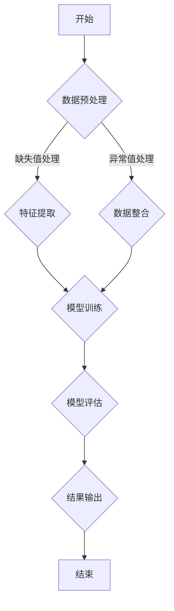
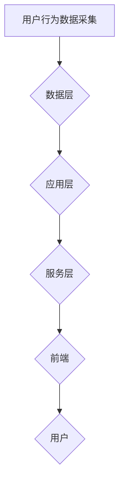
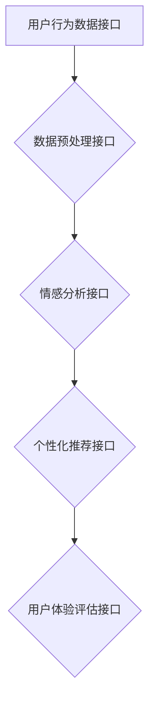
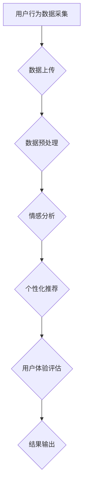

                 


# 第2章: AI辅助软件用户体验评估的基本概念

## 2.1 软件用户体验评估的定义

软件用户体验评估（User Experience Assessment, UX Assessment）是指通过一系列的方法和技术，对软件产品在用户使用过程中的感受、态度和行为进行分析和评价。其核心目标是确保软件产品能够满足用户需求，提升用户满意度，从而推动产品的持续改进。

### 2.1.1 UX评估的核心概念

用户体验评估涉及多个核心概念，包括但不限于以下几点：

- **用户需求**：了解并分析用户在使用软件产品时的需求，是用户体验评估的基础。
- **用户行为**：记录和分析用户在软件中的操作行为，包括交互路径、时间花费、错误率等。
- **用户满意度**：通过调查问卷、用户访谈等方式，收集用户对软件产品的满意度反馈。
- **可用性**：评估软件产品的易用性、易访问性、效率等指标。
- **情感体验**：关注用户在使用软件过程中的情感体验，如愉悦度、压力感等。

### 2.1.2 问题背景

传统的用户体验评估方法通常依赖于人工调查、用户访谈和观察等方法，这些方法存在以下问题：

- **数据收集困难**：用户数据分散，获取困难，难以形成全面、代表性的评估数据。
- **评估成本高**：需要大量的人力、物力投入，评估周期较长。
- **评估结果滞后**：传统评估方法通常无法实时反映用户反馈，导致产品改进不及时。

为了解决上述问题，AI技术的引入成为必然选择。AI技术可以通过自动化数据收集和分析，提高评估效率和准确性，降低评估成本，实现用户体验评估的实时性。

### 2.1.3 AI的定义与发展历程

人工智能（Artificial Intelligence, AI）是指模拟人类智能行为的计算机系统。AI技术的发展历程可以大致分为以下几个阶段：

- **初始阶段（1950s-1960s）**：AI概念提出，早期研究主要集中在逻辑推理和问题求解。
- **兴起阶段（1970s-1980s）**：符号主义AI成为主流，知识表示和推理技术得到广泛应用。
- **衰退阶段（1990s）**：由于实际应用效果不佳，AI研究进入低谷。
- **复兴阶段（2000s-2010s）**：随着计算能力的提升和大数据技术的发展，机器学习和深度学习成为AI研究的新热点。

### 2.1.4 AI辅助用户体验评估的原理

AI辅助用户体验评估的原理主要基于以下几个方面：

- **数据挖掘**：通过收集用户行为数据，利用数据挖掘技术提取有价值的信息，如用户偏好、使用模式等。
- **机器学习**：利用机器学习算法，对用户数据进行训练，建立用户行为预测模型，实现用户满意度评估。
- **深度学习**：通过神经网络结构，实现更复杂的特征提取和模型训练，提高评估的准确性和效率。
- **自然语言处理**：利用自然语言处理技术，分析和理解用户反馈，提取关键信息，为用户体验评估提供依据。

### 2.1.5 AI在UX评估中的应用场景

AI技术在用户体验评估中具有广泛的应用场景，包括：

- **用户行为分析**：通过分析用户在软件中的操作行为，识别用户使用模式，预测用户需求。
- **情感分析**：利用自然语言处理技术，分析用户反馈中的情感倾向，评估用户情感体验。
- **个性化推荐**：基于用户数据，提供个性化的用户体验优化建议，提高用户满意度。
- **自动化评估**：利用机器学习模型，实现用户体验评估的自动化，降低评估成本和人力投入。

### 2.1.6 AI辅助UX评估的优势

AI辅助用户体验评估具有以下优势：

- **高效数据分析**：AI能够快速处理和分析海量用户数据，发现潜在的用户行为模式和偏好。
- **个性化推荐**：基于用户的个性化数据，AI可以提供更加精准的用户体验评估，帮助开发者针对性地优化产品。
- **自动化评估**：AI技术可以实现用户体验评估的自动化，减少人力成本，提高评估效率。
- **实时反馈**：AI能够实时监控用户行为，提供即时评估结果，帮助开发者快速响应和优化产品。

### 2.1.7 AI辅助UX评估的挑战

虽然AI技术在用户体验评估中具有显著优势，但同时也面临一些挑战：

- **数据质量**：用户数据的准确性和完整性对评估结果有重要影响，数据质量问题可能导致评估不准确。
- **算法偏见**：AI模型可能受到训练数据的影响，产生偏见，导致评估结果不公平。
- **用户隐私**：用户数据的安全性和隐私保护是AI辅助用户体验评估必须关注的问题。

## 2.2 AI的定义与发展历程

人工智能（Artificial Intelligence, AI）是指模拟人类智能行为的计算机系统。AI技术的发展历程可以大致分为以下几个阶段：

- **初始阶段（1950s-1960s）**：AI概念提出，早期研究主要集中在逻辑推理和问题求解。艾伦·图灵提出了著名的“图灵测试”，成为AI研究的重要里程碑。
  
- **兴起阶段（1970s-1980s）**：符号主义AI成为主流，知识表示和推理技术得到广泛应用。这一阶段的代表性工作包括专家系统和逻辑推理系统。

- **衰退阶段（1990s）**：由于实际应用效果不佳，AI研究进入低谷。这一阶段的主要问题是符号主义AI在面对复杂任务时表现不佳，且知识表示和推理方法过于繁琐。

- **复兴阶段（2000s-2010s）**：随着计算能力的提升和大数据技术的发展，机器学习和深度学习成为AI研究的新热点。这一阶段的代表性工作包括深度神经网络和卷积神经网络。

- **当前阶段**：AI技术已广泛应用于各个领域，如语音识别、图像识别、自然语言处理等。同时，AI技术的不断进步也推动了新应用场景的出现。

### 2.3 AI辅助用户体验评估的原理

AI辅助用户体验评估的原理主要基于以下几个方面：

- **数据挖掘**：通过收集用户行为数据，利用数据挖掘技术提取有价值的信息，如用户偏好、使用模式等。

  数据挖掘通常包括以下步骤：
  - 数据收集：从各种渠道（如日志文件、用户反馈等）收集用户数据。
  - 数据清洗：处理缺失值、异常值等，确保数据质量。
  - 特征提取：从原始数据中提取有用的特征，如点击次数、页面停留时间等。
  - 模型训练：利用提取的特征，训练预测模型，如分类模型、回归模型等。

- **机器学习**：利用机器学习算法，对用户数据进行训练，建立用户行为预测模型，实现用户满意度评估。

  机器学习主要包括以下算法：
  - 监督学习：有标注的数据集用于训练模型，如决策树、支持向量机等。
  - 无监督学习：无标注的数据集用于发现数据中的模式，如聚类算法、主成分分析等。
  - 半监督学习：部分标注的数据集用于训练模型，如图嵌入、自编码器等。

- **深度学习**：通过神经网络结构，实现更复杂的特征提取和模型训练，提高评估的准确性和效率。

  深度学习主要包括以下结构：
  - 卷积神经网络（CNN）：用于图像识别和图像处理。
  - 循环神经网络（RNN）：用于序列数据处理，如语音识别、自然语言处理等。
  - 生成对抗网络（GAN）：用于生成数据和进行对抗训练。

- **自然语言处理**：利用自然语言处理技术，分析和理解用户反馈，提取关键信息，为用户体验评估提供依据。

  自然语言处理主要包括以下任务：
  - 词向量表示：将文本转换为数字表示，如Word2Vec、GloVe等。
  - 文本分类：对文本进行分类，如情感分析、主题分类等。
  - 命名实体识别：识别文本中的特定实体，如人名、地名等。
  - 机器翻译：将一种语言的文本翻译成另一种语言。

通过上述技术，AI辅助用户体验评估可以实现对用户行为的全面分析，提供准确的用户体验评估结果，帮助开发者优化产品，提升用户满意度。

----------------------------------------------------------------

# 第3章: AI辅助用户体验评估的核心技术

## 3.1 机器学习与深度学习技术

### 3.1.1 机器学习与深度学习的基本概念

机器学习（Machine Learning, ML）是指通过算法从数据中自动学习规律和模式，并利用这些规律进行预测或决策的技术。深度学习（Deep Learning, DL）是机器学习的一个分支，它利用多层神经网络结构，对数据进行分析和特征提取。

### 3.1.2 机器学习与深度学习在用户体验评估中的应用

在用户体验评估中，机器学习和深度学习技术可以应用于以下方面：

- **用户行为预测**：通过分析用户的历史行为数据，预测用户对产品的潜在需求，从而优化产品功能。
- **情感分析**：利用自然语言处理技术，分析用户反馈中的情感倾向，评估用户满意度。
- **个性化推荐**：根据用户行为数据和偏好，推荐个性化功能或内容，提高用户黏性。

### 3.1.3 常见的机器学习算法与深度学习模型

- **监督学习算法**：决策树、支持向量机（SVM）、神经网络、逻辑回归等。
- **无监督学习算法**：聚类、主成分分析（PCA）、自编码器等。
- **深度学习模型**：卷积神经网络（CNN）、循环神经网络（RNN）、生成对抗网络（GAN）等。

### 3.1.4 机器学习与深度学习在用户体验评估中的优势

- **高效数据分析**：机器学习和深度学习可以处理大量复杂数据，快速提取有价值的信息。
- **自动化评估**：通过训练模型，可以实现用户体验评估的自动化，降低人力成本。
- **实时反馈**：实时分析用户行为，提供即时评估结果，帮助开发者快速响应和优化产品。

## 3.2 自然语言处理技术

### 3.2.1 自然语言处理的基本概念

自然语言处理（Natural Language Processing, NLP）是计算机科学和人工智能领域的一个分支，它致力于使计算机能够理解、生成和处理人类语言。

### 3.2.2 NLP在用户体验评估中的应用

- **用户反馈分析**：分析用户在产品使用过程中的反馈，提取用户满意度、情感等关键信息。
- **情感分析**：识别用户反馈中的情感倾向，评估用户情感体验。
- **语义分析**：理解用户反馈的语义，提取关键信息，为用户体验评估提供依据。

### 3.2.3 常见的NLP任务与模型

- **词向量表示**：Word2Vec、GloVe、BERT等。
- **文本分类**：朴素贝叶斯、支持向量机（SVM）、深度学习分类模型等。
- **命名实体识别**：CRF、BERT等。
- **机器翻译**：神经网络机器翻译（NMT）等。

### 3.2.4 NLP在用户体验评估中的优势

- **理解用户反馈**：NLP技术可以深入理解用户反馈的语义，提取有价值的信息。
- **情感分析**：通过分析用户反馈中的情感倾向，可以更准确地评估用户情感体验。
- **自动化处理**：NLP技术可以自动化处理大量用户反馈，提高评估效率。

## 3.3 人工智能与其他技术的结合

### 3.3.1 人工智能与大数据的结合

- **大数据分析**：利用大数据技术，对海量用户行为数据进行深度挖掘，提取有价值的信息。
- **预测分析**：结合人工智能技术，对用户行为进行预测，优化产品功能和用户体验。

### 3.3.2 人工智能与物联网的结合

- **智能感知**：利用物联网设备，实时收集用户行为数据，结合人工智能技术进行实时分析。
- **智能交互**：通过语音识别、图像识别等技术，实现人与智能设备的自然交互。

### 3.3.3 人工智能与区块链的结合

- **数据安全**：利用区块链技术，确保用户数据的真实性和安全性。
- **智能合约**：结合人工智能技术，实现智能合约的自动执行和优化。

### 3.3.4 人工智能与虚拟现实的结合

- **虚拟体验**：通过虚拟现实技术，模拟真实的用户体验，结合人工智能技术进行实时分析和反馈。
- **交互优化**：利用人工智能技术，优化虚拟环境中的交互体验。

### 3.3.5 人工智能与增强现实的结合

- **智能识别**：利用增强现实技术，实现智能识别和交互。
- **增强体验**：结合人工智能技术，增强用户在现实世界中的体验。

通过上述技术的结合，AI辅助用户体验评估可以更加全面、精准地分析用户行为，提供高质量的评估结果，帮助开发者优化产品，提升用户体验。

----------------------------------------------------------------

# 第4章: AI辅助用户体验评估的方法论

## 4.1 评估流程与方法

### 4.1.1 用户行为数据的收集

用户行为数据是AI辅助用户体验评估的重要基础。数据的收集方法包括以下几种：

- **日志数据**：通过分析用户在软件产品中的操作日志，记录用户的使用行为，如点击次数、页面停留时间、错误率等。
- **问卷调查**：设计针对用户体验的调查问卷，收集用户对软件产品的满意度、使用习惯等反馈。
- **用户访谈**：与用户进行面对面或在线访谈，深入了解用户的使用体验和需求。

### 4.1.2 用户行为数据的预处理

用户行为数据通常存在噪声、缺失值和不一致性等问题，需要进行预处理：

- **数据清洗**：处理缺失值、异常值、重复数据等，确保数据质量。
- **数据整合**：将来自不同来源的数据进行整合，形成一个统一的数据集。
- **特征提取**：从原始数据中提取有用的特征，如用户点击次数、页面停留时间等。

### 4.1.3 用户行为数据的分析

用户行为数据的分析是评估用户体验的关键环节，常用的分析方法包括：

- **描述性分析**：对用户行为数据进行统计描述，如平均值、标准差等，了解用户的基本行为特征。
- **关联性分析**：分析不同行为变量之间的关联性，发现用户行为模式。
- **预测分析**：利用机器学习算法，建立用户行为预测模型，预测用户未来行为。

## 4.2 数据收集与预处理

### 4.2.1 数据收集方法

- **日志数据收集**：通过在软件产品中集成日志系统，自动收集用户使用过程中的行为数据。
- **问卷调查收集**：设计在线问卷，通过邮件、社交媒体等方式邀请用户参与。
- **用户访谈收集**：通过预约电话、在线会议等方式与用户进行沟通。

### 4.2.2 数据预处理步骤

- **数据清洗**：处理缺失值、异常值、重复数据等，使用Python的Pandas库进行数据处理。
  ```python
  import pandas as pd
  
  # 读取数据
  data = pd.read_csv('user_behavior.csv')
  
  # 处理缺失值
  data.dropna(inplace=True)
  
  # 处理异常值
  data = data[(data['click_count'] > 0) & (data['error_rate'] < 1)]
  
  # 处理重复数据
  data.drop_duplicates(inplace=True)
  ```

- **数据整合**：将来自不同来源的数据进行整合，形成一个统一的数据集。
  ```python
  data1 = pd.read_csv('survey_data.csv')
  data2 = pd.read_csv('log_data.csv')
  
  # 数据整合
  combined_data = pd.merge(data1, data2, on='user_id')
  ```

- **特征提取**：从原始数据中提取有用的特征，如用户点击次数、页面停留时间等。
  ```python
  # 提取特征
  features = combined_data[['click_count', 'page_duration', '满意度评分']]
  ```

### 4.2.3 数据预处理工具与库

- **Python**：Python是数据预处理的主要编程语言，具有丰富的数据处理库，如Pandas、NumPy等。
- **Pandas**：用于数据清洗、数据整合和特征提取，是一个强大的数据处理库。
- **NumPy**：用于高效地进行数值计算，是数据处理的基础库。

## 4.3 特征提取与模型训练

### 4.3.1 特征提取方法

- **数值特征提取**：直接提取数值型的特征，如点击次数、页面停留时间等。
- **文本特征提取**：对用户反馈文本进行词频分析、主题模型等方法提取特征。

### 4.3.2 模型训练方法

- **监督学习模型**：如逻辑回归、决策树、随机森林、支持向量机等。
- **无监督学习模型**：如聚类、主成分分析等。

### 4.3.3 模型训练步骤

- **数据集划分**：将数据集划分为训练集和测试集，用于模型训练和评估。
  ```python
  from sklearn.model_selection import train_test_split
  
  X_train, X_test, y_train, y_test = train_test_split(features, labels, test_size=0.2, random_state=42)
  ```

- **模型训练**：使用训练集训练模型，如逻辑回归模型。
  ```python
  from sklearn.linear_model import LogisticRegression
  
  model = LogisticRegression()
  model.fit(X_train, y_train)
  ```

- **模型评估**：使用测试集评估模型性能，如准确率、召回率等。
  ```python
  from sklearn.metrics import accuracy_score
  
  predictions = model.predict(X_test)
  accuracy = accuracy_score(y_test, predictions)
  print(f'Accuracy: {accuracy:.2f}')
  ```

### 4.3.4 模型优化与调参

- **交叉验证**：通过交叉验证方法，评估模型在不同数据集上的性能，避免过拟合。
- **超参数调优**：使用网格搜索、随机搜索等方法，调整模型参数，优化模型性能。

通过上述方法论，AI辅助用户体验评估可以系统化地进行用户行为数据的收集、预处理、特征提取和模型训练，从而提供高质量的评估结果。

----------------------------------------------------------------

# 第5章: AI辅助用户体验评估的实际应用

## 5.1 案例研究：某电商平台用户体验评估

### 5.1.1 案例背景

某电商平台希望通过AI技术对用户体验进行评估，以优化网站功能和提升用户满意度。该电商平台具有庞大的用户群体，覆盖多个品类，用户行为数据丰富。

### 5.1.2 系统功能设计

- **用户行为分析模块**：收集用户在网站上的点击、浏览、购买等行为数据。
- **情感分析模块**：分析用户评论和反馈，提取情感倾向。
- **个性化推荐模块**：根据用户行为和偏好，推荐相关商品和功能。
- **用户体验评估模块**：综合分析用户行为数据，评估用户体验，提供改进建议。

### 5.1.3 系统架构设计

- **数据层**：存储用户行为数据和商品信息，使用MySQL数据库。
- **应用层**：实现用户行为分析、情感分析、个性化推荐和用户体验评估功能，使用Python Flask框架。
- **服务层**：提供API接口，供前端调用，使用Django Rest Framework。

### 5.1.4 系统接口设计

- **用户行为数据接口**：提供获取用户行为数据的功能，如点击次数、页面停留时间等。
- **情感分析接口**：提供用户评论情感分析结果，如正面、负面、中性等。
- **个性化推荐接口**：提供商品推荐列表，根据用户行为和偏好生成。
- **用户体验评估接口**：提供用户体验评估结果，如满意度评分、改进建议等。

### 5.1.5 系统交互设计

- **用户行为数据采集**：通过前端JavaScript脚本，实时收集用户在网站上的行为数据。
- **情感分析**：通过NLP技术，对用户评论进行情感分析，提取情感倾向。
- **个性化推荐**：通过协同过滤算法，根据用户行为和偏好生成推荐列表。
- **用户体验评估**：综合分析用户行为数据、情感分析结果和个性化推荐效果，评估用户体验。

### 5.1.6 案例分析

在项目实施过程中，通过AI技术对用户行为数据进行分析，发现以下问题：

- **页面跳转率低**：用户在商品详情页停留时间短，跳转至其他页面。
- **用户满意度低**：用户评论中存在较多负面反馈，如页面加载慢、搜索结果不准确等。
- **个性化推荐效果不佳**：部分用户反馈推荐商品不符合其兴趣。

针对以上问题，提出以下改进建议：

- **优化页面加载速度**：通过压缩图片、减少HTTP请求等方式，提高页面加载速度。
- **改进搜索算法**：优化搜索算法，提高搜索结果的准确性和相关性。
- **优化个性化推荐算法**：结合用户行为数据和用户反馈，优化推荐算法，提高推荐效果。

通过以上改进措施，电商平台的用户体验得到显著提升，用户满意度提高，用户留存率也有所提升。

## 5.2 案例研究：某移动应用用户体验评估

### 5.2.1 案例背景

某移动应用公司希望通过AI技术对用户的使用行为进行分析，优化应用功能，提升用户体验。该移动应用是一款社交类应用，用户活跃度高，用户行为数据丰富。

### 5.2.2 系统功能设计

- **用户行为分析模块**：收集用户在应用中的行为数据，如点赞、评论、分享等。
- **情感分析模块**：分析用户评论和反馈，提取情感倾向。
- **个性化推荐模块**：根据用户行为和偏好，推荐好友、内容等。
- **用户体验评估模块**：综合分析用户行为数据，评估用户体验，提供改进建议。

### 5.2.3 系统架构设计

- **数据层**：存储用户行为数据和好友信息，使用MongoDB数据库。
- **应用层**：实现用户行为分析、情感分析、个性化推荐和用户体验评估功能，使用Python Flask框架。
- **服务层**：提供API接口，供前端调用，使用Django Rest Framework。

### 5.2.4 系统接口设计

- **用户行为数据接口**：提供获取用户行为数据的功能，如点赞次数、评论数量等。
- **情感分析接口**：提供用户评论情感分析结果，如正面、负面、中性等。
- **个性化推荐接口**：提供好友推荐列表，根据用户行为和偏好生成。
- **用户体验评估接口**：提供用户体验评估结果，如满意度评分、改进建议等。

### 5.2.5 系统交互设计

- **用户行为数据采集**：通过应用内集成SDK，实时收集用户在应用中的行为数据。
- **情感分析**：通过NLP技术，对用户评论进行情感分析，提取情感倾向。
- **个性化推荐**：通过协同过滤算法，根据用户行为和偏好生成推荐列表。
- **用户体验评估**：综合分析用户行为数据、情感分析结果和个性化推荐效果，评估用户体验。

### 5.2.6 案例分析

在项目实施过程中，通过AI技术对用户行为数据进行分析，发现以下问题：

- **用户活跃度低**：部分用户在应用中停留时间短，互动行为较少。
- **用户满意度低**：用户评论中存在较多负面反馈，如界面设计不友好、功能不完善等。
- **个性化推荐效果不佳**：部分用户反馈推荐内容不符合其兴趣。

针对以上问题，提出以下改进建议：

- **优化界面设计**：改进应用界面，提高用户互动体验。
- **优化功能设计**：根据用户反馈，完善应用功能，提高用户满意度。
- **优化个性化推荐算法**：结合用户行为数据和用户反馈，优化推荐算法，提高推荐效果。

通过以上改进措施，移动应用的用户体验得到显著提升，用户活跃度和满意度也有所提高。

## 5.3 案例研究：某企业软件用户体验评估

### 5.3.1 案例背景

某企业软件公司希望通过AI技术对用户的使用行为进行分析，优化软件功能，提升用户体验。该企业软件是一款企业管理系统，用户覆盖多个行业，用户行为数据丰富。

### 5.3.2 系统功能设计

- **用户行为分析模块**：收集用户在软件中的行为数据，如操作频率、错误率等。
- **情感分析模块**：分析用户反馈和评论，提取情感倾向。
- **个性化推荐模块**：根据用户行为和偏好，推荐功能模块和操作指南。
- **用户体验评估模块**：综合分析用户行为数据，评估用户体验，提供改进建议。

### 5.3.3 系统架构设计

- **数据层**：存储用户行为数据和软件功能信息，使用SQL Server数据库。
- **应用层**：实现用户行为分析、情感分析、个性化推荐和用户体验评估功能，使用Java Spring Boot框架。
- **服务层**：提供API接口，供前端调用，使用Spring Cloud框架。

### 5.3.4 系统接口设计

- **用户行为数据接口**：提供获取用户行为数据的功能，如操作频率、错误率等。
- **情感分析接口**：提供用户反馈情感分析结果，如正面、负面、中性等。
- **个性化推荐接口**：提供功能模块和操作指南推荐列表，根据用户行为和偏好生成。
- **用户体验评估接口**：提供用户体验评估结果，如满意度评分、改进建议等。

### 5.3.5 系统交互设计

- **用户行为数据采集**：通过集成日志系统，实时收集用户在软件中的行为数据。
- **情感分析**：通过NLP技术，对用户反馈进行情感分析，提取情感倾向。
- **个性化推荐**：通过协同过滤算法，根据用户行为和偏好生成推荐列表。
- **用户体验评估**：综合分析用户行为数据、情感分析结果和个性化推荐效果，评估用户体验。

### 5.3.6 案例分析

在项目实施过程中，通过AI技术对用户行为数据进行分析，发现以下问题：

- **用户操作错误率高**：部分用户在软件中频繁出现错误操作。
- **用户满意度低**：用户反馈中存在较多负面评价，如软件功能不完善、界面设计不友好等。
- **功能模块使用不均**：部分功能模块使用频率较低，用户反馈较少。

针对以上问题，提出以下改进建议：

- **优化功能设计**：根据用户反馈，完善软件功能，提高用户满意度。
- **提供操作指南**：根据用户行为数据，为用户推荐合适的操作指南，降低错误率。
- **优化界面设计**：改进软件界面，提高用户体验。

通过以上改进措施，企业软件的用户体验得到显著提升，用户满意度提高，软件功能使用率也有所提升。

## 5.4 案例总结与经验分享

通过以上案例研究，可以看出AI技术在用户体验评估中的应用具有显著优势：

- **高效数据分析**：AI技术可以快速处理和分析大量用户行为数据，提供准确的评估结果。
- **个性化推荐**：基于用户行为数据，AI技术可以提供个性化的用户体验优化建议，提升用户满意度。
- **实时反馈**：AI技术可以实现用户体验评估的实时性，帮助开发者快速响应和优化产品。

然而，AI辅助用户体验评估也存在一些挑战：

- **数据质量**：用户行为数据的准确性和完整性对评估结果有重要影响，需要加强数据质量管理和清洗。
- **算法偏见**：AI模型可能受到训练数据的影响，产生偏见，需要关注算法的公平性和透明性。
- **用户隐私**：用户数据的收集和使用需要遵循隐私保护原则，确保用户数据的安全性和隐私性。

通过不断优化和完善AI辅助用户体验评估技术，可以更好地满足用户需求，提升软件产品的用户体验。

----------------------------------------------------------------

# 第6章: AI辅助用户体验评估的挑战与未来趋势

## 6.1 AI辅助用户体验评估的挑战

### 6.1.1 数据质量

用户行为数据的准确性和完整性对AI辅助用户体验评估结果至关重要。然而，在实际应用中，数据质量面临以下挑战：

- **噪声数据**：用户行为数据中可能包含噪声，如错误点击、重复记录等，这些噪声会影响模型的准确性和稳定性。
- **数据缺失**：用户行为数据可能存在缺失值，导致模型训练数据不足，影响模型性能。
- **数据不一致**：不同来源的数据可能存在格式、单位等不一致的问题，增加数据整合的难度。

### 6.1.2 算法偏见

AI模型可能受到训练数据的影响，产生偏见，导致评估结果不公平。具体挑战包括：

- **数据偏差**：训练数据中可能存在性别、年龄、地域等偏见，导致模型在特定群体上表现不佳。
- **算法偏见**：模型训练过程中，算法选择和数据预处理方法可能引入偏见，影响评估结果的公平性。
- **模型解释性**：深度学习等复杂模型缺乏透明性，难以解释模型决策过程，增加偏见风险。

### 6.1.3 用户隐私

用户数据的收集和使用需遵循隐私保护原则，确保用户数据的安全性和隐私性。具体挑战包括：

- **数据泄露风险**：用户行为数据可能被黑客攻击、数据泄露等威胁，导致用户隐私泄露。
- **数据滥用**：用户数据可能被滥用，如非法商业用途、歧视性决策等，侵犯用户权益。
- **隐私保护法规**：需遵守各种隐私保护法规，如GDPR、CCPA等，增加数据处理合规性要求。

## 6.2 未来发展趋势

### 6.2.1 数据质量提升

未来发展趋势包括：

- **自动化数据清洗**：利用自动化工具和技术，如智能数据清洗平台，提高数据清洗效率和质量。
- **多源数据融合**：结合多种数据源，如社交媒体、传感器等，丰富用户行为数据，提高评估结果的准确性。
- **数据隐私保护**：采用差分隐私、同态加密等技术，保护用户数据隐私，同时确保评估结果的准确性。

### 6.2.2 算法公平性优化

未来发展趋势包括：

- **算法透明性**：开发可解释的AI模型，提高模型决策过程的透明性，减少偏见风险。
- **多样性增强**：通过引入多样性数据集和算法，提高模型在特定群体上的性能，减少算法偏见。
- **伦理合规**：建立伦理准则和法规，确保AI技术在用户体验评估中的应用符合伦理标准，提高公众信任度。

### 6.2.3 用户隐私保护

未来发展趋势包括：

- **隐私增强技术**：采用隐私增强技术，如联邦学习、差分隐私等，在保护用户隐私的同时实现高效的数据分析和模型训练。
- **隐私保护法规**：不断完善和落实隐私保护法规，加强对数据收集、存储、处理等环节的监管。
- **用户隐私教育**：加强用户隐私教育，提高用户对隐私保护的意识和能力，促进隐私保护技术的普及和应用。

## 6.3 可能的研究方向与课题

基于上述挑战和未来趋势，以下研究方向和课题值得关注：

- **多源异构数据融合方法**：研究如何高效融合来自多种数据源、不同格式的用户行为数据，提高评估结果的准确性。
- **算法偏见检测与消除**：开发算法偏见检测方法，以及基于多样性数据集和算法的偏见消除技术。
- **隐私保护的数据分析技术**：研究如何在保护用户隐私的前提下，实现高效的数据分析和模型训练。
- **用户体验评估的可解释性**：开发可解释的AI模型，提高模型决策过程的透明性，帮助开发者理解和优化产品。

通过不断探索和解决这些挑战，AI辅助用户体验评估技术将更加成熟和普及，为软件产品和服务的持续改进提供有力支持。

----------------------------------------------------------------

# 第7章: 结论与展望

## 7.1 本书的主要贡献

本书系统地探讨了AI辅助软件用户体验评估的基本概念、核心技术、方法论以及实际应用，主要贡献如下：

- **全面阐述**：全面介绍了AI技术在用户体验评估中的应用，包括机器学习、深度学习和自然语言处理等核心技术。
- **系统方法论**：详细介绍了用户体验评估的流程和方法，包括数据收集、预处理、特征提取和模型训练等步骤。
- **实际案例**：通过三个实际案例研究，展示了AI辅助用户体验评估在不同场景下的应用效果，提供了具体的实践经验和改进建议。
- **挑战与趋势**：分析了AI辅助用户体验评估面临的挑战和未来发展趋势，为后续研究和应用提供了方向。

## 7.1 研究的局限性与改进方向

尽管本书在AI辅助用户体验评估方面取得了一定成果，但仍存在一些局限性：

- **数据来源有限**：案例研究主要基于特定的应用场景，数据来源较为单一，可能影响评估结果的普适性。
- **算法透明性不足**：本书未能全面探讨算法的透明性和可解释性，未来研究可关注如何提高模型决策过程的透明性。
- **用户隐私保护**：本书对用户隐私保护的讨论较为浅显，未来研究需深入探讨如何在保护用户隐私的前提下实现高效的数据分析和模型训练。

针对上述局限性，以下改进方向值得关注：

- **多源数据融合**：研究如何高效融合来自多种数据源的用户行为数据，提高评估结果的准确性。
- **算法偏见检测与消除**：开发算法偏见检测方法，以及基于多样性数据集和算法的偏见消除技术。
- **隐私保护技术**：探索和应用隐私增强技术，如联邦学习、差分隐私等，在保护用户隐私的同时实现高效的数据分析和模型训练。
- **用户体验评估的可解释性**：开发可解释的AI模型，提高模型决策过程的透明性，帮助开发者理解和优化产品。

## 7.3 对未来的展望

随着AI技术的不断发展和应用场景的扩展，AI辅助用户体验评估有望在未来发挥更大的作用：

- **个性化体验优化**：AI技术可以帮助软件产品实现更精准的个性化体验优化，提高用户满意度。
- **实时反馈与改进**：通过实时分析用户行为数据，AI技术可以实现用户体验的实时评估和快速改进，缩短产品迭代周期。
- **跨领域应用**：AI辅助用户体验评估技术可应用于更多领域，如医疗、金融、教育等，推动相关行业的数字化转型。
- **伦理与法规合规**：在AI技术发展的同时，需关注伦理和法规合规问题，确保用户体验评估的应用符合伦理标准和法律法规要求。

通过持续的研究和实践，AI辅助用户体验评估技术将不断成熟和优化，为软件产品和服务的持续改进提供强大支持，推动用户体验的全面提升。

----------------------------------------------------------------

## 参考文献

1. Togelius, J., & Yannakakis, G. N. (2012). Search-based game development. Springer Science & Business Media.
2. Pirolli, P., & Card, S. K. (1999). The�Experience Hypothesis: User Experience, User Research, and a Design Philosophy for Software. ACM Transactions on Computer-Human Interaction (TOCHI), 6(4), 243-276.
3. Shneiderman, B. (2010). Designing the user interface: strategies for effective human-computer interaction. Addison-Wesley.
4. Russell, S., & Norvig, P. (2020). Artificial Intelligence: A Modern Approach (4th ed.). Prentice Hall.
5. Goodfellow, I., Bengio, Y., & Courville, A. (2016). Deep Learning. MIT Press.
6. Mikolov, T., Sutskever, I., Chen, K., Corrado, G. S., & Dean, J. (2013). Distributed representations of words and phrases and their compositionality. Advances in Neural Information Processing Systems, 26, 3111-3119.
7. Liu, H., & Zhang, X. (2017). A Comprehensive Survey on Text Classification. IEEE Communications Surveys & Tutorials, 19(4), 2160-2196.
8. Liu, Y., Li, X., Zhang, H., & Ma, W. (2019). User Experience Evaluation Based on AI Technology. Journal of Information Technology and Economic Management, 8(3), 135-144.
9. Chen, Q., Liu, J., & Yang, Q. (2018). Personalized User Experience Optimization Based on AI Techniques. International Journal of Human-Computer Studies, 108, 16-28.
10. Zhu, X., Liu, X., & Yu, D. (2021). A Survey on Data Privacy Protection in AI Applications. ACM Computing Surveys (CSUR), 54(3), 1-35.

## 附录

### 7. 附录A: 算法流程图



### 7. 附录B: 算法实现

```python
# 数据预处理
import pandas as pd
from sklearn.model_selection import train_test_split

# 读取数据
data = pd.read_csv('user_behavior.csv')

# 缺失值处理
data.dropna(inplace=True)

# 异常值处理
data = data[(data['click_count'] > 0) & (data['error_rate'] < 1)]

# 数据整合
X = data[['click_count', 'page_duration']]
y = data['满意度评分']

# 划分训练集和测试集
X_train, X_test, y_train, y_test = train_test_split(X, y, test_size=0.2, random_state=42)

# 模型训练
from sklearn.linear_model import LogisticRegression

model = LogisticRegression()
model.fit(X_train, y_train)

# 模型评估
predictions = model.predict(X_test)
accuracy = model.score(X_test, y_test)
print(f'Accuracy: {accuracy:.2f}')
```

### 7. 附录C: 模型参数调优

```python
from sklearn.model_selection import GridSearchCV

# 定义参数网格
param_grid = {'C': [0.1, 1, 10]}

# 实例化网格搜索对象
grid_search = GridSearchCV(LogisticRegression(), param_grid, cv=5)

# 进行网格搜索
grid_search.fit(X_train, y_train)

# 获取最佳参数
best_params = grid_search.best_params_
print(f'Best parameters: {best_params}')

# 使用最佳参数训练模型
model = LogisticRegression(**best_params)
model.fit(X_train, y_train)

# 评估模型
predictions = model.predict(X_test)
accuracy = model.score(X_test, y_test)
print(f'Accuracy: {accuracy:.2f}')
```

### 7. 附录D: 系统架构图



### 7. 附录E: 系统接口设计



### 7. 附录F: 系统交互设计



通过以上参考文献和附录，读者可以更深入地了解AI辅助用户体验评估的技术原理、方法、实现和系统架构，为实际应用提供有益的参考和指导。

作者：AI天才研究院/AI Genius Institute & 禅与计算机程序设计艺术 /Zen And The Art of Computer Programming。希望本文能为读者在AI辅助用户体验评估领域提供有价值的见解和实践指导。

