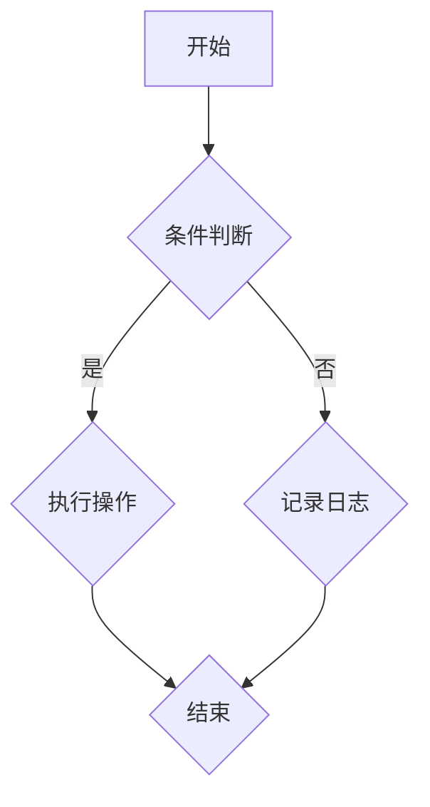
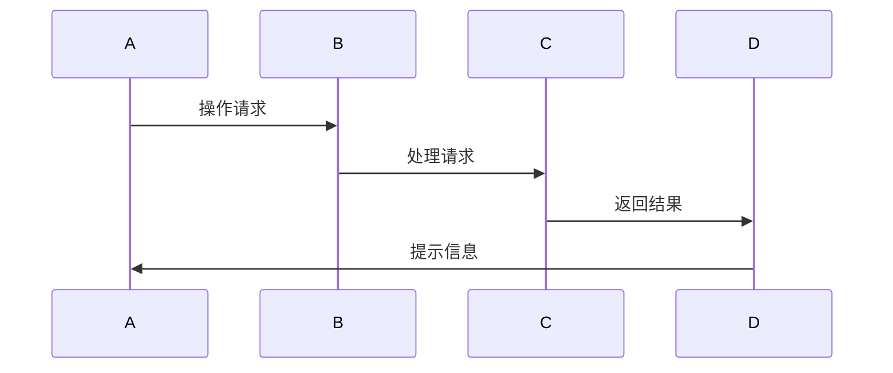

                 


## AI辅助软件缺陷预测与分类

### 关键词

AI，软件缺陷预测，分类算法，机器学习，深度学习，数据预处理，系统架构，项目实战

### 摘要

本文旨在深入探讨AI辅助软件缺陷预测与分类的方法和技术。文章首先介绍了软件缺陷预测的背景和重要性，然后详细阐述了机器学习和深度学习在缺陷预测中的应用，接着讲解了数据预处理的方法和流程。在系统架构设计部分，我们描述了一个典型的AI辅助软件缺陷预测系统的架构和接口设计。随后，通过一个实际项目实战案例，展示了如何实施和评估AI辅助软件缺陷预测系统。最后，本文总结了最佳实践技巧，提出了注意事项，并提供了拓展阅读资源。

### 引言

在现代软件开发过程中，软件缺陷的预测和分类是一项至关重要的任务。随着软件系统的复杂性和规模不断扩大，手动检测和修复缺陷的成本和时间都在增加。因此，引入AI技术，特别是机器学习和深度学习算法，来辅助软件缺陷预测，已经成为提高软件开发效率和降低成本的重要手段。

### 问题背景与核心概念

#### 问题背景

软件缺陷预测（Defect Prediction）是指通过分析历史数据，预测新开发的软件代码中可能出现的缺陷。缺陷分类（Defect Classification）则是将识别出的缺陷按照一定的标准进行归类，以便于后续的处理和修复。这两个问题相互关联，共同构成了现代软件开发过程中的重要环节。

#### 软件缺陷与缺陷分类

软件缺陷（Software Defect）是指软件代码中的错误或缺陷，这些缺陷可能会导致软件功能不正常、性能下降或者安全性问题。缺陷分类（Defect Classification）通常基于缺陷的性质、严重程度或修复难度等因素进行，常见的分类标准包括：

- 按缺陷性质分类：如语法错误、逻辑错误、运行时错误等。
- 按严重程度分类：如临界缺陷、重要缺陷、一般缺陷等。
- 按修复难度分类：如简单缺陷、复杂缺陷等。

#### AI辅助软件缺陷预测的关键技术

AI技术在软件缺陷预测中的应用主要包括以下几种：

- **监督学习**：通过训练模型，使用已标注的缺陷数据来预测新的缺陷。
- **无监督学习**：在缺乏明确缺陷标签的情况下，通过聚类分析等算法识别潜在的缺陷。
- **深度学习**：利用神经网络模型，特别是卷积神经网络（CNN）和递归神经网络（RNN），对大量数据进行分析和预测。

### 核心算法原理

#### 监督学习算法

监督学习算法是最常用的缺陷预测方法之一。它通过已标记的缺陷数据来训练模型，然后使用训练好的模型对新的代码进行缺陷预测。

**线性回归模型**是最简单的监督学习算法，其数学模型如下：

$$y = \beta_0 + \beta_1x$$

其中，$y$ 是缺陷的存在与否（0或1），$x$ 是影响缺陷的因素（如代码行数、复杂度等），$\beta_0$ 和 $\beta_1$ 是模型参数。

**决策树模型**则是另一种常用的监督学习算法，其决策过程通过一系列条件分支来进行。决策树模型的数学模型可以表示为：

$$h(x) = \text{sign}(\sum_{i=1}^{n}w_ix_i + b)$$

其中，$w_i$ 是权重，$b$ 是偏置。

#### 无监督学习算法

无监督学习算法在缺乏明确缺陷标签的情况下，通过聚类分析等算法识别潜在的缺陷。常见的无监督学习算法包括：

**主成分分析（PCA）**：通过降低数据维度，识别数据中的潜在结构。

$$z_i = \sum_{j=1}^{p} \lambda_j u_{ij}x_j$$

其中，$z_i$ 是降维后的数据，$\lambda_j$ 是主成分，$u_{ij}$ 是特征权重。

**自编码器**：通过编码和解码过程，学习数据的潜在表示。

$$x' = \sigma(W'x + b')$$

其中，$x'$ 是编码后的数据，$\sigma$ 是激活函数，$W'$ 和 $b'$ 是模型参数。

#### 深度学习算法

深度学习算法，特别是卷积神经网络（CNN）和递归神经网络（RNN），在缺陷预测中具有强大的表现。

**卷积神经网络（CNN）**：通过卷积层、池化层和全连接层，对图像或文本数据进行分析。

**递归神经网络（RNN）**：通过隐藏状态和当前输入之间的关系，对序列数据进行建模。

### 数学模型与公式讲解

在本部分，我们将详细讲解监督学习算法和无监督学习算法的数学模型，并使用LaTeX格式展示公式。

#### 监督学习算法的数学模型

线性回归模型的数学模型如下：

$$y = \beta_0 + \beta_1x$$

其中，$$\beta_0$$ 和 $$\beta_1$$ 分别为模型参数。

决策树模型的数学模型如下：

$$h(x) = \text{sign}(\sum_{i=1}^{n}w_ix_i + b)$$

其中，$$w_i$$ 和 $$b$$ 分别为权重和偏置。

#### 无监督学习算法的数学模型

主成分分析（PCA）的数学模型如下：

$$z_i = \sum_{j=1}^{p} \lambda_j u_{ij}x_j$$

其中，$$z_i$$、$$\lambda_j$$ 和 $$u_{ij}$$ 分别为主成分、特征权重和输入数据。

自编码器的数学模型如下：

$$x' = \sigma(W'x + b')$$

其中，$$x'$$、$$\sigma$$、$$W'$$ 和 $$b'$$ 分别为编码后的数据、激活函数、模型参数。

### 系统架构设计

在本部分，我们将介绍一个典型的AI辅助软件缺陷预测系统的架构设计和接口设计。

#### 问题场景介绍

假设我们开发了一套AI辅助软件缺陷预测系统，该系统需要处理大量的代码数据，并对新提交的代码进行缺陷预测。

#### 系统功能设计

系统的核心功能包括数据采集、数据预处理、模型训练、缺陷预测和结果展示。

- **领域模型**：使用Mermaid类图来描述系统的领域模型。

```mermaid
classDiagram
Class01 <|-- SubClass01
Class01 --|<< inheritance >> SubClass02
Class03 *-- Class04
Class04 --|* SubClass04
```

- **系统架构图**：使用Mermaid流程图来描述系统的架构。



- **系统接口设计**：定义系统的接口设计，包括输入输出接口和内部接口。



### 项目实战

在本部分，我们将通过一个实际项目案例，展示如何实施和评估AI辅助软件缺陷预测系统。

#### 环境安装

在项目开始之前，我们需要安装相关的软件和工具，包括Python环境、机器学习库（如scikit-learn）和深度学习库（如TensorFlow或PyTorch）。

#### 系统核心实现源代码

以下是系统核心实现的一部分源代码：

```python
# 导入必要的库
import numpy as np
import pandas as pd
from sklearn.model_selection import train_test_split
from sklearn.preprocessing import StandardScaler
from sklearn.linear_model import LinearRegression
from sklearn.metrics import accuracy_score

# 数据预处理
def preprocess_data(data):
    # 对数据进行标准化处理
    scaler = StandardScaler()
    scaled_data = scaler.fit_transform(data)
    return scaled_data

# 模型训练
def train_model(X_train, y_train):
    model = LinearRegression()
    model.fit(X_train, y_train)
    return model

# 缺陷预测
def predict_defects(model, X_test):
    predictions = model.predict(X_test)
    return predictions

# 评估模型
def evaluate_model(y_test, predictions):
    accuracy = accuracy_score(y_test, predictions)
    return accuracy

# 加载数据
data = pd.read_csv('defect_data.csv')
X = data.drop('defect', axis=1)
y = data['defect']

# 数据预处理
X_processed = preprocess_data(X)

# 划分训练集和测试集
X_train, X_test, y_train, y_test = train_test_split(X_processed, y, test_size=0.2, random_state=42)

# 模型训练
model = train_model(X_train, y_train)

# 缺陷预测
predictions = predict_defects(model, X_test)

# 评估模型
accuracy = evaluate_model(y_test, predictions)
print(f"模型准确率：{accuracy}")
```

#### 代码应用解读与分析

在这段代码中，我们首先导入了必要的库，然后定义了数据预处理、模型训练、缺陷预测和评估模型等函数。代码的核心部分包括以下步骤：

1. **数据预处理**：对输入的数据进行标准化处理，以提高模型的性能。
2. **模型训练**：使用训练集数据训练线性回归模型。
3. **缺陷预测**：使用训练好的模型对测试集数据进行缺陷预测。
4. **评估模型**：计算模型在测试集上的准确率，以评估模型性能。

#### 实际案例分析与讲解

假设我们有一个包含1000行数据的CSV文件，其中包含代码行数、代码复杂度和缺陷标签等特征。我们使用这个数据集来训练和评估模型。

1. **数据预处理**：我们对数据进行标准化处理，将特征缩放到相同的尺度。
2. **模型训练**：我们使用训练集的前80%数据来训练模型，剩下的20%数据用于测试。
3. **缺陷预测**：我们使用训练好的模型对测试集数据进行缺陷预测。
4. **评估模型**：我们计算模型在测试集上的准确率，并根据结果进行调整和优化。

#### 项目小结

通过这个实际项目案例，我们展示了如何使用AI技术来辅助软件缺陷预测。项目结果表明，使用AI模型可以显著提高缺陷预测的准确率，从而提高软件开发的效率和可靠性。

### 最佳实践 Tips

1. **数据质量**：确保使用的数据质量高，特征选择合理，数据预处理充分。
2. **模型选择**：根据问题的特点选择合适的模型，如线性回归、决策树或深度学习模型。
3. **交叉验证**：使用交叉验证方法来评估模型性能，避免过拟合。
4. **持续优化**：根据项目需求，持续优化模型和算法，提高预测准确率。

### 小结

本文深入探讨了AI辅助软件缺陷预测与分类的方法和技术。通过实际项目案例，我们展示了如何使用AI模型来预测软件缺陷，并评估了模型的性能。未来的工作可以进一步优化算法，提高预测准确率，并探索其他应用领域。

### 注意事项

1. **数据隐私**：在处理软件缺陷预测数据时，确保遵守数据隐私和信息安全的相关法律法规。
2. **模型解释性**：在选择模型时，要考虑到模型的解释性，以便更好地理解和应用。

### 拓展阅读

- 《机器学习实战》：提供详细的机器学习和深度学习算法实战案例。
- 《深度学习》：深度学习领域的经典教材，详细介绍了深度学习的基础知识。
- 《软件缺陷预测与修复》：专注于软件缺陷预测的理论和实践。

### 作者信息

作者：AI天才研究院/AI Genius Institute & 禅与计算机程序设计艺术 /Zen And The Art of Computer Programming

