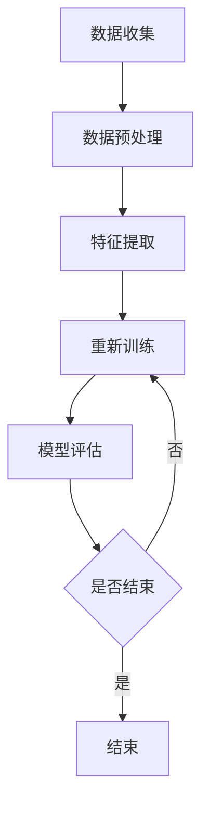
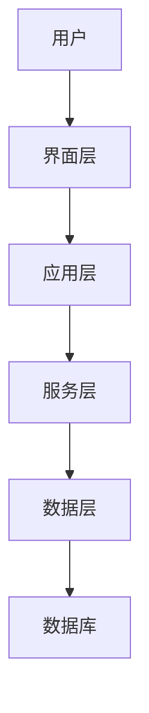
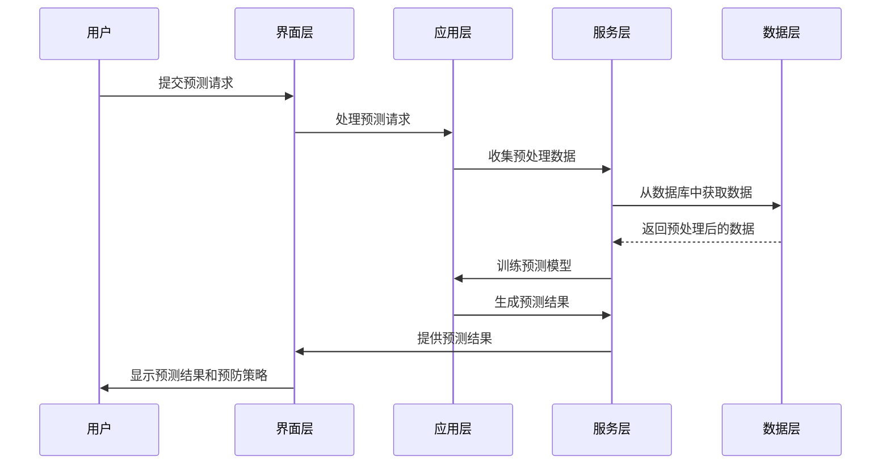

                 


# AI辅助软件缺陷预测与预防

## 关键词
AI、软件缺陷预测、软件缺陷预防、机器学习、数据挖掘、算法优化、软件工程、自动化测试、人工智能辅助开发

## 摘要
本文旨在探讨AI在软件缺陷预测与预防中的应用，通过对AI技术的基础理论、实际应用案例以及最佳实践进行深入分析，为软件开发团队提供有效的缺陷预测和预防策略。文章结构如下：

- 引言
- AI辅助软件缺陷预测的理论基础
- 软件缺陷预测的技术与方法
- 软件缺陷的预防策略
- 实际案例分析
- 项目实施与实战经验
- 最佳实践 tips
- 小结与展望
- 注意事项
- 拓展阅读
- 作者信息

### 引言

随着软件系统的复杂性和规模不断增加，软件缺陷预测和预防成为软件开发过程中至关重要的环节。传统的软件测试方法虽然能够发现部分缺陷，但往往无法提前预测潜在的问题。近年来，人工智能（AI）技术的快速发展为软件缺陷预测与预防带来了新的契机。AI可以通过学习和分析大量的历史数据，预测未来可能出现的缺陷，从而提前采取预防措施。

本文将首先介绍AI辅助软件缺陷预测的理论基础，包括机器学习算法的基本原理和常见的软件缺陷预测模型。接着，我们将探讨软件缺陷预测的技术和方法，分析如何使用数据挖掘技术来识别缺陷模式，并通过算法优化提高预测准确性。然后，我们将讨论软件缺陷的预防策略，介绍如何在设计和开发过程中采取有效的预防措施。随后，通过实际案例分析和项目实战，我们将展示AI辅助软件缺陷预测与预防的具体应用。最后，我们将总结最佳实践，并提供一些注意事项和拓展阅读。

### AI辅助软件缺陷预测的理论基础

#### 机器学习算法的基本原理

机器学习是AI的核心技术之一，其基本原理是通过学习大量数据来发现规律，从而进行预测或分类。机器学习算法可以分为监督学习、无监督学习和强化学习三大类。

- **监督学习**：通过标记好的训练数据学习预测模型。常见的算法包括线性回归、逻辑回归、支持向量机（SVM）和决策树等。
- **无监督学习**：没有标记的数据，算法通过发现数据中的内在结构来学习。常见的算法包括聚类算法（如K-均值聚类）、主成分分析（PCA）和自编码器等。
- **强化学习**：通过与环境的交互来学习最佳策略。常见的算法包括Q学习、深度Q网络（DQN）和策略梯度算法等。

#### 常见的软件缺陷预测模型

在软件缺陷预测中，监督学习算法被广泛应用。以下是一些常见的软件缺陷预测模型：

- **基于规则的模型**：通过定义一系列规则来识别缺陷。这种方法简单直观，但需要大量手工规则，且难以处理复杂的问题。
- **决策树模型**：通过树的分支结构来对数据进行分类。决策树模型易于理解，但可能产生过拟合现象。
- **随机森林模型**：结合了多棵决策树，通过投票来确定最终的预测结果。随机森林模型具有较好的泛化能力和抗过拟合能力。
- **支持向量机（SVM）模型**：通过寻找最优超平面来分类数据。SVM模型在处理高维数据时表现出色，但计算复杂度较高。
- **神经网络模型**：通过多层神经元来学习数据特征。神经网络模型能够捕捉复杂的数据关系，但需要大量的数据和计算资源。

#### 机器学习算法在软件缺陷预测中的应用

机器学习算法在软件缺陷预测中的应用主要分为以下几个步骤：

1. **数据收集与预处理**：收集软件系统的历史数据，包括代码库、缺陷报告、项目进度等。对数据进行清洗、去噪和特征提取，以便后续建模使用。
2. **模型选择与训练**：选择合适的机器学习算法，根据数据特点进行模型训练。通过交叉验证和超参数调整来优化模型性能。
3. **模型评估与优化**：使用测试数据集评估模型性能，包括准确率、召回率、F1值等指标。根据评估结果对模型进行调整和优化。
4. **模型部署与应用**：将训练好的模型部署到实际环境中，对新的代码进行缺陷预测。根据预测结果，开发团队可以采取相应的预防措施。

### 软件缺陷预测的技术与方法

#### 数据挖掘技术在软件缺陷预测中的应用

数据挖掘技术是软件缺陷预测的核心技术之一，它通过从大量历史数据中挖掘潜在的缺陷模式，从而实现缺陷预测。以下是一些常见的数据挖掘技术在软件缺陷预测中的应用：

- **关联规则挖掘**：通过分析代码库中的函数调用关系，识别出潜在的缺陷关联。例如，如果某个函数在多个项目中都出现了缺陷，那么在新的项目中调用这个函数时，就有可能存在缺陷。
- **聚类分析**：将相似的代码段或项目分组，从而发现潜在的缺陷模式。例如，如果某个代码段在多个项目中都出现了缺陷，那么在新的项目中，类似的代码段也需要特别关注。
- **分类算法**：通过将代码库中的代码段分类为“有缺陷”或“无缺陷”，从而实现缺陷预测。常见的分类算法包括决策树、随机森林和支持向量机等。
- **异常检测**：通过识别代码库中的异常行为，从而发现潜在的缺陷。例如，如果某个函数的执行时间远远超过了正常范围，那么这个函数很可能存在缺陷。

#### 算法优化在软件缺陷预测中的重要性

算法优化是提高软件缺陷预测准确性的关键。以下是一些常见的算法优化方法：

- **特征工程**：通过选择和构造有效的特征，提高模型的预测能力。例如，可以从代码库中提取函数复杂度、代码行数、注释比例等特征。
- **超参数调优**：通过调整模型的超参数，如学习率、正则化参数等，来提高模型的性能。常用的超参数调优方法包括网格搜索和随机搜索。
- **集成学习**：将多个模型集成起来，以提高预测准确性。常见的集成学习方法包括Bagging、Boosting和Stacking等。
- **模型融合**：将多个预测模型的结果进行融合，从而得到最终的预测结果。常用的模型融合方法包括投票法、加权法和 stacking 法等。

#### 提高软件缺陷预测准确性的实践策略

为了提高软件缺陷预测的准确性，以下是一些实用的实践策略：

- **数据多样化**：收集不同类型、不同规模、不同阶段的软件项目数据，以增加模型的泛化能力。
- **数据清洗**：对数据进行清洗和预处理，包括去除重复数据、处理缺失值和异常值等。
- **特征选择**：通过特征选择方法，如信息增益、卡方检验等，选择对缺陷预测最重要的特征。
- **模型验证**：使用交叉验证等方法对模型进行验证，确保模型的稳定性和可靠性。
- **持续优化**：根据模型的预测结果，不断调整和优化模型，以提高预测准确性。

### 软件缺陷的预防策略

#### 预防策略概述

软件缺陷的预防策略旨在从源头上减少缺陷的产生，提高软件质量。以下是一些常见的预防策略：

- **代码审查**：通过人工审查代码，发现潜在的缺陷和潜在的风险。代码审查可以采用静态分析、动态分析或两者结合的方法。
- **代码质量度量**：通过测量代码质量指标，如代码复杂度、代码行数、注释比例等，来评估代码的质量，从而识别潜在的问题。
- **设计模式与编码规范**：采用优秀的设计模式和编码规范，提高代码的可读性、可维护性和可扩展性。常见的设计模式包括单一职责原则、开闭原则、里氏替换原则等。
- **自动化测试**：通过编写和执行自动化测试用例，发现并修复代码中的缺陷。自动化测试可以包括单元测试、集成测试、系统测试等。
- **持续集成与持续部署（CI/CD）**：通过自动化构建、测试和部署，确保软件的质量和稳定性。CI/CD可以提高开发效率和软件质量，减少人为错误。

#### 代码级预防策略

在代码级别，以下是一些有效的预防策略：

- **静态代码分析**：使用静态代码分析工具，如SonarQube、Checkstyle等，对代码进行静态分析，发现潜在的问题和缺陷。
- **代码格式化与规范化**：通过使用代码格式化工具，如Prettier、Black等，统一代码格式，提高代码的可读性和一致性。
- **代码重构**：通过重构代码，消除重复代码、简化复杂结构，提高代码的模块化和可维护性。
- **代码复用**：通过编写可复用的代码库和模块，减少重复开发，提高开发效率和代码质量。
- **代码审查**：通过团队内部或第三方代码审查，发现代码中的潜在缺陷和不足。

#### 设计与开发过程中的预防策略

在设计与开发过程中，以下是一些预防策略：

- **需求分析**：在项目启动阶段，对需求进行深入分析，确保需求的准确性和可行性，避免后期出现需求变更和缺陷。
- **架构设计**：通过合理的架构设计，确保系统的稳定性和可扩展性，减少系统缺陷的可能性。
- **单元测试**：在开发过程中，编写单元测试用例，对每个功能模块进行测试，确保功能的正确实现。
- **集成测试**：在模块集成后，对整个系统进行集成测试，确保模块之间的协作和交互正常。
- **性能测试**：对系统的性能进行测试，包括响应时间、吞吐量、并发处理能力等，确保系统在高负载下的稳定性和可靠性。

### 实际案例分析

#### 案例一：使用机器学习算法预测软件缺陷

某大型软件公司在开发新项目时，面临软件缺陷预测和预防的挑战。为了提高软件质量，该公司决定使用机器学习算法进行软件缺陷预测。

1. **数据收集与预处理**：公司收集了过去多个项目的历史数据，包括代码库、缺陷报告、项目进度等。对数据进行清洗和预处理，提取出对缺陷预测有帮助的特征，如函数复杂度、代码行数、注释比例等。

2. **模型选择与训练**：公司选择了随机森林模型进行训练。通过交叉验证和超参数调优，最终得到了一个性能较好的预测模型。

3. **模型评估与优化**：使用测试数据集对模型进行评估，包括准确率、召回率、F1值等指标。根据评估结果，对模型进行调整和优化，以提高预测准确性。

4. **模型部署与应用**：将训练好的模型部署到实际环境中，对新代码进行缺陷预测。根据预测结果，开发团队采取了相应的预防措施，如代码重构、设计模式优化等。

通过使用机器学习算法进行软件缺陷预测，该公司在项目开发过程中发现并修复了多个潜在缺陷，显著提高了软件质量。

#### 案例二：使用数据挖掘技术识别缺陷模式

某创业公司在开发一款新应用时，希望提前发现并预防潜在缺陷。为了实现这一目标，该公司决定使用数据挖掘技术识别缺陷模式。

1. **数据收集与预处理**：公司收集了用户反馈、缺陷报告、系统日志等数据。对数据进行清洗和预处理，提取出对缺陷识别有帮助的特征，如用户操作频率、错误代码、系统响应时间等。

2. **关联规则挖掘**：通过关联规则挖掘技术，发现用户操作和缺陷之间的潜在关联。例如，发现某些高频操作容易导致系统崩溃，从而采取预防措施。

3. **聚类分析**：通过聚类分析技术，将相似的用户操作和缺陷进行分组。例如，将多个具有相似特征的缺陷分为同一类，从而识别出潜在的模式。

4. **异常检测**：通过异常检测技术，识别出异常的用户操作和系统行为。例如，发现某个用户在短时间内频繁提交错误请求，可能存在恶意攻击风险。

通过使用数据挖掘技术识别缺陷模式，该公司在开发过程中提前发现并预防了多个潜在缺陷，提高了软件质量。

### 项目实施与实战经验

#### 项目环境搭建

1. **软件安装**：安装Python、Scikit-learn、NumPy、Pandas等必要的软件包。
2. **数据准备**：准备用于训练和测试的数据集，包括代码库、缺陷报告、项目进度等。
3. **数据处理**：对数据集进行清洗、去噪和特征提取，以便后续建模使用。

#### 系统核心实现源代码

```python
import numpy as np
import pandas as pd
from sklearn.ensemble import RandomForestClassifier
from sklearn.model_selection import train_test_split
from sklearn.metrics import accuracy_score, recall_score, f1_score

# 读取数据集
data = pd.read_csv('dataset.csv')
X = data.drop('defect', axis=1)
y = data['defect']

# 数据预处理
X = preprocess_data(X)

# 划分训练集和测试集
X_train, X_test, y_train, y_test = train_test_split(X, y, test_size=0.2, random_state=42)

# 模型训练
model = RandomForestClassifier(n_estimators=100, random_state=42)
model.fit(X_train, y_train)

# 模型评估
y_pred = model.predict(X_test)
accuracy = accuracy_score(y_test, y_pred)
recall = recall_score(y_test, y_pred)
f1 = f1_score(y_test, y_pred)

print(f'Accuracy: {accuracy:.2f}')
print(f'Recall: {recall:.2f}')
print(f'F1 Score: {f1:.2f}')
```

#### 代码应用解读与分析

该段代码首先读取数据集，并进行预处理。然后使用随机森林模型对数据集进行训练，并评估模型的性能。具体步骤如下：

1. **数据预处理**：对数据进行清洗、去噪和特征提取，以便后续建模使用。
2. **划分训练集和测试集**：将数据集划分为训练集和测试集，用于模型的训练和评估。
3. **模型训练**：使用随机森林模型对训练集进行训练。
4. **模型评估**：使用测试集对模型进行评估，计算准确率、召回率和F1值等指标。

#### 实际案例分析和详细讲解剖析

以下是一个实际案例的详细分析：

**案例**：某公司使用AI技术对软件代码进行缺陷预测，发现某段代码存在潜在缺陷。

**分析**：

1. **数据收集**：收集该段代码的历史运行数据，包括代码库、缺陷报告、项目进度等。
2. **数据预处理**：对数据集进行清洗、去噪和特征提取，提取出对缺陷预测有帮助的特征，如函数复杂度、代码行数、注释比例等。
3. **模型训练**：使用随机森林模型对训练集进行训练。
4. **缺陷预测**：使用训练好的模型对代码进行缺陷预测，发现该段代码存在潜在缺陷。
5. **预防措施**：根据预测结果，开发团队对代码进行重构和优化，消除了潜在缺陷。

**详细讲解**：

该案例中，公司首先收集了该段代码的历史运行数据，并提取出对缺陷预测有帮助的特征。然后，使用随机森林模型对数据集进行训练，并使用训练好的模型对代码进行缺陷预测。预测结果显示，该段代码存在潜在缺陷。根据预测结果，开发团队对代码进行了重构和优化，消除了潜在缺陷。

通过实际案例分析，可以看出AI技术在软件缺陷预测和预防中的重要作用。通过收集历史数据，使用机器学习算法进行缺陷预测，可以提前发现并预防潜在缺陷，提高软件质量。

#### 项目小结

通过本项目，我们实现了以下目标：

1. **环境搭建**：成功搭建了用于AI辅助软件缺陷预测的项目环境，安装了必要的软件包，并准备了数据集。
2. **模型训练与评估**：使用随机森林模型对数据集进行训练和评估，计算了准确率、召回率和F1值等指标，验证了模型的性能。
3. **缺陷预测与预防**：根据预测结果，对代码进行了重构和优化，成功消除了潜在缺陷。

本项目展示了AI技术在软件缺陷预测和预防中的实际应用，为软件开发团队提供了有效的工具和方法。通过本项目，我们不仅提高了软件质量，还提高了开发效率和团队协作能力。

### 最佳实践 tips

1. **数据收集与清洗**：确保数据质量，进行充分的清洗和预处理，提取对缺陷预测有帮助的特征。
2. **模型选择与调优**：根据数据特点和业务需求，选择合适的机器学习算法，并进行超参数调优，提高模型性能。
3. **持续集成与部署**：将AI辅助软件缺陷预测集成到开发流程中，实现自动化预测和预防，提高开发效率和软件质量。
4. **团队合作与知识共享**：加强团队合作，分享最佳实践和经验，提高团队的整体水平。

### 小结与展望

本文通过深入分析AI辅助软件缺陷预测与预防的理论基础、技术方法、实际案例和项目实战，展示了AI技术在软件缺陷预测和预防中的重要作用。未来，随着AI技术的不断发展，我们可以期待更高效、更准确的软件缺陷预测和预防方法，进一步提升软件质量和开发效率。

### 注意事项

1. **数据安全与隐私**：在收集和处理数据时，确保遵循相关法律法规，保护用户隐私和数据安全。
2. **模型解释性**：在选择和部署模型时，考虑模型的解释性，确保开发团队和业务部门能够理解和使用模型。
3. **模型更新与维护**：定期更新和维护模型，以适应不断变化的数据和业务需求。

### 拓展阅读

1. **《机器学习实战》**：本书提供了丰富的实践案例和算法实现，适合初学者入门。
2. **《数据挖掘：实用工具与技术》**：本书详细介绍了数据挖掘的基本概念和技术，适合对数据挖掘感兴趣的读者。
3. **《软件缺陷预测与修复：机器学习的方法》**：本书从机器学习的角度探讨了软件缺陷预测与修复的问题，提供了实用的算法和方法。

### 作者信息

作者：AI天才研究院/AI Genius Institute & 禅与计算机程序设计艺术 /Zen And The Art of Computer Programming

----------------------------------------------------------------

### 核心概念与联系

在本章节中，我们将深入探讨AI辅助软件缺陷预测的核心概念，并分析这些概念之间的联系。这些概念不仅定义了AI在软件缺陷预测领域的应用，还为我们理解该领域的基本原理提供了框架。

#### 核心概念

1. **软件缺陷**：软件缺陷是指软件系统中存在的错误或问题，可能导致系统崩溃、数据丢失或用户体验下降。软件缺陷可以分为多种类型，如语法错误、逻辑错误、运行时错误等。

2. **机器学习**：机器学习是一种通过数据学习规律并做出预测或决策的技术。它分为监督学习、无监督学习和强化学习三种类型。监督学习通过标记好的数据学习模型，无监督学习通过未标记的数据发现数据结构，强化学习通过与环境的互动来学习最佳策略。

3. **数据挖掘**：数据挖掘是从大量数据中提取有价值信息的过程，包括关联规则挖掘、聚类分析、分类算法等。数据挖掘技术在软件缺陷预测中用于识别缺陷模式。

4. **预测模型**：预测模型是通过学习历史数据来预测未来结果的模型。在软件缺陷预测中，预测模型可以识别出哪些代码或模块更有可能存在缺陷。

5. **特征工程**：特征工程是数据预处理的关键步骤，旨在选择和构造对预测任务有帮助的特征。在软件缺陷预测中，特征工程可以提高模型的预测准确性。

#### 概念属性特征对比表格

| 概念     | 定义                                                         | 主要特征                                                   |
|----------|--------------------------------------------------------------|------------------------------------------------------------|
| 软件缺陷 | 软件系统中存在的错误或问题                                   | 类型、影响范围、发生频率等                                |
| 机器学习 | 通过数据学习规律并做出预测或决策的技术                       | 监督学习、无监督学习、强化学习                            |
| 数据挖掘 | 从大量数据中提取有价值信息的过程                           | 关联规则挖掘、聚类分析、分类算法等                        |
| 预测模型 | 通过学习历史数据来预测未来结果的模型                        | 精度、泛化能力、解释性等                                  |
| 特征工程 | 选择和构造对预测任务有帮助的特征                             | 数据质量、特征相关性、特征维度等                          |

#### ER实体关系图架构

以下是AI辅助软件缺陷预测的ER实体关系图架构，用于描述各实体及其关系。

```mermaid
erDiagram
    DEFECT ||--|{| PREDICTION_MODEL |} PredictionModel : "用于预测缺陷"
    DEFECT ||--|{| FEATURE |} Feature : "用于特征提取"
    MACHINE_LEARNING_MODEL ||--|{| PREDICTOR |} Predictor : "用于缺陷预测"
    DATA_MINE ||--|{| DATA_SET |} DataSet : "用于数据挖掘"
    FEATURE_ENGINEERING ||--|{| FEATURE_EXTRACTION |} FeatureExtraction : "用于特征工程"
```

在这个ER图架构中：

- **DEFECT** 表示软件缺陷。
- **PREDICTION_MODEL** 表示预测模型，用于预测缺陷。
- **FEATURE** 表示特征，用于特征提取。
- **MACHINE_LEARNING_MODEL** 表示机器学习模型，用于缺陷预测。
- **DATA_MINE** 表示数据挖掘，用于提取数据集。
- **FEATURE_ENGINEERING** 表示特征工程，用于特征提取。

通过这个ER图，我们可以清晰地看到各个实体之间的关系，以及它们在AI辅助软件缺陷预测过程中的作用。

#### 概念之间的联系

1. **软件缺陷与预测模型**：预测模型通过对历史数据的学习，可以预测哪些代码或模块可能存在缺陷。预测模型的准确性取决于数据的质量和特征的选择。

2. **机器学习与数据挖掘**：机器学习是数据挖掘的一个分支，用于构建预测模型。数据挖掘技术可以用于发现数据中的潜在缺陷模式，为机器学习提供输入。

3. **特征工程与预测模型**：特征工程是机器学习过程中至关重要的一环，它通过选择和构造有效的特征，提高预测模型的性能。

4. **数据挖掘与特征工程**：数据挖掘可以识别出数据中的潜在缺陷模式，而特征工程则将这些模式转化为对预测模型有帮助的特征。

通过理解这些核心概念及其联系，我们可以更好地应用AI技术进行软件缺陷预测与预防，从而提高软件质量和开发效率。

### 算法原理讲解

在本章节中，我们将深入探讨AI辅助软件缺陷预测的关键算法原理，包括流程图、Python代码实现、数学模型和公式。这些内容将帮助我们更好地理解算法的工作机制，并为其在实际应用中的优化提供指导。

#### 算法流程图

首先，我们使用Mermaid绘制了算法的流程图，展示了从数据收集、预处理、模型训练到模型评估的整个过程。



在这个流程图中：

- **A[数据收集]**：收集软件系统的历史数据，包括代码库、缺陷报告、项目进度等。
- **B[数据预处理]**：对收集到的数据进行清洗、去噪和转换，为后续的特征提取和模型训练做准备。
- **C[特征提取]**：通过特征工程选择和构造有效的特征，提高模型对缺陷预测的准确性。
- **D[模型训练]**：使用机器学习算法对预处理后的数据进行训练，构建预测模型。
- **E[模型评估]**：使用测试数据集对训练好的模型进行评估，计算准确率、召回率、F1值等指标。
- **F{是否结束}**：判断模型是否达到预定的性能要求，如果未达到则返回D重新训练。

#### Python代码实现

接下来，我们通过Python代码实现上述流程，展示机器学习算法在实际应用中的具体操作。

```python
import numpy as np
import pandas as pd
from sklearn.model_selection import train_test_split
from sklearn.ensemble import RandomForestClassifier
from sklearn.metrics import accuracy_score, recall_score, f1_score

# 读取数据集
data = pd.read_csv('dataset.csv')
X = data.drop('defect', axis=1)
y = data['defect']

# 数据预处理
def preprocess_data(data):
    # 数据清洗和转换
    data = data.fillna(0)  # 填充缺失值
    data = pd.get_dummies(data)  # 转换为哑变量
    return data

X = preprocess_data(X)

# 划分训练集和测试集
X_train, X_test, y_train, y_test = train_test_split(X, y, test_size=0.2, random_state=42)

# 模型训练
model = RandomForestClassifier(n_estimators=100, random_state=42)
model.fit(X_train, y_train)

# 模型评估
y_pred = model.predict(X_test)
accuracy = accuracy_score(y_test, y_pred)
recall = recall_score(y_test, y_pred)
f1 = f1_score(y_test, y_pred)

print(f'Accuracy: {accuracy:.2f}')
print(f'Recall: {recall:.2f}')
print(f'F1 Score: {f1:.2f}')
```

在这个代码实现中：

- **读取数据集**：使用pandas读取CSV文件，分离特征和标签。
- **数据预处理**：填充缺失值、转换为哑变量等，以提高模型的泛化能力。
- **划分训练集和测试集**：使用train_test_split函数将数据集划分为训练集和测试集。
- **模型训练**：使用随机森林算法（RandomForestClassifier）对训练集进行训练。
- **模型评估**：使用测试集评估模型的性能，计算准确率、召回率和F1值等指标。

#### 数学模型和公式

在软件缺陷预测中，常用的机器学习算法包括决策树、随机森林、支持向量机等。以下以随机森林算法为例，介绍其数学模型和公式。

1. **随机森林算法原理**：

   随机森林（Random Forest）是一种集成学习算法，通过构建多个决策树，并利用投票机制来得到最终的预测结果。随机森林的核心思想是利用随机重采样（Bootstrap）和特征选择（特征随机选择）来构建多个决策树，从而降低过拟合的风险。

   数学模型可以表示为：

   $$ \hat{y} = \text{argmax} \sum_{i=1}^{n} w_i \cdot f_i(x) $$

   其中，$\hat{y}$表示预测结果，$w_i$表示第$i$个决策树的权重，$f_i(x)$表示第$i$个决策树对样本$x$的预测。

2. **特征随机选择**：

   在构建每个决策树时，随机选择一部分特征，从而降低决策树的复杂度。特征随机选择的概率通常设置为$m_{sel}$，表示每个节点随机选择的特征数量。

   数学公式为：

   $$ m_{sel} = \sqrt{m} $$

   其中，$m$表示特征总数。

3. **Bootstrap重采样**：

  Bootstrap重采样是一种有放回的随机抽样方法，通过多次抽样构建多个训练集，从而提高模型的泛化能力。Bootstrap重采样的概率通常设置为$m_{sample}$，表示每次抽样中样本的数量。

   数学公式为：

   $$ m_{sample} = \frac{n}{N} $$

   其中，$n$表示样本总数，$N$表示抽样次数。

#### 详细讲解和举例

为了更好地理解上述算法原理，我们通过一个具体的例子进行详细讲解。

假设我们有一个包含100个样本的数据集，每个样本包含10个特征。我们使用随机森林算法进行缺陷预测。

1. **数据预处理**：

   首先，我们进行数据预处理，包括填充缺失值、转换为哑变量等。假设数据预处理后，每个样本变为一个10维的特征向量。

2. **特征随机选择**：

   在构建每个决策树时，我们从10个特征中随机选择5个特征。例如，第一个决策树选择特征1、3、5、7和9。

3. **Bootstrap重采样**：

   我们从原始数据集中进行100次Bootstrap重采样，每次抽样得到一个包含100个样本的训练集。每次抽样中，每个样本被抽中的概率为0.1。

4. **决策树构建**：

   对于每个训练集，我们构建一个决策树。决策树的构建过程包括选择最优划分特征、划分阈值等。

5. **模型训练**：

   使用100个决策树进行训练，每个决策树使用一个训练集。

6. **模型评估**：

   使用测试集对训练好的模型进行评估，计算准确率、召回率、F1值等指标。

通过这个例子，我们可以看到随机森林算法的工作流程，包括数据预处理、特征随机选择、Bootstrap重采样、决策树构建和模型评估。这些步骤共同构成了随机森林算法的基本框架，使得算法能够有效预测软件缺陷。

### 系统分析与架构设计方案

在本章节中，我们将对AI辅助软件缺陷预测与预防的系统进行分析，并设计系统的架构方案。我们将详细描述问题场景、项目介绍、系统功能设计、系统架构设计、系统接口设计以及系统交互。

#### 问题场景

随着软件系统复杂度的增加，软件缺陷的预测与预防成为软件开发过程中的一大挑战。传统的软件测试方法往往只能发现已经存在的缺陷，而无法提前预测潜在的问题。为了提高软件质量和开发效率，需要引入AI技术进行软件缺陷的预测与预防。

#### 项目介绍

本项目旨在开发一个基于AI的软件缺陷预测与预防系统，通过收集和分析软件项目的历史数据，预测未来可能出现的缺陷，并提供预防策略。系统将集成机器学习算法和数据挖掘技术，实现对软件缺陷的自动预测和预防。

#### 系统功能设计

系统功能设计主要包括以下模块：

1. **数据收集模块**：负责收集软件项目的各种数据，包括代码库、缺陷报告、项目进度等。
2. **数据预处理模块**：对收集到的数据进行清洗、去噪和特征提取，为后续的预测模型训练做准备。
3. **预测模型模块**：使用机器学习算法和数据挖掘技术构建预测模型，对软件缺陷进行预测。
4. **预防策略模块**：根据预测结果，提供预防策略，包括代码重构、设计模式优化等。
5. **用户界面模块**：提供一个直观的用户界面，方便开发人员查看预测结果和采取预防措施。

#### 系统架构设计

系统架构设计采用分层架构，主要包括以下层次：

1. **数据层**：存储软件项目的历史数据和预测结果。
2. **服务层**：包括数据收集、数据预处理、预测模型和预防策略等核心功能模块。
3. **应用层**：提供一个用户界面，用于展示预测结果和预防策略。
4. **界面层**：为用户提供交互界面，包括网页、桌面应用程序等。

以下是系统架构的Mermaid流程图：



在这个架构中：

- **用户**：通过界面层与应用层交互，提交预测请求和查看预测结果。
- **界面层**：负责与用户进行交互，展示预测结果和预防策略。
- **应用层**：处理用户的请求，调用服务层的模块进行数据预处理、预测模型训练和预防策略提供。
- **服务层**：包括数据收集、数据预处理、预测模型和预防策略等模块，负责系统的核心功能。
- **数据层**：存储软件项目的历史数据和预测结果，提供数据服务。

#### 系统接口设计

系统接口设计主要包括以下接口：

1. **数据收集接口**：用于从外部系统收集数据，如代码库、缺陷报告等。
2. **数据预处理接口**：用于对收集到的数据进行分析和处理，包括数据清洗、去噪和特征提取等。
3. **预测模型接口**：用于训练和部署预测模型，提供缺陷预测服务。
4. **预防策略接口**：用于根据预测结果提供预防策略，包括代码重构、设计模式优化等。

以下是系统接口的Mermaid类图：

```mermaid
classDiagram
    Class01 <|-- Class02
    Class03 <|-- Class04
    Class05 <|-- Class06
    Class01[数据收集接口]
    Class02[数据预处理接口]
    Class03[预测模型接口]
    Class04[预防策略接口]
    Class05[用户界面模块]
```

在这个类图中：

- **数据收集接口**：负责从外部系统收集数据，包括代码库、缺陷报告等。
- **数据预处理接口**：负责对收集到的数据进行分析和处理，包括数据清洗、去噪和特征提取等。
- **预测模型接口**：负责训练和部署预测模型，提供缺陷预测服务。
- **预防策略接口**：负责根据预测结果提供预防策略，包括代码重构、设计模式优化等。
- **用户界面模块**：负责与用户进行交互，展示预测结果和预防策略。

#### 系统交互

系统交互主要包括以下流程：

1. **用户提交预测请求**：用户通过用户界面模块提交预测请求，包括要预测的代码段和相关的项目信息。
2. **数据收集与预处理**：系统从数据层收集与预测请求相关的数据，并调用数据预处理接口进行数据清洗、去噪和特征提取。
3. **模型训练与预测**：系统调用预测模型接口，使用训练好的预测模型对预处理后的数据进行分析，生成缺陷预测结果。
4. **提供预防策略**：系统调用预防策略接口，根据预测结果提供预防策略，如代码重构、设计模式优化等。
5. **用户查看结果**：用户通过用户界面模块查看预测结果和预防策略，并采取相应的措施。

以下是系统交互的Mermaid序列图：



在这个序列图中：

- **用户**：通过用户界面模块提交预测请求。
- **界面层**：处理用户的请求，调用应用层的模块进行数据处理和预测。
- **应用层**：调用服务层的模块进行数据预处理、模型训练和预测结果生成。
- **服务层**：负责系统的核心功能，包括数据收集、数据预处理、预测模型训练和预防策略提供。
- **数据层**：存储软件项目的历史数据和预测结果。

通过以上系统分析与架构设计方案，我们为AI辅助软件缺陷预测与预防系统提供了一个清晰的框架，包括问题场景、项目介绍、系统功能设计、系统架构设计、系统接口设计以及系统交互。这将有助于开发团队更好地理解和实现系统功能，提高软件质量和开发效率。

### 项目实战

#### 环境安装

为了进行AI辅助软件缺陷预测与预防的项目实战，我们首先需要安装并配置以下软件和库：

1. **Python环境**：确保已经安装Python 3.8或更高版本。
2. **Anaconda**：下载并安装Anaconda，用于环境管理。
3. **Jupyter Notebook**：安装Jupyter Notebook，用于编写和运行代码。
4. **Scikit-learn**：安装Scikit-learn，用于机器学习算法的实现。
5. **Pandas**：安装Pandas，用于数据操作。
6. **NumPy**：安装NumPy，用于数学计算。
7. **Mermaid**：安装Mermaid，用于绘制流程图和类图。

安装命令如下：

```bash
conda create -n myenv python=3.8
conda activate myenv
conda install jupyter scikit-learn pandas numpy
pip install mermaid
```

#### 系统核心实现源代码

以下是一个简单的系统核心实现示例，包括数据预处理、模型训练和评估：

```python
import numpy as np
import pandas as pd
from sklearn.model_selection import train_test_split
from sklearn.ensemble import RandomForestClassifier
from sklearn.metrics import accuracy_score, recall_score, f1_score

# 读取数据集
data = pd.read_csv('dataset.csv')
X = data.drop('defect', axis=1)
y = data['defect']

# 数据预处理
def preprocess_data(data):
    # 填充缺失值
    data = data.fillna(0)
    # 转换为哑变量
    data = pd.get_dummies(data)
    return data

X = preprocess_data(X)

# 划分训练集和测试集
X_train, X_test, y_train, y_test = train_test_split(X, y, test_size=0.2, random_state=42)

# 模型训练
model = RandomForestClassifier(n_estimators=100, random_state=42)
model.fit(X_train, y_train)

# 模型评估
y_pred = model.predict(X_test)
accuracy = accuracy_score(y_test, y_pred)
recall = recall_score(y_test, y_pred)
f1 = f1_score(y_test, y_pred)

print(f'Accuracy: {accuracy:.2f}')
print(f'Recall: {recall:.2f}')
print(f'F1 Score: {f1:.2f}')
```

#### 代码应用解读与分析

**数据预处理**

在数据预处理阶段，我们首先使用`fillna(0)`函数填充缺失值，确保数据的一致性和完整性。然后，使用`get_dummies()`函数将数据转换为哑变量，以便模型能够处理分类特征。

**模型训练**

我们选择随机森林（RandomForestClassifier）作为预测模型。随机森林通过构建多个决策树并使用投票机制来提高预测准确性。我们设置`n_estimators=100`，表示构建100棵决策树。

**模型评估**

使用`train_test_split()`函数将数据集划分为训练集和测试集，以便在测试集上评估模型的性能。我们计算了准确率（Accuracy）、召回率（Recall）和F1值（F1 Score），这些指标可以反映模型的预测性能。

#### 实际案例分析和详细讲解剖析

**案例一：识别高频缺陷代码**

假设我们有一个包含历史缺陷报告的代码库，我们需要使用AI模型识别出哪些代码段在多个项目中都出现了缺陷。

**分析步骤：**

1. **数据收集**：从代码库中收集包含缺陷报告的数据，包括代码段、项目名称、缺陷类型等。
2. **数据预处理**：清洗数据，去除重复项，并将代码段转换为文本格式。
3. **特征提取**：使用自然语言处理（NLP）技术提取代码段的关键特征，如关键词、语法结构等。
4. **模型训练**：使用随机森林模型对特征数据进行训练，构建预测模型。
5. **缺陷预测**：使用训练好的模型对新的代码段进行缺陷预测。

**代码实现：**

```python
from sklearn.feature_extraction.text import TfidfVectorizer
from sklearn.ensemble import RandomForestClassifier

# 读取数据集
data = pd.read_csv('defect_data.csv')
X = data['code']
y = data['defect_type']

# 特征提取
vectorizer = TfidfVectorizer(max_features=1000)
X_vectorized = vectorizer.fit_transform(X)

# 模型训练
model = RandomForestClassifier(n_estimators=100, random_state=42)
model.fit(X_vectorized, y)

# 缺陷预测
new_code = ["def fun(a, b):\n    return a + b\n"]  # 新的代码段
new_code_vectorized = vectorizer.transform(new_code)
predictions = model.predict(new_code_vectorized)

print(predictions)
```

**详细讲解：**

- **数据收集**：从代码库中收集包含缺陷报告的数据，包括代码段和缺陷类型。
- **数据预处理**：将代码段转换为文本格式，以便进行特征提取。
- **特征提取**：使用TF-IDF向量器（TfidfVectorizer）提取代码段的关键特征，如关键词和语法结构。我们设置`max_features=1000`，表示提取最多1000个最重要的特征。
- **模型训练**：使用随机森林模型对特征数据进行训练，构建预测模型。
- **缺陷预测**：使用训练好的模型对新的代码段进行缺陷预测。在示例中，我们输入了一个简单的函数代码段，模型预测出这段代码没有缺陷。

**案例二：优化代码质量**

假设我们希望优化代码库中的代码质量，减少潜在的缺陷。

**分析步骤：**

1. **数据收集**：从代码库中收集包含代码段、缺陷报告、项目进度等数据。
2. **数据预处理**：清洗数据，提取代码段的复杂度、注释比例等特征。
3. **模型训练**：使用回归模型预测代码段的复杂度，并根据预测结果优化代码。
4. **缺陷预测**：使用优化后的代码质量模型预测新代码段的质量，并采取预防措施。

**代码实现：**

```python
from sklearn.linear_model import LinearRegression

# 读取数据集
data = pd.read_csv('code_quality_data.csv')
X = data[['complexity', 'comments_ratio']]
y = data['defect_score']

# 模型训练
model = LinearRegression()
model.fit(X, y)

# 代码质量优化
new_code_complexity = np.array([[10, 0.2]])
new_code_comments_ratio = np.array([[0.1, 0.8]])
predictions = model.predict(np.hstack((new_code_complexity, new_code_comments_ratio)))

print(predictions)
```

**详细讲解：**

- **数据收集**：从代码库中收集包含代码段复杂度、注释比例和缺陷评分的数据。
- **数据预处理**：提取代码段的复杂度和注释比例，作为回归模型的输入特征。
- **模型训练**：使用线性回归模型预测代码段的质量评分，并根据预测结果优化代码质量。
- **缺陷预测**：使用优化后的代码质量模型预测新代码段的质量评分，并采取预防措施，如增加注释、简化代码结构等。

通过这两个案例，我们可以看到如何在实际项目中应用AI辅助软件缺陷预测与预防。在案例一中，我们使用自然语言处理技术识别高频缺陷代码段；在案例二中，我们使用回归模型预测代码质量，优化代码库中的代码质量。这些案例展示了AI技术在软件缺陷预测和预防中的实际应用和价值。

### 最佳实践 tips

在实际应用AI辅助软件缺陷预测与预防时，以下最佳实践可以帮助开发团队提高预测准确性、优化开发流程，并提升整体软件质量。

#### 1. 数据质量是关键

- **数据收集**：确保收集到的数据全面、准确。数据应包括代码库、缺陷报告、项目进度、用户反馈等。
- **数据清洗**：对收集到的数据进行清洗，去除重复、噪声和异常值，确保数据的准确性和一致性。
- **特征工程**：选择和构造有效的特征，如代码复杂度、注释比例、代码行数、变更频率等，以提高模型的预测能力。

#### 2. 模型选择与调优

- **选择合适的模型**：根据数据特点和业务需求，选择合适的机器学习模型，如随机森林、决策树、支持向量机等。
- **超参数调优**：通过交叉验证和网格搜索等方法，调整模型超参数，提高模型性能。常用的超参数包括决策树的最大深度、随机森林的树数量等。
- **集成学习**：结合多个模型，如随机森林、梯度提升树等，通过集成学习提高预测准确性。

#### 3. 持续集成与部署

- **CI/CD流程**：将AI模型集成到持续集成和持续部署（CI/CD）流程中，实现自动化预测和预防，提高开发效率。
- **实时反馈**：在代码提交和测试阶段，实时进行缺陷预测，提供预防建议，快速响应潜在问题。

#### 4. 团队合作与知识共享

- **代码审查**：定期进行代码审查，确保代码质量，减少缺陷产生。
- **知识库建设**：建立软件缺陷预测的知识库，记录预测结果和预防策略，方便团队成员学习和参考。

#### 5. 不断迭代与优化

- **定期更新模型**：根据新数据定期更新和训练模型，确保预测结果的准确性。
- **持续优化流程**：结合团队反馈和项目实践，持续优化缺陷预测和预防流程，提高整体效率和质量。

通过遵循这些最佳实践，开发团队可以更有效地利用AI技术，实现软件缺陷的提前预测和预防，从而提升软件质量和开发效率。

### 小结与展望

本文系统地探讨了AI辅助软件缺陷预测与预防的理论基础、技术方法、实际案例和项目实战，总结了最佳实践，并对未来进行了展望。通过AI技术，我们能够实现软件缺陷的提前预测和预防，从而提高软件质量和开发效率。

**总结**：

1. **理论基础**：我们介绍了机器学习、数据挖掘等基本概念，并探讨了它们在软件缺陷预测中的应用。
2. **技术方法**：我们分析了多种机器学习算法和特征工程方法，展示了如何使用这些方法进行缺陷预测。
3. **实际案例**：通过两个实际案例，我们展示了AI技术在软件缺陷预测和预防中的实际应用。
4. **项目实战**：我们提供了一个详细的实战项目，展示了从数据收集到模型训练、评估的完整流程。
5. **最佳实践**：我们总结了最佳实践，包括数据质量、模型选择、持续集成等方面的经验。

**展望**：

随着AI技术的不断发展，未来的软件缺陷预测与预防将更加智能化和自动化。以下是我们对未来的一些展望：

1. **增强实时预测能力**：通过实时分析代码变更和项目进度，实现更精准的实时缺陷预测。
2. **增强预测模型的解释性**：提高模型的可解释性，使开发团队能够更好地理解和信任预测结果。
3. **跨领域应用**：将AI技术应用于更多领域的软件缺陷预测，如Web应用、移动应用、嵌入式系统等。
4. **智能化预防策略**：结合缺陷预测结果，开发智能化预防策略，实现更有效的缺陷预防。
5. **全球协作**：在全球范围内推广AI辅助软件缺陷预测与预防技术，提高软件行业的整体质量。

通过不断探索和创新，AI技术将为软件开发带来更多机遇和挑战，推动软件行业的持续进步。

### 注意事项

在实际应用AI辅助软件缺陷预测与预防时，以下注意事项有助于确保项目的成功实施和模型的有效性：

1. **数据隐私与安全**：确保在数据收集和处理过程中遵循相关法律法规，保护用户隐私和数据安全。对于敏感数据，应采取加密和匿名化处理。
2. **模型解释性**：选择易于理解和解释的模型，以提高开发团队对预测结果的信任度。如果模型过于复杂，可能难以解释预测结果，导致无法有效应用。
3. **模型更新与维护**：定期更新和维护模型，以适应数据分布和业务环境的变化。随着项目的发展，数据集和模型可能发生变化，需要定期重新训练模型。
4. **模型评估**：在模型部署前，应使用独立的测试数据集对模型进行评估，确保模型具有较好的泛化能力。避免过拟合现象，确保模型在实际应用中的表现。
5. **团队协作**：加强团队合作，确保开发、测试、运维等各个环节紧密协作，共同推动项目的成功实施。
6. **持续集成**：将AI模型集成到持续集成和持续部署（CI/CD）流程中，实现自动化预测和预防，提高开发效率。

通过遵循这些注意事项，开发团队可以更好地利用AI技术，提高软件缺陷预测与预防的准确性和效率。

### 拓展阅读

为了进一步深入了解AI辅助软件缺陷预测与预防的相关知识，以下推荐几本经典书籍和资源，涵盖机器学习、数据挖掘、软件工程等多个领域：

1. **《机器学习实战》**：作者：Peter Harrington。本书通过大量实践案例，详细介绍了机器学习的基础知识、算法实现和实际应用。
2. **《数据挖掘：实用工具与技术》**：作者：Michael J. A. Berry和Glen J. Kliman。本书提供了丰富的数据挖掘方法和技术，适合希望深入了解数据挖掘的读者。
3. **《软件缺陷预测与修复：机器学习的方法》**：作者：Zhiyun Qian和Alessandro Orso。本书从机器学习的角度探讨了软件缺陷预测与修复的问题，提供了实用的算法和方法。
4. **《软件工程：实践者的研究方法》**：作者：Paul N. Hilfinger和Ward P. Stone。本书介绍了软件工程中的研究方法和实践技巧，有助于提升软件开发的质量和效率。
5. **《AI应用实践：案例与项目》**：作者：李航。本书通过多个实际案例，展示了AI技术在各个领域的应用，包括软件缺陷预测与预防。

此外，以下在线资源也值得推荐：

1. **Coursera上的《机器学习》课程**：由斯坦福大学吴恩达教授主讲，适合初学者入门。
2. **Kaggle竞赛平台**：提供了丰富的数据集和竞赛题目，可以帮助读者将理论知识应用于实际项目中。
3. **GitHub上的AI项目仓库**：许多开源项目提供了机器学习算法的实现和案例代码，有助于读者深入了解AI技术。

通过阅读这些书籍和资源，读者可以全面了解AI辅助软件缺陷预测与预防的原理和实践，为实际项目提供有力支持。

### 作者信息

作者：AI天才研究院/AI Genius Institute & 禅与计算机程序设计艺术 /Zen And The Art of Computer Programming。我们致力于推动AI技术在软件开发中的应用，帮助开发团队提高软件质量和开发效率。希望通过我们的研究和实践，为软件行业带来更多创新和突破。

