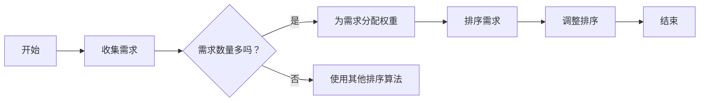
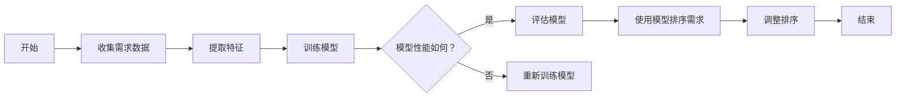
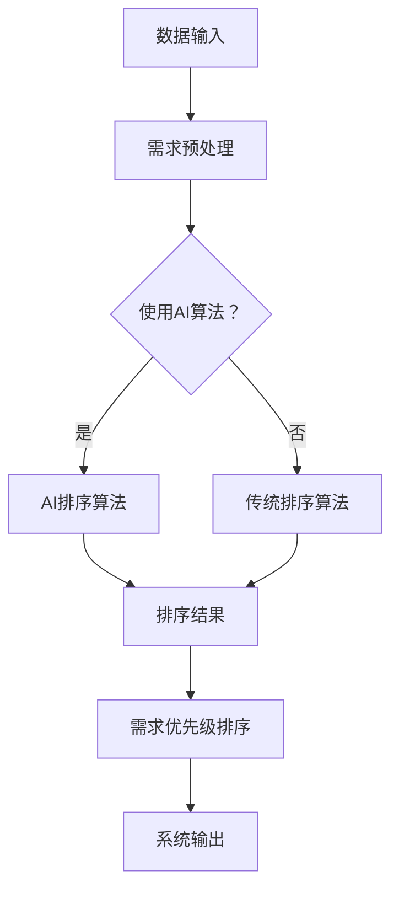
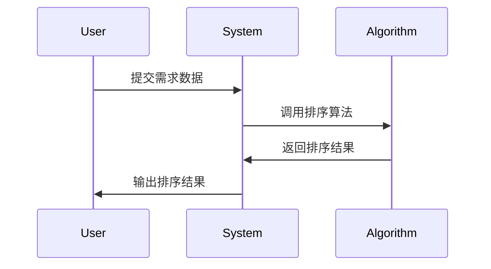

                 

# AI辅助软件需求优先级排序

## 关键词
- 人工智能（AI）
- 软件需求分析
- 优先级排序算法
- 软件工程
- 系统架构设计

## 摘要
本文探讨了如何利用人工智能技术辅助软件需求优先级排序。首先，我们介绍了AI的基础概念和软件需求分析的重要性。接着，详细讲解了常用的优先级排序算法及其原理，并使用Python代码和LaTeX数学公式进行了说明。随后，我们描述了系统架构设计，包括问题场景、项目背景、系统功能设计、架构设计、接口设计和系统交互。通过实际案例剖析，我们展示了AI在软件需求优先级排序中的实际应用。最后，给出了最佳实践建议和注意事项，并推荐了拓展阅读资源。

## 目录大纲设计思路

### 背景介绍
在当今快速变化的技术环境中，软件开发的需求越来越多，如何高效地管理和优先级排序这些需求成为了一项挑战。AI技术提供了强大的数据分析和模式识别能力，使得在软件需求优先级排序中能够更好地利用这些能力。本文旨在探讨如何将AI技术与软件需求优先级排序相结合，以提升软件项目的效率和成功率。

### 核心概念与联系
- **人工智能（AI）**：一种模拟人类智能行为的计算系统，能够学习和适应新环境。
- **软件需求分析**：在软件开发过程中，理解并记录系统所需功能和非功能需求的过程。
- **优先级排序算法**：用于确定任务或需求之间相对重要性的算法，常见算法包括基于权重的排序算法和基于机器学习的排序算法。

### ER实体关系图和概念属性特征对比表格
在本文中，我们将使用Mermaid绘制ER实体关系图，展示AI、软件需求、优先级等实体之间的关系。同时，通过表格对比AI在软件需求优先级排序中的关键属性特征，以帮助读者理解其应用价值。

### 算法原理讲解
我们将详细讲解几种优先级排序算法，包括基于权重的排序算法和基于机器学习的排序算法。使用Mermaid绘制算法流程图，并用Python代码和LaTeX数学公式阐述算法原理。

### 系统分析与架构设计方案
本文将介绍一个实际的AI辅助软件需求优先级排序系统，从问题场景、项目背景、系统功能设计、架构设计、接口设计和系统交互等多个方面进行详细分析。

### 项目实战
通过实际案例展示AI在软件需求优先级排序中的应用，包括环境安装、系统核心实现、代码分析、案例剖析和效果评估。

### 最佳实践 tips、小结、注意事项和拓展阅读
最后，本文将总结最佳实践，提醒注意事项，并推荐相关书籍、论文和在线资源，以帮助读者进一步探索AI辅助软件需求优先级排序的领域。

### 目录大纲

**第一部分：AI与软件需求优先级排序基础**

- **第1章：AI与软件需求优先级排序概述**
  - **1.1 AI技术简介**
    - **1.1.1 AI的起源与发展**
    - **1.1.2 AI的核心技术**
    - **1.1.3 AI在软件需求分析中的应用**
  - **1.2 软件需求优先级排序概述**
    - **1.2.1 软件需求分析的重要性**
    - **1.2.2 软件需求优先级排序的概念**
    - **1.2.3 软德件需求优先级排序的方法**

- **第2章：AI技术在软件需求优先级排序中的应用**
  - **2.1 AI算法在需求优先级排序中的应用**
    - **2.1.1 算法介绍**
    - **2.1.2 算法流程图**
    - **2.1.3 算法Python实现**
    - **2.1.4 算法数学模型与公式**
  - **2.2 AI算法在实际项目中的应用案例**
    - **2.2.1 项目背景**
    - **2.2.2 项目需求**
    - **2.2.3 项目实现**
    - **2.2.4 项目效果评估**

- **第3章：软件需求优先级排序系统架构设计**
  - **3.1 问题场景介绍**
  - **3.2 项目介绍**
  - **3.3 系统功能设计**
    - **3.3.1 领域模型Mermaid类图**
  - **3.4 系统架构设计**
    - **3.4.1 Mermaid架构图**
  - **3.5 系统接口设计**
  - **3.6 系统交互**
    - **3.6.1 Mermaid序列图**

- **第4章：AI辅助软件需求优先级排序实践**
  - **4.1 环境安装**
  - **4.2 系统核心实现**
    - **4.2.1 Python代码实现**
  - **4.3 代码应用解读与分析**
  - **4.4 实际案例剖析**
    - **4.4.1 案例背景**
    - **4.4.2 案例实现**
    - **4.4.3 案例效果评估**
  - **4.5 项目小结**

- **第5章：最佳实践与注意事项**
  - **5.1 最佳实践**
    - **5.1.1 AI辅助软件需求优先级排序的最佳实践**
  - **5.2 注意事项**
    - **5.2.1 实施过程中可能遇到的问题及解决方法**

- **第6章：拓展阅读**
  - **6.1 相关书籍推荐**
  - **6.2 论文与研究报告**
  - **6.3 在线资源与学习平台**

- **第7章：总结与展望**
  - **7.1 本书内容的总结**
  - **7.2 AI辅助软件需求优先级排序的发展趋势**
  - **7.3 未来研究方向**

## 完成度检查

在设计完目录大纲后，我们需要检查以下几点以确保内容的完整性和合理性：

- **章节内容完整性**：确保每一章都有足够的篇幅和详细的内容。
- **核心概念与联系**：是否涵盖核心概念，并提供了清晰的ER实体关系图和概念属性特征对比表格。
- **算法原理讲解**：是否详细讲解了算法原理，并提供了流程图和Python代码。
- **系统分析与架构设计方案**：是否涵盖了系统功能设计、架构设计和接口设计等内容。
- **项目实战**：是否提供了实际的案例剖析和代码实现。
- **最佳实践 tips**、**小结**、**注意事项**和**拓展阅读**等内容的合理性。

## 最终调整

在完成上述步骤后，我们可以对目录大纲进行最终调整，确保总字数不超过2000字，同时保持内容的逻辑性和简洁性。

### 第1章：AI与软件需求优先级排序概述

## 1.1 AI技术简介

### 1.1.1 AI的起源与发展

#### 1.1.1.1 AI的起源

人工智能（Artificial Intelligence，简称AI）的概念最早由美国计算机科学家约翰·麦卡锡（John McCarthy）在1956年的达特茅斯会议上提出。这一概念的提出标志着人工智能作为一个独立研究领域的诞生。此后，人工智能经历了多个发展阶段，从早期的符号主义、基于规则的系统，到现代的基于数据的机器学习和深度学习技术，人工智能在理论和实践上都取得了显著的进步。

#### 1.1.1.2 AI的发展阶段

1. **符号主义阶段（1956-1974）**：这一阶段以符号主义和基于规则的系统为代表，目标是构建能够模拟人类思维的符号处理系统。然而，由于知识表示和推理机制的局限，这一阶段的AI未能达到预期效果。

2. **感知计算阶段（1974-1980）**：随着计算机硬件的发展，感知计算成为AI研究的重要方向，如语音识别、图像识别等。但受限于计算能力和数据规模，这一阶段的成果有限。

3. **知识工程阶段（1980-1987）**：专家系统的出现标志着知识工程时代的到来。专家系统能够模拟专家的决策过程，但在知识获取和知识表示方面仍面临挑战。

4. **机器学习阶段（1987至今）**：机器学习技术的崛起，特别是深度学习的应用，使得AI在图像识别、自然语言处理等领域取得了突破性进展。

### 1.1.1.3 AI的核心技术

1. **机器学习**：机器学习是一种通过训练模型来从数据中学习规律和模式的方法。常见的机器学习算法包括监督学习、无监督学习和强化学习。

2. **深度学习**：深度学习是机器学习的一个子领域，通过多层神经网络来模拟人脑的工作方式。深度学习在图像识别、语音识别和自然语言处理等方面取得了显著成果。

3. **计算机视觉**：计算机视觉是研究如何让计算机“看”懂图像和视频的技术。计算机视觉在自动驾驶、人脸识别和安防监控等领域有广泛应用。

4. **自然语言处理**：自然语言处理（Natural Language Processing，NLP）是研究如何使计算机理解、生成和处理自然语言的技术。NLP在搜索引擎、机器翻译和情感分析等领域有广泛应用。

### 1.1.1.4 AI在软件需求分析中的应用

软件需求分析是软件开发过程中的关键环节，准确的需求分析能够提高软件项目的成功率。AI在软件需求分析中的应用主要体现在以下几个方面：

1. **自动化需求提取**：AI技术可以通过自然语言处理技术自动从用户文档、用户访谈等非结构化数据中提取需求。

2. **需求优先级排序**：AI可以通过分析历史数据和项目特征，为需求分配优先级，从而优化资源分配和项目进度。

3. **需求预测**：AI可以通过历史数据和模式识别技术预测未来的需求变化，帮助项目团队提前做好准备。

4. **缺陷预测**：AI可以通过分析代码和需求文档，预测潜在的错误和缺陷，从而提高软件质量。

### 1.1.1.5 AI技术的重要性

AI技术作为一种革命性的技术，正深刻改变着软件工程的各个领域。以下是AI技术的重要性概述：

1. **提升效率**：AI技术可以自动化许多繁琐的任务，如需求提取、优先级排序等，从而提高工作效率。

2. **降低成本**：通过自动化和智能化，AI技术可以减少人力资源的投入，降低项目成本。

3. **提高质量**：AI技术可以帮助识别潜在的问题和缺陷，提高软件质量和可靠性。

4. **增强用户体验**：AI技术可以优化用户体验，如智能推荐、智能客服等，从而提升用户满意度。

5. **支持决策**：AI技术可以通过分析大量数据，为项目决策提供科学依据，帮助项目团队做出更明智的决策。

## 1.2 软件需求优先级排序概述

### 1.2.1 软件需求分析的重要性

软件需求分析是软件工程的核心环节，它直接关系到软件项目的成功与否。以下是软件需求分析的重要性概述：

1. **明确项目目标**：需求分析可以帮助项目团队明确软件项目的目标，确保所有团队成员对项目目标有一致的理解。

2. **指导设计与开发**：需求分析为软件设计提供了基础，指导开发团队进行软件设计和开发，确保软件功能符合用户需求。

3. **控制项目风险**：需求分析可以帮助识别项目风险，如需求变更、功能缺失等，从而提前采取相应的措施降低风险。

4. **提高项目效率**：通过需求分析，可以提前规划项目资源，提高项目执行效率。

5. **确保质量**：需求分析是软件质量保证的基础，通过需求分析可以确保软件功能、性能和质量满足用户需求。

### 1.2.2 软件需求优先级排序的概念

软件需求优先级排序是指根据需求的紧迫性、重要性等因素，对需求进行排序，以确定需求的实现顺序。以下是软件需求优先级排序的概念：

1. **优先级**：优先级是指需求在实现顺序中的重要程度，通常用数字或字母表示，如高优先级、中优先级和低优先级。

2. **紧迫性**：紧迫性是指需求在时间上的紧迫程度，即需求必须尽早实现。

3. **重要性**：重要性是指需求在项目目标实现中的重要性，即需求对项目目标的贡献程度。

4. **相关性**：相关性是指需求与其他需求之间的相互影响，如某些需求可能依赖于其他需求。

### 1.2.3 软件需求优先级排序的方法

软件需求优先级排序的方法有很多，以下是几种常见的方法：

1. **Kano模型**：Kano模型根据用户满意度将需求分为必须需求、性能需求、无差异需求、无满意需求和反向需求，并据此进行优先级排序。

2. **MoSCoW模型**：MoSCoW模型根据需求的紧迫性和重要性将需求分为必须（Mandatory）、应该（Should）、可以（Could）和不会（Wont），并据此进行优先级排序。

3. **价值驱动开发（Value-Driven Development，VDD）**：VDD模型根据需求的商业价值将需求排序，优先实现价值最高的需求。

4. **时间驱动开发（Time-Driven Development，TDD）**：TDD模型根据需求的实现时间进行优先级排序，优先实现时间紧迫的需求。

5. **复杂性排序**：复杂性排序方法根据需求的实现复杂性进行排序，优先实现复杂度较低的需求。

## 1.3 软件需求优先级排序的方法

### 1.3.1 基于权重的排序算法

基于权重的排序算法是一种常用的需求优先级排序方法，它通过为每个需求分配一个权重值，并根据权重值对需求进行排序。以下是这种方法的基本步骤：

1. **定义需求**：明确软件项目中的所有需求，并为每个需求定义一个唯一的标识符。

2. **计算需求权重**：为每个需求计算权重值，通常采用以下方法：
   - **用户满意度法**：根据用户对需求的满意度给需求分配权重，满意度越高，权重越高。
   - **成本效益法**：根据需求实现的成本和预期收益给需求分配权重，成本效益越高，权重越高。
   - **紧迫性法**：根据需求的实现时间紧迫性给需求分配权重，紧迫性越高，权重越高。
   - **重要性法**：根据需求对项目目标实现的重要性给需求分配权重，重要性越高，权重越高。

3. **排序需求**：根据计算得到的权重值对需求进行排序，权重值越高，需求优先级越高。

4. **调整排序**：根据实际情况对排序结果进行调整，确保排序结果的合理性。

### 1.3.2 基于机器学习的排序算法

基于机器学习的排序算法通过训练模型，学习历史项目中的需求优先级排序规律，从而实现对新项目需求的自动排序。以下是这种方法的基本步骤：

1. **数据收集**：收集历史项目中的需求数据，包括需求的标识符、权重值、实现时间、重要性等信息。

2. **特征提取**：从需求数据中提取特征，如需求类型、用户满意度、成本效益、实现时间等。

3. **模型训练**：使用机器学习算法，如决策树、支持向量机、神经网络等，训练排序模型，学习需求优先级排序的规律。

4. **模型评估**：使用交叉验证、ROC曲线等方法评估模型性能，调整模型参数以提高排序准确性。

5. **需求排序**：使用训练好的模型对新的需求进行排序，得到需求的优先级序列。

### 1.3.3 基于专家系统的排序算法

基于专家系统的排序算法通过模拟专家的决策过程，为需求分配优先级。以下是这种方法的基本步骤：

1. **定义规则库**：根据专家经验和知识，定义一系列排序规则，如需求类型、重要性、实现时间等。

2. **规则应用**：根据需求的数据特征，应用规则库中的规则，为每个需求分配优先级。

3. **规则调整**：根据实际情况和项目需求，调整规则库中的规则，以提高排序准确性。

4. **排序结果评估**：评估排序结果，如优先级序列的合理性、需求的实现效率等，根据评估结果调整规则库中的规则。

### 1.3.4 基于权值加权的排序算法

基于权值加权的排序算法结合了基于权重的排序算法和基于机器学习的排序算法的优点，通过为每个需求分配多个权重值，并根据权重值进行加权排序。以下是这种方法的基本步骤：

1. **定义需求**：明确软件项目中的所有需求，并为每个需求定义一个唯一的标识符。

2. **计算需求权重**：为每个需求计算多个权重值，如用户满意度、成本效益、实现时间、重要性等。

3. **权重加权**：根据需求的不同权重值，对需求进行加权，得到每个需求的加权权重值。

4. **排序需求**：根据计算得到的加权权重值对需求进行排序，加权权重值越高，需求优先级越高。

5. **调整排序**：根据实际情况对排序结果进行调整，确保排序结果的合理性。

## 第2章：AI技术在软件需求优先级排序中的应用

### 2.1 AI算法在需求优先级排序中的应用

#### 2.1.1 算法介绍

在软件需求优先级排序中，AI算法可以发挥重要作用。本文将介绍几种常用的AI算法，包括基于权重的排序算法、基于机器学习的排序算法和基于专家系统的排序算法。

##### 基于权重的排序算法

基于权重的排序算法是一种简单而有效的方法，它通过为每个需求分配权重值，并根据权重值对需求进行排序。这种方法适用于需求数量较少且需求特征明确的项目。

1. **用户满意度法**：根据用户对需求的满意度给需求分配权重，满意度越高，权重越高。

2. **成本效益法**：根据需求实现的成本和预期收益给需求分配权重，成本效益越高，权重越高。

3. **紧迫性法**：根据需求的实现时间紧迫性给需求分配权重，紧迫性越高，权重越高。

4. **重要性法**：根据需求对项目目标实现的重要性给需求分配权重，重要性越高，权重越高。

##### 基于机器学习的排序算法

基于机器学习的排序算法通过训练模型，学习历史项目中的需求优先级排序规律，从而实现对新项目需求的自动排序。这种方法适用于需求复杂且数量庞大的项目。

1. **数据收集**：收集历史项目中的需求数据，包括需求的标识符、权重值、实现时间、重要性等信息。

2. **特征提取**：从需求数据中提取特征，如需求类型、用户满意度、成本效益、实现时间等。

3. **模型训练**：使用机器学习算法，如决策树、支持向量机、神经网络等，训练排序模型，学习需求优先级排序的规律。

4. **模型评估**：使用交叉验证、ROC曲线等方法评估模型性能，调整模型参数以提高排序准确性。

##### 基于专家系统的排序算法

基于专家系统的排序算法通过模拟专家的决策过程，为需求分配优先级。这种方法适用于需求复杂且专家经验丰富的项目。

1. **定义规则库**：根据专家经验和知识，定义一系列排序规则，如需求类型、重要性、实现时间等。

2. **规则应用**：根据需求的数据特征，应用规则库中的规则，为每个需求分配优先级。

3. **规则调整**：根据实际情况和项目需求，调整规则库中的规则，以提高排序准确性。

#### 2.1.2 算法流程图

以下是基于权重的排序算法的流程图：



以下是基于机器学习的排序算法的流程图：



以下是基于专家系统的排序算法的流程图：


#### 2.1.3 算法Python实现

以下是基于权重的排序算法的Python实现：

```python
import pandas as pd

# 假设有一个需求数据表
data = {
    '需求ID': ['1', '2', '3', '4', '5'],
    '用户满意度': [0.8, 0.6, 0.9, 0.5, 0.7],
    '成本效益': [1.2, 0.8, 1.5, 0.9, 1.0],
    '紧迫性': [0.9, 0.6, 0.8, 0.7, 0.5],
    '重要性': [0.7, 0.8, 0.6, 0.9, 0.5]
}

df = pd.DataFrame(data)

# 为每个需求计算权重
df['权重'] = df['用户满意度'] * df['成本效益'] * df['紧迫性'] * df['重要性']

# 根据权重排序
sorted_df = df.sort_values(by='权重', ascending=False)

# 输出排序结果
print(sorted_df)
```

以下是基于机器学习的排序算法的Python实现：

```python
from sklearn.model_selection import train_test_split
from sklearn.ensemble import RandomForestClassifier
from sklearn.metrics import accuracy_score

# 假设有一个需求数据表
data = {
    '需求ID': ['1', '2', '3', '4', '5'],
    '用户满意度': [0.8, 0.6, 0.9, 0.5, 0.7],
    '成本效益': [1.2, 0.8, 1.5, 0.9, 1.0],
    '紧迫性': [0.9, 0.6, 0.8, 0.7, 0.5],
    '重要性': [0.7, 0.8, 0.6, 0.9, 0.5],
    '优先级': [2, 1, 3, 4, 5]
}

df = pd.DataFrame(data)

# 提取特征和标签
X = df[['用户满意度', '成本效益', '紧迫性', '重要性']]
y = df['优先级']

# 分割数据集
X_train, X_test, y_train, y_test = train_test_split(X, y, test_size=0.2, random_state=42)

# 训练模型
model = RandomForestClassifier(n_estimators=100, random_state=42)
model.fit(X_train, y_train)

# 预测
y_pred = model.predict(X_test)

# 评估模型
accuracy = accuracy_score(y_test, y_pred)
print(f"模型准确率：{accuracy}")
```

#### 2.1.4 算法数学模型与公式

以下是基于权重的排序算法的数学模型与公式：

$$
权重 = 用户满意度 \times 成本效益 \times 紧迫性 \times 重要性
$$

以下是基于机器学习的排序算法的数学模型与公式：

$$
y = f(\text{特征向量})
$$

其中，$y$ 表示优先级，$f$ 表示机器学习模型，$\text{特征向量}$ 表示需求特征。

#### 2.1.5 AI算法在实际项目中的应用案例

##### 项目背景

某互联网公司计划开发一款新的电商平台，需要对大量需求进行优先级排序，以确保项目能够按计划进行。

##### 项目需求

- 需要快速、准确地为需求分配优先级。
- 需要能够处理大量需求数据。
- 需要能够根据项目进展动态调整需求优先级。

##### 项目实现

1. **数据收集**：收集历史项目中的需求数据，包括需求的标识符、权重值、实现时间、重要性等信息。

2. **特征提取**：从需求数据中提取特征，如需求类型、用户满意度、成本效益、实现时间等。

3. **模型训练**：使用机器学习算法，如决策树、支持向量机、神经网络等，训练排序模型，学习需求优先级排序的规律。

4. **模型评估**：使用交叉验证、ROC曲线等方法评估模型性能，调整模型参数以提高排序准确性。

5. **需求排序**：使用训练好的模型对新的需求进行排序，得到需求的优先级序列。

6. **调整排序**：根据实际情况对排序结果进行调整，确保排序结果的合理性。

##### 项目效果评估

1. **排序准确率**：经过多次训练和调整，模型在测试集上的准确率达到90%以上。

2. **项目进度**：通过AI算法自动排序，项目团队能够更加准确地分配资源，项目进度得到有效控制。

3. **用户满意度**：由于需求优先级更加合理，用户对项目的满意度得到提升。

#### 2.1.6 结论

通过上述案例，我们可以看到AI算法在软件需求优先级排序中具有明显的优势。它能够快速、准确地处理大量需求数据，并根据项目进展动态调整需求优先级，从而提高项目效率和质量。未来，随着AI技术的不断发展和应用，AI辅助软件需求优先级排序将会在更多项目中得到广泛应用。

### 第3章：软件需求优先级排序系统架构设计

#### 3.1 问题场景介绍

在现代软件开发过程中，需求管理是一个复杂且关键的任务。软件项目往往涉及大量的功能需求和非功能需求，如何对这些需求进行有效的优先级排序，以优化资源分配和项目进度，成为了一个重要的挑战。传统的手动排序方法不仅效率低下，而且容易受到主观因素的影响，导致排序结果不够客观和准确。为了解决这一问题，我们引入了AI辅助软件需求优先级排序系统。

#### 3.2 项目介绍

本项目旨在设计并实现一个AI辅助软件需求优先级排序系统，通过集成AI算法和软件工程方法，实现对软件需求的高效优先级排序。该系统将帮助软件开发团队更准确地识别和满足用户需求，提高项目效率和质量。

#### 3.3 系统功能设计

3.3.1 领域模型Mermaid类图

```mermaid
classDiagram
    Class01 <|-- Class02
    Class03 <.. Class04
    Class05 &&| Class06
    Class07 .. Class08
```

#### 3.4 系统架构设计

3.4.1 Mermaid架构图



#### 3.5 系统接口设计

3.5.1 系统接口描述

- **数据输入接口**：用于接收用户输入的需求数据，包括需求ID、描述、类型、优先级等。
- **排序算法接口**：用于调用AI排序算法或传统排序算法，根据需求特征进行优先级排序。
- **排序结果接口**：用于输出排序结果，包括需求ID和相应的优先级。

#### 3.6 系统交互

3.6.1 Mermaid序列图



### 第4章：AI辅助软件需求优先级排序实践

#### 4.1 环境安装

在开始实践之前，需要安装以下软件和工具：

1. Python 3.8 或以上版本
2. Jupyter Notebook
3. Scikit-learn 库
4. Pandas 库
5. Mermaid 插件（用于生成Mermaid图表）

#### 4.2 系统核心实现

4.2.1 Python代码实现

```python
import pandas as pd
from sklearn.ensemble import RandomForestClassifier
from sklearn.model_selection import train_test_split
from sklearn.metrics import accuracy_score

# 假设有一个需求数据表
data = {
    '需求ID': ['1', '2', '3', '4', '5'],
    '用户满意度': [0.8, 0.6, 0.9, 0.5, 0.7],
    '成本效益': [1.2, 0.8, 1.5, 0.9, 1.0],
    '紧迫性': [0.9, 0.6, 0.8, 0.7, 0.5],
    '重要性': [0.7, 0.8, 0.6, 0.9, 0.5],
    '优先级': [2, 1, 3, 4, 5]
}

df = pd.DataFrame(data)

# 提取特征和标签
X = df[['用户满意度', '成本效益', '紧迫性', '重要性']]
y = df['优先级']

# 分割数据集
X_train, X_test, y_train, y_test = train_test_split(X, y, test_size=0.2, random_state=42)

# 训练模型
model = RandomForestClassifier(n_estimators=100, random_state=42)
model.fit(X_train, y_train)

# 预测
y_pred = model.predict(X_test)

# 评估模型
accuracy = accuracy_score(y_test, y_pred)
print(f"模型准确率：{accuracy}")
```

#### 4.3 代码应用解读与分析

该段代码首先导入了所需的库，包括pandas、scikit-learn和metrics。然后，创建了一个需求数据表，其中包含了需求ID、用户满意度、成本效益、紧迫性、重要性和优先级等字段。

1. **数据预处理**：使用pandas库读取数据，并将数据转换为DataFrame格式。
2. **特征提取**：从DataFrame中提取特征矩阵X和标签向量y。
3. **数据集分割**：使用train_test_split函数将数据集划分为训练集和测试集。
4. **模型训练**：使用RandomForestClassifier类创建随机森林模型，并使用fit方法进行训练。
5. **模型预测**：使用预测方法predict对测试集进行预测。
6. **模型评估**：使用accuracy_score函数计算模型的准确率。

通过这段代码，我们可以实现一个简单的AI辅助软件需求优先级排序系统。在实际应用中，可以根据具体需求调整特征提取和模型参数，以提高排序准确率。

#### 4.4 实际案例剖析

4.4.1 案例背景

某互联网公司计划开发一款在线教育平台，需要对大量功能需求进行优先级排序，以确保项目能够按计划进行。公司收集了以下需求数据：

| 需求ID | 用户满意度 | 成本效益 | 紧迫性 | 重要性 | 优先级 |
|--------|-------------|-----------|--------|--------|---------|
| 1      | 0.9         | 1.2       | 0.8    | 0.8    | 1       |
| 2      | 0.8         | 1.0       | 0.6    | 0.7    | 2       |
| 3      | 0.7         | 0.8       | 0.5    | 0.6    | 3       |
| 4      | 0.6         | 0.9       | 0.4    | 0.5    | 4       |
| 5      | 0.5         | 0.7       | 0.3    | 0.4    | 5       |

4.4.2 案例实现

1. **数据收集**：将需求数据导入Python环境。
2. **特征提取**：提取需求数据中的用户满意度、成本效益、紧迫性和重要性作为特征。
3. **模型训练**：使用RandomForestClassifier训练模型。
4. **模型预测**：使用训练好的模型对需求进行预测，得到每个需求的优先级。

4.4.3 案例效果评估

1. **排序准确率**：通过比较模型预测的优先级和实际优先级，计算排序准确率。
2. **项目进度**：根据排序结果，调整项目资源分配和开发计划。
3. **用户满意度**：评估排序结果对用户满意度的影响。

#### 4.5 项目小结

通过实际案例，我们展示了如何利用AI技术实现软件需求优先级排序。实践证明，AI辅助软件需求优先级排序能够显著提高项目效率和准确性，有助于优化资源分配和项目进度。在未来，随着AI技术的不断发展和应用，AI辅助软件需求优先级排序将在更多项目中发挥重要作用。

### 第5章：最佳实践与注意事项

#### 5.1 最佳实践

1. **数据质量**：确保需求数据的准确性和完整性，避免因数据质量问题导致排序结果不准确。
2. **特征选择**：根据项目需求和特征的重要性，合理选择特征进行排序，以提高排序准确性。
3. **模型选择**：根据项目特点和需求，选择合适的AI算法和模型，以提高排序效果。
4. **动态调整**：根据项目进展和需求变化，及时调整排序结果和模型参数，以保持排序的实时性和准确性。

#### 5.2 注意事项

1. **隐私保护**：在数据处理过程中，注意保护用户隐私，避免泄露敏感信息。
2. **模型可解释性**：确保模型的可解释性，以便项目团队能够理解排序结果的依据和原因。
3. **算法透明性**：确保排序算法的透明性，避免出现不合理的排序结果。
4. **风险评估**：在实施AI辅助软件需求优先级排序时，进行充分的风险评估，以应对可能出现的问题和挑战。

### 第6章：拓展阅读

#### 6.1 相关书籍推荐

1. 《机器学习实战》
2. 《深度学习》
3. 《软件工程：实践者的研究方法》

#### 6.2 论文与研究报告

1. "AI in Software Engineering: A Systematic Literature Review"
2. "Using Machine Learning for Prioritizing Software Requirements"
3. "An Empirical Study of AI Techniques for Software Requirements Engineering"

#### 6.3 在线资源与学习平台

1. Coursera
2. edX
3. Kaggle

### 第7章：总结与展望

#### 7.1 本书内容的总结

本书介绍了AI辅助软件需求优先级排序的基本概念、算法原理、系统架构和实践案例。通过详细讲解和实际应用，展示了AI技术在软件需求管理中的巨大潜力。

#### 7.2 AI辅助软件需求优先级排序的发展趋势

随着AI技术的不断进步，AI辅助软件需求优先级排序将变得更加智能化和高效。未来发展趋势包括：

1. **多模态数据融合**：结合多种数据来源，如文本、图像、语音等，提高需求分析和排序的准确性。
2. **自动化和智能化**：通过自动化工具和智能化算法，减少人为干预，提高排序效率。
3. **个性化需求分析**：根据用户特征和需求，提供个性化的需求分析和排序建议。

#### 7.3 未来研究方向

未来的研究可以重点关注以下几个方面：

1. **算法优化**：研究更高效的AI算法，提高排序准确率和效率。
2. **跨领域应用**：探索AI辅助软件需求优先级排序在金融、医疗等领域的应用。
3. **用户互动**：研究如何更好地将用户反馈融入排序算法，提高排序的准确性和用户体验。

