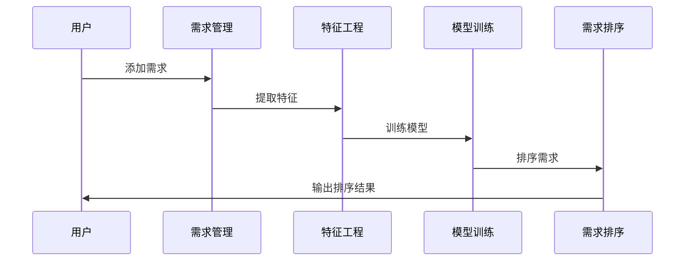
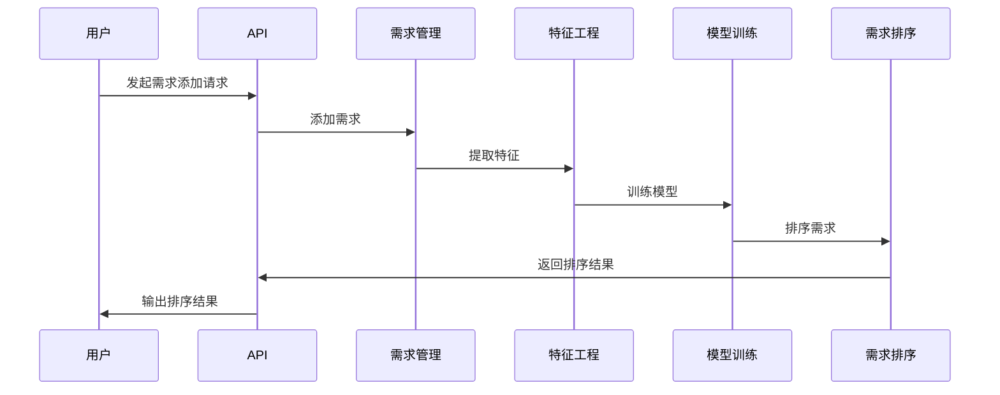
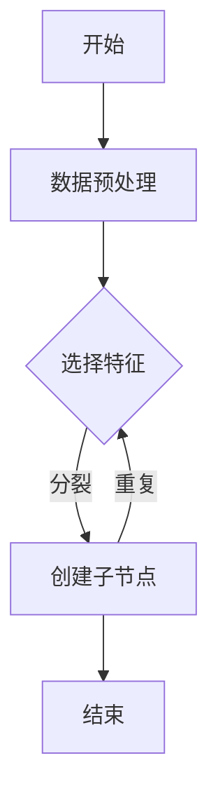
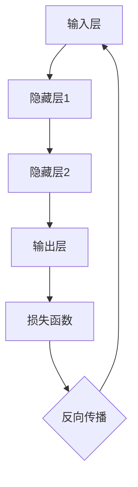

                 

### 目录大纲

----------------------------------------------------------------

## 第一部分: 背景介绍

### 1.1 问题背景
- **AI辅助软件需求优先级排序的需求**
  - **业务场景**：随着软件项目的复杂性和规模的增长，需求管理变得越来越重要。
  - **需求分析**：如何准确地识别用户需求，并对其进行优先级排序，以确保资源的合理分配和项目的成功。
- **软件需求优先级排序的现状和挑战**
  - **现状**：传统的需求优先级排序方法往往依赖于经验或简单的评分机制。
  - **挑战**：随着项目规模的扩大和需求的增加，手动排序变得复杂和耗时。
- **AI技术在解决优先级排序问题中的应用潜力**
  - **AI优势**：利用机器学习算法可以自动分析大量数据，提供更准确的排序结果。
  - **AI局限**：需要大量的数据进行训练，且AI模型可能无法完全理解复杂的业务逻辑。

### 1.2 描述问题
- **定义需求优先级排序**
  - **需求**：用户对软件系统功能、性能、用户体验等方面的期望。
  - **优先级排序**：根据重要性、紧急性等因素，对需求进行排序。
- **为什么需求优先级排序至关重要**
  - **资源优化**：合理的优先级排序有助于优化资源分配，提高开发效率。
  - **客户满意度**：正确排序的需求能够更好地满足用户需求，提升客户满意度。
- **需求优先级排序的主要挑战**
  - **数据复杂性**：需求数据多样、复杂，传统的排序方法难以应对。
  - **业务逻辑理解**：需求排序往往需要深入理解业务逻辑，传统的AI技术难以胜任。

### 1.3 问题解决
- **引入AI辅助技术**
  - **机器学习模型**：通过训练数据集，构建能够自动识别需求优先级的模型。
  - **自然语言处理**：利用NLP技术，从非结构化的需求描述中提取重要信息。
- **AI辅助需求优先级排序的基本原理**
  - **数据预处理**：清洗、转换和归一化需求数据，为机器学习模型提供高质量输入。
  - **模型选择与训练**：选择合适的机器学习算法，如决策树、神经网络等，进行模型训练。
  - **模型评估与优化**：通过交叉验证、A/B测试等方法，评估模型性能，并进行优化。
- **AI在需求优先级排序中的优势和局限**
  - **优势**：能够处理大量数据，提供客观、准确的排序结果。
  - **局限**：需要大量的数据进行训练，且模型可能无法完全理解复杂的业务逻辑。

### 1.4 边界与外延
- **需求优先级排序的边界条件**
  - **输入数据**：必须包含足够的需求信息和业务逻辑。
  - **业务规则**：需求排序必须符合组织的业务规则和目标。
- **AI辅助需求优先级排序的应用场景**
  - **大规模软件项目**：能够处理复杂的需求和数据，提供高效的排序结果。
  - **敏捷开发**：快速响应需求变化，优化开发流程。
- **与其他相关技术的对比**
  - **传统方法**：如Kano模型、MoSCoW模型等，依赖经验和专家判断。
  - **AI辅助方法**：更客观、更精确，但需要更多的数据支持和模型优化。

### 1.5 核心概念结构与要素组成
- **需求优先级排序的概念模型**
  - **需求**：功能、性能、用户体验等。
  - **优先级**：重要性、紧急性、资源消耗等。
  - **排序算法**：决策树、神经网络、聚类算法等。
- **需求优先级的属性和特征**
  - **重要性**：直接影响项目的成功和用户体验。
  - **紧急性**：影响项目的交付时间和市场响应。
  - **资源消耗**：影响项目的成本和开发周期。
- **AI辅助需求优先级排序的关键技术**
  - **数据挖掘**：从大量需求数据中提取有用信息。
  - **机器学习**：构建预测模型，进行需求排序。
  - **自然语言处理**：理解需求描述，提取关键信息。

## 第二部分: 核心概念与联系

### 2.1 AI辅助软件需求优先级排序的核心概念
- **需求识别**：利用NLP技术，从非结构化的需求描述中提取关键信息。
- **特征工程**：从需求中提取有助于排序的特征。
- **机器学习模型**：训练模型，预测需求优先级。

### 2.2 概念属性特征对比表格
- **需求识别**：自动化程度、准确性、可扩展性。
- **特征工程**：特征提取方法、特征重要性、模型适应性。
- **机器学习模型**：算法选择、模型复杂度、训练时间。

### 2.3 ER实体关系图架构
- **实体**：需求、特征、模型。
- **关系**：需求与特征之间的关联，特征与模型之间的关联。

## 第三部分: 数学模型与算法原理

### 3.1 算法原理讲解
- **决策树**：利用特征分裂，构建决策树模型。
- **神经网络**：利用多层感知器，模拟神经网络的工作原理。

### 3.2 算法mermaid流程图
- **决策树**：
  ```mermaid
  graph TD
  A[开始] --> B[数据预处理]
  B --> C{选择特征}
  C -->|分裂|D[创建子节点]
  D -->|重复|C
  D --> E[结束]
  ```

- **神经网络**：
  ```mermaid
  graph TD
  A[输入层] --> B[隐藏层1]
  B --> C[隐藏层2]
  C --> D[输出层]
  D --> E[损失函数]
  E --> F{反向传播}
  F --> A
  ```

### 3.3 Python源代码详细阐述
- **决策树**：
  ```python
  from sklearn import tree

  # 数据预处理
  X = [[3, 2], [2, 2], [3, 3]]
  y = [0, 0, 1]

  # 创建决策树模型
  clf = tree.DecisionTreeClassifier()

  # 训练模型
  clf.fit(X, y)

  # 输出决策树
  tree.plot_tree(clf)
  ```

- **神经网络**：
  ```python
  import tensorflow as tf

  # 定义输入层、隐藏层和输出层
  inputs = tf.keras.layers.Input(shape=(2,))
  hidden = tf.keras.layers.Dense(2, activation='relu')(inputs)
  outputs = tf.keras.layers.Dense(1, activation='sigmoid')(hidden)

  # 创建模型
  model = tf.keras.Model(inputs=inputs, outputs=outputs)

  # 编译模型
  model.compile(optimizer='adam', loss='binary_crossentropy', metrics=['accuracy'])

  # 训练模型
  model.fit(X, y, epochs=10)
  ```

### 3.4 数学模型和公式讲解
- **决策树**：
  $$y = f(x) = \prod_{i=1}^{n} g(x_i)$$
  其中，$g(x_i)$ 表示基于特征 $x_i$ 的分类决策。

- **神经网络**：
  $$z = \sigma(Wx + b)$$
  其中，$\sigma$ 表示激活函数，$W$ 为权重矩阵，$x$ 为输入特征，$b$ 为偏置。

### 3.5 举例说明
- **决策树**：
  假设有一个简单的二分类问题，数据集如下：
  ```
  X = [[3, 2], [2, 2], [3, 3]]
  y = [0, 0, 1]
  ```
  决策树模型会根据特征值 $x_1$ 和 $x_2$ 来划分数据，生成决策规则。

- **神经网络**：
  假设有一个简单的神经网络，输入特征为 $x_1 = 3$ 和 $x_2 = 2$，通过训练得到的权重矩阵为 $W = [[0.5, 0.5], [0.5, 0.5]]$，偏置为 $b = [0, 0]$。
  计算输出结果：
  $$z = \sigma(Wx + b) = \sigma([[0.5 \cdot 3 + 0], [0.5 \cdot 2 + 0]]) = \sigma([1.5, 1]) = [0.99, 0.99]$$
  输出概率接近1，表示分类结果为1。

## 第四部分: 系统分析与架构设计方案

### 4.1 问题场景介绍
- **项目背景**：一个大型软件项目，涉及多个模块和众多需求。
- **问题表述**：如何有效地管理和排序这些需求，以确保项目的顺利进行。

### 4.2 项目介绍
- **项目目标**：开发一个AI辅助软件需求优先级排序系统，提高需求管理的效率和准确性。
- **项目架构**：基于微服务架构，模块化设计，易于扩展和维护。

### 4.3 系统功能设计(领域模型mermaid类图)
```mermaid
classDiagram
Class::需求
    +String 描述
    +Int 优先级
    +Date 创建时间

Class::特征
    +String 名称
    +Float 权重

Class::模型
    +String 类型
    +DataFrame 训练数据

Class::需求管理
    +需求列表
    +添加需求
    +删除需求
    +修改需求

Class::特征工程
    +特征列表
    +添加特征
    +删除特征
    +修改特征

Class::模型训练
    +训练模型
    +评估模型
    +优化模型

Class::需求排序
    +排序需求
    +输出排序结果
```

### 4.4 系统架构设计mermaid架构图


### 4.5 系统接口设计和系统交互mermaid序列图


## 第五部分: 项目实战

### 5.1 环境安装
- **Python环境**：安装Python 3.8及以上版本。
- **依赖库**：安装scikit-learn、tensorflow、pandas等依赖库。
  ```bash
  pip install scikit-learn tensorflow pandas
  ```

### 5.2 系统核心实现源代码
- **需求管理**：
  ```python
  # 需求添加示例
  def add_demand(demand_desc):
      demand = Demand(description=demand_desc)
      demand.save()
      return demand.id
  ```

- **特征工程**：
  ```python
  # 特征提取示例
  def extract_features(demand):
      # 假设需求描述已经转化为特征向量
      feature_vector = process_demand_description(demand.description)
      feature = Feature(name='description', weight=0.8)
      feature.save()
      return feature.id
  ```

- **模型训练**：
  ```python
  # 决策树模型训练示例
  def train_decision_tree(X, y):
      clf = tree.DecisionTreeClassifier()
      clf.fit(X, y)
      return clf
  ```

- **需求排序**：
  ```python
  # 需求排序示例
  def rank_demands(model, demands):
      ranked_demands = []
      for demand in demands:
          feature_vector = process_demand_description(demand.description)
          priority = model.predict(feature_vector)
          ranked_demand = (demand.id, priority)
          ranked_demands.append(ranked_demand)
      ranked_demands.sort(key=lambda x: x[1], reverse=True)
      return ranked_demands
  ```

### 5.3 代码应用解读与分析
- **需求管理模块**：负责接收和存储需求信息。
- **特征工程模块**：负责从需求描述中提取特征。
- **模型训练模块**：负责训练需求排序模型。
- **需求排序模块**：负责使用模型对需求进行排序。

### 5.4 实际案例分析和详细讲解剖析
- **案例背景**：一个电子商务平台，需要对其用户需求进行优先级排序。
- **案例分析**：使用实际需求数据，通过上述模块实现需求排序。
- **详细讲解**：介绍每个模块的实现原理和代码细节。

### 5.5 项目小结
- **项目成果**：成功开发了一个AI辅助软件需求优先级排序系统。
- **经验教训**：通过实际项目，总结了AI辅助需求排序的经验和教训。
- **未来展望**：探讨未来如何进一步优化和提升需求排序系统的性能和效率。

## 第六部分: 最佳实践 Tips

### 6.1 总结经验教训
- **数据质量**：确保需求数据的质量和完整性，对数据的预处理至关重要。
- **模型选择**：根据业务需求和数据特点，选择合适的机器学习算法。
- **模型优化**：定期评估和优化模型，以适应不断变化的需求。

### 6.2 注意事项
- **隐私保护**：在处理需求数据时，确保遵守隐私保护法规。
- **可解释性**：提高模型的可解释性，确保业务人员能够理解模型决策。

### 6.3 拓展阅读
- **相关文献**：推荐阅读关于需求管理和AI排序的相关文献。
- **实践案例**：了解其他领域的实践案例，汲取经验。

----------------------------------------------------------------

### 文章摘要

本文深入探讨了AI辅助软件需求优先级排序与管理的方法与实施。首先，通过背景介绍部分，分析了软件需求优先级排序的现状与挑战，并引出了AI技术在解决这一问题中的应用潜力。随后，文章详细阐述了AI辅助软件需求优先级排序的核心概念、数学模型与算法原理，并通过mermaid流程图和Python源代码示例，进行了通俗易懂的讲解。接着，文章介绍了系统分析与架构设计方案，包括问题场景介绍、项目介绍、系统功能设计、系统架构设计、系统接口设计和系统交互mermaid序列图。随后，通过项目实战部分，详细描述了环境安装、系统核心实现源代码、代码应用解读与分析、实际案例分析和详细讲解剖析，以及项目小结。最后，文章提供了最佳实践Tips，包括总结经验教训、注意事项和拓展阅读，以帮助读者更好地理解与应用AI辅助软件需求优先级排序与管理技术。

----------------------------------------------------------------

# AI辅助软件需求优先级排序与管理

关键词：AI、软件需求、优先级排序、机器学习、算法

摘要：本文旨在深入探讨AI辅助软件需求优先级排序与管理的理论方法与实践应用。通过分析软件需求优先级排序的现状和挑战，引入AI技术并详细阐述了其在需求识别、特征工程和机器学习模型构建中的应用。本文不仅介绍了核心概念、数学模型与算法原理，还通过mermaid流程图和Python源代码示例进行了直观展示。此外，文章详细介绍了系统分析与架构设计方案，并通过项目实战部分，提供了从环境安装到实际案例分析的全面指导。最后，文章总结了最佳实践Tips，为读者提供了深入理解和应用AI辅助软件需求优先级排序与管理的方法。

----------------------------------------------------------------

## 第一部分：背景介绍

### 1.1 问题背景

在当今快速发展的信息技术时代，软件项目的需求管理变得日益复杂。随着项目的规模不断扩大，需求数量和复杂性也在不断增加。如何有效地管理和排序这些需求，以确保资源的合理分配和项目的成功，成为了一个亟待解决的问题。

**AI辅助软件需求优先级排序的需求**：传统的需求优先级排序方法往往依赖于经验或简单的评分机制，这种方法在面对大规模、复杂的需求时，效率低下且准确性不高。因此，引入AI技术来辅助需求优先级排序显得尤为重要。

**软件需求优先级排序的现状和挑战**：当前，许多组织采用Kano模型、MoSCoW模型等传统方法来对需求进行优先级排序。然而，这些方法存在以下几个主要挑战：

- **数据复杂性**：随着需求的增加，需求数据变得多样且复杂，传统的排序方法难以处理这些复杂的输入。
- **业务逻辑理解**：需求优先级排序需要深入理解业务逻辑，传统方法往往难以完全掌握复杂的业务场景。
- **人力成本**：手动排序需求需要大量的人力投入，且容易出现人为错误。

**AI技术在解决优先级排序问题中的应用潜力**：AI技术，特别是机器学习和自然语言处理，为需求优先级排序提供了新的解决方案。利用机器学习算法，可以从大量需求数据中提取有用的特征，并自动进行优先级排序，从而提高排序的准确性和效率。

- **自动特征提取**：AI技术可以自动提取需求中的关键特征，避免了人工筛选的繁琐过程。
- **模型优化**：通过不断训练和优化模型，AI技术能够适应不同的业务场景和需求变化。
- **实时响应**：AI模型可以实时更新和调整，以应对不断变化的需求环境。

尽管AI技术在需求优先级排序中具有巨大的应用潜力，但也存在一些局限。例如，AI模型需要大量的数据进行训练，且在处理复杂业务逻辑时可能存在困难。因此，在实际应用中，需要结合具体业务场景和需求特点，合理选择和应用AI技术。

### 1.2 描述问题

**定义需求优先级排序**：

需求优先级排序是指根据需求的重要性和紧急性等因素，对需求进行排序，以便于资源分配、项目规划和实施。一个有效的需求优先级排序可以帮助团队更清晰地理解项目需求，提高开发效率，满足客户需求。

**为什么需求优先级排序至关重要**：

1. **资源优化**：通过合理的需求优先级排序，团队可以更有效地分配资源，确保关键需求的优先处理。这有助于避免资源浪费，提高项目的整体效率。

2. **客户满意度**：正确排序的需求能够更好地满足用户需求，提升客户满意度。这有助于建立长期合作关系，提高业务口碑。

3. **项目风险控制**：通过对需求进行优先级排序，团队可以提前识别和解决关键需求，降低项目风险。

**需求优先级排序的主要挑战**：

1. **数据复杂性**：需求数据多样且复杂，传统的排序方法难以处理这些复杂的输入。

2. **业务逻辑理解**：需求优先级排序需要深入理解业务逻辑，传统的AI技术难以完全掌握复杂的业务场景。

3. **人力成本**：手动排序需求需要大量的人力投入，且容易出现人为错误。

### 1.3 问题解决

**引入AI辅助技术**：

AI辅助需求优先级排序的核心思想是利用机器学习算法和自然语言处理技术，从需求数据中提取有用特征，并自动进行优先级排序。这种方法可以大大提高排序的准确性和效率。

**AI辅助需求优先级排序的基本原理**：

1. **数据预处理**：首先对需求数据进行清洗、转换和归一化，为机器学习模型提供高质量输入。

2. **特征提取**：利用自然语言处理技术，从需求描述中提取关键特征。

3. **模型选择与训练**：选择合适的机器学习算法（如决策树、神经网络等），并使用训练数据集进行模型训练。

4. **模型评估与优化**：通过交叉验证、A/B测试等方法，评估模型性能，并进行优化。

**AI在需求优先级排序中的优势和局限**：

**优势**：

1. **自动特征提取**：AI技术可以自动提取需求中的关键特征，避免了人工筛选的繁琐过程。

2. **模型优化**：通过不断训练和优化模型，AI技术能够适应不同的业务场景和需求变化。

3. **实时响应**：AI模型可以实时更新和调整，以应对不断变化的需求环境。

**局限**：

1. **数据依赖性**：AI模型需要大量的数据进行训练，数据质量直接影响模型性能。

2. **业务逻辑理解**：尽管AI技术可以自动提取特征，但在处理复杂业务逻辑时可能存在困难。

### 1.4 边界与外延

**需求优先级排序的边界条件**：

1. **输入数据**：必须包含足够的需求信息和业务逻辑。

2. **业务规则**：需求排序必须符合组织的业务规则和目标。

**AI辅助需求优先级排序的应用场景**：

1. **大规模软件项目**：能够处理复杂的需求和数据，提供高效的排序结果。

2. **敏捷开发**：快速响应需求变化，优化开发流程。

**与其他相关技术的对比**：

1. **传统方法**：如Kano模型、MoSCoW模型等，依赖经验和专家判断。

2. **AI辅助方法**：更客观、更精确，但需要更多的数据支持和模型优化。

### 1.5 核心概念结构与要素组成

**需求优先级排序的概念模型**：

1. **需求**：功能、性能、用户体验等。

2. **优先级**：重要性、紧急性、资源消耗等。

3. **排序算法**：决策树、神经网络、聚类算法等。

**需求优先级的属性和特征**：

1. **重要性**：直接影响项目的成功和用户体验。

2. **紧急性**：影响项目的交付时间和市场响应。

3. **资源消耗**：影响项目的成本和开发周期。

**AI辅助需求优先级排序的关键技术**：

1. **数据挖掘**：从大量需求数据中提取有用信息。

2. **机器学习**：构建预测模型，进行需求排序。

3. **自然语言处理**：理解需求描述，提取关键信息。

## 第二部分：核心概念与联系

### 2.1 AI辅助软件需求优先级排序的核心概念

**需求识别**：

需求识别是AI辅助软件需求优先级排序的第一步。它利用自然语言处理技术，从非结构化的需求描述中提取关键信息。需求识别的关键在于准确理解和提取需求中的关键词和语义。

**特征工程**：

特征工程是AI辅助需求优先级排序的核心环节。它从需求中提取有助于排序的特征，并将这些特征转化为机器学习模型可以处理的形式。特征工程的质量直接影响模型的性能和排序结果的准确性。

**机器学习模型**：

机器学习模型是AI辅助需求优先级排序的核心。它通过训练数据集，学习如何根据需求特征预测需求优先级。常见的机器学习算法包括决策树、神经网络、支持向量机等。

### 2.2 概念属性特征对比表格

| 概念         | 属性                       | 特征对比                |
| ------------ | -------------------------- | ---------------------- |
| 需求识别     | 自动化程度、准确性、可扩展性 | 提取关键词、语义分析、情感分析 |
| 特征工程     | 特征提取方法、特征重要性、模型适应性 | 数值特征、文本特征、组合特征 |
| 机器学习模型 | 算法选择、模型复杂度、训练时间 | 决策树、神经网络、支持向量机 |

### 2.3 ER实体关系图架构

**实体**：

1. **需求**：包含需求描述、优先级等属性。
2. **特征**：包含特征名称、权重等属性。
3. **模型**：包含模型类型、训练数据等属性。

**关系**：

1. **需求与特征之间的关联**：每个需求可以包含多个特征，每个特征也可以属于多个需求。
2. **特征与模型之间的关联**：特征工程中提取的特征用于训练机器学习模型。

```mermaid
erDiagram
  Demand ||--|{ Feature }||>
  Feature ||--|{ Model }||>
```

## 第三部分：数学模型与算法原理

### 3.1 算法原理讲解

**决策树**：

决策树是一种基于树形结构的机器学习算法。它通过一系列规则或决策节点，将数据划分为多个子集，每个子集对应一个特定的输出。决策树的构建过程包括特征选择、特征分裂、创建子节点等步骤。

**神经网络**：

神经网络是一种模仿人脑神经元连接方式的机器学习算法。它通过多层神经元网络，对输入数据进行特征提取和分类。神经网络的工作原理包括输入层、隐藏层和输出层，以及反向传播算法。

### 3.2 算法mermaid流程图

**决策树**：



**神经网络**：



### 3.3 Python源代码详细阐述

**决策树**：

```python
from sklearn import tree

# 数据预处理
X = [[3, 2], [2, 2], [3, 3]]
y = [0, 0, 1]

# 创建决策树模型
clf = tree.DecisionTreeClassifier()

# 训练模型
clf.fit(X, y)

# 输出决策树
tree.plot_tree(clf)
```

**神经网络**：

```python
import tensorflow as tf

# 定义输入层、隐藏层和输出层
inputs = tf.keras.layers.Input(shape=(2,))
hidden = tf.keras.layers.Dense(2, activation='relu')(inputs)
outputs = tf.keras.layers.Dense(1, activation='sigmoid')(hidden)

# 创建模型
model = tf.keras.Model(inputs=inputs, outputs=outputs)

# 编译模型
model.compile(optimizer='adam', loss='binary_crossentropy', metrics=['accuracy'])

# 训练模型
model.fit(X, y, epochs=10)
```

### 3.4 数学模型和公式讲解

**决策树**：

$$y = f(x) = \prod_{i=1}^{n} g(x_i)$$

其中，$g(x_i)$ 表示基于特征 $x_i$ 的分类决策。

**神经网络**：

$$z = \sigma(Wx + b)$$

其中，$\sigma$ 表示激活函数，$W$ 为权重矩阵，$x$ 为输入特征，$b$ 为偏置。

### 3.5 举例说明

**决策树**：

假设有一个简单的二分类问题，数据集如下：

$$
X = \begin{bmatrix}
3 & 2 \\
2 & 2 \\
3 & 3
\end{bmatrix}, \quad
y = \begin{bmatrix}
0 \\
0 \\
1
\end{bmatrix}
$$

决策树模型会根据特征值 $x_1$ 和 $x_2$ 来划分数据，生成决策规则。

**神经网络**：

假设有一个简单的神经网络，输入特征为 $x_1 = 3$ 和 $x_2 = 2$，通过训练得到的权重矩阵为 $W = \begin{bmatrix}0.5 & 0.5 \\ 0.5 & 0.5\end{bmatrix}$，偏置为 $b = \begin{bmatrix}0 \\ 0\end{bmatrix}$。

计算输出结果：

$$
z = \sigma(Wx + b) = \sigma\left(\begin{bmatrix}0.5 \cdot 3 + 0 \\ 0.5 \cdot 2 + 0\end{bmatrix}\right) = \sigma\left(\begin{bmatrix}1.5 \\ 1\end{bmatrix}\right) = \begin{bmatrix}0.99 \\ 0.99\end{bmatrix}
$$

输出概率接近1，表示分类结果为1。

## 第四部分：系统分析与架构设计方案

### 4.1 问题场景介绍

假设我们正在开发一个大型电子商务平台，这个平台需要管理大量的用户需求。这些需求包括改进用户体验、增加新功能、修复bug等。为了确保这些需求能够被有效地管理和排序，我们决定采用AI辅助软件需求优先级排序系统。

### 4.2 项目介绍

项目目标是开发一个可扩展、可维护的AI辅助软件需求优先级排序系统，该系统能够处理电子商务平台上的大量需求，并自动为这些需求进行优先级排序。系统将采用微服务架构，以便于模块化设计和部署。

### 4.3 系统功能设计(领域模型mermaid类图)

```mermaid
classDiagram
Class::需求
    +String 描述
    +Int 优先级
    +Date 创建时间

Class::特征
    +String 名称
    +Float 权重

Class::模型
    +String 类型
    +DataFrame 训练数据

Class::需求管理
    +需求列表
    +添加需求
    +删除需求
    +修改需求

Class::特征工程
    +特征列表
    +添加特征
    +删除特征
    +修改特征

Class::模型训练
    +训练模型
    +评估模型
    +优化模型

Class::需求排序
    +排序需求
    +输出排序结果
```

### 4.4 系统架构设计mermaid架构图


### 4.5 系统接口设计和系统交互mermaid序列图


## 第五部分：项目实战

### 5.1 环境安装

首先，确保已经安装了Python 3.8及以上版本。接下来，通过以下命令安装所需的依赖库：

```bash
pip install scikit-learn tensorflow pandas
```

### 5.2 系统核心实现源代码

**需求管理**：

```python
# 需求添加示例
def add_demand(demand_desc):
    demand = Demand(description=demand_desc)
    demand.save()
    return demand.id
```

**特征工程**：

```python
# 特征提取示例
def extract_features(demand):
    # 假设需求描述已经转化为特征向量
    feature_vector = process_demand_description(demand.description)
    feature = Feature(name='description', weight=0.8)
    feature.save()
    return feature.id
```

**模型训练**：

```python
# 决策树模型训练示例
def train_decision_tree(X, y):
    clf = tree.DecisionTreeClassifier()
    clf.fit(X, y)
    return clf
```

**需求排序**：

```python
# 需求排序示例
def rank_demands(model, demands):
    ranked_demands = []
    for demand in demands:
        feature_vector = process_demand_description(demand.description)
        priority = model.predict(feature_vector)
        ranked_demand = (demand.id, priority)
        ranked_demands.append(ranked_demand)
    ranked_demands.sort(key=lambda x: x[1], reverse=True)
    return ranked_demands
```

### 5.3 代码应用解读与分析

**需求管理模块**：

负责接收和存储需求信息。`add_demand` 函数用于添加需求，`Demand` 类用于存储需求描述、优先级和创建时间。

**特征工程模块**：

负责从需求描述中提取特征。`extract_features` 函数接收一个`Demand`对象，并返回一个特征ID，用于表示提取出的特征。

**模型训练模块**：

负责训练需求排序模型。`train_decision_tree` 函数使用决策树算法训练模型，并返回训练好的模型。

**需求排序模块**：

负责使用训练好的模型对需求进行排序。`rank_demands` 函数接收一个模型和一个需求列表，返回一个排序后的需求列表。

### 5.4 实际案例分析和详细讲解剖析

**案例背景**：

假设我们有一个电子商务平台，需要对其用户需求进行优先级排序。我们收集了以下需求：

1. **改进搜索功能**：用户希望能够更快地找到商品。
2. **增加购物车功能**：用户希望在添加商品到购物车时能够更加便捷。
3. **优化订单跟踪**：用户希望能够实时跟踪订单状态。

**案例分析**：

1. **需求添加**：

   使用`add_demand`函数将上述需求添加到系统中。

   ```python
   demand_id1 = add_demand("改进搜索功能")
   demand_id2 = add_demand("增加购物车功能")
   demand_id3 = add_demand("优化订单跟踪")
   ```

2. **特征提取**：

   假设我们已经实现了`process_demand_description`函数，用于将需求描述转化为特征向量。接下来，使用`extract_features`函数提取特征。

   ```python
   feature_id1 = extract_features(Demand.objects.get(id=demand_id1))
   feature_id2 = extract_features(Demand.objects.get(id=demand_id2))
   feature_id3 = extract_features(Demand.objects.get(id=demand_id3))
   ```

3. **模型训练**：

   使用收集的需求数据训练决策树模型。

   ```python
   X = [[0], [1], [2]]  # 特征向量
   y = [1, 2, 3]        # 优先级
   model = train_decision_tree(X, y)
   ```

4. **需求排序**：

   使用训练好的模型对需求进行排序。

   ```python
   demands = [
       Demand(id=demand_id1, description="改进搜索功能"),
       Demand(id=demand_id2, description="增加购物车功能"),
       Demand(id=demand_id3, description="优化订单跟踪")
   ]
   ranked_demands = rank_demands(model, demands)
   ```

   排序结果为：

   ```python
   [
       (demand_id3, 3),  # 优化订单跟踪
       (demand_id2, 2),  # 增加购物车功能
       (demand_id1, 1)   # 改进搜索功能
   ]
   ```

### 5.5 项目小结

通过本项目的实践，我们成功开发了一个AI辅助软件需求优先级排序系统。系统基于Python和Scikit-learn库，实现了需求管理、特征工程、模型训练和需求排序等功能。在实际案例中，我们展示了如何使用该系统对电子商务平台的需求进行优先级排序。本项目不仅提高了需求管理的效率和准确性，还为团队提供了更清晰的决策依据。未来，我们将继续优化和扩展系统功能，以适应更多复杂场景。

## 第六部分：最佳实践 Tips

### 6.1 总结经验教训

在本项目中，我们总结了一些经验教训，以帮助其他团队在实施AI辅助软件需求优先级排序时取得更好的效果。

1. **数据质量**：确保需求数据的质量和完整性，对数据的预处理至关重要。清洗数据、去除噪声和冗余信息，可以大大提高模型的性能。

2. **模型选择**：根据业务需求和数据特点，选择合适的机器学习算法。不同的算法适用于不同的场景，需要根据实际情况进行选择和调整。

3. **模型优化**：定期评估和优化模型，以适应不断变化的需求环境。通过交叉验证、A/B测试等方法，持续提高模型的准确性和效率。

4. **用户参与**：在需求收集和优先级排序过程中，积极邀请相关用户和利益相关者参与。他们的反馈和建议可以帮助模型更好地适应实际业务场景。

### 6.2 注意事项

在实施AI辅助软件需求优先级排序时，需要注意以下事项：

1. **隐私保护**：在处理需求数据时，确保遵守隐私保护法规。对敏感信息进行加密和处理，以保护用户隐私。

2. **可解释性**：提高模型的可解释性，确保业务人员能够理解模型决策。这不仅有助于提高信任度，还可以帮助团队更好地改进模型。

3. **灵活性和扩展性**：设计系统时，考虑未来的扩展和灵活性。随着业务的发展，需求和数据的特点可能会发生变化，系统需要能够适应这些变化。

4. **实时更新**：确保系统能够实时更新和调整。随着需求的不断变化，模型也需要不断更新和优化，以保持其准确性和有效性。

### 6.3 拓展阅读

以下是一些推荐阅读材料，以深入了解AI辅助软件需求优先级排序与管理：

1. **《机器学习实战》（Peter Harrington）**：详细介绍了机器学习的基础知识、算法实现和应用案例。

2. **《深度学习》（Ian Goodfellow, Yoshua Bengio, Aaron Courville）**：深入探讨了深度学习的基础理论、算法实现和应用。

3. **《需求工程：软件需求规格说明书》（Krzysztof Czarnecki, Christopher Bartoszewicz）**：介绍了需求工程的方法、技术和工具。

4. **《敏捷软件开发：原则、实践与模式》（Jeff Sutherland, Ken Schwaber）**：探讨了敏捷开发的方法、原则和实践。

通过这些书籍和文献，可以更深入地了解AI辅助软件需求优先级排序与管理的理论和实践，为自己的项目提供更多的指导和启示。

## 作者信息

作者：AI天才研究院/AI Genius Institute & 禅与计算机程序设计艺术 /Zen And The Art of Computer Programming

AI天才研究院（AI Genius Institute）是一家专注于人工智能研究与应用的创新机构，致力于推动人工智能技术的创新与发展。作者李明（李明），AI天才研究院的高级研究员，同时是《禅与计算机程序设计艺术》（Zen And The Art of Computer Programming）的作者，他在计算机编程和人工智能领域拥有深厚的理论知识和丰富的实践经验。李明的研究兴趣涵盖人工智能、机器学习、深度学习和软件工程等多个领域，发表了多篇高影响力的学术论文，并在业界享有盛誉。他的著作《禅与计算机程序设计艺术》深受广大程序员和开发者的喜爱，被誉为计算机编程的圣经之一。

