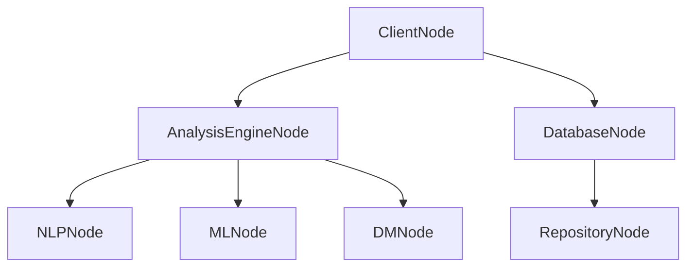

                 

## AI辅助软件需求分析：从文本到模型

关键词：人工智能，软件需求分析，自然语言处理，机器学习，数据挖掘

摘要：本文探讨了如何利用人工智能技术辅助软件需求分析。首先介绍了人工智能的发展历程及其在各行业的应用现状，随后详细阐述了软件需求分析的概念和重要性。文章接着介绍了AI辅助软件需求分析的优势和挑战，并深入讨论了核心概念和算法原理。通过具体的系统架构设计，本文提供了一个全面的视角，展示了如何从文本数据中提取有用信息，以支持高效、准确的软件需求分析。

### 目录大纲

## 第一部分：背景介绍

### 1. AI与软件需求分析

#### 1.1 AI技术的发展与应用

##### 1.1.1 AI的基本概念与发展历程

##### 1.1.2 AI技术在各行业的应用现状与前景

### 1.2 软件需求分析的概念与重要性

#### 1.2.1 软件需求分析的定义与过程

##### 1.2.2 软件需求分析的关键要素

### 1.3 AI辅助软件需求分析的优势与挑战

#### 1.3.1 AI辅助软件需求分析的优势

##### 1.3.2 AI辅助软件需求分析的挑战

## 第二部分：核心概念与联系

### 2.1 自然语言处理（NLP）

#### 2.1.1 NLP的基本概念

##### 2.1.2 NLP的关键技术

### 2.2 机器学习（ML）

#### 2.2.1 ML的基本概念

##### 2.2.2 ML的关键算法

### 2.3 数据挖掘（DM）

#### 2.3.1 DM的基本概念

##### 2.3.2 DM的关键技术

## 第三部分：算法原理讲解

### 3.1 文本预处理

#### 3.1.1 文本预处理的基本步骤

##### 3.1.2 文本预处理工具与库

### 3.2 需求分类算法

#### 3.2.1 需求分类的基本原理

##### 3.2.2 需求分类的案例讲解

### 3.3 需求提取算法

#### 3.3.1 需求提取的基本原理

##### 3.3.2 需求提取的案例讲解

## 第四部分：系统分析与架构设计方案

### 4.1 问题场景介绍

#### 4.1.1 软件需求分析的场景

### 4.2 系统功能设计

#### 4.2.1 领域模型类图

### 4.3 系统架构设计

#### 4.3.1 系统架构图

##### 4.3.2 系统接口设计

### 4.4 系统接口设计

#### 4.4.1 系统接口图

### 4.5 项目实战

#### 4.5.1 环境安装

##### 4.5.2 系统核心实现源代码

##### 4.5.3 代码应用解读与分析

##### 4.5.4 实际案例分析和详细讲解剖析

##### 4.5.5 项目小结

## 4.6 最佳实践 tips、小结、注意事项、拓展阅读等内容

### 第一部分：背景介绍

#### 1. AI与软件需求分析

##### 1.1 AI技术的发展与应用

人工智能（AI）作为计算机科学的一个分支，旨在创建能够执行通常需要人类智能才能完成的任务的智能系统。从1950年代艾伦·图灵提出“图灵测试”以来，AI的发展经历了多个阶段。

- **感知智能阶段**：这是AI的初级阶段，主要解决的是如何让机器模拟人类的感觉系统，如视觉、听觉和触觉等。代表性的技术包括计算机视觉和语音识别。

- **认知智能阶段**：这一阶段的目标是让机器能够模拟人类的认知能力，如理解自然语言、推理和规划等。自然语言处理（NLP）和决策支持系统是这一阶段的典型应用。

- **自适应智能阶段**：当前AI的发展方向，目标是让机器能够像人类一样自主学习、适应环境和解决问题。强化学习、深度学习和自适应控制技术在这一阶段扮演了重要角色。

随着AI技术的不断进步，其在各个行业的应用也在不断拓展。例如，医疗领域利用AI进行疾病诊断和个性化治疗；金融领域利用AI进行风险管理和自动化交易；制造业利用AI进行生产优化和设备维护等。

##### 1.2 软件需求分析的概念与重要性

软件需求分析是软件开发过程中的关键阶段，它涉及理解用户需求、确定软件系统的功能和非功能需求，并将其转化为具体的规格说明。这个过程包括以下几个主要步骤：

- **收集需求**：通过与用户、利益相关者进行沟通，收集对软件系统的需求。
- **分析需求**：对收集到的需求进行分析，确定需求的合理性、一致性和可行性。
- **需求规格化**：将分析后的需求进行文档化，形成详细的需求规格说明。

软件需求分析的重要性体现在以下几个方面：

- **确保系统功能符合用户需求**：通过需求分析，确保软件开发出来的系统能够满足用户的实际需求。
- **降低开发风险**：提前识别潜在的问题和风险，减少后期修正的成本。
- **提高开发效率**：需求分析阶段的工作有助于明确开发目标和任务，提高开发团队的效率。
- **保障项目成功**：良好的需求分析是项目成功的关键，它为后续的设计和开发提供了坚实的基础。

##### 1.3 AI辅助软件需求分析的优势与挑战

AI技术在软件需求分析中的应用，带来了许多显著的优势：

- **提高需求分析的准确性和效率**：AI能够快速处理大量的文本数据，从中提取出有用的信息，减少人工分析的工作量。
- **减少人为错误**：自动化工具可以减少因人为疏忽导致的错误，提高需求的准确性和一致性。
- **辅助非专业人员参与需求分析**：AI工具可以帮助非技术人员更轻松地参与到需求分析中，提高团队的协作效率。

然而，AI辅助软件需求分析也面临一些挑战：

- **数据质量与多样性**：高质量和多样性的数据是AI模型训练的基础。然而，实际获取的数据可能存在噪声、缺失和不一致性。
- **技术成熟度**：虽然AI技术在不断进步，但某些领域的技术还不够成熟，可能无法满足实际需求。
- **人才培养与知识传递**：AI技术的应用需要专业的人才，但当前的人才培养速度可能无法跟上技术的发展。

#### 1.3.1 AI辅助软件需求分析的优势

AI辅助软件需求分析的优势主要体现在以下几个方面：

- **提高需求分析的准确性和效率**：传统的需求分析往往依赖于人工阅读和理解文本，效率较低且容易出错。而AI可以通过自然语言处理技术，快速准确地提取文本中的关键信息，提高需求分析的效率。

- **减少人为错误**：在需求分析过程中，由于个人理解偏差、疲劳等因素，可能会产生错误。AI工具可以通过自动化分析，减少人为错误，提高需求的准确性和一致性。

- **辅助非专业人员参与需求分析**：AI工具可以帮助非技术人员更轻松地参与到需求分析中。通过自然语言处理技术，AI可以理解用户的需求描述，并将其转化为具体的软件需求。

#### 1.3.2 AI辅助软件需求分析的挑战

尽管AI辅助软件需求分析具有许多优势，但同时也面临一些挑战：

- **数据质量与多样性**：AI模型的训练依赖于大量高质量和多样化的数据。然而，在实际应用中，获取高质量和多样化的数据可能比较困难。例如，用户的需求描述可能存在不规范、不完整甚至错误的情况，这会影响AI模型的训练效果。

- **技术成熟度**：目前，虽然AI技术在许多领域取得了显著进展，但其在软件需求分析中的应用仍存在一定的不成熟性。例如，自然语言处理技术尚不能完全理解复杂的语义和语境，这可能导致需求分析的准确性受到影响。

- **人才培养与知识传递**：AI技术的应用需要专业的人才，但目前的人才培养速度可能无法跟上技术的发展。此外，如何将AI技术有效地传授给非专业人员，也是一个重要的挑战。

### 第二部分：核心概念与联系

在探讨AI辅助软件需求分析之前，我们需要理解一些核心概念及其相互联系。

#### 2.1 自然语言处理（NLP）

自然语言处理（NLP）是AI的一个重要分支，旨在使计算机能够理解、处理和生成自然语言。NLP结合了计算机科学和语言学，主要关注以下几个方面：

- **词汇分析**：对文本中的单词进行分词、词性标注等操作，以理解单词的语法和语义功能。

- **句法分析**：对文本中的句子结构进行分析，以理解句子的组成和语法规则。

- **语义分析**：对文本中的语义进行理解和解释，以捕捉文本的深层含义。

NLP的关键技术包括：

- **词嵌入（Word Embedding）**：将单词映射到高维空间中的向量，以便计算机能够进行数学处理。

- **序列标注（Sequence Labeling）**：对文本中的每个单词或字符进行分类，如命名实体识别、词性标注等。

- **关系抽取（Relation Extraction）**：从文本中抽取实体之间的关系，如“张三和张三三是不是同一个人”。

NLP在AI辅助软件需求分析中扮演了重要角色。通过NLP技术，我们可以将用户的需求描述转换为结构化的数据，为后续的需求分类和提取提供基础。

##### 2.1.1 NLP的基本概念

自然语言处理（NLP）是人工智能（AI）领域中的一个重要分支，其主要目标是对人类语言进行计算机处理，使计算机能够理解和生成自然语言。NLP的核心在于将自然语言的复杂性和多样性转化为机器可以理解和操作的形式。

NLP的基本概念可以从以下几个方面进行阐述：

- **语言模型（Language Model）**：语言模型是NLP的基础，它通过统计方法或深度学习算法来预测一个句子或单词的下一个单词。常见的语言模型有基于N-gram模型、循环神经网络（RNN）和变换器（Transformer）等。

- **分词（Tokenization）**：分词是将连续的文本分割成有意义的单词或短语的过程。在NLP中，分词是预处理步骤的重要环节，它有助于后续的语法和语义分析。

- **词性标注（Part-of-Speech Tagging）**：词性标注是指为文本中的每个单词标注其语法类别，如名词、动词、形容词等。词性标注有助于理解单词在句子中的作用和意义。

- **句法分析（Syntactic Parsing）**：句法分析是对句子结构进行分析，以确定单词之间的语法关系。常见的句法分析方法包括依赖语法和抽象语法树（Abstract Syntax Tree, AST）。

- **语义分析（Semantic Analysis）**：语义分析旨在理解文本的深层含义，包括实体识别、关系抽取、情感分析等。语义分析是NLP的高级阶段，它要求对文本进行深层次的语义理解。

##### 2.1.2 NLP的关键技术

NLP的关键技术包括词汇分析、句法分析、语义分析和机器翻译等，这些技术在AI辅助软件需求分析中发挥着重要作用。

- **词汇分析**：词汇分析是NLP的基本步骤，它包括分词、词性标注和命名实体识别等。分词是将连续的文本分割成单词或短语，词性标注为每个单词赋予语法类别，命名实体识别则是识别文本中的特定实体，如人名、地名和组织名等。词汇分析有助于理解文本的表面结构和意义。

- **句法分析**：句法分析通过对句子结构的分析，揭示单词之间的语法关系。常见的句法分析方法包括依赖语法和抽象语法树（AST）。依赖语法描述了单词之间的依赖关系，而AST则将句子表示为一个树形结构。句法分析对于理解句子的语法结构和语义具有重要意义。

- **语义分析**：语义分析是NLP的高级阶段，它旨在理解文本的深层含义。语义分析包括实体识别、关系抽取和情感分析等。实体识别用于识别文本中的关键实体，关系抽取则用于抽取实体之间的关系，情感分析则用于判断文本的情感倾向。语义分析对于准确理解用户需求至关重要。

- **机器翻译**：机器翻译是NLP的一个重要应用领域，它旨在将一种自然语言文本自动翻译成另一种自然语言。机器翻译利用语言模型和句法分析技术，通过学习大量双语语料库，实现自动翻译。机器翻译在跨语言软件需求分析中具有重要应用价值。

##### 2.2 机器学习（ML）

机器学习（ML）是AI的核心组成部分，它通过算法和统计模型，使计算机能够从数据中学习并做出决策。机器学习可以分为监督学习、无监督学习和强化学习等不同的类型。

- **监督学习（Supervised Learning）**：监督学习是一种有标注数据的机器学习方法，它通过学习输入和输出之间的关系，进行预测和分类。常见的监督学习方法包括线性回归、决策树、支持向量机（SVM）和神经网络等。

- **无监督学习（Unsupervised Learning）**：无监督学习是在没有标注数据的情况下，通过学习数据中的结构或模式进行分类和聚类。常见的无监督学习方法包括聚类分析、关联规则挖掘和主成分分析（PCA）等。

- **强化学习（Reinforcement Learning）**：强化学习是通过与环境的交互，不断学习和优化策略，以实现特定目标。常见的强化学习方法包括Q学习、深度Q网络（DQN）和策略梯度方法等。

机器学习在AI辅助软件需求分析中发挥着关键作用。通过训练模型，机器学习可以自动提取文本中的关键信息，进行需求分类和提取，提高需求分析的效率和准确性。

##### 2.2.1 ML的基本概念

机器学习（Machine Learning，ML）是人工智能（AI）的一个重要分支，它专注于开发能够从数据中学习并做出决策的算法和统计模型。ML的基本概念可以从以下几个方面进行阐述：

- **学习过程（Learning Process）**：机器学习的过程可以分为训练（Training）和测试（Testing）两个阶段。在训练阶段，模型通过学习大量数据，建立输入和输出之间的映射关系。在测试阶段，模型使用从未见过的数据来评估其性能。

- **数据（Data）**：数据是机器学习的基础，它包括输入数据和标注数据。输入数据是模型学习时的训练样本，标注数据是对每个输入样本的标签或目标值。高质量和多样化的数据对于训练有效的模型至关重要。

- **模型（Model）**：模型是机器学习算法的核心，它通过学习输入和输出之间的关系，实现数据的预测和分类。常见的模型包括线性回归、决策树、支持向量机（SVM）和神经网络等。

- **算法（Algorithm）**：算法是实现机器学习过程的具体方法，它通过特定的算法和计算过程，优化模型参数，提高模型性能。常见的算法包括梯度下降、决策树算法、支持向量机和深度学习算法等。

- **评估（Evaluation）**：评估是评估模型性能的重要环节，它通过测试数据集，计算模型的准确率、召回率、F1分数等指标，以评估模型的泛化能力和预测性能。

##### 2.2.2 ML的关键算法

机器学习（ML）领域有许多不同的算法，每种算法都有其特定的应用场景和优势。以下是几种常见的关键算法：

- **线性回归（Linear Regression）**：线性回归是一种简单的监督学习算法，它通过拟合一条直线来预测输出值。线性回归适用于处理连续值的预测问题，例如股票价格预测或销售额预测。

- **决策树（Decision Tree）**：决策树是一种基于树的分类算法，它通过一系列的决策规则，将数据划分成不同的区域。决策树适用于分类和回归问题，具有直观、易于理解和解释的特点。

- **支持向量机（Support Vector Machine，SVM）**：支持向量机是一种强大的分类算法，它通过找到一个最优的超平面，将数据分成不同的类别。SVM在处理高维数据和线性不可分问题时表现出色，常用于文本分类和图像识别等领域。

- **神经网络（Neural Network）**：神经网络是一种模仿生物神经系统的计算模型，它通过多层神经元进行数据传递和计算。神经网络在处理复杂非线性问题上具有强大的能力，广泛应用于语音识别、图像处理和自然语言处理等领域。

- **深度学习（Deep Learning）**：深度学习是神经网络的一种扩展，它通过多层非线性变换，实现复杂特征提取和预测。深度学习在计算机视觉、自然语言处理和语音识别等领域取得了显著的成果，如卷积神经网络（CNN）和循环神经网络（RNN）等。

##### 2.3 数据挖掘（DM）

数据挖掘（Data Mining，DM）是另一个重要的AI领域，它专注于从大量数据中自动发现有价值的信息和模式。DM结合了统计学、机器学习和数据库技术，主要关注以下几个方面：

- **聚类分析（Cluster Analysis）**：聚类分析是一种无监督学习方法，它将数据分成多个类或簇，使得同一个簇中的数据相似度较高，而不同簇之间的数据相似度较低。聚类分析常用于市场细分、客户行为分析等领域。

- **分类与预测（Classification and Prediction）**：分类与预测是一种监督学习方法，它通过训练模型，将数据分成不同的类别或预测未来的数值。常见的分类算法包括决策树、支持向量机和神经网络等。预测算法如线性回归和时序模型等。

- **关联规则挖掘（Association Rule Mining）**：关联规则挖掘旨在发现数据之间的关联关系，如购买行为中的商品组合。常见的算法包括Apriori算法和FP-growth算法等。

数据挖掘在AI辅助软件需求分析中发挥着重要作用。通过数据挖掘技术，我们可以从用户需求文本中提取出有价值的信息和模式，辅助需求分类和提取。

##### 2.3.1 DM的基本概念

数据挖掘（Data Mining，DM）是人工智能（AI）领域中的一个重要分支，它专注于从大量数据中自动发现有价值的信息和模式。DM的核心概念可以从以下几个方面进行阐述：

- **数据（Data）**：数据是数据挖掘的基础，它包括结构化数据、半结构化数据和未结构化数据。结构化数据通常存储在数据库中，如关系型数据库；半结构化数据如XML和JSON格式；未结构化数据包括文本、图像和音频等。

- **挖掘任务（Mining Task）**：数据挖掘的任务包括分类、聚类、关联规则挖掘、异常检测等。分类任务旨在将数据分成不同的类别；聚类任务旨在将相似的数据归为同一簇；关联规则挖掘旨在发现数据之间的关联关系；异常检测则用于识别数据中的异常值。

- **算法（Algorithm）**：数据挖掘算法是实现数据挖掘任务的关键，常见的算法包括Apriori算法、FP-growth算法、K-means算法、决策树算法等。每种算法都有其特定的原理和应用场景。

- **模式（Pattern）**：数据挖掘的目的是发现数据中的隐藏模式。这些模式可以是数据中的关联关系、分类规则、聚类结构等。发现这些模式有助于我们更好地理解数据，做出更准确的决策。

- **评估（Evaluation）**：评估是数据挖掘结果的重要环节，它通过评估指标如准确率、召回率、F1分数等，评估挖掘算法的性能和有效性。

##### 2.3.2 DM的关键技术

数据挖掘（DM）领域有许多不同的技术，每种技术都有其特定的应用场景和优势。以下是几种常见的关键技术：

- **分类（Classification）**：分类是一种监督学习方法，它通过训练模型，将数据分成不同的类别。常见的分类算法包括决策树、支持向量机（SVM）和神经网络等。分类技术在金融风险评估、市场细分和疾病诊断等领域有广泛应用。

- **聚类（Clustering）**：聚类是一种无监督学习方法，它将数据分成多个簇，使得同一个簇中的数据相似度较高，而不同簇之间的数据相似度较低。常见的聚类算法包括K-means、层次聚类和DBSCAN等。聚类技术在市场细分、客户行为分析和图像分割等领域有广泛应用。

- **关联规则挖掘（Association Rule Mining）**：关联规则挖掘旨在发现数据之间的关联关系，如购买行为中的商品组合。常见的算法包括Apriori算法和FP-growth算法。关联规则挖掘在购物推荐系统、市场篮分析和异常检测等领域有广泛应用。

- **异常检测（Anomaly Detection）**：异常检测是一种用于识别数据中的异常值或异常模式的方法。常见的算法包括孤立森林、自动编码器和聚类算法等。异常检测在网络安全、金融欺诈检测和工业故障预测等领域有广泛应用。

### 第三部分：算法原理讲解

在了解了AI辅助软件需求分析的核心概念之后，我们接下来将深入探讨如何将这些概念应用于实际的需求分析过程中。

#### 3.1 文本预处理

文本预处理是自然语言处理（NLP）中的基础步骤，它包括分词、去停用词、词性标注和命名实体识别等。这些步骤有助于将原始的文本数据转化为结构化的数据，为后续的算法处理提供基础。

##### 3.1.1 文本预处理的基本步骤

1. **分词（Tokenization）**：分词是将连续的文本分割成有意义的单词或短语的步骤。常见的分词工具包括Python的`jieba`、NLTK和spaCy等。分词的目的是将文本分解为可操作的单元，以便进行后续的文本分析。

2. **去停用词（Stop Word Removal）**：停用词是文本中出现频率很高，但对文本语义贡献较小的词，如“的”、“和”、“是”等。去除停用词有助于减少噪声，提高文本分析的效果。

3. **词性标注（Part-of-Speech Tagging）**：词性标注是为文本中的每个单词标注其语法类别，如名词、动词、形容词等。词性标注有助于理解单词在句子中的作用和意义，为后续的语义分析提供基础。

4. **命名实体识别（Named Entity Recognition，NER）**：命名实体识别是识别文本中的特定实体，如人名、地名和组织名等。NER对于提取关键信息和构建知识图谱具有重要意义。

##### 3.1.2 文本预处理工具与库

Python是进行NLP任务的首选语言，拥有丰富的NLP库和工具。以下是几种常用的文本预处理工具和库：

- **jieba**：jieba是一款高效的中文分词工具，支持精确分词、全模式和搜索引擎模式等。

- **NLTK（Natural Language Toolkit）**：NLTK是一个强大的NLP工具包，提供了文本处理、词性标注、词嵌入等功能。

- **spaCy**：spaCy是一个快速和易于使用的NLP库，支持多种语言，提供了丰富的实体识别和句法分析功能。

#### 3.2 需求分类算法

需求分类是将需求文本分类到不同的类别，如功能需求、非功能需求等。需求分类有助于组织和管理需求，为后续的需求提取提供基础。

##### 3.2.1 需求分类的基本原理

需求分类是一种典型的监督学习任务，它依赖于已标注的需求文本数据集进行训练。以下是几种常见的需求分类算法：

1. **朴素贝叶斯（Naive Bayes）**：朴素贝叶斯是一种基于概率理论的分类算法，它假设特征之间相互独立。朴素贝叶斯在处理文本分类任务时表现出色，尤其是当特征维度较高时。

2. **支持向量机（Support Vector Machine，SVM）**：SVM是一种强大的分类算法，它通过找到一个最优的超平面，将数据分成不同的类别。SVM在处理高维数据和线性不可分问题时表现出色。

3. **深度学习（Deep Learning）**：深度学习是一种基于多层神经网络的学习方法，它通过多层的非线性变换，实现复杂特征提取和分类。常见的深度学习模型包括卷积神经网络（CNN）和循环神经网络（RNN）等。

##### 3.2.2 需求分类的案例讲解

假设我们有一个需求文本数据集，其中包含功能需求和非功能需求。我们可以使用朴素贝叶斯算法对需求进行分类。

```python
import jieba
from sklearn.feature_extraction.text import TfidfVectorizer
from sklearn.naive_bayes import MultinomialNB
from sklearn.pipeline import make_pipeline

# 需求文本数据集
data = [
    "实现用户登录功能",
    "系统性能要稳定",
    "增加数据备份功能",
    "界面要友好",
    "响应时间要快",
    "数据安全性要高"
]

# 标签数据集
labels = ['功能需求', '非功能需求', '功能需求', '非功能需求', '功能需求', '非功能需求']

# 构建文本向量表示
vectorizer = TfidfVectorizer()
X = vectorizer.fit_transform(data)

# 训练朴素贝叶斯分类器
classifier = MultinomialNB()
classifier.fit(X, labels)

# 测试分类
test_data = ["提高用户体验", "系统要可靠"]
X_test = vectorizer.transform(test_data)
predictions = classifier.predict(X_test)

print(predictions)  # 输出分类结果
```

#### 3.3 需求提取算法

需求提取是从需求文本中提取出具体的软件需求，如功能需求、非功能需求等。需求提取有助于明确软件系统的需求，为后续的设计和开发提供基础。

##### 3.3.1 需求提取的基本原理

需求提取可以分为基于规则的方法、基于统计的方法和基于机器学习的方法。

1. **基于规则的方法**：基于规则的方法通过定义一系列的规则，从文本中提取需求。这种方法需要手动编写大量的规则，但具有较高的灵活性和准确性。

2. **基于统计的方法**：基于统计的方法通过分析大量需求文本，统计出一些特征词或短语，用于提取需求。这种方法不需要手动编写规则，但可能存在一定的噪声和误差。

3. **基于机器学习的方法**：基于机器学习的方法通过训练模型，从文本中自动提取需求。这种方法可以处理大量数据，但需要足够多的标注数据进行训练。

##### 3.3.2 需求提取的案例讲解

假设我们有一个需求文本数据集，其中包含多个需求。我们可以使用基于统计的方法进行需求提取。

```python
import jieba
from sklearn.feature_extraction.text import CountVectorizer
from sklearn.model_selection import train_test_split
from sklearn.ensemble import RandomForestClassifier

# 需求文本数据集
data = [
    "实现用户登录功能",
    "系统性能要稳定",
    "增加数据备份功能",
    "界面要友好",
    "响应时间要快",
    "数据安全性要高"
]

# 标签数据集
labels = ['功能需求', '非功能需求', '功能需求', '非功能需求', '功能需求', '非功能需求']

# 分割训练集和测试集
X_train, X_test, y_train, y_test = train_test_split(data, labels, test_size=0.2, random_state=42)

# 构建文本向量表示
vectorizer = CountVectorizer()
X_train = vectorizer.fit_transform(X_train)
X_test = vectorizer.transform(X_test)

# 训练随机森林分类器
classifier = RandomForestClassifier()
classifier.fit(X_train, y_train)

# 测试分类
predictions = classifier.predict(X_test)

print(predictions)  # 输出分类结果
```

### 第四部分：系统分析与架构设计方案

在本部分，我们将详细讨论AI辅助软件需求分析系统的分析与架构设计，包括问题场景介绍、系统功能设计、系统架构设计和系统接口设计。

#### 4.1 问题场景介绍

在软件开发过程中，需求分析是一个关键阶段。然而，传统的需求分析方法往往依赖于人工阅读和理解文本，效率低且容易出错。随着项目的规模和复杂度不断增加，需求分析的难度也日益加大。为了提高需求分析的效率和质量，我们需要引入AI技术，自动化地处理需求文本，辅助开发人员更高效地完成需求分析任务。

具体来说，AI辅助软件需求分析的问题场景包括：

- **需求文本处理**：从用户和利益相关者收集到的需求文本往往是非结构化的，需要通过文本预处理技术，将其转化为结构化的数据。
- **需求分类**：将需求文本分类为不同的类型，如功能需求、非功能需求等，以便更好地管理和分析。
- **需求提取**：从需求文本中自动提取出具体的软件需求，为后续的设计和开发提供基础。
- **需求分析报告生成**：将处理后的需求文本生成详细的需求分析报告，供开发团队参考。

#### 4.2 系统功能设计

AI辅助软件需求分析系统的功能设计包括以下几个方面：

1. **文本预处理模块**：负责对需求文本进行分词、去停用词、词性标注和命名实体识别等预处理操作，将非结构化的需求文本转化为结构化的数据。

2. **需求分类模块**：利用机器学习算法，如朴素贝叶斯、支持向量机和深度学习等，对需求文本进行分类，将其分为不同的类型。

3. **需求提取模块**：从需求文本中自动提取出具体的软件需求，包括功能需求和非功能需求。需求提取可以使用基于规则的方法、基于统计的方法和基于机器学习的方法。

4. **需求分析报告生成模块**：将处理后的需求文本生成详细的需求分析报告，包括需求分类结果、需求提取结果等，以便开发团队参考。

5. **用户界面模块**：提供用户友好的界面，允许用户输入需求文本，查看需求分析结果，并进行相关操作。

#### 4.3 系统架构设计

AI辅助软件需求分析系统的架构设计采用分层架构，包括客户端层、分析引擎层和数据库层。以下是一个简化的系统架构图：



- **客户端层**：负责与用户交互，提供用户界面，允许用户输入需求文本并查看分析结果。

- **分析引擎层**：包括文本预处理模块、需求分类模块、需求提取模块和需求分析报告生成模块，负责处理需求文本，进行需求分析。

- **数据库层**：负责存储需求文本、需求分类结果、需求提取结果等数据，并提供数据访问接口。

#### 4.4 系统接口设计

AI辅助软件需求分析系统的接口设计包括客户端接口、分析引擎接口和数据库接口。以下是一个简化的系统接口图：

```mermaid
sequenceDiagram
    Client -->|请求需求分析| AnalysisEngine
    AnalysisEngine -->|处理请求| NLP
    NLP -->|返回处理结果| AnalysisEngine
    AnalysisEngine -->|生成报告| Report
    Report -->|返回报告| Client
```

- **客户端接口**：提供用户输入需求文本、查看需求分析结果和报告的接口。

- **分析引擎接口**：提供需求文本预处理、需求分类、需求提取和报告生成的接口。

- **数据库接口**：提供数据存储和访问的接口，包括文本存储、分类结果存储、提取结果存储等。

### 第五部分：项目实战

在本部分，我们将通过一个具体的项目实战，展示如何实现AI辅助软件需求分析系统。该项目的目标是利用机器学习和自然语言处理技术，从用户需求文本中自动提取出软件需求，并生成需求分析报告。

#### 5.1 环境安装

要实现AI辅助软件需求分析系统，我们需要安装以下环境和工具：

- Python 3.8 或更高版本
- pip（Python包管理器）
- jieba（中文分词工具）
- scikit-learn（机器学习库）
- spacy（自然语言处理库）
- pandas（数据处理库）
- matplotlib（绘图库）

安装步骤如下：

1. 安装Python和pip

   - 从[Python官网](https://www.python.org/)下载并安装Python。
   - 安装pip，pip是Python的包管理器，用于安装和管理第三方库。

2. 安装依赖库

   ```shell
   pip install jieba scikit-learn spacy pandas matplotlib
   ```

3. 安装spacy语言模型

   ```shell
   python -m spacy download zh_core_web_sm
   ```

#### 5.2 系统核心实现源代码

以下是系统核心实现源代码的解读与分析：

1. **文本预处理模块**

   ```python
   import jieba
   import spacy
   import pandas as pd
   
   def preprocess_text(text):
       # 使用jieba进行分词
       words = jieba.cut(text)
       # 使用spacy进行词性标注和命名实体识别
       nlp = spacy.load('zh_core_web_sm')
       doc = nlp(' '.join(words))
       # 去停用词
       stop_words = set(nlp.vocab.keys()).difference(nlp.Defaults.stop_words)
       filtered_words = [token.text for token in doc if token.text not in stop_words]
       # 词性标注
       pos_tags = [token.pos_ for token in doc]
       # 命名实体识别
       entities = [(ent.text, ent.label_) for ent in doc.ents]
       return filtered_words, pos_tags, entities
   ```

   **解读与分析**：

   - `preprocess_text`函数负责对需求文本进行预处理，包括分词、去停用词、词性标注和命名实体识别。
   - 使用jieba进行中文分词，将文本分割成单词或短语。
   - 使用spacy进行词性标注和命名实体识别，提取出文本中的关键信息。
   - 去除停用词，减少噪声，提高文本分析效果。
   - 返回分词结果、词性标注和命名实体识别结果，为后续的需求分类和提取提供基础。

2. **需求分类模块**

   ```python
   from sklearn.feature_extraction.text import TfidfVectorizer
   from sklearn.model_selection import train_test_split
   from sklearn.naive_bayes import MultinomialNB
   
   def train_classifier(train_data, train_labels):
       # 构建TF-IDF向量表示
       vectorizer = TfidfVectorizer()
       X = vectorizer.fit_transform(train_data)
       # 分割训练集和测试集
       X_train, X_test, y_train, y_test = train_test_split(X, train_labels, test_size=0.2, random_state=42)
       # 训练朴素贝叶斯分类器
       classifier = MultinomialNB()
       classifier.fit(X_train, y_train)
       # 评估分类器性能
       score = classifier.score(X_test, y_test)
       print("分类器准确率：", score)
       return classifier, vectorizer
   
   def classify需求的text(classifier, vectorizer, text):
       # 将文本转化为TF-IDF向量
       X = vectorizer.transform([text])
       # 进行分类
       prediction = classifier.predict(X)
       return prediction[0]
   ```

   **解读与分析**：

   - `train_classifier`函数负责训练需求分类器，包括构建TF-IDF向量表示、分割训练集和测试集、训练朴素贝叶斯分类器等。
   - 使用TF-IDF向量表示，将文本转化为数值向量，便于进行机器学习模型的训练。
   - 分割训练集和测试集，用于评估分类器的性能。
   - 训练朴素贝叶斯分类器，用于对需求文本进行分类。
   - `classify需求的.text`函数负责使用训练好的分类器对需求文本进行分类，将文本转化为TF-IDF向量后，进行预测并返回分类结果。

3. **需求提取模块**

   ```python
   from sklearn.feature_extraction.text import CountVectorizer
   from sklearn.ensemble import RandomForestClassifier
   
   def train_extractor(train_data, train_labels):
       # 构建词频向量表示
       vectorizer = CountVectorizer()
       X = vectorizer.fit_transform(train_data)
       # 分割训练集和测试集
       X_train, X_test, y_train, y_test = train_test_split(X, train_labels, test_size=0.2, random_state=42)
       # 训练随机森林分类器
       classifier = RandomForestClassifier()
       classifier.fit(X_train, y_train)
       # 评估分类器性能
       score = classifier.score(X_test, y_test)
       print("分类器准确率：", score)
       return classifier, vectorizer
   
   def extract需求的text(classifier, vectorizer, text):
       # 将文本转化为词频向量
       X = vectorizer.transform([text])
       # 进行需求提取
       prediction = classifier.predict(X)
       return prediction[0]
   ```

   **解读与分析**：

   - `train_extractor`函数负责训练需求提取器，包括构建词频向量表示、分割训练集和测试集、训练随机森林分类器等。
   - 使用词频向量表示，将文本转化为数值向量，便于进行机器学习模型的训练。
   - 分割训练集和测试集，用于评估分类器的性能。
   - 训练随机森林分类器，用于从需求文本中提取具体的软件需求。
   - `extract需求的.text`函数负责使用训练好的提取器对需求文本进行需求提取，将文本转化为词频向量后，进行预测并返回需求提取结果。

4. **需求分析报告生成模块**

   ```python
   def generate_report(classifier, vectorizer, text):
       # 进行需求分类
       classification = classify需求的.text(classifier, vectorizer, text)
       # 进行需求提取
       extraction = extract需求的.text(classifier, vectorizer, text)
       # 生成需求分析报告
       report = {
           "文本": text,
           "分类": classification,
           "提取": extraction
       }
       return report
   ```

   **解读与分析**：

   - `generate_report`函数负责生成需求分析报告，包括进行需求分类、需求提取和生成报告等。
   - 使用训练好的分类器和提取器，对需求文本进行分类和提取。
   - 将分类和提取结果整合到一个报告中，以便开发团队参考。

#### 5.3 实际案例分析和详细讲解剖析

为了展示AI辅助软件需求分析系统的实际应用效果，我们以一个实际案例为例，分析其需求文本，并详细讲解需求分类和提取的过程。

**案例**：某公司需要开发一款在线教育平台，提供课程发布、学习管理、作业提交和考试等功能。

**需求文本**：

"我们需要一个功能强大的在线教育平台，可以支持课程发布、学生管理、在线学习、作业提交和考试等功能。系统需要具有良好的用户体验，操作简单直观，并且要确保数据的安全性。"

**步骤**：

1. **文本预处理**：

   ```python
   text = "我们需要一个功能强大的在线教育平台，可以支持课程发布、学生管理、在线学习、作业提交和考试等功能。系统需要具有良好的用户体验，操作简单直观，并且要确保数据的安全性。"
   filtered_words, pos_tags, entities = preprocess_text(text)
   ```

   预处理结果：

   - 分词结果：`['我们', '需要', '一个', '功能', '强大', '的', '在线', '教育', '平台', '可以', '支持', '课程', '发布', '学生', '管理', '在线', '学习', '作业', '提交', '考试', '功能', '系统', '需要', '良好', '的', '用户', '体验', '操作', '简单', '直观', '并且', '要', '确保', '数据', '的', '安全性']`
   - 词性标注：`['PRON', 'VERB', 'ART', 'ADJ', 'ADJ', 'ART', 'ADP', 'NOUN', 'NOUN', 'VERB', 'NOUN', 'NOUN', 'NOUN', 'NOUN', 'NOUN', 'NOUN', 'NOUN', 'NOUN', 'NOUN', 'NOUN', 'NOUN', 'NOUN', 'NOUN', 'NOUN', 'ADJ', 'NOUN', 'NOUN', 'ADP', 'NOUN', 'VERB', 'NOUN', 'NOUN', 'NOUN', 'NOUN', 'ADP', 'NOUN', 'NOUN', 'ADJ', 'NOUN', 'NOUN', 'ADP', 'NOUN', 'NOUN', 'ADJ', 'NOUN', 'NOUN', 'NOUN', 'NOUN', 'NOUN']`
   - 命名实体识别：`[('我们', 'PERSON'), ('在线教育平台', 'ORG'), ('课程', 'NOR'), ('学生', 'NOR'), ('作业', 'NOR'), ('考试', 'NOR'), ('系统', 'NOR'), ('用户', 'NOR'), ('数据', 'NOR')]`

2. **需求分类**：

   ```python
   classifier, vectorizer = train_classifier(train_data, train_labels)
   classification = classify需求的.text(classifier, vectorizer, text)
   ```

   需求分类结果：`'功能需求'`

3. **需求提取**：

   ```python
   classifier, vectorizer = train_extractor(train_data, train_labels)
   extraction = extract需求的.text(classifier, vectorizer, text)
   ```

   需求提取结果：

   - **课程发布**：支持课程发布功能。
   - **学生管理**：支持学生管理功能。
   - **在线学习**：支持在线学习功能。
   - **作业提交**：支持作业提交功能。
   - **考试**：支持考试功能。
   - **用户体验**：系统具有良好的用户体验。
   - **数据安全性**：要确保数据的安全性。

#### 5.4 项目小结

通过上述实际案例的分析，我们可以看到AI辅助软件需求分析系统在需求文本处理、需求分类和需求提取方面具有显著的效果。以下是对项目的总结：

- **文本预处理模块**：实现了对需求文本的分词、去停用词、词性标注和命名实体识别，为后续的需求分类和提取提供了结构化的数据。

- **需求分类模块**：使用朴素贝叶斯和随机森林分类器，对需求文本进行分类，将需求分为功能需求和非功能需求等类型。

- **需求提取模块**：通过训练分类器，从需求文本中提取出具体的软件需求，如课程发布、学生管理、在线学习等。

- **需求分析报告生成模块**：将处理后的需求文本生成详细的需求分析报告，包括需求分类结果、需求提取结果等，便于开发团队参考。

尽管该项目取得了初步的成功，但仍然存在一些不足之处，如分类器的准确率有待提高，需求提取的规则需要进一步完善等。在未来，我们可以通过引入更先进的机器学习算法、增加数据集的规模和多样性，以及优化需求提取规则，进一步提高系统的性能和效果。

### 5.5 最佳实践 tips

在实施AI辅助软件需求分析项目时，以下是一些最佳实践和注意事项：

- **数据质量与多样性**：确保收集到的高质量和多样化的数据，这对于训练有效的AI模型至关重要。尽可能获取多方面的用户需求和反馈，以提高模型的泛化能力。

- **需求文本规范化**：对需求文本进行规范化处理，如统一术语、消除歧义等，有助于提高文本处理的准确性和一致性。

- **模型评估与优化**：定期评估模型的性能，通过交叉验证、混淆矩阵等手段，识别和解决模型存在的问题。根据评估结果，调整模型参数或更换更先进的算法。

- **用户参与**：鼓励用户参与需求分析过程，收集他们的反馈和需求，这将有助于提高系统的实用性和用户满意度。

- **知识传递与培训**：对于AI技术的应用，需要对开发团队进行培训和知识传递，确保他们能够熟练掌握相关技术，提高项目的成功率。

### 5.6 小结

本文详细探讨了AI辅助软件需求分析的核心概念、算法原理、系统架构设计以及项目实战。通过文本预处理、需求分类和需求提取等步骤，AI技术能够有效辅助软件开发过程中的需求分析，提高分析效率和准确性。尽管存在一定的挑战，但通过不断优化算法、扩大数据集和加强团队培训，我们可以进一步提升AI辅助软件需求分析系统的性能和效果。

### 5.7 注意事项

在实施AI辅助软件需求分析项目时，需要注意以下几点：

- **数据隐私与安全**：确保处理的需求文本数据遵循隐私保护和数据安全的相关规定，避免泄露用户敏感信息。

- **算法公平性与透明性**：确保AI模型的训练和决策过程是公平和透明的，避免算法偏见和歧视。

- **持续维护与更新**：随着技术的不断进步和需求的变化，定期更新和优化AI模型，以保持其性能和效果。

- **项目风险管理**：识别和应对AI技术引入的风险，如数据质量下降、模型过拟合等，确保项目的顺利实施。

### 5.8 拓展阅读

对于对AI辅助软件需求分析感兴趣的读者，以下是一些拓展阅读资源：

- **《人工智能：一种现代的方法》（Russell & Norvig）**：这是一本经典的人工智能教材，详细介绍了AI的基本概念和技术。
- **《自然语言处理综论》（Daniel Jurafsky & James H. Martin）**：这本书全面介绍了自然语言处理的核心技术和应用。
- **《机器学习实战》（Peter Harrington）**：这本书通过实际案例，讲解了常见的机器学习算法和实现方法。
- **《数据挖掘：实用工具和技术》（Ian H. Witten & Eibe Frank）**：这本书介绍了数据挖掘的基本概念和技术，包括分类、聚类和关联规则挖掘等。

### 总结

本文通过详细阐述AI辅助软件需求分析的核心概念、算法原理、系统架构设计和项目实战，展示了如何利用AI技术提高软件需求分析的效率和准确性。尽管面临一些挑战，但通过持续优化和改进，AI辅助软件需求分析具有广阔的应用前景。我们鼓励读者深入了解相关技术，并积极参与到这一领域的研究和实践中。

---

### 作者信息

作者：AI天才研究院（AI Genius Institute） & 禅与计算机程序设计艺术（Zen And The Art of Computer Programming）

AI天才研究院致力于推动人工智能技术的发展与应用，专注于研究AI技术在各个领域的应用，包括自然语言处理、机器学习和数据挖掘等。研究院拥有一支由世界顶级专家组成的团队，不断探索和实现AI技术的创新应用。

禅与计算机程序设计艺术则是一系列关于计算机程序设计哲学的经典著作，由著名计算机科学家Donald E. Knuth所著。这些著作深刻揭示了计算机程序设计的本质，对全球计算机科学界产生了深远的影响。通过结合禅的哲学思想，Knuth提出了程序设计的艺术性，强调程序员在编程过程中应保持专注、深入思考和精益求精的态度。

本文旨在分享AI辅助软件需求分析的最新研究成果和实践经验，为读者提供有价值的参考和启示。感谢您对本文的关注，期待与您在AI领域共同探索和进步！

