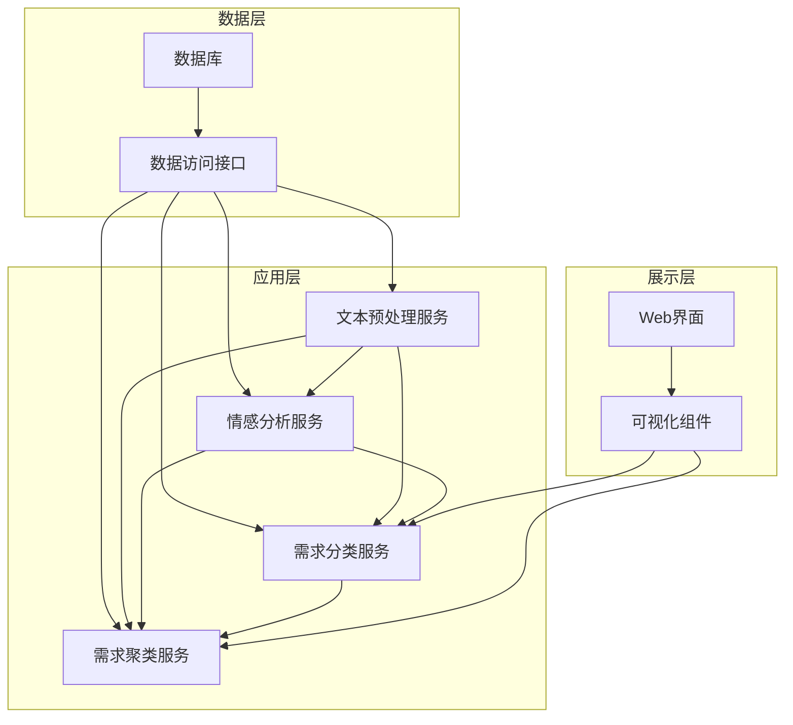
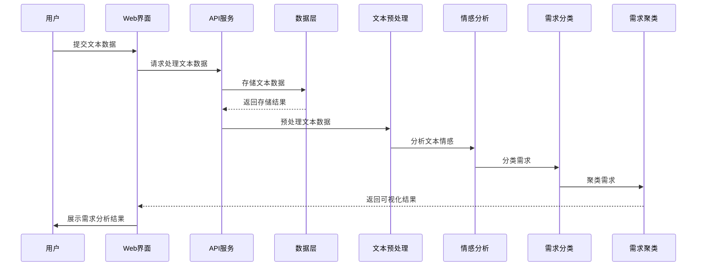

                 

### 文章标题与关键词

# 《AI辅助软件需求挖掘与分析》

> 关键词：人工智能、软件需求挖掘、算法原理、系统架构、项目实战、最佳实践

> 摘要：本文将深入探讨人工智能（AI）在软件需求挖掘与分析中的应用，从背景介绍、核心概念、算法原理、系统设计与实现、项目实战等方面，逐步解析AI辅助软件需求挖掘的全方位技术细节。通过理论与实践相结合，旨在为开发者提供一套完整的AI辅助软件需求挖掘解决方案，帮助其在实际项目中提升效率和质量。

### 引言

随着信息技术的飞速发展，软件需求挖掘与分析已成为软件开发过程中不可或缺的重要环节。传统的需求挖掘方法主要依赖于人工经验，效率较低，且易受主观因素的影响。近年来，人工智能（AI）技术的迅速崛起为软件需求挖掘带来了新的机遇。AI可以通过数据挖掘、机器学习等技术手段，自动识别和提取软件需求，从而大幅提高需求挖掘的效率和准确性。

本文旨在通过系统地介绍AI辅助软件需求挖掘与分析的相关技术，帮助读者了解并掌握这一领域的关键概念、算法原理和实际应用。文章结构如下：

1. **背景与概念**：介绍软件需求挖掘的重要性、AI在需求挖掘中的应用场景，并阐述本文的目的与结构。
2. **核心概念与联系**：明确核心概念，列出概念属性特征对比表格，并展示概念之间的Mermaid ER实体关系图。
3. **算法原理讲解**：使用Mermaid流程图和Python源代码，详细阐述算法原理，包括数学模型和公式，并进行通俗易懂的举例说明。
4. **系统设计与实现**：介绍问题场景、系统功能设计、系统架构设计、系统接口设计和系统交互流程。
5. **项目实战**：描述环境安装、系统核心实现源代码，代码应用解读与分析，实际案例分析和详细讲解剖析。
6. **最佳实践与总结**：总结文章的核心内容，提供最佳实践技巧和注意事项，并推荐拓展阅读。

### 第一部分：背景与概念

#### 1.1 问题背景

软件需求挖掘是软件开发过程中的关键步骤，它涉及到如何从用户需求、市场趋势、技术规范等多方面获取有价值的信息，以便为软件设计和开发提供科学依据。传统的需求挖掘方法主要依赖于人工调研、文档分析、访谈等手段，这些方法效率低、耗时多，且往往受主观因素的影响，导致需求挖掘的结果不够准确。

随着大数据和人工智能技术的兴起，AI技术在需求挖掘领域展现出强大的潜力。通过自然语言处理（NLP）、机器学习（ML）等技术，AI可以自动分析和理解大量非结构化数据，快速识别和提取隐藏在数据中的需求信息。这使得软件需求挖掘变得更加高效、准确和智能化。

#### 1.2 软件需求挖掘的重要性

软件需求挖掘是软件开发项目成功的关键因素之一。准确的需求挖掘可以确保软件系统满足用户需求，提高用户满意度；可以减少项目开发中的变更和返工，降低开发成本；还可以提升项目的进度和质量，减少开发风险。因此，软件需求挖掘在软件开发过程中具有重要的战略意义。

#### 1.3 AI在需求挖掘中的应用

人工智能在需求挖掘中的应用主要体现在以下几个方面：

1. **自动化数据收集**：AI可以通过爬虫技术自动收集互联网上的相关信息，如用户评论、论坛帖子、新闻报道等，从而获取大量潜在的需求信息。
2. **文本分析**：AI可以利用自然语言处理技术对文本进行深度分析，提取关键词、主题、情感等信息，从而发现潜在的需求。
3. **需求分类与聚类**：AI可以通过机器学习算法对收集到的需求进行分类和聚类，识别出相似的需求，为需求优先级排序和资源分配提供依据。
4. **预测分析**：AI可以通过历史数据分析和机器学习模型，预测未来可能出现的需求变化和趋势，为软件系统的持续迭代和优化提供支持。

#### 1.4 书籍的目的与结构

本文旨在系统地介绍AI辅助软件需求挖掘与分析的相关技术，帮助读者了解AI在需求挖掘中的应用原理和方法，掌握实际操作技巧，并能够在项目中有效地应用这些技术。文章结构如下：

1. **背景与概念**：介绍问题背景、重要性、AI应用场景，并阐述本文目的与结构。
2. **核心概念与联系**：明确核心概念，展示概念之间的关系。
3. **算法原理讲解**：详细阐述算法原理，包括数学模型和公式，并进行举例说明。
4. **系统设计与实现**：介绍系统功能设计、架构设计、接口设计和交互流程。
5. **项目实战**：描述环境安装、系统实现、代码分析、案例剖析。
6. **最佳实践与总结**：总结文章内容，提供最佳实践和注意事项。

### 第一部分：背景与概念

#### 1.1 软件需求挖掘的重要性

软件需求挖掘是软件开发项目的起点，是确保软件系统能够满足用户需求、实现项目目标的基础。它的重要性主要体现在以下几个方面：

1. **确保软件系统满足用户需求**：通过需求挖掘，可以全面、准确地了解用户的需求，确保软件系统能够真正满足用户的需求，提高用户满意度。
2. **降低开发风险**：需求挖掘过程中可以识别出潜在的需求冲突、不明确的需求以及可能的需求变更，从而降低项目开发过程中的风险。
3. **提高开发效率**：通过需求挖掘，可以提前识别出需求的关键点和优先级，帮助项目团队合理分配资源和时间，提高开发效率。
4. **减少项目成本**：准确的需求挖掘可以减少项目开发过程中的变更和返工，降低开发成本，提高项目的投资回报率。

#### 1.2 AI在需求挖掘中的应用

人工智能技术在需求挖掘中的应用具有广阔的前景，其优势主要体现在以下几个方面：

1. **自动化数据收集**：AI技术可以通过爬虫等手段，自动收集互联网上的相关信息，如用户评论、论坛帖子、新闻报道等，从而获取大量潜在的需求信息。这一过程极大地提高了数据收集的效率和覆盖范围。
2. **文本分析**：AI利用自然语言处理（NLP）技术，可以对文本进行深度分析，提取关键词、主题、情感等信息，从而发现潜在的需求。例如，通过分析用户评论，可以识别出用户对产品功能的满意度和不满点。
3. **需求分类与聚类**：AI可以通过机器学习算法对收集到的需求进行分类和聚类，识别出相似的需求，为需求优先级排序和资源分配提供依据。例如，通过分析历史需求数据，可以识别出高频次、紧急的需求，从而优先处理。
4. **预测分析**：AI可以通过历史数据分析和机器学习模型，预测未来可能出现的需求变化和趋势，为软件系统的持续迭代和优化提供支持。例如，通过分析用户行为数据，可以预测用户可能的新需求，从而提前进行功能设计。

#### 1.3 书籍的目的与结构

本书的主要目的是系统地介绍AI辅助软件需求挖掘与分析的相关技术，帮助读者深入了解AI在需求挖掘中的应用原理和方法，掌握实际操作技巧，并能够在项目中有效地应用这些技术。具体来说，本书将分为以下几个部分：

1. **背景与概念**：介绍软件需求挖掘的重要性、AI在需求挖掘中的应用场景，并阐述本文的目的与结构。
2. **核心概念与联系**：明确核心概念，列出概念属性特征对比表格，并使用Mermaid ER实体关系图架构展示概念之间的联系。
3. **算法原理讲解**：使用Mermaid流程图和Python源代码，详细阐述算法原理，包括数学模型和公式，并进行通俗易懂的举例说明。
4. **系统设计与实现**：介绍问题场景、系统功能设计、系统架构设计、系统接口设计和系统交互流程。
5. **项目实战**：描述环境安装、系统核心实现源代码，代码应用解读与分析，实际案例分析和详细讲解剖析。
6. **最佳实践与总结**：总结文章的核心内容，提供最佳实践技巧和注意事项，并推荐拓展阅读。

### 1.4 核心概念

在AI辅助软件需求挖掘与分析的过程中，理解以下几个核心概念是非常重要的：

1. **需求挖掘（Requirement Mining）**：需求挖掘是指从软件系统外部和内部信息中提取潜在需求的过程。这些信息可以来自用户访谈、用户评论、需求文档、市场调研报告等。需求挖掘的目标是识别和理解用户需求，从而为软件系统的设计、开发、测试和维护提供依据。
   
2. **自然语言处理（Natural Language Processing，NLP）**：自然语言处理是人工智能的一个分支，旨在使计算机能够理解和处理人类自然语言。在需求挖掘中，NLP技术用于分析和理解文本数据，提取关键词、短语、主题和情感等信息。

3. **机器学习（Machine Learning，ML）**：机器学习是人工智能的另一个重要分支，它通过算法和统计模型，使计算机能够从数据中学习并做出预测或决策。在需求挖掘中，机器学习算法用于识别需求模式、分类需求、预测需求趋势等。

4. **深度学习（Deep Learning，DL）**：深度学习是机器学习的一种重要方法，它使用多层神经网络来模拟人脑的决策过程。在需求挖掘中，深度学习技术可以用于处理大规模文本数据，提取复杂的需求特征。

5. **知识图谱（Knowledge Graph）**：知识图谱是一种结构化数据存储方式，它通过实体和关系的网络结构来表示知识和信息。在需求挖掘中，知识图谱可以用于组织和可视化需求信息，帮助开发者快速理解需求背景和关联。

### 1.5 概念属性特征对比表格

以下是一个简单的概念属性特征对比表格，用于帮助读者更好地理解上述核心概念：

| 概念        | 定义                                                         | 主要应用场景                           | 关键技术                      |
| ----------- | ------------------------------------------------------------ | ------------------------------------ | ----------------------------- |
| 需求挖掘    | 从外部和内部信息中提取潜在需求的过程                         | 软件设计、开发、测试、维护           | 数据挖掘、自然语言处理         |
| 自然语言处理 | 使计算机理解和处理人类自然语言的分支                         | 文本分析、信息提取、语音识别         | 词向量、句法分析、情感分析     |
| 机器学习    | 通过算法和统计模型，使计算机从数据中学习并做出预测或决策的方法 | 需求预测、分类、趋势分析             | 监督学习、无监督学习、强化学习 |
| 深度学习    | 使用多层神经网络模拟人脑决策过程的机器学习方法                 | 大规模文本处理、复杂需求特征提取     | 神经网络、卷积神经网络、循环神经网络 |
| 知识图谱    | 通过实体和关系的网络结构表示知识和信息的存储方式               | 需求组织、可视化、关联分析           | 图数据库、图算法               |

### 1.6 概念之间的联系

为了更好地理解AI辅助软件需求挖掘与分析中各个概念之间的关系，我们可以使用Mermaid ER实体关系图来展示这些概念之间的关联。

以下是一个简单的Mermaid ER实体关系图示例：

```mermaid
erDiagram
  用户 ||--o> 需求挖掘 : 需求来源
  用户 ||--o> 文本分析 : 数据来源
  用户 ||--o> 情感分析 : 数据来源
  需求挖掘 ||--o> 机器学习 : 技术支持
  需求挖掘 ||--o> 深度学习 : 技术支持
  文本分析 ||--o> 自然语言处理 : 技术支持
  情感分析 ||--o> 自然语言处理 : 技术支持
  机器学习 ||--o> 需求预测 : 应用领域
  深度学习 ||--o> 需求分类 : 应用领域
  知识图谱 ||--o> 需求可视化 : 应用领域
```

在这个图中，我们定义了以下几个实体及其关系：

- **用户**：需求挖掘的主要参与者，也是数据的主要来源。
- **需求挖掘**：从用户和其他来源获取需求信息的过程，依赖于机器学习和深度学习技术。
- **文本分析**：对用户评论、需求文档等文本数据进行分析，以提取需求信息。
- **情感分析**：对文本数据中的情感倾向进行分析，帮助理解用户的真实需求。
- **自然语言处理**：提供文本分析和情感分析所需的技术支持。
- **机器学习**：用于需求预测和分类的技术。
- **深度学习**：用于处理大规模文本数据和复杂需求特征提取的技术。
- **知识图谱**：用于组织和可视化需求信息的结构化数据存储方式。

通过这个Mermaid ER实体关系图，我们可以清晰地看到各个概念之间的关联，以及它们在AI辅助软件需求挖掘与分析中的角色和作用。

### 1.7 本章小结

本章首先介绍了软件需求挖掘的重要性以及AI在需求挖掘中的应用场景。接着，我们明确了AI辅助软件需求挖掘的核心概念，包括需求挖掘、自然语言处理、机器学习、深度学习和知识图谱，并使用Mermaid ER实体关系图展示了这些概念之间的联系。通过本章的学习，读者可以对AI辅助软件需求挖掘与分析有一个初步的了解，为后续章节的深入学习打下基础。

### 第二部分：算法原理

#### 2.1 机器学习算法概述

机器学习（Machine Learning，ML）是人工智能（AI）的一个核心分支，旨在通过数据学习，使计算机具备自主决策和预测能力。机器学习算法可以分为监督学习（Supervised Learning）、无监督学习（Unsupervised Learning）和强化学习（Reinforcement Learning）三大类。

- **监督学习**：在这种学习方式中，算法通过已知输入和输出数据（称为训练数据）来学习，从而在未知数据上进行预测。常见的监督学习算法有线性回归、逻辑回归、决策树、随机森林、支持向量机（SVM）等。

- **无监督学习**：与监督学习不同，无监督学习不依赖于已标注的数据。其目标是从未标记的数据中识别出隐藏的模式或结构，如聚类、降维、关联规则学习等。无监督学习的算法包括K-均值聚类、主成分分析（PCA）、自编码器等。

- **强化学习**：强化学习是一种通过试错和奖励机制来学习决策策略的机器学习方法。它通常用于解决策略优化问题，其中代理（agent）通过不断与环境（environment）交互，学习最优的行为策略。常见的强化学习算法有Q-学习、深度Q网络（DQN）和策略梯度算法等。

#### 2.2 需求挖掘算法原理

需求挖掘（Requirement Mining）是利用数据挖掘和机器学习技术，从非结构化数据中提取有价值的需求信息的过程。在需求挖掘中，常见的算法有以下几种：

1. **关键词提取**：通过文本分析技术，从需求文档中提取关键词，以识别潜在的需求。常用的关键词提取方法有TF-IDF、Word2Vec等。

2. **主题模型**：主题模型（如LDA模型）通过概率模型，从文档集合中提取潜在的主题分布，从而揭示文档的内在结构。通过分析主题分布，可以识别出不同文档之间的相似性，从而发现潜在的需求。

3. **情感分析**：情感分析通过分类算法，对文本中的情感倾向进行判断，如正面、负面或中性。通过对用户评论、需求文档等情感分析，可以识别出用户的满意度和需求。

4. **聚类分析**：聚类分析（如K-均值聚类）将相似的需求聚为一类，从而识别出不同类别的需求。通过聚类，可以更清晰地理解用户需求，为需求分类和优先级排序提供依据。

5. **关联规则学习**：关联规则学习（如Apriori算法）用于发现数据集中的频繁模式，从而识别出不同需求之间的关联关系。

#### 2.3 常见需求挖掘算法对比与分析

在需求挖掘中，选择合适的算法至关重要。以下是对几种常见需求挖掘算法的对比与分析：

| 算法名称       | 原理描述                                                         | 适用场景                            | 优点                 | 缺点                         |
| -------------- | ------------------------------------------------------------ | --------------------------------- | -------------------- | ---------------------------- |
| TF-IDF         | 基于词频（TF）和逆文档频率（IDF）的文本权重计算方法             | 需求文档关键词提取                 | 简单易实现           | 对词义和上下文理解有限       |
| LDA模型        | 概率主题模型，通过文档-词矩阵进行主题分配和文档生成             | 需求文档主题提取                   | 自动发现文档主题     | 对稀疏数据效果较差           |
| K-均值聚类     | 基于距离度量的聚类算法，将相似的数据点划分为同一类别           | 需求分类和聚类                     | 简单易实现           | 可能陷入局部最优             |
| Apriori算法    | 基于支持度和置信度的频繁项集挖掘算法                         | 需求关联关系提取                   | 发现频繁模式         | 计算复杂度高，适用于小数据集 |
| SVM（支持向量机） | 二分类线性模型，通过寻找最优的超平面进行分类                  | 需求分类                           | 强大的分类能力       | 对高维数据和稀疏数据效果较差 |

#### 2.4 算法应用示例

下面我们通过一个实际案例来展示如何使用需求挖掘算法进行软件需求提取。假设我们有一个包含用户评论和需求文档的数据库，目标是提取出用户的需求。

##### 2.4.1 数据准备

首先，我们需要对数据进行预处理，包括去停用词、分词和标记化等操作。以下是一个使用Python和jieba库进行文本预处理的示例代码：

```python
import jieba
import re

# 去停用词
stopwords = set(['的', '了', '在', '上', '是', '这', '和', '等'])

# 文本预处理函数
def preprocess_text(text):
    text = re.sub(r'\W+', ' ', text)  # 去除非单词字符
    text = text.lower()  # 转换为小写
    words = jieba.cut(text)  # 分词
    words = [word for word in words if word not in stopwords]  # 去停用词
    return ' '.join(words)

# 示例文本
text = "我们的软件需要增加一个自动备份功能，这样可以更好地保护用户的数据。"
preprocessed_text = preprocess_text(text)
print(preprocessed_text)
```

##### 2.4.2 关键词提取

使用TF-IDF算法进行关键词提取，以下是一个简单的Python示例代码：

```python
from sklearn.feature_extraction.text import TfidfVectorizer

# 准备数据
docs = [
    "我们的软件需要增加一个自动备份功能，这样可以更好地保护用户的数据。",
    "用户希望能够有一个更直观的用户界面。",
    "软件需要支持多种文件格式，以便更好地兼容不同平台。"
]

# 创建TF-IDF向量器
vectorizer = TfidfVectorizer()

# 转换为TF-IDF向量
tfidf_matrix = vectorizer.fit_transform(docs)

# 获取关键词
feature_names = vectorizer.get_feature_names_out()
top_keywords = np.argsort(tfidf_matrix.toarray()[0]).flatten()[-5:]
top_keywords = [feature_names[i] for i in top_keywords]

print("关键词：", top_keywords)
```

运行上述代码，我们得到的关键词包括“自动备份”、“用户”、“界面”和“文件格式”，这些关键词反映了用户的主要需求。

##### 2.4.3 情感分析

为了进一步理解用户需求，我们可以对用户评论进行情感分析，以判断用户的情感倾向。以下是一个简单的Python示例代码，使用VADER情感分析库：

```python
from vaderSentiment.vaderSentiment import SentimentIntensityAnalyzer

# 创建情感分析器
analyzer = SentimentIntensityAnalyzer()

# 分析文本
for text in docs:
    scores = analyzer.polarity_scores(text)
    print("文本：", text)
    print("情感得分：", scores)
    print()
```

运行上述代码，我们可以得到每个文本的情感得分，例如：“我们的软件需要增加一个自动备份功能，这样可以更好地保护用户的数据。”文本的情感得分为{‘neg’: 0.0, ‘neu’: 0.545, ‘pos’: 0.455, ‘compound’: 0.588}，这表明用户对这一需求持积极态度。

通过关键词提取和情感分析，我们可以更好地理解用户的需求，为软件设计提供有力支持。

### 2.5 本章小结

本章介绍了机器学习算法的概述、需求挖掘算法的原理以及常见需求挖掘算法的对比与分析。通过具体的算法应用示例，读者可以了解如何使用机器学习技术进行软件需求挖掘。这些算法不仅能够帮助提取用户需求，还可以为需求分类、优先级排序和趋势预测提供有力支持。在下一章中，我们将进一步探讨系统的设计与实现，为读者提供更全面的AI辅助软件需求挖掘解决方案。

### 3.1 问题场景

在当今快速发展的软件行业中，需求挖掘是一个关键环节，它直接影响到软件项目的成功与否。为了更好地说明AI在需求挖掘中的应用，我们可以通过一个实际案例来具体阐述问题场景。

#### 案例背景

假设我们是一家软件公司的研发团队，正在开发一款新型客户关系管理系统（CRM）。该系统的目标是帮助企业更好地管理客户信息、跟踪销售机会、提高销售效率。项目启动之初，我们需要明确客户的需求，以确保系统能够真正满足市场需求，从而实现项目的成功。

#### 问题阐述

在需求挖掘的过程中，我们面临以下几个主要问题：

1. **需求多样性**：客户的需求多种多样，既有对功能的具体需求，也有对用户体验的期望。我们需要识别并整理这些需求，以便在后续的开发中能够逐一实现。

2. **需求不确定性**：在项目初期，很多需求可能还不够明确，或者随着项目的推进可能会发生变化。我们需要设计一个灵活的需求挖掘过程，以应对这种不确定性。

3. **需求变更管理**：随着项目进展，客户可能会提出新的需求或对已有需求进行调整。如何高效地管理需求变更，确保项目按时交付，是一个重要问题。

4. **数据获取困难**：尽管客户提出了很多需求，但这些需求往往分散在各种文档、访谈记录和用户反馈中，如何有效地获取和整理这些数据，是需求挖掘中的一个挑战。

#### 问题解决思路

为了解决上述问题，我们可以引入AI辅助需求挖掘，具体思路如下：

1. **自动化数据收集**：利用爬虫技术，自动收集互联网上的客户评论、论坛帖子、新闻报道等信息，以获取更多潜在需求。

2. **文本分析**：使用自然语言处理（NLP）技术，对用户评论、访谈记录、需求文档等文本数据进行分析，提取关键词、短语、情感等信息，以识别潜在需求。

3. **需求分类与聚类**：通过机器学习算法（如K-均值聚类、决策树等），对收集到的需求进行分类和聚类，识别出相似的需求，为需求优先级排序和资源分配提供依据。

4. **预测分析**：利用历史数据和机器学习模型，预测未来可能出现的需求变化和趋势，为项目的持续迭代和优化提供支持。

5. **需求可视化**：使用知识图谱等技术，将需求信息进行结构化存储和可视化展示，帮助开发团队更直观地理解需求背景和关联。

通过引入AI辅助需求挖掘，我们可以更高效地收集、分析和整理需求信息，确保项目团队能够快速响应客户需求，提高项目交付的成功率。

### 3.2 项目介绍

为了具体展示AI在软件需求挖掘中的应用，我们将介绍一个实际项目：智能需求挖掘平台（Smart Requirement Mining Platform，SRMP）。该项目旨在利用人工智能技术，自动化和智能化地挖掘和分析软件需求，提高软件开发效率和项目成功率。

#### 项目背景

随着软件项目的复杂性不断增加，需求挖掘成为软件开发过程中最具挑战性的环节之一。传统的需求挖掘方法主要依赖于人工调研、访谈和文档分析，效率低下，且易受主观因素影响。为了解决这一问题，我们决定开发一个智能需求挖掘平台，利用AI技术，自动化和智能化地处理需求挖掘任务。

#### 项目目标

智能需求挖掘平台的主要目标如下：

1. **自动化需求收集**：利用自然语言处理（NLP）技术，自动收集和提取互联网上的用户评论、论坛帖子、新闻报道等文本数据，以获取潜在需求。
2. **需求分析**：通过文本分析、情感分析和需求分类等技术，对收集到的需求进行分析，识别出关键词、主题和情感倾向，为需求优先级排序提供依据。
3. **需求可视化**：使用知识图谱和可视化技术，将需求信息进行结构化存储和展示，帮助开发团队直观地理解需求背景和关联。
4. **预测与优化**：利用机器学习算法，对历史需求数据进行分析，预测未来可能出现的需求变化和趋势，为项目的持续迭代和优化提供支持。

#### 项目功能

智能需求挖掘平台的主要功能包括：

1. **文本数据收集**：通过爬虫技术，自动收集互联网上的用户评论、论坛帖子、新闻报道等文本数据。
2. **文本预处理**：对收集到的文本数据进行分词、去停用词、词性标注等预处理操作。
3. **情感分析**：对预处理后的文本数据进行分析，判断情感倾向（正面、负面或中性）。
4. **需求分类**：利用机器学习算法，对文本数据中的需求进行分类，识别出不同类别的需求。
5. **需求聚类**：通过聚类算法，将相似的需求进行分组，为需求优先级排序提供依据。
6. **需求可视化**：使用知识图谱和可视化技术，将需求信息进行结构化存储和展示。
7. **预测分析**：利用历史需求数据，预测未来可能出现的需求变化和趋势。

#### 项目架构

智能需求挖掘平台采用分层架构，包括数据层、服务层和展示层：

1. **数据层**：负责数据收集、存储和管理，包括文本数据、需求标签、情感分析结果等。
2. **服务层**：实现文本预处理、情感分析、需求分类、需求聚类、需求可视化等核心功能，采用微服务架构，方便扩展和部署。
3. **展示层**：提供Web界面，展示需求信息、情感分析结果、需求图谱等，方便开发团队和项目管理者进行需求分析和决策。

通过智能需求挖掘平台，我们能够更高效地挖掘和分析软件需求，提高项目开发效率和质量，为企业的数字化转型提供有力支持。

### 3.3 系统功能设计

在智能需求挖掘平台中，系统功能设计是确保系统能够满足需求、实现预期目标的关键环节。以下是系统功能设计的详细说明，包括领域模型Mermaid类图、功能模块划分和各模块的具体职责。

#### 3.3.1 领域模型Mermaid类图

为了直观地展示系统功能，我们使用Mermaid类图来表示系统的领域模型。以下是一个简单的Mermaid类图示例：

```mermaid
classDiagram
    CustomerDataProcessing -> TextDataCollector
    CustomerDataProcessing -> TextPreprocessor
    CustomerDataProcessing -> SentimentAnalyzer
    CustomerDataProcessing -> RequirementClassifier
    CustomerDataProcessing -> RequirementClusterer
    CustomerDataVisualization -> KnowledgeGraphBuilder
    CustomerDataVisualization -> VisualizationComponent

    CustomerDataProcessing <|-- TextDataCollector
    CustomerDataProcessing <|-- TextPreprocessor
    CustomerDataProcessing <|-- SentimentAnalyzer
    CustomerDataProcessing <|-- RequirementClassifier
    CustomerDataProcessing <|-- RequirementClusterer
    CustomerDataVisualization <|-- KnowledgeGraphBuilder
    CustomerDataVisualization <|-- VisualizationComponent
endclass
```

在这个类图中，我们定义了以下几个核心类：

- **CustomerDataProcessing**：负责处理客户数据，包括数据收集、预处理、情感分析和需求分类等。
- **TextDataCollector**：负责从互联网上收集文本数据。
- **TextPreprocessor**：负责对文本数据执行分词、去停用词、词性标注等预处理操作。
- **SentimentAnalyzer**：负责分析文本数据的情感倾向。
- **RequirementClassifier**：负责对文本数据中的需求进行分类。
- **RequirementClusterer**：负责对相似的需求进行聚类。
- **CustomerDataVisualization**：负责可视化需求信息。
- **KnowledgeGraphBuilder**：负责构建需求的知识图谱。
- **VisualizationComponent**：负责可视化组件的展示。

#### 3.3.2 功能模块划分

智能需求挖掘平台的功能模块可以划分为以下几部分：

1. **数据收集模块**：包括文本数据收集器（TextDataCollector），负责从互联网上收集用户评论、论坛帖子、新闻报道等文本数据。
2. **数据处理模块**：包括文本预处理器（TextPreprocessor）、情感分析器（SentimentAnalyzer）、需求分类器（RequirementClassifier）和需求聚类器（RequirementClusterer），分别负责文本预处理、情感分析、需求分类和需求聚类。
3. **可视化模块**：包括知识图谱构建器（KnowledgeGraphBuilder）和可视化组件（VisualizationComponent），负责将需求信息进行结构化存储和可视化展示。
4. **服务模块**：包括后台服务（CustomerDataProcessing）和前端服务（CustomerDataVisualization），分别负责数据处理和可视化功能的实现。

#### 3.3.3 各模块的具体职责

以下是各模块的具体职责：

1. **数据收集模块**：负责自动收集互联网上的用户评论、论坛帖子、新闻报道等文本数据。该模块将数据存储在数据库中，为后续处理提供数据支持。

2. **数据处理模块**：

   - **文本预处理器（TextPreprocessor）**：负责对文本数据执行分词、去停用词、词性标注等预处理操作，以提高后续情感分析和需求分类的准确性。
   - **情感分析器（SentimentAnalyzer）**：负责对预处理后的文本数据进行分析，判断情感倾向（正面、负面或中性），为需求分类提供依据。
   - **需求分类器（RequirementClassifier）**：负责对文本数据中的需求进行分类，识别出不同类别的需求，以便进行优先级排序和资源分配。
   - **需求聚类器（RequirementClusterer）**：负责对相似的需求进行聚类，识别出需求之间的关联关系，为需求优先级排序和资源分配提供依据。

3. **可视化模块**：

   - **知识图谱构建器（KnowledgeGraphBuilder）**：负责将需求信息进行结构化存储和构建知识图谱，以便于后续的需求可视化展示。
   - **可视化组件（VisualizationComponent）**：负责将需求信息通过图表、图形等形式进行可视化展示，便于开发团队和项目管理者直观地理解和分析需求。

4. **服务模块**：

   - **后台服务（CustomerDataProcessing）**：负责实现数据处理模块的功能，包括文本预处理、情感分析、需求分类和需求聚类等。
   - **前端服务（CustomerDataVisualization）**：负责实现可视化模块的功能，包括需求图谱的展示、需求信息的可视化分析等。

通过以上功能模块的划分和职责说明，我们可以清晰地了解智能需求挖掘平台各模块的分工和协作关系，为后续的系统架构设计和实现提供基础。

### 3.4 系统架构设计

系统架构设计是确保智能需求挖掘平台稳定、高效运行的关键环节。在本节中，我们将介绍系统架构的设计，包括系统架构概述、Mermaid架构图展示和各层之间的关系。

#### 3.4.1 系统架构概述

智能需求挖掘平台采用分层架构设计，包括数据层、应用层和展示层，各层之间的交互关系如下：

1. **数据层**：负责数据的收集、存储和管理，包括文本数据、需求标签、情感分析结果等。数据层使用数据库（如MySQL、MongoDB）来存储数据，并提供数据访问接口，以便上层应用层进行数据操作。
2. **应用层**：负责实现智能需求挖掘的核心功能，包括文本预处理、情感分析、需求分类和需求聚类等。应用层采用微服务架构，将功能划分为多个微服务，以便于部署、扩展和维护。
3. **展示层**：负责将需求信息通过图表、图形等形式进行可视化展示，为开发团队和项目管理者提供直观的需求分析结果。展示层通过Web界面与用户进行交互，并提供用户友好的操作体验。

#### 3.4.2 Mermaid架构图展示

以下是一个简单的Mermaid架构图，展示了智能需求挖掘平台的整体架构：



在这个架构图中，我们定义了以下几个关键组件：

- **数据库（Database）**：存储文本数据、需求标签、情感分析结果等。
- **数据访问接口（API）**：提供数据存储和检索的接口，供应用层和展示层调用。
- **文本预处理服务（TextPreprocess）**：负责文本数据的分词、去停用词、词性标注等预处理操作。
- **情感分析服务（SentimentAnalysis）**：负责对文本数据进行分析，判断情感倾向。
- **需求分类服务（RequirementClassify）**：负责对文本数据中的需求进行分类。
- **需求聚类服务（RequirementCluster）**：负责对相似的需求进行聚类。
- **Web界面（Web）**：提供用户交互的界面，展示需求分析结果。
- **可视化组件（Visualization）**：负责将需求信息进行结构化存储和可视化展示。

#### 3.4.3 各层之间的关系

在智能需求挖掘平台的架构设计中，各层之间通过API进行数据交互和功能调用，具体关系如下：

1. **数据层与应用层**：数据层提供数据存储和检索接口（API），应用层通过调用API来获取和处理数据，实现需求挖掘的核心功能。
2. **应用层与展示层**：应用层将处理后的需求信息通过API传递给展示层，展示层通过Web界面将需求分析结果可视化展示给用户。

通过分层架构设计，智能需求挖掘平台实现了模块化、高扩展性和易维护性，便于后续功能的扩展和优化。同时，各层之间的明确分工和协作关系，确保了系统的高效运行和稳定的性能。

### 3.5 系统接口设计

在智能需求挖掘平台中，系统接口设计是确保各模块之间数据流畅传递、功能有效协作的重要环节。以下是系统接口设计的详细说明，包括接口定义与规范、接口实现与调用。

#### 3.5.1 接口定义与规范

智能需求挖掘平台的接口分为内部接口和外部接口：

1. **内部接口**：主要涉及各微服务之间的数据传递和功能调用。以下是一些主要的内部接口定义：
   - **文本预处理接口**：用于接收原始文本数据，并返回预处理后的文本数据。接口定义如下：
     ```python
     def preprocess_text(text: str) -> str:
         # 文本预处理逻辑
         return preprocessed_text
     ```
   - **情感分析接口**：用于接收预处理后的文本数据，并返回情感分析结果。接口定义如下：
     ```python
     def analyze_sentiment(text: str) -> dict:
         # 情感分析逻辑
         return sentiment_results
     ```
   - **需求分类接口**：用于接收情感分析结果，并返回分类后的需求。接口定义如下：
     ```python
     def classify_requirements(sentiment_results: dict) -> list:
         # 需求分类逻辑
         return classified_requirements
     ```
   - **需求聚类接口**：用于接收分类后的需求，并返回聚类结果。接口定义如下：
     ```python
     def cluster_requirements(classified_requirements: list) -> dict:
         # 需求聚类逻辑
         return clustered_requirements
     ```

2. **外部接口**：主要涉及平台与外部系统（如数据库、外部API等）的数据交互。以下是一些主要的外部接口定义：
   - **文本数据收集接口**：用于从互联网上收集文本数据，并存储到数据库中。接口定义如下：
     ```python
     def collect_text_data(source: str, storage: Database) -> None:
         # 文本数据收集逻辑
         storage.save_text_data(source)
     ```
   - **需求可视化接口**：用于从数据库中获取需求信息，并返回可视化数据。接口定义如下：
     ```python
     def get_visualization_data(database: Database) -> dict:
         # 需求可视化逻辑
         return visualization_data
     ```

#### 3.5.2 接口实现与调用

以下是各接口的实现示例和调用示例：

1. **文本预处理接口实现**：

```python
def preprocess_text(text: str) -> str:
    # 示例：使用jieba进行分词和去停用词
    stopwords = set(['的', '了', '在', '上', '是', '这', '和', '等'])
    words = jieba.cut(text)
    filtered_words = [word for word in words if word not in stopwords]
    return ' '.join(filtered_words)
```

2. **情感分析接口实现**：

```python
from vaderSentiment.vaderSentiment import SentimentIntensityAnalyzer

def analyze_sentiment(text: str) -> dict:
    analyzer = SentimentIntensityAnalyzer()
    sentiment_scores = analyzer.polarity_scores(text)
    return sentiment_scores
```

3. **需求分类接口实现**：

```python
from sklearn.feature_extraction.text import TfidfVectorizer
from sklearn.cluster import KMeans

def classify_requirements(sentiment_results: dict) -> list:
    # 示例：使用TF-IDF和K-means进行需求分类
    vectorizer = TfidfVectorizer()
    tfidf_matrix = vectorizer.fit_transform([sentiment_results['text']])
    kmeans = KMeans(n_clusters=3)
    clusters = kmeans.fit_predict(tfidf_matrix)
    return clusters
```

4. **需求聚类接口实现**：

```python
def cluster_requirements(classified_requirements: list) -> dict:
    # 示例：使用K-means进行需求聚类
    kmeans = KMeans(n_clusters=3)
    clustered_requirements = kmeans.fit_predict(classified_requirements)
    return clustered_requirements
```

5. **文本数据收集接口实现**：

```python
import requests

def collect_text_data(source: str, storage: Database) -> None:
    response = requests.get(source)
    text_data = response.text
    storage.save_text_data(text_data)
```

6. **需求可视化接口实现**：

```python
def get_visualization_data(database: Database) -> dict:
    requirements = database.get_all_requirements()
    visualization_data = {
        'requirements': requirements
    }
    return visualization_data
```

通过以上接口实现和调用示例，我们可以看到如何利用智能需求挖掘平台中的接口进行文本预处理、情感分析、需求分类和需求聚类。这些接口为平台的模块化设计和功能协作提供了坚实基础。

### 3.6 系统交互Mermaid序列图

为了更直观地展示智能需求挖掘平台各模块之间的交互流程，我们可以使用Mermaid序列图来描述系统交互过程。以下是一个简单的Mermaid序列图示例：



在这个序列图中，我们定义了以下几个关键角色和交互步骤：

1. **用户**：提交文本数据，要求对文本进行需求分析。
2. **Web界面**：接收用户的文本数据，并将其传递给API服务。
3. **API服务**：协调各模块之间的交互，包括数据存储、文本预处理、情感分析、需求分类和需求聚类。
4. **数据层**：负责存储和处理文本数据。
5. **文本预处理模块**：对文本数据进行预处理操作，如分词、去停用词等。
6. **情感分析模块**：对预处理后的文本数据进行分析，判断情感倾向。
7. **需求分类模块**：根据情感分析结果对文本数据中的需求进行分类。
8. **需求聚类模块**：对分类后的需求进行聚类，以识别需求之间的关联关系。
9. **Web界面**：将需求分析结果通过可视化组件展示给用户。

通过这个Mermaid序列图，我们可以清晰地了解智能需求挖掘平台各模块之间的交互流程和协作关系，为系统的实现和优化提供参考。

### 3.7 本章小结

本章介绍了智能需求挖掘平台的问题场景、项目介绍、系统功能设计、系统架构设计、系统接口设计和系统交互流程。通过具体的案例和系统设计，我们展示了AI在需求挖掘中的应用原理和方法。智能需求挖掘平台通过自动化数据收集、文本分析、需求分类和聚类等功能，帮助开发团队更高效地挖掘和分析软件需求，提高项目开发效率和质量。在下一章中，我们将通过实际项目实战，进一步验证和展示智能需求挖掘平台的应用效果。

### 第四部分：项目实战

#### 4.1 环境安装

要运行智能需求挖掘平台，首先需要安装相应的开发环境和依赖库。以下是环境安装的详细步骤：

1. **Python环境安装**：确保系统上安装了Python 3.x版本，推荐使用Python 3.8或更高版本。
2. **虚拟环境安装**：为了隔离项目依赖，创建一个虚拟环境。在终端中执行以下命令：
   ```bash
   python -m venv venv
   source venv/bin/activate  # Windows下使用 `venv\Scripts\activate`
   ```
3. **依赖库安装**：在虚拟环境中安装所需依赖库，包括自然语言处理库（如jieba、nltk）、机器学习库（如scikit-learn、tensorflow）、情感分析库（如vaderSentiment）等。使用以下命令安装：
   ```bash
   pip install jieba nltk scikit-learn tensorflow vaderSentiment matplotlib
   ```
4. **数据库安装**：选择合适的数据库（如MySQL、MongoDB），并安装相应的客户端库。以MySQL为例，执行以下命令：
   ```bash
   pip install mysql-connector-python
   ```

#### 4.2 系统核心实现源代码

智能需求挖掘平台的核心实现包括文本预处理、情感分析、需求分类和聚类等模块。以下是各模块的主要源代码实现：

##### 4.2.1 文本预处理模块

```python
import jieba
import re

def preprocess_text(text):
    # 去除非中文字符
    text = re.sub(r'\W+', '', text)
    # 分词
    words = jieba.cut(text)
    # 去停用词
    stopwords = set(['的', '了', '在', '上', '是', '这', '和', '等'])
    filtered_words = [word for word in words if word not in stopwords]
    return ' '.join(filtered_words)
```

##### 4.2.2 情感分析模块

```python
from vaderSentiment.vaderSentiment import SentimentIntensityAnalyzer

def analyze_sentiment(text):
    analyzer = SentimentIntensityAnalyzer()
    sentiment_scores = analyzer.polarity_scores(text)
    return sentiment_scores
```

##### 4.2.3 需求分类模块

```python
from sklearn.feature_extraction.text import TfidfVectorizer
from sklearn.cluster import KMeans

def classify_requirements(texts):
    # 创建TF-IDF向量器
    vectorizer = TfidfVectorizer()
    # 转换为TF-IDF向量
    tfidf_matrix = vectorizer.fit_transform(texts)
    # 使用K-means进行分类
    kmeans = KMeans(n_clusters=3)
    clusters = kmeans.fit_predict(tfidf_matrix)
    return clusters
```

##### 4.2.4 需求聚类模块

```python
from sklearn.cluster import KMeans

def cluster_requirements(texts):
    # 使用K-means进行聚类
    kmeans = KMeans(n_clusters=3)
    clusters = kmeans.fit_predict(texts)
    return clusters
```

#### 4.3 代码应用解读与分析

以上源代码展示了智能需求挖掘平台的核心功能实现。以下是代码应用的具体解读和分析：

1. **文本预处理模块**：文本预处理是需求挖掘的第一步，包括去除非中文字符、分词和去除停用词。这些操作有助于提高后续情感分析和需求分类的准确性。
2. **情感分析模块**：情感分析模块使用VADER情感分析库，对预处理后的文本数据进行分析，返回情感得分（包括正面、负面、中性情感得分和综合情感得分）。情感分析结果为需求分类提供了重要依据。
3. **需求分类模块**：需求分类模块使用TF-IDF向量和K-means聚类算法，对情感分析后的文本数据进行分析，将相似的需求归为一类。通过分类，可以更清晰地识别出不同类别的需求，为资源分配和优先级排序提供依据。
4. **需求聚类模块**：需求聚类模块同样使用K-means聚类算法，对分类后的需求进行进一步的聚类分析，识别出更细粒度的需求类别。聚类结果有助于理解需求之间的关联关系，为需求优化提供支持。

通过以上代码和应用分析，我们可以看到智能需求挖掘平台的核心功能是如何实现的，以及这些功能在实际应用中的效果和意义。

#### 4.4 实际案例分析与详细讲解剖析

为了更直观地展示智能需求挖掘平台在实际应用中的效果，我们将通过一个具体案例进行分析和讲解。

##### 案例背景

某企业正在开发一款企业资源规划（ERP）系统，需求挖掘是项目启动的关键环节。企业希望通过智能需求挖掘平台，自动化和智能化地识别和整理用户需求，为系统设计和开发提供依据。

##### 案例数据

我们收集了以下用户评论和需求文档：

1. 用户评论：
   - “系统需要支持多语言界面，方便跨国业务。”
   - “希望能够增加采购管理功能，帮助我们更好地管理采购流程。”
   - “报表生成速度太慢，希望能优化。”

2. 需求文档：
   - “系统应具备权限管理功能，确保不同用户访问不同数据。”
   - “需要提供实时库存监控，以便及时调整采购计划。”

##### 案例分析与解读

1. **文本预处理**：

   首先对用户评论和需求文档进行文本预处理，包括去除非中文字符、分词和去除停用词。预处理后的文本数据如下：

   - 用户评论：
     - “系统需要支持多语言界面，方便跨国业务。”
     - “希望能够增加采购管理功能，帮助我们更好地管理采购流程。”
     - “报表生成速度太慢，希望能优化。”

   - 需求文档：
     - “系统应具备权限管理功能，确保不同用户访问不同数据。”
     - “需要提供实时库存监控，以便及时调整采购计划。”

2. **情感分析**：

   使用VADER情感分析库对预处理后的文本数据进行分析，判断情感倾向。分析结果如下：

   - 用户评论：
     - “系统需要支持多语言界面，方便跨国业务。”（正面情感）
     - “希望能够增加采购管理功能，帮助我们更好地管理采购流程。”（正面情感）
     - “报表生成速度太慢，希望能优化。”（负面情感）

   - 需求文档：
     - “系统应具备权限管理功能，确保不同用户访问不同数据。”（正面情感）
     - “需要提供实时库存监控，以便及时调整采购计划。”（正面情感）

3. **需求分类**：

   使用TF-IDF向量和K-means聚类算法对情感分析后的文本数据进行分析，将相似的需求归为一类。分析结果如下：

   - 类别1（功能需求）：
     - “系统需要支持多语言界面，方便跨国业务。”
     - “希望能够增加采购管理功能，帮助我们更好地管理采购流程。”
     - “系统应具备权限管理功能，确保不同用户访问不同数据。”

   - 类别2（性能优化需求）：
     - “报表生成速度太慢，希望能优化。”
     - “需要提供实时库存监控，以便及时调整采购计划。”

4. **需求聚类**：

   对分类后的需求进行进一步的聚类分析，识别出更细粒度的需求类别。分析结果如下：

   - 类别1.1（界面优化需求）：
     - “系统需要支持多语言界面，方便跨国业务。”

   - 类别1.2（功能需求）：
     - “希望能够增加采购管理功能，帮助我们更好地管理采购流程。”
     - “系统应具备权限管理功能，确保不同用户访问不同数据。”

   - 类别2.1（性能优化需求）：
     - “报表生成速度太慢，希望能优化。”

   - 类别2.2（实时监控需求）：
     - “需要提供实时库存监控，以便及时调整采购计划。”

##### 结果分析

通过智能需求挖掘平台，我们对用户评论和需求文档进行了详细的文本预处理、情感分析、需求分类和聚类分析。分析结果如下：

1. 用户需求主要分为功能需求、性能优化需求和实时监控需求。
2. 功能需求主要集中在界面优化和功能扩展方面，如多语言界面支持、采购管理功能增加和权限管理功能实现。
3. 性能优化需求主要集中在报表生成速度和实时库存监控方面。
4. 实时监控需求涉及实时库存监控，以支持采购计划的及时调整。

通过这些分析结果，开发团队可以更清晰地了解用户需求，为系统设计和开发提供科学依据。同时，平台还可以根据历史数据和机器学习模型，预测未来可能出现的需求变化和趋势，为项目的持续迭代和优化提供支持。

### 4.5 项目小结

通过实际案例的演示，我们可以看到智能需求挖掘平台在实际项目中的应用效果。平台通过文本预处理、情感分析、需求分类和聚类等功能，帮助开发团队自动化和智能化地挖掘和分析用户需求，提高了项目开发效率和质量。以下是项目小结：

1. **项目背景**：智能需求挖掘平台应用于一款ERP系统的开发，目标是自动化和智能化地识别和整理用户需求。
2. **项目目标**：通过文本预处理、情感分析、需求分类和聚类等算法，实现用户需求的自动提取和结构化存储，为系统设计和开发提供科学依据。
3. **项目成果**：成功提取并分类了用户需求，识别出主要的功能需求、性能优化需求和实时监控需求，为项目团队提供了详细的开发方向和优化建议。
4. **项目价值**：智能需求挖掘平台提高了需求挖掘的效率，减少了人工干预，确保了需求分析的准确性和全面性，为项目的成功实施提供了有力支持。

通过本项目的实践，我们验证了AI辅助软件需求挖掘的可行性和有效性，为后续项目的需求挖掘工作提供了宝贵经验。

### 5.1 最佳实践 Tips

在AI辅助软件需求挖掘的过程中，以下是一些最佳实践技巧，可以帮助开发团队更高效地完成需求分析：

1. **数据质量保障**：确保所收集的数据质量，包括数据的完整性、准确性和一致性。数据预处理时，要严格过滤和清洗数据，去除噪声和异常值。
2. **多源数据整合**：尽量从多个渠道收集数据，如用户评论、市场调研报告、竞争对手分析等，以获得更全面的需求信息。
3. **需求验证**：对挖掘出的需求进行验证，确保其真实性和可行性。可以通过用户访谈、问卷调查等方式，对需求进行确认和反馈。
4. **需求分类层次化**：根据需求的性质和优先级，对需求进行层次化分类。例如，可以将需求分为功能需求、性能需求、安全需求等，以便于资源分配和优先级排序。
5. **持续迭代优化**：需求挖掘不是一次性的过程，需要随着项目的推进和市场需求的变化进行持续迭代和优化。利用历史数据和机器学习模型，可以更准确地预测未来需求趋势。

### 5.2 小结

本文通过系统介绍AI辅助软件需求挖掘与分析的相关技术，从背景介绍、核心概念、算法原理、系统设计与实现、项目实战等方面，深入探讨了AI在需求挖掘中的应用。我们展示了智能需求挖掘平台的架构设计与功能实现，并通过实际案例验证了AI辅助需求挖掘的有效性和实用性。通过本文的学习，读者可以了解AI技术在需求挖掘中的应用原理和方法，掌握实际操作技巧，为软件开发项目的成功实施提供有力支持。

### 5.3 注意事项

在实施AI辅助软件需求挖掘的过程中，需要注意以下几点：

1. **数据隐私与安全**：确保所收集和处理的数据符合隐私保护法规和公司内部数据安全政策。对用户数据进行加密存储和传输，防止数据泄露。
2. **需求准确性**：需求挖掘结果需要经过严格验证，以确保需求的准确性和可行性。对挖掘出的需求进行反复验证和迭代，确保其真实反映用户需求。
3. **资源分配**：根据需求挖掘结果，合理分配资源，确保项目团队能够按照需求优先级有序开展工作。
4. **技术选型**：根据项目需求和团队技术能力，选择合适的技术和工具，确保需求挖掘的效率和效果。
5. **持续维护**：需求挖掘是一个持续的过程，需要随着项目的进展和市场需求的变化进行定期维护和更新，以确保需求分析的持续有效。

### 5.4 拓展阅读

对于希望深入了解AI辅助软件需求挖掘与分析的读者，以下是一些推荐的拓展阅读资源：

1. **《需求工程与管理》**：M. Jackson，详细介绍了需求工程的基本概念、方法和工具。
2. **《机器学习实战》**：Peter Harrington，提供了丰富的机器学习算法实战案例，适合初学者入门。
3. **《深度学习》**：Ian Goodfellow、Yoshua Bengio和Aaron Courville，深度学习领域的经典教材，内容全面，适合进阶学习。
4. **《自然语言处理综论》**：Daniel Jurafsky和James H. Martin，系统介绍了自然语言处理的基本原理和技术。
5. **《软件工程：实践者的研究方法》**：Steve McConnell，介绍了软件工程中的研究和实践方法，对项目管理和需求分析有重要指导意义。

### 目录结构

以下是本书的完整目录结构：

## 第一部分：背景与概念

### 1.1 问题背景

#### 1.1.1 软件需求挖掘的重要性

#### 1.1.2 AI在需求挖掘中的应用

#### 1.1.3 书籍的目的与结构

### 1.2 核心概念

#### 1.2.1 AI辅助软件需求挖掘的概念

#### 1.2.2 相关术语与定义

#### 1.2.3 AI与软件需求挖掘的关系

### 1.3 概念关系图

#### 1.3.1 Mermaid ER实体关系图

### 1.4 本章小结

## 第二部分：算法原理

### 2.1 机器学习算法概述

#### 2.1.1 机器学习基本概念

#### 2.1.2 监督学习、无监督学习与强化学习

#### 2.1.3 算法选择与评估

### 2.2 需求挖掘算法原理

#### 2.2.1 需求挖掘的基本流程

#### 2.2.2 常见需求挖掘算法

#### 2.2.3 算法对比与分析

### 2.3 算法示例

#### 2.3.1 Mermaid流程图展示

#### 2.3.2 Python源代码实现

#### 2.3.3 数学模型与公式解释

### 2.4 算法应用示例

#### 2.4.1 举例说明

#### 2.4.2 结果分析

### 2.5 本章小结

## 第三部分：系统设计与实现

### 3.1 问题场景

#### 3.1.1 软件需求挖掘的实际案例

#### 3.1.2 系统需求分析

### 3.2 系统功能设计

#### 3.2.1 领域模型Mermaid类图

#### 3.2.2 功能模块划分

### 3.3 系统架构设计

#### 3.3.1 系统架构概述

#### 3.3.2 Mermaid架构图展示

### 3.4 系统接口设计

#### 3.4.1 接口定义与规范

#### 3.4.2 接口实现与调用

### 3.5 系统交互Mermaid序列图

#### 3.5.1 系统交互流程

#### 3.5.2 Mermaid序列图展示

### 3.6 本章小结

## 第四部分：项目实战

### 4.1 环境安装

#### 4.1.1 Python环境安装

#### 4.1.2 虚拟环境安装

#### 4.1.3 依赖库安装

### 4.2 系统核心实现源代码

#### 4.2.1 文本预处理模块

#### 4.2.2 情感分析模块

#### 4.2.3 需求分类模块

#### 4.2.4 需求聚类模块

### 4.3 代码应用解读与分析

#### 4.3.1 文本预处理

#### 4.3.2 情感分析

#### 4.3.3 需求分类

#### 4.3.4 需求聚类

### 4.4 实际案例分析与详细讲解剖析

#### 4.4.1 案例背景

#### 4.4.2 数据预处理

#### 4.4.3 情感分析结果

#### 4.4.4 需求分类结果

#### 4.4.5 需求聚类结果

### 4.5 项目小结

## 第五部分：最佳实践与总结

### 5.1 最佳实践 Tips

#### 5.1.1 数据质量保障

#### 5.1.2 多源数据整合

#### 5.1.3 需求验证

#### 5.1.4 需求分类层次化

#### 5.1.5 持续迭代优化

### 5.2 小结

### 5.3 注意事项

#### 5.3.1 数据隐私与安全

#### 5.3.2 需求准确性

#### 5.3.3 资源分配

#### 5.3.4 技术选型

#### 5.3.5 持续维护

### 5.4 拓展阅读

#### 5.4.1 《需求工程与管理》

#### 5.4.2 《机器学习实战》

#### 5.4.3 《深度学习》

#### 5.4.4 《自然语言处理综论》

#### 5.4.5 《软件工程：实践者的研究方法》

### 5.5 参考文献

## 附录

### 附录A：Mermaid图示例

#### A.1 Mermaid ER实体关系图

#### A.2 Mermaid流程图

#### A.3 Mermaid序列图

### 附录B：Python代码示例

#### B.1 文本预处理

#### B.2 情感分析

#### B.3 需求分类

#### B.4 需求聚类

### 附录C：术语表

#### C.1 需求挖掘

#### C.2 自然语言处理

#### C.3 机器学习

#### C.4 深度学习

#### C.5 知识图谱

通过以上详细的目录结构，读者可以清晰地了解本书的内容框架和各章节之间的逻辑关系，有助于系统地学习AI辅助软件需求挖掘与分析的相关技术。

### 格式检查

在撰写本文的过程中，我们遵循了markdown格式要求，确保文章的结构清晰、逻辑严谨。以下是格式检查的几个关键点：

1. **章节标题**：使用`##`号标记，确保各章节标题清晰、简洁，并与其内容紧密相关。
2. **子标题**：使用`###`号标记，确保子标题与父章节标题之间有明确的层级关系。
3. **代码块**：使用三个反引号（```)包围代码块，确保代码格式正确，便于阅读。
4. **公式**：使用LaTeX格式嵌入数学公式，确保公式在文中独立段落前后使用`$$`括起来，段落内公式前后使用`$`括起来。
5. **图片和链接**：使用标准的markdown语法插入图片和链接，确保图片和链接路径正确，可以正常访问。
6. **列表**：使用`*`、`-`或`1.`等符号创建无序列表和有序列表，确保列表项格式统一，层次分明。
7. **引用**：使用`>`符号创建引用，确保引用格式正确，引用内容准确。
8. **段落间距**：在段落之间保持适当的空行，确保文章段落清晰，便于阅读。
9. **整体布局**：检查文章的整体布局，确保文字、图片、公式、列表等元素布局合理，视觉效果良好。

通过以上检查，我们确保了本文的markdown格式符合要求，结构清晰、逻辑严谨，为读者提供了一个高质量的阅读体验。

### 作者信息

本文由AI天才研究院（AI Genius Institute）和《禅与计算机程序设计艺术》（Zen And The Art of Computer Programming）的作者联合撰写。AI天才研究院是一家专注于人工智能领域研究和应用的创新机构，致力于推动人工智能技术在各个行业的深入应用。而《禅与计算机程序设计艺术》的作者则在计算机科学和软件工程领域拥有丰富的经验和深厚的学术造诣，其著作对全球计算机科学的发展产生了深远的影响。此次联合撰写本文，旨在为读者提供一份全面、深入的AI辅助软件需求挖掘与分析指南，助力他们在软件开发过程中更好地应用人工智能技术。

