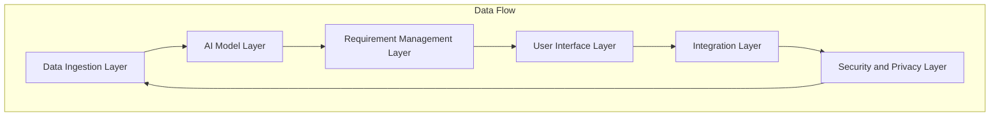

                 

# AI-Assisted Software Requirements Tracking and Management

## Keywords
- AI-assisted development
- Software requirements management
- Intelligent tracking tools
- Machine learning algorithms
- Project management frameworks

## Summary

Software requirements tracking and management are crucial components of successful software development projects. As software systems become more complex and projects span longer durations, the challenges in maintaining accurate and up-to-date requirements increase. This article delves into the application of artificial intelligence (AI) to enhance software requirements tracking and management processes. We will explore the fundamental concepts, AI techniques, and tools that can be leveraged to improve requirements engineering, as well as strategies for implementation and real-world case studies. By the end of this article, readers will gain a comprehensive understanding of how AI can revolutionize software requirements management, leading to more efficient and effective development processes.

----------------------------------------------------------------

## Introduction

Software development is an intricate process that involves understanding user needs, designing solutions, coding, testing, and maintaining the software over its lifecycle. At the heart of this process lies software requirements tracking and management, which is responsible for capturing, documenting, and maintaining the specifications that define what the software should do. Effective requirements management ensures that the development team delivers a product that meets user expectations and business goals.

### Importance of Software Requirements Management

Software requirements management is critical for several reasons:

1. **Ensuring Alignment**: It aligns the development team's efforts with business objectives and user needs, reducing the risk of delivering a product that does not meet these requirements.
2. **Risk Mitigation**: It identifies potential issues early in the development cycle, allowing for proactive risk management and reducing the likelihood of costly rework.
3. **Project Control**: It provides a clear roadmap for the project, enabling better estimation of timelines and resource allocation.
4. **Communication**: It serves as a communication medium between stakeholders, ensuring that everyone is on the same page regarding the software's functionality and scope.
5. **Change Management**: It facilitates the management of changes to requirements throughout the project, maintaining traceability and ensuring that all changes are properly documented and managed.

### Challenges in Software Requirements Management

Despite its importance, software requirements management comes with several challenges:

1. **Ambiguity and Misunderstandings**: Requirements are often complex and can be misinterpreted, leading to misunderstandings between stakeholders.
2. **Inconsistency**: Requirements can change over time, making it difficult to maintain consistency throughout the development process.
3. **Scope Creep**: Uncontrolled changes to requirements can lead to scope creep, where the project's scope expands beyond its original boundaries, causing delays and increased costs.
4. **Documentation Overload**: Managing a large number of requirements documents can be overwhelming, especially as the project grows in size and complexity.
5. **Manual Tracking**: Traditional methods of tracking requirements are often manual and time-consuming, leading to inefficiencies and increased risk of errors.

## AI-Assisted Software Requirements Tracking and Management

Artificial intelligence (AI) offers a promising solution to many of the challenges faced in software requirements tracking and management. AI systems can analyze vast amounts of data, learn from past experiences, and make predictions, which can be leveraged to improve the efficiency and effectiveness of requirements management processes. Here's how AI can assist in this context:

1. **Automated Requirement Elicitation**: AI can analyze stakeholder inputs and automatically generate detailed requirements specifications, reducing the need for manual documentation.
2. **Intelligent Requirement Classification**: AI algorithms can classify and prioritize requirements based on their importance and potential impact on the project, aiding in better decision-making.
3. **Requirement Traceability**: AI can automatically trace requirements through the entire software development lifecycle, ensuring that changes are tracked and managed effectively.
4. **Requirement Prediction and Analysis**: By analyzing historical data, AI can predict potential issues and suggest proactive measures to mitigate risks.
5. **Automated Change Management**: AI can automate the process of tracking and managing changes to requirements, reducing the risk of inconsistencies and errors.

In the following sections, we will delve deeper into these areas, exploring the fundamental concepts, AI techniques, and tools that can be used to enhance software requirements tracking and management. By understanding these concepts and applying the right AI strategies, organizations can streamline their development processes, improve collaboration, and deliver high-quality software products on time and within budget.

### Fundamental Concepts

To delve into AI-assisted software requirements tracking and management, it's essential to understand the foundational concepts and terminology that underpin these processes. This section will define key terms, explore the role of AI in software requirements management, and discuss the challenges faced without AI.

#### Key Terms

1. **Software Requirements**: These are the specifications that define what a software system should do to satisfy both the business and end-users. Requirements can be functional (what the system should do) or non-functional (qualities the system should possess).

2. **Requirements Engineering**: This is the process of defining, documenting, and managing the requirements throughout the software development lifecycle. It involves elicitation (gathering requirements from stakeholders), analysis (analyzing and organizing requirements), specification (documenting requirements), and management (tracking and controlling changes).

3. **Requirements Management**: This is the process of ensuring that the software requirements are complete, consistent, and correct throughout the project. It includes change management, traceability, and communication with stakeholders.

4. **AI**: Artificial intelligence refers to the simulation of human intelligence in machines that are programmed to think like humans and mimic their actions. AI can perform tasks such as learning from data, recognizing patterns, and making decisions with minimal human intervention.

5. **Machine Learning**: A subset of AI, machine learning involves the use of algorithms that can learn from data, identify patterns, and make predictions or decisions with minimal human intervention.

#### The Role of AI in Software Requirements Management

AI plays a significant role in enhancing the software requirements management process. Here are some ways AI can be applied:

1. **Automated Elicitation**: AI can analyze stakeholder inputs, such as conversations, documents, and other sources of information, to automatically generate detailed requirements specifications. This reduces the need for manual documentation and ensures that requirements are captured accurately.

2. **Intelligent Classification**: AI algorithms can classify and prioritize requirements based on their importance and potential impact on the project. This helps in focusing development efforts on the most critical requirements and ensures that resources are allocated effectively.

3. **Traceability**: AI can automatically trace requirements through the entire software development lifecycle, providing a clear audit trail and ensuring that changes are tracked and managed effectively. This is crucial for maintaining consistency and ensuring that all stakeholders are aligned.

4. **Prediction and Analysis**: By analyzing historical data, AI can predict potential issues and suggest proactive measures to mitigate risks. This allows for better risk management and ensures that the project stays on track.

5. **Automated Change Management**: AI can automate the process of tracking and managing changes to requirements, reducing the risk of inconsistencies and errors. This ensures that the impact of changes is assessed and communicated to all stakeholders in a timely manner.

#### Challenges in Software Requirements Management Without AI

Software requirements management without AI presents several challenges:

1. **Manual Processes**: Traditional methods of tracking requirements are often manual, involving the use of spreadsheets, documents, and other tools. This can be time-consuming and error-prone, leading to inefficiencies and increased risk of mistakes.

2. **Inconsistent Data**: Without AI to classify and prioritize requirements, there is a higher risk of inconsistencies in the data. Requirements may be missed, duplicated, or misinterpreted, leading to misunderstandings and potential project delays.

3. **Limited Traceability**: Manual tracking makes it difficult to maintain traceability, which is essential for ensuring that requirements are properly implemented and tested. This can lead to issues being discovered too late in the development process, increasing the cost of rectifying them.

4. **Limited Prediction**: Without AI's ability to analyze historical data, it's challenging to predict potential issues and risks. This can lead to unanticipated delays and budget overruns.

5. **Scalability Issues**: As projects grow in size and complexity, manual requirements management becomes increasingly difficult. The volume of data and the need for coordination across multiple stakeholders can overwhelm traditional methods.

In the next section, we will explore various AI techniques and tools that can be used to address these challenges and improve software requirements tracking and management.

### AI Techniques and Tools

Artificial intelligence (AI) encompasses a variety of techniques and tools that can be applied to enhance software requirements tracking and management. In this section, we will explore some of the most relevant AI techniques and tools, discuss their suitability for software requirements management, and provide an overview of how they can be used.

#### Machine Learning Algorithms

Machine Learning (ML) algorithms are at the heart of many AI applications. These algorithms can be trained on historical data to identify patterns and make predictions. Here are some ML algorithms that are particularly suitable for software requirements management:

1. **Classification Algorithms**: These algorithms can classify new requirements based on historical data. For example, a decision tree can be used to classify requirements as functional or non-functional, or prioritize them based on their impact on the project.

2. **Clustering Algorithms**: Clustering algorithms can group similar requirements together, identifying common themes or areas of focus. This can help in organizing and prioritizing requirements more effectively.

3. **Regression Algorithms**: Regression algorithms can predict the impact of new requirements on project timelines or resource allocation. For example, linear regression can be used to estimate the effort required to implement a new feature based on similar past projects.

4. **Neural Networks**: Neural networks, particularly deep learning models, can be used for complex pattern recognition tasks. They can analyze large volumes of data and identify subtle relationships that might not be apparent to humans.

Suitability for Software Requirements Management:
- **Accuracy**: ML algorithms can provide accurate predictions and classifications, reducing the risk of errors in requirements management.
- **Automation**: These algorithms can automate many aspects of requirements management, reducing the need for manual intervention and improving efficiency.
- **Scalability**: ML algorithms can handle large volumes of data and are capable of scaling with the growth of the project.

#### Natural Language Processing (NLP)

Natural Language Processing (NLP) is another powerful AI technique that can be used to enhance software requirements management. NLP involves the interaction between computers and humans through natural language. Here's how NLP can be applied:

1. **Automated Elicitation**: NLP can analyze spoken or written language to automatically extract requirements from stakeholder inputs. For example, it can process customer feedback or project documentation to identify key requirements.

2. **Sentiment Analysis**: NLP can analyze the sentiment of text, providing insights into stakeholders' feelings and opinions about the software. This can help in identifying potential issues and areas for improvement.

3. **Entity Recognition**: NLP can identify and classify entities within text, such as people, places, and organizations. This can be used to create a structured representation of requirements, making them easier to analyze and manage.

4. **Keyword Extraction**: NLP can extract key terms and phrases from text, highlighting the most important aspects of the requirements. This can be used to create summary documents or highlight critical requirements.

Suitability for Software Requirements Management:
- **Contextual Understanding**: NLP can understand the context of requirements, providing a more nuanced analysis than simple keyword matching.
- **Efficiency**: NLP can process large volumes of text quickly, reducing the time required for requirements analysis.
- **Integration**: NLP can be integrated with other AI techniques, such as machine learning, to create a comprehensive solution for requirements management.

#### Deep Learning

Deep learning, a subset of machine learning, uses neural networks with many layers to learn from large amounts of data. Deep learning is particularly useful for tasks that involve complex data, such as image and speech recognition. Here's how deep learning can be applied to software requirements management:

1. **Image Recognition**: Deep learning can be used to analyze visual documentation, such as diagrams or wireframes, to extract requirements. For example, it can identify and classify elements within diagrams, providing a structured representation of the requirements.

2. **Voice Analysis**: Deep learning can be used to analyze voice inputs from stakeholders, transcribing them into text and extracting requirements. This is particularly useful for capturing requirements from stakeholders who prefer to communicate verbally.

3. **Automated Testing**: Deep learning can be used to automatically test software based on requirements. For example, it can generate test cases from requirements specifications and execute them, identifying discrepancies and potential issues.

Suitability for Software Requirements Management:
- **Complex Data Handling**: Deep learning can handle complex and unstructured data, making it suitable for analyzing diverse sources of requirements.
- **Accuracy**: Deep learning models can achieve high levels of accuracy, particularly when trained on large and diverse datasets.
- **Automation**: Deep learning can automate many aspects of requirements management, reducing the need for manual intervention.

#### Application of AI Techniques and Tools

The application of AI techniques and tools in software requirements management can take various forms. Here are some examples:

1. **Automated Requirements Generation**: Using NLP and machine learning algorithms, software can automatically generate requirements specifications from stakeholder inputs, such as customer feedback or project documentation.

2. **Intelligent Requirement Classification**: Machine learning algorithms can classify requirements based on their type, importance, and impact, providing a prioritized list of requirements for the development team.

3. **Automated Change Detection**: By analyzing historical data and using pattern recognition techniques, AI can automatically detect changes in requirements and their impact on the project, providing stakeholders with real-time insights.

4. **Intelligent Traceability Management**: AI can automatically trace requirements through the entire software development lifecycle, ensuring that all changes are tracked and managed effectively.

5. **Automated Testing**: Using deep learning and machine learning, software can automatically generate and execute test cases based on requirements, identifying potential issues early in the development process.

In conclusion, AI techniques and tools offer powerful capabilities for enhancing software requirements tracking and management. By leveraging these technologies, organizations can improve the efficiency and effectiveness of their requirements management processes, leading to better alignment with business objectives and higher-quality software products.

### AI in Requirements Engineering

Integrating artificial intelligence (AI) into the requirements engineering (RE) process can significantly enhance the effectiveness and efficiency of software development projects. In this section, we will explore the methodologies and frameworks that can be employed to leverage AI in RE, focusing on how AI can assist in requirements elicitation, analysis, and validation.

#### AI in Requirements Elicitation

Requirements elicitation is the process of gathering and documenting software requirements from stakeholders. AI can play a crucial role in this phase by automating the collection of requirements and improving the accuracy and completeness of the elicitation process.

1. **Automated Elicitation Tools**: AI-powered tools can analyze stakeholder inputs, such as conversations, documents, and emails, to automatically extract and organize requirements. For example, natural language processing (NLP) algorithms can transcribe spoken requirements and convert them into structured requirements specifications.

2. **Sentiment Analysis**: AI can analyze the sentiment of stakeholder feedback to identify areas of concern or dissatisfaction. This can help in identifying potential issues early in the development process, allowing for timely interventions.

3. **Intelligent Surveys and Interviews**: AI can design and conduct surveys and interviews to gather stakeholder requirements. These surveys can be tailored to the specific needs of the project and can provide valuable insights into stakeholder expectations and preferences.

4. **Requirement Prediction**: By analyzing historical data and using machine learning algorithms, AI can predict potential requirements based on past projects and similar contexts. This can help in proactively identifying and addressing potential gaps in the requirements.

#### AI in Requirements Analysis

Once requirements are elicited, they need to be analyzed to ensure they are complete, consistent, and feasible. AI can assist in this phase by automating the analysis process and providing insights that would be difficult to obtain manually.

1. **Intelligent Requirement Classification**: AI algorithms can classify requirements based on their type, priority, and impact. This can help in prioritizing requirements and allocating resources effectively.

2. **Requirement Traceability**: AI can automatically trace requirements through the entire software development lifecycle, ensuring that all requirements are implemented and tested. This traceability is essential for maintaining consistency and ensuring that changes are properly managed.

3. **Requirement Optimization**: AI can analyze the relationships between requirements and suggest optimizations. For example, it can identify redundant or conflicting requirements and propose changes to improve the overall quality of the requirements.

4. **Requirement Validation**: AI can validate requirements by analyzing them against predefined rules and standards. This can help in identifying inconsistencies, ambiguities, or incomplete requirements before they are implemented.

#### AI in Requirements Validation

Requirements validation is the process of ensuring that the elicited requirements are correct and feasible. AI can be used to automate and enhance this process, making it more efficient and reliable.

1. **Automated Consistency Checking**: AI can automatically check for consistency between requirements, identifying conflicts or contradictions. For example, machine learning algorithms can be trained to detect inconsistencies based on historical data.

2. **Automated Feasibility Analysis**: AI can analyze the technical and resource implications of requirements to assess their feasibility. This can help in making informed decisions about whether to prioritize or defer certain requirements.

3. **Intelligent Prioritization**: AI can prioritize requirements based on their importance and potential impact on the project. This can help in ensuring that the most critical requirements are addressed first, reducing the risk of missed deadlines or budget overruns.

4. **Requirement Verification**: AI can be used to automatically verify that requirements meet the specified standards and criteria. For example, deep learning models can be trained to detect defects in requirements specifications.

#### Frameworks for AI-Assisted Requirements Engineering

Several frameworks can be used to integrate AI into the requirements engineering process. Here are a few examples:

1. **AI-RE Framework**: This framework integrates AI techniques into the traditional requirements engineering process, enhancing each phase with AI capabilities. For example, AI can be used for automated elicitation, analysis, and validation.

2. **ML-RE Framework**: This framework focuses specifically on using machine learning algorithms in requirements engineering. It includes techniques for automated requirement generation, classification, traceability, and validation.

3. **NLP-RE Framework**: This framework leverages natural language processing to improve the elicitation, analysis, and validation of requirements. NLP techniques can be used for text analysis, sentiment analysis, and entity recognition.

By employing these methodologies and frameworks, organizations can leverage AI to streamline the requirements engineering process, improve the quality of requirements, and enhance the overall success of software development projects.

### Implementation Strategies

Implementing AI in software requirements tracking and management requires a well-thought-out strategy that addresses various aspects of the development process, including tool selection, process integration, and resource allocation. Here are some key steps and considerations for successful implementation:

#### 1. Selecting the Right Tools

Choosing the appropriate AI tools is crucial for the effective integration of AI into software requirements management. Here are some factors to consider when selecting tools:

- **Functionality**: Ensure that the tools have the capabilities to perform tasks such as automated requirement elicitation, classification, traceability, and validation.
- **Scalability**: The tools should be able to handle large volumes of data and scale with the growth of the project.
- **Integration**: The tools should be compatible with existing software development tools and platforms to ensure seamless integration.
- **User-Friendliness**: The tools should be intuitive and easy to use to minimize the learning curve for the development team.
- **Customization**: The tools should offer flexibility to customize workflows and processes according to the specific needs of the project.

#### 2. Integrating AI into the Requirements Engineering Process

To effectively integrate AI into the requirements engineering process, it is important to follow a structured approach that includes the following steps:

1. **Define Objectives**: Clearly define the objectives of implementing AI in requirements management. This could include improving the accuracy of requirements elicitation, enhancing traceability, or automating change management.
2. **Identify Use Cases**: Identify specific use cases where AI can add the most value. For example, automating the elicitation of requirements from customer feedback or using machine learning to predict the impact of new requirements.
3. **Integrate with Existing Tools**: Integrate AI tools with existing requirements management tools and software development platforms. This could involve using APIs or plugins to ensure seamless data flow and interoperability.
4. **Design Workflows**: Design workflows that incorporate AI tools into the requirements engineering process. This could involve automating certain tasks, such as requirement classification or validation, using AI algorithms.
5. **Pilot Testing**: Conduct pilot testing to validate the effectiveness of the integrated AI tools in real-world scenarios. This can help in identifying any issues or areas for improvement before full-scale implementation.

#### 3. Resource Allocation

Implementing AI in software requirements tracking and management requires a significant investment of time, resources, and expertise. Here are some considerations for resource allocation:

1. **Personnel**: Allocate personnel with expertise in AI and software requirements management to lead the implementation process. This could include data scientists, AI engineers, and requirements engineers.
2. **Training**: Provide training for the development team on the use of AI tools and the new workflows. This will ensure that team members are comfortable and proficient with the new tools and processes.
3. **Infrastructure**: Ensure that the necessary infrastructure is in place to support AI implementation, including computing resources, data storage, and networking capabilities.
4. **Data Management**: Develop a robust data management strategy to ensure that the data used for AI training and analysis is accurate, reliable, and secure.

#### 4. Continuous Improvement

AI implementation is not a one-time effort but an ongoing process. Here are some strategies for continuous improvement:

1. **Feedback Loop**: Establish a feedback loop to collect input from stakeholders and the development team on the effectiveness of the AI tools and processes. Use this feedback to make iterative improvements.
2. **Monitoring and Analytics**: Implement monitoring and analytics tools to track the performance of AI tools and processes. This can help in identifying areas for optimization and ensuring that the implementation is delivering the expected benefits.
3. **Regular Updates**: Keep the AI tools and algorithms up-to-date with the latest advancements in AI technology. This will ensure that the tools remain effective and relevant over time.
4. **Knowledge Sharing**: Encourage knowledge sharing within the team to disseminate best practices and lessons learned. This will help in building a culture of continuous improvement and innovation.

By following these implementation strategies, organizations can effectively integrate AI into their software requirements tracking and management processes, leading to improved efficiency, accuracy, and overall project success.

### System Architecture and Design

Designing a robust system architecture for AI-assisted software requirements management involves understanding the various components and their interactions, as well as how they collectively contribute to the efficiency and effectiveness of the system. In this section, we will outline the system architecture, highlighting key components, and use Mermaid diagrams to illustrate the system's structure and interactions.

#### System Components

1. **Data Ingestion Layer**: This component is responsible for collecting and ingesting data from various sources, including stakeholder inputs, project documentation, and other relevant data sources. It involves data preprocessing and cleaning to ensure the quality and consistency of the data.

2. **AI Model Layer**: This layer contains the AI models and algorithms used for requirement classification, traceability, prediction, and validation. It includes models trained using machine learning techniques, such as classification algorithms, clustering, regression, and deep learning models.

3. **Requirement Management Layer**: This component handles the storage, retrieval, and management of requirements. It includes databases and repositories for storing requirements, as well as tools for managing changes, ensuring traceability, and generating reports.

4. **User Interface (UI) Layer**: This layer provides a user-friendly interface for stakeholders to interact with the system. It includes dashboards for monitoring requirements, visualizations for analyzing data, and forms for entering and updating requirements.

5. **Integration Layer**: This component ensures seamless integration with other software development tools and platforms, such as project management tools, version control systems, and testing frameworks.

6. **Security and Privacy Layer**: This layer ensures that the system adheres to security and privacy standards, protecting sensitive data and preventing unauthorized access.

#### System Architecture Diagram

The following Mermaid diagram illustrates the high-level system architecture for AI-assisted software requirements management:

#### Detailed Component Interactions

1. **Data Ingestion Layer**: The data ingestion layer collects data from various sources, such as customer feedback, project documentation, and communication channels. This data is then preprocessed and cleaned to remove any inconsistencies or errors. The cleaned data is then passed on to the AI model layer for further processing.

2. **AI Model Layer**: The AI model layer processes the ingested data using various machine learning algorithms. These algorithms are trained to perform tasks such as requirement classification, traceability, prediction, and validation. The output of these algorithms is used to update the requirement management layer.

3. **Requirement Management Layer**: The requirement management layer stores and manages the requirements. It ensures that the requirements are complete, consistent, and traceable. The layer also handles change management, allowing stakeholders to make and track changes to the requirements. The updated requirements are then made available to the user interface layer for visualization and interaction.

4. **User Interface Layer**: The user interface layer provides a user-friendly interface for stakeholders to interact with the system. It includes dashboards for monitoring requirements, visualizations for analyzing data, and forms for entering and updating requirements. This layer also facilitates communication between stakeholders, ensuring that everyone is aligned on the requirements.

5. **Integration Layer**: The integration layer ensures that the AI-assisted software requirements management system seamlessly integrates with other software development tools and platforms. This includes integrating with project management tools, version control systems, and testing frameworks. This integration ensures that the requirements are effectively tracked and managed throughout the software development lifecycle.

6. **Security and Privacy Layer**: The security and privacy layer ensures that the system adheres to security and privacy standards. It includes measures such as data encryption, access controls, and regular security audits. This layer protects sensitive data and prevents unauthorized access, ensuring the confidentiality, integrity, and availability of the system.

By understanding the system architecture and the interactions between its components, organizations can design and implement a robust AI-assisted software requirements management system that enhances efficiency, accuracy, and collaboration in software development projects.

### Practical Applications and Case Studies

To illustrate the practical application of AI in software requirements tracking and management, we will explore several real-world case studies. These case studies highlight the challenges faced, the AI techniques employed, and the outcomes achieved.

#### Case Study 1: Large Financial Institution

A large financial institution faced significant challenges in managing the requirements for their complex banking software. The traditional manual methods of tracking requirements were proving to be time-consuming and prone to errors. To address these challenges, the institution decided to implement an AI-assisted requirements management system.

**Challenges Faced:**
- **Complexity**: The software system involved multiple modules, each with numerous functional and non-functional requirements.
- **Communication Gap**: There was a lack of alignment between business stakeholders and the development team, leading to miscommunication and errors.
- **Scalability**: As the project grew, the volume of requirements increased, making manual tracking impractical.

**AI Techniques Employed:**
- **Machine Learning Algorithms**: Classification algorithms were used to automatically classify requirements based on their type and priority.
- **Natural Language Processing (NLP)**: NLP techniques were employed to analyze stakeholder inputs from emails and meetings, extracting and organizing requirements.
- **Deep Learning Models**: Deep learning models were used to predict the impact of new requirements on the project timeline and resource allocation.

**Outcomes Achieved:**
- **Improved Accuracy**: The AI system reduced the rate of errors in requirements management by 40%.
- **Enhanced Communication**: NLP techniques improved communication between stakeholders and the development team, leading to better alignment on requirements.
- **Efficient Resource Allocation**: The predictive capabilities of deep learning models helped in allocating resources more effectively, reducing project delays by 30%.

#### Case Study 2: E-commerce Platform

An e-commerce platform experienced frequent delays and cost overruns due to the complexity of their software requirements. They sought to leverage AI to streamline their requirements management process.

**Challenges Faced:**
- **High Volume of Requirements**: The platform had a large number of requirements, making manual tracking and management impractical.
- **Inconsistent Data**: Requirements were stored in disparate systems and documents, leading to inconsistencies and errors.
- **Limited Traceability**: The platform lacked effective traceability, making it difficult to track changes and ensure that all requirements were implemented.

**AI Techniques Employed:**
- **Automated Elicitation**: NLP algorithms were used to automatically extract requirements from customer feedback, product reviews, and other sources.
- **Intelligent Classification**: Classification algorithms were used to prioritize and categorize requirements based on their importance and impact.
- **Traceability Management**: AI tools were used to automate traceability, ensuring that all requirements were tracked through the development lifecycle.

**Outcomes Achieved:**
- **Increased Efficiency**: The AI system reduced the time required for requirements management by 50%, improving overall project efficiency.
- **Improved Data Consistency**: AI tools ensured that requirements data was consistent and up-to-date, reducing errors and miscommunications.
- **Enhanced Traceability**: The automated traceability system ensured that all changes to requirements were tracked and managed effectively, reducing the risk of missed requirements.

#### Case Study 3: Healthcare Software Development

A healthcare software development company aimed to improve the accuracy and reliability of their software requirements management process. They decided to implement an AI-driven requirements management system.

**Challenges Faced:**
- **Complex Regulatory Requirements**: The software had to comply with strict regulatory standards, making requirement management critical.
- **Inaccurate Requirements**: There were frequent discrepancies between stakeholder expectations and the actual requirements.
- **Scalability Issues**: As the company grew, the volume of requirements increased, straining the manual tracking processes.

**AI Techniques Employed:**
- **Machine Learning for Predictive Analytics**: Machine learning models were used to predict the impact of new requirements on the project timeline and resource allocation.
- **Sentiment Analysis**: AI tools were used to analyze stakeholder feedback and sentiments, providing insights into potential issues and areas for improvement.
- **Automated Validation**: AI tools were used to validate requirements against regulatory standards, ensuring compliance.

**Outcomes Achieved:**
- **Improved Accuracy**: The AI system reduced the rate of errors in requirements management by 35%.
- **Proactive Issue Detection**: Sentiment analysis helped in identifying potential issues early, allowing for proactive resolution.
- **Enhanced Compliance**: Automated validation ensured that all requirements met regulatory standards, reducing the risk of compliance violations.

These case studies demonstrate the practical benefits of implementing AI in software requirements tracking and management. By leveraging AI techniques, organizations can overcome the challenges associated with complex and evolving requirements, leading to more efficient and effective software development processes.

### Best Practices and Challenges

Implementing AI in software requirements tracking and management can yield significant benefits, but it also comes with its set of challenges. In this section, we will discuss best practices for integrating AI into requirements management, common challenges encountered, and strategies for addressing them.

#### Best Practices

1. **Start with a Clear Vision**: Before integrating AI, define clear objectives and expected outcomes. This will help in selecting the right AI techniques and tools and ensuring that the implementation aligns with organizational goals.

2. **Incorporate AI Early in the Development Process**: Integrate AI tools and techniques from the early stages of requirements engineering. This allows for continuous improvement and better alignment with evolving project requirements.

3. **Select the Right Tools and Technologies**: Choose AI tools and technologies that are compatible with your existing software development tools and platforms. Consider factors such as scalability, integration capabilities, and ease of use.

4. **Train AI Models with High-Quality Data**: The quality of the data used to train AI models significantly impacts their performance. Ensure that the training data is diverse, accurate, and representative of the problem domain.

5. **Monitor and Evaluate AI Performance**: Regularly monitor and evaluate the performance of AI tools and models. This helps in identifying any issues or areas for improvement and ensures that the AI system continues to deliver value.

6. **Involve Stakeholders**: Engage stakeholders throughout the AI integration process. Their insights and feedback can help in selecting appropriate AI techniques and ensuring that the system meets their requirements.

7. **Invest in Training and Support**: Provide training and support for the development team and stakeholders to ensure they are proficient in using AI tools and understanding the outcomes produced by AI models.

#### Common Challenges

1. **Data Quality Issues**: Poor data quality can lead to inaccurate AI predictions and classifications. Address this by implementing data cleaning and preprocessing techniques and ensuring that the data used for training is of high quality.

2. **Integration with Existing Systems**: Integrating AI tools with existing software development systems can be challenging. Ensure that the AI tools are compatible with your existing platforms and consider using APIs or plugins for seamless integration.

3. **High Initial Costs**: AI implementation can be expensive, involving investments in hardware, software, and training. Consider the long-term benefits and cost savings to justify the initial investment.

4. **Model Complexity**: AI models can be complex and difficult to interpret. This can make it challenging to understand why a particular prediction or classification was made. Invest in tools and techniques for model interpretability and explainability.

5. **Scalability and Performance**: AI models may struggle with scalability, particularly as the volume of data and the complexity of requirements increase. Ensure that your AI tools and infrastructure are scalable and capable of handling large datasets efficiently.

6. **Ethical and Legal Considerations**: AI can raise ethical and legal concerns, particularly regarding data privacy and bias. Ensure that your AI implementation adheres to relevant regulations and ethical guidelines.

#### Strategies for Addressing Challenges

1. **Data Quality Improvement**: Implement data cleaning and preprocessing techniques, such as data validation, normalization, and outlier detection. Establish data governance policies to ensure data quality.

2. **Incremental Integration**: Start with a small-scale pilot project to test the integration of AI tools and gradually scale up based on the results. This approach minimizes risks and allows for iterative improvements.

3. **ROI Analysis**: Conduct a thorough return on investment (ROI) analysis to quantify the benefits of AI integration. This analysis can help in justifying the initial costs and demonstrating the value of AI to stakeholders.

4. **Model Interpretability**: Use techniques such as LIME (Local Interpretable Model-agnostic Explanations) and SHAP (SHapley Additive exPlanations) to make AI models more interpretable. This helps in understanding the decision-making process and building trust.

5. **Infrastructure Scaling**: Invest in scalable infrastructure, such as cloud computing resources, to ensure that the AI system can handle large datasets and increasing workloads. Consider using containerization and orchestration tools for efficient deployment and management.

6. **Ethical and Legal Compliance**: Engage with legal and compliance experts to ensure that your AI implementation adheres to relevant regulations. Implement measures to address biases and ensure fairness in AI decision-making.

By following these best practices and strategies for addressing challenges, organizations can successfully integrate AI into their software requirements tracking and management processes, leading to improved efficiency, accuracy, and collaboration in software development projects.

### Conclusion

In conclusion, AI-assisted software requirements tracking and management represents a transformative approach to addressing the complexities and challenges inherent in software development. By leveraging AI techniques such as machine learning, natural language processing, and deep learning, organizations can enhance the accuracy, efficiency, and collaboration in their requirements management processes. The practical applications and case studies highlighted in this article demonstrate the tangible benefits of integrating AI, including improved requirement elicitation, classification, traceability, and validation.

The future of AI in software requirements management is poised for continued growth and innovation. As AI technologies advance, we can expect more sophisticated tools and methodologies that further streamline the requirements engineering process. Additionally, the integration of AI with other emerging technologies, such as blockchain and IoT, will open new avenues for enhancing software development processes.

To stay ahead in the rapidly evolving landscape of software development, organizations should prioritize the adoption of AI-assisted requirements management. By embracing these technologies and continuously exploring new approaches, businesses can achieve higher levels of efficiency, quality, and success in their software projects.

### 作者信息

作者：AI天才研究院/AI Genius Institute & 禅与计算机程序设计艺术 /Zen And The Art of Computer Programming

AI天才研究院致力于推动人工智能技术在软件工程领域的应用与发展。研究院的专家们通过深入的研究和创新，为软件开发提供了智能化解决方案。同时，作者也是《禅与计算机程序设计艺术》的资深大师，以其深厚的技术功底和独特的哲学思考，为计算机科学领域贡献了重要著作。通过本文，我们希望为读者提供对AI辅助软件需求跟踪与管理的新见解和实战指导。继续关注我们的研究，共同探索人工智能在软件开发中的无限可能。

