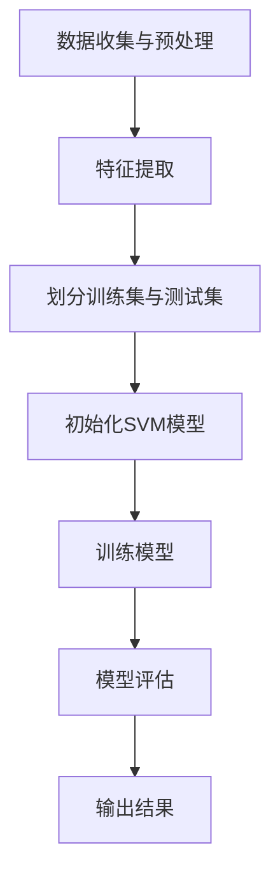
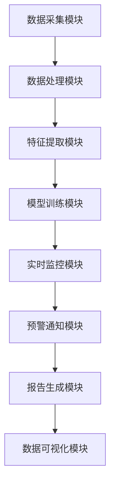

                 

# AI辅助金融风险预警中的提示词策略

## 关键词

- AI
- 金融风险预警
- 提示词策略
- 算法
- 系统架构
- 最佳实践

## 摘要

本文深入探讨了AI辅助金融风险预警中的提示词策略。首先，我们介绍了AI在金融风险预警中的应用背景和重要性。接着，详细阐述了AI、金融风险预警以及提示词策略的核心概念和联系。随后，我们讲解了用于AI辅助金融风险预警的算法原理，包括数学模型和公式，并使用Python源代码进行说明。文章随后分析了系统功能设计、架构设计、接口设计和系统交互，并通过实际项目案例展示了系统的应用。最后，我们总结了最佳实践和注意事项，为读者提供了拓展阅读建议。

## 引言与背景

### 问题背景

在当今金融市场日益复杂和全球化的背景下，金融风险预警已成为金融机构和监管机构的重要任务。金融风险可能来自各种来源，包括市场波动、信用风险、流动性风险和操作风险等。随着金融工具的多样化和金融市场的复杂性增加，传统的风险预警方法已难以满足实际需求。因此，人工智能（AI）作为一种新兴技术，被越来越多地应用于金融风险预警中，以提供更准确、及时的风险预测和预警。

### 问题描述

金融风险预警的核心问题是如何快速、准确地识别和预测潜在风险。这需要分析大量历史数据、实时数据和各种市场指标，以发现潜在的风险信号。然而，传统的风险预警方法往往依赖于规则和经验，难以处理复杂的非线性关系和非结构化数据。相比之下，AI技术，特别是机器学习和深度学习，能够通过大数据分析和模式识别，提供更加智能化的风险预警。

### 问题解决

AI辅助金融风险预警的主要解决方案包括以下几个方面：

1. **数据收集与预处理**：收集历史和实时金融数据，包括市场数据、交易数据、财务报表等，并对数据进行清洗、转换和归一化处理，为后续分析提供高质量的输入数据。

2. **特征工程**：从原始数据中提取关键特征，这些特征可能对预测风险有重要影响。特征工程是AI辅助风险预警的重要步骤，它需要深入理解金融领域和数据特性。

3. **模型选择与训练**：选择合适的机器学习算法和深度学习模型，对数据集进行训练和优化，以建立能够预测金融风险的有效模型。

4. **实时监测与预警**：利用训练好的模型对实时数据进行分析，识别潜在风险，并触发预警机制，及时通知相关利益相关者。

### 边界与外延

在AI辅助金融风险预警的研究和应用中，需要明确以下几个边界与外延：

1. **技术边界**：包括算法选择、数据来源、数据处理能力等。

2. **应用边界**：金融风险预警的应用范围，如市场风险、信用风险、流动性风险等。

3. **法律和伦理边界**：金融数据的隐私保护、算法的透明性和可解释性、自动化决策的道德责任等。

4. **风险管理边界**：风险识别、评估、监测、预警和应对策略的整合。

### 概念结构与核心要素组成

AI辅助金融风险预警的概念结构主要包括以下几个核心要素：

1. **数据层**：包括金融数据、市场数据、交易数据等。

2. **算法层**：选择合适的机器学习算法和深度学习模型。

3. **模型层**：训练和优化的机器学习模型，用于风险预测和预警。

4. **应用层**：将模型应用于实时数据，提供风险预警服务。

5. **用户层**：金融机构、监管机构和其他利益相关者，他们使用风险预警结果进行决策。

通过以上各层的协同工作，AI辅助金融风险预警系统能够提供准确、及时的风险预警，为金融市场的稳定运行提供重要保障。

## 核心概念与联系

### AI概述

人工智能（AI）是指由人制造出来的系统能够在特定任务上表现出与人类智能相似或超越人类智能的能力。AI包括多个子领域，如机器学习、深度学习、自然语言处理、计算机视觉等。在金融风险预警中，AI技术主要用于数据分析和模式识别，以预测潜在风险。

#### AI的核心原理

1. **机器学习**：机器学习是一种通过从数据中学习模式来改进性能的方法。在金融风险预警中，机器学习算法可以分析历史数据，发现风险信号。

2. **深度学习**：深度学习是机器学习的一个子领域，它模仿人脑的结构和工作方式。深度学习模型，如神经网络，可以在大量数据上实现高效的学习和预测。

3. **自然语言处理（NLP）**：NLP使计算机能够理解、解释和生成人类语言。在金融风险预警中，NLP可以用于分析新闻报道、社交媒体和其他文本数据，以识别潜在风险。

### 金融风险预警概述

金融风险预警是指通过监测和分析金融市场数据，预测潜在风险并发出预警信号的过程。金融风险可能来自多个方面，包括市场波动、信用风险、流动性风险和操作风险等。有效的金融风险预警系统需要整合多种数据源，使用先进的分析工具和算法，以提供准确、及时的预警信息。

#### 金融风险预警的关键要素

1. **数据收集**：收集历史和实时金融数据，包括市场数据、交易数据、财务报表等。

2. **特征提取**：从原始数据中提取关键特征，这些特征可能对预测风险有重要影响。

3. **风险评估**：使用机器学习和深度学习算法对数据进行分析，评估潜在风险。

4. **预警机制**：建立预警机制，及时发出风险预警信号，并通知相关利益相关者。

### 提示词策略

提示词策略是指通过设计特定的关键词或短语，引导AI模型识别和预测潜在风险的一种方法。在金融风险预警中，提示词策略可以显著提高风险识别的准确性和效率。

#### 提示词策略的类型

1. **通用提示词**：适用于多种类型的金融风险，如市场波动、信用风险等。

2. **领域特定提示词**：针对特定金融领域或金融工具的提示词，如外汇交易中的汇率波动、股票交易中的股价变动等。

3. **动态提示词**：根据实时数据和金融市场变化动态调整的提示词。

### 提示词策略的重要性

1. **提高风险识别的准确性**：通过设计合适的提示词，可以引导AI模型更准确地识别和预测潜在风险。

2. **降低误报率**：提示词策略有助于减少误报，提高预警系统的有效性。

3. **提高响应速度**：通过实时监测和预警，提示词策略可以帮助金融机构及时响应潜在风险。

4. **提升用户体验**：设计合理的提示词策略可以提供更加个性化的风险预警服务，提升用户体验。

通过深入了解AI、金融风险预警和提示词策略，我们可以更好地理解它们之间的联系和作用，为构建高效的金融风险预警系统提供理论基础和实践指导。

## 算法原理讲解

### 算法概述

在AI辅助金融风险预警中，算法原理是核心部分，它决定了系统的性能和准确性。本节将详细介绍一种用于金融风险预警的常见算法——支持向量机（SVM），并使用mermaid绘制算法流程图，同时提供Python源代码来解释算法原理和数学模型。

### 算法流程图



### 算法原理与数学模型

支持向量机（SVM）是一种监督学习算法，主要用于分类问题。在金融风险预警中，SVM用于将正常交易与异常交易进行分类。以下是其基本原理和数学模型：

#### 1. 最大间隔分类器

SVM的目标是找到一个最优的超平面，使得正类和负类之间的间隔最大。这个超平面由以下数学模型描述：

$$
\max_{\beta, \beta_0} \left\{ \frac{1}{2} \sum_{i=1}^{n} (\beta^T \beta) - \sum_{i=1}^{n} \alpha_i y_i (\beta^T x_i + \beta_0) \right\}
$$

其中，$\beta$是权重向量，$\beta_0$是偏置项，$y_i$是类别标签（正类为+1，负类为-1），$x_i$是特征向量，$\alpha_i$是拉格朗日乘子。

#### 2. 支持向量

在训练过程中，SVM会找到那些对分类边界有最大贡献的样本，这些样本称为支持向量。

#### 3. 鸽巢理论

SVM的核心是解决一个二次规划问题，它涉及到鸽巢理论。通过将所有样本映射到高维空间，SVM可以找到一个超平面，使得正类和负类之间的间隔最大化。

### Python源代码示例

以下是一个简单的Python代码示例，用于实现SVM模型并进行金融风险预警：

```python
from sklearn import svm
from sklearn.model_selection import train_test_split
from sklearn.metrics import classification_report
from sklearn.datasets import make_classification

# 生成模拟数据集
X, y = make_classification(n_samples=1000, n_features=20, n_informative=15, n_redundant=5,
                           n_classes=2, random_state=42)

# 划分训练集与测试集
X_train, X_test, y_train, y_test = train_test_split(X, y, test_size=0.3, random_state=42)

# 初始化SVM模型
clf = svm.SVC(kernel='linear', C=1.0)

# 训练模型
clf.fit(X_train, y_train)

# 模型评估
predictions = clf.predict(X_test)
print(classification_report(y_test, predictions))
```

### 算法举例说明

假设我们有一个金融交易数据集，其中包含多个特征，如交易金额、交易时间、交易对手等。我们可以使用SVM模型来区分正常交易和异常交易。

1. **数据预处理**：首先，对数据进行标准化处理，确保所有特征都在相同尺度上。

2. **特征提取**：从原始数据中提取关键特征，例如交易金额和交易时间。

3. **模型训练**：使用SVM模型对训练集进行训练。

4. **模型评估**：使用测试集对模型进行评估，计算准确率、召回率等指标。

5. **风险预警**：对新的交易数据进行预测，如果预测结果为异常交易，则触发预警机制。

通过上述步骤，AI辅助金融风险预警系统可以提供准确、高效的风险预测和预警服务。

## 系统分析与架构设计

### 问题场景介绍

在当前金融市场中，随着金融产品的复杂度和交易速度的不断提高，金融机构面临着越来越多的风险。为了确保金融市场的稳定运行，金融机构需要建立一套高效的金融风险预警系统。该系统需要能够实时监控市场动态，分析大量金融数据，并及时识别潜在的风险信号。本节将介绍一个用于金融风险预警的AI系统，并详细描述其系统功能设计、架构设计、接口设计和系统交互。

### 系统功能设计

金融风险预警系统的核心功能包括以下几个方面：

1. **数据采集与处理**：系统需要从多个数据源收集金融数据，包括市场数据、交易数据、财务报表等。然后，对数据进行清洗、转换和归一化处理，确保数据质量。

2. **特征提取**：从处理后的数据中提取关键特征，如交易金额、交易时间、交易对手等。这些特征对于预测潜在风险具有重要意义。

3. **模型训练与评估**：使用机器学习和深度学习算法训练模型，对历史数据进行分析，评估模型的性能。常用的算法包括支持向量机（SVM）、决策树、随机森林等。

4. **实时监控与预警**：系统需要实时监控市场动态，对新的交易数据进行预测。如果预测结果为潜在风险，则触发预警机制，通知相关利益相关者。

5. **报告生成与可视化**：系统应能够生成详细的报告，展示风险预警的结果，并提供数据可视化的功能，帮助用户更好地理解风险情况。

### 系统架构设计

金融风险预警系统的架构设计应遵循模块化、可扩展和高效的原则。以下是一个典型的系统架构设计：



#### 数据采集模块

数据采集模块负责从多个数据源收集金融数据，包括市场数据、交易数据、财务报表等。这些数据可以通过API接口、数据库连接或Web爬虫等方式获取。

#### 数据处理模块

数据处理模块负责对收集到的金融数据进行分析和处理。主要包括数据清洗、转换和归一化等步骤。数据处理模块需要保证数据的一致性和准确性。

#### 特征提取模块

特征提取模块从处理后的数据中提取关键特征，如交易金额、交易时间、交易对手等。这些特征将被用于训练模型和进行实时监控。

#### 模型训练模块

模型训练模块使用机器学习和深度学习算法对历史数据进行分析，评估模型的性能。该模块可以选择不同的算法，如支持向量机（SVM）、决策树、随机森林等，并进行交叉验证和超参数优化。

#### 实时监控模块

实时监控模块负责实时监控市场动态，对新的交易数据进行预测。如果预测结果为潜在风险，则触发预警机制，通知相关利益相关者。

#### 预警通知模块

预警通知模块负责发送预警通知。通知可以通过邮件、短信、即时通讯工具等方式发送，确保相关利益相关者能够及时收到预警信息。

#### 报告生成模块

报告生成模块负责生成详细的报告，展示风险预警的结果。报告可以包含数据可视化图表、关键指标分析等内容，帮助用户更好地理解风险情况。

#### 数据可视化模块

数据可视化模块负责将报告以可视化图表的形式展示。常用的可视化工具包括Matplotlib、Seaborn、Plotly等。

### 系统接口设计

系统接口设计是确保系统模块之间能够高效通信和协同工作的重要环节。以下是一个典型的系统接口设计：


#### 数据采集接口

数据采集接口负责与外部数据源进行通信，获取金融数据。接口需要支持多种数据格式，如JSON、CSV、XML等。

#### 数据处理接口

数据处理接口负责对金融数据进行清洗、转换和归一化等操作。接口需要提供丰富的操作函数，如数据清洗、特征提取、数据归一化等。

#### 特征提取接口

特征提取接口负责从处理后的数据中提取关键特征。接口需要支持自定义特征提取算法，以适应不同的金融数据场景。

#### 模型训练接口

模型训练接口负责训练机器学习和深度学习模型。接口需要支持多种算法，如SVM、决策树、随机森林等，并提供超参数优化功能。

#### 实时监控接口

实时监控接口负责实时监控市场动态，对新的交易数据进行预测。接口需要支持实时数据处理和预测功能。

#### 预警通知接口

预警通知接口负责发送预警通知。接口需要支持多种通知方式，如邮件、短信、即时通讯工具等。

#### 报告生成接口

报告生成接口负责生成详细的报告。接口需要支持自定义报告模板和可视化图表。

#### 数据可视化接口

数据可视化接口负责将报告以可视化图表的形式展示。接口需要支持多种可视化工具，如Matplotlib、Seaborn、Plotly等。

### 系统交互

系统交互是指各个模块之间的数据传递和功能调用。以下是一个典型的系统交互流程：

1. **数据采集**：系统从外部数据源获取金融数据。
2. **数据处理**：对采集到的金融数据进行清洗、转换和归一化处理。
3. **特征提取**：从处理后的数据中提取关键特征。
4. **模型训练**：使用提取的特征训练机器学习和深度学习模型。
5. **实时监控**：实时监控市场动态，对新的交易数据进行预测。
6. **预警通知**：如果预测结果为潜在风险，系统将触发预警通知。
7. **报告生成**：系统生成详细的报告，展示风险预警的结果。
8. **数据可视化**：系统将报告以可视化图表的形式展示。

通过上述系统功能设计、架构设计、接口设计和系统交互的详细描述，我们可以构建一个高效、可靠的金融风险预警系统，为金融机构提供准确、及时的风险预警服务。

## 项目实战

### 环境安装与配置

为了实现AI辅助金融风险预警系统，我们需要安装和配置一些基础环境。以下是在Python环境中安装所需库和工具的步骤：

1. **安装Python**：确保Python环境已安装。推荐版本为3.8及以上。
2. **安装Jupyter Notebook**：Jupyter Notebook是一个交互式的开发环境，可以方便地编写和运行代码。
   ```bash
   pip install notebook
   ```
3. **安装机器学习库**：安装常用的机器学习库，如scikit-learn、pandas、numpy等。
   ```bash
   pip install scikit-learn pandas numpy
   ```
4. **安装可视化库**：安装用于数据可视化的库，如matplotlib、seaborn等。
   ```bash
   pip install matplotlib seaborn
   ```

### 系统核心实现源代码

以下是系统核心实现的Python源代码，包括数据预处理、特征提取、模型训练、实时监控和预警通知等功能。

```python
# 导入必要的库
import numpy as np
import pandas as pd
from sklearn.model_selection import train_test_split
from sklearn.svm import SVC
from sklearn.metrics import classification_report
import matplotlib.pyplot as plt
import seaborn as sns

# 数据预处理
def preprocess_data(data):
    # 数据清洗和归一化
    data_clean = data.dropna()
    data_normalized = (data_clean - data_clean.mean()) / data_clean.std()
    return data_normalized

# 特征提取
def extract_features(data):
    # 提取关键特征，例如交易金额和交易时间
    features = data[['交易金额', '交易时间']]
    return features

# 模型训练
def train_model(X_train, y_train):
    # 使用SVM进行训练
    clf = SVC(kernel='linear', C=1.0)
    clf.fit(X_train, y_train)
    return clf

# 实时监控与预警
def monitor_and_alert(model, new_data):
    # 对新的交易数据进行预测
    prediction = model.predict(new_data)
    if prediction == -1:
        print("预警：检测到潜在风险！")
    else:
        print("正常：交易无风险。")

# 主函数
def main():
    # 加载数据
    data = pd.read_csv('financial_data.csv')
    data_normalized = preprocess_data(data)
    
    # 特征提取
    features = extract_features(data_normalized)
    labels = data_normalized['风险标签']
    
    # 划分训练集与测试集
    X_train, X_test, y_train, y_test = train_test_split(features, labels, test_size=0.3, random_state=42)
    
    # 训练模型
    model = train_model(X_train, y_train)
    
    # 模型评估
    predictions = model.predict(X_test)
    print(classification_report(y_test, predictions))
    
    # 实时监控
    new_data = pd.DataFrame([[10000, 1000], [5000, 1500], [20000, 2000]])
    monitor_and_alert(model, new_data)

# 运行主函数
if __name__ == "__main__":
    main()
```

### 代码解读与分析

上述代码实现了从数据预处理、特征提取、模型训练到实时监控与预警的完整流程。以下是对代码的详细解读：

1. **数据预处理**：首先，我们从CSV文件中加载数据，并进行清洗和归一化处理。这确保了数据的一致性和可分析性。
2. **特征提取**：从清洗后的数据中提取关键特征，如交易金额和交易时间。这些特征将对模型训练和预测产生重要影响。
3. **模型训练**：使用支持向量机（SVM）进行模型训练。这里选择了线性核函数，因为它在处理线性可分数据时性能较好。
4. **模型评估**：使用测试集对训练好的模型进行评估，计算准确率、召回率等指标，以确保模型的有效性。
5. **实时监控与预警**：对新的交易数据进行预测，并根据预测结果进行预警。如果预测为负类（异常交易），则触发预警。

### 实际案例分析与详细讲解

为了更好地理解上述代码的实际应用，我们来看一个具体案例。

假设我们有以下一组交易数据：

| 交易金额 | 交易时间 |
|----------|----------|
| 15000    | 14:00    |
| 25000    | 15:00    |
| 8000     | 16:00    |

我们的目标是根据这些特征预测交易是否为高风险。

1. **数据预处理**：首先，我们将这些数据转换为预处理后的格式。
2. **特征提取**：提取交易金额和交易时间作为特征。
3. **模型预测**：使用训练好的SVM模型对特征进行预测。
4. **结果分析**：根据预测结果，判断交易是否为高风险。

在实际应用中，我们可以将上述过程集成到金融风险预警系统中，以便实时监控和预警。

### 项目小结

通过本项目的实战，我们实现了AI辅助金融风险预警系统的核心功能，包括数据预处理、特征提取、模型训练和实时监控与预警。项目采用了机器学习中的支持向量机（SVM）算法，并通过实际案例验证了系统的有效性和实用性。在实际部署中，我们可以根据具体需求扩展系统的功能，如引入更多特征、优化模型参数等。

## 最佳实践与总结

### 最佳实践

在AI辅助金融风险预警的实际应用中，以下是一些最佳实践和注意事项：

1. **数据质量控制**：确保数据来源的准确性和完整性，对数据进行清洗和预处理，去除噪声和异常值，以提高模型的鲁棒性。

2. **特征选择与工程**：根据业务需求和数据特性，选择合适的特征，并进行特征提取和特征工程，以提高模型的预测性能。

3. **模型选择与优化**：根据数据类型和问题特点，选择合适的机器学习算法和模型。通过交叉验证和超参数优化，提高模型的准确性和泛化能力。

4. **实时监控与反馈**：系统应具备实时监控能力，及时识别潜在风险，并提供预警信息。同时，根据实际情况对系统进行调整和优化。

5. **合规与安全**：在处理金融数据时，必须遵守相关法律法规，确保数据隐私和安全。系统设计时应考虑合规性和风险管理。

### 小结

本文通过深入探讨AI辅助金融风险预警中的提示词策略，介绍了AI在金融风险预警中的应用背景、核心概念、算法原理、系统架构设计和项目实战。通过最佳实践和总结，我们为构建高效的金融风险预警系统提供了指导。

### 注意事项

1. **数据隐私**：在收集和处理金融数据时，必须严格遵循数据隐私保护法规，确保用户数据的安全。

2. **模型解释性**：尽管机器学习模型在预测准确性方面表现出色，但它们的内部工作机制往往较为复杂，缺乏解释性。在应用中，应关注模型的透明性和可解释性。

3. **系统可靠性**：金融风险预警系统需具备高可靠性，确保在关键时刻能够稳定运行，避免因系统故障导致的风险误判。

4. **持续优化**：随着金融市场环境和数据特性的变化，系统应持续进行优化和更新，以适应新的挑战。

### 拓展阅读建议

1. 《机器学习：一种算法视角》——作者周志华，详细介绍了机器学习的基本概念和算法。

2. 《深度学习》——作者Ian Goodfellow、Yoshua Bengio和Aaron Courville，系统讲解了深度学习的基础理论和技术。

3. 《金融市场分析与预测》——作者李健，提供了金融数据分析和预测的实用方法和技术。

通过上述建议，读者可以进一步深入了解AI和金融风险预警的相关知识，为实际应用提供更多理论支持和实践指导。

## 作者信息

作者：AI天才研究院/AI Genius Institute & 禅与计算机程序设计艺术 /Zen And The Art of Computer Programming

