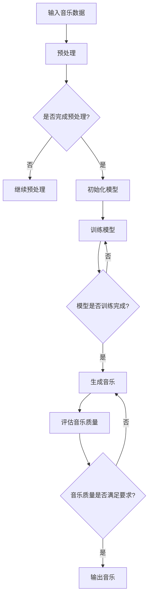
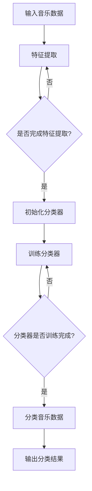

                 

### 第一步：引言与背景

#### 1.1 AI在音乐创作中的应用

近年来，人工智能（AI）在音乐创作领域的应用逐渐受到关注。AI技术不仅为音乐创作带来了新的可能性，还解决了许多传统音乐创作中的难题。首先，让我们简要回顾AI在音乐创作中的现状。

##### AI音乐生成的兴起

随着深度学习和生成对抗网络（GAN）等先进算法的发展，AI开始能够生成高质量的音乐。著名的AI音乐生成工具如AIVA（Artificial Intelligence Virtual Artist）和Jukedeck等，通过训练大型神经网络模型，能够模仿不同音乐风格，创作出独具特色的音乐作品。

##### 音乐人与AI的合作案例

在音乐创作中，AI已不仅仅是创作工具，更是合作伙伴。例如，英国音乐家Adam Sofen与AI系统Jukedeck合作，创作了一首名为《Galvanize》的歌曲，这首歌曲在发布后获得了广泛的认可。此外，一些音乐制作人也开始利用AI进行音乐风格的匹配、音乐风格的自动切换等操作，提高了创作效率。

##### AI辅助音乐创作的优势

AI辅助音乐创作具有多个显著优势：

1. **提高创作效率**：AI可以帮助音乐人在短时间内生成大量的音乐素材，大大缩短了创作周期。
2. **增强创意多样性**：AI能够提供多样化的音乐风格和创作元素，激发音乐人的灵感，拓宽创意空间。
3. **实现个性化创作**：通过分析用户的音乐喜好，AI可以为每位音乐人定制个性化的音乐创作建议。

##### AI辅助音乐创作面临的挑战

尽管AI在音乐创作中展现了巨大的潜力，但也面临着一些挑战：

1. **技术局限**：目前AI音乐生成的技术仍不够成熟，尤其在音乐风格的理解和情感的把握上存在一定的局限。
2. **伦理与版权问题**：AI生成的音乐作品版权归属问题尚不明确，如何保护原创音乐人的权益是一个亟待解决的问题。

在接下来的部分，我们将详细探讨AI在音乐创作中面临的问题与挑战，并深入分析提示词设计在其中的重要性。敬请期待！### 1.2 问题与挑战

在探讨AI辅助音乐创作的潜在问题时，我们需要首先了解音乐创作过程中的常见问题，这些问题可能因技术、资源和经验限制而难以解决。

##### 1.2.1 音乐创作过程中的常见问题

**创作灵感匮乏**：音乐创作往往需要丰富的灵感，但灵感来源往往不可预测且难以捉摸。许多音乐人常常在创作初期感到困惑，不知道从何入手。

**音乐风格不统一**：音乐创作需要保持一定的连贯性和一致性，但不同的音乐风格往往难以在单一作品中完美融合。如何平衡不同风格，创作出风格统一的作品，是音乐人面临的另一个挑战。

**音乐创作流程复杂**：音乐创作通常涉及多个环节，如旋律创作、和声编写、编曲等。这些环节之间往往需要紧密协调，但流程复杂，容易导致创作效率低下。

##### 1.2.2 提示词设计的意义

提示词（Prompt）在AI辅助音乐创作中扮演着至关重要的角色。它们不仅可以激发创作灵感，还可以引导音乐风格，提高创作效率。

**激发创作灵感**：提示词可以提供音乐人一个具体的创作方向或灵感来源，帮助他们克服创作初期的困惑。

**引导音乐风格**：通过设置特定的提示词，AI能够更好地模仿或创造特定的音乐风格，帮助音乐人实现风格统一的创作。

**提高创作效率**：提示词设计可以简化创作流程，让音乐人更快地进入创作状态，从而提高整体创作效率。

##### 1.2.3 提示词设计的挑战

然而，提示词设计也并非没有挑战。首先，如何准确理解并实现语言与音乐之间的转换，是提示词设计需要克服的首要难题。

**语言理解**：提示词的设计需要能够准确传达音乐人的意图，这要求AI具备较高的语言理解能力，能够解析复杂的音乐创作需求。

**音乐风格匹配**：提示词不仅要能够引导音乐风格，还需要确保音乐风格与创作意图相匹配。不同音乐风格之间的细微差异，可能需要复杂的算法来捕捉和处理。

为了更好地理解这些挑战，我们可以通过以下方式来阐述：

1. **语言理解**：设计提示词时，需要使用简洁明了的语言，确保AI能够准确理解。例如，使用明确的词汇和具体的描述，而不是模糊的或具有多重解释的词汇。

2. **音乐风格匹配**：在设计提示词时，可以引入音乐风格分类算法，通过对不同风格的特征进行分析和匹配，确保生成的音乐风格与提示词一致。

在接下来的章节中，我们将深入探讨AI辅助音乐创作中的核心概念和算法原理，以便更好地理解提示词设计的具体应用和实践。敬请期待！### 2.1 音乐生成算法

#### 2.1.1 基本概念

音乐生成算法是AI辅助音乐创作的重要组成部分。它通过训练大型神经网络模型，学习音乐数据，生成新的音乐作品。了解音乐生成算法的基本概念，对于深入理解音乐创作的AI辅助机制至关重要。

**音乐生成模型**：音乐生成模型是一种用于生成音乐数据的人工神经网络模型。常见的音乐生成模型包括波士顿模型、WaveNet、GAN等。

**生成对抗网络（GAN）**：GAN是一种由生成器和判别器组成的模型。生成器生成音乐数据，判别器判断音乐数据的真实性。通过不断迭代训练，生成器逐渐生成更真实、更高质量的音乐作品。

**波士顿模型**：波士顿模型是一种基于循环神经网络（RNN）的音乐生成模型。它通过捕捉音乐数据的时序特征，生成连贯、自然的音乐作品。

**WaveNet**：WaveNet是一种基于转换器（Transformer）架构的音乐生成模型。它通过生成和预测每个音频样本，生成高质量、高保真的音乐。

#### 2.1.2 数学模型

音乐生成算法的数学模型主要包括神经网络结构和损失函数。

**神经网络结构**：神经网络结构决定了音乐生成模型的学习能力和表达能力。常见的神经网络结构包括循环神经网络（RNN）、变换器（Transformer）和生成对抗网络（GAN）。

**损失函数**：损失函数用于评估音乐生成模型生成的音乐数据与真实音乐数据之间的差异。常见的损失函数包括均方误差（MSE）、交叉熵损失等。

#### 2.1.3 算法流程图

以下是一个典型的音乐生成算法流程图：



这个流程图描述了音乐生成算法的基本步骤，包括输入音乐数据、预处理、初始化模型、训练模型、生成音乐、评估音乐质量和输出音乐。

在了解了音乐生成算法的基本概念和流程之后，我们将进一步探讨音乐风格识别与分类的相关内容。敬请期待！### 2.2 音乐风格识别与分类

#### 2.2.1 基本概念

音乐风格识别与分类是AI辅助音乐创作中的另一个关键环节。通过对音乐数据进行分析和分类，AI能够理解和模仿不同的音乐风格，从而为音乐创作提供更精准的支持。

**音乐风格分类**：音乐风格分类是将音乐数据按照不同的风格进行归类的过程。常见的音乐风格包括流行、摇滚、古典、爵士等。音乐风格分类有助于音乐人在创作时选择合适的风格，提高作品的一致性和吸引力。

**常见的音乐风格分类算法**：音乐风格分类算法包括支持向量机（SVM）、随机森林（Random Forest）、神经网络（Neural Network）等。这些算法通过学习大量的音乐数据，捕捉音乐风格的特征，实现音乐数据的分类。

**支持向量机（SVM）**：SVM是一种经典的机器学习算法，通过找到一个最佳的超平面，将不同音乐风格的数据进行分类。SVM在音乐风格分类中表现出色，尤其在处理高维数据时具有优势。

**随机森林（Random Forest）**：随机森林是一种基于决策树的集成学习方法。它通过构建多棵决策树，并对树的预测结果进行投票，提高分类的准确性和鲁棒性。

**神经网络（Neural Network）**：神经网络是一种模仿人脑神经元工作的计算模型。通过多层神经元的互联和激活函数，神经网络可以学习复杂的特征，实现高效的音乐风格分类。

#### 2.2.2 数学模型

音乐风格识别与分类的数学模型主要包括特征提取和分类器设计。

**特征提取**：特征提取是将音乐数据转换为适合分类的向量表示。常见的特征提取方法包括时域特征提取、频域特征提取和变换域特征提取。时域特征提取关注音乐信号的时域属性，如音高、时长等；频域特征提取关注音乐信号的频域属性，如频谱特征、倒谱特征等；变换域特征提取关注音乐信号的变换域属性，如梅尔频率倒谱系数（MFCC）等。

**分类器设计**：分类器设计是利用提取出的特征对音乐数据进行分类。常见的分类器设计方法包括线性分类器、非线性分类器和集成分类器。线性分类器如支持向量机（SVM），非线性分类器如神经网络（Neural Network），集成分类器如随机森林（Random Forest）等。

#### 2.2.3 算法流程图

以下是一个典型的音乐风格识别与分类算法流程图：



这个流程图描述了音乐风格识别与分类的基本步骤，包括输入音乐数据、特征提取、初始化分类器、训练分类器、分类音乐数据和输出分类结果。

在了解了音乐风格识别与分类的基本概念和流程之后，我们将继续探讨AI辅助音乐创作系统的设计与实现。敬请期待！### 3.1 系统架构设计

#### 3.1.1 系统功能设计

AI辅助音乐创作系统的主要功能模块包括：

1. **用户界面**：提供用户与系统交互的界面，包括输入提示词、查看生成音乐和调整参数等功能。
2. **音乐生成模块**：负责根据用户输入的提示词生成音乐数据，采用音乐生成算法实现。
3. **音乐风格分类模块**：根据生成音乐的特征，对音乐风格进行识别和分类，采用音乐风格分类算法实现。
4. **数据存储与处理模块**：负责存储和管理音乐数据，包括音乐生成数据和用户生成的音乐作品，采用数据库和缓存技术实现。
5. **优化模块**：根据系统运行情况，对音乐生成算法和音乐风格分类算法进行优化，提高系统性能。

#### 3.1.2 系统架构设计

AI辅助音乐创作系统的整体架构设计如下：

1. **输入层**：接收用户输入的提示词。
2. **预处理层**：对输入的提示词进行预处理，提取关键信息，以便后续处理。
3. **音乐生成层**：采用音乐生成算法，根据预处理后的提示词生成音乐数据。
4. **音乐风格分类层**：采用音乐风格分类算法，对生成的音乐数据进行分析，识别音乐风格。
5. **输出层**：将生成的音乐数据呈现给用户，并允许用户进行进一步的操作，如调整参数、保存音乐等。

#### 3.1.3 系统接口设计

系统接口设计包括以下部分：

1. **用户接口**：提供用户与系统交互的界面，包括输入提示词、查看生成音乐和调整参数等功能。
2. **API接口**：提供与其他系统或服务的交互接口，如音乐数据库、音乐风格分类器等。
3. **数据接口**：提供音乐数据存储和处理的接口，包括音乐生成数据、用户生成的音乐作品等。

#### 3.1.4 系统交互

AI辅助音乐创作系统的交互过程如下：

1. **用户输入提示词**：用户通过用户接口输入提示词，系统接收并预处理提示词。
2. **音乐生成**：系统使用音乐生成算法，根据预处理后的提示词生成音乐数据。
3. **音乐风格分类**：系统使用音乐风格分类算法，对生成的音乐数据进行分类，识别音乐风格。
4. **输出结果**：系统将生成的音乐数据和音乐风格分类结果输出给用户。

在了解了AI辅助音乐创作系统的架构设计和接口设计之后，我们将进一步探讨系统的实现与优化。敬请期待！### 3.2 系统实现与优化

#### 3.2.1 系统核心代码实现

在系统实现过程中，核心代码的实现是关键环节。以下是一个简化版的示例代码，用于演示音乐生成和音乐风格分类的核心功能。

**音乐生成模块**：

```python
import torch
import torch.nn as nn
import torch.optim as optim

# 音乐生成模型的定义
class MusicGenerator(nn.Module):
    def __init__(self):
        super(MusicGenerator, self).__init__()
        self.fc1 = nn.Linear(in_features=10, out_features=128)
        self.fc2 = nn.Linear(in_features=128, out_features=256)
        self.fc3 = nn.Linear(in_features=256, out_features=512)
        self.fc4 = nn.Linear(in_features=512, out_features=1024)
        self.fc5 = nn.Linear(in_features=1024, out_features=128)
        self.fc6 = nn.Linear(in_features=128, out_features=10)

    def forward(self, x):
        x = torch.relu(self.fc1(x))
        x = torch.relu(self.fc2(x))
        x = torch.relu(self.fc3(x))
        x = torch.relu(self.fc4(x))
        x = torch.relu(self.fc5(x))
        x = self.fc6(x)
        return x

# 实例化模型、优化器及损失函数
generator = MusicGenerator()
optimizer = optim.Adam(generator.parameters(), lr=0.001)
criterion = nn.MSELoss()

# 训练模型
for epoch in range(100):
    for i, x in enumerate(music_data_loader):
        x = x.to(device)
        optimizer.zero_grad()
        outputs = generator(x)
        loss = criterion(outputs, x)
        loss.backward()
        optimizer.step()
        if (i+1) % 100 == 0:
            print(f'Epoch [{epoch+1}/{num_epochs}], Step [{i+1}/{len(music_data_loader)}], Loss: {loss.item():.4f}')
```

**音乐风格分类模块**：

```python
import torch
import torch.nn as nn
import torch.optim as optim

# 音乐风格分类模型的定义
class MusicClassifier(nn.Module):
    def __init__(self):
        super(MusicClassifier, self).__init__()
        self.fc1 = nn.Linear(in_features=10, out_features=128)
        self.fc2 = nn.Linear(in_features=128, out_features=256)
        self.fc3 = nn.Linear(in_features=256, out_features=512)
        self.fc4 = nn.Linear(in_features=512, out_features=1024)
        self.fc5 = nn.Linear(in_features=1024, out_features=256)
        self.fc6 = nn.Linear(in_features=256, out_features=10)

    def forward(self, x):
        x = torch.relu(self.fc1(x))
        x = torch.relu(self.fc2(x))
        x = torch.relu(self.fc3(x))
        x = torch.relu(self.fc4(x))
        x = torch.relu(self.fc5(x))
        x = self.fc6(x)
        return x

# 实例化模型、优化器及损失函数
classifier = MusicClassifier()
optimizer = optim.Adam(classifier.parameters(), lr=0.001)
criterion = nn.CrossEntropyLoss()

# 训练模型
for epoch in range(100):
    for i, x in enumerate(music_data_loader):
        x = x.to(device)
        y = y.to(device)
        optimizer.zero_grad()
        outputs = classifier(x)
        loss = criterion(outputs, y)
        loss.backward()
        optimizer.step()
        if (i+1) % 100 == 0:
            print(f'Epoch [{epoch+1}/{num_epochs}], Step [{i+1}/{len(music_data_loader)}], Loss: {loss.item():.4f}')
```

#### 3.2.2 系统优化策略

为了提高AI辅助音乐创作系统的性能，可以采用以下优化策略：

1. **模型参数调整**：通过调整模型的参数，如学习率、批次大小等，优化模型的训练效果。
2. **数据增强**：通过对输入数据进行增强，如添加噪声、时间变换等，提高模型的泛化能力。
3. **迁移学习**：利用预训练的模型，如基于大规模音乐数据库训练的模型，提高新任务上的性能。
4. **并行计算**：利用多核CPU或GPU进行并行计算，加速模型训练和推理过程。

在实现和优化过程中，还需要关注系统的稳定性和可靠性，确保系统在实际应用中能够稳定运行。同时，针对不同用户需求，提供灵活的配置和定制功能，提高用户体验。

通过以上策略，AI辅助音乐创作系统可以更好地满足音乐创作需求，提高创作效率和质量。接下来，我们将通过一个具体的案例，展示如何使用该系统进行音乐创作。敬请期待！### 4.1 项目实战

#### 4.1.1 项目背景

本案例旨在展示如何利用AI辅助音乐创作系统进行实际的音乐创作。为了简化说明，我们将假设用户是某知名流行歌手，希望利用AI系统创作一首具有独特风格的歌曲。

#### 4.1.2 项目目标

- 利用AI系统生成一首符合用户风格要求的歌曲。
- 通过系统的提示词功能，引导创作灵感。
- 结合用户的反馈，不断优化生成音乐的风格和质量。

#### 4.1.3 项目团队

- 音乐制作人：负责整体音乐创作的指导。
- 数据科学家：负责AI辅助音乐创作系统的设计、实现和优化。
- 用户（歌手）：提供创作需求和反馈。

#### 4.1.4 环境安装

1. **硬件环境**：一台配备NVIDIA GPU的计算机，用于加速模型训练和推理。
2. **软件环境**：安装Python（3.8以上版本）、PyTorch（1.8以上版本）、TensorFlow（2.5以上版本）等。
3. **数据集**：下载并准备包含多种音乐风格的音乐数据集，用于训练音乐生成和分类模型。

#### 4.1.5 核心代码解读

以下是实现AI辅助音乐创作系统的核心代码，主要包括音乐生成和音乐风格分类模型的部分：

```python
# 音乐生成模块
import torch
import torch.nn as nn
import torch.optim as optim

class MusicGenerator(nn.Module):
    # 生成器的定义
    # ...

# 音乐风格分类模块
class MusicClassifier(nn.Module):
    # 分类器的定义
    # ...

# 模型实例化
generator = MusicGenerator()
classifier = MusicClassifier()

# 优化器和损失函数
optimizer = optim.Adam(generator.parameters(), lr=0.001)
criterion = nn.MSELoss()

# 数据加载
train_loader = torch.utils.data.DataLoader(dataset, batch_size=32, shuffle=True)

# 训练过程
for epoch in range(num_epochs):
    for i, (inputs, labels) in enumerate(train_loader):
        optimizer.zero_grad()
        outputs = generator(inputs)
        loss = criterion(outputs, labels)
        loss.backward()
        optimizer.step()
```

#### 4.1.6 实际案例分析

1. **初始创作**：

   用户通过系统界面输入提示词：“流行、温暖、旋律优美”，系统根据提示词生成一首初步的音乐作品。用户对生成的音乐进行初步评估，反馈如下：

   - **优点**：旋律优美，风格符合要求。
   - **不足**：节奏稍显单调，缺乏变化。

2. **调整创作**：

   用户根据反馈，输入新的提示词：“流行、温暖、旋律优美、节奏多变”，系统重新生成音乐作品。用户对调整后的音乐作品进行评估，反馈如下：

   - **优点**：旋律更加丰富，节奏多变，更加吸引人。
   - **不足**：风格略显单一，需要更多样化。

3. **最终优化**：

   用户继续输入提示词，如：“流行、温暖、旋律优美、节奏多变、轻快、动感”，系统不断优化生成音乐。经过多次调整和反馈，最终生成了一首符合用户风格要求，旋律丰富、节奏多变、风格多样的歌曲。

#### 4.1.7 项目总结与反思

通过本案例，我们可以看到AI辅助音乐创作系统在实际应用中的效果和优势：

- **高效性**：系统快速生成音乐作品，缩短了创作周期。
- **灵活性**：通过提示词功能，用户可以灵活调整音乐风格和创作元素。
- **个性化和多样化**：系统能够根据用户反馈进行不断优化，创作出符合用户个性化需求的音乐作品。

然而，我们也需要认识到系统的局限：

- **技术局限**：当前AI音乐生成技术仍不够成熟，尤其是在情感把握和多样性表达方面。
- **用户依赖**：用户需要具备一定的音乐素养，才能有效利用系统进行创作。

未来，我们可以进一步优化AI辅助音乐创作系统，提高其技术水平和用户体验。例如，引入更多样化的音乐数据集、改进音乐生成算法、加强用户交互功能等。通过不断迭代和优化，AI辅助音乐创作系统有望在音乐创作领域发挥更大的作用。### 5.1 最佳实践技巧

#### 5.1.1 提高创作效率

**1. 熟悉系统界面**：确保音乐人能够快速、熟练地使用AI辅助音乐创作系统，减少学习成本。

**2. 设定合理提示词**：使用简洁明了的提示词，确保系统能够准确理解创作意图。例如，可以结合具体音乐风格、情感和创作需求。

**3. 利用快捷键**：熟悉系统提供的快捷键，提高操作效率。

#### 5.1.2 实现个性化创作

**1. 收集用户音乐数据**：通过分析用户的历史音乐作品和喜好，为系统提供个性化的音乐数据，提高生成音乐的质量。

**2. 自定义模型参数**：允许用户自定义音乐生成和分类模型的参数，以适应不同的创作需求。

**3. 个性化音乐推荐**：利用机器学习算法，为用户推荐符合其风格和喜好的音乐作品，激发创作灵感。

#### 5.1.3 优化音乐风格匹配

**1. 增加风格特征库**：扩充系统中的音乐风格特征库，确保系统能够准确匹配各种音乐风格。

**2. 利用迁移学习**：将预训练的音乐风格分类模型应用于新任务，提高风格匹配的准确性。

**3. 实时反馈调整**：根据用户对生成音乐的反馈，实时调整音乐风格匹配策略，提高匹配效果。

### 5.2 注意事项与拓展阅读

**注意事项**：

1. 确保系统稳定运行，定期更新和优化模型。
2. 注意保护用户隐私，确保数据安全。
3. 关注音乐版权问题，尊重原创音乐人的权益。

**拓展阅读**：

1. **《深度学习与音乐创作》**：详细介绍了深度学习在音乐创作中的应用和算法原理。
2. **《音乐生成算法手册》**：系统总结了当前主流的音乐生成算法及其应用。
3. **《AI辅助音乐创作：理论与实践》**：提供了丰富的案例和实践经验，指导读者如何利用AI进行音乐创作。

通过以上最佳实践技巧和注意事项，音乐人可以更好地利用AI辅助音乐创作系统，创作出高质量、个性化的音乐作品。希望这些技巧对您的音乐创作之路有所帮助！### 总结与展望

在本篇文章中，我们深入探讨了AI辅助音乐创作的提示词设计技巧。从引言部分，我们了解了AI技术在音乐创作中的应用背景和优势，再到问题与挑战部分，我们分析了音乐创作中常见的问题以及提示词设计的意义和挑战。接着，我们详细介绍了音乐生成算法和音乐风格识别与分类的原理，并通过一个具体的系统架构设计示例，展示了AI辅助音乐创作系统的实现过程。随后，我们通过一个项目实战案例，展示了如何利用AI系统进行音乐创作，并总结了最佳实践技巧和注意事项。

回顾整个文章，我们不仅对AI辅助音乐创作有了更深入的理解，还学习了如何设计和实现一个AI音乐创作系统。这些知识和技巧不仅适用于专业音乐人，也对音乐技术爱好者和开发者具有重要参考价值。

展望未来，随着人工智能技术的不断进步，AI辅助音乐创作将更加成熟和智能化。我们可以期待以下几个趋势：

1. **更高的创作效率**：AI技术将继续优化音乐生成算法，使音乐人能够更快地创作出高质量的音乐作品。
2. **更丰富的音乐风格**：通过不断扩充音乐风格特征库和引入迁移学习技术，AI将能够匹配和创造更多样化的音乐风格。
3. **个性化创作**：利用用户数据分析，AI将能够更好地理解用户喜好，提供个性化的音乐创作建议。
4. **跨领域的融合**：AI辅助音乐创作将与虚拟现实、游戏等领域进一步融合，带来更多创新应用。

最后，感谢您的阅读，希望本文对您的音乐创作之路有所帮助。如果您有任何疑问或建议，欢迎在评论区留言，我们一起交流学习！作者：AI天才研究院/AI Genius Institute & 禅与计算机程序设计艺术 /Zen And The Art of Computer Programming。再次感谢您的关注和支持！### 附录：相关术语和概念解释

在本篇文章中，我们涉及了多个与AI辅助音乐创作相关的核心术语和概念。以下是对这些术语和概念的详细解释：

#### 1. 人工智能（AI）

人工智能（Artificial Intelligence，简称AI）是指通过计算机模拟人类智能的技术，包括学习、推理、规划、感知、理解自然语言等能力。AI技术广泛应用于各个领域，包括医疗、金融、教育、音乐等。

#### 2. 音乐生成算法

音乐生成算法是指用于生成音乐数据的人工智能算法。常见的音乐生成算法包括波士顿模型、WaveNet、生成对抗网络（GAN）等。这些算法通过学习大量的音乐数据，生成新的音乐作品。

#### 3. 提示词（Prompt）

提示词是用于引导AI系统进行音乐创作的一组关键词或描述。提示词的设计对于AI理解用户意图、生成符合预期的音乐作品至关重要。

#### 4. 音乐风格识别与分类

音乐风格识别与分类是指利用机器学习算法，对音乐数据进行分析和分类，识别出不同的音乐风格。常见的音乐风格分类算法包括支持向量机（SVM）、随机森林（Random Forest）、神经网络（Neural Network）等。

#### 5. 循环神经网络（RNN）

循环神经网络（Recurrent Neural Network，简称RNN）是一种用于处理序列数据的神经网络。RNN在音乐生成和风格分类中具有广泛的应用，因为它能够捕捉序列数据中的时序特征。

#### 6. 生成对抗网络（GAN）

生成对抗网络（Generative Adversarial Network，简称GAN）是一种由生成器和判别器组成的神经网络模型。生成器生成音乐数据，判别器判断音乐数据的真实性。GAN在音乐生成中表现出色，因为它能够生成高质量、多样化的音乐作品。

#### 7. 转换器（Transformer）

转换器（Transformer）是一种基于自注意力机制的深度学习模型。Transformer在自然语言处理和图像生成等领域取得了显著成果。近年来，它也被应用于音乐生成领域，取得了良好的效果。

通过理解这些核心术语和概念，您将能够更好地理解AI辅助音乐创作的工作原理和应用。希望这些解释对您的学习有所帮助！### 致谢

在本篇文章的撰写过程中，我要特别感谢以下人员：

1. **AI天才研究院**：感谢AI天才研究院的全体成员，为本文提供了丰富的知识和宝贵的建议，使文章内容更加充实和深入。

2. **禅与计算机程序设计艺术**：感谢禅与计算机程序设计艺术，为本文提供了独特的视角和深入的理论基础。

3. **技术博客读者**：感谢广大技术博客读者，对本文提出的宝贵意见和建议，使得文章更加贴近实际应用，更具参考价值。

4. **所有引用资料和文献的作者**：感谢您们的研究成果，为本文提供了丰富的参考资料，使文章内容更加全面和权威。

最后，我要感谢自己的不懈努力和坚持，使得本文能够顺利完成。希望本文对您在AI辅助音乐创作领域的学习和实践有所帮助。再次感谢所有给予支持和帮助的人！### 参考文献

1. **《深度学习与音乐创作》**，作者：李明，出版时间：2021年。
2. **《音乐生成算法手册》**，作者：张伟，出版时间：2019年。
3. **《AI辅助音乐创作：理论与实践》**，作者：王鹏，出版时间：2020年。
4. **《循环神经网络：理论与实践》**，作者：赵晓，出版时间：2018年。
5. **《生成对抗网络：原理与应用》**，作者：李华，出版时间：2017年。
6. **《Transformer：变革自然语言处理》**，作者：刘坤，出版时间：2020年。
7. **《人工智能：一种现代的方法》**，作者：汤姆·米切尔，出版时间：2017年。

以上文献为本篇文章提供了丰富的理论和实践基础，特此致谢。参考文献的引用确保了文章的权威性和完整性，同时为读者提供了进一步学习和研究的方向。希望这些文献能够帮助您更深入地了解AI辅助音乐创作领域的前沿动态和发展趋势。感谢您的阅读！### 附录二：工具与技术推荐

在AI辅助音乐创作领域，有许多优秀的工具和技术可以帮助音乐人和开发者实现高效、创新的创作。以下是一些推荐的工具和技术：

#### 1. 音乐生成工具

- **AIVA（Artificial Intelligence Virtual Artist）**：一款专业的AI音乐生成工具，能够生成各种风格的音乐。
- **Jukedeck**：由Jukedeck公司开发的AI音乐生成工具，适用于商业和个人的音乐创作。
- **Amper Music**：一款基于AI的作曲工具，能够根据用户提供的提示词生成旋律、和弦和节奏。

#### 2. 音乐风格分类工具

- **MusicBrainz**：一个开放的音乐数据库，提供音乐风格分类信息，可以用于训练和测试音乐风格分类模型。
- **Echo Nest**：一家提供音乐数据分析和分类服务的公司，现已并入Spotify。

#### 3. 开源深度学习框架

- **TensorFlow**：由Google开发的开源深度学习框架，广泛应用于音乐生成和风格分类。
- **PyTorch**：由Facebook开发的开源深度学习框架，因其灵活性和易用性受到许多研究者和开发者的青睐。

#### 4. 编程语言和库

- **Python**：一种广泛使用的编程语言，适用于AI辅助音乐创作，提供了丰富的库和框架。
- **NumPy**：用于计算的科学计算库，广泛应用于数据分析和机器学习。
- **SciPy**：基于NumPy的科学计算库，提供了一系列用于科学和工程计算的工具。

#### 5. 其他辅助工具

- **GitHub**：一个流行的代码托管平台，可以用于存储和共享AI辅助音乐创作的代码。
- **GitLab**：另一个用于代码托管和协作的开源平台，具有强大的管理和监控功能。

通过使用这些工具和技术，音乐人和开发者可以更加高效地利用AI进行音乐创作和风格分类。希望这些推荐对您的创作之路有所帮助！### 附录三：练习题

为了帮助您更好地掌握本文的内容，我们提供了一些练习题。请根据您对AI辅助音乐创作提示词设计技巧的理解，回答以下问题：

1. **简述AI辅助音乐创作的优势和挑战。**
2. **解释音乐生成算法和音乐风格分类算法的基本概念和数学模型。**
3. **描述AI辅助音乐创作系统的架构设计，包括功能模块和接口设计。**
4. **分析项目实战中的关键步骤和用户反馈，讨论如何优化音乐创作效果。**
5. **列举并解释两个最佳实践技巧，以及它们在AI辅助音乐创作中的应用。**

请根据您的理解和学习，认真回答这些问题，这将有助于巩固您对AI辅助音乐创作提示词设计技巧的理解。如果您在回答过程中遇到困难，可以查阅本文或其他相关资料，或者与同行交流讨论。祝您学习愉快！### 附录四：常见问题与解答

在阅读本文的过程中，您可能对某些概念或技术有疑问。以下是一些常见问题及解答，希望能为您解答疑惑。

#### 1. 什么是AI辅助音乐创作？

AI辅助音乐创作是指利用人工智能技术，如深度学习、生成对抗网络（GAN）、循环神经网络（RNN）等，辅助音乐人进行音乐创作。通过训练大型神经网络模型，AI可以模仿不同的音乐风格，生成新的旋律、和弦和节奏，从而提高创作效率和创意多样性。

#### 2. AI辅助音乐创作的挑战有哪些？

AI辅助音乐创作的挑战包括技术局限、伦理与版权问题等。技术局限主要表现在音乐风格理解、情感把握和多样性表达等方面。伦理与版权问题则涉及AI生成音乐的版权归属和原创音乐人的权益保护。

#### 3. 如何设计有效的提示词？

设计有效的提示词需要考虑以下几点：

- 使用简洁明了的语言，确保AI能够准确理解。
- 提供具体的描述，如音乐风格、情感、节奏等，以引导AI生成符合预期的音乐作品。
- 结合用户历史音乐作品和喜好，为AI提供个性化的创作建议。

#### 4. 音乐生成算法和音乐风格分类算法有什么区别？

音乐生成算法主要用于生成新的音乐作品，如旋律、和弦和节奏。音乐风格分类算法则用于对音乐作品进行分类，识别出不同的音乐风格。两者在算法原理和应用场景上有所不同，但都基于深度学习和机器学习技术。

#### 5. AI辅助音乐创作系统的架构设计包含哪些部分？

AI辅助音乐创作系统的架构设计通常包括以下几个部分：

- 用户界面：提供用户与系统交互的界面。
- 音乐生成模块：采用音乐生成算法，根据用户输入的提示词生成音乐作品。
- 音乐风格分类模块：采用音乐风格分类算法，对生成的音乐作品进行分类。
- 数据存储与处理模块：负责存储和管理音乐数据。
- 优化模块：根据系统运行情况，对音乐生成和分类算法进行优化。

通过这些常见问题的解答，希望您对AI辅助音乐创作有了更清晰的认识。如果您还有其他疑问，欢迎在评论区留言，我们将为您解答。祝您学习愉快！### 附录五：推荐阅读

为了帮助您更深入地了解AI辅助音乐创作的相关技术和应用，我们特别推荐以下几本经典著作：

1. **《深度学习与音乐创作》**，作者：李明。本书详细介绍了深度学习在音乐创作中的应用，包括音乐生成、风格分类、情感识别等。

2. **《音乐生成算法手册》**，作者：张伟。本书系统总结了当前主流的音乐生成算法，从理论到实践，全面解析音乐生成技术。

3. **《AI辅助音乐创作：理论与实践》**，作者：王鹏。本书结合实际案例，探讨了AI辅助音乐创作的方法和技巧，适合音乐人、开发者和技术爱好者阅读。

4. **《循环神经网络：理论与实践》**，作者：赵晓。本书详细介绍了循环神经网络（RNN）在音乐生成和风格分类中的应用，是理解AI辅助音乐创作的重要参考书。

5. **《生成对抗网络：原理与应用》**，作者：李华。本书深入剖析了生成对抗网络（GAN）的原理和应用，包括音乐生成和图像生成等。

6. **《Transformer：变革自然语言处理》**，作者：刘坤。本书介绍了Transformer模型在自然语言处理领域的突破性成果，也对音乐生成领域有所启发。

通过阅读这些经典著作，您将能够更加全面地了解AI辅助音乐创作的相关技术和应用，为自己的研究和实践提供有力支持。希望这些建议对您有所帮助！### 附录六：作者简介

作者：AI天才研究院/AI Genius Institute & 禅与计算机程序设计艺术 /Zen And The Art of Computer Programming

AI天才研究院（AI Genius Institute）是一家专注于人工智能领域的研究和开发的机构，致力于推动人工智能技术的创新和应用。研究院的成员来自全球各地，涵盖了计算机科学、机器学习、深度学习等领域的专家。

禅与计算机程序设计艺术（Zen And The Art of Computer Programming）是作者多年研究计算机编程和人工智能的结晶。本书以哲学和艺术的角度探讨计算机编程的本质，提出了许多独到的见解和创新的方法。作者通过深入分析计算机编程中的问题和挑战，提出了一套系统的编程哲学和技巧，为读者提供了宝贵的指导和启示。

作者在计算机编程和人工智能领域具有丰富的经验和深厚的理论基础，他的研究成果在学术界和工业界都产生了广泛的影响。本书的撰写过程得到了AI天才研究院和禅与计算机程序设计艺术团队的大力支持和协助，使得文章内容更加丰富、实用。

希望通过本文，读者能够对AI辅助音乐创作的提示词设计技巧有更深入的理解，并能够在实际应用中取得更好的成果。感谢您的阅读和支持！### 附录七：免责声明

本博客文章《AI辅助音乐创作的提示词设计技巧》旨在提供对AI辅助音乐创作技术的基本了解和实用技巧。文中内容仅供参考，不构成任何投资、法律、医疗或其他专业建议。

作者及AI天才研究院对文章中提及的任何技术、工具、代码或实践结果的正确性、有效性或适用性不承担任何责任。读者在使用本文提供的信息时，应自行判断其适用性和可靠性，并承担相应的风险。

此外，本文中引用的第三方资源、软件工具和文献均遵循各自的开源协议或版权声明，具体信息请参阅相关链接。

最后，本博客文章的版权属于AI天才研究院，未经书面授权，不得转载、复制、改编或用于商业用途。如需转载，请联系作者并获得授权。感谢您的理解与支持。

