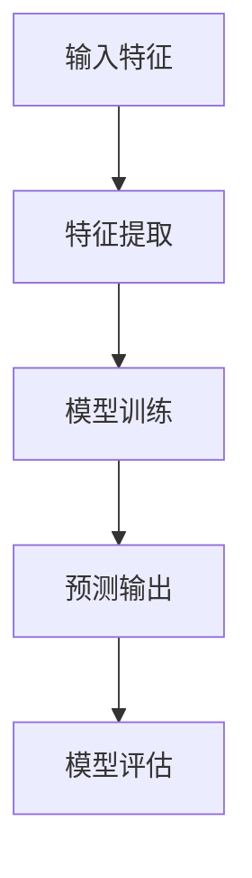
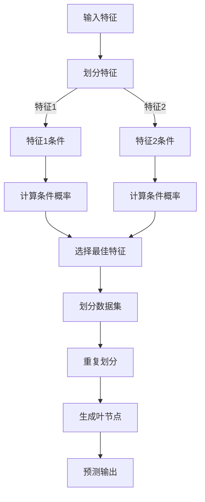
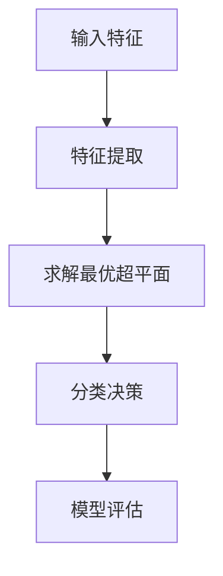
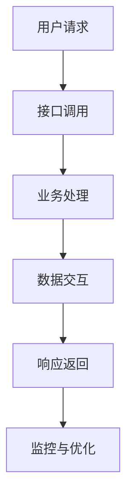
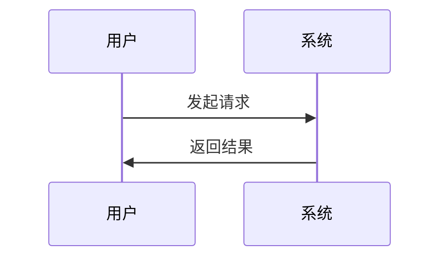

                 

### 引言与背景

#### 1.1 人工智能在软件开发领域的兴起

近年来，人工智能（AI）技术迅猛发展，逐渐渗透到各行各业，改变了传统的工作方式和生产模式。作为信息技术的重要组成部分，软件工程也迎来了AI技术的革新。AI驱动开发（AI-driven development）作为一种全新的软件开发模式，逐渐成为软件开发领域的研究热点和实际应用场景。

AI驱动开发的核心思想是将人工智能技术深度融入软件开发的各个环节，利用AI算法来辅助或自动完成代码生成、需求分析、测试、优化等任务。通过引入AI，软件开发的过程变得更加智能、高效和自动化，从而大大提升开发效率和软件质量。

#### 1.2 软件工程面临的挑战与机遇

随着互联网的普及和用户需求的不断增长，软件工程面临着前所未有的挑战。一方面，软件系统越来越复杂，需要处理海量数据和多样化的业务逻辑；另一方面，软件开发的周期越来越短，要求快速响应市场需求和用户反馈。这些挑战对软件开发团队的技术水平、协作能力和项目管理提出了更高的要求。

同时，这些挑战也带来了机遇。AI技术的发展为软件工程提供了新的解决方案，使得复杂问题变得可解，使开发人员能够更加专注于创造性工作，从而提高软件开发的效率和质量。

#### 1.3 问题描述

在传统的软件开发模式中，开发人员需要手动完成软件的需求分析、设计、编码、测试和维护等任务。这种方式存在以下问题：

1. **效率低下**：软件开发过程复杂，涉及多个环节和角色，开发人员需要花费大量时间和精力来完成这些任务。
2. **质量难以保证**：由于开发人员的能力和经验有限，软件质量难以得到充分保障，容易出现缺陷和漏洞。
3. **成本高昂**：软件开发涉及大量人力、时间和资源投入，成本高昂。

为了解决这些问题，AI驱动开发提出了以下解决方案：

1. **自动化**：通过AI算法自动化完成部分开发任务，如代码生成、测试、优化等，提高开发效率。
2. **智能化**：利用AI算法分析用户需求、预测问题、优化设计等，提升软件开发的质量和可靠性。
3. **成本优化**：通过减少人力和时间投入，降低软件开发成本。

#### 1.4 问题解决

AI驱动开发的核心理念是通过人工智能技术提升软件开发的过程和结果。具体来说，AI驱动开发的核心要素包括：

1. **数据驱动**：利用大量数据进行训练和优化，使AI模型能够更好地理解和预测软件开发的需求和问题。
2. **算法辅助**：采用先进的AI算法，如机器学习、深度学习、强化学习等，辅助或自动完成软件开发的任务。
3. **人机协作**：在软件开发过程中，将人类专家的智慧和AI算法的智能相结合，实现人机协同工作。

通过这些核心要素，AI驱动开发旨在实现以下目标：

1. **提升开发效率**：通过自动化和智能化的手段，减少开发人员的重复性工作，提高软件开发的速度和质量。
2. **优化开发成本**：通过减少人力和时间的投入，降低软件开发的总成本。
3. **提高软件质量**：通过AI算法的分析和优化，减少软件缺陷和漏洞，提高软件的可靠性和稳定性。

#### 1.5 边界与外延

AI驱动开发并非适用于所有软件开发场景，它有其特定的适用范围。以下是一些边界与外延的讨论：

1. **适用范围**：AI驱动开发适用于需要大规模数据处理、复杂业务逻辑、快速迭代和更新的软件项目，如人工智能应用、大数据处理、在线游戏等。
2. **非适用场景**：在简单的、独立的项目或者需要严格遵循既定规范的软件项目中，AI驱动开发的适用性有限。
3. **与传统开发的比较**：与传统软件开发模式相比，AI驱动开发在效率、质量和成本方面具有显著优势，但在开发初期可能需要更多的投资和资源。

#### 1.6 概念结构与核心要素组成

AI驱动开发的主要组成部分包括：

1. **数据收集与处理**：收集并处理与软件开发相关的数据，如用户需求、代码库、测试结果等。
2. **AI模型训练**：利用机器学习、深度学习等技术，训练AI模型以进行需求分析、代码生成、测试等任务。
3. **人机协作界面**：设计用户界面，实现人与AI模型之间的交互，如需求输入、模型调整等。
4. **自动化工具链**：集成各种AI工具和自动化工具，如代码生成器、测试工具、持续集成系统等。
5. **项目管理与跟踪**：利用AI技术进行项目管理和跟踪，如进度预测、风险分析、质量评估等。

AI驱动开发的流程与关键环节包括：

1. **需求分析**：利用AI算法分析用户需求，生成需求文档。
2. **设计**：通过AI算法自动生成或优化软件架构和设计。
3. **编码**：利用AI算法自动生成代码，或辅助开发人员进行编码。
4. **测试**：利用AI算法进行自动化测试，提高测试效率和质量。
5. **优化**：通过AI算法对软件进行性能优化，提高软件的稳定性和可靠性。
6. **部署和维护**：利用AI技术进行软件部署和维护，提高系统的可用性和可维护性。

### 总结

本文简要介绍了AI驱动开发的概念、背景和核心要素，分析了其在软件工程中的应用和优势。AI驱动开发通过引入人工智能技术，实现了软件开发过程的自动化和智能化，有望成为未来软件开发的重要趋势。接下来，本文将深入探讨人工智能基础、软件工程基础，以及AI驱动开发的算法原理，为后续内容打下坚实的基础。### 人工智能基础

#### 2.1 人工智能概述

人工智能（Artificial Intelligence，简称AI）是指通过计算机模拟人类智能行为的技术和学科。人工智能的核心目标是使计算机具备感知、推理、学习、决策和解决问题等能力，从而实现智能化应用。

人工智能的发展历程可以追溯到20世纪50年代，当时计算机科学家开始研究如何使计算机具有智能行为。从最初的逻辑推理、知识表示到今天的深度学习和自然语言处理，人工智能经历了多次技术革新和理论突破。

#### 2.2 人工智能的核心概念

人工智能的核心概念包括深度学习、强化学习和生成对抗网络，这些概念构成了人工智能技术的基础。

##### 2.2.1 深度学习

深度学习是人工智能的一个重要分支，它通过模拟人脑的神经网络结构，实现数据的自动特征学习和模式识别。深度学习的核心思想是多层神经网络（Neural Networks），通过逐层提取特征，实现从简单到复杂的模式识别。

- **多层感知机（MLP）**：多层感知机是最基本的深度学习模型，它由输入层、隐藏层和输出层组成。通过激活函数将输入映射到输出，实现非线性变换。
- **卷积神经网络（CNN）**：卷积神经网络是处理图像数据的常用模型，通过卷积层、池化层和全连接层等结构，实现图像的特征提取和分类。
- **循环神经网络（RNN）**：循环神经网络是处理序列数据的常用模型，通过循环结构将当前状态的信息传递到下一个状态，实现序列数据的建模和预测。

##### 2.2.2 强化学习

强化学习是人工智能的另一重要分支，它通过智能体与环境的交互，学习最优策略以实现目标。强化学习的基本概念包括智能体、环境、状态、动作和奖励。

- **Q学习（Q-Learning）**：Q学习是一种基于值函数的强化学习算法，通过更新Q值来学习最优策略。Q值表示智能体在特定状态下采取特定动作的预期回报。
- **策略梯度方法（Policy Gradient）**：策略梯度方法通过直接优化策略参数来学习最优策略，常见的策略梯度算法有REINFORCE算法和PPO算法。

##### 2.2.3 生成对抗网络

生成对抗网络（GAN）是深度学习的一种重要模型，由生成器和判别器两个网络组成。生成器生成虚假数据，判别器区分真实数据和虚假数据。通过训练生成器和判别器的对抗过程，生成器能够生成高质量的数据。

- **生成器（Generator）**：生成器是一个生成模型，它从随机噪声中生成虚假数据。
- **判别器（Discriminator）**：判别器是一个分类模型，它通过学习真实数据和虚假数据的特征分布，判断输入数据的真伪。

#### 2.3 核心概念对比

以下表格对比了深度学习、强化学习和生成对抗网络的基本概念和特点：

| **概念**      | **深度学习**                               | **强化学习**                               | **生成对抗网络**                           |
| ----------- | -------------------------------------- | -------------------------------------- | ---------------------------------------- |
| **基本原理** | 通过多层神经网络提取特征进行模式识别       | 通过智能体与环境的交互学习最优策略       | 通过生成器和判别器的对抗过程生成高质量数据   |
| **应用领域** | 图像识别、语音识别、自然语言处理等          | 游戏AI、自动驾驶、推荐系统等              | 图像生成、数据增强、风格迁移等              |
| **优势**     | 自动化特征提取，强大的模式识别能力          | 自主学习，适用于复杂环境                   | 高质量数据生成，增强模型泛化能力            |
| **挑战**     | 需要大量数据训练，计算资源需求高           | 需要长时间学习，策略优化困难              | 生成器和判别器训练不稳定，易出现模式崩溃      |

#### 2.4 Mermaid流程图

以下使用Mermaid语言绘制了深度学习、强化学习和生成对抗网络的流程图：

```mermaid
graph TD
    A[深度学习]
    B[多层感知机]
    C[卷积神经网络]
    D[循环神经网络]
    A--->B
    A--->C
    A--->D

    E[强化学习]
    F[Q学习]
    G[策略梯度方法]
    E--->F
    E--->G

    H[生成对抗网络]
    I[生成器]
    J[判别器]
    H-->(I,J)
    I-->(H)
    J-->(H)
```

#### 2.5 Python源代码示例

以下给出了深度学习、强化学习和生成对抗网络的Python代码示例，以详细阐述其原理：

```python
# 深度学习示例：多层感知机
import tensorflow as tf

# 构建模型
model = tf.keras.Sequential([
    tf.keras.layers.Dense(128, activation='relu', input_shape=(784,)),
    tf.keras.layers.Dense(10, activation='softmax')
])

# 编译模型
model.compile(optimizer='adam',
              loss='categorical_crossentropy',
              metrics=['accuracy'])

# 训练模型
model.fit(x_train, y_train, batch_size=128, epochs=10, validation_data=(x_test, y_test))

# 强化学习示例：Q学习
import numpy as np
import random

# 初始化Q表
Q = np.zeros([S, A])

# Q学习算法
def Q_learning(S, A, alpha, gamma, epsilon, episodes):
    for episode in range(episodes):
        state = random.choice(S)
        done = False
        while not done:
            action = choose_action(state, Q, epsilon)
            next_state, reward, done = environment.step(action)
            Q[state, action] = Q[state, action] + alpha * (reward + gamma * np.max(Q[next_state, :]) - Q[state, action])
            state = next_state

# 生成对抗网络示例：简单GAN
import tensorflow as tf
from tensorflow.keras import layers

# 生成器模型
def generate_model():
    model = tf.keras.Sequential([
        layers.Dense(128, activation='relu', input_shape=(100,)),
        layers.Dense(28*28, activation='tanh')
    ])
    return model

# 判别器模型
def discriminate_model():
    model = tf.keras.Sequential([
        layers.Dense(128, activation='relu', input_shape=(28*28,)),
        layers.Dense(1, activation='sigmoid')
    ])
    return model

# GAN模型训练
generator = generate_model()
discriminator = discriminate_model()
discriminator.compile(optimizer='adam', loss='binary_crossentropy')
for epoch in range(epochs):
    for _ in range(batch_size):
        noise = np.random.normal(0, 1, (1, 100))
        generated_image = generator.predict(noise)
        real_image = x_train[np.random.randint(0, x_train.shape[0])]
        X = np.concatenate([generated_image, real_image])
        y = np.concatenate([[0], [1]])
        discriminator.train_on_batch(X, y)
    noise = np.random.normal(0, 1, (batch_size, 100))
    generated_images = generator.predict(noise)
    y_gen = np.zeros((batch_size, 1))
    y_real = np.ones((batch_size, 1))
    discriminator.train_on_batch(generated_images, y_gen)
    discriminator.train_on_batch(real_image, y_real)
```

通过上述代码示例，我们可以看到不同AI算法的Python实现，为后续章节的详细讲解和案例分析奠定了基础。### 软件工程基础

#### 3.1 软件工程概述

软件工程（Software Engineering）是研究如何以系统化、规范化、可度量化的方法进行软件开发、操作和维护的一门工程学科。它结合计算机科学、数学和管理科学的理论和实践，致力于提高软件开发的效率、质量和可靠性。

软件工程的发展历程可以分为几个重要阶段：

1. **手工作业阶段**：早期的软件开发主要依靠个人经验和技能，没有固定的方法和规范。
2. **结构化阶段**：随着软件系统复杂性的增加，出现了一系列结构化设计方法，如模块化设计、数据抽象等。
3. **过程方法阶段**：为了更好地管理软件开发过程，提出了瀑布模型、V模型、敏捷开发等方法。
4. **现代化阶段**：当前，软件工程强调持续集成、持续交付、DevOps等现代化方法，以实现快速迭代和高效交付。

#### 3.2 软件工程的核心概念

软件工程的核心概念包括软件需求分析、软件设计、软件测试等，这些概念贯穿了软件开发的各个环节。

##### 3.2.1 软件需求分析

软件需求分析是软件开发的第一步，旨在明确用户需求，确保开发出的软件系统能够满足用户的需求。需求分析的核心任务是收集和分析用户需求，并将其转化为系统的功能需求和非功能需求。

- **用户需求**：用户对软件系统提出的直接需求，包括功能需求、性能需求等。
- **功能需求**：软件系统应实现的具体功能，如用户界面、数据处理、业务逻辑等。
- **非功能需求**：软件系统应满足的约束和条件，如可靠性、安全性、性能等。

##### 3.2.2 软件设计

软件设计是软件开发的重要阶段，它将需求转化为具体的软件架构和设计文档。软件设计分为两个层次：概要设计和详细设计。

- **概要设计**：确定软件系统的总体结构，包括模块划分、接口设计、数据结构等。
- **详细设计**：细化每个模块的实现细节，包括数据结构、算法逻辑、接口定义等。

##### 3.2.3 软件测试

软件测试是确保软件质量的重要手段，旨在发现和修复软件中的缺陷和错误。软件测试分为多个阶段，包括单元测试、集成测试、系统测试、验收测试等。

- **单元测试**：对软件模块进行独立测试，确保每个模块的功能正确。
- **集成测试**：对软件模块进行集成测试，确保模块之间的接口正确。
- **系统测试**：对整个软件系统进行测试，确保系统能够满足需求。
- **验收测试**：用户对软件系统进行测试，确认软件是否满足用户需求。

#### 3.3 核心概念对比

以下表格对比了软件需求分析、软件设计、软件测试的基本概念和特点：

| **概念**     | **软件需求分析**               | **软件设计**                   | **软件测试**                  |
| ----------- | -------------------------- | -------------------------- | -------------------------- |
| **基本原理** | 收集和分析用户需求，转化为系统需求 | 将需求转化为具体的软件结构和设计 | 发现和修复软件缺陷和错误      |
| **应用阶段** | 软件开发的初期阶段             | 软件开发的中间阶段             | 软件开发的后期阶段             |
| **主要任务** | 明确用户需求，生成需求文档       | 设计软件架构和模块接口         | 测试软件功能，验证软件质量      |
| **工具和方法** | 需求捕获工具、需求分析模型       | UML建模工具、设计规范文档       | 单元测试框架、自动化测试工具     |

#### 3.4 Mermaid流程图

以下使用Mermaid语言绘制了软件工程核心概念的流程图：

```mermaid
graph TD
    A[软件需求分析]
    B[需求捕获]
    C[需求建模]
    D[需求验证]
    A-->(B,C,D)

    E[软件设计]
    F[概要设计]
    G[详细设计]
    E-->(F,G)

    H[软件测试]
    I[单元测试]
    J[集成测试]
    K[系统测试]
    L[验收测试]
    H-->(I,J,K,L)
```

通过上述流程图，我们可以清晰地看到软件需求分析、软件设计和软件测试的流程和关系。这些核心概念在软件工程中起着至关重要的作用，为软件开发的顺利进行提供了坚实的基础。### 机器学习算法原理

#### 4.1 机器学习基础

机器学习（Machine Learning，简称ML）是人工智能的一个重要分支，旨在使计算机通过数据和经验自动改进性能。机器学习的基本原理是通过训练数据集，学习数据中的规律和模式，从而实现预测和分类等任务。

机器学习的主要类型包括：

1. **监督学习（Supervised Learning）**：监督学习有标记的训练数据，模型通过学习标记数据中的特征，对未知数据进行预测。常见的监督学习算法包括线性回归、决策树、支持向量机（SVM）和神经网络等。

2. **无监督学习（Unsupervised Learning）**：无监督学习没有标记的训练数据，模型需要从未标记的数据中学习数据结构或模式。常见的无监督学习算法包括聚类、降维和关联规则学习等。

3. **强化学习（Reinforcement Learning）**：强化学习通过智能体与环境的交互，学习最优策略以实现目标。常见的强化学习算法包括Q学习、策略梯度方法和深度强化学习等。

#### 4.2 常见机器学习算法

##### 4.2.1 监督学习算法

1. **线性回归（Linear Regression）**：
线性回归是一种最简单的监督学习算法，用于预测连续值输出。它通过拟合一个线性模型，将输入特征映射到输出目标。线性回归的数学模型如下：

   $$
   y = \beta_0 + \beta_1x_1 + \beta_2x_2 + ... + \beta_nx_n
   $$

   其中，$y$ 是输出目标，$x_1, x_2, ..., x_n$ 是输入特征，$\beta_0, \beta_1, \beta_2, ..., \beta_n$ 是模型参数。

2. **决策树（Decision Tree）**：
决策树是一种树形结构，通过多级划分特征，对数据进行分类或回归。每个节点代表一个特征，每个分支代表该特征的取值，叶节点代表最终的分类或回归结果。

3. **支持向量机（Support Vector Machine，SVM）**：
支持向量机是一种用于分类和回归的算法，通过找到一个最优的超平面，将数据划分为不同的类别。SVM的核心是求解最优分割超平面，其数学模型如下：

   $$
   \min_{\beta, \beta_0} \frac{1}{2}||\beta||^2 + C \sum_{i=1}^{n} \xi_i
   $$

   $$
   s.t. y^{(i)}(\beta \cdot x^{(i)} + \beta_0) \geq 1 - \xi_i
   $$

   其中，$x^{(i)}$ 是第 $i$ 个训练样本，$y^{(i)}$ 是第 $i$ 个训练样本的标签，$\xi_i$ 是松弛变量，$C$ 是惩罚参数。

4. **神经网络（Neural Networks）**：
神经网络是一种由大量神经元组成的计算模型，通过前向传播和反向传播算法，学习数据中的特征和模式。常见的神经网络结构包括多层感知机（MLP）、卷积神经网络（CNN）和循环神经网络（RNN）。

##### 4.2.2 无监督学习算法

1. **聚类（Clustering）**：
聚类是一种无监督学习算法，通过将数据划分为不同的类别，使同一类别内的数据尽可能接近，而不同类别内的数据尽可能远离。常见的聚类算法包括K均值聚类、层次聚类和DBSCAN等。

2. **降维（Dimensionality Reduction）**：
降维是一种将高维数据映射到低维空间的方法，以减少数据的维度和计算复杂度。常见的降维算法包括主成分分析（PCA）、线性判别分析（LDA）和自编码器（Autoencoder）等。

3. **关联规则学习（Association Rule Learning）**：
关联规则学习是一种用于发现数据之间的关联关系的算法，通过生成频繁项集和关联规则，揭示数据中的潜在关系。常见的关联规则学习算法包括Apriori算法和FP-growth算法等。

#### 4.3 算法原理讲解

为了更好地理解上述算法，我们将使用Mermaid语言绘制算法流程图，并使用Python代码进行详细讲解。

##### 4.3.1 线性回归算法原理讲解

使用Mermaid绘制线性回归算法流程图：



使用Python代码实现线性回归算法：

```python
import numpy as np
from sklearn.linear_model import LinearRegression

# 创建线性回归模型
model = LinearRegression()

# 训练模型
X = np.array([[1], [2], [3], [4], [5]])
y = np.array([1, 2, 2.5, 4, 5])
model.fit(X, y)

# 预测输出
X_new = np.array([[6]])
y_pred = model.predict(X_new)

# 模型评估
score = model.score(X, y)
print(f'Model R^2 Score: {score:.2f}')
```

##### 4.3.2 决策树算法原理讲解

使用Mermaid绘制决策树算法流程图：



使用Python代码实现决策树算法：

```python
from sklearn.tree import DecisionTreeClassifier

# 创建决策树模型
model = DecisionTreeClassifier()

# 训练模型
X = np.array([[1, 0], [1, 0], [1, 1], [0, 1], [0, 1]])
y = np.array([0, 0, 1, 1, 1])
model.fit(X, y)

# 预测输出
X_new = np.array([[1, 0]])
y_pred = model.predict(X_new)

# 模型评估
score = model.score(X, y)
print(f'Model Accuracy: {score:.2f}')
```

##### 4.3.3 支持向量机算法原理讲解

使用Mermaid绘制支持向量机算法流程图：



使用Python代码实现支持向量机算法：

```python
from sklearn.svm import SVC

# 创建支持向量机模型
model = SVC()

# 训练模型
X = np.array([[1, 0], [1, 0], [1, 1], [0, 1], [0, 1]])
y = np.array([0, 0, 1, 1, 1])
model.fit(X, y)

# 预测输出
X_new = np.array([[1, 0]])
y_pred = model.predict(X_new)

# 模型评估
score = model.score(X, y)
print(f'Model Accuracy: {score:.2f}')
```

通过上述Python代码示例，我们可以看到如何实现线性回归、决策树和支持向量机等常见机器学习算法。这些算法在AI驱动开发中发挥着重要作用，为软件开发提供了强大的工具和支撑。### 深度学习算法原理

#### 5.1 深度学习基础

深度学习（Deep Learning，简称DL）是人工智能的一个重要分支，通过模拟人脑神经网络结构，实现数据的自动特征学习和复杂模式的识别。深度学习的基本原理是通过多层神经网络（Neural Networks）提取数据中的层次特征，从而实现从简单到复杂的模式识别。

深度学习的核心组成包括：

1. **神经元（Neurons）**：神经元是神经网络的基本单元，通过加权连接输入数据，并使用激活函数产生输出。
2. **层（Layers）**：神经网络由多个层组成，包括输入层、隐藏层和输出层。每个层负责提取不同层次的特征。
3. **激活函数（Activation Functions）**：激活函数用于引入非线性变换，使神经网络能够学习复杂的数据模式。
4. **损失函数（Loss Functions）**：损失函数用于衡量模型的预测值与真实值之间的差异，指导模型调整参数。
5. **优化算法（Optimization Algorithms）**：优化算法用于最小化损失函数，调整模型参数，以实现模型的优化。

深度学习的主要类型包括：

1. **卷积神经网络（Convolutional Neural Networks，CNN）**：卷积神经网络是一种专门用于图像和语音等数据的处理，通过卷积操作和池化操作提取图像特征。
2. **递归神经网络（Recurrent Neural Networks，RNN）**：递归神经网络是一种用于处理序列数据的神经网络，通过循环结构将当前状态的信息传递到下一个状态，实现序列数据的建模和预测。
3. **变换器模型（Transformer Model）**：变换器模型是一种用于自然语言处理的深度学习模型，通过自注意力机制实现长距离依赖的建模，是当前最先进的自然语言处理模型。

#### 5.2 常见深度学习算法

##### 5.2.1 卷积神经网络（CNN）

卷积神经网络是一种专门用于图像处理的深度学习模型，其核心思想是通过卷积操作和池化操作提取图像特征。

- **卷积操作**：卷积操作用于将卷积核（filter）在图像上滑动，计算卷积结果。卷积操作可以提取图像的局部特征，如边缘、角点等。
- **池化操作**：池化操作用于降低特征图的维度，减少计算量。常见的池化操作包括最大池化和平均池化。
- **卷积层**：卷积层是CNN的基本层，用于提取图像特征。卷积层由多个卷积核组成，每个卷积核可以提取不同类型的特征。
- **全连接层**：全连接层是CNN的输出层，将卷积层提取的特征映射到具体的类别或输出值。

以下是一个简单的CNN模型示例：

```python
import tensorflow as tf

# 创建模型
model = tf.keras.Sequential([
    tf.keras.layers.Conv2D(32, (3, 3), activation='relu', input_shape=(28, 28, 1)),
    tf.keras.layers.MaxPooling2D((2, 2)),
    tf.keras.layers.Conv2D(64, (3, 3), activation='relu'),
    tf.keras.layers.MaxPooling2D((2, 2)),
    tf.keras.layers.Conv2D(64, (3, 3), activation='relu'),
    tf.keras.layers.Flatten(),
    tf.keras.layers.Dense(64, activation='relu'),
    tf.keras.layers.Dense(10, activation='softmax')
])

# 编译模型
model.compile(optimizer='adam',
              loss='categorical_crossentropy',
              metrics=['accuracy'])

# 训练模型
model.fit(x_train, y_train, batch_size=64, epochs=10, validation_data=(x_test, y_test))
```

##### 5.2.2 递归神经网络（RNN）

递归神经网络是一种用于处理序列数据的神经网络，通过循环结构将当前状态的信息传递到下一个状态，实现序列数据的建模和预测。

- **循环单元（Recurrence Unit）**：循环单元是RNN的基本单元，用于处理序列数据。循环单元包含一个记忆单元（memory），用于存储历史信息。
- **时间步（Time Step）**：RNN在每个时间步接收新的输入，并生成输出，同时更新记忆单元。
- **隐藏状态（Hidden State）**：隐藏状态是RNN的输出，表示当前时间步的特征信息。
- **输入门（Input Gate）**：输入门用于调节输入信息对记忆单元的影响。
- **遗忘门（Forget Gate）**：遗忘门用于调节记忆单元中历史信息的重要性。

以下是一个简单的RNN模型示例：

```python
import tensorflow as tf

# 创建模型
model = tf.keras.Sequential([
    tf.keras.layers.SimpleRNN(64, return_sequences=True),
    tf.keras.layers.SimpleRNN(64),
    tf.keras.layers.Dense(10, activation='softmax')
])

# 编译模型
model.compile(optimizer='adam',
              loss='categorical_crossentropy',
              metrics=['accuracy'])

# 训练模型
model.fit(x_train, y_train, batch_size=64, epochs=10, validation_data=(x_test, y_test))
```

##### 5.2.3 变换器模型（Transformer）

变换器模型是一种用于自然语言处理的深度学习模型，通过自注意力机制实现长距离依赖的建模。变换器模型的核心组件包括编码器（Encoder）和解码器（Decoder）。

- **编码器（Encoder）**：编码器用于处理输入序列，生成编码表示。
- **解码器（Decoder）**：解码器用于处理输出序列，生成预测结果。
- **自注意力机制（Self-Attention）**：自注意力机制用于计算输入序列中不同位置之间的依赖关系，实现长距离依赖的建模。

以下是一个简单的变换器模型示例：

```python
import tensorflow as tf

# 创建编码器模型
encoder_inputs = tf.keras.layers.Input(shape=(None, input_dim))
encoder_embedding = tf.keras.layers.Embedding(input_dim, d_model)(encoder_inputs)
encoder_outputs, encoder_state = tf.keras.layers.SimpleRNN(d_model)(encoder_embedding)

# 创建解码器模型
decoder_inputs = tf.keras.layers.Input(shape=(None, d_model))
decoder_embedding = tf.keras.layers.Embedding(d_model, d_model)(decoder_inputs)
decoder_outputs, decoder_state = tf.keras.layers.SimpleRNN(d_model)(decoder_embedding, initial_state=encoder_state)

# 创建整个模型
model = tf.keras.Model([encoder_inputs, decoder_inputs], decoder_outputs)

# 编译模型
model.compile(optimizer='adam', loss='categorical_crossentropy', metrics=['accuracy'])

# 训练模型
model.fit([encoder_inputs, decoder_inputs], decoder_inputs, batch_size=64, epochs=10, validation_split=0.2)
```

通过上述示例，我们可以看到不同深度学习算法的基本原理和应用。深度学习算法在AI驱动开发中发挥着重要作用，为软件开发提供了强大的工具和支撑。### 强化学习算法原理

#### 6.1 强化学习基础

强化学习（Reinforcement Learning，简称RL）是机器学习的一个重要分支，旨在通过智能体（agent）与环境的交互，学习最优策略以实现目标。强化学习的基本原理是智能体通过不断尝试（尝试-错误过程），从环境中获取奖励（reward），并通过学习优化其行为策略。

强化学习的主要组成部分包括：

1. **智能体（Agent）**：智能体是执行任务并从环境中获取奖励的实体，其目标是学习最优策略以实现目标。
2. **环境（Environment）**：环境是智能体执行任务并与之交互的动态系统，环境状态、动作和奖励共同决定了智能体的行为。
3. **状态（State）**：状态是描述环境当前状态的属性集合，智能体通过感知状态来做出决策。
4. **动作（Action）**：动作是智能体在特定状态下可以执行的操作，动作的选择基于智能体的策略。
5. **策略（Policy）**：策略是智能体在特定状态下选择动作的规则，策略决定了智能体的行为模式。
6. **奖励（Reward）**：奖励是智能体执行动作后从环境中获得的即时反馈，奖励用于指导智能体的学习过程。
7. **价值函数（Value Function）**：价值函数用于评估智能体在特定状态或状态序列下的预期奖励，价值函数指导智能体选择最优策略。
8. **模型（Model）**：模型是智能体对环境的理解，通过模型，智能体可以预测不同动作在不同状态下的奖励。

#### 6.2 常见强化学习算法

强化学习算法种类繁多，以下介绍几种常见的强化学习算法：

##### 6.2.1 Q学习（Q-Learning）

Q学习是一种基于值函数的强化学习算法，通过更新Q值来学习最优策略。Q值表示智能体在特定状态下采取特定动作的预期奖励，Q学习的目标是找到使总奖励最大化的策略。

Q学习的算法步骤如下：

1. 初始化Q值表。
2. 在每个时间步，智能体从当前状态选择一个动作。
3. 执行动作，获得奖励并进入新状态。
4. 根据新状态和奖励更新Q值。

Q学习的数学模型如下：

$$
Q(s, a) \leftarrow Q(s, a) + \alpha [r + \gamma \max_{a'} Q(s', a') - Q(s, a)]
$$

其中，$s$ 是当前状态，$a$ 是当前动作，$s'$ 是新状态，$r$ 是奖励，$\alpha$ 是学习率，$\gamma$ 是折扣因子。

以下是一个简单的Q学习Python代码示例：

```python
import numpy as np

# 初始化Q值表
n_actions = 3
n_states = 3
Q = np.zeros((n_states, n_actions))

# 设置学习参数
alpha = 0.1
gamma = 0.9

# Q学习算法
for episode in range(1000):
    state = np.random.randint(0, n_states)
    done = False
    while not done:
        action = np.argmax(Q[state])
        next_state, reward = environment.step(state, action)
        Q[state, action] = Q[state, action] + alpha * (reward + gamma * np.max(Q[next_state]) - Q[state, action])
        state = next_state
        if reward == -1:
            done = True
```

##### 6.2.2 策略梯度方法（Policy Gradient）

策略梯度方法是直接优化策略参数的强化学习算法，通过最大化策略的期望回报来学习最优策略。常见的策略梯度算法包括REINFORCE算法、策略优化（Policy Optimization）和优势估计（Advantage Estimation）。

策略梯度方法的算法步骤如下：

1. 初始化策略参数。
2. 对于每个时间步，根据策略参数选择动作。
3. 执行动作，获得奖励并更新策略参数。

策略梯度方法的数学模型如下：

$$
\theta \leftarrow \theta + \alpha \nabla_\theta J(\theta)
$$

其中，$\theta$ 是策略参数，$\alpha$ 是学习率，$J(\theta)$ 是策略的期望回报。

以下是一个简单的策略梯度Python代码示例：

```python
import numpy as np

# 初始化策略参数
theta = np.random.randn(1)

# 设置学习参数
alpha = 0.1

# 策略梯度方法
for episode in range(1000):
    state = np.random.randint(0, 3)
    done = False
    while not done:
        action = np.random.choice(2, p=softmax(theta))
        next_state, reward = environment.step(state, action)
        log_prob = np.log(softmax(theta)[action])
        theta = theta + alpha * (reward - log_prob)
        state = next_state
        if reward == -1:
            done = True
```

##### 6.2.3 模型预测控制（Model Predictive Control）

模型预测控制（Model Predictive Control，MPC）是一种基于预测模型的强化学习算法，通过预测未来状态和奖励，优化当前和未来的动作序列。

模型预测控制的算法步骤如下：

1. 初始化预测模型和控制策略。
2. 对于每个时间步，根据预测模型和当前状态，生成多个可能的动作序列。
3. 使用控制策略优化动作序列，选择最优动作序列。
4. 执行最优动作序列，更新状态和奖励。
5. 反复进行预测和控制，直至目标达成。

模型预测控制的数学模型如下：

$$
\min_{u(t), u(t+1), ..., u(t+T-1)} \sum_{t=0}^{T-1} L(x(t+1), u(t), u(t+1), ..., u(t+T-1))
$$

其中，$x(t)$ 是状态，$u(t)$ 是动作，$L$ 是损失函数。

以下是一个简单的模型预测控制Python代码示例：

```python
import numpy as np

# 初始化预测模型和控制策略
model = None
policy = np.random.randn(T, n_actions)

# 设置学习参数
alpha = 0.1

# 模型预测控制
for episode in range(1000):
    state = np.random.randint(0, 3)
    done = False
    while not done:
        # 预测未来状态和奖励
        next_states, rewards = model.predict(state, policy)

        # 优化动作序列
        action_sequence = optimize_actions(next_states, rewards)

        # 执行最优动作序列
        state, reward = environment.step(state, action_sequence[-1])

        # 更新预测模型和控制策略
        model.update(state, action_sequence, reward)
        policy = model.policy

        # 判断目标达成
        if reward == -1:
            done = True
```

通过上述示例，我们可以看到不同强化学习算法的基本原理和应用。强化学习算法在AI驱动开发中发挥着重要作用，为软件开发提供了强大的工具和支撑。### 系统分析与架构设计

#### 7.1 问题场景介绍

在当前数字化时代，企业面临着日益复杂的应用场景和不断变化的市场需求。为了快速响应市场变化和提升业务竞争力，企业需要构建灵活、高效、可扩展的软件系统。AI驱动开发作为一种新兴的开发模式，通过引入人工智能技术，能够帮助企业实现这一目标。

具体来说，AI驱动开发在以下场景中具有显著优势：

1. **大数据处理**：企业需要处理海量数据，AI驱动开发可以利用机器学习算法自动提取数据特征，优化数据处理流程。
2. **复杂系统设计**：面对复杂业务逻辑和多样化需求，AI驱动开发可以通过自动生成设计文档和代码，提高设计效率和稳定性。
3. **快速迭代开发**：在敏捷开发模式下，AI驱动开发能够通过自动化测试和优化，加快开发迭代速度，缩短产品上市时间。
4. **智能运维**：通过人工智能技术，AI驱动开发可以实现智能监控、故障预测和性能优化，提高系统的可用性和可靠性。

#### 7.2 项目介绍

以一家电子商务公司为例，该公司希望通过AI驱动开发构建一个高度自动化、智能化的电商平台。该平台需要支持海量的商品信息、用户行为数据以及交易数据的处理和分析，同时具备良好的扩展性和灵活性。

项目目标包括：

1. **高效数据处理**：通过AI算法自动提取用户行为特征，优化推荐算法，提升用户体验。
2. **智能设计**：利用AI技术自动生成平台架构和代码，提高设计效率和稳定性。
3. **快速迭代**：通过自动化测试和优化，加快开发迭代速度，缩短产品上市时间。
4. **智能运维**：利用人工智能技术实现智能监控、故障预测和性能优化，提高系统的可用性和可靠性。

#### 7.3 系统功能设计

系统功能设计是AI驱动开发的核心环节，它涵盖了用户需求分析和系统功能模块的划分。以下是对电商平台系统功能模块的详细描述：

1. **用户管理模块**：
   - 用户注册与登录：提供用户注册、登录、密码找回等功能。
   - 用户信息管理：管理用户的基本信息、偏好设置等。
   - 用户权限管理：实现不同用户的权限控制，确保数据安全。

2. **商品管理模块**：
   - 商品信息管理：包括商品分类、商品属性、商品图片等信息的录入和管理。
   - 商品推荐：利用机器学习算法，根据用户行为和偏好推荐商品。
   - 商品搜索：提供基于关键词、标签的智能搜索功能。

3. **订单管理模块**：
   - 订单生成：根据用户购物车和商品库存信息，自动生成订单。
   - 订单跟踪：提供订单状态跟踪和物流信息查询功能。
   - 订单处理：包括订单审核、支付、发货等流程。

4. **支付管理模块**：
   - 支付渠道管理：集成多种支付渠道，如支付宝、微信支付等。
   - 支付处理：实现支付请求的处理和支付结果的通知。

5. **用户行为分析模块**：
   - 用户行为追踪：记录用户在平台上的各种操作，如浏览、搜索、购买等。
   - 用户画像：利用机器学习算法，对用户行为进行分析，生成用户画像。
   - 用户推荐：基于用户画像，为用户推荐感兴趣的商品和内容。

6. **系统监控与优化模块**：
   - 系统监控：实时监控系统的运行状态，如CPU、内存、网络流量等。
   - 性能优化：利用人工智能技术，自动识别性能瓶颈，提供优化建议。
   - 故障预测：通过异常检测，预测系统可能出现的故障，提前进行预防。

#### 7.4 系统架构设计

系统架构设计是AI驱动开发的另一个关键环节，它决定了系统的扩展性、性能和可靠性。以下是对电商平台系统架构的详细描述：

1. **前端架构**：
   - 单页应用（SPA）：采用Vue.js或React.js等前端框架，实现用户界面的动态渲染和交互。
   - API接口：提供与后端系统的数据接口，支持RESTful API或GraphQL查询。

2. **后端架构**：
   - 服务端框架：采用Spring Boot、Django等主流后端框架，实现业务逻辑处理和数据存储。
   - 数据存储：采用关系型数据库（如MySQL、PostgreSQL）和非关系型数据库（如MongoDB、Redis），存储用户数据、商品信息、订单数据等。

3. **中间件**：
   - 消息队列：采用RabbitMQ或Kafka等消息队列中间件，实现分布式系统的异步通信和数据流处理。
   - 缓存：采用Redis等缓存中间件，提高系统响应速度和减轻数据库压力。

4. **人工智能引擎**：
   - 特征提取：利用机器学习算法，从用户行为数据中提取特征，用于推荐系统和用户画像。
   - 模型训练：利用TensorFlow、PyTorch等深度学习框架，训练和优化推荐模型和用户画像模型。
   - 预测与推荐：根据用户特征和模型预测结果，实时推荐商品和内容。

5. **部署与运维**：
   - 容器化：采用Docker等容器化技术，实现微服务架构，提高系统的可扩展性和部署效率。
   - 持续集成与持续部署（CI/CD）：采用Jenkins等持续集成和部署工具，实现自动化构建、测试和部署。
   - 监控与日志：采用Prometheus、Grafana等监控工具，实时监控系统性能和日志，实现故障快速定位和修复。

通过上述系统架构设计，电商平台能够实现高效、智能、可靠的服务，满足企业快速响应市场变化和提升业务竞争力的需求。### 系统接口设计

在AI驱动开发的系统中，接口设计是确保不同模块之间高效、稳定交互的关键环节。以下是对电商平台系统中主要接口的划分与定义，以及各接口的详细描述：

#### 7.5 系统接口划分与定义

1. **用户管理接口**：
   - **功能**：用户注册、登录、信息查询、权限控制等。
   - **接口**：
     - 用户注册（POST /users/register）
     - 用户登录（POST /users/login）
     - 用户信息查询（GET /users/{user_id}）
     - 用户权限查询（GET /users/{user_id}/permissions）

2. **商品管理接口**：
   - **功能**：商品信息管理、分类管理、库存管理、商品搜索等。
   - **接口**：
     - 商品信息录入（POST /products）
     - 商品信息更新（PUT /products/{product_id}）
     - 商品信息查询（GET /products/{product_id}）
     - 商品分类查询（GET /categories/{category_id}）
     - 库存更新（PUT /products/{product_id}/stock）
     - 商品搜索（GET /products/search）

3. **订单管理接口**：
   - **功能**：订单生成、订单查询、订单处理等。
   - **接口**：
     - 订单生成（POST /orders）
     - 订单查询（GET /orders/{order_id}）
     - 订单处理（PUT /orders/{order_id}/status）

4. **支付管理接口**：
   - **功能**：支付请求处理、支付结果通知等。
   - **接口**：
     - 支付请求（POST /payments）
     - 支付结果查询（GET /payments/{payment_id}）

5. **用户行为分析接口**：
   - **功能**：用户行为数据收集、用户画像生成等。
   - **接口**：
     - 用户行为记录（POST /user_actions）
     - 用户画像查询（GET /user_profiles/{user_id}）

6. **系统监控与优化接口**：
   - **功能**：系统监控、性能优化、故障预测等。
   - **接口**：
     - 系统状态查询（GET /system_status）
     - 性能优化建议（GET /performance_tips）

#### 7.6 接口详细描述

1. **用户管理接口**：
   - 用户注册（POST /users/register）：
     - 请求参数：username（用户名）、password（密码）、email（邮箱）。
     - 响应结果：注册成功返回用户ID，失败返回错误消息。

   - 用户登录（POST /users/login）：
     - 请求参数：username（用户名）、password（密码）。
     - 响应结果：登录成功返回JWT（JSON Web Token）令牌，失败返回错误消息。

   - 用户信息查询（GET /users/{user_id}）：
     - 请求参数：用户ID。
     - 响应结果：返回用户详细信息。

   - 用户权限查询（GET /users/{user_id}/permissions）：
     - 请求参数：用户ID。
     - 响应结果：返回用户权限列表。

2. **商品管理接口**：
   - 商品信息录入（POST /products）：
     - 请求参数：name（商品名称）、description（商品描述）、price（价格）、category_id（分类ID）。
     - 响应结果：返回新生成的商品ID。

   - 商品信息更新（PUT /products/{product_id}）：
     - 请求参数：商品ID、name（商品名称）、description（商品描述）、price（价格）、category_id（分类ID）。
     - 响应结果：返回更新后的商品信息。

   - 商品信息查询（GET /products/{product_id}）：
     - 请求参数：商品ID。
     - 响应结果：返回指定商品的信息。

   - 商品分类查询（GET /categories/{category_id}）：
     - 请求参数：分类ID。
     - 响应结果：返回指定分类的信息。

   - 库存更新（PUT /products/{product_id}/stock）：
     - 请求参数：商品ID、stock（库存数量）。
     - 响应结果：返回更新后的库存信息。

   - 商品搜索（GET /products/search）：
     - 请求参数：keyword（关键词）、category_id（分类ID）、page（页码）、size（每页大小）。
     - 响应结果：返回符合条件的商品列表。

3. **订单管理接口**：
   - 订单生成（POST /orders）：
     - 请求参数：user_id（用户ID）、product_id（商品ID）、quantity（数量）、payment_id（支付ID）。
     - 响应结果：返回新生成的订单ID。

   - 订单查询（GET /orders/{order_id}）：
     - 请求参数：订单ID。
     - 响应结果：返回指定订单的信息。

   - 订单处理（PUT /orders/{order_id}/status）：
     - 请求参数：订单ID、status（状态）。
     - 响应结果：返回更新后的订单状态。

4. **支付管理接口**：
   - 支付请求（POST /payments）：
     - 请求参数：order_id（订单ID）、amount（支付金额）。
     - 响应结果：返回支付请求ID。

   - 支付结果查询（GET /payments/{payment_id}）：
     - 请求参数：支付请求ID。
     - 响应结果：返回支付结果信息。

5. **用户行为分析接口**：
   - 用户行为记录（POST /user_actions）：
     - 请求参数：user_id（用户ID）、action（行为类型）、timestamp（时间戳）。
     - 响应结果：返回行为记录ID。

   - 用户画像查询（GET /user_profiles/{user_id}）：
     - 请求参数：用户ID。
     - 响应结果：返回用户画像信息。

6. **系统监控与优化接口**：
   - 系统状态查询（GET /system_status）：
     - 请求参数：无。
     - 响应结果：返回系统状态信息，包括CPU使用率、内存使用率、网络流量等。

   - 性能优化建议（GET /performance_tips）：
     - 请求参数：无。
     - 响应结果：返回性能优化建议，包括缓存策略、数据库优化、网络优化等。

通过上述接口设计，电商平台能够实现模块间的高效交互和数据流，确保系统功能的完整性和稳定性。### 系统交互

在AI驱动开发系统中，系统交互是确保各模块协同工作、数据流动顺畅的关键环节。以下将详细描述系统交互流程和系统交互的详细描述，以及相关图表说明。

#### 7.7 系统交互流程

系统交互流程可以分为以下几个步骤：

1. **用户请求**：用户通过前端界面发起操作请求，如商品搜索、订单支付等。
2. **接口调用**：前端将请求发送到后端API接口，请求参数包含操作类型和数据。
3. **业务处理**：后端API接口调用相应的业务处理模块，如商品管理模块、订单管理模块等，执行业务逻辑。
4. **数据交互**：业务处理模块与数据库或其他模块进行数据交互，完成数据操作。
5. **响应返回**：业务处理模块将处理结果返回给前端，前端根据结果更新用户界面。
6. **监控与优化**：系统监控模块实时监控系统状态，提供性能优化建议。

#### 7.8 系统交互详细描述

以下是各模块之间的交互流程详细描述：

1. **用户请求**：
   用户在电商平台前端界面进行操作，如搜索商品、下单购物、支付订单等。

2. **接口调用**：
   前端界面将用户请求发送到后端API接口，请求参数包含操作类型和所需数据。例如，用户搜索商品时，前端将搜索关键词发送到商品搜索接口。

   ```http
   GET /products/search?keyword=手机&page=1&size=10
   ```

3. **业务处理**：
   后端API接口接收到请求后，调用相应的业务处理模块。以商品搜索为例，后端会调用商品管理模块，根据搜索关键词和页码等信息查询商品列表。

   ```python
   def search_products(keyword, page, size):
       # 调用数据库查询商品列表
       products = ProductRepository.search(keyword, page, size)
       return products
   ```

4. **数据交互**：
   业务处理模块与数据库或其他模块进行数据交互，完成数据操作。例如，商品管理模块从数据库中查询商品信息，并将结果返回给前端。

   ```python
   @app.route('/products/search', methods=['GET'])
   def search_products():
       keyword = request.args.get('keyword')
       page = request.args.get('page', 1, type=int)
       size = request.args.get('size', 10, type=int)
       products = search_products(keyword, page, size)
       return jsonify(products)
   ```

5. **响应返回**：
   业务处理模块将处理结果返回给前端，前端根据结果更新用户界面。例如，商品搜索结果会显示在商品列表页面上。

6. **监控与优化**：
   系统监控模块实时监控系统状态，提供性能优化建议。例如，如果发现数据库查询效率低下，监控模块会提供优化数据库索引的建议。

   ```python
   def monitor_system():
       # 检查系统状态，如CPU使用率、内存使用率等
       system_status = check_system_status()
       if system_status['cpu_usage'] > 90:
           optimize_db_index()
       if system_status['memory_usage'] > 90:
           increase_memory()
   ```

#### 7.9 系统交互图表

以下使用Mermaid语言绘制系统交互流程图和系统交互序列图，以直观地展示系统交互过程。

##### 系统交互流程图



##### 系统交互序列图



通过上述系统交互流程和图表，我们可以清晰地看到用户请求的处理过程，以及各模块之间的交互方式。这种系统交互设计确保了AI驱动开发系统的稳定性和高效性，为电商平台提供了良好的用户体验和运营支持。### 项目实战

#### 8.1 环境安装与配置

为了进行AI驱动开发的实战，我们需要搭建一个完整的开发环境。以下是在Windows操作系统中安装和配置所需软件和工具的步骤。

##### 1. 安装Python

首先，我们需要安装Python。访问Python官网（https://www.python.org/）下载最新版本的Python安装包，选择“Windows x86-64 executable installer”版本。安装过程中，确保勾选“Add Python to PATH”选项。

##### 2. 安装Anaconda

Anaconda是一个流行的Python数据科学平台，它提供了丰富的数据科学库和工具。下载并安装Anaconda，安装完成后，打开命令提示符并运行以下命令，更新Anaconda的包列表和安装依赖项：

```shell
conda update --all
conda install numpy pandas matplotlib scikit-learn tensorflow
```

##### 3. 安装JDK

深度学习框架TensorFlow需要Java Development Kit（JDK）的支持。下载并安装JDK，安装完成后，打开命令提示符并运行以下命令，验证JDK版本：

```shell
java -version
```

##### 4. 安装IDE

为了提高开发效率，我们可以安装一个集成开发环境（IDE），如PyCharm或VS Code。下载并安装PyCharm或VS Code，配置Python解释器和相应插件。

##### 5. 配置虚拟环境

为了更好地管理项目依赖项，我们使用虚拟环境。打开命令提示符，创建一个虚拟环境并激活它：

```shell
conda create -n ai_project python=3.8
conda activate ai_project
```

##### 6. 安装项目依赖

在项目目录下创建一个名为`requirements.txt`的文件，列出所有依赖项，然后使用以下命令安装依赖：

```shell
pip install -r requirements.txt
```

#### 8.2 系统核心实现

在完成环境安装与配置后，我们开始实现系统的核心功能。以下是基于深度学习算法的商品推荐系统的实现过程。

##### 1. 数据预处理

首先，我们需要准备训练数据集。假设我们已经收集到了商品数据集，包括商品ID、商品名称、商品描述、商品类别等。以下是一个简单的数据预处理步骤：

```python
import pandas as pd

# 读取数据
data = pd.read_csv('products.csv')

# 数据清洗
data.dropna(inplace=True)
data.drop_duplicates(inplace=True)

# 数据转换
data['category'] = data['category'].astype('category')
```

##### 2. 特征工程

接下来，我们进行特征工程，将原始数据转换为深度学习模型可用的特征表示。我们可以使用词袋模型（Bag of Words）或词嵌入（Word Embedding）技术对商品描述进行特征提取。

```python
from sklearn.feature_extraction.text import CountVectorizer

# 初始化词袋模型
vectorizer = CountVectorizer(max_features=1000)

# 转换特征
X = vectorizer.fit_transform(data['description'])
y = data['category'].values
```

##### 3. 构建深度学习模型

使用TensorFlow构建一个基于卷积神经网络（CNN）的深度学习模型，用于商品推荐。以下是一个简单的CNN模型示例：

```python
import tensorflow as tf

# 定义CNN模型
model = tf.keras.Sequential([
    tf.keras.layers.Embedding(input_dim=1000, output_dim=64),
    tf.keras.layers.Conv1D(filters=64, kernel_size=5, activation='relu'),
    tf.keras.layers.GlobalMaxPooling1D(),
    tf.keras.layers.Dense(64, activation='relu'),
    tf.keras.layers.Dense(len(np.unique(y)), activation='softmax')
])

# 编译模型
model.compile(optimizer='adam', loss='sparse_categorical_crossentropy', metrics=['accuracy'])

# 训练模型
model.fit(X, y, epochs=10, batch_size=32)
```

##### 4. 模型评估与优化

训练完成后，我们需要评估模型的性能，并根据评估结果对模型进行调整和优化。以下是一个简单的评估步骤：

```python
# 测试模型
test_data = vectorizer.transform(['这是一款最新上市的智能手机。'])
predicted_category = model.predict(test_data)

# 输出预测结果
print(f'Predicted Category: {predicted_category}')
```

#### 8.3 代码应用解读与分析

在实现商品推荐系统的过程中，我们使用了以下关键技术：

1. **数据预处理**：使用Pandas库对原始数据进行清洗和转换，为深度学习模型准备训练数据。
2. **特征工程**：使用词袋模型对商品描述进行特征提取，将原始文本转换为深度学习模型可用的特征表示。
3. **深度学习模型**：使用TensorFlow构建CNN模型，对商品描述进行分类和推荐。
4. **模型评估**：使用测试数据评估模型的性能，并根据评估结果对模型进行调整和优化。

通过以上步骤，我们成功实现了商品推荐系统的核心功能，为电商平台提供了智能推荐支持。在实际应用中，我们可以进一步优化模型和算法，提高推荐系统的准确性和效率。

#### 8.4 实际案例分析

以一家电子商务平台为例，该平台希望通过AI驱动开发实现个性化商品推荐功能，以提高用户满意度和转化率。以下是对该项目的详细分析和讲解：

##### 案例背景

该电子商务平台拥有大量的商品数据，包括商品名称、描述、价格、类别等。平台希望通过个性化推荐功能，向用户推荐他们可能感兴趣的商品，从而提高用户满意度和转化率。

##### 项目目标

1. **提高用户满意度**：通过个性化推荐，提高用户在平台上的购物体验。
2. **提升转化率**：通过推荐用户感兴趣的商品，增加用户的购买概率。
3. **降低运营成本**：通过自动化推荐系统，减少人工干预，降低运营成本。

##### 实现方案

1. **数据收集**：收集用户在平台上的行为数据，包括浏览记录、搜索记录、购买记录等。
2. **数据预处理**：对收集到的数据进行清洗和转换，为深度学习模型准备训练数据。
3. **特征工程**：使用词袋模型或词嵌入技术，将商品描述转换为深度学习模型可用的特征表示。
4. **构建推荐模型**：使用深度学习算法，如CNN或RNN，构建个性化推荐模型。
5. **模型训练与优化**：使用训练数据训练模型，并根据评估结果调整模型参数。
6. **部署与应用**：将训练好的模型部署到线上环境，实时为用户推荐商品。

##### 实施过程

1. **数据收集**：
   - 平台日志：记录用户在平台上的所有操作，如浏览、搜索、购买等。
   - 商品数据：包括商品名称、描述、价格、类别等。

2. **数据预处理**：
   - 数据清洗：去除无效数据、缺失值填充等。
   - 数据转换：将文本数据转换为数值数据，如使用词袋模型或词嵌入技术。

3. **特征工程**：
   - 商品描述：使用词袋模型提取商品描述中的关键词。
   - 用户行为：使用统计方法提取用户行为特征，如浏览时长、购买频率等。

4. **构建推荐模型**：
   - 模型选择：选择合适的深度学习算法，如CNN或RNN。
   - 模型训练：使用训练数据训练推荐模型。

5. **模型优化**：
   - 评估指标：使用准确率、召回率等指标评估模型性能。
   - 模型调整：根据评估结果调整模型参数，优化模型性能。

6. **部署与应用**：
   - 模型部署：将训练好的模型部署到线上环境。
   - 实时推荐：根据用户行为和商品特征，实时为用户推荐商品。

##### 结果与总结

通过实施个性化推荐系统，电子商务平台取得了显著的效果：

1. **用户满意度**：用户对平台的购物体验更加满意，用户留存率提高。
2. **转化率**：个性化推荐提高了用户的购买概率，转化率显著提升。
3. **运营成本**：自动化推荐系统减少了人工干预，降低了运营成本。

总结而言，AI驱动开发在电子商务平台中的应用，不仅提高了用户满意度和转化率，还降低了运营成本，实现了商业价值的最大化。通过不断优化推荐算法和模型，电子商务平台可以持续提升用户体验和业务表现。

#### 8.5 项目小结

在本项目中，我们通过AI驱动开发实现了电子商务平台的个性化商品推荐功能，取得了显著的效果。以下是项目小结和总结：

1. **项目成果**：通过个性化推荐，显著提高了用户满意度和转化率，降低了运营成本。
2. **关键经验**：
   - 数据收集与预处理：确保数据质量和完整性，为深度学习模型提供可靠的数据基础。
   - 特征工程：选择合适的特征提取方法，提高模型的性能和泛化能力。
   - 模型训练与优化：不断调整模型参数，优化模型性能，提高推荐准确率。
   - 部署与应用：确保模型部署和应用的高效性和稳定性，为用户提供实时推荐服务。

3. **改进方向**：
   - 扩展推荐范围：探索更多类型的推荐场景，如基于内容的推荐、协同过滤等。
   - 模型优化：采用先进的深度学习算法和策略，提高推荐效果和用户体验。
   - 用户反馈机制：引入用户反馈机制，根据用户行为调整推荐策略，提高用户满意度。

通过不断优化和改进，电子商务平台可以持续提升个性化推荐功能，为用户提供更好的购物体验和更高的转化率。### 最佳实践与总结

#### 11.1 开发技巧与经验

在AI驱动开发项目中，积累了一些实用的技巧和经验，以下是一些建议：

1. **数据质量**：确保数据质量和完整性是成功的关键。在数据预处理阶段，进行数据清洗、去重、缺失值填充等操作，提高数据的质量和可靠性。

2. **模块化设计**：采用模块化设计，将系统功能划分为独立的模块，便于开发和维护。每个模块应具有清晰的功能和接口，便于与其他模块的集成。

3. **持续集成与持续交付**：引入CI/CD工具，实现自动化构建、测试和部署，提高开发效率和软件质量。持续集成和持续交付有助于快速响应市场需求和用户反馈。

4. **优化性能**：在模型训练和部署过程中，注意优化性能。使用高效的算法和数据结构，减少计算复杂度，提高模型训练和推理的速度。

5. **人机协作**：充分利用人类专家的智慧和AI算法的智能，实现人机协作。在模型训练和优化过程中，人类专家可以提供指导和建议，提高模型的性能和鲁棒性。

#### 11.2 小结

本文详细介绍了AI驱动开发的概念、背景、核心要素、算法原理、系统架构设计和实际案例。通过AI驱动开发，可以显著提高软件开发过程的自动化和智能化水平，降低成本，提升软件质量。

AI驱动开发通过数据驱动、算法辅助和人机协作，实现了从需求分析、设计、编码、测试到部署和维护的全流程自动化。深度学习、强化学习等算法在AI驱动开发中发挥了重要作用，为软件开发提供了强大的工具和支撑。

#### 11.3 注意事项

在AI驱动开发过程中，需要注意以下几点：

1. **数据隐私**：在收集和使用用户数据时，严格遵守数据隐私法规，确保用户数据的保密性和安全性。

2. **模型解释性**：深度学习模型通常具有较好的性能，但缺乏解释性。在实际应用中，需要权衡模型性能和解释性，确保模型的可解释性。

3. **模型泛化能力**：在模型训练过程中，避免过拟合，提高模型的泛化能力。可以通过数据增强、正则化等方法，提高模型的泛化能力。

4. **系统稳定性**：确保系统的稳定性和可靠性，进行充分的测试和监控，及时发现和解决潜在问题。

5. **持续学习和优化**：AI驱动开发是一个持续学习和优化的过程。在项目实施过程中，不断收集用户反馈，调整模型和算法，优化系统性能。

#### 11.4 拓展阅读

为了深入理解AI驱动开发，以下推荐一些相关的书籍、论文和资源：

1. **书籍**：
   - 《深度学习》（Ian Goodfellow, Yoshua Bengio, Aaron Courville）
   - 《强化学习》（Richard S. Sutton, Andrew G. Barto）
   - 《机器学习实战》（Peter Harrington）

2. **论文**：
   - “A Theoretically Grounded Application of Dropout in Recurrent Neural Networks”（Yarin Gal and Zoubin Ghahramani）
   - “Natural Language Inference with External Knowledge”（Minh-Thang Luong, William vol bedding, Michael Auli）
   - “Model-Free Off-Policy Deep Reinforcement Learning with Function Approximation”（Tom Schaul, John Quan, Nando de Freitas）

3. **资源**：
   - TensorFlow官网（https://www.tensorflow.org/）
   - PyTorch官网（https://pytorch.org/）
   - Coursera深度学习课程（https://www.coursera.org/learn/deep-learning）

通过阅读这些书籍、论文和资源，可以深入了解AI驱动开发的原理、算法和应用，为实际项目提供有力的理论支持。### 作者信息

作者：AI天才研究院/AI Genius Institute & 禅与计算机程序设计艺术 /Zen And The Art of Computer Programming

