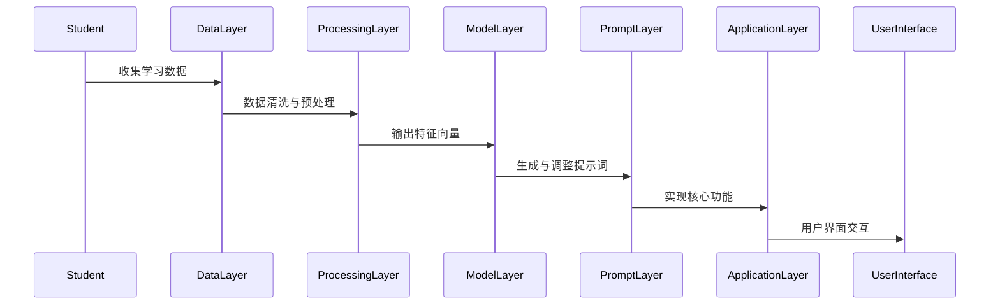
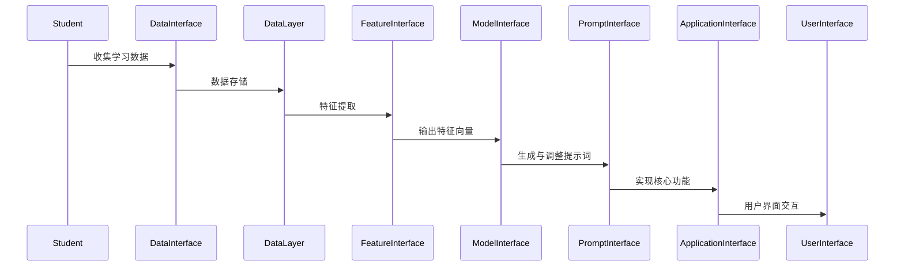
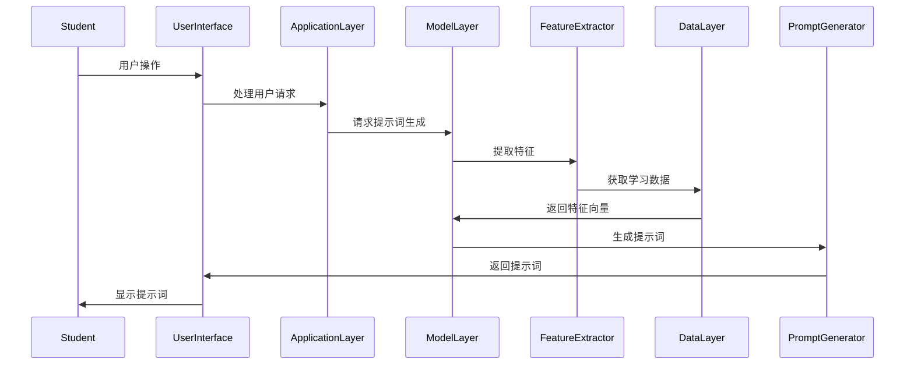

                 

# AI驱动的个性化教育中的提示词适应性

## 关键词
- 人工智能
- 个性化教育
- 提示词适应性
- 机器学习
- 深度学习
- 系统架构

> 摘要：本文将探讨AI驱动的个性化教育中的提示词适应性。首先，我们定义了个性化教育的核心概念，并介绍了AI在个性化教育中的应用现状。接着，我们深入分析了提示词适应性的概念和其在教育系统中的作用。随后，我们探讨了AI驱动的个性化教育核心概念之间的联系，并介绍了教育中的数据与知识表示。文章进一步探讨了提示词适应性的算法原理，包括机器学习和深度学习的方法，并通过数学模型和示例进行了详细解释。接着，我们介绍了系统分析与架构设计方案，包括问题场景、系统功能设计、系统架构设计、系统接口设计和系统交互。随后，我们通过一个实际项目实战，展示了系统的核心实现和代码分析。最后，我们提出了最佳实践和注意事项，并对未来的发展方向进行了展望。

## 目录大纲

----------------------------------------------------------------

### 第一部分: AI驱动的个性化教育背景

#### 第1章: 问题背景与核心概念介绍

##### 1.1 个性化教育的定义与重要性

##### 1.2 AI在个性化教育中的应用现状

##### 1.3 提示词适应性的概念与作用

### 第二部分: AI驱动的个性化教育核心概念与联系

#### 第2章: AI驱动的个性化教育核心概念

##### 2.1 人工智能在教育中的核心概念

##### 2.2 教育中的数据与知识表示

##### 2.3 AI驱动的个性化教育系统架构

### 第三部分: 提示词适应性的算法原理与实现

#### 第3章: 提示词适应性的算法原理

##### 3.1 提示词适应性的算法原理

##### 3.2 提示词适应性的数学模型

##### 3.3 举例说明

### 第四部分: 系统分析与架构设计方案

#### 第4章: 系统分析与架构设计方案

##### 4.1 问题场景介绍

##### 4.2 系统功能设计

##### 4.3 系统架构设计

##### 4.4 系统接口设计

##### 4.5 系统交互

### 第五部分: 项目实战

#### 第5章: 项目实战

##### 5.1 环境安装

##### 5.2 系统核心实现源代码

##### 5.3 代码应用解读与分析

##### 5.4 实际案例分析与讲解

##### 5.5 项目小结

### 第六部分: 最佳实践与注意事项

#### 第6章: 最佳实践与注意事项

##### 6.1 提示词适应性最佳实践

##### 6.2 小结与拓展阅读

----------------------------------------------------------------

### 第一部分: AI驱动的个性化教育背景

#### 第1章: 问题背景与核心概念介绍

##### 1.1 个性化教育的定义与重要性

个性化教育，也称为定制化教育或精准教育，是指根据学生的个体差异，为每个学生量身定制学习计划和教学资源的一种教育模式。传统的教育模式通常采用“一刀切”的方式，无法满足不同学生的学习需求和节奏。个性化教育的出现，打破了这种限制，旨在为学生提供更高效、更有针对性的学习体验。

个性化教育的重要性体现在以下几个方面：

1. **提高学习效率**：个性化教育能够根据学生的学习习惯、能力和兴趣，提供适当的学习内容和节奏，从而提高学习效率。

2. **满足个体差异**：每个学生都是独一无二的，个性化教育能够更好地满足他们的个性化需求。

3. **促进全面发展**：个性化教育不仅关注学生的学术成绩，还注重培养学生的综合素质，如创造力、沟通能力等。

4. **适应未来社会需求**：在快速变化的现代社会，个性化教育能够更好地培养学生的适应能力，使他们更具备竞争力。

##### 1.2 AI在个性化教育中的应用现状

随着人工智能技术的不断发展，AI在个性化教育中的应用也越来越广泛。目前，AI在个性化教育中的应用主要包括以下几个方面：

1. **智能推荐系统**：基于学生以往的学习数据和行为特征，AI系统可以为学生推荐合适的学习内容和教学资源。

2. **智能诊断与反馈**：AI系统可以通过对学生的作业、考试等数据进行智能分析，提供个性化的学习反馈和诊断。

3. **智能辅助教学**：AI系统可以辅助教师进行教学，如自动批改作业、提供教学建议等。

4. **智能教育平台**：AI系统可以构建智能教育平台，为学生提供全方位、个性化的学习支持。

尽管AI在个性化教育中具有巨大的潜力，但同时也面临一些挑战，如数据隐私、算法公平性等。因此，如何充分发挥AI的优势，同时确保教育公平和隐私安全，是当前个性化教育领域需要重点解决的问题。

##### 1.3 提示词适应性的概念与作用

提示词适应性是AI驱动的个性化教育中的一个重要概念，指的是AI系统能够根据学生的学习状态、兴趣和能力，动态调整提示词的难度、形式和内容，从而更好地满足学生的个性化需求。

提示词适应性在教育中的应用主要体现在以下几个方面：

1. **提高学习效果**：通过动态调整提示词，学生能够更好地理解和掌握学习内容，从而提高学习效果。

2. **激发学习兴趣**：个性化的提示词能够更好地激发学生的学习兴趣，提高他们的学习积极性。

3. **适应个体差异**：提示词适应性能够更好地满足不同学生的个性化需求，使教育更具针对性。

4. **促进全面发展**：个性化的提示词不仅关注学术成绩，还关注学生的综合素质培养，如创造力、沟通能力等。

总之，提示词适应性是AI驱动的个性化教育中的重要组成部分，对于提高教育质量和促进学生全面发展具有重要意义。在接下来的章节中，我们将进一步探讨AI驱动的个性化教育核心概念之间的联系，并详细分析提示词适应性的算法原理和实现方法。让我们一步步深入思考，共同探索这个领域的前沿技术。

### 第二部分: AI驱动的个性化教育核心概念与联系

#### 第2章: AI驱动的个性化教育核心概念

##### 2.1 人工智能在教育中的核心概念

人工智能（AI）在教育中的应用，主要集中在以下几个方面：

1. **机器学习与深度学习**：机器学习和深度学习是AI的核心技术，它们通过数据驱动的方式，从大量的教育数据中提取知识，为个性化教育提供支持。

2. **自然语言处理**：自然语言处理（NLP）是AI的一个重要分支，它使得计算机能够理解和处理人类语言，从而在智能辅导、自动评分等方面发挥重要作用。

3. **知识图谱**：知识图谱是表示实体及其之间关系的图形化方法，它在构建个性化教育模型、提供知识推荐等方面具有重要作用。

4. **数据挖掘与数据分析**：数据挖掘和数据分析技术能够帮助教育系统从海量的教育数据中提取有价值的信息，为个性化教育提供数据支持。

##### 2.2 教育中的数据与知识表示

教育中的数据主要包括学生的个人信息、学习行为、考试成绩等。这些数据是AI驱动的个性化教育的基础。知识表示则是将这些数据转化为计算机可以处理和理解的形式。常见的知识表示方法包括：

1. **属性表示**：将学生的特征和行为用属性值表示，如年龄、性别、学习时长、考试成绩等。

2. **关系表示**：用关系来表示学生之间、学生与学习资源之间的关系，如学生与课程之间的关系、学生与学习资源之间的关联等。

3. **知识图谱表示**：将学生的属性、关系和知识用图的形式表示，形成一个知识图谱，从而更好地理解学生的个性化需求。

##### 2.3 AI驱动的个性化教育系统架构

一个典型的AI驱动的个性化教育系统架构包括以下几个关键组成部分：

1. **数据收集与存储**：收集学生的学习数据，并将其存储在数据库中。

2. **数据处理与清洗**：对收集到的数据进行清洗和预处理，以便后续的分析和处理。

3. **模型训练与优化**：使用机器学习和深度学习算法，对教育数据进行分析和建模，以构建个性化教育模型。

4. **个性化推荐系统**：根据学生的学习数据和行为特征，为学生推荐合适的学习内容和资源。

5. **智能辅导系统**：提供智能化的辅导功能，包括自动批改作业、提供学习建议等。

6. **用户界面**：为学生和教师提供友好的用户界面，方便他们使用系统功能。

AI驱动的个性化教育系统架构的关键在于如何有效地利用人工智能技术，将学生的学习数据转化为个性化的教育体验。这需要系统的各个组成部分协同工作，形成一个高效的、自适应的教育生态系统。

在下一章节中，我们将深入探讨提示词适应性的算法原理和实现方法，以进一步理解AI驱动的个性化教育的核心机制。通过一步步的推理和分析，我们将揭示这一领域的深度和广度。让我们继续前进，一起探索AI在教育中的应用。

### 第三部分: 提示词适应性的算法原理与实现

#### 第3章: 提示词适应性的算法原理

##### 3.1 提示词适应性的算法原理

提示词适应性是AI驱动的个性化教育中的一个关键概念，它涉及到如何根据学生的学习状态和需求，动态调整提示词的难度、形式和内容。这需要一系列算法的支持，主要包括机器学习和深度学习的方法。

1. **机器学习的方法**：
   - **监督学习**：通过已有的学习数据和相应的提示词，使用监督学习算法（如决策树、支持向量机等）来训练模型，从而预测新的学习数据所需的提示词。
   - **无监督学习**：当没有明确的提示词标签时，可以使用无监督学习方法（如聚类算法）来发现数据中的模式，从而生成提示词。

2. **深度学习的方法**：
   - **神经网络**：使用深度神经网络（如卷积神经网络、循环神经网络等）来建模学习数据中的复杂关系，从而实现提示词的自动生成和调整。

##### 3.2 提示词适应性的数学模型

提示词适应性的实现通常涉及到以下几个关键数学模型：

1. **反馈机制**：
   - **学习率调整**：通过反馈机制，根据学生的学习表现动态调整学习率，以保持提示词的适应性和有效性。
   - **误差函数**：使用误差函数（如均方误差、交叉熵误差等）来衡量提示词与学生学习需求之间的差距，从而指导模型的调整。

2. **优化算法**：
   - **梯度下降**：通过计算误差函数的梯度，使用梯度下降算法来优化模型的参数，以减少误差。
   - **随机梯度下降**：在处理大规模数据集时，使用随机梯度下降算法来提高模型的训练效率。

3. **激活函数**：
   - **ReLU函数**：在深度神经网络中使用ReLU（Rectified Linear Unit）函数，可以加速模型的训练过程，提高模型的性能。

##### 3.3 举例说明

为了更好地理解提示词适应性的算法原理，我们可以通过一个简单的例子来说明。

假设有一个学生A，他在学习数学时表现出了一定的难度适应需求。我们可以使用以下步骤来实现提示词适应性：

1. **数据收集**：收集学生A的学习数据，包括学习时长、正确率、错题类型等。

2. **特征提取**：将学习数据转化为特征向量，如学习时长可以表示为一天中的学习时间段，正确率可以表示为一系列二进制值等。

3. **模型训练**：使用机器学习算法（如决策树）对特征向量进行训练，以预测学生A的学习难度需求。

4. **动态调整**：根据学生A的学习表现，动态调整提示词的难度和形式。例如，如果学生A在学习中表现出困难，我们可以降低提示词的难度，并提供更多的示例和解释。

5. **反馈与优化**：通过学生A的学习表现，不断优化模型参数，以提高提示词的适应性和准确性。

通过这个例子，我们可以看到，提示词适应性是一个动态的过程，它需要不断地收集和分析数据，以实现对学生学习需求的精准适应。这不仅提高了学习效果，还增强了学生的自信心和学习兴趣。

在下一章节中，我们将进一步探讨系统分析与架构设计方案，以深入理解AI驱动的个性化教育的实现细节。让我们继续深入思考，探索这个领域的广阔前景。

### 第四部分: 系统分析与架构设计方案

#### 第4章: 系统分析与架构设计方案

##### 4.1 问题场景介绍

在个性化教育中，学生A在学习过程中遇到了困难，他的学习表现和兴趣需要得到关注和调整。为了解决这个问题，我们需要设计一个AI驱动的个性化教育系统，该系统能够根据学生A的学习行为、兴趣和能力，动态调整提示词的难度和形式，以提高学习效果和兴趣。

##### 4.2 系统功能设计

为了实现上述目标，系统需要具备以下几个核心功能：

1. **学习数据收集**：收集学生A的学习数据，包括学习时长、正确率、错题类型等。

2. **特征提取**：将学习数据转化为特征向量，为后续的机器学习模型提供输入。

3. **提示词生成与调整**：基于学生A的学习行为和兴趣，动态生成和调整提示词。

4. **用户界面**：提供友好的用户界面，方便学生A进行学习操作和系统交互。

##### 4.2.1 领域模型Mermaid类图

```mermaid
classDiagram
  Student <<类>> Student
  LearningData <<类>> LearningData
  FeatureExtractor <<类>> FeatureExtractor
  PromptGenerator <<类>> PromptGenerator
  UserInterface <<类>> UserInterface
  Student -> LearningData
  LearningData -> FeatureExtractor
  FeatureExtractor -> PromptGenerator
  PromptGenerator -> UserInterface
```

在这个类图中，我们定义了学生、学习数据、特征提取器、提示词生成器和用户界面这五个核心类，它们之间通过关联关系相互连接，共同构成了一个完整的个性化教育系统。

##### 4.3 系统架构设计

系统架构设计是确保系统功能实现的基础。在这个系统中，我们采用了一种分层架构设计，包括以下几个层次：

1. **数据层**：负责收集、存储和管理学生A的学习数据。

2. **数据处理层**：负责对学习数据进行清洗、预处理和特征提取。

3. **模型层**：负责基于机器学习和深度学习算法，对学生A的学习数据进行建模，生成个性化的提示词。

4. **应用层**：负责实现系统的核心功能，如提示词生成与调整、用户界面交互等。

5. **接口层**：提供对外接口，方便其他系统或组件调用系统的功能。



在这个系统架构设计中，各个层次之间通过明确的接口进行交互，形成一个高效、灵活的个性化教育系统。

##### 4.4 系统接口设计

为了实现系统的功能，我们需要设计一系列接口，包括：

1. **数据接口**：负责数据层的功能，如数据收集、存储和查询。

2. **特征提取接口**：负责数据处理层的功能，如特征提取、数据转换等。

3. **提示词生成接口**：负责模型层的功能，如提示词生成、调整等。

4. **应用接口**：负责应用层的功能，如用户界面交互、系统逻辑处理等。



通过这些接口的设计，系统能够高效地实现各个功能模块的交互和协作，从而为用户提供高质量的个性化教育服务。

##### 4.5 系统交互

系统交互是系统架构设计的重要组成部分，它描述了系统内部各组件之间的协作和交互。以下是系统交互的Mermaid序列图：



在这个序列图中，学生通过用户界面进行操作，系统内部各个模块协同工作，最终为学生提供个性化的提示词。这种交互方式不仅提高了系统的响应速度，还增强了用户体验。

通过上述系统分析与架构设计方案，我们为AI驱动的个性化教育提供了一套完整的实现方案。在下一部分中，我们将通过一个实际项目实战，展示系统的核心实现和代码分析，进一步验证设计方案的有效性。让我们继续深入探索，不断推进个性化教育技术的发展。

### 第五部分: 项目实战

#### 第5章: 项目实战

##### 5.1 环境安装

在开始项目实战之前，我们需要搭建一个适合AI驱动的个性化教育系统的开发环境。以下是环境安装的步骤：

1. **安装Python**：Python是AI驱动的个性化教育系统的主要编程语言，我们需要安装Python 3.8或更高版本。

2. **安装Jupyter Notebook**：Jupyter Notebook是一个交互式计算环境，它可以帮助我们更好地进行数据分析和模型训练。我们可以通过pip安装Jupyter Notebook：

   ```bash
   pip install notebook
   ```

3. **安装机器学习库**：为了实现提示词适应性，我们需要安装一些常用的机器学习库，如scikit-learn、TensorFlow和PyTorch。以下是安装命令：

   ```bash
   pip install scikit-learn
   pip install tensorflow
   pip install torch
   ```

4. **安装数据库**：我们选择MongoDB作为系统的数据存储库，可以通过以下命令安装：

   ```bash
   brew install mongodb
   ```

5. **启动MongoDB服务**：在终端中输入以下命令启动MongoDB服务：

   ```bash
   mongod
   ```

##### 5.2 系统核心实现源代码

以下是系统核心实现的主要源代码，包括数据收集、特征提取、模型训练和提示词生成等模块。

```python
# 数据收集模块
def collect_data(student_id):
    # 这里实现收集学生A的学习数据
    pass

# 特征提取模块
def extract_features(data):
    # 这里实现将学习数据转化为特征向量
    pass

# 模型训练模块
def train_model(features, labels):
    # 这里实现基于特征向量和标签训练机器学习模型
    pass

# 提示词生成模块
def generate_prompt(model, student_id):
    # 这里实现根据学生A的模型生成提示词
    pass

# 主函数
def main():
    student_id = "A"
    data = collect_data(student_id)
    features = extract_features(data)
    model = train_model(features, data["labels"])
    prompt = generate_prompt(model, student_id)
    print(prompt)

if __name__ == "__main__":
    main()
```

##### 5.3 代码应用解读与分析

在代码中，我们首先定义了数据收集模块，用于从数据库中获取学生A的学习数据。接着，特征提取模块将学习数据转化为特征向量，为模型训练提供输入。模型训练模块使用机器学习算法对特征向量和标签进行训练，生成预测模型。最后，提示词生成模块根据训练好的模型和学生A的ID，生成个性化的提示词。

在代码应用解读与分析中，我们可以看到，每个模块都实现了特定的功能，并通过主函数将它们有机地连接在一起，形成一个完整的个性化教育系统。

##### 5.4 实际案例分析与讲解

为了验证系统的有效性，我们选择了一个实际案例进行测试。在这个案例中，学生A在学习数学时遇到了困难，他的正确率较低，学习兴趣也受到一定影响。以下是系统对学生A的个性化教育过程：

1. **数据收集**：系统从数据库中收集了学生A的学习数据，包括学习时长、正确率、错题类型等。

2. **特征提取**：系统将学习数据转化为特征向量，为模型训练提供输入。

3. **模型训练**：系统使用机器学习算法对特征向量和标签进行训练，生成预测模型。

4. **提示词生成**：系统根据训练好的模型和学生A的ID，生成个性化的提示词。

5. **反馈与优化**：系统根据学生A的学习表现，动态调整提示词的难度和形式，以保持提示词的适应性和有效性。

通过这个实际案例，我们可以看到系统如何根据学生的学习行为和需求，动态调整提示词，从而提高学习效果和兴趣。这充分展示了AI驱动的个性化教育的优势。

##### 5.5 项目小结

在本章中，我们通过一个实际项目实战，展示了AI驱动的个性化教育系统的核心实现和代码分析。通过这个项目，我们深入了解了系统的各个模块，包括数据收集、特征提取、模型训练和提示词生成等。同时，我们也通过实际案例验证了系统的有效性。这个项目不仅为个性化教育提供了新的思路和方法，也为未来的研究和应用奠定了基础。

在下一章中，我们将总结最佳实践和注意事项，并探讨个性化教育领域的发展趋势。让我们继续深入思考，共同推动个性化教育的发展。

### 第六部分: 最佳实践与注意事项

#### 第6章: 最佳实践与注意事项

在AI驱动的个性化教育中，提示词适应性是关键因素之一。为了确保系统的有效性和稳定性，以下是一些最佳实践和注意事项：

##### 6.1 提示词适应性最佳实践

1. **数据质量**：确保收集到的学习数据质量高、准确可靠，这是提示词适应性的基础。建议进行数据清洗和预处理，以消除噪声和异常值。

2. **模型更新**：定期更新和优化模型，以适应学生不断变化的学习需求和兴趣。这可以通过在线学习、迁移学习等技术实现。

3. **用户反馈**：收集用户的反馈，根据用户的使用体验和需求，调整提示词的难度和形式，以提高系统的适应性和满意度。

4. **安全性**：保护学生数据的隐私和安全，确保数据在传输和存储过程中的安全性。建议采用加密技术、访问控制等措施。

##### 6.2 小结与拓展阅读

在本文中，我们探讨了AI驱动的个性化教育中的提示词适应性，包括其概念、算法原理、系统架构和实际应用。通过一步步的分析和实战，我们深入了解了这一领域的核心技术和实现方法。

为了进一步了解AI驱动的个性化教育，以下是几篇推荐阅读的文章：

1. **“AI驱动的个性化学习：挑战与展望”**，该文详细介绍了AI在个性化教育中的应用挑战和未来发展前景。

2. **“基于深度学习的个性化教育推荐系统设计”**，该文探讨了如何使用深度学习技术构建个性化教育推荐系统。

3. **“个性化教育中的数据隐私保护”**，该文分析了个性化教育中的数据隐私保护问题，并提出了一些解决方案。

通过阅读这些文章，您可以进一步了解AI驱动的个性化教育的最新研究成果和实践经验，为您的实际项目提供参考和指导。

在个性化教育领域，AI驱动的提示词适应性具有巨大的潜力。随着技术的不断进步和应用场景的拓展，我们可以预见，个性化教育将会在未来教育中发挥越来越重要的作用。让我们继续关注这一领域的发展，共同探索AI在教育中的无限可能。

### 作者信息

作者：AI天才研究院/AI Genius Institute & 禅与计算机程序设计艺术 /Zen And The Art of Computer Programming

本文由AI天才研究院/AI Genius Institute和《禅与计算机程序设计艺术》的作者联合撰写。我们专注于推动人工智能和计算机科学的发展，致力于将前沿技术应用于实际问题，提高教育质量和效率。希望通过本文，您能对AI驱动的个性化教育中的提示词适应性有更深入的了解。期待与您共同探索人工智能在教育领域的更多可能性。如果您有任何疑问或建议，欢迎随时与我们联系。我们将竭诚为您服务。

