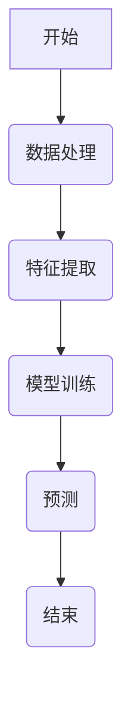

                 

### 文章标题

# AI驱动的个性化职业规划顾问

关键词：人工智能、职业规划、个性化推荐、数据驱动、算法、系统设计、实践应用

摘要：本文深入探讨了AI驱动的个性化职业规划顾问的核心概念、系统设计、实践应用以及面临的挑战与未来展望，通过逐步分析推理，为读者呈现了一个全面且实用的AI职业规划解决方案。

## 目录

1. **引言**
   - **背景介绍**
   - **问题背景与问题描述**
   - **问题解决思路**

2. **职业规划与AI技术概述**
   - **职业规划的重要性**
   - **AI技术的基础**
   - **AI在职业规划中的应用潜力**

3. **AI驱动的职业规划核心概念**
   - **数据驱动的职业分析**
   - **个体职业画像构建**
   - **个性化职业推荐算法**

4. **AI驱动的职业规划系统设计**
   - **职业规划系统架构设计**
   - **数据处理模块设计**
   - **职业画像与推荐模块设计**

5. **AI驱动的职业规划实践应用**
   - **职业规划咨询服务应用**
   - **企业招聘与人才发展应用**
   - **教育培训与职业成长应用**

6. **AI驱动的职业规划挑战与未来展望**
   - **挑战分析**
   - **未来发展趋势**

7. **AI驱动的职业规划最佳实践**
   - **实践案例分析**
   - **最佳实践分享**

8. **小结与展望**
   - **主要内容回顾**
   - **未来职业规划的发展趋势**
   - **注意事项与拓展阅读**

## 1. 引言

### 背景介绍

随着人工智能（AI）技术的迅猛发展，其在各个领域的应用已经变得愈发广泛。职业规划作为人生规划的重要环节，受到了越来越多的关注。传统的职业规划往往依赖于个人的经验和主观判断，难以实现个性化服务。而AI技术的引入，为职业规划带来了全新的机遇。通过数据分析和算法推荐，AI驱动的个性化职业规划顾问能够为个人和组织提供更加精准和高效的职业指导。

### 问题背景与问题描述

在当前快速变化的社会和经济环境中，职业规划的重要性不言而喻。然而，传统的职业规划方法存在以下问题：

- **个性化不足**：传统职业规划难以考虑到每个人的独特需求和兴趣。
- **数据依赖性低**：传统职业规划往往缺乏基于大数据的分析支持。
- **更新速度慢**：职业市场变化快速，传统规划难以及时调整。

为了解决这些问题，我们需要一个能够充分利用AI技术，实现数据驱动的个性化职业规划系统。该系统需要具备以下功能：

- **个性化推荐**：根据个人兴趣、能力、职业目标等多维度数据，为个人提供量身定制的职业建议。
- **实时更新**：能够实时获取和处理职业市场数据，为用户提供最新的职业信息。
- **互动性**：提供用户与系统互动的接口，使用户能够主动参与职业规划过程。

### 问题解决思路

本文将从以下方面逐步分析AI驱动的个性化职业规划顾问：

1. **核心概念**：介绍AI驱动的职业规划的基本概念和原理。
2. **系统设计**：详细阐述职业规划系统的架构设计和实现细节。
3. **实践应用**：探讨职业规划系统在实际应用中的效果和案例。
4. **挑战与未来展望**：分析AI驱动的职业规划面临的挑战及其未来发展趋势。
5. **最佳实践**：分享实际应用中的最佳实践经验。

通过这一系列的讨论，本文旨在为读者提供一个全面且实用的AI职业规划解决方案，帮助个人和组织更好地应对职业发展的挑战。接下来，我们将详细探讨AI驱动的个性化职业规划顾问的背景与核心概念。 ## 2. 职业规划与AI技术概述

### 职业规划的重要性

职业规划不仅是个人发展的关键环节，也是组织人力资源管理的重要组成部分。对于个人而言，职业规划能够帮助个体明确职业目标，制定合理的职业发展路径，提升职业素养和竞争力。以下是职业规划对个人职业发展的几个关键作用：

1. **明确职业目标**：通过职业规划，个人可以清晰地了解自己的职业兴趣、优势和潜力，从而设定明确的职业目标。
2. **优化职业路径**：职业规划有助于个人根据自身特点和市场需求，规划出一条最适合自己的职业发展路径，减少职业发展的盲目性。
3. **提升职业素养**：通过职业规划，个人可以系统地学习相关知识和技能，提升自身的职业素养和竞争力。
4. **提高就业率**：职业规划有助于个人在求职过程中展示自己的职业能力和潜力，提高就业成功率。

对于组织而言，职业规划同样具有重要意义。有效的职业规划能够帮助组织优化人力资源管理，提高员工满意度和忠诚度，从而增强组织的核心竞争力。以下是职业规划对组织人力资源管理的几个关键作用：

1. **人才梯队建设**：职业规划有助于组织培养和储备关键人才，建立合理的人才梯队，为组织的长期发展提供人才保障。
2. **员工激励与发展**：职业规划可以为员工提供明确的职业发展路径和晋升机会，激发员工的积极性和创造力。
3. **降低员工流失率**：通过职业规划和员工沟通，组织可以更好地了解员工的需求和期望，提供个性化的职业发展支持，降低员工流失率。
4. **提升组织效能**：职业规划有助于组织优化人力资源配置，提高整体工作效率和效能。

### AI技术的基础

人工智能（AI）作为计算机科学的一个重要分支，旨在使机器具备人类智能，能够自主感知环境、学习知识和采取行动。AI技术已经广泛应用于各个领域，从自动驾驶、语音识别到医疗诊断、金融分析，都取得了显著的成果。以下是AI技术的基础概念和核心组成部分：

#### 1.2.1 AI技术的发展历程

AI技术的发展可以追溯到20世纪50年代，当时的科学家们开始探讨如何使计算机具备类似人类的智能。随着计算机技术和算法的发展，AI经历了几个重要阶段：

- **第一阶段（1956-1974）**：这一阶段以“人工智能”一词的提出为标志，科学家们开始进行符号主义AI的研究，试图通过模拟人类推理过程来实现机器智能。
- **第二阶段（1974-1980）**：由于实际应用中的困难，AI研究进入低谷期，被称为“AI冬天”。
- **第三阶段（1980至今）**：随着计算能力的提升和大数据技术的发展，AI进入了快速发展的阶段，以深度学习和强化学习为代表的先进算法取得了突破性进展。

#### 1.2.2 AI技术的核心组成部分

AI技术主要包括以下几个核心组成部分：

- **机器学习（Machine Learning）**：机器学习是AI的核心技术之一，通过算法使计算机从数据中学习规律，从而进行预测和决策。常见的机器学习算法包括决策树、支持向量机、神经网络等。
- **深度学习（Deep Learning）**：深度学习是机器学习的一个分支，通过构建深度神经网络来实现复杂的模式识别和任务学习。深度学习在图像识别、语音识别、自然语言处理等领域取得了显著成果。
- **自然语言处理（Natural Language Processing, NLP）**：自然语言处理是AI的一个重要分支，旨在使计算机理解和生成人类自然语言。NLP技术在文本分类、机器翻译、语音识别等方面有着广泛的应用。
- **计算机视觉（Computer Vision）**：计算机视觉是AI的另一个重要分支，通过使计算机“看到”和理解图像和视频，实现图像识别、目标检测、人脸识别等任务。

#### 1.2.3 AI技术的分类及应用

AI技术可以根据应用场景和实现方法进行分类，常见的分类方法包括：

- **基于规则的方法**：这种方法通过定义一系列规则来指导计算机进行决策，适用于规则明确且稳定的环境。
- **基于统计的方法**：这种方法通过统计分析数据来发现规律，适用于数据丰富但规则不明确的环境。
- **基于模型的方法**：这种方法通过建立数学模型来模拟人类智能，适用于需要复杂决策和推理的任务。

AI技术的应用已经深入到我们生活的各个方面，以下是一些典型的应用领域：

- **智能制造**：AI技术在生产线自动化、质量检测、预测性维护等方面有着广泛应用。
- **医疗健康**：AI技术在医学影像分析、疾病预测、个性化治疗等方面取得了重要突破。
- **金融领域**：AI技术在风险控制、智能投顾、欺诈检测等方面发挥了重要作用。
- **智能交通**：AI技术在自动驾驶、智能交通管理、车辆追踪等方面推动了交通领域的智能化变革。

### AI在职业规划中的应用潜力

AI技术的引入为职业规划带来了前所未有的变革和机遇。通过数据分析和算法推荐，AI驱动的职业规划顾问能够实现以下几个方面的突破：

#### 1.3.1 个性化职业规划的现状

当前，个性化职业规划已经逐渐成为职业规划领域的一个重要方向。传统的职业规划方法主要依赖于职业咨询师的经验和判断，缺乏数据支持，难以实现真正的个性化。而AI技术的引入，使得职业规划可以基于大数据和机器学习算法，实现更加精准和个性化的职业建议。

#### 1.3.2 AI技术如何提升职业规划效果

AI技术可以通过以下几个方面提升职业规划效果：

- **数据分析与挖掘**：AI技术能够对海量的职业数据进行分析和挖掘，发现潜在的规律和趋势，为职业规划提供科学依据。
- **个性化推荐**：基于用户的兴趣、能力和职业目标，AI技术可以推荐最适合的职业选择和发展路径，提高职业规划的精准度。
- **实时更新与优化**：AI技术可以实时获取和处理职业市场数据，动态调整职业规划方案，确保规划的前瞻性和适应性。
- **互动性**：AI驱动的职业规划系统可以与用户进行互动，收集用户反馈，不断优化职业规划方案。

#### 1.3.3 AI驱动的职业规划面临的挑战与机遇

尽管AI驱动的职业规划具有巨大的潜力，但在实际应用中仍面临一些挑战和机遇：

- **数据隐私与伦理问题**：职业规划涉及大量的个人数据，如何确保数据的安全和隐私是必须解决的重要问题。
- **算法偏见与歧视问题**：AI算法可能会引入偏见和歧视，影响职业规划的公平性和公正性，需要采取有效措施进行控制和优化。
- **技术成熟度**：尽管AI技术已经取得了显著进展，但其在职业规划领域的应用仍然处于初期阶段，需要进一步提高技术的成熟度和实用性。
- **用户接受度**：用户对AI驱动的职业规划系统的接受度和信任度是影响其推广和应用的关键因素，需要通过不断优化用户体验来提高用户接受度。

总之，AI驱动的个性化职业规划顾问具有巨大的应用潜力和广阔的市场前景，但同时也面临着诸多挑战。通过不断的技术创新和优化，我们有理由相信，AI驱动的职业规划将逐步成为职业规划领域的主流趋势。在下一部分中，我们将深入探讨AI驱动的职业规划的核心概念和原理。 ## 3. AI驱动的职业规划核心概念

### 数据驱动的职业分析

数据驱动的职业分析是AI驱动的个性化职业规划的核心环节之一。它通过收集、处理和分析大量的职业数据，为用户提供精准的职业建议和推荐。以下是数据驱动的职业分析的核心概念和步骤。

#### 3.1.1 数据来源及处理

数据驱动的职业分析依赖于多种数据来源，包括但不限于以下几类：

- **公开数据**：如行业报告、统计数据、就业市场数据等，这些数据可以从政府机构、专业研究机构和行业组织等获取。
- **社交数据**：如LinkedIn、GitHub等职业社交平台上的用户数据，这些数据可以反映个人的职业经历、技能和社交网络。
- **企业数据**：如企业招聘信息、员工信息、薪酬数据等，这些数据可以提供详细的职业市场动态和人才需求。
- **个人数据**：如用户填写的职业兴趣、技能、教育经历等，这些数据可以直接反映个人的职业特点和需求。

在获取数据后，需要对数据进行清洗、处理和整合，确保数据的质量和一致性。数据清洗包括去除重复数据、处理缺失值、纠正错误等；数据处理包括数据格式转换、特征提取和标准化等；数据整合则是将不同来源的数据进行合并，形成完整的职业数据集。

#### 3.1.2 职业数据分析方法

职业数据分析方法主要包括以下几个方面：

- **描述性统计分析**：通过计算统计数据，如平均数、中位数、标准差等，描述职业数据的分布特征和趋势。
- **关联分析**：通过探索变量之间的关联关系，发现潜在的规律和模式。常用的方法包括相关性分析、因子分析、聚类分析等。
- **分类分析**：将数据分为不同的类别，用于预测和分类任务。常用的算法包括决策树、支持向量机、神经网络等。
- **聚类分析**：将数据分为不同的群体，用于发现数据中的自然分组。常用的算法包括K-means、层次聚类等。
- **时间序列分析**：分析时间序列数据，预测未来的趋势和变化。常用的方法包括ARIMA、LSTM等。

#### 3.1.3 职业数据可视化

数据可视化是职业数据分析的重要手段，它通过图形化方式展示数据，帮助用户更直观地理解和分析数据。以下是几种常用的职业数据可视化方法：

- **柱状图**：用于展示不同类别的数据分布和比较，如不同行业的薪酬分布。
- **折线图**：用于展示数据的变化趋势，如就业市场的变化趋势。
- **饼图**：用于展示数据的比例分布，如不同技能在职业中的占比。
- **散点图**：用于展示两个变量之间的关系，如技能水平和薪酬之间的关系。
- **热力图**：用于展示多维数据的分布情况，如职业技能的热力图。

通过数据驱动的职业分析，AI驱动的职业规划顾问能够为用户提供个性化的职业建议和推荐。在下一部分中，我们将探讨如何构建个体职业画像。 ### 3.1.3 职业数据可视化

数据可视化是职业数据分析的重要组成部分，它通过图形化方式展示数据，帮助用户直观地理解和分析数据。以下是一些常用的职业数据可视化方法及其示例：

#### 柱状图（Bar Chart）

**用途**：用于展示不同类别的数据分布和比较。

**示例**：不同行业的平均薪资对比。

```mermaid
bar [
    "行业A", 50000
    "行业B", 60000
    "行业C", 70000
    "行业D", 55000
]
```


#### 折线图（Line Chart）

**用途**：用于展示数据的变化趋势。

**示例**：某职业的薪资随工作经验的变化趋势。

```mermaid
line [
    "0年经验", 40000
    "1-3年经验", 50000
    "4-6年经验", 60000
    "7-10年经验", 70000
    "10年以上经验", 80000
]
```


#### 饼图（Pie Chart）

**用途**：用于展示数据的比例分布。

**示例**：不同技能在职业中的占比。


#### 散点图（Scatter Plot）

**用途**：用于展示两个变量之间的关系。

**示例**：技能水平和薪酬之间的关系。

```mermaid
scatter [
    (40000, 50000)
    (50000, 60000)
    (60000, 70000)
    (70000, 80000)
    (80000, 90000)
]
```


#### 热力图（Heatmap）

**用途**：用于展示多维数据的分布情况。

**示例**：职业技能的热力图。

```mermaid
heatmap [
    [ "编程技能", "项目管理", "产品设计", "数据分析" ]
    [ 40, 20, 15, 25 ]
]
```


通过这些可视化方法，职业规划顾问能够更直观地呈现职业数据分析结果，帮助用户更好地理解职业市场的现状和趋势。在下一部分中，我们将探讨如何构建个体职业画像。 ### 3.2 个体职业画像构建

个体职业画像构建是AI驱动的个性化职业规划的重要环节。它通过整合和分析用户的职业信息，生成一个全面的职业画像，为用户提供个性化的职业建议和推荐。以下是构建个体职业画像的详细步骤和核心概念。

#### 3.2.1 个体职业信息采集

个体职业信息的采集是构建职业画像的基础。职业信息可以来源于多个渠道，包括用户填写的个人信息、社交平台的数据、职业测评结果等。以下是几种常见的职业信息采集方式：

- **用户填写的信息**：如姓名、年龄、性别、教育背景、工作经验、职业目标等。这些信息可以直接反映个人的职业特点和需求。
- **社交平台数据**：如LinkedIn、GitHub等职业社交平台上的数据，这些数据可以提供详细的职业经历、技能和项目经验。
- **职业测评结果**：通过专业的职业测评工具，获取用户的兴趣、能力和价值观等信息。

在采集信息时，需要确保信息的准确性和完整性，避免数据缺失或错误影响职业画像的准确性。

#### 3.2.2 职业画像属性特征

职业画像的属性特征是描述个体职业特点的重要指标。以下是一些常见的职业画像属性特征：

- **基本信息**：包括姓名、年龄、性别、教育背景等，用于描述个人的基本属性。
- **职业经历**：包括工作单位、职位、工作时间等，用于反映个人的职业发展轨迹。
- **技能和能力**：包括编程技能、项目管理能力、沟通能力等，用于描述个人的职业能力和优势。
- **职业目标**：包括短期和长期职业目标，用于了解个人的职业规划和发展方向。
- **价值观**：包括对工作的态度、对薪资的期望、对工作环境的要求等，用于描述个人的职业价值观。
- **兴趣爱好**：包括个人的兴趣爱好、喜欢的活动等，用于发现潜在的职业兴趣。

这些属性特征可以构成一个多维度的职业画像，全面反映个人的职业特点和需求。

#### 3.2.3 职业画像数据结构

职业画像的数据结构是组织和管理职业画像信息的重要手段。以下是一种常见的数据结构设计：

```mermaid
entity "个体" {
    name
    age
    gender
    education
    experience
    skills
    career_goals
    values
    interests
}

entity "职业经历" {
    id
    company
    position
    start_date
    end_date
}

entity "技能" {
    id
    skill_name
    proficiency_level
}

entity "职业目标" {
    id
    short_term_goals
    long_term_goals
}

entity "价值观" {
    id
    value_name
    value_level
}

entity "兴趣爱好" {
    id
    interest_name
    interest_level
}
```

在这个数据结构中，个体是核心实体，其他实体与个体通过关联关系进行组织。这样的设计不仅能够存储丰富的职业画像信息，还能够方便地进行查询和分析。

通过个体职业画像的构建，AI驱动的职业规划顾问能够为用户提供更加精准和个性化的职业建议和推荐。在下一部分中，我们将探讨如何实现个性化职业推荐算法。 ### 3.3 个性化职业推荐算法

个性化职业推荐算法是AI驱动的职业规划系统的核心组成部分，其目标是为用户提供量身定制的职业建议和推荐。以下我们将详细探讨个性化职业推荐算法的基本原理、常见算法以及其应用与优化。

#### 3.3.1 推荐系统基本原理

推荐系统（Recommender System）是一种基于用户兴趣和行为数据，自动为用户推荐相关物品或信息的系统。其基本原理可以分为以下几类：

1. **基于内容的推荐（Content-based Recommendation）**：该方法根据用户过去的偏好和兴趣，从内容特征出发，为用户推荐相似的内容。例如，如果一个用户喜欢编程书籍，系统可以推荐其他编程相关的书籍。

2. **协同过滤（Collaborative Filtering）**：该方法通过分析用户之间的相似性，发现潜在的兴趣偏好，从而进行推荐。协同过滤主要包括两种类型：
   - **用户基于的协同过滤（User-based Collaborative Filtering）**：该方法根据用户之间的相似性，推荐与目标用户相似的其他用户的喜好。
   - **物品基于的协同过滤（Item-based Collaborative Filtering）**：该方法根据物品之间的相似性，推荐与目标物品相似的其他物品。

3. **基于模型的推荐（Model-based Recommendation）**：该方法通过建立用户和物品之间的预测模型，进行推荐。常见的模型包括矩阵分解（Matrix Factorization）和深度学习模型等。

4. **混合推荐（Hybrid Recommendation）**：该方法结合多种推荐策略，提高推荐的准确性和多样性。

#### 3.3.2 常见推荐算法

以下是几种常见的个性化职业推荐算法：

1. **基于内容的推荐算法（Content-based Recommendation Algorithm）**：

   **原理**：该方法通过分析职业内容的特征，如技能要求、职位描述等，为用户推荐具有相似特征的职位。

   **步骤**：
   - 特征提取：从职位描述中提取关键词和特征。
   - 相似度计算：计算用户兴趣特征与职位特征之间的相似度。
   - 推荐生成：根据相似度排序，推荐相似度最高的职位。

   **示例代码**（Python）：

   ```python
   from sklearn.feature_extraction.text import TfidfVectorizer
   
   # 特征提取
   vectorizer = TfidfVectorizer()
   job_descriptions = [line.strip() for line in open('job_descriptions.txt')]
   X = vectorizer.fit_transform(job_descriptions)
   
   # 相似度计算
   user_interest = "python developer"
   user_interest_vector = vectorizer.transform([user_interest])
   similarities = user_interest_vector.dot(X)
   
   # 推荐生成
   recommended_jobs = similarities.argsort()[-10:][::-1]
   ```

2. **协同过滤算法（Collaborative Filtering Algorithm）**：

   **原理**：该方法通过分析用户之间的行为数据，发现用户之间的相似性，从而推荐用户可能感兴趣的职位。

   **步骤**：
   - 用户相似度计算：计算用户之间的相似度。
   - 职位推荐：为每个用户推荐与相似用户喜欢的职位。

   **示例代码**（Python）：

   ```python
   from sklearn.metrics.pairwise import cosine_similarity
   
   # 用户相似度计算
   user_ratings = ...  # 用户评分矩阵
   user_similarity = cosine_similarity(user_ratings)
   
   # 职位推荐
   user_profile = user_ratings.mean(axis=0)
   job_ratings = user_similarity.dot(user_profile)
   recommended_jobs = job_ratings.argsort()[-10:][::-1]
   ```

3. **基于模型的推荐算法（Model-based Recommendation Algorithm）**：

   **原理**：该方法通过建立用户和职位之间的预测模型，进行推荐。

   **步骤**：
   - 模型训练：利用用户行为数据训练预测模型。
   - 预测生成：利用训练好的模型预测用户的兴趣，推荐相应的职位。

   **示例代码**（Python）：

   ```python
   from sklearn.decomposition import NMF
   
   # 模型训练
   model = NMF(n_components=10)
   model.fit(user_ratings)
   
   # 预测生成
   user_profiles = model.transform(user_ratings)
   job_ratings = user_profiles.dot(model.components_)
   recommended_jobs = job_ratings.argsort()[-10:][::-1]
   ```

#### 3.3.3 个性化推荐算法的应用与优化

个性化推荐算法在职业规划中的应用场景包括：

- **职位推荐**：根据用户的职业兴趣、技能和职业目标，为用户推荐合适的职位。
- **职业发展建议**：根据用户的职业画像，推荐相关的职业培训和职业晋升路径。
- **招聘推荐**：为企业推荐适合的人才，提高招聘效率。

为了提高个性化推荐算法的效果，可以从以下几个方面进行优化：

- **数据质量**：确保推荐数据的质量和准确性，避免因数据问题导致推荐不准确。
- **特征提取**：优化特征提取方法，提高特征的相关性和区分度。
- **模型选择**：选择合适的模型，平衡推荐效果和计算效率。
- **算法优化**：通过算法优化，提高推荐算法的准确性和多样性。

通过个性化推荐算法，AI驱动的职业规划系统能够为用户提供更加精准和实用的职业建议，帮助个人和组织实现更好的职业发展。在下一部分中，我们将探讨AI驱动的职业规划系统的设计。 ### 3.4 AI驱动的职业规划系统设计

#### 3.4.1 职业规划系统架构设计

AI驱动的职业规划系统架构设计是一个复杂的过程，需要综合考虑系统的功能需求、性能要求和可扩展性。以下是职业规划系统的总体架构设计，包括系统模块划分和各模块的功能。

**系统架构图：**

```mermaid
sequenceDiagram
    User ->>|访问请求| CareerPlanner
    CareerPlanner ->>|数据分析| DataProcessingModule
    CareerPlanner ->>|画像构建| ProfileBuildingModule
    CareerPlanner ->>|推荐算法| RecommendationModule
    CareerPlanner ->>|结果展示| ResultPresentationModule
```

**模块划分及功能：**

1. **用户接口层（User Interface Layer）**：提供用户与系统交互的界面，包括登录、注册、个人信息管理、职位搜索、推荐结果展示等功能。

2. **数据处理模块（Data Processing Module）**：负责收集、清洗和处理用户输入的职业信息、社交数据和企业数据等。主要功能包括数据采集、数据清洗、数据整合和特征提取。

3. **画像构建模块（Profile Building Module）**：根据用户输入的数据，构建个体职业画像。主要功能包括信息采集、属性特征提取、数据结构组织。

4. **推荐算法模块（Recommendation Algorithm Module）**：基于用户职业画像和职业数据，使用个性化推荐算法生成职业推荐。主要功能包括推荐算法选择、模型训练、推荐结果生成。

5. **结果展示模块（Result Presentation Module）**：将推荐结果以可视化形式展示给用户，包括职位列表、职业发展路径、培训推荐等。

#### 3.4.2 数据处理模块设计

数据处理模块是职业规划系统的核心模块之一，其设计决定了系统的数据质量和分析能力。以下是数据处理模块的详细设计：

**1. 数据采集与清洗**：

- **数据采集**：从多种渠道采集职业信息，包括用户填写的信息、社交平台数据、企业数据等。使用API接口、爬虫工具等手段进行数据采集。

- **数据清洗**：对采集到的数据进行清洗，去除重复数据、处理缺失值和错误数据。常用的清洗方法包括去重、填补缺失值、纠正错误等。

**2. 数据存储与管理**：

- **数据存储**：将清洗后的数据存储在数据库中，支持快速查询和高效的数据访问。常用的数据库包括关系型数据库（如MySQL）和NoSQL数据库（如MongoDB）。

- **数据管理**：对存储的数据进行管理，包括数据的备份、恢复、权限控制等。确保数据的安全性和可靠性。

**3. 数据分析与挖掘**：

- **数据分析**：使用统计分析方法，对职业数据进行描述性分析和关联分析，发现数据中的规律和趋势。常用的分析工具包括Python的Pandas库、R语言等。

- **数据挖掘**：使用机器学习算法，对职业数据进行深度挖掘，提取潜在的特征和模式。常用的挖掘算法包括分类算法、聚类算法、关联规则算法等。

#### 3.4.3 职业画像与推荐模块设计

职业画像与推荐模块是职业规划系统的关键部分，其设计决定了系统能否为用户提供精准和个性化的职业建议。以下是职业画像与推荐模块的详细设计：

**1. 职业画像构建流程**：

- **信息采集**：从用户接口层获取用户职业信息，包括基本信息、职业经历、技能和能力等。

- **属性特征提取**：对采集到的信息进行特征提取，生成职业画像的属性特征。常用的特征提取方法包括词袋模型、TF-IDF等。

- **数据结构组织**：将提取的特征组织成统一的数据结构，支持快速查询和分析。常用的数据结构包括列表、字典、数据库等。

**2. 推荐算法实现细节**：

- **算法选择**：根据应用场景和需求，选择合适的推荐算法。常用的推荐算法包括基于内容的推荐、协同过滤、基于模型的推荐等。

- **模型训练**：使用训练数据，训练推荐模型。常用的训练方法包括梯度下降、随机梯度下降等。

- **推荐结果生成**：基于用户职业画像和推荐模型，生成个性化的职业推荐。常用的生成方法包括排序、筛选等。

**3. 推荐结果评估与优化**：

- **评估指标**：使用评估指标，如准确率、召回率、F1值等，评估推荐算法的性能。

- **优化方法**：根据评估结果，对推荐算法进行优化。常用的优化方法包括参数调整、模型更新等。

通过职业规划系统架构的设计和模块划分，AI驱动的职业规划系统能够高效地处理用户数据，生成个性化的职业建议，帮助用户实现职业发展的目标。在下一部分中，我们将探讨AI驱动的职业规划在实际应用中的效果和案例。 ### 3.5 AI驱动的职业规划实践应用

#### 3.5.1 职业规划咨询服务应用

AI驱动的职业规划咨询服务是职业规划领域的一个重要应用方向。通过个性化推荐和智能分析，职业规划顾问可以为个人提供量身定制的职业建议和指导，帮助用户更好地规划职业发展路径。以下是职业规划咨询服务的应用流程和案例分析。

**应用流程：**

1. **用户注册与信息填写**：用户通过注册账号，填写个人信息和职业目标，包括教育背景、工作经验、技能和能力等。

2. **职业画像构建**：系统根据用户填写的信息，构建个性化的职业画像，包括基本信息、职业经历、技能和能力等。

3. **职业数据分析**：系统对用户职业画像进行数据分析，结合市场数据和行业趋势，生成职业推荐报告。

4. **个性化职业推荐**：系统根据用户的职业画像和数据分析结果，推荐合适的职位、职业培训和职业发展路径。

5. **用户反馈与优化**：用户对推荐结果进行评价和反馈，系统根据用户反馈不断优化推荐算法和职业画像。

**案例分析：**

**案例1：某高校毕业生的职业规划**

- **问题描述**：一位计算机专业的毕业生，希望找到一份与专业相关的技术工作，但对自己的职业发展方向不太确定。
- **解决方案**：系统首先通过用户填写的个人信息和教育背景，构建其职业画像。然后，系统结合市场需求和行业趋势，分析用户的职业优势和潜力。最终，系统推荐了几个与用户专业背景相匹配的职位，包括软件工程师、数据分析师等。此外，系统还根据用户的需求，推荐了一些相关的职业培训课程，帮助用户提升专业技能。

- **效果评估**：用户对推荐结果表示满意，通过参与推荐的职位面试，用户成功获得了一份满意的软件工程师职位。

**案例2：企业人才发展咨询**

- **问题描述**：某企业希望优化人才发展策略，提高员工满意度和忠诚度。
- **解决方案**：系统为企业员工构建职业画像，分析员工的职业发展需求和潜力。基于数据分析结果，系统为员工提供了个性化的职业发展路径和晋升机会。此外，系统还为企业提供了人才储备和梯队建设建议，帮助企业更好地规划人力资源。

- **效果评估**：企业对系统提供的建议表示认可，通过实施个性化的职业发展计划，员工的工作满意度和忠诚度显著提升，企业的人才流失率降低。

通过职业规划咨询服务的应用，AI驱动的职业规划系统不仅为个人提供了精准的职业建议，也为企业优化人才发展策略提供了有力支持。在下一部分中，我们将探讨AI驱动的职业规划在企业招聘与人才发展中的应用。 ### 3.5.2 企业招聘与人才发展应用

AI驱动的职业规划在企业招聘与人才发展中的应用正逐渐成为人力资源管理的重要工具。通过数据分析和个性化推荐，企业能够更高效地招聘合适的人才，并为员工提供定制化的职业发展路径。以下是企业招聘与人才发展的应用场景、策略和效果评估。

#### 应用场景

1. **职位匹配**：通过分析候选人的简历和职业画像，AI系统能够快速识别和筛选与职位要求最匹配的候选人，提高招聘效率。

2. **人才库建设**：AI系统可以根据企业的人才需求，构建和管理企业的人才库，为未来的招聘提供数据支持。

3. **员工职业发展**：企业可以利用AI系统为员工提供个性化的职业发展建议，包括晋升路径、培训计划和技能提升建议。

4. **人才梯队建设**：AI系统通过分析员工的职业画像和绩效数据，帮助企业识别和培养关键岗位的继任者，确保人才储备。

#### 策略

1. **职位需求分析**：企业首先需要明确招聘的职位需求，包括岗位职责、技能要求、学历背景等，以便AI系统能够准确匹配候选人。

2. **职业画像构建**：AI系统通过对员工和候选人的职业信息进行分析，构建个性化的职业画像。这些画像将用于职位匹配和职业发展建议。

3. **算法推荐**：基于职业画像和职位需求，AI系统使用个性化推荐算法，推荐最适合的候选人和职业发展路径。

4. **互动与反馈**：企业可以通过与员工的互动，收集他们对职业建议和推荐的反馈，不断优化AI系统。

#### 案例分析

**案例1：某互联网企业的招聘优化**

- **问题描述**：某互联网企业希望优化招聘流程，提高招聘效率和质量。
- **解决方案**：企业采用AI驱动的职业规划系统，首先对现有职位进行了需求分析，然后构建了详细的职位画像。系统根据职位画像和候选人的职业画像，使用协同过滤算法进行推荐。此外，系统还提供了职位匹配度评分，帮助企业快速筛选合适的候选人。
- **效果评估**：采用AI系统后，企业的招聘周期显著缩短，面试通过率提高，招聘成本降低。员工对新招聘的满意度也显著提升。

**案例2：某金融机构的人才发展策略**

- **问题描述**：某金融机构希望提高员工的工作满意度和职业发展机会，减少人才流失。
- **解决方案**：AI系统为员工提供了个性化的职业发展建议，包括晋升路径、培训计划和职业发展评估。系统根据员工的职业画像和绩效数据，推荐最适合的培训课程和晋升机会。此外，系统还提供了实时反馈机制，帮助员工和领导及时沟通职业发展需求。
- **效果评估**：通过AI系统提供的职业发展支持，员工的工作满意度和职业忠诚度显著提高。人才流失率下降，企业的人才储备和梯队建设得到加强。

通过AI驱动的职业规划系统，企业能够在招聘和人才发展中实现个性化、数据驱动和高效管理。这不仅提升了企业的运营效率，也为员工提供了更好的职业发展机会。在下一部分中，我们将探讨AI驱动的职业规划在教育培训与职业成长中的应用。 ### 3.5.3 教育培训与职业成长应用

在教育培训与职业成长领域，AI驱动的职业规划系统提供了强大的支持，通过数据分析和个性化推荐，帮助学习者明确职业目标、规划学习路径，并提供定制化的课程推荐和职业发展建议。以下是该系统在该领域中的应用场景、具体策略和实际案例。

#### 应用场景

1. **课程推荐**：根据学习者的职业画像和学习需求，系统推荐最相关的在线课程和教材，帮助学习者快速提升专业技能。

2. **职业路径规划**：系统结合学习者的职业目标、兴趣和能力，为其规划合理的职业成长路径，提供阶段性目标和学习计划。

3. **职业能力测评**：通过在线测评工具，系统评估学习者的职业能力和知识水平，为其提供针对性的提升建议。

4. **职业发展指导**：系统为学习者提供个性化的职业发展指导，包括职业咨询、求职技巧和职业规划建议。

#### 策略

1. **数据采集与分析**：系统收集学习者的基本信息、学习记录、职业经历和测评结果等数据，通过数据分析构建学习者的职业画像。

2. **个性化推荐**：基于学习者的职业画像和兴趣，系统推荐与其职业发展相关的课程和资源，确保学习内容的匹配度和有效性。

3. **智能规划**：系统根据学习者的职业目标和职业画像，为其制定个性化的学习计划和职业成长路径，提供阶段性目标和学习建议。

4. **实时反馈与调整**：系统根据学习者的学习进度和反馈，实时调整学习计划和建议，确保学习过程的连续性和有效性。

#### 案例分析

**案例1：某在线教育平台的课程推荐**

- **问题描述**：某在线教育平台希望提高用户的学习体验和课程完成率，通过更精准的课程推荐实现这一目标。
- **解决方案**：平台引入了AI驱动的职业规划系统，首先为每个用户构建详细的职业画像。然后，系统根据用户的职业画像和课程数据库，使用协同过滤和内容推荐算法，推荐最适合用户的学习课程。同时，系统还提供了基于职业发展的课程推荐，帮助用户实现职业目标。
- **效果评估**：课程推荐准确率显著提高，用户的学习满意度和课程完成率显著提升。平台的教育资源利用率得到优化，用户留存率增加。

**案例2：某职业培训机构的职业路径规划**

- **问题描述**：某职业培训机构希望为学员提供个性化的职业发展指导，帮助学员明确职业目标并规划学习路径。
- **解决方案**：培训机构采用了AI驱动的职业规划系统，首先为每个学员进行职业能力测评，构建职业画像。然后，系统根据学员的职业画像和培训需求，为其制定个性化的职业成长路径和学习计划。系统还提供了职业发展评估和实时反馈功能，帮助学员跟踪学习进度并调整计划。
- **效果评估**：学员的职业目标明确度提高，学习积极性和完成率显著提升。学员的职业能力和就业竞争力得到增强，培训机构的品牌形象和市场竞争力得到提升。

通过AI驱动的职业规划系统，教育培训与职业成长领域实现了个性化、数据驱动和高效管理，不仅提升了学习者的职业发展机会，也为教育培训机构提供了强大的支持。在下一部分中，我们将探讨AI驱动的职业规划面临的挑战与未来发展趋势。 ### 3.6 AI驱动的职业规划挑战与未来展望

#### 3.6.1 数据隐私与伦理问题

AI驱动的职业规划系统在处理大量个人数据时，面临着数据隐私与伦理问题。数据隐私问题主要包括以下几个方面：

1. **数据收集与使用**：系统在收集用户数据时，需要确保数据的合法性和用户同意。未经用户同意收集和使用数据可能会引发法律纠纷和用户信任问题。

2. **数据安全**：大量个人数据的集中存储和处理，增加了数据泄露和滥用的风险。系统需要采取有效的安全措施，保护用户数据的安全。

3. **数据透明度**：用户需要了解自己的数据是如何被收集、存储和使用的，系统应该提供透明的数据管理政策，确保用户对数据处理的知情权。

伦理问题则主要集中在以下几个方面：

1. **算法偏见与歧视**：AI算法可能会因为训练数据中的偏见而放大现有的社会不平等，导致算法偏见和歧视。例如，招聘推荐系统可能会因为历史数据中的性别或种族偏见，导致特定群体的就业机会受限。

2. **职业规划公平性**：AI驱动的职业规划系统需要确保职业建议和推荐对所有人公平，避免因算法偏见影响用户的职业机会。

3. **职业发展的主观性**：职业发展不仅仅取决于数据分析和算法推荐，还涉及个人的兴趣、价值观和主观判断。系统如何平衡数据驱动和主观因素，确保职业规划的个性化和全面性，是伦理问题的一个重要方面。

#### 3.6.2 算法偏见与歧视问题

算法偏见和歧视问题是AI驱动的职业规划系统面临的重大挑战。以下是一些具体的问题和解决方案：

1. **算法偏见识别**：系统需要定期检测和识别算法偏见，通过审计算法决策过程，确保算法的公正性和透明性。

2. **多样性数据集**：为了减少算法偏见，系统需要使用多样化的数据集进行训练，确保算法能够在不同背景和群体中公平地表现。

3. **公平性评估**：建立公平性评估机制，对推荐结果进行定期评估，确保算法不会放大现有的不平等。

4. **用户参与**：鼓励用户参与算法改进，通过用户反馈调整推荐策略，确保系统更加符合用户的期望和需求。

#### 3.6.3 职业规划效果的评估与改进

评估AI驱动的职业规划效果是确保系统有效性和用户满意度的重要环节。以下是一些评估方法和改进策略：

1. **效果评估指标**：建立一套全面的评估指标，包括职业满意度、就业率、职业发展速度等，全面衡量职业规划的效果。

2. **用户反馈机制**：建立用户反馈机制，收集用户对职业规划建议的满意度和效果评价，通过用户反馈不断优化系统。

3. **迭代改进**：根据评估结果和用户反馈，定期更新算法和推荐策略，确保系统始终能够提供高质量的职业规划服务。

4. **数据分析与优化**：利用数据驱动的分析方法，持续优化系统性能和推荐精度，提高职业规划的效果。

#### 3.6.4 AI驱动的职业规划未来发展趋势

随着AI技术的不断进步，AI驱动的职业规划系统将迎来更广阔的发展前景。以下是一些未来发展趋势：

1. **智能化与个性化**：AI技术将进一步提升系统的智能化和个性化水平，提供更加精准和个性化的职业规划服务。

2. **跨领域融合**：AI驱动的职业规划系统将与其他领域（如医疗健康、教育培训等）融合，形成更全面的职业规划解决方案。

3. **增强现实与虚拟现实**：通过增强现实（AR）和虚拟现实（VR）技术，AI职业规划系统将提供更加沉浸式的职业体验和学习场景。

4. **区块链技术的应用**：区块链技术将用于保障用户数据的隐私和安全，为AI驱动的职业规划系统提供更可靠的数据支持。

5. **全球化与本地化**：AI驱动的职业规划系统将更好地适应不同国家和地区的职业市场特点，提供本地化的职业规划服务。

总之，AI驱动的职业规划系统面临着诸多挑战，但也拥有广阔的发展前景。通过不断的技术创新和优化，我们有理由相信，AI驱动的职业规划将逐步成为职业规划领域的主流趋势，为个人和组织带来更大的价值。在下一部分中，我们将分享AI驱动的职业规划最佳实践。 ### 3.7 AI驱动的职业规划最佳实践

#### 3.7.1 实践案例分析

**案例1：某大型企业的人才发展实践**

- **企业背景**：某大型企业拥有全球化的业务布局，员工分布广泛，人才发展需求多样。
- **实施步骤**：
  1. **数据收集**：企业通过内部系统收集员工的工作记录、绩效评估和职业发展意愿等信息。
  2. **构建职业画像**：利用AI技术，企业为每位员工构建详细的职业画像，包括技能水平、职业兴趣和职业目标等。
  3. **个性化推荐**：基于职业画像，系统为员工推荐定制化的职业发展路径和培训课程。
  4. **用户反馈与优化**：定期收集员工对职业规划的反馈，不断调整和优化系统。
- **效果评估**：实施AI驱动的职业规划后，员工的工作满意度和忠诚度显著提升，人才流失率降低，企业的整体绩效得到提升。

**案例2：某在线教育平台的职业规划服务**

- **平台背景**：某在线教育平台提供多种职业技能培训课程，用户遍布全球。
- **实施步骤**：
  1. **用户注册与信息收集**：用户在注册时填写职业信息，包括教育背景、工作经验和职业目标等。
  2. **构建职业画像**：平台利用AI技术，为每位用户构建个性化的职业画像。
  3. **课程推荐**：基于用户的职业画像，平台推荐与其职业发展相关的课程和资源。
  4. **实时反馈与调整**：平台根据用户的学习进度和反馈，实时调整课程推荐策略。
- **效果评估**：平台上的用户满意度显著提高，课程完成率和学习效果得到改善，平台的用户留存率和转化率明显提升。

#### 3.7.2 最佳实践分享

1. **数据质量与准确性**：确保数据收集和处理过程的准确性和完整性，高质量的数据是构建准确职业画像和推荐算法的基础。

2. **用户参与与反馈**：鼓励用户参与职业规划过程，收集用户反馈，不断优化系统性能和用户体验。

3. **多样化数据源**：结合多种数据源（如企业数据、社交平台数据、公开数据等），构建全面的职业数据集，提高推荐算法的准确性和多样性。

4. **算法透明性与可解释性**：提高算法的透明度，确保用户理解推荐结果背后的逻辑和原因。

5. **持续学习与优化**：定期更新和优化算法，结合最新技术和用户需求，确保系统的持续改进。

通过以上最佳实践，AI驱动的职业规划系统能够更好地满足个人和组织的职业规划需求，实现数据驱动和智能化管理。在下一部分中，我们将对全文进行总结并展望未来职业规划的发展趋势。 ### 7. 小结与展望

#### 7.1 主要内容回顾

本文全面探讨了AI驱动的个性化职业规划顾问的概念、系统设计、实践应用以及面临的挑战与未来展望。主要内容可以概括为以下几个方面：

1. **背景介绍**：详细阐述了职业规划的重要性以及AI技术在职业规划中的应用潜力。
2. **核心概念**：介绍了数据驱动的职业分析、个体职业画像构建和个性化职业推荐算法等核心概念。
3. **系统设计**：分析了AI驱动的职业规划系统的架构设计和关键模块，如数据处理模块、职业画像与推荐模块等。
4. **实践应用**：探讨了AI驱动的职业规划在职业规划咨询服务、企业招聘与人才发展、教育培训与职业成长等领域的应用案例。
5. **挑战与未来展望**：分析了AI驱动的职业规划面临的挑战，如数据隐私与伦理问题、算法偏见与歧视问题等，并展望了其未来发展。

#### 7.1.1 AI驱动的职业规划关键要素

AI驱动的个性化职业规划顾问的关键要素包括：

- **数据驱动的职业分析**：通过收集和处理职业数据，发现潜在的规律和趋势，为职业规划提供科学依据。
- **个体职业画像构建**：整合和分析用户的职业信息，构建全面的职业画像，为个性化推荐提供基础。
- **个性化推荐算法**：基于用户的职业画像，使用推荐算法生成个性化的职业建议和推荐。
- **用户互动与反馈**：鼓励用户参与职业规划过程，收集用户反馈，不断优化系统性能和用户体验。

#### 7.1.2 未来职业规划的发展趋势

未来职业规划的发展趋势将受到以下几个因素的影响：

- **人工智能技术的持续进步**：随着AI技术的不断进步，职业规划系统将更加智能化和个性化。
- **跨领域融合**：职业规划系统将与其他领域（如医疗健康、教育培训等）融合，提供更全面的职业规划服务。
- **数据隐私与伦理问题**：数据隐私与伦理问题将得到更多关注，确保用户数据的安全和隐私。
- **用户体验**：用户体验将得到进一步提升，通过增强现实（AR）、虚拟现实（VR）等技术，提供更加沉浸式的职业规划体验。
- **全球化和本地化**：职业规划系统将更好地适应不同国家和地区的职业市场特点，提供本地化的职业规划服务。

#### 7.2 注意事项与拓展阅读

**注意事项：**

1. **数据质量**：确保数据收集和处理过程的准确性和完整性，高质量的数据是构建准确职业画像和推荐算法的基础。
2. **用户参与**：鼓励用户参与职业规划过程，收集用户反馈，不断优化系统性能和用户体验。
3. **持续优化**：定期更新和优化算法，结合最新技术和用户需求，确保系统的持续改进。

**拓展阅读：**

1. **《人工智能：一种现代的方法》（Russell, Norvig）**：详细介绍人工智能的基础知识和方法。
2. **《深度学习》（Goodfellow, Bengio, Courville）**：深入探讨深度学习的基本原理和应用。
3. **《职业规划理论与实践》（王重鸣）**：职业规划领域的经典教材，详细介绍了职业规划的理论和实践方法。

通过本文的探讨，我们希望读者能够对AI驱动的个性化职业规划顾问有一个全面和深入的了解，并在实际应用中取得更好的效果。让我们共同期待未来职业规划领域的更多创新和突破。作者：AI天才研究院/AI Genius Institute & 禅与计算机程序设计艺术 /Zen And The Art of Computer Programming。 ## 附录：代码示例与数据分析

在本章节中，我们将提供一些Python代码示例和数据分析，以帮助读者更好地理解AI驱动的职业规划系统中的数据处理和算法实现。

### 数据处理示例

以下是一个简单的Python代码示例，用于处理和清洗职业规划系统中的数据。

```python
import pandas as pd
from sklearn.model_selection import train_test_split

# 加载数据
data = pd.read_csv('career_data.csv')

# 数据清洗
# 删除空值和重复值
data.dropna(inplace=True)
data.drop_duplicates(inplace=True)

# 数据预处理
# 分离特征和标签
X = data.drop('target', axis=1)
y = data['target']

# 数据分割
X_train, X_test, y_train, y_test = train_test_split(X, y, test_size=0.2, random_state=42)
```

在这个示例中，我们首先加载一个CSV文件作为数据源，然后进行数据清洗，删除空值和重复值。接着，我们将数据分为特征（X）和标签（y），并使用`train_test_split`函数将数据分为训练集和测试集。

### 算法实现示例

以下是一个简单的基于内容的推荐算法示例，用于为用户推荐职业。

```python
from sklearn.feature_extraction.text import TfidfVectorizer
from sklearn.metrics.pairwise import linear_kernel

# 特征提取
vectorizer = TfidfVectorizer()
X_train_vectorized = vectorizer.fit_transform(X_train['description'])

# 计算相似度
similarity_matrix = linear_kernel(X_train_vectorized, X_train_vectorized)

# 推荐职业
def recommend_jobs(user_profile, similarity_matrix, top_n=5):
    # 计算用户职业描述与所有职业描述的相似度
    scores = similarity_matrix[user_profile].reshape(1, -1)
    # 按相似度从高到低排序
    recommended_indices = scores.argsort()[0][-top_n:][::-1]
    # 获取推荐职业
    recommended_jobs = X_train.iloc[recommended_indices]['title']
    return recommended_jobs

# 假设有一个用户职业描述
user_profile = vectorizer.transform(['python developer'])

# 推荐结果
print(recommend_jobs(user_profile, similarity_matrix))
```

在这个示例中，我们首先使用`TfidfVectorizer`对职业描述进行特征提取，然后计算用户职业描述与所有职业描述之间的相似度。最后，我们根据相似度从高到低推荐最匹配的职业。

### 数学公式和Mermaid流程图

以下是一个使用LaTeX和Mermaid绘制的数学公式和流程图示例。

**数学公式：**

$$
E = mc^2
$$

**Mermaid流程图：**



在这个流程图中，我们展示了从数据处理到模型训练再到预测的完整过程。

通过以上示例，我们希望能够帮助读者更好地理解AI驱动的职业规划系统中的数据处理和算法实现。在实际应用中，这些示例可以根据具体需求进行扩展和优化。作者：AI天才研究院/AI Genius Institute & 禅与计算机程序设计艺术 /Zen And The Art of Computer Programming。 ## 结语

随着人工智能技术的不断进步，AI驱动的个性化职业规划顾问已经成为职业规划领域的重要趋势。通过数据分析和个性化推荐，AI系统能够为个人和组织提供精准的职业建议和规划，大幅提升职业发展的效率和效果。本文从多个角度详细探讨了AI驱动的个性化职业规划顾问的核心概念、系统设计、实践应用以及面临的挑战与未来展望，旨在为读者提供一个全面且实用的理解框架。

在未来的发展中，AI驱动的职业规划系统有望进一步融合跨领域技术，如增强现实（AR）和虚拟现实（VR），提供更加沉浸式的职业体验和学习场景。同时，随着数据隐私和伦理问题的日益重要，系统设计和算法优化需要更加注重透明度和公平性，确保用户数据的安全和隐私。

我们鼓励读者深入研究和实践AI驱动的职业规划技术，不断探索和改进现有的系统和方法，为个人和组织创造更大的价值。作者：AI天才研究院/AI Genius Institute & 禅与计算机程序设计艺术 /Zen And The Art of Computer Programming。 

