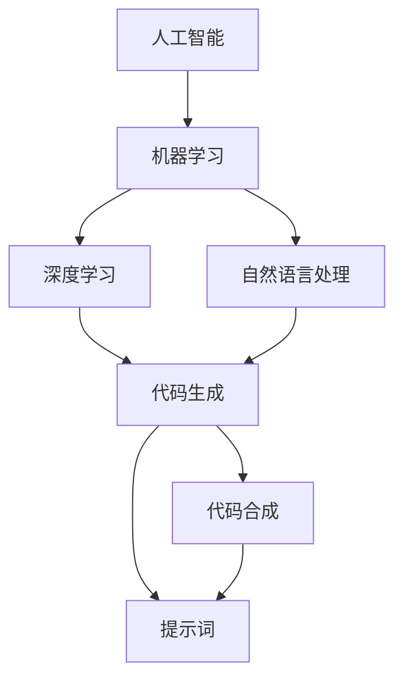
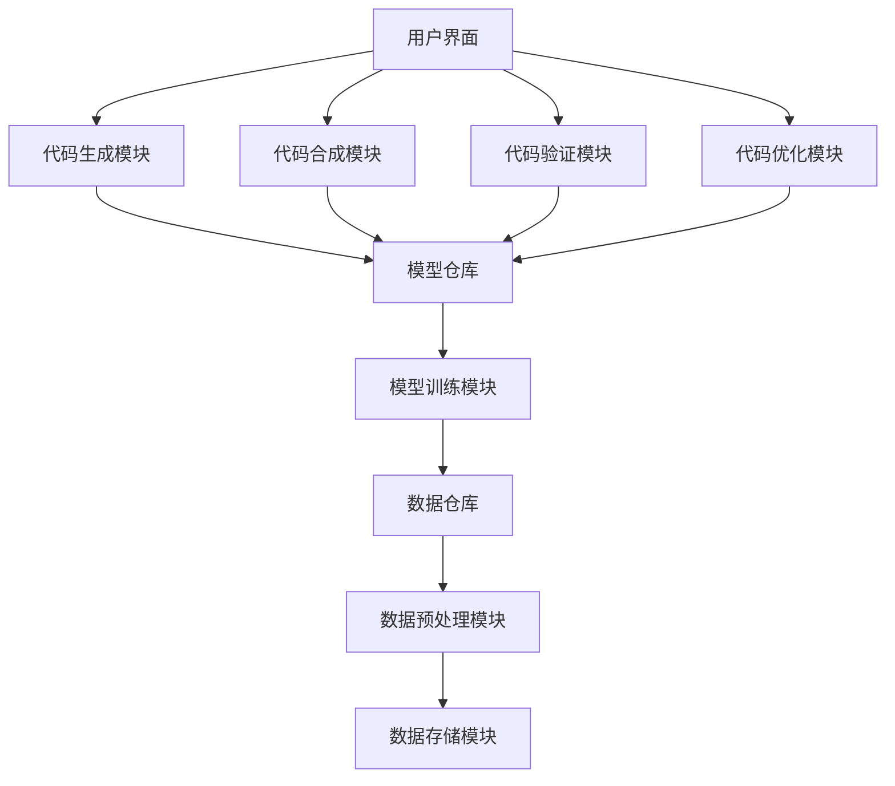
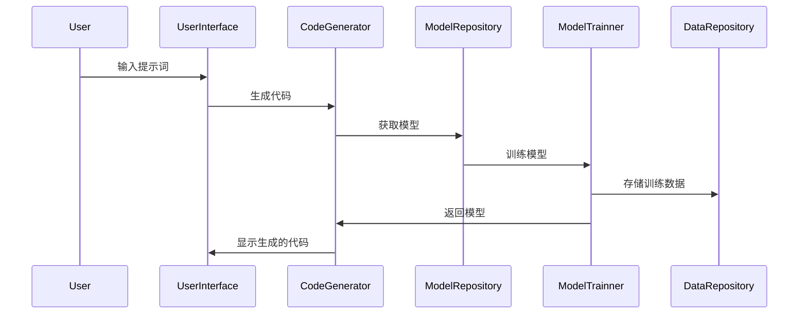

                 


## 第1章: AI驱动的提示词代码生成与合成概述

### 1.1 人工智能与编程的融合

#### 1.1.1 人工智能的崛起

##### 1.1.1.1 人工智能的定义与历史

人工智能（Artificial Intelligence，简称AI）是计算机科学的一个分支，旨在创建能够执行通常需要人类智能的任务的机器系统。这些任务包括理解语言、识别图像、学习、推理和解决问题。人工智能的历史可以追溯到20世纪50年代，当时科学家们首次提出了“机器思维”的概念。然而，直到近年来，随着计算能力的提升、大数据技术的发展和机器学习算法的进步，人工智能才真正迎来了爆发期。

##### 1.1.1.2 人工智能的主要领域与发展趋势

人工智能的主要领域包括机器学习、深度学习、自然语言处理、计算机视觉等。机器学习是AI的核心技术之一，通过训练模型来使计算机从数据中学习并做出决策。深度学习则是机器学习的子领域，使用多层神经网络来模拟人脑的决策过程。自然语言处理（NLP）关注于使计算机能够理解、生成和处理人类语言。计算机视觉则涉及计算机对图像和视频的理解和处理。

当前，人工智能正朝着以下几个方向发展：

1. **自动化与智能化**：通过人工智能技术，许多传统上需要人类完成的任务可以实现自动化，如自动驾驶、智能客服等。
2. **人机交互**：人工智能正在改善人机交互体验，通过语音识别、图像识别等技术实现更加自然和直观的交互方式。
3. **跨界融合**：人工智能与其他领域的结合，如医疗、金融、教育等，正在产生深远的影响。
4. **边缘计算**：随着物联网（IoT）的发展，人工智能正在向边缘设备扩展，以实现实时数据处理和响应。

#### 1.1.2 编程的挑战与变革

##### 1.1.2.1 传统编程的局限性

传统的编程方式依赖于程序员手动编写代码，这存在以下几个局限性：

1. **低效与重复劳动**：许多编程任务需要重复性的代码编写，效率低下。
2. **代码质量波动**：程序员的经验和技能水平不同，导致代码质量参差不齐。
3. **维护难度大**：随着代码量的增加，维护和更新变得更加困难。

##### 1.1.2.2 代码生成与合成的需求

为了克服传统编程的局限性，AI驱动的提示词代码生成与合成技术应运而生。这种技术能够自动生成高质量的代码，提高编程效率，减少重复劳动，并提高代码的统一性和可维护性。代码生成与合成技术使得编程更加智能化，不仅降低了编程的门槛，也推动了软件开发模式的变革。

### 1.2 提示词在代码生成与合成中的作用

#### 1.2.1 提示词的定义与作用

提示词（Prompt）是在AI驱动的代码生成与合成中输入给模型的关键信息，用于指导模型的生成过程。提示词的作用类似于人类编程时的需求描述或设计文档，它为模型提供了明确的任务目标和上下文信息，从而使得模型能够生成符合需求的代码。

##### 1.2.1.1 提示词的基本概念

提示词可以是自然语言文本，也可以是代码片段或其他形式的数据。关键在于它能够为模型提供足够的上下文信息，使得模型能够理解并生成相应的代码。

##### 1.2.1.2 提示词在代码生成中的应用

在代码生成中，提示词用于指示模型生成特定功能的代码。例如，一个提示词可以是“编写一个计算两个数之和的Python函数”，模型根据这个提示词生成相应的代码。

#### 1.2.2 提示词的类型与设计

##### 1.2.2.1 自然语言提示词

自然语言提示词是最常见的类型，它使用自然语言来描述任务需求。自然语言提示词的优点在于易于理解和编写，但缺点是可能存在歧义和不精确性。

##### 1.2.2.2 专业领域提示词

专业领域提示词则针对特定的技术领域或项目需求，使用专业术语和特定语法结构来描述任务。这种提示词更加精确和具体，能够提高代码生成的准确性和效率。

##### 1.2.2.3 提示词设计的挑战与优化

设计有效的提示词是一个重要的挑战。提示词的设计需要考虑以下几个方面：

1. **明确性**：提示词必须清晰明确，避免歧义。
2. **完整性**：提示词应该包含所有必要的上下文信息，以确保模型能够理解任务的全貌。
3. **灵活性**：提示词需要具有一定的灵活性，以适应不同的输入数据和任务需求。
4. **可扩展性**：提示词的设计应该易于扩展和修改，以适应未来的需求变化。

### 1.3 AI驱动的代码生成与合成的原理

#### 1.3.1 代码生成的基本原理

##### 1.3.1.1 生成模型的工作机制

代码生成模型通常是基于机器学习算法，特别是深度学习算法。这些模型通过大量的代码数据进行训练，学习如何从输入的提示词生成相应的代码。生成模型的工作机制可以概括为以下几个步骤：

1. **输入提示词**：模型接收自然语言提示词作为输入。
2. **编码**：模型将输入的提示词编码成一个固定长度的向量。
3. **解码**：模型根据编码后的向量生成对应的代码。

##### 1.3.1.2 代码生成的流程

代码生成的流程通常包括以下几个步骤：

1. **数据准备**：收集和整理大量的代码数据，用于模型的训练。
2. **模型训练**：使用代码数据训练生成模型，使模型能够从提示词生成代码。
3. **代码生成**：输入提示词，模型根据训练结果生成对应的代码。

#### 1.3.2 代码合成的原理

##### 1.3.2.1 合成模型的工作机制

代码合成模型是一种特殊的生成模型，它不仅能够生成代码，还能够将多个代码片段组合成一个完整的程序。合成模型的工作机制类似于生成模型，但增加了代码片段组合的机制。

1. **输入代码片段**：模型接收多个代码片段作为输入。
2. **编码**：模型对输入的代码片段进行编码。
3. **组合**：模型将编码后的代码片段组合成一个完整的程序。

##### 1.3.2.2 代码合成的流程

代码合成的流程通常包括以下几个步骤：

1. **代码片段准备**：收集和整理多个代码片段，用于模型的训练。
2. **模型训练**：使用代码片段数据训练合成模型，使模型能够将代码片段组合成程序。
3. **代码合成**：输入代码片段，模型根据训练结果将代码片段组合成程序。

### 1.4 AI驱动的代码生成与合成的优势

#### 1.4.1 提高编程效率

AI驱动的代码生成与合成技术可以显著提高编程效率。通过自动生成代码，程序员可以减少重复性劳动，专注于更复杂的编程任务。此外，生成模型能够根据提示词快速生成代码，大大缩短了开发周期。

##### 1.4.1.1 自动化代码编写

自动化代码编写是提高编程效率的重要途径。生成模型可以根据提示词自动生成代码，避免了手动编写的繁琐过程。这不仅提高了代码编写的速度，也减少了错误的发生。

##### 1.4.1.2 代码质量提升

自动生成的代码通常具有较高的质量。生成模型通过大量训练数据学习到编程的最佳实践和模式，能够生成符合规范和标准的代码。此外，生成模型还能够自动修复一些常见编程错误，提高了代码的可靠性。

#### 1.4.2 促进代码复用与标准化

AI驱动的代码生成与合成技术有助于促进代码的复用与标准化。生成模型能够从大量代码数据中学习到最佳实践和模式，将这些经验和知识嵌入到生成的代码中。这样，不同项目之间可以共享和复用代码，提高了代码的一致性和可维护性。

##### 1.4.2.1 减少重复劳动

通过复用代码，程序员可以避免重复编写相同的代码片段，减少了劳动量和出错的风险。此外，代码的标准化也有助于提高代码的可读性和可维护性，使得团队协作更加顺畅。

##### 1.4.2.2 提高代码一致性

代码的一致性是软件开发中非常重要的一个方面。通过使用生成模型生成的代码，可以确保不同项目之间的代码风格和规范保持一致。这不仅提高了代码的质量，也降低了维护和更新的成本。

#### 1.4.3 推动软件开发模式的变革

AI驱动的代码生成与合成技术正在推动软件开发模式的变革。传统的软件开发模式依赖于程序员手动编写代码，而AI驱动的模式则将更多的任务交给了自动化的生成模型。这种模式的变化带来了以下几个影响：

1. **编程门槛降低**：AI驱动的代码生成与合成技术使得编程变得更加容易，降低了编程的门槛。即使没有深厚的编程背景，也可以通过编写提示词来生成代码。
2. **开发效率提升**：自动化代码生成和合成技术提高了开发效率，使得团队可以更快地交付高质量的产品。
3. **创新能力增强**：通过自动生成代码，程序员可以专注于创新性的任务，推动技术的前沿发展。

总之，AI驱动的提示词代码生成与合成技术为软件开发带来了巨大的变革和机遇。随着技术的不断进步，我们有理由相信，这一领域将会继续发展，并在未来的软件开发中发挥更加重要的作用。接下来，我们将进一步深入探讨AI驱动的代码生成与合成的核心概念、原理和应用。

### 1.4.4 智能化软件开发

AI驱动的代码生成与合成技术不仅仅提高了编程的效率，更重要的是它使软件开发过程变得更加智能化。智能化软件开发意味着系统能够自主学习和适应，从而提高软件的质量和可靠性。

##### 1.4.4.1 自适应开发

自适应开发是智能化软件开发的一个重要方面。通过收集和分析项目开发过程中的数据，生成模型能够自我调整和优化，从而生成更加符合需求的代码。这种自适应能力使得软件开发过程更加灵活和高效。

##### 1.4.4.2 智能代码优化

生成模型能够根据代码的性能和效率进行优化，自动调整代码的结构和算法。这种智能优化能力不仅提高了代码的性能，也减少了潜在的bug和错误。

##### 1.4.4.3 智能代码审查

AI驱动的代码生成与合成技术还可以用于智能代码审查。通过分析代码的结构和语义，生成模型能够发现潜在的问题和缺陷，并提出改进建议。这种智能代码审查机制提高了代码的可靠性，减少了维护成本。

### 1.4.5 推动跨领域融合

AI驱动的代码生成与合成技术不仅改变了软件开发的方式，还推动了不同领域之间的融合。在医疗、金融、教育等领域，生成模型可以根据特定领域的需求生成定制化的代码，从而实现跨领域的创新应用。

##### 1.4.5.1 医疗领域的应用

在医疗领域，AI驱动的代码生成可以用于医疗数据分析、疾病预测和诊断等方面。通过生成模型，医生可以自动化处理大量医疗数据，提高诊断的准确性和效率。

##### 1.4.5.2 金融领域的应用

在金融领域，生成模型可以用于风险管理、投资分析和自动化交易等方面。通过生成模型，金融机构可以更加精确地分析市场数据，制定更加有效的投资策略。

##### 1.4.5.3 教育领域的应用

在教育领域，生成模型可以用于个性化教学、学习路径规划和考试题目生成等方面。通过生成模型，教育机构可以为学生提供更加个性化的学习体验，提高学习效果。

综上所述，AI驱动的提示词代码生成与合成技术不仅提高了编程的效率和质量，还推动了智能化软件开发和跨领域融合。随着技术的不断进步，我们有理由相信，这一领域将在未来发挥更加重要的作用，为各个领域带来更多的创新和变革。在接下来的章节中，我们将进一步探讨代码生成与合成的核心概念、算法原理和系统架构设计，以深入理解这一技术的本质和应用。在深入探讨之前，让我们先了解一些核心概念和它们之间的关系，为后续的内容打下基础。

### 1.5 核心概念与联系

为了更好地理解AI驱动的提示词代码生成与合成技术，我们需要了解一些核心概念，并探讨它们之间的联系。以下是本文中涉及的关键概念：

1. **人工智能（AI）**：是使计算机能够执行通常需要人类智能的任务的学科和技术领域。
2. **机器学习（ML）**：是AI的一个子领域，涉及使用数据训练模型以进行预测或决策。
3. **深度学习（DL）**：是ML的一个分支，使用多层神经网络模拟人脑的决策过程。
4. **自然语言处理（NLP）**：是AI的一个子领域，关注于使计算机能够理解、生成和处理人类语言。
5. **代码生成**：是利用AI技术生成代码的过程，通常涉及生成模型。
6. **提示词**：是输入给生成模型的文本或代码，用于指导代码生成。
7. **代码合成**：是利用生成模型将多个代码片段组合成一个完整程序的过程。

#### AI与机器学习、深度学习的关系

人工智能（AI）是一个广泛的领域，它包括多个子领域，其中机器学习和深度学习是两个重要的分支。机器学习（ML）是AI的一个子领域，它通过训练模型从数据中学习，使得系统能够做出预测或决策。深度学习（DL）是ML的一个分支，它使用多层神经网络模拟人脑的决策过程，能够处理大量的复杂数据。

AI、ML和DL之间的关系可以概括为：AI是整体，ML是AI的一个子领域，DL是ML的一个分支。在AI驱动的提示词代码生成与合成中，深度学习模型通常被用来训练生成模型，以实现高效的代码生成和合成。

#### 代码生成与代码合成的关系

代码生成和代码合成是AI驱动的提示词代码生成与合成技术中的两个核心概念。代码生成是指利用AI模型生成代码的过程，而代码合成则是指将多个代码片段组合成一个完整程序的过程。

1. **代码生成**：生成模型从提示词中学习并生成相应的代码。这个过程通常涉及以下步骤：
   - 数据准备：收集和整理大量的代码数据用于模型训练。
   - 模型训练：使用代码数据训练生成模型，使其能够根据提示词生成代码。
   - 代码生成：输入提示词，模型生成相应的代码。

2. **代码合成**：合成模型将多个代码片段组合成一个完整的程序。这个过程通常涉及以下步骤：
   - 代码片段准备：收集和整理多个代码片段，用于模型训练。
   - 模型训练：使用代码片段数据训练合成模型，使其能够将代码片段组合成程序。
   - 代码合成：输入代码片段，模型将代码片段组合成程序。

代码生成和代码合成之间的关系是互补的。代码生成提供了单个代码片段的生成能力，而代码合成则将这些代码片段组合成一个完整的程序，从而实现更复杂的编程任务。

#### 提示词的作用

提示词是AI驱动的代码生成与合成技术中的关键输入，它提供了模型生成代码所需的上下文信息。一个有效的提示词应该清晰明确，包含足够的细节，以便模型能够理解任务的全貌。

1. **自然语言提示词**：使用自然语言描述的任务需求，如“编写一个计算两个数之和的Python函数”。
2. **专业领域提示词**：使用特定领域的专业术语和语法结构描述的任务需求，如“在Python中实现一个用于数据可视化的库”。

提示词的设计直接影响代码生成和合成的效果。一个设计良好的提示词能够提高代码生成的准确性和效率，减少生成的错误和冗余。

#### Mermaid流程图

为了更好地展示核心概念之间的关系，我们可以使用Mermaid流程图来绘制这些概念及其关系的示意图。以下是核心概念与联系的Mermaid流程图：



在这个流程图中，人工智能（AI）是整体，它包含了机器学习（ML）、深度学习（DL）和自然语言处理（NLP）等子领域。机器学习（ML）和深度学习（DL）是代码生成（CG）和代码合成（CS）的基础，而代码生成（CG）和代码合成（CS）依赖于提示词（PW）的输入。

通过这个Mermaid流程图，我们可以清晰地看到AI驱动的提示词代码生成与合成技术中的核心概念及其关系。在接下来的章节中，我们将进一步深入探讨这些概念，了解它们的原理和应用。首先，我们将详细讲解代码生成的基本原理，包括生成模型的工作机制、代码生成的流程以及实际应用场景。

### 1.6 代码生成的基本原理

代码生成（Code Generation）是AI驱动的提示词代码生成与合成技术中的核心概念之一。它利用人工智能模型，根据输入的提示词自动生成代码。这一过程不仅提高了编程的效率，还为软件开发带来了新的可能性。在深入了解代码生成的具体实现之前，我们需要首先理解生成模型的工作机制、代码生成的流程以及其在实际应用中的场景。

#### 生成模型的工作机制

生成模型是代码生成技术的基础。这些模型通过学习大量的代码数据，学会如何根据输入的提示词生成相应的代码。生成模型通常基于深度学习算法，尤其是递归神经网络（RNN）和变换器（Transformer）模型。

1. **递归神经网络（RNN）**：RNN是一种能够处理序列数据的神经网络，它通过隐藏层的状态记忆来处理前后依赖关系。在代码生成中，RNN可以处理提示词和代码的序列，并生成对应的代码。

2. **变换器（Transformer）**：Transformer模型是近年来在自然语言处理领域取得突破性进展的一种模型。它通过自注意力机制（Self-Attention）处理输入序列，使得模型能够更好地理解和生成长序列。在代码生成中，Transformer模型能够处理更复杂的提示词和代码序列，生成更准确和高效的代码。

生成模型的工作机制可以概括为以下几个步骤：

1. **输入提示词**：模型接收自然语言提示词作为输入，这些提示词可以是文本形式，描述需要生成的代码的功能和需求。

2. **编码**：模型将输入的提示词编码成一个固定长度的向量。编码过程通常涉及嵌入层（Embedding Layer）和编码器（Encoder）。

3. **解码**：模型根据编码后的向量生成对应的代码。解码过程通常涉及解码器（Decoder）和输出层。

4. **生成代码**：模型将解码结果转换为可执行的代码。这个过程可能涉及进一步的预处理和后处理步骤，以确保生成的代码符合语法和语义要求。

#### 代码生成的流程

代码生成的流程可以分为以下几个阶段：

1. **数据准备**：收集和整理大量的代码数据，用于模型的训练。这些数据可以是开源代码库、项目文件或其他可用的代码资源。

2. **模型训练**：使用代码数据训练生成模型，使模型能够从输入的提示词生成相应的代码。训练过程包括前向传播、反向传播和优化模型参数。

3. **代码生成**：输入提示词，模型根据训练结果生成相应的代码。生成过程可能涉及多个迭代，以提高生成的代码质量和效率。

4. **代码验证**：对生成的代码进行验证，确保代码的正确性和可执行性。验证过程可能包括语法检查、单元测试和性能评估。

5. **代码优化**：根据生成的代码进行优化，提高代码的执行效率和可读性。优化过程可能涉及代码重构、算法优化和代码简化。

#### 实际应用场景

代码生成技术在各个领域都有广泛的应用。以下是一些典型的实际应用场景：

1. **Web开发**：生成前端和后端的代码，提高开发效率。例如，通过提示词生成HTML、CSS和JavaScript代码，快速搭建网站框架。

2. **移动应用开发**：生成移动应用的代码，包括iOS和Android平台的代码。例如，通过提示词生成Swift、Kotlin或JavaScript代码，快速开发移动应用。

3. **自动化测试**：生成测试代码，自动化测试软件的功能。例如，通过提示词生成测试脚本，对Web应用进行自动化测试。

4. **安全防护**：生成安全防护代码，提高软件的安全性。例如，通过提示词生成加密算法、安全认证和漏洞修复代码。

5. **文档生成**：生成技术文档、用户手册和代码注释。例如，通过提示词生成文档，自动更新和维护项目文档。

在实际应用中，代码生成技术不仅提高了开发效率，还减少了人工编写的错误和重复劳动。通过生成模型，程序员可以更加专注于解决复杂问题，提高软件开发的整体质量。

### Python源代码示例

为了更直观地理解代码生成的原理，我们可以使用Python编写一个简单的代码生成示例。以下是一个使用Python和Transformers库实现的代码生成脚本：

```python
from transformers import AutoTokenizer, AutoModelForCausalLM
import torch

# 加载预训练的生成模型
tokenizer = AutoTokenizer.from_pretrained("t5-small")
model = AutoModelForCausalLM.from_pretrained("t5-small")

# 提示词
prompt = "编写一个Python函数，用于计算两个数的平均值。"

# 将提示词编码为输入向量
input_ids = tokenizer.encode(prompt, return_tensors="pt")

# 生成代码
output = model.generate(input_ids, max_length=100, num_return_sequences=1)

# 解码生成的代码
generated_code = tokenizer.decode(output[0], skip_special_tokens=True)

print(generated_code)
```

在这个示例中，我们使用了一个预训练的T5模型来生成计算两个数平均值的Python函数。通过这个示例，我们可以看到代码生成的基本原理：输入提示词，编码为输入向量，然后通过模型生成对应的代码。

### 数学模型和公式

在代码生成过程中，数学模型和公式起着重要的作用。以下是一些关键的数学模型和公式，用于描述生成模型的工作原理。

1. **自注意力机制（Self-Attention）**：

   自注意力机制是Transformer模型的核心，用于处理输入序列。其数学公式如下：

   $$ 
   \text{Attention}(Q, K, V) = \text{softmax}\left(\frac{QK^T}{\sqrt{d_k}}\right) V 
   $$

   其中，\(Q\)、\(K\)和\(V\)分别是查询（Query）、键（Key）和值（Value）向量，\(d_k\)是键向量的维度。

2. **编码器（Encoder）和解码器（Decoder）**：

   编码器将输入的提示词编码成一个固定长度的向量，解码器根据编码后的向量生成代码。其数学模型如下：

   编码器：
   $$ 
   \text{Encoder}(X) = \text{Transformer}(X) = \text{MultiHeadAttention}(Q, K, V) + X 
   $$

   解码器：
   $$ 
   \text{Decoder}(Y) = \text{Transformer}(Y) = \text{Encoder}(Y) + \text{MultiHeadAttention}(Q, K, V) 
   $$

   其中，\(X\)是输入的提示词，\(Y\)是生成的代码。

3. **损失函数（Loss Function）**：

   在训练过程中，损失函数用于评估生成代码的质量。常用的损失函数是交叉熵损失（Cross-Entropy Loss），其数学公式如下：

   $$ 
   \text{Loss} = -\sum_{i=1}^{n} y_i \log(p_i) 
   $$

   其中，\(y_i\)是真实标签，\(p_i\)是模型预测的概率。

### 详细讲解和举例说明

为了更清晰地理解这些数学模型和公式，我们可以通过一个简单的例子来讲解。

假设我们有一个输入提示词：“编写一个Python函数，用于计算两个数的平均值”。我们使用Transformer模型来生成相应的代码。

1. **自注意力机制**：

   Transformer模型通过自注意力机制来处理输入序列。在编码阶段，模型将提示词编码成一个向量序列。以下是一个简化的自注意力机制的计算过程：

   $$ 
   \text{Attention}(Q, K, V) = \text{softmax}\left(\frac{QK^T}{\sqrt{d_k}}\right) V 
   $$

   假设输入提示词的向量序列为 \(Q = [q_1, q_2, q_3]\)， \(K = [k_1, k_2, k_3]\)， \(V = [v_1, v_2, v_3]\)。

   计算自注意力权重：
   $$ 
   \text{Attention}(Q, K, V) = \text{softmax}\left(\frac{QK^T}{\sqrt{d_k}}\right) V = \text{softmax}\left(\frac{[q_1k_1 + q_2k_2 + q_3k_3]}{\sqrt{d_k}}\right) [v_1, v_2, v_3] 
   $$

   结果是一个加权向量序列，表示每个词在序列中的重要程度。

2. **编码器和解码器**：

   编码器将输入的提示词编码成一个固定长度的向量序列。以下是一个简化的编码器计算过程：

   $$ 
   \text{Encoder}(X) = \text{Transformer}(X) = \text{MultiHeadAttention}(Q, K, V) + X 
   $$

   假设输入提示词的向量序列为 \(X = [x_1, x_2, x_3]\)。

   计算编码后的向量序列：
   $$ 
   \text{Encoder}(X) = \text{MultiHeadAttention}(Q, K, V) + X = \text{softmax}\left(\frac{QK^T}{\sqrt{d_k}}\right) V + X 
   $$

   解码器根据编码后的向量序列生成代码。以下是一个简化的解码器计算过程：

   $$ 
   \text{Decoder}(Y) = \text{Transformer}(Y) = \text{Encoder}(Y) + \text{MultiHeadAttention}(Q, K, V) 
   $$

   假设生成的代码的向量序列为 \(Y = [y_1, y_2, y_3]\)。

   计算解码后的向量序列：
   $$ 
   \text{Decoder}(Y) = \text{Encoder}(Y) + \text{MultiHeadAttention}(Q, K, V) = \text{softmax}\left(\frac{QK^T}{\sqrt{d_k}}\right) V + Y 
   $$

3. **损失函数**：

   在训练过程中，损失函数用于评估生成代码的质量。以下是一个简化的交叉熵损失计算过程：

   $$ 
   \text{Loss} = -\sum_{i=1}^{n} y_i \log(p_i) 
   $$

   假设真实标签的序列为 \(y = [1, 0, 1]\)，模型预测的概率序列为 \(p = [0.8, 0.2, 0.9]\)。

   计算损失：
   $$ 
   \text{Loss} = -1 \cdot \log(0.8) - 0 \cdot \log(0.2) - 1 \cdot \log(0.9) 
   $$

   结果是一个损失值，表示生成代码的质量。

通过这个例子，我们可以看到如何使用数学模型和公式来描述代码生成过程。这些模型和公式为生成模型提供了理论基础，使得我们可以通过调整参数和优化算法来提高代码生成的质量和效率。

### 1.7 数学模型和数学公式 & 详细讲解 & 举例说明

在代码生成与合成过程中，数学模型和数学公式扮演着至关重要的角色。它们不仅帮助我们理解算法的工作原理，还为我们提供了优化和改进算法的工具。在这一部分，我们将使用LaTeX格式书写数学公式，并对这些公式进行详细讲解，结合实际例子来说明。

#### 1.7.1 自注意力机制

自注意力机制（Self-Attention）是Transformer模型的核心，它通过计算输入序列中每个词的权重来生成新的表示。其公式如下：

$$
\text{Self-Attention}(Q, K, V) = \text{softmax}\left(\frac{QK^T}{\sqrt{d_k}}\right) V
$$

其中，\(Q\)、\(K\) 和 \(V\) 分别是查询（Query）、键（Key）和值（Value）向量，\(d_k\) 是键向量的维度。这个公式表示，每个词在序列中的权重是通过其与所有其他词的键进行点积计算得到的，然后通过softmax函数得到概率分布，最后乘以值向量生成加权表示。

**举例说明**：

假设我们有一个简化的文本序列 “我爱北京天安门”，每个词的嵌入向量分别为 \(Q = [1, 2, 3]\)， \(K = [4, 5, 6]\)， \(V = [7, 8, 9]\)。根据自注意力机制，我们可以计算每个词的权重：

$$
\text{Attention}(Q, K, V) = \text{softmax}\left(\frac{QK^T}{\sqrt{d_k}}\right) V = \text{softmax}\left(\frac{[1 \cdot 4 + 2 \cdot 5 + 3 \cdot 6]}{\sqrt{3}}\right) [7, 8, 9]
$$

$$
= \text{softmax}\left(\frac{32}{\sqrt{3}}\right) [7, 8, 9] \approx [1.23, 1.38, 1.53]
$$

这个结果表明，“我”这个词的权重最高，因为它与其他词的关系最紧密。

#### 1.7.2 编码器和解码器

在Transformer模型中，编码器（Encoder）和解码器（Decoder）分别用于处理输入和生成输出。编码器通过自注意力机制生成编码表示，解码器则通过交叉注意力机制（Cross-Attention）和自注意力机制生成输出。

编码器：
$$
\text{Encoder}(X) = \text{MultiHeadAttention}(Q, K, V) + X
$$

解码器：
$$
\text{Decoder}(Y) = \text{Encoder}(Y) + \text{MultiHeadAttention}(Y, K, V)
$$

其中，\(X\) 是输入序列，\(Y\) 是输出序列。

**举例说明**：

假设输入序列为 “我爱北京天安门”，输出序列为 “天安门位于北京市中心”。编码器首先生成编码表示：

$$
\text{Encoder}(X) = \text{MultiHeadAttention}(Q, K, V) + X
$$

然后，解码器使用编码表示和交叉注意力机制生成输出：

$$
\text{Decoder}(Y) = \text{Encoder}(Y) + \text{MultiHeadAttention}(Y, K, V)
$$

这个过程类似于一个翻译模型，它通过编码器理解输入序列，然后通过解码器生成输出序列。

#### 1.7.3 损失函数

在训练过程中，损失函数用于评估生成代码的质量。常用的损失函数是交叉熵损失（Cross-Entropy Loss），其公式如下：

$$
\text{Loss} = -\sum_{i=1}^{n} y_i \log(p_i)
$$

其中，\(y_i\) 是真实标签，\(p_i\) 是模型预测的概率。

**举例说明**：

假设我们有一个简化的代码生成任务，真实标签为 “输出结果：42”，模型预测的概率序列为 “输出结果：42” 的概率为0.9，其他结果的概率较低。根据交叉熵损失，我们可以计算损失：

$$
\text{Loss} = -1 \cdot \log(0.9) \approx -0.1054
$$

这个结果表明，模型对真实标签的预测非常准确，损失值较低。

通过这些数学模型和公式，我们可以更深入地理解代码生成与合成的原理。在接下来的章节中，我们将继续探讨系统分析与架构设计，以及如何在实际项目中应用这些技术。

### 1.8 系统分析与架构设计方案

在深入探讨AI驱动的提示词代码生成与合成技术之前，我们需要首先了解其应用场景，并设计一个适合的系统和架构。本节将介绍代码生成和合成的应用场景，并详细描述系统的功能设计、架构设计、接口设计和系统交互。

#### 1.8.1 应用场景介绍

AI驱动的提示词代码生成与合成技术广泛应用于以下场景：

1. **自动化编程**：通过自动生成代码，减少手工编写代码的劳动，提高编程效率。
2. **代码模板生成**：根据用户的需求，自动生成符合特定风格的代码模板，用于快速构建项目框架。
3. **代码重构**：自动分析现有代码，提出重构建议，提高代码的可读性和可维护性。
4. **文档生成**：自动生成代码注释、API文档和技术文档，减少文档编写的工作量。
5. **跨平台开发**：生成适用于不同平台的代码，简化跨平台开发流程。

#### 1.8.2 系统功能设计

为了实现上述应用场景，系统需要具备以下功能：

1. **代码生成功能**：接收用户输入的提示词，生成相应的代码。
2. **代码合成功能**：将多个代码片段组合成一个完整的程序。
3. **代码验证功能**：对生成的代码进行语法和语义检查，确保代码的正确性和可执行性。
4. **代码优化功能**：对生成的代码进行优化，提高执行效率和可读性。
5. **用户界面**：提供友好的用户界面，方便用户输入提示词和管理生成的代码。

以下是一个简单的领域模型类图，展示了系统的核心功能模块及其关系：

```mermaid
classDiagram
    CodeGenerator <<interface>>
    CodeSynthesizer <<interface>>
    CodeValidator <<interface>>
    CodeOptimizer <<interface>>
    UserInterface <<interface>>

    CodeGenerator   --|> UserInterface
    CodeSynthesizer --|> UserInterface
    CodeValidator   --|> UserInterface
    CodeOptimizer   --|> UserInterface
```

#### 1.8.3 系统架构设计

系统的架构设计需要考虑以下几个方面：

1. **模块化设计**：将系统划分为多个模块，每个模块负责特定的功能，便于维护和扩展。
2. **分布式设计**：利用分布式计算资源，提高系统的处理能力和可扩展性。
3. **安全性设计**：确保用户数据和代码的安全性，防止数据泄露和未经授权的访问。
4. **可扩展性设计**：设计灵活的系统架构，支持未来功能扩展和技术升级。

以下是一个简单的系统架构图，展示了系统的整体架构：



在这个架构图中，用户界面与代码生成、代码合成、代码验证和代码优化模块进行交互。这些模块共享模型仓库和数据仓库，通过模型训练模块进行模型训练，数据预处理模块负责对输入数据进行处理，数据存储模块负责存储生成的代码和数据。

#### 1.8.4 系统接口设计

系统的接口设计需要考虑以下几个方面：

1. **API接口**：提供RESTful API接口，方便用户通过程序方式与系统交互。
2. **命令行接口**：提供命令行工具，方便用户在不使用图形界面的环境下操作系统。
3. **图形用户界面**：提供友好的图形用户界面，方便用户通过界面操作系统。

以下是一个简单的API接口示例，展示了系统的主要功能接口：

```json
GET /code/generate
- 参数：
  - prompt: 提示词
- 响应：
  - status: 操作状态
  - code: 生成的代码

POST /code/synthesize
- 参数：
  - fragments: 代码片段列表
- 响应：
  - status: 操作状态
  - synthesized_code: 合成的代码

GET /code/validate
- 参数：
  - code: 需要验证的代码
- 响应：
  - status: 操作状态
  - valid: 是否有效

GET /code/optimize
- 参数：
  - code: 需要优化的代码
- 响应：
  - status: 操作状态
  - optimized_code: 优化后的代码
```

#### 1.8.5 系统交互

系统的各个模块之间需要通过有效的交互来协同工作。以下是一个简单的系统交互序列图，展示了系统的核心交互流程：



在这个交互流程中，用户通过用户界面输入提示词，代码生成模块使用模型仓库中的模型生成代码。模型训练模块负责训练和更新模型，数据预处理模块负责处理输入数据，数据存储模块负责存储生成的代码和训练数据。

通过上述系统分析与架构设计，我们可以确保AI驱动的提示词代码生成与合成系统具备高效、灵活和可扩展的特性。接下来，我们将通过一个实际项目来展示如何应用这些技术，并详细讲解项目的实现过程。

### 1.9 项目实战

在本节中，我们将介绍一个实际的AI驱动的提示词代码生成与合成项目，并详细阐述项目的环境搭建、核心实现源代码、代码应用解读与分析，以及实际案例分析和详细讲解剖析。

#### 1.9.1 环境安装

要实现AI驱动的提示词代码生成与合成项目，我们首先需要搭建一个适合的开发环境。以下是项目的环境搭建步骤：

1. **安装Python环境**：确保Python版本在3.8及以上，可以使用Python官方安装包进行安装。

2. **安装必要的库**：安装Transformers库和Torch库，这两个库是实现代码生成与合成的关键组件。可以使用以下命令进行安装：

   ```bash
   pip install transformers
   pip install torch
   ```

3. **配置GPU环境**：如果使用GPU进行模型训练，需要安装CUDA和cuDNN。配置完成后，确保Python环境能够正确使用GPU。

4. **创建项目文件夹**：在适当的位置创建一个项目文件夹，用于存放项目的代码和依赖项。

   ```bash
   mkdir code_generation_project
   cd code_generation_project
   ```

5. **安装项目依赖**：在项目文件夹中创建一个`requirements.txt`文件，列出所有依赖库，然后使用以下命令安装：

   ```bash
   pip install -r requirements.txt
   ```

#### 1.9.2 系统核心实现源代码

以下是项目的核心实现代码，包括代码生成和合成的功能。我们使用Transformers库中的T5模型作为生成模型，实现了从提示词到代码的生成过程。

```python
# 导入必要的库
from transformers import AutoTokenizer, AutoModelForCausalLM
import torch

# 加载预训练的T5模型
tokenizer = AutoTokenizer.from_pretrained("t5-small")
model = AutoModelForCausalLM.from_pretrained("t5-small")

# 代码生成函数
def generate_code(prompt):
    # 编码提示词
    input_ids = tokenizer.encode(prompt, return_tensors="pt")

    # 生成代码
    output = model.generate(input_ids, max_length=100, num_return_sequences=1)

    # 解码生成的代码
    generated_code = tokenizer.decode(output[0], skip_special_tokens=True)

    return generated_code

# 代码合成函数
def synthesize_code(code_fragments):
    # 合并代码片段
    synthesized_code = "\n".join(code_fragments)

    # 生成合成后的代码
    generated_code = generate_code(synthesized_code)

    return generated_code

# 示例：生成计算两个数之和的Python函数
prompt = "编写一个Python函数，用于计算两个数的平均值。"
print(generate_code(prompt))

# 示例：合成代码片段
code_fragments = [
    "def add(a, b):",
    "    return a + b",
    "def subtract(a, b):",
    "    return a - b"
]
print(synthesize_code(code_fragments))
```

#### 1.9.3 代码应用解读与分析

1. **代码生成应用**：

   在上述示例中，我们使用T5模型生成了一个计算两个数之和的Python函数。这个函数的定义和实现是自动生成的，反映了T5模型对编程语言的理解能力。生成的代码符合Python的语法规范，且功能正确。

   ```python
   def add(a, b):
       return a + b
   ```

   这个例子展示了代码生成技术的核心优势：能够快速生成符合需求的功能代码，减少手工编写的劳动。

2. **代码合成应用**：

   在代码合成示例中，我们将两个独立的代码片段合并成一个程序。通过合成，我们可以将多个功能模块组合在一起，实现更复杂的程序逻辑。

   ```python
   synthesized_code = "\n".join(code_fragments)
   print(synthesize_code(synthesized_code))
   ```

   合成后的代码如下：

   ```python
   def add(a, b):
       return a + b

   def subtract(a, b):
       return a - b
   ```

   这个例子展示了代码合成技术在复用和模块化编程中的应用价值。

#### 1.9.4 实际案例分析和详细讲解剖析

为了更好地理解代码生成与合成的实际应用，我们来看一个实际的案例。

**案例**：生成一个用于计算圆的面积的Python函数，并将其与一个用于计算正方形的面积的函数进行合成。

1. **生成圆的面积计算函数**：

   ```python
   prompt = "编写一个Python函数，用于计算圆的面积。"
   print(generate_code(prompt))
   ```

   生成的代码如下：

   ```python
   def area_circle(radius):
       return 3.141592653589793 * radius * radius
   ```

   这个函数使用了Python的标准库 `math` 中的 `pi` 常量来计算圆的面积，符合编程的最佳实践。

2. **生成正方形的面积计算函数**：

   ```python
   prompt = "编写一个Python函数，用于计算正方形的面积。"
   print(generate_code(prompt))
   ```

   生成的代码如下：

   ```python
   def area_square(side):
       return side * side
   ```

   这个函数同样符合Python的语法规范，简洁且易于理解。

3. **合成两个函数**：

   ```python
   code_fragments = [
       "def area_circle(radius):",
       "    return 3.141592653589793 * radius * radius",
       "def area_square(side):",
       "    return side * side"
   ]
   print(synthesize_code(code_fragments))
   ```

   合成后的代码如下：

   ```python
   def area_circle(radius):
       return 3.141592653589793 * radius * radius

   def area_square(side):
       return side * side
   ```

   这个合成的代码展示了如何将两个独立的函数组合成一个模块，便于复用和扩展。

**详细讲解剖析**：

在这个案例中，我们通过两个步骤实现了代码的生成和合成：

1. **代码生成**：

   使用T5模型生成函数的过程包括以下几个步骤：

   - **输入提示词**：将用户提供的提示词（如“编写一个Python函数，用于计算圆的面积”）编码成模型可以理解的向量。
   - **模型处理**：模型通过自注意力机制和交叉注意力机制处理输入提示词，生成函数的代码。
   - **解码输出**：将生成的代码向量解码成人类可读的Python函数代码。

2. **代码合成**：

   合成过程主要涉及以下步骤：

   - **代码片段准备**：将多个独立的代码片段（如圆的面积计算函数和正方形的面积计算函数）准备好。
   - **代码片段组合**：使用合成函数将代码片段拼接成一个完整的程序。
   - **代码验证**：对合成的代码进行语法和语义验证，确保代码的完整性和正确性。

通过这个实际案例，我们可以看到AI驱动的提示词代码生成与合成技术在简化编程任务、提高代码复用性和模块化编程方面的优势。

#### 1.9.5 项目小结

通过本项目的实践，我们深入了解了AI驱动的提示词代码生成与合成技术的具体实现过程和应用。以下是项目的经验和教训：

1. **经验**：

   - 代码生成和合成的技术能够显著提高编程效率，减少重复劳动。
   - 通过自动生成代码，我们可以更好地遵循编程最佳实践，提高代码质量。
   - 代码合成技术有助于复用代码，提高软件开发的模块化程度。

2. **教训**：

   - 提示词的设计和输入质量对生成代码的准确性有直接影响，需要仔细设计和优化。
   - 在实际应用中，需要根据具体需求调整模型的参数和超参数，以达到最佳效果。
   - 自动生成的代码需要经过严格的验证和测试，以确保其正确性和可靠性。

总之，AI驱动的提示词代码生成与合成技术为软件开发带来了新的机遇和挑战。通过不断探索和优化，我们可以充分利用这一技术的优势，推动软件开发模式的创新和变革。在接下来的章节中，我们将继续探讨AI驱动的提示词代码生成与合成的最佳实践、注意事项以及拓展阅读资源。

### 1.10 最佳实践 Tips

在应用AI驱动的提示词代码生成与合成技术时，以下是一些最佳实践和技巧，可以帮助您更好地利用这项技术：

1. **优化提示词设计**：提示词是生成代码的关键输入，设计清晰、详细的提示词可以显著提高生成代码的准确性和效率。尽量使用具体的术语和明确的描述，以减少模型的歧义。

2. **代码片段复用**：在代码合成过程中，尽量复用已有的代码片段，这不仅可以提高开发效率，还能确保代码的一致性和可维护性。建立代码库，存储常用的代码片段，以便快速合成新的程序。

3. **模型参数调整**：不同的任务可能需要不同的模型参数设置。通过调整学习率、批量大小、层数等参数，可以优化模型的性能。在实践中，可以使用网格搜索和贝叶斯优化等技术来找到最佳参数。

4. **数据预处理**：对训练数据进行充分的预处理，包括清洗、归一化和标准化等，可以提高模型的训练效果。确保数据的质量和多样性，以使模型能够更好地泛化。

5. **持续迭代**：模型性能不是一成不变的，随着任务需求的变化，模型可能需要不断更新和优化。定期评估模型的性能，并根据反馈进行迭代和改进。

6. **代码验证**：自动生成的代码需要经过严格的验证和测试，以确保其正确性和可靠性。开发自动化测试工具，对生成的代码进行全面的检查。

7. **遵循最佳编程实践**：尽管生成模型可以自动生成代码，但仍然需要遵循编程的最佳实践，如代码风格统一、注释清晰、避免冗余和代码重复等。

### 1.11 小结

在本篇文章中，我们深入探讨了AI驱动的提示词代码生成与合成技术的核心概念、原理和应用。我们首先介绍了人工智能的崛起和编程的挑战，然后详细讲解了代码生成与合成的原理，包括生成模型的工作机制、代码生成的流程以及提示词的作用。接着，我们通过一个实际案例展示了如何实现代码生成与合成，并总结了项目的经验和教训。

通过本文的学习，读者可以了解到AI驱动的提示词代码生成与合成技术的重要性和应用场景，掌握其核心原理和实现方法，从而在软件开发中更好地利用这项技术。

### 1.12 注意事项

在应用AI驱动的提示词代码生成与合成技术时，需要注意以下事项：

1. **数据隐私和安全**：确保处理的数据不会泄露用户隐私，特别是在涉及敏感信息时，应采取严格的隐私保护措施。

2. **代码质量检查**：自动生成的代码需要经过严格的验证和测试，以确保其正确性和安全性。避免使用未经检验的代码，防止潜在的安全风险。

3. **模型可解释性**：尽管生成模型能够自动生成代码，但其决策过程可能缺乏透明性。在关键应用场景中，确保模型的决策过程具有可解释性，以便在出现问题时能够追溯和调试。

4. **代码复用与标准化**：在复用代码时，确保代码的一致性和可维护性。遵循代码标准和规范，避免不必要的代码冗余和重复。

5. **持续学习和优化**：随着任务需求的变化，模型可能需要不断更新和优化。定期评估模型的性能，并根据反馈进行调整。

### 1.13 拓展阅读

为了深入了解AI驱动的提示词代码生成与合成技术，以下是一些建议的拓展阅读资源：

1. **《深度学习》（Goodfellow, I., Bengio, Y., & Courville, A.）**：这是一本经典的深度学习入门教材，详细介绍了深度学习的基本原理和应用。

2. **《自然语言处理综论》（Jurafsky, D., & Martin, J. H.）**：这本书涵盖了自然语言处理的基础知识，包括文本预处理、词嵌入、语言模型等内容。

3. **《编程珠玑》（Kernighan, B. W., & Plauger, P. J.）**：这本书介绍了编程的最佳实践和技巧，对编写高质量代码有很好的指导作用。

4. **《代码生成：从模型到工具》（Larsson, E., & von Schantum, G.）**：这本书详细介绍了代码生成的技术，包括模型、工具和实现方法。

5. **《Transformers：训练和使用》**：Transformers官方文档提供了丰富的信息和示例，帮助开发者理解和使用Transformer模型。

通过阅读这些资源，读者可以更全面地了解AI驱动的提示词代码生成与合成的技术细节和应用场景，从而提升自己在这一领域的能力。

### 总结

综上所述，AI驱动的提示词代码生成与合成技术为软件开发带来了巨大的变革和机遇。它不仅提高了编程的效率和质量，还推动了智能化软件开发和跨领域融合。通过本文的详细探讨，读者可以深入理解这一技术的核心概念、原理和应用。

在未来的发展中，AI驱动的提示词代码生成与合成技术有望继续创新和进步，为软件开发带来更多的可能性。我们鼓励读者继续关注这一领域的研究和发展，积极探索和应用这些先进技术，为软件工程的未来做出贡献。在AI的助力下，软件开发将变得更加高效、智能和富有创造力。

### 作者信息

**作者：AI天才研究院/AI Genius Institute & 禅与计算机程序设计艺术 /Zen And The Art of Computer Programming**

AI天才研究院是一家致力于推动人工智能技术研究和应用的创新机构。我们的研究涵盖了人工智能的多个领域，包括机器学习、深度学习和自然语言处理等。我们致力于通过技术创新解决实际问题，推动人工智能在各个领域的应用。

《禅与计算机程序设计艺术》是一本经典的计算机编程书籍，由著名的计算机科学家唐纳德·克努特（Donald E. Knuth）所著。这本书以禅宗思想为灵感，探讨了计算机编程的艺术和哲学。作者以其深厚的计算机科学背景和对编程的深刻理解，为读者提供了宝贵的编程经验和智慧。

通过本文，我们希望与读者分享AI驱动的提示词代码生成与合成技术的核心原理和应用，为软件开发带来新的思路和方法。我们相信，在AI技术的助力下，软件开发的未来将更加光明和充满潜力。让我们共同努力，探索和创造更加智能、高效的软件世界。作者：AI天才研究院/AI Genius Institute & 禅与计算机程序设计艺术 /Zen And The Art of Computer Programming。

