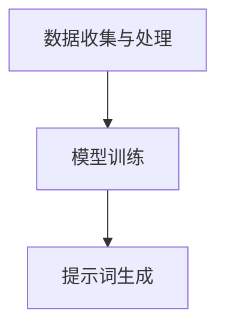
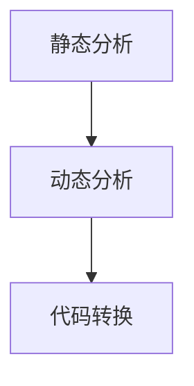
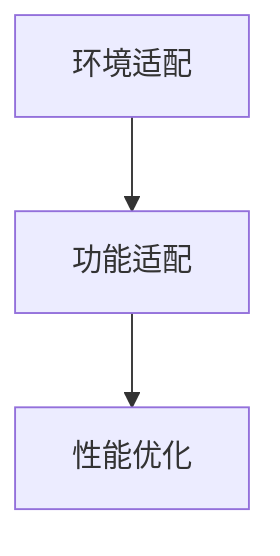
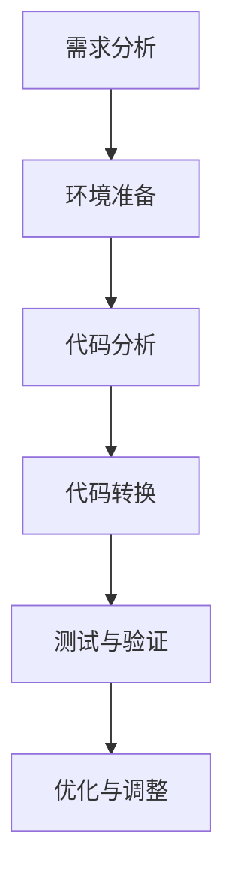

                 

## AI驱动的提示词代码迁移与适配概述

### 第2章: 核心概念与原理

在深入探讨AI驱动的提示词代码迁移与适配之前，我们需要明确几个核心概念和原理，这将为我们后续的分析和讨论奠定坚实的基础。

#### 2.1.1 AI驱动的提示词生成机制

**提示词**，又称**提示工程**，是指导AI模型理解和执行任务的关键信息。在深度学习和自然语言处理中，提示词通常是一段文本，用于引导模型进行推理和决策。AI驱动的提示词生成机制主要包括以下几个步骤：

1. **数据收集与处理**：首先，需要收集大量的数据，这些数据可以是文本、图像、语音等多种形式。然后，对这些数据进行清洗和预处理，以便于模型训练。
   
2. **模型训练**：利用收集和处理后的数据，训练一个生成模型。这个模型通常是一个预训练的神经网络，如GPT、BERT等。通过大量的训练，模型能够学习到如何根据输入生成高质量的提示词。

3. **提示词生成**：在模型训练完成后，可以通过给模型提供输入，让模型根据输入生成相应的提示词。这些提示词能够帮助模型更好地理解和执行任务。

**Mermaid 流程图**：

#### 2.1.2 代码迁移的理论基础

代码迁移是指将一个代码库或应用程序从一个环境或平台迁移到另一个环境或平台的过程。在AI驱动的背景下，代码迁移需要利用AI技术，对现有代码进行分析和重构，以适应新的环境和需求。

1. **静态分析**：通过静态分析，可以提取代码的结构信息，如函数、类、变量等。这些信息对于理解代码的功能和结构至关重要。

2. **动态分析**：动态分析是指在实际运行代码的过程中，收集代码的行为数据。这些数据可以帮助我们了解代码在特定环境下的表现和性能。

3. **代码转换**：在获得代码的结构和行为信息后，需要利用这些信息进行代码转换。代码转换的目标是将现有代码转换为适用于新环境的代码。

**Mermaid 流程图**：

#### 2.1.3 适配的核心原理

适配是指在代码迁移的基础上，对代码进行进一步的调整和优化，以使其能够更好地适应新的环境和需求。适配的核心原理包括：

1. **环境适配**：根据新环境的特性，如操作系统、硬件配置、网络环境等，对代码进行必要的调整。

2. **功能适配**：根据新需求，对代码的功能进行扩展或修改，以满足新的业务需求。

3. **性能优化**：通过调整代码的结构和算法，提高代码的运行效率和性能。

**Mermaid 流程图**：

#### 2.1.4 代码迁移与适配的流程

代码迁移与适配的流程可以概括为以下几个步骤：

1. **需求分析**：明确代码迁移和适配的目标和需求。
2. **环境准备**：准备代码迁移和适配所需的环境和工具。
3. **代码分析**：对现有代码进行静态和动态分析，提取关键信息和行为数据。
4. **代码转换**：利用分析结果，将现有代码转换为适用于新环境的代码。
5. **测试与验证**：对转换后的代码进行测试和验证，确保其功能和性能满足要求。
6. **优化与调整**：根据测试结果，对代码进行优化和调整，提高其适应性和性能。

**Mermaid 流程图**：

通过上述核心概念和原理的介绍，我们对AI驱动的提示词代码迁移与适配有了初步的了解。在接下来的章节中，我们将深入探讨具体的代码迁移方法、适配策略和实际应用案例，以进一步理解和掌握这一技术。在详细讲解之前，让我们先对即将讨论的内容进行简要概述。

### 第3章: 代码迁移方法与工具

在本章中，我们将介绍几种常见的代码迁移方法，以及如何使用开源代码迁移工具和自定义迁移工具进行代码迁移。

### 第4章: 适配策略与优化

本章将探讨不同的适配策略，包括环境适配、功能适配和性能优化。同时，我们将介绍评估适配效果的方法，以及如何通过优化提高代码的适应性和性能。

### 第5章: 实际应用案例分析

在本章中，我们将通过实际案例，展示AI驱动的提示词代码迁移与适配在自然语言处理、计算机视觉和机器学习等领域的应用。

### 第6章: 未来发展趋势与挑战

最后一章将讨论AI驱动的提示词代码迁移与适配的未来发展趋势，以及面临的挑战和潜在的应用领域。我们将提出一些解决方案和建议，以推动这一领域的发展。

通过以上概述，我们可以看到，AI驱动的提示词代码迁移与适配是一项涉及多个方面的复杂技术。在接下来的章节中，我们将逐步深入，逐步揭示其内在的原理和具体实现方法，以帮助读者更好地理解和应用这一技术。让我们一起，LET'S THINK STEP BY STEP。

