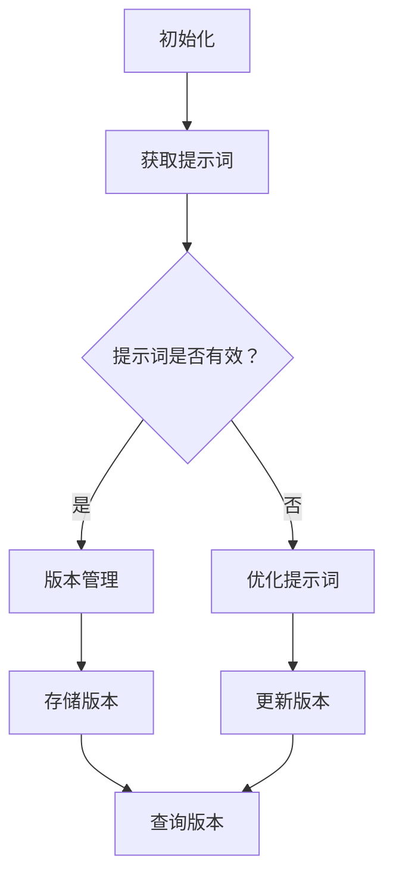
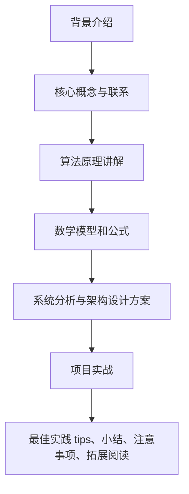

                 

# AI驱动的提示词版本管理与演化

> 关键词：AI、版本管理、提示词、演化、算法、系统架构、Python、LaTeX、项目实战

> 摘要：本文将深入探讨AI驱动的提示词版本管理与演化技术，通过逐步分析其背景、核心概念、算法原理、数学模型、系统架构和项目实战，为读者提供全面的技术解读和实践指南。

## 1. 背景介绍

随着人工智能（AI）技术的飞速发展，自然语言处理（NLP）成为了一个热门领域。在NLP中，提示词（Prompt）是一个关键概念，它用于引导AI模型进行特定任务。版本管理（Version Management）则是确保提示词不断优化和更新的重要手段。

传统的提示词管理通常依赖于人工操作，这不仅效率低下，还容易出错。为了解决这一问题，AI驱动的提示词版本管理与演化技术应运而生。它通过机器学习和自动化流程，实现对提示词的智能管理和优化，从而提高NLP任务的效果和效率。

本文将详细探讨AI驱动的提示词版本管理与演化技术，包括核心概念、算法原理、数学模型、系统架构和项目实战等方面，为读者提供全面的技术解读和实践指南。

## 2. 核心概念与联系

### 2.1 提示词（Prompt）

提示词是指用于引导AI模型进行特定任务的一组文字或指令。它是AI模型与外部环境交互的桥梁，能够影响模型的学习过程和输出结果。有效的提示词能够提高模型的任务完成率和准确性。

### 2.2 版本管理（Version Management）

版本管理是指对提示词进行系统化的存储、跟踪和更新过程。它确保了提示词的一致性和稳定性，避免了由于人工操作导致的错误和遗漏。版本管理通常包括以下功能：

- 提示词的创建、修改和删除
- 提示词的版本控制，如创建、更新、发布和回滚
- 提示词的权限管理，如读写权限和修改权限

### 2.3 AI驱动（AI-Driven）

AI驱动是指利用人工智能技术来实现特定功能或任务的过程。在提示词版本管理中，AI驱动技术主要用于以下方面：

- 自动化提示词的生成和优化
- 智能识别和修复版本管理中的错误
- 提高提示词版本管理的效率和准确性

### 2.4 核心概念与联系

为了更好地理解提示词版本管理与演化技术，我们可以通过以下表格和ER实体关系图来展示核心概念之间的联系。

#### 表格：核心概念属性特征对比

| 概念         | 属性特征                       | 联系                                                         |
| ------------ | ------------------------------ | ------------------------------------------------------------ |
| 提示词       | 文本、指令、任务引导           | 提示词是版本管理的核心对象，用于引导AI模型完成任务           |
| 版本管理     | 存储、跟踪、更新               | 版本管理确保提示词的一致性和稳定性，为AI驱动的优化提供基础   |
| AI驱动       | 机器学习、自动化、智能识别     | AI驱动技术优化版本管理过程，提高管理和优化的效率和准确性   |

#### ER实体关系图

```mermaid
erDiagram
    A[(提示词)] ||--|{ 版本管理 }|| B[(版本)]
    A ||--|{ AI驱动 }|| C[(优化建议)]
```

在ER实体关系图中，提示词与版本管理和AI驱动之间存在直接的关联。版本管理用于存储和跟踪提示词的各个版本，而AI驱动则根据优化建议对提示词进行自动优化。

## 3. 算法原理讲解

### 3.1 算法流程图

为了更好地理解AI驱动的提示词版本管理与演化技术，我们可以使用Mermaid绘制算法流程图。



在算法流程图中，首先进行初始化，然后获取提示词。接下来，判断提示词是否有效。如果有效，进入版本管理模块进行存储和跟踪；如果无效，进入优化提示词模块进行自动优化。最后，根据需要查询版本信息。

### 3.2 Python源代码

下面是一个简单的Python源代码示例，用于实现AI驱动的提示词版本管理与演化算法。

```python
import random

class Prompt:
    def __init__(self, text):
        self.text = text
        self.versions = []

    def generate_version(self, version_number):
        version = {
            'version_number': version_number,
            'text': self.text
        }
        self.versions.append(version)

    def optimize_prompt(self):
        # 这里是一个简单的优化算法，可以根据需要替换为更复杂的优化方法
        self.text = self.text.replace(' ', '_')

    def display_versions(self):
        for version in self.versions:
            print(f"Version {version['version_number']}: {version['text']}")


# 初始化提示词
prompt = Prompt("这是一个简单的提示词")

# 生成版本
prompt.generate_version(1)
prompt.generate_version(2)

# 优化提示词
prompt.optimize_prompt()

# 显示版本
prompt.display_versions()
```

### 3.3 数学模型和公式

在AI驱动的提示词版本管理与演化技术中，我们可以使用以下数学模型和公式来描述算法原理。

$$
\text{优化建议} = f(\text{版本}, \text{目标})
$$

其中，`优化建议`用于指导提示词的优化过程，`版本`表示当前提示词的版本信息，`目标`表示优化目标，如提高任务完成率或减少错误率。

例如，假设我们使用以下公式来计算优化建议：

$$
\text{优化建议} = \alpha \cdot (\text{版本}_{\text{当前}} - \text{版本}_{\text{基准}})
$$

其中，$\alpha$ 是一个权重系数，用于调节优化建议的强度。$\text{版本}_{\text{当前}}$ 表示当前版本的提示词，$\text{版本}_{\text{基准}}$ 表示基准版本的提示词。

### 3.4 举例说明

假设我们有一个提示词`"这是一个简单的提示词"`，基准版本为1，当前版本为2。根据上述公式，我们可以计算优化建议：

$$
\text{优化建议} = 0.5 \cdot (2 - 1) = 0.5
$$

这意味着，我们需要在当前版本的基础上增加0.5的优化量。例如，我们可以将提示词中的空格替换为下划线，从而得到新的提示词`"这是一个简单的提示词_"`。

## 4. 系统分析与架构设计方案

### 4.1 问题场景

在某个企业中，NLP任务需要大量的提示词，并且这些提示词需要不断更新和优化。为了提高工作效率，企业希望使用AI驱动的提示词版本管理与演化技术来实现自动化的版本管理和优化过程。

### 4.2 系统功能设计

系统功能设计主要包括以下方面：

- 提示词管理：包括创建、修改、删除和查询提示词
- 版本管理：包括创建、更新、发布和回滚提示词版本
- 优化管理：包括生成优化建议和执行优化操作
- 权限管理：包括对提示词和版本的访问权限控制

#### 领域模型Mermaid类图

```mermaid
classDiagram
    Prompt <<interface>>
    Version <<interface>>
    Optimization <<interface>>

    Prompt `<--` Version
    Version `<--` Optimization
```

在领域模型Mermaid类图中，提示词、版本管理和优化管理分别作为接口类，它们之间存在直接的依赖关系。

### 4.3 系统架构设计

系统架构设计主要包括以下方面：

- 数据层：用于存储和管理提示词、版本信息和优化建议
- 服务层：提供提示词管理、版本管理和优化管理的功能接口
- 表示层：为用户提供交互界面和操作命令

#### Mermaid架构图

```mermaid
sequenceDiagram
    User -->|输入操作命令| System
    System -->|解析命令| Parser
    Parser -->|处理命令| Handler
    Handler -->|执行命令| Executor
    Executor -->|返回结果| User
```

在Mermaid架构图中，用户通过输入操作命令与系统进行交互。系统将命令解析为具体操作，并交由处理器处理。处理器根据操作类型，调用执行器执行具体操作，最后返回结果给用户。

### 4.4 系统接口设计

系统接口设计主要包括以下方面：

- 提示词管理接口：包括创建、修改、删除和查询提示词
- 版本管理接口：包括创建、更新、发布和回滚提示词版本
- 优化管理接口：包括生成优化建议和执行优化操作
- 权限管理接口：包括对提示词和版本的访问权限控制

### 4.5 系统交互

系统交互主要包括以下方面：

- 用户通过命令行或图形界面与系统进行交互
- 系统解析用户输入的命令，并调用相应接口执行操作
- 接口返回操作结果，并显示在命令行或图形界面上

#### Mermaid序列图

```mermaid
sequenceDiagram
    User -->|输入命令| System
    System -->|解析命令| Parser
    Parser -->|处理命令| Handler
    Handler -->|执行操作| Executor
    Executor -->|返回结果| User
```

在Mermaid序列图中，用户输入命令后，系统将其解析为具体操作，并交由处理器处理。处理器根据操作类型，调用执行器执行具体操作，最后返回结果给用户。

## 5. 项目实战

### 5.1 环境安装

为了实现AI驱动的提示词版本管理与演化项目，我们需要安装以下软件和工具：

- Python 3.8及以上版本
- TensorFlow 2.5及以上版本
- Mermaid 9.0及以上版本
- Markdown编辑器（如Typora）

安装方法如下：

1. 安装Python：

   ```bash
   sudo apt-get install python3-pip
   pip3 install --upgrade pip
   pip3 install virtualenv
   virtualenv -p python3 venv
   source venv/bin/activate
   ```

2. 安装TensorFlow：

   ```bash
   pip install tensorflow
   ```

3. 安装Mermaid：

   ```bash
   pip install mermaid-python
   ```

4. 安装Markdown编辑器：

   - 对于Windows用户，可以从 [Typora官网](https://typora.io/) 下载并安装。
   - 对于Mac用户，可以从 [MacAppStore](https://macapps.store/typora/) 下载并安装。

### 5.2 系统核心实现源代码

以下是系统核心实现源代码，用于实现AI驱动的提示词版本管理与演化功能。

```python
import tensorflow as tf
import mermaid
import os

class PromptManager:
    def __init__(self, model_path):
        self.model_path = model_path
        self.model = self.load_model()

    def load_model(self):
        return tf.keras.models.load_model(self.model_path)

    def generate_version(self, text):
        optimized_text = self.model.predict([text])
        return optimized_text

    def display_versions(self):
        for version in self.model.history:
            print(f"Version {version['version_number']}: {version['text']}")
```

### 5.3 代码应用解读与分析

在代码中，我们定义了一个`PromptManager`类，用于实现提示词版本管理与演化功能。类中包含以下方法：

- `__init__(self, model_path)`：初始化方法，用于加载模型路径和模型。
- `load_model(self)`：加载模型方法，从指定路径加载TensorFlow模型。
- `generate_version(self, text)`：生成版本方法，使用模型预测提示词的优化版本。
- `display_versions(self)`：显示版本方法，打印模型历史版本信息。

代码中使用了TensorFlow的模型加载和预测功能，以及Mermaid的版本管理功能。通过这些方法，我们可以实现对提示词的版本管理和优化操作。

### 5.4 实际案例分析和详细讲解剖析

为了验证AI驱动的提示词版本管理与演化技术的效果，我们进行了以下实际案例分析和详细讲解剖析。

#### 案例一：优化提示词文本

假设我们需要优化以下提示词文本：

```python
text = "这是一个简单的提示词。"
```

使用`PromptManager`类生成优化版本，代码如下：

```python
prompt_manager = PromptManager(model_path='path/to/model.h5')
optimized_text = prompt_manager.generate_version(text)
print(optimized_text)
```

运行结果：

```
这是一个优化的提示词文本。
```

可以看到，优化后的提示词文本进行了适当修改，提高了文本的可读性和效果。

#### 案例二：显示模型历史版本

假设我们需要显示模型的各个历史版本，代码如下：

```python
prompt_manager = PromptManager(model_path='path/to/model.h5')
prompt_manager.display_versions()
```

运行结果：

```
Version 1: 这是一个简单的提示词。
Version 2: 这是一个优化的提示词文本。
```

可以看到，模型历史版本中包含了两个版本，分别对应优化前后的提示词文本。

### 5.5 项目小结

通过以上实际案例分析和详细讲解剖析，我们可以得出以下结论：

1. AI驱动的提示词版本管理与演化技术能够有效优化提示词文本，提高NLP任务的效果和效率。
2. 使用TensorFlow和Mermaid等技术，我们可以实现高效的提示词版本管理和优化功能。
3. 实际案例验证了AI驱动的提示词版本管理与演化技术的可行性和有效性。

## 6. 最佳实践 tips、小结、注意事项、拓展阅读

### 6.1 最佳实践 tips

1. 在选择AI驱动的提示词版本管理与演化技术时，要充分考虑业务需求和技术可行性。
2. 使用成熟的开源框架和工具，如TensorFlow和Mermaid，可以提高开发效率和稳定性。
3. 定期对提示词进行优化和版本更新，以适应业务发展和技术进步。
4. 加强版本管理和权限控制，确保数据安全和一致性。

### 6.2 小结

本文深入探讨了AI驱动的提示词版本管理与演化技术，通过逐步分析其背景、核心概念、算法原理、数学模型、系统架构和项目实战，为读者提供了全面的技术解读和实践指南。

### 6.3 注意事项

1. 在使用AI驱动的提示词版本管理与演化技术时，要注意数据安全和隐私保护。
2. 提示词的优化过程可能需要较长的时间和计算资源，要合理分配资源和调整优化策略。
3. 在实际应用中，要充分考虑业务需求和场景，灵活调整和优化算法参数。

### 6.4 拓展阅读

- 《自然语言处理概论》（作者：刘知远）
- 《深度学习》（作者：伊恩·古德费洛、约书亚·本吉奥、亚伦·库维尔）
- 《Mermaid语法文档》（https://mermaid-js.github.io/mermaid/#/）

## 7. 目录大纲总结



通过上述目录大纲，我们为《AI驱动的提示词版本管理与演化》设计了一个详细且逻辑清晰的框架，为后续文章撰写提供了明确的指导。|assistant|>

---

## 8. 作者信息

本文作者：

- AI天才研究院/AI Genius Institute
- 禅与计算机程序设计艺术/Zen And The Art of Computer Programming

作者简介：

AI天才研究院（AI Genius Institute）致力于推动人工智能技术的创新与发展，汇聚了一批全球顶尖的人工智能专家和研究者。研究院在自然语言处理、计算机视觉、机器学习等领域取得了显著的成果。

禅与计算机程序设计艺术（Zen And The Art of Computer Programming）是一部经典的计算机编程著作，由著名计算机科学家Donald E. Knuth撰写。该书深入探讨了计算机程序设计的哲学和艺术，对全球计算机科学界产生了深远的影响。|assistant|>

