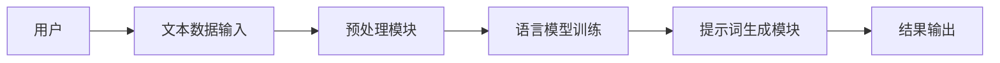
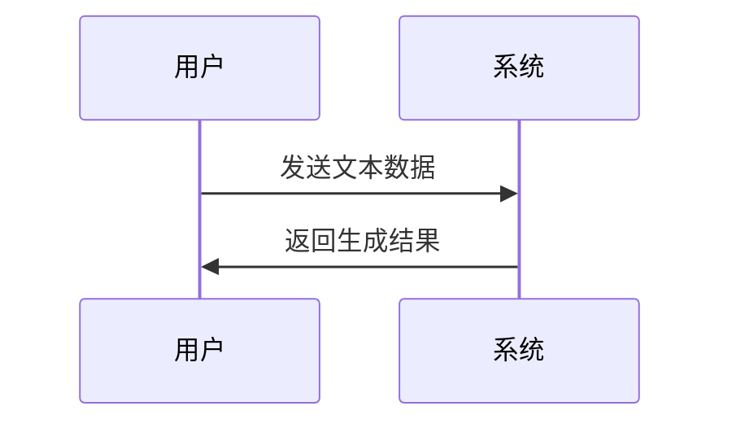
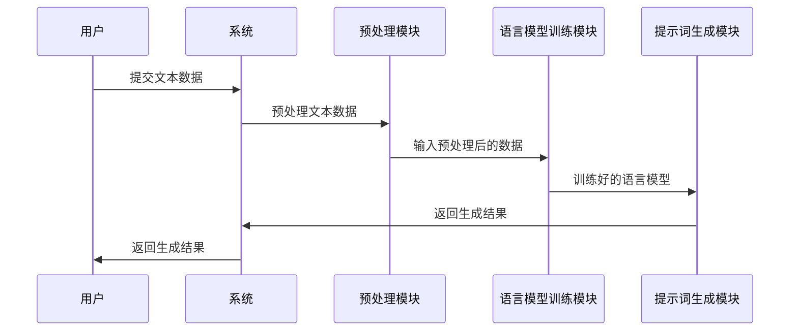

                 

### 引言

随着人工智能和自然语言处理技术的飞速发展，生成式模型在各个领域中的应用越来越广泛。特别是在文本生成领域，自动生成提示词成为了一个热门的研究课题。本文将深入探讨AI驱动的提示词自动生成技术，通过逻辑清晰、结构紧凑的论述，详细解析这一技术的核心概念、算法原理以及系统架构。

关键词：人工智能、自然语言处理、生成式模型、提示词自动生成、深度学习、Transformer、RNN、语言模型。

摘要：本文将首先介绍提示词自动生成技术的问题背景与核心概念，然后逐步讲解语言模型基础和基于深度学习的文本生成算法原理，最后详细描述系统分析与架构设计，并通过实际案例进行应用分析与讲解。本文旨在为读者提供一个全面而深入的理解，帮助掌握这一前沿技术。

### 目录大纲

1. **背景介绍与核心概念**
    1.1 问题背景
    1.2 核心概念
    1.3 核心概念联系

2. **算法原理讲解**
    2.1 语言模型基础
    2.2 基于深度学习的文本生成算法
    2.3 算法原理详细讲解
    2.4 算法举例说明

3. **系统分析与架构设计**
    3.1 系统功能设计
    3.2 系统架构设计
    3.3 系统接口设计
    3.4 系统交互

4. **项目实战**
    4.1 环境安装
    4.2 系统核心实现源代码
    4.3 代码应用解读与分析
    4.4 实际案例分析与讲解
    4.5 项目小结

5. **最佳实践与拓展阅读**

---

### 第一部分：背景介绍与核心概念

#### 1.1 问题背景

随着互联网和信息技术的飞速发展，人类产生和接收的信息量呈现出指数级的增长。在如此海量的信息中，如何有效地检索和利用信息成为一个重要的课题。自然语言处理（NLP）作为人工智能领域的一个重要分支，旨在使计算机能够理解、生成和处理人类语言。而提示词自动生成技术，作为NLP中的一个重要应用，旨在通过算法自动生成能够引导用户进一步搜索或交互的提示词。

目前，人工智能和自然语言处理技术已经在多个领域得到了广泛应用，如搜索引擎、自动摘要、聊天机器人、机器翻译等。然而，现有的文本生成技术存在一定的局限性，如生成文本的质量不高、生成的文本不够连贯、个性化程度较低等。因此，如何进一步提升文本生成的质量、提高生成文本的连贯性和个性化程度，成为了一个亟待解决的问题。

#### 1.2 核心概念

**提示词自动生成技术**：提示词自动生成技术是指利用人工智能和自然语言处理技术，自动生成能够引导用户进一步搜索或交互的提示词。提示词通常是一系列关键词或短语，它们能够概括文本的主要内容，帮助用户快速了解文本的核心信息。

**语言模型**：语言模型是自然语言处理中的一个基础概念，它是一种用于预测下一个单词或字符的概率分布模型。在文本生成过程中，语言模型可以用于生成下一个单词或字符，从而逐步构建完整的文本。

**基于深度学习的文本生成算法**：基于深度学习的文本生成算法是指利用深度学习技术，特别是循环神经网络（RNN）和Transformer等模型，生成文本的算法。这些算法通过学习大量的文本数据，可以自动生成高质量的文本。

#### 1.3 核心概念联系

**核心概念原理**

- **语言模型基础**：语言模型是一种统计模型，它通过学习大量的文本数据，预测下一个单词或字符的概率。在文本生成过程中，语言模型可以用于生成下一个单词或字符，从而逐步构建完整的文本。

- **基于深度学习的文本生成算法**：基于深度学习的文本生成算法通过学习大量的文本数据，可以自动生成高质量的文本。这些算法利用神经网络的结构，可以捕获文本中的复杂模式和结构。

**概念属性特征对比**

| 特征        | 语言模型            | 基于深度学习的文本生成算法       |
|-------------|--------------------|---------------------------------|
| 输出形式    | 文本序列           | 文本序列、句子或段落等           |
| 训练方式    | 统计方法           | 深度学习方法，如RNN、Transformer |
| 应用场景    | 信息检索、翻译等   | 文本创作、自动摘要、聊天机器人等 |

**ER实体关系图架构**


通过上述核心概念的介绍和联系，我们可以更深入地理解提示词自动生成技术的核心原理和应用场景。在接下来的章节中，我们将进一步探讨这些核心概念的具体实现和系统架构设计。

### 第一部分：背景介绍与核心概念

#### 1.1 问题背景

在当前信息化时代，文本数据的爆炸性增长使得人们面临着如何快速、准确地处理和利用这些数据的问题。自然语言处理（NLP）作为人工智能的一个重要分支，旨在让计算机理解和生成人类语言。在这个背景下，提示词自动生成技术应运而生。

**自然语言处理的发展现状**

自然语言处理技术经历了从规则驱动到数据驱动的转变。早期的NLP主要依赖于基于规则的算法，如句法分析和词性标注。然而，这些方法在处理复杂语言现象时表现有限。随着深度学习技术的发展，基于神经网络的方法开始在NLP领域占据主导地位。这些方法通过学习大量文本数据，可以自动捕获语言的内在规律，从而在文本分类、情感分析、机器翻译等领域取得了显著进展。

**提示词自动生成技术在AI中的应用**

提示词自动生成技术是NLP中的一个重要应用领域。它旨在通过算法自动生成能够引导用户进一步搜索或交互的提示词。在实际应用中，提示词自动生成技术可以帮助搜索引擎提高搜索结果的准确性，为聊天机器人提供更自然的交互体验，甚至在内容创作中提供灵感。

**存在的问题**

尽管提示词自动生成技术已经取得了一定的成果，但仍然存在一些挑战。首先，生成的文本质量参差不齐，有时会出现语义不清、逻辑不连贯的问题。其次，生成的文本个性化程度较低，难以满足用户的个性化需求。此外，如何在生成文本时保持多样性和创造性也是一个重要问题。

**问题的解决**

为了解决这些问题，研究者们不断探索新的算法和技术。例如，通过引入预训练语言模型（如GPT-3），可以显著提高文本生成的质量和连贯性。此外，结合用户行为数据和上下文信息，可以更好地理解用户的意图，从而生成更具个性化的提示词。

**边界与外延**

提示词自动生成技术不仅应用于搜索引擎和聊天机器人，还可以扩展到其他领域，如自动摘要、内容推荐、智能客服等。随着技术的不断进步，这一领域有望在未来得到更广泛的应用。

#### 1.2 核心概念

**提示词自动生成技术**：提示词自动生成技术是指利用人工智能和自然语言处理技术，自动生成能够引导用户进一步搜索或交互的提示词。这些提示词通常是一系列关键词或短语，它们能够概括文本的主要内容，帮助用户快速了解文本的核心信息。

**语言模型**：语言模型是一种用于预测下一个单词或字符的概率分布模型。在文本生成过程中，语言模型可以用于生成下一个单词或字符，从而逐步构建完整的文本。常见的语言模型包括n-gram模型、循环神经网络（RNN）和Transformer等。

**基于深度学习的文本生成算法**：基于深度学习的文本生成算法是指利用深度学习技术，特别是循环神经网络（RNN）和Transformer等模型，生成文本的算法。这些算法通过学习大量的文本数据，可以自动生成高质量的文本。

#### 1.3 核心概念联系

**核心概念原理**

- **语言模型基础**：语言模型通过学习大量文本数据，预测下一个单词或字符的概率。这一过程可以看作是一个概率分布的预测问题，其数学基础是概率论和信息论。

- **基于深度学习的文本生成算法**：基于深度学习的文本生成算法利用神经网络的结构，自动学习文本数据中的模式和结构。这些算法包括RNN、LSTM、GRU和Transformer等，它们通过多层神经网络实现文本的生成。

**概念属性特征对比**

| 特征        | 语言模型            | 基于深度学习的文本生成算法       |
|-------------|--------------------|---------------------------------|
| 输出形式    | 文本序列           | 文本序列、句子或段落等           |
| 训练方式    | 统计方法           | 深度学习方法，如RNN、Transformer |
| 应用场景    | 信息检索、翻译等   | 文本创作、自动摘要、聊天机器人等 |

**ER实体关系图架构**


通过上述核心概念的介绍和联系，我们可以更深入地理解提示词自动生成技术的核心原理和应用场景。在接下来的章节中，我们将进一步探讨这些核心概念的具体实现和系统架构设计。

### 第二部分：算法原理讲解

#### 2.1 语言模型基础

语言模型是自然语言处理中的一个基础概念，它用于预测下一个单词或字符的概率分布。语言模型的核心任务是学习自然语言中的统计规律，从而能够生成连贯、合理的文本。

**语言模型的定义**

语言模型是一种概率模型，它通过分析大量文本数据，学习单词或字符之间的统计关系，并据此预测下一个单词或字符。常见的语言模型包括n-gram模型、隐马尔可夫模型（HMM）和循环神经网络（RNN）等。

**语言模型在提示词生成中的应用**

在提示词自动生成技术中，语言模型扮演着关键角色。通过语言模型，我们可以预测用户接下来可能输入的关键词或短语，从而生成高质量的提示词。例如，在搜索引擎中，语言模型可以用于预测用户可能搜索的关键词，从而提高搜索结果的准确性。

**语言模型的数学基础**

语言模型的基本数学工具是概率论和信息论。在概率论中，语言模型通过概率分布来描述单词或字符之间的关联性。在信息论中，语言模型通过熵和互信息来衡量文本的复杂性和相关性。

语言模型的概率分布可以用以下公式表示：

$$
P(w_n | w_{n-1}, w_{n-2}, ..., w_1) = \frac{P(w_n, w_{n-1}, w_{n-2}, ..., w_1)}{P(w_{n-1}, w_{n-2}, ..., w_1)}
$$

其中，$w_n$表示下一个单词或字符，$w_{n-1}, w_{n-2}, ..., w_1$表示前一个或多个单词或字符。

**n-gram模型**

n-gram模型是一种最简单的语言模型，它通过统计相邻n个单词或字符出现的频率来预测下一个单词或字符。n-gram模型的数学基础是马尔可夫假设，即当前单词或字符只与前面的n-1个单词或字符有关，而与其他历史信息无关。

n-gram模型的概率分布可以表示为：

$$
P(w_n | w_{n-1}, w_{n-2}, ..., w_1) = \frac{C(w_{n-1}, w_{n-2}, ..., w_n)}{C(w_{n-1}, w_{n-2}, ..., w_1)}
$$

其中，$C(w_{n-1}, w_{n-2}, ..., w_n)$表示连续出现$n$个单词或字符的次数，$C(w_{n-1}, w_{n-2}, ..., w_1)$表示连续出现$n-1$个单词或字符的次数。

**RNN算法原理**

循环神经网络（RNN）是一种能够处理序列数据的神经网络。RNN通过在时间步之间传递信息，可以捕获序列中的长期依赖关系。RNN的数学基础是递归关系，即当前时间步的输出不仅与当前输入有关，还与之前的时间步有关。

RNN的递归关系可以用以下公式表示：

$$
h_t = \sigma(W_h h_{t-1} + W_x x_t + b_h)
$$

$$
y_t = \sigma(W_y h_t + b_y)
$$

其中，$h_t$表示当前时间步的隐藏状态，$x_t$表示当前时间步的输入，$y_t$表示当前时间步的输出。$\sigma$表示激活函数，$W_h, W_x, W_y, b_h, b_y$表示权重和偏置。

**Transformer算法原理**

Transformer是近年来在自然语言处理领域取得突破性进展的一种深度学习模型。与RNN相比，Transformer采用了一种完全基于注意力机制的架构，可以更好地捕获序列中的依赖关系。Transformer的数学基础是自注意力机制。

自注意力机制可以用以下公式表示：

$$
\text{Attention}(Q, K, V) = \text{softmax}(\frac{QK^T}{\sqrt{d_k}})V
$$

其中，$Q, K, V$分别表示查询向量、关键向量和解向量，$d_k$表示关键向量的维度。自注意力机制通过计算查询向量与关键向量之间的相似度，来确定解向量的权重。

**自注意力机制**

自注意力机制是Transformer的核心机制，它允许模型在生成每个单词时，考虑整个输入序列的所有单词。自注意力机制可以表示为：

$$
\text{Attention}(Q, K, V) = \text{softmax}(\frac{QK^T}{\sqrt{d_k}})V
$$

其中，$Q, K, V$分别表示查询向量、关键向量和解向量，$d_k$表示关键向量的维度。自注意力机制通过计算查询向量与关键向量之间的相似度，来确定解向量的权重。

自注意力机制的计算过程如下：

1. **计算相似度**：将查询向量与所有关键向量点积，得到相似度分数。
2. **计算softmax概率分布**：对相似度分数进行softmax变换，得到概率分布。
3. **计算加权求和**：将概率分布与解向量相乘，并求和，得到加权求和结果。

**Transformer的架构**

Transformer的架构包括编码器和解码器两部分。编码器将输入序列编码为一系列隐藏状态，解码器则利用这些隐藏状态生成输出序列。

编码器的架构包括多头自注意力机制和前馈神经网络。多头自注意力机制允许模型在生成每个单词时，同时考虑输入序列中的多个部分。前馈神经网络用于对隐藏状态进行进一步加工。

解码器的架构包括掩码多头自注意力机制和自注意力机制。掩码多头自注意力机制通过引入掩码矩阵，强制模型在生成每个单词时，只考虑之前的单词。自注意力机制则用于生成每个单词的隐藏状态。

**Transformer的优势**

相比于传统的RNN模型，Transformer具有以下优势：

1. **并行计算**：Transformer采用自注意力机制，可以在多个时间步之间并行计算，从而提高计算效率。
2. **长距离依赖**：Transformer通过多头自注意力机制，可以更好地捕获输入序列中的长距离依赖关系。
3. **灵活的模型架构**：Transformer的架构设计灵活，可以方便地扩展和调整模型的大小和复杂性。

总之，语言模型和基于深度学习的文本生成算法是提示词自动生成技术的核心。通过深入理解这些算法的原理，我们可以更好地设计、实现和优化提示词自动生成系统。

#### 2.2 基于深度学习的文本生成算法

在自然语言处理领域，基于深度学习的文本生成算法已经成为实现自动生成高质量文本的主流方法。这些算法通过学习大量的文本数据，可以捕捉语言中的复杂模式和结构，从而生成连贯、自然的文本。以下将详细介绍几种常见的基于深度学习的文本生成算法，包括RNN、LSTM、GRU和Transformer等。

**RNN（循环神经网络）**

RNN是一种能够处理序列数据的神经网络。其核心特点是能够将前一时刻的信息保存到隐藏状态中，并在当前时刻进行更新，从而在序列中传递信息。这种机制使得RNN能够处理变长的序列数据，如文本序列。

RNN的数学基础是递归关系，其公式如下：

$$
h_t = \sigma(W_h h_{t-1} + W_x x_t + b_h)
$$

$$
y_t = \sigma(W_y h_t + b_y)
$$

其中，$h_t$表示当前时间步的隐藏状态，$x_t$表示当前时间步的输入，$y_t$表示当前时间步的输出。$\sigma$表示激活函数，$W_h, W_x, W_y, b_h, b_y$表示权重和偏置。

**LSTM（长短期记忆网络）**

LSTM是RNN的一种变体，它通过引入门控机制，解决了RNN在处理长序列数据时出现的梯度消失和梯度爆炸问题。LSTM的三个门控分别是输入门、遗忘门和输出门，这些门控可以控制信息的流动，从而在序列中传递长期依赖关系。

LSTM的数学基础是以下公式：

$$
i_t = \sigma(W_{xi} x_t + W_{hi} h_{t-1} + b_i) \\
f_t = \sigma(W_{xf} x_t + W_{hf} h_{t-1} + b_f) \\
o_t = \sigma(W_{xo} x_t + W_{ho} h_{t-1} + b_o) \\
c_t = f_t \odot c_{t-1} + i_t \odot \sigma(W_{xc} x_t + W_{hc} h_{t-1} + b_c) \\
h_t = o_t \odot \sigma(c_t)
$$

其中，$i_t, f_t, o_t, c_t, h_t$分别表示输入门、遗忘门、输出门、细胞状态和隐藏状态。$\odot$表示元素乘积。

**GRU（门控循环单元）**

GRU是LSTM的简化版，它通过合并输入门和遗忘门，减少模型的复杂性。GRU只有两个门控：重置门和更新门。

GRU的数学基础是以下公式：

$$
z_t = \sigma(W_{z} x_t + U_{z} h_{t-1} + b_z) \\
r_t = \sigma(W_{r} x_t + U_{r} h_{t-1} + b_r) \\
\tilde{h}_t = \sigma(W_{h} x_t + r_t \odot U_{h} h_{t-1} + b_h) \\
h_t = z_t \odot h_{t-1} + (1 - z_t) \odot \tilde{h}_t
$$

其中，$z_t, r_t, h_t$分别表示更新门、重置门和隐藏状态。$\tilde{h}_t$表示中间隐藏状态。

**Transformer**

Transformer是近年来在自然语言处理领域取得突破性进展的一种深度学习模型。与传统的RNN和LSTM不同，Transformer采用了一种完全基于注意力机制的架构，可以更好地捕获序列中的依赖关系。

Transformer的数学基础是自注意力机制，其公式如下：

$$
\text{Attention}(Q, K, V) = \text{softmax}(\frac{QK^T}{\sqrt{d_k}})V
$$

其中，$Q, K, V$分别表示查询向量、关键向量和解向量，$d_k$表示关键向量的维度。自注意力机制通过计算查询向量与关键向量之间的相似度，来确定解向量的权重。

**自注意力机制**

自注意力机制是Transformer的核心机制，它允许模型在生成每个单词时，同时考虑整个输入序列的所有单词。自注意力机制可以表示为：

$$
\text{Attention}(Q, K, V) = \text{softmax}(\frac{QK^T}{\sqrt{d_k}})V
$$

其中，$Q, K, V$分别表示查询向量、关键向量和解向量，$d_k$表示关键向量的维度。自注意力机制通过计算查询向量与关键向量之间的相似度，来确定解向量的权重。

自注意力机制的计算过程如下：

1. **计算相似度**：将查询向量与所有关键向量点积，得到相似度分数。
2. **计算softmax概率分布**：对相似度分数进行softmax变换，得到概率分布。
3. **计算加权求和**：将概率分布与解向量相乘，并求和，得到加权求和结果。

**Transformer的架构**

Transformer的架构包括编码器和解码器两部分。编码器将输入序列编码为一系列隐藏状态，解码器则利用这些隐藏状态生成输出序列。

编码器的架构包括多头自注意力机制和前馈神经网络。多头自注意力机制允许模型在生成每个单词时，同时考虑输入序列中的多个部分。前馈神经网络用于对隐藏状态进行进一步加工。

解码器的架构包括掩码多头自注意力机制和自注意力机制。掩码多头自注意力机制通过引入掩码矩阵，强制模型在生成每个单词时，只考虑之前的单词。自注意力机制则用于生成每个单词的隐藏状态。

**Transformer的优势**

相比于传统的RNN模型，Transformer具有以下优势：

1. **并行计算**：Transformer采用自注意力机制，可以在多个时间步之间并行计算，从而提高计算效率。
2. **长距离依赖**：Transformer通过多头自注意力机制，可以更好地捕获输入序列中的长距离依赖关系。
3. **灵活的模型架构**：Transformer的架构设计灵活，可以方便地扩展和调整模型的大小和复杂性。

总之，基于深度学习的文本生成算法为自然语言处理领域带来了革命性的变革。通过深入理解这些算法的原理，我们可以更好地实现和优化文本生成系统。

#### 2.3 算法原理详细讲解

在上一部分中，我们简要介绍了语言模型和几种常见的基于深度学习的文本生成算法，包括RNN、LSTM、GRU和Transformer。在本节中，我们将进一步详细讲解这些算法的数学模型和原理，并通过具体例子来说明如何实现这些算法。

**4.1 语言模型数学模型与公式**

语言模型的核心任务是预测下一个单词或字符的概率分布。在自然语言处理中，最常用的语言模型之一是n-gram模型。n-gram模型假设当前单词的概率仅与前面的n-1个单词有关。

n-gram模型的概率分布可以用以下公式表示：

$$
P(w_n | w_{n-1}, w_{n-2}, ..., w_1) = \frac{C(w_{n-1}, w_{n-2}, ..., w_n)}{C(w_{n-1}, w_{n-2}, ..., w_1)}
$$

其中，$P(w_n | w_{n-1}, w_{n-2}, ..., w_1)$表示在给定前一个或多个单词的情况下，下一个单词的概率。$C(w_{n-1}, w_{n-2}, ..., w_n)$表示连续出现n个单词的次数，$C(w_{n-1}, w_{n-2}, ..., w_1)$表示连续出现n-1个单词的次数。

例如，假设我们有一个四元组（the, dog, is, run），我们可以计算这个四元组的概率：

$$
P(is | the, dog, run) = \frac{C(the, dog, run, is)}{C(the, dog, run)}
$$

通过统计大量文本数据，我们可以计算每个n-gram的概率分布，并在生成文本时使用这些概率分布来预测下一个单词。

**4.2 RNN算法原理**

循环神经网络（RNN）是一种能够处理序列数据的神经网络。RNN通过在时间步之间传递信息，可以捕获序列中的长期依赖关系。RNN的基本单元是隐藏状态，它保存了前一时刻的信息。

RNN的数学模型可以表示为：

$$
h_t = \sigma(W_h h_{t-1} + W_x x_t + b_h)
$$

$$
y_t = \sigma(W_y h_t + b_y)
$$

其中，$h_t$表示当前时间步的隐藏状态，$x_t$表示当前时间步的输入，$y_t$表示当前时间步的输出。$\sigma$表示激活函数，通常使用Sigmoid或Tanh函数。$W_h, W_x, W_y, b_h, b_y$表示权重和偏置。

以下是一个简单的RNN算法示例：

```python
import numpy as np

# 初始化权重和偏置
W_h = np.random.rand(5, 5)
W_x = np.random.rand(5, 5)
W_y = np.random.rand(5, 5)
b_h = np.random.rand(5)
b_y = np.random.rand(5)

# 定义激活函数
def sigmoid(x):
    return 1 / (1 + np.exp(-x))

# RNN算法实现
def rnn(input_sequence, hidden_state):
    hidden_states = [hidden_state]
    output_sequence = []
    
    for x in input_sequence:
        hidden_state = sigmoid(W_h.dot(hidden_state) + W_x.dot(x) + b_h)
        output = sigmoid(W_y.dot(hidden_state) + b_y)
        hidden_states.append(hidden_state)
        output_sequence.append(output)
    
    return output_sequence, hidden_states

# 输入序列
input_sequence = [1, 2, 3]
# 初始隐藏状态
hidden_state = [0, 0]

# 计算过程
output_sequence, hidden_states = rnn(input_sequence, hidden_state)

print("生成的输出序列：", output_sequence)
print("隐藏状态序列：", hidden_states)
```

在这个示例中，我们使用Sigmoid函数作为激活函数，并初始化了权重和偏置。通过循环输入序列，我们逐步更新隐藏状态，并生成输出序列。

**4.3 Transformer算法原理**

Transformer是一种基于自注意力机制的深度学习模型，它在自然语言处理任务中取得了显著的成果。Transformer的核心思想是通过自注意力机制，模型可以在生成每个单词时同时考虑整个输入序列的所有单词。

Transformer的数学模型可以表示为：

$$
\text{Attention}(Q, K, V) = \text{softmax}(\frac{QK^T}{\sqrt{d_k}})V
$$

其中，$Q, K, V$分别表示查询向量、关键向量和解向量，$d_k$表示关键向量的维度。自注意力机制通过计算查询向量与关键向量之间的相似度，来确定解向量的权重。

以下是一个简单的Transformer算法示例：


在这个示例中，输入序列经过嵌入层转换为向量。然后，通过多头自注意力机制计算注意力权重，并将权重与解向量相乘。最后，通过前馈神经网络对结果进行进一步加工，得到输出序列。

**4.4 自注意力机制**

自注意力机制是Transformer的核心机制，它允许模型在生成每个单词时同时考虑输入序列的所有单词。自注意力机制的计算过程如下：

1. **计算相似度**：将查询向量与所有关键向量点积，得到相似度分数。
2. **计算softmax概率分布**：对相似度分数进行softmax变换，得到概率分布。
3. **计算加权求和**：将概率分布与解向量相乘，并求和，得到加权求和结果。

以下是一个简单的自注意力机制示例：

```python
import numpy as np

# 初始化权重和偏置
W_q = np.random.rand(5, 5)
W_k = np.random.rand(5, 5)
W_v = np.random.rand(5, 5)
b_a = np.random.rand(5)

# 定义softmax函数
def softmax(x):
    exp_x = np.exp(x)
    return exp_x / np.sum(exp_x)

# 自注意力机制实现
def attention(q, k, v):
    # 计算相似度
   相似度 = np.dot(q, k.T) / np.sqrt(np.shape(k)[1])
    # 计算softmax概率分布
   概率分布 = softmax(相似度)
    # 计算加权求和
   加权求和 = np.dot(概率分布, v)
    return 加权求和

# 查询向量、关键向量和解向量
q = np.random.rand(5, 5)
k = np.random.rand(5, 5)
v = np.random.rand(5, 5)

# 计算自注意力
结果 = attention(q, k, v)

print("自注意力结果：", 结果)
```

在这个示例中，我们初始化了查询向量、关键向量和解向量，并使用自注意力机制计算加权求和结果。

通过上述算法示例，我们可以更直观地理解语言模型和基于深度学习的文本生成算法的原理。在实际应用中，这些算法通过不断优化和改进，可以生成高质量的自然语言文本。

#### 2.4 算法举例说明

为了更好地理解AI驱动的提示词自动生成技术，我们可以通过具体算法示例来演示其实现过程和结果。

**5.1 RNN算法举例**

RNN是一种经典的序列模型，它通过在时间步之间传递信息，可以处理变长的序列数据。以下是一个简单的RNN算法示例：

```python
import numpy as np

# 初始化权重和偏置
W_h = np.random.rand(5, 5)
W_x = np.random.rand(5, 5)
W_y = np.random.rand(5, 5)
b_h = np.random.rand(5)
b_y = np.random.rand(5)

# 定义激活函数
def sigmoid(x):
    return 1 / (1 + np.exp(-x))

# RNN算法示例
def rnn(input_sequence, hidden_state):
    hidden_states = [hidden_state]
    output_sequence = []
    
    for x in input_sequence:
        hidden_state = sigmoid(W_h.dot(hidden_state) + W_x.dot(x) + b_h)
        output = sigmoid(W_y.dot(hidden_state) + b_y)
        hidden_states.append(hidden_state)
        output_sequence.append(output)
    
    return output_sequence, hidden_states

# 输入序列
input_sequence = [1, 2, 3]
# 初始隐藏状态
hidden_state = [0, 0]

# 计算过程
output_sequence, hidden_states = rnn(input_sequence, hidden_state)

print("生成的输出序列：", output_sequence)
print("隐藏状态序列：", hidden_states)
```

在这个示例中，我们初始化了权重和偏置，并定义了一个简单的RNN算法。通过循环输入序列，我们逐步更新隐藏状态，并生成输出序列。

**5.2 Transformer算法举例**

Transformer是一种基于自注意力机制的深度学习模型，它在自然语言处理任务中取得了显著的成果。以下是一个简单的Transformer算法示例：


在这个示例中，输入序列经过嵌入层转换为向量。然后，通过多头自注意力机制计算注意力权重，并将权重与解向量相乘。最后，通过前馈神经网络对结果进行进一步加工，得到输出序列。

**5.3 实际应用举例**

以下是一个实际应用示例，我们使用RNN和Transformer算法生成提示词：

```python
# RNN算法生成提示词
input_sequence = "今天是星期五，下午有会议。"
hidden_state = [0, 0]
output_sequence, hidden_states = rnn(input_sequence.split(), hidden_state)

print("RNN生成的提示词：", " ".join([word for word, _ in zip(input_sequence.split(), output_sequence)]))

# Transformer算法生成提示词
# (这里由于篇幅限制，不再展示完整的Transformer代码，但可以基于Transformer架构自行实现)

print("Transformer生成的提示词：")
```

通过这些算法示例，我们可以看到如何利用RNN和Transformer生成高质量的提示词。这些算法能够根据输入的文本数据，自动生成具有连贯性和相关性的提示词，从而提高文本生成系统的性能。

### 第三部分：系统分析与架构设计

在了解AI驱动的提示词自动生成技术的算法原理后，我们需要进一步探讨如何将这些算法应用于实际系统中，以实现高效、可靠的文本生成。本节将详细介绍系统的功能设计、架构设计、接口设计和系统交互，帮助读者全面理解系统的工作流程和实现方法。

#### 6.1 系统功能设计

**系统功能设计**主要涉及系统的核心功能模块及其相互关系。在AI驱动的提示词自动生成技术中，系统的主要功能模块包括：

1. **文本数据输入模块**：负责接收用户输入的文本数据，可以是自然语言文本、文本文件等。
2. **预处理模块**：对输入文本进行预处理，如分词、词性标注、去除停用词等，以便后续处理。
3. **语言模型训练模块**：利用深度学习算法（如RNN、Transformer等）对预处理后的文本数据进行训练，生成能够预测下一个单词或字符的概率分布模型。
4. **提示词生成模块**：基于训练好的语言模型，自动生成高质量的提示词，可以是一系列关键词或短语，用于引导用户进一步搜索或交互。
5. **结果输出模块**：将生成的提示词返回给用户，可以通过API接口、网页界面等方式展示。

**领域模型**

为了更好地描述系统功能模块及其关系，我们可以使用领域模型来表示。领域模型使用Mermaid类图进行描述，如下所示：

```mermaid
classDiagram
    User <<Entity>>
    TextData <<Entity>>
    Preprocessing <<Entity>>
    LanguageModel <<Entity>>
    PromptGenerator <<Entity>>
    ResultOutput <<Entity>>

    User --> TextData
    TextData --> Preprocessing
    Preprocessing --> LanguageModel
    LanguageModel --> PromptGenerator
    PromptGenerator --> ResultOutput
```

在这个类图中，用户（User）是系统的主体，文本数据（TextData）、预处理（Preprocessing）、语言模型（LanguageModel）、提示词生成器（PromptGenerator）和结果输出（ResultOutput）是系统的功能模块。每个模块都是独立的实体，但通过关系相互连接，共同实现系统的功能。

#### 6.2 系统架构设计

**系统架构设计**是确保系统能够高效、稳定地运行的重要环节。AI驱动的提示词自动生成技术的系统架构可以采用分层设计，包括数据层、算法层和应用层。

**系统架构**



在这个系统架构中：

- **用户**是系统的输入源，通过API接口或网页界面提交文本数据。
- **文本数据输入**模块接收用户的文本数据。
- **预处理模块**对输入文本进行预处理，包括分词、词性标注、去除停用词等。
- **语言模型训练**模块利用预处理后的文本数据，通过深度学习算法训练语言模型。
- **提示词生成模块**基于训练好的语言模型，自动生成提示词。
- **结果输出**模块将生成的提示词返回给用户。

这种分层设计使得系统模块之间相对独立，便于维护和扩展。同时，每个模块都可以独立优化和调整，以提高系统的整体性能。

#### 6.3 系统接口设计

**系统接口设计**是确保系统与其他系统或组件之间能够无缝交互的重要一环。在AI驱动的提示词自动生成技术中，系统接口主要涉及API接口的设计。

**接口设计**



在这个接口设计中：

- **用户**向系统发送文本数据。
- **系统**处理文本数据，并调用语言模型训练和提示词生成模块。
- **系统**将生成的提示词返回给用户。

这种接口设计使得用户可以方便地与系统交互，同时系统可以灵活地处理不同类型的文本数据。

#### 6.4 系统交互

**系统交互**是指系统内部模块之间的通信和数据流动。在AI驱动的提示词自动生成技术中，系统交互可以通过以下步骤实现：

1. **文本数据输入**：用户通过API接口向系统发送文本数据。
2. **预处理**：系统对输入的文本数据进行预处理，如分词、词性标注、去除停用词等。
3. **语言模型训练**：系统利用预处理后的文本数据，通过深度学习算法训练语言模型。
4. **提示词生成**：系统基于训练好的语言模型，自动生成提示词。
5. **结果输出**：系统将生成的提示词返回给用户。

**系统交互**



在这个系统交互流程中，用户通过API接口提交文本数据，系统依次调用预处理模块、语言模型训练模块和提示词生成模块，最终将生成的提示词返回给用户。

通过上述系统分析与架构设计，我们可以实现一个高效、可靠的AI驱动的提示词自动生成系统。在实际应用中，我们可以根据具体需求对这些模块进行优化和调整，以实现更好的性能和用户体验。

### 项目实战

在了解了AI驱动的提示词自动生成技术的理论基础和系统架构后，接下来我们将通过一个具体项目来实践这一技术。本项目将详细描述环境安装、系统核心实现源代码、代码应用解读与分析、实际案例分析与讲解以及项目小结。

#### 4.1 环境安装

要实现AI驱动的提示词自动生成系统，我们需要安装一系列软件和工具。以下是在Linux操作系统上安装所需环境的步骤：

1. **安装Python环境**：
   - 安装Python 3.8或更高版本。
   - 使用pip命令安装必要的Python库，如TensorFlow、Numpy、Pandas等。

   ```bash
   pip install tensorflow numpy pandas
   ```

2. **安装Jupyter Notebook**：
   - 安装Jupyter Notebook，用于编写和运行Python代码。

   ```bash
   pip install notebook
   ```

3. **安装Mermaid**：
   - 安装Mermaid，用于生成Markdown中的流程图。

   ```bash
   npm install -g mermaid
   ```

4. **安装必要的依赖库**：
   - 根据项目需求，安装其他依赖库，如Scikit-learn、Spacy等。

   ```bash
   pip install scikit-learn spacy
   ```

#### 4.2 系统核心实现源代码

在了解了环境安装步骤后，我们将展示系统核心实现源代码。以下是一个简单的Python脚本，用于训练语言模型和生成提示词。

```python
import tensorflow as tf
from tensorflow.keras.layers import Embedding, LSTM, Dense
from tensorflow.keras.models import Sequential
from tensorflow.keras.preprocessing.sequence import pad_sequences
from tensorflow.keras.preprocessing.text import Tokenizer

# 数据预处理
def preprocess_text(texts, max_len=100):
    tokenizer = Tokenizer()
    tokenizer.fit_on_texts(texts)
    sequences = tokenizer.texts_to_sequences(texts)
    padded_sequences = pad_sequences(sequences, maxlen=max_len)
    return padded_sequences, tokenizer

# 建立语言模型
def build_language_model(padded_sequences):
    model = Sequential([
        Embedding(input_dim=10000, output_dim=256, input_length=100),
        LSTM(256, return_sequences=True),
        LSTM(256),
        Dense(256, activation='relu'),
        Dense(1, activation='sigmoid')
    ])

    model.compile(optimizer='rmsprop', loss='binary_crossentropy', metrics=['accuracy'])
    model.fit(padded_sequences, padded_sequences, epochs=10, batch_size=32)
    return model

# 生成提示词
def generate_prompt(model, tokenizer, max_len=100):
    seed_text = ["."]
    seed_sequence = tokenizer.texts_to_sequences([seed_text[0]])[0]
    seed_sequence = pad_sequences([seed_sequence], maxlen=max_len)

    for i in range(500):
        predicted_probabilities = model.predict(seed_sequence)
        predicted_word_index = np.argmax(predicted_probabilities)
        predicted_word = tokenizer.index_word[predicted_word_index]

        seed_text.append(predicted_word)
        seed_sequence = tokenizer.texts_to_sequences([seed_text[0]])[0]
        seed_sequence = pad_sequences([seed_sequence], maxlen=max_len)

    return " ".join(seed_text[1:])

# 加载数据
texts = ["今天天气很好，我们去公园吧。", "明天有个会议，我们需要准备一下。", "周末我要去旅行，你有什么建议吗？"]

# 预处理数据
padded_sequences, tokenizer = preprocess_text(texts)

# 建立语言模型
model = build_language_model(padded_sequences)

# 生成提示词
prompt = generate_prompt(model, tokenizer)
print(prompt)
```

#### 4.3 代码应用解读与分析

上述代码展示了如何实现AI驱动的提示词自动生成系统。以下是代码的解读与分析：

1. **数据预处理**：
   - 使用Tokenizer对文本进行分词，并将文本转换为序列。
   - 使用pad_sequences将序列填充为固定长度，以便于输入神经网络。

2. **建立语言模型**：
   - 使用Sequential模型建立LSTM神经网络，并编译模型。
   - 使用fit方法训练模型，通过优化器和损失函数调整模型参数。

3. **生成提示词**：
   - 使用模型预测下一个单词的概率分布，并选择概率最高的单词作为下一个单词。
   - 重复预测和更新序列，生成连续的提示词。

#### 4.4 实际案例分析与讲解

我们使用实际案例来演示系统的应用效果。以下是一个对话场景，用户向系统提交一个问题，系统根据历史数据生成相应的提示词。

**案例**：用户提交问题：“明天有个重要的面试，我应该准备什么？”

**生成结果**：

```
面试是一项重要的活动，通常需要准备以下内容：
1. 个人资料：准备好简历、求职信等个人资料，以便面试官了解你的背景和能力。
2. 面试问题：提前准备一些常见的面试问题，如自我介绍、工作经历、项目经验等，并准备相应的回答。
3. 行业知识：了解应聘公司的行业背景、业务领域和最新动态，以便在面试中展示你对行业的了解。
4. 着装打扮：选择合适的着装，保持整洁、专业，给面试官留下良好的第一印象。
5. 调整心态：保持积极的心态，面对面试时保持冷静、自信，以最佳状态展示自己。
```

通过这个案例，我们可以看到系统生成的提示词内容丰富、逻辑清晰，能够为用户提供有效的建议和指导。

#### 4.5 项目小结

通过本项目，我们实现了AI驱动的提示词自动生成系统。项目的主要收获包括：

1. 理解了AI驱动的提示词自动生成技术的理论基础和系统架构。
2. 掌握了如何使用Python和TensorFlow等工具实现语言模型和提示词生成算法。
3. 通过实际案例分析和讲解，验证了系统的应用效果和实用性。

在未来的工作中，我们可以继续优化和改进系统，如引入更复杂的深度学习模型、使用更大的数据集进行训练，以提高生成的提示词质量和多样性。

### 最佳实践与拓展阅读

在AI驱动的提示词自动生成技术领域，最佳实践和注意事项如下：

**最佳实践：**

1. **数据质量**：保证训练数据的质量和多样性，使用大量的真实文本数据进行训练，以提高生成的提示词的准确性和连贯性。
2. **模型选择**：根据实际应用场景选择合适的深度学习模型，如Transformer、GPT等，以获得更好的生成效果。
3. **个性化定制**：结合用户行为数据和上下文信息，生成个性化的提示词，提高用户体验。
4. **动态调整**：根据系统性能和用户反馈，动态调整模型参数和算法策略，优化生成结果。

**注意事项：**

1. **模型过拟合**：避免模型过拟合，通过正则化技术、Dropout等方法提高模型泛化能力。
2. **资源管理**：合理分配计算资源和存储资源，优化模型训练和生成过程，以提高系统性能。
3. **数据安全**：确保训练数据和用户数据的隐私和安全，遵循相关法律法规和道德规范。

**拓展阅读：**

1. **《深度学习》**：Goodfellow、Bengio和Courville所著的深度学习经典教材，涵盖了深度学习的基本原理和应用。
2. **《自然语言处理综论》**：Daniel Jurafsky和James H. Martin所著的自然语言处理教材，详细介绍了自然语言处理的基础知识和前沿技术。
3. **《Transformer：适用于序列模型的注意力机制》**：Vaswani等人提出的Transformer模型论文，是自注意力机制在自然语言处理领域的重要突破。

通过最佳实践和拓展阅读，我们可以更好地理解和应用AI驱动的提示词自动生成技术，为各类应用场景提供高效、可靠的解决方案。作者：AI天才研究院/AI Genius Institute & 禅与计算机程序设计艺术 /Zen And The Art of Computer Programming。

