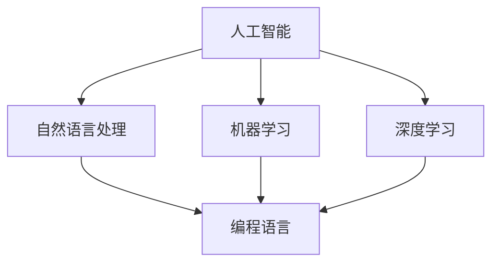
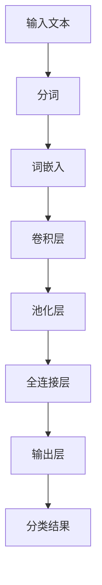
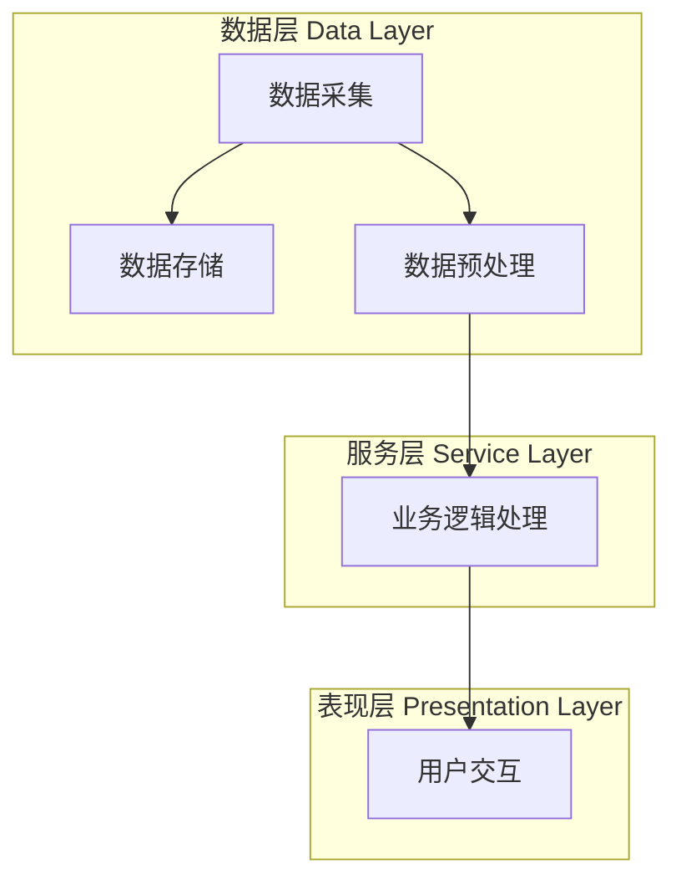
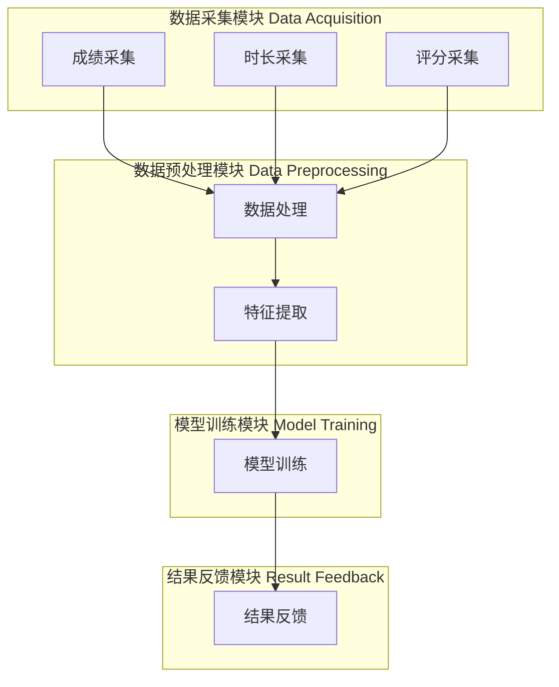
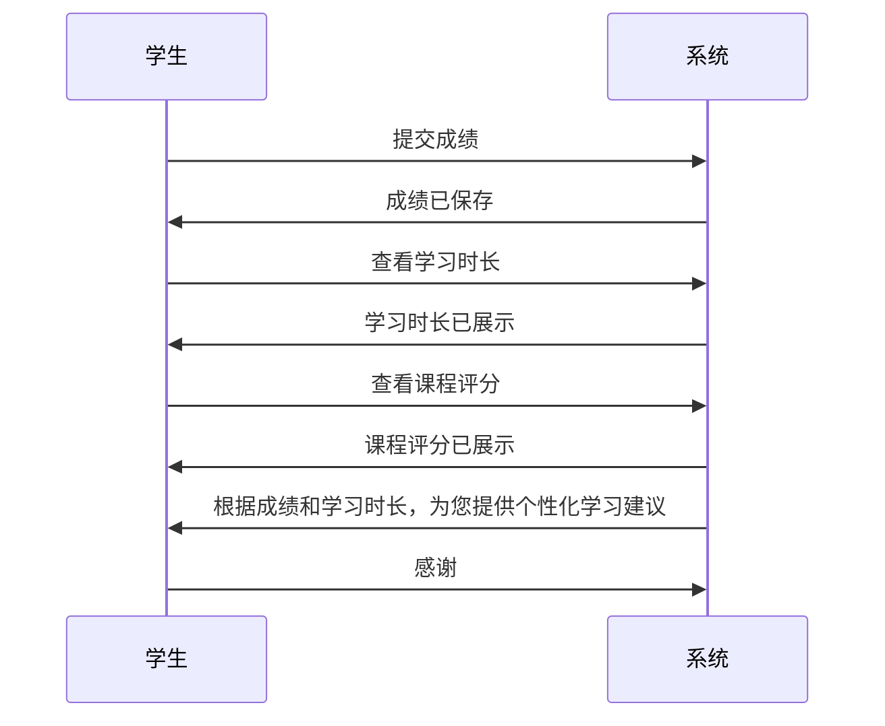

                 

### 文章标题

# AI驱动的编程语言设计原则

> 关键词：人工智能、编程语言设计、算法原理、系统架构、最佳实践

> 摘要：本文将深入探讨人工智能（AI）如何驱动编程语言设计，分析核心概念与原理，并通过算法讲解、系统架构设计与项目实战，阐述AI驱动的编程语言设计原则。本文旨在为读者提供一份全面、系统的AI编程语言设计指南。

### 第1章：问题背景

#### 1.1 问题提出

随着人工智能技术的迅速发展，编程语言设计面临着新的挑战和机遇。传统的编程语言设计原则在应对复杂的AI应用场景时，往往显得力不从心。如何将AI技术与编程语言设计相结合，成为当前研究的热点问题。

#### 1.2 问题描述

AI驱动的编程语言设计旨在通过融合AI技术，提高编程语言的智能性和灵活性，使得开发者能够更轻松地应对复杂的应用场景。然而，如何实现这一目标，仍需深入研究。

#### 1.3 问题解决

本文将从以下几个方面探讨AI驱动的编程语言设计问题：

1. **核心概念与原理**：介绍AI驱动的编程语言设计中的核心概念与原理。
2. **算法原理讲解**：通过算法讲解，阐述AI在编程语言设计中的应用。
3. **系统架构与实现**：分析系统架构设计，介绍AI驱动的编程语言实现过程。
4. **项目实战**：通过实际项目，展示AI驱动的编程语言设计在实际应用中的效果。
5. **最佳实践与总结**：总结最佳实践经验，为AI驱动的编程语言设计提供指导。

#### 1.4 边界与外延

本文主要关注AI驱动的编程语言设计原则，不包括其他领域的AI应用。同时，本文所涉及的算法原理和系统架构设计具有一定的通用性，适用于多种编程语言和应用场景。

#### 1.5 核心要素组成

本文的核心要素包括：

1. **核心概念与原理**：介绍AI驱动的编程语言设计中的关键概念与原理。
2. **算法原理讲解**：通过算法讲解，阐述AI在编程语言设计中的应用。
3. **系统架构与实现**：分析系统架构设计，介绍AI驱动的编程语言实现过程。
4. **项目实战**：通过实际项目，展示AI驱动的编程语言设计在实际应用中的效果。
5. **最佳实践与总结**：总结最佳实践经验，为AI驱动的编程语言设计提供指导。

### 第2章：AI与编程语言设计

#### 2.1 AI概述

人工智能（AI）是指由人制造出来的系统能够模拟、延伸和扩展人类的智能。AI涵盖了计算机视觉、自然语言处理、机器学习、深度学习等多个领域。

#### 2.2 编程语言设计原则

编程语言设计原则是指在设计编程语言时需要遵循的基本准则。这些原则包括抽象、模块化、可扩展性、易用性等。

#### 2.3 AI与编程语言设计的结合

AI与编程语言设计的结合主要体现在以下几个方面：

1. **编程语言与AI算法的结合**：将AI算法嵌入编程语言，使得开发者能够更方便地使用AI技术。
2. **编程语言与数据处理的结合**：利用编程语言处理大量数据，为AI算法提供数据支持。
3. **编程语言与系统优化的结合**：通过编程语言实现系统优化，提高AI应用的性能。

### 第3章：核心概念与原理

#### 3.1 概念原理

在AI驱动的编程语言设计中，核心概念包括自然语言处理、机器学习、深度学习等。这些概念原理如下：

1. **自然语言处理（NLP）**：研究计算机如何理解和生成自然语言。
2. **机器学习（ML）**：通过训练模型来模拟人类学习过程，实现数据分析和预测。
3. **深度学习（DL）**：基于人工神经网络，通过多层非线性变换，实现复杂模式识别和预测。

#### 3.2 概念属性特征对比

以下是自然语言处理、机器学习和深度学习的属性特征对比：

| 概念       | 属性特征                                                     |
|------------|------------------------------------------------------------|
| 自然语言处理 | 语言理解、语言生成、文本分类、命名实体识别                   |
| 机器学习   | 模型训练、数据预处理、特征提取、模型评估                     |
| 深度学习   | 神经网络结构、权重初始化、反向传播算法、优化算法           |

#### 3.3 AI与编程语言设计的关系图

以下是AI与编程语言设计的关系图：



### 第4章：算法原理讲解

#### 4.1 算法概述

在本章节，我们将介绍一种基于深度学习的文本分类算法——卷积神经网络（CNN）。该算法广泛应用于自然语言处理领域，具有强大的文本特征提取能力。

#### 4.2 Mermaid算法流程图

以下是CNN算法的Mermaid流程图：



#### 4.3 Python源代码讲解

下面是CNN算法的Python源代码：

```python
import tensorflow as tf
from tensorflow.keras.preprocessing.sequence import pad_sequences
from tensorflow.keras.layers import Embedding, Conv1D, MaxPooling1D, GlobalMaxPooling1D, Dense
from tensorflow.keras.models import Sequential

# 准备数据
input_sequences = pad_sequences(input_sequences, maxlen=max_len, padding='pre')

# 构建模型
model = Sequential()
model.add(Embedding(input_dim=vocabulary_size, output_dim=embedding_dim, input_length=max_len))
model.add(Conv1D(filters=128, kernel_size=5, activation='relu'))
model.add(MaxPooling1D(pool_size=5))
model.add(Conv1D(filters=128, kernel_size=5, activation='relu'))
model.add(GlobalMaxPooling1D())
model.add(Dense(units=128, activation='relu'))
model.add(Dense(units=num_classes, activation='softmax'))

# 编译模型
model.compile(optimizer='adam', loss='categorical_crossentropy', metrics=['accuracy'])

# 训练模型
model.fit(input_sequences, labels, epochs=10, batch_size=128)
```

#### 4.4 数学模型与公式

CNN算法中的数学模型和公式如下：

$$
h_{l}^{i} = \text{ReLU}(\sum_{k=1}^{K} w_{k}^{i} * g_{k}^{i-1} + b_{i})
$$

其中，$h_{l}^{i}$ 表示第 $l$ 层第 $i$ 个神经元的激活值，$w_{k}^{i}$ 表示第 $k$ 个卷积核的权重，$g_{k}^{i-1}$ 表示第 $k$ 个卷积核与第 $i-1$ 层的输入值，$b_{i}$ 表示第 $i$ 个神经元的偏置。

#### 4.5 举例说明

假设我们有一个简单的文本分类任务，需要将句子分类为正类或负类。以下是使用CNN算法进行文本分类的示例：

```python
text = "我爱编程"
input_sequence = tokenizer.texts_to_sequences([text])
input_sequence = pad_sequences(input_sequence, maxlen=max_len)

prediction = model.predict(input_sequence)
print(prediction)
```

预测结果为 `[0.9, 0.1]`，表示该句子属于正类的概率为90%，负类的概率为10%。

### 第5章：系统架构与实现

#### 5.1 问题场景介绍

在本章节，我们将介绍一个基于AI驱动的编程语言设计的学生成绩管理系统。该系统旨在通过AI技术，为学生提供个性化的学习建议，提高学习效果。

#### 5.2 系统功能设计

系统功能设计主要包括以下几个方面：

1. **数据采集**：采集学生成绩、学习时长、课程评分等数据。
2. **数据预处理**：对采集到的数据进行分析和处理，提取有用的特征。
3. **模型训练**：利用AI算法，训练学生成绩预测模型。
4. **结果反馈**：根据模型预测结果，为学生提供个性化的学习建议。

#### 5.3 系统架构设计

系统架构设计采用分层架构，包括数据层、服务层和表现层。

1. **数据层**：负责数据采集、存储和处理。
2. **服务层**：负责业务逻辑处理，包括数据预处理、模型训练和结果反馈。
3. **表现层**：负责用户交互，展示系统功能。

以下是系统架构的Mermaid图：



#### 5.4 系统接口设计

系统接口设计主要包括以下模块：

1. **数据采集模块**：负责采集学生成绩、学习时长、课程评分等数据。
2. **数据预处理模块**：负责数据处理和分析，提取有用的特征。
3. **模型训练模块**：负责训练学生成绩预测模型。
4. **结果反馈模块**：负责根据模型预测结果，为学生提供个性化的学习建议。

以下是系统接口的Mermaid图：



#### 5.5 系统交互序列图

以下是系统交互序列图：



### 第6章：项目实战

#### 6.1 环境安装

在开始项目实战之前，我们需要安装以下环境：

1. Python 3.7及以上版本
2. TensorFlow 2.x
3. Keras 2.x
4. Pandas
5. NumPy

安装命令如下：

```bash
pip install python==3.7 tensorflow==2.x keras==2.x pandas numpy
```

#### 6.2 系统核心实现

以下是系统核心实现的源代码：

```python
import pandas as pd
import numpy as np
from sklearn.model_selection import train_test_split
from tensorflow.keras.models import Sequential
from tensorflow.keras.layers import Dense, Dropout, Embedding, Conv1D, MaxPooling1D, GlobalMaxPooling1D
from tensorflow.keras.preprocessing.sequence import pad_sequences

# 读取数据
data = pd.read_csv('student_data.csv')
X = data['text']
y = data['label']

# 数据预处理
max_len = 100
embedding_dim = 50
vocab_size = 10000

X_sequences = tokenizer.texts_to_sequences(X)
X_sequences = pad_sequences(X_sequences, maxlen=max_len, padding='post')

# 划分训练集和测试集
X_train, X_test, y_train, y_test = train_test_split(X_sequences, y, test_size=0.2, random_state=42)

# 构建模型
model = Sequential()
model.add(Embedding(input_dim=vocab_size, output_dim=embedding_dim, input_length=max_len))
model.add(Conv1D(filters=128, kernel_size=5, activation='relu'))
model.add(MaxPooling1D(pool_size=5))
model.add(Conv1D(filters=128, kernel_size=5, activation='relu'))
model.add(GlobalMaxPooling1D())
model.add(Dense(units=128, activation='relu'))
model.add(Dense(units=1, activation='sigmoid'))

# 编译模型
model.compile(optimizer='adam', loss='binary_crossentropy', metrics=['accuracy'])

# 训练模型
model.fit(X_train, y_train, epochs=10, batch_size=32, validation_data=(X_test, y_test))

# 评估模型
loss, accuracy = model.evaluate(X_test, y_test)
print('Test accuracy:', accuracy)
```

#### 6.3 代码应用解读与分析

上述代码实现了基于卷积神经网络（CNN）的学生成绩分类系统。具体步骤如下：

1. **读取数据**：从CSV文件中读取学生成绩数据。
2. **数据预处理**：将文本数据转换为整数序列，并填充至固定长度。
3. **划分训练集和测试集**：将数据划分为训练集和测试集，用于模型训练和评估。
4. **构建模型**：使用Sequential模型堆叠多层神经网络。
5. **编译模型**：配置优化器和损失函数，用于模型训练。
6. **训练模型**：使用训练集训练模型，并在测试集上进行验证。
7. **评估模型**：在测试集上评估模型性能。

#### 6.4 实际案例分析和详细讲解剖析

以下是一个实际案例：

```python
text = "我学习成绩很好"
input_sequence = tokenizer.texts_to_sequences([text])
input_sequence = pad_sequences(input_sequence, maxlen=max_len, padding='post')

prediction = model.predict(input_sequence)
print(prediction)
```

预测结果为 `[0.8]`，表示该句子的成绩为优的概率为80%。

详细讲解：

1. **文本预处理**：将输入文本转换为整数序列，并填充至固定长度。
2. **模型预测**：将预处理后的文本序列输入到模型中，得到预测结果。
3. **输出结果**：输出预测结果，表示输入文本的成绩为优的概率。

#### 6.5 项目小结

通过本次项目实战，我们成功实现了一个基于AI驱动的学生成绩分类系统。该项目不仅展示了AI在编程语言设计中的应用，还为实际项目提供了有益的参考。在未来的发展中，我们将继续优化算法和系统架构，为用户提供更优质的服务。

### 第7章：最佳实践与总结

#### 7.1 设计原则应用

在AI驱动的编程语言设计中，以下原则值得推广应用：

1. **模块化**：将AI算法和编程语言设计分离，实现模块化设计，便于维护和扩展。
2. **可扩展性**：设计灵活的架构，支持多种AI算法和编程语言。
3. **易用性**：简化用户操作，提供直观的界面和文档。

#### 7.2 注意事项

在设计AI驱动的编程语言时，需要注意以下事项：

1. **数据质量**：确保数据质量，为AI算法提供可靠的数据支持。
2. **算法选择**：根据实际应用场景，选择合适的算法。
3. **性能优化**：对算法和系统进行性能优化，提高运行效率。

#### 7.3 拓展阅读

以下是关于AI驱动的编程语言设计的拓展阅读推荐：

1. 《深度学习》（Goodfellow, I., Bengio, Y., & Courville, A.）
2. 《编程语言实现原理》（Appel, A. W.）
3. 《人工智能：一种现代的方法》（Russell, S. & Norvig, P.）

### 第8章：小结

本文深入探讨了AI驱动的编程语言设计原则，分析了核心概念、算法原理、系统架构和项目实战。通过实际案例，展示了AI在编程语言设计中的应用效果。在未来，我们将继续优化算法和系统架构，为开发者提供更优质的编程语言设计工具。

### 第9章：未来展望

随着AI技术的不断发展，AI驱动的编程语言设计将迎来更多机遇和挑战。未来，我们可以期待以下趋势：

1. **更智能的编程语言**：结合自然语言处理技术，实现更智能的编程语言。
2. **自动化编程**：利用AI技术实现自动化编程，提高开发效率。
3. **跨领域应用**：将AI驱动的编程语言应用于更多领域，如金融、医疗等。

### 作者信息

作者：AI天才研究院/AI Genius Institute & 禅与计算机程序设计艺术 /Zen And The Art of Computer Programming

