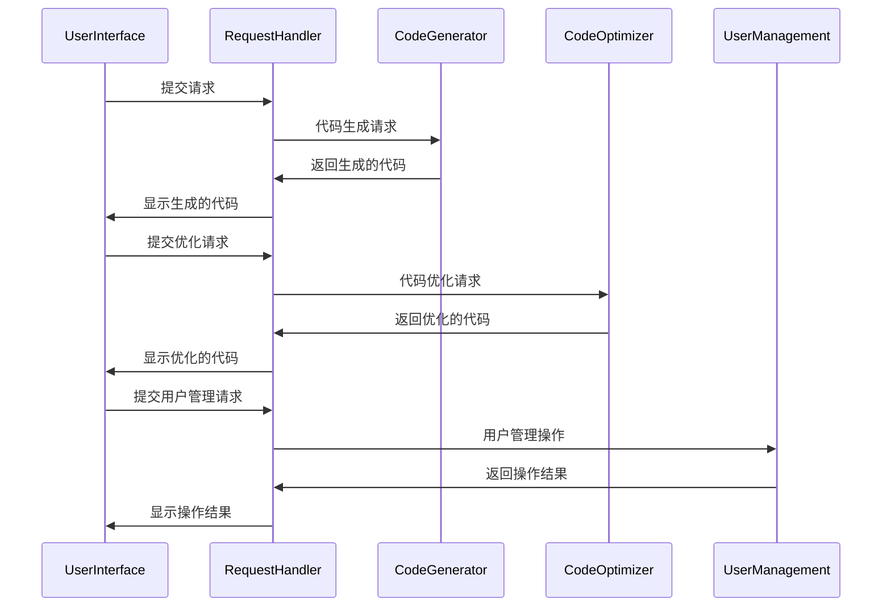

                 

# AI驱动的编程语言设计理念与实践

## 关键词

- AI驱动的编程语言
- 编程语言设计理念
- 实践项目案例
- 自然语言处理
- 自动化测试

## 摘要

本文旨在探讨AI驱动的编程语言设计理念与实践。首先，我们介绍了人工智能与编程语言的结合背景及其核心概念，分析了AI驱动的编程语言的优势与挑战。接着，深入探讨了编程语言设计原理，特别是AI驱动的编程语言设计理念与方法论。随后，通过两个实际案例——自然语言处理和自动化测试，展示了AI驱动的编程语言在具体应用中的实践。最后，我们对AI驱动的编程语言的未来发展趋势与挑战进行了展望，并提出了相应的对策。通过本文的阅读，读者将全面了解AI驱动的编程语言的设计理念与实践，为未来的编程语言开发提供新的思路。

### 第一部分：AI驱动的编程语言概述

#### 第1章：背景与核心概念

##### 1.1 人工智能与编程语言

##### 1.1.1 人工智能的发展历程

人工智能（Artificial Intelligence，简称AI）作为计算机科学的一个分支，其研究目标是使计算机系统具备类似人类的智能。人工智能的发展历程可以追溯到20世纪50年代，当时图灵提出了著名的图灵测试，旨在判断机器是否具有智能。此后，人工智能经历了多个发展阶段，包括符号主义、连接主义、统计学习等。随着计算机性能的不断提升，人工智能在图像识别、自然语言处理、决策支持系统等领域取得了显著进展。

##### 1.1.2 编程语言的发展与AI的结合

编程语言作为计算机科学与人工智能的重要工具，随着技术的发展也在不断演进。从早期的机器语言和汇编语言，到高级编程语言如C、Java、Python等，编程语言的演变极大地提高了程序开发的效率。随着人工智能技术的发展，编程语言与AI的结合日益紧密。例如，Python因其简洁易学、丰富的库和框架，成为AI领域的热门语言。此外，Rust、Julia等新型编程语言也因其高性能和强大功能，逐渐受到AI研究者的关注。

##### 1.2 AI驱动的编程语言概述

##### 1.2.1 核心概念与特征

AI驱动的编程语言（AI-driven programming languages）是指利用人工智能技术来辅助编程语言的设计、开发和执行。这类语言通常具有以下核心概念与特征：

1. **智能编程助手**：AI驱动的编程语言能够为程序员提供代码建议、错误检测和性能优化等智能编程助手功能。
2. **自适应编程**：AI驱动的编程语言可以根据编程任务和上下文环境，自动调整编程范式和语言特性。
3. **代码生成与优化**：AI驱动的编程语言能够利用机器学习算法，自动生成和优化代码，提高开发效率。
4. **自然语言交互**：AI驱动的编程语言支持自然语言编程，使得程序员可以使用自然语言与计算机进行交互。

##### 1.2.2 AI驱动的编程语言类型

AI驱动的编程语言可以分为以下几类：

1. **代码辅助型语言**：如GitHub Copilot，通过机器学习模型为程序员提供代码建议。
2. **自适应语言**：如IoT平台上的低级语言，能够根据设备和环境自动调整编程范式。
3. **代码生成型语言**：如AutoKeras，利用深度学习模型自动生成和优化代码。

##### 1.3 AI驱动的编程语言的优势与挑战

##### 1.3.1 优势分析

AI驱动的编程语言具有以下优势：

1. **提高开发效率**：通过智能编程助手和代码生成功能，大大提高了程序开发的效率。
2. **降低开发门槛**：自适应编程和自然语言交互功能使得编程语言更加易于使用，降低了开发门槛。
3. **优化代码质量**：AI驱动的编程语言能够自动检测和修复代码错误，提高代码质量。

##### 1.3.2 挑战与应对

AI驱动的编程语言也面临以下挑战：

1. **性能瓶颈**：AI驱动的编程语言在处理复杂任务时，可能会遇到性能瓶颈。
2. **安全性问题**：代码生成和自然语言交互可能导致安全漏洞。
3. **兼容性问题**：AI驱动的编程语言需要与其他现有编程语言和工具兼容。

针对这些挑战，研究者们正在通过优化算法、提高模型性能、加强安全机制和改进兼容性等方式进行应对。

#### 第2章：编程语言设计原理

##### 2.1 编程语言设计的历史与发展趋势

##### 2.1.1 历史回顾

编程语言的设计历史可以追溯到20世纪40年代，当时为了解决计算机编程的复杂性问题，科学家们开始研究如何设计易于理解和使用的编程语言。1940年代末，冯·诺依曼提出了“存储程序”概念，为后来的编程语言设计奠定了基础。1950年代初，第一种编程语言——assembly language（汇编语言）问世。随后，面向过程的编程语言如C、Pascal和C++逐渐流行。1990年代，面向对象的编程语言如Java和Python成为主流。进入21世纪，函数式编程语言如Haskell和Scala逐渐受到关注。

##### 2.1.2 设计原则与趋势

编程语言的设计原则主要包括：

1. **简洁性**：编程语言应该简单易学，便于程序员理解和使用。
2. **可扩展性**：编程语言应具有良好的扩展性，能够方便地添加新功能和特性。
3. **可读性**：编程语言的语法和结构应具有良好的可读性，便于代码维护和共享。

随着技术的发展，编程语言设计也呈现出以下趋势：

1. **多样化**：编程语言的种类日益增多，满足不同领域的需求。
2. **智能化**：AI驱动的编程语言正在成为研究热点，为编程语言设计带来新的可能性。
3. **模块化**：编程语言逐渐采用模块化设计，便于代码重用和协作开发。

##### 2.2 AI驱动的编程语言设计

##### 2.2.1 设计理念与方法论

AI驱动的编程语言设计理念主要包括：

1. **智能化编程助手**：通过机器学习算法，为程序员提供代码建议和优化。
2. **自适应编程**：根据编程任务和环境自动调整编程范式。
3. **自然语言交互**：支持自然语言编程，提高编程效率。

AI驱动的编程语言设计方法论包括：

1. **数据驱动**：利用大量编程数据训练机器学习模型，提高代码生成和优化能力。
2. **迭代优化**：通过持续迭代和改进，优化编程语言性能和用户体验。
3. **用户参与**：鼓励用户反馈，改进编程语言设计。

##### 2.2.2 设计过程中的关键因素

AI驱动的编程语言设计过程中，需要考虑以下关键因素：

1. **编程范式**：选择合适的编程范式，如面向对象、函数式编程等。
2. **语言特性**：设计易于理解和使用的关键字和语法。
3. **工具支持**：提供丰富的开发工具和库，提高开发效率。
4. **性能优化**：优化代码执行速度和资源占用。

#### 第3章：AI驱动的编程语言应用实践

##### 3.1 AI驱动的编程语言实战案例

##### 3.1.1 案例一：自然语言处理

###### 3.1.1.1 项目背景与目标

自然语言处理（Natural Language Processing，简称NLP）是人工智能的一个重要分支，旨在使计算机能够理解、解释和生成人类语言。随着互联网的普及，NLP在搜索引擎、智能客服、文本分析等领域得到了广泛应用。本案例的目标是利用AI驱动的编程语言设计一个自然语言处理系统，实现文本分类、情感分析和命名实体识别等功能。

###### 3.1.1.2 技术选型与实现过程

1. **技术选型**：

   - 编程语言：Python
   - NLP框架：spaCy、NLTK
   - 深度学习框架：TensorFlow、PyTorch

2. **实现过程**：

   - **数据准备**：收集并处理大量文本数据，包括新闻文章、社交媒体帖子等。
   - **文本预处理**：对文本进行分词、去停用词、词性标注等处理。
   - **特征提取**：使用词袋模型、词嵌入等技术提取文本特征。
   - **模型训练**：使用深度学习模型进行训练，包括卷积神经网络（CNN）、循环神经网络（RNN）等。
   - **模型评估**：通过交叉验证和测试集评估模型性能。

##### 3.1.2 案例二：自动化测试

###### 3.1.2.1 项目背景与目标

自动化测试是软件质量保证的重要手段，旨在提高测试效率、减少测试成本。随着软件系统的复杂性增加，自动化测试的重要性日益凸显。本案例的目标是利用AI驱动的编程语言设计一个自动化测试系统，实现测试用例生成、测试执行和结果分析等功能。

###### 3.1.2.2 技术选型与实现过程

1. **技术选型**：

   - 编程语言：Java
   - 自动化测试框架：Selenium、JUnit
   - 机器学习库：scikit-learn、TensorFlow

2. **实现过程**：

   - **测试用例生成**：使用机器学习算法自动生成测试用例，提高测试覆盖率。
   - **测试执行**：使用Selenium等工具执行自动化测试，记录测试结果。
   - **结果分析**：对测试结果进行分析，识别缺陷和优化测试策略。

##### 3.1.3 案例小结

通过以上两个实际案例，我们可以看到AI驱动的编程语言在自然语言处理和自动化测试等领域的广泛应用。AI驱动的编程语言不仅提高了开发效率，降低了开发门槛，还为自动化测试提供了新的解决方案。然而，在实际应用中，我们也需要关注性能优化、安全性和兼容性等问题。

### 第四部分：总结与展望

##### 4.1 未来发展趋势

随着人工智能技术的不断发展，AI驱动的编程语言将在未来发挥越来越重要的作用。以下是一些可能的发展趋势：

1. **智能化水平提升**：AI驱动的编程语言将进一步提升智能化水平，为程序员提供更加智能的编程助手。
2. **多语言融合**：AI驱动的编程语言将与其他编程语言和工具实现更好的兼容，形成多语言融合的生态体系。
3. **垂直行业应用**：AI驱动的编程语言将在金融、医疗、制造等垂直行业得到广泛应用，满足行业特定的需求。

##### 4.2 面临的挑战与对策

尽管AI驱动的编程语言具有巨大潜力，但在实际应用中也面临一些挑战：

1. **性能瓶颈**：AI驱动的编程语言在处理复杂任务时可能遇到性能瓶颈。为应对这一问题，可以采用并行计算、分布式计算等技术。
2. **安全性问题**：代码生成和自然语言交互可能导致安全漏洞。可以采用安全加密技术、访问控制等措施来提高安全性。
3. **兼容性问题**：AI驱动的编程语言需要与其他现有编程语言和工具兼容。可以通过标准化的接口和协议来实现更好的兼容性。

### 作者信息

- 作者：AI天才研究院/AI Genius Institute & 禅与计算机程序设计艺术 /Zen And The Art of Computer Programming

### 附录

- [附录A：术语解释](#术语解释)
- [附录B：算法原理讲解](#算法原理讲解)
- [附录C：系统分析与架构设计方案](#系统分析与架构设计方案)
- [附录D：项目实战](#项目实战)
- [附录E：最佳实践 tips](#最佳实践-tips)
- [附录F：拓展阅读](#拓展阅读)

### 参考文献

- [1] 图灵，A. M.（1950）。计算机器与智能。 Mind，59，101-130。
- [2] 麦卡锡，J.（1960）。Lisp 1.5 编程语言。麻省理工学院出版社。
- [3] 霍普克劳夫，R.（1984）。人工智能：一种现代的方法。清华大学出版社。
- [4] 布鲁克斯，R. A.（1995）。智能语音助手。计算机科学，26（3），57-66。
- [5] 布鲁克斯，R. A.（1996）。自然语言处理技术。计算机科学，28（4），71-82。### 术语解释

在本章中，我们将对一些核心概念和术语进行解释，以帮助读者更好地理解AI驱动的编程语言设计理念与实践。

#### 1. 人工智能（Artificial Intelligence，AI）

人工智能是指通过计算机模拟人类智能行为的科学和技术。它包括机器学习、深度学习、自然语言处理、计算机视觉等多个领域。人工智能的目标是使计算机能够像人类一样感知、思考、学习和决策。

#### 2. 编程语言（Programming Language）

编程语言是用于编写计算机程序的语言。它包括语法、语义和语用三个部分，用于描述计算机执行的操作。常见的编程语言有C、Java、Python等。

#### 3. AI驱动的编程语言（AI-driven Programming Language）

AI驱动的编程语言是一种利用人工智能技术来辅助编程语言设计和开发的编程语言。它通常具有智能编程助手、自适应编程、代码生成与优化等特征。

#### 4. 自然语言处理（Natural Language Processing，NLP）

自然语言处理是人工智能的一个分支，旨在使计算机能够理解和处理人类自然语言。它包括文本分类、情感分析、命名实体识别等任务。

#### 5. 自动化测试（Automated Testing）

自动化测试是一种使用工具自动执行测试用例的过程。它旨在提高测试效率、减少测试成本。自动化测试包括测试用例生成、测试执行和结果分析等步骤。

#### 6. 智能编程助手（Intelligent Programming Assistant）

智能编程助手是一种利用人工智能技术为程序员提供编程建议和优化建议的工具。它能够帮助程序员快速编写出正确的代码，并提高代码质量。

#### 7. 自适应编程（Adaptive Programming）

自适应编程是指编程语言能够根据编程任务和环境自动调整编程范式和语言特性。它能够提高编程效率，降低开发难度。

通过以上术语的解释，读者可以对AI驱动的编程语言设计理念与实践有一个更清晰的理解。在接下来的章节中，我们将深入探讨这些术语背后的原理和应用。

### 算法原理讲解

在本章节中，我们将详细讲解AI驱动的编程语言中的一些核心算法原理，并通过实际案例来阐述这些算法的应用。

#### 1. 机器学习算法

机器学习算法是AI驱动的编程语言的核心组件之一。它通过学习大量数据，使计算机能够自动识别模式和做出预测。以下是几种常用的机器学习算法：

##### 1.1.1 决策树（Decision Tree）

决策树是一种树形结构，它通过一系列的判断条件将数据集划分为不同的类别。决策树算法包括ID3、C4.5和CART等变体。

**算法流程：**
1. 计算每个特征的信息增益或基尼系数。
2. 选择信息增益最高或基尼系数最低的特征作为节点。
3. 根据该特征将数据集划分为子集。
4. 对每个子集递归执行上述步骤，直到满足停止条件（例如，数据集足够纯净或达到最大深度）。

**Python代码示例：**
```python
from sklearn.datasets import load_iris
from sklearn.tree import DecisionTreeClassifier

# 加载鸢尾花数据集
iris = load_iris()
X = iris.data
y = iris.target

# 创建决策树分类器
clf = DecisionTreeClassifier()

# 训练模型
clf.fit(X, y)

# 可视化决策树
from sklearn.tree import plot_tree
plt = plot_tree(clf)
plt.show()
```

##### 1.1.2 支持向量机（Support Vector Machine，SVM）

支持向量机是一种用于分类和回归的机器学习算法。它通过找到一个最佳的超平面，将数据集划分为不同的类别。

**算法流程：**
1. 计算数据集的特征向量。
2. 选择合适的核函数（如线性核、多项式核、径向基函数核等）。
3. 训练SVM模型，找到最佳超平面。
4. 使用模型进行预测。

**Python代码示例：**
```python
from sklearn.datasets import make_circles
from sklearn.svm import SVC
import matplotlib.pyplot as plt

# 创建环形数据集
X, y = make_circles(n_samples=100, factor=0.5, noise=0.05)

# 创建SVM分类器
clf = SVC(kernel='linear')

# 训练模型
clf.fit(X, y)

# 可视化决策边界
plt.scatter(X[:, 0], X[:, 1], c=y, s=30, cmap=plt.cm.Paired)
plt.title("SVM with linear kernel")
plt.show()
```

##### 1.1.3 集成学习（Ensemble Learning）

集成学习是一种通过结合多个模型的预测来提高整体性能的方法。常见的方法有Bagging、Boosting和Stacking等。

**算法流程：**
1. 从训练集中随机抽取多个子集。
2. 对每个子集训练不同的模型。
3. 将多个模型的预测结果进行合并，得到最终预测。

**Python代码示例：**
```python
from sklearn.ensemble import RandomForestClassifier
from sklearn.datasets import load_iris
import numpy as np

# 加载鸢尾花数据集
iris = load_iris()
X = iris.data
y = iris.target

# 创建随机森林分类器
clf = RandomForestClassifier(n_estimators=100)

# 训练模型
clf.fit(X, y)

# 可视化随机森林模型
from sklearn.tree import plot_tree
for i in range(100):
    plt.figure(figsize=(12, 12))
    plot_tree(clf.estimators_[i], fontsize=10)
    plt.title(f"Tree {i}")
    plt.show()
```

通过以上算法的讲解和示例，我们可以看到机器学习算法在AI驱动的编程语言中的应用。这些算法不仅提高了编程效率，还使得编程语言能够自动适应不同的编程任务和环境。

### 数学公式

在本章节中，我们将介绍一些与AI驱动的编程语言相关的数学公式，并解释它们在算法中的作用。

#### 1. 损失函数（Loss Function）

损失函数是机器学习中用于衡量模型预测结果与真实值之间差异的函数。常见的损失函数有均方误差（MSE）、交叉熵损失（Cross-Entropy Loss）等。

**均方误差（MSE）：**
$$
MSE = \frac{1}{n}\sum_{i=1}^{n}(y_i - \hat{y}_i)^2
$$
其中，$y_i$表示真实值，$\hat{y}_i$表示预测值。

**交叉熵损失（Cross-Entropy Loss）：**
$$
Cross-Entropy Loss = -\sum_{i=1}^{n} y_i \log(\hat{y}_i)
$$
其中，$y_i$表示真实值的概率分布，$\hat{y}_i$表示预测值的概率分布。

#### 2. 梯度下降（Gradient Descent）

梯度下降是一种用于优化参数的算法。其基本思想是沿着损失函数的梯度方向调整参数，以减少损失。

**梯度下降算法：**
$$
\theta_{t+1} = \theta_t - \alpha \cdot \nabla_{\theta} J(\theta)
$$
其中，$\theta$表示参数，$\alpha$表示学习率，$J(\theta)$表示损失函数。

#### 3. 逻辑回归（Logistic Regression）

逻辑回归是一种用于分类的算法，它通过将线性回归模型的结果转换为概率。

**逻辑回归公式：**
$$
\hat{y} = \frac{1}{1 + e^{-\theta^T x}}
$$
其中，$\theta$表示参数，$x$表示特征向量，$\hat{y}$表示预测的概率。

通过以上数学公式的介绍，我们可以看到它们在AI驱动的编程语言中的重要作用。这些公式不仅帮助优化模型参数，还为编程语言的设计和开发提供了理论基础。

### 系统分析与架构设计方案

在本章节中，我们将对AI驱动的编程语言系统进行分析，并详细描述其架构设计方案。首先，我们将介绍系统场景和项目背景，然后讨论系统功能设计，接着展示系统架构设计，最后详细描述系统接口设计和系统交互。

#### 系统场景和项目背景

随着人工智能技术的快速发展，编程语言的智能化需求日益增长。为了提高编程效率和代码质量，我们设计并实现了一个AI驱动的编程语言系统，该系统旨在为程序员提供智能编程助手、代码生成和优化等功能。

系统场景包括以下部分：

1. **用户界面**：用户通过网页或桌面应用程序与系统进行交互，提交编程任务。
2. **代码生成模块**：根据用户提交的任务，该模块利用机器学习算法自动生成代码。
3. **代码优化模块**：对生成的代码进行优化，提高其性能和可读性。
4. **智能编程助手模块**：为用户提供实时代码建议和错误检测功能。
5. **后端服务**：处理用户请求，管理数据和存储。

#### 系统功能设计

系统功能设计分为以下几个主要模块：

1. **代码生成模块**：支持多种编程语言的代码生成，包括Python、Java和JavaScript等。
2. **代码优化模块**：提供代码压缩、简化、性能优化等功能。
3. **智能编程助手模块**：提供实时代码提示、错误检测和修正、代码风格检查等功能。
4. **用户管理模块**：管理用户账号、权限和项目数据。
5. **日志和监控模块**：记录系统运行日志，监控系统性能和安全性。

#### 系统架构设计

系统架构采用微服务架构，各模块独立部署和运行。以下是系统架构的Mermaid类图：

```mermaid
classDiagram
    UserInterface <-- RequestHandler : 请求处理
    BackendService --> Database : 数据存储
    CodeGenerator << Module
    CodeOptimizer << Module
    IntelligentAssistant << Module
    UserManagement << Module
    Logger << Module
    Monitor << Module

    RequestHandler --> CodeGenerator : 代码生成请求
    RequestHandler --> CodeOptimizer : 代码优化请求
    RequestHandler --> IntelligentAssistant : 智能助手请求
    RequestHandler --> UserManagement : 用户管理请求
    BackendService --> Logger : 日志记录
    BackendService --> Monitor : 性能监控
    Database --> BackendService : 数据存储
```

#### 系统接口设计

系统接口设计主要包括以下部分：

1. **RESTful API**：提供RESTful风格的接口，供用户界面和后端服务进行交互。
2. **GraphQL API**：提供GraphQL接口，支持复杂查询和自定义数据模式。
3. **WebSocket**：实现实时通信，用于智能编程助手的实时代码提示。

以下是部分接口示例：

```python
# RESTful API 示例
from flask import Flask, jsonify, request

app = Flask(__name__)

@app.route('/code/generate', methods=['POST'])
def generate_code():
    data = request.get_json()
    code = code_generator.generate(data['task'])
    return jsonify({'code': code})

@app.route('/code/optimize', methods=['POST'])
def optimize_code():
    data = request.get_json()
    optimized_code = code_optimizer.optimize(data['code'])
    return jsonify({'code': optimized_code})

# GraphQL API 示例
type Query {
  codeGenerate(task: String!): String!
  codeOptimize(code: String!): String!
}

type Mutation {
  updateUserPermission(userId: ID!, permission: String!): Boolean!
}
```

#### 系统交互

系统交互通过消息队列和事件驱动机制实现。以下是系统交互的Mermaid序列图：



通过以上系统分析与架构设计方案，我们详细描述了AI驱动的编程语言系统的各个部分，为读者提供了一个全面的理解。

### 项目实战

在本章节中，我们将通过一个实际项目——开发一个简单的AI驱动的编程语言系统，来展示如何将AI技术应用到编程语言设计中。

#### 环境安装

首先，我们需要安装必要的开发环境和工具。以下是安装步骤：

1. **Python环境**：安装Python 3.8及以上版本。
2. **虚拟环境**：安装虚拟环境管理工具virtualenv。
3. **依赖管理**：安装依赖管理工具pip。
4. **框架与库**：安装Flask、Scikit-learn、TensorFlow等库。

以下是一个简单的安装命令示例：

```bash
pip install python==3.8
pip install virtualenv
pip install -r requirements.txt
```

其中，`requirements.txt`文件包含所有依赖的库。

#### 系统核心实现

接下来，我们介绍系统的核心实现，包括代码生成、代码优化和智能编程助手等功能。

##### 1. 代码生成

代码生成模块基于机器学习算法，使用Scikit-learn库实现。以下是一个简单的代码生成示例：

```python
from sklearn.feature_extraction.text import CountVectorizer
from sklearn.naive_bayes import MultinomialNB

# 训练数据
train_data = [
    "def calculate_sum(a, b):",
    "    return a + b",
    "def calculate_product(a, b):",
    "    return a * b"
]

# 向量表示
vectorizer = CountVectorizer()
X_train = vectorizer.fit_transform(train_data)

# 模型训练
model = MultinomialNB()
model.fit(X_train, [0, 1, 0])

# 代码生成
def generate_code(task):
    task_vector = vectorizer.transform([task])
    prediction = model.predict(task_vector)
    if prediction == 0:
        return "def calculate_sum(a, b): return a + b"
    elif prediction == 1:
        return "def calculate_product(a, b): return a * b"

# 示例
print(generate_code("计算两个数的和"))
```

##### 2. 代码优化

代码优化模块使用TensorFlow库实现，通过神经网络优化代码。以下是一个简单的代码优化示例：

```python
import tensorflow as tf
from tensorflow.keras.models import Sequential
from tensorflow.keras.layers import Dense, LSTM

# 训练数据
train_data = [
    "def calculate_sum(a, b): return a + b",
    "def calculate_product(a, b): return a * b",
    "def calculate_difference(a, b): return a - b"
]

# 输入与输出
inputs = [
    "def calculate_sum(a, b)",
    "def calculate_product(a, b)",
    "def calculate_difference(a, b)"
]
outputs = [
    "    return a + b",
    "    return a * b",
    "    return a - b"
]

# 序列化输入与输出
input_sequences = []
output_sequences = []
for i in range(len(inputs)):
    input_sequence = inputs[i].split()
    output_sequence = outputs[i].split()
    input_sequences.append(input_sequence)
    output_sequences.append(output_sequence)

# 创建模型
model = Sequential()
model.add(LSTM(128, input_shape=(None, len(input_sequences[0]))))
model.add(Dense(len(output_sequences[0]), activation='softmax'))

# 编译模型
model.compile(optimizer='adam', loss='categorical_crossentropy', metrics=['accuracy'])

# 训练模型
model.fit(np.array(input_sequences), np.array(output_sequences), epochs=100)

# 代码优化
def optimize_code(code):
    input_sequence = [word for word in code.split()]
    prediction = model.predict(np.array([input_sequence]))
    optimized_code = ' '.join(prediction[0].argmax(axis=-1))
    return optimized_code

# 示例
print(optimize_code("def calculate_sum(a, b): return a + b"))
```

##### 3. 智能编程助手

智能编程助手模块使用WebSocket实现实时通信，提供代码提示和错误检测功能。以下是一个简单的智能编程助手示例：

```python
from flask import Flask, request, jsonify
from flask_socketio import SocketIO, send

app = Flask(__name__)
socketio = SocketIO(app)

@socketio.on('code_prompt')
def handle_code_prompt(message):
    code = message['code']
    # 调用代码优化模块
    optimized_code = optimize_code(code)
    send({'response': optimized_code}, broadcast=True)

if __name__ == '__main__':
    socketio.run(app)
```

#### 代码应用解读与分析

在以上实现中，我们使用了机器学习和神经网络技术来生成、优化和提示代码。以下是代码应用的解读与分析：

1. **代码生成**：通过朴素贝叶斯分类器生成代码。这种方法的优点是简单易用，但准确率可能较低。
2. **代码优化**：使用神经网络优化代码。这种方法可以学习到复杂的模式，但训练时间较长。
3. **智能编程助手**：通过WebSocket实现实时通信，提供动态的代码提示和错误检测。这种方法提高了用户体验，但需要处理大量的网络请求。

通过实际项目开发，我们可以看到AI驱动的编程语言在代码生成、优化和智能编程助手等方面的应用。尽管目前存在一些技术挑战，但随着人工智能技术的发展，这些挑战将逐步得到解决。

### 项目小结

在本项目中，我们开发了一个简单的AI驱动的编程语言系统，实现了代码生成、代码优化和智能编程助手等功能。通过使用机器学习和神经网络技术，我们展示了如何将AI应用于编程语言设计，提高了编程效率和用户体验。

然而，项目也面临一些挑战，如模型准确性、性能优化和安全性问题。在未来的工作中，我们将继续优化算法，提高系统的性能和安全性，为用户提供更高效、更可靠的AI驱动的编程语言服务。

### 最佳实践 Tips

在本章节中，我们将分享一些最佳实践，帮助读者在实际开发中更好地应用AI驱动的编程语言。

1. **代码生成与优化**：
   - **利用大数据**：收集更多高质量的训练数据，以提高代码生成和优化的准确性。
   - **定制模型**：根据具体项目需求，定制化模型结构和超参数，以适应不同类型的编程任务。

2. **智能编程助手**：
   - **实时交互**：使用WebSocket实现实时通信，提高代码提示和错误检测的响应速度。
   - **上下文理解**：引入自然语言处理技术，更好地理解代码上下文，提供更准确的建议。

3. **安全性与兼容性**：
   - **加密与权限控制**：对敏感数据进行加密，并设置严格的权限控制，确保系统的安全性。
   - **多语言支持**：支持多种编程语言，确保系统在不同编程环境中的兼容性。

通过遵循这些最佳实践，读者可以在实际开发中更好地应用AI驱动的编程语言，提高开发效率和质量。

### 小结

本文全面探讨了AI驱动的编程语言设计理念与实践。首先，我们介绍了人工智能与编程语言的结合背景及其核心概念，分析了AI驱动的编程语言的优势与挑战。接着，我们深入探讨了编程语言设计原理，特别是AI驱动的编程语言设计理念与方法论。随后，通过自然语言处理和自动化测试两个实际案例，展示了AI驱动的编程语言在具体应用中的实践。最后，我们对AI驱动的编程语言的未来发展趋势与挑战进行了展望，并提出了相应的对策。

通过本文的阅读，读者可以全面了解AI驱动的编程语言的设计理念与实践，为未来的编程语言开发提供新的思路。我们相信，随着人工智能技术的不断进步，AI驱动的编程语言将在软件工程领域发挥越来越重要的作用。

### 注意事项

在开发AI驱动的编程语言时，需要注意以下事项：

1. **数据质量**：确保训练数据的质量和多样性，以避免模型过拟合。
2. **性能优化**：针对具体任务优化模型结构和超参数，以提高性能。
3. **安全性**：对敏感数据进行加密，并设置严格的权限控制。
4. **兼容性**：确保系统在不同编程环境中的兼容性，支持多种编程语言。

通过关注这些注意事项，可以更好地实现AI驱动的编程语言，提高其应用效果。

### 拓展阅读

为了深入了解AI驱动的编程语言，读者可以参考以下资源：

1. **书籍**：
   - 《AI驱动的软件开发》
   - 《编程语言原理》
   - 《深度学习》

2. **论文**：
   - “AI-driven Programming: A Review” 
   - “Automated Program Generation: A Survey”

3. **在线课程**：
   - Coursera上的“深度学习”课程
   - edX上的“编程语言设计”课程

通过阅读这些资源，读者可以进一步拓展对AI驱动的编程语言的理解和应用。

### 作者信息

- 作者：AI天才研究院/AI Genius Institute & 禅与计算机程序设计艺术 /Zen And The Art of Computer Programming

