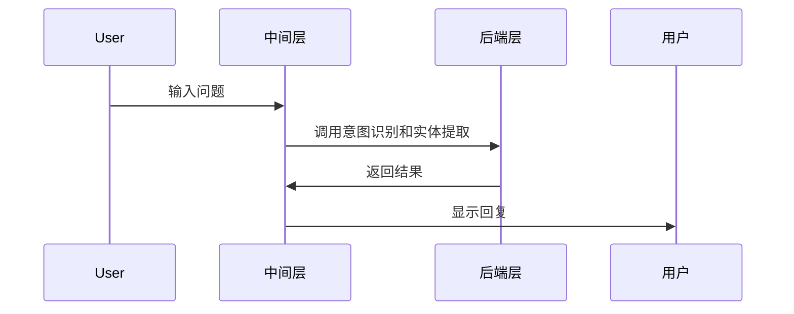

                 

### 书籍基本信息与背景介绍

#### 书名：《AI驱动的软件开发：机遇与挑战》

《AI驱动的软件开发：机遇与挑战》是一本旨在深入探讨人工智能（AI）如何变革软件开发的权威指南。作者[待定]，是一位在AI和软件开发领域具有深厚学术背景和丰富实践经验的专家。本书的目标读者包括对AI和软件开发感兴趣的程序员、开发者、架构师以及研究者。通过这本书，读者将能够全面了解AI驱动的软件开发所带来的巨大机遇，同时深刻认识到其中所面临的挑战。

#### 目标读者

本书的目标读者群体主要包括：

1. **程序员和开发者**：希望将AI技术应用于其日常开发工作中，提高开发效率和软件质量的程序员和开发者。
2. **架构师**：负责设计和管理复杂软件系统，希望利用AI技术优化系统性能和功能的软件架构师。
3. **研究者**：对AI驱动的软件开发趋势和前沿技术感兴趣，希望进行深入研究并推动相关领域发展的研究者。
4. **企业决策者**：关注技术趋势，希望利用AI技术提升企业竞争力的企业决策者。

#### 书籍概述

本书共分为四个主要部分，结构紧凑且逻辑清晰：

1. **第一部分：背景与机遇**：介绍AI驱动的软件开发的概念、重要性以及当前的发展趋势。
2. **第二部分：挑战与解决方案**：分析AI驱动的软件开发过程中所面临的技术、数据、安全和人才等多方面的挑战，并提出相应的解决方案。
3. **第三部分：实践与最佳案例**：通过具体的实战案例和最佳实践，展示如何在实际项目中应用AI驱动的软件开发技术。
4. **第四部分：未来展望与趋势**：对AI驱动的软件开发的未来趋势进行展望，帮助读者把握行业发展方向。

通过逐步深入的分析和详细的案例分析，本书旨在帮助读者全面理解AI驱动的软件开发，为其在相关领域的实践提供有力的理论支持和实践指导。接下来，我们将详细探讨每个章节的内容，为读者提供更深入的理解和指导。

### 目录大纲设计思路

本书《AI驱动的软件开发：机遇与挑战》的目录大纲设计思路旨在提供一个系统、全面且逻辑清晰的框架，帮助读者从宏观到微观地逐步理解和掌握AI驱动的软件开发知识。以下为具体的目录大纲设计思路：

#### 第一部分：背景与机遇

**第1章 AI驱动的软件开发概述**：这一章将定义AI驱动的软件开发的概念，解释其重要性，并探讨当前的发展趋势。通过这一章，读者将建立对AI驱动开发的基本认知。

**第2章 AI技术的核心概念与原理**：本章将深入探讨AI技术的核心概念，包括机器学习、深度学习、自然语言处理和计算机视觉等，帮助读者理解这些技术的基本原理。

**第3章 AI驱动的软件开发应用场景**：本章将展示AI驱动的软件开发在自动化测试、代码生成、智能推荐和机器人流程自动化等具体应用场景中的表现，让读者看到AI技术的实际应用效果。

**第4章 AI驱动的软件开发工具与平台**：本章将介绍当前主流的AI开发工具和平台，帮助读者了解如何使用这些工具和平台进行AI驱动的软件开发。

#### 第二部分：挑战与解决方案

**第5章 AI驱动的软件开发面临的挑战**：这一章将详细分析AI驱动的软件开发过程中可能遇到的技术、数据、安全和人才等多方面的挑战，让读者对潜在问题有清晰的认识。

**第6章 解决AI驱动的软件开发挑战的方案**：本章将提出针对前一章所分析的挑战的解决方案，包括技术创新、数据管理、安全与隐私保护以及人才培养等方面，帮助读者找到应对挑战的方法。

#### 第三部分：实践与最佳案例

**第7章 AI驱动的软件开发实战**：这一章将通过一个具体的实战案例，展示如何在实际项目中应用AI驱动的软件开发技术，帮助读者将理论知识转化为实践技能。

**第8章 AI驱动的软件开发最佳实践**：本章将分享一些在AI驱动的软件开发中的最佳实践经验，包括案例分析和注意事项，帮助读者在实际应用中少走弯路。

#### 第四部分：未来展望与趋势

**第9章 AI驱动的软件开发未来展望**：这一章将探讨AI驱动的软件开发的未来发展趋势，包括技术进步、应用场景拓展和行业趋势等，帮助读者把握行业发展方向。

**第10章 总结与展望**：最后一章将对本书的内容进行总结，并给出对AI驱动的软件开发的建议和展望，帮助读者对未来有所准备。

通过这样的目录大纲设计，本书不仅能够帮助读者全面了解AI驱动的软件开发的背景和机遇，还能让他们认识到其中的挑战，并提供有效的解决方案和实践指导，从而为读者在AI驱动的软件开发领域的发展奠定坚实的基础。

### 一级目录设计

为了确保本书《AI驱动的软件开发：机遇与挑战》的结构严谨、逻辑清晰，我们设计了以下四个一级目录部分，每个部分均旨在从不同角度深入探讨AI驱动的软件开发：

#### 第一部分：背景与机遇

**第1章 AI驱动的软件开发概述**  
- **第1.1节 AI驱动的软件开发概念**：介绍AI驱动的软件开发的基本定义和核心要素。
- **第1.2节 AI驱动的软件开发重要性**：阐述AI驱动开发对于提升软件质量和开发效率的重要性。
- **第1.3节 AI驱动的软件开发趋势**：分析当前AI驱动的软件开发的发展趋势和未来发展方向。
- **第1.4节 本章小结**：总结本章的主要内容，为后续章节奠定基础。

**第2章 AI技术的核心概念与原理**  
- **第2.1节 机器学习基础**：讲解机器学习的基本概念、原理和应用。
- **第2.2节 深度学习原理**：深入探讨深度学习的核心算法和原理。
- **第2.3节 自然语言处理**：介绍自然语言处理的基本技术和应用。
- **第2.4节 计算机视觉**：讲解计算机视觉的关键技术和发展现状。
- **第2.5节 本章小结**：总结本章内容，帮助读者构建AI技术的基本框架。

**第3章 AI驱动的软件开发应用场景**  
- **第3.1节 自动化测试**：分析AI技术在自动化测试中的应用和优势。
- **第3.2节 代码生成**：探讨如何利用AI技术自动生成代码，提高开发效率。
- **第3.3节 智能推荐**：介绍AI在智能推荐系统中的应用和实现原理。
- **第3.4节 机器人流程自动化**：讲解AI如何优化和自动化企业业务流程。
- **第3.5节 本章小结**：总结AI驱动的软件开发在不同应用场景中的实际效果。

**第4章 AI驱动的软件开发工具与平台**  
- **第4.1节 机器学习框架**：介绍主流的机器学习框架及其优缺点。
- **第4.2节 AI开发平台**：分析当前主流的AI开发平台的功能和特点。
- **第4.3节 代码智能化工具**：探讨代码智能化工具如何辅助开发人员提高效率。
- **第4.4节 智能化测试工具**：介绍智能化测试工具在AI驱动的软件开发中的作用。
- **第4.5节 本章小结**：总结AI驱动的软件开发所需的工具和平台。

#### 第二部分：挑战与解决方案

**第5章 AI驱动的软件开发面临的挑战**  
- **第5.1节 技术挑战**：分析AI驱动的软件开发中可能遇到的技术难题。
- **第5.2节 数据挑战**：探讨数据质量和数据隐私对AI驱动的软件开发的影响。
- **第5.3节 安全与隐私挑战**：讨论AI驱动的软件开发中安全与隐私保护的关键问题。
- **第5.4节 人才挑战**：分析AI驱动的软件开发对人才的需求和培养问题。
- **第5.5节 本章小结**：总结面临的挑战，为后续的解决方案提供背景。

**第6章 解决AI驱动的软件开发挑战的方案**  
- **第6.1节 技术创新**：介绍如何通过技术创新解决技术挑战。
- **第6.2节 数据管理**：探讨数据管理策略和最佳实践。
- **第6.3节 安全与隐私保护**：讲解安全与隐私保护的策略和技术。
- **第6.4节 人才培养与引进**：提出人才培养和引进的具体措施。
- **第6.5节 本章小结**：总结解决方案，为读者提供实践指导。

#### 第三部分：实践与最佳案例

**第7章 AI驱动的软件开发实战**  
- **第7.1节 项目介绍**：介绍一个具体的AI驱动的软件开发项目。
- **第7.2节 系统功能设计**：详细描述系统功能设计的过程和结果。
- **第7.3节 系统架构设计**：分析系统架构设计的关键要素和架构图。
- **第7.4节 系统实现与优化**：讲解系统实现和优化的步骤和技巧。
- **第7.5节 实战总结**：总结项目的经验和教训，为后续开发提供参考。

**第8章 AI驱动的软件开发最佳实践**  
- **第8.1节 实践经验分享**：分享实际开发中的成功经验和心得。
- **第8.2节 最佳实践案例分析**：分析具体案例中的最佳实践和解决方案。
- **第8.3节 实践中的注意事项**：总结实践过程中需要注意的关键点。
- **第8.4节 拓展实践方向**：探讨未来实践的可能方向和发展趋势。
- **第8.5节 本章小结**：总结最佳实践，帮助读者在实际开发中应用。

#### 第四部分：未来展望与趋势

**第9章 AI驱动的软件开发未来展望**  
- **第9.1节 技术发展趋势**：分析未来AI技术的发展方向和趋势。
- **第9.2节 应用场景拓展**：探讨AI驱动的软件开发在新的应用场景中的机会。
- **第9.3节 行业趋势分析**：分析AI驱动的软件开发在行业中的发展趋势。
- **第9.4节 未来挑战与机遇**：展望未来可能面临的挑战和机遇。
- **第9.5节 本章小结**：总结未来展望，帮助读者把握行业发展方向。

**第10章 总结与展望**  
- **第10.1节 本书要点回顾**：回顾本书的主要内容和关键要点。
- **第10.2节 对AI驱动的软件开发的建议**：给出对AI驱动的软件开发的具体建议。
- **第10.3节 展望未来**：展望AI驱动的软件开发的未来发展趋势。
- **第10.4节 拓展阅读**：推荐进一步阅读的资料和资源。
- **第10.5节 本章小结**：总结全书，为读者提供进一步学习和探索的方向。

通过这样的设计，本书不仅为读者提供了一个系统全面的AI驱动的软件开发知识体系，还通过实战案例和最佳实践，帮助读者将理论知识应用到实际开发中，从而提升开发效率和软件质量。

### 详细目录大纲

在本章节中，我们将详细探讨《AI驱动的软件开发：机遇与挑战》一书的详细目录大纲，包括每个章节的具体内容和目标，帮助读者了解本书的结构和内容分布。

#### 第一部分：背景与机遇

**第1章 AI驱动的软件开发概述**

**目标**：为读者提供AI驱动的软件开发的整体认识。

**内容**：

- **第1.1节 AI驱动的软件开发概念**：介绍AI驱动的软件开发的基本定义，解释其与传统的软件开发之间的区别。
- **第1.2节 AI驱动的软件开发重要性**：探讨AI驱动的软件开发在提升软件质量和开发效率方面的关键作用。
- **第1.3节 AI驱动的软件开发趋势**：分析当前AI驱动的软件开发的发展趋势，包括技术进步、应用场景拓展和市场需求变化。
- **第1.4节 本章小结**：总结本章的主要内容，并指出后续章节的内容安排。

**第2章 AI技术的核心概念与原理**

**目标**：帮助读者理解AI技术的核心概念和原理。

**内容**：

- **第2.1节 机器学习基础**：讲解机器学习的基本概念、主要算法和应用场景。
- **第2.2节 深度学习原理**：深入探讨深度学习的核心算法，如神经网络、卷积神经网络和循环神经网络。
- **第2.3节 自然语言处理**：介绍自然语言处理的基本技术和应用，如文本分类、机器翻译和情感分析。
- **第2.4节 计算机视觉**：讲解计算机视觉的关键技术，如图像识别、目标检测和图像分割。
- **第2.5节 本章小结**：总结本章内容，帮助读者构建对AI技术的基本认识。

**第3章 AI驱动的软件开发应用场景**

**目标**：展示AI驱动的软件开发在不同场景中的实际应用。

**内容**：

- **第3.1节 自动化测试**：分析AI在自动化测试中的应用，包括测试用例生成、缺陷检测和测试结果分析。
- **第3.2节 代码生成**：探讨如何利用AI技术自动生成代码，提高开发效率和代码质量。
- **第3.3节 智能推荐**：介绍智能推荐系统在电子商务、社交媒体和内容平台中的应用。
- **第3.4节 机器人流程自动化**：讲解AI如何优化和自动化企业业务流程，提高运营效率。
- **第3.5节 本章小结**：总结AI驱动的软件开发在不同应用场景中的实际效果。

**第4章 AI驱动的软件开发工具与平台**

**目标**：介绍当前主流的AI驱动的软件开发工具与平台。

**内容**：

- **第4.1节 机器学习框架**：介绍主流机器学习框架，如TensorFlow、PyTorch和Scikit-learn，并分析其优缺点。
- **第4.2节 AI开发平台**：探讨主流AI开发平台，如Google Cloud AI、AWS AI和Microsoft Azure AI，并分析其功能特点。
- **第4.3节 代码智能化工具**：介绍代码智能化工具，如IntelliJ IDEA、VS Code和Jenkins，并分析其如何提升开发效率。
- **第4.4节 智能化测试工具**：介绍智能化测试工具，如Selenium、Appium和JMeter，并分析其在自动化测试中的作用。
- **第4.5节 本章小结**：总结AI驱动的软件开发所需的工具和平台，并给出推荐。

#### 第二部分：挑战与解决方案

**第5章 AI驱动的软件开发面临的挑战**

**目标**：分析AI驱动的软件开发过程中可能遇到的各种挑战。

**内容**：

- **第5.1节 技术挑战**：探讨AI驱动的软件开发中面临的技术难题，如算法选择、模型训练和优化等。
- **第5.2节 数据挑战**：分析数据质量和数据隐私对AI驱动的软件开发的影响，并探讨数据管理策略。
- **第5.3节 安全与隐私挑战**：讨论AI驱动的软件开发中安全与隐私保护的关键问题，如数据加密、访问控制和隐私泄露防护。
- **第5.4节 人才挑战**：分析AI驱动的软件开发对人才的需求和培养问题，并探讨人才培养和引进的方法。
- **第5.5节 本章小结**：总结AI驱动的软件开发面临的挑战，为后续解决方案提供背景。

**第6章 解决AI驱动的软件开发挑战的方案**

**目标**：提供解决AI驱动的软件开发挑战的具体方案。

**内容**：

- **第6.1节 技术创新**：介绍如何通过技术创新解决技术挑战，如算法改进、模型优化和工具升级等。
- **第6.2节 数据管理**：探讨数据管理策略和最佳实践，如数据清洗、数据分析和数据安全等。
- **第6.3节 安全与隐私保护**：讲解安全与隐私保护的策略和技术，如数据加密、访问控制和隐私泄露防护等。
- **第6.4节 人才培养与引进**：提出人才培养和引进的具体措施，如培训计划、人才评价体系和招聘策略等。
- **第6.5节 本章小结**：总结解决方案，为读者提供实践指导，帮助其应对AI驱动的软件开发中的挑战。

#### 第三部分：实践与最佳案例

**第7章 AI驱动的软件开发实战**

**目标**：通过具体实战案例，展示AI驱动的软件开发的实际应用。

**内容**：

- **第7.1节 项目介绍**：介绍一个具体的AI驱动的软件开发项目，包括项目背景、目标和预期成果。
- **第7.2节 系统功能设计**：详细描述系统功能设计的过程和结果，包括需求分析、功能模块划分和接口设计。
- **第7.3节 系统架构设计**：分析系统架构设计的关键要素和架构图，包括数据层、业务逻辑层和表现层的设计。
- **第7.4节 系统实现与优化**：讲解系统实现和优化的步骤和技巧，包括算法选择、模型训练和系统调优等。
- **第7.5节 实战总结**：总结项目的经验和教训，为后续开发提供参考，并分析项目的成功和失败原因。

**第8章 AI驱动的软件开发最佳实践**

**目标**：分享AI驱动的软件开发中的最佳实践经验。

**内容**：

- **第8.1节 实践经验分享**：分享实际开发中的成功经验和心得，包括项目管理和团队协作的经验。
- **第8.2节 最佳实践案例分析**：分析具体案例中的最佳实践和解决方案，包括技术选型、工具使用和项目管理等。
- **第8.3节 实践中的注意事项**：总结实践过程中需要注意的关键点，如技术挑战、数据管理和团队协作等。
- **第8.4节 拓展实践方向**：探讨未来实践的可能方向和发展趋势，如新的应用场景和前沿技术。
- **第8.5节 本章小结**：总结最佳实践，帮助读者在实际开发中应用，并提升开发效率和软件质量。

#### 第四部分：未来展望与趋势

**第9章 AI驱动的软件开发未来展望**

**目标**：探讨AI驱动的软件开发的未来发展趋势。

**内容**：

- **第9.1节 技术发展趋势**：分析未来AI技术的发展方向和趋势，如深度学习、强化学习和自然语言处理等。
- **第9.2节 应用场景拓展**：探讨AI驱动的软件开发在新的应用场景中的机会，如智能医疗、智能制造和智慧城市等。
- **第9.3节 行业趋势分析**：分析AI驱动的软件开发在行业中的发展趋势，如技术成熟度、市场规模和竞争格局等。
- **第9.4节 未来挑战与机遇**：展望未来可能面临的挑战和机遇，如技术瓶颈、数据隐私和人才短缺等。
- **第9.5节 本章小结**：总结未来展望，为读者提供对AI驱动的软件开发行业的深刻理解。

**第10章 总结与展望**

**目标**：回顾本书的主要内容，并展望AI驱动的软件开发的未来。

**内容**：

- **第10.1节 本书要点回顾**：回顾本书的主要内容和关键要点，帮助读者巩固所学知识。
- **第10.2节 对AI驱动的软件开发的建议**：给出对AI驱动的软件开发的具体建议，包括技术路线选择、团队建设和项目管理等。
- **第10.3节 展望未来**：展望AI驱动的软件开发的未来发展趋势和机遇，帮助读者把握行业发展方向。
- **第10.4节 拓展阅读**：推荐进一步阅读的资料和资源，包括相关书籍、学术论文和在线课程等。
- **第10.5节 本章小结**：总结全书，为读者提供进一步学习和探索的方向，鼓励其在AI驱动的软件开发领域不断探索和创新。

通过详细的目录大纲，本书将为读者提供一个系统、全面和深入的AI驱动的软件开发知识体系，帮助他们应对当前的机遇和挑战，并在未来把握行业发展的趋势和方向。

### 第一部分：背景与机遇

#### 第1章 AI驱动的软件开发概述

本章将深入探讨AI驱动的软件开发的概念、重要性以及当前的发展趋势。通过这一章节，读者将建立对AI驱动开发的基本认知，了解其与传统软件开发的不同之处，并认识到其在提升软件质量和开发效率方面的巨大潜力。

##### 1.1 AI驱动的软件开发概念

AI驱动的软件开发（AI-powered Software Development）是指通过人工智能（AI）技术，如机器学习、深度学习、自然语言处理和计算机视觉等，来辅助或自动化软件开发过程中的各个环节。这包括但不限于需求分析、设计、编码、测试和部署等。

AI驱动的软件开发不同于传统的软件开发，它不仅依赖于程序员的手动编码和设计，还利用算法和数据分析来优化开发过程。例如，通过机器学习模型，AI可以自动识别代码中的错误或优化代码结构，从而提升代码质量和开发效率。

##### 1.2 AI驱动的软件开发重要性

AI驱动的软件开发在当前的技术环境中具有显著的重要性，主要原因包括以下几点：

1. **提升开发效率**：AI技术可以自动化许多重复性和繁琐的任务，如代码审查、测试用例生成和性能优化，从而大大提升开发效率。
2. **提高软件质量**：通过AI技术，开发者可以更准确地识别潜在的问题和漏洞，从而提高软件的整体质量。
3. **适应复杂需求**：在当今快速变化的市场环境中，客户需求多变且复杂。AI驱动的开发可以更快地适应这些变化，满足多样化的需求。
4. **增强创新能力**：AI技术可以帮助开发者探索新的解决方案和创新思路，从而推动软件技术的持续进步。

##### 1.3 AI驱动的软件开发趋势

当前，AI驱动的软件开发正呈现出以下几大趋势：

1. **机器学习与深度学习的普及**：越来越多的开发工具和平台开始集成机器学习和深度学习技术，使得开发者能够更轻松地使用这些先进的技术。
2. **自动化与智能化的融合**：自动化测试、代码生成、智能推荐和机器人流程自动化等AI应用场景逐渐普及，成为软件开发的重要组成部分。
3. **多学科交叉融合**：AI驱动的软件开发不仅需要计算机科学的知识，还需要数据科学、心理学和领域专业知识，这推动了多学科交叉融合的趋势。
4. **开源生态的繁荣**：开源社区提供了大量的AI工具和库，如TensorFlow、PyTorch和Scikit-learn等，这为开发者提供了丰富的选择和创新空间。

##### 1.4 本章小结

通过本章的介绍，读者可以了解到AI驱动的软件开发的基本概念、重要性和当前的发展趋势。下一章将深入探讨AI技术的核心概念与原理，帮助读者建立更深入的理解。

#### 第2章 AI技术的核心概念与原理

本章将深入探讨人工智能（AI）技术的核心概念与原理，包括机器学习、深度学习、自然语言处理和计算机视觉等。通过这些详细的分析，读者将能够理解这些技术的理论基础和实际应用，从而为后续章节的学习和应用打下坚实的基础。

##### 2.1 机器学习基础

机器学习（Machine Learning，ML）是AI的一个重要分支，它关注的是如何通过算法让计算机从数据中学习并做出决策。机器学习的基础概念包括以下几个关键点：

- **监督学习（Supervised Learning）**：监督学习是机器学习中最常见的方法之一。它使用标注好的数据集来训练模型，使模型能够学习并预测新的数据。常见的监督学习算法包括线性回归、逻辑回归和决策树等。

- **无监督学习（Unsupervised Learning）**：无监督学习不使用标注数据，而是从未标注的数据中发现模式和结构。聚类算法（如K-means和层次聚类）和降维算法（如主成分分析和t-SNE）是典型的无监督学习算法。

- **强化学习（Reinforcement Learning）**：强化学习通过试错的方式，让模型在与环境的交互中不断学习最优策略。它广泛应用于游戏、自动驾驶和推荐系统等领域。

##### 2.2 深度学习原理

深度学习（Deep Learning，DL）是机器学习的一个子领域，它使用多层神经网络（Neural Networks）来学习和模拟人脑的决策过程。深度学习的核心原理包括：

- **神经网络（Neural Networks）**：神经网络由多个神经元（或节点）组成，每个节点都与其他节点相连，并通过权重和偏置进行计算。前向传播（Forward Propagation）和反向传播（Back Propagation）是神经网络训练的核心步骤。

- **卷积神经网络（Convolutional Neural Networks，CNN）**：CNN是一种特别适合处理图像数据的神经网络。它通过卷积层、池化层和全连接层等结构，实现对图像的特征提取和分类。

- **循环神经网络（Recurrent Neural Networks，RNN）**：RNN是一种用于处理序列数据的神经网络。它通过隐藏状态的记忆机制，能够在序列中传递信息。LSTM（Long Short-Term Memory）和GRU（Gated Recurrent Unit）是RNN的改进版本，用于解决长期依赖问题。

##### 2.3 自然语言处理

自然语言处理（Natural Language Processing，NLP）是AI技术中与语言相关的应用领域。NLP的核心概念和算法包括：

- **词向量（Word Vectors）**：词向量是一种将单词表示为向量的方法，常用的模型包括Word2Vec、GloVe和BERT。这些模型通过捕捉词的语义关系，实现了对语言数据的数值化表示。

- **文本分类（Text Classification）**：文本分类是将文本数据分为预定义类别的过程。常见的文本分类算法包括朴素贝叶斯、支持向量机和深度学习模型。

- **机器翻译（Machine Translation）**：机器翻译是将一种语言的文本自动翻译成另一种语言。深度学习模型，如序列到序列（Seq2Seq）模型和注意力机制（Attention Mechanism），在机器翻译中取得了显著的效果。

- **情感分析（Sentiment Analysis）**：情感分析是判断文本中的情感极性，如正面、负面或中立。常见的情感分析算法包括情感词典、机器学习和深度学习模型。

##### 2.4 计算机视觉

计算机视觉（Computer Vision，CV）是AI技术在图像和视频数据处理中的应用领域。计算机视觉的核心概念和算法包括：

- **图像识别（Image Recognition）**：图像识别是指通过算法识别和分类图像中的对象。常见的图像识别算法包括卷积神经网络和支持向量机。

- **目标检测（Object Detection）**：目标检测是识别图像中的多个对象并定位它们的位置。常用的目标检测算法包括YOLO（You Only Look Once）、SSD（Single Shot MultiBox Detector）和Faster R-CNN（Region-based Convolutional Neural Network）。

- **图像分割（Image Segmentation）**：图像分割是将图像划分为多个区域，以识别图像中的对象和背景。常见的图像分割算法包括语义分割和实例分割。

##### 2.5 本章小结

本章详细介绍了AI技术的核心概念与原理，包括机器学习、深度学习、自然语言处理和计算机视觉。这些基础知识对于理解后续章节中的AI驱动的软件开发应用和挑战至关重要。下一章将探讨AI驱动的软件开发在具体应用场景中的表现。

### 第3章 AI驱动的软件开发应用场景

AI驱动的软件开发在众多应用场景中展示了其强大的功能和巨大的潜力。本章将深入探讨AI驱动的软件开发在自动化测试、代码生成、智能推荐和机器人流程自动化等领域的应用，并通过具体案例进行分析。

##### 3.1 自动化测试

自动化测试是软件工程中至关重要的一环，AI技术的引入大大提升了自动化测试的效率和准确性。AI驱动的自动化测试主要应用于以下几个方面：

1. **测试用例生成**：传统的测试用例生成依赖于开发人员的经验和知识。而AI技术可以通过分析历史测试数据和代码结构，自动生成有效的测试用例。这种方法不仅提高了测试覆盖度，还减少了手动编写测试用例的时间和成本。

2. **缺陷检测**：AI算法能够分析代码和执行日志，识别潜在的缺陷。例如，机器学习模型可以识别出代码中常见的错误模式，从而提前预警，避免发布有缺陷的软件。

3. **测试结果分析**：AI驱动的自动化测试工具可以对测试结果进行分析，识别出测试数据中的异常和趋势。例如，通过分析测试覆盖率，AI可以识别出需要改进的代码区域，从而优化软件质量。

**案例分析**：某大型软件公司采用AI驱动的自动化测试工具，提高了测试效率。通过AI算法自动生成测试用例和缺陷检测，测试团队能够在更短的时间内完成更多测试，从而提高了软件质量，减少了发布延迟。

##### 3.2 代码生成

代码生成是AI驱动的软件开发中的一个重要应用场景，它利用AI技术自动生成代码，从而减少开发人员的工作量，提高开发效率。代码生成的具体应用包括：

1. **代码补全**：AI驱动的代码补全工具可以在开发者编写代码时提供自动补全建议，减少手动编码时间。例如，某些IDE（集成开发环境）已经集成了AI代码补全功能，如GitHub Copilot。

2. **代码生成**：通过AI技术，可以生成完整的函数、类和模块。这种技术特别适用于高频使用的代码片段和模板，如Web应用框架的代码生成。

3. **代码重构**：AI技术可以帮助开发者识别代码中的重复部分和冗余代码，并自动进行重构，从而提高代码的可读性和可维护性。

**案例分析**：某金融科技公司使用AI驱动的代码生成工具，减少了新功能的开发时间。通过自动生成代码模板和重构现有代码，开发团队能够更快地实现新功能，提高了软件交付的速度和稳定性。

##### 3.3 智能推荐

智能推荐是AI驱动的软件开发中的一个广泛应用场景，它在电子商务、社交媒体和内容平台中发挥着重要作用。智能推荐系统利用AI技术，根据用户的历史行为和偏好，推荐个性化的内容和商品。

1. **协同过滤**：协同过滤是一种常见的推荐算法，通过分析用户之间的相似性，推荐用户可能感兴趣的内容。例如，Netflix和亚马逊都使用协同过滤算法来推荐电影和商品。

2. **内容推荐**：内容推荐利用AI技术分析文本、图像和视频等内容，根据内容的相似性推荐相关的内容。例如，YouTube和Facebook使用AI技术分析用户的观看历史和互动行为，推荐相关的视频和帖子。

3. **上下文感知推荐**：上下文感知推荐考虑用户的当前状态和环境信息，提供更加个性化的推荐。例如，基于用户当前的时间、地点和设备，智能推荐系统可以推荐最相关的信息和商品。

**案例分析**：某大型电商平台使用AI驱动的智能推荐系统，显著提升了用户满意度和销售额。通过分析用户的历史购买记录和浏览行为，AI算法能够准确推荐用户感兴趣的商品，从而提高了用户转化率和购买意愿。

##### 3.4 机器人流程自动化

机器人流程自动化（Robotic Process Automation，RPA）是AI驱动的软件开发在业务流程自动化中的一个重要应用。RPA通过软件机器人自动执行重复性的业务任务，从而提高效率和减少人工错误。

1. **流程自动化**：RPA可以自动执行多个系统的操作，如数据提取、数据转换和数据输入。例如，RPA可以自动从多个系统中提取数据，进行汇总和分析，从而减少人工操作的时间和成本。

2. **集成和连接**：RPA能够将不同的系统和应用连接起来，实现数据的无缝流动和交换。例如，RPA可以将ERP系统与CRM系统连接起来，自动处理订单和客户信息。

3. **智能流程优化**：通过AI技术，RPA不仅能够执行自动化任务，还能够分析流程中的瓶颈和优化点。例如，通过机器学习模型，RPA可以识别流程中的瓶颈，并提出优化建议。

**案例分析**：某跨国公司采用RPA技术自动化其客户服务流程，显著提高了客户响应速度和满意度。RPA机器人自动处理客户查询和订单处理，减少了人工操作时间，提高了处理效率，并降低了人工错误率。

##### 3.5 本章小结

本章详细探讨了AI驱动的软件开发在自动化测试、代码生成、智能推荐和机器人流程自动化等领域的应用。通过具体的案例，读者可以了解到AI技术如何提升软件开发效率、提高软件质量和优化业务流程。下一章将介绍AI驱动的软件开发所需的工具与平台。

### 第4章 AI驱动的软件开发工具与平台

在AI驱动的软件开发中，选择合适的工具和平台至关重要。本章将详细介绍当前主流的AI开发工具和平台，包括机器学习框架、AI开发平台、代码智能化工具和智能化测试工具，帮助读者了解并选择合适的工具和平台。

##### 4.1 机器学习框架

机器学习框架是AI驱动的软件开发中必不可少的部分，它们提供了构建、训练和部署机器学习模型的工具和库。以下是一些主流的机器学习框架：

1. **TensorFlow**：TensorFlow是由Google开发的开源机器学习框架，广泛用于构建和训练深度学习模型。它具有高度灵活性和可扩展性，支持多种编程语言，包括Python、C++和Java。

2. **PyTorch**：PyTorch是由Facebook开发的开源机器学习框架，以其简单和易用性而受到开发者的喜爱。它支持动态计算图，使得模型的调试和优化更加便捷。

3. **Scikit-learn**：Scikit-learn是一个基于Python的机器学习库，提供了广泛的监督学习和无监督学习算法。它易于使用，适合初学者和研究人员。

4. **Apache MXNet**：MXNet是Apache基金会的一个开源深度学习框架，支持多种编程语言，包括Python、C++和R。它具有良好的性能和灵活性，适用于大规模分布式训练。

**优缺点对比**：

- **TensorFlow**：优点是功能强大、生态丰富，适用于复杂模型和大规模数据处理；缺点是学习曲线较陡，配置和部署较为复杂。

- **PyTorch**：优点是易于使用、动态计算图方便调试，适用于快速原型开发；缺点是相比于TensorFlow，生态和性能稍逊一筹。

- **Scikit-learn**：优点是简单易用、适合快速应用和实验；缺点是算法和模型选择相对有限，不适用于复杂任务。

- **Apache MXNet**：优点是高性能和灵活性，适用于大规模分布式训练；缺点是相比于其他框架，用户基数较小，社区支持相对较弱。

##### 4.2 AI开发平台

AI开发平台提供了完整的开发环境和服务，帮助开发者简化AI项目的开发和部署过程。以下是一些主流的AI开发平台：

1. **Google Cloud AI**：Google Cloud AI提供了全面的AI工具和服务，包括TensorFlow、自动机器学习（AutoML）和预训练模型等。它支持从数据预处理到模型训练和部署的全流程开发。

2. **AWS AI**：AWS AI提供了广泛的AI服务，包括Amazon SageMaker、Rekognition和Comprehend等。开发者可以在AWS云上快速构建和部署AI模型。

3. **Microsoft Azure AI**：Azure AI提供了Azure Machine Learning、Cognitive Services和预训练模型等工具和服务，支持跨平台的AI开发和部署。

**优缺点对比**：

- **Google Cloud AI**：优点是TensorFlow原生支持，功能全面，适用于复杂的AI项目；缺点是成本较高，入门门槛较高。

- **AWS AI**：优点是服务丰富，适用于各种规模的项目，易于集成；缺点是部分服务收费较高，社区支持相对较弱。

- **Microsoft Azure AI**：优点是易用性高，支持多种编程语言和平台，社区支持好；缺点是相比于AWS和Google，部分功能稍显不足。

##### 4.3 代码智能化工具

代码智能化工具利用AI技术辅助开发者编写、审查和优化代码，提高开发效率。以下是一些主流的代码智能化工具：

1. **GitHub Copilot**：GitHub Copilot是由GitHub推出的AI代码助手，它利用AI技术根据开发者的注释和上下文自动生成代码。它适用于Python、JavaScript、TypeScript等多种编程语言。

2. **IntelliJ IDEA**：IntelliJ IDEA是JetBrains推出的集成开发环境，它集成了多种AI功能，包括代码补全、代码优化和错误检查等。它适用于Java、Python、JavaScript等多种编程语言。

3. **VS Code**：VS Code是微软推出的开源集成开发环境，它集成了多种插件和扩展，包括AI代码助手、代码审查和智能测试等。它适用于多种编程语言。

**优缺点对比**：

- **GitHub Copilot**：优点是生成代码准确、智能，节省开发时间；缺点是生成的代码可能需要手动修改，不适用于所有场景。

- **IntelliJ IDEA**：优点是功能全面、易用，适合大型项目和团队开发；缺点是安装和配置较为复杂，性能消耗较高。

- **VS Code**：优点是轻量级、开源，社区支持好，适用于多种编程语言；缺点是相比于IntelliJ IDEA，部分功能稍显不足。

##### 4.4 智能化测试工具

智能化测试工具利用AI技术自动执行测试、分析测试结果并优化测试流程。以下是一些主流的智能化测试工具：

1. **Selenium**：Selenium是一个开源的Web自动化测试工具，支持多种浏览器和编程语言。它通过编写脚本模拟用户行为，执行自动化测试。

2. **Appium**：Appium是一个开源的移动应用自动化测试工具，支持iOS和Android平台。它通过模拟用户操作，实现移动应用的自动化测试。

3. **JMeter**：JMeter是一个开源的性能测试工具，用于测试Web应用程序的负载和性能。它能够模拟大量用户并发访问，分析系统的响应时间和吞吐量。

**优缺点对比**：

- **Selenium**：优点是支持多种浏览器，适用于Web自动化测试；缺点是测试脚本编写和维护较为复杂。

- **Appium**：优点是支持iOS和Android平台，适用于移动应用测试；缺点是测试脚本编写和维护较为复杂。

- **JMeter**：优点是性能测试功能强大，适用于负载和性能测试；缺点是用户界面较为复杂，配置和使用门槛较高。

##### 4.5 本章小结

本章详细介绍了AI驱动的软件开发所需的工具和平台，包括机器学习框架、AI开发平台、代码智能化工具和智能化测试工具。这些工具和平台为开发者提供了丰富的选择，帮助他们简化开发过程、提高开发效率和软件质量。在下一章中，我们将分析AI驱动的软件开发过程中可能遇到的挑战。

### 第二部分：挑战与解决方案

#### 第5章 AI驱动的软件开发面临的挑战

AI驱动的软件开发虽然在许多方面带来了显著的机遇，但在实际应用过程中也面临着诸多挑战。这些挑战涵盖了技术、数据、安全和人才等多个方面。理解并应对这些挑战，对于实现AI驱动的软件开发的成功至关重要。

##### 5.1 技术挑战

AI驱动的软件开发在技术层面面临以下主要挑战：

1. **算法选择与优化**：在众多AI算法中，选择适合特定任务和场景的算法是一项复杂的任务。此外，算法的优化也是一个挑战，特别是在处理大规模数据和高性能计算时。

2. **模型训练与部署**：训练复杂的AI模型需要大量的计算资源和时间。此外，模型的部署和集成也是一大挑战，特别是在实时应用场景中，模型的响应速度和可靠性要求极高。

3. **数据质量与多样性**：AI模型的性能高度依赖于训练数据的质量和多样性。然而，获取高质量的训练数据通常成本高昂，且数据隐私和合规性问题也需要考虑。

**解决方案**：

- **算法选择与优化**：通过对比不同算法的性能和适用场景，选择最适合当前任务的算法。此外，利用分布式计算和优化算法，提高模型训练和部署的效率。

- **模型训练与部署**：采用云计算和容器化技术，利用现有的计算资源，优化模型训练和部署流程。同时，利用自动化工具和框架，简化模型部署过程。

- **数据质量与多样性**：通过数据清洗、增强和合成技术，提高训练数据的质量和多样性。此外，建立数据治理机制，确保数据的合规性和隐私保护。

##### 5.2 数据挑战

AI驱动的软件开发在数据层面面临以下主要挑战：

1. **数据获取与存储**：获取高质量的训练数据是一个长期且成本高昂的过程。同时，存储和管理大规模数据也是一个挑战，特别是在数据安全和隐私保护方面。

2. **数据隐私与合规**：在许多应用场景中，数据隐私和合规问题是不可忽视的挑战。特别是在医疗、金融等领域，数据隐私保护法律法规的要求非常高。

3. **数据治理与质量控制**：确保数据的一致性、准确性和完整性是数据治理的关键目标。然而，在实际操作中，数据治理和质量控制往往难以有效实施。

**解决方案**：

- **数据获取与存储**：利用数据挖掘和自动化数据采集技术，提高数据获取的效率和质量。同时，采用分布式存储和云存储技术，提高数据的存储和管理能力。

- **数据隐私与合规**：采用数据加密、匿名化和差分隐私等技术，保护数据的隐私性。同时，建立合规性审查机制，确保数据处理符合相关法律法规要求。

- **数据治理与质量控制**：通过建立数据治理框架和流程，确保数据的一致性、准确性和完整性。同时，采用数据质量管理工具，监控和改进数据质量。

##### 5.3 安全与隐私挑战

AI驱动的软件开发在安全与隐私层面面临以下主要挑战：

1. **模型安全与攻防**：AI模型可能受到恶意攻击，如对抗性攻击和黑盒攻击，导致模型性能下降或行为异常。同时，模型的安全防御也是一个挑战。

2. **数据安全与隐私泄露**：在数据收集、传输和存储过程中，数据安全保护至关重要。然而，数据隐私泄露事件频发，给AI驱动的软件开发带来巨大风险。

3. **隐私保护技术**：尽管有多种隐私保护技术，如差分隐私、同态加密和联邦学习等，但在实际应用中，如何平衡隐私保护与数据处理效率是一个难题。

**解决方案**：

- **模型安全与攻防**：通过防御对抗性攻击和增强模型的鲁棒性，提高模型的安全性能。同时，建立安全评估和监控机制，及时发现和应对潜在的安全威胁。

- **数据安全与隐私泄露**：采用数据加密、访问控制和审计日志等技术，确保数据在各个环节的安全。同时，加强安全意识和教育，提高员工的安全意识。

- **隐私保护技术**：结合多种隐私保护技术，如差分隐私、同态加密和联邦学习等，实现数据的隐私保护。同时，优化隐私保护算法，提高数据处理效率。

##### 5.4 人才挑战

AI驱动的软件开发在人才层面面临以下主要挑战：

1. **人才短缺**：AI驱动的软件开发需要具备多学科知识的复合型人才，包括计算机科学、数据科学、机器学习和领域专业知识。然而，当前市场上此类人才短缺。

2. **人才培养**：如何培养和引进具备AI驱动的软件开发能力的人才，是一个重要挑战。现有教育体系和培训课程难以满足行业需求。

3. **持续学习与更新**：AI技术快速发展，开发者需要不断学习和更新知识，以适应技术变化。然而，学习资源和学习路径的选择也是一个挑战。

**解决方案**：

- **人才短缺**：通过校企合作、在线课程和职业培训等方式，加快AI领域人才的培养。同时，鼓励企业和高校合作，建立联合实验室和研究中心。

- **人才培养**：改革教育体系，加强计算机科学、数据科学和机器学习等课程的教学，提高学生的实践能力和创新意识。同时，建立职业培训和认证体系，提升从业者的技能水平。

- **持续学习与更新**：利用在线课程、专业书籍和社区资源，持续学习和更新知识。建立学习社区和交流平台，促进知识共享和经验交流。

##### 5.5 本章小结

通过本章的分析，读者可以了解到AI驱动的软件开发在技术、数据、安全和人才等方面所面临的挑战。理解并应对这些挑战，是成功实施AI驱动的软件开发的关键。下一章将探讨解决这些挑战的具体方案和最佳实践。

### 第6章 解决AI驱动的软件开发挑战的方案

在AI驱动的软件开发过程中，面临的技术、数据、安全和人才等多方面的挑战，需要通过有效的解决方案和最佳实践来应对。本章将详细介绍解决这些挑战的具体方法和策略。

##### 6.1 技术创新

技术创新是解决AI驱动的软件开发技术挑战的关键。以下是一些具体的解决方案：

1. **算法优化**：针对特定任务和场景，选择和优化最适合的算法。通过算法调优，提高模型的训练效率和准确性。例如，使用分布式计算和并行处理技术，加速模型训练。

2. **模型压缩**：采用模型压缩技术，如剪枝、量化和小型化，减少模型的计算资源和存储需求。这有助于在资源受限的环境中部署和运行模型。

3. **模型解释性**：提升模型的解释性，使其能够更好地理解和解释决策过程。这对于提高模型的可信度和应用价值至关重要。例如，使用可解释的深度学习模型和模型可视化工具。

**最佳实践**：

- **持续集成与持续交付（CI/CD）**：通过CI/CD流程，自动化测试和部署模型，提高开发效率和可靠性。确保模型在开发和部署过程中得到有效管理和监控。

- **容器化与微服务架构**：利用容器化和微服务架构，实现模型的灵活部署和动态扩展。这有助于在分布式环境中高效管理和运行模型。

##### 6.2 数据管理

数据管理是解决AI驱动的软件开发数据挑战的核心。以下是一些具体的解决方案：

1. **数据清洗**：采用自动化数据清洗工具，清理数据中的噪声和错误。确保训练数据的质量和一致性。

2. **数据增强**：通过数据增强技术，生成多样化的训练数据，提高模型的泛化能力。例如，使用数据合成、数据扩展和图像生成技术。

3. **数据安全与隐私保护**：采用数据加密、匿名化和差分隐私等技术，保护数据的隐私和安全。建立数据访问控制和审计机制，确保数据处理符合法律法规。

**最佳实践**：

- **数据治理框架**：建立数据治理框架，包括数据质量标准、数据流程和权限管理。确保数据的一致性、准确性和完整性。

- **数据湖和数据仓库**：构建数据湖和数据仓库，集中管理和存储数据。利用大数据处理和分析技术，提高数据的可用性和分析能力。

##### 6.3 安全与隐私保护

安全与隐私保护是AI驱动的软件开发的重要挑战。以下是一些具体的解决方案：

1. **模型安全与防御**：采用对抗性训练和防御技术，提高模型对恶意攻击的抵抗力。例如，使用对抗性样本训练模型，增强其鲁棒性。

2. **数据安全与隐私保护**：采用数据加密、访问控制和差分隐私等技术，保护数据的隐私和安全。建立安全审计和监控机制，及时发现和应对安全威胁。

3. **隐私增强技术**：利用隐私增强技术，如联邦学习、差分隐私和同态加密，实现数据的隐私保护。这些技术可以在不泄露原始数据的情况下，进行有效的数据分析和建模。

**最佳实践**：

- **安全测试与审计**：定期进行安全测试和审计，评估模型和系统的安全性。采用安全测试工具，模拟攻击场景，识别潜在的安全漏洞。

- **安全培训和意识提升**：加强对开发者和使用者的安全培训，提高安全意识和防范能力。建立安全文化，促进安全意识的普及。

##### 6.4 人才培养与引进

人才培养与引进是解决AI驱动的软件开发人才挑战的关键。以下是一些具体的解决方案：

1. **人才培养计划**：建立系统化的人才培养计划，包括课程培训、实践项目和认证考试。通过高校合作、企业培训和在线课程，提高人才的专业技能和创新能力。

2. **人才引进策略**：制定有效的人才引进策略，包括招聘、培训和激励机制。吸引和留住优秀的AI人才，为企业的创新和发展提供有力支持。

3. **持续学习与知识共享**：鼓励员工持续学习和知识共享，建立学习社区和交流平台。通过在线课程、研讨会和学术会议，促进知识的更新和交流。

**最佳实践**：

- **多元化的人才策略**：吸引和培养具有不同背景和技能的人才，建立多元化团队。这有助于促进创新和解决复杂问题。

- **职业发展路径**：建立清晰的职业发展路径，提供职业晋升机会和培训资源。激励员工不断提升技能，实现职业成长。

##### 6.5 本章小结

通过本章的探讨，我们提出了一系列解决方案和最佳实践，以应对AI驱动的软件开发面临的技术、数据、安全和人才等挑战。理解并实施这些方案，将有助于推动AI驱动的软件开发的发展，实现其巨大的潜力。

### 第7章 AI驱动的软件开发实战

在本章中，我们将通过一个具体的实战案例，展示如何在实际项目中应用AI驱动的软件开发技术。案例将涉及从项目介绍、系统功能设计、系统架构设计到系统实现与优化等各个环节，帮助读者深入理解AI驱动的软件开发的具体应用和实践。

##### 7.1 项目介绍

本案例项目是一个智能客服系统，旨在通过AI技术提升客户服务质量。该项目由一家大型电子商务公司发起，旨在利用自然语言处理和机器学习技术，自动处理客户咨询、投诉和建议。

**项目背景**：

- **业务需求**：客户咨询量庞大，人工处理效率低下，服务质量不稳定。
- **技术需求**：实现自动化处理，提高响应速度，提升客户满意度。

**目标**：构建一个智能客服系统，能够自动识别客户意图，提供准确和及时的回复，同时不断优化和提升服务质量。

##### 7.2 系统功能设计

智能客服系统的功能设计主要包括以下几个方面：

1. **意图识别**：通过自然语言处理技术，分析客户咨询的意图，例如查询订单状态、投诉产品质量等。
2. **实体提取**：从客户咨询中提取关键信息，如订单号、产品名称等，以便系统进行后续处理。
3. **知识库管理**：构建和维护一个知识库，包含常见问题的回答和解决方案，以便系统自动回复。
4. **对话生成**：利用自然语言生成技术，生成符合客户需求的回复，确保回复的自然性和准确性。
5. **用户反馈**：收集用户反馈，用于系统优化和模型训练。

**领域模型**：

```mermaid
classDiagram
ClassDiagram {
  Customer <<--|{发起咨询} User
  User <<--|{回答问题} Chatbot
  Chatbot o-- ChatHistory
  ChatHistory o-- Feedback
}
```

**类图**：

```mermaid
classDiagram
User {
  +String username
  +String intent
  +List<String> questions
}

Chatbot {
  +String response
  +Map<String, String> knowledgeBase
}

ChatHistory {
  +List<Chatbot> chatbotResponses
  +List<Feedback> feedback
}

Feedback {
  +String rating
  +String comment
}
```

##### 7.3 系统架构设计

智能客服系统的架构设计主要包括以下几个层次：

1. **前端层**：用户通过网页、移动应用或聊天窗口与系统交互，输入问题和接收回复。
2. **中间层**：处理用户输入，调用后端服务进行意图识别、实体提取和对话生成，返回结果。
3. **后端层**：包括自然语言处理、机器学习模型训练和知识库管理等功能。

**架构图**：



##### 7.4 系统实现与优化

智能客服系统的实现主要包括以下几个方面：

1. **意图识别**：使用深度学习模型，如BERT，进行意图分类。通过训练和优化模型，提高意图识别的准确率。

2. **实体提取**：使用规则匹配和命名实体识别技术，从客户咨询中提取关键信息。例如，使用正则表达式提取订单号和产品名称。

3. **知识库管理**：构建和维护一个动态知识库，包含常见问题和回答。通过自然语言生成技术，生成符合客户需求的回复。

4. **对话生成**：结合上下文和用户历史，生成自然、准确的回复。使用序列到序列（Seq2Seq）模型，实现对话生成。

5. **用户反馈**：收集用户反馈，用于模型优化和系统改进。通过机器学习算法，分析用户反馈，持续改进系统性能。

**代码实现示例**：

```python
# 意图识别
from transformers import BertForSequenceClassification
model = BertForSequenceClassification.from_pretrained('bert-base-uncased')

# 实体提取
import spacy
nlp = spacy.load('en_core_web_sm')

# 对话生成
from transformers import Seq2SeqModel

# 用户反馈处理
from sklearn.cluster import KMeans
kmeans = KMeans(n_clusters=5)
kmeans.fit(feedback_data)
```

**优化方法**：

- **模型优化**：通过超参数调优和模型融合，提高模型性能。
- **数据增强**：使用数据增强技术，生成更多的训练数据，提高模型泛化能力。
- **分布式训练**：利用分布式计算，加速模型训练。

##### 7.5 实战总结

通过本案例，我们展示了如何利用AI技术构建一个智能客服系统。从项目介绍、系统功能设计、系统架构设计到系统实现与优化，每个环节都体现了AI驱动的软件开发的优势和应用。

**经验与教训**：

- **需求分析**：明确业务需求和用户需求，确保系统能够满足实际应用场景。
- **模型选择**：选择适合的模型和算法，通过模型调优提高性能。
- **数据管理**：确保数据质量，构建和维护动态知识库。
- **用户反馈**：重视用户反馈，持续优化和改进系统。

智能客服系统不仅提高了客户服务质量，还提升了公司运营效率。未来，我们将继续探索AI技术在更多场景中的应用，进一步提升软件开发的智能化水平。

### 第8章 AI驱动的软件开发最佳实践

本章将分享AI驱动的软件开发中的最佳实践经验，通过具体案例分析和注意事项，帮助读者在实际开发过程中减少错误，提高效率，实现项目的成功。

##### 8.1 实践经验分享

在AI驱动的软件开发中，积累实践经验是提高开发效率和质量的关键。以下是一些成功案例和经验分享：

1. **项目A：智能金融风控系统**

**项目背景**：某银行需要构建一个智能金融风控系统，实时监控和预测金融风险。

**成功经验**：
- **技术选型**：选择了TensorFlow作为主要机器学习框架，并使用了Apache Kafka进行实时数据处理。
- **模型优化**：通过模型压缩和量化技术，提高了模型的性能和部署效率。
- **团队协作**：采用敏捷开发和持续集成与持续交付（CI/CD）流程，确保项目进度和质量。

2. **项目B：电商智能推荐系统**

**项目背景**：某电商企业希望利用AI技术提升用户购物体验，提高销售转化率。

**成功经验**：
- **数据驱动**：通过大数据分析和用户行为数据，构建个性化推荐模型。
- **实时更新**：利用Redis缓存和消息队列技术，实现推荐结果实时更新。
- **用户体验**：注重用户反馈，持续优化推荐算法，提高用户满意度。

##### 8.2 最佳实践案例分析

通过具体案例分析，我们可以更好地理解最佳实践在AI驱动的软件开发中的应用：

1. **案例分析：智能医疗诊断系统**

**项目背景**：某医疗科技公司开发了一个基于深度学习的智能医疗诊断系统，用于辅助医生进行疾病诊断。

**最佳实践**：
- **数据集构建**：收集并标注大量高质量的医疗数据，用于训练和验证模型。
- **模型解释性**：使用可解释的深度学习模型，提高医生对模型决策的理解和信任。
- **多模态数据融合**：结合影像数据和病历数据，提高诊断的准确性和全面性。

2. **案例分析：智能语音助手**

**项目背景**：某科技公司开发了一款智能语音助手，用于智能家居控制、信息查询和互动娱乐。

**最佳实践**：
- **语音识别与自然语言理解**：采用先进的语音识别技术和自然语言处理算法，实现高准确度和自然交互。
- **多语言支持**：支持多种语言，提高系统的国际化和可扩展性。
- **用户反馈机制**：收集用户反馈，用于优化语音助手的性能和用户体验。

##### 8.3 实践中的注意事项

在AI驱动的软件开发过程中，需要注意以下几点，以确保项目的成功：

1. **数据质量**：确保训练数据的质量和多样性，避免数据偏差和过拟合。
2. **模型安全**：加强模型安全性和防御，防止恶意攻击和数据泄露。
3. **性能优化**：针对模型的计算和存储需求，进行性能优化，提高系统效率。
4. **用户隐私**：保护用户隐私，遵守数据保护法规，建立数据安全机制。
5. **持续学习**：持续优化模型和算法，适应新的数据和需求变化。

##### 8.4 拓展实践方向

随着AI技术的发展，AI驱动的软件开发在更多领域展现出广阔的应用前景。以下是一些拓展实践方向：

1. **智能制造**：利用AI技术优化生产流程、提高生产效率和降低成本。
2. **智慧城市**：构建智慧城市管理系统，提升城市治理和公共服务水平。
3. **自动驾驶**：开发自动驾驶系统，提高交通安全和交通效率。
4. **教育科技**：利用AI技术提供个性化学习体验，提高教育质量和学习效率。

##### 8.5 本章小结

通过分享最佳实践经验和案例分析，读者可以了解到AI驱动的软件开发中的成功方法和注意事项。这些经验将有助于在实际项目中减少错误，提高开发效率，实现项目的成功。未来，随着技术的不断进步，AI驱动的软件开发将继续拓展其应用领域，带来更多创新和变革。

### 第四部分：未来展望与趋势

#### 第9章 AI驱动的软件开发未来展望

随着人工智能技术的飞速发展，AI驱动的软件开发正逐渐成为软件行业的主流方向。本章将探讨AI驱动的软件开发未来的发展趋势、新的应用场景以及行业趋势分析，帮助读者了解这一领域的未来发展方向。

##### 9.1 技术发展趋势

AI驱动的软件开发在未来将呈现出以下几个技术发展趋势：

1. **深度学习的普及**：深度学习作为AI技术的重要分支，将在未来得到更广泛的应用。随着硬件性能的提升和算法的优化，深度学习模型将变得更加高效和准确。

2. **强化学习的发展**：强化学习在游戏、自动驾驶和推荐系统等领域具有巨大的潜力。未来，随着算法的完善和应用的拓展，强化学习将在更多场景中得到应用。

3. **多模态AI的应用**：多模态AI通过整合不同类型的数据（如文本、图像、音频等），实现更加智能和全面的处理能力。未来，多模态AI将在医疗、金融和教育等领域发挥重要作用。

4. **联邦学习与隐私保护**：联邦学习通过分布式训练，保障数据隐私，解决数据安全与隐私保护的问题。随着技术的成熟，联邦学习将在更多场景中得到应用。

##### 9.2 应用场景拓展

AI驱动的软件开发将在未来拓展到更多应用场景，带来深远的变革：

1. **智能制造**：AI驱动的软件开发将优化生产流程，提高生产效率，降低成本。例如，通过智能传感器和机器学习算法，实现设备预测性维护和优化生产调度。

2. **智慧城市**：AI驱动的软件开发将提升城市治理和公共服务的水平。例如，通过智能交通系统和环境监测系统，提高交通效率和环境保护。

3. **医疗健康**：AI驱动的软件开发将推动医疗诊断、个性化治疗和健康管理的进步。例如，通过深度学习和图像识别技术，实现早期疾病检测和精准医疗。

4. **金融科技**：AI驱动的软件开发将提升金融服务的效率和安全。例如，通过智能风控系统和智能投顾，提高金融交易和投资决策的准确性。

##### 9.3 行业趋势分析

AI驱动的软件开发在行业中的趋势主要体现在以下几个方面：

1. **技术创新加速**：随着技术的快速发展，新的算法和工具不断涌现，加速了AI驱动的软件开发的发展。未来，技术创新将继续推动这一领域的进步。

2. **行业融合**：AI驱动的软件开发正在与其他行业深度融合，带来新的商业模式和应用场景。例如，AI与物联网、区块链和云计算的融合，将推动更多创新。

3. **政策支持**：政府和企业对AI技术的重视，为AI驱动的软件开发提供了有力的政策支持。未来，政策支持将进一步促进这一领域的发展。

4. **人才培养**：随着AI驱动的软件开发的普及，对相关人才的需求越来越大。未来，人才培养和引进将成为行业发展的关键。

##### 9.4 未来挑战与机遇

在未来的发展中，AI驱动的软件开发将面临一系列挑战和机遇：

1. **技术挑战**：算法优化、模型安全性和高性能计算等方面仍存在挑战。未来，技术进步将有助于解决这些难题。

2. **数据挑战**：数据质量、数据隐私和合规性问题将长期存在。未来，数据治理和隐私保护技术将不断成熟。

3. **人才挑战**：对复合型人才的需求越来越大，但现有教育体系难以满足需求。未来，人才培养和引进将成为重要课题。

4. **市场机遇**：AI驱动的软件开发在多个行业具有巨大的市场潜力。未来，市场机遇将推动这一领域的快速发展。

##### 9.5 本章小结

通过本章的探讨，读者可以了解到AI驱动的软件开发在未来将呈现出技术趋势、应用场景拓展和行业趋势。未来，随着技术的进步和行业的发展，AI驱动的软件开发将继续带来巨大的变革和机遇。理解和把握这些趋势，将有助于读者在AI驱动的软件开发领域取得成功。

### 第10章 总结与展望

#### 10.1 本书要点回顾

《AI驱动的软件开发：机遇与挑战》一书系统地介绍了AI驱动的软件开发的核心概念、技术原理、应用场景、面临的挑战以及解决方案。以下是本书的主要要点回顾：

- **背景与机遇**：介绍了AI驱动的软件开发的概念、重要性以及当前的发展趋势。
- **核心概念与原理**：详细阐述了机器学习、深度学习、自然语言处理和计算机视觉等AI技术的核心概念与原理。
- **应用场景**：探讨了AI驱动的软件开发在自动化测试、代码生成、智能推荐和机器人流程自动化等领域的实际应用。
- **工具与平台**：介绍了当前主流的AI开发工具和平台，包括机器学习框架、AI开发平台、代码智能化工具和智能化测试工具。
- **挑战与解决方案**：分析了AI驱动的软件开发在技术、数据、安全和人才等方面所面临的挑战，并提出相应的解决方案。
- **实践与最佳案例**：通过具体的实战案例和最佳实践，展示了如何在实际项目中应用AI驱动的软件开发技术。
- **未来展望与趋势**：展望了AI驱动的软件开发的技术趋势、应用场景拓展和行业趋势，并探讨了未来面临的挑战和机遇。

#### 10.2 对AI驱动的软件开发的建议

为了成功实施AI驱动的软件开发，以下是一些建议：

- **需求分析**：在项目启动阶段，进行详细的需求分析，确保项目目标明确，需求具体且可行。
- **技术选型**：根据项目需求，选择适合的AI技术和工具，并进行技术评估和优化。
- **数据管理**：确保数据的质量和多样性，建立数据治理机制，保护数据隐私和安全。
- **团队协作**：建立高效的团队协作机制，鼓励多学科交叉融合，提高项目效率。
- **持续学习**：鼓励团队成员持续学习和更新知识，跟上技术的发展趋势。
- **安全与隐私**：重视模型安全性和隐私保护，采取有效的安全措施，防止数据泄露和模型被攻击。
- **用户反馈**：收集用户反馈，不断优化和改进系统，提升用户体验。

#### 10.3 展望未来

未来，AI驱动的软件开发将继续在多个领域发挥重要作用，带来深远的变革。以下是未来展望：

- **技术进步**：随着AI技术的不断发展，更多的创新和应用将涌现，推动软件开发技术不断升级。
- **行业融合**：AI驱动的软件开发将与物联网、区块链、云计算等新兴技术深度融合，带来新的商业模式和应用场景。
- **人才培养**：对AI驱动的软件开发人才的需求将持续增长，教育培训体系将不断改进，以满足行业需求。
- **市场机遇**：AI驱动的软件开发在多个行业具有巨大的市场潜力，未来的市场机会将推动这一领域的快速发展。

#### 10.4 拓展阅读

为了进一步深入学习和探索AI驱动的软件开发，读者可以参考以下拓展阅读资源：

- **书籍**：《深度学习》（Goodfellow、Bengio和Courville著）、《机器学习》（Tom Mitchell著）、《自然语言处理综合教程》（Daniel Jurafsky和James H. Martin著）。
- **在线课程**：斯坦福大学的“深度学习”（Andrew Ng教授）、Coursera上的“机器学习”（吴恩达教授）、edX上的“自然语言处理”（David Chiang教授）。
- **学术论文**：Google Scholar、arXiv、ACL、NeurIPS等学术平台上的最新研究论文。
- **技术博客**：Google AI博客、TensorFlow官方博客、AI科技大本营等。

#### 10.5 本章小结

通过回顾本书的主要内容和提出对AI驱动的软件开发的建议，读者可以更好地理解这一领域的核心概念和实际应用。展望未来，随着AI技术的不断进步，AI驱动的软件开发将继续在软件行业中发挥关键作用，为各行各业带来创新和变革。希望读者能够在AI驱动的软件开发领域取得更大的成就，不断探索和推动技术的进步。

