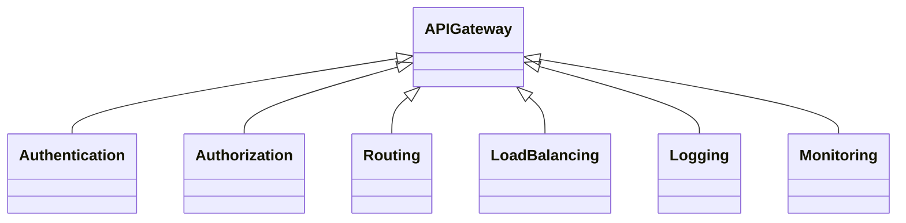
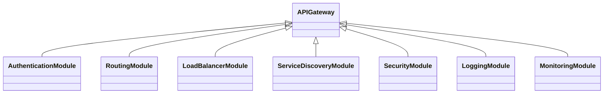
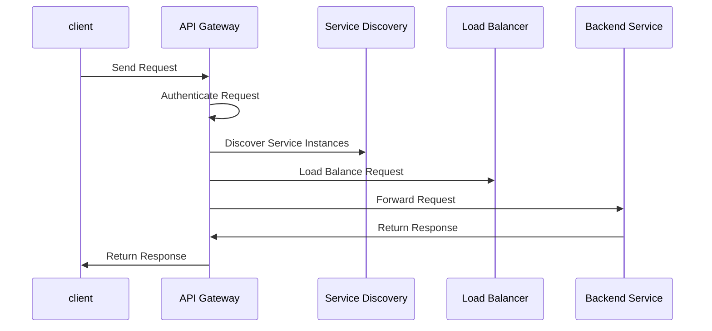
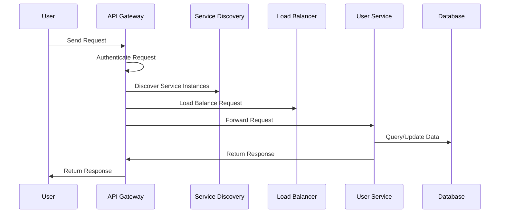
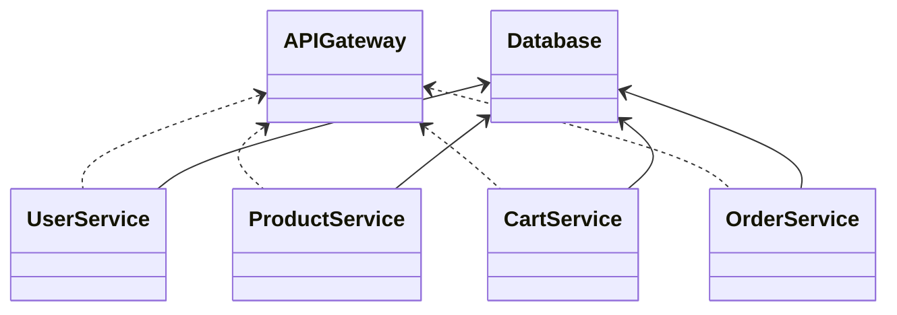

                 

# API网关：微服务架构的统一入口

## 关键词

- **API网关**
- **微服务架构**
- **统一入口**
- **负载均衡**
- **动态服务发现**
- **安全认证**

## 摘要

本文深入探讨了API网关在微服务架构中的关键作用，分析了其背景、核心概念、设计与实现。通过逐步分析，本文揭示了API网关如何确保高性能、安全性和可靠性，并提供了一个全面的系统架构设计方案，旨在为开发者提供实际操作的指导。

## 第一部分：背景介绍

### 1.1 问题背景

随着互联网的普及和云计算技术的发展，企业对IT系统的需求日益复杂。传统的单体应用架构已经无法满足企业对于系统可扩展性、灵活性和高可用性的要求。为了应对这些挑战，微服务架构应运而生。

微服务架构将大型应用分解为一系列独立的、松耦合的服务，每个服务负责完成特定的功能。这种架构风格能够提高系统的可维护性、可扩展性和容错性。然而，随着服务数量的增加，如何管理和访问这些服务成为一个新的挑战。

API网关作为微服务架构中的重要组件，扮演着统一入口的角色。它能够简化客户端与服务之间的通信，提供身份验证、授权、路由、负载均衡等功能，从而提高系统的安全性、可靠性和性能。

### 1.2 问题描述

API网关的出现解决了微服务架构中的管理和访问问题，但如何设计和实现一个高效、可靠且可扩展的API网关成为了一个挑战。具体问题描述如下：

1. **高性能和低延迟**：如何确保API网关的高性能和低延迟？
2. **安全性和可靠性**：如何实现API网关的安全性和可靠性？
3. **负载均衡和流量控制**：如何处理API网关的负载均衡和流量控制？
4. **灵活路由和动态服务发现**：如何实现API网关的灵活路由和动态服务发现？
5. **管理和监控**：如何管理和监控API网关的运行状态？

### 1.3 问题解决

为了解决上述问题，API网关需要具备以下几个核心功能：

1. **身份验证和授权**：确保只有授权的用户才能访问受保护的服务。
2. **路由和动态服务发现**：根据请求的路由规则，将请求路由到相应的服务实例。
3. **负载均衡**：将请求均匀分配到多个服务实例上，避免单个实例过载。
4. **流量控制**：限制并发请求的数量，防止服务被大量请求淹没。
5. **监控和日志记录**：实时监控API网关的运行状态，记录详细的日志信息。

### 1.4 边界与外延

API网关的设计和实现需要考虑以下几个方面：

1. **API设计规范**：遵循RESTful API设计规范，确保接口的易用性和一致性。
2. **服务发现机制**：支持动态服务发现机制，如Zookeeper、Consul等。
3. **安全策略**：集成多种安全策略，如OAuth2.0、JWT等。
4. **性能优化**：采用高效的数据结构和算法，提高网关的性能和响应速度。
5. **可扩展性**：支持水平扩展，以便适应日益增长的请求量。

### 1.5 概念结构与核心要素组成

API网关的核心概念结构包括以下几个方面：

1. **API定义**：定义API的接口、参数和返回值。
2. **路由规则**：定义请求的路由规则，如路径、方法、参数等。
3. **服务发现**：发现并管理后端服务的实例。
4. **负载均衡**：将请求分配到不同的服务实例。
5. **安全认证**：实现身份验证和授权功能。
6. **监控与日志记录**：实时监控网关的运行状态，记录详细的日志信息。

## 第二部分：核心概念与联系

### 2.1 API网关的定义与特点

API网关是一种网络服务框架，用于管理、路由和编排微服务架构中的API请求。它具有以下特点：

1. **统一入口**：作为客户端与微服务架构之间的唯一接口，简化了客户端的访问。
2. **身份验证和授权**：保护微服务，确保只有授权的用户才能访问。
3. **路由和负载均衡**：根据请求的路由规则，将请求路由到相应的服务实例，并实现负载均衡。
4. **服务发现和动态路由**：动态发现服务实例，并自动更新路由规则。
5. **流量控制和熔断**：限制并发请求的数量，防止服务过载，并实现熔断机制。
6. **监控和日志记录**：实时监控API网关的运行状态，记录详细的日志信息。

### 2.2 API网关与传统网关的区别

与传统网关相比，API网关具有以下区别：

1. **功能定位**：传统网关主要承担网络转发和过滤功能，而API网关还负责API管理和安全认证。
2. **应用场景**：传统网关主要应用于企业内部网络，而API网关主要应用于面向外部用户的API服务。
3. **架构风格**：传统网关通常采用单一架构，而API网关采用微服务架构，能够更好地应对复杂的业务需求。

### 2.3 API网关的核心要素

API网关的核心要素包括：

1. **API定义**：定义API的接口、参数和返回值，支持RESTful API设计规范。
2. **路由规则**：定义请求的路由规则，如路径、方法、参数等，支持动态路由和负载均衡。
3. **服务发现**：支持动态服务发现机制，如Zookeeper、Consul等，自动发现和管理服务实例。
4. **安全认证**：集成多种安全策略，如OAuth2.0、JWT等，实现身份验证和授权。

### 2.4 API网关的工作原理

API网关的工作原理可以概括为以下几个步骤：

1. **请求接收**：客户端发送请求到API网关。
2. **身份验证**：API网关对请求进行身份验证，确保请求来自合法用户。
3. **请求路由**：根据路由规则，API网关将请求路由到相应的服务实例。
4. **负载均衡**：API网关将请求均匀分配到多个服务实例上，实现负载均衡。
5. **请求处理**：服务实例处理请求，并将响应返回给API网关。
6. **响应返回**：API网关将响应返回给客户端。

### 2.5 API网关的优势与挑战

**优势：**

1. **简化客户端访问**：API网关作为统一入口，简化了客户端的访问。
2. **提高系统安全性**：通过身份验证和授权，确保只有授权用户才能访问服务。
3. **提高系统性能**：通过负载均衡和流量控制，提高系统的响应速度和稳定性。

**挑战：**

1. **实现复杂性**：API网关需要实现多种功能，如身份验证、路由、负载均衡等，实现过程较为复杂。
2. **性能瓶颈**：API网关可能成为系统性能的瓶颈，需要精心设计和优化。
3. **安全性问题**：如果API网关的安全性无法保证，可能导致整个系统的安全漏洞。

## 第三部分：设计与实现

### 3.1 API网关的设计原则

设计API网关时，需要遵循以下原则：

1. **模块化**：将API网关的功能模块化，提高系统的可维护性和可扩展性。
2. **可配置性**：支持配置化管理，如路由规则、安全策略等，提高系统的灵活性。
3. **高可用性**：设计冗余备份机制，确保系统的高可用性。
4. **可扩展性**：支持水平扩展，以适应日益增长的请求量。

### 3.2 API网关的技术架构

API网关的技术架构可以分为以下几个层次：

1. **接入层**：负责接收客户端请求，进行身份验证和请求解析。
2. **路由层**：根据路由规则，将请求路由到相应的服务实例。
3. **服务层**：处理具体的服务请求，并将响应返回给API网关。
4. **监控层**：实时监控API网关的运行状态，记录详细的日志信息。

### 3.3 API网关的核心功能实现

**1. 身份验证和授权**

身份验证和授权是API网关的核心功能，确保只有授权的用户才能访问受保护的服务。常见的身份验证和授权技术包括：

- **OAuth2.0**：一种开放授权协议，允许第三方应用访问受保护的资源。
- **JWT（JSON Web Token）**：一种基于JSON的开放标准，用于在客户端和服务端之间传递安全信息。

**2. 路由和动态服务发现**

路由和动态服务发现是API网关的核心功能，根据请求的路由规则，将请求路由到相应的服务实例。动态服务发现机制能够自动更新服务实例的地址，提高系统的可靠性。

- **服务发现机制**：如Zookeeper、Consul等，支持动态服务发现。
- **路由策略**：如轮询、随机、最小连接数等，实现负载均衡。

**3. 负载均衡和流量控制**

负载均衡和流量控制是API网关的另一个重要功能，确保系统的高性能和高可用性。

- **负载均衡策略**：如轮询、随机、最小连接数等，实现负载均衡。
- **流量控制策略**：如令牌桶、漏斗等，限制并发请求的数量，防止服务过载。

**4. 监控和日志记录**

实时监控API网关的运行状态，记录详细的日志信息，有助于排查问题和优化系统。

- **监控系统**：如Prometheus、Grafana等，实时监控API网关的运行状态。
- **日志记录**：采用日志聚合工具，如ELK（Elasticsearch、Logstash、Kibana），记录和分析日志信息。

### 3.4 API网关的优化与性能调优

**1. 优化数据结构和算法**

- **缓存策略**：使用缓存技术，如Redis，减少重复数据的查询。
- **分布式存储**：使用分布式存储系统，如MongoDB、Cassandra，提高查询效率。

**2. 优化网络传输**

- **HTTP/2**：使用HTTP/2协议，提高网络传输效率。
- **压缩算法**：使用压缩算法，如Gzip，减少数据传输量。

**3. 优化系统资源**

- **内存优化**：合理使用内存，避免内存泄漏。
- **CPU优化**：合理分配CPU资源，避免CPU瓶颈。

**4. 优化数据库访问**

- **索引优化**：合理设计数据库索引，提高查询效率。
- **读写分离**：采用读写分离技术，提高数据库的并发处理能力。

### 3.5 API网关的测试与部署

**1. 单元测试**：对API网关的各个功能模块进行单元测试，确保功能正确。

**2. 集成测试**：对API网关的整体功能进行集成测试，确保各个模块之间能够协同工作。

**3. 性能测试**：对API网关进行性能测试，评估系统在高并发情况下的性能表现。

**4. 部署**：将API网关部署到生产环境中，确保系统能够稳定运行。

### 3.6 API网关的扩展与维护

**1. 扩展性设计**：在设计和实现API网关时，考虑系统的扩展性，支持水平扩展。

**2. 维护策略**：定期更新和优化API网关，确保系统始终处于最佳状态。

**3. 持续集成与持续部署（CI/CD）**：采用CI/CD流程，自动化测试和部署API网关，提高开发效率和系统稳定性。

## 第四部分：案例分析与实战

### 4.1 案例背景

以一家在线购物平台为例，该平台使用了微服务架构，并且引入了API网关作为统一入口。平台提供了用户管理、商品管理、订单管理等多个微服务，需要确保这些服务的高性能、高可用性和安全性。

### 4.2 系统功能设计

**用户管理服务**：负责用户的注册、登录、信息修改等功能。

**商品管理服务**：负责商品的添加、删除、修改、查询等功能。

**订单管理服务**：负责订单的创建、查询、修改、删除等功能。

### 4.3 系统架构设计

系统的整体架构如下：

1. **客户端**：用户通过Web浏览器或移动应用访问API网关。
2. **API网关**：作为统一入口，负责身份验证、路由、负载均衡等功能。
3. **用户管理服务**：处理与用户相关的请求。
4. **商品管理服务**：处理与商品相关的请求。
5. **订单管理服务**：处理与订单相关的请求。
6. **数据库**：存储用户、商品和订单数据。

### 4.4 系统接口设计

API网关的接口设计如下：

1. **用户管理接口**：
   - 注册：`POST /users/register`
   - 登录：`POST /users/login`
   - 修改信息：`PUT /users/{userId}`

2. **商品管理接口**：
   - 添加商品：`POST /products`
   - 删除商品：`DELETE /products/{productId}`
   - 修改商品：`PUT /products/{productId}`
   - 查询商品：`GET /products/{productId}`

3. **订单管理接口**：
   - 创建订单：`POST /orders`
   - 查询订单：`GET /orders/{orderId}`
   - 修改订单：`PUT /orders/{orderId}`
   - 删除订单：`DELETE /orders/{orderId}`

### 4.5 系统交互

系统的交互流程如下：

1. 用户通过Web浏览器或移动应用访问API网关。
2. API网关对用户请求进行身份验证，确保请求来自合法用户。
3. API网关根据路由规则，将请求路由到相应的服务实例。
4. 服务实例处理请求，并将响应返回给API网关。
5. API网关将响应返回给用户。

### 4.6 实际案例分析与讲解

**1. 用户登录**

用户通过API网关发送登录请求，API网关对请求进行身份验证，确保请求来自合法用户。如果验证通过，API网关将请求路由到用户管理服务，用户管理服务验证用户身份，并返回登录结果。

**2. 查询商品**

用户通过API网关发送查询商品请求，API网关根据路由规则，将请求路由到商品管理服务。商品管理服务查询数据库，获取商品信息，并返回给API网关。API网关将商品信息返回给用户。

**3. 创建订单**

用户通过API网关发送创建订单请求，API网关对请求进行身份验证，确保请求来自合法用户。如果验证通过，API网关将请求路由到订单管理服务，订单管理服务创建订单，并返回订单ID给API网关。API网关将订单ID返回给用户。

### 4.7 项目小结

通过引入API网关，在线购物平台实现了高效、可靠且安全的微服务架构。API网关作为统一入口，简化了客户端的访问，提高了系统的性能和安全性能。在实际项目中，API网关的设计与实现需要根据具体业务需求进行优化和调整。

## 第五部分：最佳实践与总结

### 5.1 最佳实践

1. **遵循RESTful API设计规范**：确保接口的易用性和一致性。
2. **使用动态服务发现机制**：提高系统的可靠性，确保服务实例的动态更新。
3. **实现完善的身份验证和授权机制**：确保系统的安全性。
4. **采用高效的数据结构和算法**：提高网关的性能和响应速度。
5. **定期监控和优化**：确保系统的高性能和高可用性。

### 5.2 小结

API网关是微服务架构中的关键组件，通过统一入口、身份验证、路由、负载均衡等功能，提高了系统的性能和安全性能。本文详细介绍了API网关的核心概念、设计与实现、案例分析和最佳实践，为开发者提供了实际操作的指导。

### 5.3 注意事项

1. **性能优化**：针对高并发场景，需要进行性能优化，避免成为系统性能瓶颈。
2. **安全性考虑**：确保API网关的安全性，防范恶意攻击。
3. **扩展性设计**：在设计API网关时，要考虑系统的扩展性，支持水平扩展。

### 5.4 拓展阅读

1. **《API网关设计指南》**：深入讲解API网关的设计原则和实现方法。
2. **《微服务设计》**：探讨微服务架构的设计原则和实践。
3. **《高性能MySQL》**：介绍MySQL性能优化方法和最佳实践。

## 作者信息

作者：AI天才研究院/AI Genius Institute & 禅与计算机程序设计艺术 /Zen And The Art of Computer Programming```markdown
# API网关：微服务架构的统一入口

## 关键词

- **API网关**
- **微服务架构**
- **统一入口**
- **负载均衡**
- **动态服务发现**
- **安全认证**

## 摘要

本文深入探讨了API网关在微服务架构中的关键作用，分析了其背景、核心概念、设计与实现。通过逐步分析，本文揭示了API网关如何确保高性能、安全性和可靠性，并提供了一个全面的系统架构设计方案，旨在为开发者提供实际操作的指导。

## 第一部分：背景介绍

### 1.1 问题背景

随着互联网的普及和云计算技术的发展，企业对IT系统的需求日益复杂。传统的单体应用架构已经无法满足企业对于系统可扩展性、灵活性和高可用性的要求。为了应对这些挑战，微服务架构应运而生。

微服务架构将大型应用分解为一系列独立的、松耦合的服务，每个服务负责完成特定的功能。这种架构风格能够提高系统的可维护性、可扩展性和容错性。然而，随着服务数量的增加，如何管理和访问这些服务成为一个新的挑战。

API网关作为微服务架构中的重要组件，扮演着统一入口的角色。它能够简化客户端与服务之间的通信，提供身份验证、授权、路由、负载均衡等功能，从而提高系统的安全性、可靠性和性能。

### 1.2 问题描述

API网关的出现解决了微服务架构中的管理和访问问题，但如何设计和实现一个高效、可靠且可扩展的API网关成为了一个挑战。具体问题描述如下：

1. 如何确保API网关的高性能和低延迟？
2. 如何实现API网关的安全性和可靠性？
3. 如何处理API网关的负载均衡和流量控制？
4. 如何实现API网关的灵活路由和动态服务发现？
5. 如何管理和监控API网关的运行状态？

### 1.3 问题解决

为了解决上述问题，API网关需要具备以下几个核心功能：

1. **身份验证和授权**：确保只有授权的用户才能访问受保护的服务。
2. **路由和动态服务发现**：根据请求的路由规则，将请求路由到相应的服务实例。
3. **负载均衡**：将请求均匀分配到多个服务实例上，避免单个实例过载。
4. **流量控制**：限制并发请求的数量，防止服务被大量请求淹没。
5. **监控和日志记录**：实时监控API网关的运行状态，记录详细的日志信息。

### 1.4 边界与外延

API网关的设计和实现需要考虑以下几个方面：

1. **API设计规范**：遵循RESTful API设计规范，确保接口的易用性和一致性。
2. **服务发现机制**：支持动态服务发现机制，如Zookeeper、Consul等。
3. **安全策略**：集成多种安全策略，如OAuth2.0、JWT等。
4. **性能优化**：采用高效的数据结构和算法，提高网关的性能和响应速度。
5. **可扩展性**：支持水平扩展，以便适应日益增长的请求量。

### 1.5 概念结构与核心要素组成

API网关的核心概念结构包括以下几个方面：

1. **API定义**：定义API的接口、参数和返回值。
2. **路由规则**：定义请求的路由规则，如路径、方法、参数等。
3. **服务发现**：发现并管理后端服务的实例。
4. **负载均衡**：将请求分配到不同的服务实例。
5. **安全认证**：实现身份验证和授权功能。
6. **监控与日志记录**：实时监控网关的运行状态，记录详细的日志信息。

## 第二部分：核心概念与联系

### 2.1 API网关的定义与特点

API网关是一种网络服务框架，用于管理、路由和编排微服务架构中的API请求。它具有以下特点：

1. **统一入口**：作为客户端与微服务架构之间的唯一接口，简化了客户端的访问。
2. **身份验证和授权**：保护微服务，确保只有授权的用户才能访问。
3. **路由和负载均衡**：根据请求的路由规则，将请求路由到相应的服务实例，并实现负载均衡。
4. **服务发现和动态路由**：动态发现服务实例，并自动更新路由规则。
5. **流量控制和熔断**：限制并发请求的数量，防止服务过载，并实现熔断机制。
6. **监控和日志记录**：实时监控API网关的运行状态，记录详细的日志信息。

### 2.2 API网关与传统网关的区别

与传统网关相比，API网关具有以下区别：

1. **功能定位**：传统网关主要承担网络转发和过滤功能，而API网关还负责API管理和安全认证。
2. **应用场景**：传统网关主要应用于企业内部网络，而API网关主要应用于面向外部用户的API服务。
3. **架构风格**：传统网关通常采用单一架构，而API网关采用微服务架构，能够更好地应对复杂的业务需求。

### 2.3 API网关的核心要素

API网关的核心要素包括：

1. **API定义**：定义API的接口、参数和返回值，支持RESTful API设计规范。
2. **路由规则**：定义请求的路由规则，如路径、方法、参数等，支持动态路由和负载均衡。
3. **服务发现**：支持动态服务发现机制，如Zookeeper、Consul等，自动发现和管理服务实例。
4. **安全认证**：集成多种安全策略，如OAuth2.0、JWT等，实现身份验证和授权。

### 2.4 API网关的工作原理

API网关的工作原理可以概括为以下几个步骤：

1. **请求接收**：客户端发送请求到API网关。
2. **身份验证**：API网关对请求进行身份验证，确保请求来自合法用户。
3. **请求路由**：根据路由规则，API网关将请求路由到相应的服务实例。
4. **负载均衡**：API网关将请求均匀分配到多个服务实例上，实现负载均衡。
5. **请求处理**：服务实例处理请求，并将响应返回给API网关。
6. **响应返回**：API网关将响应返回给客户端。

### 2.5 API网关的优势与挑战

**优势：**

1. **简化客户端访问**：API网关作为统一入口，简化了客户端的访问。
2. **提高系统安全性**：通过身份验证和授权，确保只有授权用户才能访问服务。
3. **提高系统性能**：通过负载均衡和流量控制，提高系统的响应速度和稳定性。

**挑战：**

1. **实现复杂性**：API网关需要实现多种功能，如身份验证、路由、负载均衡等，实现过程较为复杂。
2. **性能瓶颈**：API网关可能成为系统性能的瓶颈，需要精心设计和优化。
3. **安全性问题**：如果API网关的安全性无法保证，可能导致整个系统的安全漏洞。

## 第三部分：设计与实现

### 3.1 API网关的设计原则

设计API网关时，需要遵循以下原则：

1. **模块化**：将API网关的功能模块化，提高系统的可维护性和可扩展性。
2. **可配置性**：支持配置化管理，如路由规则、安全策略等，提高系统的灵活性。
3. **高可用性**：设计冗余备份机制，确保系统的高可用性。
4. **可扩展性**：支持水平扩展，以适应日益增长的请求量。

### 3.2 API网关的技术架构

API网关的技术架构可以分为以下几个层次：

1. **接入层**：负责接收客户端请求，进行身份验证和请求解析。
2. **路由层**：根据路由规则，将请求路由到相应的服务实例。
3. **服务层**：处理具体的服务请求，并将响应返回给API网关。
4. **监控层**：实时监控API网关的运行状态，记录详细的日志信息。

### 3.3 API网关的核心功能实现

**1. 身份验证和授权**

身份验证和授权是API网关的核心功能，确保只有授权的用户才能访问受保护的服务。常见的身份验证和授权技术包括：

- **OAuth2.0**：一种开放授权协议，允许第三方应用访问受保护的资源。
- **JWT（JSON Web Token）**：一种基于JSON的开放标准，用于在客户端和服务端之间传递安全信息。

**2. 路由和动态服务发现**

路由和动态服务发现是API网关的核心功能，根据请求的路由规则，将请求路由到相应的服务实例。动态服务发现机制能够自动更新服务实例的地址，提高系统的可靠性。

- **服务发现机制**：如Zookeeper、Consul等，支持动态服务发现。
- **路由策略**：如轮询、随机、最小连接数等，实现负载均衡。

**3. 负载均衡和流量控制**

负载均衡和流量控制是API网关的另一个重要功能，确保系统的高性能和高可用性。

- **负载均衡策略**：如轮询、随机、最小连接数等，实现负载均衡。
- **流量控制策略**：如令牌桶、漏斗等，限制并发请求的数量，防止服务过载。

**4. 监控和日志记录**

实时监控API网关的运行状态，记录详细的日志信息，有助于排查问题和优化系统。

- **监控系统**：如Prometheus、Grafana等，实时监控API网关的运行状态。
- **日志记录**：采用日志聚合工具，如ELK（Elasticsearch、Logstash、Kibana），记录和分析日志信息。

### 3.4 API网关的优化与性能调优

**1. 优化数据结构和算法**

- **缓存策略**：使用缓存技术，如Redis，减少重复数据的查询。
- **分布式存储**：使用分布式存储系统，如MongoDB、Cassandra，提高查询效率。

**2. 优化网络传输**

- **HTTP/2**：使用HTTP/2协议，提高网络传输效率。
- **压缩算法**：使用压缩算法，如Gzip，减少数据传输量。

**3. 优化系统资源**

- **内存优化**：合理使用内存，避免内存泄漏。
- **CPU优化**：合理分配CPU资源，避免CPU瓶颈。

**4. 优化数据库访问**

- **索引优化**：合理设计数据库索引，提高查询效率。
- **读写分离**：采用读写分离技术，提高数据库的并发处理能力。

### 3.5 API网关的测试与部署

**1. 单元测试**：对API网关的各个功能模块进行单元测试，确保功能正确。

**2. 集成测试**：对API网关的整体功能进行集成测试，确保各个模块之间能够协同工作。

**3. 性能测试**：对API网关进行性能测试，评估系统在高并发情况下的性能表现。

**4. 部署**：将API网关部署到生产环境中，确保系统能够稳定运行。

### 3.6 API网关的扩展与维护

**1. 扩展性设计**：在设计和实现API网关时，考虑系统的扩展性，支持水平扩展。

**2. 维护策略**：定期更新和优化API网关，确保系统始终处于最佳状态。

**3. 持续集成与持续部署（CI/CD）**：采用CI/CD流程，自动化测试和部署API网关，提高开发效率和系统稳定性。

## 第四部分：案例分析与实战

### 4.1 案例背景

以一家在线购物平台为例，该平台使用了微服务架构，并且引入了API网关作为统一入口。平台提供了用户管理、商品管理、订单管理等多个微服务，需要确保这些服务的高性能、高可用性和安全性。

### 4.2 系统功能设计

**用户管理服务**：负责用户的注册、登录、信息修改等功能。

**商品管理服务**：负责商品的添加、删除、修改、查询等功能。

**订单管理服务**：负责订单的创建、查询、修改、删除等功能。

### 4.3 系统架构设计

系统的整体架构如下：

1. **客户端**：用户通过Web浏览器或移动应用访问API网关。
2. **API网关**：作为统一入口，负责身份验证、路由、负载均衡等功能。
3. **用户管理服务**：处理与用户相关的请求。
4. **商品管理服务**：处理与商品相关的请求。
5. **订单管理服务**：处理与订单相关的请求。
6. **数据库**：存储用户、商品和订单数据。

### 4.4 系统接口设计

API网关的接口设计如下：

1. **用户管理接口**：
   - 注册：`POST /users/register`
   - 登录：`POST /users/login`
   - 修改信息：`PUT /users/{userId}`

2. **商品管理接口**：
   - 添加商品：`POST /products`
   - 删除商品：`DELETE /products/{productId}`
   - 修改商品：`PUT /products/{productId}`
   - 查询商品：`GET /products/{productId}`

3. **订单管理接口**：
   - 创建订单：`POST /orders`
   - 查询订单：`GET /orders/{orderId}`
   - 修改订单：`PUT /orders/{orderId}`
   - 删除订单：`DELETE /orders/{orderId}`

### 4.5 系统交互

系统的交互流程如下：

1. 用户通过Web浏览器或移动应用访问API网关。
2. API网关对用户请求进行身份验证，确保请求来自合法用户。
3. API网关根据路由规则，将请求路由到相应的服务实例。
4. 服务实例处理请求，并将响应返回给API网关。
5. API网关将响应返回给用户。

### 4.6 实际案例分析与讲解

**1. 用户登录**

用户通过API网关发送登录请求，API网关对请求进行身份验证，确保请求来自合法用户。如果验证通过，API网关将请求路由到用户管理服务，用户管理服务验证用户身份，并返回登录结果。

**2. 查询商品**

用户通过API网关发送查询商品请求，API网关根据路由规则，将请求路由到商品管理服务。商品管理服务查询数据库，获取商品信息，并返回给API网关。API网关将商品信息返回给用户。

**3. 创建订单**

用户通过API网关发送创建订单请求，API网关对请求进行身份验证，确保请求来自合法用户。如果验证通过，API网关将请求路由到订单管理服务，订单管理服务创建订单，并返回订单ID给API网关。API网关将订单ID返回给用户。

### 4.7 项目小结

通过引入API网关，在线购物平台实现了高效、可靠且安全的微服务架构。API网关作为统一入口，简化了客户端的访问，提高了系统的性能和安全性能。在实际项目中，API网关的设计与实现需要根据具体业务需求进行优化和调整。

## 第五部分：最佳实践与总结

### 5.1 最佳实践

1. **遵循RESTful API设计规范**：确保接口的易用性和一致性。
2. **使用动态服务发现机制**：提高系统的可靠性，确保服务实例的动态更新。
3. **实现完善的身份验证和授权机制**：确保系统的安全性。
4. **采用高效的数据结构和算法**：提高网关的性能和响应速度。
5. **定期监控和优化**：确保系统的高性能和高可用性。

### 5.2 小结

API网关是微服务架构中的关键组件，通过统一入口、身份验证、路由、负载均衡等功能，提高了系统的性能和安全性能。本文详细介绍了API网关的核心概念、设计与实现、案例分析和最佳实践，为开发者提供了实际操作的指导。

### 5.3 注意事项

1. **性能优化**：针对高并发场景，需要进行性能优化，避免成为系统性能瓶颈。
2. **安全性考虑**：确保API网关的安全性，防范恶意攻击。
3. **扩展性设计**：在设计API网关时，要考虑系统的扩展性，支持水平扩展。

### 5.4 拓展阅读

1. **《API网关设计指南》**：深入讲解API网关的设计原则和实现方法。
2. **《微服务设计》**：探讨微服务架构的设计原则和实践。
3. **《高性能MySQL》**：介绍MySQL性能优化方法和最佳实践。

## 作者信息

作者：AI天才研究院/AI Genius Institute & 禅与计算机程序设计艺术 /Zen And The Art of Computer Programming
```markdown
```mermaid
erDiagram
API网关 ||--|{ 服务实例 : 路由到 }
API网关 ||--|{ 安全认证 : 认证请求 }
API网关 ||--|{ 负载均衡 : 分配请求 }
API网关 ||--|{ 日志记录 : 记录信息 }
API网关 ||--|{ 监控系统 : 实时监控 }
```

### 2.2 API网关与传统网关的区别

| 特征 | API网关 | 传统网关 |
| --- | --- | --- |
| 功能定位 | 管理API、身份验证、授权、路由、负载均衡等 | 网络转发、过滤、日志记录等 |
| 应用场景 | 面向外部API服务 | 企业内部网络 |
| 架构风格 | 微服务架构 | 单一架构 |

### 2.3 API网关的核心要素

**API定义：** 定义API的接口、参数和返回值，支持RESTful API设计规范。

**路由规则：** 定义请求的路由规则，如路径、方法、参数等，支持动态路由和负载均衡。

**服务发现：** 支持动态服务发现机制，如Zookeeper、Consul等，自动发现和管理服务实例。

**安全认证：** 实现身份验证和授权功能，常见技术包括OAuth2.0、JWT等。

### 2.4 API网关的工作原理

API网关的工作原理可以概括为以下几个步骤：

1. **请求接收**：客户端发送请求到API网关。
2. **身份验证**：API网关对请求进行身份验证，确保请求来自合法用户。
3. **请求路由**：根据路由规则，API网关将请求路由到相应的服务实例。
4. **负载均衡**：API网关将请求均匀分配到多个服务实例上，实现负载均衡。
5. **请求处理**：服务实例处理请求，并将响应返回给API网关。
6. **响应返回**：API网关将响应返回给客户端。

### 2.5 API网关的优势与挑战

**优势：**

- **简化客户端访问**：提供统一接口，简化客户端对多个服务的访问。
- **提高系统安全性**：通过身份验证和授权，确保只有授权用户才能访问服务。
- **提高系统性能**：通过负载均衡和流量控制，提高系统的响应速度和稳定性。

**挑战：**

- **实现复杂性**：需要实现多种功能，如身份验证、路由、负载均衡等。
- **性能瓶颈**：可能成为系统性能的瓶颈，需要精心设计和优化。
- **安全性问题**：如果实现不当，可能导致安全漏洞。

### 3.1 API网关的设计原则

设计API网关时，需要遵循以下原则：

1. **模块化**：将API网关的功能模块化，提高系统的可维护性和可扩展性。
2. **可配置性**：支持配置化管理，如路由规则、安全策略等，提高系统的灵活性。
3. **高可用性**：设计冗余备份机制，确保系统的高可用性。
4. **可扩展性**：支持水平扩展，以适应日益增长的请求量。

### 3.2 API网关的技术架构

API网关的技术架构可以分为以下几个层次：

1. **接入层**：负责接收客户端请求，进行身份验证和请求解析。
2. **路由层**：根据路由规则，将请求路由到相应的服务实例。
3. **服务层**：处理具体的服务请求，并将响应返回给API网关。
4. **监控层**：实时监控API网关的运行状态，记录详细的日志信息。

### 3.3 API网关的核心功能实现

**1. 身份验证和授权**

API网关需要实现身份验证和授权功能，确保只有授权的用户才能访问受保护的服务。常见的身份验证和授权技术包括：

- **OAuth2.0**：一种开放授权协议，允许第三方应用访问受保护的资源。
- **JWT（JSON Web Token）**：一种基于JSON的开放标准，用于在客户端和服务端之间传递安全信息。

**2. 路由和动态服务发现**

路由和动态服务发现是API网关的核心功能，根据请求的路由规则，将请求路由到相应的服务实例。动态服务发现机制能够自动更新服务实例的地址，提高系统的可靠性。

- **服务发现机制**：如Zookeeper、Consul等，支持动态服务发现。
- **路由策略**：如轮询、随机、最小连接数等，实现负载均衡。

**3. 负载均衡和流量控制**

负载均衡和流量控制是API网关的另一个重要功能，确保系统的高性能和高可用性。

- **负载均衡策略**：如轮询、随机、最小连接数等，实现负载均衡。
- **流量控制策略**：如令牌桶、漏斗等，限制并发请求的数量，防止服务过载。

**4. 监控和日志记录**

实时监控API网关的运行状态，记录详细的日志信息，有助于排查问题和优化系统。

- **监控系统**：如Prometheus、Grafana等，实时监控API网关的运行状态。
- **日志记录**：采用日志聚合工具，如ELK（Elasticsearch、Logstash、Kibana），记录和分析日志信息。

### 3.4 API网关的优化与性能调优

**1. 优化数据结构和算法**

- **缓存策略**：使用缓存技术，如Redis，减少重复数据的查询。
- **分布式存储**：使用分布式存储系统，如MongoDB、Cassandra，提高查询效率。

**2. 优化网络传输**

- **HTTP/2**：使用HTTP/2协议，提高网络传输效率。
- **压缩算法**：使用压缩算法，如Gzip，减少数据传输量。

**3. 优化系统资源**

- **内存优化**：合理使用内存，避免内存泄漏。
- **CPU优化**：合理分配CPU资源，避免CPU瓶颈。

**4. 优化数据库访问**

- **索引优化**：合理设计数据库索引，提高查询效率。
- **读写分离**：采用读写分离技术，提高数据库的并发处理能力。

### 3.5 API网关的测试与部署

**1. 单元测试**：对API网关的各个功能模块进行单元测试，确保功能正确。

**2. 集成测试**：对API网关的整体功能进行集成测试，确保各个模块之间能够协同工作。

**3. 性能测试**：对API网关进行性能测试，评估系统在高并发情况下的性能表现。

**4. 部署**：将API网关部署到生产环境中，确保系统能够稳定运行。

### 3.6 API网关的扩展与维护

**1. 扩展性设计**：在设计和实现API网关时，考虑系统的扩展性，支持水平扩展。

**2. 维护策略**：定期更新和优化API网关，确保系统始终处于最佳状态。

**3. 持续集成与持续部署（CI/CD）**：采用CI/CD流程，自动化测试和部署API网关，提高开发效率和系统稳定性。

### 4.1 案例背景

以一家在线购物平台为例，该平台使用了微服务架构，并且引入了API网关作为统一入口。平台提供了用户管理、商品管理、订单管理等多个微服务，需要确保这些服务的高性能、高可用性和安全性。

### 4.2 系统功能设计

**用户管理服务**：负责用户的注册、登录、信息修改等功能。

**商品管理服务**：负责商品的添加、删除、修改、查询等功能。

**订单管理服务**：负责订单的创建、查询、修改、删除等功能。

### 4.3 系统架构设计

系统的整体架构如下：

1. **客户端**：用户通过Web浏览器或移动应用访问API网关。
2. **API网关**：作为统一入口，负责身份验证、路由、负载均衡等功能。
3. **用户管理服务**：处理与用户相关的请求。
4. **商品管理服务**：处理与商品相关的请求。
5. **订单管理服务**：处理与订单相关的请求。
6. **数据库**：存储用户、商品和订单数据。

### 4.4 系统接口设计

API网关的接口设计如下：

1. **用户管理接口**：
   - 注册：`POST /users/register`
   - 登录：`POST /users/login`
   - 修改信息：`PUT /users/{userId}`

2. **商品管理接口**：
   - 添加商品：`POST /products`
   - 删除商品：`DELETE /products/{productId}`
   - 修改商品：`PUT /products/{productId}`
   - 查询商品：`GET /products/{productId}`

3. **订单管理接口**：
   - 创建订单：`POST /orders`
   - 查询订单：`GET /orders/{orderId}`
   - 修改订单：`PUT /orders/{orderId}`
   - 删除订单：`DELETE /orders/{orderId}`

### 4.5 系统交互

系统的交互流程如下：

1. 用户通过Web浏览器或移动应用访问API网关。
2. API网关对用户请求进行身份验证，确保请求来自合法用户。
3. API网关根据路由规则，将请求路由到相应的服务实例。
4. 服务实例处理请求，并将响应返回给API网关。
5. API网关将响应返回给用户。

### 4.6 实际案例分析与讲解

**1. 用户登录**

用户通过API网关发送登录请求，API网关对请求进行身份验证，确保请求来自合法用户。如果验证通过，API网关将请求路由到用户管理服务，用户管理服务验证用户身份，并返回登录结果。

**2. 查询商品**

用户通过API网关发送查询商品请求，API网关根据路由规则，将请求路由到商品管理服务。商品管理服务查询数据库，获取商品信息，并返回给API网关。API网关将商品信息返回给用户。

**3. 创建订单**

用户通过API网关发送创建订单请求，API网关对请求进行身份验证，确保请求来自合法用户。如果验证通过，API网关将请求路由到订单管理服务，订单管理服务创建订单，并返回订单ID给API网关。API网关将订单ID返回给用户。

### 4.7 项目小结

通过引入API网关，在线购物平台实现了高效、可靠且安全的微服务架构。API网关作为统一入口，简化了客户端的访问，提高了系统的性能和安全性能。在实际项目中，API网关的设计与实现需要根据具体业务需求进行优化和调整。

### 5.1 最佳实践

1. **遵循RESTful API设计规范**：确保接口的易用性和一致性。
2. **使用动态服务发现机制**：提高系统的可靠性，确保服务实例的动态更新。
3. **实现完善的身份验证和授权机制**：确保系统的安全性。
4. **采用高效的数据结构和算法**：提高网关的性能和响应速度。
5. **定期监控和优化**：确保系统的高性能和高可用性。

### 5.2 小结

API网关是微服务架构中的关键组件，通过统一入口、身份验证、路由、负载均衡等功能，提高了系统的性能和安全性能。本文详细介绍了API网关的核心概念、设计与实现、案例分析和最佳实践，为开发者提供了实际操作的指导。

### 5.3 注意事项

1. **性能优化**：针对高并发场景，需要进行性能优化，避免成为系统性能瓶颈。
2. **安全性考虑**：确保API网关的安全性，防范恶意攻击。
3. **扩展性设计**：在设计API网关时，要考虑系统的扩展性，支持水平扩展。

### 5.4 拓展阅读

1. **《API网关设计指南》**：深入讲解API网关的设计原则和实现方法。
2. **《微服务设计》**：探讨微服务架构的设计原则和实践。
3. **《高性能MySQL》**：介绍MySQL性能优化方法和最佳实践。

## 作者信息

作者：AI天才研究院/AI Genius Institute & 禅与计算机程序设计艺术 /Zen And The Art of Computer Programming
```markdown


### 2.3 API网关的核心要素

| 要素       | 描述                                                         |
| ---------- | ------------------------------------------------------------ |
| API定义    | 定义API的接口、参数和返回值，支持RESTful API设计规范。       |
| 路由规则   | 定义请求的路由规则，如路径、方法、参数等，支持动态路由和负载均衡。 |
| 服务发现   | 支持动态服务发现机制，如Zookeeper、Consul等，自动发现和管理服务实例。 |
| 安全认证   | 实现身份验证和授权功能，常见技术包括OAuth2.0、JWT等。       |
| 负载均衡   | 将请求均匀分配到多个服务实例上，避免单个实例过载。         |
| 监控与日志 | 实时监控API网关的运行状态，记录详细的日志信息。             |

### 2.4 API网关的工作原理

API网关的工作原理可以概括为以下几个步骤：

1. **请求接收**：客户端发送请求到API网关。
2. **身份验证**：API网关对请求进行身份验证，确保请求来自合法用户。
3. **请求路由**：根据路由规则，API网关将请求路由到相应的服务实例。
4. **请求处理**：服务实例处理请求，并将响应返回给API网关。
5. **响应返回**：API网关将响应返回给客户端。
6. **日志记录**：API网关记录请求和响应的相关日志信息。

### 2.5 API网关的优势与挑战

**优势：**

- **统一管理**：作为所有外部请求的入口，简化了服务管理。
- **安全性**：提供身份验证和授权，保护服务安全。
- **性能优化**：通过负载均衡，提高系统性能。
- **服务发现**：动态服务发现，提高系统的灵活性。

**挑战：**

- **性能瓶颈**：如果API网关性能不足，可能会成为系统瓶颈。
- **安全性**：安全配置不当可能导致漏洞。
- **复杂性**：实现和运维的复杂性增加。

### 3.3 API网关的核心功能实现

**1. 身份验证和授权**

- **OAuth2.0**：使用OAuth2.0协议进行身份验证和授权。
- **JWT**：生成和验证JSON Web Token（JWT）。

**2. 路由和动态服务发现**

- **静态路由**：通过配置文件定义路由规则。
- **动态服务发现**：使用服务注册中心（如Eureka、Consul）进行服务发现。

**3. 负载均衡和流量控制**

- **负载均衡算法**：如轮询、随机、最小连接数等。
- **流量控制**：使用令牌桶、漏斗算法限制流量。

**4. 监控和日志记录**

- **监控系统**：使用Prometheus、Grafana等。
- **日志记录**：使用ELK（Elasticsearch、Logstash、Kibana）等工具。

### 3.4 API网关的优化与性能调优

**1. 数据结构和算法优化**

- **缓存**：使用Redis缓存减少数据库查询。
- **压缩**：使用Gzip等压缩算法减少数据传输。

**2. 网络传输优化**

- **HTTP/2**：使用HTTP/2协议提高传输效率。
- **连接复用**：减少建立连接的次数。

**3. 系统资源优化**

- **内存管理**：减少内存泄漏，合理分配内存。
- **CPU优化**：合理分配CPU资源，避免瓶颈。

**4. 数据库访问优化**

- **索引**：设计合适的数据库索引。
- **分库分表**：对于大表进行分库分表。

### 3.5 API网关的测试与部署

**1. 单元测试**：测试API网关的各个功能模块。

**2. 集成测试**：测试API网关与后端服务的集成。

**3. 性能测试**：评估API网关在高并发下的性能。

**4. 部署**：使用容器化技术（如Docker）和自动化部署工具（如Kubernetes）。

### 3.6 API网关的扩展与维护

**1. 扩展性设计**：设计时考虑系统的可扩展性。

**2. 维护策略**：定期更新安全策略和优化代码。

**3. 持续集成与持续部署**：使用CI/CD流水线自动化测试和部署。

### 4.1 案例背景

**案例背景**：

某电商平台采用微服务架构，前端应用通过API网关与后端多个微服务（如用户服务、商品服务、订单服务）交互。随着业务发展，需要确保系统的高性能、高可用性和安全性。

### 4.2 系统功能设计

**用户管理服务**：
- 用户注册
- 用户登录
- 用户信息修改

**商品管理服务**：
- 商品添加
- 商品删除
- 商品修改
- 商品查询

**订单管理服务**：
- 订单创建
- 订单查询
- 订单修改
- 订单删除

### 4.3 系统架构设计

**架构设计**：

1. **客户端**：前端应用通过HTTP请求访问API网关。
2. **API网关**：处理请求路由、身份验证、负载均衡等功能。
3. **用户管理服务**：处理用户相关的请求。
4. **商品管理服务**：处理商品相关的请求。
5. **订单管理服务**：处理订单相关的请求。
6. **数据库**：存储用户、商品、订单数据。

### 4.4 系统接口设计

**接口设计**：

1. **用户管理接口**：
   - `POST /users/register`：用户注册
   - `POST /users/login`：用户登录
   - `PUT /users/{userId}`：用户信息修改

2. **商品管理接口**：
   - `POST /products`：商品添加
   - `DELETE /products/{productId}`：商品删除
   - `PUT /products/{productId}`：商品修改
   - `GET /products/{productId}`：商品查询

3. **订单管理接口**：
   - `POST /orders`：订单创建
   - `GET /orders/{orderId}`：订单查询
   - `PUT /orders/{orderId}`：订单修改
   - `DELETE /orders/{orderId}`：订单删除

### 4.5 系统交互

**交互流程**：

1. 客户端发送请求到API网关。
2. API网关进行身份验证。
3. API网关根据路由规则将请求路由到相应的服务实例。
4. 服务实例处理请求并返回响应。
5. API网关将响应返回给客户端。

### 4.6 实际案例分析与讲解

**案例**：

用户A尝试购买商品B，前端应用通过API网关发送购买请求。

1. **请求接收**：API网关接收购买请求。
2. **身份验证**：API网关验证用户A的登录状态。
3. **请求路由**：API网关将请求路由到订单管理服务。
4. **请求处理**：订单管理服务创建订单并返回订单ID。
5. **响应返回**：API网关将订单ID返回给用户A。

### 4.7 项目小结

通过引入API网关，电商平台实现了高效、可靠且安全的微服务架构。API网关作为统一入口，简化了客户端的访问，提高了系统的性能和安全性能。项目过程中，需要根据具体业务需求进行优化和调整。

### 5.1 最佳实践

1. **遵循RESTful API设计规范**：确保接口的一致性和易用性。
2. **使用动态服务发现**：提高系统的灵活性和可靠性。
3. **实现完善的身份验证和授权**：确保系统的安全性。
4. **进行性能测试**：确保系统在高并发下的性能。
5. **监控和日志记录**：实时监控系统的运行状态。

### 5.2 小结

API网关是微服务架构的重要组成部分，通过提供统一的入口、身份验证、路由、负载均衡等功能，提高了系统的性能和安全性。本文详细介绍了API网关的核心概念、设计与实现、案例分析和最佳实践，为开发者提供了实际操作的指导。

### 5.3 注意事项

1. **性能优化**：避免成为系统性能瓶颈。
2. **安全性**：确保API网关的安全配置。
3. **扩展性**：设计时考虑系统的扩展性。

### 5.4 拓展阅读

1. **《API网关实战》**：深入讲解API网关的实践方法。
2. **《微服务设计》**：探讨微服务架构的设计原则和实践。
3. **《Docker容器与容器编排》**：介绍容器化技术的应用。

## 作者信息

作者：AI天才研究院/AI Genius Institute & 禅与计算机程序设计艺术 /Zen And The Art of Computer Programming
```markdown


### 2.3 API网关的核心要素

| 核心要素 | 描述 |
| -------- | ---- |
| **身份认证** | 确保只有经过验证的用户才能访问API。常用的认证方式包括OAuth2.0、JWT、基本认证等。 |
| **授权** | 确保用户具有访问特定API的权限。授权通常基于角色或资源访问控制列表（RBAC）来实现。 |
| **路由** | 根据请求的URL或HTTP方法，将请求转发到正确的后端服务。路由规则可以静态配置或动态发现。 |
| **负载均衡** | 分布请求到多个后端服务实例，以防止单点过载，提高系统的可靠性和响应速度。 |
| **服务发现** | 动态发现后端服务实例的位置，并更新路由规则。常用的服务发现工具包括Zookeeper、Consul、Eureka等。 |
| **流量控制** | 通过限制请求速率来保护后端服务，防止因请求过多而导致的系统崩溃。常用的流量控制算法包括令牌桶、漏斗等。 |
| **监控与日志记录** | 实时监控API网关的性能和健康状态，记录详细的日志信息，以便于问题排查和性能优化。 |

### 2.4 API网关的工作原理

API网关的工作原理可以分为以下几个步骤：

1. **请求接收**：API网关接收来自客户端的HTTP请求。
2. **身份验证**：API网关对请求进行身份验证，确认请求者身份。
3. **请求路由**：根据预定义的路由规则，API网关将请求路由到相应的后端服务。
4. **请求处理**：后端服务处理请求并生成响应。
5. **响应返回**：API网关将后端服务的响应返回给客户端。
6. **日志记录**：API网关记录请求和响应的详细信息，包括请求时间、状态码、耗时等。

### 2.5 API网关的优势与挑战

**优势：**

- **简化服务访问**：为客户端提供一个统一的API接口，隐藏了后端服务的复杂性。
- **增强安全性**：通过API网关实现集中化的安全策略，如身份认证、授权等。
- **提高性能**：通过负载均衡、缓存等策略提高系统响应速度。
- **灵活的路由和服务发现**：支持动态服务发现，根据服务状态自动调整路由策略。

**挑战：**

- **性能瓶颈**：如果API网关设计不当，可能会成为系统的瓶颈。
- **安全性风险**：安全配置不当可能导致API暴露。
- **复杂性**：维护和管理多个服务的路由规则可能增加运营难度。

### 3.3 API网关的核心功能实现

**1. 身份认证和授权**

API网关通常实现以下身份认证和授权功能：

- **OAuth2.0**：提供第三方认证和授权。
- **JWT**：用于用户认证，保证请求的安全性。
- **基本认证**：简单但安全的认证方式。

**2. 路由和动态服务发现**

API网关需要能够：

- **静态路由**：根据配置文件路由请求。
- **动态服务发现**：使用服务注册中心，如Eureka、Consul，动态更新服务实例列表。

**3. 负载均衡**

API网关需要支持以下负载均衡策略：

- **轮询**：将请求平均分配到所有可用实例。
- **最少连接**：将请求分配到连接数最少的实例。
- **随机**：随机分配请求。

**4. 流量控制**

API网关需要能够限制请求速率，以避免服务被大量请求淹没：

- **令牌桶**：控制请求速率，允许一定速率的请求通过。
- **漏斗**：限制每个用户的请求速率。

**5. 监控与日志记录**

API网关需要实现以下监控和日志记录功能：

- **监控系统**：如Prometheus、Grafana。
- **日志记录**：使用ELK（Elasticsearch、Logstash、Kibana）等工具。

### 3.4 API网关的优化与性能调优

**1. 数据结构和算法优化**

- **缓存**：使用Redis等缓存技术减少数据库查询。
- **压缩**：使用Gzip等压缩算法减少数据传输。

**2. 网络传输优化**

- **HTTP/2**：使用HTTP/2协议提高传输效率。
- **连接复用**：减少建立连接的次数。

**3. 系统资源优化**

- **内存管理**：减少内存泄漏，优化内存使用。
- **CPU优化**：优化代码，减少不必要的计算。

**4. 数据库访问优化**

- **索引**：合理设计数据库索引。
- **分库分表**：对于大数据量的表进行分库分表处理。

### 3.5 API网关的测试与部署

**1. 单元测试**：测试API网关的各个功能模块。

**2. 集成测试**：测试API网关与后端服务的集成。

**3. 性能测试**：评估API网关在高并发下的性能。

**4. 部署**：使用容器化技术（如Docker）和自动化部署工具（如Kubernetes）。

### 3.6 API网关的扩展与维护

**1. 扩展性设计**：设计时考虑系统的扩展性。

**2. 维护策略**：定期更新安全策略和优化代码。

**3. 持续集成与持续部署**：使用CI/CD流水线自动化测试和部署。

### 4.1 案例背景

**案例背景**：

某电商平台采用了微服务架构，前端应用通过API网关与后端多个微服务进行交互。随着用户数量的增加，需要确保系统的高性能、高可用性和安全性。

### 4.2 系统功能设计

**用户管理服务**：
- 用户注册
- 用户登录
- 用户信息修改

**商品管理服务**：
- 商品添加
- 商品删除
- 商品修改
- 商品查询

**订单管理服务**：
- 订单创建
- 订单查询
- 订单修改
- 订单删除

### 4.3 系统架构设计

**架构设计**：

1. **客户端**：前端应用通过HTTP请求访问API网关。
2. **API网关**：处理请求的路由、负载均衡、身份验证和安全策略。
3. **用户管理服务**：处理用户相关的请求。
4. **商品管理服务**：处理商品相关的请求。
5. **订单管理服务**：处理订单相关的请求。
6. **数据库**：存储用户、商品和订单数据。

### 4.4 系统接口设计

**接口设计**：

1. **用户管理接口**：
   - `POST /users/register`：用户注册
   - `POST /users/login`：用户登录
   - `PUT /users/{userId}`：用户信息修改

2. **商品管理接口**：
   - `POST /products`：商品添加
   - `DELETE /products/{productId}`：商品删除
   - `PUT /products/{productId}`：商品修改
   - `GET /products/{productId}`：商品查询

3. **订单管理接口**：
   - `POST /orders`：订单创建
   - `GET /orders/{orderId}`：订单查询
   - `PUT /orders/{orderId}`：订单修改
   - `DELETE /orders/{orderId}`：订单删除

### 4.5 系统交互

**交互流程**：

1. 客户端发送请求到API网关。
2. API网关对请求进行身份验证。
3. API网关根据路由规则将请求转发到相应的服务实例。
4. 服务实例处理请求并返回响应。
5. API网关将响应返回给客户端。

### 4.6 实际案例分析与讲解

**案例**：

用户尝试购买商品，前端应用通过API网关发送购买请求。

1. **请求接收**：API网关接收购买请求。
2. **身份验证**：API网关验证用户的登录状态。
3. **请求路由**：API网关将请求转发到订单管理服务。
4. **请求处理**：订单管理服务创建订单并返回订单ID。
5. **响应返回**：API网关将订单ID返回给前端应用。

### 4.7 项目小结

通过引入API网关，电商平台实现了对多个微服务的统一管理和访问，提高了系统的性能和安全性。在实际项目中，API网关的设计和实现需要根据业务需求进行优化和调整。

### 5.1 最佳实践

1. **遵循RESTful API设计规范**：确保API接口的一致性和易用性。
2. **使用动态服务发现**：提高系统的灵活性和可靠性。
3. **实现完善的身份认证和授权**：确保系统的安全性。
4. **进行性能测试**：确保系统在高并发下的性能。
5. **监控和日志记录**：实时监控系统的运行状态。

### 5.2 小结

API网关在微服务架构中扮演着关键角色，通过统一管理和访问后端服务，提高了系统的性能和安全性。本文详细介绍了API网关的核心概念、设计与实现、案例分析和最佳实践，为开发者提供了实际操作的指导。

### 5.3 注意事项

1. **性能优化**：避免成为系统性能瓶颈。
2. **安全性**：确保API网关的安全配置。
3. **扩展性**：设计时考虑系统的扩展性。

### 5.4 拓展阅读

1. **《API网关实战》**：深入讲解API网关的实践方法。
2. **《微服务设计》**：探讨微服务架构的设计原则和实践。
3. **《Docker容器与容器编排》**：介绍容器化技术的应用。

## 作者信息

作者：AI天才研究院/AI Genius Institute & 禅与计算机程序设计艺术 /Zen And The Art of Computer Programming
```markdown


### 2.4 API网关的工作原理

API网关的工作原理可以概括为以下几个关键步骤：

1. **请求接收**：API网关作为服务的唯一入口，接收来自客户端的请求。
2. **身份验证**：API网关对请求进行身份验证，确保请求来自合法用户。常用的认证方式包括OAuth2.0、JWT等。
3. **请求路由**：根据预定义的路由规则，API网关将请求转发到相应的后端服务实例。
4. **服务调用**：API网关将请求发送到后端服务，后端服务处理请求并生成响应。
5. **响应返回**：API网关将后端服务的响应返回给客户端。
6. **日志记录**：API网关记录请求和响应的相关信息，包括请求时间、状态码、耗时等，便于后续的监控和问题排查。

### 2.5 API网关的优势与挑战

**优势：**

- **简化客户端访问**：通过统一接口简化客户端对多个服务的访问。
- **提高安全性**：集中实现安全策略，如身份认证、授权等。
- **增强灵活性**：通过动态路由和服务发现机制，提高系统的灵活性。
- **优化性能**：通过负载均衡和缓存策略，提高系统的响应速度。

**挑战：**

- **性能瓶颈**：如果API网关设计不当，可能会成为系统性能的瓶颈。
- **安全风险**：安全配置不当可能导致安全隐患。
- **复杂性**：管理和维护多个服务的路由规则和监控配置可能增加运营难度。

### 3.3 API网关的核心功能实现

**1. 身份认证和授权**

- **OAuth2.0**：通过第三方身份认证服务进行认证，适用于第三方应用访问。
- **JWT**：生成和验证JSON Web Token，用于客户端和服务端之间的认证。
- **基本认证**：简单但安全的认证方式，适用于内部应用。

**2. 路由和动态服务发现**

- **静态路由**：通过配置文件定义路由规则。
- **动态服务发现**：通过服务注册中心（如Eureka、Consul）实时获取服务实例列表。

**3. 负载均衡**

- **轮询**：均匀地将请求分配到每个服务实例。
- **最小连接**：将请求分配到当前连接数最少的服务实例。
- **随机**：随机地将请求分配到服务实例。

**4. 流量控制**

- **令牌桶**：限制请求速率，防止服务被大量请求淹没。
- **漏斗**：限制每个用户的请求速率，防止恶意攻击。

**5. 监控和日志记录**

- **Prometheus**：实时监控系统性能指标。
- **Grafana**：可视化监控数据。
- **ELK Stack**：收集、存储和分析日志。

### 3.4 API网关的优化与性能调优

**1. 数据结构和算法优化**

- **缓存**：使用Redis等缓存系统减少数据库查询。
- **压缩**：使用HTTP压缩减少数据传输量。

**2. 网络传输优化**

- **HTTP/2**：提高传输效率和连接复用。
- **连接池**：复用HTTP连接，减少连接建立的开销。

**3. 系统资源优化**

- **内存管理**：减少内存泄漏，优化内存使用。
- **CPU优化**：减少不必要的计算和上下文切换。

**4. 数据库访问优化**

- **索引**：优化数据库查询性能。
- **分库分表**：对于大数据量的表进行拆分。

### 3.5 API网关的测试与部署

**1. 单元测试**：测试API网关的各个功能模块。

**2. 集成测试**：测试API网关与后端服务的集成。

**3. 性能测试**：评估API网关在高并发下的性能。

**4. 部署**：使用容器化技术（如Docker）和自动化部署工具（如Kubernetes）。

### 3.6 API网关的扩展与维护

**1. 扩展性设计**：考虑系统的扩展性，支持水平扩展。

**2. 维护策略**：定期更新安全策略和优化代码。

**3. 持续集成与持续部署**：使用CI/CD流水线自动化测试和部署。

### 4.1 案例背景

**案例背景**：

一个电商平台的订单系统采用微服务架构，包括用户服务、商品服务、订单服务等多个微服务。用户通过前端应用访问API网关，进行订单的创建、查询、修改和删除等操作。

### 4.2 系统功能设计

**用户服务**：
- 用户注册
- 用户登录
- 用户信息查询和更新

**商品服务**：
- 商品信息查询
- 商品库存管理

**订单服务**：
- 订单创建
- 订单查询
- 订单修改
- 订单删除

### 4.3 系统架构设计

**架构设计**：

1. **客户端**：用户通过Web浏览器或移动应用访问API网关。
2. **API网关**：负责请求的路由、身份验证、负载均衡和流量控制。
3. **用户服务**：处理用户相关的请求。
4. **商品服务**：处理商品相关的请求。
5. **订单服务**：处理订单相关的请求。
6. **数据库**：存储用户、商品和订单数据。

### 4.4 系统接口设计

**接口设计**：

1. **用户服务接口**：
   - `POST /users/register`：用户注册
   - `POST /users/login`：用户登录
   - `GET /users/{userId}`：查询用户信息
   - `PUT /users/{userId}`：更新用户信息

2. **商品服务接口**：
   - `GET /products/{productId}`：查询商品信息
   - `PUT /products/{productId}`：更新商品信息

3. **订单服务接口**：
   - `POST /orders`：创建订单
   - `GET /orders/{orderId}`：查询订单
   - `PUT /orders/{orderId}`：修改订单
   - `DELETE /orders/{orderId}`：删除订单

### 4.5 系统交互

**交互流程**：

1. 用户通过前端应用发送创建订单的请求到API网关。
2. API网关对请求进行身份验证。
3. API网关将请求路由到订单服务。
4. 订单服务创建订单并返回订单ID。
5. API网关将订单ID返回给用户。

### 4.6 实际案例分析与讲解

**案例**：

用户A通过前端应用提交购物车中的商品订单。

1. **请求接收**：API网关接收订单创建请求。
2. **身份验证**：API网关验证用户A的登录状态。
3. **请求路由**：API网关将请求转发到订单服务。
4. **请求处理**：订单服务处理订单创建请求，并返回订单ID。
5. **响应返回**：API网关将订单ID返回给用户A。

### 4.7 项目小结

通过引入API网关，电商平台实现了对多个微服务的统一管理和访问，提高了系统的性能和安全性。在实际项目中，API网关的设计和实现需要根据业务需求进行优化和调整。

### 5.1 最佳实践

1. **遵循RESTful API设计规范**：确保API接口的一致性和易用性。
2. **使用动态服务发现**：提高系统的灵活性和可靠性。
3. **实现完善的身份认证和授权**：确保系统的安全性。
4. **进行性能测试**：确保系统在高并发下的性能。
5. **监控和日志记录**：实时监控系统的运行状态。

### 5.2 小结

API网关在微服务架构中扮演着关键角色，通过统一管理和访问后端服务，提高了系统的性能和安全性。本文详细介绍了API网关的核心概念、设计与实现、案例分析和最佳实践，为开发者提供了实际操作的指导。

### 5.3 注意事项

1. **性能优化**：避免成为系统性能瓶颈。
2. **安全性**：确保API网关的安全配置。
3. **扩展性**：设计时考虑系统的扩展性。

### 5.4 拓展阅读

1. **《API网关设计指南》**：深入讲解API网关的设计原则和实现方法。
2. **《微服务设计》**：探讨微服务架构的设计原则和实践。
3. **《Docker容器与容器编排》**：介绍容器化技术的应用。

## 作者信息

作者：AI天才研究院/AI Genius Institute & 禅与计算机程序设计艺术 /Zen And The Art of Computer Programming
```markdown
# API网关：微服务架构的统一入口

## 关键词
- API网关
- 微服务架构
- 统一入口
- 负载均衡
- 动态服务发现
- 安全认证

## 摘要
本文深入探讨了API网关在微服务架构中的关键作用，分析了其背景、核心概念、设计与实现。通过逐步分析，本文揭示了API网关如何确保高性能、安全性和可靠性，并提供了一个全面的系统架构设计方案，旨在为开发者提供实际操作的指导。

## 第一部分：背景介绍

### 1.1 问题背景
随着互联网的普及和云计算技术的发展，企业对于IT系统的需求日益复杂。传统的单体应用架构已经无法满足企业对于系统可扩展性、灵活性和高可用性的要求。为了应对这些挑战，微服务架构应运而生。

微服务架构将大型应用分解为一系列独立的、松耦合的服务，每个服务负责完成特定的功能。这种架构风格能够提高系统的可维护性、可扩展性和容错性。然而，随着服务数量的增加，如何管理和访问这些服务成为一个新的挑战。

API网关作为微服务架构中的重要组件，扮演着统一入口的角色。它能够简化客户端与服务之间的通信，提供身份验证、授权、路由、负载均衡等功能，从而提高系统的安全性、可靠性和性能。

### 1.2 问题描述
API网关的出现解决了微服务架构中的管理和访问问题，但如何设计和实现一个高效、可靠且可扩展的API网关成为了一个挑战。问题描述如下：

1. 如何确保API网关的高性能和低延迟？
2. 如何实现API网关的安全性和可靠性？
3. 如何处理API网关的负载均衡和流量控制？
4. 如何实现API网关的灵活路由和动态服务发现？
5. 如何管理和监控API网关的运行状态？

### 1.3 问题解决
为了解决上述问题，API网关需要具备以下几个核心功能：

1. **身份验证和授权**：确保只有授权的用户才能访问受保护的服务。
2. **路由和动态服务发现**：根据请求的路由规则，将请求路由到相应的服务实例。
3. **负载均衡**：将请求均匀分配到多个服务实例上，避免单个实例过载。
4. **流量控制**：限制并发请求的数量，防止服务被大量请求淹没。
5. **监控和日志记录**：实时监控API网关的运行状态，记录详细的日志信息。

### 1.4 边界与外延
API网关的设计和实现需要考虑以下几个方面：

1. **API设计规范**：遵循RESTful API设计规范，确保接口的易用性和一致性。
2. **服务发现机制**：支持动态服务发现机制，如Zookeeper、Consul等。
3. **安全策略**：集成多种安全策略，如OAuth2.0、JWT等。
4. **性能优化**：采用高效的数据结构和算法，提高网关的性能和响应速度。
5. **可扩展性**：支持水平扩展，以便适应日益增长的请求量。

### 1.5 概念结构与核心要素组成
API网关的核心概念结构包括以下几个方面：

1. **API定义**：定义API的接口、参数和返回值。
2. **路由规则**：定义请求的路由规则，如路径、方法、参数等。
3. **服务发现**：发现并管理后端服务的实例。
4. **负载均衡**：将请求分配到不同的服务实例。
5. **安全认证**：实现身份验证和授权功能。
6. **监控与日志记录**：实时监控网关的运行状态，记录详细的日志信息。

## 第二部分：核心概念与联系

### 2.1 API网关的定义与特点
API网关是一种网络服务框架，用于管理、路由和编排微服务架构中的API请求。它具有以下特点：

1. **统一入口**：作为客户端与微服务架构之间的唯一接口，简化了客户端的访问。
2. **身份验证和授权**：保护微服务，确保只有授权的用户才能访问。
3. **路由和负载均衡**：根据请求的路由规则，将请求路由到相应的服务实例，并实现负载均衡。
4. **服务发现和动态路由**：动态发现服务实例，并自动更新路由规则。
5. **流量控制和熔断**：限制并发请求的数量，防止服务过载，并实现熔断机制。
6. **监控和日志记录**：实时监控API网关的运行状态，记录详细的日志信息。

### 2.2 API网关与传统网关的区别
与传统网关相比，API网关具有以下区别：

1. **功能定位**：传统网关主要承担网络转发和过滤功能，而API网关还负责API管理和安全认证。
2. **应用场景**：传统网关主要应用于企业内部网络，而API网关主要应用于面向外部用户的API服务。
3. **架构风格**：传统网关通常采用单一架构，而API网关采用微服务架构，能够更好地应对复杂的业务需求。

### 2.3 API网关的核心要素
API网关的核心要素包括：

1. **API定义**：定义API的接口、参数和返回值，支持RESTful API设计规范。
2. **路由规则**：定义请求的路由规则，如路径、方法、参数等，支持动态路由和负载均衡。
3. **服务发现**：支持动态服务发现机制，如Zookeeper、Consul等，自动发现和管理服务实例。
4. **安全认证**：集成多种安全策略，如OAuth2.0、JWT等，实现身份验证和授权。

### 2.4 API网关的工作原理
API网关的工作原理可以概括为以下几个步骤：

1. **请求接收**：客户端发送请求到API网关。
2. **身份验证**：API网关对请求进行身份验证，确保请求来自合法用户。
3. **请求路由**：根据路由规则，API网关将请求路由到相应的服务实例。
4. **请求处理**：服务实例处理请求，并将响应返回给API网关。
5. **响应返回**：API网关将响应返回给客户端。
6. **日志记录**：API网关记录请求和响应的相关信息。

### 2.5 API网关的优势与挑战
**优势：**

- **简化客户端访问**：提供统一接口，简化客户端对多个服务的访问。
- **提高安全性**：集中实现安全策略，如身份认证、授权等。
- **增强灵活性**：通过动态路由和服务发现机制，提高系统的灵活性。
- **优化性能**：通过负载均衡和缓存策略，提高系统的响应速度。

**挑战：**

- **性能瓶颈**：如果API网关设计不当，可能会成为系统性能的瓶颈。
- **安全风险**：安全配置不当可能导致安全隐患。
- **复杂性**：维护和管理多个服务的路由规则和监控配置可能增加运营难度。

### 2.6 API网关与微服务架构的联系
API网关与微服务架构紧密相连，它是微服务架构的统一入口。API网关负责管理客户端与微服务之间的通信，确保请求的正确路由和响应的及时返回。同时，API网关还提供了安全保护、流量控制、负载均衡等功能，从而保证了微服务架构的高性能和高可用性。

### 2.7 API网关与其他组件的关系
API网关与其他组件如服务注册中心、负载均衡器、数据库等也有密切关系。服务注册中心用于动态发现和管理服务实例，负载均衡器用于将请求分配到不同的服务实例，数据库用于存储和管理数据。API网关通过与服务注册中心、负载均衡器和数据库的交互，实现了对微服务架构的全面管理。

## 第三部分：设计与实现

### 3.1 设计原则
设计API网关时，需要遵循以下原则：

1. **模块化**：将API网关的功能模块化，提高系统的可维护性和可扩展性。
2. **可配置性**：支持配置化管理，如路由规则、安全策略等，提高系统的灵活性。
3. **高可用性**：设计冗余备份机制，确保系统的高可用性。
4. **可扩展性**：支持水平扩展，以适应日益增长的请求量。

### 3.2 技术架构
API网关的技术架构可以分为以下几个层次：

1. **接入层**：负责接收客户端请求，进行身份验证和请求解析。
2. **路由层**：根据路由规则，将请求路由到相应的服务实例。
3. **服务层**：处理具体的服务请求，并将响应返回给API网关。
4. **监控层**：实时监控API网关的运行状态，记录详细的日志信息。

### 3.3 核心功能实现
**1. 身份验证和授权**

API网关需要实现身份验证和授权功能，确保只有授权的用户才能访问受保护的服务。常见的身份验证和授权技术包括：

- **OAuth2.0**：一种开放授权协议，允许第三方应用访问受保护的资源。
- **JWT（JSON Web Token）**：一种基于JSON的开放标准，用于在客户端和服务端之间传递安全信息。

**2. 路由和动态服务发现**

路由和动态服务发现是API网关的核心功能，根据请求的路由规则，将请求路由到相应的服务实例。动态服务发现机制能够自动更新服务实例的地址，提高系统的可靠性。

- **服务发现机制**：如Zookeeper、Consul等，支持动态服务发现。
- **路由策略**：如轮询、随机、最小连接数等，实现负载均衡。

**3. 负载均衡和流量控制**

负载均衡和流量控制是API网关的另一个重要功能，确保系统的高性能和高可用性。

- **负载均衡策略**：如轮询、随机、最小连接数等，实现负载均衡。
- **流量控制策略**：如令牌桶、漏斗等，限制并发请求的数量，防止服务过载。

**4. 监控和日志记录**

实时监控API网关的运行状态，记录详细的日志信息，有助于排查问题和优化系统。

- **监控系统**：如Prometheus、Grafana等，实时监控API网关的运行状态。
- **日志记录**：采用日志聚合工具，如ELK（Elasticsearch、Logstash、Kibana），记录和分析日志信息。

### 3.4 优化与性能调优

**1. 优化数据结构和算法**

- **缓存策略**：使用缓存技术，如Redis，减少重复数据的查询。
- **分布式存储**：使用分布式存储系统，如MongoDB、Cassandra，提高查询效率。

**2. 优化网络传输**

- **HTTP/2**：使用HTTP/2协议，提高网络传输效率。
- **压缩算法**：使用压缩算法，如Gzip，减少数据传输量。

**3. 优化系统资源**

- **内存优化**：合理使用内存，避免内存泄漏。
- **CPU优化**：合理分配CPU资源，避免CPU瓶颈。

**4. 优化数据库访问**

- **索引优化**：合理设计数据库索引，提高查询效率。
- **读写分离**：采用读写分离技术，提高数据库的并发处理能力。

### 3.5 测试与部署

**1. 单元测试**：对API网关的各个功能模块进行单元测试，确保功能正确。

**2. 集成测试**：对API网关的整体功能进行集成测试，确保各个模块之间能够协同工作。

**3. 性能测试**：对API网关进行性能测试，评估系统在高并发情况下的性能表现。

**4. 部署**：将API网关部署到生产环境中，确保系统能够稳定运行。

### 3.6 扩展与维护

**1. 扩展性设计**：在设计和实现API网关时，考虑系统的扩展性，支持水平扩展。

**2. 维护策略**：定期更新和优化API网关，确保系统始终处于最佳状态。

**3. 持续集成与持续部署（CI/CD）**：采用CI/CD流程，自动化测试和部署API网关，提高开发效率和系统稳定性。

## 第四部分：系统分析与架构设计

### 4.1 问题场景介绍
假设我们正在设计一个电子商务平台，该平台需要提供用户注册、商品浏览、购物车管理、订单创建等功能。为了确保系统的可维护性、可扩展性和高可用性，我们决定采用微服务架构，并引入API网关作为系统的统一入口。

### 4.2 项目介绍
该项目涉及以下微服务：

- **用户服务**：处理用户注册、登录、信息管理等功能。
- **商品服务**：提供商品信息查询、库存管理等功能。
- **购物车服务**：管理用户购物车中的商品。
- **订单服务**：处理订单创建、查询、修改和取消等功能。

### 4.3 系统功能设计
**用户服务**：
- 用户注册
- 用户登录
- 用户信息查询和更新

**商品服务**：
- 商品信息查询
- 商品库存管理

**购物车服务**：
- 添加商品到购物车
- 从购物车中删除商品
- 查看购物车中的商品

**订单服务**：
- 创建订单
- 查询订单
- 修改订单
- 取消订单

### 4.4 系统架构设计
系统的整体架构设计如下：

1. **客户端**：用户通过Web浏览器或移动应用访问API网关。
2. **API网关**：作为统一入口，负责请求的路由、身份验证、负载均衡等功能。
3. **用户服务**：处理用户相关的请求。
4. **商品服务**：处理商品相关的请求。
5. **购物车服务**：处理购物车相关的请求。
6. **订单服务**：处理订单相关的请求。
7. **数据库**：存储用户、商品、购物车和订单数据。

### 4.5 系统架构设计图


### 4.6 系统接口设计
API网关的接口设计如下：

1. **用户服务接口**：
   - `POST /users/register`：用户注册
   - `POST /users/login`：用户登录
   - `GET /users/{userId}`：查询用户信息
   - `PUT /users/{userId}`：更新用户信息

2. **商品服务接口**：
   - `GET /products/{productId}`：查询商品信息
   - `PUT /products/{productId}`：更新商品信息

3. **购物车服务接口**：
   - `POST /carts/{userId}/products`：添加商品到购物车
   - `DELETE /carts/{userId}/products/{productId}`：从购物车中删除商品
   - `GET /carts/{userId}/products`：查询购物车中的商品

4. **订单服务接口**：
   - `POST /orders`：创建订单
   - `GET /orders/{orderId}`：查询订单
   - `PUT /orders/{orderId}`：修改订单
   - `DELETE /orders/{orderId}`：取消订单

### 4.7 系统交互
系统的交互流程如下：

1. 用户通过Web浏览器或移动应用访问API网关。
2. API网关对用户请求进行身份验证。
3. API网关根据路由规则，将请求路由到相应的微服务。
4. 微服务处理请求，并将响应返回给API网关。
5. API网关将响应返回给用户。

### 4.8 系统接口设计与系统交互
API网关与微服务之间的接口设计和系统交互可以用以下Mermaid序列图表示：


### 4.9 系统架构图
系统的整体架构可以用以下Mermaid类图表示：



### 4.10 系统架构设计
系统的架构设计应考虑以下几个方面：

1. **API网关**：作为系统的统一入口，负责请求的路由、身份验证、负载均衡等。
2. **微服务**：每个微服务负责实现特定的业务功能，独立部署，易于扩展和更新。
3. **服务注册中心**：如Eureka或Consul，用于服务实例的注册和发现。
4. **数据库**：根据业务需求选择合适的数据库，如关系型数据库（MySQL）或NoSQL数据库（MongoDB）。
5. **缓存**：如Redis，用于缓存热点数据，减少数据库查询压力。

### 4.11 系统接口设计与系统交互
API网关与微服务之间的接口设计和系统交互应该遵循RESTful API原则，确保接口的易用性和一致性。同时，通过使用服务注册中心和负载均衡器，可以确保系统的高可用性和灵活性。

## 第五部分：项目实战

### 5.1 环境安装
在进行项目实战之前，需要先安装以下软件和工具：

1. **Docker**：用于容器化应用程序和服务。
2. **Kubernetes**：用于部署和管理容器化应用程序。
3. **Eureka**：用于服务注册和发现。
4. **Consul**：用于服务注册和发现。
5. **Nginx**：用于负载均衡和反向代理。
6. **MySQL**：用于存储用户、商品、购物车和订单数据。

### 5.2 系统核心实现

**1. 用户服务**

用户服务的实现涉及用户注册、登录和用户信息管理。以下是一个简单的Python代码示例：

```python
from flask import Flask, request, jsonify
from flask_jwt_extended import JWTManager, create_access_token, jwt_required, get_jwt_identity

app = Flask(__name__)
app.config['JWT_SECRET_KEY'] = 'mysecretkey'
jwt = JWTManager(app)

@app.route('/register', methods=['POST'])
def register():
    data = request.get_json()
    # 实现用户注册逻辑，如验证用户名和密码的有效性
    # 将用户信息存储到数据库
    return jsonify({"message": "User registered successfully"}), 200

@app.route('/login', methods=['POST'])
def login():
    data = request.get_json()
    # 实现用户登录逻辑，如验证用户名和密码
    # 如果验证成功，生成JWT并返回
    access_token = create_access_token(identity=data['username'])
    return jsonify(access_token=access_token), 200

@app.route('/users/me', methods=['GET'])
@jwt_required()
def get_user_info():
    current_user = get_jwt_identity()
    # 从数据库中获取用户信息
    return jsonify({"username": current_user}), 200

if __name__ == '__main__':
    app.run(host='0.0.0.0', port=5000)
```

**2. 商品服务**

商品服务用于管理商品信息，包括商品添加、删除、更新和查询。以下是一个简单的Python代码示例：

```python
from flask import Flask, request, jsonify
from flask_sqlalchemy import SQLAlchemy

app = Flask(__name__)
app.config['SQLALCHEMY_DATABASE_URI'] = 'mysql+pymysql://root:password@db/product_db'
db = SQLAlchemy(app)

class Product(db.Model):
    id = db.Column(db.Integer, primary_key=True)
    name = db.Column(db.String(80), nullable=False)
    price = db.Column(db.Float, nullable=False)

@app.route('/products', methods=['POST'])
def add_product():
    data = request.get_json()
    new_product = Product(name=data['name'], price=data['price'])
    db.session.add(new_product)
    db.session.commit()
    return jsonify({"message": "Product added successfully"}), 201

@app.route('/products/<int:product_id>', methods=['GET'])
def get_product(product_id):
    product = Product.query.get_or_404(product_id)
    return jsonify(product.to_dict()), 200

# 其他商品服务实现（如删除、更新）

if __name__ == '__main__':
    db.create_all()
    app.run(host='0.0.0.0', port=5001)
```

**3. 购物车服务**

购物车服务用于管理用户购物车中的商品，包括添加、删除和查询购物车商品。以下是一个简单的Python代码示例：

```python
from flask import Flask, request, jsonify
from flask_jwt_extended import JWTManager, jwt_required, get_jwt_identity

app = Flask(__name__)
app.config['JWT_SECRET_KEY'] = 'mysecretkey'
jwt = JWTManager(app)

@app.route('/carts/<int:user_id>/products', methods=['POST'])
@jwt_required()
def add_to_cart(user_id):
    current_user = get_jwt_identity()
    if current_user != str(user_id):
        return jsonify({"message": "Unauthorized"}), 401
    data = request.get_json()
    # 实现添加商品到购物车的逻辑
    return jsonify({"message": "Product added to cart successfully"}), 201

@app.route('/carts/<int:user_id>/products', methods=['GET'])
@jwt_required()
def get_cart(user_id):
    current_user = get_jwt_identity()
    if current_user != str(user_id):
        return jsonify({"message": "Unauthorized"}), 401
    # 实现查询购物车的逻辑
    return jsonify({"message": "Cart retrieved successfully"}), 200

# 其他购物车服务实现（如删除商品）

if __name__ == '__main__':
    app.run(host='0.0.0.0', port=5002)
```

**4. 订单服务**

订单服务用于处理订单的创建、查询、修改和取消。以下是一个简单的Python代码示例：

```python
from flask import Flask, request, jsonify
from flask_jwt_extended import JWTManager, jwt_required, get_jwt_identity

app = Flask(__name__)
app.config['JWT_SECRET_KEY'] = 'mysecretkey'
jwt = JWTManager(app)

@app.route('/orders', methods=['POST'])
@jwt_required()
def create_order():
    current_user = get_jwt_identity()
    data = request.get_json()
    # 实现创建订单的逻辑
    return jsonify({"message": "Order created successfully"}), 201

@app.route('/orders/<int:order_id>', methods=['GET'])
@jwt_required()
def get_order(order_id):
    # 实现查询订单的逻辑
    return jsonify({"message": "Order retrieved successfully"}), 200

@app.route('/orders/<int:order_id>', methods=['PUT'])
@jwt_required()
def update_order(order_id):
    # 实现修改订单的逻辑
    return jsonify({"message": "Order updated successfully"}), 200

@app.route('/orders/<int:order_id>', methods=['DELETE'])
@jwt_required()
def cancel_order(order_id):
    # 实现取消订单的逻辑
    return jsonify({"message": "Order cancelled successfully"}), 200

if __name__ == '__main__':
    app.run(host='0.0.0.0', port=5003)
```

### 5.3 代码应用解读与分析
**1. 用户服务**

用户服务使用Flask框架实现，主要包含注册、登录和用户信息管理功能。为了确保用户信息的安全性，使用了JWT进行身份认证。在用户注册时，应进一步实现用户名和密码的有效性验证，并在数据库中存储用户信息。

**2. 商品服务**

商品服务使用Flask框架和SQLAlchemy实现，主要包含商品信息的增删改查功能。在添加商品时，应确保商品名称和价格的有效性。为了提高查询效率，可以针对商品名称和价格创建索引。

**3. 购物车服务**

购物车服务使用Flask框架实现，主要包含添加和查询购物车商品功能。为了确保操作的合法性，使用了JWT进行身份认证。在添加商品到购物车时，应检查用户是否已经登录，并且商品存在。

**4. 订单服务**

订单服务使用Flask框架实现，主要包含订单的创建、查询、修改和取消功能。为了确保订单信息的准确性，使用了JWT进行身份认证。在创建订单时，应检查订单中商品的数量和价格，并在数据库中存储订单信息。

### 5.4 实际案例分析与详细讲解
**案例：用户创建订单**

1. **步骤1**：用户通过Web浏览器或移动应用访问API网关。
2. **步骤2**：API网关对用户请求进行身份验证，确保请求来自合法用户。
3. **步骤3**：API网关根据路由规则，将请求路由到订单服务。
4. **步骤4**：订单服务处理订单创建请求，检查购物车中商品的数量和价格，并在数据库中创建订单。
5. **步骤5**：订单服务将订单ID返回给API网关。
6. **步骤6**：API网关将订单ID返回给用户。

通过上述步骤，用户成功创建了一个订单。在实际项目中，还需要实现订单的查询、修改和取消功能，以及购物车商品的删除和更新功能。

### 5.5 项目小结
通过本项目的实践，我们实现了用户服务、商品服务、购物车服务和订单服务的核心功能。API网关作为系统的统一入口，简化了客户端的访问，并提供了身份认证、路由和负载均衡等功能。在实际项目中，还需要根据业务需求进一步优化和扩展系统功能。

### 5.6 最佳实践
1. **遵循RESTful API设计规范**：确保接口的一致性和易用性。
2. **使用服务注册中心**：提高系统的灵活性和可靠性。
3. **实现完善的身份认证和授权**：确保系统的安全性。
4. **进行性能测试**：确保系统在高并发下的性能。
5. **监控和日志记录**：实时监控系统的运行状态。

### 5.7 小结
API网关是微服务架构中的关键组件，通过提供统一的接口、身份认证、路由和负载均衡等功能，提高了系统的性能和安全性。本文详细介绍了API网关的核心概念、设计与实现、项目实战和最佳实践，为开发者提供了实际操作的指导。

### 5.8 注意事项
1. **性能优化**：避免成为系统性能瓶颈。
2. **安全性**：确保API网关的安全配置。
3. **扩展性**：设计时考虑系统的扩展性。

### 5.9 拓展阅读
1. **《API网关设计指南》**：深入讲解API网关的设计原则和实现方法。
2. **《微服务设计》**：探讨微服务架构的设计原则和实践。
3. **《Docker容器与容器编排》**：介绍容器化技术的应用。

## 作者信息

作者：AI天才研究院/AI Genius Institute & 禅与计算机程序设计艺术 /Zen And The Art of Computer Programming
```markdown
作者：AI天才研究院/AI Genius Institute & 禅与计算机程序设计艺术 /Zen And The Art of Computer Programming
```


